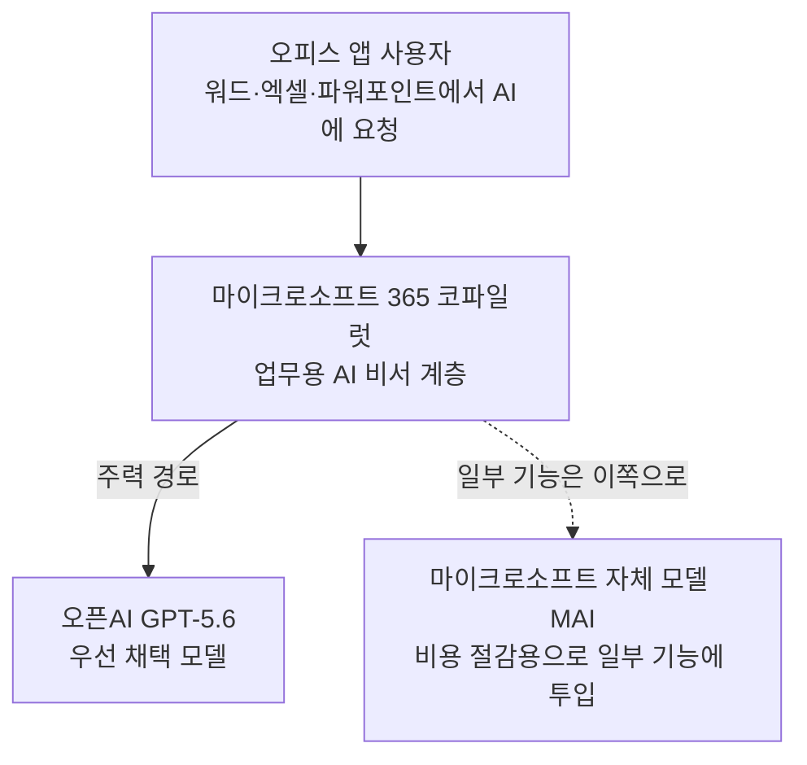

<aside class="ai-knowledge-sidebar">
  
CATEGORIES

  <nav class="ai-cat-tree">

에이전트 오케스트레이션7
<ul><li><a href="https://altjs4510.github.io/ai_news_blog/knowledge/20260709/">2026-07-09mvanhorn/last30days-skill — Reddit·X·YouTube·HN·…</a></li><li><a href="https://altjs4510.github.io/ai_news_blog/knowledge/20260707/">2026-07-07AI Hero Skills Catalog — 실무 엔지니어를 위한 재사용 가능한 판단 …</a></li><li><a href="https://altjs4510.github.io/ai_news_blog/knowledge/20260623/">2026-06-23bytedance/deer-flow — 샌드박스·메모리·서브에이전트·메시지 게이트웨이를…</a></li><li><a href="https://altjs4510.github.io/ai_news_blog/knowledge/20260611/">2026-06-11The evolution of agentic surfaces: building with…</a></li><li><a href="https://altjs4510.github.io/ai_news_blog/knowledge/20260602/">2026-06-02revfactory/harness — 도메인별 에이전트 팀과 스킬을 자동 설계하는 메타…</a></li><li><a href="https://altjs4510.github.io/ai_news_blog/knowledge/20260529/">2026-05-29Introducing dynamic workflows in Claude Code</a></li><li><a href="https://altjs4510.github.io/ai_news_blog/knowledge/20260507/">2026-05-07ruvnet/ruflo — Claude 멀티 에이전트 오케스트레이션 플랫폼</a></li></ul>

MCP &amp; 도구 통합20
<ul><li><a href="https://altjs4510.github.io/ai_news_blog/knowledge/20260802/">2026-08-02Stateless MCP has recaptured my interest (and in…</a></li><li><a href="https://altjs4510.github.io/ai_news_blog/knowledge/20260801/">2026-08-01different-ai/openwork — Claude Cowork의 오픈소스 대체 에…</a></li><li><a href="https://altjs4510.github.io/ai_news_blog/knowledge/20260731/">2026-07-31different-ai/openwork — Claude Cowork의 오픈소스 대안(o…</a></li><li><a href="https://altjs4510.github.io/ai_news_blog/knowledge/20260729/">2026-07-29Bringing MCP 2026-07-28 to Claude</a></li><li><a href="https://altjs4510.github.io/ai_news_blog/knowledge/20260724/">2026-07-24diegosouzapw/OmniRoute — 단일 엔드포인트로 278+ 프로바이더·50…</a></li><li><a href="https://altjs4510.github.io/ai_news_blog/knowledge/20260723/">2026-07-23diegosouzapw/OmniRoute — 268+ 프로바이더를 단일 엔드포인트로 묶…</a></li><li><a href="https://altjs4510.github.io/ai_news_blog/knowledge/20260721/">2026-07-21tirth8205/code-review-graph — 로컬 우선 코드 인텔리전스 그래프…</a></li><li><a href="https://altjs4510.github.io/ai_news_blog/knowledge/20260719/">2026-07-19tirth8205/code-review-graph — 로컬 우선 코드 인텔리전스 그래프…</a></li><li><a href="https://altjs4510.github.io/ai_news_blog/knowledge/20260718/">2026-07-18tirth8205/code-review-graph — MCP·CLI용 로컬 코드 인텔리…</a></li><li><a href="https://altjs4510.github.io/ai_news_blog/knowledge/20260708/">2026-07-08Expanding Managed Agents in Gemini API: backgrou…</a></li><li><a href="https://altjs4510.github.io/ai_news_blog/knowledge/20260701/">2026-07-01Google OKF (Open Knowledge Format) — 벤더 중립 에이전트 …</a></li><li><a href="https://altjs4510.github.io/ai_news_blog/knowledge/20260618/">2026-06-18DeusData/codebase-memory-mcp — 158개 언어 코드베이스를 밀리…</a></li><li><a href="https://altjs4510.github.io/ai_news_blog/knowledge/20260606/">2026-06-06chopratejas/headroom — Compress tool outputs, lo…</a></li><li><a href="https://altjs4510.github.io/ai_news_blog/knowledge/20260605/">2026-06-05chopratejas/headroom — Compress tool outputs, lo…</a></li><li><a href="https://altjs4510.github.io/ai_news_blog/knowledge/20260604/">2026-06-04chopratejas/headroom — Compress tool outputs bef…</a></li><li><a href="https://altjs4510.github.io/ai_news_blog/knowledge/20260603/">2026-06-03How Bad MCP design cost your Agent 5× more token…</a></li><li><a href="https://altjs4510.github.io/ai_news_blog/knowledge/20260523/">2026-05-23colbymchenry/codegraph — 사전 인덱싱된 코드 지식 그래프 MCP</a></li><li><a href="https://altjs4510.github.io/ai_news_blog/knowledge/20260517/">2026-05-17I gave my LLM 100,000+ tools — Lazy Discovery &a…</a></li><li><a href="https://altjs4510.github.io/ai_news_blog/knowledge/20260509/">2026-05-09How to connect 100 MCP servers without the conte…</a></li><li><a href="https://altjs4510.github.io/ai_news_blog/knowledge/20260506/">2026-05-06mksglu/context-mode — AI 코딩 에이전트용 컨텍스트 윈도우 최적화</a></li></ul>

코딩 에이전트17
<ul><li><a href="https://altjs4510.github.io/ai_news_blog/knowledge/20260804/">2026-08-04esengine/DeepSeek-Reasonix — prefix-cache 안정성을 축…</a></li><li><a href="https://altjs4510.github.io/ai_news_blog/knowledge/20260728/">2026-07-28alibaba/open-code-review — 결정론적 파이프라인 + LLM 에이전트…</a></li><li><a href="https://altjs4510.github.io/ai_news_blog/knowledge/20260725/">2026-07-25The new rules of context engineering for Claude …</a></li><li><a href="https://altjs4510.github.io/ai_news_blog/knowledge/20260722/">2026-07-22tirth8205/code-review-graph — MCP·CLI용 로컬 우선 코드 …</a></li><li><a href="https://altjs4510.github.io/ai_news_blog/knowledge/20260714/">2026-07-14Graphify-Labs/graphify — 코드베이스를 질의 가능한 지식 그래프로 만…</a></li><li><a href="https://altjs4510.github.io/ai_news_blog/knowledge/20260705/">2026-07-05openai/codex-plugin-cc — Claude Code에서 Codex를 위임…</a></li><li><a href="https://altjs4510.github.io/ai_news_blog/knowledge/20260626/">2026-06-26google-labs-code/design.md — 코딩 에이전트에게 디자인 시스템을 …</a></li><li><a href="https://altjs4510.github.io/ai_news_blog/knowledge/20260619/">2026-06-19Claude Code now supports artifacts</a></li><li><a href="https://altjs4510.github.io/ai_news_blog/knowledge/20260530/">2026-05-30Leonxlnx/taste-skill — AI에게 좋은 취향을 부여해 generic s…</a></li><li><a href="https://altjs4510.github.io/ai_news_blog/knowledge/20260528/">2026-05-28Building self-improving tax agents with Codex</a></li><li><a href="https://altjs4510.github.io/ai_news_blog/knowledge/20260526/">2026-05-26colbymchenry/codegraph — Pre-indexed code knowle…</a></li><li><a href="https://altjs4510.github.io/ai_news_blog/knowledge/20260524/">2026-05-24colbymchenry/codegraph — Pre-indexed code knowle…</a></li><li><a href="https://altjs4510.github.io/ai_news_blog/knowledge/20260521/">2026-05-21colbymchenry/codegraph — Pre-indexed code knowle…</a></li><li><a href="https://altjs4510.github.io/ai_news_blog/knowledge/20260512/">2026-05-12agentmemory — Persistent memory for AI coding ag…</a></li><li><a href="https://altjs4510.github.io/ai_news_blog/knowledge/20260510/">2026-05-10addyosmani/agent-skills — Production-grade engin…</a></li><li><a href="https://altjs4510.github.io/ai_news_blog/knowledge/20260508/">2026-05-08addyosmani/agent-skills — Production-grade engin…</a></li><li><a href="https://altjs4510.github.io/ai_news_blog/knowledge/20260505/">2026-05-05mattpocock/skills — Skills for Real Engineers (.…</a></li></ul>

모델 &amp; 연구6
<ul><li><a href="https://altjs4510.github.io/ai_news_blog/knowledge/20260716-proprag/">2026-07-16PropRAG — 프로포지션 경로 위 beam search로 멀티홉 검색 안내</a></li><li><a href="https://altjs4510.github.io/ai_news_blog/knowledge/20260620/">2026-06-20zai-org/GLM-5 — From Vibe Coding to Agentic Engi…</a></li><li><a href="https://altjs4510.github.io/ai_news_blog/knowledge/20260617/">2026-06-17Predicting model behavior before release by simu…</a></li><li><a href="https://altjs4510.github.io/ai_news_blog/knowledge/20260610/">2026-06-10Fable 5 just made cost-aware model routing manda…</a></li><li><a href="https://altjs4510.github.io/ai_news_blog/knowledge/20260516/">2026-05-16STALE — 에이전트가 자기 기억의 유효성을 인지할 수 있는가</a></li><li><a href="https://altjs4510.github.io/ai_news_blog/knowledge/20260513/">2026-05-13Thinking Machines' Native Interaction Models — T…</a></li></ul>

인프라 &amp; 컴퓨트3
<ul><li><a href="https://altjs4510.github.io/ai_news_blog/knowledge/20260630/">2026-06-30Introducing the Claude apps gateway for Amazon B…</a></li><li><a href="https://altjs4510.github.io/ai_news_blog/knowledge/20260522/">2026-05-22Giving Agents Computers — Ivan Burazin, Daytona</a></li><li><a href="https://altjs4510.github.io/ai_news_blog/knowledge/20260520/">2026-05-20New in Claude Managed Agents: self-hosted sandbo…</a></li></ul>

보안 &amp; 거버넌스14
<ul><li><a href="https://altjs4510.github.io/ai_news_blog/knowledge/20260730/">2026-07-30Anatomy of a Frontier Lab Agent Intrusion: A Tec…</a></li><li><a href="https://altjs4510.github.io/ai_news_blog/knowledge/20260716/">2026-07-16Dicklesworthstone/destructive_command_guard — 에이…</a></li><li><a href="https://altjs4510.github.io/ai_news_blog/knowledge/20260715/">2026-07-15Dicklesworthstone/destructive_command_guard — 에이…</a></li><li><a href="https://altjs4510.github.io/ai_news_blog/knowledge/20260710/">2026-07-1070개 MCP 서버 strace 런타임 감사 — 부팅 시 아웃바운드 호출 서버 적발</a></li><li><a href="https://altjs4510.github.io/ai_news_blog/knowledge/20260704/">2026-07-04Cloudflare is about to block AI agents by defaul…</a></li><li><a href="https://altjs4510.github.io/ai_news_blog/knowledge/20260703/">2026-07-03Giving admins more visibility and control over C…</a></li><li><a href="https://altjs4510.github.io/ai_news_blog/knowledge/20260625/">2026-06-25Agent identity in Claude Tag: a new access model…</a></li><li><a href="https://altjs4510.github.io/ai_news_blog/knowledge/20260624/">2026-06-24Agent identity in Claude Tag: a new access model…</a></li><li><a href="https://altjs4510.github.io/ai_news_blog/knowledge/20260614/">2026-06-14NVIDIA/SkillSpector — Security scanner for AI ag…</a></li><li><a href="https://altjs4510.github.io/ai_news_blog/knowledge/20260613/">2026-06-13Fable 5's guardrails got bypassed in 48 hours — …</a></li><li><a href="https://altjs4510.github.io/ai_news_blog/knowledge/20260612/">2026-06-12NVIDIA/SkillSpector — AI 에이전트 스킬용 보안 스캐너</a></li><li><a href="https://altjs4510.github.io/ai_news_blog/knowledge/20260607/">2026-06-07OpenAI Help: Lockdown Mode</a></li><li><a href="https://altjs4510.github.io/ai_news_blog/knowledge/20260531/">2026-05-31How we contain Claude across products</a></li><li><a href="https://altjs4510.github.io/ai_news_blog/knowledge/20260527/">2026-05-27Microsoft Copilot Cowork Exfiltrates Files</a></li></ul>

응용 사례7
<ul><li><a href="https://altjs4510.github.io/ai_news_blog/knowledge/20260805/">2026-08-05TencentCloud/TencentDB-Agent-Memory — 대화·문서·코드를 …</a></li><li><a href="https://altjs4510.github.io/ai_news_blog/knowledge/20260726/">2026-07-26citrolabs/ego-lite — 로그인된 브라우저 상태를 AI 에이전트와 공유하는…</a></li><li><a href="https://altjs4510.github.io/ai_news_blog/knowledge/20260717/">2026-07-17After a year building agent memory, 'save everyt…</a></li><li><a href="https://altjs4510.github.io/ai_news_blog/knowledge/20260712/">2026-07-12Do Automated Evals Work?</a></li><li><a href="https://altjs4510.github.io/ai_news_blog/knowledge/20260621/">2026-06-21calesthio/OpenMontage — 12 파이프라인·52 도구·500+ 스킬을 …</a></li><li><a href="https://altjs4510.github.io/ai_news_blog/knowledge/20260609/">2026-06-09Building intelligent apps for Apple platforms wi…</a></li><li><a href="https://altjs4510.github.io/ai_news_blog/knowledge/20260514/">2026-05-14Introducing Claude for Small Business</a></li></ul>

산업 동향6
<ul><li><a href="https://altjs4510.github.io/ai_news_blog/knowledge/20260711/" class="current">2026-07-11OpenAI says GPT 5.6 is the 'preferred model' for…</a></li><li><a href="https://altjs4510.github.io/ai_news_blog/knowledge/20260702/">2026-07-02How Cursor deploys AI inside the enterprise (For…</a></li><li><a href="https://altjs4510.github.io/ai_news_blog/knowledge/20260616/">2026-06-16Why AI hasn't replaced software engineers, and w…</a></li><li><a href="https://altjs4510.github.io/ai_news_blog/knowledge/20260519/">2026-05-19Anthropic acquires Stainless</a></li><li><a href="https://altjs4510.github.io/ai_news_blog/knowledge/20260515/">2026-05-15Clawdmeter — Claude Code 사용량을 데스크톱 대시보드로</a></li><li><a href="https://altjs4510.github.io/ai_news_blog/knowledge/20260504/">2026-05-04Agents for Everything Else: Codex for Knowledge …</a></li></ul>
</nav>
</aside>

<article class="ai-knowledge-article">

<header class="ai-post-hero">
  
<a class="ai-back" href="../">KNOWLEDGE</a> · 2026-07-11 · 오늘의 학습

  <h2 class="ai-post-title">OpenAI says GPT 5.6 is the 'preferred model' for Microsoft Copilot 365</h2>
</header>

> 원문: [OpenAI says GPT 5.6 is the 'preferred model' for Microsoft Copilot 365](https://techcrunch.com/2026/07/09/openai-says-gpt-5-6-is-the-preferred-model-for-microsoft-copilot-amid-breakup-chatter/)

## 📌 학습 정리

### 1. 한 줄로 말하면

오픈AI(OpenAI)가 새 모델을 내놓으면서 "마이크로소프트 오피스 안의 AI 비서는 계속 우리 걸 쓸 거예요"라고 공식적으로 못을 박은 이야기입니다. 두 회사가 갈라선다는 소문이 돌던 참에 나온 발표라 더 눈길을 끕니다.

### 2. 왜 이게 만들어졌어요?

오픈AI와 마이크로소프트(Microsoft)는 몇 년째 아주 가까운 파트너로 알려져 있었어요. 워드나 엑셀 같은 오피스 앱에 붙어 있는 AI 비서인 코파일럿(Copilot)도 오픈AI의 모델로 돌아가고 있었습니다. 그런데 얼마 전 블룸버그(Bloomberg)가 [마이크로소프트가 비용을 줄이려고 자체 개발한 모델(MAI)로 일부 기능을 갈아끼우고 있다고 보도](https://techcrunch.com/2026/07/07/microsoft-joins-ai-cost-cutting-trend-by-relying-more-on-its-own-models/)하면서 "두 회사 사이가 벌어지는 것 아니냐"는 [엇갈린 신호](https://finance.yahoo.com/markets/article/microsoft-and-openais-relationship-continues-to-crumble-183330195.html)가 흘러나왔습니다. 이번 발표는 그런 결별설을 잠재우려는 오픈AI 쪽의 응답에 가깝습니다. 새 모델인 GPT-5.6을 공개하면서, 이 모델이 마이크로소프트 365 코파일럿의 "우선 채택 모델(preferred model)"이 될 거라고 밝힌 거예요.

### 3. 비유로 풀면

이건 마치 오래 붙어 다니던 두 친구 중 한 명이 "요즘 우리 사이 안 좋다더라" 소문이 돌자, 공식 SNS에 "우린 여전히 베프예요"라고 사진을 올린 상황과 비슷합니다. 다만 자세히 보면 "베프이긴 한데, 얘가 다른 친구도 만나고 있는 건 사실"인 뉘앙스가 남아 있어요.

그래서 결국, 오피스 앱 안의 AI 비서는 앞으로도 오픈AI 모델이 주력으로 돌아가지만, 마이크로소프트가 자체 모델을 곁들여 쓰는 흐름 자체가 뒤집힌 건 아니라는 이야기입니다.

### 4. 어떻게 작동하는지 (그림으로)

사용자가 오피스 앱 안에서 AI 기능을 부르면 코파일럿이라는 중간 계층이 요청을 받아서, 어떤 모델에게 답을 시킬지 정합니다. 이번 발표의 요점은 "그 판단의 기본값이 GPT-5.6"이라는 거고, 그렇다고 마이크로소프트가 자체 모델을 쓰지 않는다는 뜻은 아니라는 점이 기사에서 계속 강조됩니다.

### 5. 처음 보는 용어 풀이

- **GPT-5.6** — 오픈AI가 이번에 새로 내놓은 언어 모델 계열의 최신 버전입니다. 이번 이야기의 주인공이자, 오피스 앱 코파일럿의 기본 두뇌 역할을 맡게 됐다는 모델이에요. 별도의 [출시 기사](https://techcrunch.com/2026/07/09/openai-launches-its-new-family-of-models-with-gpt-5-6/)에서 자세히 다뤄집니다.
- **마이크로소프트 365 코파일럿 (Microsoft 365 Copilot)** — 워드, 엑셀, 파워포인트 같은 마이크로소프트 오피스 앱 안에 붙어 있는 AI 비서 기능의 이름입니다. 문서 요약, 표 분석, 슬라이드 초안 만들기 같은 걸 대신 해줍니다.
- **우선 채택 모델 (preferred model)** — 이번 발표에서 오픈AI가 쓴 표현인데, 사실 정확한 의미는 기사에서도 "완전히 명확하지는 않다"고 짚습니다. 대략 "오피스 앱 코파일럿이 기본으로 부르는 AI 두뇌는 이 모델"이라는 정도의 뜻으로 읽으면 됩니다. 다른 모델을 아예 못 쓴다는 뜻은 아니에요.
- **MAI** — 마이크로소프트가 자체적으로 만든 사내 AI 모델 계열의 이름입니다. 외부(오픈AI) 모델을 계속 빌려 쓰는 데 드는 비용을 줄이려고, 워드·엑셀 등 일부 기능에 자기네 모델을 대신 넣기 시작했다고 보도된 그 모델입니다.
- **Cowork** — 오픈AI 블로그가 언급한 마이크로소프트 생산성 앱 목록에 함께 등장한 이름입니다. 워드·엑셀·파워포인트와 나란히 언급되는, 마이크로소프트 계열의 협업/생산성 도구로 소개됩니다.
- **인 브리프 (In Brief)** — 테크크런치(TechCrunch)에서 짧은 속보성 글에 붙이는 카테고리 이름입니다. 이 기사도 그 형식이라 분량이 짧고 배경 해설보다 사실 전달 위주라는 점을 감안해서 읽으면 좋아요.

### 6. 한 발 더 들어가고 싶다면

- [마이크로소프트가 자체 모델로 비용을 줄이고 있다는 원 보도](https://techcrunch.com/2026/07/07/microsoft-joins-ai-cost-cutting-trend-by-relying-more-on-its-own-models/) — 이번 "우선 채택 모델" 발표가 왜 나왔는지 배경이 되는 사건을 볼 수 있어요.
- [오픈AI가 GPT-5.6 계열을 공개한 기사](https://techcrunch.com/2026/07/09/openai-launches-its-new-family-of-models-with-gpt-5-6/) — 이 발표의 주인공인 새 모델 자체에 대한 소개를 볼 수 있어요.
- [오픈AI 공식 블로그 글](https://openai.com/index/gpt-5-6-preferred-model-microsoft-365-copilot/) — 오픈AI가 직접 어떤 문구로 파트너십을 재확인했는지 원문으로 확인할 수 있어요.
- [두 회사 관계에 대한 엇갈린 신호를 다룬 야후 파이낸스(Yahoo Finance) 기사](https://finance.yahoo.com/markets/article/microsoft-and-openais-relationship-continues-to-crumble-183330195.html) — "결별설"이라는 배경 분위기를 좀 더 이해할 수 있어요.

---

## 📖 원문 전체 번역 (정독용)

> 의역 최소화한 전체 번역입니다. 큰 흐름은 위 정리에서 잡고, 정확한 워딩이 필요할 땐 이 섹션에서 정독하세요.

# OpenAI, GPT 5.6이 Microsoft Copilot 365의 '우선 모델'이라고 밝혀 — 결별설 속에서

이번 주 초, Bloomberg는 Microsoft가 비용 절감을 위해 OpenAI의 소프트웨어 일부를 자체 개발 모델로 교체하고 있다고 보도했다. MAI로 불리는 이 자체 모델들이 Word와 Excel 같은 앱을 구동하는 데 활용되고 있다고 해당 매체는 전했다.

이 보도는 한때 떼려야 뗄 수 없는 관계로 여겨졌던 두 회사에 대해 점점 자주 제기되는 질문을 다시 불러일으켰다. 두 회사는 최근 자신들의 관계에 대해 엇갈린 신호를 보내고 있다: 과연 두 회사는 서로 멀어지고 있는 것일까?

이제 OpenAI가 그러한 결별 암시를 잠재우려 나섰다. 목요일 OpenAI가 GPT 5.6을 출시하면서, 이 모델이 Microsoft 365 Copilot을 구동하는 "우선 모델(preferred model)"이 될 것이라고 발표했다.

OpenAI는 관련 블로그 게시물에서 GPT 5.6이 Word, Excel, PowerPoint, Cowork 등 Microsoft의 생산성 앱 전반에 걸쳐 사용자를 지원할 것이라고 밝혔다.

"Microsoft와의 파트너십은 항상 더 많은 개인과 조직에 첨단 AI의 혜택을 가져다주는 것을 목표로 해왔으며, 우리는 그 공동의 약속을 바탕으로 계속해서 발전해 나가게 되어 기쁩니다"라고 OpenAI는 기술했다.

"우선 모델"이 실제로 무엇을 의미하는지는 OpenAI의 소프트웨어가 계속해서 Microsoft의 앱을 구동할 것이라는 점 외에는 명확하지 않다.

다만, ChatGPT의 소프트웨어가 Microsoft의 앱 구동을 중단할 것이라는 보도가 있었던 것은 아니다. 단지 Microsoft가 비용 절감을 위해 자체 소프트웨어에 점점 더 의존하고 있다는 내용이었을 뿐이다. 이번 "우선 모델" 발표가 이전 보도 내용을 부정하는 것으로는 보이지 않는다.

</article>

<!-- ai-related-links -->
<aside class="ai-related-links">
  
관련 학습

  <ul><li><a href="https://altjs4510.github.io/ai_news_blog/knowledge/20260527/">2026-05-27Microsoft Copilot Cowork Exfiltrates Files</a></li><li><a href="https://altjs4510.github.io/ai_news_blog/knowledge/20260607/">2026-06-07OpenAI Help: Lockdown Mode</a></li></ul>
</aside>
<!-- /ai-related-links -->
