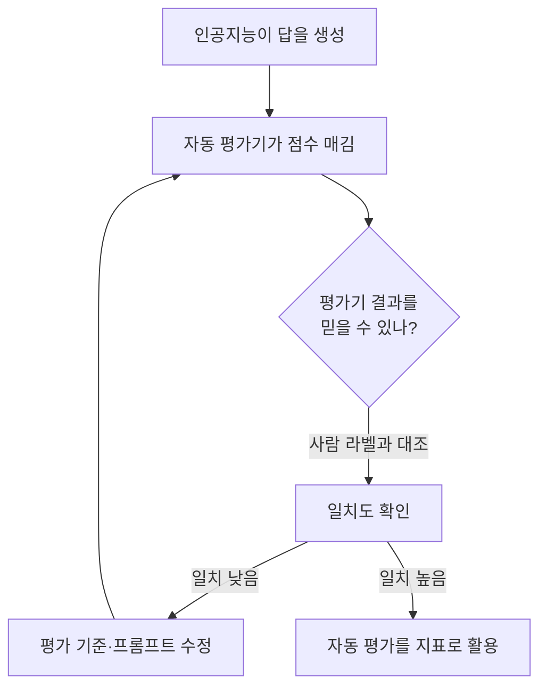

<aside class="ai-knowledge-sidebar">
  
CATEGORIES

  <nav class="ai-cat-tree">

에이전트 오케스트레이션5
<ul><li><a href="https://altjs4510.github.io/ai_news_blog/knowledge/20260623/">2026-06-23bytedance/deer-flow — 샌드박스·메모리·서브에이전트·메시지 게이트웨이를…</a></li><li><a href="https://altjs4510.github.io/ai_news_blog/knowledge/20260610/">2026-06-10Fable 5 just made cost-aware model routing manda…</a></li><li><a href="https://altjs4510.github.io/ai_news_blog/knowledge/20260602/">2026-06-02revfactory/harness — 도메인별 에이전트 팀과 스킬을 자동 설계하는 메타…</a></li><li><a href="https://altjs4510.github.io/ai_news_blog/knowledge/20260529/">2026-05-29Introducing dynamic workflows in Claude Code</a></li><li><a href="https://altjs4510.github.io/ai_news_blog/knowledge/20260507/">2026-05-07ruvnet/ruflo — Claude 멀티 에이전트 오케스트레이션 플랫폼</a></li></ul>

MCP &amp; 도구 통합19
<ul><li><a href="https://altjs4510.github.io/ai_news_blog/knowledge/20260802/">2026-08-02Stateless MCP has recaptured my interest (and in…</a></li><li><a href="https://altjs4510.github.io/ai_news_blog/knowledge/20260801/">2026-08-01different-ai/openwork — Claude Cowork의 오픈소스 대체 에…</a></li><li><a href="https://altjs4510.github.io/ai_news_blog/knowledge/20260731/">2026-07-31different-ai/openwork — Claude Cowork의 오픈소스 대안(o…</a></li><li><a href="https://altjs4510.github.io/ai_news_blog/knowledge/20260729/">2026-07-29Bringing MCP 2026-07-28 to Claude</a></li><li><a href="https://altjs4510.github.io/ai_news_blog/knowledge/20260724/">2026-07-24diegosouzapw/OmniRoute — 단일 엔드포인트로 278+ 프로바이더·50…</a></li><li><a href="https://altjs4510.github.io/ai_news_blog/knowledge/20260722/">2026-07-22tirth8205/code-review-graph — MCP·CLI용 로컬 우선 코드 …</a></li><li><a href="https://altjs4510.github.io/ai_news_blog/knowledge/20260719/">2026-07-19tirth8205/code-review-graph — 로컬 우선 코드 인텔리전스 그래프…</a></li><li><a href="https://altjs4510.github.io/ai_news_blog/knowledge/20260718/">2026-07-18tirth8205/code-review-graph — MCP·CLI용 로컬 코드 인텔리…</a></li><li><a href="https://altjs4510.github.io/ai_news_blog/knowledge/20260709/">2026-07-09mvanhorn/last30days-skill — Reddit·X·YouTube·HN·…</a></li><li><a href="https://altjs4510.github.io/ai_news_blog/knowledge/20260708/">2026-07-08Expanding Managed Agents in Gemini API: backgrou…</a></li><li><a href="https://altjs4510.github.io/ai_news_blog/knowledge/20260618/">2026-06-18DeusData/codebase-memory-mcp — 158개 언어 코드베이스를 밀리…</a></li><li><a href="https://altjs4510.github.io/ai_news_blog/knowledge/20260606/">2026-06-06chopratejas/headroom — Compress tool outputs, lo…</a></li><li><a href="https://altjs4510.github.io/ai_news_blog/knowledge/20260605/">2026-06-05chopratejas/headroom — Compress tool outputs, lo…</a></li><li><a href="https://altjs4510.github.io/ai_news_blog/knowledge/20260604/">2026-06-04chopratejas/headroom — Compress tool outputs bef…</a></li><li><a href="https://altjs4510.github.io/ai_news_blog/knowledge/20260603/">2026-06-03How Bad MCP design cost your Agent 5× more token…</a></li><li><a href="https://altjs4510.github.io/ai_news_blog/knowledge/20260523/">2026-05-23colbymchenry/codegraph — 사전 인덱싱된 코드 지식 그래프 MCP</a></li><li><a href="https://altjs4510.github.io/ai_news_blog/knowledge/20260517/">2026-05-17I gave my LLM 100,000+ tools — Lazy Discovery &a…</a></li><li><a href="https://altjs4510.github.io/ai_news_blog/knowledge/20260509/">2026-05-09How to connect 100 MCP servers without the conte…</a></li><li><a href="https://altjs4510.github.io/ai_news_blog/knowledge/20260506/">2026-05-06mksglu/context-mode — AI 코딩 에이전트용 컨텍스트 윈도우 최적화</a></li></ul>

코딩 에이전트18
<ul><li><a href="https://altjs4510.github.io/ai_news_blog/knowledge/20260804/">2026-08-04esengine/DeepSeek-Reasonix — prefix-cache 안정성을 축…</a></li><li><a href="https://altjs4510.github.io/ai_news_blog/knowledge/20260728/">2026-07-28alibaba/open-code-review — 결정론적 파이프라인 + LLM 에이전트…</a></li><li><a href="https://altjs4510.github.io/ai_news_blog/knowledge/20260725/">2026-07-25The new rules of context engineering for Claude …</a></li><li><a href="https://altjs4510.github.io/ai_news_blog/knowledge/20260721/">2026-07-21tirth8205/code-review-graph — 로컬 우선 코드 인텔리전스 그래프…</a></li><li><a href="https://altjs4510.github.io/ai_news_blog/knowledge/20260714/">2026-07-14Graphify-Labs/graphify — 코드베이스를 질의 가능한 지식 그래프로 만…</a></li><li><a href="https://altjs4510.github.io/ai_news_blog/knowledge/20260707/">2026-07-07AI Hero Skills Catalog — 실무 엔지니어를 위한 재사용 가능한 판단 …</a></li><li><a href="https://altjs4510.github.io/ai_news_blog/knowledge/20260705/">2026-07-05openai/codex-plugin-cc — Claude Code에서 Codex를 위임…</a></li><li><a href="https://altjs4510.github.io/ai_news_blog/knowledge/20260626/">2026-06-26google-labs-code/design.md — 코딩 에이전트에게 디자인 시스템을 …</a></li><li><a href="https://altjs4510.github.io/ai_news_blog/knowledge/20260619/">2026-06-19Claude Code now supports artifacts</a></li><li><a href="https://altjs4510.github.io/ai_news_blog/knowledge/20260530/">2026-05-30Leonxlnx/taste-skill — AI에게 좋은 취향을 부여해 generic s…</a></li><li><a href="https://altjs4510.github.io/ai_news_blog/knowledge/20260528/">2026-05-28Building self-improving tax agents with Codex</a></li><li><a href="https://altjs4510.github.io/ai_news_blog/knowledge/20260526/">2026-05-26colbymchenry/codegraph — Pre-indexed code knowle…</a></li><li><a href="https://altjs4510.github.io/ai_news_blog/knowledge/20260524/">2026-05-24colbymchenry/codegraph — Pre-indexed code knowle…</a></li><li><a href="https://altjs4510.github.io/ai_news_blog/knowledge/20260521/">2026-05-21colbymchenry/codegraph — Pre-indexed code knowle…</a></li><li><a href="https://altjs4510.github.io/ai_news_blog/knowledge/20260512/">2026-05-12agentmemory — Persistent memory for AI coding ag…</a></li><li><a href="https://altjs4510.github.io/ai_news_blog/knowledge/20260510/">2026-05-10addyosmani/agent-skills — Production-grade engin…</a></li><li><a href="https://altjs4510.github.io/ai_news_blog/knowledge/20260508/">2026-05-08addyosmani/agent-skills — Production-grade engin…</a></li><li><a href="https://altjs4510.github.io/ai_news_blog/knowledge/20260505/">2026-05-05mattpocock/skills — Skills for Real Engineers (.…</a></li></ul>

모델 &amp; 연구6
<ul><li><a href="https://altjs4510.github.io/ai_news_blog/knowledge/20260717/">2026-07-17After a year building agent memory, 'save everyt…</a></li><li><a href="https://altjs4510.github.io/ai_news_blog/knowledge/20260716-proprag/">2026-07-16PropRAG — 프로포지션 경로 위 beam search로 멀티홉 검색 안내</a></li><li><a href="https://altjs4510.github.io/ai_news_blog/knowledge/20260620/">2026-06-20zai-org/GLM-5 — From Vibe Coding to Agentic Engi…</a></li><li><a href="https://altjs4510.github.io/ai_news_blog/knowledge/20260617/">2026-06-17Predicting model behavior before release by simu…</a></li><li><a href="https://altjs4510.github.io/ai_news_blog/knowledge/20260516/">2026-05-16STALE — 에이전트가 자기 기억의 유효성을 인지할 수 있는가</a></li><li><a href="https://altjs4510.github.io/ai_news_blog/knowledge/20260513/">2026-05-13Thinking Machines' Native Interaction Models — T…</a></li></ul>

인프라 &amp; 컴퓨트5
<ul><li><a href="https://altjs4510.github.io/ai_news_blog/knowledge/20260723/">2026-07-23diegosouzapw/OmniRoute — 268+ 프로바이더를 단일 엔드포인트로 묶…</a></li><li><a href="https://altjs4510.github.io/ai_news_blog/knowledge/20260630/">2026-06-30Introducing the Claude apps gateway for Amazon B…</a></li><li><a href="https://altjs4510.github.io/ai_news_blog/knowledge/20260611/">2026-06-11The evolution of agentic surfaces: building with…</a></li><li><a href="https://altjs4510.github.io/ai_news_blog/knowledge/20260522/">2026-05-22Giving Agents Computers — Ivan Burazin, Daytona</a></li><li><a href="https://altjs4510.github.io/ai_news_blog/knowledge/20260520/">2026-05-20New in Claude Managed Agents: self-hosted sandbo…</a></li></ul>

보안 &amp; 거버넌스14
<ul><li><a href="https://altjs4510.github.io/ai_news_blog/knowledge/20260730/">2026-07-30Anatomy of a Frontier Lab Agent Intrusion: A Tec…</a></li><li><a href="https://altjs4510.github.io/ai_news_blog/knowledge/20260716/">2026-07-16Dicklesworthstone/destructive_command_guard — 에이…</a></li><li><a href="https://altjs4510.github.io/ai_news_blog/knowledge/20260715/">2026-07-15Dicklesworthstone/destructive_command_guard — 에이…</a></li><li><a href="https://altjs4510.github.io/ai_news_blog/knowledge/20260710/">2026-07-1070개 MCP 서버 strace 런타임 감사 — 부팅 시 아웃바운드 호출 서버 적발</a></li><li><a href="https://altjs4510.github.io/ai_news_blog/knowledge/20260704/">2026-07-04Cloudflare is about to block AI agents by defaul…</a></li><li><a href="https://altjs4510.github.io/ai_news_blog/knowledge/20260703/">2026-07-03Giving admins more visibility and control over C…</a></li><li><a href="https://altjs4510.github.io/ai_news_blog/knowledge/20260625/">2026-06-25Agent identity in Claude Tag: a new access model…</a></li><li><a href="https://altjs4510.github.io/ai_news_blog/knowledge/20260624/">2026-06-24Agent identity in Claude Tag: a new access model…</a></li><li><a href="https://altjs4510.github.io/ai_news_blog/knowledge/20260614/">2026-06-14NVIDIA/SkillSpector — Security scanner for AI ag…</a></li><li><a href="https://altjs4510.github.io/ai_news_blog/knowledge/20260613/">2026-06-13Fable 5's guardrails got bypassed in 48 hours — …</a></li><li><a href="https://altjs4510.github.io/ai_news_blog/knowledge/20260612/">2026-06-12NVIDIA/SkillSpector — AI 에이전트 스킬용 보안 스캐너</a></li><li><a href="https://altjs4510.github.io/ai_news_blog/knowledge/20260607/">2026-06-07OpenAI Help: Lockdown Mode</a></li><li><a href="https://altjs4510.github.io/ai_news_blog/knowledge/20260531/">2026-05-31How we contain Claude across products</a></li><li><a href="https://altjs4510.github.io/ai_news_blog/knowledge/20260527/">2026-05-27Microsoft Copilot Cowork Exfiltrates Files</a></li></ul>

응용 사례6
<ul><li><a href="https://altjs4510.github.io/ai_news_blog/knowledge/20260726/">2026-07-26citrolabs/ego-lite — 로그인된 브라우저 상태를 AI 에이전트와 공유하는…</a></li><li><a href="https://altjs4510.github.io/ai_news_blog/knowledge/20260712/" class="current">2026-07-12Do Automated Evals Work?</a></li><li><a href="https://altjs4510.github.io/ai_news_blog/knowledge/20260621/">2026-06-21calesthio/OpenMontage — 12 파이프라인·52 도구·500+ 스킬을 …</a></li><li><a href="https://altjs4510.github.io/ai_news_blog/knowledge/20260609/">2026-06-09Building intelligent apps for Apple platforms wi…</a></li><li><a href="https://altjs4510.github.io/ai_news_blog/knowledge/20260515/">2026-05-15Clawdmeter — Claude Code 사용량을 데스크톱 대시보드로</a></li><li><a href="https://altjs4510.github.io/ai_news_blog/knowledge/20260514/">2026-05-14Introducing Claude for Small Business</a></li></ul>

산업 동향6
<ul><li><a href="https://altjs4510.github.io/ai_news_blog/knowledge/20260711/">2026-07-11OpenAI says GPT 5.6 is the 'preferred model' for…</a></li><li><a href="https://altjs4510.github.io/ai_news_blog/knowledge/20260702/">2026-07-02How Cursor deploys AI inside the enterprise (For…</a></li><li><a href="https://altjs4510.github.io/ai_news_blog/knowledge/20260701/">2026-07-01Google OKF (Open Knowledge Format) — 벤더 중립 에이전트 …</a></li><li><a href="https://altjs4510.github.io/ai_news_blog/knowledge/20260616/">2026-06-16Why AI hasn't replaced software engineers, and w…</a></li><li><a href="https://altjs4510.github.io/ai_news_blog/knowledge/20260519/">2026-05-19Anthropic acquires Stainless</a></li><li><a href="https://altjs4510.github.io/ai_news_blog/knowledge/20260504/">2026-05-04Agents for Everything Else: Codex for Knowledge …</a></li></ul>
</nav>
</aside>

<article class="ai-knowledge-article">

<header class="ai-post-hero">
  
<a class="ai-back" href="../">KNOWLEDGE</a> · 2026-07-12 · 오늘의 학습

  <h2 class="ai-post-title">Do Automated Evals Work?</h2>
</header>

> 원문: [Do Automated Evals Work?](https://hamel.dev/)

## 📌 학습 정리

### 1. 한 줄로 말하면

인공지능(AI)이 만든 답을 사람이 일일이 확인하는 대신, 또 다른 AI에게 채점을 시키는 방식이 정말 믿을 만한지 되짚어 보는 글입니다. "자동 채점기"가 있다고 안심해도 되는가, 라는 질문이죠.

### 2. 왜 이게 만들어졌어요?

인공지능 제품을 만들다 보면 답변이 잘 나왔는지 확인해야 하는데, 사람이 매번 눈으로 보기엔 양이 너무 많습니다. 그래서 요즘은 "AI에게 다른 AI의 답을 평가시키자"는 방식, 즉 자동 평가(automated evals)가 널리 쓰이고 있어요. 문제는 이 자동 평가가 실제로 사람이 보는 품질 감각과 얼마나 일치하는지 검증 없이 그냥 믿고 쓰는 경우가 많다는 점입니다. Hamel Husain은 여기에 대고 "정말 이게 작동하긴 하나요?"라고 정면으로 묻는 셈이에요. 배경에는, 평가 자체가 신뢰할 수 없다면 그 위에 쌓은 모든 지표와 의사결정이 흔들린다는 문제의식이 깔려 있습니다.

### 3. 비유로 풀면

이건 마치 시험 답안을 채점하는 조교를 또 다른 학생에게 맡긴 상황과 비슷해요. 조교(자동 평가기)가 얼마나 정확히 채점하는지 감독 선생님(사람)이 한 번은 대조해 봐야 하는데, 많은 팀이 그 대조 없이 조교의 점수만 보고 성적표를 발행하고 있는 거죠. 그래서 결국, 자동 평가를 도입하기 전에 "이 평가기 자체를 어떻게 평가할 것인가"라는 한 층 아래의 질문부터 짚어야 한다는 이야기입니다.

### 4. 어떻게 작동하는지 (그림으로)

원문 랜딩 페이지에는 글 목록만 노출되어 있어서 자세한 도식은 실려 있지 않아요. 대신 저자가 반복해서 다뤄 온 흐름을 정리하면 다음과 같습니다.

핵심 흐름은 이렇습니다. 자동 평가기를 만들었으면 반드시 사람의 판단과 얼마나 겹치는지 먼저 확인하고, 어긋나면 평가기 자체를 고쳐야 한다는 것이죠. 이 단계를 건너뛰면 자동 평가는 그저 "숫자를 뽑아 주는 기계"에 머무릅니다.

### 5. 처음 보는 용어 풀이

- **자동 평가 (automated evals)** — 인공지능이 만든 결과물을 사람 손을 거치지 않고 프로그램이나 다른 인공지능에게 채점시키는 방식입니다. 대량의 답변을 빠르게 걸러내기 위해 씁니다.
- **평가·품질 검증 (evals)** — 인공지능 제품이 원하는 수준으로 동작하는지 확인하는 모든 활동을 뜻해요. 단순 정확도뿐 아니라 형식, 안전성, 톤 같은 것도 포함합니다.
- **심판 역할을 하는 대형 언어모델 (LLM-as-a-Judge)** — 챗지피티 같은 대형 언어모델에게 "이 답변이 좋은지 나쁜지 판정해 줘"라고 시키는 기법입니다. 사람 채점을 흉내내지만 편향과 오류가 있어 보정이 필요합니다.
- **인공지능 에이전트 (AI agent)** — 한 번 답하고 끝나는 게 아니라, 도구를 쓰고 여러 단계를 스스로 판단하며 일을 수행하는 인공지능을 말해요. 평가할 지점이 많아 자동 평가가 더 까다로워집니다.
- **검색 증강 생성 (RAG, Retrieval-Augmented Generation)** — 인공지능이 답하기 전에 외부 문서를 먼저 찾아보고 그 내용을 바탕으로 답을 만드는 방식입니다. 근거 문서와 답변이 일치하는지 자체가 평가 대상이 되곤 합니다.
- **미세 조정 (fine-tuning)** — 이미 학습된 대형 모델에 우리 도메인 데이터를 얹어 추가 학습시키는 작업입니다. 평가 지표가 있어야 미세 조정이 실제로 개선인지 판단할 수 있어요.
- **적대적 검증 (adversarial validation)** — 두 데이터셋(예: 훈련용과 실제 사용 로그)이 얼마나 다른지 모델로 구분해 보는 기법입니다. 평가 데이터가 실제 상황을 대표하지 못하는 문제를 잡아낼 때 유용합니다.

### 6. 한 발 더 들어가고 싶다면

- [Do Automated Evals Work?](https://parlance-labs.com/blog/posts/auto-evals.html) — 이 글의 본문. 자동 평가를 신뢰하기 전에 무엇을 점검해야 하는지 저자의 최신 입장을 알 수 있어요.
- ["It's Hard to Eval" Is a Product Smell](https://hamel.dev/blog/posts/eval-smell/) — "평가하기 어렵다"는 말 자체가 제품 설계의 위험 신호라는 관점을 알 수 있어요.
- [LLM Evals: Everything You Need to Know](https://hamel.dev/blog/posts/evals-faq/) — 대형 언어모델 평가 전반에 대한 자주 묻는 질문 정리를 알 수 있어요.
- [Using LLM-as-a-Judge For Evaluation: A Complete Guide](https://hamel.dev/blog/posts/llm-judge/) — 인공지능에게 채점을 맡기는 기법을 실제로 어떻게 설계·검증하는지 알 수 있어요.
- [Your AI Product Needs Evals](https://hamel.dev/blog/posts/evals/) — 왜 인공지능 제품에 평가 체계가 필수인지, 처음부터 접근하는 방법을 알 수 있어요.
- [A Field Guide to Rapidly Improving AI Products](https://hamel.dev/blog/posts/field-guide/) — 평가를 지렛대 삼아 인공지능 제품을 빠르게 개선해 나가는 실무 흐름을 알 수 있어요.

---

## 📖 원문 전체 번역 (정독용)

> 의역 최소화한 전체 번역입니다. 큰 흐름은 위 정리에서 잡고, 정확한 워딩이 필요할 땐 이 섹션에서 정독하세요.

## 🎓 나와 함께 배우기

나는 **[AI Evals for Engineers and PMs](https://maven.com/parlance-labs/evals)** 강좌를 공동으로 가르치고 있으며, OpenAI, Anthropic, Google을 포함한 500개 이상의 기업에서 4,500명 이상의 수강생이 참여했습니다. 다음 코호트 일정은 해당 페이지를 확인하세요.

---

나는 AI 제품을 구축하면서 얻은 경험을 자주 공유합니다. 아래는 내가 쓴 장문 글들 중 일부입니다.

| 날짜 | 제목 |
| --- | --- |
| 7/11/26 | [Do Automated Evals Work?](https://parlance-labs.com/blog/posts/auto-evals.html) |
| 6/29/26 | ["It's Hard to Eval" Is a Product Smell](https://hamel.dev/blog/posts/eval-smell/) |
| 3/26/26 | [The Revenge of the Data Scientist](https://hamel.dev/blog/posts/revenge/) |
| 3/2/26 | [Evals Skills for Coding Agents](https://hamel.dev/blog/posts/evals-skills/) |
| 1/18/26 | [Why I Stopped Using nbdev](https://hamel.dev/blog/posts/ai-stack/) |
| 1/15/26 | [LLM Evals: Everything You Need to Know](https://hamel.dev/blog/posts/evals-faq/) |
| 10/1/25 | [Selecting The Right AI Evals Tool](https://hamel.dev/blog/posts/eval-tools/) |
| 7/11/25 | [Stop Saying RAG Is Dead](https://hamel.dev/notes/llm/rag/not_dead.html) |
| 6/23/25 | [Inspect AI, An OSS Python Library For LLM Evals](https://hamel.dev/notes/llm/evals/inspect.html) |
| 3/24/25 | [A Field Guide to Rapidly Improving AI Products](https://hamel.dev/blog/posts/field-guide/) |
| 1/19/25 | [Thoughts On A Month With Devin](https://www.answer.ai/posts/2025-01-08-devin.html) |
| 12/13/24 | [nbsanity - Share Notebooks as Polished Web Pages in Seconds](https://www.answer.ai/posts/2024-12-13-nbsanity.html) |
| 11/30/24 | [Building an Audience Through Technical Writing: Strategies and Mistakes](https://hamel.dev/blog/posts/audience/) |
| 10/29/24 | [Using LLM-as-a-Judge For Evaluation: A Complete Guide](https://hamel.dev/blog/posts/llm-judge/) |
| 10/10/24 | [Concurrency Foundations For FastHTML](https://hamel.dev/notes/fasthtml/concurrency.html) |
| 7/29/24 | [An Open Course on LLMs, Led by Practitioners](https://hamel.dev/blog/posts/course/) |
| 6/1/24 | [What We've Learned From A Year of Building with LLMs](https://applied-llms.org/) |
| 4/12/24 | [Debugging AI With Adversarial Validation](https://hamel.dev/blog/posts/drift/) |
| 3/29/24 | [Your AI Product Needs Evals](https://hamel.dev/blog/posts/evals/) |
| 3/27/24 | [Is Fine-Tuning Still Valuable?](https://hamel.dev/blog/posts/fine_tuning_valuable.html) |
| 2/14/24 | [Fuck You, Show Me The Prompt.](https://hamel.dev/blog/posts/prompt/) |
| 1/11/24 | [How To Debug Axolotl](https://hamel.dev/blog/posts/axolotl/) |
| 1/9/24 | [Dokku: my favorite personal serverless platform](https://hamel.dev/blog/posts/dokku/) |
| 12/17/23 | [Tokenization Gotchas](https://hamel.dev/notes/llm/finetuning/tokenizer_gotchas.html) |
| 11/15/23 | [Tools for curating LLM Data](https://hamel.dev/notes/llm/finetuning/data_cleaning.html) |
| 10/28/23 | [vLLM & Large Models](https://hamel.dev/notes/llm/inference/big_inference.html) |
| 10/15/23 | [Optimizing LLM latency](https://hamel.dev/notes/llm/inference/inference.html) |
| 5/30/23 | [On commercializing nbdev](https://hamel.dev/blog/posts/nbdev/) |
| 1/16/23 | [Why Should ML Engineers Learn Kubernetes?](https://hamel.dev/blog/posts/k8s/) |
| 7/28/22 | [nbdev + Quarto: A new secret weapon for productivity](https://www.fast.ai/2022/07/28/nbdev-v2/) |

일치하는 항목 없음

## 📬 나를 팔로우하세요

내 활동을 팔로우하는 가장 좋은 방법은 [X (Twitter)](https://twitter.com/HamelHusain)입니다.

</article>

<!-- ai-related-links -->
<aside class="ai-related-links">
  
관련 학습

  <ul><li><a href="https://altjs4510.github.io/ai_news_blog/knowledge/20260617/">2026-06-17Predicting model behavior before release by simu…</a></li><li><a href="https://altjs4510.github.io/ai_news_blog/knowledge/20260516/">2026-05-16STALE — 에이전트가 자기 기억의 유효성을 인지할 수 있는가</a></li></ul>
</aside>
<!-- /ai-related-links -->
