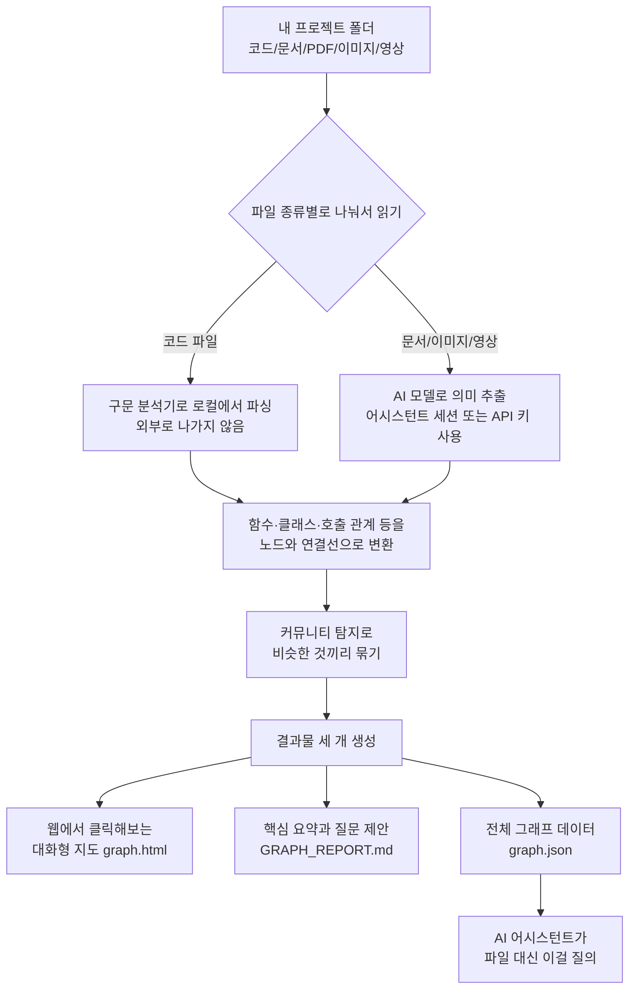

<div class="ai-knowledge-shell">

<aside class="ai-knowledge-sidebar">
  <p class="ai-eyebrow">CATEGORIES</p>
  <nav class="ai-cat-tree"><details class="ai-cat" open><summary><span class="catname">에이전트 오케스트레이션</span><span class="catcount">7</span></summary><ul><li><a href="https://altjs4510.github.io/ai_news_blog/knowledge/20260709/"><span class="kdate">2026-07-09</span><span class="ktitle">mvanhorn/last30days-skill — Reddit·X·YouTube·HN·…</span></a></li><li><a href="https://altjs4510.github.io/ai_news_blog/knowledge/20260707/"><span class="kdate">2026-07-07</span><span class="ktitle">AI Hero Skills Catalog — 실무 엔지니어를 위한 재사용 가능한 판단 …</span></a></li><li><a href="https://altjs4510.github.io/ai_news_blog/knowledge/20260623/"><span class="kdate">2026-06-23</span><span class="ktitle">bytedance/deer-flow — 샌드박스·메모리·서브에이전트·메시지 게이트웨이를…</span></a></li><li><a href="https://altjs4510.github.io/ai_news_blog/knowledge/20260611/"><span class="kdate">2026-06-11</span><span class="ktitle">The evolution of agentic surfaces: building with…</span></a></li><li><a href="https://altjs4510.github.io/ai_news_blog/knowledge/20260602/"><span class="kdate">2026-06-02</span><span class="ktitle">revfactory/harness — 도메인별 에이전트 팀과 스킬을 자동 설계하는 메타…</span></a></li><li><a href="https://altjs4510.github.io/ai_news_blog/knowledge/20260529/"><span class="kdate">2026-05-29</span><span class="ktitle">Introducing dynamic workflows in Claude Code</span></a></li><li><a href="https://altjs4510.github.io/ai_news_blog/knowledge/20260507/"><span class="kdate">2026-05-07</span><span class="ktitle">ruvnet/ruflo — Claude 멀티 에이전트 오케스트레이션 플랫폼</span></a></li></ul></details><details class="ai-cat" open><summary><span class="catname">MCP &amp; 도구 통합</span><span class="catcount">20</span></summary><ul><li><a href="https://altjs4510.github.io/ai_news_blog/knowledge/20260802/"><span class="kdate">2026-08-02</span><span class="ktitle">Stateless MCP has recaptured my interest (and in…</span></a></li><li><a href="https://altjs4510.github.io/ai_news_blog/knowledge/20260801/"><span class="kdate">2026-08-01</span><span class="ktitle">different-ai/openwork — Claude Cowork의 오픈소스 대체 에…</span></a></li><li><a href="https://altjs4510.github.io/ai_news_blog/knowledge/20260731/"><span class="kdate">2026-07-31</span><span class="ktitle">different-ai/openwork — Claude Cowork의 오픈소스 대안(o…</span></a></li><li><a href="https://altjs4510.github.io/ai_news_blog/knowledge/20260729/"><span class="kdate">2026-07-29</span><span class="ktitle">Bringing MCP 2026-07-28 to Claude</span></a></li><li><a href="https://altjs4510.github.io/ai_news_blog/knowledge/20260724/"><span class="kdate">2026-07-24</span><span class="ktitle">diegosouzapw/OmniRoute — 단일 엔드포인트로 278+ 프로바이더·50…</span></a></li><li><a href="https://altjs4510.github.io/ai_news_blog/knowledge/20260723/"><span class="kdate">2026-07-23</span><span class="ktitle">diegosouzapw/OmniRoute — 268+ 프로바이더를 단일 엔드포인트로 묶…</span></a></li><li><a href="https://altjs4510.github.io/ai_news_blog/knowledge/20260721/"><span class="kdate">2026-07-21</span><span class="ktitle">tirth8205/code-review-graph — 로컬 우선 코드 인텔리전스 그래프…</span></a></li><li><a href="https://altjs4510.github.io/ai_news_blog/knowledge/20260719/"><span class="kdate">2026-07-19</span><span class="ktitle">tirth8205/code-review-graph — 로컬 우선 코드 인텔리전스 그래프…</span></a></li><li><a href="https://altjs4510.github.io/ai_news_blog/knowledge/20260718/"><span class="kdate">2026-07-18</span><span class="ktitle">tirth8205/code-review-graph — MCP·CLI용 로컬 코드 인텔리…</span></a></li><li><a href="https://altjs4510.github.io/ai_news_blog/knowledge/20260708/"><span class="kdate">2026-07-08</span><span class="ktitle">Expanding Managed Agents in Gemini API: backgrou…</span></a></li><li><a href="https://altjs4510.github.io/ai_news_blog/knowledge/20260701/"><span class="kdate">2026-07-01</span><span class="ktitle">Google OKF (Open Knowledge Format) — 벤더 중립 에이전트 …</span></a></li><li><a href="https://altjs4510.github.io/ai_news_blog/knowledge/20260618/"><span class="kdate">2026-06-18</span><span class="ktitle">DeusData/codebase-memory-mcp — 158개 언어 코드베이스를 밀리…</span></a></li><li><a href="https://altjs4510.github.io/ai_news_blog/knowledge/20260606/"><span class="kdate">2026-06-06</span><span class="ktitle">chopratejas/headroom — Compress tool outputs, lo…</span></a></li><li><a href="https://altjs4510.github.io/ai_news_blog/knowledge/20260605/"><span class="kdate">2026-06-05</span><span class="ktitle">chopratejas/headroom — Compress tool outputs, lo…</span></a></li><li><a href="https://altjs4510.github.io/ai_news_blog/knowledge/20260604/"><span class="kdate">2026-06-04</span><span class="ktitle">chopratejas/headroom — Compress tool outputs bef…</span></a></li><li><a href="https://altjs4510.github.io/ai_news_blog/knowledge/20260603/"><span class="kdate">2026-06-03</span><span class="ktitle">How Bad MCP design cost your Agent 5× more token…</span></a></li><li><a href="https://altjs4510.github.io/ai_news_blog/knowledge/20260523/"><span class="kdate">2026-05-23</span><span class="ktitle">colbymchenry/codegraph — 사전 인덱싱된 코드 지식 그래프 MCP</span></a></li><li><a href="https://altjs4510.github.io/ai_news_blog/knowledge/20260517/"><span class="kdate">2026-05-17</span><span class="ktitle">I gave my LLM 100,000+ tools — Lazy Discovery &a…</span></a></li><li><a href="https://altjs4510.github.io/ai_news_blog/knowledge/20260509/"><span class="kdate">2026-05-09</span><span class="ktitle">How to connect 100 MCP servers without the conte…</span></a></li><li><a href="https://altjs4510.github.io/ai_news_blog/knowledge/20260506/"><span class="kdate">2026-05-06</span><span class="ktitle">mksglu/context-mode — AI 코딩 에이전트용 컨텍스트 윈도우 최적화</span></a></li></ul></details><details class="ai-cat" open><summary><span class="catname">코딩 에이전트</span><span class="catcount">17</span></summary><ul><li><a href="https://altjs4510.github.io/ai_news_blog/knowledge/20260804/"><span class="kdate">2026-08-04</span><span class="ktitle">esengine/DeepSeek-Reasonix — prefix-cache 안정성을 축…</span></a></li><li><a href="https://altjs4510.github.io/ai_news_blog/knowledge/20260728/"><span class="kdate">2026-07-28</span><span class="ktitle">alibaba/open-code-review — 결정론적 파이프라인 + LLM 에이전트…</span></a></li><li><a href="https://altjs4510.github.io/ai_news_blog/knowledge/20260725/"><span class="kdate">2026-07-25</span><span class="ktitle">The new rules of context engineering for Claude …</span></a></li><li><a href="https://altjs4510.github.io/ai_news_blog/knowledge/20260722/"><span class="kdate">2026-07-22</span><span class="ktitle">tirth8205/code-review-graph — MCP·CLI용 로컬 우선 코드 …</span></a></li><li><a href="https://altjs4510.github.io/ai_news_blog/knowledge/20260714/" class="current"><span class="kdate">2026-07-14</span><span class="ktitle">Graphify-Labs/graphify — 코드베이스를 질의 가능한 지식 그래프로 만…</span></a></li><li><a href="https://altjs4510.github.io/ai_news_blog/knowledge/20260705/"><span class="kdate">2026-07-05</span><span class="ktitle">openai/codex-plugin-cc — Claude Code에서 Codex를 위임…</span></a></li><li><a href="https://altjs4510.github.io/ai_news_blog/knowledge/20260626/"><span class="kdate">2026-06-26</span><span class="ktitle">google-labs-code/design.md — 코딩 에이전트에게 디자인 시스템을 …</span></a></li><li><a href="https://altjs4510.github.io/ai_news_blog/knowledge/20260619/"><span class="kdate">2026-06-19</span><span class="ktitle">Claude Code now supports artifacts</span></a></li><li><a href="https://altjs4510.github.io/ai_news_blog/knowledge/20260530/"><span class="kdate">2026-05-30</span><span class="ktitle">Leonxlnx/taste-skill — AI에게 좋은 취향을 부여해 generic s…</span></a></li><li><a href="https://altjs4510.github.io/ai_news_blog/knowledge/20260528/"><span class="kdate">2026-05-28</span><span class="ktitle">Building self-improving tax agents with Codex</span></a></li><li><a href="https://altjs4510.github.io/ai_news_blog/knowledge/20260526/"><span class="kdate">2026-05-26</span><span class="ktitle">colbymchenry/codegraph — Pre-indexed code knowle…</span></a></li><li><a href="https://altjs4510.github.io/ai_news_blog/knowledge/20260524/"><span class="kdate">2026-05-24</span><span class="ktitle">colbymchenry/codegraph — Pre-indexed code knowle…</span></a></li><li><a href="https://altjs4510.github.io/ai_news_blog/knowledge/20260521/"><span class="kdate">2026-05-21</span><span class="ktitle">colbymchenry/codegraph — Pre-indexed code knowle…</span></a></li><li><a href="https://altjs4510.github.io/ai_news_blog/knowledge/20260512/"><span class="kdate">2026-05-12</span><span class="ktitle">agentmemory — Persistent memory for AI coding ag…</span></a></li><li><a href="https://altjs4510.github.io/ai_news_blog/knowledge/20260510/"><span class="kdate">2026-05-10</span><span class="ktitle">addyosmani/agent-skills — Production-grade engin…</span></a></li><li><a href="https://altjs4510.github.io/ai_news_blog/knowledge/20260508/"><span class="kdate">2026-05-08</span><span class="ktitle">addyosmani/agent-skills — Production-grade engin…</span></a></li><li><a href="https://altjs4510.github.io/ai_news_blog/knowledge/20260505/"><span class="kdate">2026-05-05</span><span class="ktitle">mattpocock/skills — Skills for Real Engineers (.…</span></a></li></ul></details><details class="ai-cat" open><summary><span class="catname">모델 &amp; 연구</span><span class="catcount">6</span></summary><ul><li><a href="https://altjs4510.github.io/ai_news_blog/knowledge/20260716-proprag/"><span class="kdate">2026-07-16</span><span class="ktitle">PropRAG — 프로포지션 경로 위 beam search로 멀티홉 검색 안내</span></a></li><li><a href="https://altjs4510.github.io/ai_news_blog/knowledge/20260620/"><span class="kdate">2026-06-20</span><span class="ktitle">zai-org/GLM-5 — From Vibe Coding to Agentic Engi…</span></a></li><li><a href="https://altjs4510.github.io/ai_news_blog/knowledge/20260617/"><span class="kdate">2026-06-17</span><span class="ktitle">Predicting model behavior before release by simu…</span></a></li><li><a href="https://altjs4510.github.io/ai_news_blog/knowledge/20260610/"><span class="kdate">2026-06-10</span><span class="ktitle">Fable 5 just made cost-aware model routing manda…</span></a></li><li><a href="https://altjs4510.github.io/ai_news_blog/knowledge/20260516/"><span class="kdate">2026-05-16</span><span class="ktitle">STALE — 에이전트가 자기 기억의 유효성을 인지할 수 있는가</span></a></li><li><a href="https://altjs4510.github.io/ai_news_blog/knowledge/20260513/"><span class="kdate">2026-05-13</span><span class="ktitle">Thinking Machines' Native Interaction Models — T…</span></a></li></ul></details><details class="ai-cat" open><summary><span class="catname">인프라 &amp; 컴퓨트</span><span class="catcount">3</span></summary><ul><li><a href="https://altjs4510.github.io/ai_news_blog/knowledge/20260630/"><span class="kdate">2026-06-30</span><span class="ktitle">Introducing the Claude apps gateway for Amazon B…</span></a></li><li><a href="https://altjs4510.github.io/ai_news_blog/knowledge/20260522/"><span class="kdate">2026-05-22</span><span class="ktitle">Giving Agents Computers — Ivan Burazin, Daytona</span></a></li><li><a href="https://altjs4510.github.io/ai_news_blog/knowledge/20260520/"><span class="kdate">2026-05-20</span><span class="ktitle">New in Claude Managed Agents: self-hosted sandbo…</span></a></li></ul></details><details class="ai-cat" open><summary><span class="catname">보안 &amp; 거버넌스</span><span class="catcount">14</span></summary><ul><li><a href="https://altjs4510.github.io/ai_news_blog/knowledge/20260730/"><span class="kdate">2026-07-30</span><span class="ktitle">Anatomy of a Frontier Lab Agent Intrusion: A Tec…</span></a></li><li><a href="https://altjs4510.github.io/ai_news_blog/knowledge/20260716/"><span class="kdate">2026-07-16</span><span class="ktitle">Dicklesworthstone/destructive_command_guard — 에이…</span></a></li><li><a href="https://altjs4510.github.io/ai_news_blog/knowledge/20260715/"><span class="kdate">2026-07-15</span><span class="ktitle">Dicklesworthstone/destructive_command_guard — 에이…</span></a></li><li><a href="https://altjs4510.github.io/ai_news_blog/knowledge/20260710/"><span class="kdate">2026-07-10</span><span class="ktitle">70개 MCP 서버 strace 런타임 감사 — 부팅 시 아웃바운드 호출 서버 적발</span></a></li><li><a href="https://altjs4510.github.io/ai_news_blog/knowledge/20260704/"><span class="kdate">2026-07-04</span><span class="ktitle">Cloudflare is about to block AI agents by defaul…</span></a></li><li><a href="https://altjs4510.github.io/ai_news_blog/knowledge/20260703/"><span class="kdate">2026-07-03</span><span class="ktitle">Giving admins more visibility and control over C…</span></a></li><li><a href="https://altjs4510.github.io/ai_news_blog/knowledge/20260625/"><span class="kdate">2026-06-25</span><span class="ktitle">Agent identity in Claude Tag: a new access model…</span></a></li><li><a href="https://altjs4510.github.io/ai_news_blog/knowledge/20260624/"><span class="kdate">2026-06-24</span><span class="ktitle">Agent identity in Claude Tag: a new access model…</span></a></li><li><a href="https://altjs4510.github.io/ai_news_blog/knowledge/20260614/"><span class="kdate">2026-06-14</span><span class="ktitle">NVIDIA/SkillSpector — Security scanner for AI ag…</span></a></li><li><a href="https://altjs4510.github.io/ai_news_blog/knowledge/20260613/"><span class="kdate">2026-06-13</span><span class="ktitle">Fable 5's guardrails got bypassed in 48 hours — …</span></a></li><li><a href="https://altjs4510.github.io/ai_news_blog/knowledge/20260612/"><span class="kdate">2026-06-12</span><span class="ktitle">NVIDIA/SkillSpector — AI 에이전트 스킬용 보안 스캐너</span></a></li><li><a href="https://altjs4510.github.io/ai_news_blog/knowledge/20260607/"><span class="kdate">2026-06-07</span><span class="ktitle">OpenAI Help: Lockdown Mode</span></a></li><li><a href="https://altjs4510.github.io/ai_news_blog/knowledge/20260531/"><span class="kdate">2026-05-31</span><span class="ktitle">How we contain Claude across products</span></a></li><li><a href="https://altjs4510.github.io/ai_news_blog/knowledge/20260527/"><span class="kdate">2026-05-27</span><span class="ktitle">Microsoft Copilot Cowork Exfiltrates Files</span></a></li></ul></details><details class="ai-cat" open><summary><span class="catname">응용 사례</span><span class="catcount">7</span></summary><ul><li><a href="https://altjs4510.github.io/ai_news_blog/knowledge/20260805/"><span class="kdate">2026-08-05</span><span class="ktitle">TencentCloud/TencentDB-Agent-Memory — 대화·문서·코드를 …</span></a></li><li><a href="https://altjs4510.github.io/ai_news_blog/knowledge/20260726/"><span class="kdate">2026-07-26</span><span class="ktitle">citrolabs/ego-lite — 로그인된 브라우저 상태를 AI 에이전트와 공유하는…</span></a></li><li><a href="https://altjs4510.github.io/ai_news_blog/knowledge/20260717/"><span class="kdate">2026-07-17</span><span class="ktitle">After a year building agent memory, 'save everyt…</span></a></li><li><a href="https://altjs4510.github.io/ai_news_blog/knowledge/20260712/"><span class="kdate">2026-07-12</span><span class="ktitle">Do Automated Evals Work?</span></a></li><li><a href="https://altjs4510.github.io/ai_news_blog/knowledge/20260621/"><span class="kdate">2026-06-21</span><span class="ktitle">calesthio/OpenMontage — 12 파이프라인·52 도구·500+ 스킬을 …</span></a></li><li><a href="https://altjs4510.github.io/ai_news_blog/knowledge/20260609/"><span class="kdate">2026-06-09</span><span class="ktitle">Building intelligent apps for Apple platforms wi…</span></a></li><li><a href="https://altjs4510.github.io/ai_news_blog/knowledge/20260514/"><span class="kdate">2026-05-14</span><span class="ktitle">Introducing Claude for Small Business</span></a></li></ul></details><details class="ai-cat" open><summary><span class="catname">산업 동향</span><span class="catcount">6</span></summary><ul><li><a href="https://altjs4510.github.io/ai_news_blog/knowledge/20260711/"><span class="kdate">2026-07-11</span><span class="ktitle">OpenAI says GPT 5.6 is the 'preferred model' for…</span></a></li><li><a href="https://altjs4510.github.io/ai_news_blog/knowledge/20260702/"><span class="kdate">2026-07-02</span><span class="ktitle">How Cursor deploys AI inside the enterprise (For…</span></a></li><li><a href="https://altjs4510.github.io/ai_news_blog/knowledge/20260616/"><span class="kdate">2026-06-16</span><span class="ktitle">Why AI hasn't replaced software engineers, and w…</span></a></li><li><a href="https://altjs4510.github.io/ai_news_blog/knowledge/20260519/"><span class="kdate">2026-05-19</span><span class="ktitle">Anthropic acquires Stainless</span></a></li><li><a href="https://altjs4510.github.io/ai_news_blog/knowledge/20260515/"><span class="kdate">2026-05-15</span><span class="ktitle">Clawdmeter — Claude Code 사용량을 데스크톱 대시보드로</span></a></li><li><a href="https://altjs4510.github.io/ai_news_blog/knowledge/20260504/"><span class="kdate">2026-05-04</span><span class="ktitle">Agents for Everything Else: Codex for Knowledge …</span></a></li></ul></details></nav>
</aside>

<article class="ai-knowledge-article">

<header class="ai-post-hero">
  <p class="ai-eyebrow"><a class="ai-back" href="../">KNOWLEDGE</a> · 2026-07-14 · 오늘의 학습</p>
  <h2 class="ai-post-title">Graphify-Labs/graphify — 코드베이스를 질의 가능한 지식 그래프로 만드는 AI 코딩 스킬</h2>
</header>

> 원문: [Graphify-Labs/graphify — 코드베이스를 질의 가능한 지식 그래프로 만드는 AI 코딩 스킬](https://github.com/Graphify-Labs/graphify)

## 📌 학습 정리

### 1. 한 줄로 말하면

내 프로젝트 폴더 전체를 한 장의 지도처럼 만들어서, 파일을 하나하나 뒤지지 않고 "이 두 개가 어떻게 연결돼 있어?"라고 물어볼 수 있게 해주는 도구예요.

### 2. 왜 이게 만들어졌어요?

지금까지 AI 코딩 도구가 코드베이스를 이해하는 방식은 대체로 두 가지였어요. 하나는 `grep`처럼 파일을 하나하나 뒤져서 관련 내용을 찾는 방식이고, 다른 하나는 코드를 잘게 잘라 벡터로 저장해두고 비슷한 조각을 꺼내오는 방식(임베딩 기반 검색)이었죠. 문제는 이 두 방식 모두 "A라는 함수가 B라는 클래스와 어떻게 연결되어 있는지" 같은 **관계**를 그대로 보여주지는 못한다는 점이에요. 파일 안에 답이 있다는 건 알아도, 여러 파일에 걸친 흐름은 결국 사람이 머릿속에서 이어붙여야 했어요. Graphify는 이 관계 자체를 미리 지도(graph)로 그려두고, AI 어시스턴트가 파일을 읽는 대신 이 지도를 조회하게 만들자는 발상에서 나왔어요.

### 3. 비유로 풀면

이건 마치 도시를 처음 방문했을 때 지하철 노선도를 손에 쥐는 것 같은 거예요. 노선도 없이 골목을 하나씩 걸어보며 "여기가 어디로 이어지지?" 확인하는 게 파일을 뒤지는 방식이라면, 노선도는 역과 역 사이의 연결을 한눈에 보여주니까 "강남에서 홍대까지 몇 정거장이야?"를 바로 물어볼 수 있죠. 그래서 결국 Graphify는 코드·문서·이미지·영상 같은 재료들을 "역"으로 놓고, 그들 사이의 연결을 "노선"으로 그려서, 질문을 노선도 위에서 답할 수 있게 해주는 도구예요.

### 4. 어떻게 작동하는지 (그림으로)



핵심 흐름은 이래요. 코드 파일은 컴퓨터 안에서만 처리되고(구문 분석기가 문법 규칙에 따라 파싱만 하니까 AI 호출이 필요 없어요), 문서나 이미지·영상처럼 의미를 읽어야 하는 자료만 AI 모델을 거쳐요. 그 결과로 만들어진 지도에서 어시스턴트는 "질문 → 관련 부분만 잘라서 답"을 하게 되고, 사람도 브라우저에서 직접 클릭해가며 탐색할 수 있어요.

그리고 지도 위의 모든 연결선에는 꼬리표가 붙어요. **EXTRACTED**는 "이건 실제로 코드에 명시돼 있었어"라는 뜻이고, **INFERRED**는 "이건 도구가 정황상 이렇게 연결됐을 거라고 추론한 거야"라는 뜻이에요. 그래서 어디까지가 사실이고 어디부터가 추론인지 구분할 수 있어요.

### 5. 처음 보는 용어 풀이

- **지식 그래프 (knowledge graph)** — 개념들을 점(노드)으로, 그들 사이의 관계를 선(엣지)으로 표현한 지도예요. "A가 B를 호출한다", "C가 D를 상속한다" 같은 관계를 그림처럼 저장해두는 방식이라, "이것과 저것이 어떻게 이어져?"를 답하기에 좋아요.

- **구문 트리 파싱, tree-sitter (AST via tree-sitter)** — 코드를 사람이 아니라 컴퓨터가 이해할 수 있는 나무 모양 구조로 쪼개는 도구예요. 문법 규칙을 따라 기계적으로 분석하기 때문에 AI 없이도 정확하고, 매번 같은 결과가 나와요. Graphify가 코드 부분을 로컬에서만 처리할 수 있는 이유죠.

- **임베딩·벡터 인덱스 (embeddings, vector store)** — 문장이나 코드 조각을 숫자 배열(벡터)로 바꿔 저장해두고, "비슷한 뜻의 벡터"를 찾아주는 방식이에요. 요즘 많이 쓰는 검색 방식인데, Graphify는 이걸 쓰지 않고 대신 실제 관계 그래프를 만든다는 점을 강조해요.

- **커뮤니티 탐지, 라이덴 알고리즘 (community detection, Leiden)** — 그래프에서 서로 촘촘히 연결된 노드들을 자동으로 한 묶음으로 잡아주는 방법이에요. 프로젝트에서 "인증 관련 뭉치", "데이터베이스 관련 뭉치" 같은 하위 시스템을 자동으로 발견할 때 써요.

- **갓 노드 (god nodes)** — 그래프에서 가장 많은 연결을 가진 중심 노드들이에요. "이 프로젝트에서 뭐가 뭐든 다 거쳐가는 핵심이 뭐지?"의 답이 되는 자리예요.

- **모델 컨텍스트 프로토콜 서버 (MCP server)** — AI 어시스턴트가 외부 도구·데이터에 접근할 수 있게 해주는 표준화된 창구예요. Graphify를 MCP 서버로 띄우면, 어시스턴트가 그래프 조회 기능(노드 찾기, 최단 경로 찾기 등)을 직접 호출할 수 있어요.

- **스킬 등록, 훅 (skill, PreToolUse hook)** — 어시스턴트가 어떤 작업을 하기 직전에 자동으로 끼어드는 장치예요. 예를 들어 "파일을 통째로 읽으려고 할 때, 잠깐, 먼저 그래프에 물어봐"라고 안내를 넣는 식이에요. 그래서 매번 사용자가 시키지 않아도 어시스턴트가 그래프를 먼저 찾아보게 만들 수 있어요.

### 6. 한 발 더 들어가고 싶다면

- [Graphify 공식 사이트](https://graphify.com/) — 프로젝트의 소개 페이지예요. 도구의 전반적인 방향을 살펴볼 수 있어요.
- [벤치마크 상세 문서 (BENCHMARKS.md)](https://github.com/Graphify-Labs/graphify/blob/v8/BENCHMARKS.md) — LOCOMO, LongMemEval 같은 실험에서 다른 메모리·검색 시스템과 어떻게 비교됐는지를 재현 명령어까지 포함해 정리해둔 문서예요.
- [Agent Skills 규격 (anthropics/skills)](https://github.com/anthropics/skills) — 여러 AI 프레임워크가 공통으로 읽을 수 있는 "스킬" 파일 형식이에요. Graphify가 특정 어시스턴트에 묶이지 않고 여러 곳에서 쓰이는 원리를 이해할 수 있어요.
- [gws CLI (Google Workspace 명령줄 도구)](https://github.com/googleworkspace/cli) — 구글 문서·시트·슬라이드를 자동으로 뽑아올 때 필요한 도구예요. 코드가 아닌 자료까지 그래프에 넣고 싶을 때 어떻게 연결하는지 감을 잡을 수 있어요.

---

## 📖 원문 전체 번역 (정독용)

> 의역 최소화한 전체 번역입니다. 큰 흐름은 위 정리에서 잡고, 정확한 워딩이 필요할 땐 이 섹션에서 정독하세요.

[](https://graphify.com/)

[](https://trendshift.io/repositories/25296?utm_source=repository-badge&utm_medium=badge&utm_campaign=badge-repository-25296)

[](https://pypi.org/project/graphifyy/) [](https://pepy.tech/project/graphifyy) [](https://discord.gg/598Ad9zQZ) [](https://www.linkedin.com/company/graphify-labs) [](https://camo.githubusercontent.com/cd5eedbdcac8f250113a16f5e73514a6ac4ac2f34406db0b37d836ed4574157b/68747470733a2f2f696d672e736869656c64732e696f2f62616467652f59253320436f6d62696e61746f722d5332362d4630363532463f7374796c653d666c6174266c6f676f3d79636f6d62696e61746f72266c6f676f436f6c6f723d7768697465)

AI 코딩 어시스턴트에서 `/graphify`를 입력하면, 프로젝트 전체(코드, 문서, PDF, 이미지, 동영상)를 **지식 그래프 (knowledge graph)**로 매핑하여 파일을 grep하는 대신 **질의**할 수 있게 됩니다.

- **코드 매핑은 무료, 완전 로컬.** 코드는 tree-sitter AST로 파싱됩니다: 결정론적이고, LLM 없이, 머신 밖으로 아무것도 나가지 않습니다. (문서, PDF, 이미지, 동영상은 시맨틱 처리를 위해 어시스턴트 모델 또는 설정된 API 키를 사용합니다.)
- **모든 엣지에 설명이 있습니다.** 각 연결에는 `EXTRACTED` (소스에 명시됨) 또는 `INFERRED` (graphify가 추론함) 태그가 붙어 있어, 직접 읽은 내용과 추론된 내용을 구분할 수 있습니다.
- **벡터 인덱스가 아닙니다.** 임베딩도, 벡터 스토어도 없습니다: 직접 탐색할 수 있는 실제 그래프입니다. 질문을 하거나, 두 항목 사이의 경로를 추적하거나, 하나의 개념을 설명할 수 있습니다.

[](https://raw.githubusercontent.com/Graphify-Labs/graphify/v8/docs/graph-hero.png)

_graphify가 매핑한 FastAPI 코드베이스. 모든 노드는 하나의 개념이고, 색상은 감지된 커뮤니티를 나타내며, graph.html에서 클릭으로 전체를 탐색할 수 있습니다._

**시작하기** (30초):

```
uv tool install graphifyy      # CLI 설치 (또는: pipx install graphifyy)
graphify install               # AI 어시스턴트에 스킬 등록
```

그런 다음 AI 어시스턴트에서:

```
/graphify .
```

이것으로 끝입니다. **세 개의 파일**이 생성됩니다:

```
graphify-out/
├── graph.html       아무 브라우저에서 열기 — 노드 클릭, 필터, 검색 가능
├── GRAPH_REPORT.md  핵심 내용: 주요 개념, 놀라운 연결, 추천 질문
└── graph.json       전체 그래프 — 파일을 다시 읽지 않고 언제든 질의 가능
```

**지원 플랫폼:** Claude Code, Cursor, Codex, Gemini CLI, GitHub Copilot 외 15개 이상 — [플랫폼 선택하기](https://github.com/Graphify-Labs/graphify#install).

---

## 동작 확인

[](https://raw.githubusercontent.com/Graphify-Labs/graphify/v8/docs/demo-path.svg)

그래프가 생성되면 파일을 읽는 대신 그래프에 질의합니다. 위에 표시된 FastAPI 코드베이스에 graphify를 실행한 실제 출력:

```
$ graphify explain "APIRouter"
Node: APIRouter
  Source:    routing.py L2210
  Community: 2
  Degree:    47

Connections (47):
  --> RequestValidationError [uses] [INFERRED]
  --> Dependant [uses] [INFERRED]
  --> .get() [method] [EXTRACTED]
  <-- __init__.py [imports] [EXTRACTED]
  ...

$ graphify path "FastAPI" "ModelField"
Shortest path (3 hops):
  FastAPI --uses--> DefaultPlaceholder <--references-- get_request_handler() --references--> ModelField
```

모든 엣지에는 **신뢰도 태그**(`EXTRACTED` = 소스에 명시됨, `INFERRED` = 추론에 의해 도출됨)가 붙어 있어, 직접 읽은 내용과 추론된 내용을 구분할 수 있습니다. `graphify query "<질문>"`은 자연어 질문에 대한 스코프된 서브그래프를 반환하고, `graphify path A B`는 두 항목이 어떻게 연결되는지 추적합니다.

---

## 기능 설명

기본 제공 기능:

| 기능 | 제공 내용 |
| --- | --- |
| **God nodes** | 가장 많이 연결된 개념들 — 모든 것이 통과하는 핵심 노드를 확인할 수 있습니다 |
| **Communities** | (Leiden 알고리즘으로) 서브시스템으로 분할된 그래프, LLM 없이 레이블 생성 |
| **Cross-file links** | tree-sitter AST를 통해 약 40개 언어 전반에 걸쳐 `calls` / `imports` / `inherits` / `mixes_in` 해석 |
| **Query, path, explain** | `graph.json`을 대상으로 질문하기, 두 항목 사이 경로 추적하기, 또는 하나의 개념 설명하기 |
| **Rationale + doc refs** | `# NOTE:` / `# WHY:` 주석 및 ADR/RFC 참조가 코드에 연결된 1급 노드로 등록됨 |
| **코드 너머** | 문서, PDF, 이미지, 동영상/오디오 모두 동일한 그래프로 매핑 |
| **Local-first** | 코드는 tree-sitter로 로컬에서 파싱됨 (LLM 없음, 아무것도 머신 밖으로 나가지 않음); 문서/미디어에 대한 시맨틱 처리만 백엔드를 호출하며, 이 역시 설정된 경우에만 |

---

## 벤치마크

| 벤치마크 | 지표 | graphify | 다른 시스템 |
| --- | --- | --- | --- |
| LOCOMO (n=300) | recall@10 | **0.497** | mem0 0.048, supermemory 0.149 |
| LOCOMO (n=300) | QA 정확도 | 45.3% | supermemory 49.7%, mem0 27.3% |
| LongMemEval-S (n=50) | QA 정확도 | **76%** | dense RAG와 동률 |
| 그래프 빌드 | LLM 크레딧 | **0** | 대부분의 시스템은 토큰당 과금 |

모든 시스템은 동일한 하네스, 동일한 모델 및 예산으로 실행되었으며, 두 번째 심사위원과의 블라인드 검증(90.6% 일치, Cohen's kappa 0.81)을 거친 심사위원이 채점했습니다. 시스템별 전체 표, 코드 인텔리전스 결과, 재현 명령어: **[BENCHMARKS.md](https://github.com/Graphify-Labs/graphify/blob/v8/BENCHMARKS.md)**.

---

## 사전 요구사항

| 요구사항 | 최소 버전 | 확인 방법 | 설치 방법 |
| --- | --- | --- | --- |
| Python | 3.10+ | `python --version` | [python.org](https://www.python.org/downloads/) |
| uv _(권장)_ | 모든 버전 | `uv --version` | `curl -LsSf https://astral.sh/uv/install.sh | sh` |
| pipx _(대안)_ | 모든 버전 | `pipx --version` | `pip install pipx` |

**macOS 빠른 설치 (Homebrew):**

```
brew install python@3.12 uv
```

**Windows 빠른 설치:**

```
winget install astral-sh.uv
```

**Ubuntu/Debian:**

```
sudo apt install python3.12 python3-pip pipx
# 또는 uv 설치:
curl -LsSf https://astral.sh/uv/install.sh | sh
```

---

## 설치

> **공식 패키지:** PyPI 패키지 이름은 `graphifyy` (y가 두 개)입니다. PyPI의 다른 `graphify*` 패키지는 관련이 없습니다. CLI 명령어는 여전히 `graphify`입니다.

**1단계 — 패키지 설치:**

```
# 권장 (격리된 환경; 설치 후 'graphify'를 찾을 수 없으면 실행: uv tool update-shell):
uv tool install graphifyy

# 대안:
pipx install graphifyy
pip install graphifyy  # PATH 설정이 필요할 수 있음 — 아래 참고
```

**2단계 — AI 어시스턴트에 스킬 등록:**

```
graphify install
```

이것으로 끝입니다. AI 어시스턴트를 열고 `/graphify .`를 입력하세요.

어시스턴트 스킬을 사용자 프로필이 아닌 현재 리포지토리에 설치하려면 `--project`를 추가하세요:

```
graphify install --project
graphify install --project --platform codex
```

프로젝트 범위 설치는 현재 디렉터리 하위에 기록됩니다. 예: `.claude/skills/graphify/SKILL.md` 또는 `.agents/skills/graphify/SKILL.md` (스킬이 필요에 따라 로드하는 `references/` 사이드카 포함), 그리고 커밋 가능한 파일에 대해 `git add` 힌트를 출력합니다. 프로젝트 범위 설치를 지원하는 플랫폼별 명령어도 동일한 플래그를 사용합니다. 예: `graphify claude install --project` 또는 `graphify codex install --project`.

> **PowerShell 참고:** `/graphify .` 대신 `graphify .`를 사용하세요 — 앞의 슬래시는 PowerShell에서 경로 구분자입니다.

> **`graphify: command not found` 오류?** `uv tool install` / `pipx install`은 `graphify` 명령어를 tool bin 디렉터리(`~/.local/bin`)에 저장합니다. 설치 직후 셸에서 찾을 수 없는 경우 — 신규 macOS + zsh 설정에서 흔한 현상 — 해당 디렉터리가 아직 `PATH`에 없는 것입니다: `uv tool update-shell` (또는 `pipx ensurepath`)을 실행한 뒤 새 터미널을 여세요. 일반 `pip`의 경우, `~/.local/bin` (Linux) 또는 `~/Library/Python/3.x/bin` (Mac)을 PATH에 추가하거나 `python -m graphify`를 실행하세요.

> **설치 대신 `uvx` / `uv tool run`으로 실행하려면?** 명령어가 아닌 패키지 이름을 지정하세요: `uvx --from graphifyy graphify install`. 단순히 `uvx graphify …`를 실행하면 실패합니다 (`No solution found … no versions of graphify`). `uv tool run`이 첫 번째 단어를 _패키지_로 읽는데, 패키지 이름은 `graphifyy`이고 `graphify` 명령어는 그 안에 있기 때문입니다.

> **Mac/Windows에서 `pip install` 사용은 가능하면 피하세요.** 스킬은 런타임에 `graphify-out/.graphify_python`에서 Python을 찾습니다; 그것이 `pip`으로 패키지를 설치한 환경과 다른 환경을 가리키면 `ModuleNotFoundError: No module named 'graphify'`가 발생합니다. `uv tool install`과 `pipx install`은 패키지를 자체 환경에 격리하여 이 문제를 완전히 방지합니다.

> **Git 훅과 uv tool / pipx:** `graphify hook install`은 설치 시점에 현재 인터프리터 경로를 훅 스크립트에 직접 임베드합니다. 덕분에 `~/.local/bin`이 PATH에 없는 GUI git 클라이언트나 CI 러너에서도 post-commit 훅이 올바르게 실행됩니다. graphify를 재설치하거나 업그레이드하면 `graphify hook install`을 다시 실행하여 임베드된 경로를 갱신하세요.

**플랫폼 선택** (20개 이상의 어시스턴트, 클릭하여 펼치기)

| 플랫폼 | 설치 명령어 |
| --- | --- |
| Claude Code (Linux/Mac) | `graphify install` |
| Claude Code (Windows) | `graphify install` (자동 감지) 또는 `graphify install --platform windows` |
| CodeBuddy | `graphify install --platform codebuddy` |
| Codex | `graphify install --platform codex` |
| OpenCode | `graphify install --platform opencode` |
| Kilo Code | `graphify install --platform kilo` |
| GitHub Copilot CLI | `graphify install --platform copilot` |
| VS Code Copilot Chat | `graphify vscode install` |
| Aider | `graphify install --platform aider` |
| OpenClaw | `graphify install --platform claw` |
| Factory Droid | `graphify install --platform droid` |
| Trae | `graphify install --platform trae` |
| Trae CN | `graphify install --platform trae-cn` |
| Gemini CLI | `graphify install --platform gemini` |
| Hermes | `graphify install --platform hermes` |
| Kimi Code | `graphify install --platform kimi` |
| Amp | `graphify amp install` |
| Agent Skills (크로스 프레임워크) | `graphify install --platform agents` (별칭 `--platform skills`) |
| Kiro IDE/CLI | `graphify kiro install` |
| Pi coding agent | `graphify install --platform pi` |
| Cursor | `graphify cursor install` |
| Devin CLI | `graphify devin install` |
| Google Antigravity | `graphify antigravity install` |

Codex 사용자는 병렬 추출을 위해 `~/.codex/config.toml`의 `[features]` 아래에 `multi_agent = true`도 필요합니다. CodeBuddy는 Claude Code와 동일한 Agent 도구 및 PreToolUse 훅 메커니즘을 사용합니다. Factory Droid는 병렬 서브에이전트 디스패치를 위해 `Task` 도구를 사용합니다. OpenClaw와 Aider는 순차 추출을 사용합니다 (해당 플랫폼에서 병렬 에이전트 지원은 아직 초기 단계). Trae는 병렬 서브에이전트 디스패치를 위해 Agent 도구를 사용하며 `PreToolUse` 훅을 지원하지 **않으므로**, AGENTS.md가 항상 켜져 있는 메커니즘입니다.

`--platform agents` (별칭 `--platform skills`)는 범용 크로스 프레임워크 [Agent-Skills](https://github.com/anthropics/skills) 위치를 대상으로 합니다: 글로벌 설치의 경우 스펙의 사용자 전역 `~/.agents/skills/` (`npx skills` 및 스펙 호환 프레임워크가 읽음), 프로젝트 (`--project`) 설치의 경우 `./.agents/skills/`. 단순 `graphify install`은 설계상 단일 플랫폼(Claude Code) 전용으로 유지됩니다 — `.agents/skills`를 읽는 프레임워크에서 스킬을 발견 가능하게 하려면 명명된 `agents` 플랫폼을 사용하세요.

> Codex는 `/graphify` 대신 `$graphify`를 사용합니다.

**선택적 extras** (필요한 것만 설치)

| Extra | 추가 기능 | 설치 |
| --- | --- | --- |
| `pdf` | PDF 추출 | `uv tool install "graphifyy[pdf]"` |
| `office` | `.docx` 및 `.xlsx` 지원 | `uv tool install "graphifyy[office]"` |
| `google` | Google Sheets 렌더링 | `uv tool install "graphifyy[google]"` |
| `video` | 동영상/오디오 전사 (faster-whisper + yt-dlp) | `uv tool install "graphifyy[video]"` |
| `mcp` | MCP stdio 서버 | `uv tool install "graphifyy[mcp]"` |
| `neo4j` | Neo4j 푸시 지원 | `uv tool install "graphifyy[neo4j]"` |
| `falkordb` | FalkorDB 푸시 지원 | `uv tool install "graphifyy[falkordb]"` |
| `svg` | SVG 그래프 내보내기 | `uv tool install "graphifyy[svg]"` |
| `leiden` | Leiden 커뮤니티 감지 (Python < 3.13 전용) | `uv tool install "graphifyy[leiden]"` |
| `ollama` | Ollama 로컬 추론 | `uv tool install "graphifyy[ollama]"` |
| `openai` | OpenAI / OpenAI 호환 API | `uv tool install "graphifyy[openai]"` |
| `gemini` | Google Gemini API | `uv tool install "graphifyy[gemini]"` |
| `anthropic` | Anthropic Claude API (`--backend claude`, `ANTHROPIC_API_KEY` 사용) | `uv tool install "graphifyy[anthropic]"` |
| `bedrock` | AWS Bedrock (IAM 사용, API 키 불필요) | `uv tool install "graphifyy[bedrock]"` |
| `azure` | Azure OpenAI Service (`--backend azure`, `AZURE_OPENAI_API_KEY` + `AZURE_OPENAI_ENDPOINT` 사용) | `uv tool install "graphifyy[openai]"` |
| `sql` | SQL 스키마 추출 | `uv tool install "graphifyy[sql]"` |
| `postgres` | 라이브 PostgreSQL 인트로스펙션 (`--postgres DSN`) | `uv tool install "graphifyy[postgres]"` |
| `dm` | BYOND DreamMaker `.dm`/`.dme` AST 추출 (플랫폼에 맞는 휠이 없으면 C 컴파일러 + `python3-dev` 필요할 수 있음) | `uv tool install "graphifyy[dm]"` |
| `terraform` | Terraform / HCL `.tf`/`.tfvars`/`.hcl` AST 추출 | `uv tool install "graphifyy[terraform]"` |
| `pascal` | Pascal / Delphi `.pas`/`.dpr`/`.dpk`/`.inc` AST 추출 (더 정확한 `calls`/`inherits` 엣지; 없을 경우 regex 추출기로 폴백) | `uv tool install "graphifyy[pascal]"` |
| `chinese` | 중국어 쿼리 분절 (jieba) | `uv tool install "graphifyy[chinese]"` |
| `all` | 위의 모든 것 | `uv tool install "graphifyy[all]"` |

---

## 어시스턴트가 항상 그래프를 사용하게 만들기

그래프를 빌드한 후 프로젝트에서 한 번 실행하세요:

| 플랫폼 | 명령어 |
| --- | --- |
| Claude Code | `graphify claude install` |
| CodeBuddy | `graphify codebuddy install` |
| Codex | `graphify codex install` |
| OpenCode | `graphify opencode install` |
| Kilo Code | `graphify kilo install` |
| GitHub Copilot CLI | `graphify copilot install` |
| VS Code Copilot Chat | `graphify vscode install` |
| Aider | `graphify aider install` |
| OpenClaw | `graphify claw install` |
| Factory Droid | `graphify droid install` |
| Trae | `graphify trae install` |
| Trae CN | `graphify trae-cn install` |
| Cursor | `graphify cursor install` |
| Gemini CLI | `graphify gemini install` |
| Hermes | `graphify hermes install` |
| Kimi Code | `graphify install --platform kimi` |
| Amp | `graphify amp install` |
| Agent Skills (크로스 프레임워크) | `graphify agents install` (별칭 `graphify skills install`) |
| Kiro IDE/CLI | `graphify kiro install` |
| Pi coding agent | `graphify pi install` |
| Devin CLI | `graphify devin install` |
| Google Antigravity | `graphify antigravity install` |

이 명령어는 코드베이스 관련 질문에 대해 지식 그래프를 참조하도록 어시스턴트에게 지시하는 소형 설정 파일을 작성합니다. 전체 보고서를 읽거나 raw 파일을 grep하는 대신 `graphify query "<질문>"`과 같이 스코프된 쿼리를 선호하도록 합니다.

- **훅 플랫폼** (Claude Code, Gemini CLI): 검색 스타일 도구 호출 전에 (그리고 Claude Code에서는 Read/Glob 도구를 통해 소스 파일을 하나씩 읽기 전에) 훅이 자동으로 실행되어 어시스턴트를 그래프 경로로 유도합니다.
- **명령어 파일 플랫폼** (Codex, OpenCode, Cursor 등): 영속적인 명령어 파일 (`AGENTS.md`, `.cursor/rules/` 등)이 동일한 쿼리 우선 지침을 제공합니다.

`GRAPH_REPORT.md`는 광범위한 아키텍처 검토에 여전히 사용 가능합니다.

**CodeBuddy**는 Claude Code와 동일한 두 가지 작업을 합니다: CodeBuddy가 아키텍처 질문에 답하기 전에 `graphify-out/GRAPH_REPORT.md`를 읽도록 지시하는 `CODEBUDDY.md` 섹션 작성, 그리고 Bash 검색 명령어 및 파일 읽기 전에 실행되어 `graphify query` 사용을 유도하는 `PreToolUse` 훅 (`.codebuddy/settings.json`) 설치.

**Codex**는 `AGENTS.md`에 작성하고, Claude Code와 동일한 상시 작동 메커니즘으로 모든 Bash 도구 호출 전에 실행되는 `PreToolUse` 훅을 `.codex/hooks.json`에 설치합니다.

**Kilo Code**는 Graphify 스킬을 `~/.config/kilo/skills/graphify/SKILL.md`에, 그리고 네이티브 `/graphify` 명령어를 `~/.config/kilo/command/graphify.md`에 설치합니다. `graphify kilo install`은 또한 `AGENTS.md`를 작성하고, 네이티브 `tool.execute.before` 플러그인 (`.kilo/plugins/graphify.js` + `.kilo/kilo.json` 또는 `.kilo/kilo.jsonc` 등록)도 설치하여, Kilo가 네이티브 `.kilo` 설정을 통해 동일한 상시 작동 그래프 알림 동작을 갖게 됩니다.

**Cursor**는 `alwaysApply: true`로 `.cursor/rules/graphify.mdc`를 작성하므로, Cursor가 훅 없이도 모든 대화에 자동으로 포함합니다.

모든 플랫폼에서 graphify를 한 번에 제거하려면: `graphify uninstall` (`graphify-out/`도 삭제하려면 `--purge` 추가). 또는 플랫폼별 명령어를 사용하세요 (예: `graphify claude uninstall`).

---

## 보고서 내용

- **God nodes** — 프로젝트에서 가장 많이 연결된 개념들. 모든 것이 이것들을 통해 흐릅니다.
- **Surprising connections** — 서로 다른 파일이나 모듈에 있는 항목들 사이의 연결. 예상치 못한 정도에 따라 순위가 매겨집니다.
- **"Why" (이유)** — 인라인 주석 (`# NOTE:`, `# WHY:`, `# HACK:`), 독스트링, 그리고 문서의 설계 근거가 그것이 설명하는 코드에 연결된 별도 노드로 추출됩니다.
- **Suggested questions** — 그래프가 독보적으로 답변할 수 있는 4~5개의 질문.
- **Confidence tags** — 모든 추론된 관계는 `EXTRACTED`, `INFERRED`, 또는 `AMBIGUOUS`로 표시됩니다. 발견된 내용과 추측된 내용을 항상 알 수 있습니다.

---

## 처리 가능한 파일

| 유형 | 확장자 |
| --- | --- |
| 코드 (36개 tree-sitter 문법) | `.py .ts .mts .cts .js .jsx .tsx .mjs .go .rs .java .c .cpp .cc .cxx .h .hpp .cu .cuh .metal .rb .cs .kt .kts .scala .php .swift .lua .luau .toc .zig .ps1 .psm1 .psd1 .ex .exs .m .mm .jl .vue .svelte .astro .groovy .gradle .dart .v .sv .svh .sql .f .f90 .f95 .f03 .f08 .pas .pp .dpr .dpk .lpr .inc .dfm .lfm .lpk .sh .bash .json .dm .dme .dmi .dmm .dmf .sln .slnx .csproj .fsproj .vbproj .xaml .razor .cshtml` (`.dm`/`.dme`는 `uv tool install graphifyy[dm]` 필요; `.mts`/`.cts`는 TypeScript 문법 재사용, `.cc`/`.cxx`와 CUDA `.cu`/`.cuh`, Metal `.metal`은 C++ 문법 재사용) |
| Salesforce Apex | `.cls .trigger` (regex 기반; 클래스, 인터페이스, 열거형, 메서드, 트리거, SOQL/DML 엣지) |
| Terraform / HCL | `.tf .tfvars .hcl` (`uv tool install graphifyy[terraform]` 필요) |
| MCP 설정 | `.mcp.json` `mcp.json` `mcp_servers.json` `claude_desktop_config.json` — 서버 노드, 패키지 참조, 환경 변수 요구사항 추출 |
| 패키지 매니페스트 | `apm.yml` `pyproject.toml` `go.mod` `pom.xml` — 패키지당 하나의 표준 패키지 노드 (이름 기준) 및 `depends_on` 엣지 생성. 여러 매니페스트에서 참조되는 패키지는 단일 허브가 됨 |
| 문서 | `.md .mdx .qmd .html .txt .rst .yaml .yml` (마크다운 `[text](./other.md)` 링크와 `[[wikilinks]]`가 문서 간 `references` 엣지가 됨) |
| Office | `.docx .xlsx` (`uv tool install graphifyy[office]` 필요) |
| Google Workspace | `.gdoc .gsheet .gslides` (옵트인; `gws` 인증 및 `--google-workspace` 필요; Sheets는 `uv tool install graphifyy[google]` 필요) |
| PDF | `.pdf` |
| 이미지 | `.png .jpg .webp .gif` |
| 동영상 / 오디오 | `.mp4 .mov .mp3 .wav` 외 다수 (`uv tool install graphifyy[video]` 필요) |
| YouTube / URL | 모든 동영상 URL (`uv tool install graphifyy[video]` 필요) |

코드는 **API 호출 없이 로컬에서 추출**됩니다 (tree-sitter를 통한 AST). 나머지 모든 것은 AI 어시스턴트의 모델 API를 통해 처리됩니다.

Google Drive for desktop `.gdoc`, `.gsheet`, `.gslides` 파일은 문서 콘텐츠가 아닌 숏컷 포인터입니다. 헤드리스 추출에 네이티브 Google Docs, Sheets, Slides를 포함하려면, [`gws` CLI](https://github.com/googleworkspace/cli)를 설치하고 인증한 후 다음을 실행하세요:

```
uv tool install "graphifyy[google]"  # Google Sheets 테이블 렌더링에 필요
gws auth login -s drive
graphify extract ./docs --google-workspace
```

`GRAPHIFY_GOOGLE_WORKSPACE=1`을 설정할 수도 있습니다. Graphify는 숏컷을 `graphify-out/converted/`에 마크다운 사이드카로 내보낸 뒤 해당 파일들을 추출합니다.

---

## 주요 명령어

```
/graphify .                        # 현재 폴더에 대한 그래프 빌드
/graphify ./docs --update          # 변경된 파일만 재추출
/graphify . --cluster-only         # 재추출 없이 클러스터링만 재실행
/graphify . --cluster-only --resolution 1.5      # 더 세분화된 커뮤니티
/graphify . --cluster-only --exclude-hubs 99     # god-node 순위에서 유틸리티 슈퍼허브 제외
/graphify . --no-viz               # HTML 생략, 보고서 + JSON만
/graphify . --wiki                 # 그래프로부터 마크다운 위키 빌드
graphify export callflow-html      # Mermaid 아키텍처/콜플로우 HTML (훅 설치 시 매 git 커밋마다 자동 재생성)

/graphify query "what connects auth to the database?"
/graphify path "UserService" "DatabasePool"
/graphify explain "RateLimiter"

/graphify add https://arxiv.org/abs/1706.03762   # 논문 가져와서 추가
/graphify add <youtube-url>                       # 동영상 전사 후 추가

graphify hook install              # git 커밋 시 자동 재빌드
graphify merge-graphs a.json b.json              # 두 그래프 합치기

graphify prs                       # PR 대시보드: CI 상태, 리뷰 상태, 워크트리 매핑
graphify prs 42                    # PR #42에 대한 그래프 영향 심층 분석
graphify prs --triage              # AI가 리뷰 대기열 순위 지정 (설정된 백엔드 사용)
graphify prs --conflicts           # 그래프 커뮤니티를 공유하는 PR — 머지 순서 위험
```

전체 명령어 참조는 [아래](https://github.com/Graphify-Labs/graphify#full-command-reference)를 참조하세요.

---

## 파일 제외 (Ignoring files)

프로젝트 루트에 `.graphifyignore`를 만드세요 — `.gitignore`와 동일한 문법이며 `!` 부정도 지원합니다.

**`.gitignore`는 자동으로 적용됩니다.** graphify는 각 디렉터리의 `.gitignore`를 읽습니다. `.graphifyignore`도 존재하면 둘을 **병합**합니다 — `.graphifyignore` 패턴이 마지막에 평가되므로 충돌 시 (` ` 부정 포함) 우선합니다. `.graphifyignore`를 추가하면 오직 더 많이 제외할 뿐입니다; `.gitignore`가 이미 제외한 파일을 다시 포함할 수는 없습니다. 하위 디렉터리 스코핑은 git과 동일 방식으로 작동합니다 — ignore 파일은 자체 서브트리에만 영향을 미칩니다.

```
# .graphifyignore
node_modules/
dist/
*.generated.py

# src/만 인덱싱하고 나머지는 무시
*
!src/
!src/**
```

---

## 팀 설정

`graphify-out/`은 팀의 모든 사람이 맵과 함께 시작할 수 있도록 git에 커밋하도록 의도되어 있습니다.

**권장 `.gitignore` 추가 항목:**

```
graphify-out/cost.json        # 로컬 전용
# graphify-out/cache/         # 선택 사항: 속도를 위해 커밋하거나, 저장소를 작게 유지하려면 생략
```

> `manifest.json`은 이제 이식 가능합니다 — 키가 상대 경로로 저장되고 로드 시 재앵커링되므로, 커밋해도 안전하며 첫 번째 체크아웃 시 전체 재빌드를 방지합니다.

**워크플로:**

1. 한 사람이 `/graphify .`를 실행하고 `graphify-out/`을 커밋합니다.
2. 모든 사람이 풀(pull)하면 — 어시스턴트가 즉시 그래프를 읽습니다.
3. `graphify hook install`을 실행하여 각 커밋 후 자동 재빌드를 설정합니다 (AST만, API 비용 없음). 이것은 또한 `graph.json`에 충돌 마커가 남지 않도록 git 머지 드라이버를 설정합니다 — 두 개발자가 동시에 커밋해도 그래프가 자동으로 union-merge됩니다.
4. 문서나 논문이 변경되면 `/graphify --update`를 실행하여 해당 노드를 새로 고칩니다.

---

## 그래프 직접 사용하기

```
# 터미널에서 그래프 질의
graphify query "show the auth flow"
graphify query "what connects DigestAuth to Response?" --graph graphify-out/graph.json

# 그래프를 MCP 서버로 노출 (반복적인 도구 호출 접근용)
python -m graphify.serve graphify-out/graph.json
python -m graphify.serve --graph graphify-out/graph.json  # --graph 플래그도 허용

# Kimi Code에 등록:
kimi mcp add --transport stdio graphify -- python -m graphify.serve graphify-out/graph.json

# 또는 팀 전체가 하나의 URL을 가리키도록 HTTP로 서빙 (로컬 graphify 불필요):
python -m graphify.serve graphify-out/graph.json --transport http --port 8080
python -m graphify.serve graphify-out/graph.json --transport http --host 0.0.0.0 --api-key "$SECRET"
```

MCP 서버는 어시스턴트에게 구조화된 접근을 제공합니다: `query_graph`, `get_node`, `get_neighbors`, `shortest_path`, `list_prs`, `get_pr_impact`, `triage_prs`.

### 공유 HTTP 서버

`--transport stdio` (기

</article>

</div>

<!-- ai-related-links -->
<aside class="ai-related-links">
  <p class="ai-eyebrow">관련 학습</p>
  <ul><li><a href="https://altjs4510.github.io/ai_news_blog/knowledge/20260521/"><span class="kdate">2026-05-21</span><span class="ktitle">colbymchenry/codegraph — Pre-indexed code knowle…</span></a></li><li><a href="https://altjs4510.github.io/ai_news_blog/knowledge/20260523/"><span class="kdate">2026-05-23</span><span class="ktitle">colbymchenry/codegraph — 사전 인덱싱된 코드 지식 그래프 MCP</span></a></li><li><a href="https://altjs4510.github.io/ai_news_blog/knowledge/20260618/"><span class="kdate">2026-06-18</span><span class="ktitle">DeusData/codebase-memory-mcp — 158개 언어 코드베이스를 밀리…</span></a></li></ul>
</aside>
<!-- /ai-related-links -->
