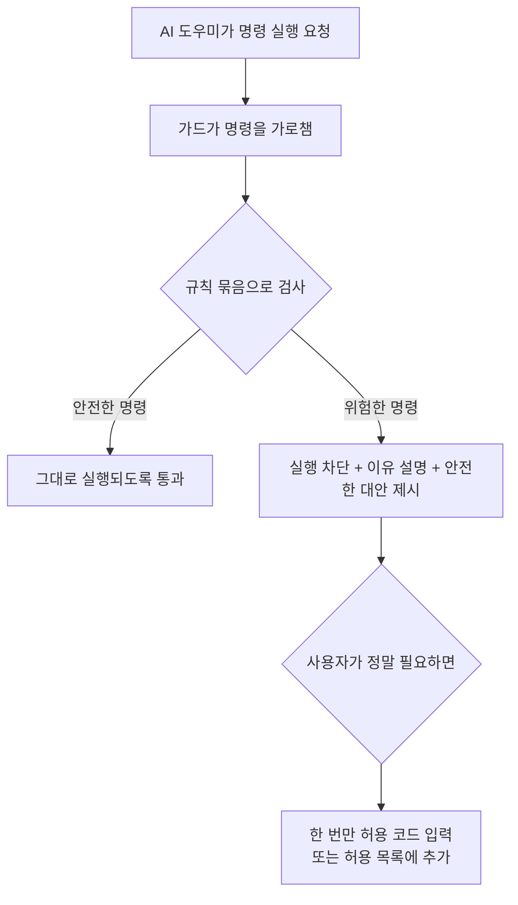

<div class="ai-knowledge-shell">

<aside class="ai-knowledge-sidebar">
  <p class="ai-eyebrow">CATEGORIES</p>
  <nav class="ai-cat-tree"><details class="ai-cat" open><summary><span class="catname">에이전트 오케스트레이션</span><span class="catcount">13</span></summary><ul><li><a href="https://altjs4510.github.io/ai_news_blog/knowledge/20260717/"><span class="kdate">2026-07-17</span><span class="ktitle">After a year building agent memory, 'save everyt…</span></a></li><li><a href="https://altjs4510.github.io/ai_news_blog/knowledge/20260708/"><span class="kdate">2026-07-08</span><span class="ktitle">Expanding Managed Agents in Gemini API: backgrou…</span></a></li><li><a href="https://altjs4510.github.io/ai_news_blog/knowledge/20260707/"><span class="kdate">2026-07-07</span><span class="ktitle">AI Hero Skills Catalog — 실무 엔지니어를 위한 재사용 가능한 판단 …</span></a></li><li><a href="https://altjs4510.github.io/ai_news_blog/knowledge/20260705/"><span class="kdate">2026-07-05</span><span class="ktitle">openai/codex-plugin-cc — Claude Code에서 Codex를 위임…</span></a></li><li><a href="https://altjs4510.github.io/ai_news_blog/knowledge/20260701/"><span class="kdate">2026-07-01</span><span class="ktitle">Google OKF (Open Knowledge Format) — 벤더 중립 에이전트 …</span></a></li><li><a href="https://altjs4510.github.io/ai_news_blog/knowledge/20260623/"><span class="kdate">2026-06-23</span><span class="ktitle">bytedance/deer-flow — 샌드박스·메모리·서브에이전트·메시지 게이트웨이를…</span></a></li><li><a href="https://altjs4510.github.io/ai_news_blog/knowledge/20260621/"><span class="kdate">2026-06-21</span><span class="ktitle">calesthio/OpenMontage — 12 파이프라인·52 도구·500+ 스킬을 …</span></a></li><li><a href="https://altjs4510.github.io/ai_news_blog/knowledge/20260611/"><span class="kdate">2026-06-11</span><span class="ktitle">The evolution of agentic surfaces: building with…</span></a></li><li><a href="https://altjs4510.github.io/ai_news_blog/knowledge/20260602/"><span class="kdate">2026-06-02</span><span class="ktitle">revfactory/harness — 도메인별 에이전트 팀과 스킬을 자동 설계하는 메타…</span></a></li><li><a href="https://altjs4510.github.io/ai_news_blog/knowledge/20260529/"><span class="kdate">2026-05-29</span><span class="ktitle">Introducing dynamic workflows in Claude Code</span></a></li><li><a href="https://altjs4510.github.io/ai_news_blog/knowledge/20260520/"><span class="kdate">2026-05-20</span><span class="ktitle">New in Claude Managed Agents: self-hosted sandbo…</span></a></li><li><a href="https://altjs4510.github.io/ai_news_blog/knowledge/20260507/"><span class="kdate">2026-05-07</span><span class="ktitle">ruvnet/ruflo — Claude 멀티 에이전트 오케스트레이션 플랫폼</span></a></li><li><a href="https://altjs4510.github.io/ai_news_blog/knowledge/20260504/"><span class="kdate">2026-05-04</span><span class="ktitle">Agents for Everything Else: Codex for Knowledge …</span></a></li></ul></details><details class="ai-cat" open><summary><span class="catname">MCP &amp; 도구 통합</span><span class="catcount">10</span></summary><ul><li><a href="https://altjs4510.github.io/ai_news_blog/knowledge/20260618/"><span class="kdate">2026-06-18</span><span class="ktitle">DeusData/codebase-memory-mcp — 158개 언어 코드베이스를 밀리…</span></a></li><li><a href="https://altjs4510.github.io/ai_news_blog/knowledge/20260605/"><span class="kdate">2026-06-05</span><span class="ktitle">chopratejas/headroom — Compress tool outputs, lo…</span></a></li><li><a href="https://altjs4510.github.io/ai_news_blog/knowledge/20260604/"><span class="kdate">2026-06-04</span><span class="ktitle">chopratejas/headroom — Compress tool outputs bef…</span></a></li><li><a href="https://altjs4510.github.io/ai_news_blog/knowledge/20260603/"><span class="kdate">2026-06-03</span><span class="ktitle">How Bad MCP design cost your Agent 5× more token…</span></a></li><li><a href="https://altjs4510.github.io/ai_news_blog/knowledge/20260526/"><span class="kdate">2026-05-26</span><span class="ktitle">colbymchenry/codegraph — Pre-indexed code knowle…</span></a></li><li><a href="https://altjs4510.github.io/ai_news_blog/knowledge/20260523/"><span class="kdate">2026-05-23</span><span class="ktitle">colbymchenry/codegraph — 사전 인덱싱된 코드 지식 그래프 MCP</span></a></li><li><a href="https://altjs4510.github.io/ai_news_blog/knowledge/20260521/"><span class="kdate">2026-05-21</span><span class="ktitle">colbymchenry/codegraph — Pre-indexed code knowle…</span></a></li><li><a href="https://altjs4510.github.io/ai_news_blog/knowledge/20260519/"><span class="kdate">2026-05-19</span><span class="ktitle">Anthropic acquires Stainless</span></a></li><li><a href="https://altjs4510.github.io/ai_news_blog/knowledge/20260517/"><span class="kdate">2026-05-17</span><span class="ktitle">I gave my LLM 100,000+ tools — Lazy Discovery &a…</span></a></li><li><a href="https://altjs4510.github.io/ai_news_blog/knowledge/20260509/"><span class="kdate">2026-05-09</span><span class="ktitle">How to connect 100 MCP servers without the conte…</span></a></li></ul></details><details class="ai-cat" open><summary><span class="catname">코딩 에이전트</span><span class="catcount">11</span></summary><ul><li><a href="https://altjs4510.github.io/ai_news_blog/knowledge/20260714/"><span class="kdate">2026-07-14</span><span class="ktitle">Graphify-Labs/graphify — 코드베이스를 질의 가능한 지식 그래프로 만…</span></a></li><li><a href="https://altjs4510.github.io/ai_news_blog/knowledge/20260626/"><span class="kdate">2026-06-26</span><span class="ktitle">google-labs-code/design.md — 코딩 에이전트에게 디자인 시스템을 …</span></a></li><li><a href="https://altjs4510.github.io/ai_news_blog/knowledge/20260619/"><span class="kdate">2026-06-19</span><span class="ktitle">Claude Code now supports artifacts</span></a></li><li><a href="https://altjs4510.github.io/ai_news_blog/knowledge/20260530/"><span class="kdate">2026-05-30</span><span class="ktitle">Leonxlnx/taste-skill — AI에게 좋은 취향을 부여해 generic s…</span></a></li><li><a href="https://altjs4510.github.io/ai_news_blog/knowledge/20260528/"><span class="kdate">2026-05-28</span><span class="ktitle">Building self-improving tax agents with Codex</span></a></li><li><a href="https://altjs4510.github.io/ai_news_blog/knowledge/20260524/"><span class="kdate">2026-05-24</span><span class="ktitle">colbymchenry/codegraph — Pre-indexed code knowle…</span></a></li><li><a href="https://altjs4510.github.io/ai_news_blog/knowledge/20260512/"><span class="kdate">2026-05-12</span><span class="ktitle">agentmemory — Persistent memory for AI coding ag…</span></a></li><li><a href="https://altjs4510.github.io/ai_news_blog/knowledge/20260510/"><span class="kdate">2026-05-10</span><span class="ktitle">addyosmani/agent-skills — Production-grade engin…</span></a></li><li><a href="https://altjs4510.github.io/ai_news_blog/knowledge/20260508/"><span class="kdate">2026-05-08</span><span class="ktitle">addyosmani/agent-skills — Production-grade engin…</span></a></li><li><a href="https://altjs4510.github.io/ai_news_blog/knowledge/20260506/"><span class="kdate">2026-05-06</span><span class="ktitle">mksglu/context-mode — AI 코딩 에이전트용 컨텍스트 윈도우 최적화</span></a></li><li><a href="https://altjs4510.github.io/ai_news_blog/knowledge/20260505/"><span class="kdate">2026-05-05</span><span class="ktitle">mattpocock/skills — Skills for Real Engineers (.…</span></a></li></ul></details><details class="ai-cat" open><summary><span class="catname">모델 &amp; 연구</span><span class="catcount">6</span></summary><ul><li><a href="https://altjs4510.github.io/ai_news_blog/knowledge/20260716-proprag/"><span class="kdate">2026-07-16</span><span class="ktitle">PropRAG — 프로포지션 경로 위 beam search로 멀티홉 검색 안내</span></a></li><li><a href="https://altjs4510.github.io/ai_news_blog/knowledge/20260712/"><span class="kdate">2026-07-12</span><span class="ktitle">Do Automated Evals Work?</span></a></li><li><a href="https://altjs4510.github.io/ai_news_blog/knowledge/20260620/"><span class="kdate">2026-06-20</span><span class="ktitle">zai-org/GLM-5 — From Vibe Coding to Agentic Engi…</span></a></li><li><a href="https://altjs4510.github.io/ai_news_blog/knowledge/20260617/"><span class="kdate">2026-06-17</span><span class="ktitle">Predicting model behavior before release by simu…</span></a></li><li><a href="https://altjs4510.github.io/ai_news_blog/knowledge/20260516/"><span class="kdate">2026-05-16</span><span class="ktitle">STALE — 에이전트가 자기 기억의 유효성을 인지할 수 있는가</span></a></li><li><a href="https://altjs4510.github.io/ai_news_blog/knowledge/20260513/"><span class="kdate">2026-05-13</span><span class="ktitle">Thinking Machines' Native Interaction Models — T…</span></a></li></ul></details><details class="ai-cat" open><summary><span class="catname">인프라 &amp; 컴퓨트</span><span class="catcount">4</span></summary><ul><li><a href="https://altjs4510.github.io/ai_news_blog/knowledge/20260630/"><span class="kdate">2026-06-30</span><span class="ktitle">Introducing the Claude apps gateway for Amazon B…</span></a></li><li><a href="https://altjs4510.github.io/ai_news_blog/knowledge/20260610/"><span class="kdate">2026-06-10</span><span class="ktitle">Fable 5 just made cost-aware model routing manda…</span></a></li><li><a href="https://altjs4510.github.io/ai_news_blog/knowledge/20260606/"><span class="kdate">2026-06-06</span><span class="ktitle">chopratejas/headroom — Compress tool outputs, lo…</span></a></li><li><a href="https://altjs4510.github.io/ai_news_blog/knowledge/20260522/"><span class="kdate">2026-05-22</span><span class="ktitle">Giving Agents Computers — Ivan Burazin, Daytona</span></a></li></ul></details><details class="ai-cat" open><summary><span class="catname">보안 &amp; 거버넌스</span><span class="catcount">13</span></summary><ul><li><a href="https://altjs4510.github.io/ai_news_blog/knowledge/20260716/"><span class="kdate">2026-07-16</span><span class="ktitle">Dicklesworthstone/destructive_command_guard — 에이…</span></a></li><li><a href="https://altjs4510.github.io/ai_news_blog/knowledge/20260715/" class="current"><span class="kdate">2026-07-15</span><span class="ktitle">Dicklesworthstone/destructive_command_guard — 에이…</span></a></li><li><a href="https://altjs4510.github.io/ai_news_blog/knowledge/20260710/"><span class="kdate">2026-07-10</span><span class="ktitle">70개 MCP 서버 strace 런타임 감사 — 부팅 시 아웃바운드 호출 서버 적발</span></a></li><li><a href="https://altjs4510.github.io/ai_news_blog/knowledge/20260704/"><span class="kdate">2026-07-04</span><span class="ktitle">Cloudflare is about to block AI agents by defaul…</span></a></li><li><a href="https://altjs4510.github.io/ai_news_blog/knowledge/20260703/"><span class="kdate">2026-07-03</span><span class="ktitle">Giving admins more visibility and control over C…</span></a></li><li><a href="https://altjs4510.github.io/ai_news_blog/knowledge/20260625/"><span class="kdate">2026-06-25</span><span class="ktitle">Agent identity in Claude Tag: a new access model…</span></a></li><li><a href="https://altjs4510.github.io/ai_news_blog/knowledge/20260624/"><span class="kdate">2026-06-24</span><span class="ktitle">Agent identity in Claude Tag: a new access model…</span></a></li><li><a href="https://altjs4510.github.io/ai_news_blog/knowledge/20260614/"><span class="kdate">2026-06-14</span><span class="ktitle">NVIDIA/SkillSpector — Security scanner for AI ag…</span></a></li><li><a href="https://altjs4510.github.io/ai_news_blog/knowledge/20260613/"><span class="kdate">2026-06-13</span><span class="ktitle">Fable 5's guardrails got bypassed in 48 hours — …</span></a></li><li><a href="https://altjs4510.github.io/ai_news_blog/knowledge/20260612/"><span class="kdate">2026-06-12</span><span class="ktitle">NVIDIA/SkillSpector — AI 에이전트 스킬용 보안 스캐너</span></a></li><li><a href="https://altjs4510.github.io/ai_news_blog/knowledge/20260607/"><span class="kdate">2026-06-07</span><span class="ktitle">OpenAI Help: Lockdown Mode</span></a></li><li><a href="https://altjs4510.github.io/ai_news_blog/knowledge/20260531/"><span class="kdate">2026-05-31</span><span class="ktitle">How we contain Claude across products</span></a></li><li><a href="https://altjs4510.github.io/ai_news_blog/knowledge/20260527/"><span class="kdate">2026-05-27</span><span class="ktitle">Microsoft Copilot Cowork Exfiltrates Files</span></a></li></ul></details><details class="ai-cat" open><summary><span class="catname">응용 사례</span><span class="catcount">4</span></summary><ul><li><a href="https://altjs4510.github.io/ai_news_blog/knowledge/20260709/"><span class="kdate">2026-07-09</span><span class="ktitle">mvanhorn/last30days-skill — Reddit·X·YouTube·HN·…</span></a></li><li><a href="https://altjs4510.github.io/ai_news_blog/knowledge/20260609/"><span class="kdate">2026-06-09</span><span class="ktitle">Building intelligent apps for Apple platforms wi…</span></a></li><li><a href="https://altjs4510.github.io/ai_news_blog/knowledge/20260515/"><span class="kdate">2026-05-15</span><span class="ktitle">Clawdmeter — Claude Code 사용량을 데스크톱 대시보드로</span></a></li><li><a href="https://altjs4510.github.io/ai_news_blog/knowledge/20260514/"><span class="kdate">2026-05-14</span><span class="ktitle">Introducing Claude for Small Business</span></a></li></ul></details><details class="ai-cat" open><summary><span class="catname">산업 동향</span><span class="catcount">3</span></summary><ul><li><a href="https://altjs4510.github.io/ai_news_blog/knowledge/20260711/"><span class="kdate">2026-07-11</span><span class="ktitle">OpenAI says GPT 5.6 is the 'preferred model' for…</span></a></li><li><a href="https://altjs4510.github.io/ai_news_blog/knowledge/20260702/"><span class="kdate">2026-07-02</span><span class="ktitle">How Cursor deploys AI inside the enterprise (For…</span></a></li><li><a href="https://altjs4510.github.io/ai_news_blog/knowledge/20260616/"><span class="kdate">2026-06-16</span><span class="ktitle">Why AI hasn't replaced software engineers, and w…</span></a></li></ul></details></nav>
</aside>

<article class="ai-knowledge-article">

<header class="ai-post-hero">
  <p class="ai-eyebrow"><a class="ai-back" href="../">KNOWLEDGE</a> · 2026-07-15 · 오늘의 학습</p>
  <h2 class="ai-post-title">Dicklesworthstone/destructive_command_guard — 에이전트의 위험한 git·shell 명령을 차단하는 가드</h2>
</header>

> 원문: [Dicklesworthstone/destructive_command_guard — 에이전트의 위험한 git·shell 명령을 차단하는 가드](https://github.com/Dicklesworthstone/destructive_command_guard)

## 📌 학습 정리

### 1. 한 줄로 말하면

AI 코딩 도우미가 실수로 파일을 지우거나 저장소를 뒤엎기 전에, "그 명령은 위험하니까 잠깐 멈춰"라고 가로막아주는 안전장치예요.

### 2. 왜 이게 만들어졌어요?

요즘은 클로드(Claude), 코덱스(Codex), 제미나이(Gemini) 같은 AI 코딩 도우미가 사람 대신 터미널 명령을 직접 실행해주죠. 편리하긴 한데, 가끔 이 친구들이 판단을 잘못해서 `git reset --hard`처럼 커밋 안 한 작업을 통째로 날리거나, `rm -rf ./src` 같은 명령으로 소스 폴더를 지우는 사고를 냅니다. 몇 시간, 며칠 작업이 몇 초 만에 사라지는 거예요. 이런 사고를 매번 사람이 눈으로 감시해서 막기는 어렵기 때문에, 명령이 실제로 실행되기 직전에 자동으로 가로채서 검사하는 도구가 필요해졌습니다. 이 프로젝트는 원래 파이썬 스크립트로 시작했다가, 속도가 중요해서 러스트(Rust, 성능이 좋은 시스템 프로그래밍 언어)로 다시 만들어졌어요.

### 3. 비유로 풀면

이건 마치 자동차의 자동 긴급 제동장치 같은 거예요. 운전자(AI 도우미)가 앞을 못 보고 그대로 가속 페달을 밟아도, 센서가 "앞에 벽이 있어요"라고 감지해서 브레이크를 대신 밟아주는 장치죠. 그래서 결국, AI가 위험한 명령을 실행하려는 그 짧은 순간에 끼어들어 "이건 되돌릴 수 없는 작업이니 진짜로 할 건지 확인해줘"라고 붙잡아주는 중간 문지기 역할을 합니다.

### 4. 어떻게 작동하는지 (그림으로)



핵심 흐름은 이렇습니다. AI 도우미가 어떤 명령을 실행하기 직전에 "훅(hook)"이라고 부르는 연결 지점에서 이 가드가 먼저 명령 문자열을 받아봅니다. 미리 정의된 규칙 묶음(예: 데이터베이스용, 도커용, AWS용 등)에 비추어 위험하다고 판단되면 실행을 막고, 왜 막았는지와 더 안전한 방법을 사람이 읽기 좋은 형태로 알려줍니다. 반대로 안전하다고 판단되면 아무 방해 없이 통과시켜요.

### 5. 처음 보는 용어 풀이

- **AI 코딩 도우미 (AI coding agent)** — 사람이 자연어로 지시하면 코드를 짜고 터미널 명령까지 대신 실행해주는 AI 도구예요. 클로드 코드, 코덱스 CLI, 커서(Cursor) 같은 것들이 여기 해당합니다.
- **훅 (hook)** — 어떤 프로그램이 특정 동작을 하기 직전이나 직후에, 외부 스크립트를 끼워 넣을 수 있게 열어둔 연결 지점이에요. 이 가드는 "명령을 실행하기 직전(PreToolUse)" 훅에 붙어서 검사를 수행합니다.
- **파괴적 명령 (destructive command)** — 한번 실행하면 되돌리기 어려운 명령을 말해요. 파일 삭제, 데이터베이스의 테이블 삭제(DROP TABLE), 강제 푸시(force push), 클라우드 인스턴스 종료 같은 것들이 여기 속합니다.
- **규칙 묶음 (pack)** — 특정 분야에서 위험하다고 알려진 명령 패턴을 모아둔 세트예요. 예를 들어 `database.postgresql` 팩은 PostgreSQL(오픈소스 관계형 데이터베이스)에서 위험한 명령들을, `containers.docker` 팩은 도커에서 위험한 명령들을 담고 있어요.
- **허용 목록 (allowlist)** — "이 명령은 위험해 보여도 우리 환경에선 괜찮으니 그냥 통과시켜줘"라고 미리 등록해두는 명단이에요. 매번 막히면 귀찮으니까 반복적으로 쓰는 안전한 명령을 등록해둘 수 있습니다.
- **탈출구 / 우회 (bypass)** — 가드가 막긴 했지만 사용자가 정말로 실행해야 할 때 쓰는 예외 수단이에요. 이 도구에서는 `DCG_BYPASS=1`을 붙여 한 번만 우회하거나, 차단 메시지에 뜬 짧은 코드를 입력해서 딱 한 번 허용하는 방식이 있습니다.
- **페일-오픈 설계 (fail-open design)** — 가드 자체에 문제가 생겼을 때(시간이 너무 오래 걸리거나 명령을 해석 못 하거나) 명령을 막지 않고 그냥 통과시키는 정책이에요. 안전보다는 "가드 때문에 작업이 멈추는 일은 없게 하자"는 쪽에 무게를 둔 선택입니다.
- **스캔 모드 (scan mode)** — 실시간 차단이 아니라, 커밋 전이나 코드 리뷰 단계에서 스크립트 안에 위험한 명령이 숨어 있는지 훑어보는 검사 모드예요.

### 6. 한 발 더 들어가고 싶다면

- [원본 저장소](https://github.com/Dicklesworthstone/destructive_command_guard) — 설치 방법과 지원 도구 목록을 한눈에 볼 수 있어요.
- [Codex 연동 문서 (docs/codex-integration.md)](https://github.com/Dicklesworthstone/destructive_command_guard/blob/main/docs/codex-integration.md) — 코덱스 CLI와 어떻게 훅 프로토콜을 주고받는지, 차단된 명령을 코덱스가 어떻게 인식하도록 만들었는지 배경을 알 수 있어요.
- [에이전트별 프로파일 문서 (docs/agents.md)](https://github.com/Dicklesworthstone/destructive_command_guard/blob/main/docs/agents.md) — 어떤 AI 도우미를 얼마나 신뢰할지, 도우미마다 어떤 규칙을 켜고 끌지 세부 설정 방법을 볼 수 있어요.
- [단계적 대응 모드 문서 (docs/graduated-response.md)](https://github.com/Dicklesworthstone/destructive_command_guard/blob/main/docs/graduated-response.md) — "paranoid" 같은 이름의 강한 모드가 실제로 무엇을 뜻하는지, 규칙 팩과는 어떻게 다른지 설명해줘요.
- [원저자의 초기 파이썬 스크립트 설명](https://github.com/Dicklesworthstone/misc_coding_agent_tips_and_scripts/blob/main/DESTRUCTIVE_GIT_COMMAND_CLAUDE_HOOKS_SETUP.md) — 이 아이디어가 처음에 어떤 문제의식에서 어떻게 시작되었는지 원형을 볼 수 있어요.

---

## 📖 원문 전체 번역 (정독용)

> 의역 최소화한 전체 번역입니다. 큰 흐름은 위 정리에서 잡고, 정확한 워딩이 필요할 땐 이 섹션에서 정독하세요.

[](https://github.com/Dicklesworthstone/destructive_command_guard/blob/main/illustration.webp)

[](https://codecov.io/gh/Dicklesworthstone/destructive_command_guard)[](https://opensource.org/licenses/MIT)

AI 코딩 에이전트용 고성능 훅(hook)으로, 파괴적인 명령이 실행되기 전에 차단하여 Claude Code, Codex CLI, Gemini CLI, Copilot CLI, VS Code Copilot Chat, Cursor, Hermes Agent, Grok (xAI) 및 관련 도구에서 발생할 수 있는 실수로 인한 삭제로부터 작업물을 보호합니다.

**지원 도구:** [Claude Code](https://claude.ai/code), [Codex CLI 0.125.0+](https://github.com/openai/codex), [Gemini CLI](https://github.com/google-gemini/gemini-cli), [GitHub Copilot CLI](https://docs.github.com/en/copilot/concepts/agents/coding-agent/about-hooks), [VS Code Copilot Chat](https://code.visualstudio.com/docs/agent-customization/hooks), [Cursor IDE](https://cursor.com/), [Hermes Agent](https://github.com/NousResearch/hermes-agent), [Grok (xAI)](https://x.ai/news/grok-build-cli) (네이티브 `~/.grok/hooks/` + Claude 호환 레이어), [Antigravity CLI (`agy`)](https://antigravity.google/) (`dcg install --agy`를 통한 네이티브 `~/.gemini/config/hooks.json`), [OpenCode](https://opencode.ai/) ([커뮤니티 플러그인](https://github.com/aspiers/ai-config/blob/main/.config/opencode/plugins/dcg-guard.js) 경유), [Pi](https://github.com/earendil-works/pi) ([확장 레시피](https://github.com/Dicklesworthstone/destructive_command_guard/blob/main/docs/pi-integration.md) 경유), [Aider](https://aider.chat/) (제한적—git 훅만), [Continue](https://continue.dev/) (감지만)

### 빠른 설치

[](https://github.com/Dicklesworthstone/destructive_command_guard#quick-install)

```
curl -fsSL "https://raw.githubusercontent.com/Dicklesworthstone/destructive_command_guard/main/install.sh?$(date +%s)" | bash -s -- --easy-mode
```

_Linux, macOS, WSL을 통한 Windows에서 작동합니다. 플랫폼을 자동 감지하고 적합한 바이너리를 다운로드하며, Claude Code, Codex CLI, Gemini CLI, GitHub Copilot CLI, VS Code Copilot Chat (VS Code의 Claude 훅 호환성을 통해), Cursor IDE, Hermes Agent, Grok (xAI) (네이티브 `~/.grok/hooks/dcg.json`을 위한 `dcg install --grok` 또는 Grok이 자동으로 인식하는 Claude 호환 레이어를 통해) 등 지원되는 에이전트 훅을 설정합니다. 네이티브 Windows의 경우 아래 PowerShell 설치 프로그램을 사용하세요._

#### Windows (네이티브, PowerShell)

[](https://github.com/Dicklesworthstone/destructive_command_guard#windows-native-powershell)

```
& ([scriptblock]::Create((irm "https://raw.githubusercontent.com/Dicklesworthstone/destructive_command_guard/main/install.ps1"))) -EasyMode -Verify
```

_네이티브 `dcg.exe`를 설치하고, SHA256 체크섬(`cosign`이 있을 경우 Sigstore/cosign 서명도)을 검증하며, User `PATH`에 추가하고(`-EasyMode`), 자가 테스트를 실행하고(`-Verify`), Claude Code, Codex CLI, Gemini CLI, GitHub Copilot CLI, Cursor IDE, Hermes Agent에 대해 감지된 에이전트 훅을 설정합니다. Copilot은 `%COPILOT\_HOME%\hooks` (또는 `%USERPROFILE%\.copilot\hooks`) 아래 사용자 수준에서 구성되므로 모든 워크스페이스가 보호됩니다. Windows에서는 `windows.filesystem` 및 `windows.system` 팩이 기본적으로 활성화되어 있으므로 `del /s`, `rd /s`, `Remove-Item -Recurse -Force`, `format`, `vssadmin delete shadows`가 기본적으로 차단됩니다. `-Version vX.Y.Z`로 특정 버전을 고정할 수 있습니다._

---

## TL;DR

[](https://github.com/Dicklesworthstone/destructive_command_guard#tldr)

**문제**: AI 코딩 에이전트(Claude, Codex, Gemini, Copilot 등)는 가끔 `git reset --hard`, `rm -rf ./src`, `DROP TABLE users`와 같은 치명적인 명령을 실행하여 수 시간의 커밋되지 않은 작업을 순식간에 파괴합니다.

**해결책**: dcg는 파괴적인 명령이 실행되기 _전에_ 이를 가로채어 명확한 설명과 더 안전한 대안과 함께 차단하는 고성능 훅입니다.

### dcg를 사용해야 하는 이유

[](https://github.com/Dicklesworthstone/destructive_command_guard#why-use-dcg)

| 기능 | 설명 |
| --- | --- |
| **무설정 보호** | 위험한 git/파일시스템 명령을 기본적으로 차단 |
| **50개 이상의 보안 팩** | 데이터베이스, Kubernetes, Docker, AWS/GCP/Azure, Terraform 등 |
| **밀리초 미만의 지연** | SIMD 가속 필터링—존재를 느끼지 못할 수준 |
| **Heredoc/인라인 스크립트 스캔** | `python -c "os.remove(...)"` 및 내장 셸 스크립트 탐지 |
| **스마트 컨텍스트 감지** | `grep "rm -rf"` (데이터)는 차단하지 않지만 `rm -rf /` (실행)는 차단 |
| **풍부한 터미널 출력** | 사람이 읽을 수 있는 차단 패널, 규칙 컨텍스트, 제안을 stderr에 출력 |
| **에이전트 안전 스트림** | 머신 판독 가능한 훅 출력은 stdout에, 풍부한 UI는 stderr에 유지 |
| **네이티브 Codex 지원** | Codex CLI 0.125.0+는 현재 클라이언트가 신뢰할 수 있게 적용하는 최소한의 stdout JSON 차단 메시지를 수신 |
| **우아한 성능 저하** | CI, 파이프, 덤 터미널, 색상 없는 환경을 위한 일반 출력 |
| **CI용 스캔 모드** | 코드 리뷰에서 위험한 명령을 잡아내는 pre-commit 훅 및 CI 통합 |
| **Fail-Open 설계** | 타임아웃이나 파싱 오류로 인해 워크플로우를 차단하지 않음 |
| **설명 모드** | `dcg explain "command"`로 차단 이유를 정확히 확인 |

### 빠른 예시

[](https://github.com/Dicklesworthstone/destructive_command_guard#quick-example)

```
# AI 에이전트가 실행 시도:
$ git reset --hard HEAD~5

# dcg가 가로채어 차단:
════════════════════════════════════════════════════════════════
BLOCKED  dcg
────────────────────────────────────────────────────────────────
Reason:  git reset --hard destroys uncommitted changes

Command: git reset --hard HEAD~5

Tip: Consider using 'git stash' first to save your changes.
════════════════════════════════════════════════════════════════
```

### 더 많은 보호 활성화

[](https://github.com/Dicklesworthstone/destructive_command_guard#enable-more-protection)

```toml
# ~/.config/dcg/config.toml
[packs]
enabled = [
    "database.postgresql",    # DROP TABLE, TRUNCATE 차단
    "kubernetes.kubectl",     # kubectl delete namespace 차단
    "cloud.aws",              # aws ec2 terminate-instances 차단
    "containers.docker",      # docker system prune 차단
]
```

### 에이전트별 프로파일

[](https://github.com/Dicklesworthstone/destructive_command_guard#agent-specific-profiles)

dcg는 어떤 AI 코딩 에이전트가 호출하는지를 자동으로 감지하고 에이전트별 설정을 적용할 수 있습니다. `trust_level` 필드는 JSON 출력 및 로그에 기록되는 **권고 레이블**입니다 — 규칙 평가를 직접 변경하지는 않습니다. 동작의 차이는 다른 프로파일 필드에서 비롯됩니다:

| 옵션 | 효과 |
| --- | --- |
| `disabled_packs` | 평가에서 규칙 팩 제거 |
| `extra_packs` | 평가에 규칙 팩 추가 |
| `additional_allowlist` | 차단 규칙을 우회하는 명령 패턴 추가 |
| `disabled_allowlist` | `true`이면 모든 허용 목록 항목 무시 |

```toml
# Claude Code를 더 신뢰 — 허용 목록 확장, 팩 축소
[agents.claude-code]
trust_level = "high"
additional_allowlist = ["npm run build", "cargo test"]
disabled_packs = ["kubernetes"]

# 알 수 없는 에이전트 제한 — 규칙 추가, 허용 목록 우회 없음
[agents.unknown]
trust_level = "low"
extra_packs = ["strict_git", "database"]  # 실제 팩/카테고리 ID (`dcg packs` 참조)
disabled_allowlist = true
```

> `extra_packs`/`disabled_packs`는 `[packs] enabled`/`disabled`와 동일한 팩 및 카테고리 ID를 사용합니다 — `"database"`와 같은 **카테고리 ID**는 해당 카테고리의 모든 `database.*` 하위 팩으로 확장됩니다. `dcg packs` 또는 `docs/packs/README.md`에 나열된 ID를 사용하세요; `"paranoid"`는 [단계적 응답 모드](https://github.com/Dicklesworthstone/destructive_command_guard/blob/main/docs/graduated-response.md)이지, 팩이 아니므로, 더 엄격한 git 규칙을 원하면 실제 `strict_git` 팩을 활성화하세요.

지원되는 에이전트, 신뢰 수준, 설정 옵션에 대한 전체 문서는 [docs/agents.md](https://github.com/Dicklesworthstone/destructive_command_guard/blob/main/docs/agents.md)를 참조하세요.

### Codex 지원

[](https://github.com/Dicklesworthstone/destructive_command_guard#codex-support)

dcg는 이제 Codex CLI를 단순히 Claude 형태의 호환 경로가 아닌 일급(first-class) 훅 대상으로 취급합니다. 설치 프로그램은 `PATH`에 `codex`가 있거나 `~/.codex/` 디렉터리가 존재하면 Codex CLI 0.125.0+를 자동으로 설정합니다.

| Codex 동작 | dcg 처리 방식 |
| --- | --- |
| 훅 설정 | `PreToolUse` Bash 훅을 `~/.codex/hooks.json`에 병합 |
| 차단된 명령 | stdout에 최소한의 `hookSpecificOutput` 차단 메시지를 담아 종료 코드 0으로 종료; 사람용 경고는 stderr에 표시 |
| 허용된 명령 | stdout과 stderr 모두 비운 채로 종료 코드 0으로 종료 |
| 기존 훅 | 공존하는 훅을 보존하고, Bash에서 dcg를 첫 번째로 유지하며, 잘못된 JSON 덮어쓰기를 거부 |
| 검증 | 서브프로세스 프로토콜 테스트 + 옵트인 실제 Codex E2E 하네스로 검증 |

Codex의 훅 입력은 의도적으로 Claude Code의 것과 유사하지만, Codex는 훅 출력에서 알 수 없는 필드를 거부합니다. dcg는 `turn_id` 필드가 비어있지 않으면 Codex 페이로드를 감지하고, Codex가 문서화한 차단 필드만 출력하므로 차단된 명령이 실패한 훅이 아닌 차단된 것으로 보고됩니다. 프로토콜 세부 정보, 수동 프로브, 문제 해결은 [docs/codex-integration.md](https://github.com/Dicklesworthstone/destructive_command_guard/blob/main/docs/codex-integration.md)를 참조하세요.

---

## 기원 및 저자

[](https://github.com/Dicklesworthstone/destructive_command_guard#origins--authors)

이 프로젝트는 Jeffrey Emanuel이 Python 스크립트로 시작했습니다. 그는 AI 코딩 에이전트가 매우 유용하지만 가끔씩 수 시간의 커밋되지 않은 작업을 파괴하는 치명적인 명령을 실행한다는 점을 인식했습니다. 초기 구현은 실행 전에 위험한 git 및 파일시스템 명령을 가로채는 단순하지만 효과적인 훅이었습니다.

*   **[Jeffrey Emanuel](https://github.com/Dicklesworthstone)** - 원래 개념 및 Python 구현 ([출처](https://github.com/Dicklesworthstone/misc_coding_agent_tips_and_scripts/blob/main/DESTRUCTIVE_GIT_COMMAND_CLAUDE_HOOKS_SETUP.md)); 모듈식 팩 시스템(50개 이상의 보안 팩), heredoc/인라인 스크립트 스캔, 3계층 아키텍처, 컨텍스트 분류, 허용 목록, 스캔 모드, 이중 정규식 엔진으로 Rust 버전을 대폭 확장
*   **[Darin Gordon](https://github.com/Dowwie)** - 성능 최적화를 포함한 초기 Rust 포팅

Darin의 초기 Rust 포팅은 원래 Python 구현과의 패턴 호환성을 유지하면서 SIMD 가속 필터링 및 지연 컴파일(lazy-compiled) 정규식 패턴을 통해 밀리초 미만의 실행을 추가했습니다. Jeffrey는 이후 위에 설명된 기능들을 추가하기 위해 Rust 코드베이스를 대폭 확장했습니다.

## 탈출구 / 우회

[](https://github.com/Dicklesworthstone/destructive_command_guard#escape-hatch--bypass)

dcg가 실제로 실행해야 하는 명령을 차단하고 있다면:

| 방법 | 범위 | 방법 |
| --- | --- | --- |
| **환경 변수 우회** | 단일 명령 | `DCG_BYPASS=1 <command>` |
| **일회성 허용 코드** | 단일 명령 | 차단 메시지에서 짧은 코드를 복사하여 `dcg allow-once <code>` 실행 |
| **영구 허용 목록** | 규칙 또는 명령 | `dcg allowlist add core.git:reset-hard -r "reason"` |
| **훅 제거** | 모든 명령 | `~/.claude/settings.json`(또는 해당 에이전트의 동등한 파일)에서 dcg 항목을 삭제하거나 주석 처리 |

`DCG_BYPASS=1`은 해당 호출에 대한 모든 보호를 비활성화합니다. 드물게 사용하고 반복적인 필요에 대해서는 허용 목록을 선호하세요.

## 모듈식 팩 시스템

[](https://github.com/Dicklesworthstone/destructive_command_guard#modular-pack-system)

dcg는 파괴적인 명령 패턴을 카테고리별로 구성하기 위해 모듈식 "팩" 시스템을 사용합니다. 팩은 설정 파일에서 활성화하거나 비활성화할 수 있습니다.

**카테고리 ID는 하위 팩으로 확장됩니다.** `enabled`에 카테고리만 나열하면 그 아래의 모든 팩이 켜집니다: `enabled = ["database"]`는 `database.postgresql`, `database.mysql` 및 해당 카테고리의 나머지를 활성화합니다. `disabled = ["database.redis"]`로 단일 하위 팩을 제거할 수도 있습니다. 동일한 확장이 에이전트 프로파일의 `extra_packs`/`disabled_packs`에도 적용됩니다. 항상 `dcg packs`/`docs/packs/README.md`의 실제 팩 또는 카테고리 ID를 사용하세요 — `"paranoid"`와 같은 이름은 [단계적 응답 모드](https://github.com/Dicklesworthstone/destructive_command_guard/blob/main/docs/graduated-response.md)이지 팩이 아닙니다.

*   전체 팩 ID 인덱스: `docs/packs/README.md`
*   표준 설명 + 패턴 수: `dcg packs --verbose`

### 기본으로 활성화된 항목 (설정 파일 없음)

[](https://github.com/Dicklesworthstone/destructive_command_guard#enabled-by-default-no-config-file)

**설정 파일이 없으면** dcg는 가장 치명적이고 복구 불가능한 실수로부터 보호하는 팩만 활성화합니다:

*   `core.filesystem` - 임시 디렉터리 외부에서의 위험한 `rm -rf` _(항상 활성화; 비활성화 불가)_
*   `core.git` - 커밋되지 않은 작업 손실, 히스토리 재작성 또는 스태시 파괴를 초래하는 파괴적인 git 명령 _(항상 활성화; 비활성화 불가)_
*   `system.disk` - `mkfs`, `dd`-to-device, `fdisk`, `parted`, `mdadm`, `lvm` 제거, `wipefs` _(기본 활성화; `disabled = ["system.disk"]`로 해제)_

**Windows**에서는 두 개의 추가 팩이 기본으로 활성화되어 있으므로, 최신 설치 시 설정 없이도 치명적인 네이티브 Windows 작업이 차단됩니다:

*   `windows.filesystem` - cmd의 `del /s`, `rd /s`, `format <drive>:` 및 PowerShell의 `Remove-Item -Recurse -Force` (및 별칭), `Clear-Content`, `Clear-RecycleBin` _(Windows에서만 **기본 활성화**; `disabled = ["windows.filesystem"]` 또는 `["windows"]`로 해제)_
*   `windows.system` - `vssadmin delete shadows` / `wmic shadowcopy delete` (볼륨 섀도우 복사 파괴), `diskpart`, `Format-Volume`, `Clear-Disk`, `Remove-Partition`, `cipher /w`, `bcdedit /delete` _(Windows에서만 **기본 활성화**; `disabled = ["windows.system"]` 또는 `["windows"]`로 해제)_

더 광범위한 `windows.misc` (`reg delete`, `net user /delete`, `wsl --unregister`, `robocopy /MIR`) 및 `windows.powershell` (레지스트리/공급자 삭제, `Remove-LocalUser`, `Disable-ComputerRestore`, `Remove-VM`) 팩은 모든 플랫폼에서 옵트인입니다. Unix에서 `windows.*` 팩은 등록되어 있지만 기본적으로 꺼져 있습니다; CI에서 커밋된 `.ps1`/`.cmd` 스크립트를 스캔하는 등의 목적으로 `[packs] enabled = ["windows"]`를 통해 활성화할 수 있습니다.

`database.postgresql` 및 `containers.docker`를 포함한 그 외 모든 팩은 **옵트인**이며 설정 파일에서 활성화하기 전까지는 _활성화되지 않습니다_. `dcg init`을 실행하면 시작용 `~/.config/dcg/config.toml`이 생성되며, 그 `[packs] enabled` 목록은 일반적인 예시로 `database.postgresql` 및 `containers.docker`를 켜두지만, 이는 생성된 시작용 설정이지 설정 파일 없는 경우의 기본값이 아닙니다. 아래 패키지를 `[packs] enabled`에 추가하여 활성화하세요 — [더 많은 보호 활성화](https://github.com/Dicklesworthstone/destructive_command_guard#enable-more-protection)를 참조하세요.

### 스토리지 팩

[](https://github.com/Dicklesworthstone/destructive_command_guard#storage-packs)

*   `storage.s3` - 버킷 제거, 재귀 삭제, sync --delete 등 파괴적인 S3 작업으로부터 보호.
*   `storage.gcs` - 버킷 제거, 객체 삭제, 재귀 삭제 등 파괴적인 GCS 작업으로부터 보호.
*   `storage.minio` - 버킷 제거, 객체 삭제, 관리자 작업 등 파괴적인 MinIO Client (mc) 작업으로부터 보호.
*   `storage.azure_blob` - 컨테이너 삭제, blob 삭제, azcopy remove 등 파괴적인 Azure Blob Storage 작업으로부터 보호.

### 원격 팩

[](https://github.com/Dicklesworthstone/destructive_command_guard#remote-packs)

*   `remote.rsync` - --delete 및 그 변형 등 파괴적인 rsync 작업으로부터 보호.
*   `remote.scp` - 시스템 경로에 대한 덮어쓰기 등 파괴적인 SCP 작업으로부터 보호.
*   `remote.ssh` - 원격 명령 실행 및 키 관리 등 파괴적인 SSH 작업으로부터 보호.

### 데이터베이스 팩

[](https://github.com/Dicklesworthstone/destructive_command_guard#database-packs)

*   `database.postgresql` - DROP DATABASE, TRUNCATE, dropdb 등 파괴적인 PostgreSQL 작업으로부터 보호.
*   `database.mysql` - MySQL/MariaDB 가드.
*   `database.mongodb` - dropDatabase, dropCollection, 조건 없는 remove 등 파괴적인 MongoDB 작업으로부터 보호.
*   `database.redis` - FLUSHALL, FLUSHDB, 대량 키 삭제 등 파괴적인 Redis 작업으로부터 보호.
*   `database.sqlite` - DROP TABLE, WHERE 없는 DELETE, 실수로 인한 데이터 손실 등 파괴적인 SQLite 작업으로부터 보호.
*   `database.supabase` - 데이터베이스 리셋, 마이그레이션 롤백, 함수/시크릿/스토리지 삭제, 프로젝트 제거 및 인프라 변경을 포함한 파괴적인 Supabase CLI 작업으로부터 보호.

### 컨테이너 팩

[](https://github.com/Dicklesworthstone/destructive_command_guard#container-packs)

*   `containers.docker` - system prune, volume prune, 강제 제거 등 파괴적인 Docker 작업으로부터 보호.
*   `containers.compose` - 볼륨을 제거하는 down -v 등 파괴적인 Docker Compose 작업으로부터 보호.
*   `containers.podman` - system prune, volume prune, 강제 제거 등 파괴적인 Podman 작업으로부터 보호.

### Kubernetes 팩

[](https://github.com/Dicklesworthstone/destructive_command_guard#kubernetes-packs)

*   `kubernetes.kubectl` - delete namespace, drain, 대량 삭제 등 파괴적인 kubectl 작업으로부터 보호.
*   `kubernetes.helm` - dry-run 없는 uninstall 및 rollback 등 파괴적인 Helm 작업으로부터 보호.
*   `kubernetes.kustomize` - kubectl delete와 결합되거나 검토 없이 적용될 때의 파괴적인 Kustomize 작업으로부터 보호.

### 클라우드 공급자 팩

[](https://github.com/Dicklesworthstone/destructive_command_guard#cloud-provider-packs)

*   `cloud.aws` - terminate-instances, delete-db-instance, s3 rm --recursive 등 파괴적인 AWS CLI 작업으로부터 보호.
*   `cloud.azure` - vm delete, storage account delete, resource group delete 등 파괴적인 Azure CLI 작업으로부터 보호.
*   `cloud.gcp` - instances delete, sql instances delete, gsutil rm -r 등 파괴적인 gcloud 작업으로부터 보호.

### CDN 팩

[](https://github.com/Dicklesworthstone/destructive_command_guard#cdn-packs)

*   `cdn.cloudflare_workers` - Wrangler CLI를 통한 파괴적인 Cloudflare Workers, KV, R2, D1 작업으로부터 보호.
*   `cdn.cloudfront` - 배포, 캐시 정책, 함수 삭제 등 파괴적인 AWS CloudFront 작업으로부터 보호.
*   `cdn.fastly` - 서비스, 도메인, 백엔드, VCL 삭제 등 파괴적인 Fastly CLI 작업으로부터 보호.

### API 게이트웨이 팩

[](https://github.com/Dicklesworthstone/destructive_command_guard#api-gateway-packs)

*   `apigateway.apigee` - 파괴적인 Google Apigee CLI 및 apigeecli 작업으로부터 보호.
*   `apigateway.aws` - REST API 및 HTTP API 모두를 위한 파괴적인 AWS API Gateway CLI 작업으로부터 보호.
*   `apigateway.kong` - 파괴적인 Kong Gateway CLI, deck CLI, Admin API 작업으로부터 보호.

### 인프라 팩

[](https://github.com/Dicklesworthstone/destructive_command_guard#infrastructure-packs)

*   `infrastructure.ansible` - 위험한 셸 명령 및 확인 없는 플레이북 실행 등 파괴적인 Ansible 작업으로부터 보호.
*   `infrastructure.atmos` - terraform deploy (auto-approve), clean, destroy, state rm/taint, helmfile destroy 등 파괴적인 Atmos 작업으로부터 보호.
*   `infrastructure.pulumi` - destroy 및 -y(자동 승인)가 포함된 up 등 파괴적인 Pulumi 작업으로부터 보호.
*   `infrastructure.terraform` - destroy, taint, -auto-approve가 포함된 apply 등 파괴적인 Terraform 작업으로부터 보호.

### 시스템 팩

[](https://github.com/Dicklesworthstone/destructive_command_guard#system-packs)

*   `system.disk` - 장치에 대한 dd, mkfs, 파티션 테이블 수정(fdisk/parted), RAID 관리(mdadm), btrfs 파일시스템 작업, 장치 매퍼(dmsetup), 네트워크 블록 장치(nbd-client), LVM 명령(pvremove, vgremove, lvremove, lvreduce, pvmove)을 포함한 파괴적인 디스크 작업으로부터 보호.
*   `system.permissions` - 시스템 디렉터리에 대한 chmod 777, 재귀적 chmod/chown 등 위험한 권한 변경으로부터 보호.
*   `system.services` - 중요 서비스 중지, init 설정 수정 등 위험한 서비스 작업으로부터 보호.

### CI/CD 팩

[](https://github.com/Dicklesworthstone/destructive_command_guard#cicd-packs)

*   `cicd.circleci` - 컨텍스트 삭제, 시크릿 제거, orb/네임스페이스 삭제, 파이프라인 제거 등 파괴적인 CircleCI 작업으로부터 보호.
*   `cicd.github_actions` - 시크릿/변수 삭제 또는 /actions 엔드포인트에 대한 gh api DELETE 사용 등 파괴적인 GitHub Actions 작업으로부터 보호.
*   `cicd.gitlab_ci` - 변수 삭제, 아티팩트 제거, 러너 등록 해제 등 파괴적인 GitLab CI/CD 작업으로부터 보호.
*   `cicd.jenkins` - 작업, 노드, 자격 증명, 빌드 히스토리 삭제 등 파괴적인 Jenkins CLI/API 작업으로부터 보호.

### 시크릿 관리 팩

[](https://github.com/Dicklesworthstone/destructive_command_guard#secrets-management-packs)

*   `secrets.aws_secrets` - delete-secret 및 delete-parameter 등 파괴적인 AWS Secrets Manager 및 SSM Parameter Store 작업으로부터 보호.
*   `secrets.doppler` - 시크릿, 설정, 환경, 프로젝트 삭제 등 파괴적인 Doppler CLI 작업으로부터 보호.
*   `secrets.onepassword` - 항목, 문서, 사용자, 그룹, 볼트 삭제 등 파괴적인 1Password CLI 작업으로부터 보호.
*   `secrets.vault` - 시크릿 삭제, 인증/시크릿 엔진 비활성화, 리스/토큰 취소, 정책 삭제 등 파괴적인 Vault CLI 작업으로부터 보호.

### 플랫폼 팩

[](https://github.com/Dicklesworthstone/destructive_command_guard#platform-packs)

*   `platform.github` - 리포지터리, gist, 릴리즈, SSH 키 삭제 등 파괴적인 GitHub CLI 작업으로부터 보호.
*   `platform.gitlab` - 프로젝트, 릴리즈, 보호된 브랜치, 웹훅 삭제 등 파괴적인 GitLab 플랫폼 작업으로부터 보호.
*   `platform.kamal` - 스택을 해체하는(`kamal remove`), 액세서리 데이터 디렉터리를 삭제하는(`kamal accessory remove`), 프록시 라우팅을 해제하거나, 앱을 오프라인 상태로 만들거나, `kamal rollback`이 의존하는 이미지를 정리하는 파괴적인 Kamal 2.x 작업으로부터 보호.
*   `platform.modal` - 재귀적 볼륨 제거, `--force`를 사용한 앱 중지, 시크릿 삭제 등 파괴적인 Modal 서버리스 플랫폼 작업으로부터 보호.
*   `platform.railway` - 프로젝트, 환경, 서비스, 함수, 볼륨, 변수, 배포를 삭제할 수 있는 파괴적인 Railway CLI 및 Public API 작업으로부터 보호.

### DNS 팩

[](https://github.com/Dicklesworthstone/destructive_command_guard#dns-packs)

*   `dns.cloudflare` - 레코드 삭제, 존 삭제, 특정 Terraform destroy 등 파괴적인 Cloudflare DNS 작업으로부터 보호.
*   `dns.generic` - 파괴적이거나 위험한 DNS 도구 사용(nsupdate 삭제, 존 전송)으로부터 보호.
*   `dns.route53` - 호스팅 존 삭제 및 레코드 세트 DELETE 변경 등 파괴적인 AWS Route53 DNS 작업으로부터 보호.

### 이메일 팩

[](https://github.com/Dicklesworthstone/destructive_command_guard#email-packs)

*   `email.mailgun` - 도메인 삭제, 라우트 삭제, 메일링 리스트 제거 등 파괴적인 Mailgun API 작업으로부터 보호.
*   `email.postmark` - 서버 삭제, 템플릿 삭제, 발신자 서명 제거 등 파괴적인 Postmark API 작업으로부터 보호.
*   `email.sendgrid` - 템플릿 삭제, API 키 삭제, 도메인 인증 제거 등 파괴적인 SendGrid API 작업으로부터 보호.
*   `email.ses` - 신원 삭제, 템플릿 삭제, 설정 세트 제거 등 파괴적인 AWS Simple Email Service 작업으로부터 보호.

### 피처 플래그 팩

[](https://github.com/Dicklesworthstone/destructive_command_guard#feature-flag-packs)

*   `featureflags.flipt` - 파괴적인 Flipt CLI 및 API 작업으로부터 보호.
*   `featureflags.launchdarkly` - 파괴적인 LaunchDarkly CLI 및 API 작업으로부터 보호.
*   `featureflags.split` - 파괴적인 Split.io CLI 및 API 작업으로부터 보호.
*   `featureflags.unleash` - 파괴적인 Unleash CLI 및 API 작업으로부터 보호.

### 로드 밸런서 팩

[](https://github.com/Dicklesworthstone/destructive_command_guard#load-balancer-packs)

*   `loadbalancer.elb` - 로드 밸런서, 대상 그룹 삭제 또는 라이브 트래픽에서 대상 등록 해제 등 파괴적인 AWS Elastic Load Balancing (ELB/ALB/NLB) 작업으로부터 보호.
*   `loadbalancer.haproxy` - 서비스 중지 또는 런타임 API를 통한 백엔드 비활성화 등 파괴적인 HAProxy 로드 밸런서 작업으로부터 보호.
*   `loadbalancer.nginx` - 서비스 중지 또는 설정 파일 삭제 등 파괴적인 nginx 로드 밸런서 작업으로부터 보호.
*   `loadbalancer.traefik` - 컨테이너 중지, 설정 삭제, API 삭제 등 파괴적인 Traefik 로드 밸런서 작업으로부터 보호.

### 메시징 팩

[](https://github.com/Dicklesworthstone/destructive_command_guard#messaging-packs)

*   `messaging.kafka` - 토픽 삭제, 컨슈머 그룹 제거, 오프셋 리셋, 레코드 삭제 등 파괴적인 Kafka CLI 작업으로부터 보호.
*   `messaging.nats` - 스트림, 컨슈머, 키-값 항목, 객체, 계정 삭제 등 파괴적인 NATS/JetStream 작업으로부터 보호.
*   `messaging.rabbitmq` - 큐/익스체인지 삭제, 큐 비우기, vhost 삭제, 클러스터 상태 리셋 등 파괴적인 RabbitMQ 작업으로부터 보호.
*   `messaging.sqs_sns` - 큐 삭제, 메시지 비우기, 토픽 삭제, 구독 제거 등 파괴적인 AWS SQS 및 SNS 작업으로부터 보호.

### 모니터링 팩

[](https://github.com/Dicklesworthstone/destructive_command_guard#monitoring-packs)

*   `monitoring.datadog` - 모니터 및 대시보드 삭제 등 파괴적인 Datadog CLI/API 작업으로부터 보호.
*   `monitoring.newrelic` - 엔티티 또는 알림 리소스 삭제 등 파괴적인 New Relic CLI/API 작업으로부터 보호.
*   `monitoring.pagerduty` - 인시던트 라우팅을 중단시킬 수 있는 서비스 및 일정 삭제 등 파괴적인 PagerDuty CLI/API 작업으로부터 보호.
*   `monitoring.prometheus` - 시계열 데이터 또는 대시보드/데이터소스 삭제 등 파괴적인 Prometheus/Grafana 작업으로부터 보호.
*   `monitoring.splunk` - 인덱스 제거 및 REST API DELETE 호출 등 파괴적인 Splunk CLI/API 작업으로부터 보호.

### 결제 팩

[](https://github.com

</article>

</div>

<!-- ai-related-links -->
<aside class="ai-related-links">
  <p class="ai-eyebrow">관련 학습</p>
  <ul><li><a href="https://altjs4510.github.io/ai_news_blog/knowledge/20260531/"><span class="kdate">2026-05-31</span><span class="ktitle">How we contain Claude across products</span></a></li><li><a href="https://altjs4510.github.io/ai_news_blog/knowledge/20260613/"><span class="kdate">2026-06-13</span><span class="ktitle">Fable 5's guardrails got bypassed in 48 hours — …</span></a></li><li><a href="https://altjs4510.github.io/ai_news_blog/knowledge/20260612/"><span class="kdate">2026-06-12</span><span class="ktitle">NVIDIA/SkillSpector — AI 에이전트 스킬용 보안 스캐너</span></a></li></ul>
</aside>
<!-- /ai-related-links -->
