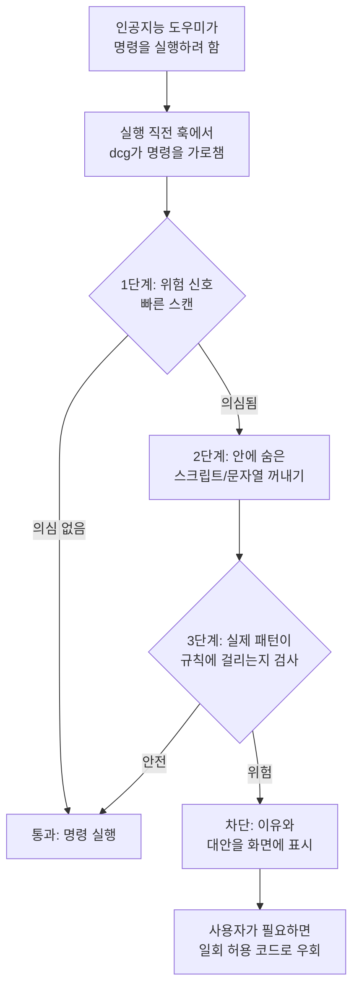

<div class="ai-knowledge-shell">

<aside class="ai-knowledge-sidebar">
  <p class="ai-eyebrow">CATEGORIES</p>
  <nav class="ai-cat-tree"><details class="ai-cat" open><summary><span class="catname">에이전트 오케스트레이션</span><span class="catcount">5</span></summary><ul><li><a href="https://altjs4510.github.io/ai_news_blog/knowledge/20260623/"><span class="kdate">2026-06-23</span><span class="ktitle">bytedance/deer-flow — 샌드박스·메모리·서브에이전트·메시지 게이트웨이를…</span></a></li><li><a href="https://altjs4510.github.io/ai_news_blog/knowledge/20260621/"><span class="kdate">2026-06-21</span><span class="ktitle">calesthio/OpenMontage — 12 파이프라인·52 도구·500+ 스킬을 …</span></a></li><li><a href="https://altjs4510.github.io/ai_news_blog/knowledge/20260611/"><span class="kdate">2026-06-11</span><span class="ktitle">The evolution of agentic surfaces: building with…</span></a></li><li><a href="https://altjs4510.github.io/ai_news_blog/knowledge/20260602/"><span class="kdate">2026-06-02</span><span class="ktitle">revfactory/harness — 도메인별 에이전트 팀과 스킬을 자동 설계하는 메타…</span></a></li><li><a href="https://altjs4510.github.io/ai_news_blog/knowledge/20260507/"><span class="kdate">2026-05-07</span><span class="ktitle">ruvnet/ruflo — Claude 멀티 에이전트 오케스트레이션 플랫폼</span></a></li></ul></details><details class="ai-cat" open><summary><span class="catname">MCP &amp; 도구 통합</span><span class="catcount">16</span></summary><ul><li><a href="https://altjs4510.github.io/ai_news_blog/knowledge/20260721/"><span class="kdate">2026-07-21</span><span class="ktitle">tirth8205/code-review-graph — 로컬 우선 코드 인텔리전스 그래프…</span></a></li><li><a href="https://altjs4510.github.io/ai_news_blog/knowledge/20260719/"><span class="kdate">2026-07-19</span><span class="ktitle">tirth8205/code-review-graph — 로컬 우선 코드 인텔리전스 그래프…</span></a></li><li><a href="https://altjs4510.github.io/ai_news_blog/knowledge/20260718/"><span class="kdate">2026-07-18</span><span class="ktitle">tirth8205/code-review-graph — MCP·CLI용 로컬 코드 인텔리…</span></a></li><li><a href="https://altjs4510.github.io/ai_news_blog/knowledge/20260709/"><span class="kdate">2026-07-09</span><span class="ktitle">mvanhorn/last30days-skill — Reddit·X·YouTube·HN·…</span></a></li><li><a href="https://altjs4510.github.io/ai_news_blog/knowledge/20260708/"><span class="kdate">2026-07-08</span><span class="ktitle">Expanding Managed Agents in Gemini API: backgrou…</span></a></li><li><a href="https://altjs4510.github.io/ai_news_blog/knowledge/20260701/"><span class="kdate">2026-07-01</span><span class="ktitle">Google OKF (Open Knowledge Format) — 벤더 중립 에이전트 …</span></a></li><li><a href="https://altjs4510.github.io/ai_news_blog/knowledge/20260618/"><span class="kdate">2026-06-18</span><span class="ktitle">DeusData/codebase-memory-mcp — 158개 언어 코드베이스를 밀리…</span></a></li><li><a href="https://altjs4510.github.io/ai_news_blog/knowledge/20260609/"><span class="kdate">2026-06-09</span><span class="ktitle">Building intelligent apps for Apple platforms wi…</span></a></li><li><a href="https://altjs4510.github.io/ai_news_blog/knowledge/20260606/"><span class="kdate">2026-06-06</span><span class="ktitle">chopratejas/headroom — Compress tool outputs, lo…</span></a></li><li><a href="https://altjs4510.github.io/ai_news_blog/knowledge/20260605/"><span class="kdate">2026-06-05</span><span class="ktitle">chopratejas/headroom — Compress tool outputs, lo…</span></a></li><li><a href="https://altjs4510.github.io/ai_news_blog/knowledge/20260604/"><span class="kdate">2026-06-04</span><span class="ktitle">chopratejas/headroom — Compress tool outputs bef…</span></a></li><li><a href="https://altjs4510.github.io/ai_news_blog/knowledge/20260603/"><span class="kdate">2026-06-03</span><span class="ktitle">How Bad MCP design cost your Agent 5× more token…</span></a></li><li><a href="https://altjs4510.github.io/ai_news_blog/knowledge/20260523/"><span class="kdate">2026-05-23</span><span class="ktitle">colbymchenry/codegraph — 사전 인덱싱된 코드 지식 그래프 MCP</span></a></li><li><a href="https://altjs4510.github.io/ai_news_blog/knowledge/20260519/"><span class="kdate">2026-05-19</span><span class="ktitle">Anthropic acquires Stainless</span></a></li><li><a href="https://altjs4510.github.io/ai_news_blog/knowledge/20260517/"><span class="kdate">2026-05-17</span><span class="ktitle">I gave my LLM 100,000+ tools — Lazy Discovery &a…</span></a></li><li><a href="https://altjs4510.github.io/ai_news_blog/knowledge/20260509/"><span class="kdate">2026-05-09</span><span class="ktitle">How to connect 100 MCP servers without the conte…</span></a></li></ul></details><details class="ai-cat" open><summary><span class="catname">코딩 에이전트</span><span class="catcount">17</span></summary><ul><li><a href="https://altjs4510.github.io/ai_news_blog/knowledge/20260722/"><span class="kdate">2026-07-22</span><span class="ktitle">tirth8205/code-review-graph — MCP·CLI용 로컬 우선 코드 …</span></a></li><li><a href="https://altjs4510.github.io/ai_news_blog/knowledge/20260714/"><span class="kdate">2026-07-14</span><span class="ktitle">Graphify-Labs/graphify — 코드베이스를 질의 가능한 지식 그래프로 만…</span></a></li><li><a href="https://altjs4510.github.io/ai_news_blog/knowledge/20260707/"><span class="kdate">2026-07-07</span><span class="ktitle">AI Hero Skills Catalog — 실무 엔지니어를 위한 재사용 가능한 판단 …</span></a></li><li><a href="https://altjs4510.github.io/ai_news_blog/knowledge/20260705/"><span class="kdate">2026-07-05</span><span class="ktitle">openai/codex-plugin-cc — Claude Code에서 Codex를 위임…</span></a></li><li><a href="https://altjs4510.github.io/ai_news_blog/knowledge/20260626/"><span class="kdate">2026-06-26</span><span class="ktitle">google-labs-code/design.md — 코딩 에이전트에게 디자인 시스템을 …</span></a></li><li><a href="https://altjs4510.github.io/ai_news_blog/knowledge/20260619/"><span class="kdate">2026-06-19</span><span class="ktitle">Claude Code now supports artifacts</span></a></li><li><a href="https://altjs4510.github.io/ai_news_blog/knowledge/20260530/"><span class="kdate">2026-05-30</span><span class="ktitle">Leonxlnx/taste-skill — AI에게 좋은 취향을 부여해 generic s…</span></a></li><li><a href="https://altjs4510.github.io/ai_news_blog/knowledge/20260529/"><span class="kdate">2026-05-29</span><span class="ktitle">Introducing dynamic workflows in Claude Code</span></a></li><li><a href="https://altjs4510.github.io/ai_news_blog/knowledge/20260528/"><span class="kdate">2026-05-28</span><span class="ktitle">Building self-improving tax agents with Codex</span></a></li><li><a href="https://altjs4510.github.io/ai_news_blog/knowledge/20260526/"><span class="kdate">2026-05-26</span><span class="ktitle">colbymchenry/codegraph — Pre-indexed code knowle…</span></a></li><li><a href="https://altjs4510.github.io/ai_news_blog/knowledge/20260524/"><span class="kdate">2026-05-24</span><span class="ktitle">colbymchenry/codegraph — Pre-indexed code knowle…</span></a></li><li><a href="https://altjs4510.github.io/ai_news_blog/knowledge/20260521/"><span class="kdate">2026-05-21</span><span class="ktitle">colbymchenry/codegraph — Pre-indexed code knowle…</span></a></li><li><a href="https://altjs4510.github.io/ai_news_blog/knowledge/20260512/"><span class="kdate">2026-05-12</span><span class="ktitle">agentmemory — Persistent memory for AI coding ag…</span></a></li><li><a href="https://altjs4510.github.io/ai_news_blog/knowledge/20260510/"><span class="kdate">2026-05-10</span><span class="ktitle">addyosmani/agent-skills — Production-grade engin…</span></a></li><li><a href="https://altjs4510.github.io/ai_news_blog/knowledge/20260508/"><span class="kdate">2026-05-08</span><span class="ktitle">addyosmani/agent-skills — Production-grade engin…</span></a></li><li><a href="https://altjs4510.github.io/ai_news_blog/knowledge/20260506/"><span class="kdate">2026-05-06</span><span class="ktitle">mksglu/context-mode — AI 코딩 에이전트용 컨텍스트 윈도우 최적화</span></a></li><li><a href="https://altjs4510.github.io/ai_news_blog/knowledge/20260505/"><span class="kdate">2026-05-05</span><span class="ktitle">mattpocock/skills — Skills for Real Engineers (.…</span></a></li></ul></details><details class="ai-cat" open><summary><span class="catname">모델 &amp; 연구</span><span class="catcount">7</span></summary><ul><li><a href="https://altjs4510.github.io/ai_news_blog/knowledge/20260717/"><span class="kdate">2026-07-17</span><span class="ktitle">After a year building agent memory, 'save everyt…</span></a></li><li><a href="https://altjs4510.github.io/ai_news_blog/knowledge/20260716-proprag/"><span class="kdate">2026-07-16</span><span class="ktitle">PropRAG — 프로포지션 경로 위 beam search로 멀티홉 검색 안내</span></a></li><li><a href="https://altjs4510.github.io/ai_news_blog/knowledge/20260620/"><span class="kdate">2026-06-20</span><span class="ktitle">zai-org/GLM-5 — From Vibe Coding to Agentic Engi…</span></a></li><li><a href="https://altjs4510.github.io/ai_news_blog/knowledge/20260617/"><span class="kdate">2026-06-17</span><span class="ktitle">Predicting model behavior before release by simu…</span></a></li><li><a href="https://altjs4510.github.io/ai_news_blog/knowledge/20260610/"><span class="kdate">2026-06-10</span><span class="ktitle">Fable 5 just made cost-aware model routing manda…</span></a></li><li><a href="https://altjs4510.github.io/ai_news_blog/knowledge/20260516/"><span class="kdate">2026-05-16</span><span class="ktitle">STALE — 에이전트가 자기 기억의 유효성을 인지할 수 있는가</span></a></li><li><a href="https://altjs4510.github.io/ai_news_blog/knowledge/20260513/"><span class="kdate">2026-05-13</span><span class="ktitle">Thinking Machines' Native Interaction Models — T…</span></a></li></ul></details><details class="ai-cat" open><summary><span class="catname">인프라 &amp; 컴퓨트</span><span class="catcount">5</span></summary><ul><li><a href="https://altjs4510.github.io/ai_news_blog/knowledge/20260724/"><span class="kdate">2026-07-24</span><span class="ktitle">diegosouzapw/OmniRoute — 단일 엔드포인트로 278+ 프로바이더·50…</span></a></li><li><a href="https://altjs4510.github.io/ai_news_blog/knowledge/20260723/"><span class="kdate">2026-07-23</span><span class="ktitle">diegosouzapw/OmniRoute — 268+ 프로바이더를 단일 엔드포인트로 묶…</span></a></li><li><a href="https://altjs4510.github.io/ai_news_blog/knowledge/20260630/"><span class="kdate">2026-06-30</span><span class="ktitle">Introducing the Claude apps gateway for Amazon B…</span></a></li><li><a href="https://altjs4510.github.io/ai_news_blog/knowledge/20260522/"><span class="kdate">2026-05-22</span><span class="ktitle">Giving Agents Computers — Ivan Burazin, Daytona</span></a></li><li><a href="https://altjs4510.github.io/ai_news_blog/knowledge/20260520/"><span class="kdate">2026-05-20</span><span class="ktitle">New in Claude Managed Agents: self-hosted sandbo…</span></a></li></ul></details><details class="ai-cat" open><summary><span class="catname">보안 &amp; 거버넌스</span><span class="catcount">13</span></summary><ul><li><a href="https://altjs4510.github.io/ai_news_blog/knowledge/20260716/" class="current"><span class="kdate">2026-07-16</span><span class="ktitle">Dicklesworthstone/destructive_command_guard — 에이…</span></a></li><li><a href="https://altjs4510.github.io/ai_news_blog/knowledge/20260715/"><span class="kdate">2026-07-15</span><span class="ktitle">Dicklesworthstone/destructive_command_guard — 에이…</span></a></li><li><a href="https://altjs4510.github.io/ai_news_blog/knowledge/20260710/"><span class="kdate">2026-07-10</span><span class="ktitle">70개 MCP 서버 strace 런타임 감사 — 부팅 시 아웃바운드 호출 서버 적발</span></a></li><li><a href="https://altjs4510.github.io/ai_news_blog/knowledge/20260704/"><span class="kdate">2026-07-04</span><span class="ktitle">Cloudflare is about to block AI agents by defaul…</span></a></li><li><a href="https://altjs4510.github.io/ai_news_blog/knowledge/20260703/"><span class="kdate">2026-07-03</span><span class="ktitle">Giving admins more visibility and control over C…</span></a></li><li><a href="https://altjs4510.github.io/ai_news_blog/knowledge/20260625/"><span class="kdate">2026-06-25</span><span class="ktitle">Agent identity in Claude Tag: a new access model…</span></a></li><li><a href="https://altjs4510.github.io/ai_news_blog/knowledge/20260624/"><span class="kdate">2026-06-24</span><span class="ktitle">Agent identity in Claude Tag: a new access model…</span></a></li><li><a href="https://altjs4510.github.io/ai_news_blog/knowledge/20260614/"><span class="kdate">2026-06-14</span><span class="ktitle">NVIDIA/SkillSpector — Security scanner for AI ag…</span></a></li><li><a href="https://altjs4510.github.io/ai_news_blog/knowledge/20260613/"><span class="kdate">2026-06-13</span><span class="ktitle">Fable 5's guardrails got bypassed in 48 hours — …</span></a></li><li><a href="https://altjs4510.github.io/ai_news_blog/knowledge/20260612/"><span class="kdate">2026-06-12</span><span class="ktitle">NVIDIA/SkillSpector — AI 에이전트 스킬용 보안 스캐너</span></a></li><li><a href="https://altjs4510.github.io/ai_news_blog/knowledge/20260607/"><span class="kdate">2026-06-07</span><span class="ktitle">OpenAI Help: Lockdown Mode</span></a></li><li><a href="https://altjs4510.github.io/ai_news_blog/knowledge/20260531/"><span class="kdate">2026-05-31</span><span class="ktitle">How we contain Claude across products</span></a></li><li><a href="https://altjs4510.github.io/ai_news_blog/knowledge/20260527/"><span class="kdate">2026-05-27</span><span class="ktitle">Microsoft Copilot Cowork Exfiltrates Files</span></a></li></ul></details><details class="ai-cat" open><summary><span class="catname">응용 사례</span><span class="catcount">3</span></summary><ul><li><a href="https://altjs4510.github.io/ai_news_blog/knowledge/20260712/"><span class="kdate">2026-07-12</span><span class="ktitle">Do Automated Evals Work?</span></a></li><li><a href="https://altjs4510.github.io/ai_news_blog/knowledge/20260515/"><span class="kdate">2026-05-15</span><span class="ktitle">Clawdmeter — Claude Code 사용량을 데스크톱 대시보드로</span></a></li><li><a href="https://altjs4510.github.io/ai_news_blog/knowledge/20260514/"><span class="kdate">2026-05-14</span><span class="ktitle">Introducing Claude for Small Business</span></a></li></ul></details><details class="ai-cat" open><summary><span class="catname">산업 동향</span><span class="catcount">4</span></summary><ul><li><a href="https://altjs4510.github.io/ai_news_blog/knowledge/20260711/"><span class="kdate">2026-07-11</span><span class="ktitle">OpenAI says GPT 5.6 is the 'preferred model' for…</span></a></li><li><a href="https://altjs4510.github.io/ai_news_blog/knowledge/20260702/"><span class="kdate">2026-07-02</span><span class="ktitle">How Cursor deploys AI inside the enterprise (For…</span></a></li><li><a href="https://altjs4510.github.io/ai_news_blog/knowledge/20260616/"><span class="kdate">2026-06-16</span><span class="ktitle">Why AI hasn't replaced software engineers, and w…</span></a></li><li><a href="https://altjs4510.github.io/ai_news_blog/knowledge/20260504/"><span class="kdate">2026-05-04</span><span class="ktitle">Agents for Everything Else: Codex for Knowledge …</span></a></li></ul></details></nav>
</aside>

<article class="ai-knowledge-article">

<header class="ai-post-hero">
  <p class="ai-eyebrow"><a class="ai-back" href="../">KNOWLEDGE</a> · 2026-07-16 · 오늘의 학습</p>
  <h2 class="ai-post-title">Dicklesworthstone/destructive_command_guard — 에이전트의 위험한 shell/git 명령을 차단하는 Rust 가드</h2>
</header>

> 원문: [Dicklesworthstone/destructive_command_guard — 에이전트의 위험한 shell/git 명령을 차단하는 Rust 가드](https://github.com/Dicklesworthstone/destructive_command_guard)

## 📌 학습 정리

### 1. 한 줄로 말하면

인공지능 코딩 도우미가 실수로 위험한 명령을 내렸을 때, 그 명령이 실제로 실행되기 직전에 가로채서 막아주는 안전장치예요.

### 2. 왜 이게 만들어졌어요?

요즘 코딩할 때 사람 대신 명령을 실행해주는 인공지능 도우미(Claude, Codex, Gemini, Copilot 같은 것들)를 많이 쓰죠. 그런데 이 도우미들이 가끔 `git reset --hard`나 `rm -rf ./src`, `DROP TABLE users` 같은, 몇 시간 동안 작업한 결과물을 몇 초 만에 날려버리는 치명적인 명령을 실행해버리는 사고가 생겨요. 원래는 이런 사고를 막으려면 매번 명령을 눈으로 확인하고 승인해야 했는데, 그러면 도우미를 쓰는 의미가 반감되죠. 그래서 **명령이 실행되기 직전 단계에서 자동으로 위험한 것만 골라 차단**하는 얇은 감시 레이어가 필요해졌고, 그게 이 dcg(Destructive Command Guard)예요. 인공지능 도우미가 명령을 실행하려 할 때마다 dcg가 먼저 그 명령을 훑어보고, 위험하면 막고 안전하면 통과시키는 방식이에요.

### 3. 비유로 풀면

이건 마치 **주방 보조에게 요리를 맡기되, 칼과 가스밸브 앞에는 안전센서를 하나 붙여둔 것** 같아요. 보조가 알아서 재료를 다듬고 조리해도 되지만, 진짜 위험한 동작을 하려는 순간에는 센서가 "잠깐, 이건 확인 좀 하고요" 하고 손목을 잡아주는 거죠.

또 다른 비유로는 **자동차의 자동 긴급제동장치**예요. 운전자(인공지능 도우미)가 앞을 잘 보고 있다고 믿지만, 앞에 사람이 튀어나오면 브레이크가 알아서 걸리는 것처럼요.

그래서 결국, dcg는 인공지능 도우미의 자유도를 크게 해치지 않으면서 "돌이킬 수 없는 파괴적인 동작"만 콕 집어서 막아주는 방어선이에요.

### 4. 어떻게 작동하는지 (그림으로)



작동 흐름은 3단계로 쪼개져 있어요. **1단계**는 아주 빠른 정규식(regex) 훑기라서 대부분의 안전한 명령은 여기서 바로 통과돼요. **2단계**에서는 명령 안에 숨어 있는 인라인 스크립트(예: `python -c "..."`)나 여러 줄 문자열(heredoc)의 실제 내용을 꺼내고, **3단계**에서 그 내용을 문법 트리(AST) 수준까지 파고들어 진짜 위험한 패턴인지 판단해요. 위험하다고 판정되면 실행을 막고 왜 막았는지, 대신 뭘 쓰면 되는지를 알려줍니다.

### 5. 처음 보는 용어 풀이

- **훅 (hook)** — 어떤 동작이 일어나기 직전이나 직후에 끼어들 수 있게 만들어둔 "연결 지점"이에요. dcg는 인공지능 도우미가 명령을 실행하기 직전 지점에 끼어들어서 검사를 수행합니다.
- **파괴적 명령 (destructive command)** — 파일, 코드 이력, 데이터베이스 테이블처럼 한 번 지우면 복구가 어려운 자원을 없애버리는 명령을 통틀어 부르는 말이에요. `rm -rf`, `git reset --hard`, `DROP TABLE` 같은 것들이 대표적이에요.
- **팩 (pack)** — 위험한 명령 패턴을 주제별로 묶어놓은 규칙 꾸러미예요. 예를 들어 `database.postgresql`은 PostgreSQL 관련 위험 명령을, `containers.docker`는 도커 관련 위험 명령을 담고 있어서, 필요한 것만 골라 켤 수 있어요.
- **허용 목록 (allowlist)** — "이 명령은 위험해 보여도 우리 팀에서는 정상적으로 쓰는 것"이라고 미리 등록해두는 예외 목록이에요. dcg가 자꾸 막는데 실제로는 안전한 명령이 있을 때 사용합니다.
- **여기문서와 인라인 스크립트 (heredoc / inline script)** — `<<EOF ... EOF`처럼 여러 줄 문자열로 명령에 끼워 넣는 방식, 또는 `python -c "코드"`처럼 한 줄에 스크립트를 통째로 넣는 방식이에요. 위험한 코드가 이 안에 숨어 있을 수 있어서 dcg는 이걸 꺼내서 다시 검사해요.
- **실패 시 열어두기 (fail-open)** — dcg 자체가 오류 나거나 시간이 초과되면 "일단 통과시킨다"는 설계 방침이에요. 검사기가 고장 났다고 사용자 작업 흐름 전체가 막히지 않도록 하기 위한 절충안이에요.
- **에이전트 프로파일 (agent profile)** — 어떤 인공지능 도우미가 명령을 보냈는지에 따라 규칙을 다르게 적용하는 설정이에요. 예를 들어 신뢰도가 높은 도구에는 허용 목록을 넓게, 잘 모르는 도구에는 규칙을 더 엄격하게 적용할 수 있어요.

### 6. 한 발 더 들어가고 싶다면

- [Dicklesworthstone/destructive_command_guard](https://github.com/Dicklesworthstone/destructive_command_guard) — 프로젝트 저장소 자체예요. 설치 스크립트, 지원되는 도우미 목록, 전체 설정 예시를 여기서 볼 수 있어요.
- [docs/agents.md](https://github.com/Dicklesworthstone/destructive_command_guard/blob/main/docs/agents.md) — 어떤 인공지능 도우미들이 지원되는지, 에이전트별로 신뢰도와 규칙을 어떻게 다르게 줄 수 있는지 정리돼 있어요.
- [docs/codex-integration.md](https://github.com/Dicklesworthstone/destructive_command_guard/blob/main/docs/codex-integration.md) — Codex CLI와 dcg가 어떤 규약으로 대화하는지, 차단 응답을 어떻게 주고받는지 알 수 있어요.
- [docs/packs/README.md](https://github.com/Dicklesworthstone/destructive_command_guard/blob/main/docs/packs/README.md) — 50가지가 넘는 팩(규칙 꾸러미)의 전체 목록과 어떤 명령을 막는지 확인할 수 있어요.
- [docs/custom-packs.md](https://github.com/Dicklesworthstone/destructive_command_guard/blob/main/docs/custom-packs.md) — 사내 도구나 자체 스크립트에 맞춰 나만의 규칙 꾸러미를 만드는 방법을 볼 수 있어요.
- [docs/adr-001-heredoc-scanning.md](https://github.com/Dicklesworthstone/destructive_command_guard/blob/main/docs/adr-001-heredoc-scanning.md) — 여기문서·인라인 스크립트를 3단계로 훑어보는 구조를 왜 그렇게 설계했는지 배경을 알 수 있어요.

---

## 📖 원문 전체 번역 (정독용)

> 의역 최소화한 전체 번역입니다. 큰 흐름은 위 정리에서 잡고, 정확한 워딩이 필요할 땐 이 섹션에서 정독하세요.

# dcg (Destructive Command Guard)

AI 코딩 에이전트를 위한 고성능 훅(hook)으로, 파괴적인 명령이 실행되기 전에 차단하여 Claude Code, Codex CLI, Gemini CLI, Copilot CLI, VS Code Copilot Chat, Cursor, Hermes Agent, Grok (xAI) 및 관련 도구에서 발생할 수 있는 실수로 인한 삭제로부터 작업물을 보호합니다.

**지원 대상:**
Claude Code, Codex CLI 0.125.0+, Gemini CLI, GitHub Copilot CLI, VS Code Copilot Chat, Cursor IDE, Hermes Agent, Grok (xAI) (네이티브 `~/.grok/hooks/` 및 Claude 호환성 레이어), Antigravity CLI (`agy`) (`dcg install --agy`를 통해 네이티브 `~/.gemini/config/hooks.json`), OpenCode (커뮤니티 플러그인 경유), Pi (확장 레시피 경유), Aider (제한적 — git 훅 전용), Continue (감지 전용)

---

## 빠른 설치

```bash
curl -fsSL \
  "https://raw.githubusercontent.com/Dicklesworthstone/destructive_command_guard/main/install.sh?$(date +%s)" \
  | bash -s -- --easy-mode
```

Linux, macOS, 그리고 WSL을 통한 Windows에서 동작합니다. 플랫폼을 자동으로 감지하고 적합한 바이너리를 다운로드하며, Claude Code, Codex CLI, Gemini CLI, GitHub Copilot CLI, VS Code Copilot Chat (VS Code의 Claude-훅 호환성을 통해), Cursor IDE, Hermes Agent, Grok (xAI) (네이티브 `~/.grok/hooks/dcg.json`을 위한 `dcg install --grok`을 통하거나, Grok이 자동으로 인식하는 Claude 호환성 레이어를 통해)을 포함한 지원 에이전트 훅을 구성합니다. 네이티브 Windows의 경우 아래 PowerShell 설치 프로그램을 사용하십시오.

---

## Windows (네이티브, PowerShell)

```powershell
& ([scriptblock]::Create((irm "https://raw.githubusercontent.com/Dicklesworthstone/destructive_command_guard/main/install.ps1"))) -EasyMode -Verify
```

네이티브 `dcg.exe`를 설치하고, 필수 SHA256 체크섬을 검증하며, `minisign`이 있을 경우 릴리스의 장기 유효 minisign 서명을 검증하고, `cosign`과 신뢰된 번들이 모두 있을 경우 Sigstore/cosign 출처를 검증합니다. dcg를 사용자 `PATH`에 추가(`-EasyMode`)하고, 자가 테스트를 실행(`-Verify`)하며, Claude Code, Codex CLI, Gemini CLI, GitHub Copilot CLI, Cursor IDE, Hermes Agent에 대해 감지된 에이전트 훅을 구성합니다. Copilot은 `%COPILOT_HOME%\hooks` (또는 `%USERPROFILE%\.copilot\hooks`) 아래에서 사용자 레벨로 구성되어 모든 워크스페이스가 보호됩니다. Windows에서는 `windows.filesystem`과 `windows.system` 팩이 기본적으로 활성화되어 있으므로 `del /s`, `rd /s`, `Remove-Item -Recurse -Force`, `format`, `vssadmin delete shadows`가 기본 차단됩니다. `-Version vX.Y.Z`로 특정 버전을 고정하고, 사이드카 또는 검증자가 없을 경우 실패로 닫으려면 `-RequireMinisign`을 사용하십시오.

---

## 요약 (TL;DR)

**문제:** AI 코딩 에이전트(Claude, Codex, Gemini, Copilot 등)는 가끔 `git reset --hard`, `rm -rf ./src`, `DROP TABLE users`와 같은 치명적인 명령을 실행하여 수 시간의 커밋되지 않은 작업을 순식간에 날려버립니다.

**해결책:** dcg는 파괴적인 명령이 실행되기 **전에** 가로채어 명확한 설명과 더 안전한 대안을 제시하며 차단하는 고성능 훅입니다.

---

## dcg를 사용해야 하는 이유

| 기능 | 설명 |
|---|---|
| 설정 없는 보호 | 기본적으로 위험한 git/파일시스템 명령을 차단 |
| 50개 이상의 보안 팩 | 데이터베이스, Kubernetes, Docker, AWS/GCP/Azure, Terraform 등 |
| 밀리초 이하의 지연 시간 | SIMD 가속 필터링 — 존재감이 없을 정도로 빠름 |
| 히어독/인라인 스크립트 스캔 | `python -c "os.remove(...)"` 및 내장된 쉘 스크립트 탐지 |
| 스마트 컨텍스트 감지 | `grep "rm -rf"` (데이터)는 차단하지 않지만 `rm -rf /` (실행)는 차단 |
| 풍부한 터미널 출력 | 사람이 읽기 쉬운 거부 패널, 규칙 컨텍스트, stderr의 제안 |
| 에이전트 안전 스트림 | 기계 판독 가능한 훅 출력은 stdout에, 풍부한 UI는 stderr에 유지 |
| 네이티브 Codex 지원 | Codex CLI 0.125.0+는 현재 클라이언트가 안정적으로 적용하는 최소 stdout JSON 거부 수신 |
| 우아한 성능 저하 | CI, 파이프, 더미 터미널, 색상 미지원 환경에서 일반 출력 |
| CI용 스캔 모드 | 코드 리뷰에서 위험한 명령을 탐지하는 pre-commit 훅 및 CI 통합 |
| 실패-열림(Fail-Open) 설계 | 타임아웃이나 파싱 오류로 인해 워크플로가 절대 차단되지 않음 |
| 설명 모드 | `dcg explain "command"`로 차단 이유를 정확히 확인 |

---

## 빠른 예시

```bash
# AI 에이전트가 실행을 시도:
$ git reset --hard HEAD~5

# dcg가 가로채어 차단:
════════════════════════════════════════════════════════════════
BLOCKED  dcg
────────────────────────────────────────────────────────────────
Reason:  git reset --hard destroys uncommitted changes

Command: git reset --hard HEAD~5

Tip: Consider using 'git stash' first to save your changes.
════════════════════════════════════════════════════════════════
```

---

## 더 많은 보호 활성화

```toml
# ~/.config/dcg/config.toml
[packs]
enabled = [
  "database.postgresql",  # DROP TABLE, TRUNCATE 차단
  "kubernetes.kubectl",   # kubectl delete namespace 차단
  "cloud.aws",            # aws ec2 terminate-instances 차단
  "containers.docker",    # docker system prune 차단
]
```

---

## 에이전트별 프로필

dcg는 자신을 호출하는 AI 코딩 에이전트를 자동으로 감지하고 에이전트별 구성을 적용할 수 있습니다. `trust_level` 필드는 JSON 출력 및 로그에 기록되는 **권고 레이블**로, 규칙 평가를 직접 변경하지 않습니다.

동작 차이는 다른 프로필 필드에서 비롯됩니다:

| 옵션 | 효과 |
|---|---|
| `disabled_packs` | 평가에서 규칙 팩 제거 |
| `extra_packs` | 평가에 규칙 팩 추가 |
| `additional_allowlist` | 거부 규칙을 우회하는 명령 패턴 추가 |
| `disabled_allowlist` | `true`일 경우 모든 허용 목록 항목 무시 |

```toml
# Claude Code를 더 신뢰 — 더 넓은 허용 목록, 적은 팩
[agents.claude-code]
trust_level = "high"
additional_allowlist = ["npm run build", "cargo test"]
disabled_packs = ["kubernetes"]

# 알 수 없는 에이전트 제한 — 추가 규칙, 허용 목록 우회 없음
[agents.unknown]
trust_level = "low"
extra_packs = ["strict_git", "database"]  # 실제 팩/카테고리 ID (`dcg packs` 참조)
disabled_allowlist = true
```

`extra_packs`/`disabled_packs`는 `[packs] enabled`/`disabled`와 동일한 팩 및 카테고리 ID를 사용합니다. `"database"`와 같은 카테고리 ID는 모든 `database.*` 하위 팩으로 확장됩니다. `dcg packs` 또는 `docs/packs/README.md`에 나열된 ID를 사용하십시오. `"paranoid"`는 **졸업 모드**이지 팩이 아니므로, 더 엄격한 git 규칙을 위해서는 실제 `strict_git` 팩을 활성화하십시오.

지원 에이전트, 신뢰 레벨 및 구성 옵션에 대한 전체 문서는 `docs/agents.md`를 참조하십시오.

---

## Codex 지원

dcg는 이제 Codex CLI를 Claude 형태의 호환성 경로가 아닌 1급 훅 대상으로 처리합니다. `PATH`에서 `codex`를 감지하거나 기존 `~/.codex/` 디렉터리가 있을 경우 설치 프로그램이 Codex CLI 0.125.0+를 자동으로 구성합니다.

| Codex 동작 | dcg 처리 방식 |
|---|---|
| 훅 구성 | `PreToolUse` Bash 훅을 `~/.codex/hooks.json`에 병합 |
| 거부된 명령 | stdout에 최소한의 `hookSpecificOutput` 거부 출력과 함께 종료 코드 0으로 종료; 사람용 경고는 stderr에 유지 |
| 허용된 명령 | 빈 stdout과 stderr로 종료 코드 0으로 종료 |
| 기존 훅 | 공존하는 훅을 보존하고, Bash에 대해 dcg를 첫 번째로 유지하며, 잘못된 형식의 JSON 덮어쓰기 거부 |
| 검증 | 서브프로세스 프로토콜 테스트 및 선택적 실제 Codex E2E 하네스로 커버 |

Codex의 훅 입력은 의도적으로 Claude Code와 유사하지만, Codex는 훅 출력에서 알 수 없는 필드를 거부합니다. dcg는 비어 있지 않은 `turn_id` 필드로 Codex 페이로드를 감지하고, 차단된 명령이 실패한 훅이 아닌 차단된 것으로 보고되도록 Codex의 문서화된 거부 필드만 내보냅니다. 프로토콜 세부 사항, 수동 프로브 및 문제 해결은 `docs/codex-integration.md`를 참조하십시오.

---

## 기원 및 저자

이 프로젝트는 Jeffrey Emanuel이 Python 스크립트로 시작했습니다. 그는 AI 코딩 에이전트가 매우 유용하지만 가끔 수 시간의 커밋되지 않은 작업을 파괴하는 치명적인 명령을 실행한다는 사실을 인식했습니다. 최초 구현은 위험한 git 및 파일시스템 명령을 실행 전에 가로채는 단순하지만 효과적인 훅이었습니다.

**Jeffrey Emanuel** — 원래 개념 및 Python 구현 (출처); 모듈식 팩 시스템(50개 이상의 보안 팩), 히어독/인라인 스크립트 스캔, 3계층 아키텍처, 컨텍스트 분류, 허용 목록, 스캔 모드, 이중 정규식 엔진으로 Rust 버전을 대폭 확장

**Darin Gordon** — 성능 최적화를 포함한 최초 Rust 포팅

Darin의 최초 Rust 포팅은 원래 Python 구현과의 패턴 호환성을 유지하면서 SIMD 가속 필터링과 지연 컴파일된 정규식 패턴을 통해 밀리초 이하의 실행을 추가했습니다. Jeffrey는 이후 위에 설명된 기능들을 추가하기 위해 Rust 코드베이스를 대폭 확장했습니다.

---

## 탈출구 / 우회

dcg가 실제로 실행해야 하는 것을 차단하는 경우:

| 방법 | 범위 | 방법 |
|---|---|---|
| 환경 변수 우회 | 단일 명령 | `DCG_BYPASS=1 <command>` |
| 일회성 허용 코드 | 단일 명령 | 차단 메시지에서 짧은 코드를 복사하여 `dcg allow-once <code>` 실행 |
| 영구 허용 목록 | 규칙 또는 명령 | `dcg allowlist add core.git:reset-hard -r "reason"` |
| 훅 제거 | 모든 명령 | `~/.claude/settings.json`(또는 해당 에이전트의 동등한 파일)에서 dcg 항목 삭제 또는 주석 처리 |

`DCG_BYPASS=1`은 해당 호출에 대한 모든 보호를 비활성화합니다. 드물게 사용하고 반복적인 필요에는 허용 목록을 선호하십시오.

---

## 모듈식 팩 시스템

dcg는 파괴적인 명령 패턴을 카테고리별로 구성하기 위해 모듈식 "팩" 시스템을 사용합니다. 팩은 구성 파일에서 활성화 또는 비활성화할 수 있습니다.

카테고리 ID는 해당 하위 팩으로 확장됩니다. `enabled`에 단독 카테고리를 나열하면 해당 카테고리 아래의 모든 팩이 활성화됩니다: `enabled = ["database"]`는 `database.postgresql`, `database.mysql` 및 해당 카테고리의 나머지를 활성화합니다. `disabled = ["database.redis"]`로 단일 하위 팩을 제외할 수 있습니다. 동일한 확장이 에이전트 프로필의 `extra_packs`/`disabled_packs`에도 적용됩니다. `dcg packs`/`docs/packs/README.md`의 실제 팩 또는 카테고리 ID를 항상 사용하십시오. `"paranoid"`와 같은 이름은 **졸업 모드**이지 팩이 아닙니다.

- **전체 팩 ID 인덱스:** `docs/packs/README.md`
- **표준 설명 + 패턴 수:** `dcg packs --verbose`

---

### 기본 활성화 (구성 파일 없음)

**구성 파일이 없을 경우**, dcg는 가장 치명적이고 복구 불가능한 실수를 방지하는 팩만 활성화합니다:

- **`core.filesystem`** — 임시 디렉터리 외부에서의 위험한 `rm -rf` (항상 활성화; 비활성화 불가)
- **`core.git`** — 커밋되지 않은 작업을 잃거나 히스토리를 재작성하거나 스태시를 파괴하는 파괴적인 git 명령 (항상 활성화; 비활성화 불가)
- **`system.disk`** — `mkfs`, `dd`-to-device, `fdisk`, `parted`, `mdadm`, LVM 제거, `wipefs` (기본 활성화; `disabled = ["system.disk"]`로 해제)

**Windows**에서는 추가로 두 팩이 기본 활성화되어 구성 없이도 치명적인 네이티브 Windows 작업이 차단됩니다:

- **`windows.filesystem`** — cmd의 `del /s`, `rd /s`, `format <drive>:` 및 PowerShell의 `Remove-Item -Recurse -Force` (및 별칭), `Clear-Content`, `Clear-RecycleBin` (Windows 전용 기본 활성화; `disabled = ["windows.filesystem"]` 또는 `["windows"]`로 해제)
- **`windows.system`** — `vssadmin delete shadows`와 `wmic shadowcopy delete` (볼륨 섀도 복사본 파괴 — 랜섬웨어의 특징), `diskpart`, `Format-Volume`, `Clear-Disk`, `Remove-Partition`, `Initialize-Disk`/`Reset-PhysicalDisk`, `cipher /w`, `bcdedit /delete` (Windows 전용 기본 활성화; `disabled = ["windows.system"]` 또는 `["windows"]`로 해제)

더 넓은 범위의 `windows.misc` (`reg delete`, `net user /delete`, `wsl --unregister`, `robocopy /MIR`) 및 `windows.powershell` (레지스트리/프로바이더 삭제, `Remove-LocalUser`, `Disable-ComputerRestore`, `Remove-VM`) 팩은 모든 플랫폼에서 선택적(opt-in)입니다. Unix에서 `windows.*` 팩은 등록되어 있지만 기본적으로 비활성화되어 있습니다. CI에서 커밋된 `.ps1`/`.cmd` 스크립트를 스캔하는 등의 용도로 `[packs] enabled = ["windows"]`를 통해 활성화할 수 있습니다.

`database.postgresql` 및 `containers.docker`를 포함한 다른 모든 팩은 **선택적(opt-in)**이며 구성 파일에서 활성화하기 전까지는 활성화되지 않습니다. `dcg init`을 실행하면 `[packs] enabled` 목록에 `database.postgresql`과 `containers.docker`를 일반적인 예시로 포함하는 스타터 `~/.config/dcg/config.toml`이 작성되지만, 이것은 생성된 스타터 구성이지 구성 파일이 없을 때의 기본값이 아닙니다. 아래의 팩을 `[packs] enabled`에 추가하여 활성화하십시오 — **더 많은 보호 활성화** 참조.

---

### 스토리지 팩

- **`storage.s3`** — 버킷 제거, 재귀적 삭제, sync --delete 등 파괴적인 S3 작업으로부터 보호.
- **`storage.gcs`** — 버킷 제거, 객체 삭제, 재귀적 삭제 등 파괴적인 GCS 작업으로부터 보호.
- **`storage.minio`** — 버킷 제거, 객체 삭제, 관리 작업 등 파괴적인 MinIO 클라이언트(mc) 작업으로부터 보호.
- **`storage.azure_blob`** — 컨테이너 삭제, 블롭 삭제, azcopy remove 등 파괴적인 Azure Blob Storage 작업으로부터 보호.

### 원격 팩

- **`remote.rsync`** — --delete 및 그 변형 등 파괴적인 rsync 작업으로부터 보호.
- **`remote.scp`** — 시스템 경로 덮어쓰기 등 파괴적인 SCP 작업으로부터 보호.
- **`remote.ssh`** — 원격 명령 실행 및 키 관리 등 파괴적인 SSH 작업으로부터 보호.

### 데이터베이스 팩

- **`database.postgresql`** — DROP DATABASE, TRUNCATE, dropdb 등 파괴적인 PostgreSQL 작업으로부터 보호.
- **`database.mysql`** — MySQL/MariaDB 가드.
- **`database.mongodb`** — dropDatabase, dropCollection, 기준 없는 remove 등 파괴적인 MongoDB 작업으로부터 보호.
- **`database.redis`** — FLUSHALL, FLUSHDB, 대량 키 삭제 등 파괴적인 Redis 작업으로부터 보호.
- **`database.sqlite`** — DROP TABLE, WHERE 없는 DELETE, 우발적 데이터 손실 등 파괴적인 SQLite 작업으로부터 보호.
- **`database.supabase`** — 데이터베이스 리셋, 마이그레이션 롤백, 함수/시크릿/스토리지 삭제, 프로젝트 제거, 인프라 변경 등 파괴적인 Supabase CLI 작업으로부터 보호.

### 컨테이너 팩

- **`containers.docker`** — system prune, volume prune, 강제 제거 등 파괴적인 Docker 작업으로부터 보호.
- **`containers.compose`** — 볼륨을 제거하는 down -v 등 파괴적인 Docker Compose 작업으로부터 보호.
- **`containers.podman`** — system prune, volume prune, 강제 제거 등 파괴적인 Podman 작업으로부터 보호.

### Kubernetes 팩

- **`kubernetes.kubectl`** — delete namespace, drain, 대량 삭제 등 파괴적인 kubectl 작업으로부터 보호.
- **`kubernetes.helm`** — dry-run 없는 uninstall 및 rollback 등 파괴적인 Helm 작업으로부터 보호.
- **`kubernetes.kustomize`** — kubectl delete와 함께 사용되거나 검토 없이 적용될 때의 파괴적인 Kustomize 작업으로부터 보호.

### 클라우드 프로바이더 팩

- **`cloud.aws`** — terminate-instances, delete-db-instance, s3 rm --recursive 등 파괴적인 AWS CLI 작업으로부터 보호.
- **`cloud.azure`** — vm delete, storage account delete, resource group delete 등 파괴적인 Azure CLI 작업으로부터 보호.
- **`cloud.gcp`** — instances delete, sql instances delete, gsutil rm -r 등 파괴적인 gcloud 작업으로부터 보호.

### CDN 팩

- **`cdn.cloudflare_workers`** — Wrangler CLI를 통한 파괴적인 Cloudflare Workers, KV, R2, D1 작업으로부터 보호.
- **`cdn.cloudfront`** — 배포, 캐시 정책, 함수 삭제 등 파괴적인 AWS CloudFront 작업으로부터 보호.
- **`cdn.fastly`** — 서비스, 도메인, 백엔드, VCL 삭제 등 파괴적인 Fastly CLI 작업으로부터 보호.

### API 게이트웨이 팩

- **`apigateway.apigee`** — 파괴적인 Google Apigee CLI 및 apigeecli 작업으로부터 보호.
- **`apigateway.aws`** — REST API 및 HTTP API 모두에 대한 파괴적인 AWS API Gateway CLI 작업으로부터 보호.
- **`apigateway.kong`** — 파괴적인 Kong Gateway CLI, deck CLI, Admin API 작업으로부터 보호.

### 인프라 팩

- **`infrastructure.ansible`** — 위험한 쉘 명령 및 검토되지 않은 플레이북 실행 등 파괴적인 Ansible 작업으로부터 보호.
- **`infrastructure.atmos`** — terraform deploy (자동 승인), clean, destroy, state rm/taint, helmfile destroy 등 파괴적인 Atmos 작업으로부터 보호.
- **`infrastructure.pulumi`** — destroy 및 -y (자동 승인)를 포함한 up 등 파괴적인 Pulumi 작업으로부터 보호.
- **`infrastructure.terraform`** — destroy, taint, -auto-approve를 포함한 apply 등 파괴적인 Terraform 작업으로부터 보호.

### 시스템 팩

- **`system.disk`** — 디바이스로의 dd, mkfs, 파티션 테이블 수정(fdisk/parted), RAID 관리(mdadm), btrfs 파일시스템 작업, 디바이스 매퍼(dmsetup), 네트워크 블록 디바이스(nbd-client), LVM 명령(pvremove, vgremove, lvremove, lvreduce, pvmove) 등 파괴적인 디스크 작업으로부터 보호.
- **`system.permissions`** — chmod 777, 시스템 디렉터리에 대한 재귀적 chmod/chown 등 위험한 권한 변경으로부터 보호.
- **`system.services`** — 중요한 서비스 중지 및 init 구성 수정 등 위험한 서비스 작업으로부터 보호.

### CI/CD 팩

- **`cicd.circleci`** — 컨텍스트 삭제, 시크릿 제거, orb/네임스페이스 삭제, 파이프라인 제거 등 파괴적인 CircleCI 작업으로부터 보호.
- **`cicd.github_actions`** — 시크릿/변수 삭제 또는 /actions 엔드포인트에 대한 `gh api DELETE` 사용 등 파괴적인 GitHub Actions 작업으로부터 보호.
- **`cicd.gitlab_ci`** — 변수 삭제, 아티팩트 제거, 러너 등록 해제 등 파괴적인 GitLab CI/CD 작업으로부터 보호.
- **`cicd.jenkins`** — 잡, 노드, 자격증명, 빌드 히스토리 삭제 등 파괴적인 Jenkins CLI/API 작업으로부터 보호.

### 시크릿 관리 팩

- **`secrets.aws_secrets`** — delete-secret 및 delete-parameter 등 파괴적인 AWS Secrets Manager 및 SSM Parameter Store 작업으로부터 보호.
- **`secrets.doppler`** — 시크릿, 구성, 환경, 프로젝트 삭제 등 파괴적인 Doppler CLI 작업으로부터 보호.
- **`secrets.onepassword`** — 아이템, 문서, 사용자, 그룹, 볼트 삭제 등 파괴적인 1Password CLI 작업으로부터 보호.
- **`secrets.vault`** — 시크릿 삭제, 인증/시크릿 엔진 비활성화, 리스/토큰 취소, 정책 삭제 등 파괴적인 Vault CLI 작업으로부터 보호.

### 플랫폼 팩

- **`platform.github`** — 저장소, gist, 릴리스, SSH 키 삭제 등 파괴적인 GitHub CLI 작업으로부터 보호.
- **`platform.gitlab`** — 프로젝트, 릴리스, 보호된 브랜치, 웹훅 삭제 등 파괴적인 GitLab 플랫폼 작업으로부터 보호.
- **`platform.kamal`** — 스택을 해제하는(`kamal remove`), 액세서리 데이터 디렉터리를 삭제하는(`kamal accessory remove`), 프록시 라우팅을 종료하거나, 앱을 오프라인 상태로 만들거나, `kamal rollback`이 의존하는 이미지를 정리하는 파괴적인 Kamal 2.x 작업으로부터 보호.
- **`platform.modal`** — 재귀적 볼륨 제거, `--force`를 포함한 앱 중지, 시크릿 삭제 등 파괴적인 Modal 서버리스 플랫폼 작업으로부터 보호.
- **`platform.railway`** — 프로젝트, 환경, 서비스, 함수, 볼륨, 변수, 배포를 삭제할 수 있는 파괴적인 Railway CLI 및 Public API 작업으로부터 보호.

### DNS 팩

- **`dns.cloudflare`** — 레코드 삭제, 존 삭제, 대상 Terraform destroy 등 파괴적인 Cloudflare DNS 작업으로부터 보호.
- **`dns.generic`** — nsupdate 삭제, 존 전송 등 파괴적이거나 위험한 DNS 도구 사용으로부터 보호.
- **`dns.route53`** — 호스팅 존 삭제 및 레코드 세트 DELETE 변경 등 파괴적인 AWS Route53 DNS 작업으로부터 보호.

### 이메일 팩

- **`email.mailgun`** — 도메인 삭제, 라우트 삭제, 메일링 리스트 제거 등 파괴적인 Mailgun API 작업으로부터 보호.
- **`email.postmark`** — 서버 삭제, 템플릿 삭제, 발신자 서명 제거 등 파괴적인 Postmark API 작업으로부터 보호.
- **`email.sendgrid`** — 템플릿 삭제, API 키 삭제, 도메인 인증 제거 등 파괴적인 SendGrid API 작업으로부터 보호.
- **`email.ses`** — 자격증명 삭제, 템플릿 삭제, 구성 세트 제거 등 파괴적인 AWS Simple Email Service 작업으로부터 보호.

### 피처 플래그 팩

- **`featureflags.flipt`** — 파괴적인 Flipt CLI 및 API 작업으로부터 보호.
- **`featureflags.launchdarkly`** — 파괴적인 LaunchDarkly CLI 및 API 작업으로부터 보호.
- **`featureflags.split`** — 파괴적인 Split.io CLI 및 API 작업으로부터 보호.
- **`featureflags.unleash`** — 파괴적인 Unleash CLI 및 API 작업으로부터 보호.

### 로드 밸런서 팩

- **`loadbalancer.elb`** — 로드 밸런서 삭제, 대상 그룹 삭제, 라이브 트래픽에서 대상 등록 해제 등 파괴적인 AWS Elastic Load Balancing(ELB/ALB/NLB) 작업으로부터 보호.
- **`loadbalancer.haproxy`** — 서비스 중지 또는 런타임 API를 통한 백엔드 비활성화 등 파괴적인 HAProxy 로드 밸런서 작업으로부터 보호.
- **`loadbalancer.nginx`** — 서비스 중지 또는 구성 파일 삭제 등 파괴적인 nginx 로드 밸런서 작업으로부터 보호.
- **`loadbalancer.traefik`** — 컨테이너 중지, 구성 삭제, API 삭제 등 파괴적인 Traefik 로드 밸런서 작업으로부터 보호.

### 메시징 팩

- **`messaging.kafka`** — 토픽 삭제, 컨슈머 그룹 제거, 오프셋 리셋, 레코드 삭제 등 파괴적인 Kafka CLI 작업으로부터 보호.
- **`messaging.nats`** — 스트림, 컨슈머, 키-값 항목, 객체, 계정 삭제 등 파괴적인 NATS/JetStream 작업으로부터 보호.
- **`messaging.rabbitmq`** — 큐/교환기 삭제, 큐 비우기, vhost 삭제, 클러스터 상태 리셋 등 파괴적인 RabbitMQ 작업으로부터 보호.
- **`messaging.sqs_sns`** — 큐 삭제, 메시지 비우기, 토픽 삭제, 구독 제거 등 파괴적인 AWS SQS 및 SNS 작업으로부터 보호.

### 모니터링 팩

- **`monitoring.datadog`** — 모니터 및 대시보드 삭제 등 파괴적인 Datadog CLI/API 작업으로부터 보호.
- **`monitoring.newrelic`** — 엔티티 또는 알림 리소스 삭제 등 파괴적인 New Relic CLI/API 작업으로부터 보호.
- **`monitoring.pagerduty`** — 인시던트 라우팅을 중단시킬 수 있는 서비스 및 스케줄 삭제 등 파괴적인 PagerDuty CLI/API 작업으로부터 보호.
- **`monitoring.prometheus`** — 시계열 데이터 삭제 또는 대시보드/데이터소스 삭제 등 파괴적인 Prometheus/Grafana 작업으로부터 보호.
- **`monitoring.splunk`** — 인덱스 제거 및 REST API DELETE 호출 등 파괴적인 Splunk CLI/API 작업으로부터 보호.

### 결제 팩

- **`payment.braintree`** — API/SDK 호출을 통한 고객 삭제 또는 구독 취소 등 파괴적인 Braintree/PayPal 결제 작업으로부터 보호.
- **`payment.square`** — 결제 흐름을 중단시킬 수 있는 카탈로그 객체 또는 고객 삭제 등 파괴적인 Square CLI/API 작업으로부터 보호.
- **`payment.stripe`** — 웹훅 엔드포인트 및 고객 삭제, 또는 조율 없는 API 키 교체 등 파괴적인 Stripe CLI/API 작업으로부터 보호.

### 검색 엔진 팩

- **`search.algolia`** — 인덱스 삭제, 객체 지우기, 규칙/동의어 제거, API 키 삭제 등 파괴적인 Algolia 작업으로부터 보호.
- **`search.elasticsearch`** — 인덱스 삭제, delete-by-query, 인덱스 닫기, 클러스터 설정 변경 등 파괴적인 Elasticsearch REST API 작업으로부터 보호.
- **`search.meilisearch`** — 인덱스 삭제, 문서 삭제, delete-batch, API 키 제거 등 파괴적인 Meilisearch REST API 작업으로부터 보호.
- **`search.opensearch`** — 파괴적인 OpenSearch REST API 작업 및 AWS CLI 도메인 삭제로부터 보호.

### 백업 팩

- **`backup.borg`** — delete, prune, compact, recreate 등 파괴적인 borg 작업으로부터 보호.
- **`backup.rclone`** — sync, delete, purge, dedupe, move 등 파괴적인 rclone 작업으로부터 보호.
- **`backup.restic`** — 스냅샷 삭제(forget), 데이터 정리(prune), 키 제거, 캐시 정리 등 파괴적인 restic 작업으로부터 보호.
- **`backup.velero`** — 백업, 스케줄, 위치 삭제 등 파괴적인 velero 작업으로부터 보호.

### Windows 팩

네이티브 Windows(cmd.exe + PowerShell) 파괴적 명령 보호.

`windows.filesystem`과 `windows.system`은 **Windows에서 기본 활성화**(Unix에서는 비활성화/선택적); `windows.misc`와 `windows.powershell`은 모든 플랫폼에서 선택적입니다. 모든 패턴은 대소문자를 구분하지 않습니다.

- **`windows.filesystem`** — 재귀적/강제 파일시스템 파괴: cmd의 `del /s`, `rd /s`/`rmdir /s`, `format <drive>:`; PowerShell의 `Remove-Item -Recurse -Force` (및 별칭 `rm`/`del`/`rd`/`ri`), `Clear-Content`, `Clear-RecycleBin`. 이를 지원하는 cmdlet/별칭에 대해 PowerShell `-WhatIf` 미리보기만 허용 목록에 포함하고 임시 디렉터리 삭제도 허용합니다.
- **`windows.system`** — 치명적인 디스크/시스템 작업: `vssadmin delete shadows` 및 `wmic shadowcopy delete` (볼륨 섀도 복사본 파괴 — 랜섬웨어의 특징), `diskpart`, `Format-Volume`, `Clear-Disk`, `Remove-Partition`, `Initialize-Disk`/`Reset-PhysicalDisk`, `cipher /w`, `bcdedit /delete`.
- **`windows.misc`** — 레지스트리/계정/서비스/WSL/복사 파괴: `reg delete`, `net user|localgroup /delete`, `sc delete`, `schtasks /delete`, `wsl --unregister` (WSL 배포 파괴), `robocopy /MIR` (미러-삭제).
- **`windows.powershell`** — 파괴적인 PowerShell cmdlet: 레지스트리/프로바이더 삭제(`Remove-Item HKLM:\`, `Remove-ItemProperty`, `Remove-PSDrive`), `Remove-LocalUser`/`Remove-LocalGroup`, `Unregister-ScheduledTask`, `Disable-ComputerRestore`, 강제 `Stop-Computer`/`Restart-Computer`, `Remove-VM`/`Remove-AppxPackage`.

### 기타 팩

- **`package_managers`** — 패키지 게시 및 중요한 시스템 패키지 제거 등 위험한 패키지 관리자 작업으로부터 보호.
- **`strict_git`** — 더 엄격한 git 보호: 모든 강제 푸시, 리베이스, 히스토리 재작성 작업 차단.

---

## `~/.config/dcg/config.toml`에서 팩 활성화

```toml
[packs]
enabled = [
  # 데이터베이스
  "database.postgresql",

</article>

</div>

<!-- ai-related-links -->
<aside class="ai-related-links">
  <p class="ai-eyebrow">관련 학습</p>
  <ul><li><a href="https://altjs4510.github.io/ai_news_blog/knowledge/20260715/"><span class="kdate">2026-07-15</span><span class="ktitle">Dicklesworthstone/destructive_command_guard — 에이…</span></a></li><li><a href="https://altjs4510.github.io/ai_news_blog/knowledge/20260612/"><span class="kdate">2026-06-12</span><span class="ktitle">NVIDIA/SkillSpector — AI 에이전트 스킬용 보안 스캐너</span></a></li><li><a href="https://altjs4510.github.io/ai_news_blog/knowledge/20260710/"><span class="kdate">2026-07-10</span><span class="ktitle">70개 MCP 서버 strace 런타임 감사 — 부팅 시 아웃바운드 호출 서버 적발</span></a></li></ul>
</aside>
<!-- /ai-related-links -->
