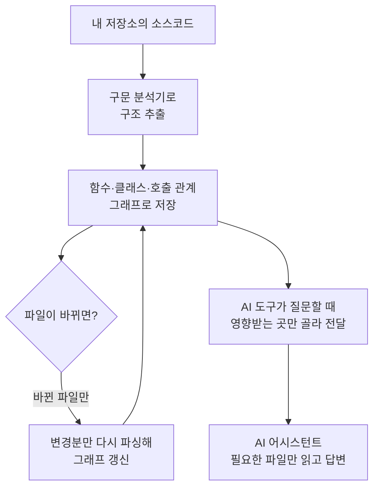

<div class="ai-knowledge-shell">

<aside class="ai-knowledge-sidebar">
  <p class="ai-eyebrow">CATEGORIES</p>
  <nav class="ai-cat-tree"><details class="ai-cat" open><summary><span class="catname">에이전트 오케스트레이션</span><span class="catcount">6</span></summary><ul><li><a href="https://altjs4510.github.io/ai_news_blog/knowledge/20260707/"><span class="kdate">2026-07-07</span><span class="ktitle">AI Hero Skills Catalog — 실무 엔지니어를 위한 재사용 가능한 판단 …</span></a></li><li><a href="https://altjs4510.github.io/ai_news_blog/knowledge/20260623/"><span class="kdate">2026-06-23</span><span class="ktitle">bytedance/deer-flow — 샌드박스·메모리·서브에이전트·메시지 게이트웨이를…</span></a></li><li><a href="https://altjs4510.github.io/ai_news_blog/knowledge/20260621/"><span class="kdate">2026-06-21</span><span class="ktitle">calesthio/OpenMontage — 12 파이프라인·52 도구·500+ 스킬을 …</span></a></li><li><a href="https://altjs4510.github.io/ai_news_blog/knowledge/20260602/"><span class="kdate">2026-06-02</span><span class="ktitle">revfactory/harness — 도메인별 에이전트 팀과 스킬을 자동 설계하는 메타…</span></a></li><li><a href="https://altjs4510.github.io/ai_news_blog/knowledge/20260529/"><span class="kdate">2026-05-29</span><span class="ktitle">Introducing dynamic workflows in Claude Code</span></a></li><li><a href="https://altjs4510.github.io/ai_news_blog/knowledge/20260507/"><span class="kdate">2026-05-07</span><span class="ktitle">ruvnet/ruflo — Claude 멀티 에이전트 오케스트레이션 플랫폼</span></a></li></ul></details><details class="ai-cat" open><summary><span class="catname">MCP &amp; 도구 통합</span><span class="catcount">18</span></summary><ul><li><a href="https://altjs4510.github.io/ai_news_blog/knowledge/20260802/"><span class="kdate">2026-08-02</span><span class="ktitle">Stateless MCP has recaptured my interest (and in…</span></a></li><li><a href="https://altjs4510.github.io/ai_news_blog/knowledge/20260801/"><span class="kdate">2026-08-01</span><span class="ktitle">different-ai/openwork — Claude Cowork의 오픈소스 대체 에…</span></a></li><li><a href="https://altjs4510.github.io/ai_news_blog/knowledge/20260731/"><span class="kdate">2026-07-31</span><span class="ktitle">different-ai/openwork — Claude Cowork의 오픈소스 대안(o…</span></a></li><li><a href="https://altjs4510.github.io/ai_news_blog/knowledge/20260729/"><span class="kdate">2026-07-29</span><span class="ktitle">Bringing MCP 2026-07-28 to Claude</span></a></li><li><a href="https://altjs4510.github.io/ai_news_blog/knowledge/20260723/"><span class="kdate">2026-07-23</span><span class="ktitle">diegosouzapw/OmniRoute — 268+ 프로바이더를 단일 엔드포인트로 묶…</span></a></li><li><a href="https://altjs4510.github.io/ai_news_blog/knowledge/20260722/"><span class="kdate">2026-07-22</span><span class="ktitle">tirth8205/code-review-graph — MCP·CLI용 로컬 우선 코드 …</span></a></li><li><a href="https://altjs4510.github.io/ai_news_blog/knowledge/20260721/"><span class="kdate">2026-07-21</span><span class="ktitle">tirth8205/code-review-graph — 로컬 우선 코드 인텔리전스 그래프…</span></a></li><li><a href="https://altjs4510.github.io/ai_news_blog/knowledge/20260719/"><span class="kdate">2026-07-19</span><span class="ktitle">tirth8205/code-review-graph — 로컬 우선 코드 인텔리전스 그래프…</span></a></li><li><a href="https://altjs4510.github.io/ai_news_blog/knowledge/20260718/" class="current"><span class="kdate">2026-07-18</span><span class="ktitle">tirth8205/code-review-graph — MCP·CLI용 로컬 코드 인텔리…</span></a></li><li><a href="https://altjs4510.github.io/ai_news_blog/knowledge/20260708/"><span class="kdate">2026-07-08</span><span class="ktitle">Expanding Managed Agents in Gemini API: backgrou…</span></a></li><li><a href="https://altjs4510.github.io/ai_news_blog/knowledge/20260618/"><span class="kdate">2026-06-18</span><span class="ktitle">DeusData/codebase-memory-mcp — 158개 언어 코드베이스를 밀리…</span></a></li><li><a href="https://altjs4510.github.io/ai_news_blog/knowledge/20260606/"><span class="kdate">2026-06-06</span><span class="ktitle">chopratejas/headroom — Compress tool outputs, lo…</span></a></li><li><a href="https://altjs4510.github.io/ai_news_blog/knowledge/20260605/"><span class="kdate">2026-06-05</span><span class="ktitle">chopratejas/headroom — Compress tool outputs, lo…</span></a></li><li><a href="https://altjs4510.github.io/ai_news_blog/knowledge/20260604/"><span class="kdate">2026-06-04</span><span class="ktitle">chopratejas/headroom — Compress tool outputs bef…</span></a></li><li><a href="https://altjs4510.github.io/ai_news_blog/knowledge/20260603/"><span class="kdate">2026-06-03</span><span class="ktitle">How Bad MCP design cost your Agent 5× more token…</span></a></li><li><a href="https://altjs4510.github.io/ai_news_blog/knowledge/20260523/"><span class="kdate">2026-05-23</span><span class="ktitle">colbymchenry/codegraph — 사전 인덱싱된 코드 지식 그래프 MCP</span></a></li><li><a href="https://altjs4510.github.io/ai_news_blog/knowledge/20260517/"><span class="kdate">2026-05-17</span><span class="ktitle">I gave my LLM 100,000+ tools — Lazy Discovery &a…</span></a></li><li><a href="https://altjs4510.github.io/ai_news_blog/knowledge/20260509/"><span class="kdate">2026-05-09</span><span class="ktitle">How to connect 100 MCP servers without the conte…</span></a></li></ul></details><details class="ai-cat" open><summary><span class="catname">코딩 에이전트</span><span class="catcount">19</span></summary><ul><li><a href="https://altjs4510.github.io/ai_news_blog/knowledge/20260809/"><span class="kdate">2026-08-09</span><span class="ktitle">PrimeIntellect-ai/prime-agent — 코딩 워크플로우·장기 자율 작…</span></a></li><li><a href="https://altjs4510.github.io/ai_news_blog/knowledge/20260808/"><span class="kdate">2026-08-08</span><span class="ktitle">PrimeIntellect-ai/prime-agent — 코딩 워크플로우와 장시간 자율…</span></a></li><li><a href="https://altjs4510.github.io/ai_news_blog/knowledge/20260804/"><span class="kdate">2026-08-04</span><span class="ktitle">esengine/DeepSeek-Reasonix — prefix-cache 안정성을 축…</span></a></li><li><a href="https://altjs4510.github.io/ai_news_blog/knowledge/20260728/"><span class="kdate">2026-07-28</span><span class="ktitle">alibaba/open-code-review — 결정론적 파이프라인 + LLM 에이전트…</span></a></li><li><a href="https://altjs4510.github.io/ai_news_blog/knowledge/20260725/"><span class="kdate">2026-07-25</span><span class="ktitle">The new rules of context engineering for Claude …</span></a></li><li><a href="https://altjs4510.github.io/ai_news_blog/knowledge/20260714/"><span class="kdate">2026-07-14</span><span class="ktitle">Graphify-Labs/graphify — 코드베이스를 질의 가능한 지식 그래프로 만…</span></a></li><li><a href="https://altjs4510.github.io/ai_news_blog/knowledge/20260705/"><span class="kdate">2026-07-05</span><span class="ktitle">openai/codex-plugin-cc — Claude Code에서 Codex를 위임…</span></a></li><li><a href="https://altjs4510.github.io/ai_news_blog/knowledge/20260626/"><span class="kdate">2026-06-26</span><span class="ktitle">google-labs-code/design.md — 코딩 에이전트에게 디자인 시스템을 …</span></a></li><li><a href="https://altjs4510.github.io/ai_news_blog/knowledge/20260619/"><span class="kdate">2026-06-19</span><span class="ktitle">Claude Code now supports artifacts</span></a></li><li><a href="https://altjs4510.github.io/ai_news_blog/knowledge/20260530/"><span class="kdate">2026-05-30</span><span class="ktitle">Leonxlnx/taste-skill — AI에게 좋은 취향을 부여해 generic s…</span></a></li><li><a href="https://altjs4510.github.io/ai_news_blog/knowledge/20260528/"><span class="kdate">2026-05-28</span><span class="ktitle">Building self-improving tax agents with Codex</span></a></li><li><a href="https://altjs4510.github.io/ai_news_blog/knowledge/20260526/"><span class="kdate">2026-05-26</span><span class="ktitle">colbymchenry/codegraph — Pre-indexed code knowle…</span></a></li><li><a href="https://altjs4510.github.io/ai_news_blog/knowledge/20260524/"><span class="kdate">2026-05-24</span><span class="ktitle">colbymchenry/codegraph — Pre-indexed code knowle…</span></a></li><li><a href="https://altjs4510.github.io/ai_news_blog/knowledge/20260521/"><span class="kdate">2026-05-21</span><span class="ktitle">colbymchenry/codegraph — Pre-indexed code knowle…</span></a></li><li><a href="https://altjs4510.github.io/ai_news_blog/knowledge/20260512/"><span class="kdate">2026-05-12</span><span class="ktitle">agentmemory — Persistent memory for AI coding ag…</span></a></li><li><a href="https://altjs4510.github.io/ai_news_blog/knowledge/20260510/"><span class="kdate">2026-05-10</span><span class="ktitle">addyosmani/agent-skills — Production-grade engin…</span></a></li><li><a href="https://altjs4510.github.io/ai_news_blog/knowledge/20260508/"><span class="kdate">2026-05-08</span><span class="ktitle">addyosmani/agent-skills — Production-grade engin…</span></a></li><li><a href="https://altjs4510.github.io/ai_news_blog/knowledge/20260506/"><span class="kdate">2026-05-06</span><span class="ktitle">mksglu/context-mode — AI 코딩 에이전트용 컨텍스트 윈도우 최적화</span></a></li><li><a href="https://altjs4510.github.io/ai_news_blog/knowledge/20260505/"><span class="kdate">2026-05-05</span><span class="ktitle">mattpocock/skills — Skills for Real Engineers (.…</span></a></li></ul></details><details class="ai-cat" open><summary><span class="catname">모델 &amp; 연구</span><span class="catcount">5</span></summary><ul><li><a href="https://altjs4510.github.io/ai_news_blog/knowledge/20260716-proprag/"><span class="kdate">2026-07-16</span><span class="ktitle">PropRAG — 프로포지션 경로 위 beam search로 멀티홉 검색 안내</span></a></li><li><a href="https://altjs4510.github.io/ai_news_blog/knowledge/20260620/"><span class="kdate">2026-06-20</span><span class="ktitle">zai-org/GLM-5 — From Vibe Coding to Agentic Engi…</span></a></li><li><a href="https://altjs4510.github.io/ai_news_blog/knowledge/20260617/"><span class="kdate">2026-06-17</span><span class="ktitle">Predicting model behavior before release by simu…</span></a></li><li><a href="https://altjs4510.github.io/ai_news_blog/knowledge/20260516/"><span class="kdate">2026-05-16</span><span class="ktitle">STALE — 에이전트가 자기 기억의 유효성을 인지할 수 있는가</span></a></li><li><a href="https://altjs4510.github.io/ai_news_blog/knowledge/20260513/"><span class="kdate">2026-05-13</span><span class="ktitle">Thinking Machines' Native Interaction Models — T…</span></a></li></ul></details><details class="ai-cat" open><summary><span class="catname">인프라 &amp; 컴퓨트</span><span class="catcount">6</span></summary><ul><li><a href="https://altjs4510.github.io/ai_news_blog/knowledge/20260806/"><span class="kdate">2026-08-06</span><span class="ktitle">cloudflare/computer — 에이전트에게 컴퓨터를 통째로 주는 엣지 실행 샌…</span></a></li><li><a href="https://altjs4510.github.io/ai_news_blog/knowledge/20260724/"><span class="kdate">2026-07-24</span><span class="ktitle">diegosouzapw/OmniRoute — 단일 엔드포인트로 278+ 프로바이더·50…</span></a></li><li><a href="https://altjs4510.github.io/ai_news_blog/knowledge/20260630/"><span class="kdate">2026-06-30</span><span class="ktitle">Introducing the Claude apps gateway for Amazon B…</span></a></li><li><a href="https://altjs4510.github.io/ai_news_blog/knowledge/20260611/"><span class="kdate">2026-06-11</span><span class="ktitle">The evolution of agentic surfaces: building with…</span></a></li><li><a href="https://altjs4510.github.io/ai_news_blog/knowledge/20260522/"><span class="kdate">2026-05-22</span><span class="ktitle">Giving Agents Computers — Ivan Burazin, Daytona</span></a></li><li><a href="https://altjs4510.github.io/ai_news_blog/knowledge/20260520/"><span class="kdate">2026-05-20</span><span class="ktitle">New in Claude Managed Agents: self-hosted sandbo…</span></a></li></ul></details><details class="ai-cat" open><summary><span class="catname">보안 &amp; 거버넌스</span><span class="catcount">13</span></summary><ul><li><a href="https://altjs4510.github.io/ai_news_blog/knowledge/20260730/"><span class="kdate">2026-07-30</span><span class="ktitle">Anatomy of a Frontier Lab Agent Intrusion: A Tec…</span></a></li><li><a href="https://altjs4510.github.io/ai_news_blog/knowledge/20260716/"><span class="kdate">2026-07-16</span><span class="ktitle">Dicklesworthstone/destructive_command_guard — 에이…</span></a></li><li><a href="https://altjs4510.github.io/ai_news_blog/knowledge/20260715/"><span class="kdate">2026-07-15</span><span class="ktitle">Dicklesworthstone/destructive_command_guard — 에이…</span></a></li><li><a href="https://altjs4510.github.io/ai_news_blog/knowledge/20260710/"><span class="kdate">2026-07-10</span><span class="ktitle">70개 MCP 서버 strace 런타임 감사 — 부팅 시 아웃바운드 호출 서버 적발</span></a></li><li><a href="https://altjs4510.github.io/ai_news_blog/knowledge/20260703/"><span class="kdate">2026-07-03</span><span class="ktitle">Giving admins more visibility and control over C…</span></a></li><li><a href="https://altjs4510.github.io/ai_news_blog/knowledge/20260625/"><span class="kdate">2026-06-25</span><span class="ktitle">Agent identity in Claude Tag: a new access model…</span></a></li><li><a href="https://altjs4510.github.io/ai_news_blog/knowledge/20260624/"><span class="kdate">2026-06-24</span><span class="ktitle">Agent identity in Claude Tag: a new access model…</span></a></li><li><a href="https://altjs4510.github.io/ai_news_blog/knowledge/20260614/"><span class="kdate">2026-06-14</span><span class="ktitle">NVIDIA/SkillSpector — Security scanner for AI ag…</span></a></li><li><a href="https://altjs4510.github.io/ai_news_blog/knowledge/20260613/"><span class="kdate">2026-06-13</span><span class="ktitle">Fable 5's guardrails got bypassed in 48 hours — …</span></a></li><li><a href="https://altjs4510.github.io/ai_news_blog/knowledge/20260612/"><span class="kdate">2026-06-12</span><span class="ktitle">NVIDIA/SkillSpector — AI 에이전트 스킬용 보안 스캐너</span></a></li><li><a href="https://altjs4510.github.io/ai_news_blog/knowledge/20260607/"><span class="kdate">2026-06-07</span><span class="ktitle">OpenAI Help: Lockdown Mode</span></a></li><li><a href="https://altjs4510.github.io/ai_news_blog/knowledge/20260531/"><span class="kdate">2026-05-31</span><span class="ktitle">How we contain Claude across products</span></a></li><li><a href="https://altjs4510.github.io/ai_news_blog/knowledge/20260527/"><span class="kdate">2026-05-27</span><span class="ktitle">Microsoft Copilot Cowork Exfiltrates Files</span></a></li></ul></details><details class="ai-cat" open><summary><span class="catname">응용 사례</span><span class="catcount">8</span></summary><ul><li><a href="https://altjs4510.github.io/ai_news_blog/knowledge/20260805/"><span class="kdate">2026-08-05</span><span class="ktitle">TencentCloud/TencentDB-Agent-Memory — 대화·문서·코드를 …</span></a></li><li><a href="https://altjs4510.github.io/ai_news_blog/knowledge/20260726/"><span class="kdate">2026-07-26</span><span class="ktitle">citrolabs/ego-lite — 로그인된 브라우저 상태를 AI 에이전트와 공유하는…</span></a></li><li><a href="https://altjs4510.github.io/ai_news_blog/knowledge/20260717/"><span class="kdate">2026-07-17</span><span class="ktitle">After a year building agent memory, 'save everyt…</span></a></li><li><a href="https://altjs4510.github.io/ai_news_blog/knowledge/20260712/"><span class="kdate">2026-07-12</span><span class="ktitle">Do Automated Evals Work?</span></a></li><li><a href="https://altjs4510.github.io/ai_news_blog/knowledge/20260709/"><span class="kdate">2026-07-09</span><span class="ktitle">mvanhorn/last30days-skill — Reddit·X·YouTube·HN·…</span></a></li><li><a href="https://altjs4510.github.io/ai_news_blog/knowledge/20260609/"><span class="kdate">2026-06-09</span><span class="ktitle">Building intelligent apps for Apple platforms wi…</span></a></li><li><a href="https://altjs4510.github.io/ai_news_blog/knowledge/20260515/"><span class="kdate">2026-05-15</span><span class="ktitle">Clawdmeter — Claude Code 사용량을 데스크톱 대시보드로</span></a></li><li><a href="https://altjs4510.github.io/ai_news_blog/knowledge/20260514/"><span class="kdate">2026-05-14</span><span class="ktitle">Introducing Claude for Small Business</span></a></li></ul></details><details class="ai-cat" open><summary><span class="catname">산업 동향</span><span class="catcount">8</span></summary><ul><li><a href="https://altjs4510.github.io/ai_news_blog/knowledge/20260711/"><span class="kdate">2026-07-11</span><span class="ktitle">OpenAI says GPT 5.6 is the 'preferred model' for…</span></a></li><li><a href="https://altjs4510.github.io/ai_news_blog/knowledge/20260704/"><span class="kdate">2026-07-04</span><span class="ktitle">Cloudflare is about to block AI agents by defaul…</span></a></li><li><a href="https://altjs4510.github.io/ai_news_blog/knowledge/20260702/"><span class="kdate">2026-07-02</span><span class="ktitle">How Cursor deploys AI inside the enterprise (For…</span></a></li><li><a href="https://altjs4510.github.io/ai_news_blog/knowledge/20260701/"><span class="kdate">2026-07-01</span><span class="ktitle">Google OKF (Open Knowledge Format) — 벤더 중립 에이전트 …</span></a></li><li><a href="https://altjs4510.github.io/ai_news_blog/knowledge/20260616/"><span class="kdate">2026-06-16</span><span class="ktitle">Why AI hasn't replaced software engineers, and w…</span></a></li><li><a href="https://altjs4510.github.io/ai_news_blog/knowledge/20260610/"><span class="kdate">2026-06-10</span><span class="ktitle">Fable 5 just made cost-aware model routing manda…</span></a></li><li><a href="https://altjs4510.github.io/ai_news_blog/knowledge/20260519/"><span class="kdate">2026-05-19</span><span class="ktitle">Anthropic acquires Stainless</span></a></li><li><a href="https://altjs4510.github.io/ai_news_blog/knowledge/20260504/"><span class="kdate">2026-05-04</span><span class="ktitle">Agents for Everything Else: Codex for Knowledge …</span></a></li></ul></details></nav>
</aside>

<article class="ai-knowledge-article">

<header class="ai-post-hero">
  <p class="ai-eyebrow"><a class="ai-back" href="../">KNOWLEDGE</a> · 2026-07-18 · 오늘의 학습</p>
  <h2 class="ai-post-title">tirth8205/code-review-graph — MCP·CLI용 로컬 코드 인텔리전스 그래프</h2>
</header>

> 원문: [tirth8205/code-review-graph — MCP·CLI용 로컬 코드 인텔리전스 그래프](https://github.com/tirth8205/code-review-graph)

## 📌 학습 정리

### 1. 한 줄로 말하면

코드베이스 전체를 매번 훑지 말고, "지도"를 하나 만들어 두고 지금 바뀐 부분과 연결된 곳만 골라 읽게 해 주는 도구예요.

### 2. 왜 이게 만들어졌어요?

요즘 AI 코딩 도구들은 리뷰나 질문에 답할 때 저장소의 상당 부분을 반복해서 읽는 경향이 있어요. 파일 수가 많아지면 그만큼 AI가 처리해야 하는 글자 양(토큰)이 폭발적으로 늘고, 그게 곧 응답 지연과 비용, 그리고 "맥락 세금"으로 이어져요. 그렇다고 사람이 매번 "이 파일과 이 파일만 봐"라고 짚어 주는 것도 번거롭죠. `code-review-graph`는 이 문제를 다른 각도로 풀어요. 코드를 한 번 파싱해 함수·클래스·호출 관계를 담은 구조 지도(그래프)로 만들어 두고, 파일이 바뀔 때마다 이 지도를 조금씩 갱신해서, "이 변경으로 영향받는 곳은 정확히 여기다"라고 짚어 주는 방식이에요.

### 3. 비유로 풀면

이건 마치 큰 건물에서 전기 배선도를 미리 그려 두는 것과 비슷해요. 콘센트 하나가 고장 났을 때 건물 전체를 뒤지지 않고, 배선도를 펼쳐서 "이 콘센트는 이 두꺼비집에 물려 있고, 여기서 이 방들이 같이 나가는구나"만 확인하면 되는 것처럼요. 그래서 결국 AI가 저장소 전체를 훑는 대신, 방금 바뀐 코드와 실제로 연결된 함수·테스트·호출자만 골라서 읽게 됩니다.

### 4. 어떻게 작동하는지 (그림으로)



먼저 저장소 전체를 한 번 파싱해서 "누가 누구를 부르는지" 지도를 만들어요(500개 파일 기준 약 10초). 그 뒤에는 파일을 저장하거나 커밋할 때마다 바뀐 부분만 다시 파싱해 지도를 최신 상태로 유지하고요(2,900개 파일 기준 2초 이내). AI가 뭔가 물어보면 이 지도를 뒤져서 "이 변경의 파급 범위(blast radius)에 해당하는 파일"만 뽑아 넘겨줘요.

### 5. 처음 보는 용어 풀이

- **구문 트리 파서 (Tree-sitter)** — 여러 프로그래밍 언어의 소스코드를 읽어서 "이건 함수 정의, 이건 함수 호출" 같은 구조 정보로 잘게 쪼개 주는 도구예요. 이 도구가 있어서 파이썬·자바스크립트·고 같은 다양한 언어를 하나의 지도로 통합할 수 있어요.
- **모델 컨텍스트 프로토콜 (MCP, Model Context Protocol)** — AI 어시스턴트가 외부 도구를 호출해 정보를 가져올 때 쓰는 약속된 통신 방식이에요. `code-review-graph`는 MCP 서버로 동작해서, 커서·클로드 코드·코파일럿 같은 AI 편집기가 그래프에 질문을 던지고 답을 받아 갈 수 있어요.
- **파급 범위 분석 (blast-radius analysis)** — 한 파일이 바뀌었을 때 이 변경이 영향을 미칠 수 있는 호출자, 의존 코드, 테스트를 그래프를 타고 추적하는 기능이에요. AI가 프로젝트 전체 대신 이 목록만 읽으면 되게 하는 게 핵심이에요.
- **증분 갱신 (incremental update)** — 매번 전체를 다시 만들지 않고 바뀐 부분만 반영해서 지도를 최신으로 유지하는 방식이에요. 파일 저장 시점이나 커밋 훅에서 자동으로 돌아가요.
- **의미 기반 검색 (semantic search)과 임베딩 (embedding)** — 단어가 정확히 일치하지 않아도 "비슷한 뜻의 코드"를 찾을 수 있게 해 주는 선택 기능이에요. 문장이나 함수의 의미를 숫자 벡터로 바꿔서 유사도를 비교하는데, 이 도구에서는 반드시 필요한 건 아니고 검색 품질을 보조하는 용도예요.
- **커뮤니티 감지 (community detection)와 Leiden 알고리즘** — 그래프에서 서로 촘촘하게 연결된 코드 뭉치를 찾아 "이 부분은 하나의 모듈처럼 돌아가는구나"를 자동으로 묶어 주는 기법이에요. 아키텍처 개요나 위키 자동 생성의 재료가 돼요.
- **끈적 코멘트 (sticky comment)** — 풀 리퀘스트(PR)에 새 코멘트를 계속 다는 대신, 하나의 코멘트를 매번 최신 결과로 갱신해 두는 방식이에요. 깃허브 액션이 리뷰 결과를 이 방식으로 보여 줘요.
- **토큰 (token)** — AI가 글을 처리할 때 세는 단위예요. 대략 짧은 단어 하나 정도라고 보면 되고, 이 도구의 목표는 "AI에게 넘기는 토큰 수를 줄여서 비용과 시간을 아끼는 것"이에요.

### 6. 한 발 더 들어가고 싶다면

- [tirth8205/code-review-graph 저장소](https://github.com/tirth8205/code-review-graph) — 설치법, 전체 기능, 릴리스 노트를 여기서 볼 수 있어요.
- `docs/REPRODUCING.md` — 원문에서 언급한 벤치마크(중앙값 약 82배 토큰 감소)를 직접 재현하는 절차와 계산 근거를 확인할 수 있어요.
- `docs/GITHUB_ACTION.md` — PR 리뷰를 CI에서 자동으로 돌리고 위험도에 따라 병합을 막는 설정 방법을 볼 수 있어요.
- `docs/CUSTOM_LANGUAGES.md` — 기본 지원 언어 외에 새로운 언어를 `languages.toml` 하나로 추가하는 방법을 볼 수 있어요.
- `docs/FAQ.md` — 이 도구가 LSP, RAG, grep, 그리고 Serena·codegraph·claude-context·repomix 같은 다른 도구들과 어떻게 다른지 정직하게 비교한 내용을 볼 수 있어요.

---

## 📖 원문 전체 번역 (정독용)

> 의역 최소화한 전체 번역입니다. 큰 흐름은 위 정리에서 잡고, 정확한 워딩이 필요할 땐 이 섹션에서 정독하세요.

# code-review-graph

토큰을 낭비하지 마세요. 더 스마트하게 리뷰하세요.

English | 简体中文 | 日本語 | 한국어 | हिन्दी

Usage · Commands · FAQ · Troubleshooting · GitHub Action · Reproducing the benchmarks · Roadmap

AI 코딩 도구는 리뷰 작업 시 코드베이스의 상당 부분을 반복해서 읽게 됩니다.
`code-review-graph`는 이 문제를 해결합니다. [Tree-sitter](https://tree-sitter.github.io/tree-sitter/)로 코드의 구조적 맵을 구축하고, 변경 사항을 증분 방식으로 추적하며, [MCP](https://modelcontextprotocol.io/)를 통해 AI 어시스턴트에게 정밀한 컨텍스트를 제공하여 꼭 필요한 파일만 읽도록 합니다.

---

## 빠른 시작

```bash
pip install code-review-graph
# 또는: pipx install code-review-graph
code-review-graph install   # 지원되는 모든 플랫폼을 자동 감지하여 설정
code-review-graph build     # 코드베이스 파싱
```

명령 하나로 모든 것을 설정합니다. `install`은 보유한 AI 코딩 도구를 감지하고, 각각에 맞는 MCP 설정을 작성하며, 지원되는 경우 플랫폼 네이티브 훅/스킬을 설치하고, 플랫폼 규칙에 그래프 인식 지침을 주입합니다. `uvx` 또는 `pip`/`pipx`를 통해 설치했는지 자동 감지하여 올바른 설정을 생성합니다. 설치 후 에디터/도구를 재시작하세요.

특정 플랫폼을 대상으로 하려면:

```bash
code-review-graph install --platform codex         # Codex만 설정
code-review-graph install --platform cursor        # Cursor만 설정
code-review-graph install --platform claude-code   # Claude Code만 설정
code-review-graph install --platform gemini-cli    # Gemini CLI만 설정
code-review-graph install --platform kiro          # Kiro만 설정
code-review-graph install --platform copilot       # GitHub Copilot (VS Code)만 설정
code-review-graph install --platform copilot-cli   # GitHub Copilot CLI만 설정
code-review-graph install --platform bob-shell     # IBM Bob Shell만 설정
code-review-graph install --platform bob-ide       # IBM Bob IDE만 설정
code-review-graph install --platform codebuddy     # CodeBuddy Code만 설정
```

Python 3.10+ 이상이 필요합니다. 최적의 경험을 위해 [uv](https://github.com/astral-sh/uv)를 설치하세요 (MCP 설정에서 `uvx`가 있으면 이를 사용하고, 없으면 `code-review-graph` 명령을 직접 사용합니다).

Git 또는 SVN 프로젝트에서 CRG를 제거하려면, 워킹 트리 내 어디서든 대칭 uninstall 명령을 사용하세요. 대상은 워킹 트리 루트로 정규화되며, 저장소가 아닌 디렉토리는 거부됩니다. CRG가 소유한 파일과 항목만 제거하며, 관련 없는 MCP 서버, 훅, 스킬, JSONC 주석은 그대로 유지됩니다. 공유 설정 변경은 원자적 교체를 사용하므로 쓰기 실패 시 원본 파일이 그대로 유지됩니다.

```bash
code-review-graph uninstall --dry-run               # 모든 동작 미리 보기; 아무것도 쓰지 않음
code-review-graph uninstall                         # 미리 보기, 확인 요청, 그 다음 적용
code-review-graph uninstall --yes                   # 확인 없이 적용
code-review-graph uninstall --all-repos             # 등록된 모든 저장소도 정리
code-review-graph uninstall --keep-data             # 통합은 제거하되 그래프 데이터베이스 유지
code-review-graph uninstall --keep-user-configs --repo .  # 이 프로젝트만 정리
```

그런 다음 프로젝트를 열고 AI 어시스턴트에게 물어보세요:

> Build the code review graph for this project

초기 빌드는 500개 파일 프로젝트 기준 약 10초 걸립니다. 이후 워치 모드와 지원되는 훅이 그래프를 자동으로 최신 상태로 유지합니다.

---

## 동작 원리

저장소가 Tree-sitter로 AST 파싱되어 노드(함수, 클래스, 임포트)와 엣지(호출, 상속, 테스트 커버리지)의 그래프로 저장된 후, 리뷰 시 AI 어시스턴트가 읽어야 할 최소한의 파일 집합을 계산하기 위해 쿼리됩니다.

### 블래스트 레디우스(Blast-radius) 분석

파일이 변경되면 그래프가 영향을 받을 수 있는 모든 호출자, 의존 항목, 테스트를 추적합니다. 이것이 변경의 "블래스트 레디우스"입니다. AI는 전체 프로젝트를 스캔하는 대신 이 파일들만 읽습니다.

### 2초 이내 증분 업데이트

훅 또는 워치 모드가 활성화된 경우, 파일 저장 및 지원되는 커밋 훅이 증분 업데이트를 트리거합니다. 그래프는 변경된 파일을 diff하고 SHA-256 해시 검사를 통해 의존 항목을 찾은 다음, 변경된 것만 재파싱합니다. 2,900개 파일 프로젝트가 2초 이내에 재인덱싱됩니다.

### 모노레포 문제 해결

토큰 낭비가 가장 심한 곳은 대형 모노레포입니다. 그래프는 노이즈를 걷어냅니다 — 27,700개 이상의 파일이 리뷰 컨텍스트에서 제외되고, 실제로 읽히는 파일은 약 15개에 불과합니다.

### 폭넓은 언어 지원 + Jupyter 노트북

파서 지원 범위는 현재 파서 표면 전반에 걸쳐 함수, 클래스, 임포트, 호출 지점, 상속, 테스트 감지를 포함하며, 가능한 경우 Tree-sitter를 사용하고 필요한 경우 대상 폴백을 사용합니다. 현재 지원 언어: Python, JavaScript/TypeScript/TSX, Go, Rust, Java, C/C++, C#, VB.NET, Ruby, Kotlin, Swift, PHP, Scala, Solidity, Dart, R, Perl, Lua/Luau, Objective-C, 셸 스크립트, Elixir, Zig, PowerShell, Julia, ReScript, GDScript, Nix, Verilog/SystemVerilog, SQL, Terraform/OpenTofu 구조 (`.tf`; 일반 `.hcl` 파일은 파일 노드로 인식됨), Ansible 플레이북/롤/태스크, Vue/Svelte SFC, TypeScript 파서로 파싱되는 Astro 파일, Jupyter/Databricks 노트북 (`.ipynb`), Perl XS 파일 (`.xs`). 일반 YAML은 소스 코드로 처리되지 않습니다.

PHP 프로젝트는 추가로 저장소 범위의 Composer PSR-4 해석, Blade 템플릿 참조, 그리고 소스에 명시적 프레임워크 임포트, 모델 상속, 수신자 증거가 포함된 경우 Laravel Route/Eloquent 시맨틱 엣지를 제공받습니다.

### 나만의 언어 추가 (포크 불필요)

저장소에서 파서가 아직 지원하지 않는 언어를 사용하는 경우, `.code-review-graph/`에 `languages.toml`을 추가하여 파일 확장자를 `tree_sitter_language_pack`에 번들된 문법과 함수, 클래스, 임포트, 호출에 대한 tree-sitter 노드 타입에 매핑하세요:

```toml
[languages.erlang]
extensions = [".erl"]
grammar = "erlang"
function_node_types = ["function_clause"]
class_node_types = ["record_decl"]
import_node_types = ["import_attribute"]
call_node_types = ["call"]
```

일반 tree-sitter 워커가 이후 추출을 처리합니다 — 코드 변경 없이, 내장 언어는 절대 덮어쓸 수 없습니다. 스키마 참조, 유효성 검사 규칙, 완전한 end-to-end 예시는 `docs/CUSTOM_LANGUAGES.md`를 참조하세요.

---

## CI에서 위험 점수가 매겨진 PR 리뷰 (GitHub Action)

동일한 분석이 복합 GitHub Action으로도 실행됩니다 — 그리고 로컬 우선 방식을 유지합니다: 지식 그래프는 CI 러너에서 완전히 빌드되고 쿼리되며, 소스 코드는 어떤 외부 서비스에도 전송되지 않습니다. 각 풀 리퀘스트마다 액션이 위험 점수가 매겨진 함수, 영향받는 실행 흐름, 테스트 누락 사항이 담긴 단일 고정 댓글을 게시하며, 매 푸시마다 제자리에서 업데이트됩니다. 선택적인 `fail-on-risk` 입력으로 리뷰를 머지 게이트로 전환할 수 있습니다.

```yaml
# .github/workflows/code-review-graph.yml
on:
  pull_request:
permissions:
  contents: read
  pull-requests: write
jobs:
  review:
    runs-on: ubuntu-latest
    steps:
      - uses: actions/checkout@v7
      - uses: tirth8205/code-review-graph@v2.3.6
        with:
          github-token: ${{ secrets.GITHUB_TOKEN }}
```

입력값, 위험 수준, 캐싱 상세 정보는 `docs/GITHUB_ACTION.md`를 참조하거나, 이 저장소가 자체적으로 실행하는 dogfood 워크플로는 `.github/workflows/pr-review.yml`을 참조하세요.

---

## 벤치마크

**헤드라인 수치: 6개 저장소 전체의 질문당 중앙값 토큰 절감률은 약 82배**
(전체 코퍼스 기준 대비 그래프 쿼리). 자주 인용되는 **528배는 최대값** — 단일 최상의 케이스인 저장소(fastapi) — 이며 일반적인 결과가 아닙니다.

모든 수치는 6개의 실제 오픈소스 저장소(총 13개 커밋)에 대한 자동화된 평가 러너에서 나온 것입니다. 모든 설정은 업스트림 SHA를 고정하고, Leiden 커뮤니티 감지기는 고정 시드로 실행되며, 임베딩은 CPU에서 결정론적입니다 — 따라서 서로 다른 머신에서 두 번 실행해도 동일한 수치가 나옵니다. 기대 출력이 포함된 전체 재현 레시피는 `docs/REPRODUCING.md`에 있습니다. 가장 작은 두 설정에 대한 주간 리포트 전용 실행은 `.github/workflows/eval.yml`에 있습니다.

### 토큰 효율성: 질문당 중앙값 약 82배 절감 (범위 38배 – 528배; 전체 코퍼스 대비 그래프 쿼리)

일반적인 에이전트 질문("authentication은 어떻게 동작하나요", "주요 진입점은 무엇인가요" 등)에 대해, 그래프는 에이전트가 모든 소스 파일을 읽도록 강제하는 대신 약 2,000–3,500 토큰의 정밀 검색 결과 + 이웃 엣지를 반환합니다. 아래 표는 `code_review_graph/token_benchmark.py`에 정의된 5개 샘플 질문에 대한 평균입니다.

| 저장소 | 스냅샷 SHA | naive_corpus_tokens | avg graph_tokens | 절감률 |
|--------|-----------|---------------------|------------------|--------|
| fastapi | 0227991a | 951,071 | 2,169 | 528.4x |
| code-review-graph | 84bde354 | 208,821 | 2,495 | 93.0x |
| gin | 5c00df8a | 166,868 | 1,990 | 91.8x |
| flask | a29f88ce | 125,022 | 1,986 | 71.4x |
| express | b4ab7d65 | 135,955 | 3,465 | 40.6x |
| httpx | b55d4635 | 89,492 | 2,438 | 38.0x |

**6개 저장소 전체의 질문당 중앙값 절감률: 약 82배**. 범위는 38배 – 528배이며, **528배는 최상의 케이스**(fastapi, 가장 큰 코퍼스)로 헤드라인 수치가 아닙니다.

위의 전체 코퍼스 기준은 실제 에이전트가 지불하는 상한선입니다: 유능한 에이전트는 식별자를 grep하고 가장 잘 매칭되는 파일만 읽습니다. `agent_baseline` 평가 벤치마크는 그 현실적인 기준을 측정합니다 — 코퍼스에 대한 순수 Python grep, 매칭 횟수 기준 상위 3개 파일, 토큰 계산 후 그래프 쿼리 비용과 비교 (`evaluate/results/<repo>_agent_baseline_*.csv`).

공식 `eval/benchmarks/token_efficiency.py` 벤치마크는 다른 시나리오를 측정합니다 — 전체 `get_review_context()` JSON 대비 커밋의 변경된 파일 내용만 — 그리고 소규모 커밋의 경우 1 미만의 비율을 보고합니다. 왜냐하면 리뷰 컨텍스트 응답이 임팩트 반경 엣지와 소스 스니펫을 포함하여 작은 단일 파일 diff를 초과하기 때문입니다. 이것은 버그가 아닙니다; 두 벤치마크는 서로 다른 질문에 답합니다. 전체 방법론은 `docs/REPRODUCING.md`를 참조하세요.

v2.3.4부터 리뷰 및 임팩트 도구는 MCP 클라이언트가 호출당 절감된 대략적인 컨텍스트를 볼 수 있도록 간결한 `context_savings` 추정치를 첨부합니다. v2.3.5에서 CLI는 이를 위에 표시된 박스형 `Token Savings` 패널로 표면화하고(Usage 섹션의 "Token Savings panel" 참조), OpenAI의 `cl100k_base` 토크나이저와 교차 검증하기 위해 `--verify`를 추가합니다. `docs/REPRODUCING.md`의 캘리브레이션 데이터는 222개 샘플 파일 전체에 걸쳐 추정치가 실제 GPT-4 토큰의 약 1% 이내임을 보여줍니다.

### 임팩트 정확도: 그래프 파생 실제 값 대비 평균 F1 0.71 (재현율 1.0은 순환적 상한선이며 "100% 재현율"이 아님)

블래스트 레디우스 분석은 13개 평가 커밋 모두에서 실제 값의 모든 파일을 복구합니다 — **그러나 이를 상한선으로 읽어야지 "100% 재현율"로 읽지 마세요**: 이 모드에서 실제 값(변경된 파일 + 그래프 엣지가 호출/임포트되는 파일)은 예측기가 순회하는 동일한 그래프에서 파생되므로, 구조적으로 순환적입니다. 정밀도 열에서 보이는 과잉 예측은 의도적인 트레이드오프입니다: 손상된 의존성을 놓치는 것보다 너무 많은 파일을 플래그하는 것이 낫습니다.

| 저장소 | 커밋 수 | 평균 F1 | 평균 정밀도 | 재현율 (그래프 파생 상한선) |
|--------|---------|---------|------------|--------------------------|
| httpx | 2 | 0.864 | 0.786 | 1.0 |
| fastapi | 2 | 0.834 | 0.750 | 1.0 |
| code-review-graph | 2 | 0.734 | 0.584 | 1.0 |
| express | 2 | 0.667 | 0.500 | 1.0 |
| flask | 2 | 0.628 | 0.481 | 1.0 |
| gin | 3 | 0.609 | 0.439 | 1.0 |
| 평균 | 13 | 0.714 | 0.578 | 1.000 |

벤치마크는 정직한 **공동 변경(co-change) 모드**도 실행합니다: 예측기는 단일 변경된 파일로 시드되고, 동일한 커밋에서 저자가 실제로 수정한 *다른* 파일 — 그래프가 아닌 git 히스토리의 독립적인 증거 — 에 대해 채점됩니다. 두 모드는 결과 CSV에 나란히 나타납니다(`ground_truth_mode` 열). 공동 변경 수치는 평가 러너에서 캡처되면 표준 통계에 추가될 것입니다; 측정 전에는 인용하지 않습니다.

### 빌드 성능

| 저장소 | 파일 수 | 노드 수 | 엣지 수 | 흐름 감지 | 검색 지연 |
|--------|--------|--------|--------|----------|---------|
| express | 141 | 1,910 | 17,553 | 106ms | 0.7ms |
| fastapi | 1,122 | 6,285 | 27,117 | 128ms | 1.5ms |
| flask | 83 | 1,446 | 7,974 | 95ms | 0.7ms |
| gin | 99 | 1,286 | 16,762 | 111ms | 0.5ms |
| httpx | 60 | 1,253 | 7,896 | 96ms | 0.4ms |

### 한계 및 알려진 약점

- **임팩트 "재현율 1.0"은 그래프 파생이며 순환적입니다**: 과거 실제 값은 예측기가 순회하는 동일한 그래프 엣지에서 나오므로, 구조적으로 상한선입니다. 정직한 공동 변경 모드(동일 커밋에서 실제로 함께 변경된 파일에 대해 채점)가 나란히 측정되며; 해당 수치는 상당히 낮을 것으로 예상됩니다.
- **소규모 단일 파일 변경**: 그래프 컨텍스트는 사소한 편집에 대해 단순 파일 읽기를 초과할 수 있습니다 (위 express 결과 참조). 오버헤드는 다중 파일 분석을 가능하게 하는 구조적 메타데이터입니다.
- **검색 품질 (MRR 0.35)**: 키워드 검색은 대부분의 쿼리에서 상위 4개 내에서 올바른 결과를 찾지만, 순위 매기기에 개선이 필요합니다. Express 쿼리는 모듈 패턴 명명으로 인해 0개의 결과를 반환합니다.
- **흐름 감지 (33% 재현율)**: 프레임워크 및 관례적인 진입 패턴은 Python과 PHP/Laravel에서 가장 강합니다. JavaScript와 Go 흐름 감지는 개선이 필요합니다.
- **정밀도 대 재현율 트레이드오프**: 임팩트 분석은 의도적으로 보수적입니다. 영향을 *받을 수 있는* 파일을 플래그하며, 이는 대형 의존성 그래프에서 일부 거짓 양성을 의미합니다.

---

## 기능

| 기능 | 세부 정보 |
|------|----------|
| 증분 업데이트 | 변경된 파일만 재파싱. 이후 업데이트는 2초 이내 완료. |
| 폭넓은 언어 + 노트북 지원 | Python, JavaScript/TypeScript/TSX, Go, Rust, Java, C/C++, C#, VB.NET, Ruby, Kotlin, Swift, PHP, Scala, Solidity, Dart, R, Perl, Lua/Luau, Objective-C, 셸 스크립트, Elixir, Zig, PowerShell, Julia, ReScript, GDScript, Nix, Verilog/SystemVerilog, SQL, Terraform/OpenTofu 구조 (`.tf`; 일반 `.hcl` 파일은 파일 전용), Ansible 플레이북/롤/태스크, Vue/Svelte SFC, TypeScript 파서로 파싱되는 Astro 파일, Jupyter/Databricks (.ipynb), Perl XS (.xs) |
| 프레임워크 인식 PHP 파싱 | 저장소 범위의 Composer PSR-4 임포트, Blade 템플릿 참조, 증거 게이트 Laravel Route-to-controller 및 Eloquent 관계 엣지 |
| 블래스트 레디우스 분석 | 변경으로 인해 영향받을 가능성이 있는 함수, 클래스, 파일 표시 |
| 자동 업데이트 훅 | 훅과 워치 모드로 파일 저장 및 지원되는 커밋 훅에서 그래프 업데이트 |
| 시맨틱 검색 | sentence-transformers, Google Gemini, MiniMax, 또는 OpenAI 호환 엔드포인트(실제 OpenAI, Azure, new-api, LiteLLM, vLLM, LocalAI)를 통한 선택적 벡터 임베딩 |
| 인터랙티브 시각화 | 검색, 커뮤니티 범례 토글, 차수 스케일 노드가 있는 D3.js 포스 방향 그래프 |
| 허브 & 브릿지 감지 | 매개 중심성을 통해 가장 많이 연결된 노드와 아키텍처 초크포인트 찾기 |
| 서프라이즈 스코어링 | 예상치 못한 결합 감지: 크로스 커뮤니티, 크로스 언어, 주변부-허브 엣지 |
| 지식 갭 분석 | 고립된 노드, 테스트되지 않은 핫스팟, 얇은 커뮤니티, 구조적 약점 식별 |
| 제안된 질문 | 그래프 분석(브릿지, 허브, 서프라이즈)에서 자동 생성된 리뷰 질문 |
| 엣지 신뢰도 | 엣지에 대한 부동소수점 점수가 있는 3단계 신뢰도 스코어링 (EXTRACTED/INFERRED/AMBIGUOUS) |
| 그래프 순회 | 설정 가능한 깊이 및 토큰 예산으로 모든 노드에서 자유 형식 BFS/DFS 탐색 |
| 내보내기 형식 | GraphML (Gephi/yEd), Neo4j Cypher, 위키링크가 있는 Obsidian 볼트, SVG 정적 그래프 |
| 그래프 diff | 시간에 따른 그래프 스냅샷 비교: 새/제거된 노드, 엣지, 커뮤니티 변경 |
| 토큰 벤치마킹 | 질문당 비율로 단순 전체 코퍼스 토큰 대비 그래프 쿼리 토큰 측정 |
| 추정 컨텍스트 절감 | 관련 MCP/CLI 리뷰 출력에 대한 간결한 `context_savings` 메타데이터, 추정치로 표시되며 세 개의 작은 필드로 제한됨 |
| 메모리 루프 | Q&A 결과를 재수집을 위한 마크다운으로 유지하여 그래프가 쿼리에서 성장함 |
| 커뮤니티 자동 분할 | 과도하게 큰 커뮤니티 (그래프의 25% 초과)를 Leiden을 통해 재귀적으로 분할 |
| 실행 흐름 | 가중치 중요도 순으로 정렬된 진입점에서 호출 체인 추적 |
| 커뮤니티 감지 | 대형 그래프에 대한 해상도 스케일링을 갖춘 Leiden 알고리즘으로 관련 코드 클러스터링 |
| 아키텍처 개요 | 결합 경고가 있는 자동 생성 아키텍처 맵 |
| 위험 점수 리뷰 | `detect_changes`가 diff를 영향받는 함수, 흐름, 테스트 갭에 매핑 |
| 커스텀 언어 | `.code-review-graph/languages.toml`을 통해 새 언어 추가 — 포크나 코드 변경 불필요 |
| GitHub Action | CI에서 고정된 위험 점수 PR 리뷰 댓글, 선택적 `fail-on-risk` 머지 게이트 |
| 리팩토링 도구 | 이름 변경 미리 보기, 프레임워크 인식 데드 코드 감지, 커뮤니티 기반 제안 |
| 위키 생성 | 커뮤니티 구조에서 마크다운 위키 자동 생성 |
| 멀티 레포 레지스트리 | 여러 저장소 등록, 전체에서 검색 |
| 멀티 레포 데몬 | `crg-daemon`이 자식 프로세스로 여러 저장소를 감시하며, 상태 확인 및 자동 재시작 |
| MCP 프롬프트 | 5개 워크플로 템플릿: review, architecture, debug, onboard, pre-merge |
| 전문 검색 | FTS5 기반 하이브리드 검색으로 키워드와 벡터 유사성 결합 |
| 로컬 스토리지 | `.code-review-graph/`의 SQLite 파일. 핵심 그래프 스토리지에 외부 데이터베이스나 클라우드 서비스 불필요. |
| 워치 모드 | 작업 중 지속적인 그래프 업데이트 |

---

## 사용법

### 슬래시 명령어

| 명령어 | 설명 |
|--------|------|
| `/code-review-graph:build-graph` | 코드 그래프 빌드 또는 재빌드 |
| `/code-review-graph:review-delta` | 마지막 커밋 이후 변경 사항 리뷰 |
| `/code-review-graph:review-pr` | 블래스트 레디우스 분석이 포함된 전체 PR 리뷰 |

### CLI 참조

```bash
code-review-graph install                              # 모든 플랫폼 자동 감지 및 설정
code-review-graph install --platform <name>            # 특정 플랫폼 대상
code-review-graph uninstall --dry-run                  # 설치된 아티팩트의 안전한 제거 미리 보기
code-review-graph build                                # 전체 코드베이스 파싱
code-review-graph update                               # 증분 업데이트 (변경된 파일만)
code-review-graph status                               # 그래프 통계
code-review-graph watch                                # 파일 변경 시 자동 업데이트
code-review-graph visualize                            # 인터랙티브 HTML 그래프 생성
code-review-graph visualize --format json              # 로컬 그래프 데이터를 JSON으로 내보내기
code-review-graph visualize --format graphml           # GraphML로 내보내기
code-review-graph visualize --format svg               # SVG로 내보내기
code-review-graph visualize --format obsidian          # Obsidian 볼트로 내보내기
code-review-graph visualize --format cypher            # Neo4j Cypher로 내보내기
code-review-graph wiki                                 # 커뮤니티에서 마크다운 위키 생성
code-review-graph detect-changes --brief               # 위험 패널 + 토큰 절감 (읽기 전용)
code-review-graph update --brief                       # 그래프 갱신 + 동일 패널
code-review-graph detect-changes --brief --verify      # tiktoken 대비 교차 검증
code-review-graph register <path>                      # 멀티 레포 레지스트리에 저장소 등록
code-review-graph unregister <id>                      # 레지스트리에서 저장소 제거
code-review-graph repos                                # 등록된 저장소 목록
code-review-graph daemon start                         # 멀티 레포 워치 데몬 시작
code-review-graph daemon stop                          # 데몬 중지
code-review-graph daemon status                        # 데몬 상태 및 저장소 표시
code-review-graph eval                                 # 평가 벤치마크 실행
code-review-graph serve                                # MCP 서버 시작
```

JSON 내보내기는 기본적으로 Git이 무시하는 로컬 그래프 데이터 디렉토리 내에 저장됩니다. 절대 경로와 코드 구조 메타데이터를 포함할 수 있으므로, 머신 외부로 게시하기 전에 내보내기를 검사하고 정제하세요.

---

### Token Savings 패널: `detect-changes --brief` 대 `update --brief`

두 명령어 모두 변경된 파일을 에이전트에 그대로 전달하는 것에 비해 그래프가 절감한 토큰 수를 보여주는 동일한 간결한 패널을 출력합니다. 차이점은 **한 가지**: 그래프가 먼저 갱신되는지 여부입니다.

```
┌─────────────────────── Token Savings ────────────────────────┐
│ Full context would be:     12,921 tokens                     │
│ Graph context used:           762 tokens                     │
│ Saved:                     12,159 tokens (~94%)              │
│ Breakdown: Functions 244 · Tests 191 · Risk 244 · Other 83   │
└──────────────────────────────────────────────────────────────┘
```

| 명령어 | 동작 | 사용 시점 |
|--------|------|----------|
| `detect-changes --brief` | 읽기 전용. 현재 변경 사항을 보고, *기존* 그래프를 쿼리하고, 패널 출력. 약 1초. | 대부분의 경우 — 훅(또는 `crg-daemon`)이 백그라운드에서 그래프를 최신 상태로 유지하므로 이것으로 충분합니다. |
| `update --brief` | 먼저 변경된 파일을 그래프에 재파싱한 다음 동일한 패널 출력. 약 5초. | 리베이스 후, 대규모 변경 세트 후, 또는 그래프가 오래됐다고 의심될 때. |

두 명령어 모두 마지막에 동일한 `analyze_changes()` 단계를 호출하기 때문에 **동일한 패널**로 끝납니다. 차이점은 해당 분석이 실행되기 전에 그래프 자체가 갱신됐는지 여부입니다.

어느 명령어에든 `--verify`를 추가하면 표시된 수치를 OpenAI의 `cl100k_base` 토크나이저(GPT-4 계열)와 교차 검증합니다. `pip install tiktoken`이 필요합니다. 추정치는 일반적인 변경 세트에서 실제 토큰의 약 1% 이내로 유지됩니다 — 캘리브레이션 데이터는 `docs/REPRODUCING.md`를 참조하세요.

동일한 `context_savings` 메타데이터가 `get_impact_radius`, `get_review_context`, `detect_changes`, `get_architecture_overview` MCP 도구의 JSON 응답에도 자동으로 첨부되어, AI 에이전트가 추가 프롬프팅 없이 채팅에서 절감량을 사람에게 보여줄 수 있습니다.

---

## 멀티 레포 데몬

에디터가 훅을 지원하지 않거나(예: Cursor, OpenCode), 에디터 통합 없이 백그라운드에서 그래프를 최신 상태로 유지하고 싶다면, 데몬을 사용하세요. 파일 변경 사항을 감시하고 자동으로 그래프를 재빌드합니다 — 수동 `build` 또는 `update` 명령이 필요 없습니다.

데몬은 `code-review-graph`에 포함되어 있습니다 — 별도 설치가 필요 없습니다.

**빠른 설정:**

```bash
# 1. 감시할 저장소 등록
crg-daemon add ~/project-a --alias proj-a
crg-daemon add ~/project-b

# 2. 데몬 시작 (백그라운드에서 실행)
crg-daemon start

# 3. 완료 — 그래프가 자동으로 최신 상태 유지
crg-daemon status             # 데몬 및 저장소별 워처 상태 확인
crg-daemon logs --repo proj-a -f  # 특정 저장소 로그 실시간 보기
crg-daemon stop               # 데몬 및 모든 워처 프로세스 중지
```

`code-review-graph daemon start|stop|status|...`로도 사용 가능합니다.

내부적으로, `crg-daemon add`는 `~/.code-review-graph/watch.toml`의 TOML 설정 파일에 씁니다. 이 파일을 직접 편집할 수도 있습니다:

```toml
[[repos]]
path = "/home/user/project-a"
alias = "proj-a"

[[repos]]
path = "/home/user/project-b"
alias = "project-b"
```

데몬은 이 설정 파일의 변경 사항을 모니터링하고 저장소가 추가되거나 제거될 때 자동으로 워처 프로세스를 시작/중지합니다. 30초마다 상태 확인으로 중단된 워처를 재시작합니다. 외부 의존성이 필요 없습니다.

전체 설정 참조 및 사용 가능한 모든 옵션은 `docs/COMMANDS.md`를 참조하세요.

---

## 30개 MCP 도구

그래프가 빌드되면 AI 어시스턴트가 자동으로 이 도구들을 사용합니다.

| 도구 | 설명 |
|------|------|
| `build_or_update_graph_tool` | 그래프 빌드 또는 증분 업데이트 |
| `run_postprocess_tool` | 흐름 감지, 커뮤니티 감지, FTS 인덱싱 재실행 |
| `get_minimal_context_tool` | 초간결 컨텍스트 (~100 토큰) — 이것을 먼저 호출 |
| `get_impact_radius_tool` | 변경된 파일의 블래스트 레디우스 |
| `get_review_context_tool` | 구조적 요약이 포함된 토큰 최적화 리뷰 컨텍스트 |
| `query_graph_tool` | 호출자, 피호출자, 테스트, 임포트, 상속 쿼리 |
| `traverse_graph_tool` | 토큰 예산으로 모든 노드에서 BFS/DFS 순회 |
| `semantic_search_nodes_tool` | 이름 또는 의미로 코드 엔티티 검색 |
| `embed_graph_tool` | 시맨틱 검색을 위한 벡터 임베딩 계산 |
| `list_graph_stats_tool` | 그래프 크기 및 상태 |
| `get_docs_section_tool` | 문서 섹션 검색 |
| `find_large_functions_tool` | 라인 수 임계값을 초과하는 함수/클래스 찾기 |
| `list_flows_tool` | 중요도 순으로 정렬된 실행 흐름 목록 |
| `get_flow_tool` | 단일 실행 흐름 세부 정보 |
| `get_affected_flows_tool` | 변경된 파일에 영향받는 흐름 찾기 |
| `list_communities_tool` | 감지된 코드 커뮤니티 목록 |
| `get_community_tool` | 단일 커뮤니티 세부 정보 |

</article>

</div>

<!-- ai-related-links -->
<aside class="ai-related-links">
  <p class="ai-eyebrow">관련 학습</p>
  <ul><li><a href="https://altjs4510.github.io/ai_news_blog/knowledge/20260521/"><span class="kdate">2026-05-21</span><span class="ktitle">colbymchenry/codegraph — Pre-indexed code knowle…</span></a></li><li><a href="https://altjs4510.github.io/ai_news_blog/knowledge/20260618/"><span class="kdate">2026-06-18</span><span class="ktitle">DeusData/codebase-memory-mcp — 158개 언어 코드베이스를 밀리…</span></a></li><li><a href="https://altjs4510.github.io/ai_news_blog/knowledge/20260714/"><span class="kdate">2026-07-14</span><span class="ktitle">Graphify-Labs/graphify — 코드베이스를 질의 가능한 지식 그래프로 만…</span></a></li></ul>
</aside>
<!-- /ai-related-links -->
