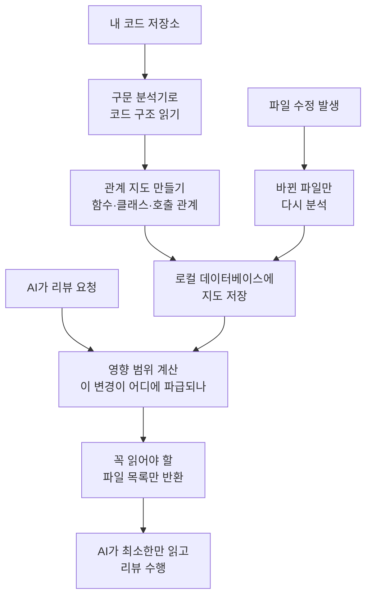

<div class="ai-knowledge-shell">

<aside class="ai-knowledge-sidebar">
  <p class="ai-eyebrow">CATEGORIES</p>
  <nav class="ai-cat-tree"><details class="ai-cat" open><summary><span class="catname">에이전트 오케스트레이션</span><span class="catcount">5</span></summary><ul><li><a href="https://altjs4510.github.io/ai_news_blog/knowledge/20260709/"><span class="kdate">2026-07-09</span><span class="ktitle">mvanhorn/last30days-skill — Reddit·X·YouTube·HN·…</span></a></li><li><a href="https://altjs4510.github.io/ai_news_blog/knowledge/20260623/"><span class="kdate">2026-06-23</span><span class="ktitle">bytedance/deer-flow — 샌드박스·메모리·서브에이전트·메시지 게이트웨이를…</span></a></li><li><a href="https://altjs4510.github.io/ai_news_blog/knowledge/20260602/"><span class="kdate">2026-06-02</span><span class="ktitle">revfactory/harness — 도메인별 에이전트 팀과 스킬을 자동 설계하는 메타…</span></a></li><li><a href="https://altjs4510.github.io/ai_news_blog/knowledge/20260529/"><span class="kdate">2026-05-29</span><span class="ktitle">Introducing dynamic workflows in Claude Code</span></a></li><li><a href="https://altjs4510.github.io/ai_news_blog/knowledge/20260507/"><span class="kdate">2026-05-07</span><span class="ktitle">ruvnet/ruflo — Claude 멀티 에이전트 오케스트레이션 플랫폼</span></a></li></ul></details><details class="ai-cat" open><summary><span class="catname">MCP &amp; 도구 통합</span><span class="catcount">18</span></summary><ul><li><a href="https://altjs4510.github.io/ai_news_blog/knowledge/20260805/"><span class="kdate">2026-08-05</span><span class="ktitle">TencentCloud/TencentDB-Agent-Memory — 대화·문서·코드를 …</span></a></li><li><a href="https://altjs4510.github.io/ai_news_blog/knowledge/20260802/"><span class="kdate">2026-08-02</span><span class="ktitle">Stateless MCP has recaptured my interest (and in…</span></a></li><li><a href="https://altjs4510.github.io/ai_news_blog/knowledge/20260801/"><span class="kdate">2026-08-01</span><span class="ktitle">different-ai/openwork — Claude Cowork의 오픈소스 대체 에…</span></a></li><li><a href="https://altjs4510.github.io/ai_news_blog/knowledge/20260731/"><span class="kdate">2026-07-31</span><span class="ktitle">different-ai/openwork — Claude Cowork의 오픈소스 대안(o…</span></a></li><li><a href="https://altjs4510.github.io/ai_news_blog/knowledge/20260729/"><span class="kdate">2026-07-29</span><span class="ktitle">Bringing MCP 2026-07-28 to Claude</span></a></li><li><a href="https://altjs4510.github.io/ai_news_blog/knowledge/20260719/" class="current"><span class="kdate">2026-07-19</span><span class="ktitle">tirth8205/code-review-graph — 로컬 우선 코드 인텔리전스 그래프…</span></a></li><li><a href="https://altjs4510.github.io/ai_news_blog/knowledge/20260718/"><span class="kdate">2026-07-18</span><span class="ktitle">tirth8205/code-review-graph — MCP·CLI용 로컬 코드 인텔리…</span></a></li><li><a href="https://altjs4510.github.io/ai_news_blog/knowledge/20260708/"><span class="kdate">2026-07-08</span><span class="ktitle">Expanding Managed Agents in Gemini API: backgrou…</span></a></li><li><a href="https://altjs4510.github.io/ai_news_blog/knowledge/20260701/"><span class="kdate">2026-07-01</span><span class="ktitle">Google OKF (Open Knowledge Format) — 벤더 중립 에이전트 …</span></a></li><li><a href="https://altjs4510.github.io/ai_news_blog/knowledge/20260618/"><span class="kdate">2026-06-18</span><span class="ktitle">DeusData/codebase-memory-mcp — 158개 언어 코드베이스를 밀리…</span></a></li><li><a href="https://altjs4510.github.io/ai_news_blog/knowledge/20260606/"><span class="kdate">2026-06-06</span><span class="ktitle">chopratejas/headroom — Compress tool outputs, lo…</span></a></li><li><a href="https://altjs4510.github.io/ai_news_blog/knowledge/20260605/"><span class="kdate">2026-06-05</span><span class="ktitle">chopratejas/headroom — Compress tool outputs, lo…</span></a></li><li><a href="https://altjs4510.github.io/ai_news_blog/knowledge/20260604/"><span class="kdate">2026-06-04</span><span class="ktitle">chopratejas/headroom — Compress tool outputs bef…</span></a></li><li><a href="https://altjs4510.github.io/ai_news_blog/knowledge/20260603/"><span class="kdate">2026-06-03</span><span class="ktitle">How Bad MCP design cost your Agent 5× more token…</span></a></li><li><a href="https://altjs4510.github.io/ai_news_blog/knowledge/20260526/"><span class="kdate">2026-05-26</span><span class="ktitle">colbymchenry/codegraph — Pre-indexed code knowle…</span></a></li><li><a href="https://altjs4510.github.io/ai_news_blog/knowledge/20260523/"><span class="kdate">2026-05-23</span><span class="ktitle">colbymchenry/codegraph — 사전 인덱싱된 코드 지식 그래프 MCP</span></a></li><li><a href="https://altjs4510.github.io/ai_news_blog/knowledge/20260517/"><span class="kdate">2026-05-17</span><span class="ktitle">I gave my LLM 100,000+ tools — Lazy Discovery &a…</span></a></li><li><a href="https://altjs4510.github.io/ai_news_blog/knowledge/20260509/"><span class="kdate">2026-05-09</span><span class="ktitle">How to connect 100 MCP servers without the conte…</span></a></li></ul></details><details class="ai-cat" open><summary><span class="catname">코딩 에이전트</span><span class="catcount">25</span></summary><ul><li><a href="https://altjs4510.github.io/ai_news_blog/knowledge/20260819/"><span class="kdate">2026-08-19</span><span class="ktitle">akitaonrails/ai-memory — 코딩 에이전트 CLI 간 장기 기억과 벤더…</span></a></li><li><a href="https://altjs4510.github.io/ai_news_blog/knowledge/20260814/"><span class="kdate">2026-08-14</span><span class="ktitle">cathrynlavery/diagram-design — Claude Code용 에디토리…</span></a></li><li><a href="https://altjs4510.github.io/ai_news_blog/knowledge/20260811/"><span class="kdate">2026-08-11</span><span class="ktitle">PrimeIntellect-ai/prime-agent — 장기 자율 실행을 전제로 설계…</span></a></li><li><a href="https://altjs4510.github.io/ai_news_blog/knowledge/20260810/"><span class="kdate">2026-08-10</span><span class="ktitle">Auto mode is now the default in Claude Code for …</span></a></li><li><a href="https://altjs4510.github.io/ai_news_blog/knowledge/20260809/"><span class="kdate">2026-08-09</span><span class="ktitle">PrimeIntellect-ai/prime-agent — 코딩 워크플로우·장기 자율 작…</span></a></li><li><a href="https://altjs4510.github.io/ai_news_blog/knowledge/20260808/"><span class="kdate">2026-08-08</span><span class="ktitle">PrimeIntellect-ai/prime-agent — 코딩 워크플로우와 장시간 자율…</span></a></li><li><a href="https://altjs4510.github.io/ai_news_blog/knowledge/20260804/"><span class="kdate">2026-08-04</span><span class="ktitle">esengine/DeepSeek-Reasonix — prefix-cache 안정성을 축…</span></a></li><li><a href="https://altjs4510.github.io/ai_news_blog/knowledge/20260728/"><span class="kdate">2026-07-28</span><span class="ktitle">alibaba/open-code-review — 결정론적 파이프라인 + LLM 에이전트…</span></a></li><li><a href="https://altjs4510.github.io/ai_news_blog/knowledge/20260725/"><span class="kdate">2026-07-25</span><span class="ktitle">The new rules of context engineering for Claude …</span></a></li><li><a href="https://altjs4510.github.io/ai_news_blog/knowledge/20260722/"><span class="kdate">2026-07-22</span><span class="ktitle">tirth8205/code-review-graph — MCP·CLI용 로컬 우선 코드 …</span></a></li><li><a href="https://altjs4510.github.io/ai_news_blog/knowledge/20260721/"><span class="kdate">2026-07-21</span><span class="ktitle">tirth8205/code-review-graph — 로컬 우선 코드 인텔리전스 그래프…</span></a></li><li><a href="https://altjs4510.github.io/ai_news_blog/knowledge/20260714/"><span class="kdate">2026-07-14</span><span class="ktitle">Graphify-Labs/graphify — 코드베이스를 질의 가능한 지식 그래프로 만…</span></a></li><li><a href="https://altjs4510.github.io/ai_news_blog/knowledge/20260707/"><span class="kdate">2026-07-07</span><span class="ktitle">AI Hero Skills Catalog — 실무 엔지니어를 위한 재사용 가능한 판단 …</span></a></li><li><a href="https://altjs4510.github.io/ai_news_blog/knowledge/20260705/"><span class="kdate">2026-07-05</span><span class="ktitle">openai/codex-plugin-cc — Claude Code에서 Codex를 위임…</span></a></li><li><a href="https://altjs4510.github.io/ai_news_blog/knowledge/20260626/"><span class="kdate">2026-06-26</span><span class="ktitle">google-labs-code/design.md — 코딩 에이전트에게 디자인 시스템을 …</span></a></li><li><a href="https://altjs4510.github.io/ai_news_blog/knowledge/20260619/"><span class="kdate">2026-06-19</span><span class="ktitle">Claude Code now supports artifacts</span></a></li><li><a href="https://altjs4510.github.io/ai_news_blog/knowledge/20260530/"><span class="kdate">2026-05-30</span><span class="ktitle">Leonxlnx/taste-skill — AI에게 좋은 취향을 부여해 generic s…</span></a></li><li><a href="https://altjs4510.github.io/ai_news_blog/knowledge/20260528/"><span class="kdate">2026-05-28</span><span class="ktitle">Building self-improving tax agents with Codex</span></a></li><li><a href="https://altjs4510.github.io/ai_news_blog/knowledge/20260524/"><span class="kdate">2026-05-24</span><span class="ktitle">colbymchenry/codegraph — Pre-indexed code knowle…</span></a></li><li><a href="https://altjs4510.github.io/ai_news_blog/knowledge/20260521/"><span class="kdate">2026-05-21</span><span class="ktitle">colbymchenry/codegraph — Pre-indexed code knowle…</span></a></li><li><a href="https://altjs4510.github.io/ai_news_blog/knowledge/20260512/"><span class="kdate">2026-05-12</span><span class="ktitle">agentmemory — Persistent memory for AI coding ag…</span></a></li><li><a href="https://altjs4510.github.io/ai_news_blog/knowledge/20260510/"><span class="kdate">2026-05-10</span><span class="ktitle">addyosmani/agent-skills — Production-grade engin…</span></a></li><li><a href="https://altjs4510.github.io/ai_news_blog/knowledge/20260508/"><span class="kdate">2026-05-08</span><span class="ktitle">addyosmani/agent-skills — Production-grade engin…</span></a></li><li><a href="https://altjs4510.github.io/ai_news_blog/knowledge/20260506/"><span class="kdate">2026-05-06</span><span class="ktitle">mksglu/context-mode — AI 코딩 에이전트용 컨텍스트 윈도우 최적화</span></a></li><li><a href="https://altjs4510.github.io/ai_news_blog/knowledge/20260505/"><span class="kdate">2026-05-05</span><span class="ktitle">mattpocock/skills — Skills for Real Engineers (.…</span></a></li></ul></details><details class="ai-cat" open><summary><span class="catname">모델 &amp; 연구</span><span class="catcount">6</span></summary><ul><li><a href="https://altjs4510.github.io/ai_news_blog/knowledge/20260717/"><span class="kdate">2026-07-17</span><span class="ktitle">After a year building agent memory, 'save everyt…</span></a></li><li><a href="https://altjs4510.github.io/ai_news_blog/knowledge/20260716-proprag/"><span class="kdate">2026-07-16</span><span class="ktitle">PropRAG — 프로포지션 경로 위 beam search로 멀티홉 검색 안내</span></a></li><li><a href="https://altjs4510.github.io/ai_news_blog/knowledge/20260620/"><span class="kdate">2026-06-20</span><span class="ktitle">zai-org/GLM-5 — From Vibe Coding to Agentic Engi…</span></a></li><li><a href="https://altjs4510.github.io/ai_news_blog/knowledge/20260617/"><span class="kdate">2026-06-17</span><span class="ktitle">Predicting model behavior before release by simu…</span></a></li><li><a href="https://altjs4510.github.io/ai_news_blog/knowledge/20260516/"><span class="kdate">2026-05-16</span><span class="ktitle">STALE — 에이전트가 자기 기억의 유효성을 인지할 수 있는가</span></a></li><li><a href="https://altjs4510.github.io/ai_news_blog/knowledge/20260513/"><span class="kdate">2026-05-13</span><span class="ktitle">Thinking Machines' Native Interaction Models — T…</span></a></li></ul></details><details class="ai-cat" open><summary><span class="catname">인프라 &amp; 컴퓨트</span><span class="catcount">8</span></summary><ul><li><a href="https://altjs4510.github.io/ai_news_blog/knowledge/20260813/"><span class="kdate">2026-08-13</span><span class="ktitle">semantica-agi/semantica — 컨텍스트와 책임 추적을 위한 그래프 네이…</span></a></li><li><a href="https://altjs4510.github.io/ai_news_blog/knowledge/20260812/"><span class="kdate">2026-08-12</span><span class="ktitle">semantica-agi/semantica — 컨텍스트와 '책임 추적 가능한(accou…</span></a></li><li><a href="https://altjs4510.github.io/ai_news_blog/knowledge/20260806/"><span class="kdate">2026-08-06</span><span class="ktitle">cloudflare/computer — 에이전트에게 컴퓨터를 통째로 주는 엣지 실행 샌…</span></a></li><li><a href="https://altjs4510.github.io/ai_news_blog/knowledge/20260724/"><span class="kdate">2026-07-24</span><span class="ktitle">diegosouzapw/OmniRoute — 단일 엔드포인트로 278+ 프로바이더·50…</span></a></li><li><a href="https://altjs4510.github.io/ai_news_blog/knowledge/20260723/"><span class="kdate">2026-07-23</span><span class="ktitle">diegosouzapw/OmniRoute — 268+ 프로바이더를 단일 엔드포인트로 묶…</span></a></li><li><a href="https://altjs4510.github.io/ai_news_blog/knowledge/20260611/"><span class="kdate">2026-06-11</span><span class="ktitle">The evolution of agentic surfaces: building with…</span></a></li><li><a href="https://altjs4510.github.io/ai_news_blog/knowledge/20260522/"><span class="kdate">2026-05-22</span><span class="ktitle">Giving Agents Computers — Ivan Burazin, Daytona</span></a></li><li><a href="https://altjs4510.github.io/ai_news_blog/knowledge/20260520/"><span class="kdate">2026-05-20</span><span class="ktitle">New in Claude Managed Agents: self-hosted sandbo…</span></a></li></ul></details><details class="ai-cat" open><summary><span class="catname">보안 &amp; 거버넌스</span><span class="catcount">15</span></summary><ul><li><a href="https://altjs4510.github.io/ai_news_blog/knowledge/20260730/"><span class="kdate">2026-07-30</span><span class="ktitle">Anatomy of a Frontier Lab Agent Intrusion: A Tec…</span></a></li><li><a href="https://altjs4510.github.io/ai_news_blog/knowledge/20260716/"><span class="kdate">2026-07-16</span><span class="ktitle">Dicklesworthstone/destructive_command_guard — 에이…</span></a></li><li><a href="https://altjs4510.github.io/ai_news_blog/knowledge/20260715/"><span class="kdate">2026-07-15</span><span class="ktitle">Dicklesworthstone/destructive_command_guard — 에이…</span></a></li><li><a href="https://altjs4510.github.io/ai_news_blog/knowledge/20260710/"><span class="kdate">2026-07-10</span><span class="ktitle">70개 MCP 서버 strace 런타임 감사 — 부팅 시 아웃바운드 호출 서버 적발</span></a></li><li><a href="https://altjs4510.github.io/ai_news_blog/knowledge/20260704/"><span class="kdate">2026-07-04</span><span class="ktitle">Cloudflare is about to block AI agents by defaul…</span></a></li><li><a href="https://altjs4510.github.io/ai_news_blog/knowledge/20260703/"><span class="kdate">2026-07-03</span><span class="ktitle">Giving admins more visibility and control over C…</span></a></li><li><a href="https://altjs4510.github.io/ai_news_blog/knowledge/20260630/"><span class="kdate">2026-06-30</span><span class="ktitle">Introducing the Claude apps gateway for Amazon B…</span></a></li><li><a href="https://altjs4510.github.io/ai_news_blog/knowledge/20260625/"><span class="kdate">2026-06-25</span><span class="ktitle">Agent identity in Claude Tag: a new access model…</span></a></li><li><a href="https://altjs4510.github.io/ai_news_blog/knowledge/20260624/"><span class="kdate">2026-06-24</span><span class="ktitle">Agent identity in Claude Tag: a new access model…</span></a></li><li><a href="https://altjs4510.github.io/ai_news_blog/knowledge/20260614/"><span class="kdate">2026-06-14</span><span class="ktitle">NVIDIA/SkillSpector — Security scanner for AI ag…</span></a></li><li><a href="https://altjs4510.github.io/ai_news_blog/knowledge/20260613/"><span class="kdate">2026-06-13</span><span class="ktitle">Fable 5's guardrails got bypassed in 48 hours — …</span></a></li><li><a href="https://altjs4510.github.io/ai_news_blog/knowledge/20260612/"><span class="kdate">2026-06-12</span><span class="ktitle">NVIDIA/SkillSpector — AI 에이전트 스킬용 보안 스캐너</span></a></li><li><a href="https://altjs4510.github.io/ai_news_blog/knowledge/20260607/"><span class="kdate">2026-06-07</span><span class="ktitle">OpenAI Help: Lockdown Mode</span></a></li><li><a href="https://altjs4510.github.io/ai_news_blog/knowledge/20260531/"><span class="kdate">2026-05-31</span><span class="ktitle">How we contain Claude across products</span></a></li><li><a href="https://altjs4510.github.io/ai_news_blog/knowledge/20260527/"><span class="kdate">2026-05-27</span><span class="ktitle">Microsoft Copilot Cowork Exfiltrates Files</span></a></li></ul></details><details class="ai-cat" open><summary><span class="catname">응용 사례</span><span class="catcount">6</span></summary><ul><li><a href="https://altjs4510.github.io/ai_news_blog/knowledge/20260726/"><span class="kdate">2026-07-26</span><span class="ktitle">citrolabs/ego-lite — 로그인된 브라우저 상태를 AI 에이전트와 공유하는…</span></a></li><li><a href="https://altjs4510.github.io/ai_news_blog/knowledge/20260712/"><span class="kdate">2026-07-12</span><span class="ktitle">Do Automated Evals Work?</span></a></li><li><a href="https://altjs4510.github.io/ai_news_blog/knowledge/20260621/"><span class="kdate">2026-06-21</span><span class="ktitle">calesthio/OpenMontage — 12 파이프라인·52 도구·500+ 스킬을 …</span></a></li><li><a href="https://altjs4510.github.io/ai_news_blog/knowledge/20260609/"><span class="kdate">2026-06-09</span><span class="ktitle">Building intelligent apps for Apple platforms wi…</span></a></li><li><a href="https://altjs4510.github.io/ai_news_blog/knowledge/20260515/"><span class="kdate">2026-05-15</span><span class="ktitle">Clawdmeter — Claude Code 사용량을 데스크톱 대시보드로</span></a></li><li><a href="https://altjs4510.github.io/ai_news_blog/knowledge/20260514/"><span class="kdate">2026-05-14</span><span class="ktitle">Introducing Claude for Small Business</span></a></li></ul></details><details class="ai-cat" open><summary><span class="catname">산업 동향</span><span class="catcount">6</span></summary><ul><li><a href="https://altjs4510.github.io/ai_news_blog/knowledge/20260711/"><span class="kdate">2026-07-11</span><span class="ktitle">OpenAI says GPT 5.6 is the 'preferred model' for…</span></a></li><li><a href="https://altjs4510.github.io/ai_news_blog/knowledge/20260702/"><span class="kdate">2026-07-02</span><span class="ktitle">How Cursor deploys AI inside the enterprise (For…</span></a></li><li><a href="https://altjs4510.github.io/ai_news_blog/knowledge/20260616/"><span class="kdate">2026-06-16</span><span class="ktitle">Why AI hasn't replaced software engineers, and w…</span></a></li><li><a href="https://altjs4510.github.io/ai_news_blog/knowledge/20260610/"><span class="kdate">2026-06-10</span><span class="ktitle">Fable 5 just made cost-aware model routing manda…</span></a></li><li><a href="https://altjs4510.github.io/ai_news_blog/knowledge/20260519/"><span class="kdate">2026-05-19</span><span class="ktitle">Anthropic acquires Stainless</span></a></li><li><a href="https://altjs4510.github.io/ai_news_blog/knowledge/20260504/"><span class="kdate">2026-05-04</span><span class="ktitle">Agents for Everything Else: Codex for Knowledge …</span></a></li></ul></details></nav>
</aside>

<article class="ai-knowledge-article">

<header class="ai-post-hero">
  <p class="ai-eyebrow"><a class="ai-back" href="../">KNOWLEDGE</a> · 2026-07-19 · 오늘의 학습</p>
  <h2 class="ai-post-title">tirth8205/code-review-graph — 로컬 우선 코드 인텔리전스 그래프(MCP·CLI)</h2>
</header>

> 원문: [tirth8205/code-review-graph — 로컬 우선 코드 인텔리전스 그래프(MCP·CLI)](https://github.com/tirth8205/code-review-graph)

## 📌 학습 정리

### 1. 한 줄로 말하면

코드베이스 전체를 매번 훑지 않아도 되도록, "어느 파일이 어디랑 연결돼 있는지"를 미리 지도로 그려두고 필요한 부분만 골라 읽게 해주는 도구예요.

### 2. 왜 이게 만들어졌어요?

요즘 AI 코딩 도구(예: Claude Code, Cursor, Copilot 같은 것들)는 리뷰나 수정 작업을 할 때 프로젝트 파일을 광범위하게 다시 읽어보는 경향이 있어요. 파일이 몇백 개, 몇천 개가 되면 이게 곧 비용(토큰)으로 돌아오고, 응답도 느려집니다. 원래는 "그냥 관련 있어 보이는 파일을 다 읽어봐"라는 식으로 처리했는데, 정작 실제로 봐야 할 파일은 그중 아주 일부죠. 그래서 이 도구는 코드 구조를 미리 그래프(graph, 점과 선으로 된 관계 지도)로 만들어 두고, "이 변경이 영향을 주는 곳만 딱 짚어서" AI에게 넘겨주는 방식을 택했습니다. 게다가 이 모든 처리가 내 컴퓨터 안에서 끝나는 로컬 우선(local-first, 소스 코드를 외부 서버로 보내지 않는 방식) 구조예요.

### 3. 비유로 풀면

이건 마치 큰 도서관에서 책 한 권을 수정할 때, 사서가 미리 만들어 둔 "이 책을 인용한 다른 책 목록"을 꺼내주는 것과 비슷해요. 도서관 전체 책장을 뒤지는 대신, 관련된 몇 권만 뽑아서 보면 되죠.

또는 건물의 배선도를 떠올려도 좋아요. 전등 하나를 바꾸는데 건물 전체 벽을 뜯어볼 필요는 없잖아요. 배선도를 보면 "이 전등은 이 스위치, 이 두꺼비집과 연결돼 있다"가 바로 보이니까요.

그래서 결국, 코드베이스라는 큰 건물에서 "이번에 손댄 부분과 실제로 이어진 곳"만 골라 AI에게 보여주는 게 이 도구의 핵심이에요.

### 4. 어떻게 작동하는지 (그림으로)



흐름을 풀어 말하면 이렇습니다. 처음 한 번은 저장소 전체를 훑어서 "함수·클래스·호출 관계" 같은 구조를 지도로 만들어 로컬에 저장해요. 그 뒤로는 파일이 바뀔 때마다 바뀐 부분만 다시 그려 넣습니다. AI가 리뷰를 요청하면, 지도를 따라 "이 변경이 파급되는 범위(blast radius, 폭발 반경 — 즉 영향을 받을 만한 파일들)"를 계산해서 그 파일들만 골라 넘겨줘요.

### 5. 처음 보는 용어 풀이

- **관계 지도로서의 그래프 (graph)** — 코드의 함수·클래스·파일을 '점'으로, 서로 부르거나 상속하는 관계를 '선'으로 표현한 지도예요. 이 지도가 있으면 "무엇이 무엇에 연결돼 있는지"를 빠르게 추적할 수 있습니다.

- **구문 트리 분석기 (Tree-sitter)** — 코드를 사람이 읽는 텍스트가 아니라, 컴퓨터가 이해할 수 있는 구조(함수 정의, 호출, 임포트 등)로 잘게 쪼개주는 도구예요. 이 도구가 여러 프로그래밍 언어를 지원해서 파이썬, 자바스크립트, 고 등 다양한 언어를 다룰 수 있게 해줍니다.

- **모델 컨텍스트 프로토콜 (MCP, Model Context Protocol)** — AI 어시스턴트와 외부 도구가 서로 대화하는 표준 규격이에요. 이 규격을 따르면 Claude Code, Cursor 같은 다양한 AI 도구들이 같은 방식으로 이 그래프에게 질문을 던질 수 있습니다.

- **영향 범위 분석 (blast radius analysis)** — 어떤 함수 하나를 고쳤을 때, 그 함수를 부르는 다른 코드·의존하는 코드·관련 테스트가 어디까지 퍼져 있는지 그래프를 따라 추적하는 기능이에요. 이걸로 "이번 변경 때문에 봐야 할 파일 목록"이 딱 나옵니다.

- **점진적 업데이트 (incremental update)** — 파일이 바뀔 때 전체를 다시 분석하지 않고, 바뀐 파일과 그 파일에 연결된 부분만 다시 그리는 방식이에요. 덕분에 큰 프로젝트도 갱신이 몇 초 안에 끝납니다.

- **토큰 (token)** — AI에게 텍스트를 보낼 때 세는 단위예요. 대략 짧은 단어 하나가 1~2 토큰인데, 파일을 많이 읽을수록 토큰이 늘고 비용·시간이 올라갑니다. 이 도구가 절약하는 대상이 바로 이 토큰이에요.

- **로컬 우선 (local-first)** — 분석과 저장이 전부 내 컴퓨터 안에서 이뤄지고, 소스 코드를 외부 서비스로 보내지 않는 방식이에요. 보안이 민감한 환경에서 특히 중요합니다. 이 도구는 그래프를 `.code-review-graph/` 폴더 안의 SQLite 파일에 저장해요.

- **커뮤니티 탐지 (community detection, Leiden 알고리즘)** — 그래프에서 서로 밀접하게 연결된 코드들을 자동으로 묶어 "이건 인증 관련 뭉치, 이건 결제 관련 뭉치" 하는 식으로 구획을 나눠주는 기법이에요. 아키텍처 파악에 유용합니다.

### 6. 한 발 더 들어가고 싶다면

- [사용법 문서 (Usage)](https://github.com/tirth8205/code-review-graph/blob/main/docs/USAGE.md) — 실제로 어떤 명령어를 어떤 상황에서 쓰는지 감을 잡을 수 있어요.
- [명령어 레퍼런스 (Commands)](https://github.com/tirth8205/code-review-graph/blob/main/docs/COMMANDS.md) — CLI 명령어 전체를 한눈에 훑고 싶을 때 보면 좋아요.
- [벤치마크 재현 방법 (Reproducing the benchmarks)](https://github.com/tirth8205/code-review-graph/blob/main/docs/REPRODUCING.md) — "정말 토큰이 그렇게 줄어드는가?"를 직접 검증하고 싶을 때 참고할 수 있어요.
- [커스텀 언어 추가 가이드](https://github.com/tirth8205/code-review-graph/blob/main/docs/CUSTOM_LANGUAGES.md) — 내가 쓰는 언어가 아직 지원 목록에 없을 때 어떻게 직접 추가하는지 알 수 있어요.
- [모델 컨텍스트 프로토콜 공식 사이트](https://modelcontextprotocol.io/) — AI 도구와 외부 도구를 잇는 표준 규격 자체가 궁금할 때 시작점이 됩니다.
- [Tree-sitter 공식 사이트](https://tree-sitter.github.io/tree-sitter/) — 이 도구가 코드를 어떻게 구조적으로 읽어내는지, 그 기반 기술을 이해하는 데 도움이 돼요.

---

## 📖 원문 전체 번역 (정독용)

> 의역 최소화한 전체 번역입니다. 큰 흐름은 위 정리에서 잡고, 정확한 워딩이 필요할 땐 이 섹션에서 정독하세요.

**토큰 낭비를 멈추세요. 더 스마트하게 리뷰하세요.**

[English](https://github.com/tirth8205/code-review-graph/blob/main/README.md) | [简体中文](https://github.com/tirth8205/code-review-graph/blob/main/README.zh-CN.md) | [日本語](https://github.com/tirth8205/code-review-graph/blob/main/README.ja-JP.md) | [한국어](https://github.com/tirth8205/code-review-graph/blob/main/README.ko-KR.md) | [हिन्दी](https://github.com/tirth8205/code-review-graph/blob/main/README.hi-IN.md)

AI 코딩 도구는 리뷰 작업 시 코드베이스의 상당 부분을 반복해서 읽게 됩니다. `code-review-graph`는 이 문제를 해결합니다. [Tree-sitter](https://tree-sitter.github.io/tree-sitter/)로 코드의 구조적 맵을 구축하고, 변경 사항을 증분 방식으로 추적하며, [MCP](https://modelcontextprotocol.io/)를 통해 AI 어시스턴트에 정밀한 컨텍스트를 제공하여 실제로 필요한 것만 읽도록 합니다.

---

## 빠른 시작

```
pip install code-review-graph                     # 또는: pipx install code-review-graph
code-review-graph install          # 지원되는 모든 플랫폼을 자동 감지하고 구성
code-review-graph build            # 코드베이스 파싱
```

명령 하나로 모든 설정이 완료됩니다. `install`은 어떤 AI 코딩 도구가 설치되어 있는지 감지하고, 각 도구에 맞는 MCP 구성을 작성하며, 지원되는 경우 플랫폼 네이티브 훅/스킬을 설치하고, 플랫폼 규칙에 그래프 인식 지시문을 주입합니다. `uvx` 또는 `pip`/`pipx`로 설치했는지를 자동 감지하여 적절한 구성을 생성합니다. 설치 후 편집기/도구를 재시작하세요.

특정 플랫폼을 대상으로 하려면:

```
code-review-graph install --platform codex       # Codex만 구성
code-review-graph install --platform cursor      # Cursor만 구성
code-review-graph install --platform claude-code  # Claude Code만 구성
code-review-graph install --platform gemini-cli   # Gemini CLI만 구성
code-review-graph install --platform kiro         # Kiro만 구성
code-review-graph install --platform copilot      # GitHub Copilot (VS Code)만 구성
code-review-graph install --platform copilot-cli  # GitHub Copilot CLI만 구성
code-review-graph install --platform codebuddy    # CodeBuddy Code만 구성
```

Python 3.10 이상이 필요합니다. 최상의 경험을 위해 [uv](https://docs.astral.sh/uv/)를 설치하세요(사용 가능한 경우 MCP 구성이 `uvx`를 사용하며, 그렇지 않으면 `code-review-graph` 명령을 직접 사용합니다).

Git 또는 SVN 프로젝트에서 CRG를 제거하려면 해당 작업 트리 내부 어디에서든 대칭적인 uninstall 명령을 사용하세요. 대상 경로는 작업 트리 루트로 정규화되며, 저장소가 아닌 디렉터리는 거부됩니다. CRG 소유 파일과 항목만 제거하며, 관련 없는 MCP 서버, 훅, 스킬, JSONC 주석은 그대로 유지됩니다. 공유 구성 변경은 원자적 교체를 사용하므로 쓰기 실패 시 원본 파일이 그대로 보존됩니다.

```
code-review-graph uninstall --dry-run    # 모든 작업을 미리 보기; 아무것도 쓰지 않음
code-review-graph uninstall              # 미리 보기, 확인 요청 후 적용
code-review-graph uninstall --yes        # 확인 없이 바로 적용
code-review-graph uninstall --all-repos  # 등록된 모든 저장소도 정리
code-review-graph uninstall --keep-data  # 통합은 제거하되 그래프 데이터베이스는 유지
code-review-graph uninstall --keep-user-configs --repo .  # 이 프로젝트만 정리
```

그런 다음 프로젝트를 열고 AI 어시스턴트에게 요청하세요:

```
Build the code review graph for this project
```

500개 파일 프로젝트의 초기 빌드는 약 10초가 소요됩니다. 이후에는 watch 모드와 지원되는 훅이 그래프를 자동으로 최신 상태로 유지할 수 있습니다.

## 작동 원리

저장소는 Tree-sitter로 AST로 파싱되어 노드(함수, 클래스, 임포트)와 엣지(호출, 상속, 테스트 커버리지)의 그래프로 저장된 후, 리뷰 시점에 AI 어시스턴트가 읽어야 할 최소한의 파일 집합을 계산하는 데 사용됩니다.

### 블라스트 반경 분석 (Blast-radius analysis)

파일이 변경되면 그래프는 영향을 받을 수 있는 모든 호출자(caller), 의존 항목(dependent), 테스트를 추적합니다. 이것이 변경의 "블라스트 반경(blast radius)"입니다. AI는 전체 프로젝트를 스캔하는 대신 이 파일들만 읽습니다.

### 2초 미만의 증분 업데이트

훅 또는 watch 모드가 활성화되면, 파일 저장 및 지원되는 커밋 훅이 증분 업데이트를 트리거합니다. 그래프는 변경된 파일을 비교(diff)하고, SHA-256 해시 검사를 통해 의존 항목을 찾아, 변경된 것만 재파싱합니다. 2,900개 파일 프로젝트가 2초 미만으로 재인덱싱됩니다.

### 모노레포 문제, 해결됨

대형 모노레포는 토큰 낭비가 가장 심각한 곳입니다. 그래프는 노이즈를 걷어냅니다 — 27,700개 이상의 파일이 리뷰 컨텍스트에서 제외되고, 실제로 읽히는 파일은 약 15개에 불과합니다.

### 광범위한 언어 지원 + Jupyter 노트북

파서 지원은 현재 파서 표면 전체에 걸쳐 함수, 클래스, 임포트, 호출 지점, 상속, 테스트 감지를 포함하며, 가능한 경우 Tree-sitter를 사용하고 필요한 경우 타겟 폴백을 사용합니다. 현재 지원 언어: Python, JavaScript/TypeScript/TSX, Go, Rust, Java, C/C++, C#, VB.NET, Ruby, Kotlin, Swift, PHP, Scala, Solidity, Dart, R, Perl, Lua/Luau, Objective-C, 셸 스크립트, Elixir, Zig, PowerShell, Julia, ReScript, GDScript, Nix, Verilog/SystemVerilog, SQL, Terraform/OpenTofu 구조체(`.tf`; 범용 `.hcl` 파일은 파일 노드로 인식), Ansible 플레이북/역할/태스크, Vue/Svelte SFC, TypeScript 파서를 통해 파싱되는 Astro 파일, Jupyter/Databricks 노트북(`.ipynb`), Perl XS 파일(`.xs`). 범용 YAML은 소스 코드로 처리되지 않습니다.

PHP 프로젝트는 추가적으로 저장소 범위 내 Composer PSR-4 해석, Blade 템플릿 참조, 그리고 소스에 명시적 프레임워크 임포트, 모델 상속, 리시버 증거가 포함된 경우 Laravel Route/Eloquent 시맨틱 엣지를 제공합니다.

### 자체 언어 추가 (포크 불필요)

파서가 아직 지원하지 않는 언어를 저장소에서 사용한다면, `.code-review-graph/`에 `languages.toml`을 추가하여 파일 확장자를 `tree_sitter_language_pack`에 번들된 문법에 매핑하고, 함수, 클래스, 임포트, 호출에 대한 tree-sitter 노드 타입을 지정하세요:

```toml
[languages.erlang]
extensions = [".erl"]
grammar = "erlang"
function_node_types = ["function_clause"]
class_node_types = ["record_decl"]
import_node_types = ["import_attribute"]
call_node_types = ["call"]
```

범용 tree-sitter 워커가 거기서부터 추출을 처리합니다 — 코드 변경 없이, 그리고 내장 언어는 절대 덮어쓸 수 없습니다. 스키마 참조, 유효성 검사 규칙, 완전한 엔드투엔드 예제는 [docs/CUSTOM_LANGUAGES.md](https://github.com/tirth8205/code-review-graph/blob/main/docs/CUSTOM_LANGUAGES.md)를 참조하세요.

### CI에서의 리스크 점수 PR 리뷰 (GitHub Action)

동일한 분석이 복합 GitHub Action으로 실행되며, 로컬 우선 방식을 유지합니다: 지식 그래프는 CI 러너에서 완전히 구축되고 쿼리되며, 어떤 외부 서비스에도 소스 코드가 전송되지 않습니다. 각 풀 리퀘스트마다 액션은 리스크 점수가 매겨진 함수, 영향받는 실행 흐름, 테스트 갭을 포함하는 단일 고정(sticky) 코멘트를 게시하며, 매 푸시 시 업데이트됩니다. 선택적 `fail-on-risk` 입력으로 리뷰를 머지 게이트로 전환할 수 있습니다.

```yaml
# .github/workflows/code-review-graph.yml
on:
  pull_request:

permissions:
  contents: read
  pull-requests: write

jobs:
  review:
    runs-on: ubuntu-latest
    steps:
      - uses: actions/checkout@v7
      - uses: tirth8205/code-review-graph@v2.3.6
        with:
          github-token: ${{ secrets.GITHUB_TOKEN }}
```

입력값, 리스크 레벨, 캐싱 상세 사항은 [docs/GITHUB_ACTION.md](https://github.com/tirth8205/code-review-graph/blob/main/docs/GITHUB_ACTION.md)를 참조하거나, 이 저장소가 자체적으로 실행하는 dogfood 워크플로우 [`.github/workflows/pr-review.yml`](https://github.com/tirth8205/code-review-graph/blob/main/.github/workflows/pr-review.yml)을 확인하세요.

---

## 벤치마크

**헤드라인 수치: 6개 저장소에 걸친 질문당 중간값(median) 토큰 감소율은 약 82배**입니다 (전체 코퍼스 기준 대비 그래프 쿼리 비교). 자주 인용되는 **528배는 최댓값**으로, 단일 최상의 경우 저장소(fastapi)에서의 수치이지 일반적인 결과가 아닙니다.

모든 수치는 6개의 실제 오픈소스 저장소(총 13개 커밋)에 대한 자동화 평가 러너에서 도출됩니다. 모든 구성은 업스트림 SHA를 고정하고, Leiden 커뮤니티 감지기는 고정 시드로 실행되며, 임베딩은 CPU에서 결정론적입니다 — 따라서 서로 다른 머신에서 두 번 실행해도 동일한 수치가 나옵니다. 예상 출력값이 포함된 완전한 재현 레시피는 [`docs/REPRODUCING.md`](https://github.com/tirth8205/code-review-graph/blob/main/docs/REPRODUCING.md)에 있습니다. 가장 작은 두 구성에 대한 주간 보고 전용 실행은 [`.github/workflows/eval.yml`](https://github.com/tirth8205/code-review-graph/blob/main/.github/workflows/eval.yml)에 있습니다.

**토큰 효율성: 질문당 중간값 약 82배 감소 (범위 38배–528배; 전체 코퍼스 대비 그래프 쿼리)**
일반적인 에이전트 질문(`"인증은 어떻게 작동하나"`, `"메인 진입점은 무엇인가"` 등)에 대해 그래프는 에이전트가 모든 소스 파일을 읽도록 강제하는 대신 타겟 검색 결과와 인접 엣지로 이루어진 약 2,000–3,500토큰을 반환합니다. 아래 표는 `code_review_graph/token_benchmark.py`에 정의된 5개의 샘플 질문에 대한 평균입니다.

| 저장소 | 스냅샷 SHA | naive_corpus_tokens | avg graph_tokens | 감소율 |
| --- | --- | --- | --- | --- |
| fastapi | `0227991a` | 951,071 | 2,169 | **528.4배** |
| code-review-graph | `84bde354` | 208,821 | 2,495 | **93.0배** |
| gin | `5c00df8a` | 166,868 | 1,990 | **91.8배** |
| flask | `a29f88ce` | 125,022 | 1,986 | **71.4배** |
| express | `b4ab7d65` | 135,955 | 3,465 | **40.6배** |
| httpx | `b55d4635` | 89,492 | 2,438 | **38.0배** |

6개 저장소에 걸친 질문당 중간값 감소율: **약 82배**. 범위는 38배–528배이며, **528배는 최상의 경우**(fastapi, 가장 큰 코퍼스)로, 헤드라인 수치가 아닙니다.

위의 전체 코퍼스 기준은 어떤 실제 에이전트도 지불하지 않는 상한값입니다: 유능한 에이전트는 식별자를 grep하여 가장 잘 맞는 파일만 읽습니다. `agent_baseline` 평가 벤치마크는 그 현실적인 기준을 측정합니다 — 코퍼스에 대한 순수 파이썬 grep, 일치 횟수 기준 상위 3개 파일, 토큰 계수 후 그래프 쿼리 비용과 비교(`evaluate/results/<repo>_agent_baseline_*.csv`).

공식 `eval/benchmarks/token_efficiency.py` 벤치마크는 다른 시나리오를 측정합니다 — 커밋의 변경 파일 내용만 대비 전체 `get_review_context()` JSON — 그리고 소규모 커밋에 대해 1 미만의 비율을 보고합니다. 왜냐하면 리뷰 컨텍스트 응답이 작은 단일 파일 diff를 초과하는 영향 반경 엣지와 소스 스니펫을 포함하기 때문입니다. 이것은 버그가 아닙니다; 두 벤치마크는 서로 다른 질문에 답합니다. 전체 방법론은 [`docs/REPRODUCING.md`](https://github.com/tirth8205/code-review-graph/blob/main/docs/REPRODUCING.md)를 참조하세요.

v2.3.4부터 리뷰 및 영향 도구는 MCP 클라이언트가 호출당 절약된 대략적인 컨텍스트를 볼 수 있도록 간결한 `context_savings` 추정값을 첨부합니다. v2.3.5에서 CLI는 이를 위에 표시된 박스형 `Token Savings` 패널로 표시하며(사용 섹션의 "Token Savings panel" 참조), OpenAI의 `cl100k_base` 토크나이저와 교차 검증하는 `--verify`를 추가합니다. [`docs/REPRODUCING.md`](https://github.com/tirth8205/code-review-graph/blob/main/docs/REPRODUCING.md)의 교정 데이터는 222개 샘플 파일에 걸쳐 집계 시 추정값이 실제 GPT-4 토큰의 약 1% 이내임을 보여줍니다.

**영향 정확도: 그래프 파생 기준 진실(ground truth) 대비 평균 F1 0.71 (재현율 1.0은 순환적 상한값으로 "100% 재현율"이 아님)**
블라스트 반경 분석은 13개의 모든 평가 커밋에서 기준 진실의 모든 파일을 복구합니다 — **하지만 이를 상한값으로 읽어야지, "100% 재현율"로 읽으면 안 됩니다**: 이 모드에서 기준 진실(변경된 파일 + 그 파일로의 호출/임포트 엣지가 있는 파일)은 예측기가 순회하는 동일한 그래프에서 파생되므로, 구조적으로 순환적입니다. 정밀도 열에서 보이는 과다 예측은 의도적인 트레이드오프입니다: 깨진 의존성을 놓치는 것보다 너무 많은 파일을 플래그하는 것이 낫습니다.

| 저장소 | 커밋 수 | 평균 F1 | 평균 정밀도 | 재현율 (그래프 파생 상한값) |
| --- | --- | --- | --- | --- |
| httpx | 2 | 0.864 | 0.786 | 1.0 |
| fastapi | 2 | 0.834 | 0.750 | 1.0 |
| code-review-graph | 2 | 0.734 | 0.584 | 1.0 |
| express | 2 | 0.667 | 0.500 | 1.0 |
| flask | 2 | 0.628 | 0.481 | 1.0 |
| gin | 3 | 0.609 | 0.439 | 1.0 |
| **평균** | **13** | **0.714** | **0.578** | **1.000** |

벤치마크는 또한 정직한 **동시 변경(co-change) 모드**를 실행합니다: 예측기는 단일 변경 파일로 시드되고, 그래프가 아닌 git 히스토리의 독립적인 증거인 동일 커밋에서 작성자가 실제로 건드린 _다른_ 파일들을 기준으로 평가됩니다. 두 모드는 결과 CSV(`ground_truth_mode` 열)에 나란히 나타납니다. co-change 수치는 eval 러너로 측정된 후 표준 통계에 추가될 예정이며, 측정 전에는 인용하지 않습니다.

**빌드 성능**

| 저장소 | 파일 수 | 노드 수 | 엣지 수 | 흐름 감지 시간 | 검색 지연 |
| --- | --- | --- | --- | --- | --- |
| express | 141 | 1,910 | 17,553 | 106ms | 0.7ms |
| fastapi | 1,122 | 6,285 | 27,117 | 128ms | 1.5ms |
| flask | 83 | 1,446 | 7,974 | 95ms | 0.7ms |
| gin | 99 | 1,286 | 16,762 | 111ms | 0.5ms |
| httpx | 60 | 1,253 | 7,896 | 96ms | 0.4ms |

### 한계 및 알려진 약점

- **영향 "재현율 1.0"은 그래프 파생이며 순환적입니다:** 역사적 기준 진실은 예측기가 순회하는 동일한 그래프 엣지에서 도출되므로, 구조적으로 상한값입니다. 정직한 co-change 모드(동일 커밋에서 실제로 함께 변경된 파일을 기준으로 평가)는 나란히 측정됩니다; 해당 수치는 상당히 낮을 것으로 예상됩니다.
- **소규모 단일 파일 변경:** 사소한 편집의 경우 그래프 컨텍스트가 단순한 파일 읽기를 초과할 수 있습니다(위의 express 결과 참조). 이 오버헤드는 다중 파일 분석을 가능하게 하는 구조적 메타데이터 때문입니다.
- **검색 품질 (MRR 0.35):** 키워드 검색은 대부분의 쿼리에서 상위 4개 내에서 올바른 결과를 찾지만, 랭킹 개선이 필요합니다. Express 쿼리는 모듈 패턴 명명으로 인해 0개의 결과를 반환합니다.
- **흐름 감지 (재현율 33%):** 프레임워크 및 관례적 진입 패턴은 Python과 PHP/Laravel에서 가장 강합니다. JavaScript와 Go 흐름 감지는 개선이 필요합니다.
- **정밀도 대 재현율 트레이드오프:** 영향 분석은 의도적으로 보수적입니다. 영향을 _받을 수 있는_ 파일을 플래그하므로, 대규모 의존성 그래프에서는 일부 거짓 양성(false positive)이 발생합니다.

---

## 기능

| 기능 | 상세 |
| --- | --- |
| **증분 업데이트** | 변경된 파일만 재파싱. 후속 업데이트는 2초 이내에 완료. |
| **광범위한 언어 + 노트북 지원** | Python, JavaScript/TypeScript/TSX, Go, Rust, Java, C/C++, C#, VB.NET, Ruby, Kotlin, Swift, PHP, Scala, Solidity, Dart, R, Perl, Lua/Luau, Objective-C, 셸 스크립트, Elixir, Zig, PowerShell, Julia, ReScript, GDScript, Nix, Verilog/SystemVerilog, SQL, Terraform/OpenTofu 구조체(`.tf`; 범용 `.hcl` 파일은 파일 전용), Ansible 플레이북/역할/태스크, Vue/Svelte SFC, TypeScript 파서를 통해 파싱되는 Astro 파일, Jupyter/Databricks (.ipynb), Perl XS (.xs) |
| **프레임워크 인식 PHP 파싱** | 저장소 범위 내 Composer PSR-4 임포트, Blade 템플릿 참조, 증거 기반 Laravel Route-to-controller 및 Eloquent 관계 엣지 |
| **블라스트 반경 분석** | 변경으로 인해 영향을 받을 가능성이 있는 함수, 클래스, 파일을 표시 |
| **자동 업데이트 훅** | 훅과 watch 모드로 파일 저장 및 지원되는 커밋 훅에서 그래프 업데이트 가능 |
| **시맨틱 검색** | sentence-transformers, Google Gemini, MiniMax, 또는 OpenAI 호환 엔드포인트(실제 OpenAI, Azure, new-api, LiteLLM, vLLM, LocalAI)를 통한 선택적 벡터 임베딩 |
| **인터랙티브 시각화** | 검색, 커뮤니티 범례 토글, 차수 스케일 노드가 있는 D3.js 포스-다이렉티드 그래프 |
| **허브 및 브리지 감지** | 매개 중심성(betweenness centrality)을 통해 가장 많이 연결된 노드와 아키텍처 초크포인트 찾기 |
| **서프라이즈 점수** | 예기치 않은 결합 감지: 크로스 커뮤니티, 크로스 언어, 주변부-허브 엣지 |
| **지식 갭 분석** | 고립된 노드, 테스트되지 않은 핫스팟, 빈약한 커뮤니티, 구조적 약점 식별 |
| **제안 질문** | 그래프 분석(브리지, 허브, 서프라이즈)에서 자동 생성된 리뷰 질문 |
| **엣지 신뢰도** | 세 단계 신뢰도 점수(EXTRACTED/INFERRED/AMBIGUOUS)와 엣지의 부동소수점 점수 |
| **그래프 탐색** | 설정 가능한 깊이와 토큰 예산으로 모든 노드에서 자유형 BFS/DFS 탐색 |
| **내보내기 형식** | GraphML (Gephi/yEd), Neo4j Cypher, 위키링크가 있는 Obsidian 볼트, SVG 정적 그래프 |
| **그래프 diff** | 시간 경과에 따른 그래프 스냅샷 비교: 새로운/제거된 노드, 엣지, 커뮤니티 변경사항 |
| **토큰 벤치마킹** | 질문당 비율로 단순 전체 코퍼스 토큰 대비 그래프 쿼리 토큰 측정 |
| **추정 컨텍스트 절약** | 관련 MCP/CLI 리뷰 출력에 대한 간결한 `context_savings` 메타데이터, 추정값으로 표시하고 세 개의 작은 필드로 유지 |
| **메모리 루프** | Q&A 결과를 마크다운으로 지속 저장하여 재수집, 그래프가 쿼리로부터 성장 |
| **커뮤니티 자동 분할** | 과도한 크기의 커뮤니티(그래프의 25% 초과)를 Leiden을 통해 재귀적으로 분할 |
| **실행 흐름** | 가중 중요도 순으로 정렬된 진입점에서 호출 체인 추적 |
| **커뮤니티 감지** | 대규모 그래프를 위한 해상도 스케일링이 있는 Leiden 알고리즘으로 관련 코드 클러스터링 |
| **아키텍처 개요** | 결합 경고가 포함된 자동 생성 아키텍처 맵 |
| **리스크 점수 리뷰** | `detect_changes`가 diff를 영향받는 함수, 흐름, 테스트 갭으로 매핑 |
| **커스텀 언어** | `.code-review-graph/languages.toml`을 통해 새 언어 추가 — 포크나 코드 변경 불필요 |
| **GitHub Action** | CI에서 고정 리스크 점수 PR 리뷰 코멘트, 선택적 `fail-on-risk` 머지 게이트 |
| **리팩토링 도구** | 이름 변경 미리 보기, 프레임워크 인식 데드 코드 감지, 커뮤니티 기반 제안 |
| **위키 생성** | 커뮤니티 구조에서 마크다운 위키 자동 생성 |
| **멀티 레포 레지스트리** | 여러 저장소 등록, 전체 검색 |
| **멀티 레포 데몬** | `crg-daemon`이 상태 체크 및 자동 재시작으로 여러 저장소를 자식 프로세스로 감시 |
| **MCP 프롬프트** | 5개의 워크플로우 템플릿: 리뷰, 아키텍처, 디버그, 온보딩, 사전 머지 |
| **전문 검색** | 키워드와 벡터 유사도를 결합한 FTS5 기반 하이브리드 검색 |
| **로컬 스토리지** | `.code-review-graph/`의 SQLite 파일. 핵심 그래프 스토리지는 외부 데이터베이스나 클라우드 서비스가 필요 없음. |
| **Watch 모드** | 작업하는 동안 지속적인 그래프 업데이트 |

---

## 사용법

**슬래시 명령어**

| 명령어 | 설명 |
| --- | --- |
| `/code-review-graph:build-graph` | 코드 그래프 빌드 또는 재빌드 |
| `/code-review-graph:review-delta` | 마지막 커밋 이후 변경사항 리뷰 |
| `/code-review-graph:review-pr` | 블라스트 반경 분석이 포함된 전체 PR 리뷰 |

**CLI 참조**

```
code-review-graph install          # 모든 플랫폼 자동 감지 및 구성
code-review-graph install --platform <name>  # 특정 플랫폼 대상
code-review-graph uninstall --dry-run  # 설치된 아티팩트의 안전한 제거 미리 보기
code-review-graph build            # 전체 코드베이스 파싱
code-review-graph update           # 증분 업데이트 (변경된 파일만)
code-review-graph status           # 그래프 통계
code-review-graph watch            # 파일 변경 시 자동 업데이트
code-review-graph visualize        # 인터랙티브 HTML 그래프 생성
code-review-graph visualize --format json      # 로컬 그래프 데이터를 JSON으로 내보내기
code-review-graph visualize --format graphml   # GraphML로 내보내기
code-review-graph visualize --format svg       # SVG로 내보내기
code-review-graph visualize --format obsidian  # Obsidian 볼트로 내보내기
code-review-graph visualize --format cypher    # Neo4j Cypher로 내보내기
code-review-graph wiki             # 커뮤니티에서 마크다운 위키 생성
code-review-graph detect-changes --brief         # 리스크 패널 + 토큰 절약 (읽기 전용)
code-review-graph update --brief                 # 그래프 새로 고침 + 동일한 패널
code-review-graph detect-changes --brief --verify  # tiktoken과 교차 검증
code-review-graph register <path>  # 멀티 레포 레지스트리에 저장소 등록
code-review-graph unregister <id>  # 레지스트리에서 저장소 제거
code-review-graph repos            # 등록된 저장소 목록
code-review-graph daemon start     # 멀티 레포 watch 데몬 시작
code-review-graph daemon stop      # 데몬 중지
code-review-graph daemon status    # 데몬 상태 및 저장소 표시
code-review-graph eval             # 평가 벤치마크 실행
code-review-graph serve            # MCP 서버 시작
```

JSON 내보내기는 기본적으로 Git이 무시하는 로컬 그래프 데이터 디렉터리 안에 유지됩니다. 절대 경로와 코드 구조 메타데이터를 포함할 수 있으므로, 머신 외부에 게시하기 전에 내보내기를 검사하고 정제하세요.

**Token Savings 패널: `detect-changes --brief` 대 `update --brief`**
두 명령어 모두 변경된 파일을 그대로 에이전트에게 전달하는 것과 비교해 그래프가 얼마나 많은 토큰을 절약했는지 보여주는 동일한 간결한 패널을 출력합니다. **한 가지** 차이점이 있습니다: 그래프가 먼저 새로 고쳐지는지 여부입니다.

```
┌─────────────────────── Token Savings ────────────────────────┐
│ Full context would be:     12,921 tokens                     │
│ Graph context used:           762 tokens                     │
│ Saved:                     12,159 tokens (~94%)              │
│ Breakdown: Functions 244 · Tests 191 · Risk 244 · Other 83   │
└──────────────────────────────────────────────────────────────┘
```

| 명령어 | 수행 작업 | 사용 시기 |
| --- | --- | --- |
| `detect-changes --brief` | **읽기 전용.** 현재 변경사항을 확인하고, **기존** 그래프를 쿼리하여 패널을 출력. 약 1초. | 대부분의 경우 — 훅(또는 `crg-daemon`)이 백그라운드에서 그래프를 최신 상태로 유지하므로 이것으로 충분. |
| `update --brief` | **변경된 파일을 먼저 그래프에 재파싱한 후** 동일한 패널을 출력. 약 5초. | 리베이스 후, 대규모 변경 세트 후, 또는 그래프가 오래된 것으로 의심될 때. |

두 명령어 모두 마지막에 동일한 `analyze_changes()` 단계를 호출하므로 **동일한 패널**로 끝납니다. 차이점은 그 분석이 실행되기 전에 그래프 자체가 새로 고쳐지는지 여부입니다.

어느 명령어에든 `--verify`를 추가하면 표시된 수치를 OpenAI의 `cl100k_base` 토크나이저(GPT-4 패밀리)와 교차 검증합니다. `pip install tiktoken`이 필요합니다. 추정값은 일반적인 변경 세트에서 실제 토큰의 약 1% 이내를 유지합니다 — 교정 데이터는 [`docs/REPRODUCING.md`](https://github.com/tirth8205/code-review-graph/blob/main/docs/REPRODUCING.md)를 참조하세요.

동일한 `context_savings` 메타데이터는 `get_impact_radius`, `get_review_context`, `detect_changes`, `get_architecture_overview` MCP 도구의 JSON 응답에도 자동으로 첨부되므로, AI 에이전트는 추가 프롬프팅 없이 채팅에서 사람에게 절약량을 표시할 수 있습니다.

**멀티 레포 데몬**
편집기가 훅을 지원하지 않거나(예: Cursor, OpenCode), 편집기 통합 없이 백그라운드에서 그래프를 최신 상태로 유지하고 싶다면 데몬을 사용하세요. 데몬은 파일 변경을 위해 저장소를 감시합니다.

</article>

</div>

<!-- ai-related-links -->
<aside class="ai-related-links">
  <p class="ai-eyebrow">관련 학습</p>
  <ul><li><a href="https://altjs4510.github.io/ai_news_blog/knowledge/20260718/"><span class="kdate">2026-07-18</span><span class="ktitle">tirth8205/code-review-graph — MCP·CLI용 로컬 코드 인텔리…</span></a></li><li><a href="https://altjs4510.github.io/ai_news_blog/knowledge/20260521/"><span class="kdate">2026-05-21</span><span class="ktitle">colbymchenry/codegraph — Pre-indexed code knowle…</span></a></li><li><a href="https://altjs4510.github.io/ai_news_blog/knowledge/20260714/"><span class="kdate">2026-07-14</span><span class="ktitle">Graphify-Labs/graphify — 코드베이스를 질의 가능한 지식 그래프로 만…</span></a></li></ul>
</aside>
<!-- /ai-related-links -->
