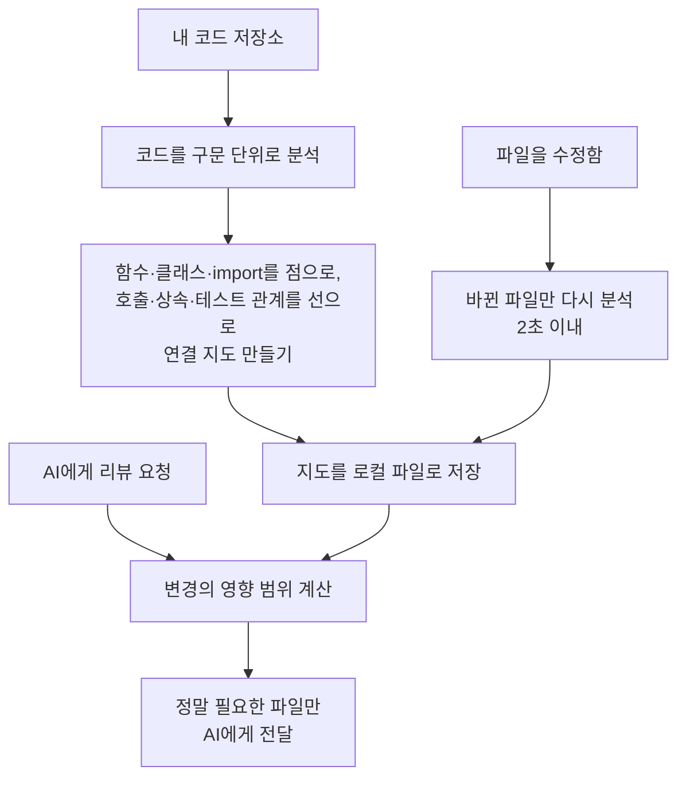

<aside class="ai-knowledge-sidebar">
  
CATEGORIES

  <nav class="ai-cat-tree">

에이전트 오케스트레이션9
<ul><li><a href="https://altjs4510.github.io/ai_news_blog/knowledge/20260717/">2026-07-17After a year building agent memory, 'save everyt…</a></li><li><a href="https://altjs4510.github.io/ai_news_blog/knowledge/20260709/">2026-07-09mvanhorn/last30days-skill — Reddit·X·YouTube·HN·…</a></li><li><a href="https://altjs4510.github.io/ai_news_blog/knowledge/20260701/">2026-07-01Google OKF (Open Knowledge Format) — 벤더 중립 에이전트 …</a></li><li><a href="https://altjs4510.github.io/ai_news_blog/knowledge/20260623/">2026-06-23bytedance/deer-flow — 샌드박스·메모리·서브에이전트·메시지 게이트웨이를…</a></li><li><a href="https://altjs4510.github.io/ai_news_blog/knowledge/20260621/">2026-06-21calesthio/OpenMontage — 12 파이프라인·52 도구·500+ 스킬을 …</a></li><li><a href="https://altjs4510.github.io/ai_news_blog/knowledge/20260611/">2026-06-11The evolution of agentic surfaces: building with…</a></li><li><a href="https://altjs4510.github.io/ai_news_blog/knowledge/20260602/">2026-06-02revfactory/harness — 도메인별 에이전트 팀과 스킬을 자동 설계하는 메타…</a></li><li><a href="https://altjs4510.github.io/ai_news_blog/knowledge/20260529/">2026-05-29Introducing dynamic workflows in Claude Code</a></li><li><a href="https://altjs4510.github.io/ai_news_blog/knowledge/20260507/">2026-05-07ruvnet/ruflo — Claude 멀티 에이전트 오케스트레이션 플랫폼</a></li></ul>

MCP &amp; 도구 통합19
<ul><li><a href="https://altjs4510.github.io/ai_news_blog/knowledge/20260721/" class="current">2026-07-21tirth8205/code-review-graph — 로컬 우선 코드 인텔리전스 그래프…</a></li><li><a href="https://altjs4510.github.io/ai_news_blog/knowledge/20260719/">2026-07-19tirth8205/code-review-graph — 로컬 우선 코드 인텔리전스 그래프…</a></li><li><a href="https://altjs4510.github.io/ai_news_blog/knowledge/20260718/">2026-07-18tirth8205/code-review-graph — MCP·CLI용 로컬 코드 인텔리…</a></li><li><a href="https://altjs4510.github.io/ai_news_blog/knowledge/20260708/">2026-07-08Expanding Managed Agents in Gemini API: backgrou…</a></li><li><a href="https://altjs4510.github.io/ai_news_blog/knowledge/20260618/">2026-06-18DeusData/codebase-memory-mcp — 158개 언어 코드베이스를 밀리…</a></li><li><a href="https://altjs4510.github.io/ai_news_blog/knowledge/20260609/">2026-06-09Building intelligent apps for Apple platforms wi…</a></li><li><a href="https://altjs4510.github.io/ai_news_blog/knowledge/20260606/">2026-06-06chopratejas/headroom — Compress tool outputs, lo…</a></li><li><a href="https://altjs4510.github.io/ai_news_blog/knowledge/20260605/">2026-06-05chopratejas/headroom — Compress tool outputs, lo…</a></li><li><a href="https://altjs4510.github.io/ai_news_blog/knowledge/20260604/">2026-06-04chopratejas/headroom — Compress tool outputs bef…</a></li><li><a href="https://altjs4510.github.io/ai_news_blog/knowledge/20260603/">2026-06-03How Bad MCP design cost your Agent 5× more token…</a></li><li><a href="https://altjs4510.github.io/ai_news_blog/knowledge/20260526/">2026-05-26colbymchenry/codegraph — Pre-indexed code knowle…</a></li><li><a href="https://altjs4510.github.io/ai_news_blog/knowledge/20260523/">2026-05-23colbymchenry/codegraph — 사전 인덱싱된 코드 지식 그래프 MCP</a></li><li><a href="https://altjs4510.github.io/ai_news_blog/knowledge/20260521/">2026-05-21colbymchenry/codegraph — Pre-indexed code knowle…</a></li><li><a href="https://altjs4510.github.io/ai_news_blog/knowledge/20260520/">2026-05-20New in Claude Managed Agents: self-hosted sandbo…</a></li><li><a href="https://altjs4510.github.io/ai_news_blog/knowledge/20260519/">2026-05-19Anthropic acquires Stainless</a></li><li><a href="https://altjs4510.github.io/ai_news_blog/knowledge/20260517/">2026-05-17I gave my LLM 100,000+ tools — Lazy Discovery &a…</a></li><li><a href="https://altjs4510.github.io/ai_news_blog/knowledge/20260512/">2026-05-12agentmemory — Persistent memory for AI coding ag…</a></li><li><a href="https://altjs4510.github.io/ai_news_blog/knowledge/20260509/">2026-05-09How to connect 100 MCP servers without the conte…</a></li><li><a href="https://altjs4510.github.io/ai_news_blog/knowledge/20260506/">2026-05-06mksglu/context-mode — AI 코딩 에이전트용 컨텍스트 윈도우 최적화</a></li></ul>

코딩 에이전트12
<ul><li><a href="https://altjs4510.github.io/ai_news_blog/knowledge/20260714/">2026-07-14Graphify-Labs/graphify — 코드베이스를 질의 가능한 지식 그래프로 만…</a></li><li><a href="https://altjs4510.github.io/ai_news_blog/knowledge/20260707/">2026-07-07AI Hero Skills Catalog — 실무 엔지니어를 위한 재사용 가능한 판단 …</a></li><li><a href="https://altjs4510.github.io/ai_news_blog/knowledge/20260705/">2026-07-05openai/codex-plugin-cc — Claude Code에서 Codex를 위임…</a></li><li><a href="https://altjs4510.github.io/ai_news_blog/knowledge/20260626/">2026-06-26google-labs-code/design.md — 코딩 에이전트에게 디자인 시스템을 …</a></li><li><a href="https://altjs4510.github.io/ai_news_blog/knowledge/20260619/">2026-06-19Claude Code now supports artifacts</a></li><li><a href="https://altjs4510.github.io/ai_news_blog/knowledge/20260530/">2026-05-30Leonxlnx/taste-skill — AI에게 좋은 취향을 부여해 generic s…</a></li><li><a href="https://altjs4510.github.io/ai_news_blog/knowledge/20260528/">2026-05-28Building self-improving tax agents with Codex</a></li><li><a href="https://altjs4510.github.io/ai_news_blog/knowledge/20260524/">2026-05-24colbymchenry/codegraph — Pre-indexed code knowle…</a></li><li><a href="https://altjs4510.github.io/ai_news_blog/knowledge/20260515/">2026-05-15Clawdmeter — Claude Code 사용량을 데스크톱 대시보드로</a></li><li><a href="https://altjs4510.github.io/ai_news_blog/knowledge/20260510/">2026-05-10addyosmani/agent-skills — Production-grade engin…</a></li><li><a href="https://altjs4510.github.io/ai_news_blog/knowledge/20260508/">2026-05-08addyosmani/agent-skills — Production-grade engin…</a></li><li><a href="https://altjs4510.github.io/ai_news_blog/knowledge/20260505/">2026-05-05mattpocock/skills — Skills for Real Engineers (.…</a></li></ul>

모델 &amp; 연구5
<ul><li><a href="https://altjs4510.github.io/ai_news_blog/knowledge/20260716-proprag/">2026-07-16PropRAG — 프로포지션 경로 위 beam search로 멀티홉 검색 안내</a></li><li><a href="https://altjs4510.github.io/ai_news_blog/knowledge/20260712/">2026-07-12Do Automated Evals Work?</a></li><li><a href="https://altjs4510.github.io/ai_news_blog/knowledge/20260620/">2026-06-20zai-org/GLM-5 — From Vibe Coding to Agentic Engi…</a></li><li><a href="https://altjs4510.github.io/ai_news_blog/knowledge/20260516/">2026-05-16STALE — 에이전트가 자기 기억의 유효성을 인지할 수 있는가</a></li><li><a href="https://altjs4510.github.io/ai_news_blog/knowledge/20260513/">2026-05-13Thinking Machines' Native Interaction Models — T…</a></li></ul>

인프라 &amp; 컴퓨트1
<ul><li><a href="https://altjs4510.github.io/ai_news_blog/knowledge/20260522/">2026-05-22Giving Agents Computers — Ivan Burazin, Daytona</a></li></ul>

보안 &amp; 거버넌스15
<ul><li><a href="https://altjs4510.github.io/ai_news_blog/knowledge/20260716/">2026-07-16Dicklesworthstone/destructive_command_guard — 에이…</a></li><li><a href="https://altjs4510.github.io/ai_news_blog/knowledge/20260715/">2026-07-15Dicklesworthstone/destructive_command_guard — 에이…</a></li><li><a href="https://altjs4510.github.io/ai_news_blog/knowledge/20260710/">2026-07-1070개 MCP 서버 strace 런타임 감사 — 부팅 시 아웃바운드 호출 서버 적발</a></li><li><a href="https://altjs4510.github.io/ai_news_blog/knowledge/20260704/">2026-07-04Cloudflare is about to block AI agents by defaul…</a></li><li><a href="https://altjs4510.github.io/ai_news_blog/knowledge/20260703/">2026-07-03Giving admins more visibility and control over C…</a></li><li><a href="https://altjs4510.github.io/ai_news_blog/knowledge/20260630/">2026-06-30Introducing the Claude apps gateway for Amazon B…</a></li><li><a href="https://altjs4510.github.io/ai_news_blog/knowledge/20260625/">2026-06-25Agent identity in Claude Tag: a new access model…</a></li><li><a href="https://altjs4510.github.io/ai_news_blog/knowledge/20260624/">2026-06-24Agent identity in Claude Tag: a new access model…</a></li><li><a href="https://altjs4510.github.io/ai_news_blog/knowledge/20260617/">2026-06-17Predicting model behavior before release by simu…</a></li><li><a href="https://altjs4510.github.io/ai_news_blog/knowledge/20260614/">2026-06-14NVIDIA/SkillSpector — Security scanner for AI ag…</a></li><li><a href="https://altjs4510.github.io/ai_news_blog/knowledge/20260613/">2026-06-13Fable 5's guardrails got bypassed in 48 hours — …</a></li><li><a href="https://altjs4510.github.io/ai_news_blog/knowledge/20260612/">2026-06-12NVIDIA/SkillSpector — AI 에이전트 스킬용 보안 스캐너</a></li><li><a href="https://altjs4510.github.io/ai_news_blog/knowledge/20260607/">2026-06-07OpenAI Help: Lockdown Mode</a></li><li><a href="https://altjs4510.github.io/ai_news_blog/knowledge/20260531/">2026-05-31How we contain Claude across products</a></li><li><a href="https://altjs4510.github.io/ai_news_blog/knowledge/20260527/">2026-05-27Microsoft Copilot Cowork Exfiltrates Files</a></li></ul>

응용 사례1
<ul><li><a href="https://altjs4510.github.io/ai_news_blog/knowledge/20260514/">2026-05-14Introducing Claude for Small Business</a></li></ul>

산업 동향5
<ul><li><a href="https://altjs4510.github.io/ai_news_blog/knowledge/20260711/">2026-07-11OpenAI says GPT 5.6 is the 'preferred model' for…</a></li><li><a href="https://altjs4510.github.io/ai_news_blog/knowledge/20260702/">2026-07-02How Cursor deploys AI inside the enterprise (For…</a></li><li><a href="https://altjs4510.github.io/ai_news_blog/knowledge/20260616/">2026-06-16Why AI hasn't replaced software engineers, and w…</a></li><li><a href="https://altjs4510.github.io/ai_news_blog/knowledge/20260610/">2026-06-10Fable 5 just made cost-aware model routing manda…</a></li><li><a href="https://altjs4510.github.io/ai_news_blog/knowledge/20260504/">2026-05-04Agents for Everything Else: Codex for Knowledge …</a></li></ul>
</nav>
</aside>

<article class="ai-knowledge-article">

<header class="ai-post-hero">
  
<a class="ai-back" href="../">KNOWLEDGE</a> · 2026-07-21 · 오늘의 학습

  <h2 class="ai-post-title">tirth8205/code-review-graph — 로컬 우선 코드 인텔리전스 그래프(MCP·CLI)</h2>
</header>

> 원문: [tirth8205/code-review-graph — 로컬 우선 코드 인텔리전스 그래프(MCP·CLI)](https://github.com/tirth8205/code-review-graph)

## 📌 학습 정리

### 1. 한 줄로 말하면

AI 코딩 도구가 프로젝트 전체를 매번 다 읽지 않고, 지금 고친 부분과 연결된 파일만 골라 읽도록 코드의 "연결 지도"를 미리 그려두는 도구예요.

### 2. 왜 이게 만들어졌어요?

AI 코딩 도구에게 "이 변경을 리뷰해줘"라고 부탁하면, 도구가 어디를 봐야 할지 몰라서 코드베이스의 상당 부분을 다시 읽어버리는 경우가 많아요. 그런데 AI는 읽는 글자(토큰)만큼 비용과 시간을 쓰기 때문에, 프로젝트가 클수록 이 낭비가 심해집니다. 특히 여러 프로젝트를 한 저장소에 모아둔 대형 저장소(모노레포, monorepo)에서는 수만 개의 파일이 딸려 들어와 낭비가 극심해져요. 이 도구는 코드의 구조를 미리 지도로 만들어 두고, 변경이 생겼을 때 "정말 영향을 받는 파일"만 추려서 AI에게 건네줌으로써 이 낭비를 줄이려고 만들어졌어요.

### 3. 비유로 풀면

이건 마치 도시의 지하철 노선도 같은 거예요. 한 역(파일)에서 공사가 생기면, 노선도를 보고 "이 역과 연결된 노선과 환승역이 영향을 받겠구나"를 바로 짚어낼 수 있잖아요. 굳이 도시의 모든 건물을 하나하나 돌아볼 필요가 없죠.

또 하나는 책의 색인(찾아보기) 같은 거예요. 특정 주제를 찾을 때 책을 처음부터 끝까지 다시 읽지 않고, 색인을 보고 관련 페이지만 펼치는 것과 비슷해요. 그래서 결국, 이 도구는 코드의 구조와 연결 관계를 미리 정리해 두고 필요한 부분만 콕 집어주는 역할을 합니다.

### 4. 어떻게 작동하는지 (그림으로)

먼저 저장소 전체를 훑어서 코드의 구성 요소와 그들 사이의 관계를 지도로 만들고, 이걸 내 컴퓨터 안의 파일로 저장해 둡니다. 파일을 수정하면 바뀐 부분만 다시 분석해서 지도를 최신 상태로 유지하고요. 나중에 AI가 리뷰할 때는 이 지도를 보고 변경의 파급 범위를 계산해서, 관련 있는 파일만 골라 AI에게 넘겨줍니다.

### 5. 처음 보는 용어 풀이

- **구문 분석 도구 (Tree-sitter)** — 소스 코드를 사람이 읽는 문장이 아니라, 컴퓨터가 이해하는 구조(어떤 게 함수이고 어떤 게 호출인지)로 쪼개주는 도구예요. 이 구조가 있어야 코드의 연결 관계를 정확히 그릴 수 있어요.

- **연결 지도 / 그래프 (graph)** — 함수·클래스 같은 코드 조각을 점으로, 그들 사이의 관계(호출·상속·테스트)를 선으로 표현한 지도예요. 이 지도를 따라가면 "무엇이 무엇과 연결됐는지"를 알 수 있어요.

- **파급 범위 분석 (blast-radius analysis)** — 한 파일을 고쳤을 때, 그 변경의 영향을 받을 수 있는 호출자·의존 파일·테스트를 지도를 따라 추적하는 기능이에요. AI가 전체 대신 이 범위만 읽게 해줘요.

- **토큰 (token)** — AI가 글을 읽고 쓸 때 세는 최소 단위예요. AI는 토큰 수만큼 비용과 시간을 쓰기 때문에, 읽는 토큰을 줄이는 게 곧 비용 절감으로 이어져요.

- **모델 컨텍스트 프로토콜 (MCP, Model Context Protocol)** — AI 코딩 도구가 외부 도구와 정해진 방식으로 대화하도록 만든 규약이에요. 이 도구는 MCP 서버로 동작해서, AI가 알아서 지도를 조회하며 필요한 정보를 가져가요.

- **점진적 업데이트 (incremental update)** — 코드를 수정할 때마다 전체를 다시 분석하는 게 아니라, 바뀐 파일과 그에 연결된 부분만 다시 계산하는 방식이에요. 그래서 2,900개 파일짜리 프로젝트도 2초 안에 갱신돼요.

- **커뮤니티 탐지 (community detection, Leiden 알고리즘)** — 서로 밀접하게 얽힌 코드끼리 자동으로 묶어서 "이 부분들이 한 덩어리구나"를 찾아내는 방법이에요. 코드의 전체 구조를 파악하는 데 도움이 돼요.

### 6. 한 발 더 들어가고 싶다면

- [code-review-graph 저장소](https://github.com/tirth8205/code-review-graph) — 도구의 전체 소개와 설치·사용법을 한곳에서 볼 수 있어요.
- `docs/REPRODUCING.md` — 원문에서 여러 번 언급하는 문서로, 벤치마크 숫자(토큰 절감량 등)를 어떻게 측정하고 똑같이 재현하는지 알 수 있어요.
- `docs/CUSTOM_LANGUAGES.md` — 아직 지원하지 않는 언어를 직접 추가하는 방법과 설정 형식을 알 수 있어요.
- `docs/FAQ.md` — 언어 서버(LSP), 검색 기반 방식(RAG), grep 같은 다른 접근과 어떻게 다른지, 언제 쓰지 말아야 하는지를 솔직하게 정리해 둔 문서예요.
- `docs/GITHUB_ACTION.md` — 코드 변경 요청(PR)마다 자동으로 위험도 리뷰를 달아주는 기능의 설정법을 알 수 있어요.

---

## 📖 원문 전체 번역 (정독용)

> 의역 최소화한 전체 번역입니다. 큰 흐름은 위 정리에서 잡고, 정확한 워딩이 필요할 땐 이 섹션에서 정독하세요.

_(번역 생성에 실패했습니다. 원문 URL을 직접 참고하세요.)_

</article>

<!-- ai-related-links -->
<aside class="ai-related-links">
  
관련 학습

  <ul><li><a href="https://altjs4510.github.io/ai_news_blog/knowledge/20260718/">2026-07-18tirth8205/code-review-graph — MCP·CLI용 로컬 코드 인텔리…</a></li><li><a href="https://altjs4510.github.io/ai_news_blog/knowledge/20260523/">2026-05-23colbymchenry/codegraph — 사전 인덱싱된 코드 지식 그래프 MCP</a></li><li><a href="https://altjs4510.github.io/ai_news_blog/knowledge/20260618/">2026-06-18DeusData/codebase-memory-mcp — 158개 언어 코드베이스를 밀리…</a></li></ul>
</aside>
<!-- /ai-related-links -->
