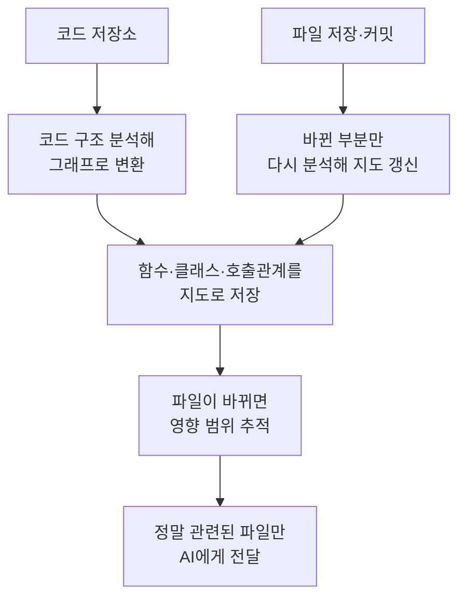

<aside class="ai-knowledge-sidebar">
  
CATEGORIES

  <nav class="ai-cat-tree">

에이전트 오케스트레이션12
<ul><li><a href="https://altjs4510.github.io/ai_news_blog/knowledge/20260717/">2026-07-17After a year building agent memory, 'save everyt…</a></li><li><a href="https://altjs4510.github.io/ai_news_blog/knowledge/20260708/">2026-07-08Expanding Managed Agents in Gemini API: backgrou…</a></li><li><a href="https://altjs4510.github.io/ai_news_blog/knowledge/20260707/">2026-07-07AI Hero Skills Catalog — 실무 엔지니어를 위한 재사용 가능한 판단 …</a></li><li><a href="https://altjs4510.github.io/ai_news_blog/knowledge/20260705/">2026-07-05openai/codex-plugin-cc — Claude Code에서 Codex를 위임…</a></li><li><a href="https://altjs4510.github.io/ai_news_blog/knowledge/20260623/">2026-06-23bytedance/deer-flow — 샌드박스·메모리·서브에이전트·메시지 게이트웨이를…</a></li><li><a href="https://altjs4510.github.io/ai_news_blog/knowledge/20260621/">2026-06-21calesthio/OpenMontage — 12 파이프라인·52 도구·500+ 스킬을 …</a></li><li><a href="https://altjs4510.github.io/ai_news_blog/knowledge/20260611/">2026-06-11The evolution of agentic surfaces: building with…</a></li><li><a href="https://altjs4510.github.io/ai_news_blog/knowledge/20260602/">2026-06-02revfactory/harness — 도메인별 에이전트 팀과 스킬을 자동 설계하는 메타…</a></li><li><a href="https://altjs4510.github.io/ai_news_blog/knowledge/20260529/">2026-05-29Introducing dynamic workflows in Claude Code</a></li><li><a href="https://altjs4510.github.io/ai_news_blog/knowledge/20260520/">2026-05-20New in Claude Managed Agents: self-hosted sandbo…</a></li><li><a href="https://altjs4510.github.io/ai_news_blog/knowledge/20260507/">2026-05-07ruvnet/ruflo — Claude 멀티 에이전트 오케스트레이션 플랫폼</a></li><li><a href="https://altjs4510.github.io/ai_news_blog/knowledge/20260504/">2026-05-04Agents for Everything Else: Codex for Knowledge …</a></li></ul>

MCP &amp; 도구 통합12
<ul><li><a href="https://altjs4510.github.io/ai_news_blog/knowledge/20260719/">2026-07-19tirth8205/code-review-graph — 로컬 우선 코드 인텔리전스 그래프…</a></li><li><a href="https://altjs4510.github.io/ai_news_blog/knowledge/20260718/">2026-07-18tirth8205/code-review-graph — MCP·CLI용 로컬 코드 인텔리…</a></li><li><a href="https://altjs4510.github.io/ai_news_blog/knowledge/20260618/">2026-06-18DeusData/codebase-memory-mcp — 158개 언어 코드베이스를 밀리…</a></li><li><a href="https://altjs4510.github.io/ai_news_blog/knowledge/20260605/">2026-06-05chopratejas/headroom — Compress tool outputs, lo…</a></li><li><a href="https://altjs4510.github.io/ai_news_blog/knowledge/20260604/">2026-06-04chopratejas/headroom — Compress tool outputs bef…</a></li><li><a href="https://altjs4510.github.io/ai_news_blog/knowledge/20260603/">2026-06-03How Bad MCP design cost your Agent 5× more token…</a></li><li><a href="https://altjs4510.github.io/ai_news_blog/knowledge/20260526/">2026-05-26colbymchenry/codegraph — Pre-indexed code knowle…</a></li><li><a href="https://altjs4510.github.io/ai_news_blog/knowledge/20260523/">2026-05-23colbymchenry/codegraph — 사전 인덱싱된 코드 지식 그래프 MCP</a></li><li><a href="https://altjs4510.github.io/ai_news_blog/knowledge/20260521/">2026-05-21colbymchenry/codegraph — Pre-indexed code knowle…</a></li><li><a href="https://altjs4510.github.io/ai_news_blog/knowledge/20260519/">2026-05-19Anthropic acquires Stainless</a></li><li><a href="https://altjs4510.github.io/ai_news_blog/knowledge/20260517/">2026-05-17I gave my LLM 100,000+ tools — Lazy Discovery &a…</a></li><li><a href="https://altjs4510.github.io/ai_news_blog/knowledge/20260509/">2026-05-09How to connect 100 MCP servers without the conte…</a></li></ul>

코딩 에이전트12
<ul><li><a href="https://altjs4510.github.io/ai_news_blog/knowledge/20260721/" class="current">2026-07-21tirth8205/code-review-graph — 로컬 우선 코드 인텔리전스 그래프…</a></li><li><a href="https://altjs4510.github.io/ai_news_blog/knowledge/20260714/">2026-07-14Graphify-Labs/graphify — 코드베이스를 질의 가능한 지식 그래프로 만…</a></li><li><a href="https://altjs4510.github.io/ai_news_blog/knowledge/20260626/">2026-06-26google-labs-code/design.md — 코딩 에이전트에게 디자인 시스템을 …</a></li><li><a href="https://altjs4510.github.io/ai_news_blog/knowledge/20260619/">2026-06-19Claude Code now supports artifacts</a></li><li><a href="https://altjs4510.github.io/ai_news_blog/knowledge/20260530/">2026-05-30Leonxlnx/taste-skill — AI에게 좋은 취향을 부여해 generic s…</a></li><li><a href="https://altjs4510.github.io/ai_news_blog/knowledge/20260528/">2026-05-28Building self-improving tax agents with Codex</a></li><li><a href="https://altjs4510.github.io/ai_news_blog/knowledge/20260524/">2026-05-24colbymchenry/codegraph — Pre-indexed code knowle…</a></li><li><a href="https://altjs4510.github.io/ai_news_blog/knowledge/20260512/">2026-05-12agentmemory — Persistent memory for AI coding ag…</a></li><li><a href="https://altjs4510.github.io/ai_news_blog/knowledge/20260510/">2026-05-10addyosmani/agent-skills — Production-grade engin…</a></li><li><a href="https://altjs4510.github.io/ai_news_blog/knowledge/20260508/">2026-05-08addyosmani/agent-skills — Production-grade engin…</a></li><li><a href="https://altjs4510.github.io/ai_news_blog/knowledge/20260506/">2026-05-06mksglu/context-mode — AI 코딩 에이전트용 컨텍스트 윈도우 최적화</a></li><li><a href="https://altjs4510.github.io/ai_news_blog/knowledge/20260505/">2026-05-05mattpocock/skills — Skills for Real Engineers (.…</a></li></ul>

모델 &amp; 연구6
<ul><li><a href="https://altjs4510.github.io/ai_news_blog/knowledge/20260716-proprag/">2026-07-16PropRAG — 프로포지션 경로 위 beam search로 멀티홉 검색 안내</a></li><li><a href="https://altjs4510.github.io/ai_news_blog/knowledge/20260712/">2026-07-12Do Automated Evals Work?</a></li><li><a href="https://altjs4510.github.io/ai_news_blog/knowledge/20260620/">2026-06-20zai-org/GLM-5 — From Vibe Coding to Agentic Engi…</a></li><li><a href="https://altjs4510.github.io/ai_news_blog/knowledge/20260617/">2026-06-17Predicting model behavior before release by simu…</a></li><li><a href="https://altjs4510.github.io/ai_news_blog/knowledge/20260516/">2026-05-16STALE — 에이전트가 자기 기억의 유효성을 인지할 수 있는가</a></li><li><a href="https://altjs4510.github.io/ai_news_blog/knowledge/20260513/">2026-05-13Thinking Machines' Native Interaction Models — T…</a></li></ul>

인프라 &amp; 컴퓨트4
<ul><li><a href="https://altjs4510.github.io/ai_news_blog/knowledge/20260630/">2026-06-30Introducing the Claude apps gateway for Amazon B…</a></li><li><a href="https://altjs4510.github.io/ai_news_blog/knowledge/20260610/">2026-06-10Fable 5 just made cost-aware model routing manda…</a></li><li><a href="https://altjs4510.github.io/ai_news_blog/knowledge/20260606/">2026-06-06chopratejas/headroom — Compress tool outputs, lo…</a></li><li><a href="https://altjs4510.github.io/ai_news_blog/knowledge/20260522/">2026-05-22Giving Agents Computers — Ivan Burazin, Daytona</a></li></ul>

보안 &amp; 거버넌스13
<ul><li><a href="https://altjs4510.github.io/ai_news_blog/knowledge/20260716/">2026-07-16Dicklesworthstone/destructive_command_guard — 에이…</a></li><li><a href="https://altjs4510.github.io/ai_news_blog/knowledge/20260715/">2026-07-15Dicklesworthstone/destructive_command_guard — 에이…</a></li><li><a href="https://altjs4510.github.io/ai_news_blog/knowledge/20260710/">2026-07-1070개 MCP 서버 strace 런타임 감사 — 부팅 시 아웃바운드 호출 서버 적발</a></li><li><a href="https://altjs4510.github.io/ai_news_blog/knowledge/20260704/">2026-07-04Cloudflare is about to block AI agents by defaul…</a></li><li><a href="https://altjs4510.github.io/ai_news_blog/knowledge/20260703/">2026-07-03Giving admins more visibility and control over C…</a></li><li><a href="https://altjs4510.github.io/ai_news_blog/knowledge/20260625/">2026-06-25Agent identity in Claude Tag: a new access model…</a></li><li><a href="https://altjs4510.github.io/ai_news_blog/knowledge/20260624/">2026-06-24Agent identity in Claude Tag: a new access model…</a></li><li><a href="https://altjs4510.github.io/ai_news_blog/knowledge/20260614/">2026-06-14NVIDIA/SkillSpector — Security scanner for AI ag…</a></li><li><a href="https://altjs4510.github.io/ai_news_blog/knowledge/20260613/">2026-06-13Fable 5's guardrails got bypassed in 48 hours — …</a></li><li><a href="https://altjs4510.github.io/ai_news_blog/knowledge/20260612/">2026-06-12NVIDIA/SkillSpector — AI 에이전트 스킬용 보안 스캐너</a></li><li><a href="https://altjs4510.github.io/ai_news_blog/knowledge/20260607/">2026-06-07OpenAI Help: Lockdown Mode</a></li><li><a href="https://altjs4510.github.io/ai_news_blog/knowledge/20260531/">2026-05-31How we contain Claude across products</a></li><li><a href="https://altjs4510.github.io/ai_news_blog/knowledge/20260527/">2026-05-27Microsoft Copilot Cowork Exfiltrates Files</a></li></ul>

응용 사례4
<ul><li><a href="https://altjs4510.github.io/ai_news_blog/knowledge/20260709/">2026-07-09mvanhorn/last30days-skill — Reddit·X·YouTube·HN·…</a></li><li><a href="https://altjs4510.github.io/ai_news_blog/knowledge/20260609/">2026-06-09Building intelligent apps for Apple platforms wi…</a></li><li><a href="https://altjs4510.github.io/ai_news_blog/knowledge/20260515/">2026-05-15Clawdmeter — Claude Code 사용량을 데스크톱 대시보드로</a></li><li><a href="https://altjs4510.github.io/ai_news_blog/knowledge/20260514/">2026-05-14Introducing Claude for Small Business</a></li></ul>

산업 동향4
<ul><li><a href="https://altjs4510.github.io/ai_news_blog/knowledge/20260711/">2026-07-11OpenAI says GPT 5.6 is the 'preferred model' for…</a></li><li><a href="https://altjs4510.github.io/ai_news_blog/knowledge/20260702/">2026-07-02How Cursor deploys AI inside the enterprise (For…</a></li><li><a href="https://altjs4510.github.io/ai_news_blog/knowledge/20260701/">2026-07-01Google OKF (Open Knowledge Format) — 벤더 중립 에이전트 …</a></li><li><a href="https://altjs4510.github.io/ai_news_blog/knowledge/20260616/">2026-06-16Why AI hasn't replaced software engineers, and w…</a></li></ul>
</nav>
</aside>

<article class="ai-knowledge-article">

<header class="ai-post-hero">
  
<a class="ai-back" href="../">KNOWLEDGE</a> · 2026-07-21 · 오늘의 학습

  <h2 class="ai-post-title">tirth8205/code-review-graph — 로컬 우선 코드 인텔리전스 그래프(MCP·CLI)</h2>
</header>

> 원문: [tirth8205/code-review-graph — 로컬 우선 코드 인텔리전스 그래프(MCP·CLI)](https://github.com/tirth8205/code-review-graph)

## 📌 학습 정리

### 1. 한 줄로 말하면

코드 전체를 매번 다 읽지 않아도 되게, 코드가 서로 어떻게 연결됐는지 미리 지도로 그려두고 "이번에 바뀐 부분과 관련된 곳만" 콕 집어주는 도구예요.

### 2. 왜 이게 만들어졌어요?

요즘 AI 코딩 도구는 코드를 리뷰하거나 수정할 때 프로젝트의 상당 부분을 반복해서 읽곤 합니다. 파일이 수천 개인 큰 프로젝트에서는 이게 곧 비용이자 낭비인데, AI가 처리할 수 있는 글자 수(토큰)에는 한계가 있고 매번 다 읽으면 느리고 돈도 많이 들기 때문이에요. 원래는 "관련 있어 보이는 파일을 사람이나 AI가 찾아서 읽는" 식이었는데, 뭐가 관련 있는지 정확히 알기 어려워 결국 넓게 훑게 됩니다. code-review-graph는 코드의 구조를 미리 그래프로 정리해두고, 변경이 생겼을 때 그 영향이 어디까지 미치는지 추적해서 정말 읽어야 할 파일만 골라주자는 발상에서 출발했어요.

### 3. 비유로 풀면

이건 마치 큰 건물의 배관·전기 도면을 미리 그려두는 것과 비슷해요. 어느 방의 수도꼭지 하나를 고칠 때, 도면이 있으면 "이 파이프가 어디까지 연결됐는지"를 따라가 관련된 곳만 점검하면 되죠. 도면 없이 매번 건물 전체를 뒤지는 것과는 완전히 다릅니다.

또 하나, 이건 도서관의 색인 카드 같기도 해요. 책 내용을 다 읽지 않아도 "이 주제는 몇 번 서가"라고 바로 안내받는 거죠. 그래서 결국, 코드의 연결 관계를 미리 정리해두면 AI가 매번 전부 읽는 대신 필요한 몇 개 파일만 읽고도 판단할 수 있게 됩니다.

### 4. 어떻게 작동하는지 (그림으로)

먼저 코드를 읽어 함수, 클래스, 서로 부르는 관계 등을 그래프 형태의 지도로 만들어 로컬(내 컴퓨터)에 저장합니다. 이후 파일이 바뀌면 그 변화가 어디까지 번지는지(영향 범위) 추적해서 관련된 파일만 AI에게 건네줍니다. 파일을 저장하거나 커밋할 때마다 전체를 다시 읽지 않고 바뀐 부분만 갱신하기 때문에, 2,900개 파일짜리 프로젝트도 2초 안에 갱신된다고 해요.

### 5. 처음 보는 용어 풀이

- **코드 구조 분석기 (Tree-sitter)** — 프로그램 소스 코드를 읽어서 "여기는 함수, 저기는 클래스, 이건 다른 코드를 호출하는 부분" 하는 식으로 구조를 알아내는 도구예요. code-review-graph가 코드 지도를 그릴 때 이 분석기를 씁니다.

- **지식 그래프 / 코드 그래프 (graph)** — 코드의 요소들(함수·클래스·불러오기)을 점으로, 그 사이의 관계(호출·상속·테스트 연결)를 선으로 표현한 지도예요. 이걸 미리 만들어두면 "무엇이 무엇과 연결됐는지" 빠르게 되짚을 수 있습니다.

- **영향 범위 분석 (blast-radius analysis)** — 파일 하나가 바뀌었을 때, 그걸 부르는 곳·의존하는 곳·관련 테스트까지 따라가 "이 변경으로 흔들릴 수 있는 곳"을 찾아내는 기능이에요. AI가 전체 대신 이 범위만 읽으면 되게 해줍니다.

- **모델 연결 규약 (MCP, Model Context Protocol)** — AI 코딩 도구가 외부 기능이나 정보에 접근하도록 연결해주는 표준 통로예요. code-review-graph는 이 통로를 통해 AI에게 "필요한 코드 맥락"만 정확히 전달합니다.

- **토큰 (token)** — AI가 글자를 처리하는 최소 단위예요. 코드를 많이 읽을수록 토큰을 많이 쓰고, 그만큼 느리고 비용도 커집니다. 이 도구의 핵심 자랑거리가 바로 이 토큰 소모를 크게 줄이는 것이에요.

- **증분 업데이트 (incremental updates)** — 코드가 바뀔 때 전체를 다시 분석하지 않고, 바뀐 파일과 그 관련 부분만 다시 처리하는 방식이에요. 덕분에 갱신이 아주 빠릅니다.

- **의미 기반 검색 (semantic search)** — 정확한 단어가 아니라 "인증은 어떻게 동작하나요?" 같은 의미로도 관련 코드를 찾아주는 기능이에요. 선택 사항이며 검색 품질을 보조하는 용도로 쓰입니다.

### 6. 한 발 더 들어가고 싶다면

- [code-review-graph GitHub 저장소](https://github.com/tirth8205/code-review-graph) — 도구의 설치법, 명령어, 지원 언어 전체를 직접 확인할 수 있어요.
- 벤치마크 재현 문서(docs/REPRODUCING.md) — 원문에서 인용한 "토큰 82배 절감" 같은 수치가 어떻게 측정됐는지, 같은 결과를 어떻게 재현하는지 알 수 있어요.
- 사용자 정의 언어 문서(docs/CUSTOM_LANGUAGES.md) — 기본 지원되지 않는 언어를 직접 추가하는 방법(설정 파일 규칙과 예시)을 볼 수 있어요.
- 비교 문서(docs/FAQ.md) — 언어 서버(LSP), 검색 기반 방식(RAG), grep 같은 다른 접근과 무엇이 어떻게 다른지, 언제 쓰지 않는 게 나은지 솔직하게 정리돼 있어요.

---

## 📖 원문 전체 번역 (정독용)

> 의역 최소화한 전체 번역입니다. 큰 흐름은 위 정리에서 잡고, 정확한 워딩이 필요할 땐 이 섹션에서 정독하세요.

_(번역 생성에 실패했습니다. 원문 URL을 직접 참고하세요.)_

</article>

