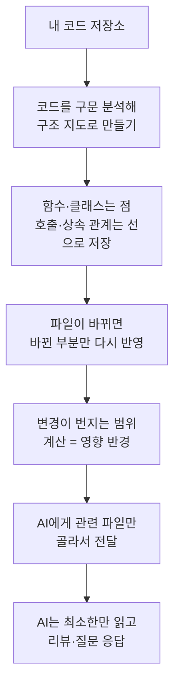

<div class="ai-knowledge-shell">

<aside class="ai-knowledge-sidebar">
  <p class="ai-eyebrow">CATEGORIES</p>
  <nav class="ai-cat-tree"><details class="ai-cat" open><summary><span class="catname">에이전트 오케스트레이션</span><span class="catcount">12</span></summary><ul><li><a href="https://altjs4510.github.io/ai_news_blog/knowledge/20260826/"><span class="kdate">2026-08-26</span><span class="ktitle">apache/maka — 도구 호출·권한 결정·종료 이벤트를 append-only 로그…</span></a></li><li><a href="https://altjs4510.github.io/ai_news_blog/knowledge/20260823/"><span class="kdate">2026-08-23</span><span class="ktitle">The Evolution of the Agent Harness — 하네스가 모델 가중치…</span></a></li><li><a href="https://altjs4510.github.io/ai_news_blog/knowledge/20260805/"><span class="kdate">2026-08-05</span><span class="ktitle">TencentCloud/TencentDB-Agent-Memory — 대화·문서·코드를 …</span></a></li><li><a href="https://altjs4510.github.io/ai_news_blog/knowledge/20260709/"><span class="kdate">2026-07-09</span><span class="ktitle">mvanhorn/last30days-skill — Reddit·X·YouTube·HN·…</span></a></li><li><a href="https://altjs4510.github.io/ai_news_blog/knowledge/20260708/"><span class="kdate">2026-07-08</span><span class="ktitle">Expanding Managed Agents in Gemini API: backgrou…</span></a></li><li><a href="https://altjs4510.github.io/ai_news_blog/knowledge/20260707/"><span class="kdate">2026-07-07</span><span class="ktitle">AI Hero Skills Catalog — 실무 엔지니어를 위한 재사용 가능한 판단 …</span></a></li><li><a href="https://altjs4510.github.io/ai_news_blog/knowledge/20260623/"><span class="kdate">2026-06-23</span><span class="ktitle">bytedance/deer-flow — 샌드박스·메모리·서브에이전트·메시지 게이트웨이를…</span></a></li><li><a href="https://altjs4510.github.io/ai_news_blog/knowledge/20260621/"><span class="kdate">2026-06-21</span><span class="ktitle">calesthio/OpenMontage — 12 파이프라인·52 도구·500+ 스킬을 …</span></a></li><li><a href="https://altjs4510.github.io/ai_news_blog/knowledge/20260611/"><span class="kdate">2026-06-11</span><span class="ktitle">The evolution of agentic surfaces: building with…</span></a></li><li><a href="https://altjs4510.github.io/ai_news_blog/knowledge/20260602/"><span class="kdate">2026-06-02</span><span class="ktitle">revfactory/harness — 도메인별 에이전트 팀과 스킬을 자동 설계하는 메타…</span></a></li><li><a href="https://altjs4510.github.io/ai_news_blog/knowledge/20260529/"><span class="kdate">2026-05-29</span><span class="ktitle">Introducing dynamic workflows in Claude Code</span></a></li><li><a href="https://altjs4510.github.io/ai_news_blog/knowledge/20260507/"><span class="kdate">2026-05-07</span><span class="ktitle">ruvnet/ruflo — Claude 멀티 에이전트 오케스트레이션 플랫폼</span></a></li></ul></details><details class="ai-cat" open><summary><span class="catname">MCP &amp; 도구 통합</span><span class="catcount">16</span></summary><ul><li><a href="https://altjs4510.github.io/ai_news_blog/knowledge/20260821/"><span class="kdate">2026-08-21</span><span class="ktitle">volcengine/OpenViking — 에이전트 메모리·Knowledge RAG·스…</span></a></li><li><a href="https://altjs4510.github.io/ai_news_blog/knowledge/20260802/"><span class="kdate">2026-08-02</span><span class="ktitle">Stateless MCP has recaptured my interest (and in…</span></a></li><li><a href="https://altjs4510.github.io/ai_news_blog/knowledge/20260801/"><span class="kdate">2026-08-01</span><span class="ktitle">different-ai/openwork — Claude Cowork의 오픈소스 대체 에…</span></a></li><li><a href="https://altjs4510.github.io/ai_news_blog/knowledge/20260731/"><span class="kdate">2026-07-31</span><span class="ktitle">different-ai/openwork — Claude Cowork의 오픈소스 대안(o…</span></a></li><li><a href="https://altjs4510.github.io/ai_news_blog/knowledge/20260729/"><span class="kdate">2026-07-29</span><span class="ktitle">Bringing MCP 2026-07-28 to Claude</span></a></li><li><a href="https://altjs4510.github.io/ai_news_blog/knowledge/20260719/"><span class="kdate">2026-07-19</span><span class="ktitle">tirth8205/code-review-graph — 로컬 우선 코드 인텔리전스 그래프…</span></a></li><li><a href="https://altjs4510.github.io/ai_news_blog/knowledge/20260718/"><span class="kdate">2026-07-18</span><span class="ktitle">tirth8205/code-review-graph — MCP·CLI용 로컬 코드 인텔리…</span></a></li><li><a href="https://altjs4510.github.io/ai_news_blog/knowledge/20260618/"><span class="kdate">2026-06-18</span><span class="ktitle">DeusData/codebase-memory-mcp — 158개 언어 코드베이스를 밀리…</span></a></li><li><a href="https://altjs4510.github.io/ai_news_blog/knowledge/20260606/"><span class="kdate">2026-06-06</span><span class="ktitle">chopratejas/headroom — Compress tool outputs, lo…</span></a></li><li><a href="https://altjs4510.github.io/ai_news_blog/knowledge/20260605/"><span class="kdate">2026-06-05</span><span class="ktitle">chopratejas/headroom — Compress tool outputs, lo…</span></a></li><li><a href="https://altjs4510.github.io/ai_news_blog/knowledge/20260604/"><span class="kdate">2026-06-04</span><span class="ktitle">chopratejas/headroom — Compress tool outputs bef…</span></a></li><li><a href="https://altjs4510.github.io/ai_news_blog/knowledge/20260603/"><span class="kdate">2026-06-03</span><span class="ktitle">How Bad MCP design cost your Agent 5× more token…</span></a></li><li><a href="https://altjs4510.github.io/ai_news_blog/knowledge/20260523/"><span class="kdate">2026-05-23</span><span class="ktitle">colbymchenry/codegraph — 사전 인덱싱된 코드 지식 그래프 MCP</span></a></li><li><a href="https://altjs4510.github.io/ai_news_blog/knowledge/20260519/"><span class="kdate">2026-05-19</span><span class="ktitle">Anthropic acquires Stainless</span></a></li><li><a href="https://altjs4510.github.io/ai_news_blog/knowledge/20260517/"><span class="kdate">2026-05-17</span><span class="ktitle">I gave my LLM 100,000+ tools — Lazy Discovery &a…</span></a></li><li><a href="https://altjs4510.github.io/ai_news_blog/knowledge/20260509/"><span class="kdate">2026-05-09</span><span class="ktitle">How to connect 100 MCP servers without the conte…</span></a></li></ul></details><details class="ai-cat" open><summary><span class="catname">코딩 에이전트</span><span class="catcount">26</span></summary><ul><li><a href="https://altjs4510.github.io/ai_news_blog/knowledge/20260822/"><span class="kdate">2026-08-22</span><span class="ktitle">mattpocock/skills — Skills for Real Engineers (하…</span></a></li><li><a href="https://altjs4510.github.io/ai_news_blog/knowledge/20260820/"><span class="kdate">2026-08-20</span><span class="ktitle">akitaonrails/ai-memory — 코딩 에이전트 CLI의 장기 메모리와 벤더…</span></a></li><li><a href="https://altjs4510.github.io/ai_news_blog/knowledge/20260819/"><span class="kdate">2026-08-19</span><span class="ktitle">akitaonrails/ai-memory — 코딩 에이전트 CLI 간 장기 기억과 벤더…</span></a></li><li><a href="https://altjs4510.github.io/ai_news_blog/knowledge/20260811/"><span class="kdate">2026-08-11</span><span class="ktitle">PrimeIntellect-ai/prime-agent — 장기 자율 실행을 전제로 설계…</span></a></li><li><a href="https://altjs4510.github.io/ai_news_blog/knowledge/20260810/"><span class="kdate">2026-08-10</span><span class="ktitle">Auto mode is now the default in Claude Code for …</span></a></li><li><a href="https://altjs4510.github.io/ai_news_blog/knowledge/20260809/"><span class="kdate">2026-08-09</span><span class="ktitle">PrimeIntellect-ai/prime-agent — 코딩 워크플로우·장기 자율 작…</span></a></li><li><a href="https://altjs4510.github.io/ai_news_blog/knowledge/20260808/"><span class="kdate">2026-08-08</span><span class="ktitle">PrimeIntellect-ai/prime-agent — 코딩 워크플로우와 장시간 자율…</span></a></li><li><a href="https://altjs4510.github.io/ai_news_blog/knowledge/20260804/"><span class="kdate">2026-08-04</span><span class="ktitle">esengine/DeepSeek-Reasonix — prefix-cache 안정성을 축…</span></a></li><li><a href="https://altjs4510.github.io/ai_news_blog/knowledge/20260728/"><span class="kdate">2026-07-28</span><span class="ktitle">alibaba/open-code-review — 결정론적 파이프라인 + LLM 에이전트…</span></a></li><li><a href="https://altjs4510.github.io/ai_news_blog/knowledge/20260722/" class="current"><span class="kdate">2026-07-22</span><span class="ktitle">tirth8205/code-review-graph — MCP·CLI용 로컬 우선 코드 …</span></a></li><li><a href="https://altjs4510.github.io/ai_news_blog/knowledge/20260721/"><span class="kdate">2026-07-21</span><span class="ktitle">tirth8205/code-review-graph — 로컬 우선 코드 인텔리전스 그래프…</span></a></li><li><a href="https://altjs4510.github.io/ai_news_blog/knowledge/20260715/"><span class="kdate">2026-07-15</span><span class="ktitle">Dicklesworthstone/destructive_command_guard — 에이…</span></a></li><li><a href="https://altjs4510.github.io/ai_news_blog/knowledge/20260714/"><span class="kdate">2026-07-14</span><span class="ktitle">Graphify-Labs/graphify — 코드베이스를 질의 가능한 지식 그래프로 만…</span></a></li><li><a href="https://altjs4510.github.io/ai_news_blog/knowledge/20260705/"><span class="kdate">2026-07-05</span><span class="ktitle">openai/codex-plugin-cc — Claude Code에서 Codex를 위임…</span></a></li><li><a href="https://altjs4510.github.io/ai_news_blog/knowledge/20260626/"><span class="kdate">2026-06-26</span><span class="ktitle">google-labs-code/design.md — 코딩 에이전트에게 디자인 시스템을 …</span></a></li><li><a href="https://altjs4510.github.io/ai_news_blog/knowledge/20260619/"><span class="kdate">2026-06-19</span><span class="ktitle">Claude Code now supports artifacts</span></a></li><li><a href="https://altjs4510.github.io/ai_news_blog/knowledge/20260530/"><span class="kdate">2026-05-30</span><span class="ktitle">Leonxlnx/taste-skill — AI에게 좋은 취향을 부여해 generic s…</span></a></li><li><a href="https://altjs4510.github.io/ai_news_blog/knowledge/20260528/"><span class="kdate">2026-05-28</span><span class="ktitle">Building self-improving tax agents with Codex</span></a></li><li><a href="https://altjs4510.github.io/ai_news_blog/knowledge/20260526/"><span class="kdate">2026-05-26</span><span class="ktitle">colbymchenry/codegraph — Pre-indexed code knowle…</span></a></li><li><a href="https://altjs4510.github.io/ai_news_blog/knowledge/20260524/"><span class="kdate">2026-05-24</span><span class="ktitle">colbymchenry/codegraph — Pre-indexed code knowle…</span></a></li><li><a href="https://altjs4510.github.io/ai_news_blog/knowledge/20260521/"><span class="kdate">2026-05-21</span><span class="ktitle">colbymchenry/codegraph — Pre-indexed code knowle…</span></a></li><li><a href="https://altjs4510.github.io/ai_news_blog/knowledge/20260512/"><span class="kdate">2026-05-12</span><span class="ktitle">agentmemory — Persistent memory for AI coding ag…</span></a></li><li><a href="https://altjs4510.github.io/ai_news_blog/knowledge/20260510/"><span class="kdate">2026-05-10</span><span class="ktitle">addyosmani/agent-skills — Production-grade engin…</span></a></li><li><a href="https://altjs4510.github.io/ai_news_blog/knowledge/20260508/"><span class="kdate">2026-05-08</span><span class="ktitle">addyosmani/agent-skills — Production-grade engin…</span></a></li><li><a href="https://altjs4510.github.io/ai_news_blog/knowledge/20260506/"><span class="kdate">2026-05-06</span><span class="ktitle">mksglu/context-mode — AI 코딩 에이전트용 컨텍스트 윈도우 최적화</span></a></li><li><a href="https://altjs4510.github.io/ai_news_blog/knowledge/20260505/"><span class="kdate">2026-05-05</span><span class="ktitle">mattpocock/skills — Skills for Real Engineers (.…</span></a></li></ul></details><details class="ai-cat" open><summary><span class="catname">모델 &amp; 연구</span><span class="catcount">6</span></summary><ul><li><a href="https://altjs4510.github.io/ai_news_blog/knowledge/20260725/"><span class="kdate">2026-07-25</span><span class="ktitle">The new rules of context engineering for Claude …</span></a></li><li><a href="https://altjs4510.github.io/ai_news_blog/knowledge/20260716-proprag/"><span class="kdate">2026-07-16</span><span class="ktitle">PropRAG — 프로포지션 경로 위 beam search로 멀티홉 검색 안내</span></a></li><li><a href="https://altjs4510.github.io/ai_news_blog/knowledge/20260620/"><span class="kdate">2026-06-20</span><span class="ktitle">zai-org/GLM-5 — From Vibe Coding to Agentic Engi…</span></a></li><li><a href="https://altjs4510.github.io/ai_news_blog/knowledge/20260617/"><span class="kdate">2026-06-17</span><span class="ktitle">Predicting model behavior before release by simu…</span></a></li><li><a href="https://altjs4510.github.io/ai_news_blog/knowledge/20260516/"><span class="kdate">2026-05-16</span><span class="ktitle">STALE — 에이전트가 자기 기억의 유효성을 인지할 수 있는가</span></a></li><li><a href="https://altjs4510.github.io/ai_news_blog/knowledge/20260513/"><span class="kdate">2026-05-13</span><span class="ktitle">Thinking Machines' Native Interaction Models — T…</span></a></li></ul></details><details class="ai-cat" open><summary><span class="catname">인프라 &amp; 컴퓨트</span><span class="catcount">8</span></summary><ul><li><a href="https://altjs4510.github.io/ai_news_blog/knowledge/20260813/"><span class="kdate">2026-08-13</span><span class="ktitle">semantica-agi/semantica — 컨텍스트와 책임 추적을 위한 그래프 네이…</span></a></li><li><a href="https://altjs4510.github.io/ai_news_blog/knowledge/20260812/"><span class="kdate">2026-08-12</span><span class="ktitle">semantica-agi/semantica — 컨텍스트와 '책임 추적 가능한(accou…</span></a></li><li><a href="https://altjs4510.github.io/ai_news_blog/knowledge/20260806/"><span class="kdate">2026-08-06</span><span class="ktitle">cloudflare/computer — 에이전트에게 컴퓨터를 통째로 주는 엣지 실행 샌…</span></a></li><li><a href="https://altjs4510.github.io/ai_news_blog/knowledge/20260724/"><span class="kdate">2026-07-24</span><span class="ktitle">diegosouzapw/OmniRoute — 단일 엔드포인트로 278+ 프로바이더·50…</span></a></li><li><a href="https://altjs4510.github.io/ai_news_blog/knowledge/20260723/"><span class="kdate">2026-07-23</span><span class="ktitle">diegosouzapw/OmniRoute — 268+ 프로바이더를 단일 엔드포인트로 묶…</span></a></li><li><a href="https://altjs4510.github.io/ai_news_blog/knowledge/20260630/"><span class="kdate">2026-06-30</span><span class="ktitle">Introducing the Claude apps gateway for Amazon B…</span></a></li><li><a href="https://altjs4510.github.io/ai_news_blog/knowledge/20260522/"><span class="kdate">2026-05-22</span><span class="ktitle">Giving Agents Computers — Ivan Burazin, Daytona</span></a></li><li><a href="https://altjs4510.github.io/ai_news_blog/knowledge/20260520/"><span class="kdate">2026-05-20</span><span class="ktitle">New in Claude Managed Agents: self-hosted sandbo…</span></a></li></ul></details><details class="ai-cat" open><summary><span class="catname">보안 &amp; 거버넌스</span><span class="catcount">14</span></summary><ul><li><a href="https://altjs4510.github.io/ai_news_blog/knowledge/20260819-mind-viruses/"><span class="kdate">2026-08-19</span><span class="ktitle">탈옥도, 인젝션도 없이 — 대화로만 퍼지는 에이전트의 '마인드 바이러스'</span></a></li><li><a href="https://altjs4510.github.io/ai_news_blog/knowledge/20260730/"><span class="kdate">2026-07-30</span><span class="ktitle">Anatomy of a Frontier Lab Agent Intrusion: A Tec…</span></a></li><li><a href="https://altjs4510.github.io/ai_news_blog/knowledge/20260716/"><span class="kdate">2026-07-16</span><span class="ktitle">Dicklesworthstone/destructive_command_guard — 에이…</span></a></li><li><a href="https://altjs4510.github.io/ai_news_blog/knowledge/20260710/"><span class="kdate">2026-07-10</span><span class="ktitle">70개 MCP 서버 strace 런타임 감사 — 부팅 시 아웃바운드 호출 서버 적발</span></a></li><li><a href="https://altjs4510.github.io/ai_news_blog/knowledge/20260704/"><span class="kdate">2026-07-04</span><span class="ktitle">Cloudflare is about to block AI agents by defaul…</span></a></li><li><a href="https://altjs4510.github.io/ai_news_blog/knowledge/20260703/"><span class="kdate">2026-07-03</span><span class="ktitle">Giving admins more visibility and control over C…</span></a></li><li><a href="https://altjs4510.github.io/ai_news_blog/knowledge/20260625/"><span class="kdate">2026-06-25</span><span class="ktitle">Agent identity in Claude Tag: a new access model…</span></a></li><li><a href="https://altjs4510.github.io/ai_news_blog/knowledge/20260624/"><span class="kdate">2026-06-24</span><span class="ktitle">Agent identity in Claude Tag: a new access model…</span></a></li><li><a href="https://altjs4510.github.io/ai_news_blog/knowledge/20260614/"><span class="kdate">2026-06-14</span><span class="ktitle">NVIDIA/SkillSpector — Security scanner for AI ag…</span></a></li><li><a href="https://altjs4510.github.io/ai_news_blog/knowledge/20260613/"><span class="kdate">2026-06-13</span><span class="ktitle">Fable 5's guardrails got bypassed in 48 hours — …</span></a></li><li><a href="https://altjs4510.github.io/ai_news_blog/knowledge/20260612/"><span class="kdate">2026-06-12</span><span class="ktitle">NVIDIA/SkillSpector — AI 에이전트 스킬용 보안 스캐너</span></a></li><li><a href="https://altjs4510.github.io/ai_news_blog/knowledge/20260607/"><span class="kdate">2026-06-07</span><span class="ktitle">OpenAI Help: Lockdown Mode</span></a></li><li><a href="https://altjs4510.github.io/ai_news_blog/knowledge/20260531/"><span class="kdate">2026-05-31</span><span class="ktitle">How we contain Claude across products</span></a></li><li><a href="https://altjs4510.github.io/ai_news_blog/knowledge/20260527/"><span class="kdate">2026-05-27</span><span class="ktitle">Microsoft Copilot Cowork Exfiltrates Files</span></a></li></ul></details><details class="ai-cat" open><summary><span class="catname">응용 사례</span><span class="catcount">6</span></summary><ul><li><a href="https://altjs4510.github.io/ai_news_blog/knowledge/20260814/"><span class="kdate">2026-08-14</span><span class="ktitle">cathrynlavery/diagram-design — Claude Code용 에디토리…</span></a></li><li><a href="https://altjs4510.github.io/ai_news_blog/knowledge/20260726/"><span class="kdate">2026-07-26</span><span class="ktitle">citrolabs/ego-lite — 로그인된 브라우저 상태를 AI 에이전트와 공유하는…</span></a></li><li><a href="https://altjs4510.github.io/ai_news_blog/knowledge/20260717/"><span class="kdate">2026-07-17</span><span class="ktitle">After a year building agent memory, 'save everyt…</span></a></li><li><a href="https://altjs4510.github.io/ai_news_blog/knowledge/20260712/"><span class="kdate">2026-07-12</span><span class="ktitle">Do Automated Evals Work?</span></a></li><li><a href="https://altjs4510.github.io/ai_news_blog/knowledge/20260609/"><span class="kdate">2026-06-09</span><span class="ktitle">Building intelligent apps for Apple platforms wi…</span></a></li><li><a href="https://altjs4510.github.io/ai_news_blog/knowledge/20260514/"><span class="kdate">2026-05-14</span><span class="ktitle">Introducing Claude for Small Business</span></a></li></ul></details><details class="ai-cat" open><summary><span class="catname">산업 동향</span><span class="catcount">7</span></summary><ul><li><a href="https://altjs4510.github.io/ai_news_blog/knowledge/20260711/"><span class="kdate">2026-07-11</span><span class="ktitle">OpenAI says GPT 5.6 is the 'preferred model' for…</span></a></li><li><a href="https://altjs4510.github.io/ai_news_blog/knowledge/20260702/"><span class="kdate">2026-07-02</span><span class="ktitle">How Cursor deploys AI inside the enterprise (For…</span></a></li><li><a href="https://altjs4510.github.io/ai_news_blog/knowledge/20260701/"><span class="kdate">2026-07-01</span><span class="ktitle">Google OKF (Open Knowledge Format) — 벤더 중립 에이전트 …</span></a></li><li><a href="https://altjs4510.github.io/ai_news_blog/knowledge/20260616/"><span class="kdate">2026-06-16</span><span class="ktitle">Why AI hasn't replaced software engineers, and w…</span></a></li><li><a href="https://altjs4510.github.io/ai_news_blog/knowledge/20260610/"><span class="kdate">2026-06-10</span><span class="ktitle">Fable 5 just made cost-aware model routing manda…</span></a></li><li><a href="https://altjs4510.github.io/ai_news_blog/knowledge/20260515/"><span class="kdate">2026-05-15</span><span class="ktitle">Clawdmeter — Claude Code 사용량을 데스크톱 대시보드로</span></a></li><li><a href="https://altjs4510.github.io/ai_news_blog/knowledge/20260504/"><span class="kdate">2026-05-04</span><span class="ktitle">Agents for Everything Else: Codex for Knowledge …</span></a></li></ul></details></nav>
</aside>

<article class="ai-knowledge-article">

<header class="ai-post-hero">
  <p class="ai-eyebrow"><a class="ai-back" href="../">KNOWLEDGE</a> · 2026-07-22 · 오늘의 학습</p>
  <h2 class="ai-post-title">tirth8205/code-review-graph — MCP·CLI용 로컬 우선 코드 인텔리전스 그래프</h2>
</header>

> 원문: [tirth8205/code-review-graph — MCP·CLI용 로컬 우선 코드 인텔리전스 그래프](https://github.com/tirth8205/code-review-graph)

## 📌 학습 정리

### 1. 한 줄로 말하면

코드 전체를 매번 다시 읽지 않고, "이번 변경과 관련 있는 부분만" 골라서 AI 코딩 도구에게 건네주는 코드 지도 만들기 도구예요. 덕분에 AI가 읽어야 할 양이 확 줄어듭니다.

### 2. 왜 이게 만들어졌어요?

AI 코딩 도구에게 "이 코드 좀 리뷰해줘"라고 하면, 도구가 뭐가 관련 있는지 잘 몰라서 저장소의 상당 부분을 다시 훑어 읽는 일이 생깁니다. 파일이 수만 개인 대형 저장소에서는 이게 특히 낭비가 커요. AI가 한 번에 처리할 수 있는 글자 수(토큰, token)에는 한계가 있고 그만큼 비용도 들기 때문이죠. code-review-graph는 코드의 구조를 미리 지도로 그려두고, 변경이 생겼을 때 "실제로 영향받는 곳"만 계산해서 알려줍니다. 그래서 AI가 전체를 스캔하는 대신 꼭 필요한 몇 개 파일만 읽으면 되도록 만든 겁니다.

### 3. 비유로 풀면

이건 마치 큰 건물의 배관 도면 같은 거예요. 화장실 수도꼭지 하나를 고칠 때, 도면이 없으면 건물 전체 배관을 다 뜯어봐야 하지만, 도면이 있으면 "이 꼭지는 3층 이 라인에 연결돼 있고, 여기만 잠그면 된다"를 바로 알 수 있죠. 그래서 결국 code-review-graph는 코드의 '연결 도면'을 미리 그려두고, 어디를 건드리면 어디까지 영향이 번지는지 짚어주는 역할을 합니다.

또 다른 비유로는 도서관 사서 같은 면도 있어요. 질문을 던지면 서가 전체를 다 읽으라고 하는 대신, "그 주제는 이 세 권만 보면 돼요"라고 딱 집어주는 거죠. 그래서 결국 AI는 관련 없는 수천 개 파일을 건너뛰고 핵심만 읽게 됩니다.

### 4. 어떻게 작동하는지 (그림으로)



흐름을 풀어보면, 먼저 저장소를 읽어서 함수·클래스 같은 요소를 '점', 서로 부르고 물려받는 관계를 '선'으로 하는 지도를 만듭니다. 파일이 바뀌면 전체를 다시 그리지 않고 바뀐 부분만 몇 초 안에 갱신해요(변경 감지에는 파일 내용을 지문처럼 요약한 해시를 씁니다). 마지막으로 리뷰나 질문이 들어오면 그 지도를 뒤져서 "지금 꼭 봐야 할 파일"만 추려 AI에게 넘깁니다.

### 5. 처음 보는 용어 풀이

- **토큰 (token)** — AI가 글을 잘게 나눠 세는 단위예요. AI가 한 번에 다룰 수 있는 토큰 양에 한계가 있고 비용도 여기에 비례해서, 읽는 양을 줄이는 게 곧 절약입니다.
- **구문 트리 / Tree-sitter** — 코드를 문법 구조로 잘게 뜯어 나무 형태로 표현한 것(AST, 추상 구문 트리)이고, Tree-sitter는 그걸 여러 프로그래밍 언어에 대해 만들어주는 도구예요. 이 도구가 코드에서 함수·호출 관계 같은 걸 뽑아냅니다.
- **영향 반경 / 블래스트 반경 (blast radius)** — 파일 하나를 고쳤을 때 그 여파가 닿는 범위예요. 그 함수를 부르는 곳, 의존하는 곳, 관련 테스트까지 따라가서 "여기까지 영향받는다"를 보여줍니다.
- **지식 그래프 (knowledge graph)** — 정보를 점(개체)과 선(관계)으로 엮어 그물처럼 저장한 것이에요. 여기서는 코드의 함수·클래스와 그 연결을 그래프로 담아, 여러 단계를 건너뛰며 "이걸 부르는 걸 또 부르는 곳"까지 추적할 수 있게 합니다.
- **엠시피 (MCP, Model Context Protocol)** — AI 도구가 외부 도구·데이터와 정해진 방식으로 주고받게 해주는 연결 규격이에요. 이 도구는 MCP를 통해 AI 비서에게 "이 파일만 읽어"라고 정확한 자료를 건넵니다.
- **증분 업데이트 (incremental update)** — 전체를 처음부터 다시 만들지 않고 바뀐 부분만 반영하는 방식이에요. 덕분에 2,900개 파일 저장소도 몇 초 안에 갱신됩니다.
- **로컬 우선 (local-first)** — 코드를 외부 서버로 보내지 않고 내 컴퓨터(또는 CI 실행기) 안에서 처리한다는 뜻이에요. 원문에 따르면 별도의 외부 데이터베이스나 클라우드 없이 SQLite 파일 하나로 저장되고, 텔레메트리(사용 정보 전송)도 없다고 합니다.

### 6. 한 발 더 들어가고 싶다면

- [code-review-graph 저장소](https://github.com/tirth8205/code-review-graph) — 설치법, 지원 언어, 전체 명령어를 직접 확인할 수 있어요.
- `docs/REPRODUCING.md` — 원문이 제시한 토큰 절감 벤치마크(중앙값 약 82배 감소)를 어떻게 측정했고 어떻게 재현하는지 방법론을 볼 수 있어요.
- `docs/GITHUB_ACTION.md` — 풀 리퀘스트가 올라올 때 자동으로 위험도 매긴 리뷰 코멘트를 다는 CI 연동 방법과 설정 값을 알 수 있어요.
- `docs/CUSTOM_LANGUAGES.md` — 기본 지원에 없는 언어를 직접 추가하는 규칙과 예제를 볼 수 있어요.
- `docs/FAQ.md` — 언어 서버(LSP)·검색 기반 방식(RAG)·grep 같은 다른 접근과 무엇이 다른지, 그리고 언제 안 쓰는 게 나은지를 솔직하게 정리해 뒀어요.

---

## 📖 원문 전체 번역 (정독용)

> 의역 최소화한 전체 번역입니다. 큰 흐름은 위 정리에서 잡고, 정확한 워딩이 필요할 땐 이 섹션에서 정독하세요.

### 원문 전체 전체 번역 (정독용)

# code-review-graph
토큰 낭비를 멈추세요. 더 스마트하게 리뷰하세요.

English | 简体中文 | 日本語 | 한국어 | हिन्दी

사용법 · 명령어 · FAQ · 트러블슈팅 · GitHub Action · 벤치마크 재현하기 · 로드맵

AI 코딩 도구는 리뷰 작업 시 코드베이스의 상당 부분을 다시 읽어들이는 결과를 낳을 수 있습니다. **code-review-graph**는 이를 해결합니다. Tree-sitter로 코드의 구조적 맵을 구축하고, 변경 사항을 점진적으로 추적하며, MCP를 통해 AI 어시스턴트에게 정밀한 컨텍스트를 제공해 정말 필요한 부분만 읽도록 합니다.

## 빠른 시작

```
pip install code-review-graph
# or: pipx install code-review-graph
code-review-graph install   # 지원되는 모든 플랫폼을 자동 감지·설정
code-review-graph build     # 코드베이스 파싱
```

명령어 하나로 모든 설정이 끝납니다. `install`은 어떤 AI 코딩 도구가 설치돼 있는지 감지하고, 각각에 맞는 올바른 MCP 설정을 작성하며, 지원되는 곳에는 플랫폼 네이티브 훅/스킬을 설치하고, 플랫폼 규칙에 그래프 인지형(graph-aware) 지침을 주입합니다. `uvx`로 설치했는지 `pip`/`pipx`로 설치했는지를 자동 감지해 올바른 설정을 생성합니다. 설치 후 에디터/도구를 재시작하세요.

특정 플랫폼만 대상으로 지정하려면:

```
code-review-graph install --platform codex          # Codex만 설정
code-review-graph install --platform cursor         # Cursor만 설정
code-review-graph install --platform claude-code    # Claude Code만 설정
code-review-graph install --platform gemini-cli      # Gemini CLI만 설정
code-review-graph install --platform kiro            # Kiro만 설정
code-review-graph install --platform copilot          # GitHub Copilot (VS Code)만 설정
code-review-graph install --platform copilot-cli     # GitHub Copilot CLI만 설정
code-review-graph install --platform codebuddy       # CodeBuddy Code만 설정
```

Python 3.10 이상이 필요합니다. 최상의 경험을 위해 `uv`를 설치하세요(MCP 설정은 가능하면 `uvx`를 사용하고, 없으면 `code-review-graph` 명령을 직접 사용하는 방식으로 대체됩니다).

CRG를 Git 또는 SVN 프로젝트에서 제거하려면, 해당 워킹 트리 내부 어디서든 대칭적인 uninstall 명령을 사용하세요. 대상 경로는 워킹 트리 루트로 정규화되며, 저장소가 아닌 디렉토리는 거부됩니다. 이 명령은 CRG가 소유한 파일과 항목만 제거합니다. 관련 없는 MCP 서버, 훅, 스킬, JSONC 주석은 그대로 유지됩니다. 공유 설정 변경은 원자적 교체(atomic replacement)를 사용하므로 쓰기가 실패해도 원본 파일은 그대로 남습니다.

```
code-review-graph uninstall --dry-run     # 모든 동작을 미리 보기. 아무것도 쓰지 않음
code-review-graph uninstall               # 미리 보기 후 확인 요청, 이후 적용
code-review-graph uninstall --yes         # 확인 없이 적용
code-review-graph uninstall --all-repos   # 등록된 모든 저장소도 함께 정리
code-review-graph uninstall --keep-data   # 통합은 제거하되 그래프 데이터베이스는 유지
code-review-graph uninstall --keep-user-configs --repo .   # 이 프로젝트만 정리
```

그런 다음 프로젝트를 열고 AI 어시스턴트에게 다음과 같이 요청하세요:

> 이 프로젝트에 대한 code review graph를 빌드해줘

초기 빌드는 500파일 규모 프로젝트 기준 약 10초가 걸립니다. 이후에는 watch 모드와 지원되는 훅이 그래프를 자동으로 최신 상태로 유지해줄 수 있습니다.

## 동작 원리

저장소는 Tree-sitter를 통해 AST로 파싱되어 노드(함수, 클래스, import)와 엣지(호출, 상속, 테스트 커버리지)의 그래프로 저장된 뒤, 리뷰 시점에 질의되어 AI 어시스턴트가 읽어야 할 최소한의 파일 집합을 계산합니다.

### 블래스트 레이디어스(blast-radius) 분석
파일이 변경되면 그래프는 그 변경으로 영향을 받을 수 있는 모든 호출자, 의존자, 테스트를 추적합니다. 이것이 변경의 "블래스트 레이디어스(파급 범위)"입니다. AI는 프로젝트 전체를 훑는 대신 이 파일들만 읽습니다.

### 2초 이내의 증분 업데이트
훅이나 watch 모드가 활성화된 경우, 파일 저장 및 지원되는 커밋 훅이 증분 업데이트를 트리거합니다. 그래프는 변경된 파일을 diff하고, SHA-256 해시 검사를 통해 의존 파일을 찾아 변경된 부분만 다시 파싱합니다. 2,900개 파일 규모의 프로젝트도 2초 이내에 재인덱싱됩니다.

### 모노레포 문제, 해결됨
대형 모노레포는 토큰 낭비가 가장 심각한 곳입니다. 그래프는 이 낭비를 걷어냅니다 — 27,700개 이상의 파일이 리뷰 컨텍스트에서 제외되고, 실제로는 ~15개 파일만 읽힙니다.

### 광범위한 언어 지원 + Jupyter 노트북
파서 지원은 함수, 클래스, import, 호출 지점, 상속, 테스트 감지를 현재 파서가 지원하는 범위 내에서 다루며, 가능한 곳에서는 Tree-sitter를 사용하고 필요한 곳에서는 맞춤형 폴백을 사용합니다. 현재 지원 목록: Python, JavaScript/TypeScript/TSX, Go, Rust, Java, C/C++, C#, VB.NET, Ruby, Kotlin, Swift, PHP, Scala, Solidity, Dart, R, Perl, Lua/Luau, Objective-C, 셸 스크립트, Elixir, Zig, PowerShell, Julia, ReScript, GDScript, Nix, Verilog/SystemVerilog, SQL, Terraform/OpenTofu 구조(`.tf`; 일반 `.hcl` 파일은 파일 노드로만 인식), Ansible 플레이북/롤/태스크, Vue/Svelte SFC, TypeScript 파서를 통해 파싱되는 Astro 파일, Jupyter/Databricks 노트북(`.ipynb`), Perl XS 파일(`.xs`). 일반 YAML은 소스 코드로 취급되지 않습니다.

PHP 프로젝트는 추가로 저장소 범위 내(repository-bounded) Composer PSR-4 해석, Blade 템플릿 참조, 그리고 소스에 명시적인 프레임워크 import·모델 상속·수신자(receiver) 증거가 포함된 경우 Laravel Route/Eloquent 시맨틱 엣지도 얻습니다.

### 자신만의 언어 추가하기 (포크 불필요)
저장소가 아직 파서가 지원하지 않는 언어를 사용한다면, `.code-review-graph/`에 `languages.toml`을 두어 파일 확장자를 `tree_sitter_language_pack`에 포함된 어떤 그래머 번들에든 매핑하고, 함수·클래스·import·호출에 대한 tree-sitter 노드 타입을 지정하면 됩니다:

```
[languages.erlang]
extensions = [".erl"]
grammar = "erlang"
function_node_types = ["function_clause"]
class_node_types = ["record_decl"]
import_node_types = ["import_attribute"]
call_node_types = ["call"]
```

이후로는 범용 tree-sitter 워커가 추출을 처리합니다 — 코드 변경이 필요 없으며, 내장 언어는 절대 덮어쓸 수 없습니다. 스키마 참조, 검증 규칙, 처음부터 끝까지의 예시는 `docs/CUSTOM_LANGUAGES.md`를 참고하세요.

### CI에서의 위험도 점수화 PR 리뷰 (GitHub Action)
동일한 분석이 컴포지트 GitHub Action으로도 실행됩니다 — 이 경우에도 로컬 우선 원칙은 유지됩니다: 지식 그래프는 전적으로 여러분의 CI 러너 안에서 빌드되고 질의되며, 어떤 외부 서비스로도 소스 코드가 전송되지 않습니다. 각 풀 리퀘스트마다 이 액션은 위험도 점수가 매겨진 함수, 영향을 받는 실행 흐름, 테스트 갭을 담은 하나의 스티키 코멘트를 게시하며, 매 푸시마다 그 코멘트를 갱신합니다. 선택적인 `fail-on-risk` 입력을 사용하면 리뷰를 머지 게이트로 전환할 수 있습니다.

```yaml
# .github/workflows/code-review-graph.yml
on:
  pull_request:

permissions:
  contents: read
  pull-requests: write

jobs:
  review:
    runs-on: ubuntu-latest
    steps:
      - uses: actions/checkout@v7
      - uses: tirth8205/code-review-graph@v2.3.6
        with:
          github-token: ${{ secrets.GITHUB_TOKEN }}
```

입력 값, 위험도 레벨, 캐싱 세부 사항은 `docs/GITHUB_ACTION.md`를 참고하거나, 이 저장소가 자기 자신에게 적용하는 도그푸드 워크플로우인 `.github/workflows/pr-review.yml`을 참고하세요.

## 벤치마크

헤드라인 수치: 6개 저장소에서 질문당 토큰 절감의 중앙값은 약 **82배**(전체 코퍼스 기준선 대비 그래프 질의)입니다. 자주 인용되는 **528배는 최댓값**입니다 — 단일 최상 케이스(fastapi)일 뿐, 일반적인 결과가 아닙니다.

모든 수치는 6개의 실제 오픈소스 저장소(총 13개 커밋)를 대상으로 한 자동화된 평가 러너에서 나온 것입니다. 각 설정은 업스트림 SHA를 고정하고, Leiden 커뮤니티 검출기는 고정된 시드로 실행되며, 임베딩은 CPU에서 결정론적입니다 — 따라서 다른 머신에서 두 번 실행해도 동일한 수치가 나옵니다. 예상 출력까지 포함한 전체 재현 방법은 `docs/REPRODUCING.md`에 있습니다. 가장 작은 두 설정에 대한 주간 리포트 전용 실행은 `.github/workflows/eval.yml`에 있습니다.

### 토큰 효율성: 질문당 중앙값 ~82배 절감 (범위 38배 – 528배; 전체 코퍼스 대비 그래프 질의)

일반적인 에이전트 질문("authentication은 어떻게 동작하나", "메인 엔트리 포인트는 무엇인가" 등)에 대해, 그래프는 에이전트가 모든 소스 파일을 읽도록 강제하는 대신 ~2,000–3,500 토큰 분량의 타겟 검색 결과 + 인접 엣지를 반환합니다. 아래 표는 `code_review_graph/token_benchmark.py`에 정의된 5개 샘플 질문에 대한 평균입니다.

| 저장소 | 스냅샷 SHA | naive_corpus_tokens | avg graph_tokens | 절감 비율 |
|---|---|---|---|---|
| fastapi | 0227991a | 951,071 | 2,169 | 528.4x |
| code-review-graph | 84bde354 | 208,821 | 2,495 | 93.0x |
| gin | 5c00df8a | 166,868 | 1,990 | 91.8x |
| flask | a29f88ce | 125,022 | 1,986 | 71.4x |
| express | b4ab7d65 | 135,955 | 3,465 | 40.6x |
| httpx | b55d4635 | 89,492 | 2,438 | 38.0x |

6개 저장소에서 질문당 절감 비율의 중앙값: **~82배**. 범위는 38배 – 528배이며, **528배가 최상의 케이스**(fastapi, 가장 큰 코퍼스)이지 헤드라인 수치가 아닙니다.

위의 전체 코퍼스 기준선은 실제 어떤 에이전트도 지불하지 않는 상한값입니다: 유능한 에이전트는 식별자를 grep하고 가장 잘 매칭되는 파일만 읽습니다. `agent_baseline` 평가 벤치마크는 그 현실적인 기준선을 측정합니다 — 코퍼스 전체에 대한 순수 파이썬 grep, 매치 개수 기준 상위 3개 파일, 토큰 카운트를 그래프 질의 비용과 비교(`evaluate/results/<repo>_agent_baseline_*.csv`).

공식 `eval/benchmarks/token_efficiency.py` 벤치마크는 다른 시나리오를 측정합니다 — 전체 `get_review_context()` JSON 대비 커밋의 변경된 파일 내용만 — 그리고 소규모 커밋에서는 1 미만의 비율을 보고합니다. 이는 리뷰 컨텍스트 응답이 임팩트 레이디어스 엣지와 소스 스니펫을 함께 담고 있어 아주 작은 단일 파일 diff보다 커지기 때문입니다. 이는 버그가 아니며, 두 벤치마크는 서로 다른 질문에 답하는 것입니다. 전체 방법론은 `docs/REPRODUCING.md`를 참고하세요.

v2.3.4부터, 리뷰 및 임팩트 도구는 MCP 클라이언트가 호출당 절감된 대략적인 컨텍스트를 볼 수 있도록 작은 `context_savings` 추정치를 첨부합니다. v2.3.5에서는 CLI가 이를 위에서 보여준 박스형 **Token Savings** 패널로 표면화하며(사용법 섹션의 "Token Savings panel" 참고), OpenAI의 `cl100k_base` 토크나이저와 대조 검증하는 `--verify`를 추가합니다. `docs/REPRODUCING.md`의 캘리브레이션 데이터는 222개 샘플 파일 전체 집계 기준으로 이 추정치가 실제 GPT-4 토큰과 ~1% 이내로 일치함을 보여줍니다.

### 임팩트 정확도: 그래프 유래 그라운드 트루스 대비 평균 F1 0.71 (재현율 1.0은 순환적 상한값이며 "재현율 100%"가 아님)

블래스트 레이디어스 분석은 13개 평가 커밋 전체에서 그라운드 트루스의 모든 파일을 복원합니다 — **하지만 이것은 상한값으로 읽어야 하며 "재현율 100%"로 읽어서는 안 됩니다**: 이 모드에서 그라운드 트루스(변경된 파일 + 그 파일로 들어오는 호출/import 엣지를 가진 파일들)는 예측기가 순회하는 것과 동일한 그래프에서 유도되므로, 구조적으로 순환적입니다. precision 컬럼에서 보이는 과다 예측(over-prediction)은 의도적인 트레이드오프입니다: 파일을 놓쳐서 의존성이 깨지는 것보다는 너무 많이 표시하는 것이 낫다는 것입니다.

| 저장소 | 커밋 수 | 평균 F1 | 평균 정밀도 | 재현율(그래프 유래 상한값) |
|---|---|---|---|---|
| httpx | 2 | 0.864 | 0.786 | 1.0 |
| fastapi | 2 | 0.834 | 0.750 | 1.0 |
| code-review-graph | 2 | 0.734 | 0.584 | 1.0 |
| express | 2 | 0.667 | 0.500 | 1.0 |
| flask | 2 | 0.628 | 0.481 | 1.0 |
| gin | 3 | 0.609 | 0.439 | 1.0 |
| 평균 | 13 | 0.714 | 0.578 | 1.000 |

이 벤치마크는 또한 정직한 **co-change 모드**도 실행합니다: 예측기는 변경된 파일 하나를 시드로 받고, 저자가 같은 커밋에서 실제로 수정한 *다른* 파일들을 기준으로 평가됩니다 — 이는 그래프가 아니라 git 히스토리에서 나온 독립적인(에 가까운) 증거입니다. 두 모드 모두 결과 CSV(`ground_truth_mode` 컬럼)에 나란히 표시됩니다. co-change 수치는 평가 러너가 이를 캡처한 뒤 정본 통계에 추가될 것입니다. 측정하기 전에는 인용하지 않습니다.

### 빌드 성능

| 저장소 | 파일 수 | 노드 수 | 엣지 수 | 흐름 감지 | 검색 지연시간 |
|---|---|---|---|---|---|
| express | 141 | 1,910 | 17,553 | 106ms | 0.7ms |
| fastapi | 1,122 | 6,285 | 27,117 | 128ms | 1.5ms |
| flask | 83 | 1,446 | 7,974 | 95ms | 0.7ms |
| gin | 99 | 1,286 | 16,762 | 111ms | 0.5ms |
| httpx | 60 | 1,253 | 7,896 | 96ms | 0.4ms |

## 한계와 알려진 약점

- **임팩트 "재현율 1.0"은 그래프 유래이며 순환적입니다**: 히스토리컬 그라운드 트루스가 예측기가 순회하는 것과 같은 그래프 엣지에서 나오므로, 구조적으로 상한값입니다. 정직한 co-change 모드(같은 커밋에서 실제로 함께 변경된 파일 기준으로 평가)가 함께 측정되며, 이 수치는 상당히 낮을 것으로 예상됩니다.
- **소규모 단일 파일 변경**: 사소한 수정에서는 그래프 컨텍스트가 순수한 파일 읽기보다 커질 수 있습니다(위 express 결과 참조). 이 오버헤드는 멀티파일 분석을 가능하게 하는 구조적 메타데이터에서 발생합니다.
- **검색 품질(MRR 0.35)**: 키워드 검색은 대부분의 질의에서 상위 4위 안에 정답을 찾아내지만, 랭킹은 개선이 필요합니다. Express 질의는 모듈 패턴 네이밍 때문에 0건의 매치를 반환합니다.
- **흐름 감지(재현율 33%)**: 프레임워크 및 관례적 엔트리 패턴은 Python과 PHP/Laravel에서 가장 강력합니다. JavaScript와 Go의 흐름 감지는 개선이 필요합니다.
- **정밀도 대 재현율 트레이드오프**: 임팩트 분석은 의도적으로 보수적입니다. 영향을 받을 *가능성이 있는* 파일을 표시하므로, 대형 의존성 그래프에서는 일부 거짓 양성이 발생합니다.

## 기능

| 기능 | 상세 |
|---|---|
| 증분 업데이트 | 변경된 파일만 재파싱. 후속 업데이트는 2초 이내에 완료됩니다. |
| 광범위한 언어 + 노트북 지원 | Python, JavaScript/TypeScript/TSX, Go, Rust, Java, C/C++, C#, VB.NET, Ruby, Kotlin, Swift, PHP, Scala, Solidity, Dart, R, Perl, Lua/Luau, Objective-C, 셸 스크립트, Elixir, Zig, PowerShell, Julia, ReScript, GDScript, Nix, Verilog/SystemVerilog, SQL, Terraform/OpenTofu 구조(`.tf`; 일반 `.hcl` 파일은 파일 전용), Ansible 플레이북/롤/태스크, Vue/Svelte SFC, TypeScript 파서를 통해 파싱되는 Astro 파일, Jupyter/Databricks(.ipynb), Perl XS(.xs) |
| 프레임워크 인지형 PHP 파싱 | 저장소 범위 내 Composer PSR-4 import, Blade 템플릿 참조, 증거 기반(evidence-gated) Laravel Route-to-controller 및 Eloquent 관계 엣지 |
| 블래스트 레이디어스 분석 | 변경으로 영향을 받을 가능성이 있는 함수, 클래스, 파일을 표시 |
| 자동 업데이트 훅 | 훅과 watch 모드가 파일 저장 및 지원되는 커밋 훅에서 그래프를 업데이트할 수 있음 |
| 시맨틱 검색 | sentence-transformers, Google Gemini, MiniMax, 또는 임의의 OpenAI 호환 엔드포인트(실제 OpenAI, Azure, new-api, LiteLLM, vLLM, LocalAI)를 통한 선택적 벡터 임베딩 |
| 인터랙티브 시각화 | 검색, 커뮤니티 범례 토글, 차수 기반 스케일링 노드를 갖춘 D3.js 포스 다이렉트 그래프 |
| 허브 및 브리지 감지 | 매개 중심성(betweenness centrality)을 통해 가장 많이 연결된 노드와 아키텍처적 병목 지점을 찾음 |
| 서프라이즈 점수화 | 예상치 못한 커플링 감지: 커뮤니티 간, 언어 간, 주변부-허브 간 엣지 |
| 지식 격차 분석 | 고립된 노드, 테스트되지 않은 핫스팟, 얇은 커뮤니티, 구조적 약점을 식별 |
| 제안된 질문 | 그래프 분석(브리지, 허브, 서프라이즈)에서 자동 생성된 리뷰 질문 |
| 엣지 신뢰도 | 3단계 신뢰도 점수화(EXTRACTED/INFERRED/AMBIGUOUS)와 엣지에 대한 부동소수점 점수 |
| 그래프 순회 | 임의의 노드에서 시작하는, 구성 가능한 깊이와 토큰 예산을 갖춘 자유 형식 BFS/DFS 탐색 |
| 내보내기 형식 | GraphML(Gephi/yEd), Neo4j Cypher, 위키링크가 포함된 Obsidian vault, SVG 정적 그래프 |
| 그래프 diff | 시간에 따른 그래프 스냅샷 비교: 신규/제거된 노드, 엣지, 커뮤니티 변경 |
| 토큰 벤치마킹 | 순수 전체 코퍼스 토큰 대비 그래프 질의 토큰을 질문당 비율로 측정 |
| 추정 컨텍스트 절감 | 관련 MCP/CLI 리뷰 출력에 첨부되는 컴팩트한 `context_savings` 메타데이터, 추정치임을 명시하고 3개의 작은 필드로 제한 |
| 메모리 루프 | Q&A 결과를 마크다운으로 저장해 재인입 — 그래프가 질의로부터 성장 |
| 커뮤니티 자동 분할 | 과대한 커뮤니티(그래프의 25% 초과)는 Leiden을 통해 재귀적으로 분할 |
| 실행 흐름 | 엔트리 포인트로부터의 호출 체인을 추적, 가중 중요도로 정렬 |
| 커뮤니티 감지 | Leiden 알고리즘으로 관련 코드를 클러스터링, 대형 그래프를 위한 해상도 스케일링 |
| 아키텍처 개요 | 커플링 경고가 포함된 자동 생성 아키텍처 맵 |
| 위험도 점수화 리뷰 | `detect_changes`가 diff를 영향받는 함수, 흐름, 테스트 갭에 매핑 |
| 커스텀 언어 | `.code-review-graph/languages.toml`을 통해 새 언어 추가 — 포크나 코드 변경 불필요 |
| GitHub Action | 선택적 `fail-on-risk` 머지 게이트를 갖춘, CI에서의 스티키 위험도 점수화 PR 리뷰 코멘트 |
| 리팩토링 도구 | 이름 변경 미리보기, 프레임워크 인지형 데드 코드 감지, 커뮤니티 기반 제안 |
| 위키 생성 | 커뮤니티 구조로부터 마크다운 위키 자동 생성 |
| 멀티 저장소 레지스트리 | 여러 저장소를 등록하고 전체를 대상으로 검색 |
| 멀티 저장소 데몬 | `crg-daemon`이 여러 저장소를 자식 프로세스로 감시, 헬스체크와 자동 재시작 포함 |
| MCP 프롬프트 | 5개의 워크플로우 템플릿: 리뷰, 아키텍처, 디버그, 온보드, 프리머지 |
| 전문 검색 | 키워드와 벡터 유사도를 결합한 FTS5 기반 하이브리드 검색 |
| 로컬 저장 | `.code-review-graph/` 내 SQLite 파일. 핵심 그래프 저장에는 외부 데이터베이스나 클라우드 서비스가 필요 없음 |
| Watch 모드 | 작업하는 동안 지속적으로 그래프를 업데이트 |

## 사용법

### 슬래시 명령

| 명령 | 설명 |
|---|---|
| `/code-review-graph:build-graph` | 코드 그래프를 빌드 또는 재빌드 |
| `/code-review-graph:review-delta` | 마지막 커밋 이후의 변경 사항 리뷰 |
| `/code-review-graph:review-pr` | 블래스트 레이디어스 분석을 포함한 전체 PR 리뷰 |

### CLI 레퍼런스

```
code-review-graph install                          # 모든 플랫폼을 자동 감지·설정
code-review-graph install --platform <name>         # 특정 플랫폼을 대상으로 지정
code-review-graph uninstall --dry-run               # 설치된 아티팩트의 안전한 제거를 미리 보기
code-review-graph build                             # 코드베이스 전체 파싱
code-review-graph update                            # 증분 업데이트(변경된 파일만)
code-review-graph status                            # 그래프 통계
code-review-graph watch                             # 파일 변경 시 자동 업데이트
code-review-graph visualize                          # 인터랙티브 HTML 그래프 생성
code-review-graph visualize --format json           # 로컬 그래프 데이터를 JSON으로 내보내기
code-review-graph visualize --format graphml         # GraphML로 내보내기
code-review-graph visualize --format svg             # SVG로 내보내기
code-review-graph visualize --format obsidian         # Obsidian vault로 내보내기
code-review-graph visualize --format cypher          # Neo4j Cypher로 내보내기
code-review-graph wiki                               # 커뮤니티로부터 마크다운 위키 생성
code-review-graph detect-changes --brief             # 위험 패널 + 토큰 절감(읽기 전용)
code-review-graph update --brief                     # 그래프 갱신 + 동일 패널
code-review-graph detect-changes --brief --verify    # tiktoken 대비 대조 검증
code-review-graph register <path>                    # 멀티 저장소 레지스트리에 저장소 등록
code-review-graph unregister <id>                     # 레지스트리에서 저장소 제거
code-review-graph repos                              # 등록된 저장소 목록
code-review-graph daemon start                       # 멀티 저장소 watch 데몬 시작
code-review-graph daemon stop                        # 데몬 정지
code-review-graph daemon status                      # 데몬 상태 및 저장소 표시
code-review-graph eval                               # 평가 벤치마크 실행
code-review-graph serve                              # MCP 서버 시작
```

JSON 내보내기 결과는 로컬 그래프 데이터 디렉토리 안에 유지되며, 이 디렉토리는 기본적으로 Git이 무시합니다. 내보내기 결과에는 절대 경로와 코드 구조 메타데이터가 포함될 수 있으므로, 여러분의 머신 밖으로 게시하기 전에 검사하고 정제(sanitize)해야 합니다.

### Token Savings 패널: `detect-changes --brief` 대 `update --brief`

두 명령 모두 그래프가 여러분에게 절감해준 토큰 양을, 변경된 파일을 에이전트에게 그대로 넘겼을 경우와 비교해 보여주는 동일한 컴팩트 패널을 출력합니다. 두 명령이 다른 점은 **한 가지**입니다: 그래프를 먼저 갱신하는지 여부입니다.

```
┌─────────────────────── Token Savings ────────────────────────┐
│ Full context would be:     12,921 tokens                     │
│ Graph context used:           762 tokens                     │
│ Saved:                     12,159 tokens (~94%)              │
│ Breakdown: Functions 244 · Tests 191 · Risk 244 · Other 83   │
└──────────────────────────────────────────────────────────────┘
```

| 명령 | 하는 일 | 사용 시점 |
|---|---|---|
| `detect-changes --brief` | 읽기 전용. 현재 변경 사항을 살펴보고 *기존* 그래프에 질의해 패널을 출력. ~1초. | 대부분의 경우 — 훅(또는 `crg-daemon`)이 백그라운드에서 그래프를 최신 상태로 유지하므로 이것만으로 충분합니다. |
| `update --brief` | 변경된 파일을 먼저 그래프에 재파싱한 뒤 동일한 패널을 출력. ~5초. | 리베이스 이후, 대규모 변경 집합 이후, 또는 그래프가 오래됐을 것 같은 의심이 들 때 언제든. |

두 명령 모두 마지막에 동일한 `analyze_changes()` 단계를 호출하기 때문에 **동일한 패널**로 끝납니다. 차이는 이 분석이 실행되기 전에 그래프 자체가 갱신되었는지 여부입니다.

두 명령 어느 쪽에든 `--verify`를 추가하면 표시된 수치를 OpenAI의 `cl100k_base` 토크나이저(GPT-4 계열)와 대조 검증합니다. `pip install tiktoken`이 필요합니다. 일반적인 변경 세트에서 이 추정치는 실제 토큰과 ~1% 이내로 유지됩니다 — 캘리브레이션 데이터는 `docs/REPRODUCING.md`를 참고하세요.

동일한 `context_savings` 메타데이터는 `get_impact_radius`, `get_review_context`, `detect_changes`, `get_architecture_overview` MCP 도구의 JSON 응답에도 자동으로 첨부되므로, AI 에이전트는 별도의 프롬프트 없이도 채팅에서 인간에게 절감량을 표면화할 수 있습니다.

### 멀티 저장소 데몬

에디터가 훅을 지원하지 않는 경우(예: Cursor, OpenCode), 또는 단지 에디터 통합 없이 그래프를 백그라운드에서 계속 최신 상태로 유지하고 싶은 경우, 데몬이 적합합니다. 이 데몬은 저장소들을 감시해 파일 변경을 감지하고 그래프를 자동으로 재빌드합니다 — 수동으로 `build`나 `update` 명령을 실행할 필요가 없습니다.

데몬은 `code-review-graph`에 포함되어 있습니다 — 별도 설치가 필요 없습니다.

빠른 설정:

```
# 1. 감시할 저장소를 등록
crg-daemon add ~/project-a --alias proj-a
crg-daemon add ~/project-b

# 2. 데몬 시작 (백그라운드로 실행)
crg-daemon start

# 3. 이제 끝 — 그래프가 자동으로 최신 상태를 유지합니다
crg-daemon status              # 데몬 및 저장소별 watcher 상태 확인
crg-daemon logs --repo proj-a -f   # 특정 저장소의 로그 tail
crg-daemon stop                 # 데몬 및 모든 watcher 프로세스 정지
```

`code-review-graph daemon start|stop|status|...`로도 사용할 수 있습니다.

내부적으로 `crg-daemon add`는 `~/.code-review-graph/watch.toml` 위치의 TOML 설정 파일에 씁니다. 이 파일을 직접 편집할 수도 있습니다:

```
[[repos]]
path = "/home/user/project-a"
alias = "proj-a"

[[repos]]
path = "/home/user/project-b"
alias = "project-b"
```

데몬은 이 설정 파일의 변경을 감시하며, 저장소가 추가·제거될 때 watcher 프로세스를 자동으로 시작/정지합니다. 30초마다의 헬스체크가 죽은 watcher를 재시작합니다. 외부 의존성이 필요 없습니다.

전체 설정 참조와 사용 가능한 모든 옵션은 `docs/COMMANDS.md`를 참고하세요.

### 30개의 MCP 도구

그래프가 빌드되면 AI 어시스턴트가 이 도구들을 자동으로 사용합니다.

| 도구 | 설명 |
|---|---|
| `build_or_update_graph_tool` | 그래프 빌드 또는 증분 업데이트 |
| `run_postprocess_tool` | 흐름 감지, 커뮤니티 감지, FTS 인덱싱을 재실행 |
| `get_minimal_context_tool` | 매우 컴팩트한 컨텍스트(~100 토큰) — 가장 먼저 호출 |
| `get_impact_radius_tool` | 변경된 파일의 블래스트 레이디어스 |
| `get_review_context_tool` | 구조적 요약이 포함된 토큰 최적화 리뷰 컨텍스트 |
| `query_graph_tool` | 호출자, 피호출자, 테스트, import, 상속 질의 |
| `traverse_graph_tool` | 토큰 예산을 갖춘, 임의의 노드로부터의 BFS/DFS 순회 |
| `semantic_search_nodes_tool` | 이름 또는 의미로 코드 엔티티 검색 |
| `embed_graph_tool` | 시맨틱 검색을 위한 벡터 임베딩 계산 |
| `list_graph_stats_tool` | 그래프 크기 및 상태 |
| `get_docs_section_tool` | 문서 섹션 조회 |
| `find_large_functions_tool` | 지정한 줄 수 임계값을 초과하는 함수/클래스 찾기 |
| `list_flows_tool` | 중요도로 정렬된 실행 흐름 목록 |
| `get_flow_tool` | 단일 실행 흐름의 세부 정보 조회 |
| `get_affected_flows_tool` | 변경된 파일로 영향을 받는 흐름 찾기 |
| `list_communities_tool` | 감지된 코드 커뮤니티 목록 |
| `get_community_tool` | 단일 커뮤니티의 세부 정보 조회 |
| `get_architecture_overview_tool` | 커뮤니티 구조로부터의 아키텍처 개요 |
| `detect_changes_tool` | 코드 리뷰를 위한 위험도 점수화 변경 영향 분석 |
| `get_hub_nodes_tool` | 가장 많이 연결된 노드(아키텍처 핫스팟) 찾기 |
| `get_bridge_nodes_tool` | 매개 중심성을 통한 병목 지점 찾기 |
| `get_knowledge_gaps_tool` | 구조적 약점과 테스트되지 않은 핫스팟 식별 |
| `get_surprising_connections_tool` | 예상치 못한 커뮤니티 간 커플링 감지 |
| `get_suggested_questions_tool` | 분석으로부터 자동 생성된 리뷰 질문 |
| `refactor_tool` | 이름 변경 미리보기, 데드 코드 감지, 제안 |
| `apply_refactor_tool` | 이전에 미리 본 리팩토링 적용 |
| `generate_wiki_tool` | 커뮤니티로부터 마크다운 위키 생성 |
| `get_wiki_page_tool` | 특정 위키 페이지 조회 |
| `list_repos_tool` | 등록된 저장소 목록 |
| `cross_repo_search_tool` | 등록된 모든 저장소를 대상으로 검색 |

### MCP 프롬프트 (5개의 워크플로우 템플릿):
`review_changes`, `architecture_map`, `debug_issue`, `onboard_developer`, `pre_merge_check`

## 설정

인덱싱에서 경로를 제외하려면, 저장소 루트에 `.code-review-graphignore` 파일을 생성하세요:

```
generated/**
*.generated.ts
vendor/**
node_modules/**
```

참고: git 저장소에서는 추적되는 파일만 인덱싱되므로(`git ls-files`), gitignore된 파일은 자동으로 스킵됩니다. `.code-review-graphignore`는 추적되는 파일을 제외하고 싶을 때 또는 git을 사용할 수 없을 때 사용하세요.

선택적 의존성 그룹:

```
pip install "code-review-graph[embeddings]"        # 로컬 벡터 임베딩(sentence-transformers)
pip install "code-review-graph[google-embeddings]"  # Google Gemini 임베딩
pip install "code-review-graph[communities]"        # 커뮤니티 감지(igraph)
pip install "code-review-graph[enrichment]"          # Python 호출 해석 보강(Jedi)
pip install "code-review-graph[eval]"                # 평가 벤치마크(matplotlib)
pip install "code-review-graph[wiki]"                # LLM 요약을 이용한 위키 생성(ollama)
pip install "code-review-graph[all]"                 # 모든 선택적 의존성
```

### 환경 변수

| 변수 | 설명 | 기본값 |
|---|---|---|
| `CRG_GIT_TIMEOUT` | Git 작업의 타임아웃(초) | 30 |
| `CRG_DATA_DIR` | 그래프 데이터베이스 및 생성된 그래프 아티팩트를 위한 디렉토리 재정의 | - |
| `CRG_EMBEDDING_MODEL` | 벡터 임베딩의 기본 모델 | all-MiniLM-L6-v2 |
| `CRG_ACCEPT_CLOUD_EMBEDDINGS` | 명시적 동의 이후 클라우드 임베딩 유출 경고를 억제 | - |
| `CRG_ALLOW_REMOTE_CODE` | `trust_remote_code=True`가 필요한 HuggingFace 모델을 허용 | 0 |
| `CRG_MAX_IMPACT_NODES` | 임팩트 분석에 포함할 최대 노드 수 | 500 |
| `CRG_MAX_IMPACT_DEPTH` | 블래스트 레이디어스 분석의 검색 깊이 | 2 |
| `CRG_MAX_BFS_DEPTH` | 그래프 순회의 최대 깊이 | 15 |
| `CRG_MAX_CHANGED_FUNCS` | 한 번의 변경 리포트에서 분석되는 최대 변경 함수 수 | 500 |
| `CRG_MAX_TRANSITIVE_FRONTIER` | 전이적 호출자/피호출자 확장을 위한 최대 프런티어 크기 | 50 |
| `CRG_TOOL_TIMEOUT` | 경계 지정된(bounded) MCP 도구의 선택적 타임아웃(초, `0`이면 타임아웃 비활성화) | 0 |
| `CRG_RECURSE_SUBMODULES` | `1`, `true`, 또는 `yes`로 설정하면 파일 수집 시 git submodule 포함 | - |
| `CRG_TOOLS` | serve 시 노출할 MCP 도구의 쉼표로 구분된 화이트리스트 | - |
| `GOOGLE_API_KEY` | Google Gemini 임베딩을 위한 API 키 | - |
| `MINIMAX_API_KEY` | MiniMax 임베딩을 위한 API 키 | - |
| `CRG_OPENAI_BASE_URL` | OpenAI 호환 임베딩 엔드포인트 | - |
| `CRG_OPENAI_API_KEY` | OpenAI 호환 임베딩을 위한 API 키 | - |
| `CRG_OPENAI_MODEL` | OpenAI 호환 임베딩의 모델명 | - |
| `CRG_OPENAI_DIMENSION` | 임베딩 차원 고정(v3 모델은 축소를 지원) | - |
| `NO_COLOR` | 설정하면 터미널의 ANSI 컬러를 비활성화 | - |
| `CRG_SERIAL_PARSE` | `1`이면 병렬 파싱을 비활성화(디버깅용) | - |

OpenAI 호환 임베딩(실제 OpenAI, Azure, 또는 openai 모드의 new-api / LiteLLM / vLLM / LocalAI / Ollama 같은 임의의 자체 호스팅 게이트웨이)은 추가 설치가 필요 없습니다 — 환경 변수만 설정하고 `embed_graph`에 `provider="openai"`를 넘기면 됩니다:

```
export CRG_OPENAI_BASE_URL=http://127.0.0.1:3000/v1   # 또는 https://api.openai.com/v1
export CRG_OPENAI_API_KEY=sk-...
export CRG_OPENAI_MODEL=text-embedding-3-small        # 여러분의 게이트웨이가 제공하는 모델
# 선택 사항:
export CRG_OPENAI_DIMENSION=1536    # 차원 고정(v3 모델은 축소를 지원)
export CRG_OPENAI_BATCH_SIZE=100    # 제한이 엄격한 게이트웨이는 더 낮게(예: Qwen text-embedding-v4는 10으로 제한)
```

클라우드 유출 경고는 base URL이 localhost(`127.0.0.1`, `localhost`, `0.0.0.0`, `::1`)를 가리킬 때 자동으로 스킵됩니다.

**모델 선택 팁.** 장기간 유지할 계획이 있는 것에는 `-preview`/`-beta`/`-exp` 모델 ID(예: `google/gemini-embedding-2-preview`)를 피하세요 — 프리뷰 모델은 가중치가 바뀌거나(차원이 달라지면 전체 재임베딩 필요) 예고 없이 지원 종료될 수 있습니다. `text-embedding-3-small`/`text-embedding-3-large`(OpenAI), `Qwen/Qwen3-Embedding-8B`(자체 호스팅 vLLM/LocalAI를 통해), 또는 `gemini-embedding-001`(네이티브 Gemini 프로바이더를 통해, 이 경우 OpenAI 호환 경로 대신 `GOOGLE_API_KEY`가 필요) 같은 안정적인 GA 릴리스를 선호하세요.

`code-review-graph`는 식별자, 시그니처, 구조적 컨텍스트, 그리고 경계가 지정된 첫 단락의 docstring/문서 주석 요약을 임베딩합니다. 함수 본문은 전송하지 않습니다. 문서 추출 기능이 추가되기 전에 생성된 그래프는 재임베딩하기 전에 한 번의 전체 `code-review-graph build`가 필요합니다(모든 파일이 다시 파싱되도록). 일반적인 빌드는 기본적으로 임베딩을 갱신하지 않습니다. 빌드 후 기존 인덱스를 갱신하려면 `--embedding-provider`와 `--embedding-model`을 명시적으로 함께 전달하세요. 클라우드 선택 시 이 소스 유래 텍스트가 전송되고 API 비용이 발생할 수 있습니다.

### 도구 필터링

CRG는 기본적으로 30개의 MCP 도구를 노출합니다. 토큰이 제약된 환경에서는 `--tools` 또는 `CRG_TOOLS` 환경 변수를 사용해 서버가 제공하는 도구를 일부로 제한할 수 있습니다:

```
# CLI 플래그를 통해
code-review-graph serve --tools query_graph_tool,semantic_search_nodes_tool,detect_changes_tool

# 환경 변수를 통해
CRG_TOOLS=query_graph_tool,semantic_search_nodes_tool code-review-graph serve
```

CLI 플래그가 환경 변수보다 우선합니다. 둘 다 설정되지 않으면 모든 도구를 사용할 수 있습니다. 이는 특히 MCP 클라이언트 설정에서 유용합니다:

```json
{
  "mcpServers": {
    "code-review-graph": {
      "command": "code-review-graph",
      "args": [
        "serve",
        "--tools",
        "query_graph_tool,semantic_search_nodes_tool,detect_changes_tool,get_review_context_tool"
      ]
    }
  }
}
```

## FAQ 및 비교

`docs/FAQ.md`의 짧고 솔직한 답변들:

- **vs LSP / language server** — 언어별 데몬 여러 개 대신 언어를 넘나드는 단일 지속형 그래프 하나; LSP는 심볼 단위로 더 정밀함.
- **vs RAG / 임베딩** — 유사도 청크가 아니라 AST에서 파싱된 구조적 엣지; 임베딩은 선택적이며 검색을 보조하기만 함.
- **vs grep / 에이전트형 검색** — 원-홉(one-hop) 조회에서는 grep이 우세; 멀티홉 질문(임팩트 레이디어스, 호출자의 호출자, ~을 위한 테스트, 영향받는 흐름)에서는 그래프가 우세.
- **vs Serena, codegraph, claude-context, repomix** — 사실 기반 비교표.
- **언제 사용하지 않는가** — 소규모 저장소, 사소한 단일 파일 diff, 일회성 질문.
- **집으로 전화하나요(phone home)?** — 아니요; 텔레메트리 없음, 클라우드 임베딩은 옵트인.
- **잘 작동하는지 어떻게 확인하나요?** — `status`, `detect-changes --brief`, `/mcp`.

## 트러블슈팅

**`pip`/`pipx`가 `hatchling`을 다운로드할 수 없음(또는 PyPI에 대해 `Errno 9`/`Bad file descriptor`)**

소스 트리에서 설치하는 경우(예: `pipx install .`)에는 PyPI로부터의 빌드 의존성(예: `hatchling`)이 필요합니다. 연결 경고 뒤에 `Could not find a version that satisfies the requirement hatchling`이 보인다면, 해당 터미널의 Python/pip가 `pypi.org`로의 HTTPS 클라이언트를 열지 못하는 상태일 수 있습니다(통합 에디터 터미널에서 종종 보이며, 시스템 전체에서는 드묾)...

</article>

</div>

<!-- ai-related-links -->
<aside class="ai-related-links">
  <p class="ai-eyebrow">관련 학습</p>
  <ul><li><a href="https://altjs4510.github.io/ai_news_blog/knowledge/20260714/"><span class="kdate">2026-07-14</span><span class="ktitle">Graphify-Labs/graphify — 코드베이스를 질의 가능한 지식 그래프로 만…</span></a></li><li><a href="https://altjs4510.github.io/ai_news_blog/knowledge/20260618/"><span class="kdate">2026-06-18</span><span class="ktitle">DeusData/codebase-memory-mcp — 158개 언어 코드베이스를 밀리…</span></a></li><li><a href="https://altjs4510.github.io/ai_news_blog/knowledge/20260523/"><span class="kdate">2026-05-23</span><span class="ktitle">colbymchenry/codegraph — 사전 인덱싱된 코드 지식 그래프 MCP</span></a></li></ul>
</aside>
<!-- /ai-related-links -->
