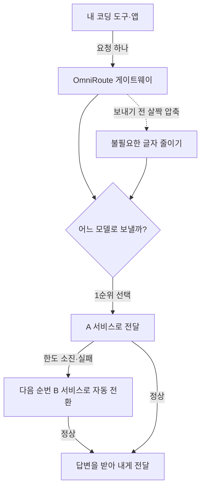

<div class="ai-knowledge-shell">

<aside class="ai-knowledge-sidebar">
  <p class="ai-eyebrow">CATEGORIES</p>
  <nav class="ai-cat-tree"><details class="ai-cat" open><summary><span class="catname">에이전트 오케스트레이션</span><span class="catcount">8</span></summary><ul><li><a href="https://altjs4510.github.io/ai_news_blog/knowledge/20260708/"><span class="kdate">2026-07-08</span><span class="ktitle">Expanding Managed Agents in Gemini API: backgrou…</span></a></li><li><a href="https://altjs4510.github.io/ai_news_blog/knowledge/20260707/"><span class="kdate">2026-07-07</span><span class="ktitle">AI Hero Skills Catalog — 실무 엔지니어를 위한 재사용 가능한 판단 …</span></a></li><li><a href="https://altjs4510.github.io/ai_news_blog/knowledge/20260701/"><span class="kdate">2026-07-01</span><span class="ktitle">Google OKF (Open Knowledge Format) — 벤더 중립 에이전트 …</span></a></li><li><a href="https://altjs4510.github.io/ai_news_blog/knowledge/20260623/"><span class="kdate">2026-06-23</span><span class="ktitle">bytedance/deer-flow — 샌드박스·메모리·서브에이전트·메시지 게이트웨이를…</span></a></li><li><a href="https://altjs4510.github.io/ai_news_blog/knowledge/20260611/"><span class="kdate">2026-06-11</span><span class="ktitle">The evolution of agentic surfaces: building with…</span></a></li><li><a href="https://altjs4510.github.io/ai_news_blog/knowledge/20260602/"><span class="kdate">2026-06-02</span><span class="ktitle">revfactory/harness — 도메인별 에이전트 팀과 스킬을 자동 설계하는 메타…</span></a></li><li><a href="https://altjs4510.github.io/ai_news_blog/knowledge/20260529/"><span class="kdate">2026-05-29</span><span class="ktitle">Introducing dynamic workflows in Claude Code</span></a></li><li><a href="https://altjs4510.github.io/ai_news_blog/knowledge/20260507/"><span class="kdate">2026-05-07</span><span class="ktitle">ruvnet/ruflo — Claude 멀티 에이전트 오케스트레이션 플랫폼</span></a></li></ul></details><details class="ai-cat" open><summary><span class="catname">MCP &amp; 도구 통합</span><span class="catcount">18</span></summary><ul><li><a href="https://altjs4510.github.io/ai_news_blog/knowledge/20260802/"><span class="kdate">2026-08-02</span><span class="ktitle">Stateless MCP has recaptured my interest (and in…</span></a></li><li><a href="https://altjs4510.github.io/ai_news_blog/knowledge/20260801/"><span class="kdate">2026-08-01</span><span class="ktitle">different-ai/openwork — Claude Cowork의 오픈소스 대체 에…</span></a></li><li><a href="https://altjs4510.github.io/ai_news_blog/knowledge/20260731/"><span class="kdate">2026-07-31</span><span class="ktitle">different-ai/openwork — Claude Cowork의 오픈소스 대안(o…</span></a></li><li><a href="https://altjs4510.github.io/ai_news_blog/knowledge/20260729/"><span class="kdate">2026-07-29</span><span class="ktitle">Bringing MCP 2026-07-28 to Claude</span></a></li><li><a href="https://altjs4510.github.io/ai_news_blog/knowledge/20260724/"><span class="kdate">2026-07-24</span><span class="ktitle">diegosouzapw/OmniRoute — 단일 엔드포인트로 278+ 프로바이더·50…</span></a></li><li><a href="https://altjs4510.github.io/ai_news_blog/knowledge/20260722/"><span class="kdate">2026-07-22</span><span class="ktitle">tirth8205/code-review-graph — MCP·CLI용 로컬 우선 코드 …</span></a></li><li><a href="https://altjs4510.github.io/ai_news_blog/knowledge/20260721/"><span class="kdate">2026-07-21</span><span class="ktitle">tirth8205/code-review-graph — 로컬 우선 코드 인텔리전스 그래프…</span></a></li><li><a href="https://altjs4510.github.io/ai_news_blog/knowledge/20260719/"><span class="kdate">2026-07-19</span><span class="ktitle">tirth8205/code-review-graph — 로컬 우선 코드 인텔리전스 그래프…</span></a></li><li><a href="https://altjs4510.github.io/ai_news_blog/knowledge/20260718/"><span class="kdate">2026-07-18</span><span class="ktitle">tirth8205/code-review-graph — MCP·CLI용 로컬 코드 인텔리…</span></a></li><li><a href="https://altjs4510.github.io/ai_news_blog/knowledge/20260618/"><span class="kdate">2026-06-18</span><span class="ktitle">DeusData/codebase-memory-mcp — 158개 언어 코드베이스를 밀리…</span></a></li><li><a href="https://altjs4510.github.io/ai_news_blog/knowledge/20260606/"><span class="kdate">2026-06-06</span><span class="ktitle">chopratejas/headroom — Compress tool outputs, lo…</span></a></li><li><a href="https://altjs4510.github.io/ai_news_blog/knowledge/20260605/"><span class="kdate">2026-06-05</span><span class="ktitle">chopratejas/headroom — Compress tool outputs, lo…</span></a></li><li><a href="https://altjs4510.github.io/ai_news_blog/knowledge/20260604/"><span class="kdate">2026-06-04</span><span class="ktitle">chopratejas/headroom — Compress tool outputs bef…</span></a></li><li><a href="https://altjs4510.github.io/ai_news_blog/knowledge/20260603/"><span class="kdate">2026-06-03</span><span class="ktitle">How Bad MCP design cost your Agent 5× more token…</span></a></li><li><a href="https://altjs4510.github.io/ai_news_blog/knowledge/20260523/"><span class="kdate">2026-05-23</span><span class="ktitle">colbymchenry/codegraph — 사전 인덱싱된 코드 지식 그래프 MCP</span></a></li><li><a href="https://altjs4510.github.io/ai_news_blog/knowledge/20260519/"><span class="kdate">2026-05-19</span><span class="ktitle">Anthropic acquires Stainless</span></a></li><li><a href="https://altjs4510.github.io/ai_news_blog/knowledge/20260517/"><span class="kdate">2026-05-17</span><span class="ktitle">I gave my LLM 100,000+ tools — Lazy Discovery &a…</span></a></li><li><a href="https://altjs4510.github.io/ai_news_blog/knowledge/20260509/"><span class="kdate">2026-05-09</span><span class="ktitle">How to connect 100 MCP servers without the conte…</span></a></li></ul></details><details class="ai-cat" open><summary><span class="catname">코딩 에이전트</span><span class="catcount">18</span></summary><ul><li><a href="https://altjs4510.github.io/ai_news_blog/knowledge/20260808/"><span class="kdate">2026-08-08</span><span class="ktitle">PrimeIntellect-ai/prime-agent — 코딩 워크플로우와 장시간 자율…</span></a></li><li><a href="https://altjs4510.github.io/ai_news_blog/knowledge/20260804/"><span class="kdate">2026-08-04</span><span class="ktitle">esengine/DeepSeek-Reasonix — prefix-cache 안정성을 축…</span></a></li><li><a href="https://altjs4510.github.io/ai_news_blog/knowledge/20260728/"><span class="kdate">2026-07-28</span><span class="ktitle">alibaba/open-code-review — 결정론적 파이프라인 + LLM 에이전트…</span></a></li><li><a href="https://altjs4510.github.io/ai_news_blog/knowledge/20260725/"><span class="kdate">2026-07-25</span><span class="ktitle">The new rules of context engineering for Claude …</span></a></li><li><a href="https://altjs4510.github.io/ai_news_blog/knowledge/20260714/"><span class="kdate">2026-07-14</span><span class="ktitle">Graphify-Labs/graphify — 코드베이스를 질의 가능한 지식 그래프로 만…</span></a></li><li><a href="https://altjs4510.github.io/ai_news_blog/knowledge/20260705/"><span class="kdate">2026-07-05</span><span class="ktitle">openai/codex-plugin-cc — Claude Code에서 Codex를 위임…</span></a></li><li><a href="https://altjs4510.github.io/ai_news_blog/knowledge/20260626/"><span class="kdate">2026-06-26</span><span class="ktitle">google-labs-code/design.md — 코딩 에이전트에게 디자인 시스템을 …</span></a></li><li><a href="https://altjs4510.github.io/ai_news_blog/knowledge/20260619/"><span class="kdate">2026-06-19</span><span class="ktitle">Claude Code now supports artifacts</span></a></li><li><a href="https://altjs4510.github.io/ai_news_blog/knowledge/20260530/"><span class="kdate">2026-05-30</span><span class="ktitle">Leonxlnx/taste-skill — AI에게 좋은 취향을 부여해 generic s…</span></a></li><li><a href="https://altjs4510.github.io/ai_news_blog/knowledge/20260528/"><span class="kdate">2026-05-28</span><span class="ktitle">Building self-improving tax agents with Codex</span></a></li><li><a href="https://altjs4510.github.io/ai_news_blog/knowledge/20260526/"><span class="kdate">2026-05-26</span><span class="ktitle">colbymchenry/codegraph — Pre-indexed code knowle…</span></a></li><li><a href="https://altjs4510.github.io/ai_news_blog/knowledge/20260524/"><span class="kdate">2026-05-24</span><span class="ktitle">colbymchenry/codegraph — Pre-indexed code knowle…</span></a></li><li><a href="https://altjs4510.github.io/ai_news_blog/knowledge/20260521/"><span class="kdate">2026-05-21</span><span class="ktitle">colbymchenry/codegraph — Pre-indexed code knowle…</span></a></li><li><a href="https://altjs4510.github.io/ai_news_blog/knowledge/20260512/"><span class="kdate">2026-05-12</span><span class="ktitle">agentmemory — Persistent memory for AI coding ag…</span></a></li><li><a href="https://altjs4510.github.io/ai_news_blog/knowledge/20260510/"><span class="kdate">2026-05-10</span><span class="ktitle">addyosmani/agent-skills — Production-grade engin…</span></a></li><li><a href="https://altjs4510.github.io/ai_news_blog/knowledge/20260508/"><span class="kdate">2026-05-08</span><span class="ktitle">addyosmani/agent-skills — Production-grade engin…</span></a></li><li><a href="https://altjs4510.github.io/ai_news_blog/knowledge/20260506/"><span class="kdate">2026-05-06</span><span class="ktitle">mksglu/context-mode — AI 코딩 에이전트용 컨텍스트 윈도우 최적화</span></a></li><li><a href="https://altjs4510.github.io/ai_news_blog/knowledge/20260505/"><span class="kdate">2026-05-05</span><span class="ktitle">mattpocock/skills — Skills for Real Engineers (.…</span></a></li></ul></details><details class="ai-cat" open><summary><span class="catname">모델 &amp; 연구</span><span class="catcount">5</span></summary><ul><li><a href="https://altjs4510.github.io/ai_news_blog/knowledge/20260716-proprag/"><span class="kdate">2026-07-16</span><span class="ktitle">PropRAG — 프로포지션 경로 위 beam search로 멀티홉 검색 안내</span></a></li><li><a href="https://altjs4510.github.io/ai_news_blog/knowledge/20260620/"><span class="kdate">2026-06-20</span><span class="ktitle">zai-org/GLM-5 — From Vibe Coding to Agentic Engi…</span></a></li><li><a href="https://altjs4510.github.io/ai_news_blog/knowledge/20260617/"><span class="kdate">2026-06-17</span><span class="ktitle">Predicting model behavior before release by simu…</span></a></li><li><a href="https://altjs4510.github.io/ai_news_blog/knowledge/20260516/"><span class="kdate">2026-05-16</span><span class="ktitle">STALE — 에이전트가 자기 기억의 유효성을 인지할 수 있는가</span></a></li><li><a href="https://altjs4510.github.io/ai_news_blog/knowledge/20260513/"><span class="kdate">2026-05-13</span><span class="ktitle">Thinking Machines' Native Interaction Models — T…</span></a></li></ul></details><details class="ai-cat" open><summary><span class="catname">인프라 &amp; 컴퓨트</span><span class="catcount">5</span></summary><ul><li><a href="https://altjs4510.github.io/ai_news_blog/knowledge/20260806/"><span class="kdate">2026-08-06</span><span class="ktitle">cloudflare/computer — 에이전트에게 컴퓨터를 통째로 주는 엣지 실행 샌…</span></a></li><li><a href="https://altjs4510.github.io/ai_news_blog/knowledge/20260723/" class="current"><span class="kdate">2026-07-23</span><span class="ktitle">diegosouzapw/OmniRoute — 268+ 프로바이더를 단일 엔드포인트로 묶…</span></a></li><li><a href="https://altjs4510.github.io/ai_news_blog/knowledge/20260630/"><span class="kdate">2026-06-30</span><span class="ktitle">Introducing the Claude apps gateway for Amazon B…</span></a></li><li><a href="https://altjs4510.github.io/ai_news_blog/knowledge/20260522/"><span class="kdate">2026-05-22</span><span class="ktitle">Giving Agents Computers — Ivan Burazin, Daytona</span></a></li><li><a href="https://altjs4510.github.io/ai_news_blog/knowledge/20260520/"><span class="kdate">2026-05-20</span><span class="ktitle">New in Claude Managed Agents: self-hosted sandbo…</span></a></li></ul></details><details class="ai-cat" open><summary><span class="catname">보안 &amp; 거버넌스</span><span class="catcount">13</span></summary><ul><li><a href="https://altjs4510.github.io/ai_news_blog/knowledge/20260730/"><span class="kdate">2026-07-30</span><span class="ktitle">Anatomy of a Frontier Lab Agent Intrusion: A Tec…</span></a></li><li><a href="https://altjs4510.github.io/ai_news_blog/knowledge/20260716/"><span class="kdate">2026-07-16</span><span class="ktitle">Dicklesworthstone/destructive_command_guard — 에이…</span></a></li><li><a href="https://altjs4510.github.io/ai_news_blog/knowledge/20260715/"><span class="kdate">2026-07-15</span><span class="ktitle">Dicklesworthstone/destructive_command_guard — 에이…</span></a></li><li><a href="https://altjs4510.github.io/ai_news_blog/knowledge/20260710/"><span class="kdate">2026-07-10</span><span class="ktitle">70개 MCP 서버 strace 런타임 감사 — 부팅 시 아웃바운드 호출 서버 적발</span></a></li><li><a href="https://altjs4510.github.io/ai_news_blog/knowledge/20260703/"><span class="kdate">2026-07-03</span><span class="ktitle">Giving admins more visibility and control over C…</span></a></li><li><a href="https://altjs4510.github.io/ai_news_blog/knowledge/20260625/"><span class="kdate">2026-06-25</span><span class="ktitle">Agent identity in Claude Tag: a new access model…</span></a></li><li><a href="https://altjs4510.github.io/ai_news_blog/knowledge/20260624/"><span class="kdate">2026-06-24</span><span class="ktitle">Agent identity in Claude Tag: a new access model…</span></a></li><li><a href="https://altjs4510.github.io/ai_news_blog/knowledge/20260614/"><span class="kdate">2026-06-14</span><span class="ktitle">NVIDIA/SkillSpector — Security scanner for AI ag…</span></a></li><li><a href="https://altjs4510.github.io/ai_news_blog/knowledge/20260613/"><span class="kdate">2026-06-13</span><span class="ktitle">Fable 5's guardrails got bypassed in 48 hours — …</span></a></li><li><a href="https://altjs4510.github.io/ai_news_blog/knowledge/20260612/"><span class="kdate">2026-06-12</span><span class="ktitle">NVIDIA/SkillSpector — AI 에이전트 스킬용 보안 스캐너</span></a></li><li><a href="https://altjs4510.github.io/ai_news_blog/knowledge/20260607/"><span class="kdate">2026-06-07</span><span class="ktitle">OpenAI Help: Lockdown Mode</span></a></li><li><a href="https://altjs4510.github.io/ai_news_blog/knowledge/20260531/"><span class="kdate">2026-05-31</span><span class="ktitle">How we contain Claude across products</span></a></li><li><a href="https://altjs4510.github.io/ai_news_blog/knowledge/20260527/"><span class="kdate">2026-05-27</span><span class="ktitle">Microsoft Copilot Cowork Exfiltrates Files</span></a></li></ul></details><details class="ai-cat" open><summary><span class="catname">응용 사례</span><span class="catcount">9</span></summary><ul><li><a href="https://altjs4510.github.io/ai_news_blog/knowledge/20260805/"><span class="kdate">2026-08-05</span><span class="ktitle">TencentCloud/TencentDB-Agent-Memory — 대화·문서·코드를 …</span></a></li><li><a href="https://altjs4510.github.io/ai_news_blog/knowledge/20260726/"><span class="kdate">2026-07-26</span><span class="ktitle">citrolabs/ego-lite — 로그인된 브라우저 상태를 AI 에이전트와 공유하는…</span></a></li><li><a href="https://altjs4510.github.io/ai_news_blog/knowledge/20260717/"><span class="kdate">2026-07-17</span><span class="ktitle">After a year building agent memory, 'save everyt…</span></a></li><li><a href="https://altjs4510.github.io/ai_news_blog/knowledge/20260712/"><span class="kdate">2026-07-12</span><span class="ktitle">Do Automated Evals Work?</span></a></li><li><a href="https://altjs4510.github.io/ai_news_blog/knowledge/20260709/"><span class="kdate">2026-07-09</span><span class="ktitle">mvanhorn/last30days-skill — Reddit·X·YouTube·HN·…</span></a></li><li><a href="https://altjs4510.github.io/ai_news_blog/knowledge/20260621/"><span class="kdate">2026-06-21</span><span class="ktitle">calesthio/OpenMontage — 12 파이프라인·52 도구·500+ 스킬을 …</span></a></li><li><a href="https://altjs4510.github.io/ai_news_blog/knowledge/20260609/"><span class="kdate">2026-06-09</span><span class="ktitle">Building intelligent apps for Apple platforms wi…</span></a></li><li><a href="https://altjs4510.github.io/ai_news_blog/knowledge/20260515/"><span class="kdate">2026-05-15</span><span class="ktitle">Clawdmeter — Claude Code 사용량을 데스크톱 대시보드로</span></a></li><li><a href="https://altjs4510.github.io/ai_news_blog/knowledge/20260514/"><span class="kdate">2026-05-14</span><span class="ktitle">Introducing Claude for Small Business</span></a></li></ul></details><details class="ai-cat" open><summary><span class="catname">산업 동향</span><span class="catcount">6</span></summary><ul><li><a href="https://altjs4510.github.io/ai_news_blog/knowledge/20260711/"><span class="kdate">2026-07-11</span><span class="ktitle">OpenAI says GPT 5.6 is the 'preferred model' for…</span></a></li><li><a href="https://altjs4510.github.io/ai_news_blog/knowledge/20260704/"><span class="kdate">2026-07-04</span><span class="ktitle">Cloudflare is about to block AI agents by defaul…</span></a></li><li><a href="https://altjs4510.github.io/ai_news_blog/knowledge/20260702/"><span class="kdate">2026-07-02</span><span class="ktitle">How Cursor deploys AI inside the enterprise (For…</span></a></li><li><a href="https://altjs4510.github.io/ai_news_blog/knowledge/20260616/"><span class="kdate">2026-06-16</span><span class="ktitle">Why AI hasn't replaced software engineers, and w…</span></a></li><li><a href="https://altjs4510.github.io/ai_news_blog/knowledge/20260610/"><span class="kdate">2026-06-10</span><span class="ktitle">Fable 5 just made cost-aware model routing manda…</span></a></li><li><a href="https://altjs4510.github.io/ai_news_blog/knowledge/20260504/"><span class="kdate">2026-05-04</span><span class="ktitle">Agents for Everything Else: Codex for Knowledge …</span></a></li></ul></details></nav>
</aside>

<article class="ai-knowledge-article">

<header class="ai-post-hero">
  <p class="ai-eyebrow"><a class="ai-back" href="../">KNOWLEDGE</a> · 2026-07-23 · 오늘의 학습</p>
  <h2 class="ai-post-title">diegosouzapw/OmniRoute — 268+ 프로바이더를 단일 엔드포인트로 묶는 쿼터 인지 자동 폴백 AI 게이트웨이</h2>
</header>

> 원문: [diegosouzapw/OmniRoute — 268+ 프로바이더를 단일 엔드포인트로 묶는 쿼터 인지 자동 폴백 AI 게이트웨이](https://github.com/diegosouzapw/OmniRoute)

## 📌 학습 정리

### 1. 한 줄로 말하면

여러 곳에 흩어진 AI 모델 서비스들을 하나의 콘센트에 꽂아 쓰는 멀티탭처럼 묶어주고, 한 곳이 막히면 알아서 다른 곳으로 갈아타 주는 중간 연결 장치예요.

### 2. 왜 이게 만들어졌어요?

요즘은 무료로 쓸 수 있는 AI 모델 서비스가 정말 많아요. 그런데 문제는, 각 서비스마다 가입 방식도 다르고, 하루에 몇 번까지 쓸 수 있다는 사용 한도(rate limit, 정해진 시간 안에 요청할 수 있는 횟수 제한)도 제각각이라는 점이에요. 이걸 손으로 하나하나 관리하려면, 여러 개발 도구(SDK, 특정 서비스를 코드에서 불러 쓰게 해주는 연결 키트)를 붙이고 한도를 눈으로 좇아야 하는데, 지금 내가 실제로 얼마나 남았는지조차 알기 어려웠죠. OmniRoute는 이렇게 흩어진 무료 사용량을 하나로 모아 "지금 이만큼 쓸 수 있다"는 정직한 숫자로 보여주고, 한 서비스가 한도를 다 쓰면 자동으로 다음 서비스로 넘겨주려고 만들어졌어요.

### 3. 비유로 풀면

이건 마치 **여러 통신사 유심을 꽂아둔 공유기** 같은 거예요. 한 회선의 데이터를 다 쓰면 알아서 다음 회선으로 갈아타서, 쓰는 사람은 끊김을 못 느끼죠. OmniRoute에서는 이렇게 모델을 줄줄이 이어놓은 묶음을 **조합(combo, 자동으로 갈아탈 모델들의 연결 사슬)**이라고 불러요.

또 하나는 **콘센트 멀티탭**이에요. 벽에 콘센트가 하나뿐이어도 멀티탭 하나만 꽂으면 여러 기기를 같은 자리에서 쓸 수 있죠. 그래서 결국, 내 코딩 도구는 OmniRoute라는 주소 하나만 바라보게 해두고, 그 뒤에서 수백 개의 서비스를 갈아 끼우는 복잡한 일은 OmniRoute가 대신 처리하는 구조예요.

### 4. 어떻게 작동하는지 (그림으로)



내 도구는 언제나 OmniRoute 한 곳에만 요청을 보내요. OmniRoute는 건강 상태·남은 한도·비용 같은 조건을 실시간으로 따져 어느 서비스로 보낼지 고르고, 그곳이 막히면 조용히 다음 순번으로 넘어가요. 보내기 전에는 문장에서 군더더기를 걷어내 사용량을 아끼는 압축 단계도 거치는데, 코드 블록이나 주소(URL) 같은 중요한 부분은 건드리지 않고 그대로 지켜줘요.

### 5. 처음 보는 용어 풀이

- **게이트웨이 (gateway)** — 여러 서비스로 가는 길목을 하나로 모아주는 중간 관문이에요. 내 요청을 받아서 적절한 곳으로 대신 전달해 주는 역할을 해요.
- **폴백 (fallback)** — "안 되면 대신 이걸로"라는 뜻의 자동 대체예요. 한 모델이 실패하거나 한도가 차면, 미리 정해둔 다음 모델로 알아서 넘어가는 동작을 말해요.
- **쿼터 / 사용 한도 (quota)** — 정해진 기간 안에 쓸 수 있는 사용량의 상한이에요. 예를 들어 "하루 100만 토큰까지"처럼 정해진 몫을 말하며, 다 쓰면 그 서비스는 잠시 못 쓰게 돼요.
- **토큰 (token)** — AI가 글을 읽고 쓸 때 세는 최소 단위예요. 단어나 글자 조각 정도로 생각하면 되고, 대부분의 비용과 한도가 이 토큰 개수로 계산돼요.
- **라우팅 전략 (routing strategy)** — 여러 후보 중 어느 서비스로 보낼지 고르는 규칙이에요. "싼 곳 먼저", "빠른 곳 먼저", "한도가 가장 많이 남은 곳 먼저"처럼 상황에 맞게 고를 수 있어요.
- **압축 (compression)** — 뜻은 그대로 두고 문장에서 불필요한 글자를 줄여 토큰 수를 아끼는 처리예요. 원문에서는 같은 답을 72% 적은 토큰으로 줄인 예시를 들고 있어요.
- **MCP 서버 (Model Context Protocol server)** — AI 에이전트가 외부 도구를 표준 방식으로 불러 쓰게 해주는 연결 규격이에요. 이걸 통해 에이전트가 OmniRoute의 기능을 스스로 조작할 수 있어요.

### 6. 한 발 더 들어가고 싶다면

- [OmniRoute 저장소(github.com/diegosouzapw/OmniRoute)](https://github.com/diegosouzapw/OmniRoute) — 설치 방법, 지원 서비스 목록, 전체 기능을 한눈에 볼 수 있어요.
- [omniroute.online](https://omniroute.online) — 공식 웹사이트로, 프로젝트 소개와 사용 안내를 확인할 수 있어요.
- [npm 패키지(npmjs.com/package/omniroute)](https://npmjs.com/package/omniroute) — `npm install -g omniroute` 명령으로 바로 설치해 볼 수 있는 배포본이에요.

---

## 📖 원문 전체 번역 (정독용)

> 의역 최소화한 전체 번역입니다. 큰 흐름은 위 정리에서 잡고, 정확한 워딩이 필요할 땐 이 섹션에서 정독하세요.

# 🚀 OmniRoute — 무료 AI 게이트웨이

## 💰 월 ~1.53B 무료 토큰

무료 티어를 손으로 쌓아 올리는 건 고통스럽다 — 수십 개의 SDK, 수십 개의 rate limit, 그리고 실제로 얼마나 남았는지 알 방법이 없다. OmniRoute 는 **43개 프로바이더 풀 / 460개+ 모델**의 문서화된 무료 티어를 집계해 하나의 정직한 숫자로 만들고 대시보드(`/dashboard/free-tiers`)에서 실시간으로 보여준다.

실시간 `/dashboard/free-tiers` 페이지의 애니메이션 요약. 전체 방법론(풀 중복제거, 크레딧 티어, 프로바이더 약관)은 `docs/reference/FREE_TIERS.md` 참조.

이 수치들은 2주마다 실제 카탈로그를 기준으로 재감사되며 **양방향으로 움직인다** — 어떤 프로바이더가 무료 티어를 종료하면 숫자가 내려가고, 새 프로바이더가 들어오면 올라간다. 우리는 카탈로그가 실제로 계산한 값만 발행하며, 반올림한 최선의 시나리오는 절대 발행하지 않는다. CI 게이트(`check:docs-counts`)는 이 헤드라인 수치가 코드와 어긋나면 빌드를 실패시킨다.

⭐ OMNIROUTE 가 돈을 아끼고 작업을 수월하게 만드는 데 도움이 됐다면 레포에 스타를 눌러주시길.

## 💬 커뮤니티 참여

질문, 프로바이더 팁, 로드맵 & 지원 → Discord · Telegram · WhatsApp

🌍 Global / 🇧🇷 Brasil

🧩 사용 가능 항목: 🚀 Quick Start • 🎯 Combos • 🌐 Providers • 🔌 CLI & MCP • 🗜️ Compression • 🌍 Website

💥 The Promise • 🤔 Why • 🏆 What Sets Apart • 🤖 Compatible CLIs • 🖥️ Where It Runs • 🔒 Private • 🎬 In Action • 📸 Screenshots • 📧 Support

🌐 43개 언어 지원 (국기 아이콘 목록)

## 💥 The Promise

## 🤔 Why OmniRoute?

## 🎯 Combos — 플래그십 기능

**콤보(combo)**는 OmniRoute 가 **자동으로** 라우팅하는 모델들의 체인이다. 쿼터가 소진되거나, 프로바이더가 실패하거나, 비용이 급등하면 — 콤보는 조용히 다음 모델로 미끄러져 넘어간다.

이것이 OmniRoute 를 무너지지 않게 만드는 핵심이다. 🛡️

### ⚡ 제로 설정 — 그냥 `auto` 를 쓰면 된다

콤보를 만들 필요 없다. 모델을 `auto`(또는 변형)로 설정하면 OmniRoute 가 연결된 프로바이더들로부터 가상 콤보를 구성하고, 실시간으로 점수를 매긴다:

| 모델 ID | 최적화 대상 |
|---|---|
| `auto` | 🎯 균형 잡힌 기본값 (LKGP — 마지막으로 성공한 프로바이더를 고수) |
| `auto/coding` | 🧑‍💻 코드 생성을 위한 품질 우선 가중치 |
| `auto/fast` | ⚡ 최저 지연시간 우선 |
| `auto/cheap` | 💰 토큰당 최저 비용 우선 |
| `auto/offline` | 🔋 쿼터/rate-limit 여유가 가장 많은 것 우선 |
| `auto/smart` | 🔭 품질 우선 + 더 나은 모델을 발견하기 위한 10% 탐색 |

### 🔀 또는 직접 구성 — 18가지 라우팅 전략

18가지 전략 **전체** — 콤보 단계별로 자유롭게 조합 가능:

| # | 전략 | 동작 |
|---|---|---|
| 1 | `priority` | 첫 번째 대상 순서 목록 — 다음으로 넘어가기 전에 각각을 소진 🥇 |
| 2 | `fill-first` | 다음으로 넘어가기 전에 각 대상의 쿼터를 완전히 채움 |
| 3 | `weighted` | 대상별 가중치에 따른 가중 랜덤 |
| 4 | `round-robin` | 순서대로 대상을 순환 |
| 5 | `p2c` | Power-of-two-choices 랜덤 로드밸런싱 |
| 6 | `least-used` | 현재 부하가 가장 낮은 대상을 선택 |
| 7 | `random` | 균등 랜덤 선택 (중복제거됨) |
| 8 | `strict-random` | 중복제거 없는 랜덤 🎲 |
| 9 | `cost-optimized` | 실시간 카탈로그 가격을 기준으로 요청당 $ 최소화 💸 |
| 10 | `headroom` | 남은 쿼터가 가장 많은 대상을 선택 |
| 11 | `reset-window` | 쿼터 윈도우가 가장 빨리 리셋되는 대상을 선호 |
| 12 | `reset-aware` | 쿼터 리셋 시간 기준 순위 — 짧은 윈도우 우선 📊 |
| 13 | `context-relay` | 긴 대화를 위해 대상 간 컨텍스트를 인계 🧠 |
| 14 | `context-optimized` | 현재 컨텍스트 크기에 가장 적합한 것을 선택 |
| 15 | `lkgp` | Last-Known-Good Path — 마지막으로 성공한 대상에 고정 |
| 16 | `auto` | 모든 연결에 대한 12요소 실시간 스코어링 🤖 |
| 17 | `fusion` | 모델 패널로 팬아웃하고 심사자가 하나의 답으로 종합 🧬 |
| 18 | `pipeline` | 단계 체인 — 각 대상의 출력이 다음 대상으로 공급됨 🔗 |

Auto-Combo 엔진은 모든 후보를 **12가지 요소**(상태, 쿼터, 비용, 지연시간, 성공률, 신선도 등)로 점수를 매긴다 — `docs/routing/AUTO-COMBO.md` 참조.

### ⚖️ Quota-Share — 하나의 구독을 팀 전체에 분배 ✨ NEW

**동일한 upstream 계정**에 대해 여러 키를 운용하고 있는가(하나의 Codex Pro 플랜, 하나의 Kimi 키, 하나의 GLM Coding 시트)? 한 키에서의 버스트가 5시간/시간 단위 쿼터 전체를 태워버려 다른 모두를 잠글 수 있다.

**Quota-Share**는 프로바이더의 시간 기반 쿼터를 풀 안의 키들에게 **공평하게** 분배한다 — 그리고 이는 **work-conserving**이라, 유휴 상태인 멤버의 몫은 낭비되지 않고 대여된다.

| 노브 | 통제 대상 |
|---|---|
| ⚖️ 할당 가중치 | 각 키의 풀 지분 — 예: `50 / 30 / 20` |
| 📐 차원 | `%` · 요청 수 · 토큰 · `$` 를, `5h / 7d / 모델별` 윈도우로 추적 |
| 🚦 정책 | `hard`(지분 초과 시 차단) · `soft`(우선순위 낮춤) · `burst`(유휴 여유 사용) |
| 🧱 상한 | 모드와 무관한 키별 절대 상한 |

요청이 OmniRoute 를 떠나기 **전** hot path 에서 강제되며, 키·모델 쌍 별 상한 + 프롬프트 캐시 무결성을 위한 세션 고정(sticky)이 적용된다(이제는 콤보별/전역 비활성 토글도 있음). 📖 Quota Sharing Engine

### 🧱 복원력이 내장되어 있다 (3개의 독립된 레이어)

📖 Auto-Combo Engine · Resilience Guide

## 🏆 OmniRoute 를 차별화하는 요소

| 기능 | OmniRoute | 다른 라우터들 |
|---|---|---|
| 🌐 프로바이더 | 278 | 20–100 |
| 🆓 무료 프로바이더 | 90+ (40+ 영구 무료) | 1–5 |
| 🔀 라우팅 전략 | 18 (priority, weighted, cost-optimized, context-relay, fusion…) | 1–3 |
| 🗜️ 토큰 압축 | RTK + Caveman 스태킹 (15–95%) | 없음 / 20–40% |
| 🧰 내장 MCP 서버 | 104개 도구, 3개 전송방식, 31개 스코프 | 드묾 |
| 🤝 A2A 에이전트 프로토콜 | 6개 스킬, JSON-RPC 2.0 | 없음 |
| 🧠 메모리 (FTS5 + 벡터) | 있음 | 드묾 |
| 🛡️ 가드레일 (PII, injection, vision) | 있음 | 드묾 |
| ☁️ 클라우드 에이전트 | Codex, Cursor, Devin, Jules | 없음 |
| 🥷 TLS 핑거프린트 스텔스 | wreq-js 통한 JA3/JA4 | 없음 |
| 🖥️ 멀티 플랫폼 | Web · Desktop · Termux · PWA | Web 전용 |
| 🌍 i18n | 43개 로케일 | 0–4 |

📊 LiteLLM, OpenRouter, Portkey 대비 상세 비교 → `docs/comparison/OMNIROUTE_VS_ALTERNATIVES.md`

## ✨ 새로운 소식

`v3.8.20 → v3.8.49` 최신 하이라이트. 전체 히스토리는 `CHANGELOG.md`.

- 🗜️ **압축 강화** — 기본으로 켜진 인플레이션 가드, DE/FR/JA 및 중국어(문언) Caveman 팩, Gradle & .NET 용 RTK 필터. → Compression
- 💸 **정직한 정액제 비용** — 구독/코딩 플랜 프로바이더는 비용 분석에서 $0 로 표시; 예산·쿼터·라우팅은 계속 추정. → API Reference
- ⚖️ **Quota-Share 라우팅** — 계정 간 **가용 쿼터** 기준으로 부하 분산: DRR 스케줄링, 연결별 동시성, 멀티 윈도우 버킷, 세션 고정. → Resilience Guide
- 🤖 **원커맨드 CLI/에이전트 설정** — `setup-*` 가 12개+ 코딩 도구를 구성; `omniroute launch`/`launch-codex` 는 제로 설정. → CLI Integrations
- 🛰️ **원격 모드** — 스코프 토큰으로 원격 OmniRoute 를 조작(`connect`/`contexts`/`tokens`) + VPS 설치를 위한 `antigravity` OAuth 헬퍼. → Remote Mode
- 🧭 **더 똑똑한 자동 라우팅** — `auto/<category>:<tier>` 콤보, Fusion(모델 패널 + 심사자), 작업 인지 라우팅, 요청별 모델/모드/USD 예산 오버라이드. → Auto-Combo
- 🗜️ **플러그형 압축** — 11개 조합 가능한 엔진 + Compression Studios: LLMLingua-2, 2단계 Ultra, omniglyph, 단계별 충실도 게이트, GCF v3.2, 드래그 재정렬 에디터. → Compression
- 🕵️ **투명한 MITM 복호화(TPROXY)** — 프록시 환경변수를 무시하는 CLI를 캡처, SNI별 CA + 신뢰 저장소 설치기 포함. → MITM/TPROXY
- 💸 **어디서나 비용 텔레메트리** — 모든 엔드포인트에 `X-OmniRoute-*` 비용/사용량 헤더, 캐시-HIT 절감 헤더, 키별 USD 지출 쿼터. → API Reference
- 🧠 **직접 통제하는 메모리** — 기본 꺼짐, 옵트인 int8 벡터 양자화 + 타입별 감쇠, 요청별 `x-omniroute-no-memory`. → Memory
- 🛡️ **보안** — 모든 LLM 라우트에 프롬프트 인젝션 가드(레드팀 스위트) + 무료 DuckDuckGo 최종수단 웹 검색. → Guardrails
- 🖼️ **새 엔드포인트** — `/v1/ocr`(Mistral OCR) 과 `/v1/audio/translations`(Whisper 스타일)이 미디어 표면을 완성. → API Reference
- 🌍 **배포 & 운영** — 리버스 프록시 `basePath`, 브라우저 언어 자동 감지, 키별 디바이스 추적, root 불필요 MITM 신뢰, zh-TW 현지화. → Environment
- 🤝 **더 많은 프로바이더 & 에이전트** — Cursor Cloud Agent, Grok Build(xAI), Ollama 정식 카드, Claude Sonnet 5, Zed, Requesty, SenseNova, Yuanbao… 그리고 새로워진 250개 프로바이더 카탈로그. → Providers
- ⚡ **로컬 성능 & 인프라** — 원클릭 로컬 Redis, Cloudflare Workers/Deno Deploy 릴레이 배포기, Bifrost & Mux 를 감독형 임베디드 서비스로. → Embedded Services

## 🤖 호환 CLI 및 코딩 에이전트

설정 하나 — `http://localhost:20128/v1` — 로 **모든** AI IDE 또는 CLI가 무료 및 저비용 모델에서 동작한다.

Claude Code · Codex CLI · Cline · Kilo Code · Roo Code · Continue · Aider · ForgeCode · jcode · DeepSeek TUI · CodeWhale · OpenCode · Factory Droid · Copilot CLI · Cursor CLI · Smelt · Pi · Grok Build · Hermes Agent · OpenClaw · Goose · Open Interpreter · Warp AI · Agent Deck

＋ 다음과도 작동: Kiro · Command Code · Antigravity · Windsurf · AMP · 그 어떤 OpenAI 호환 도구든

📖 33개 도구(코딩 CLI 25개 + CLI 에이전트 8개) 전체에 대한 도구별 설정 → `docs/reference/CLI-TOOLS.md` · 🧩 OpenCode 플러그인 → `@omniroute/opencode-provider`

## 🌐 278개 AI 프로바이더 — 90+ 무료

오픈소스 라우터 중 가장 완전한 카탈로그: **278개 프로바이더**, **90+개 무료 티어 제공**, **40+개 영구 무료**.

### 🏢 모든 주요 랩 — 하나의 엔드포인트로

OpenAI · Anthropic · Gemini · xAI Grok · DeepSeek · Mistral · Qwen · Meta Llama · Groq · NVIDIA · MiniMax · Cohere · Perplexity · HuggingFace · Together · Fireworks · Cloudflare · Baidu

…그리고 220개 이상 — 모든 아이콘은 대시보드의 프로바이더 카탈로그에서 실시간으로 해석된다. 📖 Provider Reference

### 🆓 영구 무료 — $0, 카드 불필요

| 프로바이더 | 모델 | 조건 |
|---|---|---|
| AgentRouter | GPT-5, Claude, Gemini | $100 무료 크레딧 |
| Qoder AI | Kimi-K2, DeepSeek-R1 | 무제한 FREE |
| Pollinations | GPT-5, Claude, Llama 4 | 키 불필요 |
| LongCat | LongCat-2.0 | 1000만 토큰 일회성(KYC) 🔑 |
| Cloudflare AI | 50+ 모델 | 일 1만 뉴런 |
| NVIDIA NIM | 129개 모델 | ~40 RPM 무료 |
| Cerebras | Qwen3 235B | 일 100만 토큰 |

📖 전체 머신 판독 가능 카탈로그 → `docs/reference/PROVIDER_REFERENCE.md`

## 🖥️ OmniRoute 구동 위치 — 어디서든

같은 앱, 당신의 머신, 당신의 규칙. 전역 npm 설치부터 Termux 를 통한 **스마트폰**까지.

| 플랫폼 | 설치 | 특징 |
|---|---|---|
| 📦 npm (전역) | `npm install -g omniroute` | 명령어 하나로 어떤 OS든 |
| 🐳 Docker | `docker run … diegosouzapw/omniroute` | 멀티 아키텍처 AMD64 + ARM64 |
| 🖥️ Desktop (Electron) | `npm run electron:build` | 네이티브 창 + 시스템 트레이 — Windows/macOS/Linux |
| 💪 ARM | 네이티브 `arm64` | Raspberry Pi, ARM 서버, Apple Silicon |
| 📱 Android (Termux) | `pkg install nodejs && npx -y omniroute` | 스마트폰에서 24/7 구동, root 불필요 |
| 📲 PWA | "홈 화면에 추가" | 풀스크린, 오프라인, 브라우저에서 설치 가능 |
| 🧩 OpenCode 플러그인 | `@omniroute/opencode-provider` | 네이티브 OpenCode 통합 |
| 🛠️ 소스에서 | `npm install && npm run dev` | 직접 손대고 기여 |

📖 Docker Guide · Desktop · Termux · PWA · OpenCode

## 🔒 프라이빗 & 로컬 우선

📖 Authorization · Guardrails · Compliance

## 🔌 완전한 CLI + A2A & MCP

OmniRoute 는 단순한 서버가 아니다 — **80개 이상의 명령어**를 갖춘 완전한 명령줄 콕핏이며, 여기에 더해 AI 에이전트가 OmniRoute 를 **스스로** 조작할 수 있게 하는 오픈 에이전트 프로토콜도 포함한다.

### ⌨️ 진짜 CLI (단순 `start` 이상)

```
omniroute            # 게이트웨이 + 대시보드 서비스 (20128 포트)
omniroute chat       # 대화형 TUI 채팅 클라이언트 (슬래시: /model /combo /skill /memory)
omniroute setup      # 안내형 최초 실행 마법사
omniroute doctor     # 프로바이더, 포트, 네이티브 의존성 진단
```

### 🛰️ 원격 모드 — CLI 는 여기서, OmniRoute 는 VPS 에서

OmniRoute 가 서버에 있는가? 노트북에서 **같은 CLI** 로 조작하라. 스코프 액세스 토큰으로 한 번 로그인하면; 이후 모든 명령이 원격 대상으로 향한다.

```
omniroute connect 192.168.0.15         # 비밀번호 → 스코프 토큰, 컨텍스트로 저장됨
omniroute models list                  # ← 원격 서버에 대해 실행됨
omniroute configure codex               # ← 원격 모델을 선택하고 로컬 Codex 프로필 작성
omniroute tokens create --name ci --scope read   # 다른 머신용으로 더 좁은 토큰 발급
omniroute contexts use default          # ← 로컬 서버로 다시 전환
```

토큰은 `read`/`write`/`admin` 으로 스코프 지정되며; 프로세스 생성 라우트는 loopback 전용으로 유지된다. 📖 Remote Mode

### 🤝 에이전트 연결 — 그리고 그것이 OmniRoute 자체를 제어

OmniRoute 를 **MCP** 또는 **A2A** 로 노출하면 능력 있는 어떤 에이전트든 전체 게이트웨이 — 라우팅, 프로바이더, 콤보, 캐시, 압축, 메모리 — 의 키를 자율적으로 쥐게 된다.

| 프로토콜 | 엔드포인트 | 용도 |
|---|---|---|
| 🧰 MCP (stdio) | `omniroute --mcp` | Claude Desktop, Cursor, 모든 MCP 클라이언트에 연결 |
| 🌊 MCP (HTTP) | `http://localhost:20128/api/mcp/stream` | 원격 MCP — 104개 도구, 31개 스코프, 완전한 감사 추적 |
| 📡 MCP (SSE) | `http://localhost:20128/api/mcp/sse` | 스트리밍 MCP 전송방식 |
| 🤝 A2A | `http://localhost:20128/.well-known/agent.json` | 에이전트 간 통신, JSON-RPC 2.0 + SSE, 6개 스킬 |

```
# Claude Code 에게 MCP 를 통해 완전한 OmniRoute 툴셋을 부여:
claude mcp add-server omniroute --type http --url http://localhost:20128/api/mcp/stream
```

📖 MCP Server · A2A Server · Agent Protocols

## 🗜️ 15–95% 토큰 절약 — 자동으로

적은 토큰으로 되는 일에 왜 많은 토큰을 쓰는가? 모든 요청은 클라이언트 변경 없이 **투명하게** OmniRoute 의 압축 파이프라인을 통과한다. 이제 이것은 순서대로 실행되고 라우팅 콤보별로 조합 가능한 **11개 조합 엔진의 스택**으로, RTK, Caveman(⭐ 90K+), LLMLingua-2, Troglodita(PT-BR) 의 아이디어를 기반으로 구축되었다.

### 🧱 11개 엔진 스택

엔진들은 파이프라인 순서로 실행되며; 각각 콤보별로 독립적으로 토글·설정 가능:

| # | 엔진 | 동작 |
|---|---|---|
| 1 | Session-Dedup | 턴 간 반복되는 콘텐츠를 제거 (콘텐츠 주소 기반, 턴 교차) |
| 2 | CCR | 큰 블록을 retrieve 마커 뒤로 보관하고 필요 시 가져옴 |
| 3 | RTK | 스마트 도구-결과 필터링, 중복제거 & 잘라내기 (명령 인지형) |
| 4 | Headroom | 동질적 JSON 배열의 무손실 표 형태 압축(평면/중첩, ~30%), 벤더링된 GCF 코덱(spec v3.2) 사용 |
| 5 | Relevance | 마지막 사용자 쿼리 대비 추출적 문장 스코어링 |
| 6 | Caveman | 규칙 기반 산문 압축 (출력 기준 ~65–75%) |
| 7 | LLMLingua-2 | MobileBERT ONNX 통한 ML 시맨틱 프루닝 — 코드 안전, 비동기 |
| 8 | Lite | 공백 + 이미지 URL 다듬기 (지연시간 경량 기본값) |
| 9 | Aggressive | 요약 + 오래된 턴의 점진적 노화 |
| 10 | Ultra | 선택적 소형 모델(SLM) 티어를 갖춘 휴리스틱 토큰 프루닝 |

코드 블록, URL, 구조화 데이터는 **항상 바이트 단위로 완벽하게 보존**된다.

**원클릭 프리셋**은 엔진들을 조합한다:

| 모드 | 절감 | 최적 사용처 |
|---|---|---|
| 🪶 Lite | ~15% | 항상 켜진 안전한 기본값 |
| 🪨 Standard (Caveman) | ~30% | 일상 코딩 |
| ⚡ Aggressive | ~50% | 긴 도구 사용 위주 세션 |
| 🔥 Ultra | ~75% | 최대 절감 |
| 🧰 RTK | 60–90% | Shell/test/build/git 출력 |
| 🔗 Stacked (RTK → Caveman) | 78–95% | 혼합 프롬프트 + 도구 로그 |

**실제 예시 — Standard 모드:**

이전 (69 토큰):
"당신의 React 컴포넌트가 다시 렌더링되는 이유는 렌더 사이클마다 새로운 객체 참조를 생성하고 있기 때문일 가능성이 높습니다. 인라인 객체를 prop 으로 넘기면 React 의 얕은 비교가 매번 다른 객체로 인식해 재렌더링을 유발합니다. 저라면 useMemo 를 사용해 객체를 메모이제이션하는 것을 추천하겠습니다."

이후 (19 토큰):
"매 렌더마다 새 객체 참조. 인라인 객체 prop = 새 참조 = 재렌더링. useMemo 로 감싸세요."

같은 답. 72% 적은 토큰. 정확도 손실 0. ✅

**PT-BR 예시 — Troglodita 모드:**

Antes (42 토큰): "문제는 렌더 사이클마다 새로운 객체 참조가 생성되어 컴포넌트가 재렌더링된다는 것입니다. useMemo 사용을 추천합니다." (원문 포르투갈어)

Depois (12 토큰): "재렌더링: 사이클마다 새 참조(인라인 객체 재생성). useMemo 사용." (원문 포르투갈어)

동일한 답. ~70% 적은 토큰. 기술적 정확도 유지. ✅

📖 동작 방식 — 파이프라인, 아키텍처 & 절감 수식

기본 스택 콤보는 `RTK → Caveman` 순으로 실행된다. 둘 다 같은 도구/컨텍스트 페이로드에 작용할 때 절감은 복합된다:

```
combined = 1 − (1 − RTK) × (1 − Caveman_input)
average  = 1 − (1 − 0.80) × (1 − 0.46) = 89.2%
range    = 78.4 – 94.6%
```

코드 블록, URL, JSON, 구조화 데이터는 항상 보존 엔진에 의해 **보호**된다.

### 🎚️ 엔진을 넘어서 — 출력 스타일, 적응형 다이얼, 요청별 제어

위 10개 엔진은 **들어가는** 것을 줄인다. 세 개의 레이어가 더 있어 결과가 나오는 **방식**, **시점**, 그리고 **무엇이** 나오는지를 결정한다:

- **🪄 Output Styles(출력-축 조정)** — 결정론적이고 캐시-안전한 응답 형성 지시를 주입; 조합 가능하며 각각 `lite`/`full`/`ultra` 강도로 설정. 스타일 추가는 레지스트리에 한 줄만 넣으면 됨:
  - **Terse prose** — 필러/관사/헤징 제거; 기술적 본질은 정확히 유지.
  - **Less code** — "게으른 시니어 개발자" YAGNI: 가장 작은 작동 변경, 요청되지 않은 스캐폴딩 없음.
  - **Terse CJK (文言)** — 고전 중국어식 초간결 스타일 (zh 로케일 한정).

- **🎯 적응형 컨텍스트 예산(다이얼)** — 하나의 on/off 토큰 임계값 대신, 모델의 컨텍스트 윈도우에 **맞추기** 위해 필요한 만큼만 가장 저렴하고 무손실에 가까운 엔진을 단계적으로 확대. 정책: `reserve-output`(기본값, 모델 인지형) · `percentage` · `absolute`. 모드: `floor`(맞춤 보장) · `replace-autotrigger`(명시적 선택이 우선) · `off`(레거시 임계값).

- **🎛️ 압축 결정 위치(우선순위, 높음 → 낮음)** — 요청별 `x-omniroute-compression` 헤더 › 라우팅-콤보 오버라이드 › 활성 명명된 프로필 › 적응형/자동 트리거 › 패널 기본값 › off. 적용된 계획은 `X-OmniRoute-Compression: <mode>; source=<source>` 응답 헤더로 반영된다.

토큰 임계값에 의한 자동 트리거, 적응형 다이얼 전환, 명명된 프로필 고정, 요청별 일회성 설정, 또는 라우팅 콤보별 파이프라인 할당 — 워크로드에 맞는 것을 선택하면 된다. 옵트인 오프라인 평가 하네스(`npm run eval:compression`)는 고정 코퍼스에서 변경을 승격하기 전에 충실도 대 절감을 점수화한다.

📖 `COMPRESSION_GUIDE.md` · `RTK_COMPRESSION.md` · `COMPRESSION_ENGINES.md`

## ⚡ Quick Start

### 1) 설치 & 실행

```bash
npm install -g omniroute
omniroute
```

💡 `npm warn ERESOLVE` 나 피어 의존성 경고가 보이는가? **무해하다.**

대시보드는 `http://localhost:20128` · API 는 `http://localhost:20128/v1`.

### 2) 무료 프로바이더 연결 (가입 불필요)

대시보드 → Providers → `Kiro AI`(무료 Claude, 계정당 월 ~50 크레딧) 또는 `OpenCode Free`(인증 불필요) 연결 → 완료.

### 3) 코딩 도구 설정

```
Base URL: http://localhost:20128/v1
API Key:  [Dashboard → Endpoints 에서 복사]
Model:    auto            (제로 설정 스마트 라우팅 — 또는 어떤 프로바이더/모델도 가능)
```

### 4) 동작 확인

```bash
curl http://localhost:20128/v1/models -H "Authorization: Bearer YOUR_KEY"
```

연결된 모델들이 목록에 나타나야 한다. 🎉 그게 전부다 — 코딩을 시작하면 OmniRoute 가 알아서 라우팅하고 폴백해 준다.

클라이언트가 커스텀 헤더를 보낼 수 없다면, OmniRoute 는 토큰화된 호환성 별칭도 노출한다:

```
OpenAI catalog:   http://localhost:20128/vscode/YOUR_KEY/
OpenAI models:    http://localhost:20128/vscode/YOUR_KEY/models
OpenAI chat:      http://localhost:20128/vscode/YOUR_KEY/chat/completions
OpenAI responses: http://localhost:20128/vscode/YOUR_KEY/responses
Ollama chat:      http://localhost:20128/vscode/YOUR_KEY/api/chat
Ollama tags:      http://localhost:20128/vscode/YOUR_KEY/api/tags
```

`Authorization: Bearer ...` 를 붙일 수 없는 클라이언트에만 이것을 사용하라. 헤더 인증이 여전히 선호되는 방식이다.

### 📦 그 외 설치 방법 — Docker, 소스, pnpm, Arch

**🐳 Docker**
```bash
docker run -d --name omniroute --restart unless-stopped --stop-timeout 40 \
  -p 127.0.0.1:20128:20128 -v omniroute-data:/app/data diegosouzapw/omniroute:latest
```

**🛠️ 소스에서**
```bash
cp .env.example .env && npm install
PORT=20128 npm run dev
```

**📦 pnpm**
```bash
pnpm add -g omniroute@latest --allow-build=better-sqlite3 --allow-build=@swc/core && omniroute
```

**🐧 Arch Linux (AUR)**
```bash
yay -S omniroute-bin && systemctl --user enable --now omniroute.service
```

**🔧 Nix (Flake)**
```bash
# Nix flakes 사용
nix develop
npm run dev
# 또는 devbox 사용
devbox run npm run dev
```

📖 Docker Guide — Compose 프로필, Caddy HTTPS, Cloudflare 터널.

**🦭 Podman**
```bash
# 1. 이미지 빌드
podman build --target runner-base -t omniroute:base .
# 2. rootless Podman 을 위한 데이터 디렉토리 권한 수정
mkdir -p data && podman unshare chown 1000:1000 ./data
# 3. .env 에 런타임 설정 후 실행 (Quadlet 은 contrib/podman/ 참조)
echo "CONTAINER_HOST=podman" >> .env
podman compose --profile base up -d
```

📖 Podman Guide — Quadlet 설정, podman-compose, Quadlet.

### ⚡ 더 빠르고 가벼운 설치 (네이티브 빌드 건너뛰기)

네이티브 SQLite 엔진(`better-sqlite3`)은 **선택적** 의존성이므로, 전역 설치는 소스 컴파일에 절대 막히지 않는다: 플랫폼/Node 에 맞는 프리빌드 바이너리가 있으면 그것을 쓰고, 아니면 순수 JS 엔진(Node 22+ 에서는 `node:sqlite`, 그 외에는 번들된 `sql.js` WASM)으로 투명하게 폴백한다 — 빌드 도구가 필요 없다.

설치 후 네이티브 워밍업을 완전히 건너뛰려면(CI, headless, 또는 느린 머신):

```bash
OMNIROUTE_SKIP_POSTINSTALL=1 npm install -g omniroute
# CI=1 도 이를 건너뛴다
```

가장 빠른 설치를 원하면 `pnpm`(콘텐츠 주소 저장소 + 하드 링크 — 위 참조)을 선호하라.

대시보드 없는 headless 런타임을 원하면 Docker `base` 프로필(위) 또는 Termux 가이드를 사용하라. CLI 와 웹 대시보드는 하나의 포트에서 **동일한 프로세스**로 제공되므로, 오늘날 별도의 CLI 전용 패키지는 없다.

## 🎬 OmniRoute 실제 동작

🇧🇷 Português — 완전한 안내서
🇺🇸 English — 완전한 안내서
🇷🇺 Русский — 완전한 안내서

🎬 OmniRoute 에 대한 영상을 만들었는가? issue 또는 discussion 을 열어 링크를 남기면 여기에 소개해 준다.

## 📸 대시보드 스크린샷

Providers · Combos · Analytics · Health · Translator · Settings · CLI Tools · Usage Logs

## 📧 지원 & 커뮤니티

💬 커뮤니티와 채팅 — Discord, Telegram & WhatsApp(🌍/🇧🇷) 링크는 이 README 상단에 있음.

🌍 웹사이트: `omniroute.online`
🐙 GitHub: `github.com/diegosouzapw/OmniRoute`
🐛 이슈: 버그 신고 (`npm run system-info` 출력 첨부)
🤝 기여: `CONTRIBUTING.md` 참조 또는 good first issue 선택

## 🛠️ 기술 스택

- **런타임**: Node.js 22.x 또는 24.x LTS (24 LTS 권장) — `>=22.22.2 <23 || >=24.0.0 <27`
- **언어**: TypeScript 6.0 — `src/` 및 `open-sse/` 전체 **100% TypeScript** (v2.0 이후 코어 모듈에 `any` 제로)
- **프레임워크**: Next.js 16 + React 19 + Tailwind CSS 4
- **데이터베이스**: better-sqlite3 (SQLite) + LowDB (JSON 레거시) — 도메인 상태, 프록시 로그, MCP 감사, 라우팅 결정, 메모리, 스킬
- **스키마**: Zod (MCP 도구 I/O 검증, API 계약)
- **프로토콜**: MCP (stdio/HTTP) + A2A v0.3 (JSON-RPC 2.0 + SSE)
- **스트리밍**: Server-Sent Events (SSE) + WebSocket 브리지 (`/v1/ws`)
- **인증**: OAuth 2.0 (PKCE) + JWT + API Keys + MCP 스코프 인가
- **테스팅**: Node.js 테스트 러너 + Vitest (3,300개+ 파일에 걸친 **25,000개+ 테스트 케이스** — 단위, 통합, E2E, 보안, 생태계)
- **플랫폼**: Desktop (Electron), Android (Termux), PWA (모든 브라우저)
- **CI/CD**: GitHub Actions (릴리스 시 자동 npm publish + Docker Hub)
- **웹사이트**: `omniroute.online`
- **패키지**: `npmjs.com/package/omniroute`
- **Docker**: `hub.docker.com/r/diegosouzapw/omniroute`
- **복원력**: 서킷 브레이커, 지수 백오프, anti-thundering herd, TLS 스푸핑, auto-combo 자가 치유

## 📖 문서

### 📘 시작하기

| 문서 | 설명 |
|---|---|
| User Guide | 프로바이더, 콤보, CLI 통합, 배포 |
| Setup Guide | 전체 설치 방법, CLI 도구 설정, 프로토콜 설정, 타임아웃 튜닝 |
| CLI Tools Guide | Claude Code, Codex, Cursor, Cline, OpenClaw, Kilo, Copilot 도구별 설정 |
| Remote Mode | 노트북 CLI 에서 스코프 액세스 토큰으로 원격 OmniRoute(VPS) 조작 |
| Claude Code Config | `launch` + 모델별 프로필로 Claude Code 를 OmniRoute(로컬/원격)에 연결 |
| Quick Start | 3단계 설치 → 연결 → 설정 |

### 🔧 운영 & 배포

| 문서 | 설명 |
|---|---|
| Docker Guide | Docker run, Compose 프로필, Caddy HTTPS, 터널, 이미지 태그 |
| Podman Guide | Quadlet systemd 통합, podman-compose, SELinux |
| VM Deployment | 완전한 가이드: VM + nginx + Cloudflare 설정 |
| Fly.io Deployment | 영구 스토리지로 Fly.io 에 배포 |
| Termux Guide | Termux 를 통해 Android 에서 OmniRoute 실행 |
| PWA Guide | Progressive Web App 설치, 캐싱, 아키텍처 |
| Uninstall Guide | 모든 설치 방법에 대한 깔끔한 제거 |
| Environment Config | 전체 `.env` 변수 및 레퍼런스 |

### 🧠 기능 & 아키텍처

| 문서 | 설명 |
|---|---|
| Architecture | 시스템 아키텍처, 데이터 흐름, 내부 구조 |
| Compression Guide | 7가지 옵션 파이프라인: off / lite / standard / aggressive / ultra / RTK / stacked |
| RTK Compression | 명령 출력 압축, 필터, trust, verify, raw-output 복구 |
| Compression Engines | Caveman, RTK, 스택 파이프라인, 대시보드/API/MCP 표면 |
| Compression Rules Format | Caveman 및 RTK 필터용 JSON 규칙-팩 스키마 |
| Compression Language Packs | 언어 감지 및 Caveman 규칙-팩 작성 |
| Resilience Guide | 서킷 브레이커, 쿨다운, 큐, anti-thundering herd, TLS 스푸핑 |
| Auto-Combo Engine | 12요소 스코어링, 모드 팩, 자가 치유 |
| Proxy Guide | 3레벨 프록시 시스템, 1proxy 마켓플레이스, 레지스트리 CRUD |
| Free Tiers | 25개+ 무료 API 프로바이더 통합 디렉토리 |
| Features Gallery | 스크린샷을 갖춘 시각적 대시보드 투어 |
| Codebase Documentation | 초보자 친화적 코드베이스 안내 |

### 🤖 프로토콜 & API

| 문서 | 설명 |
|---|---|
| API Reference | 모든 엔드포인트와 예시 |
| OpenAPI Spec | OpenAPI 3.0 명세 |
| MCP Server | 104개 MCP 도구, IDE 설정, Python/TS/Go 클라이언트 |
| MCP Server Guide | MCP 설치, 전송방식, 도구 레퍼런스 |
| A2A Server | JSON-RPC 2.0 프로토콜, 스킬, 스트리밍, 작업 관리 |
| A2A Server Guide | A2A 에이전트 카드, 작업, 스킬, 스트리밍 |

### 📋 프로젝트 & 품질

| 문서 | 설명 |
|---|---|
| Contributing | 개발 설정 및 가이드라인 |
| Changelog | 버전별 전체 릴리스 히스토리 |
| Security Policy | 취약점 신고 및 보안 관행 |
| i18n Guide | 40개+ 언어 지원, 번역 워크플로우, RTL |
| Release Checklist | 릴리스 전 검증 단계 |
| Coverage Plan | 테스트 커버리지 전략 및 25,000개+ 테스트 스위트 |

## ⭐ 최상위 기여자

OmniRoute 는 열정적인 오픈소스 커뮤니티에 의해 만들어졌다. 다음 인물들은 프로젝트의 품질, 안정성, 도달 범위에 직접적으로 영향을 미치는 뛰어난 기여를 했다. 감사드린다.

| 이름 | 커밋/라인 | 기여 내용 |
|---|---|---|
| oyi77 | 🥇 207 커밋 • +114K 라인 | Analytics 엔진, SQL 집계, 프록시 마켓플레이스, 테스트 커버리지 |
| R.D. & Randi | 🥈 108 커밋 • +38K 라인 | Endpoints 페이지, 터널 통합, Docker 워크플로우, A2A 상태, 압축 UI |
| Chris Staley | 🥉 70 커밋 • +1.8K 라인 | SSE 스트림 강화, Responses API, Gemini 페이지네이션, 테스트 회귀 수정 |
| zenobit | 🏅 62 커밋 • +22K 라인 | CI/CD 파이프라인, 33개 언어 i18n, Void Linux 패키지, 플랫폼 수정 |
| Jan Leon | 🏅 52 커밋 • +22K 라인 | Reasoning-effort 라우팅, 프록시 제어, 쿼터 가시성, Live Zone 압축 |
| Chirag Singhal | 🏅 46 커밋 • +4.8K 라인 | 오류 정제, MITM prefill 수정, fusion judge, breaker/429 정확성 |
| backryun | 🏅 43 커밋 • +70K 라인 | 프로바이더 카탈로그 큐레이션 — Perplexity, Kimi, Cerebras, Copilot, LMArena 갱신 |
| kfiramar | 🏅 38 커밋 • +1.7K 라인 | Codex 웹소켓 + passthrough, 인증/온보딩, Electron 강화, DB 마이그레이션 |
| Benson K B | 🏅 28 커밋 • +9.2K 라인 | Electron 데스크톱 앱, 자동 업데이터, 릴리스 빌드 워크플로우, 크로스 플랫폼 CI |
| Hernan J. Ardila | 🏅 22 커밋 • +174K 라인 | 제로 레이턴시 콤보, vision-bridge 자동 라우팅, 카탈로그 컨텍스트 길이, 복원력 429 힌트 |

🙏 이 기여자들의 기능, 버그 수정, 인프라 개선은 OmniRoute 를 신뢰할 수 있고 기능이 풍부하게 만드는 **핵심 부분**이다. 모든 풀 리퀘스트, 모든 테스트 케이스, 모든 i18n 번역 파일이 중요하다. 오픈소스는 이런 사람들에 의해 만들어진다.

## 👥 350명+ 기여자

**기여 방법**
1. 레포지토리 포크
2. 자신의 feature 브랜치 생성 (`git checkout -b feature/amazing-feature`)
3. 변경사항 커밋 (`git commit -m 'Add amazing feature'`)
4. 브랜치에 푸시 (`git push origin feature/amazing-feature`)
5. Pull Request 열기

상세 가이드라인은 `CONTRIBUTING.md` 참조.

**새 버전 릴리스**

```bash
# 릴리스 생성 — npm publish 는 자동으로 일어남
gh release create v3.8.2 --title "v3.8.2" --generate-notes
```

## 📊 Stars

🌍 StarMapper

## 🙏 감사의 말

OmniRoute 는 거인들의 어깨 위에 서 있다. 이 프로젝트는 `9router` 의 포크이자 Go 프로젝트 `CLIProxyAPI` 의 TypeScript 포트로 시작했다 — 그리고 거기서부터, 아래의 모든 서브시스템은 먼저 그곳에 도달한 오픈소스 프로젝트로부터 영감을 받았다. 각각이 OmniRoute 의 구체적인 부분을 형성했다. 이것은 그들 모두에 대한 우리의 감사 인사다. 🙏

⭐ 스타 수는 2026년 7월 기준 — 이 프로젝트들에 스타를 눌러 주시길.

### 🧬 계보 & 게이트웨이

| 프로젝트 | ⭐ | OmniRoute 에 영감을 준 방식 |
|---|---|---|
| 9router · decolua | 22.7k | 이 포크가 만들어진 원본 프로젝트 — 멀티모달 API 와 완전한 TypeScript 재작성으로 확장됨. |
| CLIProxyAPI · router-for-me | 43.6k | 이 JavaScript/TypeScript 포트에 영감을 준 Go 구현. |
| LiteLLM · BerriAI | 54.0k | 공개 가격 데이터셋이 우리의 비용 추적 동기화에 공급되고, 프로바이더 정규화 모델이 우리 라우팅에 영향을 준 AI 게이트웨이. |

### 🗜️ 컨텍스트 & 토큰 압축 — 엔진들

| 프로젝트 | ⭐ | OmniRoute 에 영감을 준 방식 |
|---|---|---|
| Caveman · JuliusBrussee | 90.8k | "적은 토큰으로 되는 일에 왜 많은 토큰을 쓰는가"라는 화제의 프로젝트 — 그 caveman-speak 철학이 우리의 standard 압축 모드와 30개+ 필러/축약 규칙을 구동. |
| RTK – Rust Token Killer · rtk-ai | 71.8k | 고성능 명령-출력 압축 — 우리의 RTK 엔진, JSON 필터 DSL, raw-output 복구, 그리고 스택형 RTK → Caveman 파이프라인에 영감을 줌. |
| headroom · headroomlabs-ai | 60.1k | 가역적 컨텍스트 압축(SmartCrusher) — 우리의 `headroom` 엔진과 `ccr` retrieve-마커 패턴에 영감을 줌. |
| LLMLingua · Microsoft | 6.5k | 프롬프트 압축 연구(LLMLingua/LLMLingua-2) — 우리의 비동기, 코드 안전, fail-open `llmlingua` 엔진에 영감을 줌. |
| llmlingua-2-js · atjsh | 30 | 우리 LLMLingua 엔진의 워커 스레드 백엔드로 쓰이는 JS/ONNX 포트(MobileBERT/XLM-RoBERTa). |
| Troglodita · Lenine Júnior | 26 | PT-BR 토큰 압축 — 우리의 pt-BR 언어 팩을 구동: 브라질 포르투갈어 문법에 맞춘 완서법(pleonasm) 축소 및 필러 제거. |
| ponytail · DietrichGebert | 86.0k | 화제의 "게으른 시니어 개발자" YAGNI-코더 스킬 — 우리의 `less-code` Output Style에 영감을 줌: 생성된 코드를 줄이는 가장 작은 작동 변경 유도(Caveman 의 terse prose 에 대응하는 출력-축 형제). |

### 🧩 컴팩트 포맷, 토큰 연구 & 코드 인지 도구

| 프로젝트 | ⭐ | OmniRoute 에 영감을 준 방식 |
|---|---|---|
| TOON · toon-format | 24.9k | Token-Oriented Object Notation — 열 지향적 헤더+행 모델이 우리의 표 형태 압축 단계를 형성. |
| GCF – Graph Compact Format · Blackwell Systems | 22 | 처음에는 우리의 표 형태 압축 단계에 영감을 주었고; 이제는 그 의존성 없는 무손실 제네릭 프로필 인코더가 Headroom 코덱으로 직접 벤더링됨(MIT, SPDX 표기), GCF spec v3.2 기준. |
| token-optimizer-mcp · ooples | 444 | Brotli/SQLite 캐시 + 세션별 컨텍스트 델타 — 우리의 `session-dedup` 엔진에 영감을 줌. |
| token-savior · Mibayy | 1.1k | Bash 출력 압축 + MCP 프로필 — 우리의 압축 bail-out 규율과 MCP 도구-매니페스트 축소에 영감을 줌. |
| token-saver · ppgranger | 117 | 콘텐츠 인지, 파일 타입별 출력 압축 및 실패 인지 bail-out — 우리의 타입별 디스패치와 최소-이득 스킵을 검증. |
| token-optimizer · alexgreensh | 1.7k | "유령 토큰 찾기" — 오프로드 + 복구 가능한 핸들 패턴이 우리의 CCR 오프로드 사고에 영향을 줌. |
| TokenMizer · Shweta-Mishra-ai | 16 | 우리의 session-dedup 설계에 영향을 준 세션-그래프 + 턴 교차 라인 중복제거 청사진. |
| OmniCompress · jessefreitas | 3 | Rust 열 지향 JSON + 콘텐츠 주소 기반 retrieve + 메시지 교차 중복제거 — 우리의 `headroom`/`ccr`/`session-dedup` 엔진 설계와 캐시 안정적인 "압축된 형태는 위치 독립적" 불변성을 검증. |
| mcp-compressor · Atlassian Labs | 98 | (원문 발췌가 이 지점에서 잘려 종료됨) |

---

*참고: 원문 자료 마지막 표(mcp-compressor 행)는 제공된 HTML 본문이 문장 중간("MC")에서 잘려 끝났습니다. 그 이후 원문 내용은 제공되지 않았습니다.*

</article>

</div>

<!-- ai-related-links -->
<aside class="ai-related-links">
  <p class="ai-eyebrow">관련 학습</p>
  <ul><li><a href="https://altjs4510.github.io/ai_news_blog/knowledge/20260610/"><span class="kdate">2026-06-10</span><span class="ktitle">Fable 5 just made cost-aware model routing manda…</span></a></li><li><a href="https://altjs4510.github.io/ai_news_blog/knowledge/20260630/"><span class="kdate">2026-06-30</span><span class="ktitle">Introducing the Claude apps gateway for Amazon B…</span></a></li><li><a href="https://altjs4510.github.io/ai_news_blog/knowledge/20260624/"><span class="kdate">2026-06-24</span><span class="ktitle">Agent identity in Claude Tag: a new access model…</span></a></li></ul>
</aside>
<!-- /ai-related-links -->
