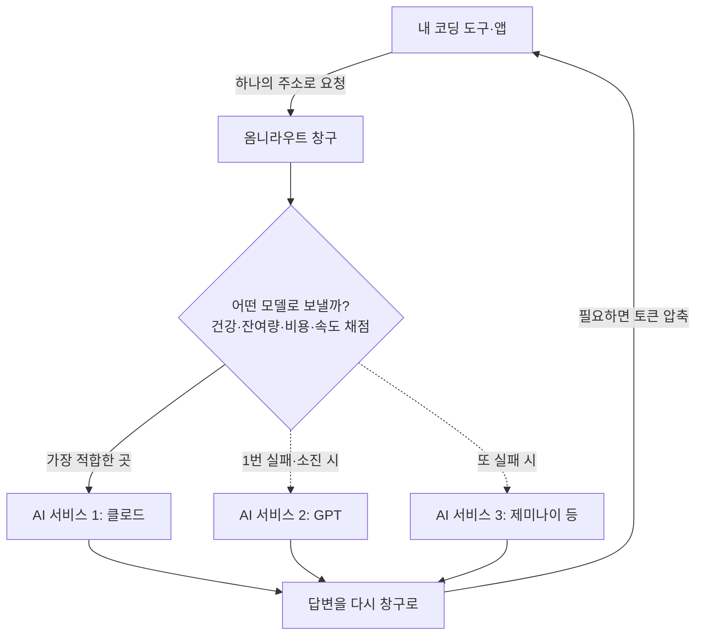

<div class="ai-knowledge-shell">

<aside class="ai-knowledge-sidebar">
  <p class="ai-eyebrow">CATEGORIES</p>
  <nav class="ai-cat-tree"><details class="ai-cat" open><summary><span class="catname">에이전트 오케스트레이션</span><span class="catcount">12</span></summary><ul><li><a href="https://altjs4510.github.io/ai_news_blog/knowledge/20260831-openexecutive-virtual-c-suite/"><span class="kdate">2026-08-31</span><span class="ktitle">Open Executive — 8명의 전문 에이전트를 하나의 임원 목소리로</span></a></li><li><a href="https://altjs4510.github.io/ai_news_blog/knowledge/20260828/"><span class="kdate">2026-08-28</span><span class="ktitle">Google ADK for Python v2.8.0 — RemoteA2aAgent 네이…</span></a></li><li><a href="https://altjs4510.github.io/ai_news_blog/knowledge/20260826/"><span class="kdate">2026-08-26</span><span class="ktitle">apache/maka — 도구 호출·권한 결정·종료 이벤트를 append-only 로그…</span></a></li><li><a href="https://altjs4510.github.io/ai_news_blog/knowledge/20260823/"><span class="kdate">2026-08-23</span><span class="ktitle">The Evolution of the Agent Harness — 하네스가 모델 가중치…</span></a></li><li><a href="https://altjs4510.github.io/ai_news_blog/knowledge/20260805/"><span class="kdate">2026-08-05</span><span class="ktitle">TencentCloud/TencentDB-Agent-Memory — 대화·문서·코드를 …</span></a></li><li><a href="https://altjs4510.github.io/ai_news_blog/knowledge/20260708/"><span class="kdate">2026-07-08</span><span class="ktitle">Expanding Managed Agents in Gemini API: backgrou…</span></a></li><li><a href="https://altjs4510.github.io/ai_news_blog/knowledge/20260707/"><span class="kdate">2026-07-07</span><span class="ktitle">AI Hero Skills Catalog — 실무 엔지니어를 위한 재사용 가능한 판단 …</span></a></li><li><a href="https://altjs4510.github.io/ai_news_blog/knowledge/20260623/"><span class="kdate">2026-06-23</span><span class="ktitle">bytedance/deer-flow — 샌드박스·메모리·서브에이전트·메시지 게이트웨이를…</span></a></li><li><a href="https://altjs4510.github.io/ai_news_blog/knowledge/20260611/"><span class="kdate">2026-06-11</span><span class="ktitle">The evolution of agentic surfaces: building with…</span></a></li><li><a href="https://altjs4510.github.io/ai_news_blog/knowledge/20260602/"><span class="kdate">2026-06-02</span><span class="ktitle">revfactory/harness — 도메인별 에이전트 팀과 스킬을 자동 설계하는 메타…</span></a></li><li><a href="https://altjs4510.github.io/ai_news_blog/knowledge/20260529/"><span class="kdate">2026-05-29</span><span class="ktitle">Introducing dynamic workflows in Claude Code</span></a></li><li><a href="https://altjs4510.github.io/ai_news_blog/knowledge/20260507/"><span class="kdate">2026-05-07</span><span class="ktitle">ruvnet/ruflo — Claude 멀티 에이전트 오케스트레이션 플랫폼</span></a></li></ul></details><details class="ai-cat" open><summary><span class="catname">MCP &amp; 도구 통합</span><span class="catcount">19</span></summary><ul><li><a href="https://altjs4510.github.io/ai_news_blog/knowledge/20260831-gitnexus-code-knowledge-graph/"><span class="kdate">2026-08-31</span><span class="ktitle">GitNexus — 코드베이스를 지식그래프로 바꿔 에이전트에게 쥐어주기</span></a></li><li><a href="https://altjs4510.github.io/ai_news_blog/knowledge/20260829/"><span class="kdate">2026-08-29</span><span class="ktitle">cursor/plugins — 플러그인 명세(specification)와 공식 플러그인…</span></a></li><li><a href="https://altjs4510.github.io/ai_news_blog/knowledge/20260802/"><span class="kdate">2026-08-02</span><span class="ktitle">Stateless MCP has recaptured my interest (and in…</span></a></li><li><a href="https://altjs4510.github.io/ai_news_blog/knowledge/20260801/"><span class="kdate">2026-08-01</span><span class="ktitle">different-ai/openwork — Claude Cowork의 오픈소스 대체 에…</span></a></li><li><a href="https://altjs4510.github.io/ai_news_blog/knowledge/20260731/"><span class="kdate">2026-07-31</span><span class="ktitle">different-ai/openwork — Claude Cowork의 오픈소스 대안(o…</span></a></li><li><a href="https://altjs4510.github.io/ai_news_blog/knowledge/20260729/"><span class="kdate">2026-07-29</span><span class="ktitle">Bringing MCP 2026-07-28 to Claude</span></a></li><li><a href="https://altjs4510.github.io/ai_news_blog/knowledge/20260722/"><span class="kdate">2026-07-22</span><span class="ktitle">tirth8205/code-review-graph — MCP·CLI용 로컬 우선 코드 …</span></a></li><li><a href="https://altjs4510.github.io/ai_news_blog/knowledge/20260721/"><span class="kdate">2026-07-21</span><span class="ktitle">tirth8205/code-review-graph — 로컬 우선 코드 인텔리전스 그래프…</span></a></li><li><a href="https://altjs4510.github.io/ai_news_blog/knowledge/20260719/"><span class="kdate">2026-07-19</span><span class="ktitle">tirth8205/code-review-graph — 로컬 우선 코드 인텔리전스 그래프…</span></a></li><li><a href="https://altjs4510.github.io/ai_news_blog/knowledge/20260718/"><span class="kdate">2026-07-18</span><span class="ktitle">tirth8205/code-review-graph — MCP·CLI용 로컬 코드 인텔리…</span></a></li><li><a href="https://altjs4510.github.io/ai_news_blog/knowledge/20260709/"><span class="kdate">2026-07-09</span><span class="ktitle">mvanhorn/last30days-skill — Reddit·X·YouTube·HN·…</span></a></li><li><a href="https://altjs4510.github.io/ai_news_blog/knowledge/20260618/"><span class="kdate">2026-06-18</span><span class="ktitle">DeusData/codebase-memory-mcp — 158개 언어 코드베이스를 밀리…</span></a></li><li><a href="https://altjs4510.github.io/ai_news_blog/knowledge/20260606/"><span class="kdate">2026-06-06</span><span class="ktitle">chopratejas/headroom — Compress tool outputs, lo…</span></a></li><li><a href="https://altjs4510.github.io/ai_news_blog/knowledge/20260605/"><span class="kdate">2026-06-05</span><span class="ktitle">chopratejas/headroom — Compress tool outputs, lo…</span></a></li><li><a href="https://altjs4510.github.io/ai_news_blog/knowledge/20260604/"><span class="kdate">2026-06-04</span><span class="ktitle">chopratejas/headroom — Compress tool outputs bef…</span></a></li><li><a href="https://altjs4510.github.io/ai_news_blog/knowledge/20260603/"><span class="kdate">2026-06-03</span><span class="ktitle">How Bad MCP design cost your Agent 5× more token…</span></a></li><li><a href="https://altjs4510.github.io/ai_news_blog/knowledge/20260523/"><span class="kdate">2026-05-23</span><span class="ktitle">colbymchenry/codegraph — 사전 인덱싱된 코드 지식 그래프 MCP</span></a></li><li><a href="https://altjs4510.github.io/ai_news_blog/knowledge/20260517/"><span class="kdate">2026-05-17</span><span class="ktitle">I gave my LLM 100,000+ tools — Lazy Discovery &a…</span></a></li><li><a href="https://altjs4510.github.io/ai_news_blog/knowledge/20260509/"><span class="kdate">2026-05-09</span><span class="ktitle">How to connect 100 MCP servers without the conte…</span></a></li></ul></details><details class="ai-cat" open><summary><span class="catname">코딩 에이전트</span><span class="catcount">26</span></summary><ul><li><a href="https://altjs4510.github.io/ai_news_blog/knowledge/20260901/"><span class="kdate">2026-09-01</span><span class="ktitle">affaan-m/ECC — 스킬·본능·메모리·보안을 묶은 에이전트 하네스 성능 최적화 …</span></a></li><li><a href="https://altjs4510.github.io/ai_news_blog/knowledge/20260822/"><span class="kdate">2026-08-22</span><span class="ktitle">mattpocock/skills — Skills for Real Engineers (하…</span></a></li><li><a href="https://altjs4510.github.io/ai_news_blog/knowledge/20260820/"><span class="kdate">2026-08-20</span><span class="ktitle">akitaonrails/ai-memory — 코딩 에이전트 CLI의 장기 메모리와 벤더…</span></a></li><li><a href="https://altjs4510.github.io/ai_news_blog/knowledge/20260819/"><span class="kdate">2026-08-19</span><span class="ktitle">akitaonrails/ai-memory — 코딩 에이전트 CLI 간 장기 기억과 벤더…</span></a></li><li><a href="https://altjs4510.github.io/ai_news_blog/knowledge/20260814/"><span class="kdate">2026-08-14</span><span class="ktitle">cathrynlavery/diagram-design — Claude Code용 에디토리…</span></a></li><li><a href="https://altjs4510.github.io/ai_news_blog/knowledge/20260811/"><span class="kdate">2026-08-11</span><span class="ktitle">PrimeIntellect-ai/prime-agent — 장기 자율 실행을 전제로 설계…</span></a></li><li><a href="https://altjs4510.github.io/ai_news_blog/knowledge/20260810/"><span class="kdate">2026-08-10</span><span class="ktitle">Auto mode is now the default in Claude Code for …</span></a></li><li><a href="https://altjs4510.github.io/ai_news_blog/knowledge/20260809/"><span class="kdate">2026-08-09</span><span class="ktitle">PrimeIntellect-ai/prime-agent — 코딩 워크플로우·장기 자율 작…</span></a></li><li><a href="https://altjs4510.github.io/ai_news_blog/knowledge/20260808/"><span class="kdate">2026-08-08</span><span class="ktitle">PrimeIntellect-ai/prime-agent — 코딩 워크플로우와 장시간 자율…</span></a></li><li><a href="https://altjs4510.github.io/ai_news_blog/knowledge/20260804/"><span class="kdate">2026-08-04</span><span class="ktitle">esengine/DeepSeek-Reasonix — prefix-cache 안정성을 축…</span></a></li><li><a href="https://altjs4510.github.io/ai_news_blog/knowledge/20260728/"><span class="kdate">2026-07-28</span><span class="ktitle">alibaba/open-code-review — 결정론적 파이프라인 + LLM 에이전트…</span></a></li><li><a href="https://altjs4510.github.io/ai_news_blog/knowledge/20260725/"><span class="kdate">2026-07-25</span><span class="ktitle">The new rules of context engineering for Claude …</span></a></li><li><a href="https://altjs4510.github.io/ai_news_blog/knowledge/20260714/"><span class="kdate">2026-07-14</span><span class="ktitle">Graphify-Labs/graphify — 코드베이스를 질의 가능한 지식 그래프로 만…</span></a></li><li><a href="https://altjs4510.github.io/ai_news_blog/knowledge/20260705/"><span class="kdate">2026-07-05</span><span class="ktitle">openai/codex-plugin-cc — Claude Code에서 Codex를 위임…</span></a></li><li><a href="https://altjs4510.github.io/ai_news_blog/knowledge/20260626/"><span class="kdate">2026-06-26</span><span class="ktitle">google-labs-code/design.md — 코딩 에이전트에게 디자인 시스템을 …</span></a></li><li><a href="https://altjs4510.github.io/ai_news_blog/knowledge/20260619/"><span class="kdate">2026-06-19</span><span class="ktitle">Claude Code now supports artifacts</span></a></li><li><a href="https://altjs4510.github.io/ai_news_blog/knowledge/20260530/"><span class="kdate">2026-05-30</span><span class="ktitle">Leonxlnx/taste-skill — AI에게 좋은 취향을 부여해 generic s…</span></a></li><li><a href="https://altjs4510.github.io/ai_news_blog/knowledge/20260528/"><span class="kdate">2026-05-28</span><span class="ktitle">Building self-improving tax agents with Codex</span></a></li><li><a href="https://altjs4510.github.io/ai_news_blog/knowledge/20260526/"><span class="kdate">2026-05-26</span><span class="ktitle">colbymchenry/codegraph — Pre-indexed code knowle…</span></a></li><li><a href="https://altjs4510.github.io/ai_news_blog/knowledge/20260524/"><span class="kdate">2026-05-24</span><span class="ktitle">colbymchenry/codegraph — Pre-indexed code knowle…</span></a></li><li><a href="https://altjs4510.github.io/ai_news_blog/knowledge/20260521/"><span class="kdate">2026-05-21</span><span class="ktitle">colbymchenry/codegraph — Pre-indexed code knowle…</span></a></li><li><a href="https://altjs4510.github.io/ai_news_blog/knowledge/20260512/"><span class="kdate">2026-05-12</span><span class="ktitle">agentmemory — Persistent memory for AI coding ag…</span></a></li><li><a href="https://altjs4510.github.io/ai_news_blog/knowledge/20260510/"><span class="kdate">2026-05-10</span><span class="ktitle">addyosmani/agent-skills — Production-grade engin…</span></a></li><li><a href="https://altjs4510.github.io/ai_news_blog/knowledge/20260508/"><span class="kdate">2026-05-08</span><span class="ktitle">addyosmani/agent-skills — Production-grade engin…</span></a></li><li><a href="https://altjs4510.github.io/ai_news_blog/knowledge/20260506/"><span class="kdate">2026-05-06</span><span class="ktitle">mksglu/context-mode — AI 코딩 에이전트용 컨텍스트 윈도우 최적화</span></a></li><li><a href="https://altjs4510.github.io/ai_news_blog/knowledge/20260505/"><span class="kdate">2026-05-05</span><span class="ktitle">mattpocock/skills — Skills for Real Engineers (.…</span></a></li></ul></details><details class="ai-cat" open><summary><span class="catname">모델 &amp; 연구</span><span class="catcount">6</span></summary><ul><li><a href="https://altjs4510.github.io/ai_news_blog/knowledge/20260821/"><span class="kdate">2026-08-21</span><span class="ktitle">volcengine/OpenViking — 에이전트 메모리·Knowledge RAG·스…</span></a></li><li><a href="https://altjs4510.github.io/ai_news_blog/knowledge/20260716-proprag/"><span class="kdate">2026-07-16</span><span class="ktitle">PropRAG — 프로포지션 경로 위 beam search로 멀티홉 검색 안내</span></a></li><li><a href="https://altjs4510.github.io/ai_news_blog/knowledge/20260620/"><span class="kdate">2026-06-20</span><span class="ktitle">zai-org/GLM-5 — From Vibe Coding to Agentic Engi…</span></a></li><li><a href="https://altjs4510.github.io/ai_news_blog/knowledge/20260617/"><span class="kdate">2026-06-17</span><span class="ktitle">Predicting model behavior before release by simu…</span></a></li><li><a href="https://altjs4510.github.io/ai_news_blog/knowledge/20260516/"><span class="kdate">2026-05-16</span><span class="ktitle">STALE — 에이전트가 자기 기억의 유효성을 인지할 수 있는가</span></a></li><li><a href="https://altjs4510.github.io/ai_news_blog/knowledge/20260513/"><span class="kdate">2026-05-13</span><span class="ktitle">Thinking Machines' Native Interaction Models — T…</span></a></li></ul></details><details class="ai-cat" open><summary><span class="catname">인프라 &amp; 컴퓨트</span><span class="catcount">7</span></summary><ul><li><a href="https://altjs4510.github.io/ai_news_blog/knowledge/20260813/"><span class="kdate">2026-08-13</span><span class="ktitle">semantica-agi/semantica — 컨텍스트와 책임 추적을 위한 그래프 네이…</span></a></li><li><a href="https://altjs4510.github.io/ai_news_blog/knowledge/20260812/"><span class="kdate">2026-08-12</span><span class="ktitle">semantica-agi/semantica — 컨텍스트와 '책임 추적 가능한(accou…</span></a></li><li><a href="https://altjs4510.github.io/ai_news_blog/knowledge/20260806/"><span class="kdate">2026-08-06</span><span class="ktitle">cloudflare/computer — 에이전트에게 컴퓨터를 통째로 주는 엣지 실행 샌…</span></a></li><li><a href="https://altjs4510.github.io/ai_news_blog/knowledge/20260724/" class="current"><span class="kdate">2026-07-24</span><span class="ktitle">diegosouzapw/OmniRoute — 단일 엔드포인트로 278+ 프로바이더·50…</span></a></li><li><a href="https://altjs4510.github.io/ai_news_blog/knowledge/20260723/"><span class="kdate">2026-07-23</span><span class="ktitle">diegosouzapw/OmniRoute — 268+ 프로바이더를 단일 엔드포인트로 묶…</span></a></li><li><a href="https://altjs4510.github.io/ai_news_blog/knowledge/20260522/"><span class="kdate">2026-05-22</span><span class="ktitle">Giving Agents Computers — Ivan Burazin, Daytona</span></a></li><li><a href="https://altjs4510.github.io/ai_news_blog/knowledge/20260520/"><span class="kdate">2026-05-20</span><span class="ktitle">New in Claude Managed Agents: self-hosted sandbo…</span></a></li></ul></details><details class="ai-cat" open><summary><span class="catname">보안 &amp; 거버넌스</span><span class="catcount">18</span></summary><ul><li><a href="https://altjs4510.github.io/ai_news_blog/knowledge/20260902/"><span class="kdate">2026-09-02</span><span class="ktitle">AIR raises $50M to help companies vet the skills…</span></a></li><li><a href="https://altjs4510.github.io/ai_news_blog/knowledge/20260827/"><span class="kdate">2026-08-27</span><span class="ktitle">Claude in Chrome is generally available</span></a></li><li><a href="https://altjs4510.github.io/ai_news_blog/knowledge/20260819-mind-viruses/"><span class="kdate">2026-08-19</span><span class="ktitle">탈옥도, 인젝션도 없이 — 대화로만 퍼지는 에이전트의 '마인드 바이러스'</span></a></li><li><a href="https://altjs4510.github.io/ai_news_blog/knowledge/20260730/"><span class="kdate">2026-07-30</span><span class="ktitle">Anatomy of a Frontier Lab Agent Intrusion: A Tec…</span></a></li><li><a href="https://altjs4510.github.io/ai_news_blog/knowledge/20260716/"><span class="kdate">2026-07-16</span><span class="ktitle">Dicklesworthstone/destructive_command_guard — 에이…</span></a></li><li><a href="https://altjs4510.github.io/ai_news_blog/knowledge/20260715/"><span class="kdate">2026-07-15</span><span class="ktitle">Dicklesworthstone/destructive_command_guard — 에이…</span></a></li><li><a href="https://altjs4510.github.io/ai_news_blog/knowledge/20260710/"><span class="kdate">2026-07-10</span><span class="ktitle">70개 MCP 서버 strace 런타임 감사 — 부팅 시 아웃바운드 호출 서버 적발</span></a></li><li><a href="https://altjs4510.github.io/ai_news_blog/knowledge/20260704/"><span class="kdate">2026-07-04</span><span class="ktitle">Cloudflare is about to block AI agents by defaul…</span></a></li><li><a href="https://altjs4510.github.io/ai_news_blog/knowledge/20260703/"><span class="kdate">2026-07-03</span><span class="ktitle">Giving admins more visibility and control over C…</span></a></li><li><a href="https://altjs4510.github.io/ai_news_blog/knowledge/20260630/"><span class="kdate">2026-06-30</span><span class="ktitle">Introducing the Claude apps gateway for Amazon B…</span></a></li><li><a href="https://altjs4510.github.io/ai_news_blog/knowledge/20260625/"><span class="kdate">2026-06-25</span><span class="ktitle">Agent identity in Claude Tag: a new access model…</span></a></li><li><a href="https://altjs4510.github.io/ai_news_blog/knowledge/20260624/"><span class="kdate">2026-06-24</span><span class="ktitle">Agent identity in Claude Tag: a new access model…</span></a></li><li><a href="https://altjs4510.github.io/ai_news_blog/knowledge/20260614/"><span class="kdate">2026-06-14</span><span class="ktitle">NVIDIA/SkillSpector — Security scanner for AI ag…</span></a></li><li><a href="https://altjs4510.github.io/ai_news_blog/knowledge/20260613/"><span class="kdate">2026-06-13</span><span class="ktitle">Fable 5's guardrails got bypassed in 48 hours — …</span></a></li><li><a href="https://altjs4510.github.io/ai_news_blog/knowledge/20260612/"><span class="kdate">2026-06-12</span><span class="ktitle">NVIDIA/SkillSpector — AI 에이전트 스킬용 보안 스캐너</span></a></li><li><a href="https://altjs4510.github.io/ai_news_blog/knowledge/20260607/"><span class="kdate">2026-06-07</span><span class="ktitle">OpenAI Help: Lockdown Mode</span></a></li><li><a href="https://altjs4510.github.io/ai_news_blog/knowledge/20260531/"><span class="kdate">2026-05-31</span><span class="ktitle">How we contain Claude across products</span></a></li><li><a href="https://altjs4510.github.io/ai_news_blog/knowledge/20260527/"><span class="kdate">2026-05-27</span><span class="ktitle">Microsoft Copilot Cowork Exfiltrates Files</span></a></li></ul></details><details class="ai-cat" open><summary><span class="catname">응용 사례</span><span class="catcount">7</span></summary><ul><li><a href="https://altjs4510.github.io/ai_news_blog/knowledge/20260726/"><span class="kdate">2026-07-26</span><span class="ktitle">citrolabs/ego-lite — 로그인된 브라우저 상태를 AI 에이전트와 공유하는…</span></a></li><li><a href="https://altjs4510.github.io/ai_news_blog/knowledge/20260717/"><span class="kdate">2026-07-17</span><span class="ktitle">After a year building agent memory, 'save everyt…</span></a></li><li><a href="https://altjs4510.github.io/ai_news_blog/knowledge/20260712/"><span class="kdate">2026-07-12</span><span class="ktitle">Do Automated Evals Work?</span></a></li><li><a href="https://altjs4510.github.io/ai_news_blog/knowledge/20260621/"><span class="kdate">2026-06-21</span><span class="ktitle">calesthio/OpenMontage — 12 파이프라인·52 도구·500+ 스킬을 …</span></a></li><li><a href="https://altjs4510.github.io/ai_news_blog/knowledge/20260609/"><span class="kdate">2026-06-09</span><span class="ktitle">Building intelligent apps for Apple platforms wi…</span></a></li><li><a href="https://altjs4510.github.io/ai_news_blog/knowledge/20260515/"><span class="kdate">2026-05-15</span><span class="ktitle">Clawdmeter — Claude Code 사용량을 데스크톱 대시보드로</span></a></li><li><a href="https://altjs4510.github.io/ai_news_blog/knowledge/20260514/"><span class="kdate">2026-05-14</span><span class="ktitle">Introducing Claude for Small Business</span></a></li></ul></details><details class="ai-cat" open><summary><span class="catname">산업 동향</span><span class="catcount">8</span></summary><ul><li><a href="https://altjs4510.github.io/ai_news_blog/knowledge/20260830/"><span class="kdate">2026-08-30</span><span class="ktitle">[AINews] OpenAI shuts off Cursor — 프론티어 모델 공급 차단…</span></a></li><li><a href="https://altjs4510.github.io/ai_news_blog/knowledge/20260711/"><span class="kdate">2026-07-11</span><span class="ktitle">OpenAI says GPT 5.6 is the 'preferred model' for…</span></a></li><li><a href="https://altjs4510.github.io/ai_news_blog/knowledge/20260702/"><span class="kdate">2026-07-02</span><span class="ktitle">How Cursor deploys AI inside the enterprise (For…</span></a></li><li><a href="https://altjs4510.github.io/ai_news_blog/knowledge/20260701/"><span class="kdate">2026-07-01</span><span class="ktitle">Google OKF (Open Knowledge Format) — 벤더 중립 에이전트 …</span></a></li><li><a href="https://altjs4510.github.io/ai_news_blog/knowledge/20260616/"><span class="kdate">2026-06-16</span><span class="ktitle">Why AI hasn't replaced software engineers, and w…</span></a></li><li><a href="https://altjs4510.github.io/ai_news_blog/knowledge/20260610/"><span class="kdate">2026-06-10</span><span class="ktitle">Fable 5 just made cost-aware model routing manda…</span></a></li><li><a href="https://altjs4510.github.io/ai_news_blog/knowledge/20260519/"><span class="kdate">2026-05-19</span><span class="ktitle">Anthropic acquires Stainless</span></a></li><li><a href="https://altjs4510.github.io/ai_news_blog/knowledge/20260504/"><span class="kdate">2026-05-04</span><span class="ktitle">Agents for Everything Else: Codex for Knowledge …</span></a></li></ul></details></nav>
</aside>

<article class="ai-knowledge-article">

<header class="ai-post-hero">
  <p class="ai-eyebrow"><a class="ai-back" href="../">KNOWLEDGE</a> · 2026-07-24 · 오늘의 학습</p>
  <h2 class="ai-post-title">diegosouzapw/OmniRoute — 단일 엔드포인트로 278+ 프로바이더·500+ 모델을 잇는 쿼터 인식 AI 게이트웨이</h2>
</header>

> 원문: [diegosouzapw/OmniRoute — 단일 엔드포인트로 278+ 프로바이더·500+ 모델을 잇는 쿼터 인식 AI 게이트웨이](https://github.com/diegosouzapw/OmniRoute)

## 📌 학습 정리

### 1. 한 줄로 말하면

수십 개의 인공지능(AI) 서비스를 일일이 따로 연결하지 않고, 콘센트 하나에 여러 기기를 꽂듯 **딱 하나의 주소로 500개 넘는 AI 모델을 골라 쓰게 해주는 무료 중계소**예요.

### 2. 왜 이게 만들어졌어요?

요즘은 클로드, GPT, 제미나이처럼 쓸 만한 AI가 정말 많아졌는데, 저마다 무료로 주는 사용량(무료 티어, free tier)이 조금씩 달라요. 문제는 이걸 손으로 다 챙기려면 서비스마다 연결 코드(SDK)를 따로 깔아야 하고, 각각 "이건 시간당 몇 번까지 무료" 같은 제한(rate limit)이 제각각이라 지금 내가 얼마나 쓸 수 있는지도 감이 안 온다는 거예요. 게다가 한 서비스의 무료량을 다 쓰면 그때부터는 직접 다른 서비스로 갈아타는 코드를 짜야 하죠. OmniRoute는 "이 귀찮은 걸 중간에서 대신 관리해주는 창구가 하나 있으면 어떨까"라는 발상에서 나온 도구예요. 그래서 여러 서비스의 무료 사용량을 다 합쳐 "지금 쓸 수 있는 양"을 한 숫자로 보여주고, 하나가 바닥나면 알아서 다음 걸로 넘겨줍니다.

### 3. 비유로 풀면

이건 마치 **여러 통신사의 데이터를 자동으로 갈아 끼워주는 하나의 유심(USIM)** 같은 거예요. 어느 통신사 신호가 끊기거나 데이터를 다 쓰면, 티 안 나게 다음 통신사로 넘어가 계속 인터넷이 되는 것처럼요.

또는 **여러 은행 계좌를 하나의 앱에서 관리하는 통합 지갑**에 가깝기도 해요. 각 계좌(AI 서비스)의 잔액(남은 무료 사용량)을 한눈에 보여주고, 결제할 때 잔액이 넉넉한 계좌로 알아서 빼주는 거죠.

그래서 결국, 사용자는 "어떤 AI를 쓸지" 매번 고민하지 않고 창구 하나에만 말을 걸면 되고, 뒤에서 최적의 선택과 갈아타기는 OmniRoute가 대신 처리해줘요.

### 4. 어떻게 작동하는지 (그림으로)



핵심은 내 도구가 항상 **한 곳(`http://localhost:20128/v1`)**에만 말을 건다는 점이에요. 창구는 요청이 들어오면 여러 후보 모델을 건강 상태·남은 사용량·비용·속도 같은 여러 기준으로 점수 매겨 가장 나은 곳으로 보내고, 만약 그곳이 실패하거나 무료량이 떨어지면 조용히 다음 후보로 넘겨줍니다. 돌아온 답변은 다시 사용자에게 전달되는데, 이 과정에서 오가는 텍스트의 양(토큰)을 자동으로 줄여 비용을 아끼기도 해요.

### 5. 처음 보는 용어 풀이

- **게이트웨이 (gateway)** — 여러 AI 서비스로 가는 요청을 한 군데서 받아 알맞은 곳으로 나눠 보내주는 중계 창구예요. 사용자는 뒤에 서비스가 몇 개든 이 창구 하나만 상대하면 됩니다.

- **무료 티어 (free tier)** — 각 AI 서비스가 "여기까지는 공짜로 써도 돼요"라고 열어둔 사용 한도예요. OmniRoute는 여러 서비스의 이 한도를 다 합쳐 한 달에 쓸 수 있는 양을 하나의 숫자로 보여줘요.

- **폴백 (fallback)** — 원래 쓰려던 모델이 실패하거나 사용량이 바닥났을 때 자동으로 다른 모델로 넘어가는 안전장치예요. 덕분에 서비스가 중간에 끊기지 않아요.

- **콤보 (combo)와 자동 라우팅 (auto routing)** — '콤보'는 여러 모델을 줄 세워 둔 대기 목록이고, 'auto'로 지정하면 지금 상태가 가장 좋은 모델을 창구가 알아서 골라줘요. "코딩 위주(coding)", "가장 저렴하게(cheap)", "가장 빠르게(fast)"처럼 목적별로 고를 수도 있어요.

- **토큰 압축 (token compression)** — AI에 보내는 글에서 뜻은 그대로 두되 불필요한 표현을 줄여 분량(토큰)을 아끼는 기능이에요. 예를 들어 긴 설명 문장을 핵심만 남겨 70%가량 짧게 만들면, 같은 답을 받으면서도 비용이 줄어들어요.

- **엠시피 서버 (MCP, Model Context Protocol)** — AI 에이전트(스스로 도구를 쓰며 일하는 AI)가 이 창구의 기능을 직접 조작할 수 있게 열어주는 표준 연결 방식이에요. 사람이 클릭하지 않아도 AI가 알아서 모델을 고르고 설정을 바꿀 수 있게 해줘요.

- **쿼터 공유 (Quota-Share)** — 하나의 유료 계정을 팀이 여러 열쇠(키)로 나눠 쓸 때, 한 사람이 사용량을 몽땅 써버려 다른 사람이 막히는 일이 없도록 몫을 공평하게 나눠주는 기능이에요. 남는 몫은 다른 사람에게 빌려줘 낭비도 줄여요.

### 6. 한 발 더 들어가고 싶다면

- [OmniRoute 깃허브 저장소](https://github.com/diegosouzapw/OmniRoute) — 설치 방법부터 전체 기능까지, 이 도구의 모든 원본 설명을 볼 수 있어요.
- [다른 라우터(LiteLLM·OpenRouter·Portkey)와의 비교 문서](https://github.com/diegosouzapw/OmniRoute) 안의 `docs/comparison/OMNIROUTE_VS_ALTERNATIVES.md` — 비슷한 도구들과 뭐가 다른지 항목별로 비교해 놓았어요.
- 저장소 안의 `docs/routing/AUTO-COMBO.md` — 창구가 모델을 고를 때 쓰는 12가지 채점 기준이 어떻게 작동하는지 자세히 알 수 있어요.
- 저장소 안의 `docs/reference/FREE_TIERS.md` — "한 달 무료 사용량" 숫자를 어떤 방식으로 계산하는지 그 근거를 설명해 둔 문서예요.

---

## 📖 원문 전체 번역 (정독용)

> 의역 최소화한 전체 번역입니다. 큰 흐름은 위 정리에서 잡고, 정확한 워딩이 필요할 땐 이 섹션에서 정독하세요.

# 🚀 OmniRoute — 무료 AI 게이트웨이

## 💰 월 약 1.53B 무료 토큰

무료 티어를 손수 쌓는 것은 고통스럽습니다 — 수십 개의 SDK, 수십 개의 요청 제한, 그리고 실제로 얼마나 남았는지 알 방법이 없습니다. OmniRoute는 **43개 프로바이더 풀 / 460개 이상의 모델**의 문서화된 무료 티어를 하나의 정직한 숫자로 집계하여 대시보드(`/dashboard/free-tiers`)에서 실시간으로 보여줍니다.

실시간 `/dashboard/free-tiers` 페이지의 애니메이션 요약. 전체 방법론(풀 중복제거, 크레딧 티어, 프로바이더 약관): `docs/reference/FREE_TIERS.md`.

이 수치들은 2주마다 실시간 카탈로그를 기준으로 재감사되며 **양방향으로 움직입니다** — 어떤 프로바이더가 무료 티어를 종료하면 숫자가 내려가고, 새로운 것이 추가되면 올라갑니다. 우리는 카탈로그가 실제로 계산해 낸 것을 게시할 뿐, 반올림된 최선의 시나리오를 게시하지 않습니다. CI 게이트(`check:docs-counts`)는 이 헤드라인 숫자가 코드와 어긋나면 빌드를 실패시킵니다.

⭐ OMNIROUTE가 비용을 절감하고 작업을 더 쉽게 만드는 데 도움이 되었다면 저장소에 스타를 눌러주세요.

## 💬 커뮤니티에 참여하기

질문, 프로바이더 팁, 로드맵 및 지원 → Discord · Telegram · WhatsApp

🌍 Global / 🇧🇷 Brasil

🧩 사용 가능 항목: 🚀 빠른 시작 • 🎯 콤보 • 🌐 프로바이더 • 🔌 CLI & MCP • 🗜️ 압축 • 🌍 웹사이트

💥 약속 • 🤔 왜 • 🏆 차별점 • 🤖 호환 CLI • 🖥️ 실행 위치 • 🔒 프라이버시 • 🎬 실제 동작 • 📸 스크린샷 • 📧 지원

🌐 43개 언어 지원

## 🆓 설치하는 즉시 동작 — 키도, 설정도 필요 없음

설치 → 도구를 엔드포인트로 지정 → 이미 응답합니다.

OmniRoute는 키가 필요 없는 무료 프로바이더(OpenCode Free, Felo)가 `auto` 콤보에 이미 연결된 채로 제공되므로, **신규 설치 시 바로 응답**합니다 — API 키도, 가입도, 설정도 필요 없습니다.

```
# Fresh install, zero credentials — `auto` already works:
curl http://localhost:20128/v1/chat/completions \
  -H "Content-Type: application/json" \
  -d '{"model":"auto","messages":[{"role":"user","content":"Hello!"}]}'
```

✅ `auto`는 **즉시 응답합니다** — OmniRoute는 내장된 키 불필요 무료 프로바이더들로부터 가상 콤보를 구성하고, 설정 없이 정상 작동 중인 것으로 라우팅합니다.

➕ **언제든 프로바이더 추가** — 대시보드에서 Claude / GPT / Gemini 키(또는 290개 프로바이더 중 아무거나)를 넣으면 자동으로 `auto` 풀에 합류합니다.

🎛️ **나만의 무료 콤보 구성** — 19가지 라우팅 전략 중 아무것과나 무료 티어들을 연결해 쿼터가 절대 바닥나지 않게 할 수 있습니다.

특정 무료 백엔드를 선호하시나요? `oc/…`(OpenCode Free)나 `felo/…`(Felo)처럼 직접 호출하세요. 그런 다음 `auto`로 승격시켜 OmniRoute가 선택하게 하세요.

## 💥 약속

## 🤔 왜 OmniRoute인가?

## 🤝 오픈소스 프렌즈의 후원

오픈소스 프렌즈로 참여하고 싶으신가요?

이들은 오픈소스를 후원하고 OmniRoute가 계속 움직이도록 돕는 회사들입니다 — 그리고 그들이 제공하는 모든 토큰이 어디로 가는지 공개적으로 밝힙니다. 연락처: diegosouza.pw@outlook.com

**Kimi (Moonshot AI)**

창립 오픈소스 프렌즈인 **Kimi (Moonshot AI)**에 이 프로젝트를 후원해 주셔서 감사드립니다! Kimi는 오픈 웨이트 K2 및 K3 모델 패밀리 뒤에 있는 AI 랩입니다 — **Kimi K3**는 100만 토큰 컨텍스트 윈도우, 네이티브 비전, 폐쇄형 모델 대비 훨씬 저렴한 가격으로 프론티어급 코딩 성능을 제공하며, Claude Code, Codex 및 OmniRoute가 서비스하는 모든 코딩 도구와 즉시 호환됩니다.

Kimi의 후원이 지원하는 것: Kimi의 API 크레딧은 OmniRoute의 AI 검증 릴리스 파이프라인 — 모든 풀 리퀘스트가 배포되기 전에 검토하는 **Kimi K3 기반 병합 검증** 단계 — 와 일상적인 기능 개발에 사용됩니다. Kimi에 대한 최고 수준의 지원은 두 경로 모두에서 제공됩니다: 직접 **Kimi API**(`kimi-k3`)와 **Kimi Code 코딩 플랜**(OAuth 및 API 키). OmniRoute는 또한 Kimi의 지원 프로그램에 참여한 최초의 브라질 오픈소스 프로젝트입니다.

Kimi API 키 받기 →

`aff=omniroute` 태그가 붙은 링크는 파트너 링크입니다. 사용자에게 추가 비용 없이 프로젝트에 자금을 지원합니다.

## 🎯 콤보 — 대표 기능

**콤보**는 OmniRoute가 **자동으로** 라우팅하는 모델들의 체인입니다. 쿼터가 소진되거나, 프로바이더가 실패하거나, 비용이 급등하면 — 콤보는 조용히 다음 모델로 넘어갑니다. 이것이 OmniRoute를 무너지지 않게 만드는 핵심입니다. 🛡️

### ⚡ 제로 설정 — 그냥 `auto` 사용

콤보를 만들 필요가 없습니다. 모델을 `auto`(또는 변형)로 설정하면 OmniRoute가 연결된 프로바이더들로부터 가상 콤보를 구성하고, 실시간으로 점수를 매깁니다:

| 모델 ID | 최적화 대상 |
|---|---|
| `auto` | 🎯 균형 잡힌 기본값 (LKGP — 마지막으로 정상 작동한 프로바이더를 고수) |
| `auto/coding` | 🧑‍💻 코드 생성을 위한 품질 우선 가중치 |
| `auto/fast` | ⚡ 최저 지연시간 우선 |
| `auto/cheap` | 💰 토큰당 최저 비용 우선 |
| `auto/offline` | 🔋 쿼터/요청 제한 여유가 가장 많은 것 우선 |
| `auto/smart` | 🔭 품질 우선 + 10% 탐색으로 더 나은 모델 발견 |

### 🔀 또는 직접 구성 — 19가지 라우팅 전략

19가지 전략 모두 — 콤보 단계별로 자유롭게 조합:

| # | 전략 | 동작 |
|---|---|---|
| 1 | priority | 첫 번째 타겟부터 순서대로 — 각각을 다 쓴 후 다음으로 🥇 |
| 2 | fill-first | 다음으로 넘어가기 전에 각 타겟의 쿼터를 완전히 채움 |
| 3 | weighted | 타겟별 가중치에 따른 가중 무작위 |
| 4 | round-robin | 순서대로 타겟을 순환 |
| 5 | p2c | 파워-오브-투-초이스 무작위 부하 분산 |
| 6 | least-used | 현재 부하가 가장 낮은 타겟 선택 |
| 7 | random | 균등 무작위 선택(중복 제거) |
| 8 | strict-random | 중복을 제거하지 않는 무작위 🎲 |
| 9 | cost-optimized | 실시간 카탈로그 가격 기준 요청당 $ 최소화 💸 |
| 10 | headroom | 남은 쿼터가 가장 많은 타겟 선택 |
| 11 | reset-window | 쿼터 윈도우가 가장 빨리 리셋되는 타겟 우선 |
| 12 | reset-aware | 쿼터 리셋 시간 기준 순위 — 짧은 윈도우 우선 📊 |
| 13 | context-relay | 긴 대화를 위해 타겟 간 컨텍스트 인계 🧠 |
| 14 | context-optimized | 현재 컨텍스트 크기에 가장 잘 맞는 것 선택 |
| 15 | cache-optimized | 재사용 가능한 프롬프트 프리픽스를 동일 계정에 고정 — 프롬프트 캐시 적중 극대화 🎯 |
| 16 | lkgp | 마지막 성공 경로(Last-Known-Good Path) — 마지막으로 성공한 타겟에 고정 |
| 17 | auto | 모든 연결에 대한 12요소 실시간 스코어링 🤖 |
| 18 | fusion | 여러 모델 패널로 분산 실행 + 심사자가 하나의 답으로 종합 🧬 |
| 19 | pipeline | 단계 체인 — 각 타겟의 출력이 다음 단계로 전달 🔗 |

Auto-Combo 엔진은 모든 후보를 **12가지 요소**(상태, 쿼터, 비용, 지연시간, 성공률, 신선도 등)로 채점합니다 — `docs/routing/AUTO-COMBO.md` 참조.

### ⚖️ 쿼터 공유(Quota-Share) — 하나의 구독을 팀 전체에 분배 ✨ NEW

**동일한 상위 계정**에 대해 여러 키를 운영하고 있나요(Codex Pro 플랜 하나, Kimi 키 하나, GLM Coding 좌석 하나)? 한 키에서의 버스트가 5시간/시간당 쿼터 전체를 소진시켜 다른 모든 사람을 잠글 수 있습니다.

**Quota-Share**는 프로바이더의 시간 기반 쿼터를 풀 내 키들에 **공정하게** 분배합니다 — 그리고 **워크-컨서빙(work-conserving)** 방식이라, 유휴 멤버의 몫이 낭비되지 않고 대여됩니다.

| 노브 | 제어하는 것 |
|---|---|
| ⚖️ 할당 가중치 | 각 키의 풀 분배 몫 — 예: 50 / 30 / 20 |
| 📐 차원 | % · 요청 수 · 토큰 · $, 5시간/7일/모델별 윈도우 기준 추적 |
| 🚦 정책 | hard(할당 초과 시 차단) · soft(우선순위 하향) · burst(유휴 여유분 사용) |
| 🧱 상한(Cap) | 모드와 무관한 키별 절대 상한 |

핫 패스에서 요청이 OmniRoute를 벗어나기 **전에** 강제 적용되며, (키, 모델)별 상한과 프롬프트 캐시 무결성을 위한 세션 고정(sticky) 기능이 있습니다(이제 콤보별/전역 비활성화 토글도 제공). 📖 Quota Sharing Engine

### 🧱 복원력이 내장되어 있음(3개의 독립 레이어)

📖 Auto-Combo Engine · Resilience Guide

## 🏆 OmniRoute의 차별점

| 기능 | OmniRoute | 다른 라우터 |
|---|---|---|
| 🌐 프로바이더 | 290 | 20–100 |
| 🆓 무료 프로바이더 | 90개 이상(40개 이상 영구 무료) | 1–5 |
| 🔀 라우팅 전략 | 19가지 전략 | 1–3 |
| 🗜️ 토큰 압축 | RTK + Caveman 스택 결합(15–95%) | 없음 / 20–40% |
| 🧰 내장 MCP 서버 | 104개 도구, 3개 트랜스포트, 31개 스코프 | 드묾 |
| 🤝 A2A 에이전트 프로토콜 | 6개 스킬, JSON-RPC 2.0 | 없음 |
| 🧠 메모리(FTS5 + 벡터) | 있음 | 드묾 |
| 🛡️ 가드레일(PII, 인젝션, 비전) | 있음 | 드묾 |
| ☁️ 클라우드 에이전트 | Codex, Cursor, Devin, Jules | 없음 |
| 🥷 TLS 핑거프린트 은폐 | wreq-js를 통한 JA3/JA4 | 없음 |
| 🖥️ 멀티 플랫폼 | 웹 · 데스크톱 · Termux · PWA | 웹 전용 |
| 🌍 다국어(i18n) | 43개 로케일 | 0–4 |

📊 LiteLLM, OpenRouter, Portkey와의 상세 비교 → `docs/comparison/OMNIROUTE_VS_ALTERNATIVES.md`

## ❤️ 지원

OmniRoute는 무료 오픈소스이며 공개적으로 구축·유지되고 있습니다. 시간이나 비용을 절약해 주었다면 개발 지원을 고려해 주세요:

- ⭐ 저장소에 스타를 눌러주세요 — 노출도에 실질적으로 도움이 됩니다
- 💖 GitHub Sponsors — 지속적인 유지보수와 신규 프로바이더 지원에 자금을 지원합니다
- 🐛 Discussions에서 버그 신고 및 피드백 공유

## ✨ 새로운 소식

`v3.8.20 → v3.8.49`의 최근 하이라이트. 전체 이력은 `CHANGELOG.md`에 있습니다.

- 🗜️ **압축 강화** — 기본 활성화된 인플레이션 가드, DE/FR/JA 및 중국어(문언) Caveman 팩, Gradle 및 .NET용 RTK 필터. → Compression
- 💸 **정직한 정액 비용** — 구독/코딩 플랜 프로바이더는 비용 분석에서 $0로 기록됩니다; 예산, 쿼터, 라우팅은 계속 추정을 유지합니다. → API Reference
- ⚖️ **Quota-Share 라우팅** — 공유 계정의 쿼터를 풀링된 키들에 공정하게 분배, 워크-컨서빙 방식으로 유휴 몫을 대여. → Resilience Guide
- 🤖 **원커맨드 CLI/에이전트 설정** — `setup-*`가 12개 이상의 코딩 도구를 구성; `omniroute launch`/`launch-codex`는 제로 설정. → CLI Integrations
- 🛰️ **원격 모드** — 스코프 토큰(`connect`/`contexts`/`tokens`)으로 원격 OmniRoute를 조작 + VPS 설치를 위한 `antigravity` OAuth 헬퍼. → Remote Mode
- 🧭 **더 똑똑한 자동 라우팅** — `auto/<category>:<tier>` 콤보, Fusion(모델 패널 + 심사자), 작업 인지형 라우팅, 요청별 모델/모드/USD 예산 오버라이드. → Auto-Combo
- 🗜️ **플러그형 압축** — 12개의 조합 가능한 엔진과 Compression Studios: LLMLingua-2, 2단계 Ultra, omniglyph, 단계별 충실도 게이트, GCF v3.2, 드래그-재정렬 에디터. → Compression
- 🕵️ **투명 MITM 복호화(TPROXY)** — 프록시 환경 변수를 무시하는 CLI를 캡처, SNI별 CA + 트러스트 스토어 설치기 포함. → MITM/TPROXY
- 💸 **어디서나 비용 텔레메트리** — 모든 엔드포인트에 `X-OmniRoute-*` 비용/사용량 헤더, 캐시-HIT 절감 헤더, 키별 USD 지출 쿼터. → API Reference
- 🧠 **직접 통제하는 메모리** — 기본 비활성화, 옵트인 int8 벡터 양자화 + 타입화된 감쇠(decay), 요청별 `x-omniroute-no-memory`. → Memory
- 🛡️ **보안** — 모든 LLM 경로에 프롬프트 인젝션 가드(레드팀 스위트) + 최후 수단 무료 DuckDuckGo 웹 검색. → Guardrails
- 🖼️ **새 엔드포인트** — `/v1/ocr`(Mistral OCR)과 `/v1/audio/translations`(Whisper 스타일)로 미디어 지원 범위 확대. → API Reference
- 🌍 **배포 및 운영** — 리버스 프록시 `basePath`, 브라우저 언어 자동 감지, 키별 기기 추적, 루트 권한 없는 MITM 트러스트, zh-TW 로컬라이제이션. → Environment
- 🤝 **더 많은 프로바이더 및 에이전트** — Cursor Cloud Agent, Grok Build(xAI), Ollama 정식 카드, Claude Sonnet 5, Zed, Requesty, SenseNova, Yuanbao… 그리고 새로 정비된 250개 프로바이더 카탈로그. → Providers
- ⚡ **로컬 성능 및 인프라** — 원클릭 로컬 Redis, Cloudflare Workers / Deno Deploy 릴레이 배포기, 감독형 내장 서비스로서의 Bifrost 및 Mux. → Embedded Services

## 🤖 호환 CLI 및 코딩 에이전트

하나의 설정 — `http://localhost:20128/v1` — 으로 **모든** AI IDE 또는 CLI가 무료 및 저비용 모델로 동작합니다.

Claude Code · Codex CLI · Cline · Kilo Code · Roo Code · Continue · Aider · ForgeCode · jcode · DeepSeek TUI · CodeWhale · OpenCode · Factory Droid · Copilot CLI · Cursor CLI · Smelt · Pi · Grok Build · Hermes Agent · OpenClaw · Goose · Open Interpreter · Warp AI · Agent Deck

＋ 다음도 지원: Kiro · Command Code · Antigravity · Windsurf · AMP · **모든 OpenAI 호환 도구**

📖 33개 도구(코딩 CLI 25개 + CLI 에이전트 8개) 전체에 대한 도구별 설정 → `docs/reference/CLI-TOOLS.md` · 🧩 OpenCode 플러그인 → `@omniroute/opencode-provider`

## 🌐 290개 AI 프로바이더 — 90개 이상 무료

모든 오픈소스 라우터 중 가장 완비된 카탈로그: **290개 프로바이더**, **90개 이상 무료 티어 제공**, **40개 이상 영구 무료**.

### 🏢 모든 주요 랩 — 하나의 엔드포인트로

OpenAI · Anthropic · Gemini · xAI Grok · DeepSeek · Mistral · Qwen · Meta Llama · Groq · NVIDIA · MiniMax · Cohere · Perplexity · HuggingFace · Together · Fireworks · Cloudflare · Baidu …그 외 220개 이상 — 모든 아이콘은 대시보드의 프로바이더 카탈로그에서 실시간으로 로드됩니다. 📖 Provider Reference

### 🆓 영구 무료 — $0, 카드 불필요

| 프로바이더 | 모델 | 조건 |
|---|---|---|
| AgentRouter | GPT-5, Claude, Gemini | $100 무료 크레딧 |
| Qoder AI | Kimi-K2, DeepSeek-R1 | 무제한 무료 |
| Pollinations | GPT-5, Claude, Llama 4 | 키 불필요 |
| LongCat | LongCat-2.0 | 1회성 1000만 토큰(KYC) 🔑 |
| Cloudflare AI | 50개 이상 모델 | 일 1만 뉴런 |
| NVIDIA NIM | 129개 모델 | 약 분당 40회 무료 |
| Cerebras | Qwen3 235B | 일 100만 토큰 |

📖 전체 기계 판독 가능 카탈로그 → `docs/reference/PROVIDER_REFERENCE.md`

## 🖥️ OmniRoute 실행 위치 — 어디서든

같은 앱, 사용자의 머신, 사용자의 규칙. 글로벌 npm 설치부터 Termux를 통한 **휴대폰**까지.

| 플랫폼 | 설치 | 특징 |
|---|---|---|
| 📦 npm(전역) | `npm install -g omniroute` | 명령어 하나, 모든 OS |
| 🐳 Docker | `docker run … diegosouzapw/omniroute` | 멀티 아키텍처 AMD64 + ARM64 |
| 🖥️ 데스크톱(Electron) | `npm run electron:build` | 네이티브 창 + 시스템 트레이 — Windows/macOS/Linux |
| 💪 ARM | 네이티브 arm64 | 라즈베리 파이, ARM 서버, Apple Silicon |
| 📱 안드로이드(Termux) | `pkg install nodejs && npx -y omniroute` | 휴대폰에서 24/7, 루트 불필요 |
| 📲 PWA | "홈 화면에 추가" | 전체 화면, 오프라인, 브라우저에서 설치 가능 |
| 🧩 OpenCode 플러그인 | `@omniroute/opencode-provider` | 네이티브 OpenCode 통합 |
| 🛠️ 소스에서 빌드 | `npm install && npm run dev` | 직접 수정, 기여 |

📖 Docker Guide · Desktop · Termux · PWA · OpenCode

## 🔒 프라이빗 & 로컬 우선

📖 Authorization · Guardrails · Compliance

## 🔌 완전한 CLI + A2A & MCP

서버를 넘어, OmniRoute는 **80개 이상의 명령어**를 갖춘 완전한 명령줄 콕핏이며, AI 에이전트가 **스스로** 조작할 수 있도록 개방형 에이전트 프로토콜도 제공합니다.

### ⌨️ 진짜 CLI(단순한 `start` 아님)

```
omniroute            # serve gateway + dashboard (port 20128)
omniroute chat        # interactive TUI chat client (slash: /model /combo /skill /memory)
omniroute setup       # guided first-run wizard
omniroute doctor      # diagnose providers, ports, native deps
```

### 🛰️ 원격 모드 — CLI는 여기서, OmniRoute는 VPS에서 실행

서버에서 OmniRoute를 돌리고 있나요? 노트북에서 **같은 CLI**로 조작하세요. 한 번 로그인하면 스코프가 제한된 액세스 토큰이 생성되고, 이후 모든 명령이 원격 대상을 향합니다.

```
omniroute connect 192.168.0.15          # password → scoped token, saved as a context
omniroute models list                   # ← runs against the REMOTE server
omniroute configure codex               # ← picks a remote model, writes a local Codex profile
omniroute tokens create --name ci --scope read   # mint narrower tokens for other machines
omniroute contexts use default           # ← switch back to the local server
```

토큰은 `read`/`write`/`admin`으로 스코프가 제한되며, 프로세스 스폰 경로는 루프백 전용으로 유지됩니다.

📖 Remote Mode

### 🤝 에이전트 연결 — OmniRoute 자체를 제어

OmniRoute를 **MCP** 또는 **A2A**로 노출하면 어떤 유능한 에이전트든 게이트웨이 전체 — 라우팅, 프로바이더, 콤보, 캐시, 압축, 메모리 — 를 자율적으로 제어할 수 있는 열쇠를 갖게 됩니다. 아래 HTTP 엔드포인트는 `http://localhost:20128` 하위에서 제공됩니다.

| 프로토콜 | 엔드포인트 | 용도 |
|---|---|---|
| 🧰 MCP(stdio) | `omniroute --mcp` | Claude Desktop, Cursor 등 모든 MCP 클라이언트에 연결 |
| 🌊 MCP(HTTP) | `/api/mcp/stream` | 원격 MCP — 104개 도구, 31개 스코프, 전체 감사 추적 |
| 📡 MCP(SSE) | `/api/mcp/sse` | 스트리밍 MCP 트랜스포트 |
| 🤝 A2A | `/.well-known/agent.json` | 에이전트 간 통신, JSON-RPC 2.0 + SSE, 6개 스킬 |

```
# Give Claude Code the full OmniRoute toolset over MCP:
claude mcp add-server omniroute --type http --url http://localhost:20128/api/mcp/stream
```

📖 MCP Server · A2A Server · Agent Protocols

## 🗜️ 토큰 15–95% 절약 — 자동으로

몇 개의 토큰으로 될 일을 왜 많은 토큰으로 하나요?

모든 요청은 OmniRoute의 압축 파이프라인을 **투명하게** 통과합니다 — 클라이언트 변경 없음. 이제 **12개의 조합 가능한 엔진** 스택이 순서대로 실행되며 라우팅 콤보별로 자유롭게 조합됩니다 — RTK, Caveman(⭐ 9만 개 이상), LLMLingua-2, Troglodita(PT-BR)의 아이디어를 기반으로 합니다.

### 🧱 12개 엔진 스택

엔진은 파이프라인 순서로 실행되며, 각각 콤보별로 독립적으로 켜고 끄고 설정 가능합니다:

| # | 엔진 | 동작 |
|---|---|---|
| 1 | Session-Dedup | 여러 턴에 걸쳐 반복되는 콘텐츠 제거(콘텐츠 주소 지정, 턴 간) |
| 2 | CCR | 큰 블록을 검색 마커 뒤에 보관, 필요 시 조회 |
| 3 | Lite | 공백 + 이미지 URL 정리(지연시간 부담이 적은 기본 방식) |
| 4 | RTK | 스마트 도구 결과 필터링, 중복 제거 및 절단(명령 인지형) |
| 5 | Responses Tool Output | shell/patch/search/build 출력을 위한 무손실 우선 JSON + 한정된 진단 압축(Responses API) |
| 6 | Headroom | 벤더링된 GCF 코덱을 통한 JSON 배열의 무손실 표 형식 압축(약 30%) |
| 7 | Relevance | 마지막 사용자 질의 대비 추출적 문장 스코어링 |
| 8 | Caveman | 규칙 기반 산문 압축(출력의 약 65–75%) |
| 9 | Aggressive | 요약 + 오래된 턴의 점진적 노화 처리 |
| 10 | LLMLingua-2 | MobileBERT ONNX를 통한 ML 시맨틱 프루닝 — 코드 안전, 비동기 |
| 11 | Ultra | 선택적 소형 모델(SLM) 티어를 갖춘 휴리스틱 토큰 프루닝 |
| 12 | OmniGlyph | Claude Fable 5로 라우팅되는 실험적 컨텍스트-이미지 인코딩(가장 공격적, 옵트인) |

코드 블록, URL, 구조화된 데이터는 **항상 바이트 단위로 원형 보존**됩니다.

**원클릭 프리셋**으로 엔진들을 조합할 수 있습니다:

| 모드 | 절감률 | 최적 용도 |
|---|---|---|
| 🪶 Lite | 약 15% | 상시 안전 기본값 |
| 🪨 Standard(Caveman) | 약 30% | 일상적 코딩 |
| ⚡ Aggressive | 약 50% | 긴 도구 사용 세션 |
| 🔥 Ultra | 약 75% | 최대 절감 |
| 🧰 RTK | 60–90% | shell/test/build/git 출력 |
| 🔗 Stacked(RTK → Caveman) | 78–95% | 혼합 프롬프트 + 도구 로그 |

**실제 예시 — Standard 모드:**

이전(69 토큰):
"The reason your React component is re-rendering is likely because you're creating a new object reference on each render cycle. When you pass an inline object as a prop, React's shallow comparison sees it as a different object every time, which triggers a re-render. I would recommend using useMemo to memoize the object."

이후(19 토큰):
"New object ref each render. Inline object prop = new ref = re-render. Wrap in useMemo."

동일한 답변. 토큰 72% 감소. 정확도 손실 없음. ✅

**PT-BR 예시 — Troglodita 모드:**

Antes(42 토큰):
"O problema é que o componente está re-renderizando porque uma nova referência de objeto está sendo criada em cada ciclo de renderização. Eu recomendaria usar useMemo."

Depois(12 토큰):
"Re-render: ref nova cada ciclo (objeto inline recriado). Usar useMemo."

동일한 답변. 토큰 약 70% 감소. 기술적 정확도 그대로. ✅

📖 동작 원리 — 파이프라인, 아키텍처 및 절감 수치 계산

기본 스택 콤보는 `RTK → Caveman` 순으로 동작합니다. 두 엔진이 동일한 도구/컨텍스트 페이로드에 작용하면 절감률이 복합적으로 늘어납니다:

```
combined = 1 − (1 − RTK) × (1 − Caveman_input)
average  = 1 − (1 − 0.80) × (1 − 0.46) = 89.2%
range    = 78.4 – 94.6%
```

코드 블록, URL, JSON 및 구조화된 데이터는 보존 엔진에 의해 **항상 보호**됩니다.

### 🎚️ 엔진을 넘어서 — 출력 스타일, 어댑티브 다이얼, 요청별 제어

위 12개 엔진은 **들어오는** 것을 줄입니다. 3개의 추가 레이어가 나가는 것의 **방식**, **시점**, **내용**을 결정합니다:

**🪄 출력 스타일(Output Styles)**(출력 축 조향) — 결정적이고 캐시 안전한 응답 형태 지정 지시를 주입합니다; 조합 가능하며 각각 `lite`/`full`/`ultra` 강도로 설정. 스타일을 추가하는 것은 레지스트리에 한 줄 추가하는 것과 같습니다:
- **Terse prose** — 군더더기/관사/완곡 표현 제거; 기술적 본질은 정확히 유지.
- **Less code** — "게으른 시니어 개발자" YAGNI: 요청받지 않은 골격 없이 가장 작은 동작 변경.
- **Terse CJK(文言)** — 고전 중국어식 극도로 간결한 스타일(zh 로케일 전용).

**🎯 적응형 컨텍스트 예산(어댑티브 다이얼)** — 하나의 온/오프 토큰 임계값 대신, 모델의 컨텍스트 윈도우에 맞추는 데 필요한 만큼만 가장 저렴하고 가장 무손실적인 엔진들을 단계적으로 확대 적용합니다. 정책: `reserve-output`(기본값, 모델 인지형) · `percentage` · `absolute`. 모드: `floor`(적합성 보장) · `replace-autotrigger`(사용자의 명시적 선택이 우선) · `off`(레거시 임계값 방식).

**🎛️ 압축 결정 위치**(우선순위, 높음 → 낮음) — 요청별 `x-omniroute-compression` 헤더 › 라우팅-콤보 오버라이드 › 활성 이름 지정 프로필 › 어댑티브/자동 트리거 › 패널 기본값 › off. 적용된 계획은 `X-OmniRoute-Compression: <mode>; source=<source>` 응답 헤더로 그대로 반영됩니다.

토큰 임계값에 의한 자동 트리거, 어댑티브 다이얼 켜기, 이름 지정 프로필 고정, 요청별 일회성 설정, 또는 라우팅 콤보별 파이프라인 지정 — 워크로드에 맞는 방식을 선택하세요. 옵트인 오프라인 평가 하네스(`npm run eval:compression`)는 변경 사항을 승격시키기 전에 고정된 코퍼스에서 충실도 대 절감률을 채점합니다.

📖 COMPRESSION_GUIDE.md · RTK_COMPRESSION.md · COMPRESSION_ENGINES.md

## ⚡ 빠른 시작

### 1) 설치 및 실행

```
npm install -g omniroute
omniroute
```

💡 `npm warn ERESOLVE`나 peer-dep 경고가 보이나요? **무해합니다**.

대시보드는 `http://localhost:20128` · API는 `http://localhost:20128/v1`.

### 2) 무료 프로바이더 연결(가입 불필요)

대시보드 → Providers → `Kiro AI`(무료 Claude, 계정당 월 약 50 크레딧) 또는 `OpenCode Free`(인증 불필요) 연결 → 완료.

### 3) 코딩 도구 지정

```
Base URL: http://localhost:20128/v1
API Key:  [copy from Dashboard → Endpoints]
Model:    auto            (zero-config smart routing — or any provider/model)
```

### 4) 동작 확인

```
curl http://localhost:20128/v1/models -H "Authorization: Bearer YOUR_KEY"
```

연결된 모델들이 나열되는 것을 볼 수 있습니다. 🎉 이걸로 끝입니다 — 코딩을 시작하세요, OmniRoute가 자동으로 라우팅하고 대신 폴백해 줍니다.

클라이언트가 커스텀 헤더를 보낼 수 없는 경우, OmniRoute는 토큰화된 호환성 별칭도 제공합니다:

```
OpenAI catalog:   http://localhost:20128/vscode/YOUR_KEY/
OpenAI models:    http://localhost:20128/vscode/YOUR_KEY/models
OpenAI chat:      http://localhost:20128/vscode/YOUR_KEY/chat/completions
OpenAI responses: http://localhost:20128/vscode/YOUR_KEY/responses
Ollama chat:      http://localhost:20128/vscode/YOUR_KEY/api/chat
Ollama tags:      http://localhost:20128/vscode/YOUR_KEY/api/tags
```

`Authorization: Bearer ...`를 붙일 수 없는 클라이언트에 한해서만 이를 사용하세요. 헤더 인증이 여전히 선호되는 방식입니다.

📦 기타 설치 방법 — Docker, 소스, pnpm, Arch

**🐳 Docker**
```
docker run -d --name omniroute --restart unless-stopped --stop-timeout 40 \
  -p 127.0.0.1:20128:20128 -v omniroute-data:/app/data diegosouzapw/omniroute:latest
```

**🛠️ 소스에서**
```
cp .env.example .env && npm install
PORT=20128 npm run dev
```

**📦 pnpm**
```
pnpm add -g omniroute@latest --allow-build=better-sqlite3 --allow-build=@swc/core && omniroute
```

**🐧 Arch Linux(AUR)**
```
yay -S omniroute-bin && systemctl --user enable --now omniroute.service
```

**🔧 Nix(Flake)**
```
# Using Nix flakes
nix develop
npm run dev
# Or using devbox
devbox run npm run dev
```

📖 Docker Guide — Compose 프로필, Caddy HTTPS, Cloudflare 터널.

**🦭 Podman**
```
# 1. Build the image
podman build --target runner-base -t omniroute:base .
# 2. Fix data directory permissions for rootless Podman
mkdir -p data && podman unshare chown 1000:1000 ./data
# 3. Set runtime in .env, then run (see contrib/podman/ for Quadlet)
echo "CONTAINER_HOST=podman" >> .env
podman compose --profile base up -d
```

📖 Podman Guide — Quadlet 설정, podman-compose, Quadlet.

**⚡ 더 빠르고 가벼운 설치(네이티브 빌드 건너뛰기)**

네이티브 SQLite 엔진(`better-sqlite3`)은 **선택적** 의존성이므로, 전역 설치가 소스 컴파일에 막히는 일은 없습니다: 사용자의 플랫폼/Node 버전과 일치하는 사전 빌드 바이너리가 있으면 그것을 사용하고, 그렇지 않으면 순수 JS 엔진(Node 22+에서는 `node:sqlite`, 그 외에는 번들된 `sql.js` WASM)으로 투명하게 폴백합니다 — 빌드 도구가 필요 없습니다.

설치 후 네이티브 워밍업 자체를 완전히 건너뛰려면(CI, 헤드리스, 또는 느린 머신):
```
OMNIROUTE_SKIP_POSTINSTALL=1 npm install -g omniroute
# CI=1 also skips it
```

가장 빠른 설치를 원한다면 `pnpm`(콘텐츠 주소 지정 저장소 + 하드 링크 — 위 참조)을 선호하세요.

대시보드 없는 헤드리스 런타임을 원한다면 Docker `base` 프로필(위 참조) 또는 Termux 가이드를 사용하세요. CLI와 웹 대시보드는 동일한 프로세스에서 하나의 포트로 제공되므로, 현재 CLI 전용 별도 패키지는 없습니다.

## 🎬 실제 동작하는 OmniRoute

🇧🇷 Português — 완전한 가이드
🇺🇸 English — 전체 안내
🇷🇺 Русский — 전체 가이드

🎬 OmniRoute에 대한 영상을 만드셨나요? 링크와 함께 issue나 discussion을 열어주세요 — 여기에 소개하겠습니다.

## 📸 대시보드 스크린샷

Providers · Combos · Analytics · Health · Translator · Settings · CLI Tools · Usage Logs

## 📧 지원 및 커뮤니티

- 💬 커뮤니티와 채팅 — Discord, Telegram & WhatsApp(🌍/🇧🇷) 링크는 이 README 상단에 있습니다.
- 🌍 웹사이트: omniroute.online
- 🐙 GitHub: github.com/diegosouzapw/OmniRoute
- 🐛 Issues: 버그 신고(`npm run system-info` 출력 첨부)
- 🤝 기여: CONTRIBUTING.md, Branching & Release Model, 또는 good first issue 참조

## 🛠️ 기술 스택

- **런타임**: Node.js 22.x 또는 24.x LTS(24 LTS 권장) — `>=22.22.2 <23 || >=24.0.0 <27`
- **언어**: TypeScript 6.0 — `src/`와 `open-sse/` 전체에서 100% TypeScript(v2.0 이후 핵심 모듈에서 `any` 제로)
- **프레임워크**: Next.js 16 + React 19 + Tailwind CSS 4
- **데이터베이스**: better-sqlite3(SQLite) + LowDB(JSON 레거시) — 도메인 상태, 프록시 로그, MCP 감사, 라우팅 결정, 메모리, 스킬
- **스키마**: Zod(MCP 도구 입출력 검증, API 계약)
- **프로토콜**: MCP(stdio/HTTP) + A2A v0.3(JSON-RPC 2.0 + SSE)
- **스트리밍**: 서버-전송 이벤트(SSE) + WebSocket 브리지(`/v1/ws`)
- **인증**: OAuth 2.0(PKCE) + JWT + API 키 + MCP 스코프 인가
- **테스트**: Node.js 테스트 러너 + Vitest(3,300개 이상 파일에 걸쳐 25,000개 이상의 테스트 케이스 — 단위, 통합, E2E, 보안, 생태계)
- **플랫폼**: 데스크톱(Electron), 안드로이드(Termux), PWA(모든 브라우저)
- **CI/CD**: GitHub Actions(릴리스 시 npm 자동 게시 + Docker Hub)
- **웹사이트**: omniroute.online
- **패키지**: npmjs.com/package/omniroute
- **Docker**: hub.docker.com/r/diegosouzapw/omniroute
- **복원력**: 서킷 브레이커, 지수 백오프, 안티-선더링 허드, TLS 스푸핑, 오토-콤보 자가 치유

## 📖 문서

### 📘 시작하기
- User Guide — 프로바이더, 콤보, CLI 통합, 배포
- Setup Guide — 전체 설치 방법, CLI 도구 설정, 프로토콜 설정, 타임아웃 조정
- CLI Tools Guide — Claude Code, Codex, Cursor, Cline, OpenClaw, Kilo, Copilot의 도구별 설정
- Remote Mode — 스코프 액세스 토큰을 통해 노트북 CLI에서 원격 OmniRoute(VPS) 조작
- Claude Code Config — `launch` + 모델별 프로필로 Claude Code를 OmniRoute(로컬/원격)에 연결
- Quick Start — 3단계 설치 → 연결 → 설정

### 🔧 운영 및 배포
- Docker Guide — Docker run, Compose 프로필, Caddy HTTPS, 터널, 이미지 태그
- Podman Guide — Quadlet systemd 통합, podman-compose, SELinux
- VM Deployment — 완전 가이드: VM + nginx + Cloudflare 설정
- Fly.io Deployment — 영구 스토리지와 함께 Fly.io에 배포
- Termux Guide — Termux를 통해 안드로이드에서 OmniRoute 실행
- PWA Guide — PWA 설치, 캐싱, 아키텍처
- Uninstall Guide — 모든 설치 방법에 대한 클린 제거
- Environment Config — 전체 `.env` 변수 및 참조

### 🧠 기능 및 아키텍처
- Architecture — 시스템 아키텍처, 데이터 흐름, 내부 구조
- Compression Guide — 7단계 파이프라인 옵션: off / lite / standard / aggressive / ultra / RTK / stacked
- RTK Compression — 명령 출력 압축, 필터, 신뢰, 검증, 원본 출력 복구
- Compression Engines — Caveman, RTK, 스택 파이프라인, 대시보드/API/MCP 표면
- Compression Rules Format — Caveman 및 RTK 필터용 JSON 규칙 팩 스키마
- Compression Language Packs — 언어 감지 및 Caveman 규칙 팩 작성
- Resilience Guide — 서킷 브레이커, 쿨다운, 큐, 안티-선더링 허드, TLS 스푸핑
- Auto-Combo Engine — 12요소 스코어링, 모드 팩, 자가 치유
- Proxy Guide — 3단계 프록시 시스템, 1proxy 마켓플레이스, 레지스트리 CRUD
- Free Tiers — 25개 이상 무료 API 프로바이더 통합 디렉터리
- Features Gallery — 스크린샷을 포함한 시각적 대시보드 투어
- Codebase Documentation — 초보자 친화적 코드베이스 안내

### 🤖 프로토콜 및 API
- API Reference — 예시를 포함한 전체 엔드포인트
- OpenAPI Spec — OpenAPI 3.0 스펙
- MCP Server — 104개 MCP 도구, IDE 설정, Python/TS/Go 클라이언트
- MCP Server Guide — MCP 설치, 트랜스포트 및 도구 참조
- A2A Server — JSON-RPC 2.0 프로토콜, 스킬, 스트리밍, 작업 관리
- A2A Server Guide — A2A 에이전트 카드, 작업, 스킬 및 스트리밍

### 📋 프로젝트 및 품질
- Contributing — 개발 설정 및 가이드라인
- Branching & Release Model — PR이 향하는 곳(`release/*`), `main`과 태그가 의미하는 것
- Changelog — 버전별 전체 릴리스 이력
- Security Policy — 취약점 보고 및 보안 관행
- i18n Guide — 40개 이상 언어 지원, 번역 워크플로우, RTL
- Release Checklist — 사전 릴리스 검증 단계
- Coverage Plan — 테스트 커버리지 전략 및 25,000개 이상 테스트 스위트

## ⭐ 주요 기여자

OmniRoute는 열정적인 오픈소스 커뮤니티에 의해 만들어집니다. 다음 인물들은 프로젝트의 품질, 안정성, 도달 범위에 직접적인 영향을 미치는 뛰어난 기여를 했습니다. 감사합니다.

- **oyi77** — 🥇 213 커밋 • +11만4천 줄 — 분석 엔진, SQL 집계, 프록시 마켓플레이스, 테스트 커버리지
- **R.D. & Randi** — 🥈 108 커밋 • +3만8천 줄 — 엔드포인트 페이지, 터널 통합, Docker 워크플로우, A2A 상태, 압축 UI
- **Chris Staley** — 🥉 70 커밋 • +1,800 줄 — SSE 스트림 강화, Responses API, Gemini 페이지네이션, 테스트 회귀 수정
- **zenobit** — 🏅 62 커밋 • +2만2천 줄 — CI/CD 파이프라인, 33개 언어 i18n, Void Linux 패키지, 플랫폼 수정
- **Jan Leon** — 🏅 58 커밋 • +2만2천 줄 — 추론 노력(reasoning-effort) 라우팅, 프록시 제어, 쿼터 가시성, Live Zone 압축
- **backryun** — 🏅 53 커밋 • +7만 줄 — 프로바이더 카탈로그 큐레이션 — Perplexity, Kimi, Cerebras, Copilot, LMArena 갱신
- **Chirag Singhal** — 🏅 46 커밋 • +4,800 줄 — 오류 정제(sanitization), MITM 프리필 수정, fusion 심사자, breaker/429 정확성
- **kfiramar** — 🏅 38 커밋 • +1,700 줄 — Codex 웹소켓 + 패스스루, 인증/온보딩, Electron 강화, DB 마이그레이션
- **Benson K B** — 🏅 28 커밋 • +9,200 줄 — Electron 데스크톱 앱, 자동 업데이터, 릴리스 빌드 워크플로우, 크로스 플랫폼 CI
- **Hernan J. Ardila** — 🏅 25 커밋 • +17만4천 줄 — 제로 레이턴시 콤보, 비전-브리지 자동 라우팅, 카탈로그 컨텍스트 길이, 복원력 429 힌트

🙏 이 기여자들의 기능, 버그 수정, 인프라 개선은 OmniRoute를 신뢰할 수 있고 기능이 풍부하게 만드는 **핵심 부분**입니다. 모든 풀 리퀘스트, 모든 테스트 케이스, 모든 i18n 번역 파일이 중요합니다. 오픈소스는 이런 사람들에 의해 만들어집니다.

## 💖 후원자

자비로 OmniRoute에 자금을 지원해 주시는 분들께 진심으로 감사드립니다. 모든 기여가 프로젝트를 무료이고 독립적이며 계속 나아가게 합니다.

Professor Igor Morais Vasconcelos · longtao · 그리고 비공개를 원하시는 그 외 여러분 💛

OmniRoute를 지원하고 싶으신가요? 후원자가 되어주세요 → 모든 1달러가 프로젝트를 무료이고 독립적으로 유지하는 데 그대로 쓰입니다.

## 👥 500명 이상의 기여자

### 기여 방법

1. 저장소를 Fork하세요
2. 활성 `release/vX.Y.Z` 최신 브랜치(`main`이 아님)에서 브랜치를 만드세요 — Branching & Release Model 참조
3. 기능 브랜치를 만드세요(`git checkout -b feat/amazing-feature`)
4. 변경 사항을 커밋하세요(`git commit -m 'feat: add amazing feature'`)
5. 브랜치에 푸시하세요(`git push origin feat/amazing-feature`)
6. `base = 그 release/vX.Y.Z 브랜치`로 풀 리퀘스트를 여세요

자세한 가이드라인은 `CONTRIBUTING.md`를 참조하세요.

### 새 버전 릴리스하기

```
# Create a release — npm publish happens automatically
gh release create v3.8.2 --title "v3.8.2" --generate-notes
```

## 📊 스타

## 🌍 StarMapper

## 🙏 감사의 말

OmniRoute는 거인들의 어깨 위에 서 있습니다. 이 프로젝트는 `9router`의 포크이자 Go 프로젝트 `CLIProxyAPI`의 TypeScript 포팅으로 시작되었습니다 — 그리고 그때부터, 아래의 모든 서브시스템은 먼저 그곳에 도달한 오픈소스 프로젝트에서 영감을 받았습니다. 각각이 OmniRoute의 구체적인 한 부분을 형성했습니다. 이는 그들 모두에게 전하는 우리의 감사 인사입니다. 🙏

</article>

</div>

<!-- ai-related-links -->
<aside class="ai-related-links">
  <p class="ai-eyebrow">관련 학습</p>
  <ul><li><a href="https://altjs4510.github.io/ai_news_blog/knowledge/20260723/"><span class="kdate">2026-07-23</span><span class="ktitle">diegosouzapw/OmniRoute — 268+ 프로바이더를 단일 엔드포인트로 묶…</span></a></li><li><a href="https://altjs4510.github.io/ai_news_blog/knowledge/20260610/"><span class="kdate">2026-06-10</span><span class="ktitle">Fable 5 just made cost-aware model routing manda…</span></a></li><li><a href="https://altjs4510.github.io/ai_news_blog/knowledge/20260630/"><span class="kdate">2026-06-30</span><span class="ktitle">Introducing the Claude apps gateway for Amazon B…</span></a></li></ul>
</aside>
<!-- /ai-related-links -->
