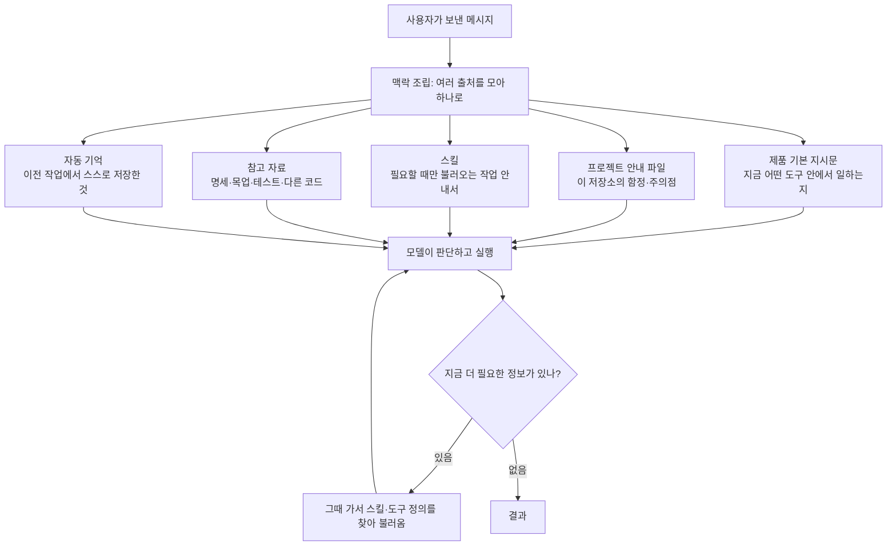

<div class="ai-knowledge-shell">

<aside class="ai-knowledge-sidebar">
  <p class="ai-eyebrow">CATEGORIES</p>
  <nav class="ai-cat-tree"><details class="ai-cat" open><summary><span class="catname">에이전트 오케스트레이션</span><span class="catcount">15</span></summary><ul><li><a href="https://altjs4510.github.io/ai_news_blog/knowledge/20260904/"><span class="kdate">2026-09-04</span><span class="ktitle">HarnessDev: Can LLMs Create and Evolve Their Own…</span></a></li><li><a href="https://altjs4510.github.io/ai_news_blog/knowledge/20260831-openexecutive-virtual-c-suite/"><span class="kdate">2026-08-31</span><span class="ktitle">Open Executive — 8명의 전문 에이전트를 하나의 임원 목소리로</span></a></li><li><a href="https://altjs4510.github.io/ai_news_blog/knowledge/20260828/"><span class="kdate">2026-08-28</span><span class="ktitle">Google ADK for Python v2.8.0 — RemoteA2aAgent 네이…</span></a></li><li><a href="https://altjs4510.github.io/ai_news_blog/knowledge/20260826/"><span class="kdate">2026-08-26</span><span class="ktitle">apache/maka — 도구 호출·권한 결정·종료 이벤트를 append-only 로그…</span></a></li><li><a href="https://altjs4510.github.io/ai_news_blog/knowledge/20260823/"><span class="kdate">2026-08-23</span><span class="ktitle">The Evolution of the Agent Harness — 하네스가 모델 가중치…</span></a></li><li><a href="https://altjs4510.github.io/ai_news_blog/knowledge/20260805/"><span class="kdate">2026-08-05</span><span class="ktitle">TencentCloud/TencentDB-Agent-Memory — 대화·문서·코드를 …</span></a></li><li><a href="https://altjs4510.github.io/ai_news_blog/knowledge/20260717/"><span class="kdate">2026-07-17</span><span class="ktitle">After a year building agent memory, 'save everyt…</span></a></li><li><a href="https://altjs4510.github.io/ai_news_blog/knowledge/20260709/"><span class="kdate">2026-07-09</span><span class="ktitle">mvanhorn/last30days-skill — Reddit·X·YouTube·HN·…</span></a></li><li><a href="https://altjs4510.github.io/ai_news_blog/knowledge/20260708/"><span class="kdate">2026-07-08</span><span class="ktitle">Expanding Managed Agents in Gemini API: backgrou…</span></a></li><li><a href="https://altjs4510.github.io/ai_news_blog/knowledge/20260623/"><span class="kdate">2026-06-23</span><span class="ktitle">bytedance/deer-flow — 샌드박스·메모리·서브에이전트·메시지 게이트웨이를…</span></a></li><li><a href="https://altjs4510.github.io/ai_news_blog/knowledge/20260621/"><span class="kdate">2026-06-21</span><span class="ktitle">calesthio/OpenMontage — 12 파이프라인·52 도구·500+ 스킬을 …</span></a></li><li><a href="https://altjs4510.github.io/ai_news_blog/knowledge/20260602/"><span class="kdate">2026-06-02</span><span class="ktitle">revfactory/harness — 도메인별 에이전트 팀과 스킬을 자동 설계하는 메타…</span></a></li><li><a href="https://altjs4510.github.io/ai_news_blog/knowledge/20260529/"><span class="kdate">2026-05-29</span><span class="ktitle">Introducing dynamic workflows in Claude Code</span></a></li><li><a href="https://altjs4510.github.io/ai_news_blog/knowledge/20260507/"><span class="kdate">2026-05-07</span><span class="ktitle">ruvnet/ruflo — Claude 멀티 에이전트 오케스트레이션 플랫폼</span></a></li><li><a href="https://altjs4510.github.io/ai_news_blog/knowledge/20260504/"><span class="kdate">2026-05-04</span><span class="ktitle">Agents for Everything Else: Codex for Knowledge …</span></a></li></ul></details><details class="ai-cat" open><summary><span class="catname">MCP &amp; 도구 통합</span><span class="catcount">17</span></summary><ul><li><a href="https://altjs4510.github.io/ai_news_blog/knowledge/20260829/"><span class="kdate">2026-08-29</span><span class="ktitle">cursor/plugins — 플러그인 명세(specification)와 공식 플러그인…</span></a></li><li><a href="https://altjs4510.github.io/ai_news_blog/knowledge/20260802/"><span class="kdate">2026-08-02</span><span class="ktitle">Stateless MCP has recaptured my interest (and in…</span></a></li><li><a href="https://altjs4510.github.io/ai_news_blog/knowledge/20260801/"><span class="kdate">2026-08-01</span><span class="ktitle">different-ai/openwork — Claude Cowork의 오픈소스 대체 에…</span></a></li><li><a href="https://altjs4510.github.io/ai_news_blog/knowledge/20260731/"><span class="kdate">2026-07-31</span><span class="ktitle">different-ai/openwork — Claude Cowork의 오픈소스 대안(o…</span></a></li><li><a href="https://altjs4510.github.io/ai_news_blog/knowledge/20260729/"><span class="kdate">2026-07-29</span><span class="ktitle">Bringing MCP 2026-07-28 to Claude</span></a></li><li><a href="https://altjs4510.github.io/ai_news_blog/knowledge/20260721/"><span class="kdate">2026-07-21</span><span class="ktitle">tirth8205/code-review-graph — 로컬 우선 코드 인텔리전스 그래프…</span></a></li><li><a href="https://altjs4510.github.io/ai_news_blog/knowledge/20260719/"><span class="kdate">2026-07-19</span><span class="ktitle">tirth8205/code-review-graph — 로컬 우선 코드 인텔리전스 그래프…</span></a></li><li><a href="https://altjs4510.github.io/ai_news_blog/knowledge/20260718/"><span class="kdate">2026-07-18</span><span class="ktitle">tirth8205/code-review-graph — MCP·CLI용 로컬 코드 인텔리…</span></a></li><li><a href="https://altjs4510.github.io/ai_news_blog/knowledge/20260701/"><span class="kdate">2026-07-01</span><span class="ktitle">Google OKF (Open Knowledge Format) — 벤더 중립 에이전트 …</span></a></li><li><a href="https://altjs4510.github.io/ai_news_blog/knowledge/20260618/"><span class="kdate">2026-06-18</span><span class="ktitle">DeusData/codebase-memory-mcp — 158개 언어 코드베이스를 밀리…</span></a></li><li><a href="https://altjs4510.github.io/ai_news_blog/knowledge/20260606/"><span class="kdate">2026-06-06</span><span class="ktitle">chopratejas/headroom — Compress tool outputs, lo…</span></a></li><li><a href="https://altjs4510.github.io/ai_news_blog/knowledge/20260605/"><span class="kdate">2026-06-05</span><span class="ktitle">chopratejas/headroom — Compress tool outputs, lo…</span></a></li><li><a href="https://altjs4510.github.io/ai_news_blog/knowledge/20260604/"><span class="kdate">2026-06-04</span><span class="ktitle">chopratejas/headroom — Compress tool outputs bef…</span></a></li><li><a href="https://altjs4510.github.io/ai_news_blog/knowledge/20260603/"><span class="kdate">2026-06-03</span><span class="ktitle">How Bad MCP design cost your Agent 5× more token…</span></a></li><li><a href="https://altjs4510.github.io/ai_news_blog/knowledge/20260523/"><span class="kdate">2026-05-23</span><span class="ktitle">colbymchenry/codegraph — 사전 인덱싱된 코드 지식 그래프 MCP</span></a></li><li><a href="https://altjs4510.github.io/ai_news_blog/knowledge/20260517/"><span class="kdate">2026-05-17</span><span class="ktitle">I gave my LLM 100,000+ tools — Lazy Discovery &a…</span></a></li><li><a href="https://altjs4510.github.io/ai_news_blog/knowledge/20260509/"><span class="kdate">2026-05-09</span><span class="ktitle">How to connect 100 MCP servers without the conte…</span></a></li></ul></details><details class="ai-cat" open><summary><span class="catname">코딩 에이전트</span><span class="catcount">31</span></summary><ul><li><a href="https://altjs4510.github.io/ai_news_blog/knowledge/20260906/"><span class="kdate">2026-09-06</span><span class="ktitle">DietrichGebert/ponytail — 에이전트를 '방에서 가장 게으른 시니어 …</span></a></li><li><a href="https://altjs4510.github.io/ai_news_blog/knowledge/20260903/"><span class="kdate">2026-09-03</span><span class="ktitle">pacifio/atlas — 여러 코딩 에이전트의 변경을 한곳에서 추적·질의하는 '에이…</span></a></li><li><a href="https://altjs4510.github.io/ai_news_blog/knowledge/20260901/"><span class="kdate">2026-09-01</span><span class="ktitle">affaan-m/ECC — 스킬·본능·메모리·보안을 묶은 에이전트 하네스 성능 최적화 …</span></a></li><li><a href="https://altjs4510.github.io/ai_news_blog/knowledge/20260831-gitnexus-code-knowledge-graph/"><span class="kdate">2026-08-31</span><span class="ktitle">GitNexus — 코드베이스를 지식그래프로 바꿔 에이전트에게 쥐어주기</span></a></li><li><a href="https://altjs4510.github.io/ai_news_blog/knowledge/20260822/"><span class="kdate">2026-08-22</span><span class="ktitle">mattpocock/skills — Skills for Real Engineers (하…</span></a></li><li><a href="https://altjs4510.github.io/ai_news_blog/knowledge/20260820/"><span class="kdate">2026-08-20</span><span class="ktitle">akitaonrails/ai-memory — 코딩 에이전트 CLI의 장기 메모리와 벤더…</span></a></li><li><a href="https://altjs4510.github.io/ai_news_blog/knowledge/20260819/"><span class="kdate">2026-08-19</span><span class="ktitle">akitaonrails/ai-memory — 코딩 에이전트 CLI 간 장기 기억과 벤더…</span></a></li><li><a href="https://altjs4510.github.io/ai_news_blog/knowledge/20260814/"><span class="kdate">2026-08-14</span><span class="ktitle">cathrynlavery/diagram-design — Claude Code용 에디토리…</span></a></li><li><a href="https://altjs4510.github.io/ai_news_blog/knowledge/20260811/"><span class="kdate">2026-08-11</span><span class="ktitle">PrimeIntellect-ai/prime-agent — 장기 자율 실행을 전제로 설계…</span></a></li><li><a href="https://altjs4510.github.io/ai_news_blog/knowledge/20260810/"><span class="kdate">2026-08-10</span><span class="ktitle">Auto mode is now the default in Claude Code for …</span></a></li><li><a href="https://altjs4510.github.io/ai_news_blog/knowledge/20260809/"><span class="kdate">2026-08-09</span><span class="ktitle">PrimeIntellect-ai/prime-agent — 코딩 워크플로우·장기 자율 작…</span></a></li><li><a href="https://altjs4510.github.io/ai_news_blog/knowledge/20260808/"><span class="kdate">2026-08-08</span><span class="ktitle">PrimeIntellect-ai/prime-agent — 코딩 워크플로우와 장시간 자율…</span></a></li><li><a href="https://altjs4510.github.io/ai_news_blog/knowledge/20260804/"><span class="kdate">2026-08-04</span><span class="ktitle">esengine/DeepSeek-Reasonix — prefix-cache 안정성을 축…</span></a></li><li><a href="https://altjs4510.github.io/ai_news_blog/knowledge/20260728/"><span class="kdate">2026-07-28</span><span class="ktitle">alibaba/open-code-review — 결정론적 파이프라인 + LLM 에이전트…</span></a></li><li><a href="https://altjs4510.github.io/ai_news_blog/knowledge/20260725/" class="current"><span class="kdate">2026-07-25</span><span class="ktitle">The new rules of context engineering for Claude …</span></a></li><li><a href="https://altjs4510.github.io/ai_news_blog/knowledge/20260722/"><span class="kdate">2026-07-22</span><span class="ktitle">tirth8205/code-review-graph — MCP·CLI용 로컬 우선 코드 …</span></a></li><li><a href="https://altjs4510.github.io/ai_news_blog/knowledge/20260714/"><span class="kdate">2026-07-14</span><span class="ktitle">Graphify-Labs/graphify — 코드베이스를 질의 가능한 지식 그래프로 만…</span></a></li><li><a href="https://altjs4510.github.io/ai_news_blog/knowledge/20260707/"><span class="kdate">2026-07-07</span><span class="ktitle">AI Hero Skills Catalog — 실무 엔지니어를 위한 재사용 가능한 판단 …</span></a></li><li><a href="https://altjs4510.github.io/ai_news_blog/knowledge/20260705/"><span class="kdate">2026-07-05</span><span class="ktitle">openai/codex-plugin-cc — Claude Code에서 Codex를 위임…</span></a></li><li><a href="https://altjs4510.github.io/ai_news_blog/knowledge/20260626/"><span class="kdate">2026-06-26</span><span class="ktitle">google-labs-code/design.md — 코딩 에이전트에게 디자인 시스템을 …</span></a></li><li><a href="https://altjs4510.github.io/ai_news_blog/knowledge/20260619/"><span class="kdate">2026-06-19</span><span class="ktitle">Claude Code now supports artifacts</span></a></li><li><a href="https://altjs4510.github.io/ai_news_blog/knowledge/20260530/"><span class="kdate">2026-05-30</span><span class="ktitle">Leonxlnx/taste-skill — AI에게 좋은 취향을 부여해 generic s…</span></a></li><li><a href="https://altjs4510.github.io/ai_news_blog/knowledge/20260528/"><span class="kdate">2026-05-28</span><span class="ktitle">Building self-improving tax agents with Codex</span></a></li><li><a href="https://altjs4510.github.io/ai_news_blog/knowledge/20260526/"><span class="kdate">2026-05-26</span><span class="ktitle">colbymchenry/codegraph — Pre-indexed code knowle…</span></a></li><li><a href="https://altjs4510.github.io/ai_news_blog/knowledge/20260524/"><span class="kdate">2026-05-24</span><span class="ktitle">colbymchenry/codegraph — Pre-indexed code knowle…</span></a></li><li><a href="https://altjs4510.github.io/ai_news_blog/knowledge/20260521/"><span class="kdate">2026-05-21</span><span class="ktitle">colbymchenry/codegraph — Pre-indexed code knowle…</span></a></li><li><a href="https://altjs4510.github.io/ai_news_blog/knowledge/20260512/"><span class="kdate">2026-05-12</span><span class="ktitle">agentmemory — Persistent memory for AI coding ag…</span></a></li><li><a href="https://altjs4510.github.io/ai_news_blog/knowledge/20260510/"><span class="kdate">2026-05-10</span><span class="ktitle">addyosmani/agent-skills — Production-grade engin…</span></a></li><li><a href="https://altjs4510.github.io/ai_news_blog/knowledge/20260508/"><span class="kdate">2026-05-08</span><span class="ktitle">addyosmani/agent-skills — Production-grade engin…</span></a></li><li><a href="https://altjs4510.github.io/ai_news_blog/knowledge/20260506/"><span class="kdate">2026-05-06</span><span class="ktitle">mksglu/context-mode — AI 코딩 에이전트용 컨텍스트 윈도우 최적화</span></a></li><li><a href="https://altjs4510.github.io/ai_news_blog/knowledge/20260505/"><span class="kdate">2026-05-05</span><span class="ktitle">mattpocock/skills — Skills for Real Engineers (.…</span></a></li></ul></details><details class="ai-cat" open><summary><span class="catname">모델 &amp; 연구</span><span class="catcount">6</span></summary><ul><li><a href="https://altjs4510.github.io/ai_news_blog/knowledge/20260821/"><span class="kdate">2026-08-21</span><span class="ktitle">volcengine/OpenViking — 에이전트 메모리·Knowledge RAG·스…</span></a></li><li><a href="https://altjs4510.github.io/ai_news_blog/knowledge/20260716-proprag/"><span class="kdate">2026-07-16</span><span class="ktitle">PropRAG — 프로포지션 경로 위 beam search로 멀티홉 검색 안내</span></a></li><li><a href="https://altjs4510.github.io/ai_news_blog/knowledge/20260620/"><span class="kdate">2026-06-20</span><span class="ktitle">zai-org/GLM-5 — From Vibe Coding to Agentic Engi…</span></a></li><li><a href="https://altjs4510.github.io/ai_news_blog/knowledge/20260617/"><span class="kdate">2026-06-17</span><span class="ktitle">Predicting model behavior before release by simu…</span></a></li><li><a href="https://altjs4510.github.io/ai_news_blog/knowledge/20260516/"><span class="kdate">2026-05-16</span><span class="ktitle">STALE — 에이전트가 자기 기억의 유효성을 인지할 수 있는가</span></a></li><li><a href="https://altjs4510.github.io/ai_news_blog/knowledge/20260513/"><span class="kdate">2026-05-13</span><span class="ktitle">Thinking Machines' Native Interaction Models — T…</span></a></li></ul></details><details class="ai-cat" open><summary><span class="catname">인프라 &amp; 컴퓨트</span><span class="catcount">10</span></summary><ul><li><a href="https://altjs4510.github.io/ai_news_blog/knowledge/20260905/"><span class="kdate">2026-09-05</span><span class="ktitle">magnitudedev/magnitude — 하드웨어에 맞는 최적 로컬 모델을 띄워 이…</span></a></li><li><a href="https://altjs4510.github.io/ai_news_blog/knowledge/20260813/"><span class="kdate">2026-08-13</span><span class="ktitle">semantica-agi/semantica — 컨텍스트와 책임 추적을 위한 그래프 네이…</span></a></li><li><a href="https://altjs4510.github.io/ai_news_blog/knowledge/20260812/"><span class="kdate">2026-08-12</span><span class="ktitle">semantica-agi/semantica — 컨텍스트와 '책임 추적 가능한(accou…</span></a></li><li><a href="https://altjs4510.github.io/ai_news_blog/knowledge/20260806/"><span class="kdate">2026-08-06</span><span class="ktitle">cloudflare/computer — 에이전트에게 컴퓨터를 통째로 주는 엣지 실행 샌…</span></a></li><li><a href="https://altjs4510.github.io/ai_news_blog/knowledge/20260724/"><span class="kdate">2026-07-24</span><span class="ktitle">diegosouzapw/OmniRoute — 단일 엔드포인트로 278+ 프로바이더·50…</span></a></li><li><a href="https://altjs4510.github.io/ai_news_blog/knowledge/20260723/"><span class="kdate">2026-07-23</span><span class="ktitle">diegosouzapw/OmniRoute — 268+ 프로바이더를 단일 엔드포인트로 묶…</span></a></li><li><a href="https://altjs4510.github.io/ai_news_blog/knowledge/20260630/"><span class="kdate">2026-06-30</span><span class="ktitle">Introducing the Claude apps gateway for Amazon B…</span></a></li><li><a href="https://altjs4510.github.io/ai_news_blog/knowledge/20260611/"><span class="kdate">2026-06-11</span><span class="ktitle">The evolution of agentic surfaces: building with…</span></a></li><li><a href="https://altjs4510.github.io/ai_news_blog/knowledge/20260522/"><span class="kdate">2026-05-22</span><span class="ktitle">Giving Agents Computers — Ivan Burazin, Daytona</span></a></li><li><a href="https://altjs4510.github.io/ai_news_blog/knowledge/20260520/"><span class="kdate">2026-05-20</span><span class="ktitle">New in Claude Managed Agents: self-hosted sandbo…</span></a></li></ul></details><details class="ai-cat" open><summary><span class="catname">보안 &amp; 거버넌스</span><span class="catcount">17</span></summary><ul><li><a href="https://altjs4510.github.io/ai_news_blog/knowledge/20260902/"><span class="kdate">2026-09-02</span><span class="ktitle">AIR raises $50M to help companies vet the skills…</span></a></li><li><a href="https://altjs4510.github.io/ai_news_blog/knowledge/20260827/"><span class="kdate">2026-08-27</span><span class="ktitle">Claude in Chrome is generally available</span></a></li><li><a href="https://altjs4510.github.io/ai_news_blog/knowledge/20260819-mind-viruses/"><span class="kdate">2026-08-19</span><span class="ktitle">탈옥도, 인젝션도 없이 — 대화로만 퍼지는 에이전트의 '마인드 바이러스'</span></a></li><li><a href="https://altjs4510.github.io/ai_news_blog/knowledge/20260730/"><span class="kdate">2026-07-30</span><span class="ktitle">Anatomy of a Frontier Lab Agent Intrusion: A Tec…</span></a></li><li><a href="https://altjs4510.github.io/ai_news_blog/knowledge/20260716/"><span class="kdate">2026-07-16</span><span class="ktitle">Dicklesworthstone/destructive_command_guard — 에이…</span></a></li><li><a href="https://altjs4510.github.io/ai_news_blog/knowledge/20260715/"><span class="kdate">2026-07-15</span><span class="ktitle">Dicklesworthstone/destructive_command_guard — 에이…</span></a></li><li><a href="https://altjs4510.github.io/ai_news_blog/knowledge/20260710/"><span class="kdate">2026-07-10</span><span class="ktitle">70개 MCP 서버 strace 런타임 감사 — 부팅 시 아웃바운드 호출 서버 적발</span></a></li><li><a href="https://altjs4510.github.io/ai_news_blog/knowledge/20260704/"><span class="kdate">2026-07-04</span><span class="ktitle">Cloudflare is about to block AI agents by defaul…</span></a></li><li><a href="https://altjs4510.github.io/ai_news_blog/knowledge/20260703/"><span class="kdate">2026-07-03</span><span class="ktitle">Giving admins more visibility and control over C…</span></a></li><li><a href="https://altjs4510.github.io/ai_news_blog/knowledge/20260625/"><span class="kdate">2026-06-25</span><span class="ktitle">Agent identity in Claude Tag: a new access model…</span></a></li><li><a href="https://altjs4510.github.io/ai_news_blog/knowledge/20260624/"><span class="kdate">2026-06-24</span><span class="ktitle">Agent identity in Claude Tag: a new access model…</span></a></li><li><a href="https://altjs4510.github.io/ai_news_blog/knowledge/20260614/"><span class="kdate">2026-06-14</span><span class="ktitle">NVIDIA/SkillSpector — Security scanner for AI ag…</span></a></li><li><a href="https://altjs4510.github.io/ai_news_blog/knowledge/20260613/"><span class="kdate">2026-06-13</span><span class="ktitle">Fable 5's guardrails got bypassed in 48 hours — …</span></a></li><li><a href="https://altjs4510.github.io/ai_news_blog/knowledge/20260612/"><span class="kdate">2026-06-12</span><span class="ktitle">NVIDIA/SkillSpector — AI 에이전트 스킬용 보안 스캐너</span></a></li><li><a href="https://altjs4510.github.io/ai_news_blog/knowledge/20260607/"><span class="kdate">2026-06-07</span><span class="ktitle">OpenAI Help: Lockdown Mode</span></a></li><li><a href="https://altjs4510.github.io/ai_news_blog/knowledge/20260531/"><span class="kdate">2026-05-31</span><span class="ktitle">How we contain Claude across products</span></a></li><li><a href="https://altjs4510.github.io/ai_news_blog/knowledge/20260527/"><span class="kdate">2026-05-27</span><span class="ktitle">Microsoft Copilot Cowork Exfiltrates Files</span></a></li></ul></details><details class="ai-cat" open><summary><span class="catname">응용 사례</span><span class="catcount">5</span></summary><ul><li><a href="https://altjs4510.github.io/ai_news_blog/knowledge/20260726/"><span class="kdate">2026-07-26</span><span class="ktitle">citrolabs/ego-lite — 로그인된 브라우저 상태를 AI 에이전트와 공유하는…</span></a></li><li><a href="https://altjs4510.github.io/ai_news_blog/knowledge/20260712/"><span class="kdate">2026-07-12</span><span class="ktitle">Do Automated Evals Work?</span></a></li><li><a href="https://altjs4510.github.io/ai_news_blog/knowledge/20260609/"><span class="kdate">2026-06-09</span><span class="ktitle">Building intelligent apps for Apple platforms wi…</span></a></li><li><a href="https://altjs4510.github.io/ai_news_blog/knowledge/20260515/"><span class="kdate">2026-05-15</span><span class="ktitle">Clawdmeter — Claude Code 사용량을 데스크톱 대시보드로</span></a></li><li><a href="https://altjs4510.github.io/ai_news_blog/knowledge/20260514/"><span class="kdate">2026-05-14</span><span class="ktitle">Introducing Claude for Small Business</span></a></li></ul></details><details class="ai-cat" open><summary><span class="catname">산업 동향</span><span class="catcount">6</span></summary><ul><li><a href="https://altjs4510.github.io/ai_news_blog/knowledge/20260830/"><span class="kdate">2026-08-30</span><span class="ktitle">[AINews] OpenAI shuts off Cursor — 프론티어 모델 공급 차단…</span></a></li><li><a href="https://altjs4510.github.io/ai_news_blog/knowledge/20260711/"><span class="kdate">2026-07-11</span><span class="ktitle">OpenAI says GPT 5.6 is the 'preferred model' for…</span></a></li><li><a href="https://altjs4510.github.io/ai_news_blog/knowledge/20260702/"><span class="kdate">2026-07-02</span><span class="ktitle">How Cursor deploys AI inside the enterprise (For…</span></a></li><li><a href="https://altjs4510.github.io/ai_news_blog/knowledge/20260616/"><span class="kdate">2026-06-16</span><span class="ktitle">Why AI hasn't replaced software engineers, and w…</span></a></li><li><a href="https://altjs4510.github.io/ai_news_blog/knowledge/20260610/"><span class="kdate">2026-06-10</span><span class="ktitle">Fable 5 just made cost-aware model routing manda…</span></a></li><li><a href="https://altjs4510.github.io/ai_news_blog/knowledge/20260519/"><span class="kdate">2026-05-19</span><span class="ktitle">Anthropic acquires Stainless</span></a></li></ul></details></nav>
</aside>

<article class="ai-knowledge-article">

<header class="ai-post-hero">
  <p class="ai-eyebrow"><a class="ai-back" href="../">KNOWLEDGE</a> · 2026-07-25 · 오늘의 학습</p>
  <h2 class="ai-post-title">The new rules of context engineering for Claude 5 generation models</h2>
</header>

> 원문: [The new rules of context engineering for Claude 5 generation models](https://claude.com/blog/the-new-rules-of-context-engineering-for-claude-5-generation-models)

## 📌 학습 정리

### 1. 한 줄로 말하면

모델이 똑똑해지면서, 예전에 안전장치로 잔뜩 붙여두었던 "이렇게 해라, 저건 하지 마라" 지시문의 상당수가 오히려 걸림돌이 됐다는 이야기예요. Claude Code라는 도구의 기본 지시문 중 80% 이상을 덜어냈는데도 성능 측정에서 손해가 없었다고 합니다.

### 2. 왜 이게 만들어졌어요?

원래는 모델에게 무언가 시킬 때, 최악의 상황을 막으려고 규칙을 촘촘히 박아두는 게 정석이었어요. 예를 들어 "코드에 주석을 달지 마라", "여러 줄짜리 설명문은 절대 쓰지 마라" 같은 강한 문장을 기본 지시문(system prompt)에 넣어두는 식이죠. 그런데 이런 규칙은 어떤 상황에서는 맞지만 어떤 상황에서는 틀리고, 무엇보다 사용자가 실제로 요청하는 내용과 충돌하기 시작합니다. 실제 사용 기록을 열어보니 한 요청 안에서 "적절히 문서를 남겨라"와 "주석을 절대 달지 마라"가 동시에 들어가 있어서, 모델이 답을 내기 전에 이 모순부터 정리하느라 힘을 빼고 있었다는 거예요. 새 세대 모델은 주변 맥락을 보고 스스로 판단하는 능력이 좋아졌으니, 규칙을 걷어내고 판단을 맡기는 쪽이 낫다는 결론에 도달한 겁니다.

### 3. 비유로 풀면

이건 마치 신입에게 주던 업무 매뉴얼 같은 거예요. 처음에는 "고객 메일에는 반드시 이 문구를 넣어라, 이런 표현은 쓰지 마라" 하고 100장짜리 매뉴얼을 쥐여주죠. 그런데 그 사람이 3년 차가 되면 매뉴얼이 오히려 방해가 됩니다. 상황에 안 맞는 규칙까지 지키느라 이상한 결과가 나오고, 매뉴얼끼리 서로 어긋나면 "그래서 뭘 따르라는 거지" 하고 멈춰 서게 되니까요.

또 하나는 회사 위키 같은 거예요. "혹시 필요할지 모르니까" 하고 모든 지식을 첫 페이지에 다 때려넣으면 아무도 못 읽습니다. 대신 목차만 얇게 두고 필요할 때 해당 문서로 들어가게 만들죠.

그래서 결국, 지시문은 "모든 경우를 미리 막는 규칙집"에서 "필요할 때 꺼내 볼 수 있는 얇은 안내서"로 성격이 바뀌었다는 이야기입니다.

### 4. 어떻게 작동하는지 (그림으로)



핵심은 왼쪽 위에서 오른쪽 아래로 한 번에 다 쏟아붓지 않는다는 점이에요. 처음에는 얇게 시작하고, 작업 중에 "아 이건 검증 절차가 필요하네" 싶을 때 해당 안내서를 그 시점에 불러옵니다. 이걸 점진적 공개(progressive disclosure)라고 부르는데, 도구 목록에도 똑같이 적용해서 자주 안 쓰는 도구는 이름만 두고 실제 사용법은 필요할 때 검색해서 가져오게 만들었습니다.

여기서 바뀐 지점들을 조금만 더 풀어보면 이렇습니다. 예전에는 도구 사용법을 알려주려고 예시를 잔뜩 붙였는데, 지금은 예시가 오히려 탐색 범위를 그 예시 안에 가둬버린다고 봐요. 대신 도구 자체의 설계, 그러니까 어떤 항목을 넘길 수 있고 그 항목이 얼마나 의미를 잘 드러내는지에 공을 들이라고 합니다. 예를 들어 할 일 관리 도구에서 상태값을 "대기 / 진행 중 / 완료" 세 가지로만 정의해두면, 그 자체가 어떻게 쓰라는 힌트가 되죠.

같은 말을 여기저기 반복하던 관행도 정리됐어요. 예전 모델은 지시를 반복해줘야 잘 따랐고 특히 맥락 끝부분의 말을 더 잘 들었기 때문에, 기본 지시문과 도구 설명에 같은 내용을 중복해 적었습니다. 지금은 도구 사용법은 그 도구 설명에만 두고 기본 지시문에서는 뺐다고 해요.

기억을 다루는 방식도 달라졌습니다. 예전에는 사용자가 단축키를 눌러 프로젝트 안내 파일에 직접 적어두는 식이었는데, 이제는 작업과 사용자에게 의미 있는 내용을 모델이 알아서 저장합니다.

참고 자료의 형태도 넓어졌어요. 예전에는 계획이나 명세를 마크다운 문서로 적어두는 게 정석이었지만, 지금은 훨씬 복잡한 형태도 소화합니다. 명세가 잘 짜인 테스트 묶음일 수도 있고, 다른 저장소에 있는 함수 하나일 수도 있어요. 원문은 오히려 코드 형태의 자료를 권하는데, 모델이 아주 잘 아는 언어로 된 고해상도 지시라서 그렇습니다. 디자인이라면 말로 설명하거나 스크린샷을 주는 것보다 HTML 목업을 주는 쪽이 대체로 결과가 낫다고 하고요.

실제로 자기 맥락을 정리할 때는 이렇게 나눠 생각하라고 합니다. 제품 기본 지시문은 "지금 어떤 제품 안에서 무슨 일을 하는 중인가"를 알려주는 자리라, 직접 에이전트를 만드는 사람이라면 여기에 시간을 많이 써야 해요. 프로젝트 안내 파일은 가볍게 유지하되, 파일 목록만 봐도 알 수 있는 뻔한 이야기 대신 "이 저장소에서 자주 걸려 넘어지는 지점"에 분량을 쓰라고 합니다. 스킬은 나 또는 우리 팀만의 취향과 노하우를 담을 때 가장 잘 맞고, 길어지면 여러 파일로 쪼개라고 하고요.

### 5. 처음 보는 용어 풀이

- **맥락 설계 (context engineering)** — 모델에게 매번 어떤 정보를 실어 보낼지 설계하는 일이에요. 그때그때 쓰는 요청문과 달리 여러 요청에 두루 쓰이기 때문에, 특정 상황에 딱 맞게 구체적으로 쓸 수가 없다는 게 어려운 지점입니다.
- **기본 지시문 (system prompt)** — 사용자가 무엇을 묻든 항상 앞에 붙는 안내문이에요. 지금 어떤 제품 안에서 어떤 역할로 일하는 중인지를 알려주는 자리입니다.
- **점진적 공개 (progressive disclosure)** — 필요한 정보를 필요한 시점에만 불러오는 방식이에요. 모든 걸 처음부터 다 넣으면 정작 중요한 게 묻히니까, 얇은 목차를 두고 그때그때 펼치는 겁니다.
- **스킬 (Skills)** — 특정 작업을 할 때 참고할 안내서 묶음이에요. 검증 절차나 코드 리뷰 방식처럼 늘 필요하지는 않지만 필요할 땐 중요한 내용을 따로 떼어둔 것입니다.
- **프로젝트 안내 파일 (CLAUDE.md)** — 저장소 안에 두는 설명 파일이에요. 이 저장소가 무엇을 하는 곳인지 짧게 적고, 나머지는 "여기서 조심할 점"에 쓰는 게 좋다고 합니다.
- **자동 기억 (auto-memory)** — 예전처럼 사람이 직접 적어 저장하는 대신, 작업과 관련된 내용을 모델이 알아서 남겨두는 방식이에요.
- **평가 기준표 (rubrics)** — "좋은 설계란 이런 것"처럼 판단 기준을 적어둔 자료예요. 이 기준을 들고 검증 담당 역할을 따로 띄워서 결과가 내 취향에 맞는지 확인하게 할 수 있습니다.
- **지연 로딩 도구 (deferred loading)** — 도구의 이름만 먼저 알려주고, 실제 사용법은 쓰겠다고 마음먹었을 때 검색해서 가져오는 방식이에요. 이렇게 하면 도구를 많이 둬도 평소 맥락을 잡아먹지 않습니다.

### 6. 한 발 더 들어가고 싶다면

- [원문 글](https://claude.com/blog/the-new-rules-of-context-engineering-for-claude-5-generation-models) — 어떤 문장을 어떻게 바꿨는지 실제 지시문 예시와 함께 볼 수 있어요.
- Claude Code 안에서 `/doctor` 명령 — 지금 쓰고 있는 스킬과 프로젝트 안내 파일이 너무 비대하지 않은지 자동으로 점검해주는 기능이라고 합니다.
- 원문이 언급한 관련 글들 — 스킬로 검증 절차를 만드는 방법(2026년 7월 22일), 용도별로 어떤 모델을 고를지(7월 24일), 대규모 코드 이전 작업을 굴리는 방식(7월 16일) 등이 같은 블로그에 이어져 있어요.

---

## 📖 원문 전체 번역 (정독용)

> 의역 최소화한 전체 번역입니다. 큰 흐름은 위 정리에서 잡고, 정확한 워딩이 필요할 땐 이 섹션에서 정독하세요.

# Claude 5세대 모델을 위한 새로운 컨텍스트 엔지니어링 규칙

우리는 더 발전된 모델들을 위해 Claude Code 시스템 프롬프트의 80% 이상을 제거했습니다. 이 교훈을 Claude Code와 여러분 자신의 에이전트에 적용하는 방법을 소개합니다.

**카테고리**: Claude Code, Agents, Product
**제품**: Claude Code, Claude Enterprise, Claude Platform
**날짜**: 2026년 7월 24일
**읽는 시간**: 5분

저는 이전에 [최신 세대 Claude 5 모델을 최적으로 프롬프트하는 방법](링크)에 대해, 그리고 여러분이 무엇을 만들고 싶은지 발견하기 위해 반복적으로 작업하는 방법에 대해 글을 쓴 바 있습니다.

하지만 여러분이 Claude에게 메시지를 보낼 때, 프롬프트는 Claude가 받는 컨텍스트 중 작은 일부에 불과합니다. 여러분의 컨텍스트 대부분은 시스템 프롬프트, Skills, CLAUDE.md 파일, 메모리, 그리고 기타 소스로부터 조합됩니다. 우리는 이것을 **컨텍스트 엔지니어링**이라고 부르며, 이는 Claude Code를 사용하거나 여러분 자신의 에이전트를 구축할 때 생성되는 결과물에 큰 영향을 미칩니다.

프롬프트와 달리 컨텍스트는 여러 요청에 걸쳐 범용적으로 사용되므로, 그만큼 구체적일 수 없습니다. 사용자의 프롬프트가 무엇일지 모르는 상황에서, 특히 어떻게 Claude를 위한 이런 범용 프롬프트와 가이던스를 구축해야 할까요?

이는 Claude 자체의 역량이 진화함에 따라 놀랍도록 어려운 일이 될 수 있습니다. 가장 최근에 우리는 최신 세대 Claude 모델을 프롬프트하는 방식에서 큰 도약을 발견했습니다. 우리는 Claude Opus 5와 Claude Fable 5 같은 모델을 위해 Claude Code의 시스템 프롬프트의 80% 이상을 제거했음에도 우리의 코딩 평가에서 측정 가능한 성능 손실이 없었습니다.

다음은 우리가 이 새로운 등급의 모델을 프롬프트하면서 배운 것들과, 여러분이 이를 활용해 컨텍스트 엔지니어링을 업데이트하는 방법입니다. 우리는 이러한 모범 사례들을 `claude doctor;`에 담아두었습니다. Claude Code에서 `/doctor` 명령어를 사용해 여러분의 skills와 CLAUDE.md 파일을 적정 규모로 조정하십시오.

## Claude의 족쇄 풀기

전반적으로, 우리는 시스템 프롬프트뿐만 아니라 CLAUDE.md 파일과 skills를 통해서도 Claude Code를 과도하게 제약하고 있었다는 것을 발견했습니다.

예를 들어, 우리 자체의 Claude Code 내부 사용 기록(transcript)을 읽어보면, 단일 요청 안에서 "적절하게 문서화를 남겨라"거나 "주석을 절대 추가하지 마라" 같은 여러 상충하는 메시지가 시스템 프롬프트, skills, 사용자 요청 사이에서 서로 충돌하는 것을 볼 수 있습니다.

일반적으로 Claude는 사용자의 의도를 해석해 올바른 답에 도달할 수 있지만, 무엇을 할지 결정하기 전에 이렇게 겹치고 충돌하는 메시지들에 대해 더 신중하게 생각해야 합니다.

그리고 이러한 제약들이 한때는 최악의 시나리오를 피하기 위해 필요했던 것이지만, 이제는 그중 많은 것들을 삭제하고 모델이 주변 컨텍스트와 판단력을 대신 사용하도록 할 수 있음을 발견했습니다.

또한 Claude Code는 이제 훨씬 더 많은 도구를 갖추고 있습니다. Claude는 예전에 CLAUDE.md를 메모리, 정보, 가이던스의 출처로 삼았습니다. 이제는 메모리, artifacts, skills가 있어서, Claude가 세션 간에 컨텍스트를 로드하고 공유하는 새로운 방식을 만들어낼 수 있습니다.

## 그때와 지금

이전에 있었던 여러 컨텍스트 엔지니어링 모범 사례들은 어느새 잘못된 통념(myth)이 되어 있었습니다. 다음을 포함합니다.

### 그때: Claude에게 규칙을 준다 → 지금: Claude가 판단력을 사용하게 한다

우리가 Claude Code를 처음 출시했을 때, 우리는 Claude가 파일 삭제와 같은 최악의 시나리오를 피하도록 확실히 해야 했습니다. 이는 항상 참은 아닐 수도 있는 특히 강한 가이던스를 제공한다는 것을 의미했습니다. 예를 들어, 시스템 프롬프트에서 우리는 이렇게 말하곤 했습니다:

```
코드에서: 기본적으로 주석을 쓰지 않는다. 여러 문단짜리 docstring이나 여러 줄짜리 주석 블록은 절대 쓰지 않는다 — 짧은 한 줄이 최대치다. 사용자가 요청하지 않는 한 계획, 결정, 분석 문서를 만들지 않는다 — 중간 파일이 아니라 대화 컨텍스트를 바탕으로 작업한다.
```

하지만 특정 부류의 프롬프트에서는 이러한 가이던스가 틀린 것이었습니다. 문서화의 경우 사용자가 자신만의 선호가 있을 수도 있고, 매우 복잡한 코드의 특정 부분은 여러 줄짜리 주석 블록이 필요할 수도 있습니다.

그럼에도 불구하고, 구형 모델에서는 이러한 가드레일 없이는 Claude가 작성하는 주석이 많은 경우 부정확했고, 우리는 이 트레이드오프를 감수해야 했습니다. 하지만 신형 모델들은 더 나은 판단력을 갖추고 있어서 명시적 규칙 없이도 이런 결정을 잘 처리할 수 있습니다.

새로운 시스템 프롬프트에서 우리는 이렇게 말합니다:

```
주변 코드처럼 읽히는 코드를 작성하라: 주변 코드의 주석 밀도, 네이밍, 관용구(idiom)를 맞춰라.
```

### 그때: Claude에게 예시를 준다 → 지금: 인터페이스를 설계한다

도구 사용에 관한 첫 번째 규칙은 Claude에게 도구를 어떻게 사용할지 예시를 주는 것이었습니다. 우리의 최신 모델에서는, 예시를 주는 것이 실제로는 Claude를 특정한 탐색 공간에 가두게 된다는 것을 발견했습니다.

예시를 사용하는 대신, 여러분의 도구, 스크립트, 파일의 설계에 대해 더 많이 생각해보십시오 — Claude가 어떤 파라미터를 가지고 있으며, 그것들이 어떻게 더 표현력 있게 만들어질 수 있을까요?

예를 들어 Todo 도구의 예시에서, status를 pending, in_progress, completed 사이의 열거형(enumeration)으로 나열하기만 해도, Claude에게 그것을 어떻게 사용해야 하는지에 대한 힌트를 줍니다. 한 번에 하나의 항목만 in_progress로 유지하라는 지시는 우리가 요청하는 행동을 정의하는 데 도움을 줍니다.

### 그때: 모든 것을 처음부터 다 준다 → 지금: 점진적 노출(progressive disclosure)을 사용한다

Claude Code는 코딩에 집중했기 때문에, 우리의 시스템 프롬프트에는 코드 리뷰와 검증(verification)을 어떻게 하는지에 대한 상세한 정보가 포함되어 있었습니다. 이것들이 항상 필요한 것은 아니었지만, 필요할 때는 결정적인 정보였습니다.

그 이후로 Claude Code는 점진적 노출을 사용하는 데 매우 능숙해졌습니다 — 적절한 시점에 적절한 컨텍스트를 로드하는 것입니다. 예를 들어, 우리는 검증과 코드 리뷰를 Claude Code가 선택적으로 호출할 수 있는 별도의 skills로 옮겼습니다.

하지만 점진적 노출은 skills에만 해당하는 것이 아니며, 우리는 이를 도구에도 사용합니다. 우리의 일부 도구들은 '지연 로딩(deferred loading)'으로 되어 있는데, 이는 에이전트가 그것을 사용하기 전에 ToolSearch를 사용해 전체 정의를 검색해야 함을 의미합니다. 이를 통해 우리는 필요할 때까지 컨텍스트를 차지하지 않는 더 많은 도구(예: 우리의 Task 도구들)를 가질 수 있습니다.

동일한 원리가 여러분 자신의 CLAUDE.md와 Skill.md 파일에도 적용될 수 있습니다. 흔한 통념은, Claude가 알아서 찾지 못할 것이므로 여러분이 마주칠 **가능성이 있는** 모든 알려진 관행을 위한 중앙 저장소로 만들어야 한다는 것입니다. 그 대신 **적절한 시점에 로드될 수 있는 파일 트리를 갖추는 것을 고려**하십시오.

### 그때: 스스로 반복한다 → 지금: 단순한 도구 설명

초기 Claude 모델들은 때때로 반복된 지시가 필요했거나, 컨텍스트 윈도우의 앞부분보다 뒷부분에 있는 지시를 더 잘 따르는 경향이 있었습니다. 이는 우리의 시스템 프롬프트가 메인 시스템 프롬프트 안에서도 도구에 대한 참조를 담고 있으면서, 도구 설명 안에도 지시를 담고 있는 경우가 종종 있었다는 것을 의미했습니다.

우리는 이런 중복된 예시들을 삭제하고, 도구 사용법에 대한 지시를 시스템 프롬프트가 아니라 도구 설명(tool description)에 넣을 수 있다는 것을 발견했습니다.

### 그때: CLAUDE.md 파일 속 메모리 → 지금: 자동 메모리(Auto-memory)

우리는 예전에 사용자들에게 `#` 단축키를 사용해 자동으로 자신의 `CLAUDE.md`에 기록함으로써 Claude의 메모리에 내용을 저장하라고 권장했습니다. 이제 Claude는 작업 및 여러분과 관련된 메모리를 자동으로 저장합니다.

### 그때: 단순한 스펙 → 지금: 풍부한 참조자료(references)

plan 모드에서, Claude Code는 계획을 담은 마크다운 파일에 크게 의존해왔습니다. 이러한 파일들을 계획(plans)으로 저장하는 것은 Claude가 필요할 때 그것들을 참조하는 데 도움이 되었습니다. 이와 비슷한 또 다른 모범 사례는, 더 긴 프로젝트에 걸쳐 작업하는 동안 Claude가 참조할 수 있도록 코드베이스에 스펙을 저장하는 것이었습니다.

하지만 우리는 Claude가 점점 더 복잡한 참조자료를 다룰 수 있다는 것을 발견했습니다. 단순한 마크다운 파일 대신, Claude는 우리의 새로운 artifacts 기능으로 만들어진 HTML artifact를 참조할 수 있습니다.

여러분은 코드 형태로 Claude에게 참조자료를 줄 수도 있습니다. 스펙은 상세한 테스트 스위트일 수도 있고, Claude가 이식(port)해야 할 다른 코드베이스의 함수일 수도 있습니다.

Rubrics(평가 기준표)는 또 다른 형태의 참조자료입니다. Rubrics는 [dynamic workflows](링크)를 사용하고 그 rubrics를 가진 verifier 에이전트를 새로 실행함으로써, Claude가 특정 분야에서 여러분의 취향(예: 좋은 API 설계란 무엇인가)을 시도하고 검증할 수 있게 해줍니다.

## 이것을 여러분의 컨텍스트에 적용하기

이 모든 것을 종합하면, 여러분의 컨텍스트를 조립할 때 이는 어떤 모습이 될까요?

### 시스템 프롬프트

시스템 프롬프트는 제품 컨텍스트와 밀접하게 연결되어 있습니다. 그것은 Claude에게 자신이 어떤 제품 안에서 작동하고 있는지, 무엇을 하고 있는지를 알려줍니다. Claude Code의 경우 여러분이 이를 수정할 일은 아마 없겠지만, 여러분 자신의 에이전트 하네스(harness)를 구축하고 있다면 이 부분에 많은 시간을 써야 합니다.

### CLAUDE.md

CLAUDE.md는 가볍게 유지하고, 여러분의 저장소(repo)가 무엇을 위한 것인지 짧게 설명하되, 토큰 대부분은 코드베이스 내부의 함정(gotcha)들에 쓰십시오. 예를 들어, 여러분이 타입들을 하나의 모놀리식 파일에만 두고 다른 곳에는 두지 않는 식으로 코드를 조직할 수도 있습니다. Claude가 파일 시스템이나 저장소를 살펴보면 알 수 있는 '뻔한' 것들을 굳이 명시하는 것은 피하십시오.

점진적 노출을 적극적으로 사용하십시오. 예를 들어 여러분의 작업을 검증하는 방법에 대한 여러 고유한 지시사항이 있다면, 검증 skill을 만들고 CLAUDE.md에서 이를 참조하십시오.

### Skills

Skills를 Claude가 필요할 때 정보를 찾을 수 있게 해주는 가벼운 가이드라고 생각하십시오. 매우 중요한 영역을 제외하고는 과도하게 제약하는 것을 피하십시오.

긴 skill의 경우, 가능한 한 점진적 노출을 사용하도록 노력하십시오 — 여러 파일로 나누어 분리하십시오.

Skills는 여러분, 여러분의 팀, 또는 제품에 특유한 특정 견해, 지식, 모범 사례를 담아낼 때 가장 좋습니다.

### References(참조자료)

파일을 참조자료로 포함시키려면 `@` 멘션을 사용할 수 있습니다. References는 Claude가 현재 계획에 대한 상세 정보를 참조할 수 있게 해줍니다.

이는 스펙 파일, 목업(mockup), 또는 심지어 전체 코드베이스일 수도 있습니다. 일반적으로 코드로 되어 있는 파일을 선호해야 하는데, 이는 Claude가 매우 잘 아는 언어로 명확하고 고충실도(high-fidelity)의 지시를 제공하기 때문입니다. 예를 들어, 디자인의 HTML 목업은 일반적으로 그 디자인에 대한 설명이나 스크린샷보다 더 나은 결과를 낳습니다.

## 단순화를 시도해보라

여러분의 시스템 프롬프트, skills, CLAUDE.md 파일 전반에 걸쳐, 우리가 했던 것처럼 단순화가 필요할 수도 있습니다. 우리는 이를 자동으로 도와줄 `claude doctor`라는 새 명령어도 출시했습니다. 더 발전된 모델을 구체적으로 프롬프트하는 방법에 대한 자세한 내용은 저희의 [Fable field guide](링크)를 확인하십시오.

이 글은 Anthropic의 기술 스태프 구성원인 Thariq Shihipar가 작성했습니다.

---

**관련 게시글**

- 2026년 7월 24일 — Claude 모델 설명: 여러분의 사용 사례에 맞는 최적의 모델 선택하기
- 2026년 7월 22일 — Skills를 이용해 Claude Code에서 검증 루프(verification loop) 구축하기
- 2026년 7월 21일 — Anthropic이 AI 네이티브 소프트웨어 개발 수명주기를 보호하는 방법
- 2026년 7월 16일 — Anthropic이 Claude Code로 대규모 코드 마이그레이션을 실행하는 방법

</article>

</div>

<!-- ai-related-links -->
<aside class="ai-related-links">
  <p class="ai-eyebrow">관련 학습</p>
  <ul><li><a href="https://altjs4510.github.io/ai_news_blog/knowledge/20260611/"><span class="kdate">2026-06-11</span><span class="ktitle">The evolution of agentic surfaces: building with…</span></a></li><li><a href="https://altjs4510.github.io/ai_news_blog/knowledge/20260709/"><span class="kdate">2026-07-09</span><span class="ktitle">mvanhorn/last30days-skill — Reddit·X·YouTube·HN·…</span></a></li><li><a href="https://altjs4510.github.io/ai_news_blog/knowledge/20260707/"><span class="kdate">2026-07-07</span><span class="ktitle">AI Hero Skills Catalog — 실무 엔지니어를 위한 재사용 가능한 판단 …</span></a></li></ul>
</aside>
<!-- /ai-related-links -->
