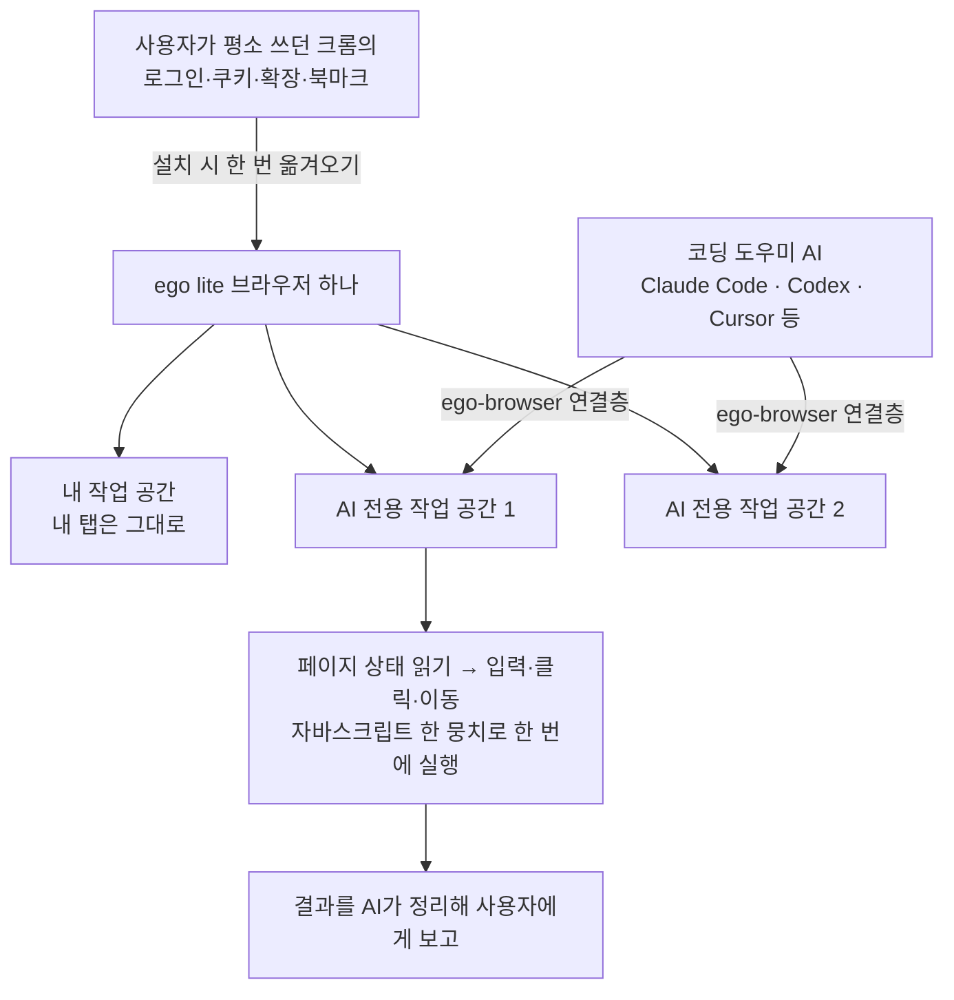

<div class="ai-knowledge-shell">

<aside class="ai-knowledge-sidebar">
  <p class="ai-eyebrow">CATEGORIES</p>
  <nav class="ai-cat-tree"><details class="ai-cat" open><summary><span class="catname">에이전트 오케스트레이션</span><span class="catcount">15</span></summary><ul><li><a href="https://altjs4510.github.io/ai_news_blog/knowledge/20260904/"><span class="kdate">2026-09-04</span><span class="ktitle">HarnessDev: Can LLMs Create and Evolve Their Own…</span></a></li><li><a href="https://altjs4510.github.io/ai_news_blog/knowledge/20260831-openexecutive-virtual-c-suite/"><span class="kdate">2026-08-31</span><span class="ktitle">Open Executive — 8명의 전문 에이전트를 하나의 임원 목소리로</span></a></li><li><a href="https://altjs4510.github.io/ai_news_blog/knowledge/20260828/"><span class="kdate">2026-08-28</span><span class="ktitle">Google ADK for Python v2.8.0 — RemoteA2aAgent 네이…</span></a></li><li><a href="https://altjs4510.github.io/ai_news_blog/knowledge/20260826/"><span class="kdate">2026-08-26</span><span class="ktitle">apache/maka — 도구 호출·권한 결정·종료 이벤트를 append-only 로그…</span></a></li><li><a href="https://altjs4510.github.io/ai_news_blog/knowledge/20260823/"><span class="kdate">2026-08-23</span><span class="ktitle">The Evolution of the Agent Harness — 하네스가 모델 가중치…</span></a></li><li><a href="https://altjs4510.github.io/ai_news_blog/knowledge/20260805/"><span class="kdate">2026-08-05</span><span class="ktitle">TencentCloud/TencentDB-Agent-Memory — 대화·문서·코드를 …</span></a></li><li><a href="https://altjs4510.github.io/ai_news_blog/knowledge/20260717/"><span class="kdate">2026-07-17</span><span class="ktitle">After a year building agent memory, 'save everyt…</span></a></li><li><a href="https://altjs4510.github.io/ai_news_blog/knowledge/20260709/"><span class="kdate">2026-07-09</span><span class="ktitle">mvanhorn/last30days-skill — Reddit·X·YouTube·HN·…</span></a></li><li><a href="https://altjs4510.github.io/ai_news_blog/knowledge/20260708/"><span class="kdate">2026-07-08</span><span class="ktitle">Expanding Managed Agents in Gemini API: backgrou…</span></a></li><li><a href="https://altjs4510.github.io/ai_news_blog/knowledge/20260623/"><span class="kdate">2026-06-23</span><span class="ktitle">bytedance/deer-flow — 샌드박스·메모리·서브에이전트·메시지 게이트웨이를…</span></a></li><li><a href="https://altjs4510.github.io/ai_news_blog/knowledge/20260621/"><span class="kdate">2026-06-21</span><span class="ktitle">calesthio/OpenMontage — 12 파이프라인·52 도구·500+ 스킬을 …</span></a></li><li><a href="https://altjs4510.github.io/ai_news_blog/knowledge/20260602/"><span class="kdate">2026-06-02</span><span class="ktitle">revfactory/harness — 도메인별 에이전트 팀과 스킬을 자동 설계하는 메타…</span></a></li><li><a href="https://altjs4510.github.io/ai_news_blog/knowledge/20260529/"><span class="kdate">2026-05-29</span><span class="ktitle">Introducing dynamic workflows in Claude Code</span></a></li><li><a href="https://altjs4510.github.io/ai_news_blog/knowledge/20260507/"><span class="kdate">2026-05-07</span><span class="ktitle">ruvnet/ruflo — Claude 멀티 에이전트 오케스트레이션 플랫폼</span></a></li><li><a href="https://altjs4510.github.io/ai_news_blog/knowledge/20260504/"><span class="kdate">2026-05-04</span><span class="ktitle">Agents for Everything Else: Codex for Knowledge …</span></a></li></ul></details><details class="ai-cat" open><summary><span class="catname">MCP &amp; 도구 통합</span><span class="catcount">17</span></summary><ul><li><a href="https://altjs4510.github.io/ai_news_blog/knowledge/20260829/"><span class="kdate">2026-08-29</span><span class="ktitle">cursor/plugins — 플러그인 명세(specification)와 공식 플러그인…</span></a></li><li><a href="https://altjs4510.github.io/ai_news_blog/knowledge/20260802/"><span class="kdate">2026-08-02</span><span class="ktitle">Stateless MCP has recaptured my interest (and in…</span></a></li><li><a href="https://altjs4510.github.io/ai_news_blog/knowledge/20260801/"><span class="kdate">2026-08-01</span><span class="ktitle">different-ai/openwork — Claude Cowork의 오픈소스 대체 에…</span></a></li><li><a href="https://altjs4510.github.io/ai_news_blog/knowledge/20260731/"><span class="kdate">2026-07-31</span><span class="ktitle">different-ai/openwork — Claude Cowork의 오픈소스 대안(o…</span></a></li><li><a href="https://altjs4510.github.io/ai_news_blog/knowledge/20260729/"><span class="kdate">2026-07-29</span><span class="ktitle">Bringing MCP 2026-07-28 to Claude</span></a></li><li><a href="https://altjs4510.github.io/ai_news_blog/knowledge/20260721/"><span class="kdate">2026-07-21</span><span class="ktitle">tirth8205/code-review-graph — 로컬 우선 코드 인텔리전스 그래프…</span></a></li><li><a href="https://altjs4510.github.io/ai_news_blog/knowledge/20260719/"><span class="kdate">2026-07-19</span><span class="ktitle">tirth8205/code-review-graph — 로컬 우선 코드 인텔리전스 그래프…</span></a></li><li><a href="https://altjs4510.github.io/ai_news_blog/knowledge/20260718/"><span class="kdate">2026-07-18</span><span class="ktitle">tirth8205/code-review-graph — MCP·CLI용 로컬 코드 인텔리…</span></a></li><li><a href="https://altjs4510.github.io/ai_news_blog/knowledge/20260701/"><span class="kdate">2026-07-01</span><span class="ktitle">Google OKF (Open Knowledge Format) — 벤더 중립 에이전트 …</span></a></li><li><a href="https://altjs4510.github.io/ai_news_blog/knowledge/20260618/"><span class="kdate">2026-06-18</span><span class="ktitle">DeusData/codebase-memory-mcp — 158개 언어 코드베이스를 밀리…</span></a></li><li><a href="https://altjs4510.github.io/ai_news_blog/knowledge/20260606/"><span class="kdate">2026-06-06</span><span class="ktitle">chopratejas/headroom — Compress tool outputs, lo…</span></a></li><li><a href="https://altjs4510.github.io/ai_news_blog/knowledge/20260605/"><span class="kdate">2026-06-05</span><span class="ktitle">chopratejas/headroom — Compress tool outputs, lo…</span></a></li><li><a href="https://altjs4510.github.io/ai_news_blog/knowledge/20260604/"><span class="kdate">2026-06-04</span><span class="ktitle">chopratejas/headroom — Compress tool outputs bef…</span></a></li><li><a href="https://altjs4510.github.io/ai_news_blog/knowledge/20260603/"><span class="kdate">2026-06-03</span><span class="ktitle">How Bad MCP design cost your Agent 5× more token…</span></a></li><li><a href="https://altjs4510.github.io/ai_news_blog/knowledge/20260523/"><span class="kdate">2026-05-23</span><span class="ktitle">colbymchenry/codegraph — 사전 인덱싱된 코드 지식 그래프 MCP</span></a></li><li><a href="https://altjs4510.github.io/ai_news_blog/knowledge/20260517/"><span class="kdate">2026-05-17</span><span class="ktitle">I gave my LLM 100,000+ tools — Lazy Discovery &a…</span></a></li><li><a href="https://altjs4510.github.io/ai_news_blog/knowledge/20260509/"><span class="kdate">2026-05-09</span><span class="ktitle">How to connect 100 MCP servers without the conte…</span></a></li></ul></details><details class="ai-cat" open><summary><span class="catname">코딩 에이전트</span><span class="catcount">31</span></summary><ul><li><a href="https://altjs4510.github.io/ai_news_blog/knowledge/20260906/"><span class="kdate">2026-09-06</span><span class="ktitle">DietrichGebert/ponytail — 에이전트를 '방에서 가장 게으른 시니어 …</span></a></li><li><a href="https://altjs4510.github.io/ai_news_blog/knowledge/20260903/"><span class="kdate">2026-09-03</span><span class="ktitle">pacifio/atlas — 여러 코딩 에이전트의 변경을 한곳에서 추적·질의하는 '에이…</span></a></li><li><a href="https://altjs4510.github.io/ai_news_blog/knowledge/20260901/"><span class="kdate">2026-09-01</span><span class="ktitle">affaan-m/ECC — 스킬·본능·메모리·보안을 묶은 에이전트 하네스 성능 최적화 …</span></a></li><li><a href="https://altjs4510.github.io/ai_news_blog/knowledge/20260831-gitnexus-code-knowledge-graph/"><span class="kdate">2026-08-31</span><span class="ktitle">GitNexus — 코드베이스를 지식그래프로 바꿔 에이전트에게 쥐어주기</span></a></li><li><a href="https://altjs4510.github.io/ai_news_blog/knowledge/20260822/"><span class="kdate">2026-08-22</span><span class="ktitle">mattpocock/skills — Skills for Real Engineers (하…</span></a></li><li><a href="https://altjs4510.github.io/ai_news_blog/knowledge/20260820/"><span class="kdate">2026-08-20</span><span class="ktitle">akitaonrails/ai-memory — 코딩 에이전트 CLI의 장기 메모리와 벤더…</span></a></li><li><a href="https://altjs4510.github.io/ai_news_blog/knowledge/20260819/"><span class="kdate">2026-08-19</span><span class="ktitle">akitaonrails/ai-memory — 코딩 에이전트 CLI 간 장기 기억과 벤더…</span></a></li><li><a href="https://altjs4510.github.io/ai_news_blog/knowledge/20260814/"><span class="kdate">2026-08-14</span><span class="ktitle">cathrynlavery/diagram-design — Claude Code용 에디토리…</span></a></li><li><a href="https://altjs4510.github.io/ai_news_blog/knowledge/20260811/"><span class="kdate">2026-08-11</span><span class="ktitle">PrimeIntellect-ai/prime-agent — 장기 자율 실행을 전제로 설계…</span></a></li><li><a href="https://altjs4510.github.io/ai_news_blog/knowledge/20260810/"><span class="kdate">2026-08-10</span><span class="ktitle">Auto mode is now the default in Claude Code for …</span></a></li><li><a href="https://altjs4510.github.io/ai_news_blog/knowledge/20260809/"><span class="kdate">2026-08-09</span><span class="ktitle">PrimeIntellect-ai/prime-agent — 코딩 워크플로우·장기 자율 작…</span></a></li><li><a href="https://altjs4510.github.io/ai_news_blog/knowledge/20260808/"><span class="kdate">2026-08-08</span><span class="ktitle">PrimeIntellect-ai/prime-agent — 코딩 워크플로우와 장시간 자율…</span></a></li><li><a href="https://altjs4510.github.io/ai_news_blog/knowledge/20260804/"><span class="kdate">2026-08-04</span><span class="ktitle">esengine/DeepSeek-Reasonix — prefix-cache 안정성을 축…</span></a></li><li><a href="https://altjs4510.github.io/ai_news_blog/knowledge/20260728/"><span class="kdate">2026-07-28</span><span class="ktitle">alibaba/open-code-review — 결정론적 파이프라인 + LLM 에이전트…</span></a></li><li><a href="https://altjs4510.github.io/ai_news_blog/knowledge/20260725/"><span class="kdate">2026-07-25</span><span class="ktitle">The new rules of context engineering for Claude …</span></a></li><li><a href="https://altjs4510.github.io/ai_news_blog/knowledge/20260722/"><span class="kdate">2026-07-22</span><span class="ktitle">tirth8205/code-review-graph — MCP·CLI용 로컬 우선 코드 …</span></a></li><li><a href="https://altjs4510.github.io/ai_news_blog/knowledge/20260714/"><span class="kdate">2026-07-14</span><span class="ktitle">Graphify-Labs/graphify — 코드베이스를 질의 가능한 지식 그래프로 만…</span></a></li><li><a href="https://altjs4510.github.io/ai_news_blog/knowledge/20260707/"><span class="kdate">2026-07-07</span><span class="ktitle">AI Hero Skills Catalog — 실무 엔지니어를 위한 재사용 가능한 판단 …</span></a></li><li><a href="https://altjs4510.github.io/ai_news_blog/knowledge/20260705/"><span class="kdate">2026-07-05</span><span class="ktitle">openai/codex-plugin-cc — Claude Code에서 Codex를 위임…</span></a></li><li><a href="https://altjs4510.github.io/ai_news_blog/knowledge/20260626/"><span class="kdate">2026-06-26</span><span class="ktitle">google-labs-code/design.md — 코딩 에이전트에게 디자인 시스템을 …</span></a></li><li><a href="https://altjs4510.github.io/ai_news_blog/knowledge/20260619/"><span class="kdate">2026-06-19</span><span class="ktitle">Claude Code now supports artifacts</span></a></li><li><a href="https://altjs4510.github.io/ai_news_blog/knowledge/20260530/"><span class="kdate">2026-05-30</span><span class="ktitle">Leonxlnx/taste-skill — AI에게 좋은 취향을 부여해 generic s…</span></a></li><li><a href="https://altjs4510.github.io/ai_news_blog/knowledge/20260528/"><span class="kdate">2026-05-28</span><span class="ktitle">Building self-improving tax agents with Codex</span></a></li><li><a href="https://altjs4510.github.io/ai_news_blog/knowledge/20260526/"><span class="kdate">2026-05-26</span><span class="ktitle">colbymchenry/codegraph — Pre-indexed code knowle…</span></a></li><li><a href="https://altjs4510.github.io/ai_news_blog/knowledge/20260524/"><span class="kdate">2026-05-24</span><span class="ktitle">colbymchenry/codegraph — Pre-indexed code knowle…</span></a></li><li><a href="https://altjs4510.github.io/ai_news_blog/knowledge/20260521/"><span class="kdate">2026-05-21</span><span class="ktitle">colbymchenry/codegraph — Pre-indexed code knowle…</span></a></li><li><a href="https://altjs4510.github.io/ai_news_blog/knowledge/20260512/"><span class="kdate">2026-05-12</span><span class="ktitle">agentmemory — Persistent memory for AI coding ag…</span></a></li><li><a href="https://altjs4510.github.io/ai_news_blog/knowledge/20260510/"><span class="kdate">2026-05-10</span><span class="ktitle">addyosmani/agent-skills — Production-grade engin…</span></a></li><li><a href="https://altjs4510.github.io/ai_news_blog/knowledge/20260508/"><span class="kdate">2026-05-08</span><span class="ktitle">addyosmani/agent-skills — Production-grade engin…</span></a></li><li><a href="https://altjs4510.github.io/ai_news_blog/knowledge/20260506/"><span class="kdate">2026-05-06</span><span class="ktitle">mksglu/context-mode — AI 코딩 에이전트용 컨텍스트 윈도우 최적화</span></a></li><li><a href="https://altjs4510.github.io/ai_news_blog/knowledge/20260505/"><span class="kdate">2026-05-05</span><span class="ktitle">mattpocock/skills — Skills for Real Engineers (.…</span></a></li></ul></details><details class="ai-cat" open><summary><span class="catname">모델 &amp; 연구</span><span class="catcount">6</span></summary><ul><li><a href="https://altjs4510.github.io/ai_news_blog/knowledge/20260821/"><span class="kdate">2026-08-21</span><span class="ktitle">volcengine/OpenViking — 에이전트 메모리·Knowledge RAG·스…</span></a></li><li><a href="https://altjs4510.github.io/ai_news_blog/knowledge/20260716-proprag/"><span class="kdate">2026-07-16</span><span class="ktitle">PropRAG — 프로포지션 경로 위 beam search로 멀티홉 검색 안내</span></a></li><li><a href="https://altjs4510.github.io/ai_news_blog/knowledge/20260620/"><span class="kdate">2026-06-20</span><span class="ktitle">zai-org/GLM-5 — From Vibe Coding to Agentic Engi…</span></a></li><li><a href="https://altjs4510.github.io/ai_news_blog/knowledge/20260617/"><span class="kdate">2026-06-17</span><span class="ktitle">Predicting model behavior before release by simu…</span></a></li><li><a href="https://altjs4510.github.io/ai_news_blog/knowledge/20260516/"><span class="kdate">2026-05-16</span><span class="ktitle">STALE — 에이전트가 자기 기억의 유효성을 인지할 수 있는가</span></a></li><li><a href="https://altjs4510.github.io/ai_news_blog/knowledge/20260513/"><span class="kdate">2026-05-13</span><span class="ktitle">Thinking Machines' Native Interaction Models — T…</span></a></li></ul></details><details class="ai-cat" open><summary><span class="catname">인프라 &amp; 컴퓨트</span><span class="catcount">10</span></summary><ul><li><a href="https://altjs4510.github.io/ai_news_blog/knowledge/20260905/"><span class="kdate">2026-09-05</span><span class="ktitle">magnitudedev/magnitude — 하드웨어에 맞는 최적 로컬 모델을 띄워 이…</span></a></li><li><a href="https://altjs4510.github.io/ai_news_blog/knowledge/20260813/"><span class="kdate">2026-08-13</span><span class="ktitle">semantica-agi/semantica — 컨텍스트와 책임 추적을 위한 그래프 네이…</span></a></li><li><a href="https://altjs4510.github.io/ai_news_blog/knowledge/20260812/"><span class="kdate">2026-08-12</span><span class="ktitle">semantica-agi/semantica — 컨텍스트와 '책임 추적 가능한(accou…</span></a></li><li><a href="https://altjs4510.github.io/ai_news_blog/knowledge/20260806/"><span class="kdate">2026-08-06</span><span class="ktitle">cloudflare/computer — 에이전트에게 컴퓨터를 통째로 주는 엣지 실행 샌…</span></a></li><li><a href="https://altjs4510.github.io/ai_news_blog/knowledge/20260724/"><span class="kdate">2026-07-24</span><span class="ktitle">diegosouzapw/OmniRoute — 단일 엔드포인트로 278+ 프로바이더·50…</span></a></li><li><a href="https://altjs4510.github.io/ai_news_blog/knowledge/20260723/"><span class="kdate">2026-07-23</span><span class="ktitle">diegosouzapw/OmniRoute — 268+ 프로바이더를 단일 엔드포인트로 묶…</span></a></li><li><a href="https://altjs4510.github.io/ai_news_blog/knowledge/20260630/"><span class="kdate">2026-06-30</span><span class="ktitle">Introducing the Claude apps gateway for Amazon B…</span></a></li><li><a href="https://altjs4510.github.io/ai_news_blog/knowledge/20260611/"><span class="kdate">2026-06-11</span><span class="ktitle">The evolution of agentic surfaces: building with…</span></a></li><li><a href="https://altjs4510.github.io/ai_news_blog/knowledge/20260522/"><span class="kdate">2026-05-22</span><span class="ktitle">Giving Agents Computers — Ivan Burazin, Daytona</span></a></li><li><a href="https://altjs4510.github.io/ai_news_blog/knowledge/20260520/"><span class="kdate">2026-05-20</span><span class="ktitle">New in Claude Managed Agents: self-hosted sandbo…</span></a></li></ul></details><details class="ai-cat" open><summary><span class="catname">보안 &amp; 거버넌스</span><span class="catcount">17</span></summary><ul><li><a href="https://altjs4510.github.io/ai_news_blog/knowledge/20260902/"><span class="kdate">2026-09-02</span><span class="ktitle">AIR raises $50M to help companies vet the skills…</span></a></li><li><a href="https://altjs4510.github.io/ai_news_blog/knowledge/20260827/"><span class="kdate">2026-08-27</span><span class="ktitle">Claude in Chrome is generally available</span></a></li><li><a href="https://altjs4510.github.io/ai_news_blog/knowledge/20260819-mind-viruses/"><span class="kdate">2026-08-19</span><span class="ktitle">탈옥도, 인젝션도 없이 — 대화로만 퍼지는 에이전트의 '마인드 바이러스'</span></a></li><li><a href="https://altjs4510.github.io/ai_news_blog/knowledge/20260730/"><span class="kdate">2026-07-30</span><span class="ktitle">Anatomy of a Frontier Lab Agent Intrusion: A Tec…</span></a></li><li><a href="https://altjs4510.github.io/ai_news_blog/knowledge/20260716/"><span class="kdate">2026-07-16</span><span class="ktitle">Dicklesworthstone/destructive_command_guard — 에이…</span></a></li><li><a href="https://altjs4510.github.io/ai_news_blog/knowledge/20260715/"><span class="kdate">2026-07-15</span><span class="ktitle">Dicklesworthstone/destructive_command_guard — 에이…</span></a></li><li><a href="https://altjs4510.github.io/ai_news_blog/knowledge/20260710/"><span class="kdate">2026-07-10</span><span class="ktitle">70개 MCP 서버 strace 런타임 감사 — 부팅 시 아웃바운드 호출 서버 적발</span></a></li><li><a href="https://altjs4510.github.io/ai_news_blog/knowledge/20260704/"><span class="kdate">2026-07-04</span><span class="ktitle">Cloudflare is about to block AI agents by defaul…</span></a></li><li><a href="https://altjs4510.github.io/ai_news_blog/knowledge/20260703/"><span class="kdate">2026-07-03</span><span class="ktitle">Giving admins more visibility and control over C…</span></a></li><li><a href="https://altjs4510.github.io/ai_news_blog/knowledge/20260625/"><span class="kdate">2026-06-25</span><span class="ktitle">Agent identity in Claude Tag: a new access model…</span></a></li><li><a href="https://altjs4510.github.io/ai_news_blog/knowledge/20260624/"><span class="kdate">2026-06-24</span><span class="ktitle">Agent identity in Claude Tag: a new access model…</span></a></li><li><a href="https://altjs4510.github.io/ai_news_blog/knowledge/20260614/"><span class="kdate">2026-06-14</span><span class="ktitle">NVIDIA/SkillSpector — Security scanner for AI ag…</span></a></li><li><a href="https://altjs4510.github.io/ai_news_blog/knowledge/20260613/"><span class="kdate">2026-06-13</span><span class="ktitle">Fable 5's guardrails got bypassed in 48 hours — …</span></a></li><li><a href="https://altjs4510.github.io/ai_news_blog/knowledge/20260612/"><span class="kdate">2026-06-12</span><span class="ktitle">NVIDIA/SkillSpector — AI 에이전트 스킬용 보안 스캐너</span></a></li><li><a href="https://altjs4510.github.io/ai_news_blog/knowledge/20260607/"><span class="kdate">2026-06-07</span><span class="ktitle">OpenAI Help: Lockdown Mode</span></a></li><li><a href="https://altjs4510.github.io/ai_news_blog/knowledge/20260531/"><span class="kdate">2026-05-31</span><span class="ktitle">How we contain Claude across products</span></a></li><li><a href="https://altjs4510.github.io/ai_news_blog/knowledge/20260527/"><span class="kdate">2026-05-27</span><span class="ktitle">Microsoft Copilot Cowork Exfiltrates Files</span></a></li></ul></details><details class="ai-cat" open><summary><span class="catname">응용 사례</span><span class="catcount">5</span></summary><ul><li><a href="https://altjs4510.github.io/ai_news_blog/knowledge/20260726/" class="current"><span class="kdate">2026-07-26</span><span class="ktitle">citrolabs/ego-lite — 로그인된 브라우저 상태를 AI 에이전트와 공유하는…</span></a></li><li><a href="https://altjs4510.github.io/ai_news_blog/knowledge/20260712/"><span class="kdate">2026-07-12</span><span class="ktitle">Do Automated Evals Work?</span></a></li><li><a href="https://altjs4510.github.io/ai_news_blog/knowledge/20260609/"><span class="kdate">2026-06-09</span><span class="ktitle">Building intelligent apps for Apple platforms wi…</span></a></li><li><a href="https://altjs4510.github.io/ai_news_blog/knowledge/20260515/"><span class="kdate">2026-05-15</span><span class="ktitle">Clawdmeter — Claude Code 사용량을 데스크톱 대시보드로</span></a></li><li><a href="https://altjs4510.github.io/ai_news_blog/knowledge/20260514/"><span class="kdate">2026-05-14</span><span class="ktitle">Introducing Claude for Small Business</span></a></li></ul></details><details class="ai-cat" open><summary><span class="catname">산업 동향</span><span class="catcount">6</span></summary><ul><li><a href="https://altjs4510.github.io/ai_news_blog/knowledge/20260830/"><span class="kdate">2026-08-30</span><span class="ktitle">[AINews] OpenAI shuts off Cursor — 프론티어 모델 공급 차단…</span></a></li><li><a href="https://altjs4510.github.io/ai_news_blog/knowledge/20260711/"><span class="kdate">2026-07-11</span><span class="ktitle">OpenAI says GPT 5.6 is the 'preferred model' for…</span></a></li><li><a href="https://altjs4510.github.io/ai_news_blog/knowledge/20260702/"><span class="kdate">2026-07-02</span><span class="ktitle">How Cursor deploys AI inside the enterprise (For…</span></a></li><li><a href="https://altjs4510.github.io/ai_news_blog/knowledge/20260616/"><span class="kdate">2026-06-16</span><span class="ktitle">Why AI hasn't replaced software engineers, and w…</span></a></li><li><a href="https://altjs4510.github.io/ai_news_blog/knowledge/20260610/"><span class="kdate">2026-06-10</span><span class="ktitle">Fable 5 just made cost-aware model routing manda…</span></a></li><li><a href="https://altjs4510.github.io/ai_news_blog/knowledge/20260519/"><span class="kdate">2026-05-19</span><span class="ktitle">Anthropic acquires Stainless</span></a></li></ul></details></nav>
</aside>

<article class="ai-knowledge-article">

<header class="ai-post-hero">
  <p class="ai-eyebrow"><a class="ai-back" href="../">KNOWLEDGE</a> · 2026-07-26 · 오늘의 학습</p>
  <h2 class="ai-post-title">citrolabs/ego-lite — 로그인된 브라우저 상태를 AI 에이전트와 공유하는 웹 자동화 브라우저</h2>
</header>

> 원문: [citrolabs/ego-lite — 로그인된 브라우저 상태를 AI 에이전트와 공유하는 웹 자동화 브라우저](https://github.com/citrolabs/ego-lite)

## 📌 학습 정리

### 1. 한 줄로 말하면

내가 이미 로그인해 둔 브라우저를, AI 비서가 옆 칸에서 대신 써 주는 브라우저예요. 내 탭은 그대로 두고, 비서는 자기 작업 공간에서 따로 일합니다.

### 2. 왜 이게 만들어졌어요?

지금까지 AI에게 웹 작업을 시키려면 브라우저를 자동으로 조종해 주는 도구(browser-use, agent-browser 같은 자동화 라이브러리)를 썼어요. 그런데 이런 도구들은 자기 브라우저가 없어서 조종할 브라우저를 따로 띄워야 하고, 그러다 보니 내가 평소 쓰던 로그인 상태가 깔끔하게 옮겨가지 않는 문제가 있었습니다. 결국 AI가 뭔가 하려 할 때마다 로그인 벽에 막히거나, 같은 탭을 나와 AI가 서로 뺏고 뺏기는 상황이 벌어졌죠. 반대로 ChatGPT Atlas나 Perplexity Comet처럼 AI가 내장된 브라우저도 있지만, 이번엔 그 안에 들어 있는 AI만 브라우저를 조종할 수 있어서 내가 쓰던 다른 AI 도구를 붙일 수가 없었습니다. ego lite는 "브라우저는 하나인데, 나와 어떤 AI든 같이 나눠 쓰도록 처음부터 설계하자"는 쪽으로 방향을 잡은 도구예요.

### 3. 비유로 풀면

이건 마치 **한 사무실에 칸막이 책상을 여러 개 놓은 것** 같은 거예요. 사무실 출입증(로그인 정보)은 하나로 공유하지만, 내 책상과 비서의 책상은 따로라 서로 서류를 건드리지 않습니다. 비서가 여러 명이면 책상도 여러 개 내주고, 각자 다른 일을 동시에 처리하죠.

또 하나는 **주문 방식의 차이**예요. 기존 방식이 "이거 눌러줘 → 결과 볼게 → 그다음 눌러줘"를 한 줄씩 주고받는 거라면, ego lite는 "여기 순서대로 다 적어놨으니 한 번에 처리해줘"라고 메모지 한 장을 건네는 쪽에 가깝습니다.

그래서 결국, 로그인은 나눠 쓰되 작업 공간은 분리하고, 오가는 대화 횟수를 줄여서 일을 빨리 끝내겠다는 구조예요.

### 4. 어떻게 작동하는지 (그림으로)



설치할 때 크롬 데이터를 옮길지 한 번 물어보고, 예라고 하면 기존 로그인·쿠키·확장 프로그램·북마크를 그대로 물려받습니다. 그다음부터 AI는 `ego-browser`라는 연결층을 통해 자기 전용 공간에서 페이지를 열고, 화면 상태를 읽고, 입력하고 클릭하는 동작을 코드 한 덩어리로 묶어 한 번에 실행해요. 그동안 내 탭과 마우스 커서는 건드려지지 않고, 어느 공간에서 AI가 돌고 있는지 눈으로 확인해 중간에 넘겨받거나 멈출 수도 있습니다. 브라우징 데이터는 내 기기에 남고, 기록되는 건 설치 때 크롬 데이터 이전에 동의했는지 여부뿐이라고 안내합니다.

### 5. 처음 보는 용어 풀이

- **작업 공간 (Space)** — 같은 브라우저 안에 나뉘어 있는 독립된 칸이에요. AI 하나당 혹은 작업 하나당 칸을 하나씩 주면, 여러 작업이 동시에 돌아가도 서로 탭을 뺏지 않습니다.
- **페이지 요약본 (Snapshot)** — 웹페이지를 글자 위주로 정리해 AI가 "볼" 수 있게 만든 화면 설명서예요. AI는 이미지가 아니라 이 요약본을 읽고 어디를 눌러야 할지 판단합니다. 페이지 안에 또 다른 페이지가 겹겹이 박혀 있는 구조(iframe, 인라인 프레임)처럼 까다로운 경우를 잘 처리하는 게 이 도구가 내세우는 강점이에요.
- **연결층 ego-browser** — 어떤 AI 도구든 이 브라우저를 조종할 수 있게 이어 주는 다리예요. 화면 읽기, 입력, 클릭, 대기, 페이지 이동, 캡처 같은 동작을 함수 형태로 열어 두고, AI가 그 함수들을 부르는 짧은 코드를 써서 넘기면 한 번에 실행됩니다.
- **명령줄 방식 (CLI base)와 코드 방식 (Code base)** — 명령줄 방식은 명령 한두 개 보내고 결과 보고 또 보내는 왕복 구조고, 코드 방식은 여러 단계를 코드 한 덩어리로 묶어 한 번에 넘기는 구조예요. 원문은 코드 방식이 복잡한 작업에서 최대 2.5배 빠르고 주고받는 횟수와 소비량이 훨씬 적었다고 밝히고 있습니다.
- **AI에게 붙여 주는 사용법 묶음 (Skill)** — AI가 "이 브라우저는 이렇게 쓰는 거야"를 알게 해 주는 설명 꾸러미예요. 설치하면 기기 안 모든 AI 도구의 설명 폴더에 이 꾸러미가 추가됩니다.
- **경험 축적 (Experience accumulation, 준비 중)** — 성공한 작업 절차를 다시 쓸 수 있는 형태로 모아 두는 기능이에요. 비슷한 일이 다음에 들어오면 시행착오를 건너뛰어 최대 5배 빨라진다고 소개하지만, 아직 공개 전인 예고 기능입니다.
- **성능 비교 측정 (Benchmark)** — 같은 작업을 여러 도구에 시켜 속도와 자원 소모를 재 보는 절차예요. 여기서는 복잡한 웹 자동화 작업 네 가지로 agent-browser와 비교했고, 어려운 작업일수록 격차가 벌어졌다고 밝힙니다.

### 6. 한 발 더 들어가고 싶다면

- [citrolabs/ego-lite 저장소](https://github.com/citrolabs/ego-lite) — 설치 방법 세 가지와 첫 작업 실행 예시, 다른 도구들과의 기능 비교표를 원문 그대로 볼 수 있어요.
- [공식 문서 lite.ego.app/document/](https://lite.ego.app/document/) — 튜토리얼과 도구 목록 전체 설명, 다른 AI 도구에 붙이는 연동 가이드가 정리돼 있어요.

한 가지 감안할 점은, 현재 맥(macOS)에서만 돌아가고 윈도우·리눅스는 앞으로의 계획 단계라는 거예요. 기능 비교표나 속도 수치는 만든 쪽이 직접 낸 자료라, 실제로 쓸 땐 내 작업 유형으로 한번 확인해 보는 편이 안전합니다.

---

## 📖 원문 전체 번역 (정독용)

> 의역 최소화한 전체 번역입니다. 큰 흐름은 위 정리에서 잡고, 정확한 워딩이 필요할 땐 이 섹션에서 정독하세요.

가장 빠른 AI 에이전트용 웹 자동화 브라우저

ego (lite)는 여러분과 여러분의 AI 에이전트가 병렬로 작업하는 브라우저입니다. 여러분의 탭은 여러분 것으로 유지되는 동안, 에이전트는 자신만의 Space에서 여러 브라우저 작업을 실행하며, 작업은 더 적은 토큰으로 더 빠르게 완료됩니다.

browser-use나 agent-browser 같은 기존 도구들은 브라우저 자동화 프레임워크입니다: 이들은 구동할 별도의 브라우저가 필요하고, 로그인이 깔끔하게 이어지지 않으며, 결국 사용자와 에이전트가 같은 탭을 두고 다투게 됩니다. ego lite는 처음부터 두 주체(사용자와 에이전트)가 공유하도록 설계된 하나의 브라우저입니다. 별도 설정이 필요 없고, 에이전트는 `ego-browser`를 통해 언제나 여러분의 실제 로그인과 탭에 접근할 수 있습니다.

데모
01_codex_x_scape_1080p_265.mp4

빠른 시작

ego lite는 현재 macOS에서 실행됩니다. Windows와 Linux는 로드맵에 있습니다.

1. 설치

여러분의 작업 흐름에 맞는 방법을 고르세요.

1.1 macOS 앱 다운로드

클릭해서 다운로드한 다음, 열어서 설치하세요. 어느 방법이든 ego lite는 여러분 컴퓨터의 모든 에이전트 스킬 디렉토리에 `ego-browser` 스킬을 추가합니다.

1.2 npx로 스킬 추가

`ego-browser` 스킬만 설치:

```
npx skills add citrolabs/ego-lite
```

에이전트가 처음 브라우저 작업을 실행할 때, ego lite 앱 설치 과정을 안내해줍니다.

1.3 에이전트가 직접 설정하도록 하기

다음을 에이전트에 붙여넣으세요:

```
Set up ego lite for me: https://github.com/citrolabs/ego-lite

Read `skills/ego-browser/references/install.md` and follow the steps to install ego lite.
```

최초 실행 시 ego lite는 한 가지 질문을 합니다 — Chrome 데이터를 마이그레이션할지 여부입니다. "예"라고 답하면 에이전트는 여러분의 기존 로그인, 쿠키, 확장 프로그램, 북마크를 그대로 물려받습니다.

2. 첫 작업 실행하기

에이전트 CLI에서 `/ego-browser`를 입력하고 그 뒤에 공백을 넣은 다음, 원하는 것을 평문으로 설명하세요:

```
ego-browser follow @ego_agent on x.com for me
```

에이전트는 `ego-browser` 스킬을 사용해 자신만의 Space에서 페이지를 열고, Snapshot을 읽고, 페이지에서 동작을 수행한 뒤 결과를 보고합니다 — 그동안 여러분 자신의 탭은 전혀 건드려지지 않습니다.

여러분의 브라우징 데이터는 여러분 기기에 그대로 남습니다. ego lite는 설정 중 Chrome 마이그레이션에 동의했는지 여부만 기록합니다.

ego lite의 하이라이트

| 기능 | 하는 일 |
|---|---|
| CLI 기반이 아닌 코드 기반 — 복잡한 작업에서 더 빠른 실행과 더 적은 토큰 | ego lite가 에이전트에게 노출하는 기능들은 에이전트가 직접 호출하는 JavaScript 함수로 감싸져 있습니다. 에이전트는 자신이 가장 잘하는 일, 즉 코드를 작성하는 일을 하게 되어, 여러 단계로 구성된 작업을 "명령어 두 개 호출 → 결과 확인 → 명령어 두 개 더 호출" 하는 반복 루프에 갇히는 대신 하나의 출력으로 구성해냅니다. 기존의 CLI 방식과 비교했을 때, 복잡한 워크플로우는 최대 2.5배 더 빠르게 끝나면서도 작업 성공률은 더 높고 작업당 도구 호출 수는 훨씬 적습니다. |
| 모든 에이전트를 위한 전용 Space | ego lite는 각 에이전트에게 완전히 격리된 자신만의 Space를 제공합니다. 여러분은 앞단에서 브라우징하고, 에이전트는 백그라운드에서 작업하며, 서로 방해하지 않습니다. 어느 순간이든 어떤 Space에서 에이전트가 실행 중인지 볼 수 있고, 원할 때 언제든 그것을 넘겨받거나 중지할 수 있습니다. |
| 같은 브라우저 안의 병렬 작업공간인 Space에서 여러분의 에이전트들이 멀티태스킹 | 각 Space는 자신만의 AI 에이전트 또는 자신만의 작업을 가지며, 모두 동시에 실행됩니다. Claude Code가 10개의 병렬 Space에서 10개의 리드를 보강하는 동안, Codex는 5개의 추가 Space에서 5개의 경쟁사 사이트를 스크래핑합니다. 이들은 서로 충돌하지 않고 여러분의 탭을 가로채지도 않습니다. 여러분의 마우스는 여러분이 놓아둔 그 자리에 그대로 있습니다. |
| 시장에서 가장 강력한 페이지 Snapshot | 커널 수준의 커스터마이징 덕분에 ego lite는 최고 품질의 페이지 스냅샷을 만들어냅니다 — 텍스트 기반 모델이 웹페이지를 "보고" 동작하기 위해 의존하는 그 뷰입니다. 다른 접근 방식들이 일관되게 무너지는 지점인 깊게 중첩된 iframe 같은 까다로운 케이스들도 안정적으로 처리합니다. |
| `ego-browser`를 통해 어떤 에이전트든 이를 구동 가능 | `ego-browser`는 어떤 에이전트 CLI(Claude Code, Codex, Cursor, 또는 커스텀 CLI)와 ego lite 사이를 잇는 연결 계층입니다. 브라우저를 snapshot, fill, click, wait, navigate, capture 등 페이지 내 JavaScript 도구 집합으로 노출합니다. 에이전트는 이러한 도구들을 호출하는 JavaScript 스니펫을 작성하고, `ego-browser`는 이를 한 번에 페이지에서 실행합니다. |
| 사용할수록 에이전트가 빨라지는 경험 축적 (곧 출시 예정) | 브라우저 작업에서 에이전트가 쓰는 시간 대부분은 시행착오에 소요됩니다. ego lite의 공식 Skill은 성공한 모든 동작을 재사용 가능한 도구와 워크플로우로 정제해, 이후 비슷한 작업들은 최대 5배 더 빠르게 실행됩니다. |

기존 제품 대비 ego lite

대부분의 도구가 브라우저를 자동화할 수 있습니다. 진짜 문제는 에이전트가 어떤 브라우저를 갖게 되는지, 그 동안 여러분이 계속 작업을 이어갈 수 있는지, 그리고 그 도구가 여러분이 이미 쓰고 있는 에이전트를 위해 만들어졌는지 아니면 내장 에이전트를 위한 것인지입니다.

| 기능 | ego lite | Browser-Use | agent-browser (Vercel) | ChatGPT Atlas | Perplexity Comet |
|---|---|---|---|---|---|
| 병렬 멀티태스킹 | ✓ | — | — | — | — |
| 재사용 가능한 스킬 | ✓ | — | — | — | — |
| Chrome 데이터 상속 | ✓ | — | — | ✓ | ✓ |
| 같은 브라우저, 분리된 작업공간 | ✓ | — | — | — | — |
| 압축된 시맨틱 입력 | ✓ | — | ✓ | — | — |
| 외부 에이전트로 제어 가능 | ✓ | ✓ | ✓ | — | — |
| 데이터 로컬 저장 | ✓ | ✓ | ✓ | — | — |
| 로그인 마찰 없음 | ✓ | — | — | ✓ | ✓ |
| 일상용 브라우저 | ✓ | — | — | ✓ | ✓ |
| 무료 | ✓ | ✓ | ✓ | — | — |

같은 문제를 풀려는 시도가 두 가지 다른 범주에 더 있습니다. Browser-Use와 Vercel의 agent-browser 같은 브라우저 자동화 프레임워크는 에이전트가 호출하는 라이브러리입니다. 이들은 자체 브라우저를 제공하지 않으므로 구동할 별도의 브라우저가 필요하고, 여러분의 로그인은 거의 깔끔하게 이어지지 않습니다. ChatGPT Atlas와 Perplexity Comet 같은 AI 브라우저는 내장 에이전트를 함께 제공하며, 오직 그 에이전트만이 브라우저를 구동할 수 있습니다. ego lite는 처음부터 여러분과 여러분이 데려오는 어떤 에이전트든 함께 쓰도록 설계된 하나의 브라우저입니다.

벤치마크

우리는 네 가지 복잡한 브라우저 자동화 작업에서 ego lite를 Vercel의 agent-browser와 벤치마크했습니다. ego lite는 각 작업을 최대 2.5배 더 빠르게 끝냈으며, 토큰 사용량도 상당히 더 적었습니다. 작업이 어려울수록 그 격차는 더 커졌습니다. 비교 내용을 확인하세요.

문서

튜토리얼, 전체 도구 레퍼런스, 통합 가이드는 lite.ego.app/document/ 에 있습니다.

커뮤니티
- Discord, 질문/설정 도움/스킬 공유
- GitHub Discussions, 아이디어와 더 긴 스레드
- X/Twitter, 업데이트와 릴리스

스타 히스토리

라이선스

이 저장소의 콘텐츠는 MIT License 하에 배포됩니다. ego lite 브라우저는 별도의 무료 다운로드 제품입니다.

</article>

</div>

<!-- ai-related-links -->
<aside class="ai-related-links">
  <p class="ai-eyebrow">관련 학습</p>
  <ul><li><a href="https://altjs4510.github.io/ai_news_blog/knowledge/20260723/"><span class="kdate">2026-07-23</span><span class="ktitle">diegosouzapw/OmniRoute — 268+ 프로바이더를 단일 엔드포인트로 묶…</span></a></li><li><a href="https://altjs4510.github.io/ai_news_blog/knowledge/20260624/"><span class="kdate">2026-06-24</span><span class="ktitle">Agent identity in Claude Tag: a new access model…</span></a></li><li><a href="https://altjs4510.github.io/ai_news_blog/knowledge/20260527/"><span class="kdate">2026-05-27</span><span class="ktitle">Microsoft Copilot Cowork Exfiltrates Files</span></a></li></ul>
</aside>
<!-- /ai-related-links -->
