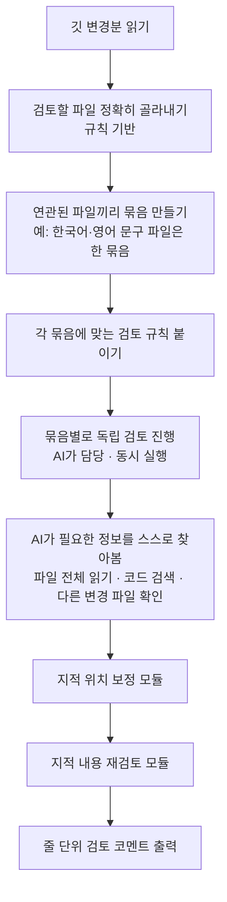

<div class="ai-knowledge-shell">

<aside class="ai-knowledge-sidebar">
  <p class="ai-eyebrow">CATEGORIES</p>
  <nav class="ai-cat-tree"><details class="ai-cat" open><summary><span class="catname">에이전트 오케스트레이션</span><span class="catcount">14</span></summary><ul><li><a href="https://altjs4510.github.io/ai_news_blog/knowledge/20260904/"><span class="kdate">2026-09-04</span><span class="ktitle">HarnessDev: Can LLMs Create and Evolve Their Own…</span></a></li><li><a href="https://altjs4510.github.io/ai_news_blog/knowledge/20260831-openexecutive-virtual-c-suite/"><span class="kdate">2026-08-31</span><span class="ktitle">Open Executive — 8명의 전문 에이전트를 하나의 임원 목소리로</span></a></li><li><a href="https://altjs4510.github.io/ai_news_blog/knowledge/20260828/"><span class="kdate">2026-08-28</span><span class="ktitle">Google ADK for Python v2.8.0 — RemoteA2aAgent 네이…</span></a></li><li><a href="https://altjs4510.github.io/ai_news_blog/knowledge/20260826/"><span class="kdate">2026-08-26</span><span class="ktitle">apache/maka — 도구 호출·권한 결정·종료 이벤트를 append-only 로그…</span></a></li><li><a href="https://altjs4510.github.io/ai_news_blog/knowledge/20260823/"><span class="kdate">2026-08-23</span><span class="ktitle">The Evolution of the Agent Harness — 하네스가 모델 가중치…</span></a></li><li><a href="https://altjs4510.github.io/ai_news_blog/knowledge/20260805/"><span class="kdate">2026-08-05</span><span class="ktitle">TencentCloud/TencentDB-Agent-Memory — 대화·문서·코드를 …</span></a></li><li><a href="https://altjs4510.github.io/ai_news_blog/knowledge/20260717/"><span class="kdate">2026-07-17</span><span class="ktitle">After a year building agent memory, 'save everyt…</span></a></li><li><a href="https://altjs4510.github.io/ai_news_blog/knowledge/20260708/"><span class="kdate">2026-07-08</span><span class="ktitle">Expanding Managed Agents in Gemini API: backgrou…</span></a></li><li><a href="https://altjs4510.github.io/ai_news_blog/knowledge/20260707/"><span class="kdate">2026-07-07</span><span class="ktitle">AI Hero Skills Catalog — 실무 엔지니어를 위한 재사용 가능한 판단 …</span></a></li><li><a href="https://altjs4510.github.io/ai_news_blog/knowledge/20260623/"><span class="kdate">2026-06-23</span><span class="ktitle">bytedance/deer-flow — 샌드박스·메모리·서브에이전트·메시지 게이트웨이를…</span></a></li><li><a href="https://altjs4510.github.io/ai_news_blog/knowledge/20260611/"><span class="kdate">2026-06-11</span><span class="ktitle">The evolution of agentic surfaces: building with…</span></a></li><li><a href="https://altjs4510.github.io/ai_news_blog/knowledge/20260602/"><span class="kdate">2026-06-02</span><span class="ktitle">revfactory/harness — 도메인별 에이전트 팀과 스킬을 자동 설계하는 메타…</span></a></li><li><a href="https://altjs4510.github.io/ai_news_blog/knowledge/20260529/"><span class="kdate">2026-05-29</span><span class="ktitle">Introducing dynamic workflows in Claude Code</span></a></li><li><a href="https://altjs4510.github.io/ai_news_blog/knowledge/20260507/"><span class="kdate">2026-05-07</span><span class="ktitle">ruvnet/ruflo — Claude 멀티 에이전트 오케스트레이션 플랫폼</span></a></li></ul></details><details class="ai-cat" open><summary><span class="catname">MCP &amp; 도구 통합</span><span class="catcount">20</span></summary><ul><li><a href="https://altjs4510.github.io/ai_news_blog/knowledge/20260829/"><span class="kdate">2026-08-29</span><span class="ktitle">cursor/plugins — 플러그인 명세(specification)와 공식 플러그인…</span></a></li><li><a href="https://altjs4510.github.io/ai_news_blog/knowledge/20260802/"><span class="kdate">2026-08-02</span><span class="ktitle">Stateless MCP has recaptured my interest (and in…</span></a></li><li><a href="https://altjs4510.github.io/ai_news_blog/knowledge/20260801/"><span class="kdate">2026-08-01</span><span class="ktitle">different-ai/openwork — Claude Cowork의 오픈소스 대체 에…</span></a></li><li><a href="https://altjs4510.github.io/ai_news_blog/knowledge/20260731/"><span class="kdate">2026-07-31</span><span class="ktitle">different-ai/openwork — Claude Cowork의 오픈소스 대안(o…</span></a></li><li><a href="https://altjs4510.github.io/ai_news_blog/knowledge/20260729/"><span class="kdate">2026-07-29</span><span class="ktitle">Bringing MCP 2026-07-28 to Claude</span></a></li><li><a href="https://altjs4510.github.io/ai_news_blog/knowledge/20260726/"><span class="kdate">2026-07-26</span><span class="ktitle">citrolabs/ego-lite — 로그인된 브라우저 상태를 AI 에이전트와 공유하는…</span></a></li><li><a href="https://altjs4510.github.io/ai_news_blog/knowledge/20260721/"><span class="kdate">2026-07-21</span><span class="ktitle">tirth8205/code-review-graph — 로컬 우선 코드 인텔리전스 그래프…</span></a></li><li><a href="https://altjs4510.github.io/ai_news_blog/knowledge/20260719/"><span class="kdate">2026-07-19</span><span class="ktitle">tirth8205/code-review-graph — 로컬 우선 코드 인텔리전스 그래프…</span></a></li><li><a href="https://altjs4510.github.io/ai_news_blog/knowledge/20260718/"><span class="kdate">2026-07-18</span><span class="ktitle">tirth8205/code-review-graph — MCP·CLI용 로컬 코드 인텔리…</span></a></li><li><a href="https://altjs4510.github.io/ai_news_blog/knowledge/20260709/"><span class="kdate">2026-07-09</span><span class="ktitle">mvanhorn/last30days-skill — Reddit·X·YouTube·HN·…</span></a></li><li><a href="https://altjs4510.github.io/ai_news_blog/knowledge/20260701/"><span class="kdate">2026-07-01</span><span class="ktitle">Google OKF (Open Knowledge Format) — 벤더 중립 에이전트 …</span></a></li><li><a href="https://altjs4510.github.io/ai_news_blog/knowledge/20260618/"><span class="kdate">2026-06-18</span><span class="ktitle">DeusData/codebase-memory-mcp — 158개 언어 코드베이스를 밀리…</span></a></li><li><a href="https://altjs4510.github.io/ai_news_blog/knowledge/20260606/"><span class="kdate">2026-06-06</span><span class="ktitle">chopratejas/headroom — Compress tool outputs, lo…</span></a></li><li><a href="https://altjs4510.github.io/ai_news_blog/knowledge/20260605/"><span class="kdate">2026-06-05</span><span class="ktitle">chopratejas/headroom — Compress tool outputs, lo…</span></a></li><li><a href="https://altjs4510.github.io/ai_news_blog/knowledge/20260604/"><span class="kdate">2026-06-04</span><span class="ktitle">chopratejas/headroom — Compress tool outputs bef…</span></a></li><li><a href="https://altjs4510.github.io/ai_news_blog/knowledge/20260603/"><span class="kdate">2026-06-03</span><span class="ktitle">How Bad MCP design cost your Agent 5× more token…</span></a></li><li><a href="https://altjs4510.github.io/ai_news_blog/knowledge/20260523/"><span class="kdate">2026-05-23</span><span class="ktitle">colbymchenry/codegraph — 사전 인덱싱된 코드 지식 그래프 MCP</span></a></li><li><a href="https://altjs4510.github.io/ai_news_blog/knowledge/20260519/"><span class="kdate">2026-05-19</span><span class="ktitle">Anthropic acquires Stainless</span></a></li><li><a href="https://altjs4510.github.io/ai_news_blog/knowledge/20260517/"><span class="kdate">2026-05-17</span><span class="ktitle">I gave my LLM 100,000+ tools — Lazy Discovery &a…</span></a></li><li><a href="https://altjs4510.github.io/ai_news_blog/knowledge/20260509/"><span class="kdate">2026-05-09</span><span class="ktitle">How to connect 100 MCP servers without the conte…</span></a></li></ul></details><details class="ai-cat" open><summary><span class="catname">코딩 에이전트</span><span class="catcount">30</span></summary><ul><li><a href="https://altjs4510.github.io/ai_news_blog/knowledge/20260903/"><span class="kdate">2026-09-03</span><span class="ktitle">pacifio/atlas — 여러 코딩 에이전트의 변경을 한곳에서 추적·질의하는 '에이…</span></a></li><li><a href="https://altjs4510.github.io/ai_news_blog/knowledge/20260901/"><span class="kdate">2026-09-01</span><span class="ktitle">affaan-m/ECC — 스킬·본능·메모리·보안을 묶은 에이전트 하네스 성능 최적화 …</span></a></li><li><a href="https://altjs4510.github.io/ai_news_blog/knowledge/20260831-gitnexus-code-knowledge-graph/"><span class="kdate">2026-08-31</span><span class="ktitle">GitNexus — 코드베이스를 지식그래프로 바꿔 에이전트에게 쥐어주기</span></a></li><li><a href="https://altjs4510.github.io/ai_news_blog/knowledge/20260822/"><span class="kdate">2026-08-22</span><span class="ktitle">mattpocock/skills — Skills for Real Engineers (하…</span></a></li><li><a href="https://altjs4510.github.io/ai_news_blog/knowledge/20260820/"><span class="kdate">2026-08-20</span><span class="ktitle">akitaonrails/ai-memory — 코딩 에이전트 CLI의 장기 메모리와 벤더…</span></a></li><li><a href="https://altjs4510.github.io/ai_news_blog/knowledge/20260819/"><span class="kdate">2026-08-19</span><span class="ktitle">akitaonrails/ai-memory — 코딩 에이전트 CLI 간 장기 기억과 벤더…</span></a></li><li><a href="https://altjs4510.github.io/ai_news_blog/knowledge/20260814/"><span class="kdate">2026-08-14</span><span class="ktitle">cathrynlavery/diagram-design — Claude Code용 에디토리…</span></a></li><li><a href="https://altjs4510.github.io/ai_news_blog/knowledge/20260811/"><span class="kdate">2026-08-11</span><span class="ktitle">PrimeIntellect-ai/prime-agent — 장기 자율 실행을 전제로 설계…</span></a></li><li><a href="https://altjs4510.github.io/ai_news_blog/knowledge/20260810/"><span class="kdate">2026-08-10</span><span class="ktitle">Auto mode is now the default in Claude Code for …</span></a></li><li><a href="https://altjs4510.github.io/ai_news_blog/knowledge/20260809/"><span class="kdate">2026-08-09</span><span class="ktitle">PrimeIntellect-ai/prime-agent — 코딩 워크플로우·장기 자율 작…</span></a></li><li><a href="https://altjs4510.github.io/ai_news_blog/knowledge/20260808/"><span class="kdate">2026-08-08</span><span class="ktitle">PrimeIntellect-ai/prime-agent — 코딩 워크플로우와 장시간 자율…</span></a></li><li><a href="https://altjs4510.github.io/ai_news_blog/knowledge/20260804/"><span class="kdate">2026-08-04</span><span class="ktitle">esengine/DeepSeek-Reasonix — prefix-cache 안정성을 축…</span></a></li><li><a href="https://altjs4510.github.io/ai_news_blog/knowledge/20260728/" class="current"><span class="kdate">2026-07-28</span><span class="ktitle">alibaba/open-code-review — 결정론적 파이프라인 + LLM 에이전트…</span></a></li><li><a href="https://altjs4510.github.io/ai_news_blog/knowledge/20260725/"><span class="kdate">2026-07-25</span><span class="ktitle">The new rules of context engineering for Claude …</span></a></li><li><a href="https://altjs4510.github.io/ai_news_blog/knowledge/20260722/"><span class="kdate">2026-07-22</span><span class="ktitle">tirth8205/code-review-graph — MCP·CLI용 로컬 우선 코드 …</span></a></li><li><a href="https://altjs4510.github.io/ai_news_blog/knowledge/20260714/"><span class="kdate">2026-07-14</span><span class="ktitle">Graphify-Labs/graphify — 코드베이스를 질의 가능한 지식 그래프로 만…</span></a></li><li><a href="https://altjs4510.github.io/ai_news_blog/knowledge/20260705/"><span class="kdate">2026-07-05</span><span class="ktitle">openai/codex-plugin-cc — Claude Code에서 Codex를 위임…</span></a></li><li><a href="https://altjs4510.github.io/ai_news_blog/knowledge/20260626/"><span class="kdate">2026-06-26</span><span class="ktitle">google-labs-code/design.md — 코딩 에이전트에게 디자인 시스템을 …</span></a></li><li><a href="https://altjs4510.github.io/ai_news_blog/knowledge/20260619/"><span class="kdate">2026-06-19</span><span class="ktitle">Claude Code now supports artifacts</span></a></li><li><a href="https://altjs4510.github.io/ai_news_blog/knowledge/20260530/"><span class="kdate">2026-05-30</span><span class="ktitle">Leonxlnx/taste-skill — AI에게 좋은 취향을 부여해 generic s…</span></a></li><li><a href="https://altjs4510.github.io/ai_news_blog/knowledge/20260528/"><span class="kdate">2026-05-28</span><span class="ktitle">Building self-improving tax agents with Codex</span></a></li><li><a href="https://altjs4510.github.io/ai_news_blog/knowledge/20260526/"><span class="kdate">2026-05-26</span><span class="ktitle">colbymchenry/codegraph — Pre-indexed code knowle…</span></a></li><li><a href="https://altjs4510.github.io/ai_news_blog/knowledge/20260524/"><span class="kdate">2026-05-24</span><span class="ktitle">colbymchenry/codegraph — Pre-indexed code knowle…</span></a></li><li><a href="https://altjs4510.github.io/ai_news_blog/knowledge/20260521/"><span class="kdate">2026-05-21</span><span class="ktitle">colbymchenry/codegraph — Pre-indexed code knowle…</span></a></li><li><a href="https://altjs4510.github.io/ai_news_blog/knowledge/20260515/"><span class="kdate">2026-05-15</span><span class="ktitle">Clawdmeter — Claude Code 사용량을 데스크톱 대시보드로</span></a></li><li><a href="https://altjs4510.github.io/ai_news_blog/knowledge/20260512/"><span class="kdate">2026-05-12</span><span class="ktitle">agentmemory — Persistent memory for AI coding ag…</span></a></li><li><a href="https://altjs4510.github.io/ai_news_blog/knowledge/20260510/"><span class="kdate">2026-05-10</span><span class="ktitle">addyosmani/agent-skills — Production-grade engin…</span></a></li><li><a href="https://altjs4510.github.io/ai_news_blog/knowledge/20260508/"><span class="kdate">2026-05-08</span><span class="ktitle">addyosmani/agent-skills — Production-grade engin…</span></a></li><li><a href="https://altjs4510.github.io/ai_news_blog/knowledge/20260506/"><span class="kdate">2026-05-06</span><span class="ktitle">mksglu/context-mode — AI 코딩 에이전트용 컨텍스트 윈도우 최적화</span></a></li><li><a href="https://altjs4510.github.io/ai_news_blog/knowledge/20260505/"><span class="kdate">2026-05-05</span><span class="ktitle">mattpocock/skills — Skills for Real Engineers (.…</span></a></li></ul></details><details class="ai-cat" open><summary><span class="catname">모델 &amp; 연구</span><span class="catcount">7</span></summary><ul><li><a href="https://altjs4510.github.io/ai_news_blog/knowledge/20260821/"><span class="kdate">2026-08-21</span><span class="ktitle">volcengine/OpenViking — 에이전트 메모리·Knowledge RAG·스…</span></a></li><li><a href="https://altjs4510.github.io/ai_news_blog/knowledge/20260716-proprag/"><span class="kdate">2026-07-16</span><span class="ktitle">PropRAG — 프로포지션 경로 위 beam search로 멀티홉 검색 안내</span></a></li><li><a href="https://altjs4510.github.io/ai_news_blog/knowledge/20260620/"><span class="kdate">2026-06-20</span><span class="ktitle">zai-org/GLM-5 — From Vibe Coding to Agentic Engi…</span></a></li><li><a href="https://altjs4510.github.io/ai_news_blog/knowledge/20260617/"><span class="kdate">2026-06-17</span><span class="ktitle">Predicting model behavior before release by simu…</span></a></li><li><a href="https://altjs4510.github.io/ai_news_blog/knowledge/20260610/"><span class="kdate">2026-06-10</span><span class="ktitle">Fable 5 just made cost-aware model routing manda…</span></a></li><li><a href="https://altjs4510.github.io/ai_news_blog/knowledge/20260516/"><span class="kdate">2026-05-16</span><span class="ktitle">STALE — 에이전트가 자기 기억의 유효성을 인지할 수 있는가</span></a></li><li><a href="https://altjs4510.github.io/ai_news_blog/knowledge/20260513/"><span class="kdate">2026-05-13</span><span class="ktitle">Thinking Machines' Native Interaction Models — T…</span></a></li></ul></details><details class="ai-cat" open><summary><span class="catname">인프라 &amp; 컴퓨트</span><span class="catcount">8</span></summary><ul><li><a href="https://altjs4510.github.io/ai_news_blog/knowledge/20260905/"><span class="kdate">2026-09-05</span><span class="ktitle">magnitudedev/magnitude — 하드웨어에 맞는 최적 로컬 모델을 띄워 이…</span></a></li><li><a href="https://altjs4510.github.io/ai_news_blog/knowledge/20260813/"><span class="kdate">2026-08-13</span><span class="ktitle">semantica-agi/semantica — 컨텍스트와 책임 추적을 위한 그래프 네이…</span></a></li><li><a href="https://altjs4510.github.io/ai_news_blog/knowledge/20260812/"><span class="kdate">2026-08-12</span><span class="ktitle">semantica-agi/semantica — 컨텍스트와 '책임 추적 가능한(accou…</span></a></li><li><a href="https://altjs4510.github.io/ai_news_blog/knowledge/20260806/"><span class="kdate">2026-08-06</span><span class="ktitle">cloudflare/computer — 에이전트에게 컴퓨터를 통째로 주는 엣지 실행 샌…</span></a></li><li><a href="https://altjs4510.github.io/ai_news_blog/knowledge/20260724/"><span class="kdate">2026-07-24</span><span class="ktitle">diegosouzapw/OmniRoute — 단일 엔드포인트로 278+ 프로바이더·50…</span></a></li><li><a href="https://altjs4510.github.io/ai_news_blog/knowledge/20260723/"><span class="kdate">2026-07-23</span><span class="ktitle">diegosouzapw/OmniRoute — 268+ 프로바이더를 단일 엔드포인트로 묶…</span></a></li><li><a href="https://altjs4510.github.io/ai_news_blog/knowledge/20260522/"><span class="kdate">2026-05-22</span><span class="ktitle">Giving Agents Computers — Ivan Burazin, Daytona</span></a></li><li><a href="https://altjs4510.github.io/ai_news_blog/knowledge/20260520/"><span class="kdate">2026-05-20</span><span class="ktitle">New in Claude Managed Agents: self-hosted sandbo…</span></a></li></ul></details><details class="ai-cat" open><summary><span class="catname">보안 &amp; 거버넌스</span><span class="catcount">18</span></summary><ul><li><a href="https://altjs4510.github.io/ai_news_blog/knowledge/20260902/"><span class="kdate">2026-09-02</span><span class="ktitle">AIR raises $50M to help companies vet the skills…</span></a></li><li><a href="https://altjs4510.github.io/ai_news_blog/knowledge/20260827/"><span class="kdate">2026-08-27</span><span class="ktitle">Claude in Chrome is generally available</span></a></li><li><a href="https://altjs4510.github.io/ai_news_blog/knowledge/20260819-mind-viruses/"><span class="kdate">2026-08-19</span><span class="ktitle">탈옥도, 인젝션도 없이 — 대화로만 퍼지는 에이전트의 '마인드 바이러스'</span></a></li><li><a href="https://altjs4510.github.io/ai_news_blog/knowledge/20260730/"><span class="kdate">2026-07-30</span><span class="ktitle">Anatomy of a Frontier Lab Agent Intrusion: A Tec…</span></a></li><li><a href="https://altjs4510.github.io/ai_news_blog/knowledge/20260716/"><span class="kdate">2026-07-16</span><span class="ktitle">Dicklesworthstone/destructive_command_guard — 에이…</span></a></li><li><a href="https://altjs4510.github.io/ai_news_blog/knowledge/20260715/"><span class="kdate">2026-07-15</span><span class="ktitle">Dicklesworthstone/destructive_command_guard — 에이…</span></a></li><li><a href="https://altjs4510.github.io/ai_news_blog/knowledge/20260710/"><span class="kdate">2026-07-10</span><span class="ktitle">70개 MCP 서버 strace 런타임 감사 — 부팅 시 아웃바운드 호출 서버 적발</span></a></li><li><a href="https://altjs4510.github.io/ai_news_blog/knowledge/20260704/"><span class="kdate">2026-07-04</span><span class="ktitle">Cloudflare is about to block AI agents by defaul…</span></a></li><li><a href="https://altjs4510.github.io/ai_news_blog/knowledge/20260703/"><span class="kdate">2026-07-03</span><span class="ktitle">Giving admins more visibility and control over C…</span></a></li><li><a href="https://altjs4510.github.io/ai_news_blog/knowledge/20260630/"><span class="kdate">2026-06-30</span><span class="ktitle">Introducing the Claude apps gateway for Amazon B…</span></a></li><li><a href="https://altjs4510.github.io/ai_news_blog/knowledge/20260625/"><span class="kdate">2026-06-25</span><span class="ktitle">Agent identity in Claude Tag: a new access model…</span></a></li><li><a href="https://altjs4510.github.io/ai_news_blog/knowledge/20260624/"><span class="kdate">2026-06-24</span><span class="ktitle">Agent identity in Claude Tag: a new access model…</span></a></li><li><a href="https://altjs4510.github.io/ai_news_blog/knowledge/20260614/"><span class="kdate">2026-06-14</span><span class="ktitle">NVIDIA/SkillSpector — Security scanner for AI ag…</span></a></li><li><a href="https://altjs4510.github.io/ai_news_blog/knowledge/20260613/"><span class="kdate">2026-06-13</span><span class="ktitle">Fable 5's guardrails got bypassed in 48 hours — …</span></a></li><li><a href="https://altjs4510.github.io/ai_news_blog/knowledge/20260612/"><span class="kdate">2026-06-12</span><span class="ktitle">NVIDIA/SkillSpector — AI 에이전트 스킬용 보안 스캐너</span></a></li><li><a href="https://altjs4510.github.io/ai_news_blog/knowledge/20260607/"><span class="kdate">2026-06-07</span><span class="ktitle">OpenAI Help: Lockdown Mode</span></a></li><li><a href="https://altjs4510.github.io/ai_news_blog/knowledge/20260531/"><span class="kdate">2026-05-31</span><span class="ktitle">How we contain Claude across products</span></a></li><li><a href="https://altjs4510.github.io/ai_news_blog/knowledge/20260527/"><span class="kdate">2026-05-27</span><span class="ktitle">Microsoft Copilot Cowork Exfiltrates Files</span></a></li></ul></details><details class="ai-cat" open><summary><span class="catname">응용 사례</span><span class="catcount">4</span></summary><ul><li><a href="https://altjs4510.github.io/ai_news_blog/knowledge/20260712/"><span class="kdate">2026-07-12</span><span class="ktitle">Do Automated Evals Work?</span></a></li><li><a href="https://altjs4510.github.io/ai_news_blog/knowledge/20260621/"><span class="kdate">2026-06-21</span><span class="ktitle">calesthio/OpenMontage — 12 파이프라인·52 도구·500+ 스킬을 …</span></a></li><li><a href="https://altjs4510.github.io/ai_news_blog/knowledge/20260609/"><span class="kdate">2026-06-09</span><span class="ktitle">Building intelligent apps for Apple platforms wi…</span></a></li><li><a href="https://altjs4510.github.io/ai_news_blog/knowledge/20260514/"><span class="kdate">2026-05-14</span><span class="ktitle">Introducing Claude for Small Business</span></a></li></ul></details><details class="ai-cat" open><summary><span class="catname">산업 동향</span><span class="catcount">5</span></summary><ul><li><a href="https://altjs4510.github.io/ai_news_blog/knowledge/20260830/"><span class="kdate">2026-08-30</span><span class="ktitle">[AINews] OpenAI shuts off Cursor — 프론티어 모델 공급 차단…</span></a></li><li><a href="https://altjs4510.github.io/ai_news_blog/knowledge/20260711/"><span class="kdate">2026-07-11</span><span class="ktitle">OpenAI says GPT 5.6 is the 'preferred model' for…</span></a></li><li><a href="https://altjs4510.github.io/ai_news_blog/knowledge/20260702/"><span class="kdate">2026-07-02</span><span class="ktitle">How Cursor deploys AI inside the enterprise (For…</span></a></li><li><a href="https://altjs4510.github.io/ai_news_blog/knowledge/20260616/"><span class="kdate">2026-06-16</span><span class="ktitle">Why AI hasn't replaced software engineers, and w…</span></a></li><li><a href="https://altjs4510.github.io/ai_news_blog/knowledge/20260504/"><span class="kdate">2026-05-04</span><span class="ktitle">Agents for Everything Else: Codex for Knowledge …</span></a></li></ul></details></nav>
</aside>

<article class="ai-knowledge-article">

<header class="ai-post-hero">
  <p class="ai-eyebrow"><a class="ai-back" href="../">KNOWLEDGE</a> · 2026-07-28 · 오늘의 학습</p>
  <h2 class="ai-post-title">alibaba/open-code-review — 결정론적 파이프라인 + LLM 에이전트 하이브리드 코드리뷰 (하루 980 stars)</h2>
</header>

> 원문: [alibaba/open-code-review — 결정론적 파이프라인 + LLM 에이전트 하이브리드 코드리뷰 (하루 980 stars)](https://github.com/alibaba/open-code-review)

## 📌 학습 정리

### 1. 한 줄로 말하면

코드 검토를 도와주는 도구인데, "빠뜨리면 안 되는 일"은 정해진 규칙대로 기계적으로 처리하고, "판단이 필요한 일"만 AI에게 맡기는 식으로 역할을 나눠 놓은 물건입니다. 알리바바가 사내에서 2년 정도 굴려보고 밖에 공개한 것이라고 해요.

### 2. 왜 이게 만들어졌어요?

요즘은 코드 검토도 범용 AI 코딩 도구(general-purpose agent)에게 그냥 시키는 경우가 많습니다. 그런데 원문에서 짚는 불편이 세 가지예요. 첫째, 변경된 파일이 많아지면 AI가 슬쩍 요령을 부려서 일부만 보고 나머지를 건너뛴다는 것. 둘째, 지적한 문제의 위치가 실제 코드 위치와 어긋나서 엉뚱한 줄을 가리킨다는 것. 셋째, 프롬프트를 조금만 바꿔도 검토 품질이 출렁여서 디버깅이 어렵다는 것입니다. 원문은 이 셋의 뿌리를 "검토 과정 전체를 언어 모델의 판단에만 맡기면 과정을 강제할 수단이 없다"는 데 있다고 봅니다.

### 3. 비유로 풀면

건강검진 센터를 떠올려보면 비슷합니다. 접수 창구에서 "당신은 이 검사 항목들을 받아야 한다"고 명단을 짜주는 일은 사람 재량이 아니라 규정대로 처리하고, 그 다음 판독지를 보고 "이건 문제인지 아닌지"를 판단하는 건 의사가 합니다. 검사 명단 짜는 걸 의사 감에 맡기면 누군가는 꼭 항목이 빠지죠.

또 하나. 큰 서류 뭉치를 혼자 다 읽는 대신, 관련 있는 문서끼리 묶어서 여러 검토자에게 나눠주고 각자 자기 묶음만 집중해서 보게 하는 방식과도 닮았습니다.

그래서 결국, "무엇을 볼지 정하는 단계"는 코드로 못 박고 "본 것을 어떻게 해석할지"만 AI에게 넘기는 구조입니다.

### 4. 어떻게 작동하는지 (그림으로)



앞쪽의 파일 선별과 묶음 만들기, 규칙 연결은 모델이 아니라 프로그램 로직이 처리해서 "빠뜨림"이 생기지 않게 합니다. 가운데에서만 AI가 움직이는데, 이때도 묶음마다 독립된 작업 공간에서 돌기 때문에 변경량이 커져도 한꺼번에 무너지지 않고 여러 묶음을 동시에 처리할 수 있어요. 마지막으로 위치를 보정하고 내용을 한 번 더 되짚는 별도 모듈이 붙어서, 지적한 줄 번호와 지적 내용의 정확도를 끌어올립니다.

### 5. 처음 보는 용어 풀이

- **코드 변경분 (Git diff)** — 코드를 고치기 전과 후를 비교해서 "무엇이 어떻게 바뀌었는지"만 뽑아낸 것입니다. 이 도구는 이 변경분을 출발점으로 삼아 검토할 대상을 정합니다.
- **명령줄 도구 (CLI, command-line interface)** — 화면의 버튼을 누르는 대신 터미널에 명령어를 타이핑해서 쓰는 형태의 프로그램입니다. 설치하면 `ocr`이라는 명령어로 부를 수 있다고 해요.
- **도구 사용 능력을 가진 에이전트 (agent with tool-use)** — AI가 답만 내놓는 게 아니라 필요할 때 스스로 파일을 열어 읽거나 코드를 검색하는 등 "행동"을 할 수 있는 형태를 말합니다. 변경된 몇 줄만 보고 판단하는 대신 주변 맥락까지 찾아보게 하려는 장치예요.
- **하위 에이전트 (sub-agent)** — 큰 일을 쪼개서 각 조각을 맡는 별도의 AI 작업 단위입니다. 여기서는 파일 묶음 하나당 하나씩 붙어서, 서로의 정보에 방해받지 않고 자기 몫만 봅니다.
- **정밀도와 재현율 (Precision / Recall)** — 정밀도는 "지적한 것들 중 진짜 문제였던 비율", 재현율은 "실제 문제들 중 찾아낸 비율"입니다. 이 도구는 재현율을 조금 포기하더라도 정밀도를 높이는 쪽을 일부러 선택했다고 밝히고 있어요. 헛다리 지적이 많으면 사람이 걸러내느라 더 지치기 때문입니다.
- **F1 점수 (F1)** — 위의 정밀도와 재현율을 하나로 합쳐 본 종합 점수입니다. 둘 중 한쪽만 좋아서는 점수가 잘 안 나오기 때문에 전체 품질을 한 숫자로 볼 때 씁니다.
- **토큰 (token)** — AI가 글을 처리할 때 세는 단위인데, 사용량이 곧 비용이라고 보면 됩니다. 원문은 범용 도구 대비 대략 9분의 1 수준의 토큰만 쓴다고 이야기합니다.
- **위임 모드 (Delegation Mode)** — 이 도구가 직접 AI를 부르지 않고, "무엇을 어떤 규칙으로 볼지"만 정리해서 사용자가 이미 쓰고 있는 코딩 도구에게 넘기는 방식입니다. 이 경우 별도의 모델 설정이나 키가 필요 없다고 해요.
- **전체 파일 훑기 (ocr scan)** — 변경분이 아니라 파일 전체를 놓고 보는 모드입니다. 처음 보는 코드베이스나 최근 변경이 딱히 없는 폴더를 살펴볼 때 쓰라고 안내하고 있어요.

### 6. 한 발 더 들어가고 싶다면

- [open-code-review 저장소](https://github.com/alibaba/open-code-review) — 설치 방법, 실제 명령어, 라이선스(Apache-2.0) 등 원본 정보를 확인할 수 있어요.
- [공식 웹사이트](https://open-codereview.ai/docs) — 빠른 시작, 설치, 명령어 레퍼런스, 검토 규칙 커스터마이징, 설정 키와 환경 변수까지 문서가 모여 있는 곳이에요.

문서 목록에는 이 밖에도 외부 도구를 붙이는 연결 규격(MCP Server), Claude Code·Codex·Cursor·OpenCode 같은 코딩 도구와의 연동, 깃허브 액션·GitLab CI 등 자동화 파이프라인 연결, 검토 기록을 브라우저에서 다시 훑어보는 세션 뷰어, 동작 상태를 관찰하는 텔레메트리 항목이 함께 안내되어 있습니다.

---

## 📖 원문 전체 번역 (정독용)

> 의역 최소화한 전체 번역입니다. 큰 흐름은 위 정리에서 잡고, 정확한 워딩이 필요할 땐 이 섹션에서 정독하세요.

OpenCodeReview
English |
简体中文
|
日本語
|
한국어
|
Русский

## Open Code Review란 무엇인가?

Open Code Review는 AI 기반 코드 리뷰 CLI 도구다. 이 도구는 Alibaba Group의 사내 공식 AI 코드 리뷰 어시스턴트로 출발했으며 — 지난 2년간 수만 명의 개발자에게 서비스를 제공했고 수백만 건의 코드 결함을 찾아냈다. 대규모 환경에서 철저한 검증을 거친 후, 우리는 이를 커뮤니티를 위한 오픈소스 프로젝트로 인큐베이션했다. 모델 엔드포인트만 설정하면 바로 시작할 수 있다.

이 도구는 Git diff를 읽고, 변경된 파일을 도구 사용(tool-use) 능력을 갖춘 에이전트를 통해 설정 가능한 LLM에 전달하여, 라인 단위의 정밀도를 갖춘 구조화된 리뷰 코멘트를 생성한다. 에이전트는 파일 전체 내용을 읽고, 코드베이스를 검색하며, 맥락 파악을 위해 다른 변경된 파일들을 확인할 수 있어, 표면적인 diff 피드백에 그치지 않고 심층적인 리뷰를 만들어낸다. diff 리뷰를 넘어, `ocr scan`은 낯선 코드베이스나 의미 있는 diff가 없는 디렉토리를 감사(auditing)하기 위해 파일 전체를 리뷰한다.

자세한 내용은 [공식 웹사이트](https://open-codereview.ai)를 참고하라.

## 벤치마크

동일한 기반 모델을 사용했을 때, Open Code Review는 범용 에이전트(Claude Code) 대비 훨씬 높은 **정밀도(Precision)**와 **F1**을 달성하며, 토큰 소비는 **약 1/9 수준**에 불과하고 리뷰 완료 속도도 더 빠르다. 다만 Recall(재현율)은 범용 에이전트보다 낮은데, 이는 노이즈보다 정밀도를 우선시하는 의도적인 트레이드오프다.

**50개**의 인기 오픈소스 저장소, **200개**의 실제 Pull Request, **10개**의 프로그래밍 언어로 구성된 실전 코드 리뷰 벤치마크이며 — 80명 이상의 시니어 엔지니어가 교차 검증했다(**1,505개**의 주석이 달린 정답(ground-truth) 이슈).

| 지표 | 측정하는 것 | 중요한 이유 |
|---|---|---|
| F1 | 정밀도와 재현율의 조화 평균 | 전반적인 리뷰 품질을 나타내는 최적의 단일 수치 |
| Precision | 보고된 이슈 중 실제 결함인 비율 | 높을수록 걸러내야 할 오탐(false alarm)이 적음 |
| Recall | 실제 결함 중 발견된 비율 | 높을수록 리뷰를 통과해 놓치는 이슈가 적음 |
| Avg Time | 리뷰당 소요된 실제 시간(wall-clock time) | CI 파이프라인 지연에 영향을 미침 |
| Avg Token | 리뷰당 소비된 총 토큰 수 | API 비용에 직접적인 영향을 미침 |

## 왜 Open Code Review인가?

### 범용 에이전트의 문제점

Skills를 사용하는 Claude Code 같은 범용 에이전트를 코드 리뷰에 써봤다면, 다음과 같은 고충을 겪었을 가능성이 크다:

- **불완전한 커버리지** — 규모가 큰 변경 세트에서는 에이전트가 "지름길을 택하는" 경향이 있어, 일부 파일만 선택적으로 리뷰하고 나머지는 놓친다.
- **위치 오차(position drift)** — 보고된 이슈가 실제 코드 위치와 자주 일치하지 않으며, 라인 번호나 파일 참조가 대상에서 벗어난다.
- **불안정한 품질** — 자연어 기반으로 구동되는 Skills는 디버그하기 어렵고, 프롬프트를 조금만 바꿔도 리뷰 품질이 크게 요동친다.

근본 원인: 순수하게 언어에 의존하는 아키텍처는 리뷰 프로세스에 대한 강한 제약(hard constraints)이 없다는 데 있다.

### 핵심 설계: 결정론적 엔지니어링 × 에이전트 하이브리드

Open Code Review의 핵심 철학은 결정론적 엔지니어링과 에이전트를 결합하여, 각각이 가장 잘하는 부분을 맡도록 하는 것이다.

#### 결정론적 엔지니어링 — 강한 제약(Hard Constraints)

**절대 틀려서는 안 되는** 리뷰 단계에서는, 언어 모델이 아니라 엔지니어링 로직이 정확성을 보장한다:

- **정밀한 파일 선택** — 리뷰가 필요한 파일과 걸러내야 할 파일을 정확히 판별하여, 중요한 변경 사항이 누락되지 않도록 보장한다.
- **스마트 파일 번들링** — 관련 있는 파일들을 하나의 리뷰 단위로 묶는다(예: `message_en.properties`와 `message_zh.properties`가 함께 번들링된다). 각 번들은 독립된 컨텍스트를 가진 서브 에이전트로 실행되며 — 이는 매우 큰 변경 세트에서도 안정적으로 동작하고 병렬 리뷰를 자연스럽게 지원하는 분할 정복(divide-and-conquer) 전략이다.
- **세밀한 규칙 매칭** — 각 파일의 특성에 맞춰 리뷰 규칙을 매칭하여, 모델의 주의(attention)를 날카롭게 집중시키고 정보 노이즈를 원천적으로 제거한다. 순수하게 언어에 의존하는 규칙 안내 방식과 비교했을 때, 템플릿 엔진 기반의 규칙 매칭이 더 안정적이고 예측 가능하다.
- **외부 위치 지정 및 리플렉션 모듈** — 독립적인 코멘트-위치지정(comment-positioning) 모듈과 코멘트-리플렉션(comment-reflection) 모듈이 AI 피드백의 위치 정확도와 내용 정확도를 체계적으로 개선한다.

#### 에이전트 — 동적 의사결정

에이전트의 강점은 가장 중요한 부분, 즉 동적 의사결정과 동적 컨텍스트 검색에 집중된다:

- **시나리오에 맞춘 프롬프트** — 코드 리뷰에 깊이 최적화된 프롬프트 템플릿으로, 효과를 높이면서 토큰 소비를 줄인다.
- **시나리오에 맞춘 도구 세트** — 대규모 프로덕션 데이터의 도구 호출 추적(tool-call trace)을 심층 분석하여 정제해냈다 — 호출 빈도 분포, 도구별 반복률, 새 도구가 전체 호출 체인에 미치는 영향까지 포함 — 그 결과 일반 에이전트 툴킷보다 코드 리뷰에 더 안정적이고 예측 가능한 전용 도구 세트가 만들어졌다.

## 사용 방법

### 사전 요구사항

**Git >= 2.41** — Open Code Review는 diff 생성, 코드 검색, 저장소 조작을 위해 Git에 의존한다.

### CLI

**설치**

```
npm install -g @alibaba-group/open-code-review
```

설치 후, `ocr` 명령을 전역에서 사용할 수 있다.

다른 설치 방법(설치 스크립트, GitHub Release 바이너리, 소스에서 빌드)은 [Installation](https://open-codereview.ai/docs/installation)을 참고하라.

### 빠른 시작

**1. LLM 설정**

[Delegation Mode](https://open-codereview.ai/docs)를 사용하지 않는 한, 코드를 리뷰하기 전에 반드시 LLM을 설정해야 한다.

```
ocr config provider
# 내장 provider를 선택하거나 커스텀 provider를 추가

ocr config model
# 활성화된 provider에 대한 모델 선택
```

대화형 UI가 provider 선택, API 키 입력, 모델 설정을 안내한 뒤, 자동으로 연결을 테스트한다.

CLI 설정, 환경 변수, 커스텀 provider 및 기타 고급 설정에 대해서는 [Configuration](https://open-codereview.ai/docs/configuration)을 참고하라.

**2. 리뷰**

```
cd your-project
# 워크스페이스 모드 — staged, unstaged, untracked 변경 사항을 모두 리뷰
ocr review

# 브랜치 범위 — 두 ref를 비교
ocr review --from main --to feature-branch

# 단일 커밋
ocr review --commit abc123

# 중단된 범위 또는 커밋 리뷰 재개
ocr session list
ocr review --from main --to feature-branch --resume <session-id>

# 전체 파일 스캔 — diff 대신 파일 전체를 리뷰(git 히스토리 불필요)
ocr scan
# 저장소 전체를 스캔

ocr scan --path internal/agent
# 디렉토리 또는 특정 파일을 스캔

# 위임 모드 — 사용 중인 AI 코딩 에이전트가 직접 리뷰를 수행하도록 함
# OCR은 파일 선택과 규칙 해석을 담당하며, LLM 설정이 필요 없음
ocr delegate preview
ocr delegate rule src/main.go src/handler.go
```

## 문서

전체 문서는 open-codereview.ai/docs에 있다:

- [Quickstart](https://open-codereview.ai/docs/quickstart) — 설치 및 첫 리뷰 실행
- [Installation](https://open-codereview.ai/docs/installation) — 모든 플랫폼과 패키지 매니저
- [CLI Reference](https://open-codereview.ai/docs/cli-reference) — 모든 명령어와 플래그
- [Review Rules](https://open-codereview.ai/docs/review-rules) — 경로 필터링과 타겟팅으로 리뷰 규칙 커스터마이징
- [Configuration](https://open-codereview.ai/docs/configuration) — 설정 키와 환경 변수
- [MCP Server](https://open-codereview.ai/docs/mcp-server) — 외부 도구로 리뷰 에이전트 확장
- Coding Agent Integrations — 사용 중인 플랫폼 선택
  - **Claude Code** — 리뷰 슬래시 명령이 포함된 플러그인 설치
  - **Codex** — 호출 가능한 리뷰 스킬이 포함된 플러그인 설치
  - **Cursor** — 이식 가능한 리뷰 스킬이 포함된 플러그인 설치
  - **OpenCode** — 네이티브 리뷰 도구와 슬래시 명령 설치
  - **Skill-compatible agents** — 이식 가능한 에이전트 스킬 설치
- Review Execution Modes — 연동 이후, 어떤 LLM이 리뷰를 수행할지 선택
  - **Default (OCR-managed)** — OCR이 설정된 LLM으로 리뷰를 실행
  - **Delegation Mode** — 사용 중인 코딩 에이전트가 자체 LLM으로 리뷰를 실행; OCR API 키 불필요
- [CI/CD Integration](https://open-codereview.ai/docs/ci-cd) — GitHub Actions, GitLab CI, GitFlic CI, Gerrit 연동
- [Session Viewer](https://open-codereview.ai/docs/session-viewer) — 브라우저에서 리뷰 세션 탐색 및 재생
- [Telemetry](https://open-codereview.ai/docs/telemetry) — 관측성을 위한 OpenTelemetry 연동
- [FAQ](https://open-codereview.ai/docs/faq) — 자주 묻는 질문과 트러블슈팅

## 기여하기

이 프로젝트는 기여해준 모든 사람들 덕분에 존재한다. 개발 환경 설정, 코딩 가이드라인, PR 제출 방법에 대해서는 CONTRIBUTING.md를 참고하라.

## 라이선스

Apache-2.0 — Copyright 2026 Alibaba

</article>

</div>

<!-- ai-related-links -->
<aside class="ai-related-links">
  <p class="ai-eyebrow">관련 학습</p>
  <ul><li><a href="https://altjs4510.github.io/ai_news_blog/knowledge/20260602/"><span class="kdate">2026-06-02</span><span class="ktitle">revfactory/harness — 도메인별 에이전트 팀과 스킬을 자동 설계하는 메타…</span></a></li><li><a href="https://altjs4510.github.io/ai_news_blog/knowledge/20260609/"><span class="kdate">2026-06-09</span><span class="ktitle">Building intelligent apps for Apple platforms wi…</span></a></li><li><a href="https://altjs4510.github.io/ai_news_blog/knowledge/20260718/"><span class="kdate">2026-07-18</span><span class="ktitle">tirth8205/code-review-graph — MCP·CLI용 로컬 코드 인텔리…</span></a></li></ul>
</aside>
<!-- /ai-related-links -->
