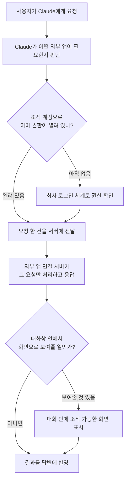

<aside class="ai-knowledge-sidebar">
  
CATEGORIES

  <nav class="ai-cat-tree">

에이전트 오케스트레이션5
<ul><li><a href="https://altjs4510.github.io/ai_news_blog/knowledge/20260709/">2026-07-09mvanhorn/last30days-skill — Reddit·X·YouTube·HN·…</a></li><li><a href="https://altjs4510.github.io/ai_news_blog/knowledge/20260623/">2026-06-23bytedance/deer-flow — 샌드박스·메모리·서브에이전트·메시지 게이트웨이를…</a></li><li><a href="https://altjs4510.github.io/ai_news_blog/knowledge/20260602/">2026-06-02revfactory/harness — 도메인별 에이전트 팀과 스킬을 자동 설계하는 메타…</a></li><li><a href="https://altjs4510.github.io/ai_news_blog/knowledge/20260529/">2026-05-29Introducing dynamic workflows in Claude Code</a></li><li><a href="https://altjs4510.github.io/ai_news_blog/knowledge/20260507/">2026-05-07ruvnet/ruflo — Claude 멀티 에이전트 오케스트레이션 플랫폼</a></li></ul>

MCP &amp; 도구 통합18
<ul><li><a href="https://altjs4510.github.io/ai_news_blog/knowledge/20260801/">2026-08-01different-ai/openwork — Claude Cowork의 오픈소스 대체 에…</a></li><li><a href="https://altjs4510.github.io/ai_news_blog/knowledge/20260731/">2026-07-31different-ai/openwork — Claude Cowork의 오픈소스 대안(o…</a></li><li><a href="https://altjs4510.github.io/ai_news_blog/knowledge/20260729/" class="current">2026-07-29Bringing MCP 2026-07-28 to Claude</a></li><li><a href="https://altjs4510.github.io/ai_news_blog/knowledge/20260724/">2026-07-24diegosouzapw/OmniRoute — 단일 엔드포인트로 278+ 프로바이더·50…</a></li><li><a href="https://altjs4510.github.io/ai_news_blog/knowledge/20260723/">2026-07-23diegosouzapw/OmniRoute — 268+ 프로바이더를 단일 엔드포인트로 묶…</a></li><li><a href="https://altjs4510.github.io/ai_news_blog/knowledge/20260721/">2026-07-21tirth8205/code-review-graph — 로컬 우선 코드 인텔리전스 그래프…</a></li><li><a href="https://altjs4510.github.io/ai_news_blog/knowledge/20260719/">2026-07-19tirth8205/code-review-graph — 로컬 우선 코드 인텔리전스 그래프…</a></li><li><a href="https://altjs4510.github.io/ai_news_blog/knowledge/20260718/">2026-07-18tirth8205/code-review-graph — MCP·CLI용 로컬 코드 인텔리…</a></li><li><a href="https://altjs4510.github.io/ai_news_blog/knowledge/20260708/">2026-07-08Expanding Managed Agents in Gemini API: backgrou…</a></li><li><a href="https://altjs4510.github.io/ai_news_blog/knowledge/20260701/">2026-07-01Google OKF (Open Knowledge Format) — 벤더 중립 에이전트 …</a></li><li><a href="https://altjs4510.github.io/ai_news_blog/knowledge/20260618/">2026-06-18DeusData/codebase-memory-mcp — 158개 언어 코드베이스를 밀리…</a></li><li><a href="https://altjs4510.github.io/ai_news_blog/knowledge/20260606/">2026-06-06chopratejas/headroom — Compress tool outputs, lo…</a></li><li><a href="https://altjs4510.github.io/ai_news_blog/knowledge/20260605/">2026-06-05chopratejas/headroom — Compress tool outputs, lo…</a></li><li><a href="https://altjs4510.github.io/ai_news_blog/knowledge/20260604/">2026-06-04chopratejas/headroom — Compress tool outputs bef…</a></li><li><a href="https://altjs4510.github.io/ai_news_blog/knowledge/20260603/">2026-06-03How Bad MCP design cost your Agent 5× more token…</a></li><li><a href="https://altjs4510.github.io/ai_news_blog/knowledge/20260523/">2026-05-23colbymchenry/codegraph — 사전 인덱싱된 코드 지식 그래프 MCP</a></li><li><a href="https://altjs4510.github.io/ai_news_blog/knowledge/20260517/">2026-05-17I gave my LLM 100,000+ tools — Lazy Discovery &a…</a></li><li><a href="https://altjs4510.github.io/ai_news_blog/knowledge/20260509/">2026-05-09How to connect 100 MCP servers without the conte…</a></li></ul>

코딩 에이전트19
<ul><li><a href="https://altjs4510.github.io/ai_news_blog/knowledge/20260728/">2026-07-28alibaba/open-code-review — 결정론적 파이프라인 + LLM 에이전트…</a></li><li><a href="https://altjs4510.github.io/ai_news_blog/knowledge/20260725/">2026-07-25The new rules of context engineering for Claude …</a></li><li><a href="https://altjs4510.github.io/ai_news_blog/knowledge/20260722/">2026-07-22tirth8205/code-review-graph — MCP·CLI용 로컬 우선 코드 …</a></li><li><a href="https://altjs4510.github.io/ai_news_blog/knowledge/20260716/">2026-07-16Dicklesworthstone/destructive_command_guard — 에이…</a></li><li><a href="https://altjs4510.github.io/ai_news_blog/knowledge/20260714/">2026-07-14Graphify-Labs/graphify — 코드베이스를 질의 가능한 지식 그래프로 만…</a></li><li><a href="https://altjs4510.github.io/ai_news_blog/knowledge/20260707/">2026-07-07AI Hero Skills Catalog — 실무 엔지니어를 위한 재사용 가능한 판단 …</a></li><li><a href="https://altjs4510.github.io/ai_news_blog/knowledge/20260705/">2026-07-05openai/codex-plugin-cc — Claude Code에서 Codex를 위임…</a></li><li><a href="https://altjs4510.github.io/ai_news_blog/knowledge/20260626/">2026-06-26google-labs-code/design.md — 코딩 에이전트에게 디자인 시스템을 …</a></li><li><a href="https://altjs4510.github.io/ai_news_blog/knowledge/20260619/">2026-06-19Claude Code now supports artifacts</a></li><li><a href="https://altjs4510.github.io/ai_news_blog/knowledge/20260530/">2026-05-30Leonxlnx/taste-skill — AI에게 좋은 취향을 부여해 generic s…</a></li><li><a href="https://altjs4510.github.io/ai_news_blog/knowledge/20260528/">2026-05-28Building self-improving tax agents with Codex</a></li><li><a href="https://altjs4510.github.io/ai_news_blog/knowledge/20260526/">2026-05-26colbymchenry/codegraph — Pre-indexed code knowle…</a></li><li><a href="https://altjs4510.github.io/ai_news_blog/knowledge/20260524/">2026-05-24colbymchenry/codegraph — Pre-indexed code knowle…</a></li><li><a href="https://altjs4510.github.io/ai_news_blog/knowledge/20260521/">2026-05-21colbymchenry/codegraph — Pre-indexed code knowle…</a></li><li><a href="https://altjs4510.github.io/ai_news_blog/knowledge/20260512/">2026-05-12agentmemory — Persistent memory for AI coding ag…</a></li><li><a href="https://altjs4510.github.io/ai_news_blog/knowledge/20260510/">2026-05-10addyosmani/agent-skills — Production-grade engin…</a></li><li><a href="https://altjs4510.github.io/ai_news_blog/knowledge/20260508/">2026-05-08addyosmani/agent-skills — Production-grade engin…</a></li><li><a href="https://altjs4510.github.io/ai_news_blog/knowledge/20260506/">2026-05-06mksglu/context-mode — AI 코딩 에이전트용 컨텍스트 윈도우 최적화</a></li><li><a href="https://altjs4510.github.io/ai_news_blog/knowledge/20260505/">2026-05-05mattpocock/skills — Skills for Real Engineers (.…</a></li></ul>

모델 &amp; 연구5
<ul><li><a href="https://altjs4510.github.io/ai_news_blog/knowledge/20260716-proprag/">2026-07-16PropRAG — 프로포지션 경로 위 beam search로 멀티홉 검색 안내</a></li><li><a href="https://altjs4510.github.io/ai_news_blog/knowledge/20260620/">2026-06-20zai-org/GLM-5 — From Vibe Coding to Agentic Engi…</a></li><li><a href="https://altjs4510.github.io/ai_news_blog/knowledge/20260617/">2026-06-17Predicting model behavior before release by simu…</a></li><li><a href="https://altjs4510.github.io/ai_news_blog/knowledge/20260516/">2026-05-16STALE — 에이전트가 자기 기억의 유효성을 인지할 수 있는가</a></li><li><a href="https://altjs4510.github.io/ai_news_blog/knowledge/20260513/">2026-05-13Thinking Machines' Native Interaction Models — T…</a></li></ul>

인프라 &amp; 컴퓨트4
<ul><li><a href="https://altjs4510.github.io/ai_news_blog/knowledge/20260630/">2026-06-30Introducing the Claude apps gateway for Amazon B…</a></li><li><a href="https://altjs4510.github.io/ai_news_blog/knowledge/20260611/">2026-06-11The evolution of agentic surfaces: building with…</a></li><li><a href="https://altjs4510.github.io/ai_news_blog/knowledge/20260522/">2026-05-22Giving Agents Computers — Ivan Burazin, Daytona</a></li><li><a href="https://altjs4510.github.io/ai_news_blog/knowledge/20260520/">2026-05-20New in Claude Managed Agents: self-hosted sandbo…</a></li></ul>

보안 &amp; 거버넌스13
<ul><li><a href="https://altjs4510.github.io/ai_news_blog/knowledge/20260730/">2026-07-30Anatomy of a Frontier Lab Agent Intrusion: A Tec…</a></li><li><a href="https://altjs4510.github.io/ai_news_blog/knowledge/20260715/">2026-07-15Dicklesworthstone/destructive_command_guard — 에이…</a></li><li><a href="https://altjs4510.github.io/ai_news_blog/knowledge/20260710/">2026-07-1070개 MCP 서버 strace 런타임 감사 — 부팅 시 아웃바운드 호출 서버 적발</a></li><li><a href="https://altjs4510.github.io/ai_news_blog/knowledge/20260704/">2026-07-04Cloudflare is about to block AI agents by defaul…</a></li><li><a href="https://altjs4510.github.io/ai_news_blog/knowledge/20260703/">2026-07-03Giving admins more visibility and control over C…</a></li><li><a href="https://altjs4510.github.io/ai_news_blog/knowledge/20260625/">2026-06-25Agent identity in Claude Tag: a new access model…</a></li><li><a href="https://altjs4510.github.io/ai_news_blog/knowledge/20260624/">2026-06-24Agent identity in Claude Tag: a new access model…</a></li><li><a href="https://altjs4510.github.io/ai_news_blog/knowledge/20260614/">2026-06-14NVIDIA/SkillSpector — Security scanner for AI ag…</a></li><li><a href="https://altjs4510.github.io/ai_news_blog/knowledge/20260613/">2026-06-13Fable 5's guardrails got bypassed in 48 hours — …</a></li><li><a href="https://altjs4510.github.io/ai_news_blog/knowledge/20260612/">2026-06-12NVIDIA/SkillSpector — AI 에이전트 스킬용 보안 스캐너</a></li><li><a href="https://altjs4510.github.io/ai_news_blog/knowledge/20260607/">2026-06-07OpenAI Help: Lockdown Mode</a></li><li><a href="https://altjs4510.github.io/ai_news_blog/knowledge/20260531/">2026-05-31How we contain Claude across products</a></li><li><a href="https://altjs4510.github.io/ai_news_blog/knowledge/20260527/">2026-05-27Microsoft Copilot Cowork Exfiltrates Files</a></li></ul>

응용 사례7
<ul><li><a href="https://altjs4510.github.io/ai_news_blog/knowledge/20260726/">2026-07-26citrolabs/ego-lite — 로그인된 브라우저 상태를 AI 에이전트와 공유하는…</a></li><li><a href="https://altjs4510.github.io/ai_news_blog/knowledge/20260717/">2026-07-17After a year building agent memory, 'save everyt…</a></li><li><a href="https://altjs4510.github.io/ai_news_blog/knowledge/20260712/">2026-07-12Do Automated Evals Work?</a></li><li><a href="https://altjs4510.github.io/ai_news_blog/knowledge/20260621/">2026-06-21calesthio/OpenMontage — 12 파이프라인·52 도구·500+ 스킬을 …</a></li><li><a href="https://altjs4510.github.io/ai_news_blog/knowledge/20260609/">2026-06-09Building intelligent apps for Apple platforms wi…</a></li><li><a href="https://altjs4510.github.io/ai_news_blog/knowledge/20260515/">2026-05-15Clawdmeter — Claude Code 사용량을 데스크톱 대시보드로</a></li><li><a href="https://altjs4510.github.io/ai_news_blog/knowledge/20260514/">2026-05-14Introducing Claude for Small Business</a></li></ul>

산업 동향6
<ul><li><a href="https://altjs4510.github.io/ai_news_blog/knowledge/20260711/">2026-07-11OpenAI says GPT 5.6 is the 'preferred model' for…</a></li><li><a href="https://altjs4510.github.io/ai_news_blog/knowledge/20260702/">2026-07-02How Cursor deploys AI inside the enterprise (For…</a></li><li><a href="https://altjs4510.github.io/ai_news_blog/knowledge/20260616/">2026-06-16Why AI hasn't replaced software engineers, and w…</a></li><li><a href="https://altjs4510.github.io/ai_news_blog/knowledge/20260610/">2026-06-10Fable 5 just made cost-aware model routing manda…</a></li><li><a href="https://altjs4510.github.io/ai_news_blog/knowledge/20260519/">2026-05-19Anthropic acquires Stainless</a></li><li><a href="https://altjs4510.github.io/ai_news_blog/knowledge/20260504/">2026-05-04Agents for Everything Else: Codex for Knowledge …</a></li></ul>
</nav>
</aside>

<article class="ai-knowledge-article">

<header class="ai-post-hero">
  
<a class="ai-back" href="../">KNOWLEDGE</a> · 2026-07-29 · 오늘의 학습

  <h2 class="ai-post-title">Bringing MCP 2026-07-28 to Claude</h2>
</header>

> 원문: [Bringing MCP 2026-07-28 to Claude](https://claude.com/blog/bringing-mcp-2026-07-28-to-claude)

## 📌 학습 정리

### 1. 한 줄로 말하면

인공지능 비서와 바깥 앱들을 이어주는 공용 연결 규격이 새 버전으로 올라갔고, 그 새 규격을 Claude 제품들이 받아들이기 시작했다는 소식이에요. 연결선이 더 단순해지고, 로그인·권한 확인이 더 튼튼해졌다는 게 핵심입니다.

### 2. 왜 이게 만들어졌어요?

AI 에이전트가 실제로 일을 하려면 캘린더, 디자인 툴, 회계 서비스 같은 바깥 앱에 손을 뻗어야 하는데, 그 연결 방식이 앱마다 제각각이면 만드는 쪽도 쓰는 쪽도 고생이에요. 그래서 등장한 게 모델 컨텍스트 프로토콜(Model Context Protocol, 줄여서 MCP)이라는 공용 규격이고, 원문에 따르면 올해에만 4배 늘어 월 4억 건이 넘는 개발도구 내려받기를 기록할 만큼 널리 퍼졌습니다. 다만 기존 규격은 서로 계속 연결을 붙잡고 대화를 주고받는 방식이라, 연결 상태를 계속 기억해야 하는 부담이 있었어요. 그러다 보니 요즘 흔한 서버리스(serverless, 서버를 직접 띄우지 않고 요청이 올 때만 실행되는 방식)나 엣지(edge, 사용자와 가까운 곳에서 돌아가는 인프라) 위에 올리기가 까다로웠고, 기업의 로그인 체계에 붙일 때도 우회 작업이 필요했습니다. 이번 다섯 번째 규격인 MCP 2026-07-28은 그 두 가지 불편을 정면으로 손봤다는 게 원문의 설명입니다.

### 3. 비유로 풀면

예전 방식은 상담원과 전화를 계속 연결해둔 채 대화하는 것과 비슷했어요. 통화가 끊기면 앞의 맥락이 날아가니 회선을 붙들고 있어야 하고, 상담원을 늘리는 것도 회선 수에 묶여 있죠. 새 방식은 그때그때 필요한 내용을 한 통씩 써서 보내는 편지에 가깝습니다. 편지는 누가 받아 처리하든 상관없으니, 바쁠 때 처리 인원을 확 늘렸다가 한가하면 줄이기가 쉬워요.

또 하나. 확장 기능(extensions) 얘기는 콘센트 규격을 그대로 둔 채 멀티탭을 표준화한 것에 가깝습니다. 벽에 있는 콘센트(핵심 규격)를 건드리지 않고도 새 기능을 정해진 자리에 꽂아 넣을 수 있게 만든 셈이죠. 그래서 결국, 이번 변화는 "연결을 붙잡지 않아도 되게 만들고, 새 기능은 핵심을 흔들지 않는 별도 칸에 넣는다"는 두 가지 정리 작업이에요.

### 4. 어떻게 작동하는지 (그림으로)

흐름을 말로 풀면, 사용자의 요청이 들어오면 Claude가 필요한 외부 앱을 고르고, 권한이 이미 조직 차원에서 열려 있는지부터 확인합니다. 그다음 요청 한 건을 서버에 보내면 서버는 그 한 건만 처리해 답을 돌려주는데, 이전 대화를 계속 기억하지 않아도 되는 게 이번 규격의 핵심 변화예요. 마지막으로, 보여줄 화면이 있는 연결이라면 다른 탭으로 나가지 않고 대화창 안에서 바로 눌러가며 쓸 수 있습니다.

### 5. 처음 보는 용어 풀이

- **모델 컨텍스트 프로토콜 (Model Context Protocol, MCP)** — AI 에이전트를 바깥 앱·데이터에 이어주는 공용 규격이에요. 앱마다 연결 방식을 새로 발명하지 않아도 되게 해주는 공통 약속이라고 보면 됩니다.
- **상태를 기억하지 않는 핵심 구조 (stateless core)** — 서버가 이전 연결 상태를 붙들고 있지 않고, 요청 하나에 응답 하나로 끝내는 방식이에요. 처리할 서버를 자유롭게 늘렸다 줄였다 하기 쉬워집니다.
- **버전이 붙은 확장 기능 틀 (versioned extensions framework)** — 새 기능을 핵심 규격을 고치지 않고 별도 칸에 얹는 공식 통로예요. 아래의 MCP Apps와 Tasks가 이 틀을 통해 정식으로 들어왔습니다.
- **대화 안 화면 기능 (MCP Apps)** — 연결된 서버가 대화창 안에 눌러 쓸 수 있는 화면을 직접 띄우는 기능이에요. 지금 뭘 하고 있는지 보이고, 탭을 옮기지 않고 바로 조작할 수 있습니다.
- **오래 걸리는 작업 처리 (Tasks)** — 몇 초 만에 안 끝나는 긴 작업을 다루기 위한 확장이에요. 요청하고 기다렸다가 결과를 받아오는 일을 규격 안에서 정해진 방식으로 처리합니다.
- **표준 로그인·권한 체계 (OAuth 2.0 / OIDC)** — 회사가 이미 쓰는 계정 시스템으로 "이 사람 맞음"과 "여기까지 허용"을 확인하는 널리 쓰이는 방식이에요. 이번 규격이 여기에 맞춰지면서 기업용 계정 시스템에 우회 없이 붙습니다.
- **관리자가 한 번에 열어주는 권한 (enterprise-managed auth)** — 관리자가 조직 계정 시스템에서 연결을 한 번 승인해두면, 구성원은 첫 로그인 때 자동으로 그 연결을 갖게 되는 방식이에요. 개인이 따로 설정할 일이 없어집니다.
- **사설망 연결 통로 (MCP tunnels, 연구 프리뷰)** — 회사 내부망에 있는 서버를 인터넷에 노출하지 않고 Claude와 잇는 기능이에요. 방화벽에 외부 유입 규칙을 새로 뚫거나 공개 주소를 만들지 않아도 됩니다.

### 6. 한 발 더 들어가고 싶다면

- [MCP 2026-07-28 release announcement](https://claude.com/blog/bringing-mcp-2026-07-28-to-claude) — 새 규격에 정확히 뭐가 바뀌었는지 항목별 상세를 볼 수 있어요. (원문이 "전체 내용은 릴리스 공지 참조"로 안내한 지점입니다.)
- 원문에서 함께 안내한 곳들 — 규격 문서(spec), 개발용 도구모음(SDKs), 그리고 Claude가 연결 가능한 서버 950개 이상이 올라와 있는 커넥터 디렉터리(connectors directory). 각각 규격의 세부 조항, 실제로 만들 때 쓸 코드 도구, 이미 나와 있는 연결 사례를 확인할 수 있는 곳이에요. (정제된 본문에는 각 항목의 주소가 남아 있지 않아 링크는 붙이지 않았습니다.)

---

## 📖 원문 전체 번역 (정독용)

> 의역 최소화한 전체 번역입니다. 큰 흐름은 위 정리에서 잡고, 정확한 워딩이 필요할 땐 이 섹션에서 정독하세요.

# Claude에 MCP 2026-07-28 도입

**카테고리**: 제품 공지
**제품**: Claude apps, Claude Platform
**날짜**: 2026년 7월 28일
**읽는 시간**: 5분

Model Context Protocol의 다섯 번째 스펙 릴리스인 **MCP 2026-07-28**이 오늘 공개되었습니다. 이번 최신 스펙은 MCP를 상태 비저장(stateless) 코어로 전환하는 한편, 인가(authorization)를 강화하고 공식 확장 기능들을 정식(graduate) 단계로 승격시킵니다. Claude 제품 전반에 걸쳐 지원이 순차적으로 배포되고 있습니다.

## MCP의 새로운 점

MCP는 최근 월간 SDK 다운로드 4억 건을 돌파했으며, 이는 올해 들어 4배 증가한 수치로, AI 에이전트를 애플리케이션에 연결하는 업계 표준으로 자리잡았습니다. MCP 2026-07-28은 지금까지 나온 스펙 릴리스 중 가장 중요한 릴리스 중 하나입니다:

**상태 비저장 코어(Stateless core).** MCP는 양방향 상태 유지(bidirectional stateful) 프로토콜에서 요청/응답(request/response) 모델로 전환됩니다. 이제 서버는 서버리스 및 엣지 인프라에 배포할 수 있습니다. 이는 Claude용 MCP 서버를 구축하고 사용량이 증가함에 따라 규모를 확장하는 경험을 단순화합니다.

**표준화된 확장 기능(Standardized extensions).** MCP Apps와 Tasks는 이제 버전이 명시된 확장 프레임워크(versioned extensions framework) 하에 제공되며, 개발자에게 핵심 프로토콜을 변경하지 않고도 대화형 UI나 장시간 실행되는 작업 같은 기능을 추가할 수 있는 공식적인 경로를 제공합니다.

**인증 강화(Auth hardening).** 인가(authorization)는 이제 프로덕션 OAuth 2.0 및 OIDC 배포와 정합성을 갖추게 되어, MCP 서버가 Entra나 Okta 같은 엔터프라이즈 신원 시스템(identity system)에 우회 방법 없이 연결될 수 있습니다.

생태계 전반의 기업들은 베타 단계부터 MCP 커뮤니티와 함께 새로운 스펙을 기반으로 구축해왔습니다:

> "점점 더 많은 빌더들이 우리의 MCP 서버를 사용해 생성된 결과물을 Figma의 캔버스로 가져오고 있으며, 거기서 팀과 함께 탐색하고, 다듬고, 돋보이는 제품으로 다듬어가고 있습니다. 이러한 사용량이 증가함에 따라 우리의 상태 비저장 아키텍처는 그와 함께 확장될 수 있으며, MCP Apps, Tasks, 그리고 Enterprise-Managed Auth를 통해 디자인과 코드를 하나의 연결된 흐름 안에 유지하기 위해 더 많은 일을 할 수 있습니다."
> — Josh Clemm, VP of Engineering

> "MCP는 AI 에이전트를 도구와 데이터에 연결하는 업계 표준이며, Intuit은 새로운 MCP 2026-07-28 스펙을 지원하게 되어 자랑스럽습니다. 상태 비저장 프로토콜 코어와 MCP Apps 및 Tasks를 포함한 확장 프레임워크는 우리 기술진과 고객이 엔터프라이즈 규모에서 에이전틱 경험을 구축하고 연결할 수 있게 해주며, Intuit이 1억 명의 소비자와 기업에게 그들이 일하기로 선택한 어디서든 신뢰할 수 있는 금융 인텔리전스 경험을 계속 제공할 수 있게 해줍니다."
> — Chris Kasten, Chief Architect and SVP of Engineering, Platform and Development, Xceleration Group

> "2026-07-28 스펙의 상태 비저장 코어는 MCP를 세션 관리를 우회할 필요가 없는 일급(first-class) HTTP 워크로드로 만듭니다. 우리 고객들은 Netlify 상의 MCP가 플랫폼의 나머지 부분만큼 단순하기를 원했고, 이번 새 스펙은 그 핵심에서 이를 가능케 합니다. MCP Apps를 새로운 확장 프레임워크에 통합한 것은 전체 생태계의 확장성, 접근성, 기능성 측면에서 큰 진전입니다."
> — Sean Roberts, VP of Applied AI

> "MCP를 상태 비저장 프로토콜로 전환하는 것은 우리 자체 서비스를 확장하기 쉽게 만들 뿐 아니라, 고객의 MCP 서버에 대한 분석(analytics) 기능을 추가하기도 쉽게 만듭니다. 이는 사람들에게 자신들의 MCP 도구가 어떻게 사용되고 있는지, 그리고 사용자들이 원할 만한 어떤 도구가 빠져 있는지를 보여주는 데 도움이 됩니다. 이 프로토콜이 이런 방향으로 성장하는 것을 보니 좋습니다."
> — Paul D'Ambra, Product Engineer

> "Anthropic은 프론티어 모델을 계속 기준을 높이는 개발자 경험과 결합합니다. 개방형 MCP 2026-07-28 스펙의 상태 비저장 코어는 우리가 관리해야 할 복잡성을 줄여주어, 우리가 더 많은 기능을 더 빠르고 더 큰 규모로 고객에게 제공할 수 있게 해줍니다."
> — Andrew Goodman, VP of AI

> "Zoom에서는 조직의 맥락(organizational context)이 AI가 의미 있는 작업을 수행할 수 있게 하는 핵심이라고 믿으며, 그래서 우리는 Zoom 회의 인텔리전스를 Claude와 같은 AI 플랫폼에 안전하게 가져오는 MCP 서버를 구축했습니다. 새로운 MCP 스펙은 표준 HTTP 인프라에서 MCP 서버를 배포하고 확장하는 것을 훨씬 쉽게 만들어줍니다 — 그 결과 사용자들은 매일 의존하는 AI 워크플로우 안에서 Zoom의 회의 인텔리전스를 더 빠르고 더 안정적으로 얻을 수 있습니다."
> — Ross Mayfield, Head of Product for AI Platform

*[eBook] MCP 2026-07-28 릴리스 발표 전문은 MCP 2026-07-28 release announcement를 참조하세요.*

## Claude에서 MCP 발전시키기

Claude는 이제 커넥터 디렉토리(connectors directory)에 950개가 넘는 MCP 서버를 등재하고 있으며, 매일 수백만 명이 이를 사용하고 있습니다. 올해 우리는 새로운 프로토콜 확장 지원을 출시함과 동시에, 구축과 배포를 더 쉽게 만드는 기능들도 함께 선보였습니다:

**MCP Apps**는 서버가 대화 안에 직접 대화형 UI를 렌더링할 수 있게 해줍니다. 사용자는 커넥터가 무엇을 하고 있는지 확인하고 탭을 전환하지 않고도 인라인으로 작업할 수 있습니다.

**엔터프라이즈 관리형 인증(Enterprise-managed auth)**은 관리자가 자신들의 신원 공급자(identity provider)를 통해 조직 전체를 위한 MCP 커넥터를 프로비저닝할 수 있게 해줍니다. 관리자가 커넥터를 한 번 승인하면, 사용자들은 기존 IdP 그룹을 통해 접근 권한을 상속받으며, 최초 로그인 시 바로 연결됩니다: 최종 사용자 입장에서는 별도 설정이 전혀 필요 없는(zero-touch) 방식입니다.

**커넥터를 구축하는 개발자를 위한 관찰 가능성(Observability)**은 우리 디렉토리에 게시된 커넥터들이 Claude 제품 표면 전반에서 어떻게 동작하는지 보여주는 대시보드를 제공합니다. 개발자는 이를 사용해 채택 현황을 추적하고, 오류와 지연 시간을 진단하며, 제품별 사용량을 분석할 수 있습니다.

**MCP 터널(연구 프리뷰, MCP tunnels — research preview)**은 Claude를 공용 인터넷에 노출하지 않고도 사설 네트워크 내부의 MCP 서버에 연결시켜 줍니다. 팀들은 인바운드 방화벽 규칙도, 공개 엔드포인트도, 원본 서버에 대한 IP 허용목록(allowlisting)도 없이 내부 도구를 Claude로 가져올 수 있습니다.

2026-07-28의 상태 비저장 코어, 표준화된 확장 기능, 강화된 인증은 개발자들이 더 낮은 마찰과 더 일관된 최종 사용자 경험으로 더 많은 애플리케이션을 Claude에 가져오는 데 도움이 될 것입니다. 우리는 커뮤니티와 함께 개방형 표준으로서의 MCP에 대한 투자를 계속하는 한편, MCP를 프로덕션 환경에서 더 접근하기 쉽고 효과적으로 만드는 Claude 기능들에도 계속 투자할 것입니다.

## 시작하기

시작하려면 스펙(spec)과 SDK를 살펴보세요. 지원은 곧 Claude 제품 전반에 걸쳐 순차적으로 배포될 예정입니다. Claude의 커넥터 디렉토리(connectors directory)에 자신의 MCP 서버를 제출할 계획이라면, 여기에서 더 알아볼 수 있습니다.

**FAQ**: 항목 없음.

---

**관련 게시물**
- 2026년 7월 23일 — 음성 모드에서 어려운 문제 사고하기 (Think through hard problems in voice mode) — 제품 공지
- 2026년 5월 12일 — 법률 업계를 위한 Claude (Claude for the legal industry) — 제품 공지
- 2026년 7월 7일 — Claude Cowork, 모바일과 웹으로 출시 예정 (Claude Cowork is coming to mobile and web) — 제품 공지
- 2026년 4월 9일 — Claude Cowork를 엔터프라이즈 대응으로 만들기 (Making Claude Cowork ready for enterprise) — 제품 공지

*조직이 Claude와 함께 운영되는 방식을 전환하세요 — 가격 안내 보기 / 영업팀 문의*

*개발자 뉴스레터 구독하기: 제품 업데이트, 사용법, 커뮤니티 소식 등을 매월 이메일로 받아보세요.*

</article>

<!-- ai-related-links -->
<aside class="ai-related-links">
  
관련 학습

  <ul><li><a href="https://altjs4510.github.io/ai_news_blog/knowledge/20260603/">2026-06-03How Bad MCP design cost your Agent 5× more token…</a></li><li><a href="https://altjs4510.github.io/ai_news_blog/knowledge/20260517/">2026-05-17I gave my LLM 100,000+ tools — Lazy Discovery &a…</a></li><li><a href="https://altjs4510.github.io/ai_news_blog/knowledge/20260509/">2026-05-09How to connect 100 MCP servers without the conte…</a></li></ul>
</aside>
<!-- /ai-related-links -->
