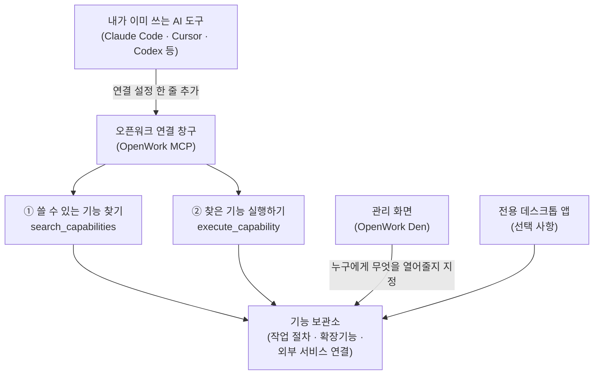

<div class="ai-knowledge-shell">

<aside class="ai-knowledge-sidebar">
  <p class="ai-eyebrow">CATEGORIES</p>
  <nav class="ai-cat-tree"><details class="ai-cat" open><summary><span class="catname">에이전트 오케스트레이션</span><span class="catcount">8</span></summary><ul><li><a href="https://altjs4510.github.io/ai_news_blog/knowledge/20260708/"><span class="kdate">2026-07-08</span><span class="ktitle">Expanding Managed Agents in Gemini API: backgrou…</span></a></li><li><a href="https://altjs4510.github.io/ai_news_blog/knowledge/20260707/"><span class="kdate">2026-07-07</span><span class="ktitle">AI Hero Skills Catalog — 실무 엔지니어를 위한 재사용 가능한 판단 …</span></a></li><li><a href="https://altjs4510.github.io/ai_news_blog/knowledge/20260701/"><span class="kdate">2026-07-01</span><span class="ktitle">Google OKF (Open Knowledge Format) — 벤더 중립 에이전트 …</span></a></li><li><a href="https://altjs4510.github.io/ai_news_blog/knowledge/20260623/"><span class="kdate">2026-06-23</span><span class="ktitle">bytedance/deer-flow — 샌드박스·메모리·서브에이전트·메시지 게이트웨이를…</span></a></li><li><a href="https://altjs4510.github.io/ai_news_blog/knowledge/20260611/"><span class="kdate">2026-06-11</span><span class="ktitle">The evolution of agentic surfaces: building with…</span></a></li><li><a href="https://altjs4510.github.io/ai_news_blog/knowledge/20260602/"><span class="kdate">2026-06-02</span><span class="ktitle">revfactory/harness — 도메인별 에이전트 팀과 스킬을 자동 설계하는 메타…</span></a></li><li><a href="https://altjs4510.github.io/ai_news_blog/knowledge/20260529/"><span class="kdate">2026-05-29</span><span class="ktitle">Introducing dynamic workflows in Claude Code</span></a></li><li><a href="https://altjs4510.github.io/ai_news_blog/knowledge/20260507/"><span class="kdate">2026-05-07</span><span class="ktitle">ruvnet/ruflo — Claude 멀티 에이전트 오케스트레이션 플랫폼</span></a></li></ul></details><details class="ai-cat" open><summary><span class="catname">MCP &amp; 도구 통합</span><span class="catcount">18</span></summary><ul><li><a href="https://altjs4510.github.io/ai_news_blog/knowledge/20260802/"><span class="kdate">2026-08-02</span><span class="ktitle">Stateless MCP has recaptured my interest (and in…</span></a></li><li><a href="https://altjs4510.github.io/ai_news_blog/knowledge/20260801/" class="current"><span class="kdate">2026-08-01</span><span class="ktitle">different-ai/openwork — Claude Cowork의 오픈소스 대체 에…</span></a></li><li><a href="https://altjs4510.github.io/ai_news_blog/knowledge/20260731/"><span class="kdate">2026-07-31</span><span class="ktitle">different-ai/openwork — Claude Cowork의 오픈소스 대안(o…</span></a></li><li><a href="https://altjs4510.github.io/ai_news_blog/knowledge/20260729/"><span class="kdate">2026-07-29</span><span class="ktitle">Bringing MCP 2026-07-28 to Claude</span></a></li><li><a href="https://altjs4510.github.io/ai_news_blog/knowledge/20260724/"><span class="kdate">2026-07-24</span><span class="ktitle">diegosouzapw/OmniRoute — 단일 엔드포인트로 278+ 프로바이더·50…</span></a></li><li><a href="https://altjs4510.github.io/ai_news_blog/knowledge/20260722/"><span class="kdate">2026-07-22</span><span class="ktitle">tirth8205/code-review-graph — MCP·CLI용 로컬 우선 코드 …</span></a></li><li><a href="https://altjs4510.github.io/ai_news_blog/knowledge/20260721/"><span class="kdate">2026-07-21</span><span class="ktitle">tirth8205/code-review-graph — 로컬 우선 코드 인텔리전스 그래프…</span></a></li><li><a href="https://altjs4510.github.io/ai_news_blog/knowledge/20260719/"><span class="kdate">2026-07-19</span><span class="ktitle">tirth8205/code-review-graph — 로컬 우선 코드 인텔리전스 그래프…</span></a></li><li><a href="https://altjs4510.github.io/ai_news_blog/knowledge/20260718/"><span class="kdate">2026-07-18</span><span class="ktitle">tirth8205/code-review-graph — MCP·CLI용 로컬 코드 인텔리…</span></a></li><li><a href="https://altjs4510.github.io/ai_news_blog/knowledge/20260618/"><span class="kdate">2026-06-18</span><span class="ktitle">DeusData/codebase-memory-mcp — 158개 언어 코드베이스를 밀리…</span></a></li><li><a href="https://altjs4510.github.io/ai_news_blog/knowledge/20260606/"><span class="kdate">2026-06-06</span><span class="ktitle">chopratejas/headroom — Compress tool outputs, lo…</span></a></li><li><a href="https://altjs4510.github.io/ai_news_blog/knowledge/20260605/"><span class="kdate">2026-06-05</span><span class="ktitle">chopratejas/headroom — Compress tool outputs, lo…</span></a></li><li><a href="https://altjs4510.github.io/ai_news_blog/knowledge/20260604/"><span class="kdate">2026-06-04</span><span class="ktitle">chopratejas/headroom — Compress tool outputs bef…</span></a></li><li><a href="https://altjs4510.github.io/ai_news_blog/knowledge/20260603/"><span class="kdate">2026-06-03</span><span class="ktitle">How Bad MCP design cost your Agent 5× more token…</span></a></li><li><a href="https://altjs4510.github.io/ai_news_blog/knowledge/20260523/"><span class="kdate">2026-05-23</span><span class="ktitle">colbymchenry/codegraph — 사전 인덱싱된 코드 지식 그래프 MCP</span></a></li><li><a href="https://altjs4510.github.io/ai_news_blog/knowledge/20260519/"><span class="kdate">2026-05-19</span><span class="ktitle">Anthropic acquires Stainless</span></a></li><li><a href="https://altjs4510.github.io/ai_news_blog/knowledge/20260517/"><span class="kdate">2026-05-17</span><span class="ktitle">I gave my LLM 100,000+ tools — Lazy Discovery &a…</span></a></li><li><a href="https://altjs4510.github.io/ai_news_blog/knowledge/20260509/"><span class="kdate">2026-05-09</span><span class="ktitle">How to connect 100 MCP servers without the conte…</span></a></li></ul></details><details class="ai-cat" open><summary><span class="catname">코딩 에이전트</span><span class="catcount">18</span></summary><ul><li><a href="https://altjs4510.github.io/ai_news_blog/knowledge/20260808/"><span class="kdate">2026-08-08</span><span class="ktitle">PrimeIntellect-ai/prime-agent — 코딩 워크플로우와 장시간 자율…</span></a></li><li><a href="https://altjs4510.github.io/ai_news_blog/knowledge/20260804/"><span class="kdate">2026-08-04</span><span class="ktitle">esengine/DeepSeek-Reasonix — prefix-cache 안정성을 축…</span></a></li><li><a href="https://altjs4510.github.io/ai_news_blog/knowledge/20260728/"><span class="kdate">2026-07-28</span><span class="ktitle">alibaba/open-code-review — 결정론적 파이프라인 + LLM 에이전트…</span></a></li><li><a href="https://altjs4510.github.io/ai_news_blog/knowledge/20260725/"><span class="kdate">2026-07-25</span><span class="ktitle">The new rules of context engineering for Claude …</span></a></li><li><a href="https://altjs4510.github.io/ai_news_blog/knowledge/20260714/"><span class="kdate">2026-07-14</span><span class="ktitle">Graphify-Labs/graphify — 코드베이스를 질의 가능한 지식 그래프로 만…</span></a></li><li><a href="https://altjs4510.github.io/ai_news_blog/knowledge/20260705/"><span class="kdate">2026-07-05</span><span class="ktitle">openai/codex-plugin-cc — Claude Code에서 Codex를 위임…</span></a></li><li><a href="https://altjs4510.github.io/ai_news_blog/knowledge/20260626/"><span class="kdate">2026-06-26</span><span class="ktitle">google-labs-code/design.md — 코딩 에이전트에게 디자인 시스템을 …</span></a></li><li><a href="https://altjs4510.github.io/ai_news_blog/knowledge/20260619/"><span class="kdate">2026-06-19</span><span class="ktitle">Claude Code now supports artifacts</span></a></li><li><a href="https://altjs4510.github.io/ai_news_blog/knowledge/20260530/"><span class="kdate">2026-05-30</span><span class="ktitle">Leonxlnx/taste-skill — AI에게 좋은 취향을 부여해 generic s…</span></a></li><li><a href="https://altjs4510.github.io/ai_news_blog/knowledge/20260528/"><span class="kdate">2026-05-28</span><span class="ktitle">Building self-improving tax agents with Codex</span></a></li><li><a href="https://altjs4510.github.io/ai_news_blog/knowledge/20260526/"><span class="kdate">2026-05-26</span><span class="ktitle">colbymchenry/codegraph — Pre-indexed code knowle…</span></a></li><li><a href="https://altjs4510.github.io/ai_news_blog/knowledge/20260524/"><span class="kdate">2026-05-24</span><span class="ktitle">colbymchenry/codegraph — Pre-indexed code knowle…</span></a></li><li><a href="https://altjs4510.github.io/ai_news_blog/knowledge/20260521/"><span class="kdate">2026-05-21</span><span class="ktitle">colbymchenry/codegraph — Pre-indexed code knowle…</span></a></li><li><a href="https://altjs4510.github.io/ai_news_blog/knowledge/20260512/"><span class="kdate">2026-05-12</span><span class="ktitle">agentmemory — Persistent memory for AI coding ag…</span></a></li><li><a href="https://altjs4510.github.io/ai_news_blog/knowledge/20260510/"><span class="kdate">2026-05-10</span><span class="ktitle">addyosmani/agent-skills — Production-grade engin…</span></a></li><li><a href="https://altjs4510.github.io/ai_news_blog/knowledge/20260508/"><span class="kdate">2026-05-08</span><span class="ktitle">addyosmani/agent-skills — Production-grade engin…</span></a></li><li><a href="https://altjs4510.github.io/ai_news_blog/knowledge/20260506/"><span class="kdate">2026-05-06</span><span class="ktitle">mksglu/context-mode — AI 코딩 에이전트용 컨텍스트 윈도우 최적화</span></a></li><li><a href="https://altjs4510.github.io/ai_news_blog/knowledge/20260505/"><span class="kdate">2026-05-05</span><span class="ktitle">mattpocock/skills — Skills for Real Engineers (.…</span></a></li></ul></details><details class="ai-cat" open><summary><span class="catname">모델 &amp; 연구</span><span class="catcount">5</span></summary><ul><li><a href="https://altjs4510.github.io/ai_news_blog/knowledge/20260716-proprag/"><span class="kdate">2026-07-16</span><span class="ktitle">PropRAG — 프로포지션 경로 위 beam search로 멀티홉 검색 안내</span></a></li><li><a href="https://altjs4510.github.io/ai_news_blog/knowledge/20260620/"><span class="kdate">2026-06-20</span><span class="ktitle">zai-org/GLM-5 — From Vibe Coding to Agentic Engi…</span></a></li><li><a href="https://altjs4510.github.io/ai_news_blog/knowledge/20260617/"><span class="kdate">2026-06-17</span><span class="ktitle">Predicting model behavior before release by simu…</span></a></li><li><a href="https://altjs4510.github.io/ai_news_blog/knowledge/20260516/"><span class="kdate">2026-05-16</span><span class="ktitle">STALE — 에이전트가 자기 기억의 유효성을 인지할 수 있는가</span></a></li><li><a href="https://altjs4510.github.io/ai_news_blog/knowledge/20260513/"><span class="kdate">2026-05-13</span><span class="ktitle">Thinking Machines' Native Interaction Models — T…</span></a></li></ul></details><details class="ai-cat" open><summary><span class="catname">인프라 &amp; 컴퓨트</span><span class="catcount">5</span></summary><ul><li><a href="https://altjs4510.github.io/ai_news_blog/knowledge/20260806/"><span class="kdate">2026-08-06</span><span class="ktitle">cloudflare/computer — 에이전트에게 컴퓨터를 통째로 주는 엣지 실행 샌…</span></a></li><li><a href="https://altjs4510.github.io/ai_news_blog/knowledge/20260723/"><span class="kdate">2026-07-23</span><span class="ktitle">diegosouzapw/OmniRoute — 268+ 프로바이더를 단일 엔드포인트로 묶…</span></a></li><li><a href="https://altjs4510.github.io/ai_news_blog/knowledge/20260630/"><span class="kdate">2026-06-30</span><span class="ktitle">Introducing the Claude apps gateway for Amazon B…</span></a></li><li><a href="https://altjs4510.github.io/ai_news_blog/knowledge/20260522/"><span class="kdate">2026-05-22</span><span class="ktitle">Giving Agents Computers — Ivan Burazin, Daytona</span></a></li><li><a href="https://altjs4510.github.io/ai_news_blog/knowledge/20260520/"><span class="kdate">2026-05-20</span><span class="ktitle">New in Claude Managed Agents: self-hosted sandbo…</span></a></li></ul></details><details class="ai-cat" open><summary><span class="catname">보안 &amp; 거버넌스</span><span class="catcount">13</span></summary><ul><li><a href="https://altjs4510.github.io/ai_news_blog/knowledge/20260730/"><span class="kdate">2026-07-30</span><span class="ktitle">Anatomy of a Frontier Lab Agent Intrusion: A Tec…</span></a></li><li><a href="https://altjs4510.github.io/ai_news_blog/knowledge/20260716/"><span class="kdate">2026-07-16</span><span class="ktitle">Dicklesworthstone/destructive_command_guard — 에이…</span></a></li><li><a href="https://altjs4510.github.io/ai_news_blog/knowledge/20260715/"><span class="kdate">2026-07-15</span><span class="ktitle">Dicklesworthstone/destructive_command_guard — 에이…</span></a></li><li><a href="https://altjs4510.github.io/ai_news_blog/knowledge/20260710/"><span class="kdate">2026-07-10</span><span class="ktitle">70개 MCP 서버 strace 런타임 감사 — 부팅 시 아웃바운드 호출 서버 적발</span></a></li><li><a href="https://altjs4510.github.io/ai_news_blog/knowledge/20260703/"><span class="kdate">2026-07-03</span><span class="ktitle">Giving admins more visibility and control over C…</span></a></li><li><a href="https://altjs4510.github.io/ai_news_blog/knowledge/20260625/"><span class="kdate">2026-06-25</span><span class="ktitle">Agent identity in Claude Tag: a new access model…</span></a></li><li><a href="https://altjs4510.github.io/ai_news_blog/knowledge/20260624/"><span class="kdate">2026-06-24</span><span class="ktitle">Agent identity in Claude Tag: a new access model…</span></a></li><li><a href="https://altjs4510.github.io/ai_news_blog/knowledge/20260614/"><span class="kdate">2026-06-14</span><span class="ktitle">NVIDIA/SkillSpector — Security scanner for AI ag…</span></a></li><li><a href="https://altjs4510.github.io/ai_news_blog/knowledge/20260613/"><span class="kdate">2026-06-13</span><span class="ktitle">Fable 5's guardrails got bypassed in 48 hours — …</span></a></li><li><a href="https://altjs4510.github.io/ai_news_blog/knowledge/20260612/"><span class="kdate">2026-06-12</span><span class="ktitle">NVIDIA/SkillSpector — AI 에이전트 스킬용 보안 스캐너</span></a></li><li><a href="https://altjs4510.github.io/ai_news_blog/knowledge/20260607/"><span class="kdate">2026-06-07</span><span class="ktitle">OpenAI Help: Lockdown Mode</span></a></li><li><a href="https://altjs4510.github.io/ai_news_blog/knowledge/20260531/"><span class="kdate">2026-05-31</span><span class="ktitle">How we contain Claude across products</span></a></li><li><a href="https://altjs4510.github.io/ai_news_blog/knowledge/20260527/"><span class="kdate">2026-05-27</span><span class="ktitle">Microsoft Copilot Cowork Exfiltrates Files</span></a></li></ul></details><details class="ai-cat" open><summary><span class="catname">응용 사례</span><span class="catcount">9</span></summary><ul><li><a href="https://altjs4510.github.io/ai_news_blog/knowledge/20260805/"><span class="kdate">2026-08-05</span><span class="ktitle">TencentCloud/TencentDB-Agent-Memory — 대화·문서·코드를 …</span></a></li><li><a href="https://altjs4510.github.io/ai_news_blog/knowledge/20260726/"><span class="kdate">2026-07-26</span><span class="ktitle">citrolabs/ego-lite — 로그인된 브라우저 상태를 AI 에이전트와 공유하는…</span></a></li><li><a href="https://altjs4510.github.io/ai_news_blog/knowledge/20260717/"><span class="kdate">2026-07-17</span><span class="ktitle">After a year building agent memory, 'save everyt…</span></a></li><li><a href="https://altjs4510.github.io/ai_news_blog/knowledge/20260712/"><span class="kdate">2026-07-12</span><span class="ktitle">Do Automated Evals Work?</span></a></li><li><a href="https://altjs4510.github.io/ai_news_blog/knowledge/20260709/"><span class="kdate">2026-07-09</span><span class="ktitle">mvanhorn/last30days-skill — Reddit·X·YouTube·HN·…</span></a></li><li><a href="https://altjs4510.github.io/ai_news_blog/knowledge/20260621/"><span class="kdate">2026-06-21</span><span class="ktitle">calesthio/OpenMontage — 12 파이프라인·52 도구·500+ 스킬을 …</span></a></li><li><a href="https://altjs4510.github.io/ai_news_blog/knowledge/20260609/"><span class="kdate">2026-06-09</span><span class="ktitle">Building intelligent apps for Apple platforms wi…</span></a></li><li><a href="https://altjs4510.github.io/ai_news_blog/knowledge/20260515/"><span class="kdate">2026-05-15</span><span class="ktitle">Clawdmeter — Claude Code 사용량을 데스크톱 대시보드로</span></a></li><li><a href="https://altjs4510.github.io/ai_news_blog/knowledge/20260514/"><span class="kdate">2026-05-14</span><span class="ktitle">Introducing Claude for Small Business</span></a></li></ul></details><details class="ai-cat" open><summary><span class="catname">산업 동향</span><span class="catcount">6</span></summary><ul><li><a href="https://altjs4510.github.io/ai_news_blog/knowledge/20260711/"><span class="kdate">2026-07-11</span><span class="ktitle">OpenAI says GPT 5.6 is the 'preferred model' for…</span></a></li><li><a href="https://altjs4510.github.io/ai_news_blog/knowledge/20260704/"><span class="kdate">2026-07-04</span><span class="ktitle">Cloudflare is about to block AI agents by defaul…</span></a></li><li><a href="https://altjs4510.github.io/ai_news_blog/knowledge/20260702/"><span class="kdate">2026-07-02</span><span class="ktitle">How Cursor deploys AI inside the enterprise (For…</span></a></li><li><a href="https://altjs4510.github.io/ai_news_blog/knowledge/20260616/"><span class="kdate">2026-06-16</span><span class="ktitle">Why AI hasn't replaced software engineers, and w…</span></a></li><li><a href="https://altjs4510.github.io/ai_news_blog/knowledge/20260610/"><span class="kdate">2026-06-10</span><span class="ktitle">Fable 5 just made cost-aware model routing manda…</span></a></li><li><a href="https://altjs4510.github.io/ai_news_blog/knowledge/20260504/"><span class="kdate">2026-05-04</span><span class="ktitle">Agents for Everything Else: Codex for Knowledge …</span></a></li></ul></details></nav>
</aside>

<article class="ai-knowledge-article">

<header class="ai-post-hero">
  <p class="ai-eyebrow"><a class="ai-back" href="../">KNOWLEDGE</a> · 2026-08-01 · 오늘의 학습</p>
  <h2 class="ai-post-title">different-ai/openwork — Claude Cowork의 오픈소스 대체 에이전트 하네스 (opencode 기반)</h2>
</header>

> 원문: [different-ai/openwork — Claude Cowork의 오픈소스 대체 에이전트 하네스 (opencode 기반)](https://github.com/different-ai/openwork)

## 📌 학습 정리

### 1. 한 줄로 말하면

여러 AI 도구가 제각각 따로 쓰던 "기능 꾸러미"를 한곳에 모아두고, 어떤 도구에서든 같은 걸 꺼내 쓸 수 있게 해주는 무료 오픈소스 프로그램입니다. 만든 사람이 혼자 쓸 수도 있고, 동료에게 그대로 나눠줄 수도 있어요.

### 2. 왜 이게 만들어졌어요?

요즘은 AI에게 일을 시킬 때 쓰는 도구가 한두 개가 아닙니다. 어떤 사람은 Claude Code를, 어떤 사람은 Cursor나 Codex를 쓰고, 각각에 자기만의 연동 설정과 작업 절차를 따로 붙여둡니다. 문제는 이렇게 공들여 만든 설정이 그 도구 안에만 갇힌다는 점이에요 — 도구를 바꾸면 처음부터 다시 붙여야 하고, 옆자리 동료에게 넘겨주기도 번거롭습니다. OpenWork는 이런 설정과 연동을 한 곳에 모아두고, 어느 도구에서든 같은 것을 불러 쓰도록 만든 시도입니다. 여기에 소스가 공개되어 있어서 누구나 뜯어보고 고칠 수 있다는 점을 내세우고 있어요.

### 3. 비유로 풀면

이건 마치 회사의 **공용 창고와 사물함 열쇠** 같은 거예요. 각자 책상 서랍에 자기 공구를 따로 쟁여두는 대신, 공용 창고에 넣어두고 필요한 사람이 열쇠로 꺼내 쓰는 식이죠. 누가 어떤 공구를 꺼낼 수 있는지도 창고 관리자가 정할 수 있고요.

또 하나 비유하자면, 스마트폰에서 앱을 고를 때 **앱 스토어에서 검색하고 → 눌러서 실행**하는 흐름과 비슷합니다. OpenWork도 "뭐가 있는지 찾기"와 "찾은 걸 실행하기" 딱 두 가지 동작으로 정리되어 있어요.

그래서 결국, 기능을 도구마다 심는 게 아니라 한 곳에 심어두고 도구들이 그걸 **가져다 쓰는** 구조라는 이야기입니다.

### 4. 어떻게 작동하는지 (그림으로)



흐름은 단순합니다. 내가 쓰던 AI 도구에 연결 설정을 한 번 추가하면, 그 도구가 "지금 내가 쓸 수 있는 게 뭐지?"를 물어보고(①) 그중 하나를 골라 실행합니다(②). 처음 연결할 때는 브라우저가 열려서 로그인하고 어느 조직 소속으로 쓸지 고르게 되어 있고, 팀 단위로 쓴다면 관리 화면에서 누구에게 무엇을 열어줄지 미리 정해둘 수 있어요. 전용 데스크톱 앱도 있지만 필수는 아니고, 원래 쓰던 도구만으로도 동작합니다.

### 5. 처음 보는 용어 풀이

- **에이전트 (agent)** — 사람이 시킨 일을 스스로 여러 단계로 나눠 처리하는 AI 프로그램을 말합니다. 여기서는 Claude Code, Cursor, Codex처럼 "내 컴퓨터에서 명령을 실행할 수 있는 AI 도구"를 가리켜요.
- **모델 문맥 프로토콜 (MCP, Model Context Protocol)** — AI 도구가 외부 기능이나 데이터에 연결할 때 쓰는 공통 규격입니다. 규격이 같으면 도구마다 따로 붙일 필요 없이 한 번 만든 연결을 여러 도구가 재사용할 수 있어요.
- **기능 찾기·실행 도구 (search_capabilities / execute_capability)** — OpenWork가 바깥에 내어놓는 딱 두 개의 동작입니다. 앞의 것은 "지금 쓸 수 있는 게 뭔지" 목록을 찾아주고, 뒤의 것은 그중 하나를 실제로 돌려줍니다.
- **스킬 (skill)** — 자주 하는 작업을 미리 정리해둔 절차 묶음입니다. 한 번 만들어두면 다음부터는 그걸 불러 쓰기만 하면 되고, 동료에게 그대로 넘겨줄 수도 있어요.
- **플러그인 (plugin)** — 기본 기능만으로 부족할 때 끼워 넣는 추가 부품입니다. OpenWork는 Anthropic 규격에 맞춰 만들어진 플러그인도 가져와 쓸 수 있다고 소개하고 있어요.
- **마켓플레이스 (marketplace)** — 스킬과 플러그인을 올려두고 나눠 쓰는 장터 같은 공간입니다. 여기에 올린 뒤 조직 전체, 특정 팀, 또는 개인에게 지정해서 열어줄 수 있습니다.
- **제어 평면 (control plane)** — 실제 작업을 하는 부분과 분리해서, 누가 무엇을 쓸 수 있는지를 관리하는 층을 부르는 말입니다. OpenWork Den이 이 역할을 맡아 멤버 초대, 모델 사용 권한, 앱 버전 제한 등을 다룹니다.
- **개발자용 실행 환경 (local development)** — 소스를 직접 받아 고쳐가며 돌려볼 때 쓰는 방식입니다. 여러 작업 사본을 동시에 띄우면 서로 충돌하기 쉬워서, 사본마다 별도의 설정 공간과 포트를 자동으로 잡아주는 실행 방법을 따로 두고 있어요.

### 6. 한 발 더 들어가고 싶다면

- [https://github.com/different-ai/openwork](https://github.com/different-ai/openwork) — 소스 저장소예요. 실제 구현이 어떻게 되어 있는지, 데스크톱 앱과 연결 창구가 어떻게 나뉘어 있는지 직접 확인할 수 있습니다.
- [https://openworklabs.com/start.md?v=hero](https://openworklabs.com/start.md?v=hero) — 설치 절차가 정리된 안내 문서입니다. 흥미로운 건 이 주소를 사람이 읽는 용도뿐 아니라, AI 도구에게 그대로 던져주면 알아서 설치까지 진행하도록 만들어뒀다는 점이에요.
- `https://api.openworklabs.com/mcp/agent` — 원격 연결 주소입니다. Claude Code, Codex, OpenCode 등에서 이 주소만 등록하면 연결이 되는 구조라, 규격이 같으면 도구를 안 가린다는 게 어떤 의미인지 감을 잡을 수 있어요.

---

## 📖 원문 전체 번역 (정독용)

> 의역 최소화한 전체 번역입니다. 큰 흐름은 위 정리에서 잡고, 정확한 워딩이 필요할 땐 이 섹션에서 정독하세요.

# OpenWork

OpenWork는 AI 워크플로우를 공유하기 위해 만들어진 무료 오픈소스 데스크톱 앱입니다. macOS, Windows, Linux용 Claude Cowork 및 Codex의 오픈소스 대체 앱입니다.

OpenWork MCP 하나를 Codex, Claude Code, Cursor, 또는 다른 호환 에이전트에 추가하면 도구·팀원·기기 전반에서 동일한 스킬, MCP, 연결된 서비스를 재사용할 수 있습니다. 한 번 만들어서 동료나 친구와 공유하거나, 자신만을 위해 보관할 수도 있습니다.

전용 작업 공간이 필요할 때는 데스크톱 앱이 있지만, 이것이 필수는 아닙니다. 이미 사용 중인 에이전트에서 OpenWork를 사용할 수 있습니다. 규모가 큰 조직의 경우, 관리자 인터페이스를 통해 기능을 게시하고, 접근 권한을 관리하며, 공유 또는 사용자별 연결을 구성할 수 있습니다.

OpenWork 다운로드

## AI 에이전트로 설치하기

이미 AI 에이전트를 사용하고 계신가요? 아래 프롬프트를 복사해 Claude Code, Cursor, Codex, ChatGPT, 또는 컴퓨터에서 명령을 실행할 수 있는 다른 에이전트에 붙여넣으세요.

```
Install OpenWork on my computer, set up my first workspace, and open it ready to use. Follow the steps in https://openworklabs.com/start.md?v=hero
```

OpenWork를 설치합니다
작업 공간을 생성합니다
바로 사용할 수 있도록 엽니다

## 어떤 에이전트에서든 OpenWork 사용하기

OpenWork MCP는 사용자에게 할당된 스킬, 플러그인, MCP 연결, Google Workspace, Microsoft 365 기능을 호환되는 어떤 에이전트에도 가져옵니다.

두 가지 도구를 노출합니다:
`search_capabilities` — 사용할 수 있는 것을 찾고,
`execute_capability` — 이를 실행합니다.

MCP를 추가하면 클라이언트가 브라우저를 열어 로그인하고 OpenWork 조직을 선택할 수 있게 합니다.

**Codex**
```
codex mcp add openwork --url https://api.openworklabs.com/mcp/agent
```

**Claude Code**
```
claude mcp add --transport http openwork https://api.openworklabs.com/mcp/agent
```

**OpenCode**

`opencode.json`에 다음을 추가하세요:
```json
{
  "mcp": {
    "openwork": {
      "type": "remote",
      "enabled": true,
      "url": "https://api.openworklabs.com/mcp/agent",
      "oauth": {}
    }
  }
}
```

**모든 MCP 클라이언트**

다음 원격 MCP 서버 URL을 사용하세요:
```
https://api.openworklabs.com/mcp/agent
```

## OpenWork Den

OpenWork Den은 팀이나 조직 전반에서 OpenWork를 관리하기 위한 제어 플레인(control plane)입니다.

- 규모에 맞게 추론(inference)을 프로비저닝하고 어느 구성원·팀이 각 모델 제공자를 사용할 수 있는지 제어합니다.
- 팀원을 초대하고, 팀을 만들고, 한곳에서 접근 권한을 관리합니다.
- 데스크톱 정책을 설정하고, 로컬 모델 접근을 제한하며, 조직에서 사용할 수 있는 앱 버전을 제어합니다.
- 마켓플레이스를 통해 스킬과 플러그인을 게시한 뒤, 조직·팀·특정 개인에게 할당합니다.
- Anthropic 호환 플러그인을 가져와서, 그 플러그인이 지원하는 스킬과 원격 MCP를 OpenWork MCP를 통해 사용할 수 있게 만듭니다.

## 문서

OpenWork 문서를 읽어보세요.

## 로컬 개발

체크아웃 하나로 작업할 때는 계속 `pnpm dev`를 사용하세요. 별도의 환경 변수가 없으면 기존의 공유 dev 프로필을 재사용합니다.

여러 git worktree를 동시에 실행하려면 다음을 사용하세요:

```
pnpm dev:worktree
```

이 명령은 `OPENWORK_DEV_PROFILE=auto`를 설정하고, worktree 경로로부터 안정적인 프로필 이름을 도출하며, Electron이 사용 가능한 CDP 포트를 선택하도록 하고, Vite에 사용 가능한 dev 서버 포트를 요청합니다. 이름을 지정한 프로필을 선택할 수도 있습니다. 예를 들어 `OPENWORK_DEV_PROFILE=my-feature OPENWORK_ELECTRON_REMOTE_DEBUG_PORT=0 PORT=0 pnpm dev`처럼요.

`dev:worktree`는 또한 `OPENWORK_ELECTRON_USE_MOCK_KEYCHAIN=1`을 기본값으로 설정합니다. 완전히 새로운 프로필에는 저장된 자격 증명이 없기 때문에, macOS에서는 Chromium이 인증된 쿠키를 저장하는 순간 실제 키체인이 프롬프트를 띄우며, 이 모달은 닫힐 때까지 Electron의 메인 루프를 차단합니다. 격리된 프로필에서 굳이 시스템 키체인을 사용하고 싶다면 `OPENWORK_ELECTRON_USE_MOCK_KEYCHAIN=0`을 설정하세요.

dev 시작 시 `[openwork] dev profile=... cdp=http://127.0.0.1:9223`와 같은 배너가 출력됩니다. 이를 이용해 프로필 디렉토리를 찾고 CDP URL을 로컬 도구에 전달하세요.

두 번째 인스턴스가 프로필 잠금을 획득하지 못하는 경우, 이제는 열려 있는 CDP 포트와 창 없이 계속 남아 있는 대신 그 사실을 알리고 종료합니다.

</article>

</div>

<!-- ai-related-links -->
<aside class="ai-related-links">
  <p class="ai-eyebrow">관련 학습</p>
  <ul><li><a href="https://altjs4510.github.io/ai_news_blog/knowledge/20260709/"><span class="kdate">2026-07-09</span><span class="ktitle">mvanhorn/last30days-skill — Reddit·X·YouTube·HN·…</span></a></li><li><a href="https://altjs4510.github.io/ai_news_blog/knowledge/20260705/"><span class="kdate">2026-07-05</span><span class="ktitle">openai/codex-plugin-cc — Claude Code에서 Codex를 위임…</span></a></li><li><a href="https://altjs4510.github.io/ai_news_blog/knowledge/20260623/"><span class="kdate">2026-06-23</span><span class="ktitle">bytedance/deer-flow — 샌드박스·메모리·서브에이전트·메시지 게이트웨이를…</span></a></li></ul>
</aside>
<!-- /ai-related-links -->
