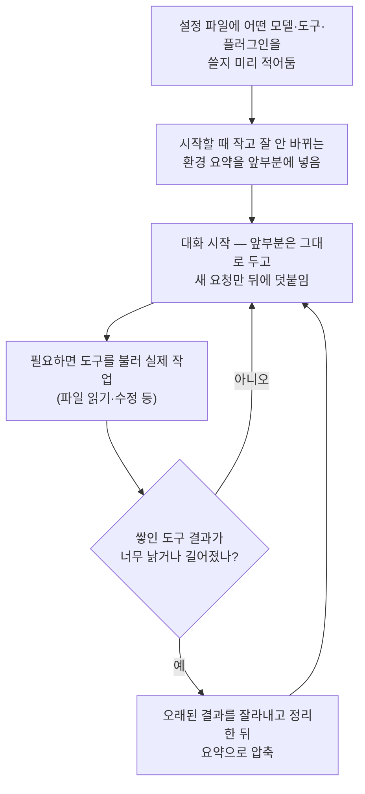

<div class="ai-knowledge-shell">

<aside class="ai-knowledge-sidebar">
  <p class="ai-eyebrow">CATEGORIES</p>
  <nav class="ai-cat-tree"><details class="ai-cat" open><summary><span class="catname">에이전트 오케스트레이션</span><span class="catcount">7</span></summary><ul><li><a href="https://altjs4510.github.io/ai_news_blog/knowledge/20260805/"><span class="kdate">2026-08-05</span><span class="ktitle">TencentCloud/TencentDB-Agent-Memory — 대화·문서·코드를 …</span></a></li><li><a href="https://altjs4510.github.io/ai_news_blog/knowledge/20260707/"><span class="kdate">2026-07-07</span><span class="ktitle">AI Hero Skills Catalog — 실무 엔지니어를 위한 재사용 가능한 판단 …</span></a></li><li><a href="https://altjs4510.github.io/ai_news_blog/knowledge/20260623/"><span class="kdate">2026-06-23</span><span class="ktitle">bytedance/deer-flow — 샌드박스·메모리·서브에이전트·메시지 게이트웨이를…</span></a></li><li><a href="https://altjs4510.github.io/ai_news_blog/knowledge/20260621/"><span class="kdate">2026-06-21</span><span class="ktitle">calesthio/OpenMontage — 12 파이프라인·52 도구·500+ 스킬을 …</span></a></li><li><a href="https://altjs4510.github.io/ai_news_blog/knowledge/20260602/"><span class="kdate">2026-06-02</span><span class="ktitle">revfactory/harness — 도메인별 에이전트 팀과 스킬을 자동 설계하는 메타…</span></a></li><li><a href="https://altjs4510.github.io/ai_news_blog/knowledge/20260529/"><span class="kdate">2026-05-29</span><span class="ktitle">Introducing dynamic workflows in Claude Code</span></a></li><li><a href="https://altjs4510.github.io/ai_news_blog/knowledge/20260507/"><span class="kdate">2026-05-07</span><span class="ktitle">ruvnet/ruflo — Claude 멀티 에이전트 오케스트레이션 플랫폼</span></a></li></ul></details><details class="ai-cat" open><summary><span class="catname">MCP &amp; 도구 통합</span><span class="catcount">18</span></summary><ul><li><a href="https://altjs4510.github.io/ai_news_blog/knowledge/20260802/"><span class="kdate">2026-08-02</span><span class="ktitle">Stateless MCP has recaptured my interest (and in…</span></a></li><li><a href="https://altjs4510.github.io/ai_news_blog/knowledge/20260801/"><span class="kdate">2026-08-01</span><span class="ktitle">different-ai/openwork — Claude Cowork의 오픈소스 대체 에…</span></a></li><li><a href="https://altjs4510.github.io/ai_news_blog/knowledge/20260731/"><span class="kdate">2026-07-31</span><span class="ktitle">different-ai/openwork — Claude Cowork의 오픈소스 대안(o…</span></a></li><li><a href="https://altjs4510.github.io/ai_news_blog/knowledge/20260729/"><span class="kdate">2026-07-29</span><span class="ktitle">Bringing MCP 2026-07-28 to Claude</span></a></li><li><a href="https://altjs4510.github.io/ai_news_blog/knowledge/20260721/"><span class="kdate">2026-07-21</span><span class="ktitle">tirth8205/code-review-graph — 로컬 우선 코드 인텔리전스 그래프…</span></a></li><li><a href="https://altjs4510.github.io/ai_news_blog/knowledge/20260719/"><span class="kdate">2026-07-19</span><span class="ktitle">tirth8205/code-review-graph — 로컬 우선 코드 인텔리전스 그래프…</span></a></li><li><a href="https://altjs4510.github.io/ai_news_blog/knowledge/20260718/"><span class="kdate">2026-07-18</span><span class="ktitle">tirth8205/code-review-graph — MCP·CLI용 로컬 코드 인텔리…</span></a></li><li><a href="https://altjs4510.github.io/ai_news_blog/knowledge/20260709/"><span class="kdate">2026-07-09</span><span class="ktitle">mvanhorn/last30days-skill — Reddit·X·YouTube·HN·…</span></a></li><li><a href="https://altjs4510.github.io/ai_news_blog/knowledge/20260708/"><span class="kdate">2026-07-08</span><span class="ktitle">Expanding Managed Agents in Gemini API: backgrou…</span></a></li><li><a href="https://altjs4510.github.io/ai_news_blog/knowledge/20260618/"><span class="kdate">2026-06-18</span><span class="ktitle">DeusData/codebase-memory-mcp — 158개 언어 코드베이스를 밀리…</span></a></li><li><a href="https://altjs4510.github.io/ai_news_blog/knowledge/20260606/"><span class="kdate">2026-06-06</span><span class="ktitle">chopratejas/headroom — Compress tool outputs, lo…</span></a></li><li><a href="https://altjs4510.github.io/ai_news_blog/knowledge/20260605/"><span class="kdate">2026-06-05</span><span class="ktitle">chopratejas/headroom — Compress tool outputs, lo…</span></a></li><li><a href="https://altjs4510.github.io/ai_news_blog/knowledge/20260604/"><span class="kdate">2026-06-04</span><span class="ktitle">chopratejas/headroom — Compress tool outputs bef…</span></a></li><li><a href="https://altjs4510.github.io/ai_news_blog/knowledge/20260603/"><span class="kdate">2026-06-03</span><span class="ktitle">How Bad MCP design cost your Agent 5× more token…</span></a></li><li><a href="https://altjs4510.github.io/ai_news_blog/knowledge/20260526/"><span class="kdate">2026-05-26</span><span class="ktitle">colbymchenry/codegraph — Pre-indexed code knowle…</span></a></li><li><a href="https://altjs4510.github.io/ai_news_blog/knowledge/20260523/"><span class="kdate">2026-05-23</span><span class="ktitle">colbymchenry/codegraph — 사전 인덱싱된 코드 지식 그래프 MCP</span></a></li><li><a href="https://altjs4510.github.io/ai_news_blog/knowledge/20260517/"><span class="kdate">2026-05-17</span><span class="ktitle">I gave my LLM 100,000+ tools — Lazy Discovery &a…</span></a></li><li><a href="https://altjs4510.github.io/ai_news_blog/knowledge/20260509/"><span class="kdate">2026-05-09</span><span class="ktitle">How to connect 100 MCP servers without the conte…</span></a></li></ul></details><details class="ai-cat" open><summary><span class="catname">코딩 에이전트</span><span class="catcount">22</span></summary><ul><li><a href="https://altjs4510.github.io/ai_news_blog/knowledge/20260811/"><span class="kdate">2026-08-11</span><span class="ktitle">PrimeIntellect-ai/prime-agent — 장기 자율 실행을 전제로 설계…</span></a></li><li><a href="https://altjs4510.github.io/ai_news_blog/knowledge/20260810/"><span class="kdate">2026-08-10</span><span class="ktitle">Auto mode is now the default in Claude Code for …</span></a></li><li><a href="https://altjs4510.github.io/ai_news_blog/knowledge/20260809/"><span class="kdate">2026-08-09</span><span class="ktitle">PrimeIntellect-ai/prime-agent — 코딩 워크플로우·장기 자율 작…</span></a></li><li><a href="https://altjs4510.github.io/ai_news_blog/knowledge/20260808/"><span class="kdate">2026-08-08</span><span class="ktitle">PrimeIntellect-ai/prime-agent — 코딩 워크플로우와 장시간 자율…</span></a></li><li><a href="https://altjs4510.github.io/ai_news_blog/knowledge/20260804/" class="current"><span class="kdate">2026-08-04</span><span class="ktitle">esengine/DeepSeek-Reasonix — prefix-cache 안정성을 축…</span></a></li><li><a href="https://altjs4510.github.io/ai_news_blog/knowledge/20260728/"><span class="kdate">2026-07-28</span><span class="ktitle">alibaba/open-code-review — 결정론적 파이프라인 + LLM 에이전트…</span></a></li><li><a href="https://altjs4510.github.io/ai_news_blog/knowledge/20260725/"><span class="kdate">2026-07-25</span><span class="ktitle">The new rules of context engineering for Claude …</span></a></li><li><a href="https://altjs4510.github.io/ai_news_blog/knowledge/20260722/"><span class="kdate">2026-07-22</span><span class="ktitle">tirth8205/code-review-graph — MCP·CLI용 로컬 우선 코드 …</span></a></li><li><a href="https://altjs4510.github.io/ai_news_blog/knowledge/20260715/"><span class="kdate">2026-07-15</span><span class="ktitle">Dicklesworthstone/destructive_command_guard — 에이…</span></a></li><li><a href="https://altjs4510.github.io/ai_news_blog/knowledge/20260714/"><span class="kdate">2026-07-14</span><span class="ktitle">Graphify-Labs/graphify — 코드베이스를 질의 가능한 지식 그래프로 만…</span></a></li><li><a href="https://altjs4510.github.io/ai_news_blog/knowledge/20260705/"><span class="kdate">2026-07-05</span><span class="ktitle">openai/codex-plugin-cc — Claude Code에서 Codex를 위임…</span></a></li><li><a href="https://altjs4510.github.io/ai_news_blog/knowledge/20260626/"><span class="kdate">2026-06-26</span><span class="ktitle">google-labs-code/design.md — 코딩 에이전트에게 디자인 시스템을 …</span></a></li><li><a href="https://altjs4510.github.io/ai_news_blog/knowledge/20260619/"><span class="kdate">2026-06-19</span><span class="ktitle">Claude Code now supports artifacts</span></a></li><li><a href="https://altjs4510.github.io/ai_news_blog/knowledge/20260530/"><span class="kdate">2026-05-30</span><span class="ktitle">Leonxlnx/taste-skill — AI에게 좋은 취향을 부여해 generic s…</span></a></li><li><a href="https://altjs4510.github.io/ai_news_blog/knowledge/20260528/"><span class="kdate">2026-05-28</span><span class="ktitle">Building self-improving tax agents with Codex</span></a></li><li><a href="https://altjs4510.github.io/ai_news_blog/knowledge/20260524/"><span class="kdate">2026-05-24</span><span class="ktitle">colbymchenry/codegraph — Pre-indexed code knowle…</span></a></li><li><a href="https://altjs4510.github.io/ai_news_blog/knowledge/20260521/"><span class="kdate">2026-05-21</span><span class="ktitle">colbymchenry/codegraph — Pre-indexed code knowle…</span></a></li><li><a href="https://altjs4510.github.io/ai_news_blog/knowledge/20260512/"><span class="kdate">2026-05-12</span><span class="ktitle">agentmemory — Persistent memory for AI coding ag…</span></a></li><li><a href="https://altjs4510.github.io/ai_news_blog/knowledge/20260510/"><span class="kdate">2026-05-10</span><span class="ktitle">addyosmani/agent-skills — Production-grade engin…</span></a></li><li><a href="https://altjs4510.github.io/ai_news_blog/knowledge/20260508/"><span class="kdate">2026-05-08</span><span class="ktitle">addyosmani/agent-skills — Production-grade engin…</span></a></li><li><a href="https://altjs4510.github.io/ai_news_blog/knowledge/20260506/"><span class="kdate">2026-05-06</span><span class="ktitle">mksglu/context-mode — AI 코딩 에이전트용 컨텍스트 윈도우 최적화</span></a></li><li><a href="https://altjs4510.github.io/ai_news_blog/knowledge/20260505/"><span class="kdate">2026-05-05</span><span class="ktitle">mattpocock/skills — Skills for Real Engineers (.…</span></a></li></ul></details><details class="ai-cat" open><summary><span class="catname">모델 &amp; 연구</span><span class="catcount">5</span></summary><ul><li><a href="https://altjs4510.github.io/ai_news_blog/knowledge/20260716-proprag/"><span class="kdate">2026-07-16</span><span class="ktitle">PropRAG — 프로포지션 경로 위 beam search로 멀티홉 검색 안내</span></a></li><li><a href="https://altjs4510.github.io/ai_news_blog/knowledge/20260620/"><span class="kdate">2026-06-20</span><span class="ktitle">zai-org/GLM-5 — From Vibe Coding to Agentic Engi…</span></a></li><li><a href="https://altjs4510.github.io/ai_news_blog/knowledge/20260617/"><span class="kdate">2026-06-17</span><span class="ktitle">Predicting model behavior before release by simu…</span></a></li><li><a href="https://altjs4510.github.io/ai_news_blog/knowledge/20260516/"><span class="kdate">2026-05-16</span><span class="ktitle">STALE — 에이전트가 자기 기억의 유효성을 인지할 수 있는가</span></a></li><li><a href="https://altjs4510.github.io/ai_news_blog/knowledge/20260513/"><span class="kdate">2026-05-13</span><span class="ktitle">Thinking Machines' Native Interaction Models — T…</span></a></li></ul></details><details class="ai-cat" open><summary><span class="catname">인프라 &amp; 컴퓨트</span><span class="catcount">9</span></summary><ul><li><a href="https://altjs4510.github.io/ai_news_blog/knowledge/20260813/"><span class="kdate">2026-08-13</span><span class="ktitle">semantica-agi/semantica — 컨텍스트와 책임 추적을 위한 그래프 네이…</span></a></li><li><a href="https://altjs4510.github.io/ai_news_blog/knowledge/20260812/"><span class="kdate">2026-08-12</span><span class="ktitle">semantica-agi/semantica — 컨텍스트와 '책임 추적 가능한(accou…</span></a></li><li><a href="https://altjs4510.github.io/ai_news_blog/knowledge/20260806/"><span class="kdate">2026-08-06</span><span class="ktitle">cloudflare/computer — 에이전트에게 컴퓨터를 통째로 주는 엣지 실행 샌…</span></a></li><li><a href="https://altjs4510.github.io/ai_news_blog/knowledge/20260724/"><span class="kdate">2026-07-24</span><span class="ktitle">diegosouzapw/OmniRoute — 단일 엔드포인트로 278+ 프로바이더·50…</span></a></li><li><a href="https://altjs4510.github.io/ai_news_blog/knowledge/20260723/"><span class="kdate">2026-07-23</span><span class="ktitle">diegosouzapw/OmniRoute — 268+ 프로바이더를 단일 엔드포인트로 묶…</span></a></li><li><a href="https://altjs4510.github.io/ai_news_blog/knowledge/20260630/"><span class="kdate">2026-06-30</span><span class="ktitle">Introducing the Claude apps gateway for Amazon B…</span></a></li><li><a href="https://altjs4510.github.io/ai_news_blog/knowledge/20260611/"><span class="kdate">2026-06-11</span><span class="ktitle">The evolution of agentic surfaces: building with…</span></a></li><li><a href="https://altjs4510.github.io/ai_news_blog/knowledge/20260522/"><span class="kdate">2026-05-22</span><span class="ktitle">Giving Agents Computers — Ivan Burazin, Daytona</span></a></li><li><a href="https://altjs4510.github.io/ai_news_blog/knowledge/20260520/"><span class="kdate">2026-05-20</span><span class="ktitle">New in Claude Managed Agents: self-hosted sandbo…</span></a></li></ul></details><details class="ai-cat" open><summary><span class="catname">보안 &amp; 거버넌스</span><span class="catcount">12</span></summary><ul><li><a href="https://altjs4510.github.io/ai_news_blog/knowledge/20260730/"><span class="kdate">2026-07-30</span><span class="ktitle">Anatomy of a Frontier Lab Agent Intrusion: A Tec…</span></a></li><li><a href="https://altjs4510.github.io/ai_news_blog/knowledge/20260716/"><span class="kdate">2026-07-16</span><span class="ktitle">Dicklesworthstone/destructive_command_guard — 에이…</span></a></li><li><a href="https://altjs4510.github.io/ai_news_blog/knowledge/20260710/"><span class="kdate">2026-07-10</span><span class="ktitle">70개 MCP 서버 strace 런타임 감사 — 부팅 시 아웃바운드 호출 서버 적발</span></a></li><li><a href="https://altjs4510.github.io/ai_news_blog/knowledge/20260704/"><span class="kdate">2026-07-04</span><span class="ktitle">Cloudflare is about to block AI agents by defaul…</span></a></li><li><a href="https://altjs4510.github.io/ai_news_blog/knowledge/20260625/"><span class="kdate">2026-06-25</span><span class="ktitle">Agent identity in Claude Tag: a new access model…</span></a></li><li><a href="https://altjs4510.github.io/ai_news_blog/knowledge/20260624/"><span class="kdate">2026-06-24</span><span class="ktitle">Agent identity in Claude Tag: a new access model…</span></a></li><li><a href="https://altjs4510.github.io/ai_news_blog/knowledge/20260614/"><span class="kdate">2026-06-14</span><span class="ktitle">NVIDIA/SkillSpector — Security scanner for AI ag…</span></a></li><li><a href="https://altjs4510.github.io/ai_news_blog/knowledge/20260613/"><span class="kdate">2026-06-13</span><span class="ktitle">Fable 5's guardrails got bypassed in 48 hours — …</span></a></li><li><a href="https://altjs4510.github.io/ai_news_blog/knowledge/20260612/"><span class="kdate">2026-06-12</span><span class="ktitle">NVIDIA/SkillSpector — AI 에이전트 스킬용 보안 스캐너</span></a></li><li><a href="https://altjs4510.github.io/ai_news_blog/knowledge/20260607/"><span class="kdate">2026-06-07</span><span class="ktitle">OpenAI Help: Lockdown Mode</span></a></li><li><a href="https://altjs4510.github.io/ai_news_blog/knowledge/20260531/"><span class="kdate">2026-05-31</span><span class="ktitle">How we contain Claude across products</span></a></li><li><a href="https://altjs4510.github.io/ai_news_blog/knowledge/20260527/"><span class="kdate">2026-05-27</span><span class="ktitle">Microsoft Copilot Cowork Exfiltrates Files</span></a></li></ul></details><details class="ai-cat" open><summary><span class="catname">응용 사례</span><span class="catcount">5</span></summary><ul><li><a href="https://altjs4510.github.io/ai_news_blog/knowledge/20260726/"><span class="kdate">2026-07-26</span><span class="ktitle">citrolabs/ego-lite — 로그인된 브라우저 상태를 AI 에이전트와 공유하는…</span></a></li><li><a href="https://altjs4510.github.io/ai_news_blog/knowledge/20260717/"><span class="kdate">2026-07-17</span><span class="ktitle">After a year building agent memory, 'save everyt…</span></a></li><li><a href="https://altjs4510.github.io/ai_news_blog/knowledge/20260712/"><span class="kdate">2026-07-12</span><span class="ktitle">Do Automated Evals Work?</span></a></li><li><a href="https://altjs4510.github.io/ai_news_blog/knowledge/20260609/"><span class="kdate">2026-06-09</span><span class="ktitle">Building intelligent apps for Apple platforms wi…</span></a></li><li><a href="https://altjs4510.github.io/ai_news_blog/knowledge/20260514/"><span class="kdate">2026-05-14</span><span class="ktitle">Introducing Claude for Small Business</span></a></li></ul></details><details class="ai-cat" open><summary><span class="catname">산업 동향</span><span class="catcount">9</span></summary><ul><li><a href="https://altjs4510.github.io/ai_news_blog/knowledge/20260711/"><span class="kdate">2026-07-11</span><span class="ktitle">OpenAI says GPT 5.6 is the 'preferred model' for…</span></a></li><li><a href="https://altjs4510.github.io/ai_news_blog/knowledge/20260703/"><span class="kdate">2026-07-03</span><span class="ktitle">Giving admins more visibility and control over C…</span></a></li><li><a href="https://altjs4510.github.io/ai_news_blog/knowledge/20260702/"><span class="kdate">2026-07-02</span><span class="ktitle">How Cursor deploys AI inside the enterprise (For…</span></a></li><li><a href="https://altjs4510.github.io/ai_news_blog/knowledge/20260701/"><span class="kdate">2026-07-01</span><span class="ktitle">Google OKF (Open Knowledge Format) — 벤더 중립 에이전트 …</span></a></li><li><a href="https://altjs4510.github.io/ai_news_blog/knowledge/20260616/"><span class="kdate">2026-06-16</span><span class="ktitle">Why AI hasn't replaced software engineers, and w…</span></a></li><li><a href="https://altjs4510.github.io/ai_news_blog/knowledge/20260610/"><span class="kdate">2026-06-10</span><span class="ktitle">Fable 5 just made cost-aware model routing manda…</span></a></li><li><a href="https://altjs4510.github.io/ai_news_blog/knowledge/20260519/"><span class="kdate">2026-05-19</span><span class="ktitle">Anthropic acquires Stainless</span></a></li><li><a href="https://altjs4510.github.io/ai_news_blog/knowledge/20260515/"><span class="kdate">2026-05-15</span><span class="ktitle">Clawdmeter — Claude Code 사용량을 데스크톱 대시보드로</span></a></li><li><a href="https://altjs4510.github.io/ai_news_blog/knowledge/20260504/"><span class="kdate">2026-05-04</span><span class="ktitle">Agents for Everything Else: Codex for Knowledge …</span></a></li></ul></details></nav>
</aside>

<article class="ai-knowledge-article">

<header class="ai-post-hero">
  <p class="ai-eyebrow"><a class="ai-back" href="../">KNOWLEDGE</a> · 2026-08-04 · 오늘의 학습</p>
  <h2 class="ai-post-title">esengine/DeepSeek-Reasonix — prefix-cache 안정성을 축으로 설계한 터미널 코딩 에이전트</h2>
</header>

> 원문: [esengine/DeepSeek-Reasonix — prefix-cache 안정성을 축으로 설계한 터미널 코딩 에이전트](https://github.com/esengine/DeepSeek-Reasonix)

## 📌 학습 정리

### 1. 한 줄로 말하면

터미널 안에서 코드를 대신 읽고 고쳐주는 조수 프로그램인데, "매번 새로 설명하지 말고 하던 대화를 계속 이어가라"는 원칙을 설계의 뼈대로 삼은 도구예요. 그렇게 하면 같은 이야기를 반복해서 전달하는 비용이 줄어든다는 발상입니다.

### 2. 왜 이게 만들어졌어요?

대화형 AI에게 일을 시킬 때는 매번 "이 프로젝트는 이렇고, 규칙은 저렇고, 지금까지 이런 걸 했고…" 하는 앞부분을 통째로 다시 넘겨야 해요. 작업이 길어질수록 그 앞부분이 계속 불어나서, 정작 새로 물어보는 건 한 줄인데 딸려가는 짐이 훨씬 무거워집니다. 이 도구는 그 앞부분이 **매번 똑같은 순서로 유지되기만 하면** 모델 쪽이 이미 처리해둔 걸 재사용할 수 있다는 점에 초점을 맞췄어요. 그래서 소개 문구에서도 기능 자랑보다 "긴 세션에서도 토큰 비용이 낮게 유지되도록 앞부분 캐시(prefix cache)에 맞춰 조율했다"는 이야기를 먼저 꺼냅니다. 설치도 단일 실행 파일 하나로 끝내서, 무거운 설치 과정 없이 그냥 켜두고 쓰는 쪽을 지향해요.

### 3. 비유로 풀면

이건 마치 같은 카페에 매일 가는 단골이 되는 것과 비슷해요. 처음 온 손님은 메뉴 설명부터 취향까지 다 말해야 하지만, 단골은 "늘 마시던 걸로"면 끝나죠. 대신 조건이 있어요 — 매번 앉는 자리와 주문 순서가 뒤죽박죽이면 사장님도 기억을 못 살립니다.

또 하나, 오래 쓴 작업 노트에 비유할 수도 있어요. 앞장은 손대지 않고 뒤에만 계속 이어 쓰면 앞장을 다시 읽을 필요가 없지만, 중간을 지우거나 순서를 바꾸는 순간 처음부터 다시 훑어야 하죠.

그래서 결국, 이 도구가 신경 쓰는 건 "대화의 앞부분을 건드리지 않고 뒤에만 덧붙이는 구조"를 어떻게 유지하느냐입니다.

### 4. 어떻게 작동하는지 (그림으로)



먼저 어떤 모델과 도구를 쓸지 설정 파일에 적어두고 시작하면, 잘 바뀌지 않는 환경 요약이 대화 맨 앞에 자리를 잡아요. 이후로는 그 앞부분을 흔들지 않고 새 요청만 뒤에 붙이는 식으로 이어가고, 도구를 쓰다 보면 쌓이는 결과물은 낡은 것부터 잘라낸 다음 요약으로 압축합니다. 계획을 세우는 모델과 실제로 실행하는 모델을 따로 두고 각각 별도 세션에서 돌릴 수도 있는데, 이것도 서로의 앞부분을 흔들지 않으려는 배치예요.

### 5. 처음 보는 용어 풀이

- **앞부분 캐시 / 접두어 캐시 (prefix cache)** — 대화의 맨 앞 공통 부분을 모델 쪽이 처리해두고 재사용하는 장치예요. 앞부분이 글자 단위로 똑같이 유지될 때만 재사용이 되기 때문에, 중간에 뭔가 끼워 넣으면 그 뒤로는 다시 계산해야 합니다.
- **설정 기반 (config-driven)** — 어떤 모델을 쓸지, 어떤 도구를 켤지를 코드에 박아두지 않고 `reasonix.toml`이라는 설정 파일에 적어두는 방식이에요. 새 모델을 붙일 때 프로그램을 고치는 게 아니라 설정 한 줄을 추가하면 되도록 하려는 의도입니다.
- **플러그인 (plugin)** — 본체와 따로 떨어져 별도 프로그램으로 실행되면서, 정해진 형식으로 메시지를 주고받아 기능을 보태는 확장 부품이에요. 여기서는 표준 입출력으로 JSON 메시지를 주고받는 방식(stdio JSON-RPC)을 쓰고, 모델과 외부 도구를 연결하는 공용 규약인 MCP(Model Context Protocol)와도 호환된다고 밝히고 있어요.
- **실행자와 설계자 분리 (executor + planner)** — 무엇을 할지 계획하는 역할과 실제로 손을 움직이는 역할에 서로 다른 모델을 쓰는 구성이에요. 두 역할을 각각 독립된 세션에서 돌려서 서로의 대화 앞부분을 어지럽히지 않게 합니다.
- **단일 실행 파일 (single static Go binary)** — 필요한 걸 전부 하나로 묶어 만든 프로그램 파일이라, 별도 설치 과정 없이 파일 하나만 있으면 돌아가요. 여러 운영체제와 칩 종류(총 여섯 조합)용으로 한 번에 만들어 배포한다고 합니다.
- **에디터 연동 규약 (ACP)** — 편집기 같은 다른 프로그램이 이 도구를 백엔드로 띄워서 대화·도구 승인·모델 선택 같은 걸 제어할 수 있게 해주는 연결 통로예요. VS Code 확장 기능이 이 방식으로 로컬에 설치된 본체를 불러 씁니다.
- **도구 호출 승인 (tool-call approvals)** — 도구가 파일을 고치는 등 실제 변경을 하기 전에 사람이 확인하고 허락하는 절차예요. 자동으로 움직이는 조수에게 안전장치를 두는 흔한 방식입니다.

### 6. 한 발 더 들어가고 싶다면

- [Guide](https://github.com/esengine/DeepSeek-Reasonix) 문서 묶음 — 처음 설치부터 실제 세션을 어떻게 굴리는지 흐름을 잡을 수 있어요. (저장소 안 문서 링크 모음에서 출발하면 됩니다.)
- [GitHub release](https://github.com/esengine/DeepSeek-Reasonix) 페이지 — 운영체제·칩별로 미리 만들어둔 실행 파일과 검증용 해시값이 어떻게 배포되는지 볼 수 있어요.
- [Discord 커뮤니티](https://discord.gg/XF78rEME2D) — 설치가 막혔을 때 물어보거나, 다른 사람들이 실제로 어떤 작업 흐름으로 쓰는지 엿볼 수 있는 곳이에요. 한국어는 아니지만 영어·중국어 두 갈래로 운영됩니다.
- [Visual Studio Marketplace 확장](https://github.com/esengine/DeepSeek-Reasonix) (확장 ID `SivanLiu.reasonix-agent`) — 터미널 대신 편집기 안에서 쓰는 형태가 어떤 모습인지 확인할 수 있어요.

---

## 📖 원문 전체 번역 (정독용)

> 의역 최소화한 전체 번역입니다. 큰 흐름은 위 정리에서 잡고, 정확한 워딩이 필요할 땐 이 섹션에서 정독하세요.

English
·
简体中文
·
Guide
·
ACP
·
Spec
·
Website
·
Discord

터미널을 위한 DeepSeek 네이티브 AI 코딩 에이전트.

config 와 플러그인으로 구동되는 harness — 단일 정적 Go 바이너리로, DeepSeek 의 prefix cache 에 맞춰 튜닝되어 긴 세션에서도 토큰 비용을 낮게 유지한다.

중요

Community · 加入社区 — 설정 도움(`#help` / `#求助`), 워크플로우 쇼케이스, 기능 아이디어를 위한 이중언어 Discord. → https://discord.gg/XF78rEME2D

## 특징

**Config 기반.** provider, agent, 활성화된 도구, 플러그인이 모두 `reasonix.toml` 에 선언된다. 하드코딩된 모델은 없다.

**멀티모델 & 조합 가능.** DeepSeek 는 프리셋으로 제공되며, OpenAI 호환 엔드포인트는 새 코드가 아니라 config 항목일 뿐이다. 선택적으로 두 모델(executor + planner)을 별도의, 캐시가 안정적인 세션에서 함께 실행할 수 있다.

**플러그인 기반.** 외부 도구는 stdio JSON-RPC(MCP 호환)를 통해 서브프로세스로 실행된다. 내장 도구는 컴파일 타임에 자동으로 등록된다.

**캐시를 인식하는 컨텍스트 유지.** 시작 시 작고 안정적인 환경 요약을 주입하며, 요약 압축(compaction) 이전에 오래된 도구 출력이 잘려나가거나(snipped) 정리되고(pruned), 내장 도구 스키마 계약(contract)은 회귀(regression) 검토를 위해 문서화되어 있다.

**마찰 없는 배포.** `CGO_ENABLED=0` 단일 바이너리로, 한 번의 명령으로 6개 타겟으로 크로스 컴파일된다. 유일한 의존성은 TOML 파서뿐이다.

## 설치

Reasonix 를 사용하고 싶은 방식에 맞는 경로를 선택하라. CLI/TUI, 데스크톱 앱, VS Code 확장 프로그램은 모두 동일한 로컬 Reasonix 엔진을 사용한다.

### 경로 A: CLI / TUI

지원되는 모든 플랫폼에서 npm 을 통해 네이티브 바이너리를 설치하거나, macOS 에서는 Homebrew 를 사용하라:

```
npm i -g reasonix      # 모든 OS; 프리빌드된 네이티브 바이너리를 받아옴
brew install esengine/reasonix/reasonix   # macOS
```

프리빌드 아카이브(`darwin|linux|windows × amd64|arm64`)와 `SHA256SUMS` 는 모든 GitHub release 에 있다.

### 경로 B: 데스크톱 앱

최신 데스크톱 빌드는 공식 다운로드 페이지를 이용하라.

| 플랫폼 | 패키지 | 아키텍처 |
|---|---|---|
| macOS | Universal `.dmg` 또는 `.zip` | Apple Silicon / Intel |
| Windows | Installer `.exe` 또는 portable `.zip` | x64 / ARM64 |
| Linux | `.deb` 또는 `.tar.gz` | x64 |

Windows 설치 프로그램은 SignPath Foundation 이 제공하는 무료 인증서로 SignPath.io 를 통해 코드 서명되어 있다.

### 경로 C: VS Code 확장 프로그램

먼저 경로 A 를 완료하라. 이 확장 프로그램은 CLI 를 번들로 포함하지 않는다 — 로컬 `reasonix acp` 백엔드를 시작시키고, 네이티브 채팅, 에디터 컨텍스트, 도구 호출 승인, 모델 선택, 워크스페이스 세션을 추가한다.

- VS Code: Visual Studio Marketplace 에서 설치
- VSCodium / Eclipse Theia: Open VSX Registry 에서 설치

확장 프로그램 ID: `SivanLiu.reasonix-agent` · 소스 및 사용 가이드

### 경로 D: 소스에서 빌드

```
git clone https://github.com/esengine/DeepSeek-Reasonix.git
cd DeepSeek-Reasonix
make build   # -> bin/reasonix(.exe)
make cross   # -> dist/ (darwin|linux|windows × amd64|arm64)
```

## 빠른 시작

### CLI / TUI

다음 명령들은 경로 A 를 통해 설치된 CLI/TUI 용이다:

```
reasonix setup    # provider 와 모델 구성
reasonix          # 대화형 세션 시작
reasonix run "implement the TODOs in main.go"
```

대화형 세션에서, Reasonix 가 프로젝트 지침을 생성하도록 하려면 `/init` 을 실행하라.

### 데스크톱 앱

공식 다운로드 페이지에서 플랫폼에 맞는 설치 프로그램을 다운로드하여 Reasonix 를 설치·실행한 다음, 앱 내에서 provider 와 모델을 구성하라. 위의 CLI 명령들은 데스크톱 앱에는 필요하지 않다.

고급 CLI 사용법과 구성에 대해서는 CLI reference, Guide, configuration paths 를 참조하라.

## 문서

**시작하기:** Guide · CLI reference · Configuration paths · ACP editor integration

**기능 & 문제 해결:** Subagent profiles · Context Engine v2 · Capability diagnostics · Recovery and updates · Bot guide · Checkpoints & rewind

**엔지니어링 & 마이그레이션:** Spec · Task contracts & pause policy · Tool contract · Migrating from 0.x

## Star History

## 감사의 말

Reasonix 에 가장 큰 영향을 준 사람들의 짧은 목록 — 커밋 수 기준 현재 상위 20명의 기여자다. 전체 기여자 그래프는 GitHub 에 있다.

Contributor / Contributor / Contributor / Contributor

SivanCola · esengine · ttmouse · lifu963 · reasonix (anonymous) · HUQIANTAO · GTC2080 · light-front-theory · merge-order-check (anonymous) · Li-Charles-One · eghrhegpe · wufengfan (anonymous) · CVEngineer66 · dependabot[bot] · lanshi17 · SuMuxi66 · CnsMaple · cyq1017 · JesonChou · XTLine

또한 프로젝트 로고를 디자인해 준 Bernardxu123 과, XiaoHongShu(샤오홍슈)에서 프로젝트를 홍보해 준 AIGC Link 에게 별도로 감사를 전한다.

MIT — LICENSE 참조

esengine/DeepSeek-Reasonix 커뮤니티에 의해 만들어짐

## 이 프로젝트 후원하기

Reasonix 가 유용했고 감사를 표하고 싶다면, 그렇게 할 수 있다. 이는 계약이 아니라 커피 한 잔으로 남는다 — 후원이 기능 우선순위를 사거나 이슈 처리 방식을 바꾸지는 않는다.

International — PayPal: paypal.me/yuhuahui
国内 — 微信支付（扫码）

</article>

</div>

<!-- ai-related-links -->
<aside class="ai-related-links">
  <p class="ai-eyebrow">관련 학습</p>
  <ul><li><a href="https://altjs4510.github.io/ai_news_blog/knowledge/20260604/"><span class="kdate">2026-06-04</span><span class="ktitle">chopratejas/headroom — Compress tool outputs bef…</span></a></li><li><a href="https://altjs4510.github.io/ai_news_blog/knowledge/20260521/"><span class="kdate">2026-05-21</span><span class="ktitle">colbymchenry/codegraph — Pre-indexed code knowle…</span></a></li><li><a href="https://altjs4510.github.io/ai_news_blog/knowledge/20260710/"><span class="kdate">2026-07-10</span><span class="ktitle">70개 MCP 서버 strace 런타임 감사 — 부팅 시 아웃바운드 호출 서버 적발</span></a></li></ul>
</aside>
<!-- /ai-related-links -->
