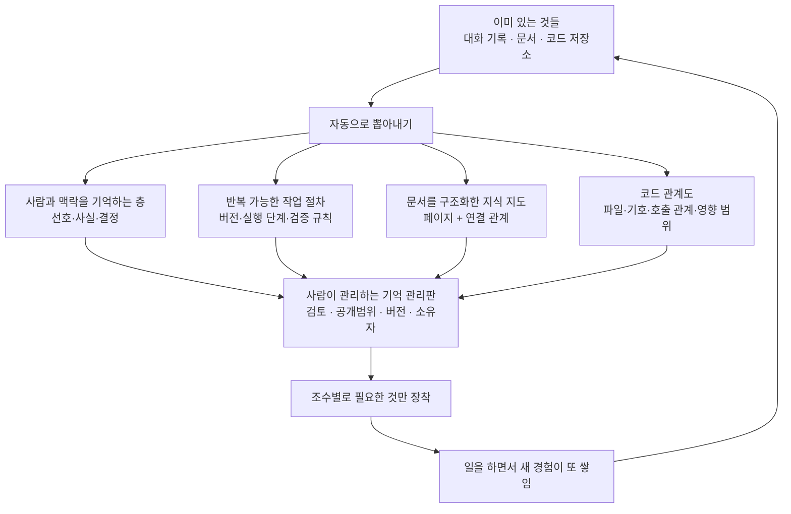

<aside class="ai-knowledge-sidebar">
  
CATEGORIES

  <nav class="ai-cat-tree">

에이전트 오케스트레이션9
<ul><li><a href="https://altjs4510.github.io/ai_news_blog/knowledge/20260805/" class="current">2026-08-05TencentCloud/TencentDB-Agent-Memory — 대화·문서·코드를 …</a></li><li><a href="https://altjs4510.github.io/ai_news_blog/knowledge/20260709/">2026-07-09mvanhorn/last30days-skill — Reddit·X·YouTube·HN·…</a></li><li><a href="https://altjs4510.github.io/ai_news_blog/knowledge/20260707/">2026-07-07AI Hero Skills Catalog — 실무 엔지니어를 위한 재사용 가능한 판단 …</a></li><li><a href="https://altjs4510.github.io/ai_news_blog/knowledge/20260701/">2026-07-01Google OKF (Open Knowledge Format) — 벤더 중립 에이전트 …</a></li><li><a href="https://altjs4510.github.io/ai_news_blog/knowledge/20260623/">2026-06-23bytedance/deer-flow — 샌드박스·메모리·서브에이전트·메시지 게이트웨이를…</a></li><li><a href="https://altjs4510.github.io/ai_news_blog/knowledge/20260621/">2026-06-21calesthio/OpenMontage — 12 파이프라인·52 도구·500+ 스킬을 …</a></li><li><a href="https://altjs4510.github.io/ai_news_blog/knowledge/20260602/">2026-06-02revfactory/harness — 도메인별 에이전트 팀과 스킬을 자동 설계하는 메타…</a></li><li><a href="https://altjs4510.github.io/ai_news_blog/knowledge/20260529/">2026-05-29Introducing dynamic workflows in Claude Code</a></li><li><a href="https://altjs4510.github.io/ai_news_blog/knowledge/20260507/">2026-05-07ruvnet/ruflo — Claude 멀티 에이전트 오케스트레이션 플랫폼</a></li></ul>

MCP &amp; 도구 통합20
<ul><li><a href="https://altjs4510.github.io/ai_news_blog/knowledge/20260802/">2026-08-02Stateless MCP has recaptured my interest (and in…</a></li><li><a href="https://altjs4510.github.io/ai_news_blog/knowledge/20260801/">2026-08-01different-ai/openwork — Claude Cowork의 오픈소스 대체 에…</a></li><li><a href="https://altjs4510.github.io/ai_news_blog/knowledge/20260731/">2026-07-31different-ai/openwork — Claude Cowork의 오픈소스 대안(o…</a></li><li><a href="https://altjs4510.github.io/ai_news_blog/knowledge/20260729/">2026-07-29Bringing MCP 2026-07-28 to Claude</a></li><li><a href="https://altjs4510.github.io/ai_news_blog/knowledge/20260724/">2026-07-24diegosouzapw/OmniRoute — 단일 엔드포인트로 278+ 프로바이더·50…</a></li><li><a href="https://altjs4510.github.io/ai_news_blog/knowledge/20260723/">2026-07-23diegosouzapw/OmniRoute — 268+ 프로바이더를 단일 엔드포인트로 묶…</a></li><li><a href="https://altjs4510.github.io/ai_news_blog/knowledge/20260722/">2026-07-22tirth8205/code-review-graph — MCP·CLI용 로컬 우선 코드 …</a></li><li><a href="https://altjs4510.github.io/ai_news_blog/knowledge/20260721/">2026-07-21tirth8205/code-review-graph — 로컬 우선 코드 인텔리전스 그래프…</a></li><li><a href="https://altjs4510.github.io/ai_news_blog/knowledge/20260719/">2026-07-19tirth8205/code-review-graph — 로컬 우선 코드 인텔리전스 그래프…</a></li><li><a href="https://altjs4510.github.io/ai_news_blog/knowledge/20260718/">2026-07-18tirth8205/code-review-graph — MCP·CLI용 로컬 코드 인텔리…</a></li><li><a href="https://altjs4510.github.io/ai_news_blog/knowledge/20260708/">2026-07-08Expanding Managed Agents in Gemini API: backgrou…</a></li><li><a href="https://altjs4510.github.io/ai_news_blog/knowledge/20260618/">2026-06-18DeusData/codebase-memory-mcp — 158개 언어 코드베이스를 밀리…</a></li><li><a href="https://altjs4510.github.io/ai_news_blog/knowledge/20260606/">2026-06-06chopratejas/headroom — Compress tool outputs, lo…</a></li><li><a href="https://altjs4510.github.io/ai_news_blog/knowledge/20260605/">2026-06-05chopratejas/headroom — Compress tool outputs, lo…</a></li><li><a href="https://altjs4510.github.io/ai_news_blog/knowledge/20260604/">2026-06-04chopratejas/headroom — Compress tool outputs bef…</a></li><li><a href="https://altjs4510.github.io/ai_news_blog/knowledge/20260603/">2026-06-03How Bad MCP design cost your Agent 5× more token…</a></li><li><a href="https://altjs4510.github.io/ai_news_blog/knowledge/20260526/">2026-05-26colbymchenry/codegraph — Pre-indexed code knowle…</a></li><li><a href="https://altjs4510.github.io/ai_news_blog/knowledge/20260523/">2026-05-23colbymchenry/codegraph — 사전 인덱싱된 코드 지식 그래프 MCP</a></li><li><a href="https://altjs4510.github.io/ai_news_blog/knowledge/20260517/">2026-05-17I gave my LLM 100,000+ tools — Lazy Discovery &a…</a></li><li><a href="https://altjs4510.github.io/ai_news_blog/knowledge/20260509/">2026-05-09How to connect 100 MCP servers without the conte…</a></li></ul>

코딩 에이전트17
<ul><li><a href="https://altjs4510.github.io/ai_news_blog/knowledge/20260804/">2026-08-04esengine/DeepSeek-Reasonix — prefix-cache 안정성을 축…</a></li><li><a href="https://altjs4510.github.io/ai_news_blog/knowledge/20260728/">2026-07-28alibaba/open-code-review — 결정론적 파이프라인 + LLM 에이전트…</a></li><li><a href="https://altjs4510.github.io/ai_news_blog/knowledge/20260725/">2026-07-25The new rules of context engineering for Claude …</a></li><li><a href="https://altjs4510.github.io/ai_news_blog/knowledge/20260715/">2026-07-15Dicklesworthstone/destructive_command_guard — 에이…</a></li><li><a href="https://altjs4510.github.io/ai_news_blog/knowledge/20260714/">2026-07-14Graphify-Labs/graphify — 코드베이스를 질의 가능한 지식 그래프로 만…</a></li><li><a href="https://altjs4510.github.io/ai_news_blog/knowledge/20260705/">2026-07-05openai/codex-plugin-cc — Claude Code에서 Codex를 위임…</a></li><li><a href="https://altjs4510.github.io/ai_news_blog/knowledge/20260626/">2026-06-26google-labs-code/design.md — 코딩 에이전트에게 디자인 시스템을 …</a></li><li><a href="https://altjs4510.github.io/ai_news_blog/knowledge/20260619/">2026-06-19Claude Code now supports artifacts</a></li><li><a href="https://altjs4510.github.io/ai_news_blog/knowledge/20260530/">2026-05-30Leonxlnx/taste-skill — AI에게 좋은 취향을 부여해 generic s…</a></li><li><a href="https://altjs4510.github.io/ai_news_blog/knowledge/20260528/">2026-05-28Building self-improving tax agents with Codex</a></li><li><a href="https://altjs4510.github.io/ai_news_blog/knowledge/20260524/">2026-05-24colbymchenry/codegraph — Pre-indexed code knowle…</a></li><li><a href="https://altjs4510.github.io/ai_news_blog/knowledge/20260521/">2026-05-21colbymchenry/codegraph — Pre-indexed code knowle…</a></li><li><a href="https://altjs4510.github.io/ai_news_blog/knowledge/20260512/">2026-05-12agentmemory — Persistent memory for AI coding ag…</a></li><li><a href="https://altjs4510.github.io/ai_news_blog/knowledge/20260510/">2026-05-10addyosmani/agent-skills — Production-grade engin…</a></li><li><a href="https://altjs4510.github.io/ai_news_blog/knowledge/20260508/">2026-05-08addyosmani/agent-skills — Production-grade engin…</a></li><li><a href="https://altjs4510.github.io/ai_news_blog/knowledge/20260506/">2026-05-06mksglu/context-mode — AI 코딩 에이전트용 컨텍스트 윈도우 최적화</a></li><li><a href="https://altjs4510.github.io/ai_news_blog/knowledge/20260505/">2026-05-05mattpocock/skills — Skills for Real Engineers (.…</a></li></ul>

모델 &amp; 연구5
<ul><li><a href="https://altjs4510.github.io/ai_news_blog/knowledge/20260716-proprag/">2026-07-16PropRAG — 프로포지션 경로 위 beam search로 멀티홉 검색 안내</a></li><li><a href="https://altjs4510.github.io/ai_news_blog/knowledge/20260620/">2026-06-20zai-org/GLM-5 — From Vibe Coding to Agentic Engi…</a></li><li><a href="https://altjs4510.github.io/ai_news_blog/knowledge/20260617/">2026-06-17Predicting model behavior before release by simu…</a></li><li><a href="https://altjs4510.github.io/ai_news_blog/knowledge/20260516/">2026-05-16STALE — 에이전트가 자기 기억의 유효성을 인지할 수 있는가</a></li><li><a href="https://altjs4510.github.io/ai_news_blog/knowledge/20260513/">2026-05-13Thinking Machines' Native Interaction Models — T…</a></li></ul>

인프라 &amp; 컴퓨트5
<ul><li><a href="https://altjs4510.github.io/ai_news_blog/knowledge/20260806/">2026-08-06cloudflare/computer — 에이전트에게 컴퓨터를 통째로 주는 엣지 실행 샌…</a></li><li><a href="https://altjs4510.github.io/ai_news_blog/knowledge/20260630/">2026-06-30Introducing the Claude apps gateway for Amazon B…</a></li><li><a href="https://altjs4510.github.io/ai_news_blog/knowledge/20260611/">2026-06-11The evolution of agentic surfaces: building with…</a></li><li><a href="https://altjs4510.github.io/ai_news_blog/knowledge/20260522/">2026-05-22Giving Agents Computers — Ivan Burazin, Daytona</a></li><li><a href="https://altjs4510.github.io/ai_news_blog/knowledge/20260520/">2026-05-20New in Claude Managed Agents: self-hosted sandbo…</a></li></ul>

보안 &amp; 거버넌스13
<ul><li><a href="https://altjs4510.github.io/ai_news_blog/knowledge/20260730/">2026-07-30Anatomy of a Frontier Lab Agent Intrusion: A Tec…</a></li><li><a href="https://altjs4510.github.io/ai_news_blog/knowledge/20260716/">2026-07-16Dicklesworthstone/destructive_command_guard — 에이…</a></li><li><a href="https://altjs4510.github.io/ai_news_blog/knowledge/20260710/">2026-07-1070개 MCP 서버 strace 런타임 감사 — 부팅 시 아웃바운드 호출 서버 적발</a></li><li><a href="https://altjs4510.github.io/ai_news_blog/knowledge/20260704/">2026-07-04Cloudflare is about to block AI agents by defaul…</a></li><li><a href="https://altjs4510.github.io/ai_news_blog/knowledge/20260703/">2026-07-03Giving admins more visibility and control over C…</a></li><li><a href="https://altjs4510.github.io/ai_news_blog/knowledge/20260625/">2026-06-25Agent identity in Claude Tag: a new access model…</a></li><li><a href="https://altjs4510.github.io/ai_news_blog/knowledge/20260624/">2026-06-24Agent identity in Claude Tag: a new access model…</a></li><li><a href="https://altjs4510.github.io/ai_news_blog/knowledge/20260614/">2026-06-14NVIDIA/SkillSpector — Security scanner for AI ag…</a></li><li><a href="https://altjs4510.github.io/ai_news_blog/knowledge/20260613/">2026-06-13Fable 5's guardrails got bypassed in 48 hours — …</a></li><li><a href="https://altjs4510.github.io/ai_news_blog/knowledge/20260612/">2026-06-12NVIDIA/SkillSpector — AI 에이전트 스킬용 보안 스캐너</a></li><li><a href="https://altjs4510.github.io/ai_news_blog/knowledge/20260607/">2026-06-07OpenAI Help: Lockdown Mode</a></li><li><a href="https://altjs4510.github.io/ai_news_blog/knowledge/20260531/">2026-05-31How we contain Claude across products</a></li><li><a href="https://altjs4510.github.io/ai_news_blog/knowledge/20260527/">2026-05-27Microsoft Copilot Cowork Exfiltrates Files</a></li></ul>

응용 사례6
<ul><li><a href="https://altjs4510.github.io/ai_news_blog/knowledge/20260726/">2026-07-26citrolabs/ego-lite — 로그인된 브라우저 상태를 AI 에이전트와 공유하는…</a></li><li><a href="https://altjs4510.github.io/ai_news_blog/knowledge/20260717/">2026-07-17After a year building agent memory, 'save everyt…</a></li><li><a href="https://altjs4510.github.io/ai_news_blog/knowledge/20260712/">2026-07-12Do Automated Evals Work?</a></li><li><a href="https://altjs4510.github.io/ai_news_blog/knowledge/20260609/">2026-06-09Building intelligent apps for Apple platforms wi…</a></li><li><a href="https://altjs4510.github.io/ai_news_blog/knowledge/20260515/">2026-05-15Clawdmeter — Claude Code 사용량을 데스크톱 대시보드로</a></li><li><a href="https://altjs4510.github.io/ai_news_blog/knowledge/20260514/">2026-05-14Introducing Claude for Small Business</a></li></ul>

산업 동향6
<ul><li><a href="https://altjs4510.github.io/ai_news_blog/knowledge/20260711/">2026-07-11OpenAI says GPT 5.6 is the 'preferred model' for…</a></li><li><a href="https://altjs4510.github.io/ai_news_blog/knowledge/20260702/">2026-07-02How Cursor deploys AI inside the enterprise (For…</a></li><li><a href="https://altjs4510.github.io/ai_news_blog/knowledge/20260616/">2026-06-16Why AI hasn't replaced software engineers, and w…</a></li><li><a href="https://altjs4510.github.io/ai_news_blog/knowledge/20260610/">2026-06-10Fable 5 just made cost-aware model routing manda…</a></li><li><a href="https://altjs4510.github.io/ai_news_blog/knowledge/20260519/">2026-05-19Anthropic acquires Stainless</a></li><li><a href="https://altjs4510.github.io/ai_news_blog/knowledge/20260504/">2026-05-04Agents for Everything Else: Codex for Knowledge …</a></li></ul>
</nav>
</aside>

<article class="ai-knowledge-article">

<header class="ai-post-hero">
  
<a class="ai-back" href="../">KNOWLEDGE</a> · 2026-08-05 · 오늘의 학습

  <h2 class="ai-post-title">TencentCloud/TencentDB-Agent-Memory — 대화·문서·코드를 4종 자산으로 재사용하는 팀 레벨 에이전트 메모리 허브</h2>
</header>

> 원문: [TencentCloud/TencentDB-Agent-Memory — 대화·문서·코드를 4종 자산으로 재사용하는 팀 레벨 에이전트 메모리 허브](https://github.com/TencentCloud/TencentDB-Agent-Memory)

## 📌 학습 정리

### 1. 한 줄로 말하면

팀이 이미 쌓아둔 대화·문서·코드를 "다음 사람이 바로 꺼내 쓸 수 있는 형태"로 정리해두는 공용 창고예요. 새 AI 조수가 들어와도 처음부터 배우지 않고, 그 창고를 열어보고 바로 일을 시작하게 만드는 게 목표죠.

### 2. 왜 이게 만들어졌어요?

AI 조수(에이전트, agent)를 쓰다 보면 매번 똑같은 설명을 반복하게 돼요. 프로젝트 배경을 한 번 설명해도 새 대화창을 열면 다시 처음부터고, 이미 읽힌 문서도 다른 조수한테는 없던 일이 되고, 어렵게 찾아낸 작업 순서도 다음 번엔 또 처음부터 헤매게 되죠. 만든 쪽은 여기서 "반복 작업을 어떻게 줄일까"라는 실무 질문에서 출발했다고 말합니다. 그래서 기억을 "대화를 기억한다" 수준에서 끊지 않고, **다음 조수가 바퀴를 다시 발명하지 않게 도와주는 정보라면 뭐든 저장하고 정리해서 재사용한다**로 넓혔어요. 원문의 표현을 빌리면, 기존 정보를 재사용 가능한 자산으로 바꿔서 주고받는 횟수를 줄이고, 다시 하는 일을 줄인다는 흐름입니다.

### 3. 비유로 풀면

이건 마치 게임의 **세이브 파일**을 팀 전체가 공유하는 것과 비슷해요. 원문 스스로도 이 비유를 씁니다 — 새 조수가 들어오면 튜토리얼을 다시 깨게 하지 말고, 이미 다 클리어해둔 저장 파일을 건네주자는 거죠.

또 하나는 **팀원마다 다른 장비를 쥐어주는 것**에 가까워요. 조사 담당에게는 시장조사 자료를, 개발 담당에게는 코드 지도를, 검수 담당에게는 과거 사고 이력과 배포 점검표를 붙여줍니다. 그래서 결국, 모든 조수에게 모든 걸 다 밀어넣는 대신 각자 필요한 기억만 쥐고 일하게 만드는 구조예요.

### 4. 어떻게 작동하는지 (그림으로)

흐름은 크게 세 토막이에요. 먼저 이미 갖고 있던 대화·문서·코드를 넣으면 네 종류의 기억 자산으로 자동 분해되고, 그다음 사람이 관리판에서 검토하고 누구에게 어디까지 보일지를 정하고, 마지막으로 각 조수에게 필요한 자산만 붙여줍니다. 일을 하면서 생긴 새 경험은 다시 자산으로 돌아와서, 다음 회차가 앞 회차의 결과를 물려받게 되는 고리가 만들어지죠.

대화 기억은 한 덩어리로 쌓지 않고 층을 나눠 걸러냅니다. 원본 대화 그대로(L0) → 거기서 뽑아낸 사실·선호·제약 같은 낱개 정보(L1) → 프로젝트나 상황 단위로 묶은 지식 블록(L2) → 장기적인 성향과 패턴(L3) 순서예요. 평소에는 위쪽 층(L2·L3)으로 맥락을 빠르게 잡고, 정확한 사실이 필요할 때만 아래층까지 내려가 찾습니다. 이때 개수·글자 수·시간 제한을 걸어서, 기억이 조수가 읽을 수 있는 분량을 넘어 넘치지 않게 막아둔다고 해요.

### 5. 처음 보는 용어 풀이

- **대화 기억 (Chat Memory)** — 사용자의 선호, 확인된 사실, 내려진 결정, 주고받은 이력을 대화가 끝나도 남겨두는 층이에요. "이 옛 인증 모듈은 손대지 마라, 모바일이 아직 쓴다" 같은 값비싼 맥락을 사람이 매번 다시 말하지 않게 하려고 있습니다.
- **작업 기술 자산 (Skill)** — 잘 풀린 작업 방식을 다시 쓸 수 있게 떼어낸 묶음이에요. 그냥 프롬프트 조각이 아니라 버전, 딸린 파일, 언제 쓰는지의 경계, 실행 단계, 검증 규칙까지 갖춘 형태라고 설명합니다.
- **문서 지식 지도 (Wiki / LLM-Wiki)** — 제품 문서나 운영 매뉴얼을 구조화된 페이지와 페이지 간 연결 관계(link graph)로 바꿔둔 것이에요. 조수가 일 시작 전에 파일 목록부터 훑는 낭비를 줄이려는 목적입니다.
- **코드 관계도 (CodeGraph)** — 코드의 함수·파일·서로 호출하는 관계, 그리고 바꿨을 때 영향이 어디까지 번지는지를 미리 색인해둔 지도예요. "코드가 여기 있다"에서 멈추지 않고 "이걸 바꾸면 저것들이 영향받는다"까지 알려주는 게 차이라고 말합니다.
- **기억 관리판 (Memory Hub)** — 팀과 조수를 만들고, 자산을 검토하고 공유하고 장착하는 웹 화면이에요. 보기만 하는 게시판이 아니라 소유자·버전·상태·공개 범위·사용 횟수를 손으로 조정하는 조작판이라는 점을 강조합니다.
- **공개 범위 (private / team / restricted / agent)** — 새로 생긴 기억은 기본이 비공개(private)이고, 공유는 명시적으로 하는 행동이에요. team은 팀원 전체, restricted는 사용자·역할·조수 단위로 정밀하게, agent는 같은 팀 안 특정 조수에게 콕 집어 붙이는 용도입니다.
- **검색 증강 생성 (RAG, Retrieval-Augmented Generation)** — 질문이 오면 관련 문서를 찾아와 답에 붙여주는 흔한 방식이에요. 원문은 RAG가 "무엇을 찾을 수 있나"에 답한다면, 이쪽은 "누가 쓸 수 있고, 어느 버전이 유효하고, 어느 조수에게 줘야 하나"까지 답한다고 선을 긋습니다.
- **성능 측정 (Benchmark / PersonaMem)** — 긴 상호작용 뒤에도 사용자 정보를 제대로 이해하고 적용하는지 보는 시험이에요. 원문은 이 도구를 끄면 48%, 켜면 76%였다고 적어두고 있습니다(제작사 자체 수치라는 점은 감안이 필요하겠죠).

읽을 때 감안할 만한 한계도 원문이 스스로 적어둡니다. 문서 지식 지도와 코드 관계도는 비동기로 만들어지니 준비되기까지 시간이 걸리고, 코드 관계도는 아직 공개 저장소 위주이며 비공개 저장소 지원은 다듬는 중이라고 해요. 자산을 어느 조수에게 줄지도 지금은 손으로 붙이는 방식이고 자동 배분은 개선 중이라는 단서가 붙어 있습니다.

### 6. 한 발 더 들어가고 싶다면

- [INSTALL.md](https://github.com/TencentCloud/TencentDB-Agent-Memory) 안내 (중문판 `INSTALL_CN.md`도 함께) — 세 서비스(memory-core·memory-hub·proxy)를 한 번에 띄우는 방법, 포트, 정리 절차까지 실제 설치 흐름을 알 수 있어요.
- [TencentCloud/TencentDB-Agent-Memory 저장소](https://github.com/TencentCloud/TencentDB-Agent-Memory) — 네 가지 기억 자산의 실제 구현과 라이선스(MIT), 지원 프레임워크 범위를 직접 확인할 수 있어요.
- 원문이 밝힌 출처들 — 코드 관계도 모듈은 CodeGraph 프로젝트의 코드를, 작업 기술 자산 관리는 Hermes Agent(Nous Research)의 일부를 가져와 확장했고, 문서 지식 지도는 Andrej Karpathy의 "LLM Wiki" 아이디어에서 왔다고 적혀 있어요. 어떤 기존 아이디어 위에 조립된 설계인지 짚어볼 수 있는 대목입니다.

---

## 📖 원문 전체 번역 (정독용)

> 의역 최소화한 전체 번역입니다. 큰 흐름은 위 정리에서 잡고, 정확한 워딩이 필요할 땐 이 섹션에서 정독하세요.

Agent는 기억하고, 인간은 혁신한다.
설치
·
이것은 무엇인가?
·
팀 플레이
·
기술 구현
·
벤치마크
English
·
简体中文
최신 소식:
Team Memory Beta가 빠르게 진화하고 있습니다 — 설치하고 몇 분 안에 탐색을 시작해보세요.
memoryhub_demo.mov
설치
세 가지 서비스(
memory-core
+
memory-hub
+
proxy
)를 한 번에 시작:
git clone https://github.com/Tencent/TencentDB-Agent-Memory.git
cd
TencentDB-Agent-Memory/deploy/global-images
cp .env.example .env
$EDITOR
.env
#
두 세트의 LLM 파라미터(memory 그룹 + proxy 그룹)를 채우세요
./start-all.sh
#
한 번의 명령으로 전체를 실행합니다; 완료되면 Claude에 바로 붙여넣을 수 있는 한 줄짜리 명령을 출력합니다
패널 열기:
http://localhost:8125
완전한 설치 문서(독립형 Memory Hub 배포, Proxy + Claude Code / CodeBuddy 사용법, 중지 및 정리, 포트 참조 등)는
INSTALL.md
(中文:
INSTALL_CN.md
)에서 확인할 수 있습니다.

이전 버전에서 데이터 마이그레이션하기

이미 이전 릴리스(v1.x / v0.x)를 사용 중이고 기존 데이터를 v2.0.0+로 가져오고 싶다면, 마이그레이션 도구를 제공합니다:
전체 사용법과 플래그는
Data Migration Tool (v2 → v3)
를 참조하세요. 신규 설치라면 건너뛰어도 됩니다.

TencentDB Agent Memory란 무엇인가?

우리는 실용적인 질문에서 출발했습니다:
Agent를 사용할 때 반복 작업을 어떻게 줄일 수 있을까?
프로젝트 맥락이 이미 설명되었다면, 새 세션에서 다시 반복할 필요가 없어야 합니다. 문서를 이미 읽었다면, 모든 Agent가 다시 첫 페이지부터 시작할 필요가 없어야 합니다. 이미 작동하는 워크플로우를 다음에 다시 발견할 필요가 없어야 합니다.

여기서 메모리(memory)란 단순히 "대화를 기억하는 것" 이상을 의미합니다.
다음 Agent가 바퀴를 재발명하지 않도록 돕는 모든 정보는 저장되고, 정리되고, 재사용되어야 합니다.

기존 정보 → 재사용 가능한 메모리 자산 → 더 적은 턴 수 → 더 적은 재작업 → 더 안정적인 결과와 더 높은 효율성

경험이 축적되고, 흐르고, 다음 Agent에게 전달되게 하라

Agent 팀을 위한
Memory Hub
는 경험 생명주기 전체에 걸친 루프를 닫습니다: 작업은 자산을 만들고, 자산은 팀 내에서 순환하며, 새 멤버는 첫날부터 팀의 세이브 파일을 불러올 수 있습니다.

자동 자산 추출
: 대화와 작업에서 Chat Memory와 Skill을 추출하고; 문서와 코드를 Wiki와 CodeGraph로 변환한 다음; 일관되게 관리·검토·라우팅합니다.
이식 가능성 & 멀티 Agent 호환
: 메모리 자산은 Agent 프레임워크로부터 분리되어 있으며 — 프레임워크를 넘나들며 이동할 수 있고, 여러 Agent와 팀 구성원이 공유하고 유지관리할 수 있습니다.
콜드 스타트 친화적
: 기존 문서, 코드베이스, Agent 대화 세션을 가져올 수 있습니다. 새로운 Agent 팀은 처음부터 배우는 대신 기존 경험에서 시작할 수 있습니다.

🧠 사람과 맥락을 기억하는 두뇌

Chat Memory
는 선호도, 사실, 결정, 상호작용 이력을 보존합니다.
각 Agent는 생성될 때 자동으로 자신만의 메모리를 갖게 됩니다 — 다음번에 다시 자기소개를 할 필요가 없습니다.
L0 대화 → L1 원자(Atom) → L2 시나리오 → L3 페르소나 — 원시 대화가 층층이 정제됩니다.
"오래된 인증 모듈은 리팩터링하지 마세요 — 모바일이 아직 그것을 쓰고 있습니다." — 이렇게 비용이 큰 맥락은 매번 사람이 반복해서 말해줘야 하는 것에 의존해서는 안 됩니다.

⚡ 전문성을 축적하는 Skill 라이브러리

복잡한 작업을 완료한 후, Agent는 대화와 도구 호출로부터 재사용 가능한 Skill을 추출·관리할 수 있으며, 필요할 때 지정된 Agent의 맥락에 가져올 수 있습니다.
Skill은 단순한 프롬프트 조각이 아닙니다; 버전, 리소스 파일, 트리거 경계, 실행 단계, 검증 규칙을 갖습니다.
개인 Skill은 기본적으로 비공개이며; 검토 후 팀과 공유하고 다른 Agent에 할당할 수 있습니다.
문제 해결, 코드 리뷰, 릴리스 체크리스트 — 한 번 배우면, 팀 전체가 사용할 수 있습니다.

📖 문서와 코드를 모두 읽는 지식 지도

Wiki
는 제품 문서, 설계 사양, 운영 런북을 링크 그래프를 가진 구조화된 페이지로 바꿉니다. (Karpathy의 LLM 지식 베이스에서 영감을 받음.)
CodeGraph
는 코드 심볼, 파일, 호출 관계, 영향 경로를 색인화합니다.
Agent는 코드를 수정하기 전에 검색하고, 읽고, 호출자/피호출자를 검사하고, 영향 분석을 수행할 수 있습니다.
Wiki는 Agent가 작업을 시작하기 전에 모든 파일 목록을 읽지 않아도 되게 해줍니다. CodeGraph는 단순히 "코드가 여기 있다"고만 알려주는 게 아니라 — "이걸 바꾸면 저것들에 영향을 줄 수 있다"고 알려줍니다.

🛡️ 인간이 통제하는 팀 메모리 패널

Memory Hub에서 팀과 Agent를 생성하고; 메모리 자산을 검토·공유·장착합니다.
소유권, 버전, 상태, 가시성, 사용 횟수, Agent 바인딩을 한 곳에서 관리합니다.
private
는 엄격히 Owner에게만 속하고;
team
은 모든 팀 구성원에게 표시되며;
restricted
는 User / Role / Agent ACL을 통해 정밀한 접근 권한을 부여합니다.
두 가지 역할 계층:
전역 System Admin
은 사용자와 팀을 관리(팀 생성, 멤버 추가)하며 Wiki, CodeGraph, Skill 등 자산 관리 기능도 사용할 수 있습니다;
팀 레벨 역할
에는 Admin(팀 관리자)과 Member(일반 구성원)가 있으며, 팀 내에서 자산 협업과 접근 제어를 담당합니다. 자산 소유권은 Owner를 통해 추적되며 — Owner는 자신의 자산에 대해 자동으로 관리 권한을 갖습니다.

콜드 스타트: 세이브 파일을 불러온 뒤 작업을 시작하라

대부분 Agent의 첫 작업은 여러분의 프로젝트를 다시 배우는 것입니다. TencentDB Agent Memory는 여러분이 이미 지불한 학습 비용을 세이브 파일로 바꿔줍니다:
구체적으로, 다음의 기존 자산은 패널에서 직접 가져와 자동으로 처리될 수 있습니다:
코드베이스
: 기존 저장소를 가져오기 —
CodeGraph
가 심볼, 파일, 호출 관계, 영향 경로를 자동으로 색인화합니다.
문서 & 파일
: 관련 문서와 파일을 가져오기 —
Wiki
가 링크 그래프를 가진 구조화된 페이지를 자동으로 생성합니다.
대화 세션
: 과거 Agent 대화 세션을 가져오기 —
Skill과 Chat Memory
가 재사용 가능한 자산으로 자동 추출됩니다.
모든 Agent를 매번 재훈련시키는 일을 멈추세요. 세이브 파일을 주세요.

한 가지 플레이 스타일: 1인 회사를 위한 성장하는 Agent 팀 만들기

Memory Hub를 열고 팀을 생성합니다:
Tiny but Serious Inc.
├── 👤 You · 목표 설정 / 의사결정
├── 🔭 Scout · 리서치 / 기회 발굴
├── 🛠 Builder · 코드 작성 / 제품 구축
├── 🧪 Reviewer · 테스트 / 문제 발견
└── 🧠 Agent Memory · 팀의 경험 보존

여러분은 서로 연결되지 않은 4개의 채팅 창을 여는 것이 아니라 — 팀이 축적한 경험을 물려받을 수 있는, 서로 다른 역할을 가진 스쿼드를 조립하고 있는 것입니다.

먼저 모집하고, 그 다음 장비를 채워라

🔭 Scout
   ├── 사용자 인터뷰 Chat Memory
   ├── 시장 조사 Wiki
   └── 경쟁 분석 Skill

🛠 Builder
   ├── 제품 Wiki
   ├── 프로젝트 CodeGraph
   └── 기능 전달 Skill

🧪 Reviewer
   ├── 과거 사고(인시던트) Chat Memory
   ├── 프로젝트 CodeGraph
   └── 릴리스 체크리스트 Skill

역할이 다르면 장비도 다릅니다. 노이즈는 줄이고 — 각 Agent에게 실제로 작업을 완수하는 데 필요한 메모리 자산만 주세요.
회사는 작을 수 있습니다. 경험은 영원히 복리로 쌓일 수 있습니다.

메모리 자산이지, 채팅 로그 창고가 아니다

RAG는 "무엇을 찾을 수 있는가?"에 답합니다. Team Memory는 "누가 그것을 쓸 수 있는가, 어느 버전이 유효한가, 어느 Agent가 그것을 받아야 하는가"에도 답합니다.

| | 채팅 히스토리 | 표준 RAG | TencentDB Agent Memory |
|---|---|---|---|
| 세션 간 사용자 이해 | △ | △ | ✅ Chat Memory |
| 증류된 실행 가능 경험 | — | — | ✅ Skill |
| 문서 구조 & 관계 | — | △ 청크 검색 | ✅ Wiki + 링크 그래프 |
| 코드 호출 그래프 & 영향 범위 | — | △ 텍스트 매칭 | ✅ CodeGraph |
| 소유권 / 버전 / 상태 | — | — | ✅ |
| 팀 공유 & Agent 장비 구성 | — | — | ✅ |
| Private / Team / ACL | — | △ | ✅ |

Memory Hub는 전시판이 아니라 — 제어판이다

| 플레이 스타일 | Hub에서 하는 일 |
|---|---|
| 팀 결성 | 팀 생성, 사람과 Agent 추가, 공유 경계 정의 |
| 자산 라이브러리 | Chat Memory, Skill, Wiki, CodeGraph를 탐색·검색·검토·관리 |
| Agent 장비 구성 | 서로 다른 Agent에 서로 다른 메모리 자산을 바인딩; 우선순위와 사용 방식 조정 |
| 지식 워크숍 | Wiki와 CodeGraph 구축; 처리 상태와 자산 메타데이터 모니터링 |
| 접근 제어 | private, team, ACL 기반 접근 전환; 필요 시 공유 취소 |

여러분이 자산을 열었을 때 중요한 것은 "무엇이 쓰여 있는가"만이 아니라 — "그것이 어디서 왔는가, 어느 버전인가, 누구에게 할당되었는가, 최근에 사용된 적이 있는가"이기도 합니다.

모든 루프가 경험을 얻는다

메모리는 Agent 루프를 실행하지 않습니다; 그것은 다음 반복이 이전 반복의 결과를 물려받도록 보장합니다: 가치 있는 상호작용은 Chat Memory에 남고, 검증된 워크플로우는 Skill로 증류되며, 문서/코드 변경은 Wiki ingest와 CodeGraph sync를 통해 업데이트됩니다.
메모리 없이는 루프가 그저 더 빠르게 반복될 뿐일 수도 있습니다. 상속된 메모리와 함께라면, 각 반복은 이전보다 더 나아질 기회를 갖습니다.

하나의 Agent 팀: 공유되는 것은 경험이지, 사생활이 아니다

새로운 Chat Memory와 Skill은 기본적으로 비공개입니다. 공유는 명시적인 행동이지, 기본 유출이 아닙니다.

| 가시성 | 의미 |
|---|---|
| private | Owner만 읽을 수 있음 — 팀 관리자조차 불가 |
| team | 팀 구성원이 읽을 수 있음; Owner / Admin이 관리 |
| restricted | User / Role / Agent ACL을 통한 정밀 접근 |
| agent | 같은 팀 내 Agent에 대한 표적 장착용 |

"릴리스 Skill"을 릴리스 Agent에게, "아키텍처 Wiki"를 모든 개발 Agent에게, CodeGraph를 Coder와 Reviewer에게 할당할 수 있습니다.

기술 구현

TencentDB Agent Memory는 "모든 것을 저장하는 것"을 목표로 하지 않습니다. 이것은 세 가지 문제를 해결합니다:
무엇을 저장할 가치가 있는가, 누가 그것을 쓸 수 있는가, 그리고 다음번에는 어떻게 더 적게 검색하면서도 올바른 것을 검색할 것인가.

1. 메모리는 평면적인 기록이 아니라 — 층층이 자란다

대화는 먼저 L0로 저장된 다음, 비동기 파이프라인에 의해 여러 세분화 수준으로 정제됩니다:

| 레이어 | 저장하는 것 | 주요 용도 |
|---|---|---|
| L0 대화 | 전체 맥락을 가진 원시 대화 | 정확한 문구, 타임스탬프, 출처 검증 |
| L1 원자(Atom) | 대화에서 추출된 사실, 선호도, 제약조건, 이벤트 | 실행 가능한 정보의 정확한 회상 |
| L2 시나리오 | 프로젝트나 시나리오 중심으로 조직된 지식 블록 | 작업 맥락을 빠르게 복원 |
| L3 코어 / 페르소나 | 장기 프로필, 안정적 패턴, 상위 수준 인지 | Agent가 사용자와 팀의 맥락에 빠르게 진입하게 함 |

생성과 검색 모두 계층화되어 있습니다: 평소에는 L2/L3가 빠른 맥락 부트스트랩을 제공하며; 특정 사실이 필요할 때는 BM25 + 벡터 검색 + RRF가 L1/L0로 폴백합니다. 결과는 항목 수, 문자 예산, 타임아웃 제한으로 추가로 제한되어 메모리가 컨텍스트 윈도우를 압도하지 않도록 합니다.

2. 메모리는 전역 프롬프트가 아니라 — Agent의 장비다

Chat Memory, Skill, Wiki, CodeGraph는 모두 Memory Asset으로 일관되게 등록됩니다. Memory Hub는
고정 바인딩 + ACL
을 사용하여 특정 Agent가 사용할 수 있는 자산을 결정합니다: 먼저 Team, User, Agent, 가시성으로 권한 범위를 좁힌 다음, 현재 쿼리를 기반으로 검색합니다.
이를 통해 팀은 모든 사생활 정보를 노출하지 않으면서도 경험을 공유할 수 있으며; Agent나 프레임워크를 전환할 때 재훈련이 아니라 재장착만 필요합니다.

3. 지식은 통째로 주입되지 않고 — 필요에 따라 호출된다

문서는 링크 그래프 드릴다운을 지원하는 검색 가능한 Wiki 페이지로 조직됩니다; 코드베이스는 파일, 심볼, 호출 관계를 포함하는 CodeGraph 자산으로 색인화됩니다. Agent는 먼저
/v3/tools/list
를 통해 기능을 발견한 다음,
/v3/tools/call
을 사용하여 관련 페이지, 소스 코드, 영향 경로를 읽습니다.
이는 문서와 코드도 메모리의 일부가 되게 하지만 — 그것들은 여전히 정말로 필요할 때만 맥락에 진입하는, 사용 가능한 도구로 남아 있습니다.

벤치마크

| 벤치마크 | TencentDB Agent Memory 없이 | 활성화 시 | 상대적 개선 |
|---|---|---|---|
| PersonaMem | 48% | 76% | +59% |

PersonaMem은 Agent가 장기간 상호작용 후에도 사용자 정보를 올바르게 이해하고 적용할 수 있는지를 테스트합니다.

참고사항

Wiki와 CodeGraph는 비동기로 구축됩니다; 이들이
ready
상태에 도달하기까지 어느 정도 처리 시간을 허용하세요.
CodeGraph는 현재 공개 HTTPS 저장소를 우선시합니다; 비공개 저장소와 SSH 자격 증명 지원은 아직 개선 중입니다.
Hub는 수동 자산 바인딩을 지원합니다; 완전 자동화된 메모리 라우팅은 아직 반복 개발 중입니다.
TencentDB Agent Memory는 현재 OpenClaw, Hermes, Claude Code, CodeBuddy, SDK 통합을 지원합니다; 더 광범위한 프레임워크 간 마이그레이션은 로드맵에 있습니다.

관련 문서

전체 설치 가이드
(Memory Core + Hub + Proxy 원클릭 배포)
Data Migration Tool (v2 → v3)
(이전 릴리스를 사용 중이며 기존 데이터를 마이그레이션하고 싶다면)
Knowledge OpenAPI
기여 가이드

Agent Memory는 아직 확립된 표준이 없습니다. 버그 리포트, 문서화, 벤치마크, 새로운 프레임워크 어댑터, 그리고 더 창의적인 Memory Hub 사용 사례 모두 환영합니다.

감사의 말

TencentDB Agent Memory는 오픈소스 커뮤니티의 어깨 위에 서 있습니다:
CodeGraph
— 우리의 CodeGraph 자산 모듈은
이 프로젝트의 코드를 사용합니다
. 사전 색인화된 코드 그래프라는 설계가 우리 구현의 토대입니다.
Hermes Agent
(Nous Research) — 우리의 Skill 자산 관리는
Hermes Agent의 Skill 관련 코드 일부를 사용하며 이를 바탕으로 추가 최적화를 구축했습니다
.
Andrej Karpathy
의
"LLM Wiki"
— 문서를 LLM이 유지관리하는, 점진적으로 성장하는 지식 아티팩트로 취급한다는 아이디어는 우리 Wiki 레이어를 구축하고 최신 상태로 유지하는 방식에 직접적인 영향을 주었습니다.
이 프로젝트들의 저자와 기여자들에게 감사드립니다.

커뮤니티 & 기여

버그 리포트, 기능 제안, 문서 수정, 벤치마크 재현, 생태계 통합, 풀 리퀘스트 등 모든 종류의 기여를 환영합니다. Agent 메모리는 아직 확립된 것과는 거리가 멀며, 커뮤니티와 함께 이를 만들어 나가고 싶습니다.
🐞
버그를 발견했거나 질문이 있으신가요?
GitHub Issues
에서 이슈를 열어주세요 — 24시간 이내에 답변드립니다.
💡
공유하고 싶은 아이디어가 있으신가요?
GitHub Discussions
에서 스레드를 시작하세요.
🛠️
코드로 기여하고 싶으신가요?
먼저
CONTRIBUTING.md
를 읽어주세요.
💬
저희와 대화하고 싶으신가요?
저희
Discord 커뮤니티
에 참여하여 핵심 개발자들과 직접 이야기하세요.

팀이 걸어온 길이 다음 Agent의 출발선이 되게 하라.

✨ 기여자

💡 저희와 함께 만들어가는 다음 기여자분들께 감사드립니다 — 여러분이 TencentDB Agent Memory를 더 나아지게 합니다.

TencentDB Agent Memory가 도움이 되셨다면, 프로젝트에 스타를 눌러주시는 것을 고려해주세요.
제안하실 내용이 있다면, 언제든 이슈를 열어 논의해주세요.

MIT
© TencentDB Agent Memory Team

</article>

<!-- ai-related-links -->
<aside class="ai-related-links">
  
관련 학습

  <ul><li><a href="https://altjs4510.github.io/ai_news_blog/knowledge/20260701/">2026-07-01Google OKF (Open Knowledge Format) — 벤더 중립 에이전트 …</a></li><li><a href="https://altjs4510.github.io/ai_news_blog/knowledge/20260717/">2026-07-17After a year building agent memory, 'save everyt…</a></li><li><a href="https://altjs4510.github.io/ai_news_blog/knowledge/20260512/">2026-05-12agentmemory — Persistent memory for AI coding ag…</a></li></ul>
</aside>
<!-- /ai-related-links -->
