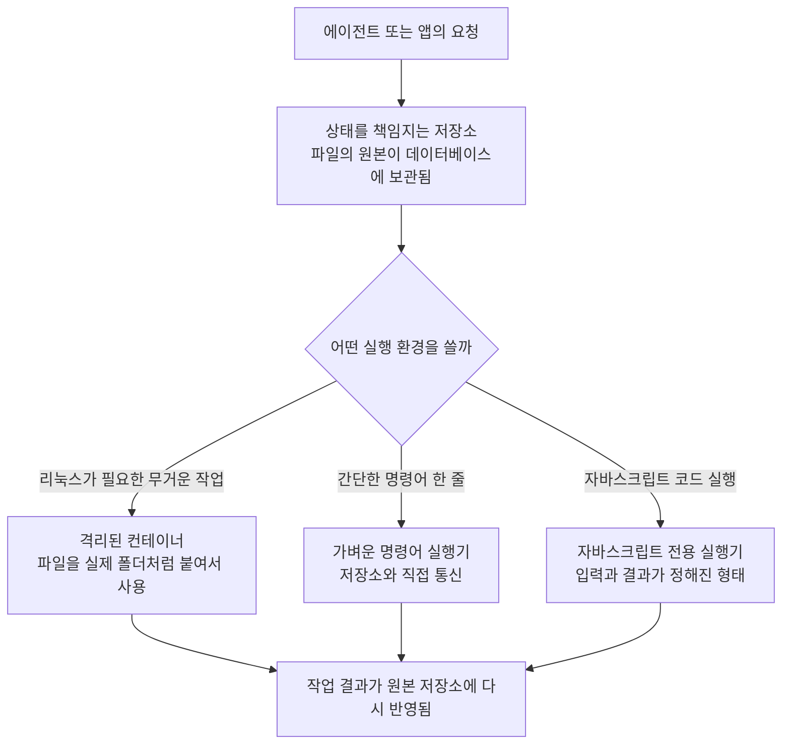

<aside class="ai-knowledge-sidebar">
  
CATEGORIES

  <nav class="ai-cat-tree">

에이전트 오케스트레이션7
<ul><li><a href="https://altjs4510.github.io/ai_news_blog/knowledge/20260709/">2026-07-09mvanhorn/last30days-skill — Reddit·X·YouTube·HN·…</a></li><li><a href="https://altjs4510.github.io/ai_news_blog/knowledge/20260707/">2026-07-07AI Hero Skills Catalog — 실무 엔지니어를 위한 재사용 가능한 판단 …</a></li><li><a href="https://altjs4510.github.io/ai_news_blog/knowledge/20260623/">2026-06-23bytedance/deer-flow — 샌드박스·메모리·서브에이전트·메시지 게이트웨이를…</a></li><li><a href="https://altjs4510.github.io/ai_news_blog/knowledge/20260611/">2026-06-11The evolution of agentic surfaces: building with…</a></li><li><a href="https://altjs4510.github.io/ai_news_blog/knowledge/20260602/">2026-06-02revfactory/harness — 도메인별 에이전트 팀과 스킬을 자동 설계하는 메타…</a></li><li><a href="https://altjs4510.github.io/ai_news_blog/knowledge/20260529/">2026-05-29Introducing dynamic workflows in Claude Code</a></li><li><a href="https://altjs4510.github.io/ai_news_blog/knowledge/20260507/">2026-05-07ruvnet/ruflo — Claude 멀티 에이전트 오케스트레이션 플랫폼</a></li></ul>

MCP &amp; 도구 통합20
<ul><li><a href="https://altjs4510.github.io/ai_news_blog/knowledge/20260802/">2026-08-02Stateless MCP has recaptured my interest (and in…</a></li><li><a href="https://altjs4510.github.io/ai_news_blog/knowledge/20260801/">2026-08-01different-ai/openwork — Claude Cowork의 오픈소스 대체 에…</a></li><li><a href="https://altjs4510.github.io/ai_news_blog/knowledge/20260731/">2026-07-31different-ai/openwork — Claude Cowork의 오픈소스 대안(o…</a></li><li><a href="https://altjs4510.github.io/ai_news_blog/knowledge/20260729/">2026-07-29Bringing MCP 2026-07-28 to Claude</a></li><li><a href="https://altjs4510.github.io/ai_news_blog/knowledge/20260724/">2026-07-24diegosouzapw/OmniRoute — 단일 엔드포인트로 278+ 프로바이더·50…</a></li><li><a href="https://altjs4510.github.io/ai_news_blog/knowledge/20260723/">2026-07-23diegosouzapw/OmniRoute — 268+ 프로바이더를 단일 엔드포인트로 묶…</a></li><li><a href="https://altjs4510.github.io/ai_news_blog/knowledge/20260721/">2026-07-21tirth8205/code-review-graph — 로컬 우선 코드 인텔리전스 그래프…</a></li><li><a href="https://altjs4510.github.io/ai_news_blog/knowledge/20260719/">2026-07-19tirth8205/code-review-graph — 로컬 우선 코드 인텔리전스 그래프…</a></li><li><a href="https://altjs4510.github.io/ai_news_blog/knowledge/20260718/">2026-07-18tirth8205/code-review-graph — MCP·CLI용 로컬 코드 인텔리…</a></li><li><a href="https://altjs4510.github.io/ai_news_blog/knowledge/20260708/">2026-07-08Expanding Managed Agents in Gemini API: backgrou…</a></li><li><a href="https://altjs4510.github.io/ai_news_blog/knowledge/20260701/">2026-07-01Google OKF (Open Knowledge Format) — 벤더 중립 에이전트 …</a></li><li><a href="https://altjs4510.github.io/ai_news_blog/knowledge/20260618/">2026-06-18DeusData/codebase-memory-mcp — 158개 언어 코드베이스를 밀리…</a></li><li><a href="https://altjs4510.github.io/ai_news_blog/knowledge/20260606/">2026-06-06chopratejas/headroom — Compress tool outputs, lo…</a></li><li><a href="https://altjs4510.github.io/ai_news_blog/knowledge/20260605/">2026-06-05chopratejas/headroom — Compress tool outputs, lo…</a></li><li><a href="https://altjs4510.github.io/ai_news_blog/knowledge/20260604/">2026-06-04chopratejas/headroom — Compress tool outputs bef…</a></li><li><a href="https://altjs4510.github.io/ai_news_blog/knowledge/20260603/">2026-06-03How Bad MCP design cost your Agent 5× more token…</a></li><li><a href="https://altjs4510.github.io/ai_news_blog/knowledge/20260523/">2026-05-23colbymchenry/codegraph — 사전 인덱싱된 코드 지식 그래프 MCP</a></li><li><a href="https://altjs4510.github.io/ai_news_blog/knowledge/20260517/">2026-05-17I gave my LLM 100,000+ tools — Lazy Discovery &a…</a></li><li><a href="https://altjs4510.github.io/ai_news_blog/knowledge/20260509/">2026-05-09How to connect 100 MCP servers without the conte…</a></li><li><a href="https://altjs4510.github.io/ai_news_blog/knowledge/20260506/">2026-05-06mksglu/context-mode — AI 코딩 에이전트용 컨텍스트 윈도우 최적화</a></li></ul>

코딩 에이전트17
<ul><li><a href="https://altjs4510.github.io/ai_news_blog/knowledge/20260804/">2026-08-04esengine/DeepSeek-Reasonix — prefix-cache 안정성을 축…</a></li><li><a href="https://altjs4510.github.io/ai_news_blog/knowledge/20260728/">2026-07-28alibaba/open-code-review — 결정론적 파이프라인 + LLM 에이전트…</a></li><li><a href="https://altjs4510.github.io/ai_news_blog/knowledge/20260725/">2026-07-25The new rules of context engineering for Claude …</a></li><li><a href="https://altjs4510.github.io/ai_news_blog/knowledge/20260722/">2026-07-22tirth8205/code-review-graph — MCP·CLI용 로컬 우선 코드 …</a></li><li><a href="https://altjs4510.github.io/ai_news_blog/knowledge/20260714/">2026-07-14Graphify-Labs/graphify — 코드베이스를 질의 가능한 지식 그래프로 만…</a></li><li><a href="https://altjs4510.github.io/ai_news_blog/knowledge/20260705/">2026-07-05openai/codex-plugin-cc — Claude Code에서 Codex를 위임…</a></li><li><a href="https://altjs4510.github.io/ai_news_blog/knowledge/20260626/">2026-06-26google-labs-code/design.md — 코딩 에이전트에게 디자인 시스템을 …</a></li><li><a href="https://altjs4510.github.io/ai_news_blog/knowledge/20260619/">2026-06-19Claude Code now supports artifacts</a></li><li><a href="https://altjs4510.github.io/ai_news_blog/knowledge/20260530/">2026-05-30Leonxlnx/taste-skill — AI에게 좋은 취향을 부여해 generic s…</a></li><li><a href="https://altjs4510.github.io/ai_news_blog/knowledge/20260528/">2026-05-28Building self-improving tax agents with Codex</a></li><li><a href="https://altjs4510.github.io/ai_news_blog/knowledge/20260526/">2026-05-26colbymchenry/codegraph — Pre-indexed code knowle…</a></li><li><a href="https://altjs4510.github.io/ai_news_blog/knowledge/20260524/">2026-05-24colbymchenry/codegraph — Pre-indexed code knowle…</a></li><li><a href="https://altjs4510.github.io/ai_news_blog/knowledge/20260521/">2026-05-21colbymchenry/codegraph — Pre-indexed code knowle…</a></li><li><a href="https://altjs4510.github.io/ai_news_blog/knowledge/20260512/">2026-05-12agentmemory — Persistent memory for AI coding ag…</a></li><li><a href="https://altjs4510.github.io/ai_news_blog/knowledge/20260510/">2026-05-10addyosmani/agent-skills — Production-grade engin…</a></li><li><a href="https://altjs4510.github.io/ai_news_blog/knowledge/20260508/">2026-05-08addyosmani/agent-skills — Production-grade engin…</a></li><li><a href="https://altjs4510.github.io/ai_news_blog/knowledge/20260505/">2026-05-05mattpocock/skills — Skills for Real Engineers (.…</a></li></ul>

모델 &amp; 연구6
<ul><li><a href="https://altjs4510.github.io/ai_news_blog/knowledge/20260716-proprag/">2026-07-16PropRAG — 프로포지션 경로 위 beam search로 멀티홉 검색 안내</a></li><li><a href="https://altjs4510.github.io/ai_news_blog/knowledge/20260620/">2026-06-20zai-org/GLM-5 — From Vibe Coding to Agentic Engi…</a></li><li><a href="https://altjs4510.github.io/ai_news_blog/knowledge/20260617/">2026-06-17Predicting model behavior before release by simu…</a></li><li><a href="https://altjs4510.github.io/ai_news_blog/knowledge/20260610/">2026-06-10Fable 5 just made cost-aware model routing manda…</a></li><li><a href="https://altjs4510.github.io/ai_news_blog/knowledge/20260516/">2026-05-16STALE — 에이전트가 자기 기억의 유효성을 인지할 수 있는가</a></li><li><a href="https://altjs4510.github.io/ai_news_blog/knowledge/20260513/">2026-05-13Thinking Machines' Native Interaction Models — T…</a></li></ul>

인프라 &amp; 컴퓨트4
<ul><li><a href="https://altjs4510.github.io/ai_news_blog/knowledge/20260806/" class="current">2026-08-06cloudflare/computer — 에이전트에게 컴퓨터를 통째로 주는 엣지 실행 샌…</a></li><li><a href="https://altjs4510.github.io/ai_news_blog/knowledge/20260630/">2026-06-30Introducing the Claude apps gateway for Amazon B…</a></li><li><a href="https://altjs4510.github.io/ai_news_blog/knowledge/20260522/">2026-05-22Giving Agents Computers — Ivan Burazin, Daytona</a></li><li><a href="https://altjs4510.github.io/ai_news_blog/knowledge/20260520/">2026-05-20New in Claude Managed Agents: self-hosted sandbo…</a></li></ul>

보안 &amp; 거버넌스14
<ul><li><a href="https://altjs4510.github.io/ai_news_blog/knowledge/20260730/">2026-07-30Anatomy of a Frontier Lab Agent Intrusion: A Tec…</a></li><li><a href="https://altjs4510.github.io/ai_news_blog/knowledge/20260716/">2026-07-16Dicklesworthstone/destructive_command_guard — 에이…</a></li><li><a href="https://altjs4510.github.io/ai_news_blog/knowledge/20260715/">2026-07-15Dicklesworthstone/destructive_command_guard — 에이…</a></li><li><a href="https://altjs4510.github.io/ai_news_blog/knowledge/20260710/">2026-07-1070개 MCP 서버 strace 런타임 감사 — 부팅 시 아웃바운드 호출 서버 적발</a></li><li><a href="https://altjs4510.github.io/ai_news_blog/knowledge/20260704/">2026-07-04Cloudflare is about to block AI agents by defaul…</a></li><li><a href="https://altjs4510.github.io/ai_news_blog/knowledge/20260703/">2026-07-03Giving admins more visibility and control over C…</a></li><li><a href="https://altjs4510.github.io/ai_news_blog/knowledge/20260625/">2026-06-25Agent identity in Claude Tag: a new access model…</a></li><li><a href="https://altjs4510.github.io/ai_news_blog/knowledge/20260624/">2026-06-24Agent identity in Claude Tag: a new access model…</a></li><li><a href="https://altjs4510.github.io/ai_news_blog/knowledge/20260614/">2026-06-14NVIDIA/SkillSpector — Security scanner for AI ag…</a></li><li><a href="https://altjs4510.github.io/ai_news_blog/knowledge/20260613/">2026-06-13Fable 5's guardrails got bypassed in 48 hours — …</a></li><li><a href="https://altjs4510.github.io/ai_news_blog/knowledge/20260612/">2026-06-12NVIDIA/SkillSpector — AI 에이전트 스킬용 보안 스캐너</a></li><li><a href="https://altjs4510.github.io/ai_news_blog/knowledge/20260607/">2026-06-07OpenAI Help: Lockdown Mode</a></li><li><a href="https://altjs4510.github.io/ai_news_blog/knowledge/20260531/">2026-05-31How we contain Claude across products</a></li><li><a href="https://altjs4510.github.io/ai_news_blog/knowledge/20260527/">2026-05-27Microsoft Copilot Cowork Exfiltrates Files</a></li></ul>

응용 사례7
<ul><li><a href="https://altjs4510.github.io/ai_news_blog/knowledge/20260805/">2026-08-05TencentCloud/TencentDB-Agent-Memory — 대화·문서·코드를 …</a></li><li><a href="https://altjs4510.github.io/ai_news_blog/knowledge/20260726/">2026-07-26citrolabs/ego-lite — 로그인된 브라우저 상태를 AI 에이전트와 공유하는…</a></li><li><a href="https://altjs4510.github.io/ai_news_blog/knowledge/20260717/">2026-07-17After a year building agent memory, 'save everyt…</a></li><li><a href="https://altjs4510.github.io/ai_news_blog/knowledge/20260712/">2026-07-12Do Automated Evals Work?</a></li><li><a href="https://altjs4510.github.io/ai_news_blog/knowledge/20260621/">2026-06-21calesthio/OpenMontage — 12 파이프라인·52 도구·500+ 스킬을 …</a></li><li><a href="https://altjs4510.github.io/ai_news_blog/knowledge/20260609/">2026-06-09Building intelligent apps for Apple platforms wi…</a></li><li><a href="https://altjs4510.github.io/ai_news_blog/knowledge/20260514/">2026-05-14Introducing Claude for Small Business</a></li></ul>

산업 동향6
<ul><li><a href="https://altjs4510.github.io/ai_news_blog/knowledge/20260711/">2026-07-11OpenAI says GPT 5.6 is the 'preferred model' for…</a></li><li><a href="https://altjs4510.github.io/ai_news_blog/knowledge/20260702/">2026-07-02How Cursor deploys AI inside the enterprise (For…</a></li><li><a href="https://altjs4510.github.io/ai_news_blog/knowledge/20260616/">2026-06-16Why AI hasn't replaced software engineers, and w…</a></li><li><a href="https://altjs4510.github.io/ai_news_blog/knowledge/20260519/">2026-05-19Anthropic acquires Stainless</a></li><li><a href="https://altjs4510.github.io/ai_news_blog/knowledge/20260515/">2026-05-15Clawdmeter — Claude Code 사용량을 데스크톱 대시보드로</a></li><li><a href="https://altjs4510.github.io/ai_news_blog/knowledge/20260504/">2026-05-04Agents for Everything Else: Codex for Knowledge …</a></li></ul>
</nav>
</aside>

<article class="ai-knowledge-article">

<header class="ai-post-hero">
  
<a class="ai-back" href="../">KNOWLEDGE</a> · 2026-08-06 · 오늘의 학습

  <h2 class="ai-post-title">cloudflare/computer — 에이전트에게 컴퓨터를 통째로 주는 엣지 실행 샌드박스</h2>
</header>

> 원문: [cloudflare/computer — 에이전트에게 컴퓨터를 통째로 주는 엣지 실행 샌드박스](https://github.com/cloudflare/computer)

## 📌 학습 정리

### 1. 한 줄로 말하면

AI 비서에게 도구를 하나씩 건네주는 대신, 아예 "컴퓨터 한 대"를 통째로 빌려주는 실험적인 장치입니다. 파일을 저장할 공간과 명령을 실행할 자리가 한 세트로 묶여 있어서, 비서가 그 안에서 마음껏 작업하고 결과만 가져올 수 있어요.

### 2. 왜 이게 만들어졌어요?

지금까지 AI 에이전트(agent, 사람 대신 여러 단계를 스스로 처리하는 프로그램)에게 일을 시키려면, 할 수 있는 동작을 하나하나 정해서 열어주는 방식이 흔했습니다. "파일 읽기는 되고, 이 명령은 되고, 저건 안 되고" 하는 식이죠. 그런데 실제 작업은 파일을 쓰고, 그 파일을 다른 프로그램으로 변환하고, 결과를 다시 읽는 식으로 이어지기 때문에 도구를 아무리 늘려도 늘 뭔가가 모자랍니다. Cloudflare Computer는 방향을 뒤집어서, 파일이 담긴 저장 공간과 명령을 실행할 환경을 한 덩어리로 묶어 통째로 넘겨줍니다. 다만 원문에서도 분명히 밝히듯 아직 미리보기(preview) 단계라 실험·프로토타입용이고, 실제 서비스에 쓰기엔 이르다고 못 박고 있어요.

### 3. 비유로 풀면

이건 마치 "사무실 책상 하나를 통째로 내주는 것" 같은 거예요. 서류 캐비닛(파일)과 그 위에서 일할 작업대(실행 환경)가 한 자리에 붙어 있고, 캐비닛의 원본은 회사 금고에 안전하게 보관돼 있어서 책상을 치워도 서류는 남습니다.

또 하나 비유하자면, 작업대를 세 가지 종류 중에 골라 쓸 수 있는 구조예요. 진짜 리눅스가 도는 튼튼한 작업대, 가벼운 명령어 전용 간이 작업대, 그리고 자바스크립트 코드만 돌리는 전용 작업대 이렇게요.

그래서 결국, 에이전트 입장에서는 "무엇을 해도 되는지"를 매번 허락받는 게 아니라 정해진 책상 안에서 알아서 일하고, 그 책상 밖으로는 못 나가는 형태가 됩니다.

### 4. 어떻게 작동하는지 (그림으로)

핵심은 파일의 진짜 원본이 딱 한 곳에만 있다는 점입니다. 실행 환경은 그 원본을 잠깐 빌려 쓰는 창구일 뿐이고, 어떤 창구를 쓸지는 요청할 때 이름으로 골라 지정합니다. 실행 환경을 아예 붙이지 않고 파일 저장 기능만 쓰는 것도 가능하다고 원문은 설명하고 있어요.

### 5. 처음 보는 용어 풀이

- **가상 파일 시스템 (virtual filesystem)** — 실제 하드디스크가 아니라 소프트웨어가 만들어낸 "가짜 폴더 구조"입니다. 쓰는 쪽에서는 평범한 폴더와 파일처럼 보이지만, 실제 데이터는 다른 곳에 저장돼 있어요.

- **상태를 기억하는 서버 객체 (Durable Object)** — 요청이 끝나도 데이터가 사라지지 않고 계속 남아 있는 서버 단위입니다. 여기서는 파일의 원본 상태를 책임지고 보관하는 역할을 맡습니다.

- **가벼운 데이터베이스 (SQLite)** — 별도 서버 없이 파일 하나로 동작하는 작은 데이터베이스입니다. 이 프로젝트에서는 파일 내용과 구조를 여기에 담아둡니다.

- **격리된 실행 상자 (sandbox container)** — 바깥 시스템에 영향을 주지 않도록 담을 쳐놓고 프로그램을 돌리는 공간입니다. 안에서 무슨 일이 벌어져도 밖은 안전하다는 게 핵심이에요.

- **파일을 폴더처럼 붙이는 방식 (FUSE mount)** — 실제 디스크가 아닌 데이터를, 운영체제가 보기엔 평범한 폴더처럼 보이게 연결해주는 기술입니다. 덕분에 기존 프로그램들이 아무 수정 없이 그 데이터를 파일로 다룰 수 있습니다.

- **원격 호출 통로 (RPC)** — 멀리 떨어진 프로그램의 기능을 마치 내 코드 안 함수처럼 불러 쓰는 방식입니다. 여기서는 실행 환경과 원본 저장소가 서로 변경 사항을 주고받는 데 쓰입니다.

- **실행 배경 갈아끼우기 (pluggable backend)** — 실행을 담당하는 부분을 상황에 맞게 교체할 수 있게 만든 구조입니다. 호출하는 코드는 그대로 두고 "어느 환경에서 돌릴지"만 이름으로 바꿔 지정합니다.

- **필요할 때 연결하기 (lazy connection)** — 처음부터 모든 실행 환경을 켜두는 게 아니라, 실제로 쓰이는 순간에 연결을 맺는 방식입니다. 안 쓰는 자원을 미리 잡아두지 않아 낭비가 줄어듭니다.

### 6. 한 발 더 들어가고 싶다면

- [cloudflare/computer 저장소](https://github.com/cloudflare/computer) — 전체 구조와 각 패키지의 현재 상태, 그리고 미리보기 단계라는 주의사항까지 원문 그대로 확인할 수 있어요.
- 저장소 안의 `examples/` 디렉터리 — 실제로 돌아가는 예제들이 모여 있습니다. 특히 `examples/tutorial`은 문서를 만들고 그걸 PDF로 변환하는 과정을 단계별로 따라가게 되어 있어서 감을 잡기 좋아요.
- 저장소 안의 `examples/think-compare-runtimes` — 같은 작업을 컨테이너와 가벼운 실행기에서 나란히 돌려 비교하는 화면이라, 실행 환경을 나눠둔 이유가 눈으로 보입니다.
- 저장소 안의 `docs/19_performance.md` — 파일 처리 속도를 실제로 측정한 수치가 담겨 있습니다. 자잘한 파일 작업엔 강하고 큰 파일을 통째로 읽고 쓰는 데는 약하다는 특성을 확인할 수 있어요.
- 저장소 안의 `docs/` 전체 — 설계 의도를 적어둔 문서입니다. 다만 원문이 강조하듯 "지금 코드가 이렇다"가 아니라 "이렇게 가려고 한다"는 방향 문서로 읽어야 합니다.

---

## 📖 원문 전체 번역 (정독용)

> 의역 최소화한 전체 번역입니다. 큰 흐름은 위 정리에서 잡고, 정확한 워딩이 필요할 땐 이 섹션에서 정독하세요.

## Cloudflare Computer

Cloudflare Computer는 Durable Object 내부에 존재하는 가상 파일시스템이다. Durable Object는 SQLite에 정본(authoritative) 상태를 보관하며, `workspace.runtime`을 통해 플러그인 가능한 실행 표면(execution surface) 하나를 노출한다. 오늘날 세 가지 백엔드가 제공된다:

**Container**는 SQLite 상태를 실제 FUSE 마운트로서 샌드박스 컨테이너에 투영(project)한다. 샌드박스 측의 데몬(`computerd`)이 그 상태를 파일시스템으로 마운트하고, capnweb RPC 채널을 통해 변경 사항을 다시 동기화한다. 완전한 리눅스 유저랜드, 실제 바이너리, 실제 네트워크를 갖춘다.

**Isolate shell**은 Dynamic Worker 안에서 `just-bash`를 실행한다. 이것은 Workers RPC를 통해 정본 Workspace에 직접 도달하므로, 별도의 저장소나 동기화 왕복이 필요 없다.

**Isolate JavaScript**는 구조화된 입력/결과, durable한 상대 경로 import, 설정된 라이브러리, Workspace 기반의 `node:fs/promises`, 그리고 신뢰된 `ws:git`과 `ws:artifacts` 모듈을 갖춘 새 Dynamic Worker에서 ECMAScript 모듈을 실행한다.

하나의 Workspace는 안정적인 ID 아래 여러 백엔드를 등록할 수 있다. `workspace.runtime.exec(source, { backend })`가 단일 실행 진입점이며, 선택된 백엔드가 `source`를 셸 명령으로 취급할지 ECMAScript 모듈로 취급할지를 정의한다. 백엔드는 처음 사용될 때 지연 연결(lazily connect)된다. Workspace는 백엔드 없이도 구성할 수 있으며, 그 경우 호출자에게 파일시스템만 단독으로 제공한다.

> **중요**
> **PREVIEW ONLY**
> 이 패키지는 피드백만을 목적으로 한 프리뷰로 제공된다. API는 불안정하며 설계는 변경될 수 있다. 실험, 탐색, 프로토타입에 적합하다. 현재로서는 프로덕션 사용에 적합하지 **않다**.
>
> `docs/` 아래의 스펙은 미래지향적(forward-looking)이다 — 이는 현재 코드에 대한 서술이 아니라 의도(intent)로 읽어야 한다.

### 사용하기

Cloudflare Computer 위에 무언가를 만들고 싶다면, `@cloudflare/computer`를 설치하고 그 패키지의 README를 따르라 — 설치 단계, 진입점 맵, 그리고 `fs`와 `runtime` 표면의 실제 예제가 담겨 있다.

피드백을 기여하려면 `CONTRIBUTING.md`를 참고하라. 승인된 협업자(approved collaborators)는 설정·빌드·테스트 안내를 위해 `COLLABORATORS.md`를 따라야 한다.

### 예제

`examples/` 디렉토리에는 공개 표면(public surface)을 실행 가능한 형태로 소비하는 예제들이 담겨 있다. 각 예제는 자체 README를 가진 하나의 Worker workspace다.

- `examples/container` — 컨테이너 안에서 `computerd`를 실행하고, workspace를 마운트하며, capnweb을 통해 Durable Object와 통신한다. `write`/`read`/`exec` HTTP 표면을 제공한다.
- `examples/worker-shell` — container 예제와 동일한 HTTP 표면을 갖지만, 셸이 `env.LOADER`를 통해 로드된 Dynamic Worker 안에서 `just-bash`로 실행된다. 컨테이너는 없다.
- `examples/worker-javascript` — `worker-shell`을 그대로 따르지만, `exec`가 셸 명령을 실행하는 대신 Dynamic Worker 안에서 ECMAScript 모듈을 평가(evaluate)한다.
- `examples/think` — workspace를 작업 디렉토리로 사용하는 `@cloudflare/think` 채팅 에이전트로, 터미널에서 접근 가능하다.
- `examples/think-compare-runtimes` — container 런타임과 worker 런타임에 대해 동일한 에이전트 작업을 나란히(side by side) 실행하는 웹 UI다.
- `examples/tutorial` — 단계별 빌드 예제: 엔드포인트 하나, 호스트에 마크다운 레시피 카드를 작성하는 에이전트 하나, 그리고 컨테이너 안에서 그 위에 `pandoc`을 실행해 PDF를 생성한다.
- `examples/artifacts` — workspace 안에 Worker 프로젝트를 생성하고 이를 클론 가능한(clone-ready) 저장소 형태로 Cloudflare Artifacts에 게시(publish)한다.
- `examples/assets` — Workers AI로 프롬프트를 이미지로 변환하여 workspace에 기록하고, `@cloudflare/computer/assets`를 통해 공유 가능한 링크를 반환한다.

### 저장소 구조

이 저장소는 작은 모노레포다. 각 패키지는 패키지별 상태와 사용 안내가 담긴 자체 README를 갖는다.

- `packages/dofs` (`@cloudflare/dofs`) — Durable Object SQLite 기반 가상 파일시스템, 동기화 프로토콜 구성 요소, 그리고 Node용 `@platformatic/vfs` 프로바이더.
- `packages/rpc` (`@cloudflare/computer-rpc`) — Durable Object와 `computerd` 사이에서 공유되는 capnweb 와이어 타입 및 서버/클라이언트 헬퍼.
- `packages/computerd` (`@cloudflare/computerd`) — `computerd` 데몬: 샌드박스 컨테이너 안에서 실행되는 FUSE 마운트와 HTTP/WebSocket RPC 서버.
- `packages/computer` (`@cloudflare/computer`) — Durable Object가 소비하는 최상위 Computer 패키지. 작업 진행 중(Work in progress).
- `packages/computer-computerd-linux-x64` — 사전 빌드된 `computerd` linux-x64 바이너리를 위한 비공개 Docker 이미지 컨텍스트. npm 패키지가 아니라 이 이미지 자체가 릴리스 산출물이다.

### 성능

`computerd`의 FUSE 마운트는 메타데이터 위주 작업(metadata-heavy work)에서는 실제 디스크를 능가하지만, 대용량 순차 I/O(large sequential I/O)에서는 뒤처진다. 전체 `fs-bench` 수치, `cloudflare/sandbox-sdk` `npm install` 비교, 그리고 재현 방법에 대해서는 `docs/19_performance.md`를 참고하라.

### 문서

- `docs/` — 설계 명세. 미래지향적이므로 의도로 취급할 것.
- `docs/19_performance.md` — 파일시스템 벤치마크.

### 기여하기

우리는 이슈와 디스커션(discussions)을 통해 버그 리포트, 수정 제안, 기능 요청, 설계 제안을 받는다. 요청하지 않은(unsolicited) 풀 리퀘스트는 받지 않는다. 공개 기여 경로에 대해서는 `CONTRIBUTING.md`를 참고하라.

승인된 협업자는 설정, 포맷팅, 테스트, 커밋 메시지, 풀 리퀘스트 관례에 대해 `COLLABORATORS.md`를 따라야 한다.

이 저장소에서 에이전트로 작업하고 있다면, `AGENTS.md`와 `.agents/skills/` 아래의 스킬들부터 시작하라.

### 라이선스

MIT. `LICENSE`를 참고하라.

</article>

