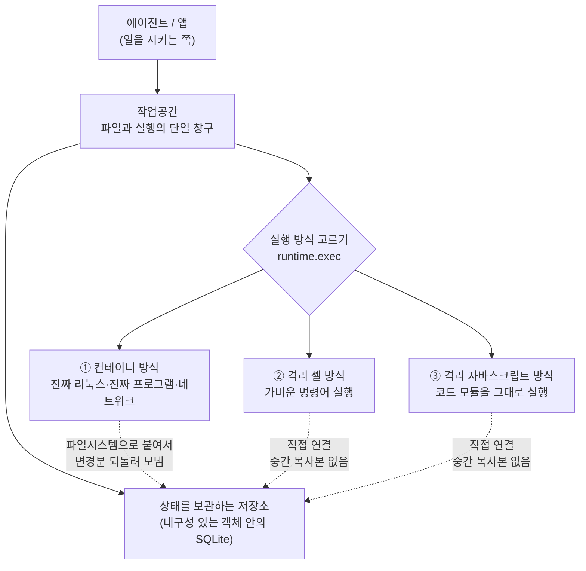

<aside class="ai-knowledge-sidebar">
  
CATEGORIES

  <nav class="ai-cat-tree">

에이전트 오케스트레이션8
<ul><li><a href="https://altjs4510.github.io/ai_news_blog/knowledge/20260708/">2026-07-08Expanding Managed Agents in Gemini API: backgrou…</a></li><li><a href="https://altjs4510.github.io/ai_news_blog/knowledge/20260707/">2026-07-07AI Hero Skills Catalog — 실무 엔지니어를 위한 재사용 가능한 판단 …</a></li><li><a href="https://altjs4510.github.io/ai_news_blog/knowledge/20260701/">2026-07-01Google OKF (Open Knowledge Format) — 벤더 중립 에이전트 …</a></li><li><a href="https://altjs4510.github.io/ai_news_blog/knowledge/20260623/">2026-06-23bytedance/deer-flow — 샌드박스·메모리·서브에이전트·메시지 게이트웨이를…</a></li><li><a href="https://altjs4510.github.io/ai_news_blog/knowledge/20260611/">2026-06-11The evolution of agentic surfaces: building with…</a></li><li><a href="https://altjs4510.github.io/ai_news_blog/knowledge/20260602/">2026-06-02revfactory/harness — 도메인별 에이전트 팀과 스킬을 자동 설계하는 메타…</a></li><li><a href="https://altjs4510.github.io/ai_news_blog/knowledge/20260529/">2026-05-29Introducing dynamic workflows in Claude Code</a></li><li><a href="https://altjs4510.github.io/ai_news_blog/knowledge/20260507/">2026-05-07ruvnet/ruflo — Claude 멀티 에이전트 오케스트레이션 플랫폼</a></li></ul>

MCP &amp; 도구 통합18
<ul><li><a href="https://altjs4510.github.io/ai_news_blog/knowledge/20260802/">2026-08-02Stateless MCP has recaptured my interest (and in…</a></li><li><a href="https://altjs4510.github.io/ai_news_blog/knowledge/20260801/">2026-08-01different-ai/openwork — Claude Cowork의 오픈소스 대체 에…</a></li><li><a href="https://altjs4510.github.io/ai_news_blog/knowledge/20260731/">2026-07-31different-ai/openwork — Claude Cowork의 오픈소스 대안(o…</a></li><li><a href="https://altjs4510.github.io/ai_news_blog/knowledge/20260729/">2026-07-29Bringing MCP 2026-07-28 to Claude</a></li><li><a href="https://altjs4510.github.io/ai_news_blog/knowledge/20260724/">2026-07-24diegosouzapw/OmniRoute — 단일 엔드포인트로 278+ 프로바이더·50…</a></li><li><a href="https://altjs4510.github.io/ai_news_blog/knowledge/20260722/">2026-07-22tirth8205/code-review-graph — MCP·CLI용 로컬 우선 코드 …</a></li><li><a href="https://altjs4510.github.io/ai_news_blog/knowledge/20260721/">2026-07-21tirth8205/code-review-graph — 로컬 우선 코드 인텔리전스 그래프…</a></li><li><a href="https://altjs4510.github.io/ai_news_blog/knowledge/20260719/">2026-07-19tirth8205/code-review-graph — 로컬 우선 코드 인텔리전스 그래프…</a></li><li><a href="https://altjs4510.github.io/ai_news_blog/knowledge/20260718/">2026-07-18tirth8205/code-review-graph — MCP·CLI용 로컬 코드 인텔리…</a></li><li><a href="https://altjs4510.github.io/ai_news_blog/knowledge/20260618/">2026-06-18DeusData/codebase-memory-mcp — 158개 언어 코드베이스를 밀리…</a></li><li><a href="https://altjs4510.github.io/ai_news_blog/knowledge/20260606/">2026-06-06chopratejas/headroom — Compress tool outputs, lo…</a></li><li><a href="https://altjs4510.github.io/ai_news_blog/knowledge/20260605/">2026-06-05chopratejas/headroom — Compress tool outputs, lo…</a></li><li><a href="https://altjs4510.github.io/ai_news_blog/knowledge/20260604/">2026-06-04chopratejas/headroom — Compress tool outputs bef…</a></li><li><a href="https://altjs4510.github.io/ai_news_blog/knowledge/20260603/">2026-06-03How Bad MCP design cost your Agent 5× more token…</a></li><li><a href="https://altjs4510.github.io/ai_news_blog/knowledge/20260523/">2026-05-23colbymchenry/codegraph — 사전 인덱싱된 코드 지식 그래프 MCP</a></li><li><a href="https://altjs4510.github.io/ai_news_blog/knowledge/20260519/">2026-05-19Anthropic acquires Stainless</a></li><li><a href="https://altjs4510.github.io/ai_news_blog/knowledge/20260517/">2026-05-17I gave my LLM 100,000+ tools — Lazy Discovery &a…</a></li><li><a href="https://altjs4510.github.io/ai_news_blog/knowledge/20260509/">2026-05-09How to connect 100 MCP servers without the conte…</a></li></ul>

코딩 에이전트18
<ul><li><a href="https://altjs4510.github.io/ai_news_blog/knowledge/20260808/">2026-08-08PrimeIntellect-ai/prime-agent — 코딩 워크플로우와 장시간 자율…</a></li><li><a href="https://altjs4510.github.io/ai_news_blog/knowledge/20260804/">2026-08-04esengine/DeepSeek-Reasonix — prefix-cache 안정성을 축…</a></li><li><a href="https://altjs4510.github.io/ai_news_blog/knowledge/20260728/">2026-07-28alibaba/open-code-review — 결정론적 파이프라인 + LLM 에이전트…</a></li><li><a href="https://altjs4510.github.io/ai_news_blog/knowledge/20260725/">2026-07-25The new rules of context engineering for Claude …</a></li><li><a href="https://altjs4510.github.io/ai_news_blog/knowledge/20260714/">2026-07-14Graphify-Labs/graphify — 코드베이스를 질의 가능한 지식 그래프로 만…</a></li><li><a href="https://altjs4510.github.io/ai_news_blog/knowledge/20260705/">2026-07-05openai/codex-plugin-cc — Claude Code에서 Codex를 위임…</a></li><li><a href="https://altjs4510.github.io/ai_news_blog/knowledge/20260626/">2026-06-26google-labs-code/design.md — 코딩 에이전트에게 디자인 시스템을 …</a></li><li><a href="https://altjs4510.github.io/ai_news_blog/knowledge/20260619/">2026-06-19Claude Code now supports artifacts</a></li><li><a href="https://altjs4510.github.io/ai_news_blog/knowledge/20260530/">2026-05-30Leonxlnx/taste-skill — AI에게 좋은 취향을 부여해 generic s…</a></li><li><a href="https://altjs4510.github.io/ai_news_blog/knowledge/20260528/">2026-05-28Building self-improving tax agents with Codex</a></li><li><a href="https://altjs4510.github.io/ai_news_blog/knowledge/20260526/">2026-05-26colbymchenry/codegraph — Pre-indexed code knowle…</a></li><li><a href="https://altjs4510.github.io/ai_news_blog/knowledge/20260524/">2026-05-24colbymchenry/codegraph — Pre-indexed code knowle…</a></li><li><a href="https://altjs4510.github.io/ai_news_blog/knowledge/20260521/">2026-05-21colbymchenry/codegraph — Pre-indexed code knowle…</a></li><li><a href="https://altjs4510.github.io/ai_news_blog/knowledge/20260512/">2026-05-12agentmemory — Persistent memory for AI coding ag…</a></li><li><a href="https://altjs4510.github.io/ai_news_blog/knowledge/20260510/">2026-05-10addyosmani/agent-skills — Production-grade engin…</a></li><li><a href="https://altjs4510.github.io/ai_news_blog/knowledge/20260508/">2026-05-08addyosmani/agent-skills — Production-grade engin…</a></li><li><a href="https://altjs4510.github.io/ai_news_blog/knowledge/20260506/">2026-05-06mksglu/context-mode — AI 코딩 에이전트용 컨텍스트 윈도우 최적화</a></li><li><a href="https://altjs4510.github.io/ai_news_blog/knowledge/20260505/">2026-05-05mattpocock/skills — Skills for Real Engineers (.…</a></li></ul>

모델 &amp; 연구5
<ul><li><a href="https://altjs4510.github.io/ai_news_blog/knowledge/20260716-proprag/">2026-07-16PropRAG — 프로포지션 경로 위 beam search로 멀티홉 검색 안내</a></li><li><a href="https://altjs4510.github.io/ai_news_blog/knowledge/20260620/">2026-06-20zai-org/GLM-5 — From Vibe Coding to Agentic Engi…</a></li><li><a href="https://altjs4510.github.io/ai_news_blog/knowledge/20260617/">2026-06-17Predicting model behavior before release by simu…</a></li><li><a href="https://altjs4510.github.io/ai_news_blog/knowledge/20260516/">2026-05-16STALE — 에이전트가 자기 기억의 유효성을 인지할 수 있는가</a></li><li><a href="https://altjs4510.github.io/ai_news_blog/knowledge/20260513/">2026-05-13Thinking Machines' Native Interaction Models — T…</a></li></ul>

인프라 &amp; 컴퓨트5
<ul><li><a href="https://altjs4510.github.io/ai_news_blog/knowledge/20260806/" class="current">2026-08-06cloudflare/computer — 에이전트에게 컴퓨터를 통째로 주는 엣지 실행 샌…</a></li><li><a href="https://altjs4510.github.io/ai_news_blog/knowledge/20260723/">2026-07-23diegosouzapw/OmniRoute — 268+ 프로바이더를 단일 엔드포인트로 묶…</a></li><li><a href="https://altjs4510.github.io/ai_news_blog/knowledge/20260630/">2026-06-30Introducing the Claude apps gateway for Amazon B…</a></li><li><a href="https://altjs4510.github.io/ai_news_blog/knowledge/20260522/">2026-05-22Giving Agents Computers — Ivan Burazin, Daytona</a></li><li><a href="https://altjs4510.github.io/ai_news_blog/knowledge/20260520/">2026-05-20New in Claude Managed Agents: self-hosted sandbo…</a></li></ul>

보안 &amp; 거버넌스13
<ul><li><a href="https://altjs4510.github.io/ai_news_blog/knowledge/20260730/">2026-07-30Anatomy of a Frontier Lab Agent Intrusion: A Tec…</a></li><li><a href="https://altjs4510.github.io/ai_news_blog/knowledge/20260716/">2026-07-16Dicklesworthstone/destructive_command_guard — 에이…</a></li><li><a href="https://altjs4510.github.io/ai_news_blog/knowledge/20260715/">2026-07-15Dicklesworthstone/destructive_command_guard — 에이…</a></li><li><a href="https://altjs4510.github.io/ai_news_blog/knowledge/20260710/">2026-07-1070개 MCP 서버 strace 런타임 감사 — 부팅 시 아웃바운드 호출 서버 적발</a></li><li><a href="https://altjs4510.github.io/ai_news_blog/knowledge/20260703/">2026-07-03Giving admins more visibility and control over C…</a></li><li><a href="https://altjs4510.github.io/ai_news_blog/knowledge/20260625/">2026-06-25Agent identity in Claude Tag: a new access model…</a></li><li><a href="https://altjs4510.github.io/ai_news_blog/knowledge/20260624/">2026-06-24Agent identity in Claude Tag: a new access model…</a></li><li><a href="https://altjs4510.github.io/ai_news_blog/knowledge/20260614/">2026-06-14NVIDIA/SkillSpector — Security scanner for AI ag…</a></li><li><a href="https://altjs4510.github.io/ai_news_blog/knowledge/20260613/">2026-06-13Fable 5's guardrails got bypassed in 48 hours — …</a></li><li><a href="https://altjs4510.github.io/ai_news_blog/knowledge/20260612/">2026-06-12NVIDIA/SkillSpector — AI 에이전트 스킬용 보안 스캐너</a></li><li><a href="https://altjs4510.github.io/ai_news_blog/knowledge/20260607/">2026-06-07OpenAI Help: Lockdown Mode</a></li><li><a href="https://altjs4510.github.io/ai_news_blog/knowledge/20260531/">2026-05-31How we contain Claude across products</a></li><li><a href="https://altjs4510.github.io/ai_news_blog/knowledge/20260527/">2026-05-27Microsoft Copilot Cowork Exfiltrates Files</a></li></ul>

응용 사례9
<ul><li><a href="https://altjs4510.github.io/ai_news_blog/knowledge/20260805/">2026-08-05TencentCloud/TencentDB-Agent-Memory — 대화·문서·코드를 …</a></li><li><a href="https://altjs4510.github.io/ai_news_blog/knowledge/20260726/">2026-07-26citrolabs/ego-lite — 로그인된 브라우저 상태를 AI 에이전트와 공유하는…</a></li><li><a href="https://altjs4510.github.io/ai_news_blog/knowledge/20260717/">2026-07-17After a year building agent memory, 'save everyt…</a></li><li><a href="https://altjs4510.github.io/ai_news_blog/knowledge/20260712/">2026-07-12Do Automated Evals Work?</a></li><li><a href="https://altjs4510.github.io/ai_news_blog/knowledge/20260709/">2026-07-09mvanhorn/last30days-skill — Reddit·X·YouTube·HN·…</a></li><li><a href="https://altjs4510.github.io/ai_news_blog/knowledge/20260621/">2026-06-21calesthio/OpenMontage — 12 파이프라인·52 도구·500+ 스킬을 …</a></li><li><a href="https://altjs4510.github.io/ai_news_blog/knowledge/20260609/">2026-06-09Building intelligent apps for Apple platforms wi…</a></li><li><a href="https://altjs4510.github.io/ai_news_blog/knowledge/20260515/">2026-05-15Clawdmeter — Claude Code 사용량을 데스크톱 대시보드로</a></li><li><a href="https://altjs4510.github.io/ai_news_blog/knowledge/20260514/">2026-05-14Introducing Claude for Small Business</a></li></ul>

산업 동향6
<ul><li><a href="https://altjs4510.github.io/ai_news_blog/knowledge/20260711/">2026-07-11OpenAI says GPT 5.6 is the 'preferred model' for…</a></li><li><a href="https://altjs4510.github.io/ai_news_blog/knowledge/20260704/">2026-07-04Cloudflare is about to block AI agents by defaul…</a></li><li><a href="https://altjs4510.github.io/ai_news_blog/knowledge/20260702/">2026-07-02How Cursor deploys AI inside the enterprise (For…</a></li><li><a href="https://altjs4510.github.io/ai_news_blog/knowledge/20260616/">2026-06-16Why AI hasn't replaced software engineers, and w…</a></li><li><a href="https://altjs4510.github.io/ai_news_blog/knowledge/20260610/">2026-06-10Fable 5 just made cost-aware model routing manda…</a></li><li><a href="https://altjs4510.github.io/ai_news_blog/knowledge/20260504/">2026-05-04Agents for Everything Else: Codex for Knowledge …</a></li></ul>
</nav>
</aside>

<article class="ai-knowledge-article">

<header class="ai-post-hero">
  
<a class="ai-back" href="../">KNOWLEDGE</a> · 2026-08-06 · 오늘의 학습

  <h2 class="ai-post-title">cloudflare/computer — 에이전트에게 컴퓨터를 통째로 주는 엣지 실행 샌드박스</h2>
</header>

> 원문: [cloudflare/computer — 에이전트에게 컴퓨터를 통째로 주는 엣지 실행 샌드박스](https://github.com/cloudflare/computer)

## 📌 학습 정리

### 1. 한 줄로 말하면

인공지능 비서에게 "이 도구를 써라"고 하나씩 쥐여주는 대신, 아예 조그만 컴퓨터 한 대를 통째로 빌려주는 방식입니다. 파일을 만들고, 명령어를 치고, 프로그램을 돌리는 일을 그 안에서 알아서 하게 두는 거예요.

### 2. 왜 이게 만들어졌어요?

지금까지 인공지능 에이전트에게 일을 시키려면 "파일 읽기", "파일 쓰기", "검색하기" 같은 기능을 하나하나 미리 정의해서 노출해 주는 방식이 일반적이었어요. 그런데 사람이 컴퓨터로 하는 일은 그렇게 딱 떨어지지 않죠. 문서를 만들고 그걸 다른 형식으로 변환하고, 그 결과를 다시 어딘가에 올리는 식으로 이어지는데, 그때마다 새 기능을 만들어 붙이는 건 끝이 없습니다. 그래서 아예 진짜 리눅스 환경이 돌아가는 격리된 작업 공간을 하나 통째로 주고, 그 안에서 필요한 걸 알아서 하게 하자는 접근이 나온 거예요. 다만 이 저장소는 스스로 "미리보기 전용(preview only)"이라고 못 박아 두었고, 실험·탐색·시제품용이지 실제 서비스에 쓸 단계는 아니라고 명시합니다.

### 3. 비유로 풀면

**호텔 방 하나를 통째로 내주는 것과 비슷해요.** 예전 방식이 "수건 필요하세요? 드릴게요. 물 필요하세요? 드릴게요" 하고 요청마다 하나씩 건네주는 거였다면, 이건 방 열쇠를 주고 그 안의 책상·냉장고·욕실을 알아서 쓰라고 하는 쪽입니다. 대신 방 밖으로는 못 나가게 되어 있고요.

**또 하나는 서류 캐비닛과 작업 책상의 관계예요.** 모든 파일의 진짜 원본은 항상 한 곳(캐비닛)에 보관되고, 일하는 책상은 그 원본을 비춰 보여주는 창구일 뿐입니다. 책상 위에서 뭘 고치면 그게 캐비닛으로 다시 반영되고요.

그래서 결국, 에이전트는 "평범한 컴퓨터에서 일하는 것처럼" 느끼지만 실제 상태는 한 군데서 안전하게 관리되고, 작업 공간은 필요할 때 붙였다 뗐다 할 수 있는 구조입니다.

### 4. 어떻게 작동하는지 (그림으로)

핵심은 가운데의 작업공간(workspace)입니다. 파일의 진짜 상태는 항상 저장소 한 곳에 있고, 실행은 `runtime.exec`라는 창구 하나로만 들어가요. 그 창구에서 어떤 실행 방식을 고르느냐에 따라 넘긴 내용이 셸 명령어로 해석되기도 하고 자바스크립트 코드로 해석되기도 하며, 여러 방식을 이름표를 붙여 함께 등록해 두었다가 처음 쓸 때 연결하는 식으로 동작합니다. 실행 방식을 아예 안 붙이고 파일 저장 기능만 쓰는 것도 가능하고요.

### 5. 처음 보는 용어 풀이

- **작업 공간 (Workspace)** — 에이전트가 파일을 읽고 쓰고 명령을 실행하는 하나의 작업 단위예요. 파일 다루기와 실행하기라는 두 가지 창구를 함께 묶어서 제공합니다.

- **가상 파일 시스템 (virtual filesystem)** — 실제 디스크가 아니라 데이터베이스 안에 파일과 폴더 구조를 흉내 내어 저장해 둔 것입니다. 겉보기엔 평범한 폴더처럼 보이지만 실제 원본은 다른 곳에 안전하게 있어요.

- **내구성 있는 객체 (Durable Object)** — 상태를 계속 기억하는 서버 쪽 단위로, 여기서는 파일의 원본 상태를 SQLite라는 가벼운 데이터베이스에 담아 보관하는 역할을 합니다. 여러 요청이 와도 같은 상태를 바라보게 해 주는 게 핵심이에요.

- **샌드박스 컨테이너 (sandbox container)** — 바깥과 격리된 상자 안에 진짜 리눅스 환경을 띄운 것입니다. 실제 프로그램을 설치해 돌릴 수 있어서 자유도가 높지만, 상자 밖으로는 영향을 주지 못하게 막혀 있어요.

- **파일 시스템으로 붙이기 (FUSE 마운트)** — 데이터베이스에 들어 있는 파일 상태를 상자 안에서 "평범한 폴더"처럼 보이게 연결해 주는 기술입니다. 덕분에 안에서 도는 프로그램은 자기가 특수한 저장소를 쓰고 있다는 걸 몰라도 됩니다.

- **원격 호출 (RPC, Remote Procedure Call)** — 떨어져 있는 두 프로그램이 마치 바로 옆에서 함수를 부르듯 서로 요청을 주고받는 방식이에요. 상자 안의 변경 사항을 원본 저장소로 되돌려 보낼 때 이 통로를 씁니다.

- **동적 워커 (Dynamic Worker)** — 필요할 때 즉석에서 만들어지는 아주 가벼운 실행 환경입니다. 무거운 컨테이너를 띄우지 않고도 셸 명령이나 자바스크립트 모듈을 돌릴 수 있어서, 중간 저장소나 동기화 왕복 없이 원본에 바로 닿습니다.

### 6. 한 발 더 들어가고 싶다면

- [cloudflare/computer 저장소](https://github.com/cloudflare/computer) — 전체 구조와 각 패키지의 역할, 그리고 "지금은 미리보기 단계"라는 전제가 어디까지인지 확인할 수 있어요.

원문에는 위 저장소 외에 별도 외부 링크가 텍스트로 제시되지 않았고, 대신 저장소 안의 위치들이 안내되어 있습니다. 실행 가능한 예제 모음(`examples/`)에는 컨테이너로 도는 것, 컨테이너 없이 셸만 돌리는 것, 자바스크립트를 돌리는 것이 나란히 있어서 세 방식의 차이를 비교해 보기 좋고, 두 실행 방식에 같은 작업을 동시에 시켜 나란히 보여주는 예제도 있습니다. 설계 의도를 담은 문서는 `docs/`에 있는데, 저장소가 직접 "지금 코드의 설명이 아니라 앞으로의 방향으로 읽으라"고 안내하고 있어요. 성능이 궁금하다면 `docs/19_performance.md`에 파일 관련 작업이 많을 때와 큰 파일을 한 번에 읽고 쓸 때 각각 어떤 경향을 보이는지 수치가 정리되어 있습니다. 참고로 이 저장소는 버그 신고·제안은 받지만 사전 협의 없는 코드 기여는 받지 않는 정책이라, 참여 방식도 미리 확인해 두면 좋습니다.

---

## 📖 원문 전체 번역 (정독용)

> 의역 최소화한 전체 번역입니다. 큰 흐름은 위 정리에서 잡고, 정확한 워딩이 필요할 땐 이 섹션에서 정독하세요.

# Cloudflare Computer

Cloudflare Computer는 Durable Object 안에 존재하는 가상 파일시스템입니다. Durable Object가 SQLite에 정본 상태(authoritative state)를 보관하고, `workspace.runtime`을 통해 플러그 가능한 실행 표면(execution surface) 하나를 노출합니다. 오늘 기준 세 가지 백엔드가 출시되어 있습니다:

**Container**는 SQLite 상태를 샌드박스 컨테이너 안에 실제 FUSE 마운트로 투영합니다. 샌드박스 측 데몬(`computerd`)이 그 상태를 파일시스템으로 마운트하고, capnweb RPC 채널을 통해 변경 사항을 다시 동기화합니다. 완전한 Linux 유저랜드, 실제 바이너리, 실제 네트워크를 제공합니다.

**Isolate shell**은 Dynamic Worker 안에서 `just-bash`를 실행합니다. Workers RPC를 통해 정본 Workspace에 직접 접근하므로, 별도의 두 번째 저장소나 동기화 왕복 과정이 없습니다.

**Isolate JavaScript**는 신선한(fresh) Dynamic Worker 안에서 ECMAScript 모듈을 실행하며, 구조화된 입력/결과, 지속적(durable)인 상대 경로 import, 구성된 라이브러리, Workspace 기반 `node:fs/promises`, 그리고 신뢰된 `ws:git`·`ws:artifacts` 모듈을 제공합니다.

하나의 Workspace는 안정적인 ID 아래 여러 백엔드를 등록할 수 있습니다. `workspace.runtime.exec(source, { backend })`가 단일 실행 진입점(entry point)이며, 선택된 백엔드가 `source`를 셸 명령으로 해석할지 ECMAScript 모듈로 해석할지를 결정합니다. 백엔드는 처음 사용될 때 지연 연결(lazily connect)됩니다. Workspace는 백엔드 없이도 구성될 수 있어, 이 경우 호출자에게 파일시스템만 단독으로 제공합니다.

> **중요**
> **미리보기 전용(PREVIEW ONLY)**
> 이 패키지는 피드백 수집만을 목적으로 미리보기 형태로 제공됩니다. API는 불안정하며 설계는 변경될 수 있습니다. 실험, 탐색, 프로토타입에는 적합하지만, 현재로서는 프로덕션 용도에는 적합하지 **않습니다**.
>
> `docs/` 아래의 명세는 미래 지향적(forward-looking)입니다 — 이를 오늘 코드에 대한 기술(description)로서가 아니라, 의도(intent)로서 읽어 주십시오.

## 사용하기

Cloudflare Computer 위에 무언가를 구축하고 싶다면, `@cloudflare/computer`를 설치하고 해당 패키지의 README를 따르십시오 — 거기에 설치 단계, 진입점 맵(entrypoint map), 그리고 `fs`와 `runtime` 표면의 실제 사용 예제가 들어 있습니다.

피드백을 기여하려면 `CONTRIBUTING.md`를 참고하십시오.

승인된 협력자(collaborators)는 설정, 빌드, 테스트 지침을 위해 `COLLABORATORS.md`를 따라야 합니다.

## 예제

`examples/` 디렉터리에는 공개 표면(public surface)의 실행 가능한 소비자(consumer) 예제들이 들어 있습니다. 각 예제는 자체 README를 가진 독립적인 Worker workspace입니다.

- **examples/container** — 컨테이너 안에서 `computerd`를 실행하고, workspace를 마운트하며, capnweb을 통해 Durable Object와 통신합니다. `write`/`read`/`exec` HTTP 표면을 제공합니다.
- **examples/worker-shell** — 컨테이너 예제와 동일한 HTTP 표면을 제공하지만, 셸이 `env.LOADER`를 통해 로드된 Dynamic Worker 안에서 `just-bash`로 실행됩니다. 컨테이너는 사용하지 않습니다.
- **examples/worker-javascript** — `worker-shell`과 유사하지만, `exec`가 셸 명령을 실행하는 대신 Dynamic Worker 안에서 ECMAScript 모듈을 평가(evaluate)합니다.
- **examples/think** — workspace를 작업 디렉터리로 사용하는 `@cloudflare/think` 채팅 에이전트로, 터미널에서 접근 가능합니다.
- **examples/think-compare-runtimes** — 동일한 에이전트 작업을 컨테이너 런타임과 worker 런타임 양쪽에 나란히 실행해 보여 주는 웹 UI입니다.
- **examples/tutorial** — 단계별 빌드 예제: 엔드포인트 하나, 그리고 호스트에 마크다운 레시피 카드를 작성한 뒤 컨테이너 안에서 `pandoc`을 실행해 PDF를 생성하는 에이전트 하나로 구성됩니다.
- **examples/artifacts** — workspace 안에 Worker 프로젝트를 생성하고 이를 clone 가능한 저장소(repo) 형태로 Cloudflare Artifacts에 게시합니다.
- **examples/assets** — Workers AI로 프롬프트를 이미지로 변환하고, 이를 workspace에 기록한 뒤 `@cloudflare/computer/assets`를 통해 공유 가능한 링크를 반환합니다.

## 저장소 구조(Repository layout)

이 저장소는 작은 모노레포입니다. 각 패키지는 패키지별 상태 및 사용법 안내가 담긴 자체 README를 가지고 있습니다.

- **packages/dofs** (`@cloudflare/dofs`) — Durable Object SQLite 기반 가상 파일시스템, 동기화 프로토콜 빌딩 블록, 그리고 Node용 `@platformatic/vfs` provider.
- **packages/rpc** (`@cloudflare/computer-rpc`) — Durable Object와 `computerd` 사이에서 공유되는 capnweb wire 타입 및 서버/클라이언트 헬퍼.
- **packages/computerd** (`@cloudflare/computerd`) — `computerd` 데몬: 샌드박스 컨테이너 내부에서 실행되는 FUSE 마운트 및 HTTP/WebSocket RPC 서버.
- **packages/computer** (`@cloudflare/computer`) — Durable Object가 소비하는 최상위 Computer 패키지. 작업 진행 중(Work in progress).
- **packages/computer-computerd-linux-x64** — 사전 빌드된 `computerd` linux-x64 바이너리를 위한 비공개(private) Docker 이미지 컨텍스트. npm 패키지가 아니라 이 이미지 자체가 릴리스 아티팩트입니다.

## 성능(Performance)

`computerd`의 FUSE 마운트는 메타데이터가 많은(metadata-heavy) 작업에서는 실제 디스크보다 우수하지만, 대용량 순차 I/O(large sequential I/O)에서는 뒤처집니다. 전체 `fs-bench` 수치, `cloudflare/sandbox-sdk`의 `npm install` 비교, 그리고 재현 방법에 대해서는 `docs/19_performance.md`를 참고하십시오.

## 문서(Documentation)

- `docs/` — 설계 명세서. 미래 지향적이므로 의도로서 다룰 것.
- `docs/19_performance.md` — 파일시스템 벤치마크.

## 기여(Contributing)

저희는 이슈(issues)와 디스커션(discussions)을 통해 버그 리포트, 수정 제안, 기능 요청, 설계 제안을 받습니다. 요청하지 않은(unsolicited) pull request는 받지 않습니다. 공개 기여 경로는 `CONTRIBUTING.md`를 참고하십시오.

승인된 협력자는 설정, 포맷팅, 테스트, 커밋 메시지, pull request 관례를 위해 `COLLABORATORS.md`를 따라야 합니다.

이 저장소에서 에이전트로서 작업하고 있다면, `AGENTS.md`와 `.agents/skills/` 아래의 스킬들부터 시작하십시오.

## 라이선스(License)

MIT. `LICENSE`를 참고하십시오.

</article>

