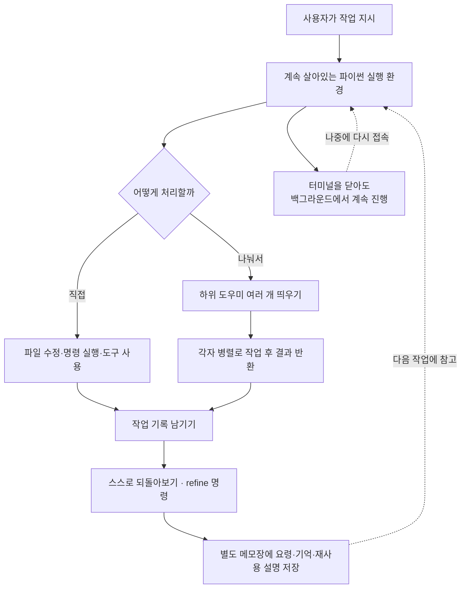

<div class="ai-knowledge-shell">

<aside class="ai-knowledge-sidebar">
  <p class="ai-eyebrow">CATEGORIES</p>
  <nav class="ai-cat-tree"><details class="ai-cat" open><summary><span class="catname">에이전트 오케스트레이션</span><span class="catcount">6</span></summary><ul><li><a href="https://altjs4510.github.io/ai_news_blog/knowledge/20260707/"><span class="kdate">2026-07-07</span><span class="ktitle">AI Hero Skills Catalog — 실무 엔지니어를 위한 재사용 가능한 판단 …</span></a></li><li><a href="https://altjs4510.github.io/ai_news_blog/knowledge/20260623/"><span class="kdate">2026-06-23</span><span class="ktitle">bytedance/deer-flow — 샌드박스·메모리·서브에이전트·메시지 게이트웨이를…</span></a></li><li><a href="https://altjs4510.github.io/ai_news_blog/knowledge/20260621/"><span class="kdate">2026-06-21</span><span class="ktitle">calesthio/OpenMontage — 12 파이프라인·52 도구·500+ 스킬을 …</span></a></li><li><a href="https://altjs4510.github.io/ai_news_blog/knowledge/20260602/"><span class="kdate">2026-06-02</span><span class="ktitle">revfactory/harness — 도메인별 에이전트 팀과 스킬을 자동 설계하는 메타…</span></a></li><li><a href="https://altjs4510.github.io/ai_news_blog/knowledge/20260529/"><span class="kdate">2026-05-29</span><span class="ktitle">Introducing dynamic workflows in Claude Code</span></a></li><li><a href="https://altjs4510.github.io/ai_news_blog/knowledge/20260507/"><span class="kdate">2026-05-07</span><span class="ktitle">ruvnet/ruflo — Claude 멀티 에이전트 오케스트레이션 플랫폼</span></a></li></ul></details><details class="ai-cat" open><summary><span class="catname">MCP &amp; 도구 통합</span><span class="catcount">18</span></summary><ul><li><a href="https://altjs4510.github.io/ai_news_blog/knowledge/20260802/"><span class="kdate">2026-08-02</span><span class="ktitle">Stateless MCP has recaptured my interest (and in…</span></a></li><li><a href="https://altjs4510.github.io/ai_news_blog/knowledge/20260801/"><span class="kdate">2026-08-01</span><span class="ktitle">different-ai/openwork — Claude Cowork의 오픈소스 대체 에…</span></a></li><li><a href="https://altjs4510.github.io/ai_news_blog/knowledge/20260731/"><span class="kdate">2026-07-31</span><span class="ktitle">different-ai/openwork — Claude Cowork의 오픈소스 대안(o…</span></a></li><li><a href="https://altjs4510.github.io/ai_news_blog/knowledge/20260729/"><span class="kdate">2026-07-29</span><span class="ktitle">Bringing MCP 2026-07-28 to Claude</span></a></li><li><a href="https://altjs4510.github.io/ai_news_blog/knowledge/20260723/"><span class="kdate">2026-07-23</span><span class="ktitle">diegosouzapw/OmniRoute — 268+ 프로바이더를 단일 엔드포인트로 묶…</span></a></li><li><a href="https://altjs4510.github.io/ai_news_blog/knowledge/20260722/"><span class="kdate">2026-07-22</span><span class="ktitle">tirth8205/code-review-graph — MCP·CLI용 로컬 우선 코드 …</span></a></li><li><a href="https://altjs4510.github.io/ai_news_blog/knowledge/20260721/"><span class="kdate">2026-07-21</span><span class="ktitle">tirth8205/code-review-graph — 로컬 우선 코드 인텔리전스 그래프…</span></a></li><li><a href="https://altjs4510.github.io/ai_news_blog/knowledge/20260719/"><span class="kdate">2026-07-19</span><span class="ktitle">tirth8205/code-review-graph — 로컬 우선 코드 인텔리전스 그래프…</span></a></li><li><a href="https://altjs4510.github.io/ai_news_blog/knowledge/20260718/"><span class="kdate">2026-07-18</span><span class="ktitle">tirth8205/code-review-graph — MCP·CLI용 로컬 코드 인텔리…</span></a></li><li><a href="https://altjs4510.github.io/ai_news_blog/knowledge/20260708/"><span class="kdate">2026-07-08</span><span class="ktitle">Expanding Managed Agents in Gemini API: backgrou…</span></a></li><li><a href="https://altjs4510.github.io/ai_news_blog/knowledge/20260618/"><span class="kdate">2026-06-18</span><span class="ktitle">DeusData/codebase-memory-mcp — 158개 언어 코드베이스를 밀리…</span></a></li><li><a href="https://altjs4510.github.io/ai_news_blog/knowledge/20260606/"><span class="kdate">2026-06-06</span><span class="ktitle">chopratejas/headroom — Compress tool outputs, lo…</span></a></li><li><a href="https://altjs4510.github.io/ai_news_blog/knowledge/20260605/"><span class="kdate">2026-06-05</span><span class="ktitle">chopratejas/headroom — Compress tool outputs, lo…</span></a></li><li><a href="https://altjs4510.github.io/ai_news_blog/knowledge/20260604/"><span class="kdate">2026-06-04</span><span class="ktitle">chopratejas/headroom — Compress tool outputs bef…</span></a></li><li><a href="https://altjs4510.github.io/ai_news_blog/knowledge/20260603/"><span class="kdate">2026-06-03</span><span class="ktitle">How Bad MCP design cost your Agent 5× more token…</span></a></li><li><a href="https://altjs4510.github.io/ai_news_blog/knowledge/20260523/"><span class="kdate">2026-05-23</span><span class="ktitle">colbymchenry/codegraph — 사전 인덱싱된 코드 지식 그래프 MCP</span></a></li><li><a href="https://altjs4510.github.io/ai_news_blog/knowledge/20260517/"><span class="kdate">2026-05-17</span><span class="ktitle">I gave my LLM 100,000+ tools — Lazy Discovery &a…</span></a></li><li><a href="https://altjs4510.github.io/ai_news_blog/knowledge/20260509/"><span class="kdate">2026-05-09</span><span class="ktitle">How to connect 100 MCP servers without the conte…</span></a></li></ul></details><details class="ai-cat" open><summary><span class="catname">코딩 에이전트</span><span class="catcount">19</span></summary><ul><li><a href="https://altjs4510.github.io/ai_news_blog/knowledge/20260809/"><span class="kdate">2026-08-09</span><span class="ktitle">PrimeIntellect-ai/prime-agent — 코딩 워크플로우·장기 자율 작…</span></a></li><li><a href="https://altjs4510.github.io/ai_news_blog/knowledge/20260808/" class="current"><span class="kdate">2026-08-08</span><span class="ktitle">PrimeIntellect-ai/prime-agent — 코딩 워크플로우와 장시간 자율…</span></a></li><li><a href="https://altjs4510.github.io/ai_news_blog/knowledge/20260804/"><span class="kdate">2026-08-04</span><span class="ktitle">esengine/DeepSeek-Reasonix — prefix-cache 안정성을 축…</span></a></li><li><a href="https://altjs4510.github.io/ai_news_blog/knowledge/20260728/"><span class="kdate">2026-07-28</span><span class="ktitle">alibaba/open-code-review — 결정론적 파이프라인 + LLM 에이전트…</span></a></li><li><a href="https://altjs4510.github.io/ai_news_blog/knowledge/20260725/"><span class="kdate">2026-07-25</span><span class="ktitle">The new rules of context engineering for Claude …</span></a></li><li><a href="https://altjs4510.github.io/ai_news_blog/knowledge/20260714/"><span class="kdate">2026-07-14</span><span class="ktitle">Graphify-Labs/graphify — 코드베이스를 질의 가능한 지식 그래프로 만…</span></a></li><li><a href="https://altjs4510.github.io/ai_news_blog/knowledge/20260705/"><span class="kdate">2026-07-05</span><span class="ktitle">openai/codex-plugin-cc — Claude Code에서 Codex를 위임…</span></a></li><li><a href="https://altjs4510.github.io/ai_news_blog/knowledge/20260626/"><span class="kdate">2026-06-26</span><span class="ktitle">google-labs-code/design.md — 코딩 에이전트에게 디자인 시스템을 …</span></a></li><li><a href="https://altjs4510.github.io/ai_news_blog/knowledge/20260619/"><span class="kdate">2026-06-19</span><span class="ktitle">Claude Code now supports artifacts</span></a></li><li><a href="https://altjs4510.github.io/ai_news_blog/knowledge/20260530/"><span class="kdate">2026-05-30</span><span class="ktitle">Leonxlnx/taste-skill — AI에게 좋은 취향을 부여해 generic s…</span></a></li><li><a href="https://altjs4510.github.io/ai_news_blog/knowledge/20260528/"><span class="kdate">2026-05-28</span><span class="ktitle">Building self-improving tax agents with Codex</span></a></li><li><a href="https://altjs4510.github.io/ai_news_blog/knowledge/20260526/"><span class="kdate">2026-05-26</span><span class="ktitle">colbymchenry/codegraph — Pre-indexed code knowle…</span></a></li><li><a href="https://altjs4510.github.io/ai_news_blog/knowledge/20260524/"><span class="kdate">2026-05-24</span><span class="ktitle">colbymchenry/codegraph — Pre-indexed code knowle…</span></a></li><li><a href="https://altjs4510.github.io/ai_news_blog/knowledge/20260521/"><span class="kdate">2026-05-21</span><span class="ktitle">colbymchenry/codegraph — Pre-indexed code knowle…</span></a></li><li><a href="https://altjs4510.github.io/ai_news_blog/knowledge/20260512/"><span class="kdate">2026-05-12</span><span class="ktitle">agentmemory — Persistent memory for AI coding ag…</span></a></li><li><a href="https://altjs4510.github.io/ai_news_blog/knowledge/20260510/"><span class="kdate">2026-05-10</span><span class="ktitle">addyosmani/agent-skills — Production-grade engin…</span></a></li><li><a href="https://altjs4510.github.io/ai_news_blog/knowledge/20260508/"><span class="kdate">2026-05-08</span><span class="ktitle">addyosmani/agent-skills — Production-grade engin…</span></a></li><li><a href="https://altjs4510.github.io/ai_news_blog/knowledge/20260506/"><span class="kdate">2026-05-06</span><span class="ktitle">mksglu/context-mode — AI 코딩 에이전트용 컨텍스트 윈도우 최적화</span></a></li><li><a href="https://altjs4510.github.io/ai_news_blog/knowledge/20260505/"><span class="kdate">2026-05-05</span><span class="ktitle">mattpocock/skills — Skills for Real Engineers (.…</span></a></li></ul></details><details class="ai-cat" open><summary><span class="catname">모델 &amp; 연구</span><span class="catcount">5</span></summary><ul><li><a href="https://altjs4510.github.io/ai_news_blog/knowledge/20260716-proprag/"><span class="kdate">2026-07-16</span><span class="ktitle">PropRAG — 프로포지션 경로 위 beam search로 멀티홉 검색 안내</span></a></li><li><a href="https://altjs4510.github.io/ai_news_blog/knowledge/20260620/"><span class="kdate">2026-06-20</span><span class="ktitle">zai-org/GLM-5 — From Vibe Coding to Agentic Engi…</span></a></li><li><a href="https://altjs4510.github.io/ai_news_blog/knowledge/20260617/"><span class="kdate">2026-06-17</span><span class="ktitle">Predicting model behavior before release by simu…</span></a></li><li><a href="https://altjs4510.github.io/ai_news_blog/knowledge/20260516/"><span class="kdate">2026-05-16</span><span class="ktitle">STALE — 에이전트가 자기 기억의 유효성을 인지할 수 있는가</span></a></li><li><a href="https://altjs4510.github.io/ai_news_blog/knowledge/20260513/"><span class="kdate">2026-05-13</span><span class="ktitle">Thinking Machines' Native Interaction Models — T…</span></a></li></ul></details><details class="ai-cat" open><summary><span class="catname">인프라 &amp; 컴퓨트</span><span class="catcount">6</span></summary><ul><li><a href="https://altjs4510.github.io/ai_news_blog/knowledge/20260806/"><span class="kdate">2026-08-06</span><span class="ktitle">cloudflare/computer — 에이전트에게 컴퓨터를 통째로 주는 엣지 실행 샌…</span></a></li><li><a href="https://altjs4510.github.io/ai_news_blog/knowledge/20260724/"><span class="kdate">2026-07-24</span><span class="ktitle">diegosouzapw/OmniRoute — 단일 엔드포인트로 278+ 프로바이더·50…</span></a></li><li><a href="https://altjs4510.github.io/ai_news_blog/knowledge/20260630/"><span class="kdate">2026-06-30</span><span class="ktitle">Introducing the Claude apps gateway for Amazon B…</span></a></li><li><a href="https://altjs4510.github.io/ai_news_blog/knowledge/20260611/"><span class="kdate">2026-06-11</span><span class="ktitle">The evolution of agentic surfaces: building with…</span></a></li><li><a href="https://altjs4510.github.io/ai_news_blog/knowledge/20260522/"><span class="kdate">2026-05-22</span><span class="ktitle">Giving Agents Computers — Ivan Burazin, Daytona</span></a></li><li><a href="https://altjs4510.github.io/ai_news_blog/knowledge/20260520/"><span class="kdate">2026-05-20</span><span class="ktitle">New in Claude Managed Agents: self-hosted sandbo…</span></a></li></ul></details><details class="ai-cat" open><summary><span class="catname">보안 &amp; 거버넌스</span><span class="catcount">13</span></summary><ul><li><a href="https://altjs4510.github.io/ai_news_blog/knowledge/20260730/"><span class="kdate">2026-07-30</span><span class="ktitle">Anatomy of a Frontier Lab Agent Intrusion: A Tec…</span></a></li><li><a href="https://altjs4510.github.io/ai_news_blog/knowledge/20260716/"><span class="kdate">2026-07-16</span><span class="ktitle">Dicklesworthstone/destructive_command_guard — 에이…</span></a></li><li><a href="https://altjs4510.github.io/ai_news_blog/knowledge/20260715/"><span class="kdate">2026-07-15</span><span class="ktitle">Dicklesworthstone/destructive_command_guard — 에이…</span></a></li><li><a href="https://altjs4510.github.io/ai_news_blog/knowledge/20260710/"><span class="kdate">2026-07-10</span><span class="ktitle">70개 MCP 서버 strace 런타임 감사 — 부팅 시 아웃바운드 호출 서버 적발</span></a></li><li><a href="https://altjs4510.github.io/ai_news_blog/knowledge/20260703/"><span class="kdate">2026-07-03</span><span class="ktitle">Giving admins more visibility and control over C…</span></a></li><li><a href="https://altjs4510.github.io/ai_news_blog/knowledge/20260625/"><span class="kdate">2026-06-25</span><span class="ktitle">Agent identity in Claude Tag: a new access model…</span></a></li><li><a href="https://altjs4510.github.io/ai_news_blog/knowledge/20260624/"><span class="kdate">2026-06-24</span><span class="ktitle">Agent identity in Claude Tag: a new access model…</span></a></li><li><a href="https://altjs4510.github.io/ai_news_blog/knowledge/20260614/"><span class="kdate">2026-06-14</span><span class="ktitle">NVIDIA/SkillSpector — Security scanner for AI ag…</span></a></li><li><a href="https://altjs4510.github.io/ai_news_blog/knowledge/20260613/"><span class="kdate">2026-06-13</span><span class="ktitle">Fable 5's guardrails got bypassed in 48 hours — …</span></a></li><li><a href="https://altjs4510.github.io/ai_news_blog/knowledge/20260612/"><span class="kdate">2026-06-12</span><span class="ktitle">NVIDIA/SkillSpector — AI 에이전트 스킬용 보안 스캐너</span></a></li><li><a href="https://altjs4510.github.io/ai_news_blog/knowledge/20260607/"><span class="kdate">2026-06-07</span><span class="ktitle">OpenAI Help: Lockdown Mode</span></a></li><li><a href="https://altjs4510.github.io/ai_news_blog/knowledge/20260531/"><span class="kdate">2026-05-31</span><span class="ktitle">How we contain Claude across products</span></a></li><li><a href="https://altjs4510.github.io/ai_news_blog/knowledge/20260527/"><span class="kdate">2026-05-27</span><span class="ktitle">Microsoft Copilot Cowork Exfiltrates Files</span></a></li></ul></details><details class="ai-cat" open><summary><span class="catname">응용 사례</span><span class="catcount">8</span></summary><ul><li><a href="https://altjs4510.github.io/ai_news_blog/knowledge/20260805/"><span class="kdate">2026-08-05</span><span class="ktitle">TencentCloud/TencentDB-Agent-Memory — 대화·문서·코드를 …</span></a></li><li><a href="https://altjs4510.github.io/ai_news_blog/knowledge/20260726/"><span class="kdate">2026-07-26</span><span class="ktitle">citrolabs/ego-lite — 로그인된 브라우저 상태를 AI 에이전트와 공유하는…</span></a></li><li><a href="https://altjs4510.github.io/ai_news_blog/knowledge/20260717/"><span class="kdate">2026-07-17</span><span class="ktitle">After a year building agent memory, 'save everyt…</span></a></li><li><a href="https://altjs4510.github.io/ai_news_blog/knowledge/20260712/"><span class="kdate">2026-07-12</span><span class="ktitle">Do Automated Evals Work?</span></a></li><li><a href="https://altjs4510.github.io/ai_news_blog/knowledge/20260709/"><span class="kdate">2026-07-09</span><span class="ktitle">mvanhorn/last30days-skill — Reddit·X·YouTube·HN·…</span></a></li><li><a href="https://altjs4510.github.io/ai_news_blog/knowledge/20260609/"><span class="kdate">2026-06-09</span><span class="ktitle">Building intelligent apps for Apple platforms wi…</span></a></li><li><a href="https://altjs4510.github.io/ai_news_blog/knowledge/20260515/"><span class="kdate">2026-05-15</span><span class="ktitle">Clawdmeter — Claude Code 사용량을 데스크톱 대시보드로</span></a></li><li><a href="https://altjs4510.github.io/ai_news_blog/knowledge/20260514/"><span class="kdate">2026-05-14</span><span class="ktitle">Introducing Claude for Small Business</span></a></li></ul></details><details class="ai-cat" open><summary><span class="catname">산업 동향</span><span class="catcount">8</span></summary><ul><li><a href="https://altjs4510.github.io/ai_news_blog/knowledge/20260711/"><span class="kdate">2026-07-11</span><span class="ktitle">OpenAI says GPT 5.6 is the 'preferred model' for…</span></a></li><li><a href="https://altjs4510.github.io/ai_news_blog/knowledge/20260704/"><span class="kdate">2026-07-04</span><span class="ktitle">Cloudflare is about to block AI agents by defaul…</span></a></li><li><a href="https://altjs4510.github.io/ai_news_blog/knowledge/20260702/"><span class="kdate">2026-07-02</span><span class="ktitle">How Cursor deploys AI inside the enterprise (For…</span></a></li><li><a href="https://altjs4510.github.io/ai_news_blog/knowledge/20260701/"><span class="kdate">2026-07-01</span><span class="ktitle">Google OKF (Open Knowledge Format) — 벤더 중립 에이전트 …</span></a></li><li><a href="https://altjs4510.github.io/ai_news_blog/knowledge/20260616/"><span class="kdate">2026-06-16</span><span class="ktitle">Why AI hasn't replaced software engineers, and w…</span></a></li><li><a href="https://altjs4510.github.io/ai_news_blog/knowledge/20260610/"><span class="kdate">2026-06-10</span><span class="ktitle">Fable 5 just made cost-aware model routing manda…</span></a></li><li><a href="https://altjs4510.github.io/ai_news_blog/knowledge/20260519/"><span class="kdate">2026-05-19</span><span class="ktitle">Anthropic acquires Stainless</span></a></li><li><a href="https://altjs4510.github.io/ai_news_blog/knowledge/20260504/"><span class="kdate">2026-05-04</span><span class="ktitle">Agents for Everything Else: Codex for Knowledge …</span></a></li></ul></details></nav>
</aside>

<article class="ai-knowledge-article">

<header class="ai-post-hero">
  <p class="ai-eyebrow"><a class="ai-back" href="../">KNOWLEDGE</a> · 2026-08-08 · 오늘의 학습</p>
  <h2 class="ai-post-title">PrimeIntellect-ai/prime-agent — 코딩 워크플로우와 장시간 자율 작업을 위한 자기개선 RLM 에이전트</h2>
</header>

> 원문: [PrimeIntellect-ai/prime-agent — 코딩 워크플로우와 장시간 자율 작업을 위한 자기개선 RLM 에이전트](https://github.com/PrimeIntellect-ai/prime-agent)

## 📌 학습 정리

### 1. 한 줄로 말하면

혼자 오래 일하는 코딩 도우미인데, 대화창을 닫아도 계속 돌아가고 일하면서 배운 요령을 스스로 메모해 다음 작업에 써먹는 방식이에요.

### 2. 왜 이게 만들어졌어요?

지금까지 대부분의 AI 코딩 도구는 "한 번 물어보고 한 번 답 받는" 구조에 가까웠어요. 그런데 실제 개발이나 연구 작업은 몇 시간, 며칠씩 이어지고, 중간에 방향을 바꾸거나 여러 갈래를 동시에 확인해야 하죠. 기존 방식에서는 대화창이 길어지면 앞의 맥락이 잘려나가고, 터미널을 닫으면 진행하던 작업이 통째로 사라지고, 어제 힘들게 알아낸 요령도 오늘 세션에서는 다시 처음부터 설명해야 했어요. Prime Agent는 이 세 가지 — 맥락 유지, 작업 연속성, 배운 것의 축적 — 를 도구 구조 자체에서 풀어보려는 시도예요.

### 3. 비유로 풀면

이건 마치 **책상을 치우지 않고 퇴근하는 동료**와 비슷해요. 보통은 하루가 끝나면 책상 위 자료를 다 버리고 다음 날 백지에서 시작하는데, 이 동료는 진행 중인 서류와 메모지를 그대로 두고 다음 날 이어서 작업해요. 게다가 "이 작업은 이렇게 하니까 잘 되더라"라는 포스트잇을 벽에 붙여두고, 비슷한 일이 오면 그 포스트잇을 먼저 봐요.

또 하나는 **채팅창이 아니라 작업실을 주는 것**에 가까워요. 질문에 답만 하는 게 아니라, 계산기·메모장·파일 정리 도구가 다 놓인 방에 들어가 직접 손을 움직이는 쪽이죠.

그래서 결국, 이 도구의 핵심은 "더 똑똑한 답변"이 아니라 **작업 상태와 학습 내용이 대화 한 번을 넘어 살아남게 만드는 구조**예요.

### 4. 어떻게 작동하는지 (그림으로)



흐름을 말로 풀면, 사용자의 지시는 대화가 아니라 **계속 켜져 있는 파이썬 작업실**로 들어가요. 거기서 파일을 고치거나 명령을 실행하고, 일이 크면 하위 도우미를 여러 개 띄워 나눠 맡긴 뒤 결과를 받아옵니다. 작업이 끝나면 `/refine` 명령으로 지금까지의 과정을 되짚어 "다음엔 이렇게 하자"는 짧은 메모를 별도 저장 공간에 남기고, 그 메모는 다음 작업에서 다시 읽혀요. 이때 원래의 기본 지침 자체는 건드리지 않고, 변경 이력이 남아 되돌릴 수 있게 되어 있다고 설명합니다.

### 5. 처음 보는 용어 풀이

- **재귀형 언어 모델 (Recursive Language Model, RLM)** — 대화 맥락을 그냥 쌓아두는 글자 덩어리가 아니라 프로그램 안의 **변수**처럼 다루고, 하위 도우미 호출도 함수 부르듯 처리하는 방식이에요. 맥락을 코드로 다루면 필요한 부분만 골라 쓰거나 넘겨줄 수 있어서, 긴 작업에서 맥락이 흘러넘치는 문제를 덜 겪습니다.

- **지속형 작업틀 (Continual Harness)** — 보조 지침, 기억, 사용할 만한 기능 설명, 재사용 가능한 하위 도우미 설정 같은 것들을 **세션이 끝나도 남는 상태**로 보관하는 저장 공간이에요. 여기에 조금씩 근거 있는 수정을 쌓아가면서 도구 자체가 개선되는 구조입니다. 기본값은 해당 세션 범위 안에서 관리돼요.

- **하위 도우미 (subagent)** — 본체 에이전트가 `rlm(...)` 같은 호출로 띄우는 별도의 작은 에이전트예요. 여러 일을 동시에 돌리거나 뒤에서 조용히 진행시켜 놓고 결과만 받아올 때 씁니다.

- **실행 가능한 기능 묶음 (skills)** — 설명 문서가 아니라 **파이썬 패키지로 가져다 쓸 수 있는 형태**의 기능이에요. 반복되는 작업 흐름을 발견하면 내장 생성기가 그걸 프로젝트용 또는 개인용 기능으로 만들어줍니다.

- **상주 프로세스 기반 유지 (daemon-backed sessions)** — 터미널 창을 닫아도 뒤에서 계속 도는 프로그램에 작업을 얹어두는 방식이에요. 나중에 `prime-agent attach`로 다시 붙어서 이어갈 수 있습니다.

- **제한 있는 자율 모드 (bounded autonomous mode)** — `/autonomous`로 켜면 사람이 매번 확인해주지 않아도 스스로 진행하는데, 턴 수·토큰·시간 예산 안에서만 움직여요. 원문은 여기에 분명한 단서를 붙입니다 — 품질 게이트를 통과했다는 건 그 게이트가 검사한 항목만 통과했다는 뜻이고, 예산 한도에 도달한 것이 작업 성공을 의미하지는 않아요.

- **자동 압축 (automatic compaction)** — 대화와 작업 기록이 길어지면 핵심만 남기고 줄여서, 오래 도는 작업에서도 맥락이 끊기지 않게 하는 장치예요.

한 가지 짚어둘 점은, 이 도구가 모델이 만들어낸 파이썬 코드와 프로젝트 명령을 **사용자 권한 그대로 실행**한다는 거예요. 원문도 작업자·커널 프로세스는 생명주기 관리와 복구를 돕는 것이지 보안 격리 장치가 아니라고 명시하고, 신뢰할 수 있는 저장소에서만 쓰거나 버려도 되는 복제본에서 돌리라고 권합니다.

### 6. 한 발 더 들어가고 싶다면

- [prime-agent 저장소](https://github.com/PrimeIntellect-ai/prime-agent) — 설치 방법, 명령어 목록, 전체 설계 설명을 원문 그대로 볼 수 있어요. MIT 라이선스로 공개돼 있습니다.
- [pi](https://github.com/badlogic/pi-mono) — 이 에이전트와 터미널 화면(TUI)이 얹혀 있는 바탕 도구라, 실제 화면과 실행 구조가 어디서 왔는지 알 수 있어요.
- 원문이 함께 안내하는 문서 갈래 — Quickstart(처음 설치와 첫 실행), Long-running and background agents(작업을 떼어놓고 나중에 다시 붙는 법), RLM programming model(맥락을 변수처럼 다루는 방식과 신뢰 모델), Architecture overview(상주 프로세스·작업자·커널이 어떻게 나뉘는지). 각 항목이 위에서 다룬 개념 중 어디를 더 파고들지 고르는 지도 역할을 해요.

---

## 📖 원문 전체 번역 (정독용)

> 의역 최소화한 전체 번역입니다. 큰 흐름은 위 정리에서 잡고, 정확한 워딩이 필요할 땐 이 섹션에서 정독하세요.

# Prime Agent: 자기개선형 RLM 에이전트

문서
•
Verifiers
•
PRIME-RL
•
pi-mono

Prime Agent는 일반 작업과 장시간 실행 작업을 위한 오픈소스 코딩 및 리서치 에이전트입니다. 이 에이전트는 두 가지 핵심 추상화를 중심으로 설계되었습니다:

**재귀적 언어 모델(Recursive Language Model, RLM)**은 컨텍스트를 변수로 취급하고(**prompt-as-a-variable**, 프롬프트를 변수로 다루는 방식), 재귀적 서브에이전트와 같은 도구들을 지속적인 REPL 내부의 함수 호출로 취급합니다(**programmatic tool/sub-agent calling**, 프로그래밍적 도구/서브에이전트 호출).

**Continual Harness**(지속형 하네스)는 보조 프롬프트, 메모리, 스킬 설명, 재사용 가능한 서브에이전트 사양을 내구성 있는 상태(durable state)로 저장하며, Prime Agent는 이를 작고 근거에 기반한 업데이트를 통해 다듬을 수 있습니다. 기본적으로 이 상태는 세션에 국한됩니다(local to the session by default).

Prime Agent는 지속형 Python 제어 환경과 내구성 있는 하네스 상태를 결합하여, 유용한 작업 컨텍스트와 재사용 가능한 운영 패턴이 단일 채팅 창의 수명을 넘어 유지될 수 있도록 합니다.

**모든 것이 프로그래밍적입니다**: 지속형 IPython이 내장 모델 도구이며, 파일 조작, 셸 명령, 도구 사용, 서브에이전트, 컨텍스트 관리가 모두 코드를 통해 이루어집니다.

**서브에이전트가 내장되어 있습니다**: `rlm(...)`은 병렬 또는 백그라운드 작업을 위해 실제 자식 에이전트를 생성하고 그 결과를 프로그래밍적으로 반환합니다.

**하네스는 개선될 수 있습니다**: `/refine`은 현재 실행 궤적(trajectory)을 검토하고 보조 하네스 상태에 작고 근거에 기반한 업데이트를 적용할 수 있습니다. 이는 불변의 기본 시스템 프롬프트를 절대 다시 쓰지 않으며, 기록된 스냅샷이 롤백을 지원합니다.

**스킬은 실행 가능합니다**: 스킬은 임포트 가능한 Python 패키지이며, 내장된 스킬 생성기가 반복되는 워크플로우를 프로젝트 스킬 또는 개인 스킬로 전환할 수 있습니다.

**세션은 백그라운드에서 실행됩니다**: 데몬 기반 에이전트는 터미널 연결이 끊겨도 계속 실행되며, 이후 다시 연결(reattach)할 수 있습니다.

**에이전트는 직접 통신합니다**: 실행 중인 에이전트들은 모든 것을 사용자를 경유시키지 않고도 메시지를 주고받으며 서로를 오케스트레이션할 수 있습니다.

**장시간 작업이 계속 진행됩니다**: 자동 압축(compaction), 지속적인 목표(persistent goals), 하트비트, 스케줄, 자율 모드(autonomous mode), 그리고 보존되는 서브에이전트가 여러 턴과 터미널 세션에 걸쳐 진행 상황을 보존합니다.

## 시작하기

macOS 또는 Linux에 최신 안정 릴리스를 설치합니다:

```
curl -fsSL https://app.primeintellect.ai/prime-agent/install.sh | sh
```

설치 프로그램은 버전이 지정된 릴리스를 다운로드하고, SHA-256 체크섬을 검증하며, `prime-agent` 명령을 설치하고, 에이전트가 사용하는 IPython 런타임을 준비할 수 있습니다.

작업하고자 하는 저장소 또는 디렉터리에서 Prime Agent를 시작합니다:

```
cd /path/to/project
prime-agent
```

최초 실행 시, `/login`을 실행하여 구독(subscription) 또는 API 키 제공자를 선택하십시오. Prime Agent는 현재 디렉터리에서 작동하며 그곳에서 명령을 실행하고 파일을 수정할 수 있습니다. 검사하고 복원할 수 있는 일회용 클론, 클린 워크트리(worktree), 또는 다른 체크포인트를 사용하십시오.

**경고**
Prime Agent는 모델이 생성한 Python 코드와 프로젝트 명령을 사용자의 권한으로 실행합니다. 워커(worker) 및 커널(kernel) 프로세스는 라이프사이클 격리와 복구를 개선하지만, 이는 보안 샌드박스가 **아닙니다**. 변경 사항을 검토하고, 신뢰할 수 있는 저장소·지시사항·스킬·확장 기능만 사용하십시오. 신뢰할 수 없는 코드나 지시사항은 외부 샌드박스 또는 제한된 환경에서 실행하십시오.

유용한 명령들:

```
prime-agent agents                    # 실행 중, 유휴, 저장된 세션 탐색
prime-agent attach <agent>             # 실행 중인 세션에 다시 연결
prime-agent --resume <path|id>         # 저장된 세션 재개
prime-agent status                     # 백그라운드 서비스 상태 확인
prime-agent doctor [--fix]             # 백그라운드 서비스 확인 또는 복구
prime-agent update [--force]           # Prime Agent 업데이트
prime-agent shutdown [--force]         # 모든 에이전트, 워커, 백그라운드 서비스 중지
```

## 장시간 작업을 위해 설계됨

Prime Agent는 장시간 작업, 특히 리서치에서의 평가(evaluation) 작업을 위해 설계되었습니다. 이러한 기능들은 TUI에서, 그리고 자율적으로 실행될 때 모두 사용할 수 있습니다.

**Continual Harness**: `/refine`은 초점이 명확하고 검토 가능한 교훈을 보조 프롬프트, 메모리, 재사용 가능한 스킬 설명, 또는 서브에이전트 사양으로 영속화할 수 있으며, 리파인먼트 이력이 기록됩니다. 이는 새로운 실행 가능 스킬을 패키징하고 검토하는 작업을 대체하지는 않습니다.

**에이전트 간 직접 통신**: 실행 중인 에이전트와 보존된 서브에이전트는 서로를 발견하고, 메시지를 주고받으며, 진행 중인 작업을 조정(steer)할 수 있습니다.

**데몬 기반 연속성**: 활성 세션, IPython 상태, 스케줄, 서브에이전트는 터미널 연결이 끊겨도 계속 실행되며 이후 다시 연결할 수 있습니다.

**하트비트와 스케줄**: `/heartbeat`, `rlm_heartbeat`, `prime-agent schedule`은 세션에 주기적으로 또는 특정 시각에 재진입할 수 있습니다.

**지속적인 목표**: `/goal`은 목표와 그 진행 상황을 완료·일시중지·삭제될 때까지 여러 턴에 걸쳐 활성 상태로 유지합니다.

**제한된 자율 모드(Bounded autonomous mode)**: `/autonomous`는 설정된 턴, 토큰, 시간 예산 내에서 계속 진행하며 사용자 정의 품질 게이트(quality gates)를 실행할 수 있습니다. 통과한 게이트는 그 게이트가 검증하는 것만 확인하며, 한도에 도달했다고 해서 작업 성공을 의미하지는 않습니다.

## 문서

- **Quickstart** — 설치, 인증, 첫 세션 실행
- **Usage and CLI reference** — 명령, 세션, 자율 모드 한도, 출력 모드
- **Long-running and background agents** — 분리 및 재연결, 목표, 하트비트, 스케줄
- **RLM programming model** — 지속형 IPython, 서브에이전트, 스킬, 신뢰 모델
- **JSON mode** 및 **RPC mode** — 헤드리스 자동화 및 통합
- **Skills** — 재사용 가능한 기능 설치 및 생성
- **Provider setup** — 구독 및 API 키 제공자
- **Architecture overview** — 데몬, 워커, 커널, 영속성 경계
- **Development** — 소스에서 빌드하고 실행하기

## 감사의 말

당사의 에이전트와 TUI는 **pi** 위에 구축되었습니다. pi의 저자들에게 그들의 소중한 작업에 감사드립니다.

## 라이선스

Prime Agent는 완전한 오픈소스이며 **MIT 라이선스** 하에 배포됩니다.

</article>

</div>

<!-- ai-related-links -->
<aside class="ai-related-links">
  <p class="ai-eyebrow">관련 학습</p>
  <ul><li><a href="https://altjs4510.github.io/ai_news_blog/knowledge/20260623/"><span class="kdate">2026-06-23</span><span class="ktitle">bytedance/deer-flow — 샌드박스·메모리·서브에이전트·메시지 게이트웨이를…</span></a></li><li><a href="https://altjs4510.github.io/ai_news_blog/knowledge/20260602/"><span class="kdate">2026-06-02</span><span class="ktitle">revfactory/harness — 도메인별 에이전트 팀과 스킬을 자동 설계하는 메타…</span></a></li><li><a href="https://altjs4510.github.io/ai_news_blog/knowledge/20260709/"><span class="kdate">2026-07-09</span><span class="ktitle">mvanhorn/last30days-skill — Reddit·X·YouTube·HN·…</span></a></li></ul>
</aside>
<!-- /ai-related-links -->
