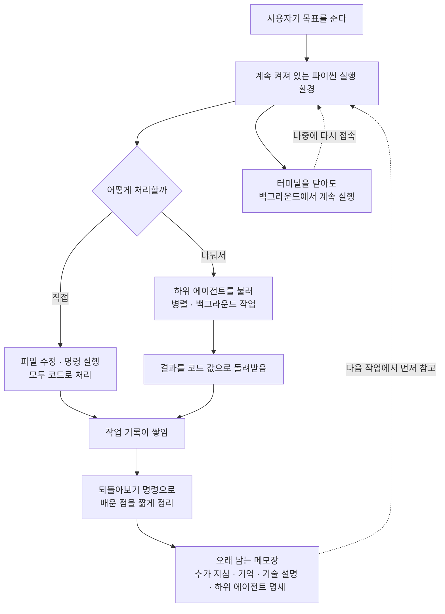

<div class="ai-knowledge-shell">

<aside class="ai-knowledge-sidebar">
  <p class="ai-eyebrow">CATEGORIES</p>
  <nav class="ai-cat-tree"><details class="ai-cat" open><summary><span class="catname">에이전트 오케스트레이션</span><span class="catcount">6</span></summary><ul><li><a href="https://altjs4510.github.io/ai_news_blog/knowledge/20260805/"><span class="kdate">2026-08-05</span><span class="ktitle">TencentCloud/TencentDB-Agent-Memory — 대화·문서·코드를 …</span></a></li><li><a href="https://altjs4510.github.io/ai_news_blog/knowledge/20260701/"><span class="kdate">2026-07-01</span><span class="ktitle">Google OKF (Open Knowledge Format) — 벤더 중립 에이전트 …</span></a></li><li><a href="https://altjs4510.github.io/ai_news_blog/knowledge/20260623/"><span class="kdate">2026-06-23</span><span class="ktitle">bytedance/deer-flow — 샌드박스·메모리·서브에이전트·메시지 게이트웨이를…</span></a></li><li><a href="https://altjs4510.github.io/ai_news_blog/knowledge/20260602/"><span class="kdate">2026-06-02</span><span class="ktitle">revfactory/harness — 도메인별 에이전트 팀과 스킬을 자동 설계하는 메타…</span></a></li><li><a href="https://altjs4510.github.io/ai_news_blog/knowledge/20260529/"><span class="kdate">2026-05-29</span><span class="ktitle">Introducing dynamic workflows in Claude Code</span></a></li><li><a href="https://altjs4510.github.io/ai_news_blog/knowledge/20260507/"><span class="kdate">2026-05-07</span><span class="ktitle">ruvnet/ruflo — Claude 멀티 에이전트 오케스트레이션 플랫폼</span></a></li></ul></details><details class="ai-cat" open><summary><span class="catname">MCP &amp; 도구 통합</span><span class="catcount">17</span></summary><ul><li><a href="https://altjs4510.github.io/ai_news_blog/knowledge/20260802/"><span class="kdate">2026-08-02</span><span class="ktitle">Stateless MCP has recaptured my interest (and in…</span></a></li><li><a href="https://altjs4510.github.io/ai_news_blog/knowledge/20260801/"><span class="kdate">2026-08-01</span><span class="ktitle">different-ai/openwork — Claude Cowork의 오픈소스 대체 에…</span></a></li><li><a href="https://altjs4510.github.io/ai_news_blog/knowledge/20260731/"><span class="kdate">2026-07-31</span><span class="ktitle">different-ai/openwork — Claude Cowork의 오픈소스 대안(o…</span></a></li><li><a href="https://altjs4510.github.io/ai_news_blog/knowledge/20260729/"><span class="kdate">2026-07-29</span><span class="ktitle">Bringing MCP 2026-07-28 to Claude</span></a></li><li><a href="https://altjs4510.github.io/ai_news_blog/knowledge/20260721/"><span class="kdate">2026-07-21</span><span class="ktitle">tirth8205/code-review-graph — 로컬 우선 코드 인텔리전스 그래프…</span></a></li><li><a href="https://altjs4510.github.io/ai_news_blog/knowledge/20260719/"><span class="kdate">2026-07-19</span><span class="ktitle">tirth8205/code-review-graph — 로컬 우선 코드 인텔리전스 그래프…</span></a></li><li><a href="https://altjs4510.github.io/ai_news_blog/knowledge/20260718/"><span class="kdate">2026-07-18</span><span class="ktitle">tirth8205/code-review-graph — MCP·CLI용 로컬 코드 인텔리…</span></a></li><li><a href="https://altjs4510.github.io/ai_news_blog/knowledge/20260709/"><span class="kdate">2026-07-09</span><span class="ktitle">mvanhorn/last30days-skill — Reddit·X·YouTube·HN·…</span></a></li><li><a href="https://altjs4510.github.io/ai_news_blog/knowledge/20260708/"><span class="kdate">2026-07-08</span><span class="ktitle">Expanding Managed Agents in Gemini API: backgrou…</span></a></li><li><a href="https://altjs4510.github.io/ai_news_blog/knowledge/20260618/"><span class="kdate">2026-06-18</span><span class="ktitle">DeusData/codebase-memory-mcp — 158개 언어 코드베이스를 밀리…</span></a></li><li><a href="https://altjs4510.github.io/ai_news_blog/knowledge/20260606/"><span class="kdate">2026-06-06</span><span class="ktitle">chopratejas/headroom — Compress tool outputs, lo…</span></a></li><li><a href="https://altjs4510.github.io/ai_news_blog/knowledge/20260605/"><span class="kdate">2026-06-05</span><span class="ktitle">chopratejas/headroom — Compress tool outputs, lo…</span></a></li><li><a href="https://altjs4510.github.io/ai_news_blog/knowledge/20260604/"><span class="kdate">2026-06-04</span><span class="ktitle">chopratejas/headroom — Compress tool outputs bef…</span></a></li><li><a href="https://altjs4510.github.io/ai_news_blog/knowledge/20260603/"><span class="kdate">2026-06-03</span><span class="ktitle">How Bad MCP design cost your Agent 5× more token…</span></a></li><li><a href="https://altjs4510.github.io/ai_news_blog/knowledge/20260523/"><span class="kdate">2026-05-23</span><span class="ktitle">colbymchenry/codegraph — 사전 인덱싱된 코드 지식 그래프 MCP</span></a></li><li><a href="https://altjs4510.github.io/ai_news_blog/knowledge/20260517/"><span class="kdate">2026-05-17</span><span class="ktitle">I gave my LLM 100,000+ tools — Lazy Discovery &a…</span></a></li><li><a href="https://altjs4510.github.io/ai_news_blog/knowledge/20260509/"><span class="kdate">2026-05-09</span><span class="ktitle">How to connect 100 MCP servers without the conte…</span></a></li></ul></details><details class="ai-cat" open><summary><span class="catname">코딩 에이전트</span><span class="catcount">26</span></summary><ul><li><a href="https://altjs4510.github.io/ai_news_blog/knowledge/20260820/"><span class="kdate">2026-08-20</span><span class="ktitle">akitaonrails/ai-memory — 코딩 에이전트 CLI의 장기 메모리와 벤더…</span></a></li><li><a href="https://altjs4510.github.io/ai_news_blog/knowledge/20260819/"><span class="kdate">2026-08-19</span><span class="ktitle">akitaonrails/ai-memory — 코딩 에이전트 CLI 간 장기 기억과 벤더…</span></a></li><li><a href="https://altjs4510.github.io/ai_news_blog/knowledge/20260814/"><span class="kdate">2026-08-14</span><span class="ktitle">cathrynlavery/diagram-design — Claude Code용 에디토리…</span></a></li><li><a href="https://altjs4510.github.io/ai_news_blog/knowledge/20260811/"><span class="kdate">2026-08-11</span><span class="ktitle">PrimeIntellect-ai/prime-agent — 장기 자율 실행을 전제로 설계…</span></a></li><li><a href="https://altjs4510.github.io/ai_news_blog/knowledge/20260810/"><span class="kdate">2026-08-10</span><span class="ktitle">Auto mode is now the default in Claude Code for …</span></a></li><li><a href="https://altjs4510.github.io/ai_news_blog/knowledge/20260809/" class="current"><span class="kdate">2026-08-09</span><span class="ktitle">PrimeIntellect-ai/prime-agent — 코딩 워크플로우·장기 자율 작…</span></a></li><li><a href="https://altjs4510.github.io/ai_news_blog/knowledge/20260808/"><span class="kdate">2026-08-08</span><span class="ktitle">PrimeIntellect-ai/prime-agent — 코딩 워크플로우와 장시간 자율…</span></a></li><li><a href="https://altjs4510.github.io/ai_news_blog/knowledge/20260804/"><span class="kdate">2026-08-04</span><span class="ktitle">esengine/DeepSeek-Reasonix — prefix-cache 안정성을 축…</span></a></li><li><a href="https://altjs4510.github.io/ai_news_blog/knowledge/20260728/"><span class="kdate">2026-07-28</span><span class="ktitle">alibaba/open-code-review — 결정론적 파이프라인 + LLM 에이전트…</span></a></li><li><a href="https://altjs4510.github.io/ai_news_blog/knowledge/20260725/"><span class="kdate">2026-07-25</span><span class="ktitle">The new rules of context engineering for Claude …</span></a></li><li><a href="https://altjs4510.github.io/ai_news_blog/knowledge/20260722/"><span class="kdate">2026-07-22</span><span class="ktitle">tirth8205/code-review-graph — MCP·CLI용 로컬 우선 코드 …</span></a></li><li><a href="https://altjs4510.github.io/ai_news_blog/knowledge/20260714/"><span class="kdate">2026-07-14</span><span class="ktitle">Graphify-Labs/graphify — 코드베이스를 질의 가능한 지식 그래프로 만…</span></a></li><li><a href="https://altjs4510.github.io/ai_news_blog/knowledge/20260707/"><span class="kdate">2026-07-07</span><span class="ktitle">AI Hero Skills Catalog — 실무 엔지니어를 위한 재사용 가능한 판단 …</span></a></li><li><a href="https://altjs4510.github.io/ai_news_blog/knowledge/20260705/"><span class="kdate">2026-07-05</span><span class="ktitle">openai/codex-plugin-cc — Claude Code에서 Codex를 위임…</span></a></li><li><a href="https://altjs4510.github.io/ai_news_blog/knowledge/20260626/"><span class="kdate">2026-06-26</span><span class="ktitle">google-labs-code/design.md — 코딩 에이전트에게 디자인 시스템을 …</span></a></li><li><a href="https://altjs4510.github.io/ai_news_blog/knowledge/20260619/"><span class="kdate">2026-06-19</span><span class="ktitle">Claude Code now supports artifacts</span></a></li><li><a href="https://altjs4510.github.io/ai_news_blog/knowledge/20260530/"><span class="kdate">2026-05-30</span><span class="ktitle">Leonxlnx/taste-skill — AI에게 좋은 취향을 부여해 generic s…</span></a></li><li><a href="https://altjs4510.github.io/ai_news_blog/knowledge/20260528/"><span class="kdate">2026-05-28</span><span class="ktitle">Building self-improving tax agents with Codex</span></a></li><li><a href="https://altjs4510.github.io/ai_news_blog/knowledge/20260526/"><span class="kdate">2026-05-26</span><span class="ktitle">colbymchenry/codegraph — Pre-indexed code knowle…</span></a></li><li><a href="https://altjs4510.github.io/ai_news_blog/knowledge/20260524/"><span class="kdate">2026-05-24</span><span class="ktitle">colbymchenry/codegraph — Pre-indexed code knowle…</span></a></li><li><a href="https://altjs4510.github.io/ai_news_blog/knowledge/20260521/"><span class="kdate">2026-05-21</span><span class="ktitle">colbymchenry/codegraph — Pre-indexed code knowle…</span></a></li><li><a href="https://altjs4510.github.io/ai_news_blog/knowledge/20260512/"><span class="kdate">2026-05-12</span><span class="ktitle">agentmemory — Persistent memory for AI coding ag…</span></a></li><li><a href="https://altjs4510.github.io/ai_news_blog/knowledge/20260510/"><span class="kdate">2026-05-10</span><span class="ktitle">addyosmani/agent-skills — Production-grade engin…</span></a></li><li><a href="https://altjs4510.github.io/ai_news_blog/knowledge/20260508/"><span class="kdate">2026-05-08</span><span class="ktitle">addyosmani/agent-skills — Production-grade engin…</span></a></li><li><a href="https://altjs4510.github.io/ai_news_blog/knowledge/20260506/"><span class="kdate">2026-05-06</span><span class="ktitle">mksglu/context-mode — AI 코딩 에이전트용 컨텍스트 윈도우 최적화</span></a></li><li><a href="https://altjs4510.github.io/ai_news_blog/knowledge/20260505/"><span class="kdate">2026-05-05</span><span class="ktitle">mattpocock/skills — Skills for Real Engineers (.…</span></a></li></ul></details><details class="ai-cat" open><summary><span class="catname">모델 &amp; 연구</span><span class="catcount">5</span></summary><ul><li><a href="https://altjs4510.github.io/ai_news_blog/knowledge/20260716-proprag/"><span class="kdate">2026-07-16</span><span class="ktitle">PropRAG — 프로포지션 경로 위 beam search로 멀티홉 검색 안내</span></a></li><li><a href="https://altjs4510.github.io/ai_news_blog/knowledge/20260620/"><span class="kdate">2026-06-20</span><span class="ktitle">zai-org/GLM-5 — From Vibe Coding to Agentic Engi…</span></a></li><li><a href="https://altjs4510.github.io/ai_news_blog/knowledge/20260617/"><span class="kdate">2026-06-17</span><span class="ktitle">Predicting model behavior before release by simu…</span></a></li><li><a href="https://altjs4510.github.io/ai_news_blog/knowledge/20260516/"><span class="kdate">2026-05-16</span><span class="ktitle">STALE — 에이전트가 자기 기억의 유효성을 인지할 수 있는가</span></a></li><li><a href="https://altjs4510.github.io/ai_news_blog/knowledge/20260513/"><span class="kdate">2026-05-13</span><span class="ktitle">Thinking Machines' Native Interaction Models — T…</span></a></li></ul></details><details class="ai-cat" open><summary><span class="catname">인프라 &amp; 컴퓨트</span><span class="catcount">8</span></summary><ul><li><a href="https://altjs4510.github.io/ai_news_blog/knowledge/20260813/"><span class="kdate">2026-08-13</span><span class="ktitle">semantica-agi/semantica — 컨텍스트와 책임 추적을 위한 그래프 네이…</span></a></li><li><a href="https://altjs4510.github.io/ai_news_blog/knowledge/20260812/"><span class="kdate">2026-08-12</span><span class="ktitle">semantica-agi/semantica — 컨텍스트와 '책임 추적 가능한(accou…</span></a></li><li><a href="https://altjs4510.github.io/ai_news_blog/knowledge/20260806/"><span class="kdate">2026-08-06</span><span class="ktitle">cloudflare/computer — 에이전트에게 컴퓨터를 통째로 주는 엣지 실행 샌…</span></a></li><li><a href="https://altjs4510.github.io/ai_news_blog/knowledge/20260724/"><span class="kdate">2026-07-24</span><span class="ktitle">diegosouzapw/OmniRoute — 단일 엔드포인트로 278+ 프로바이더·50…</span></a></li><li><a href="https://altjs4510.github.io/ai_news_blog/knowledge/20260723/"><span class="kdate">2026-07-23</span><span class="ktitle">diegosouzapw/OmniRoute — 268+ 프로바이더를 단일 엔드포인트로 묶…</span></a></li><li><a href="https://altjs4510.github.io/ai_news_blog/knowledge/20260611/"><span class="kdate">2026-06-11</span><span class="ktitle">The evolution of agentic surfaces: building with…</span></a></li><li><a href="https://altjs4510.github.io/ai_news_blog/knowledge/20260522/"><span class="kdate">2026-05-22</span><span class="ktitle">Giving Agents Computers — Ivan Burazin, Daytona</span></a></li><li><a href="https://altjs4510.github.io/ai_news_blog/knowledge/20260520/"><span class="kdate">2026-05-20</span><span class="ktitle">New in Claude Managed Agents: self-hosted sandbo…</span></a></li></ul></details><details class="ai-cat" open><summary><span class="catname">보안 &amp; 거버넌스</span><span class="catcount">16</span></summary><ul><li><a href="https://altjs4510.github.io/ai_news_blog/knowledge/20260819-mind-viruses/"><span class="kdate">2026-08-19</span><span class="ktitle">탈옥도, 인젝션도 없이 — 대화로만 퍼지는 에이전트의 '마인드 바이러스'</span></a></li><li><a href="https://altjs4510.github.io/ai_news_blog/knowledge/20260730/"><span class="kdate">2026-07-30</span><span class="ktitle">Anatomy of a Frontier Lab Agent Intrusion: A Tec…</span></a></li><li><a href="https://altjs4510.github.io/ai_news_blog/knowledge/20260716/"><span class="kdate">2026-07-16</span><span class="ktitle">Dicklesworthstone/destructive_command_guard — 에이…</span></a></li><li><a href="https://altjs4510.github.io/ai_news_blog/knowledge/20260715/"><span class="kdate">2026-07-15</span><span class="ktitle">Dicklesworthstone/destructive_command_guard — 에이…</span></a></li><li><a href="https://altjs4510.github.io/ai_news_blog/knowledge/20260710/"><span class="kdate">2026-07-10</span><span class="ktitle">70개 MCP 서버 strace 런타임 감사 — 부팅 시 아웃바운드 호출 서버 적발</span></a></li><li><a href="https://altjs4510.github.io/ai_news_blog/knowledge/20260704/"><span class="kdate">2026-07-04</span><span class="ktitle">Cloudflare is about to block AI agents by defaul…</span></a></li><li><a href="https://altjs4510.github.io/ai_news_blog/knowledge/20260703/"><span class="kdate">2026-07-03</span><span class="ktitle">Giving admins more visibility and control over C…</span></a></li><li><a href="https://altjs4510.github.io/ai_news_blog/knowledge/20260630/"><span class="kdate">2026-06-30</span><span class="ktitle">Introducing the Claude apps gateway for Amazon B…</span></a></li><li><a href="https://altjs4510.github.io/ai_news_blog/knowledge/20260625/"><span class="kdate">2026-06-25</span><span class="ktitle">Agent identity in Claude Tag: a new access model…</span></a></li><li><a href="https://altjs4510.github.io/ai_news_blog/knowledge/20260624/"><span class="kdate">2026-06-24</span><span class="ktitle">Agent identity in Claude Tag: a new access model…</span></a></li><li><a href="https://altjs4510.github.io/ai_news_blog/knowledge/20260614/"><span class="kdate">2026-06-14</span><span class="ktitle">NVIDIA/SkillSpector — Security scanner for AI ag…</span></a></li><li><a href="https://altjs4510.github.io/ai_news_blog/knowledge/20260613/"><span class="kdate">2026-06-13</span><span class="ktitle">Fable 5's guardrails got bypassed in 48 hours — …</span></a></li><li><a href="https://altjs4510.github.io/ai_news_blog/knowledge/20260612/"><span class="kdate">2026-06-12</span><span class="ktitle">NVIDIA/SkillSpector — AI 에이전트 스킬용 보안 스캐너</span></a></li><li><a href="https://altjs4510.github.io/ai_news_blog/knowledge/20260607/"><span class="kdate">2026-06-07</span><span class="ktitle">OpenAI Help: Lockdown Mode</span></a></li><li><a href="https://altjs4510.github.io/ai_news_blog/knowledge/20260531/"><span class="kdate">2026-05-31</span><span class="ktitle">How we contain Claude across products</span></a></li><li><a href="https://altjs4510.github.io/ai_news_blog/knowledge/20260527/"><span class="kdate">2026-05-27</span><span class="ktitle">Microsoft Copilot Cowork Exfiltrates Files</span></a></li></ul></details><details class="ai-cat" open><summary><span class="catname">응용 사례</span><span class="catcount">7</span></summary><ul><li><a href="https://altjs4510.github.io/ai_news_blog/knowledge/20260726/"><span class="kdate">2026-07-26</span><span class="ktitle">citrolabs/ego-lite — 로그인된 브라우저 상태를 AI 에이전트와 공유하는…</span></a></li><li><a href="https://altjs4510.github.io/ai_news_blog/knowledge/20260717/"><span class="kdate">2026-07-17</span><span class="ktitle">After a year building agent memory, 'save everyt…</span></a></li><li><a href="https://altjs4510.github.io/ai_news_blog/knowledge/20260712/"><span class="kdate">2026-07-12</span><span class="ktitle">Do Automated Evals Work?</span></a></li><li><a href="https://altjs4510.github.io/ai_news_blog/knowledge/20260621/"><span class="kdate">2026-06-21</span><span class="ktitle">calesthio/OpenMontage — 12 파이프라인·52 도구·500+ 스킬을 …</span></a></li><li><a href="https://altjs4510.github.io/ai_news_blog/knowledge/20260609/"><span class="kdate">2026-06-09</span><span class="ktitle">Building intelligent apps for Apple platforms wi…</span></a></li><li><a href="https://altjs4510.github.io/ai_news_blog/knowledge/20260515/"><span class="kdate">2026-05-15</span><span class="ktitle">Clawdmeter — Claude Code 사용량을 데스크톱 대시보드로</span></a></li><li><a href="https://altjs4510.github.io/ai_news_blog/knowledge/20260514/"><span class="kdate">2026-05-14</span><span class="ktitle">Introducing Claude for Small Business</span></a></li></ul></details><details class="ai-cat" open><summary><span class="catname">산업 동향</span><span class="catcount">6</span></summary><ul><li><a href="https://altjs4510.github.io/ai_news_blog/knowledge/20260711/"><span class="kdate">2026-07-11</span><span class="ktitle">OpenAI says GPT 5.6 is the 'preferred model' for…</span></a></li><li><a href="https://altjs4510.github.io/ai_news_blog/knowledge/20260702/"><span class="kdate">2026-07-02</span><span class="ktitle">How Cursor deploys AI inside the enterprise (For…</span></a></li><li><a href="https://altjs4510.github.io/ai_news_blog/knowledge/20260616/"><span class="kdate">2026-06-16</span><span class="ktitle">Why AI hasn't replaced software engineers, and w…</span></a></li><li><a href="https://altjs4510.github.io/ai_news_blog/knowledge/20260610/"><span class="kdate">2026-06-10</span><span class="ktitle">Fable 5 just made cost-aware model routing manda…</span></a></li><li><a href="https://altjs4510.github.io/ai_news_blog/knowledge/20260519/"><span class="kdate">2026-05-19</span><span class="ktitle">Anthropic acquires Stainless</span></a></li><li><a href="https://altjs4510.github.io/ai_news_blog/knowledge/20260504/"><span class="kdate">2026-05-04</span><span class="ktitle">Agents for Everything Else: Codex for Knowledge …</span></a></li></ul></details></nav>
</aside>

<article class="ai-knowledge-article">

<header class="ai-post-hero">
  <p class="ai-eyebrow"><a class="ai-back" href="../">KNOWLEDGE</a> · 2026-08-09 · 오늘의 학습</p>
  <h2 class="ai-post-title">PrimeIntellect-ai/prime-agent — 코딩 워크플로우·장기 자율 작업용 self-improving RLM 에이전트</h2>
</header>

> 원문: [PrimeIntellect-ai/prime-agent — 코딩 워크플로우·장기 자율 작업용 self-improving RLM 에이전트](https://github.com/PrimeIntellect-ai/prime-agent)

## 📌 학습 정리

### 1. 한 줄로 말하면

프라임 에이전트(Prime Agent)는 명령을 한 번 받고 끝나는 도구가 아니라, 작업 공간을 계속 켜둔 채로 며칠씩 이어지는 일을 하고, 하면서 배운 요령을 자기 메모장에 적어두는 코딩·리서치 조수예요. 터미널 창을 닫아도 뒤에서 계속 돌아가고 나중에 다시 붙을 수 있다는 점이 특징입니다.

### 2. 왜 이게 만들어졌어요?

지금까지의 대화형 AI 도구는 대체로 "한 번 물어보고 한 번 답 받는" 구조라, 창을 닫거나 대화가 길어져 맥락이 잘리면 그동안 쌓인 작업 상태가 통째로 사라졌어요. 그래서 어제 알아낸 이 프로젝트의 특이한 빌드 방법이나 자주 반복하는 절차를 매번 다시 설명해야 하는 낭비가 생겼고요. 특히 연구용 평가처럼 몇 시간, 며칠씩 돌아가야 하는 일에는 "대화창 하나 = 작업 수명"이라는 전제 자체가 잘 안 맞았습니다. 프라임 에이전트는 여기에 두 가지를 붙여서 답합니다 — 하나는 계속 살아 있는 실행 환경이고, 다른 하나는 세션이 끝나도 남는 기록입니다. 소개 문서에서도 "쓸모 있는 작업 맥락과 재사용 가능한 일하는 방식이 대화창 하나보다 오래 살아남게" 하는 것을 목표로 내세우고 있어요.

### 3. 비유로 풀면

이건 마치 책상을 그대로 둔 채 퇴근하는 것과 비슷해요. 보통의 챗봇은 퇴근할 때 책상을 싹 치우고 가서 다음 날 처음부터 다시 펼쳐야 하는데, 프라임 에이전트는 펼쳐둔 자료와 계산 중이던 노트를 그대로 둔 채 자리를 뜨고 다음 날 이어서 앉습니다.

또 하나는 인수인계 노트예요. 일하다가 "이 프로젝트는 테스트 돌리기 전에 이걸 먼저 해야 하더라" 같은 걸 알게 되면 노트에 짧게 적어두고, 다음에 같은 상황이 오면 그 노트를 먼저 봅니다. 다만 회사의 기본 규정집(원문 표현으로는 변경 불가능한 기본 시스템 프롬프트)은 절대 고치지 않고, 덧붙이는 메모만 갱신해요.

그래서 결국, "매번 새로 시작하는 조수" 대신 "어제 하던 일과 어제 배운 요령을 들고 오는 조수"에 가깝게 만들려는 설계입니다.

### 4. 어떻게 작동하는지 (그림으로)



핵심은 왼쪽 아래의 순환이에요. 모든 작업이 코드로 처리되기 때문에 하위 조수를 부르는 것도 함수를 호출하듯 되고, 그 결과가 다시 값으로 돌아와 이어서 쓸 수 있습니다. 그리고 한 사이클이 끝나면 되돌아보기 단계에서 "이번에 뭘 배웠나"를 근거와 함께 짧게 적어 메모장에 남기고, 그 메모가 다음 작업의 출발점이 됩니다. 오른쪽 갈래는 수명 이야기로, 터미널 연결이 끊겨도 실행은 살아 있고 나중에 다시 붙을 수 있어요.

한 가지 조심할 부분도 원문이 분명히 적어두고 있습니다. 이 도구는 모델이 만들어낸 파이썬 코드와 프로젝트 명령을 사용자 권한으로 그대로 실행하고, 작업자·커널 프로세스는 안정성을 위한 분리일 뿐 보안 격리 장치가 아니라는 점이에요. 그래서 믿을 수 있는 저장소에서만 쓰고, 언제든 되돌릴 수 있는 사본이나 체크포인트에서 돌리라고 권합니다.

### 5. 처음 보는 용어 풀이

- **재귀 언어 모델 (Recursive Language Model, RLM)** — 대화 맥락을 하나의 긴 글이 아니라 프로그램의 변수처럼 다루고, 도구나 하위 조수를 함수 호출하듯 부르는 방식이에요. 맥락을 통째로 들고 다니는 대신 필요할 때 꺼내 쓸 수 있어서 긴 작업에 유리합니다.
- **이어지는 하네스 (Continual Harness)** — 에이전트가 일하는 데 필요한 추가 지침, 기억, 할 줄 아는 일의 설명, 재사용할 하위 조수 명세를 오래 보관하는 저장 공간이에요. 기본값은 해당 세션 범위에 머무르고, 작고 근거 있는 수정만 쌓입니다.
- **하위 에이전트 (subagent)** — 본체가 필요할 때 만들어내는 자식 조수입니다. `rlm(...)` 호출로 띄워서 병렬로 돌리거나 뒤에서 돌게 하고, 결과를 코드 값으로 돌려받아요.
- **상주 실행 환경 (persistent IPython)** — 계속 켜져 있는 파이썬 대화형 실행판이에요. 파일 조작, 셸 명령, 도구 사용, 맥락 관리까지 전부 이 안에서 코드로 이뤄져서, 중간 결과가 변수로 그대로 남습니다.
- **기술 (skills)** — 반복되는 작업 절차를 불러다 쓸 수 있는 파이썬 꾸러미로 만들어둔 것이에요. 내장된 기술 생성기가 자주 하는 흐름을 프로젝트용 또는 개인용 기술로 굳혀줍니다.
- **상주 서비스 기반 지속 실행 (daemon-backed continuity)** — 화면 뒤에서 계속 돌아가는 관리 프로세스 덕분에 터미널을 닫아도 세션과 실행 상태, 예약, 하위 조수가 살아 있는 구조예요. 나중에 다시 접속해 이어서 볼 수 있습니다.
- **한계가 정해진 자율 모드 (bounded autonomous mode)** — 정해둔 턴 수·토큰·시간 예산 안에서 스스로 계속 진행하는 모드입니다. 사용자가 정한 품질 검사도 돌릴 수 있는데, 검사를 통과했다는 건 그 검사가 본 것만 확인했다는 뜻이고 한도까지 돌았다고 해서 일이 성공했다는 뜻은 아니라고 원문이 못박아 둡니다.

### 6. 한 발 더 들어가고 싶다면

- [Documentation](https://github.com/PrimeIntellect-ai/prime-agent) — 설치·인증부터 첫 세션 실행, 명령어와 세션 관리, 헤드리스 자동화 연동까지 전반을 볼 수 있어요.
- [Verifiers](https://github.com/PrimeIntellect-ai/prime-agent) — 함께 소개된 프로젝트로, 결과를 검증하는 쪽 도구가 어떻게 짜여 있는지 볼 수 있어요.
- [PRIME-RL](https://github.com/PrimeIntellect-ai/prime-agent) — 이 에이전트의 배경이 되는 강화학습 쪽 작업을 볼 수 있어요.
- [pi](https://github.com/PrimeIntellect-ai/prime-agent) — 프라임 에이전트의 본체와 터미널 화면이 얹혀 있는 기반 프로젝트라, 화면·상호작용 구조의 뿌리를 알 수 있어요.
- [MIT License](https://github.com/PrimeIntellect-ai/prime-agent) — 완전한 오픈소스이고 어떤 조건으로 가져다 쓸 수 있는지 확인할 수 있어요.

---

## 📖 원문 전체 번역 (정독용)

> 의역 최소화한 전체 번역입니다. 큰 흐름은 위 정리에서 잡고, 정확한 워딩이 필요할 땐 이 섹션에서 정독하세요.

# Prime Agent: 자가개선형 RLM 에이전트

Documentation • Verifiers • PRIME-RL • pi-mono

Prime Agent는 범용 작업과 장기 실행 작업을 위한 오픈소스 코딩·리서치 에이전트다. 두 가지 핵심 추상화를 중심으로 설계되었다:

**RLM(Recursive Language Model, 재귀적 언어 모델)**은 컨텍스트를 변수로 취급하고(**prompt-as-a-variable**), 재귀적 서브에이전트 같은 도구를 함수 호출로 취급하며(**프로그래밍적 도구/서브에이전트 호출**), 이 모든 것이 영속적인 REPL 안에서 이루어진다.

**Continual Harness(연속 하네스)**는 보조 프롬프트, 메모리, 스킬 설명, 재사용 가능한 서브에이전트 명세를 영속 상태(durable state)로 저장하며, Prime Agent는 이를 작고 근거 기반(evidence-backed)인 업데이트를 통해 정제(refine)할 수 있다. 기본적으로 세션 로컬 범위다.

Prime Agent는 영속적인 Python 제어 환경과 영속적인 하네스 상태를 결합하여, 유용한 작업 컨텍스트와 재사용 가능한 운영 패턴이 하나의 채팅 창을 넘어서 지속될 수 있도록 한다.

**모든 것이 프로그래밍적이다:** 영속적인 IPython이 기본 내장 모델 도구이며, 파일 조작, 셸 명령, 도구 사용, 서브에이전트, 컨텍스트 관리가 모두 코드를 통해 이루어진다.

**서브에이전트가 내장되어 있다:** `rlm(...)`은 병렬 또는 백그라운드 작업을 위해 실제 자식 에이전트를 생성(spawn)하고, 그 결과를 프로그래밍적으로 반환한다.

**하네스는 개선될 수 있다:** `/refine`은 현재 궤적(trajectory)을 검토하여 보조 하네스 상태에 작고 근거 기반인 업데이트를 적용할 수 있다. 이는 결코 불변(immutable)의 기본 시스템 프롬프트를 다시 쓰지 않으며, 기록된 스냅샷은 롤백을 지원한다.

**스킬은 실행 가능하다:** 스킬은 임포트 가능한 Python 패키지이며, 내장된 스킬 생성기(skill creator)는 반복되는 워크플로우를 프로젝트 스킬 또는 개인 스킬로 전환할 수 있다.

**세션은 백그라운드에서 실행된다:** 데몬 기반 에이전트는 터미널 연결이 끊겨도 계속 실행되며, 나중에 다시 연결(reattach)할 수 있다.

**에이전트는 직접 소통한다:** 실행 중인 에이전트들은 모든 것을 사용자를 거치지 않고도 메시지를 교환하고 서로를 조율(orchestrate)할 수 있다.

**장기 작업은 계속 진행된다:** 자동 압축(compaction), 영속적 목표(persistent goals), 하트비트, 스케줄, 자율 모드, 유지되는 서브에이전트가 턴과 터미널 세션에 걸쳐 진행 상황을 보존한다.

## 시작하기

macOS 또는 Linux에서 최신 안정 릴리스를 설치하려면:

```
curl -fsSL https://app.primeintellect.ai/prime-agent/install.sh | sh
```

설치 프로그램은 버전이 지정된 릴리스를 다운로드하고, SHA-256 체크섬을 검증하며, `prime-agent` 명령을 설치하고, 에이전트가 사용하는 IPython 런타임을 준비할 수 있다.

작업하고자 하는 리포지토리 또는 디렉터리에서 Prime Agent를 시작하라:

```
cd /path/to/project
prime-agent
```

최초 실행 시 `/login`을 실행하여 구독(subscription) 또는 API 키 제공자를 선택하라. Prime Agent는 현재 디렉터리에서 작동하며, 그 디렉터리에서 명령을 실행하고 파일을 수정할 수 있다. 검사하고 복원할 수 있는 일회용 클론, 클린 워크트리, 또는 다른 체크포인트를 사용하라.

**경고**
Prime Agent는 모델이 생성한 Python 및 프로젝트 명령을 사용자의 권한으로 실행한다. 워커(worker) 및 커널(kernel) 프로세스는 생명주기 격리와 복구를 개선하지만, 이는 **보안 샌드박스가 아니다.** 변경 사항을 검토하고, 신뢰할 수 있는 리포지토리·명령어·스킬·확장 기능만 사용하라. 신뢰할 수 없는 코드나 명령어는 외부 샌드박스 또는 제한된 환경에서 실행하라.

유용한 명령어:

```
prime-agent agents                    # 실행 중, 유휴, 저장된 세션 탐색
prime-agent attach <agent>             # 실행 중인 세션에 다시 연결
prime-agent --resume <path|id>         # 저장된 세션 재개
prime-agent status                     # 백그라운드 서비스 상태 점검
prime-agent doctor [--fix]             # 백그라운드 서비스 점검 또는 복구
prime-agent update [--force]           # Prime Agent 업데이트
prime-agent shutdown [--force]         # 모든 에이전트, 워커, 백그라운드 서비스 중지
```

## 장기 실행 작업을 위해 만들어졌다

Prime Agent는 장기 실행 작업, 특히 리서치에서의 평가(evaluation) 작업을 위해 설계되었다. 이러한 기능들은 TUI에서, 그리고 자율적으로 실행될 때 모두 사용할 수 있다.

**Continual Harness:** `/refine`은 초점이 명확하고 검토 가능한 교훈(lessons)을 보조 프롬프트, 메모리, 재사용 가능한 스킬 설명, 또는 서브에이전트 명세로 영속화할 수 있으며, 정제(refinement) 이력이 기록된다. 이는 새로운 실행 가능 스킬을 패키징하고 검토하는 것을 대체하지 않는다.

**직접적인 에이전트 간 통신:** 실행 중인 에이전트와 유지되는 서브에이전트는 서로를 발견하고, 메시지를 교환하며, 진행 중인 작업을 조정할 수 있다.

**데몬 기반 연속성:** 활성 세션, IPython 상태, 스케줄, 서브에이전트는 터미널이 분리(detach)되어도 계속 실행되며, 나중에 다시 연결(reattach)할 수 있다.

**하트비트와 스케줄:** `/heartbeat`, `rlm_heartbeat`, `prime-agent schedule`은 주기적으로 또는 특정 시각에 세션에 재진입할 수 있다.

**영속적 목표:** `/goal`은 목표(objective)와 그 진행 상황을 완료, 일시정지, 또는 초기화될 때까지 여러 턴에 걸쳐 계속 활성 상태로 유지한다.

**제한된 자율 모드:** `/autonomous`는 설정된 턴, 토큰, 시간 예산 내에서 계속 진행되며, 사용자 정의 품질 게이트(quality gates)를 실행할 수 있다. 통과한 게이트는 그 게이트가 검증하는 사항만을 확인하는 것이며, 한도 도달이 작업 성공을 의미하지는 않는다.

## 문서

- **Quickstart** — 설치, 인증, 첫 세션 실행
- **Usage and CLI reference** — 명령어, 세션, 자율 모드 한도, 출력 모드
- **Long-running and background agents** — 분리·재연결, 목표, 하트비트, 스케줄
- **RLM programming model** — 영속적 IPython, 서브에이전트, 스킬, 신뢰 모델
- **JSON mode**와 **RPC mode** — 헤드리스 자동화 및 통합
- **Skills** — 재사용 가능한 기능의 설치와 생성
- **Provider setup** — 구독 및 API 키 제공자
- **Architecture overview** — 데몬, 워커, 커널, 영속화 경계
- **Development** — 소스로부터 빌드 및 실행

## 감사의 말

우리의 에이전트와 TUI는 **pi** 위에 구축되었다. **pi**의 저자들에게 그들의 소중한 작업에 감사드린다.

## 라이선스

Prime Agent는 완전한 오픈소스이며 **MIT License**로 배포된다.

</article>

</div>

<!-- ai-related-links -->
<aside class="ai-related-links">
  <p class="ai-eyebrow">관련 학습</p>
  <ul><li><a href="https://altjs4510.github.io/ai_news_blog/knowledge/20260623/"><span class="kdate">2026-06-23</span><span class="ktitle">bytedance/deer-flow — 샌드박스·메모리·서브에이전트·메시지 게이트웨이를…</span></a></li><li><a href="https://altjs4510.github.io/ai_news_blog/knowledge/20260602/"><span class="kdate">2026-06-02</span><span class="ktitle">revfactory/harness — 도메인별 에이전트 팀과 스킬을 자동 설계하는 메타…</span></a></li><li><a href="https://altjs4510.github.io/ai_news_blog/knowledge/20260528/"><span class="kdate">2026-05-28</span><span class="ktitle">Building self-improving tax agents with Codex</span></a></li></ul>
</aside>
<!-- /ai-related-links -->
