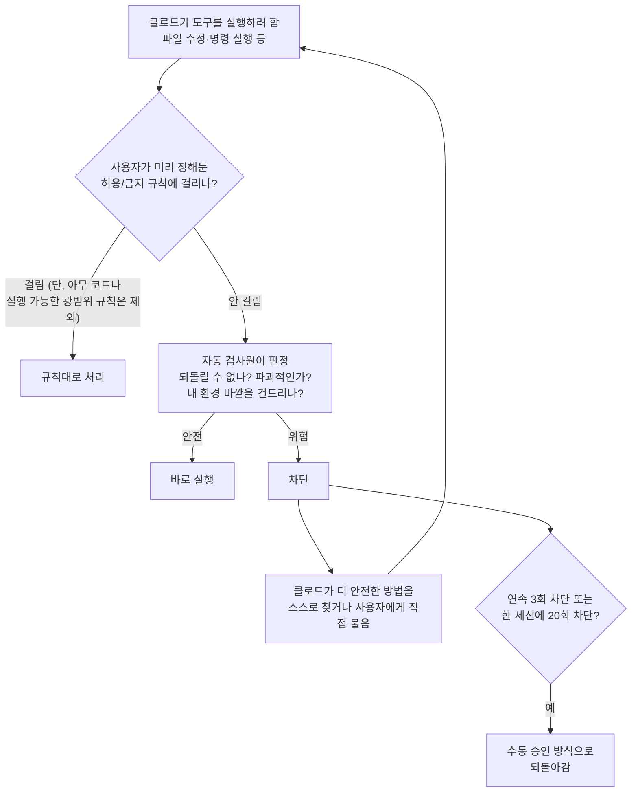

<aside class="ai-knowledge-sidebar">
  
CATEGORIES

  <nav class="ai-cat-tree">

에이전트 오케스트레이션6
<ul><li><a href="https://altjs4510.github.io/ai_news_blog/knowledge/20260707/">2026-07-07AI Hero Skills Catalog — 실무 엔지니어를 위한 재사용 가능한 판단 …</a></li><li><a href="https://altjs4510.github.io/ai_news_blog/knowledge/20260623/">2026-06-23bytedance/deer-flow — 샌드박스·메모리·서브에이전트·메시지 게이트웨이를…</a></li><li><a href="https://altjs4510.github.io/ai_news_blog/knowledge/20260621/">2026-06-21calesthio/OpenMontage — 12 파이프라인·52 도구·500+ 스킬을 …</a></li><li><a href="https://altjs4510.github.io/ai_news_blog/knowledge/20260602/">2026-06-02revfactory/harness — 도메인별 에이전트 팀과 스킬을 자동 설계하는 메타…</a></li><li><a href="https://altjs4510.github.io/ai_news_blog/knowledge/20260529/">2026-05-29Introducing dynamic workflows in Claude Code</a></li><li><a href="https://altjs4510.github.io/ai_news_blog/knowledge/20260507/">2026-05-07ruvnet/ruflo — Claude 멀티 에이전트 오케스트레이션 플랫폼</a></li></ul>

MCP &amp; 도구 통합18
<ul><li><a href="https://altjs4510.github.io/ai_news_blog/knowledge/20260802/">2026-08-02Stateless MCP has recaptured my interest (and in…</a></li><li><a href="https://altjs4510.github.io/ai_news_blog/knowledge/20260801/">2026-08-01different-ai/openwork — Claude Cowork의 오픈소스 대체 에…</a></li><li><a href="https://altjs4510.github.io/ai_news_blog/knowledge/20260731/">2026-07-31different-ai/openwork — Claude Cowork의 오픈소스 대안(o…</a></li><li><a href="https://altjs4510.github.io/ai_news_blog/knowledge/20260729/">2026-07-29Bringing MCP 2026-07-28 to Claude</a></li><li><a href="https://altjs4510.github.io/ai_news_blog/knowledge/20260723/">2026-07-23diegosouzapw/OmniRoute — 268+ 프로바이더를 단일 엔드포인트로 묶…</a></li><li><a href="https://altjs4510.github.io/ai_news_blog/knowledge/20260722/">2026-07-22tirth8205/code-review-graph — MCP·CLI용 로컬 우선 코드 …</a></li><li><a href="https://altjs4510.github.io/ai_news_blog/knowledge/20260721/">2026-07-21tirth8205/code-review-graph — 로컬 우선 코드 인텔리전스 그래프…</a></li><li><a href="https://altjs4510.github.io/ai_news_blog/knowledge/20260719/">2026-07-19tirth8205/code-review-graph — 로컬 우선 코드 인텔리전스 그래프…</a></li><li><a href="https://altjs4510.github.io/ai_news_blog/knowledge/20260718/">2026-07-18tirth8205/code-review-graph — MCP·CLI용 로컬 코드 인텔리…</a></li><li><a href="https://altjs4510.github.io/ai_news_blog/knowledge/20260708/">2026-07-08Expanding Managed Agents in Gemini API: backgrou…</a></li><li><a href="https://altjs4510.github.io/ai_news_blog/knowledge/20260618/">2026-06-18DeusData/codebase-memory-mcp — 158개 언어 코드베이스를 밀리…</a></li><li><a href="https://altjs4510.github.io/ai_news_blog/knowledge/20260606/">2026-06-06chopratejas/headroom — Compress tool outputs, lo…</a></li><li><a href="https://altjs4510.github.io/ai_news_blog/knowledge/20260605/">2026-06-05chopratejas/headroom — Compress tool outputs, lo…</a></li><li><a href="https://altjs4510.github.io/ai_news_blog/knowledge/20260604/">2026-06-04chopratejas/headroom — Compress tool outputs bef…</a></li><li><a href="https://altjs4510.github.io/ai_news_blog/knowledge/20260603/">2026-06-03How Bad MCP design cost your Agent 5× more token…</a></li><li><a href="https://altjs4510.github.io/ai_news_blog/knowledge/20260523/">2026-05-23colbymchenry/codegraph — 사전 인덱싱된 코드 지식 그래프 MCP</a></li><li><a href="https://altjs4510.github.io/ai_news_blog/knowledge/20260517/">2026-05-17I gave my LLM 100,000+ tools — Lazy Discovery &a…</a></li><li><a href="https://altjs4510.github.io/ai_news_blog/knowledge/20260509/">2026-05-09How to connect 100 MCP servers without the conte…</a></li></ul>

코딩 에이전트20
<ul><li><a href="https://altjs4510.github.io/ai_news_blog/knowledge/20260810/" class="current">2026-08-10Auto mode is now the default in Claude Code for …</a></li><li><a href="https://altjs4510.github.io/ai_news_blog/knowledge/20260809/">2026-08-09PrimeIntellect-ai/prime-agent — 코딩 워크플로우·장기 자율 작…</a></li><li><a href="https://altjs4510.github.io/ai_news_blog/knowledge/20260808/">2026-08-08PrimeIntellect-ai/prime-agent — 코딩 워크플로우와 장시간 자율…</a></li><li><a href="https://altjs4510.github.io/ai_news_blog/knowledge/20260804/">2026-08-04esengine/DeepSeek-Reasonix — prefix-cache 안정성을 축…</a></li><li><a href="https://altjs4510.github.io/ai_news_blog/knowledge/20260728/">2026-07-28alibaba/open-code-review — 결정론적 파이프라인 + LLM 에이전트…</a></li><li><a href="https://altjs4510.github.io/ai_news_blog/knowledge/20260725/">2026-07-25The new rules of context engineering for Claude …</a></li><li><a href="https://altjs4510.github.io/ai_news_blog/knowledge/20260714/">2026-07-14Graphify-Labs/graphify — 코드베이스를 질의 가능한 지식 그래프로 만…</a></li><li><a href="https://altjs4510.github.io/ai_news_blog/knowledge/20260705/">2026-07-05openai/codex-plugin-cc — Claude Code에서 Codex를 위임…</a></li><li><a href="https://altjs4510.github.io/ai_news_blog/knowledge/20260626/">2026-06-26google-labs-code/design.md — 코딩 에이전트에게 디자인 시스템을 …</a></li><li><a href="https://altjs4510.github.io/ai_news_blog/knowledge/20260619/">2026-06-19Claude Code now supports artifacts</a></li><li><a href="https://altjs4510.github.io/ai_news_blog/knowledge/20260530/">2026-05-30Leonxlnx/taste-skill — AI에게 좋은 취향을 부여해 generic s…</a></li><li><a href="https://altjs4510.github.io/ai_news_blog/knowledge/20260528/">2026-05-28Building self-improving tax agents with Codex</a></li><li><a href="https://altjs4510.github.io/ai_news_blog/knowledge/20260526/">2026-05-26colbymchenry/codegraph — Pre-indexed code knowle…</a></li><li><a href="https://altjs4510.github.io/ai_news_blog/knowledge/20260524/">2026-05-24colbymchenry/codegraph — Pre-indexed code knowle…</a></li><li><a href="https://altjs4510.github.io/ai_news_blog/knowledge/20260521/">2026-05-21colbymchenry/codegraph — Pre-indexed code knowle…</a></li><li><a href="https://altjs4510.github.io/ai_news_blog/knowledge/20260512/">2026-05-12agentmemory — Persistent memory for AI coding ag…</a></li><li><a href="https://altjs4510.github.io/ai_news_blog/knowledge/20260510/">2026-05-10addyosmani/agent-skills — Production-grade engin…</a></li><li><a href="https://altjs4510.github.io/ai_news_blog/knowledge/20260508/">2026-05-08addyosmani/agent-skills — Production-grade engin…</a></li><li><a href="https://altjs4510.github.io/ai_news_blog/knowledge/20260506/">2026-05-06mksglu/context-mode — AI 코딩 에이전트용 컨텍스트 윈도우 최적화</a></li><li><a href="https://altjs4510.github.io/ai_news_blog/knowledge/20260505/">2026-05-05mattpocock/skills — Skills for Real Engineers (.…</a></li></ul>

모델 &amp; 연구5
<ul><li><a href="https://altjs4510.github.io/ai_news_blog/knowledge/20260716-proprag/">2026-07-16PropRAG — 프로포지션 경로 위 beam search로 멀티홉 검색 안내</a></li><li><a href="https://altjs4510.github.io/ai_news_blog/knowledge/20260620/">2026-06-20zai-org/GLM-5 — From Vibe Coding to Agentic Engi…</a></li><li><a href="https://altjs4510.github.io/ai_news_blog/knowledge/20260617/">2026-06-17Predicting model behavior before release by simu…</a></li><li><a href="https://altjs4510.github.io/ai_news_blog/knowledge/20260516/">2026-05-16STALE — 에이전트가 자기 기억의 유효성을 인지할 수 있는가</a></li><li><a href="https://altjs4510.github.io/ai_news_blog/knowledge/20260513/">2026-05-13Thinking Machines' Native Interaction Models — T…</a></li></ul>

인프라 &amp; 컴퓨트6
<ul><li><a href="https://altjs4510.github.io/ai_news_blog/knowledge/20260806/">2026-08-06cloudflare/computer — 에이전트에게 컴퓨터를 통째로 주는 엣지 실행 샌…</a></li><li><a href="https://altjs4510.github.io/ai_news_blog/knowledge/20260724/">2026-07-24diegosouzapw/OmniRoute — 단일 엔드포인트로 278+ 프로바이더·50…</a></li><li><a href="https://altjs4510.github.io/ai_news_blog/knowledge/20260630/">2026-06-30Introducing the Claude apps gateway for Amazon B…</a></li><li><a href="https://altjs4510.github.io/ai_news_blog/knowledge/20260611/">2026-06-11The evolution of agentic surfaces: building with…</a></li><li><a href="https://altjs4510.github.io/ai_news_blog/knowledge/20260522/">2026-05-22Giving Agents Computers — Ivan Burazin, Daytona</a></li><li><a href="https://altjs4510.github.io/ai_news_blog/knowledge/20260520/">2026-05-20New in Claude Managed Agents: self-hosted sandbo…</a></li></ul>

보안 &amp; 거버넌스13
<ul><li><a href="https://altjs4510.github.io/ai_news_blog/knowledge/20260730/">2026-07-30Anatomy of a Frontier Lab Agent Intrusion: A Tec…</a></li><li><a href="https://altjs4510.github.io/ai_news_blog/knowledge/20260716/">2026-07-16Dicklesworthstone/destructive_command_guard — 에이…</a></li><li><a href="https://altjs4510.github.io/ai_news_blog/knowledge/20260715/">2026-07-15Dicklesworthstone/destructive_command_guard — 에이…</a></li><li><a href="https://altjs4510.github.io/ai_news_blog/knowledge/20260710/">2026-07-1070개 MCP 서버 strace 런타임 감사 — 부팅 시 아웃바운드 호출 서버 적발</a></li><li><a href="https://altjs4510.github.io/ai_news_blog/knowledge/20260703/">2026-07-03Giving admins more visibility and control over C…</a></li><li><a href="https://altjs4510.github.io/ai_news_blog/knowledge/20260625/">2026-06-25Agent identity in Claude Tag: a new access model…</a></li><li><a href="https://altjs4510.github.io/ai_news_blog/knowledge/20260624/">2026-06-24Agent identity in Claude Tag: a new access model…</a></li><li><a href="https://altjs4510.github.io/ai_news_blog/knowledge/20260614/">2026-06-14NVIDIA/SkillSpector — Security scanner for AI ag…</a></li><li><a href="https://altjs4510.github.io/ai_news_blog/knowledge/20260613/">2026-06-13Fable 5's guardrails got bypassed in 48 hours — …</a></li><li><a href="https://altjs4510.github.io/ai_news_blog/knowledge/20260612/">2026-06-12NVIDIA/SkillSpector — AI 에이전트 스킬용 보안 스캐너</a></li><li><a href="https://altjs4510.github.io/ai_news_blog/knowledge/20260607/">2026-06-07OpenAI Help: Lockdown Mode</a></li><li><a href="https://altjs4510.github.io/ai_news_blog/knowledge/20260531/">2026-05-31How we contain Claude across products</a></li><li><a href="https://altjs4510.github.io/ai_news_blog/knowledge/20260527/">2026-05-27Microsoft Copilot Cowork Exfiltrates Files</a></li></ul>

응용 사례8
<ul><li><a href="https://altjs4510.github.io/ai_news_blog/knowledge/20260805/">2026-08-05TencentCloud/TencentDB-Agent-Memory — 대화·문서·코드를 …</a></li><li><a href="https://altjs4510.github.io/ai_news_blog/knowledge/20260726/">2026-07-26citrolabs/ego-lite — 로그인된 브라우저 상태를 AI 에이전트와 공유하는…</a></li><li><a href="https://altjs4510.github.io/ai_news_blog/knowledge/20260717/">2026-07-17After a year building agent memory, 'save everyt…</a></li><li><a href="https://altjs4510.github.io/ai_news_blog/knowledge/20260712/">2026-07-12Do Automated Evals Work?</a></li><li><a href="https://altjs4510.github.io/ai_news_blog/knowledge/20260709/">2026-07-09mvanhorn/last30days-skill — Reddit·X·YouTube·HN·…</a></li><li><a href="https://altjs4510.github.io/ai_news_blog/knowledge/20260609/">2026-06-09Building intelligent apps for Apple platforms wi…</a></li><li><a href="https://altjs4510.github.io/ai_news_blog/knowledge/20260515/">2026-05-15Clawdmeter — Claude Code 사용량을 데스크톱 대시보드로</a></li><li><a href="https://altjs4510.github.io/ai_news_blog/knowledge/20260514/">2026-05-14Introducing Claude for Small Business</a></li></ul>

산업 동향8
<ul><li><a href="https://altjs4510.github.io/ai_news_blog/knowledge/20260711/">2026-07-11OpenAI says GPT 5.6 is the 'preferred model' for…</a></li><li><a href="https://altjs4510.github.io/ai_news_blog/knowledge/20260704/">2026-07-04Cloudflare is about to block AI agents by defaul…</a></li><li><a href="https://altjs4510.github.io/ai_news_blog/knowledge/20260702/">2026-07-02How Cursor deploys AI inside the enterprise (For…</a></li><li><a href="https://altjs4510.github.io/ai_news_blog/knowledge/20260701/">2026-07-01Google OKF (Open Knowledge Format) — 벤더 중립 에이전트 …</a></li><li><a href="https://altjs4510.github.io/ai_news_blog/knowledge/20260616/">2026-06-16Why AI hasn't replaced software engineers, and w…</a></li><li><a href="https://altjs4510.github.io/ai_news_blog/knowledge/20260610/">2026-06-10Fable 5 just made cost-aware model routing manda…</a></li><li><a href="https://altjs4510.github.io/ai_news_blog/knowledge/20260519/">2026-05-19Anthropic acquires Stainless</a></li><li><a href="https://altjs4510.github.io/ai_news_blog/knowledge/20260504/">2026-05-04Agents for Everything Else: Codex for Knowledge …</a></li></ul>
</nav>
</aside>

<article class="ai-knowledge-article">

<header class="ai-post-hero">
  
<a class="ai-back" href="../">KNOWLEDGE</a> · 2026-08-10 · 오늘의 학습

  <h2 class="ai-post-title">Auto mode is now the default in Claude Code for Pro, Max, and Team plans</h2>
</header>

> 원문: [Auto mode is now the default in Claude Code for Pro, Max, and Team plans](https://claude.com/blog/auto-mode-default-in-claude-code)

## 📌 학습 정리

### 1. 한 줄로 말하면

코딩을 대신 해주는 AI에게 매번 "이거 실행해도 될까요?" 하고 묻던 확인 창을 없애고, 대신 위험한 명령만 골라내는 자동 검사원을 세워둔 겁니다. 이게 8월 14일부터 유료 사용자 기본 설정이 됩니다.

### 2. 왜 이게 만들어졌어요?

원래 클로드 코드(Claude Code, 터미널에서 돌아가는 AI 코딩 도구)는 파일을 고치거나 명령을 실행하기 직전마다 사용자에게 승인을 받았습니다. 안전장치로 만든 건데, 실제 데이터를 보니 사용자들이 승인 요청의 97%를 그냥 눌러버리고 있었다고 해요. 반면 클로드가 "이런 계획으로 진행할게요" 하고 계획을 보여줄 때는 39%를 거절했다니, 개별 명령 승인만 유독 반사적으로 넘어가고 있었던 셈입니다. 게다가 절반 가까운 사용자가 아예 "이런 종류 명령은 앞으로 묻지 마"라는 허용 규칙을 직접 만들어뒀고, 62%는 승인 절차를 통째로 우회하는 옵션을 써본 적이 있었습니다. 확인 창이 안전을 지키는 게 아니라 피로만 주고 있다는 판단에서 나온 변경입니다.

### 3. 비유로 풀면

공항에서 모든 승객의 가방을 직원이 일일이 손으로 열어보는 대신, 엑스레이 검색대를 통과시키는 것과 비슷합니다. 손검사는 처음 몇 명은 꼼꼼하지만 백 명째가 되면 눈이 흐려지죠. 기계는 백 번째든 천 번째든 같은 기준으로 봅니다. 실제로 원문의 실험에서 사람은 세션 초반에 위험 명령의 17%를 잡다가 50번쯤 승인 요청을 겪은 뒤엔 5%까지 떨어졌지만, 자동 모드의 차단률은 세션 길이와 무관하게 평평했습니다.

또 하나는 운전 보조 시스템에 가깝습니다. 매 코너마다 "핸들 꺾어도 될까요?"를 묻는 대신, 평소엔 알아서 가다가 벽에 부딪힐 것 같을 때만 브레이크를 잡습니다. 그래서 결국 자동 모드는 판단 자체를 없앤 게 아니라, 판단하는 주체를 지친 사람에서 지치지 않는 분류기로 옮긴 구조입니다.

### 4. 어떻게 작동하는지 (그림으로)

핵심은 가운데 있는 검사원(원문 표현으로는 분류기, classifier)입니다. 모든 도구 호출이 여기를 지나가면서 "되돌릴 수 없는 일인지, 파괴적인지, 내 작업 환경 바깥을 향하는지"를 기준으로 걸러집니다. 막히면 클로드가 다른 경로를 찾거나 사용자에게 직접 묻고, 그래도 진척이 없으면(연속 3회, 또는 한 세션 20회 차단) 예전처럼 일일이 승인받는 방식으로 자동 복귀합니다.

한 가지 짚어둘 부분이 있어요. `python:*` 처럼 사실상 아무 코드나 실행할 수 있게 열어둔 허용 규칙은 자동 모드에서 잠시 무시됩니다. 그런 규칙이 살아 있으면 명령이 검사원을 통째로 건너뛸 수 있기 때문인데, 설정 파일 자체가 바뀌는 건 아니고 다른 모드로 돌아가면 규칙도 그대로 다시 적용됩니다.

### 5. 처음 보는 용어 풀이

- **자동 모드 (auto mode)** — 도구 실행마다 사용자에게 묻는 대신, 위험 판정기를 거쳐 자동으로 진행하는 클로드 코드의 권한 설정입니다. 8월 14일부터 Pro·Max·Team 플랜의 새 세션 기본값이 됩니다.
- **분류기 (classifier)** — 각 명령이 위험한지 아닌지를 판정하는 작은 판별 모델입니다. 사람 대신 승인 판단을 내리는 주체이고, 호출마다 약간의 추가 토큰을 쓰는데 이 비용은 앞으로 사용자에게 청구하지 않는다고 합니다.
- **간접 프롬프트 주입 (indirect prompt injection)** — 웹페이지나 파일 같은 외부 자료 안에 "이 데이터를 저기로 보내라" 같은 지시문을 몰래 심어두고, AI가 그걸 사용자 지시로 착각해 따르게 만드는 공격입니다. 자동 모드는 외부에서 가져온 내용을 별도 탐지기로 훑어 의심스러우면 경고를 붙입니다.
- **레드팀 (red-teaming)** — 만든 사람이 아니라 공격자 입장에서 일부러 시스템을 뚫어보는 검증 방식입니다. 여기서는 내부 팀과 외부 업체 두 곳이 각각 공격을 시도했습니다.
- **강한 거부 (hard denies)** — 사용자가 요청하더라도 절대 승인하지 않도록 지정된 행동 범주입니다. 코드나 비밀키를 외부로 내보내는 유출 행위가 대표적이고, 조직 차원에서 항목을 추가할 수도 있습니다.
- **승인 우회 모드 (bypassPermissions)** — 확인 절차를 전부 끄고 클로드가 하는 대로 두는 기존 옵션입니다. 자동 모드와 달리 중간 검사가 없습니다.
- **관리형 설정 (managed settings)** — 회사 관리자가 조직 전체의 기본 모드를 한 번에 지정하는 설정 파일입니다. `defaultMode`로 기본값을 고정하거나 `disableAutoMode`로 자동 모드를 끌 수 있습니다.

### 6. 한 발 더 들어가고 싶다면

- [자동 모드 문서](https://claude.com/blog/auto-mode-default-in-claude-code) 본문에서 안내하는 auto mode docs — 모드 전환(터미널에서 Shift+Tab), 조직 기본값 고정 등 실제 설정 방법을 알 수 있어요.
- 원문에 링크된 [운영 환경에서 자동 모드 쓰기(Running auto mode in production)](https://claude.com/blog/auto-mode-default-in-claude-code) 자료 — Adobe·Nuro·Gusto·Garner Health 같은 팀이 어떻게 도입했는지 사례를 볼 수 있어요.

한 가지 원문이 스스로 덧붙인 단서도 같이 기억해두면 좋습니다. 자동 모드는 분류 시스템에 기대는 방식이라 위험을 줄일 뿐 없애지는 못하고, 운영 인프라를 건드리는 중대한 변경은 여전히 사람이 직접 확인하길 권한다고 밝히고 있어요. 외부 평가에서 나온 7%의 놓침 비율도 일부러 공격적으로 만든 시나리오에 대한 수치이지 실제 사용 환경의 수치는 아니라고 선을 긋고 있습니다.

---

## 📖 원문 전체 번역 (정독용)

> 의역 최소화한 전체 번역입니다. 큰 흐름은 위 정리에서 잡고, 정확한 워딩이 필요할 땐 이 섹션에서 정독하세요.

# Auto mode가 이제 Claude Code Pro, Max, Team 플랜의 기본값이 됩니다

Claude Code는 곧 Pro, Max, Team 플랜에서 auto mode를 기본으로 실행하게 됩니다. 이를 통해 더 오랜 시간 자율 작업이 가능해지고, 저희 테스트 결과 수동 검토보다 더 많은 위험한 명령을 잡아낼 수 있었습니다.

**카테고리**: Claude Code
**제품**: Claude Code
**날짜**: 2026년 8월 7일
**읽는 시간**: 5분

저희는 **auto mode**를 Claude Code의 기본값으로 만들고 있습니다. 8월 14일부터 Pro, Max, Team 플랜의 새 세션은 auto mode로 실행됩니다. 이미 직접 다른 기본값을 설정해두신 경우, auto mode로 전환할지 묻는 일회성 프롬프트를 받으실 수 있습니다. 고정(pinned) 기본값을 설정해두신 경우에는 아무것도 바뀌지 않습니다. auto mode 분류기(classifier)는 도구 호출당 소량의 추가 토큰을 사용하는데, 오늘부터 Pro, Max, Team 플랜 Claude Code 사용자에게 해당 분류기 오버헤드에 대한 과금을 더 이상 하지 않습니다.

auto mode는 Claude Enterprise, Claude API, AWS의 Claude Platform, Amazon Bedrock, Google Cloud의 Agent Platform, Microsoft Foundry에서는 당분간 옵트인(opt-in) 상태로 유지되어, 관리자들이 이 변경사항을 검토할 시간을 갖도록 합니다. 향후 한 달 내에 클라우드 파트너들과 협력하여 이들 모든 플랫폼에서도 이를 기본값으로 만들고 분류기 오버헤드에 대한 과금을 중단할 계획입니다. 그 사이에 Enterprise 관리자는 관리형 설정(managed settings)을 통해 Claude Code의 auto mode를 기본값으로 만들 수 있습니다.

auto mode는 사용자가 방해받고 싶지 않다는 욕구와 유해한 행동을 방지하는 시스템 사이의 균형을 맞추도록 설계되었습니다: 프롬프트 대신, 각 도구 호출을 되돌릴 수 없거나(irreversible), 파괴적이거나(destructive), 사용자 환경 바깥을 겨냥한 행동을 차단하는 것을 목표로 하는 분류기를 거치게 합니다. 분류기가 무언가를 차단하면, Claude는 대개 스스로 더 안전한 진행 방법을 찾거나 사용자에게 직접 승인을 요청합니다. 만약 진행이 불가능한 경우—연속 3회 차단, 또는 세션 내 누적 20회 차단—Claude Code는 수동 승인 방식으로 되돌아갑니다.

저희는 지난 몇 달간 auto mode가 프롬프트를 클릭해서 넘기는 평균적인 사용자만큼 안전한지, 혹은 그보다 더 안전한지를 테스트하는 데 시간을 쏟았습니다. 내부 레드팀 테스트, 제3자 레드팀 테스트 및 프롬프트 인젝션 평가, 1,053명의 유료 테스터를 대상으로 한 통제된 연구, 그리고 실제 프로덕션 세션 분석을 수행했습니다. 저희가 테스트한 모든 지표에서, auto mode는 수동 검토와 동등하거나 그보다 더 나은 성과를 보였습니다.

auto mode는 또한 Claude가 더 오랜 시간 자율적으로 작업할 수 있게 해줍니다. 이를 통해 Claude Opus 5처럼 장시간 작업을 위해 만들어진 모델을 대규모 작업에 몇 시간씩 돌려두는 것이 더 실용적이게 됩니다. 사용자의 부담(overhead)을 줄이는 것은 산출량 증가로도 이어집니다. Teams와 Enterprise 도입 고객 중 auto mode 사용자는 약 25% 더 많은 PR을 출시합니다. Claude의 발목을 잡던 요소를 제거함으로써 작업을 더 오래 중단 없이 실행하고 더 많은 일을 처리할 수 있게 됩니다. Adobe, Nuro, Gusto, Garner Health의 팀들은 이미 auto mode를 프로덕션 기본값으로 **운영**하고 있습니다.

아래에서는 이러한 변경을 촉발한 안전성 데이터와 고객 성과, 그리고 원하실 경우 다른 기본값을 설정하는 방법을 공유합니다.

## 수동 검토와 auto mode 비교

데이터에 따르면 수동 검토는 습관화될 수 있음을 시사합니다: 사용자들은 Claude Code의 권한 프롬프트 중 97%를 승인합니다. 대부분의 프롬프트가 안전하고 일상적인 명령에 대한 것일 가능성이 높지만, 이렇게 높은 승인률은 많은 사용자가 각 명령을 검토하기보다는 반사적으로 클릭해서 넘긴다는 것을 시사합니다. 이러한 프롬프트는 개발자에게 매일 수십, 수백 건의 중요한 보안 결정을 내리도록 요구하며, 종종 프로젝트가 한창 진행 중일 때 발생하기 때문에 검토 부담이 사용자에게 전가되고 중요한 것이 빠져나갈 가능성이 높아집니다. 데이터는 또한 사용자들이 다른 유형의 대화상자에는 더 자주 면밀히 검토하고 반발한다는 것을 보여줍니다: 예를 들어, Claude가 승인을 위해 계획(plan)을 제시할 때 사용자는 그중 39%를 거부합니다. 하지만 개별 권한 요청에 대해서는 거부율이 단 3%에 불과합니다.

동일한 패턴이 설정 파일에서도 나타납니다. 2026년 6월 기준, 활성 CLI 사용자의 49.5%가 수동으로 Bash 허용 규칙(allow-rule)을 만들었습니다—5%는 어떤 셸 명령이든 그대로 허용하고, 또 다른 43%는 사실상 이와 동등한 `Bash(python:*)` 또는 `Bash(node:*)` 같은 인터프리터 규칙을 갖고 있습니다—그리고 이 비율은 5주마다 약 5퍼센트포인트씩 증가하고 있습니다. 허용 규칙 외에도, 62%의 사용자가 `bypassPermissions`를 사용했거나 Bash에서 "다시 묻지 않기"를 클릭한 적이 있으며, 대화형 세션의 25%가 bypass permissions 모드로 시작됩니다.

권한 규칙은 auto mode에서도 분류기보다 먼저 작동합니다. 다만 임의 코드 실행을 허용할 만큼 광범위한 허용 규칙(예: `python:*`)은 예외입니다. 이러한 임의적인 규칙은 auto mode에서는 제쳐두는데, 그렇지 않으면 명령이 분류기를 완전히 건너뛰게 되기 때문입니다. 설정 파일 자체는 수정되지 않으며, 다른 모드로 전환하는 순간 해당 규칙이 다시 적용됩니다.

## auto mode로 안전성 개선하기

내부 및 여러 제3자를 통해 수행한 연구에 따르면, auto mode는 오늘날 일반 사용자가 권한 프롬프트를 다루는 방식보다 더 안전한 것으로 나타납니다. 저희는 개발자들이 권한 프롬프트를 클릭해서 넘길 때 실제로 승인하는 것과 auto mode를 비교하여 테스트했습니다. 내부 레드팀 테스트, 제3자 침투 테스트, 실제 세션 분석이라는 각각의 척도에서, auto mode는 인간의 승인과 동등하거나 그보다 나은 성과를 보였습니다.

### Auto mode는 안전성 측면에서 수동 권한 방식을 능가합니다

1,053명의 유료 전문 테스터를 대상으로 한 통제된 실험에서, 인간 검토는 위험한 명령의 단 13.6%만을 잡아낸 반면, auto mode는 89%를 잡아냈습니다.

저희는 코딩 연구를 위해 리서치 벤더를 통해 1,053명의 유료 테스터를 고용했습니다. 이 참가자들은 자신의 코드베이스나 실제 프로젝트가 아니라, 이 연구를 위해 특별히 마련된 테스트 환경에서 작업했습니다. 참가자들은 자신이 평가받고 있다는 것은 알고 있었지만—표준적인 블라인드 연구 설계에 따라—어떤 행동이 측정되고 있는지는 알지 못했습니다. 각 세션이 진행되는 도중에, 단일 권한 프롬프트가 명백히 위험한 명령으로 바뀌었고, 벤더는 테스터가 이를 승인했는지 여부를 기록했습니다(참고: 프롬프트를 승인해도 실제로 위험한 것이 실행되는 일은 결코 없었습니다—테스터가 본 프롬프트의 문구만 변경된 것입니다).

테스터들은 위험한 명령을 단 13.6%(1,053명 중 143명)의 경우에만 잡아낸 반면, auto mode는 동일한 명령의 89%(1,053건 중 937건)를 차단했습니다. 정면 비교에서, auto mode는 인간이 승인한 명령 800건을 차단한 반면, 인간은 auto mode가 허용한 명령 중 단 6건만을 차단했습니다. 세션이 길어질수록 인간의 성과는 더 나빠졌습니다: 세션 초반에는 위험한 명령의 약 17%를 차단했지만, 이전 프롬프트가 50개 이상 누적된 이후에는 약 5%로 떨어진 반면, auto mode의 차단률은 세션 길이와 관계없이 일정하게 유지되었습니다.

### Auto mode는 더 많은 유해 행동을 방지합니다

저희 연구는 또한 auto mode가 수동 권한 모드보다 유해 행동을 더 적게 유발한다는 것을 시사합니다.

저희는 실제 사용 환경에서 auto mode가 어떻게 작동하는지 조사했습니다. 2026년 5월부터 6월까지, 저희 안전 파이프라인이 검토 대상으로 표시한 세션들을 조사했는데, 학습 및 분석을 위한 데이터 사용에 동의한 계정에서만 추출했습니다. 각 세션을 모델을 이용해 0~10점 척도 두 가지로 재평가했습니다. 첫 번째는 피해 심각도로, 10점은 회사의 전체 소스코드 유출과 같이 회사 전체에 걸친 되돌릴 수 없는 피해를, 7점은 프로덕션 데이터베이스에서 행(row)을 삭제하는 것과 같은 프로덕션 수준의 심각도를, 0점은 스크래치 파일을 덮어쓰는 것처럼 로컬 작업공간에 국한되며 완전히 되돌릴 수 있는 행동을 나타냅니다. 두 번째는 사용자가 그 행동을 얼마나 명시적으로 요청했는지를 나타내는 척도로, 이를 통해 사용자가 직접 요청한 유해 행동과 에이전트가 명시적 지시 없이 취한 유해 행동을 구분할 수 있었습니다.

표시된 세션들 중에서, 수동 승인을 거친 세션은 auto mode 세션보다 사용자가 의도하지 않은 심각한 피해를 2배 이상 자주 포함하고 있었습니다. 프로덕션 수준의 심각도(7점 이상)에서, 수동으로 승인된 세션의 6.3%가 사용자가 명시적으로 요청하지 않은 유해 행동을 포함했던 반면, auto mode 세션에서는 이 비율이 2.4%였으며, 이 격차는 저희가 테스트한 모든 심각도 수준에서 유지되었습니다.

### 적대적 레드팀 테스트가 auto mode를 더 강하게 만들었습니다

저희는 영국에 기반을 둔 AI 안전 스타트업 Apollo Research와 함께 2주간의 파일럿 프로그램을 진행하여, 광범위한 실패(broad failures), 데이터 유출, 안전 관련 위협을 다루는 세 가지 데이터셋에 걸쳐 실제 코딩 궤적(trajectory)에 합성 공격을 주입했습니다.

이 작업은 표준적인 find-fix-verify(발견-수정-검증) 루프를 따랐습니다. Apollo는 성공한 공격들의 집합과 함께 auto mode를 강화하기 위한 권고사항을 공유했습니다. 저희는 주로 분류기가 자신이 보호하는 환경(리포지토리 공개 범위, git 상태, 아래에서 설명하는 데이터 처리 규칙)에 대해 더 많은 맥락을 갖도록 함으로써 분류기를 강화했습니다.

강화 작업 이후, Apollo는 저희가 전혀 접근한 적 없는 별도의 보류(held-out) 공격 세트로 재테스트를 진행했습니다. auto mode는 이전에 놓쳤던 공격의 약 절반을 잡아냈으며, 그 대가로 이전에는 잡아냈던 공격의 약 2%를 놓쳤습니다. 저희가 보류 세트에 맞춰 튜닝할 수 없었다는 점에서, 이는 강화 작업이 Apollo가 공유한 특정 공격에 대한 땜질이 아니라 새로운 공격에도 일반화된다는 것을 시사합니다. 공유된 세트와 보류 세트 전체에 걸쳐, 분류기의 놓침(miss)률은 12%에서 7%로 떨어졌습니다.

이러한 공격들은 분류기가 실패하는 지점을 찾아내기 위해 설계된 합성적이고 적대적인 것으로, Claude가 지시받지 않은 상태에서 할 만한 어떤 것보다도 더 악의적입니다. 7% 놓침률은 이 세트를 기준으로 측정된 것이며, 실제 트래픽에서의 놓침률로 받아들여져서는 안 됩니다.

### Auto mode는 프롬프트 인젝션 위험을 줄입니다

auto mode가 활성화된 상태에서, 독립적인 평가에서 저희 모델 중 어느 것에 대해서도 성공한 공격이 없었습니다. Codex v0.144.5의 Auto-review 권한 모드에서 실행된 GPT-5.6 Sol의 공격 성공률은 5.83%였습니다. GPT-5.6 Sol은 최고 수준의 추론 성능을 테스트하기 위해 "max" 추론 노력(reasoning effort)으로 실행되었으며, 모든 Claude 모델은 high 노력으로 실행되었습니다.

auto mode 분류기는 에이전트가 사용자의 지시에서 벗어나도록 강제하려는 [프롬프트 인젝션 공격](https://claude.com/blog/auto-mode-default-in-claude-code)에 대한 추가적인 방어 계층을 더합니다. auto mode로 실행할 때, 도구 결과는 잠재적으로 악의적인 지시가 있는지 프로브(probe)에 의해 스캔되며, auto mode는 행동이 사용자의 의도와 일치하는지 확인합니다. 저희는 이러한 심층 방어(defense-in-depth) 접근법의 위력을 보여주기 위해 auto mode를 보호되지 않은 모델과 비교하여 테스트했습니다.

저희는 제3자인 Trajectory Labs에 평가를 의뢰했으며, 이들은 2026년 7월 17일 기준 최신 공개 버전의 Claude Code와 Codex 내에서 서로 다른 모델들을 테스트했습니다.[1] 이들은 Anthropic으로부터 보류된 72건의 간접 프롬프트 인젝션 시나리오를 테스트했습니다. 각 시나리오는 10회씩 테스트되었습니다. 공격이 성공하면 테스트 환경이 아닌 실제 환경에서는 민감 데이터 유출, 금융 사기, 자격 증명 피싱과 같이 사용자에게 해를 끼칠 수 있는 되돌릴 수 없는 행동으로 이어질 수 있습니다. 이러한 공격들은 보고된 세트에는 포함되지 않은 Claude Opus 4.7을 상대로 최적화되었기 때문에, 평가에 포함된 모든 모델은 이를 처음 접하는(unseen) 공격으로 마주했습니다. auto mode 외에도, 이 평가는 Claude Code의 `bypassPermissions` 모드와 Codex의 `Full Access` 모드도 살펴보았습니다.

Codex와 Claude Code는 모두 Trajectory Labs, PBC가 제작한 동일한 브라우저 통합(browser integration)을 사용해 평가되었습니다. 이 통합은 `navigate`와 같은 일반적인 Chrome API를 얇게 감싼(thin wrapper) 일련의 MCP 도구를 제공합니다. OpenAI와 Anthropic이 제공하는 Chrome 확장 프로그램과 같은 자사(first-party) 브라우저 통합에 내장된 안전장치는 테스트되지 않았습니다. 따라서 이 결과들은 특정 배포 환경에 존재할 수 있는 안전장치의 전체 집합이 아니라, 기반 모델 자체에 대한 측정치로 보아야 합니다.

이 평가에서, 720건의 공격 시도 중 auto mode로 실행된 Claude Fable 5, Opus 5, Sonnet 5를 상대로 성공한 것은 하나도 없었습니다.

반면, Codex의 `Auto-review` 모드로 실행된 GPT-5.6 Sol을 상대로는 공격의 5.83%가 성공했습니다. 특히 이는 추가 안전장치 없이 `bypassPermissions` 모드로 실행된 저희 최신 모델을 상대로 한 평균 공격 성공률 0.09%보다 높은 수치입니다. 테스트 결과 `Full Access` 모드로 실행된 GPT-5.6 Sol을 상대로는 19.03%의 공격 성공률이 나타났습니다. 공격 성공률은 도구가 결과를 텍스트로 반환하는 작업과 스크린샷을 통해 브라우저와 상호작용해야 하는 작업 사이에서 차이가 있었으며, 이는 아래에 나타나 있습니다.

*auto mode는 도구 호출과 브라우저 GUI 사용 양쪽 모두에서 프롬프트 인젝션을 방어합니다. 제3자 평가에서 OpenAI 모델은 브라우저 작업에서 더 높은 공격 성공률을 보였습니다.*

## Anthropic 내부에서 auto mode가 방지한 세 가지 사건

auto mode는 Anthropic 내부의 모든 Claude Code 사용에서도 기본값입니다. 다음은 분류기가 내부적으로 방지한 세 가지 행동입니다:

**네트워크 외부로의 데이터 유출**: 내부 드라이브로의 업로드가 실패했을 때, Claude의 대안(fallback)은 동일한 보고서를 공개 코드 공유 사이트에 게시하는 것이었습니다. auto mode는 이 대안을 거부하고 사용자에게 다음 단계를 물었습니다.

**파괴적인 대규모 작업**: 장시간 실행 중인 세션에서, Claude는 약 2,000개의 파드에 걸쳐 대규모 프로세스 종료(kill)를 시도했으며, 진행 중인 훈련 작업용 GPU 수백 개를 무너뜨렸을 삭제 작업을 대기열에 넣었습니다. auto mode는 실행 전에 이 파괴적인 명령들을 표시(flag)했습니다.

**과도하게 광범위한 권한 상승**: 읽기 전용 청구(billing) 접근 권한을 프로비저닝하도록 요청받았을 때, Claude는 계정 루트에서 완전한 관리자 제어 권한을 부여하는 클라우드 역할(role)에 손을 뻗었습니다. auto mode는 요청된 것과 실제로 부여될 역할 사이의 불일치를 잡아냈습니다.

각각의 경우에서, Claude는 스스로 더 안전한 경로를 찾거나 진행하기 전에 사용자에게 확인을 구했습니다.

## Auto mode를 더욱 안전하게 만들기

저희는 프로덕션 코드를 더 안전하고 쉽게 출시할 수 있도록 auto mode의 새로운 기능에 지속적으로 투자하고 있습니다. 최근 사례는 다음과 같습니다:

**하드 거부(Hard denies)**: 코드나 비밀 정보를 외부로 전송하는 것과 같은 데이터 유출은 분류기가 절대 승인하지 않도록 설계된 카테고리에 속합니다. 그러한 행동을 실행하려면, auto mode에서 벗어나거나 직접 명령을 실행해야 합니다. 하드 거부 규칙은 설정을 통해 커스터마이즈할 수 있어, 조직 내 사용자가 요청하더라도 절대 허용하지 않을 규칙을 추가로 지정할 수 있습니다.

**데이터 접근 및 공유에 대한 규칙**: 분류기는 이제 비밀 정보와 잠재적으로 민감/기밀 정보를 구분하고—각각이 어디서 접근되고 공유될 수 있는지에 대한 명시적인 규칙을 갖고 있습니다. 이 규칙을 강제할 수 있도록, 분류기는 또한 git push나 pull request의 목적지가 공개(public), 비공개(private), 또는 신뢰된(trusted) 곳인지도 행동 실행 전에 확인합니다. 동일한 push라도 어디에 도달하는지에 따라 일상적인 것일 수도, 유출일 수도 있습니다: 팀의 비공개 리포지토리에 있어야 할 코드가 공개 리포지토리로 들어가서는 안 되며, 분류기는 이제 이런 일이 발생할 가능성이 있을 때 표시하도록 설계되었습니다.

**파괴적인 git 작업 전 git 상태 확인**: `git reset --hard`처럼 커밋되지 않은 작업을 버릴 수 있는 명령을 실행하기 전에, 분류기는 리포지토리의 현재 git 상태를 확인하여 auto mode가 무엇이 리셋되는지 알 수 있게 합니다.

**프롬프트 인젝션 스크리닝**: Claude가 웹페이지, 파일 내용, 도구 출력과 같은 외부 소스에서 콘텐츠를 가져올 때, API 측 프로브가 해당 콘텐츠에서 Claude의 행동을 탈취하려는 시도가 있는지 확인합니다. 인젝션 시도로 보이는 것이 발견되면, 결과가 사용자와 공유되기 전에 Claude의 맥락(context)에 경고가 추가됩니다.

## 프로덕션에서의 Auto mode

여러 팀이 이미 auto mode를 프로덕션 기본값으로 운영하고 있습니다:

**Adobe**의 머천다이징 플랫폼 팀은 Adobe.com에서 90개 이상의 국가와 30개 이상의 언어에 걸쳐 가격 및 프로모션 페이지의 정확성과 최신성을 유지하는 책임을 맡고 있습니다. 이들은 이러한 페이지를 빌드하고 검증하는 에이전트 루프를 구축했으며, auto mode로 이를 실행하여 엔지니어들이 검토를 위한 완성된 PR을 받도록 했습니다.

**Nuro**는 연구 및 엔지니어링 조직 전반에서 auto mode를 운영하며, 이를 활용해 평가 지표를 밤새 개선하고 아침에 검토용으로 완성된 PR을 반환하는 야간 리서치 에이전트를 구동합니다.

**Gusto**는 엔지니어들이 권한 검사를 완전히 우회하게 만들던 권한 피로(permission fatigue)를 종식시키기 위해 auto mode를 도입했습니다. 5월 중순 이후 세션의 약 10%가 분류기 거부(denial)를 포함하고 있는데, 이는 정상적인 작업을 늦추지 않으면서도 실질적인 역할을 하고 있다는 증거입니다.

**Garner Health**는 관리형 설정을 통해 550명의 전 직원에게 auto mode를 기본값으로 밀어붙여, 손수 큐레이션한 명령 허용목록(allowlist)에 더 이상 의존하지 않는 전사적 소프트웨어 개발 생명주기(SDLC)를 표준화했습니다.

> "Adobe에서 저희는 Adobe.com에서 제공하는 고객 경험의 품질을 타협하지 않으면서도 빠르게 움직이고자 합니다. Claude Code의 auto mode와 함께, 저희는 작업 속도를 급격히 끌어올린 에이전트 루프를 구축했습니다. Claude는 사용자 인터페이스를 빌드한 다음 다시 돌아가 의도된 디자인과 일치하는지 검증하며, 저희가 보기도 전에 자동으로 문제를 수정합니다. 이는 저희 개발 주기를 단축시키는 동시에 픽셀 단위로 완벽한 결과물을 제공했습니다."
> — Tomislav Reil, Director of Engineering

> "며칠 전, 저는 밤 10시에 에이전트를 실행시켰고 그것은 새벽 5시까지 계속 돌아갔습니다—그리고 아침에 PR 세 개를 저에게 안겨줬습니다. 정말 인상적이라고 생각합니다. auto mode만이 이런 규모의 작업량을 가능하게 합니다."
> — Kai Zhou, Staff Software Engineer

> "auto mode는 저희에게 속도와 통제 사이의 더 안전한 균형을 제공했습니다. 저희는 반복적인 프롬프트를 제거하고 안전을 타협하지 않으면서 생산성을 높일 수 있었습니다. auto mode가 적절한 시점에 차단한다는 것을 확인할 수 있어, 빠르게 움직일 자신감을 얻었습니다."
> — Martin Emde, Software Engineer

> "저희는 전체 엔지니어링 조직을 위한 표준화된 SDLC를 구축했는데, 이는 auto mode가 있기에 가능한 것입니다. 직원들은 이를 어깨의 짐을 덜어주는 것으로 받아들입니다. 더 이상 몇 시간씩 자신의 에이전트를 감시할 필요가 없습니다."
> — Evan Magnussen, Platform Engineering Manager

*eBook: 이 고객들이 어떻게 프로덕션에서 auto mode를 운영하고 있는지 알아보세요.*

## 시작하기

Pro, Max, Team 사용자의 경우: 기본 권한 모드를 설정하지 않았다면, 제품 내 알림을 받게 되며 새 세션은 자동으로 auto mode로 시작됩니다. 다른 기본값을 설정한 경우, auto mode로 기본값을 전환할지 묻는 일회성 프롬프트를 볼 수 있습니다. Team 관리자가 관리형 설정에서 기본값을 설정한 경우, 아무것도 바뀌지 않습니다.

Enterprise 사용자 및 Claude API를 통해 Claude Code에 접근하는 사용자의 경우, auto mode는 당분간 옵트인 상태로 유지됩니다. 저희는 향후 한 달 내에 auto mode를 기본값으로 만들 계획이며, 그렇게 하기 전에 Enterprise 관리자에게 통지할 것입니다.

모드를 전환하려면 CLI에서 Shift+Tab을 누르거나 데스크톱 앱의 모드 드롭다운을 사용하세요. 관리자는 관리형 설정에서 `defaultMode`를 사용해 조직 전체의 기본값을 고정하거나, `disableAutoMode`로 auto mode를 완전히 끌 수 있습니다.

마지막으로, 저희는 auto mode가 대부분의 사용자에게 리스크를 줄여준다고 믿지만, 이는 분류 시스템에 의존하는 만큼 리스크를 완전히 없애지는 못합니다. 프로덕션 인프라에 대한 위험도 높은 변경사항의 경우, 여전히 Claude의 행동을 직접 검토하실 것을 권장합니다.

전체 설정 지침은 auto mode 문서를 참조하세요.

---

이 글은 Conner Phillippi가 작성했으며, Nicholas Carlini, Isaac Fung, John Hughes, Alex Isken, Shawn Moore, Javier Rando, Molly Vorwerck가 기여했습니다. 저자들은 또한 Yacine Azmi, Chandler Bair, Kefan Chen, Boris Cherny, Ian Grunert, Lydia Hallie, Alex Kleiman, Lauren Polansky, Deon Poncini, Robert Schonberger, Marie Vachovsky, Qing Wang, Cat Wu, Daniel Xu, Alice Zhao에게 감사를 표합니다.

---

[1] 저희는 Claude Code v2.1.205와 Codex v0.144.5를 평가했습니다. OpenAI는 지난주 Auto-review의 새 버전을 출시했으며, 이는 결과를 바꿀 수 있습니다.

## FAQ
해당 없음

---

**관련 게시물**
- 2026년 8월 7일 — Running auto mode in production (Claude Code)
- 2026년 8월 6일 — Millennium and Anthropic are building a digital risk analyst with Claude (Enterprise AI)
- 2026년 7월 24일 — Claude models explained: choosing the best model for your use case (Enterprise AI)
- 2026년 7월 22일 — Building verification loops in Claude Code with skills (Claude Code)

</article>

