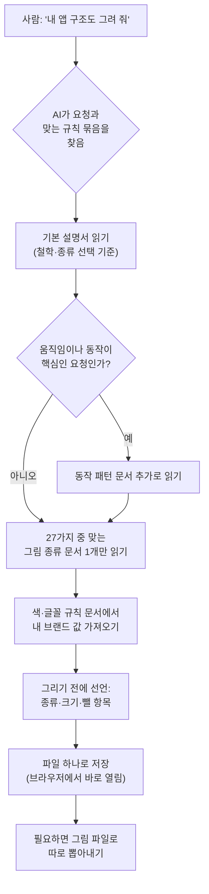

<div class="ai-knowledge-shell">

<aside class="ai-knowledge-sidebar">
  <p class="ai-eyebrow">CATEGORIES</p>
  <nav class="ai-cat-tree"><details class="ai-cat" open><summary><span class="catname">에이전트 오케스트레이션</span><span class="catcount">5</span></summary><ul><li><a href="https://altjs4510.github.io/ai_news_blog/knowledge/20260709/"><span class="kdate">2026-07-09</span><span class="ktitle">mvanhorn/last30days-skill — Reddit·X·YouTube·HN·…</span></a></li><li><a href="https://altjs4510.github.io/ai_news_blog/knowledge/20260623/"><span class="kdate">2026-06-23</span><span class="ktitle">bytedance/deer-flow — 샌드박스·메모리·서브에이전트·메시지 게이트웨이를…</span></a></li><li><a href="https://altjs4510.github.io/ai_news_blog/knowledge/20260602/"><span class="kdate">2026-06-02</span><span class="ktitle">revfactory/harness — 도메인별 에이전트 팀과 스킬을 자동 설계하는 메타…</span></a></li><li><a href="https://altjs4510.github.io/ai_news_blog/knowledge/20260529/"><span class="kdate">2026-05-29</span><span class="ktitle">Introducing dynamic workflows in Claude Code</span></a></li><li><a href="https://altjs4510.github.io/ai_news_blog/knowledge/20260507/"><span class="kdate">2026-05-07</span><span class="ktitle">ruvnet/ruflo — Claude 멀티 에이전트 오케스트레이션 플랫폼</span></a></li></ul></details><details class="ai-cat" open><summary><span class="catname">MCP &amp; 도구 통합</span><span class="catcount">18</span></summary><ul><li><a href="https://altjs4510.github.io/ai_news_blog/knowledge/20260805/"><span class="kdate">2026-08-05</span><span class="ktitle">TencentCloud/TencentDB-Agent-Memory — 대화·문서·코드를 …</span></a></li><li><a href="https://altjs4510.github.io/ai_news_blog/knowledge/20260802/"><span class="kdate">2026-08-02</span><span class="ktitle">Stateless MCP has recaptured my interest (and in…</span></a></li><li><a href="https://altjs4510.github.io/ai_news_blog/knowledge/20260801/"><span class="kdate">2026-08-01</span><span class="ktitle">different-ai/openwork — Claude Cowork의 오픈소스 대체 에…</span></a></li><li><a href="https://altjs4510.github.io/ai_news_blog/knowledge/20260731/"><span class="kdate">2026-07-31</span><span class="ktitle">different-ai/openwork — Claude Cowork의 오픈소스 대안(o…</span></a></li><li><a href="https://altjs4510.github.io/ai_news_blog/knowledge/20260729/"><span class="kdate">2026-07-29</span><span class="ktitle">Bringing MCP 2026-07-28 to Claude</span></a></li><li><a href="https://altjs4510.github.io/ai_news_blog/knowledge/20260719/"><span class="kdate">2026-07-19</span><span class="ktitle">tirth8205/code-review-graph — 로컬 우선 코드 인텔리전스 그래프…</span></a></li><li><a href="https://altjs4510.github.io/ai_news_blog/knowledge/20260718/"><span class="kdate">2026-07-18</span><span class="ktitle">tirth8205/code-review-graph — MCP·CLI용 로컬 코드 인텔리…</span></a></li><li><a href="https://altjs4510.github.io/ai_news_blog/knowledge/20260708/"><span class="kdate">2026-07-08</span><span class="ktitle">Expanding Managed Agents in Gemini API: backgrou…</span></a></li><li><a href="https://altjs4510.github.io/ai_news_blog/knowledge/20260701/"><span class="kdate">2026-07-01</span><span class="ktitle">Google OKF (Open Knowledge Format) — 벤더 중립 에이전트 …</span></a></li><li><a href="https://altjs4510.github.io/ai_news_blog/knowledge/20260618/"><span class="kdate">2026-06-18</span><span class="ktitle">DeusData/codebase-memory-mcp — 158개 언어 코드베이스를 밀리…</span></a></li><li><a href="https://altjs4510.github.io/ai_news_blog/knowledge/20260606/"><span class="kdate">2026-06-06</span><span class="ktitle">chopratejas/headroom — Compress tool outputs, lo…</span></a></li><li><a href="https://altjs4510.github.io/ai_news_blog/knowledge/20260605/"><span class="kdate">2026-06-05</span><span class="ktitle">chopratejas/headroom — Compress tool outputs, lo…</span></a></li><li><a href="https://altjs4510.github.io/ai_news_blog/knowledge/20260604/"><span class="kdate">2026-06-04</span><span class="ktitle">chopratejas/headroom — Compress tool outputs bef…</span></a></li><li><a href="https://altjs4510.github.io/ai_news_blog/knowledge/20260603/"><span class="kdate">2026-06-03</span><span class="ktitle">How Bad MCP design cost your Agent 5× more token…</span></a></li><li><a href="https://altjs4510.github.io/ai_news_blog/knowledge/20260526/"><span class="kdate">2026-05-26</span><span class="ktitle">colbymchenry/codegraph — Pre-indexed code knowle…</span></a></li><li><a href="https://altjs4510.github.io/ai_news_blog/knowledge/20260523/"><span class="kdate">2026-05-23</span><span class="ktitle">colbymchenry/codegraph — 사전 인덱싱된 코드 지식 그래프 MCP</span></a></li><li><a href="https://altjs4510.github.io/ai_news_blog/knowledge/20260517/"><span class="kdate">2026-05-17</span><span class="ktitle">I gave my LLM 100,000+ tools — Lazy Discovery &a…</span></a></li><li><a href="https://altjs4510.github.io/ai_news_blog/knowledge/20260509/"><span class="kdate">2026-05-09</span><span class="ktitle">How to connect 100 MCP servers without the conte…</span></a></li></ul></details><details class="ai-cat" open><summary><span class="catname">코딩 에이전트</span><span class="catcount">25</span></summary><ul><li><a href="https://altjs4510.github.io/ai_news_blog/knowledge/20260819/"><span class="kdate">2026-08-19</span><span class="ktitle">akitaonrails/ai-memory — 코딩 에이전트 CLI 간 장기 기억과 벤더…</span></a></li><li><a href="https://altjs4510.github.io/ai_news_blog/knowledge/20260814/" class="current"><span class="kdate">2026-08-14</span><span class="ktitle">cathrynlavery/diagram-design — Claude Code용 에디토리…</span></a></li><li><a href="https://altjs4510.github.io/ai_news_blog/knowledge/20260811/"><span class="kdate">2026-08-11</span><span class="ktitle">PrimeIntellect-ai/prime-agent — 장기 자율 실행을 전제로 설계…</span></a></li><li><a href="https://altjs4510.github.io/ai_news_blog/knowledge/20260810/"><span class="kdate">2026-08-10</span><span class="ktitle">Auto mode is now the default in Claude Code for …</span></a></li><li><a href="https://altjs4510.github.io/ai_news_blog/knowledge/20260809/"><span class="kdate">2026-08-09</span><span class="ktitle">PrimeIntellect-ai/prime-agent — 코딩 워크플로우·장기 자율 작…</span></a></li><li><a href="https://altjs4510.github.io/ai_news_blog/knowledge/20260808/"><span class="kdate">2026-08-08</span><span class="ktitle">PrimeIntellect-ai/prime-agent — 코딩 워크플로우와 장시간 자율…</span></a></li><li><a href="https://altjs4510.github.io/ai_news_blog/knowledge/20260804/"><span class="kdate">2026-08-04</span><span class="ktitle">esengine/DeepSeek-Reasonix — prefix-cache 안정성을 축…</span></a></li><li><a href="https://altjs4510.github.io/ai_news_blog/knowledge/20260728/"><span class="kdate">2026-07-28</span><span class="ktitle">alibaba/open-code-review — 결정론적 파이프라인 + LLM 에이전트…</span></a></li><li><a href="https://altjs4510.github.io/ai_news_blog/knowledge/20260725/"><span class="kdate">2026-07-25</span><span class="ktitle">The new rules of context engineering for Claude …</span></a></li><li><a href="https://altjs4510.github.io/ai_news_blog/knowledge/20260722/"><span class="kdate">2026-07-22</span><span class="ktitle">tirth8205/code-review-graph — MCP·CLI용 로컬 우선 코드 …</span></a></li><li><a href="https://altjs4510.github.io/ai_news_blog/knowledge/20260721/"><span class="kdate">2026-07-21</span><span class="ktitle">tirth8205/code-review-graph — 로컬 우선 코드 인텔리전스 그래프…</span></a></li><li><a href="https://altjs4510.github.io/ai_news_blog/knowledge/20260714/"><span class="kdate">2026-07-14</span><span class="ktitle">Graphify-Labs/graphify — 코드베이스를 질의 가능한 지식 그래프로 만…</span></a></li><li><a href="https://altjs4510.github.io/ai_news_blog/knowledge/20260707/"><span class="kdate">2026-07-07</span><span class="ktitle">AI Hero Skills Catalog — 실무 엔지니어를 위한 재사용 가능한 판단 …</span></a></li><li><a href="https://altjs4510.github.io/ai_news_blog/knowledge/20260705/"><span class="kdate">2026-07-05</span><span class="ktitle">openai/codex-plugin-cc — Claude Code에서 Codex를 위임…</span></a></li><li><a href="https://altjs4510.github.io/ai_news_blog/knowledge/20260626/"><span class="kdate">2026-06-26</span><span class="ktitle">google-labs-code/design.md — 코딩 에이전트에게 디자인 시스템을 …</span></a></li><li><a href="https://altjs4510.github.io/ai_news_blog/knowledge/20260619/"><span class="kdate">2026-06-19</span><span class="ktitle">Claude Code now supports artifacts</span></a></li><li><a href="https://altjs4510.github.io/ai_news_blog/knowledge/20260530/"><span class="kdate">2026-05-30</span><span class="ktitle">Leonxlnx/taste-skill — AI에게 좋은 취향을 부여해 generic s…</span></a></li><li><a href="https://altjs4510.github.io/ai_news_blog/knowledge/20260528/"><span class="kdate">2026-05-28</span><span class="ktitle">Building self-improving tax agents with Codex</span></a></li><li><a href="https://altjs4510.github.io/ai_news_blog/knowledge/20260524/"><span class="kdate">2026-05-24</span><span class="ktitle">colbymchenry/codegraph — Pre-indexed code knowle…</span></a></li><li><a href="https://altjs4510.github.io/ai_news_blog/knowledge/20260521/"><span class="kdate">2026-05-21</span><span class="ktitle">colbymchenry/codegraph — Pre-indexed code knowle…</span></a></li><li><a href="https://altjs4510.github.io/ai_news_blog/knowledge/20260512/"><span class="kdate">2026-05-12</span><span class="ktitle">agentmemory — Persistent memory for AI coding ag…</span></a></li><li><a href="https://altjs4510.github.io/ai_news_blog/knowledge/20260510/"><span class="kdate">2026-05-10</span><span class="ktitle">addyosmani/agent-skills — Production-grade engin…</span></a></li><li><a href="https://altjs4510.github.io/ai_news_blog/knowledge/20260508/"><span class="kdate">2026-05-08</span><span class="ktitle">addyosmani/agent-skills — Production-grade engin…</span></a></li><li><a href="https://altjs4510.github.io/ai_news_blog/knowledge/20260506/"><span class="kdate">2026-05-06</span><span class="ktitle">mksglu/context-mode — AI 코딩 에이전트용 컨텍스트 윈도우 최적화</span></a></li><li><a href="https://altjs4510.github.io/ai_news_blog/knowledge/20260505/"><span class="kdate">2026-05-05</span><span class="ktitle">mattpocock/skills — Skills for Real Engineers (.…</span></a></li></ul></details><details class="ai-cat" open><summary><span class="catname">모델 &amp; 연구</span><span class="catcount">6</span></summary><ul><li><a href="https://altjs4510.github.io/ai_news_blog/knowledge/20260717/"><span class="kdate">2026-07-17</span><span class="ktitle">After a year building agent memory, 'save everyt…</span></a></li><li><a href="https://altjs4510.github.io/ai_news_blog/knowledge/20260716-proprag/"><span class="kdate">2026-07-16</span><span class="ktitle">PropRAG — 프로포지션 경로 위 beam search로 멀티홉 검색 안내</span></a></li><li><a href="https://altjs4510.github.io/ai_news_blog/knowledge/20260620/"><span class="kdate">2026-06-20</span><span class="ktitle">zai-org/GLM-5 — From Vibe Coding to Agentic Engi…</span></a></li><li><a href="https://altjs4510.github.io/ai_news_blog/knowledge/20260617/"><span class="kdate">2026-06-17</span><span class="ktitle">Predicting model behavior before release by simu…</span></a></li><li><a href="https://altjs4510.github.io/ai_news_blog/knowledge/20260516/"><span class="kdate">2026-05-16</span><span class="ktitle">STALE — 에이전트가 자기 기억의 유효성을 인지할 수 있는가</span></a></li><li><a href="https://altjs4510.github.io/ai_news_blog/knowledge/20260513/"><span class="kdate">2026-05-13</span><span class="ktitle">Thinking Machines' Native Interaction Models — T…</span></a></li></ul></details><details class="ai-cat" open><summary><span class="catname">인프라 &amp; 컴퓨트</span><span class="catcount">8</span></summary><ul><li><a href="https://altjs4510.github.io/ai_news_blog/knowledge/20260813/"><span class="kdate">2026-08-13</span><span class="ktitle">semantica-agi/semantica — 컨텍스트와 책임 추적을 위한 그래프 네이…</span></a></li><li><a href="https://altjs4510.github.io/ai_news_blog/knowledge/20260812/"><span class="kdate">2026-08-12</span><span class="ktitle">semantica-agi/semantica — 컨텍스트와 '책임 추적 가능한(accou…</span></a></li><li><a href="https://altjs4510.github.io/ai_news_blog/knowledge/20260806/"><span class="kdate">2026-08-06</span><span class="ktitle">cloudflare/computer — 에이전트에게 컴퓨터를 통째로 주는 엣지 실행 샌…</span></a></li><li><a href="https://altjs4510.github.io/ai_news_blog/knowledge/20260724/"><span class="kdate">2026-07-24</span><span class="ktitle">diegosouzapw/OmniRoute — 단일 엔드포인트로 278+ 프로바이더·50…</span></a></li><li><a href="https://altjs4510.github.io/ai_news_blog/knowledge/20260723/"><span class="kdate">2026-07-23</span><span class="ktitle">diegosouzapw/OmniRoute — 268+ 프로바이더를 단일 엔드포인트로 묶…</span></a></li><li><a href="https://altjs4510.github.io/ai_news_blog/knowledge/20260611/"><span class="kdate">2026-06-11</span><span class="ktitle">The evolution of agentic surfaces: building with…</span></a></li><li><a href="https://altjs4510.github.io/ai_news_blog/knowledge/20260522/"><span class="kdate">2026-05-22</span><span class="ktitle">Giving Agents Computers — Ivan Burazin, Daytona</span></a></li><li><a href="https://altjs4510.github.io/ai_news_blog/knowledge/20260520/"><span class="kdate">2026-05-20</span><span class="ktitle">New in Claude Managed Agents: self-hosted sandbo…</span></a></li></ul></details><details class="ai-cat" open><summary><span class="catname">보안 &amp; 거버넌스</span><span class="catcount">15</span></summary><ul><li><a href="https://altjs4510.github.io/ai_news_blog/knowledge/20260730/"><span class="kdate">2026-07-30</span><span class="ktitle">Anatomy of a Frontier Lab Agent Intrusion: A Tec…</span></a></li><li><a href="https://altjs4510.github.io/ai_news_blog/knowledge/20260716/"><span class="kdate">2026-07-16</span><span class="ktitle">Dicklesworthstone/destructive_command_guard — 에이…</span></a></li><li><a href="https://altjs4510.github.io/ai_news_blog/knowledge/20260715/"><span class="kdate">2026-07-15</span><span class="ktitle">Dicklesworthstone/destructive_command_guard — 에이…</span></a></li><li><a href="https://altjs4510.github.io/ai_news_blog/knowledge/20260710/"><span class="kdate">2026-07-10</span><span class="ktitle">70개 MCP 서버 strace 런타임 감사 — 부팅 시 아웃바운드 호출 서버 적발</span></a></li><li><a href="https://altjs4510.github.io/ai_news_blog/knowledge/20260704/"><span class="kdate">2026-07-04</span><span class="ktitle">Cloudflare is about to block AI agents by defaul…</span></a></li><li><a href="https://altjs4510.github.io/ai_news_blog/knowledge/20260703/"><span class="kdate">2026-07-03</span><span class="ktitle">Giving admins more visibility and control over C…</span></a></li><li><a href="https://altjs4510.github.io/ai_news_blog/knowledge/20260630/"><span class="kdate">2026-06-30</span><span class="ktitle">Introducing the Claude apps gateway for Amazon B…</span></a></li><li><a href="https://altjs4510.github.io/ai_news_blog/knowledge/20260625/"><span class="kdate">2026-06-25</span><span class="ktitle">Agent identity in Claude Tag: a new access model…</span></a></li><li><a href="https://altjs4510.github.io/ai_news_blog/knowledge/20260624/"><span class="kdate">2026-06-24</span><span class="ktitle">Agent identity in Claude Tag: a new access model…</span></a></li><li><a href="https://altjs4510.github.io/ai_news_blog/knowledge/20260614/"><span class="kdate">2026-06-14</span><span class="ktitle">NVIDIA/SkillSpector — Security scanner for AI ag…</span></a></li><li><a href="https://altjs4510.github.io/ai_news_blog/knowledge/20260613/"><span class="kdate">2026-06-13</span><span class="ktitle">Fable 5's guardrails got bypassed in 48 hours — …</span></a></li><li><a href="https://altjs4510.github.io/ai_news_blog/knowledge/20260612/"><span class="kdate">2026-06-12</span><span class="ktitle">NVIDIA/SkillSpector — AI 에이전트 스킬용 보안 스캐너</span></a></li><li><a href="https://altjs4510.github.io/ai_news_blog/knowledge/20260607/"><span class="kdate">2026-06-07</span><span class="ktitle">OpenAI Help: Lockdown Mode</span></a></li><li><a href="https://altjs4510.github.io/ai_news_blog/knowledge/20260531/"><span class="kdate">2026-05-31</span><span class="ktitle">How we contain Claude across products</span></a></li><li><a href="https://altjs4510.github.io/ai_news_blog/knowledge/20260527/"><span class="kdate">2026-05-27</span><span class="ktitle">Microsoft Copilot Cowork Exfiltrates Files</span></a></li></ul></details><details class="ai-cat" open><summary><span class="catname">응용 사례</span><span class="catcount">6</span></summary><ul><li><a href="https://altjs4510.github.io/ai_news_blog/knowledge/20260726/"><span class="kdate">2026-07-26</span><span class="ktitle">citrolabs/ego-lite — 로그인된 브라우저 상태를 AI 에이전트와 공유하는…</span></a></li><li><a href="https://altjs4510.github.io/ai_news_blog/knowledge/20260712/"><span class="kdate">2026-07-12</span><span class="ktitle">Do Automated Evals Work?</span></a></li><li><a href="https://altjs4510.github.io/ai_news_blog/knowledge/20260621/"><span class="kdate">2026-06-21</span><span class="ktitle">calesthio/OpenMontage — 12 파이프라인·52 도구·500+ 스킬을 …</span></a></li><li><a href="https://altjs4510.github.io/ai_news_blog/knowledge/20260609/"><span class="kdate">2026-06-09</span><span class="ktitle">Building intelligent apps for Apple platforms wi…</span></a></li><li><a href="https://altjs4510.github.io/ai_news_blog/knowledge/20260515/"><span class="kdate">2026-05-15</span><span class="ktitle">Clawdmeter — Claude Code 사용량을 데스크톱 대시보드로</span></a></li><li><a href="https://altjs4510.github.io/ai_news_blog/knowledge/20260514/"><span class="kdate">2026-05-14</span><span class="ktitle">Introducing Claude for Small Business</span></a></li></ul></details><details class="ai-cat" open><summary><span class="catname">산업 동향</span><span class="catcount">6</span></summary><ul><li><a href="https://altjs4510.github.io/ai_news_blog/knowledge/20260711/"><span class="kdate">2026-07-11</span><span class="ktitle">OpenAI says GPT 5.6 is the 'preferred model' for…</span></a></li><li><a href="https://altjs4510.github.io/ai_news_blog/knowledge/20260702/"><span class="kdate">2026-07-02</span><span class="ktitle">How Cursor deploys AI inside the enterprise (For…</span></a></li><li><a href="https://altjs4510.github.io/ai_news_blog/knowledge/20260616/"><span class="kdate">2026-06-16</span><span class="ktitle">Why AI hasn't replaced software engineers, and w…</span></a></li><li><a href="https://altjs4510.github.io/ai_news_blog/knowledge/20260610/"><span class="kdate">2026-06-10</span><span class="ktitle">Fable 5 just made cost-aware model routing manda…</span></a></li><li><a href="https://altjs4510.github.io/ai_news_blog/knowledge/20260519/"><span class="kdate">2026-05-19</span><span class="ktitle">Anthropic acquires Stainless</span></a></li><li><a href="https://altjs4510.github.io/ai_news_blog/knowledge/20260504/"><span class="kdate">2026-05-04</span><span class="ktitle">Agents for Everything Else: Codex for Knowledge …</span></a></li></ul></details></nav>
</aside>

<article class="ai-knowledge-article">

<header class="ai-post-hero">
  <p class="ai-eyebrow"><a class="ai-back" href="../">KNOWLEDGE</a> · 2026-08-14 · 오늘의 학습</p>
  <h2 class="ai-post-title">cathrynlavery/diagram-design — Claude Code용 에디토리얼 다이어그램 29종 스킬 팩 (자체완결 HTML+SVG, Mermaid 없음)</h2>
</header>

> 원문: [cathrynlavery/diagram-design — Claude Code용 에디토리얼 다이어그램 29종 스킬 팩 (자체완결 HTML+SVG, Mermaid 없음)](https://github.com/cathrynlavery/diagram-design)

## 📌 학습 정리

### 1. 한 줄로 말하면

글이나 자료에 넣을 도표를 만들 때, 매번 "동그란 네모 박스" 같은 뻔한 그림 대신 내 사이트/브랜드 결에 맞는 그림이 나오도록 미리 규칙을 정해 둔 도구예요. 코딩을 돕는 AI 비서에게 "이런 규칙으로만 도표를 그려라"라고 적어 준 설명서 묶음이라고 보면 됩니다.

### 2. 왜 이게 만들어졌어요?

만든 사람은 글을 자주 쓰는데, 글마다 구조도나 흐름도가 필요했다고 해요. AI에게 도표를 부탁하면 사이트 분위기와 전혀 안 맞는 평범한 둥근 박스 그림이 돌아왔고, 그렇다고 디자인 도구를 켜면 30분씩 붙잡혀 있게 되니 결국 도표를 아예 빼 버리는 일이 반복됐다고 합니다. 그래서 "매번 다시 설명하지 말고, 도표에 관한 판단 규칙 자체를 AI가 읽는 문서로 못 박아 두자"는 쪽으로 방향을 잡았습니다. 그림 종류는 27가지로 미리 정하고, 결과물은 브라우저에서 바로 열리는 파일 하나로 떨어지게 했고, 색과 글꼴은 내 웹사이트에서 읽어 와 맞추게 했어요. 밀도 목표를 4/10으로 두고 "가장 좋은 개선은 대개 삭제"라고 적어 둔 것도, 도표가 복잡해지는 걸 규칙으로 막으려는 의도로 보입니다.

### 3. 비유로 풀면

**하나.** 사내 문서 서식집 같은 거예요. 누가 보고서를 쓰든 표지·글꼴·머리말 규격이 정해져 있으면 결과물이 알아서 비슷한 결로 나오죠. 여기서는 그 서식집을 사람이 아니라 AI가 읽습니다.

**둘.** 요리 레시피 카드 상자에도 가깝습니다. 칸마다 "볶음면 만들기", "수프 만들기" 카드가 따로 들어 있어서, 볶음면을 만들 때 수프 카드까지 꺼내 읽지는 않아요. 이 도구도 "흐름도 그려 줘"라고 하면 흐름도 카드 한 장만 꺼내 읽습니다.

그래서 결국, AI에게 매번 취향을 설명하는 대화 대신 **버전이 붙고 설치·배포되는 규격 문서 묶음**을 쥐여 주는 방식이라고 보면 됩니다.

### 4. 어떻게 작동하는지 (그림으로)



핵심은 "필요한 것만 그때 읽는다"는 점이에요. AI는 처음엔 이 도구의 이름과 한 줄 설명만 알고 있고, 요청이 들어와 맞아떨어질 때 기본 설명서를 읽고, 거기서 정한 그림 종류의 문서 딱 하나를 더 읽습니다. 그래서 종류가 27개든 더 늘어나든 AI가 한 번에 읽는 양은 늘지 않는 구조입니다.

또 하나 눈에 띄는 건 "내 브랜드 맞추기" 단계입니다. 웹사이트 주소를 알려 주면 홈페이지를 읽어 배경색·본문색·강조색·글꼴을 뽑아내 규칙 문서에 써 주고, 그 뒤로 만드는 모든 도표가 그 값을 따릅니다. 이때 어떤 주소에서 무엇을 뽑았는지 내역을 함께 보여 주고, 작은 글자 크기에서 글씨가 안 읽힐 만한 색이면 조정안을 제안한다고 합니다.

### 5. 처음 보는 용어 풀이

- **에이전트 스킬 (Agent Skill)** — AI 비서에게 "이런 요청이 오면 이 문서를 읽고 이렇게 처리해라"를 적어 둔 설명서 묶음이에요. 대화창에 매번 요구사항을 복붙하는 대신, 설치해 두고 재사용하는 형태라는 점이 다릅니다.
- **자체 완결 HTML (self-contained HTML)** — 그림에 필요한 모든 게 파일 하나 안에 들어 있는 결과물이에요. 별도 빌드 과정이나 외부 이미지 없이, 파일을 더블클릭하면 브라우저에서 바로 열립니다.
- **SVG** — 점·선·도형의 좌표를 글자로 적어 두는 그림 형식이에요. 사진처럼 픽셀을 저장하지 않아 아무리 확대해도 흐려지지 않고, 나중에 색만 바꿔 끼우기도 쉽습니다.
- **머메이드 (Mermaid) / draw.io** — 도표를 만드는 데 널리 쓰이는 기존 방식들이에요. 머메이드는 글로 적으면 그림이 되는 문법, draw.io는 마우스로 박스를 끌어다 그리는 도구입니다. 이 도구는 그 결과물을 읽어서 자기 디자인 규칙으로 **다시 그려** 줍니다.
- **점진적 공개 (progressive disclosure)** — 정보를 한꺼번에 펼치지 않고 필요할 때 단계적으로 꺼내는 방식이에요. 여기서는 AI가 읽는 문서 양을 요청에 맞게 최소로 유지하는 장치로 쓰입니다.
- **웹 접근성 기준 AA (WCAG AA)** — 글자와 배경의 밝기 차이가 충분한지 등을 정해 둔 국제 권고 기준이에요. 이 도구는 색을 확정하기 전에 이 기준을 자동으로 확인하고, 통과하지 못하면 대안을 제안합니다.
- **움직임 줄이기 설정 (prefers-reduced-motion)** — 화면 애니메이션이 불편한 사용자를 위해 운영체제에 켜 두는 설정이에요. 이 값이 켜져 있으면 애니메이션 대신 완성된 정지 화면을 보여 주도록 규칙에 넣어 뒀습니다.
- **충실도 원장 (fidelity ledger)** — 기존 도표를 다시 그릴 때, 무엇을 합치고 접고 버렸는지 남기는 기록이에요. 원본과 달라진 부분을 사람이 확인할 수 있게 하려는 장치입니다.

### 6. 한 발 더 들어가고 싶다면

- [cathrynlavery.github.io/diagram-design](https://cathrynlavery.github.io/diagram-design) — 27가지 도표를 밝은 화면·어두운 화면·편집디자인 버전으로 실제로 넘겨 볼 수 있어요. 말로 읽는 것보다 여기서 결을 보는 게 빠릅니다.
- [저장소 원문](https://github.com/cathrynlavery/diagram-design) — 설치 명령, 폴더 구조, 검증 절차가 모두 적혀 있어요. 규칙 문서가 실제로 어떻게 쪼개져 있는지 보고 싶을 때 참고할 만합니다.
- [Tabler Icons](https://tabler.io/icons) — 이 도구가 구조도용 아이콘 55개를 가져다 쓴 무료 아이콘 모음이에요. 라이선스가 자유로운 아이콘 세트를 찾을 때 쓸 수 있습니다.
- [Simple Icons](https://simpleicons.org) — 서비스·브랜드 로고 실루엣 모음으로, 아이콘 중 브랜드 부분의 출처예요. 클라우드·개발 도구 로고가 필요할 때 유용합니다.
- [littlemight.com](https://littlemight.com) — 만든 사람이 AI와 디자인에 대해 쓰는 블로그예요. 이 도구가 어떤 글쓰기 맥락에서 필요해졌는지 짐작해 볼 수 있습니다.

---

## 📖 원문 전체 번역 (정독용)

> 의역 최소화한 전체 번역입니다. 큰 흐름은 위 정리에서 잡고, 정확한 워딩이 필요할 땐 이 섹션에서 정독하세요.

### 원문 전체 완역 (정독용)

# Diagram Design

디자이너가 싫어하지 않을 에디토리얼 다이어그램.

2.0의 새 기능 — 루프(the Loop): 공유 메모리 허브가 있는 플라이휠. 점선은 write-back(되쓰기)이다.

2.3의 새 기능: 시맨틱 시스템 패턴과 선택적 접근성 모션이 추가되었으며, 정적 출력이 여전히 기본값이다.

27개 시각 타입. Claude Code, Codex, Pi 용 단일 에이전트 스킬. 시맨틱 패턴은 동작(behavior)을 레이아웃과 별개로 기술하므로, 큐(queue), 정책 추적(policy trace), 신뢰 경계(trust boundary) 같은 것도 타입 수를 늘리지 않고 가장 가까운 기존 타입을 쓸 수 있다. 정적 HTML이 여전히 기본값이며, 순서가 있는 설명을 위한 선택적 모션도 사용할 수 있다. 이 스킬은 또한 draw.io나 Mermaid 소스를 원하는 포맷·크기·디테일 수준으로 다시 그려준다.

Figma 없음. 일반적인 둥근 모서리 박스 없음. 30분짜리 색상 고르기 세션 없음.

## 만든 이유

나는 littlemight.com 에 글을 쓰고 있고(그리고 부업으로 BestSelf.co 를 운영한다). 다이어그램이 필요할 때마다 — 아키텍처 스케치, 플로우차트, 무엇이 가장 중요한지 보여주는 피라미드든 — Claude에게 물어보면 사이트의 나머지 부분과 전혀 안 어울리는, 흔해 빠진 둥근 박스짜리 결과물을 돌려받곤 했다. 그러면 Figma와 30분간 씨름하거나, 아니면 그냥 다이어그램을 포기했다.

그래서 이걸 위한 Claude Code 스킬을 만들었다. 27가지 시각 타입, 에디토리얼 품질, 당신의 웹사이트를 읽어서 60초 만에 당신의 브랜드에 맞춘다.

가장 고품질의 조치는 대개 삭제다.

모든 노드는 자기 자리를 정당화해야 한다. 강조 색상은 독자가 가장 먼저 봐야 할 1~2가지에만 예약된다. 목표 밀도: 10점 만점에 4점.

## 만드는 것

27가지 시각 타입 모두 세 가지 정적 변형(minimal light, minimal dark, full-editorial)으로 제공된다. 이 중 어느 것이든 브라우저에서 바로 열 수 있다. 빌드 단계도, JavaScript도, 외부 이미지 의존성도 없다.

- Architecture — 컴포넌트 + 연결
- Flowchart — 의사결정 로직
- Sequence — 시간에 따른 메시지
- State machine — 상태 + 전이
- ER / data model — 엔티티 + 필드
- Timeline — 축 위의 이벤트
- Swimlane — 부서/기능 간 흐름
- Quadrant — 2축 포지셔닝
- Nested — 포함 관계에 의한 계층
- Tree — 부모 → 자식
- Org chart — 소유 관계 + 라우팅
- Venn — 집합 중첩
- Layer stack — 계층화된 추상화
- Pyramid / funnel — 랭크형 계층 또는 이탈(drop-off)
- Consultant 2×2 — 시나리오 매트릭스 · 이름 붙은 셀
- Radar / Spider — 다축 비교
- Loop — 플라이휠 · 허브를 둘러싼 스테이션들
- IT current-state — 레거시 랜드스케이프 · 현대화
- High-Level — 클러스터 위의 엔드투엔드 스택
- Bar chart — 범주형 비교
- Line chart — 시간에 따른 추세
- Gantt — 타임라인 위의 작업 및 단계
- Scatter plot — 분포와 상관관계
- Process — 다중 행위자(multi-actor) 순차 워크플로
- Medallion — 다계층 데이터 저장
- Data flow — 역할 범위가 지정된 파이프라인 단계
- DP integration — 소스 → 코어 → 소비자
- DP security matrix — 역할별 접근 권한

라이브 갤러리 둘러보기: cathrynlavery.github.io/diagram-design — 또는 skills/diagram-design/assets/index.html 을 로컬에서 열어 light / dark / full-editorial 탭으로 27개 다이어그램을 모두 넘겨보라.

## 설치

**Claude Code:**
```
/plugin marketplace add cathrynlavery/diagram-design
/plugin install diagram-design@diagram-design
```
그다음 자동 업데이트를 한 번 활성화하라: `/plugin` 을 실행하고, `Marketplaces` 를 연 뒤, `diagram-design` 을 선택하고, `Enable auto-update` 를 고른다. Claude Code는 서드파티 마켓플레이스에 대해 기본적으로 자동 업데이트를 비활성화해 두는데, 이 토글을 켜면 시작 후 백그라운드에서 마켓플레이스와 설치된 플러그인을 새로고침한다. 요청이 뜨면 `/reload-plugins` 를 실행하거나, 다음 세션이 업데이트를 로드하도록 둔다.

**Codex:**
```
codex plugin marketplace add cathrynlavery/diagram-design
codex plugin add diagram-design@diagram-design
```
Codex는 시작 시 구성된 Git 마켓플레이스를 새로고침한다. 즉시 가져오려면 `codex plugin marketplace upgrade diagram-design` 을 실행하고 새 세션을 시작하라.

**Claude Cowork (조직 마켓플레이스):**
조직 GitHub 마켓플레이스는 현재 프라이빗 또는 내부 저장소를 요구하므로, 먼저 이 공개 저장소를 조직 소유의 저장소로 미러링해야 한다. `Organization settings → Plugins` 에서 `Add plugin → GitHub` 를 선택하고 그 미러를 연결한 뒤, 마켓플레이스 메뉴에서 `Sync automatically` 를 활성화한다. 자동 동기화는 플러그인 버전 범프를 포함한 풀 리퀘스트가 미러의 기본 브랜치에 머지될 때 실행된다 — 직접 push는 웹훅을 트리거하지 않는다. 그 결과로 생긴 조직 마켓플레이스에서 Diagram Design을 설치하라.

**Pi:**
```
pi install https://github.com/cathrynlavery/diagram-design
```
열려 있는 Pi 세션에서 `/reload` 를 실행하라. Pi는 매칭되는 다이어그램 요청에 대해 이 스킬을 사용 가능하게 만든다 — 명시적으로 호출하려면 `/skill:diagram-design` 을 사용하라. Pi는 또한 `/export-diagram` 프롬프트 템플릿도 로드한다. 고정(pin)되지 않은 Git 설치는 의도된 것이다 — Pi에는 자동 패키지 새로고침이 없으므로, 머지된 업데이트를 받으려면 `pi update --extensions` 를 실행하라.

**일회성 마이그레이션:** 기존의 독립형(standalone) `npx skills add` 사본은 Codex 마켓플레이스를 자동으로 따라가지 않는다. 그 독립형 사본을 제거한 뒤 위의 Codex 마켓플레이스 명령을 사용하라. 마찬가지로, 개인용 Cowork 사본을 제거하고 조직의 마켓플레이스에서 Diagram Design을 재설치하라. 이후의 마켓플레이스 버전 범프는 각 클라이언트의 네이티브 업데이트 경로를 통해 자동으로 흘러들어온다.

## 편집 가능한 설치

관리형 설치는 편리하지만, `references/style-guide.md` 에 대한 변경은 패키지 업데이트로 인해 덮어써질 수 있다. 스타일 가이드를 커스터마이즈할 계획이라면 레포를 클론하고 로컬 경로를 설치하라:

```
git clone git@github.com:cathrynlavery/diagram-design.git ~/code/diagram-design

# Pi: 체크아웃을 로컬 패키지로 등록
pi install ~/code/diagram-design

# Claude Code: 내부 스킬을 심링크
ln -s ~/code/diagram-design/skills/diagram-design ~/.claude/skills/diagram-design
```

공유되는 스킬은 `skills/diagram-design/` 에 위치한다. Pi는 레포의 표준 `skills/` 패키지 디렉토리를 통해 이를 발견한다. Claude Code, Codex, 그리고 그 외 Agent Skills 호환 도구들도 동일한 파일들을 사용한다.

## 온보딩 — 당신의 브랜드처럼 보이게 만들기

핵심 포인트: 범용 템플릿이 아니라 당신의 색상과 타이포그래피로 에디토리얼 품질의 다이어그램을 만드는 것.

기본 설정으로는, 다이어그램이 깔끔한 jet-black + atomic-tangerine 팔레트(white-smoke 종이, jet-black 잉크, atomic-tangerine 강조색, blue-slate 무채색, silver 헤어라인)로 렌더링된다. 바로 스크린샷으로 써도 충분히 괜찮다. 하지만 60초짜리 온보딩이 더 낫다 — 스킬이 당신의 웹사이트에서 브랜드를 뽑아내 모든 다이어그램에 적용해준다.

### 흐름

```
You:     "onboard diagram-design to https://yoursite.com"
Agent:   → 홈페이지를 fetch
         → 지배적인 팔레트 + 폰트 스택을 추출
         → 감지된 값들을 시맨틱 역할에 매핑:
             paper, ink, muted, accent, link
         → 제안된 diff를 보여줌
         → references/style-guide.md 에 당신의 토큰을 기록
You:     "yes, apply it"
```

이제 모든 새 다이어그램은 당신의 색상을 사용한다. 당신 웹사이트의 종이색(paper color)이 다이어그램 배경이 된다. 당신의 CTA 색상이 초점 강조색(focal accent)이 된다. 당신의 본문 폰트 스택이 노드 라벨 폰트가 된다.

브랜드 매칭은 또한 충실도 영수증(fidelity receipt)을 발행한다: 샘플링된 URL, 정확한 색상 역할, 폰트 패밀리와 굵기(weight), 폰트 소스 URL, 그리고 폴백 여부. 공개 사이트 폰트는 직접 사용되며 렌더링 후 검증되고, 조용히 일반 시스템 폰트로 대체되지 않는다.

### 무엇이 추출되는가

| 사이트에서 감지된 것 | 되는 것 |
|---|---|
| `<body>` 배경 | `paper` 토큰 |
| 주요 텍스트 색상 | `ink` 토큰 |
| 보조/캡션 텍스트 | `muted` 토큰 |
| 카드나 컨테이너 | `paper-2` 토큰 |
| 가장 많이 쓰인 브랜드 색상(CTA, 링크, 헤딩) | `accent` 토큰 |
| `<h1>` 폰트 패밀리 | `title` 폰트 |
| `<body>` 폰트 패밀리 | `node-name` 폰트 |
| `<code>`/`<pre>` 폰트 | `sublabel` 폰트 |

### 대비 체크는 자동으로 이루어진다

토큰을 기록하기 전에, 스킬은 `paper` 위의 `ink` 에 대해 WCAG AA 대비를 검증한다. 만약 당신 사이트의 어떤 색상이 다이어그램 크기(9~12px)에서 대비 기준을 통과하지 못한다면, 조정된 값을 제안하고 그 이유를 설명한다.

### 기본적으로 접근성 지원

모든 다이어그램 템플릿은 인라인 SVG에 접근성 있는 이름과 설명을 부여한다: `role="img"`, 해석 가능한(resolving) `aria-labelledby`, 그리고 첫 자식으로 오는 `<title>`/`<desc>` 슬롯. ID는 다이어그램과 변형(variant)별로 접두사가 붙어서, 여러 SVG export가 한 페이지에 안전하게 인라인될 수 있으며 접근성 이름 ID가 중복되지 않는다. 장식용 견본 아이콘은 보조기술(assistive technology)에서 숨겨진다.

### 수동 재정의

토큰을 직접 손으로 설정하고 싶은가? `skills/diagram-design/references/style-guide.md` 를 열어 표를 수정하라. 이후 모든 것이 거기서 읽어들인다 — 27개 다이어그램 전부, 주석 프리미티브(primitive), 갤러리 모두가 시맨틱 역할 이름(`#eb6c36` 이 아니라 `accent`)을 상속받는다.

### 최초 실행 게이트

이 스킬은 기본 스킨이 적용된 다이어그램을 브랜드가 있는 프로젝트에 조용히 밀어 넣지 않는다. 새 프로젝트에서 처음 사용될 때, `style-guide.md` 가 커스터마이즈되었는지 확인한다. 그렇지 않다면 멈추고 묻는다:

"This is your first diagram in this project. The style guide is still at the default. Want to run onboarding, paste tokens manually, or proceed with default?"

전체 스펙은 `skills/diagram-design/references/onboarding.md` 를 참조하라.

## 퀵스타트

```
# 클론된 체크아웃에서, 갤러리를 열어 27개 다이어그램을 모두 확인
open skills/diagram-design/assets/index.html   # macOS
xdg-open skills/diagram-design/assets/index.html   # Linux

# Claude Code, Codex, 또는 Pi에서, 다음처럼 물어보라:
# "Make me an architecture diagram of my app: frontend, backend, database, Redis cache."
# "I need a quadrant showing Q2 projects by impact vs effort."
# "Give me a sequence of a bearer call with token refresh on 401."
# (branching refresh uses the ALT combined-fragment grammar in type-sequence.md;
#  see skills/diagram-design/assets/example-sequence-oauth.html — not a full authorize-code handshake)
```

당신의 에이전트가 적절한 타입을 고르고, HTML을 만들고, 저장할 것이다. 템플릿에서 직접 시작할 수도 있다:

```
cp skills/diagram-design/assets/template.html my-diagram.html         # minimal light
cp skills/diagram-design/assets/template-full.html my-diagram.html    # editorial with summary cards
cp skills/diagram-design/assets/template-motion.html my-diagram.html  # optional accessible motion
```

## 시맨틱 패턴과 선택적 모션

동작(behavior)이 중요할 때, 스킬은 먼저 시맨틱 패턴을 고르고 그다음 시각 타입을 고른다. 라우팅되는 7가지 패턴은 팬인(fan-in) 큐와 병목, 반복되는 스테이지 슬롯, 비정형 입력 변환, 짝을 이루는 정책 추적(paired policy traces), 안전한 포장도로(secure paved roads), 거버넌스 카탈로그, 그리고 보상적 보안 계층(compensating security layers)을 커버한다. 각 패턴은 자신의 트리거, 프리미티브, 예산(budget), 안티패턴, 정적 폴백, 그리고 가장 가까운 시각 타입을 `semantic-patterns.md` 에서 정의한다.

모션은 선택 사항이며 새로운 시각 타입을 만들지 않는다. `animation.md` 는 완전한 정적 첫 프레임, 결정론적 타이밍, 그리고 상호작용이 가능할 때의 컨트롤을 갖춘 `none`, `reveal`, `step`, `loop` 모드를 정의한다. 모션 감소(reduced-motion) 출력은 완전한 정적 프레임을 보여주고 재생 컨트롤을 숨기거나 비활성화한다. 모션 HTML은 `template-motion.html` 의 정확히 검토된 컨트롤러를 사용한다 — 임의의 또는 수정된 인라인 스크립트, 원격 자산, CSS import, 실행 가능한 HTML 속성은 거부된다. 기본값은 `none` 이다: 일반적인 출력은 정적이고 스크립트가 없는 상태로 남는다. `example-policy-trace-animated.html` 이 자체 완결된 인터랙티브 예시다.

## draw.io나 Mermaid로부터 가져오기

이미 draw.io / diagrams.net 또는 Mermaid로 만든 다이어그램이 있는가? 스킬을 그 소스로 향하게 하면 다시 그려준다 — 같은 내용을, 이 디자인 시스템으로, 목적지가 필요로 하는 무엇이든에 맞춰서.

12개 노드짜리 draw.io 파일을 블로그 글용으로 balanced 디테일로 다시 그린 예. 소스의 6가지 파스텔 색상 채우기가 하나의 강조색이 되었고, 손으로 드래그한 좌표가 4px 그리드가 되었다.

```
/diagram-design:import platform.drawio
/diagram-design:import platform.drawio --size=slide-16x9 --detail=simplified --audience=executive
/diagram-design:import platform.drawio --detail=faithful --format=png --page=all
/diagram-design:import-mermaid README.md --diagram=all
/diagram-design:import-mermaid architecture.mmd --size=slide-16x9 --detail=simplified
```

또는 그냥 이렇게 물어봐도 된다: "redraw this drawio file for my deck", "make this Mermaid block editorial", 또는 "この Mermaid をスライド用にきれいにして".

draw.io가 작성하는 일반적인 컨테이너들을 읽는다 — `.drawio`, `.drawio.xml`, `.drawio.png`(임베디드 다이어그램), `.drawio.svg` — 에디터에서 base64 잡음처럼 보이는 압축된 페이로드까지 포함해서.

Mermaid의 경우, `.mmd`, `.mermaid`, 그리고 마크다운 안의 하나 이상의 펜스 처리된 `mermaid` 블록을 받아들인다. 텍스트만 파싱한다: 렌더링, JavaScript, 브라우저, 네트워크, 또는 클릭 타겟을 따라가는 동작은 없다.

### 네 가지 다이얼

포인트는 변환(conversion) 그 자체가 아니라 출력물을 그것이 가게 될 곳에 맞추는 것이다. 같은 소스 파일에서, 세 가지 다른 다이어그램이 나온다:

| 다이얼 | 옵션 | 무엇을 바꾸는가 |
|---|---|---|
| Format | `html` · `svg` · `png` · `html+png` | 산출물. Figma용 SVG, 슬라이드용 PNG, 웹용 HTML. |
| Size | `doc-inline` · `doc-wide` · `slide-16x9` · `slide-4x3` · `social-og` · `social-square` · `print-a4-landscape` · `print-letter-landscape` · `fit` | `viewBox` 와 타입 램프 — 프로젝션되는 슬라이드는 12px가 아니라 16px 노드 이름을 받는다. |
| Detail | `faithful`(≤24 노드, 구역화) · `balanced`(≤12) · `simplified`(≤7) | 고정된 강등(degrade) 사다리를 통해 소스의 얼마나 많은 부분이 살아남는가 — 장식, 그다음 중복, 그다음 리프 클러스터, 그다음 인프라 순. |
| Audience | `engineer` · `mixed` · `executive` | 개수가 아니라 문구(wording). `Auth Service / JWT · RS256 · :8443` → `Auth Service / token check` → `Sign-in`. |

모든 import는 충실도 원장(fidelity ledger)으로 끝난다 — 무엇이 병합, 축약, 또는 삭제되었는지. 당신은 소스를 알고 있으니, 어쨌든 눈치챌 것이다.

```
Detail: balanced · 12 source nodes → 8 drawn
Collapsed: "Token valid?" decision → edge label on Gateway → Auth
Dropped:   1 sticky note ("legacy path, to be retired") — unconnected in source
Kept in full: the request path (Web/Mobile → Gateway → Orders → Postgres)
```

절대 넘어가지 않는 것: 소스나 렌더러의 좌표, 소스 팔레트, 소스 폰트, draw.io의 대각선 커넥터 스파게티, 또는 Mermaid의 자동 레이아웃. 항상 넘어가는 것: 컴포넌트, 관계, 그룹핑, 방향. `references/import-drawio.md`, `references/import-mermaid.md`, `references/output-spec.md` 를 참조하라.

## PNG / SVG로 내보내기(Export)

다이어그램은 자체 완결된 HTML로 제공되지만, Figma나 슬라이드, 소셜 카드용으로 다이어그램 자체를 내보낼 수도 있다. 에이전트용 슬래시 명령을 사용하라:

**Pi:**
```
/export-diagram path/to/diagram.html
/export-diagram path/to/diagram.html --svg-only
/export-diagram path/to/diagram.html --png-only --scale=3
```

**Claude Code:**
```
/diagram-design:export path/to/diagram.html
/diagram-design:export path/to/diagram.html --svg-only
/diagram-design:export path/to/diagram.html --png-only --scale=3
```

또는 그냥 자연어로 물어봐도 된다: "Export this diagram as SVG and PNG.", "Save my-diagram.html as PNG."

**SVG** — `<svg>` 노드를 추출하고 Google Fonts를 주입해서 브라우저, Figma, Illustrator에서 독립적으로 렌더링되게 한다.

**PNG** — Playwright를 통해 기본 2배로 다이어그램을 래스터화한다. 일회성 설정: `pip install playwright && playwright install chromium`.

두 포맷 모두 다이어그램 전용이다 — `-full` 변형의 에디토리얼 카드와 헤더는 포함되지 않는다. 전체 에디토리얼 레이아웃의 스크린샷을 원한다면, 브라우저의 print-to-PDF나 전체 페이지 스크린샷을 사용하라. 전체 절차는 `skills/diagram-design/references/export.md` 를 참조하라.

모션이 활성화된 HTML의 경우, 명시적인 최종 상태를 내보내라: `?motion=static` 을 열고, `document.fonts.ready` 를 기다린 뒤, 캡처 전에 모션 루트가 `data-frame="static"` 인지 확인하라. `?motion=step&step=N` 은 명명된 중간 프레임이 요청된 경우에만 사용하라.

## 아키텍처

점진적 공개(Progressive disclosure). `SKILL.md` 는 필요할 때 동작(behavior)을 먼저 라우팅하고, 그다음 레이아웃을 라우팅한다. 시맨틱, 타입, 애니메이션 레퍼런스는 관련 있을 때만 로드된다.

```
diagram-design/
├── .agents/plugins/marketplace.json — Codex marketplace catalog
├── .claude-plugin/                  — Claude marketplace + plugin manifest
├── .codex-plugin/                   — Codex plugin manifest
├── commands/
│   ├── export-diagram.md            — Claude Code export command
│   ├── import-drawio.md             — Claude Code draw.io import command
│   └── import-mermaid.md            — Claude Code Mermaid import command
├── prompts/
│   ├── export-diagram.md            — Pi `/export-diagram` prompt template
│   └── import-mermaid.md            — Pi Mermaid import prompt template
├── skills/
│   └── diagram-design/
│       ├── SKILL.md                 — philosophy, selection guide, checklist
│       ├── references/              — loaded only when a type or primitive is chosen
│       │   ├── style-guide.md       — single source of truth for colors + fonts
│       │   ├── semantic-patterns.md — behavior patterns independent of layout
│       │   ├── animation.md         — optional motion + accessibility contract
│       │   ├── onboarding.md        — the URL-to-tokens flow
│       │   ├── import-drawio.md     — draw.io redraw procedure
│       │   ├── import-mermaid.md    — Mermaid redraw procedure
│       │   ├── output-spec.md       — format × size × detail level
│       │   ├── export.md            — SVG / PNG export + sizing
│       │   ├── type-architecture.md
│       │   ├── type-flowchart.md
│       │   ├── type-sequence.md
│       │   ├── type-state.md
│       │   ├── type-er.md
│       │   ├── type-timeline.md
│       │   ├── type-swimlane.md
│       │   ├── type-quadrant.md
│       │   ├── type-nested.md
│       │   ├── type-tree.md
│       │   ├── type-org-chart.md
│       │   ├── type-layers.md
│       │   ├── type-venn.md
│       │   ├── type-pyramid.md
│       │   ├── primitive-annotation.md
│       │   ├── primitive-sketchy.md
│       │   └── primitive-terminal.md
│       ├── scripts/
│       │   ├── drawio_extract.py    — draw.io → structured IR
│       │   ├── mermaid_extract.py   — Mermaid → structured IR
│       │   └── self_check.py        — packaged output self-check (runs installed)
│       └── assets/
│           ├── index.html           — live gallery, tabbed
│           ├── template*.html       — scaffolds for new diagrams
│           ├── example-<type>.html  — 3 variants × 27 types
│           ├── example-loop-terminal.html
│           ├── example-quadrant-consultant.html
│           ├── example-import-drawio.html
│           ├── example-import-mermaid.html
│           ├── example-policy-trace-animated.html
│           └── example-sequence-oauth*.html
├── scripts/
│   ├── bump-plugin-version.py       — synchronized Claude/Codex version bump
│   ├── verify-plugin-package.py     — version + marketplace package gate
│   ├── test-plugin-package.py       — adversarial package-gate tests
│   └── fixtures/
│       ├── sample-flowchart.mmd
│       ├── sample-readme-with-mermaid.md
│       └── sample-adversarial.mmd
├── docs/adr/                        — short records of settled design decisions
└── docs/screenshots/                — images used in this README
```

이는 에이전트의 작업 컨텍스트를 좁게 유지한다: 일상적인 다이어그램은 하나의 타입 레퍼런스만 로드하고, 동작이 풍부한 다이어그램은 라우팅된 시맨틱 레퍼런스를 추가하며, 애니메이션은 선택되었을 때만 자신의 계약(contract)을 추가한다.

## 기여 / 스킨 린트(skin lint)

새 예시를 제출하기 전에 다음을 실행하라: `python3 scripts/lint-skin.py <your-new-example.html>`.

레포 전체 체크인 `python3 scripts/lint-skin.py --all --baseline` 는 예시와 템플릿을 커버하며 반드시 통과(green) 상태를 유지해야 한다.

CI는 별도로 시맨틱 라우팅, 애니메이션 예시 구조, 애니메이션 스킨, 배포되는 모든 모션 자산, 그리고 컨트롤러 계약(contract)의 적대적(adversarial) 변형을 검증하며, 앞선 게이트가 실패하더라도 이후 게이트의 결과를 계속 보고한다. 시맨틱 라우팅은 `python3 scripts/verify-semantic-motion.py --markdown-only` 를 통과해야 한다. 애니메이션 예시에는 별도의 `--example-only` 게이트가 있다. 배포되는 모든 모션 템플릿/예시는 또한 `python3 scripts/verify-motion.py --shipped` 를 통과해야 한다.

린터의 `a11y` 카테고리는 해석 가능한(resolving) 접근성 이름이 없는 다이어그램 SVG, 비어 있거나 잘못 배치된 title/description, 그리고 안전하지 않은 벌거벗은(bare) `title`/`desc` ID를 거부한다. 또한 정확히 검토된 모션 컨트롤러를 고정(pin)시키고, 원격 자산, CSS `@import`, 프래그먼트가 아닌 CSS `url()`, 그리고 `onclick` 이나 `srcdoc` 같은 실행 가능한 속성을 거부한다.

draw.io import 경로를 건드린다면, `python3 scripts/verify-drawio-import.py` 도 반드시 통과해야 한다 — 이것은 실제 추출기를 `scripts/fixtures/sample-architecture.drawio` 에 대해 네 가지 컨테이너 포맷 전부로 구동하며 레퍼런스가 계속 동기화되어 있는지 확인한다.

Mermaid import 경로를 건드린다면, `python3 scripts/verify-mermaid-import.py` 도 반드시 통과해야 한다 — 이것은 지원되는 모든 문법, 다중 블록 마크다운, 적대적(adversarial) 라벨, 신뢰 경계(trust-boundary) 동작, 리소스 한계, 명명된 실패(named failures), 레퍼런스/명령 연결을 커버한다.

라벨 배치는 기하학적으로 게이트된다: `python3 scripts/verify-geometry.py --all` 는 라벨 마스크가 문서상 나중에 선언된 노드와 겹칠 때 CI를 실패시킨다 — 렌더링 시점에 노드 채우기가 텍스트를 잘라버리기 때문이다. `python3 scripts/test-verify-geometry.py` 는 그 체커가 양방향 모두에서 정직하게 동작하는지 유지시켜준다.

문서와 라우팅 표면(surface)도 그 자체로 게이트된다: `python3 scripts/verify-docs-sync.py` 는 SKILL.md 설명이 어떤 타입의 어휘적 훅(lexical hook)을 잃어버리거나, 갤러리가 배포된 예시에 도달할 수 없거나, README 트리가 존재하지 않는 파일을 지목할 경우 CI를 실패시킨다. 스킬은 또한 `skills/diagram-design/scripts/self_check.py` 를 제공한다 — 설치된 에이전트가 자신이 생성한 다이어그램에 대해 직접 실행할 수 있는 축약된 출력 체커다. `python3 scripts/test-self-check.py` 는 이것이 정직하게 동작하는지 유지시켜준다. 확정된 설계 결정(왜 하나의 고정된 컨트롤러인지, 왜 패턴이 절대 타입을 추가하지 않는지, 자동재생 정책, SKILL.md 바이트 상한, 왜 라벨 배치가 기하학적으로 검증되는지)은 `docs/adr/` 에 짧은 ADR로 남아 있다 — 재논쟁하기 전에 읽고, 새 정책을 확정할 때 하나 추가하라.

모든 풀 리퀘스트와 push는 GitHub Actions CI(`.github/workflows/ci.yml`)를 통해 Linux, Windows, macOS 러너에서 자동으로 검증된다.

### 무엇이 언제 로드되는가

시작 시, 에이전트는 스킬 이름과 설명만 본다. 요청이 매칭되면 `SKILL.md` 를 로드한다. 시맨틱, 타입, 애니메이션 레퍼런스는 관련 있을 때만 불러들여진다.

| 당신이 요청하는 것… | 에이전트가 로드하는 것 |
|---|---|
| "Make me a flowchart" | `SKILL.md` + `references/type-flowchart.md` |
| "Build an architecture diagram" | `SKILL.md` + `references/type-architecture.md` |
| "Compare why these two policy requests differ" | `SKILL.md` + `references/semantic-patterns.md` + `references/type-flowchart.md` |
| "Animate that policy trace" | 이전 선택 + `references/animation.md` |
| "Onboard this skill to my site" | `SKILL.md` + `references/onboarding.md` + `references/style-guide.md` |
| "Add an editorial callout to this diagram" | `SKILL.md` + `references/primitive-annotation.md` |
| "Give me a hand-drawn version" | `SKILL.md` + `references/primitive-sketchy.md` |
| "Give me a terminal / CLI-window version" | `SKILL.md` + `references/primitive-terminal.md` |
| "Redraw this .drawio file for my deck" | `SKILL.md` + `references/import-drawio.md` + `references/output-spec.md` + 선택된 타입의 레퍼런스 |
| "Redraw this Mermaid block for my deck" | `SKILL.md` + `references/import-mermaid.md` + `references/output-spec.md` + 선택된 타입의 레퍼런스 |
| 일상적인 정적 다이어그램 제작(27가지 시각 타입 중 어떤 것이든) | `SKILL.md` + 그 하나의 타입 레퍼런스만 |

타입이 아무리 많더라도, 에이전트는 당신이 필요로 하는 것 하나만 읽는다. 내일 새 타입을 추가해도 다른 것은 아무것도 바뀌지 않는다.

### 제대로 동작하고 있다는 신호…

- 일상적인 요청("make me a flowchart")이 `SKILL.md` 와 정확히 하나의 타입 레퍼런스만 로드한다 — 그 외에는 아무것도 없다.
- 그리기 전에, 에이전트는 선택한 타입, 패턴, 크기, 계획된 삭제(cuts)를 밝힌 뒤 렌더링한다.
- 출력물은 더블클릭으로 열리고, 오프라인이며, Google Fonts 외에는 네트워크 요청이 없는 하나의 `.html` 파일이다.
- 스크린 리더가 다이어그램의 제목과 설명을 읽어주며, `prefers-reduced-motion` 은 완전한 정적 프레임을 보여준다.
- `python3 skills/diagram-design/scripts/self_check.py <file>` 이 생성된 파일에 대해 `OK` 를 출력한다.
- 브랜드 온보딩 후, 새 다이어그램은 당신 사이트의 종이(paper), 잉크(ink), 강조색(accent), 폰트를 사용하며 — 각각을 명명한 충실도 영수증(fidelity receipt)이 함께 나온다.

이 중 어느 것이라도 실패한다면, 그것은 보고할 가치가 있는 버그다.

## 디자인 시스템 (한 문단으로)

하나의 강조 색상, 다이어그램당 1~2개의 초점 요소. 세 가지 폰트 패밀리: Instrument Serif(제목 + 이탤릭 콜아웃), Geist sans(노드 이름), Geist Mono(기술적 서브라벨). 1px 헤어라인 테두리, 그림자 없음, 최대 border-radius 10px. 모든 좌표, 너비, 간격은 4로 나누어떨어진다 — 타협 불가능한 원칙이며, 이것이 다이어그램이 AI가 생성한 것처럼 느껴지지 않게 만드는 핵심이다. Mono는 기술적 콘텐츠(포트, URL, 필드 타입)를 위한 것이지, 포괄적인 "개발자" 미학이 아니다. 코랄 색조가 도는 초점 노드는 시선을 중요한 1~2가지로 이끈다. 전체 스펙은 `SKILL.md` 에 있다.

## 프리미티브(Primitives)

**Annotation callout** — 이탤릭체 Instrument Serif + 점선 베지어 리더(leader)로, 여백에 위치하는 에디토리얼 부연 설명을 위한 것. `skills/diagram-design/references/primitive-annotation.md` 를 참조하라.

**Sketchy filter** — 손그림 변형을 위한 SVG 터뷸런스(turbulence) + 변위 맵(displacement map). 에세이에는 좋지만 기술 문서에는 적합하지 않다. `skills/diagram-design/references/primitive-sketchy.md` 를 참조하라.

**Icon set** — 더 풍부한 아키텍처 및 시퀀스 다이어그램을 위한 55개의 단색 IT/클라우드 아이콘(노트북, 폰, 사용자, 서버, 데이터베이스, Docker, Kubernetes, AWS, Azure, GitHub, Postgres…). 선(stroke) 형태 아이콘은 Tabler Icons(MIT)에서, 브랜드 실루엣은 Simple Icons(CC0)에서 가져왔다. 각 아이콘은 `currentColor` 를 사용하므로 에디토리얼 스킨이나 당신이 온보딩한 브랜드를 상속받는다. `skills/diagram-design/references/primitive-icons.md` 를 참조하고, 갤러리를 둘러보라. `python scripts/build-icons.py` 로 재생성할 수 있다.

## 이 스킬을 사용하면 **안 되는** 경우

- 트윗이나 터미널 출력용 **빠른 유니코드 다이어그램** → wiretext 스타일 스킬로.
- **무엇이든 목록** → 표나 불릿 포인트로.
- **전/후 비교** → 표로.
- **하나짜리 모양의 "다이어그램"** — 라벨 하나 붙은 박스 하나 → 그냥 문장으로 써라.

그리기 전에 자문하라: 독자가 잘 쓰인 한 단락보다 이것에서 더 많이 배울까? 아니라면, 그리지 마라.

## 기여

기여는 환영한다 — 새 다이어그램 타입, import 문법 지원, 예시, 문서, 툴링. 검증 게이트와 워크플로우는 `CONTRIBUTING.md` 를, 커뮤니티 규범은 `CODE_OF_CONDUCT.md` 를 참조하라.

## About

Cathryn Lavery 가 만들었다 — BestSelf.co 창업자. 나는 littlemight.com 에서 AI, 창업, 멋져 보이는 것들을 디자인하는 것에 관해 글을 쓴다 — 블로그 + 뉴스레터.

이것이 유용하다면, 레포에 star를 눌러주고 X 에서 인사해달라.

</article>

</div>

<!-- ai-related-links -->
<aside class="ai-related-links">
  <p class="ai-eyebrow">관련 학습</p>
  <ul><li><a href="https://altjs4510.github.io/ai_news_blog/knowledge/20260530/"><span class="kdate">2026-05-30</span><span class="ktitle">Leonxlnx/taste-skill — AI에게 좋은 취향을 부여해 generic s…</span></a></li><li><a href="https://altjs4510.github.io/ai_news_blog/knowledge/20260626/"><span class="kdate">2026-06-26</span><span class="ktitle">google-labs-code/design.md — 코딩 에이전트에게 디자인 시스템을 …</span></a></li><li><a href="https://altjs4510.github.io/ai_news_blog/knowledge/20260505/"><span class="kdate">2026-05-05</span><span class="ktitle">mattpocock/skills — Skills for Real Engineers (.…</span></a></li></ul>
</aside>
<!-- /ai-related-links -->
