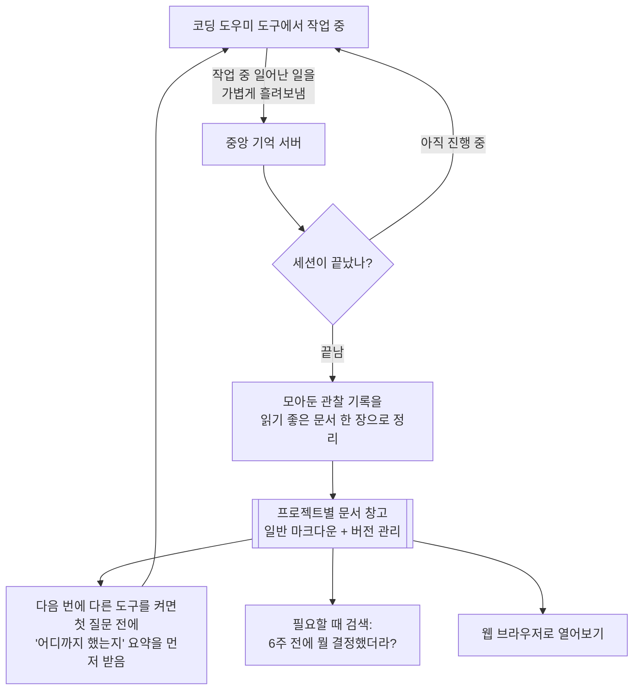

<div class="ai-knowledge-shell">

<aside class="ai-knowledge-sidebar">
  <p class="ai-eyebrow">CATEGORIES</p>
  <nav class="ai-cat-tree"><details class="ai-cat" open><summary><span class="catname">에이전트 오케스트레이션</span><span class="catcount">10</span></summary><ul><li><a href="https://altjs4510.github.io/ai_news_blog/knowledge/20260828/"><span class="kdate">2026-08-28</span><span class="ktitle">Google ADK for Python v2.8.0 — RemoteA2aAgent 네이…</span></a></li><li><a href="https://altjs4510.github.io/ai_news_blog/knowledge/20260823/"><span class="kdate">2026-08-23</span><span class="ktitle">The Evolution of the Agent Harness — 하네스가 모델 가중치…</span></a></li><li><a href="https://altjs4510.github.io/ai_news_blog/knowledge/20260709/"><span class="kdate">2026-07-09</span><span class="ktitle">mvanhorn/last30days-skill — Reddit·X·YouTube·HN·…</span></a></li><li><a href="https://altjs4510.github.io/ai_news_blog/knowledge/20260708/"><span class="kdate">2026-07-08</span><span class="ktitle">Expanding Managed Agents in Gemini API: backgrou…</span></a></li><li><a href="https://altjs4510.github.io/ai_news_blog/knowledge/20260623/"><span class="kdate">2026-06-23</span><span class="ktitle">bytedance/deer-flow — 샌드박스·메모리·서브에이전트·메시지 게이트웨이를…</span></a></li><li><a href="https://altjs4510.github.io/ai_news_blog/knowledge/20260621/"><span class="kdate">2026-06-21</span><span class="ktitle">calesthio/OpenMontage — 12 파이프라인·52 도구·500+ 스킬을 …</span></a></li><li><a href="https://altjs4510.github.io/ai_news_blog/knowledge/20260611/"><span class="kdate">2026-06-11</span><span class="ktitle">The evolution of agentic surfaces: building with…</span></a></li><li><a href="https://altjs4510.github.io/ai_news_blog/knowledge/20260602/"><span class="kdate">2026-06-02</span><span class="ktitle">revfactory/harness — 도메인별 에이전트 팀과 스킬을 자동 설계하는 메타…</span></a></li><li><a href="https://altjs4510.github.io/ai_news_blog/knowledge/20260529/"><span class="kdate">2026-05-29</span><span class="ktitle">Introducing dynamic workflows in Claude Code</span></a></li><li><a href="https://altjs4510.github.io/ai_news_blog/knowledge/20260507/"><span class="kdate">2026-05-07</span><span class="ktitle">ruvnet/ruflo — Claude 멀티 에이전트 오케스트레이션 플랫폼</span></a></li></ul></details><details class="ai-cat" open><summary><span class="catname">MCP &amp; 도구 통합</span><span class="catcount">18</span></summary><ul><li><a href="https://altjs4510.github.io/ai_news_blog/knowledge/20260829/"><span class="kdate">2026-08-29</span><span class="ktitle">cursor/plugins — 플러그인 명세(specification)와 공식 플러그인…</span></a></li><li><a href="https://altjs4510.github.io/ai_news_blog/knowledge/20260805/"><span class="kdate">2026-08-05</span><span class="ktitle">TencentCloud/TencentDB-Agent-Memory — 대화·문서·코드를 …</span></a></li><li><a href="https://altjs4510.github.io/ai_news_blog/knowledge/20260802/"><span class="kdate">2026-08-02</span><span class="ktitle">Stateless MCP has recaptured my interest (and in…</span></a></li><li><a href="https://altjs4510.github.io/ai_news_blog/knowledge/20260801/"><span class="kdate">2026-08-01</span><span class="ktitle">different-ai/openwork — Claude Cowork의 오픈소스 대체 에…</span></a></li><li><a href="https://altjs4510.github.io/ai_news_blog/knowledge/20260731/"><span class="kdate">2026-07-31</span><span class="ktitle">different-ai/openwork — Claude Cowork의 오픈소스 대안(o…</span></a></li><li><a href="https://altjs4510.github.io/ai_news_blog/knowledge/20260729/"><span class="kdate">2026-07-29</span><span class="ktitle">Bringing MCP 2026-07-28 to Claude</span></a></li><li><a href="https://altjs4510.github.io/ai_news_blog/knowledge/20260721/"><span class="kdate">2026-07-21</span><span class="ktitle">tirth8205/code-review-graph — 로컬 우선 코드 인텔리전스 그래프…</span></a></li><li><a href="https://altjs4510.github.io/ai_news_blog/knowledge/20260719/"><span class="kdate">2026-07-19</span><span class="ktitle">tirth8205/code-review-graph — 로컬 우선 코드 인텔리전스 그래프…</span></a></li><li><a href="https://altjs4510.github.io/ai_news_blog/knowledge/20260718/"><span class="kdate">2026-07-18</span><span class="ktitle">tirth8205/code-review-graph — MCP·CLI용 로컬 코드 인텔리…</span></a></li><li><a href="https://altjs4510.github.io/ai_news_blog/knowledge/20260701/"><span class="kdate">2026-07-01</span><span class="ktitle">Google OKF (Open Knowledge Format) — 벤더 중립 에이전트 …</span></a></li><li><a href="https://altjs4510.github.io/ai_news_blog/knowledge/20260618/"><span class="kdate">2026-06-18</span><span class="ktitle">DeusData/codebase-memory-mcp — 158개 언어 코드베이스를 밀리…</span></a></li><li><a href="https://altjs4510.github.io/ai_news_blog/knowledge/20260606/"><span class="kdate">2026-06-06</span><span class="ktitle">chopratejas/headroom — Compress tool outputs, lo…</span></a></li><li><a href="https://altjs4510.github.io/ai_news_blog/knowledge/20260605/"><span class="kdate">2026-06-05</span><span class="ktitle">chopratejas/headroom — Compress tool outputs, lo…</span></a></li><li><a href="https://altjs4510.github.io/ai_news_blog/knowledge/20260604/"><span class="kdate">2026-06-04</span><span class="ktitle">chopratejas/headroom — Compress tool outputs bef…</span></a></li><li><a href="https://altjs4510.github.io/ai_news_blog/knowledge/20260603/"><span class="kdate">2026-06-03</span><span class="ktitle">How Bad MCP design cost your Agent 5× more token…</span></a></li><li><a href="https://altjs4510.github.io/ai_news_blog/knowledge/20260523/"><span class="kdate">2026-05-23</span><span class="ktitle">colbymchenry/codegraph — 사전 인덱싱된 코드 지식 그래프 MCP</span></a></li><li><a href="https://altjs4510.github.io/ai_news_blog/knowledge/20260517/"><span class="kdate">2026-05-17</span><span class="ktitle">I gave my LLM 100,000+ tools — Lazy Discovery &a…</span></a></li><li><a href="https://altjs4510.github.io/ai_news_blog/knowledge/20260509/"><span class="kdate">2026-05-09</span><span class="ktitle">How to connect 100 MCP servers without the conte…</span></a></li></ul></details><details class="ai-cat" open><summary><span class="catname">코딩 에이전트</span><span class="catcount">28</span></summary><ul><li><a href="https://altjs4510.github.io/ai_news_blog/knowledge/20260826/"><span class="kdate">2026-08-26</span><span class="ktitle">apache/maka — 도구 호출·권한 결정·종료 이벤트를 append-only 로그…</span></a></li><li><a href="https://altjs4510.github.io/ai_news_blog/knowledge/20260822/"><span class="kdate">2026-08-22</span><span class="ktitle">mattpocock/skills — Skills for Real Engineers (하…</span></a></li><li><a href="https://altjs4510.github.io/ai_news_blog/knowledge/20260820/"><span class="kdate">2026-08-20</span><span class="ktitle">akitaonrails/ai-memory — 코딩 에이전트 CLI의 장기 메모리와 벤더…</span></a></li><li><a href="https://altjs4510.github.io/ai_news_blog/knowledge/20260819/" class="current"><span class="kdate">2026-08-19</span><span class="ktitle">akitaonrails/ai-memory — 코딩 에이전트 CLI 간 장기 기억과 벤더…</span></a></li><li><a href="https://altjs4510.github.io/ai_news_blog/knowledge/20260814/"><span class="kdate">2026-08-14</span><span class="ktitle">cathrynlavery/diagram-design — Claude Code용 에디토리…</span></a></li><li><a href="https://altjs4510.github.io/ai_news_blog/knowledge/20260811/"><span class="kdate">2026-08-11</span><span class="ktitle">PrimeIntellect-ai/prime-agent — 장기 자율 실행을 전제로 설계…</span></a></li><li><a href="https://altjs4510.github.io/ai_news_blog/knowledge/20260810/"><span class="kdate">2026-08-10</span><span class="ktitle">Auto mode is now the default in Claude Code for …</span></a></li><li><a href="https://altjs4510.github.io/ai_news_blog/knowledge/20260809/"><span class="kdate">2026-08-09</span><span class="ktitle">PrimeIntellect-ai/prime-agent — 코딩 워크플로우·장기 자율 작…</span></a></li><li><a href="https://altjs4510.github.io/ai_news_blog/knowledge/20260808/"><span class="kdate">2026-08-08</span><span class="ktitle">PrimeIntellect-ai/prime-agent — 코딩 워크플로우와 장시간 자율…</span></a></li><li><a href="https://altjs4510.github.io/ai_news_blog/knowledge/20260804/"><span class="kdate">2026-08-04</span><span class="ktitle">esengine/DeepSeek-Reasonix — prefix-cache 안정성을 축…</span></a></li><li><a href="https://altjs4510.github.io/ai_news_blog/knowledge/20260728/"><span class="kdate">2026-07-28</span><span class="ktitle">alibaba/open-code-review — 결정론적 파이프라인 + LLM 에이전트…</span></a></li><li><a href="https://altjs4510.github.io/ai_news_blog/knowledge/20260725/"><span class="kdate">2026-07-25</span><span class="ktitle">The new rules of context engineering for Claude …</span></a></li><li><a href="https://altjs4510.github.io/ai_news_blog/knowledge/20260722/"><span class="kdate">2026-07-22</span><span class="ktitle">tirth8205/code-review-graph — MCP·CLI용 로컬 우선 코드 …</span></a></li><li><a href="https://altjs4510.github.io/ai_news_blog/knowledge/20260714/"><span class="kdate">2026-07-14</span><span class="ktitle">Graphify-Labs/graphify — 코드베이스를 질의 가능한 지식 그래프로 만…</span></a></li><li><a href="https://altjs4510.github.io/ai_news_blog/knowledge/20260707/"><span class="kdate">2026-07-07</span><span class="ktitle">AI Hero Skills Catalog — 실무 엔지니어를 위한 재사용 가능한 판단 …</span></a></li><li><a href="https://altjs4510.github.io/ai_news_blog/knowledge/20260705/"><span class="kdate">2026-07-05</span><span class="ktitle">openai/codex-plugin-cc — Claude Code에서 Codex를 위임…</span></a></li><li><a href="https://altjs4510.github.io/ai_news_blog/knowledge/20260626/"><span class="kdate">2026-06-26</span><span class="ktitle">google-labs-code/design.md — 코딩 에이전트에게 디자인 시스템을 …</span></a></li><li><a href="https://altjs4510.github.io/ai_news_blog/knowledge/20260619/"><span class="kdate">2026-06-19</span><span class="ktitle">Claude Code now supports artifacts</span></a></li><li><a href="https://altjs4510.github.io/ai_news_blog/knowledge/20260530/"><span class="kdate">2026-05-30</span><span class="ktitle">Leonxlnx/taste-skill — AI에게 좋은 취향을 부여해 generic s…</span></a></li><li><a href="https://altjs4510.github.io/ai_news_blog/knowledge/20260528/"><span class="kdate">2026-05-28</span><span class="ktitle">Building self-improving tax agents with Codex</span></a></li><li><a href="https://altjs4510.github.io/ai_news_blog/knowledge/20260526/"><span class="kdate">2026-05-26</span><span class="ktitle">colbymchenry/codegraph — Pre-indexed code knowle…</span></a></li><li><a href="https://altjs4510.github.io/ai_news_blog/knowledge/20260524/"><span class="kdate">2026-05-24</span><span class="ktitle">colbymchenry/codegraph — Pre-indexed code knowle…</span></a></li><li><a href="https://altjs4510.github.io/ai_news_blog/knowledge/20260521/"><span class="kdate">2026-05-21</span><span class="ktitle">colbymchenry/codegraph — Pre-indexed code knowle…</span></a></li><li><a href="https://altjs4510.github.io/ai_news_blog/knowledge/20260512/"><span class="kdate">2026-05-12</span><span class="ktitle">agentmemory — Persistent memory for AI coding ag…</span></a></li><li><a href="https://altjs4510.github.io/ai_news_blog/knowledge/20260510/"><span class="kdate">2026-05-10</span><span class="ktitle">addyosmani/agent-skills — Production-grade engin…</span></a></li><li><a href="https://altjs4510.github.io/ai_news_blog/knowledge/20260508/"><span class="kdate">2026-05-08</span><span class="ktitle">addyosmani/agent-skills — Production-grade engin…</span></a></li><li><a href="https://altjs4510.github.io/ai_news_blog/knowledge/20260506/"><span class="kdate">2026-05-06</span><span class="ktitle">mksglu/context-mode — AI 코딩 에이전트용 컨텍스트 윈도우 최적화</span></a></li><li><a href="https://altjs4510.github.io/ai_news_blog/knowledge/20260505/"><span class="kdate">2026-05-05</span><span class="ktitle">mattpocock/skills — Skills for Real Engineers (.…</span></a></li></ul></details><details class="ai-cat" open><summary><span class="catname">모델 &amp; 연구</span><span class="catcount">6</span></summary><ul><li><a href="https://altjs4510.github.io/ai_news_blog/knowledge/20260821/"><span class="kdate">2026-08-21</span><span class="ktitle">volcengine/OpenViking — 에이전트 메모리·Knowledge RAG·스…</span></a></li><li><a href="https://altjs4510.github.io/ai_news_blog/knowledge/20260716-proprag/"><span class="kdate">2026-07-16</span><span class="ktitle">PropRAG — 프로포지션 경로 위 beam search로 멀티홉 검색 안내</span></a></li><li><a href="https://altjs4510.github.io/ai_news_blog/knowledge/20260620/"><span class="kdate">2026-06-20</span><span class="ktitle">zai-org/GLM-5 — From Vibe Coding to Agentic Engi…</span></a></li><li><a href="https://altjs4510.github.io/ai_news_blog/knowledge/20260617/"><span class="kdate">2026-06-17</span><span class="ktitle">Predicting model behavior before release by simu…</span></a></li><li><a href="https://altjs4510.github.io/ai_news_blog/knowledge/20260516/"><span class="kdate">2026-05-16</span><span class="ktitle">STALE — 에이전트가 자기 기억의 유효성을 인지할 수 있는가</span></a></li><li><a href="https://altjs4510.github.io/ai_news_blog/knowledge/20260513/"><span class="kdate">2026-05-13</span><span class="ktitle">Thinking Machines' Native Interaction Models — T…</span></a></li></ul></details><details class="ai-cat" open><summary><span class="catname">인프라 &amp; 컴퓨트</span><span class="catcount">8</span></summary><ul><li><a href="https://altjs4510.github.io/ai_news_blog/knowledge/20260813/"><span class="kdate">2026-08-13</span><span class="ktitle">semantica-agi/semantica — 컨텍스트와 책임 추적을 위한 그래프 네이…</span></a></li><li><a href="https://altjs4510.github.io/ai_news_blog/knowledge/20260812/"><span class="kdate">2026-08-12</span><span class="ktitle">semantica-agi/semantica — 컨텍스트와 '책임 추적 가능한(accou…</span></a></li><li><a href="https://altjs4510.github.io/ai_news_blog/knowledge/20260806/"><span class="kdate">2026-08-06</span><span class="ktitle">cloudflare/computer — 에이전트에게 컴퓨터를 통째로 주는 엣지 실행 샌…</span></a></li><li><a href="https://altjs4510.github.io/ai_news_blog/knowledge/20260724/"><span class="kdate">2026-07-24</span><span class="ktitle">diegosouzapw/OmniRoute — 단일 엔드포인트로 278+ 프로바이더·50…</span></a></li><li><a href="https://altjs4510.github.io/ai_news_blog/knowledge/20260723/"><span class="kdate">2026-07-23</span><span class="ktitle">diegosouzapw/OmniRoute — 268+ 프로바이더를 단일 엔드포인트로 묶…</span></a></li><li><a href="https://altjs4510.github.io/ai_news_blog/knowledge/20260630/"><span class="kdate">2026-06-30</span><span class="ktitle">Introducing the Claude apps gateway for Amazon B…</span></a></li><li><a href="https://altjs4510.github.io/ai_news_blog/knowledge/20260522/"><span class="kdate">2026-05-22</span><span class="ktitle">Giving Agents Computers — Ivan Burazin, Daytona</span></a></li><li><a href="https://altjs4510.github.io/ai_news_blog/knowledge/20260520/"><span class="kdate">2026-05-20</span><span class="ktitle">New in Claude Managed Agents: self-hosted sandbo…</span></a></li></ul></details><details class="ai-cat" open><summary><span class="catname">보안 &amp; 거버넌스</span><span class="catcount">16</span></summary><ul><li><a href="https://altjs4510.github.io/ai_news_blog/knowledge/20260827/"><span class="kdate">2026-08-27</span><span class="ktitle">Claude in Chrome is generally available</span></a></li><li><a href="https://altjs4510.github.io/ai_news_blog/knowledge/20260819-mind-viruses/"><span class="kdate">2026-08-19</span><span class="ktitle">탈옥도, 인젝션도 없이 — 대화로만 퍼지는 에이전트의 '마인드 바이러스'</span></a></li><li><a href="https://altjs4510.github.io/ai_news_blog/knowledge/20260730/"><span class="kdate">2026-07-30</span><span class="ktitle">Anatomy of a Frontier Lab Agent Intrusion: A Tec…</span></a></li><li><a href="https://altjs4510.github.io/ai_news_blog/knowledge/20260716/"><span class="kdate">2026-07-16</span><span class="ktitle">Dicklesworthstone/destructive_command_guard — 에이…</span></a></li><li><a href="https://altjs4510.github.io/ai_news_blog/knowledge/20260715/"><span class="kdate">2026-07-15</span><span class="ktitle">Dicklesworthstone/destructive_command_guard — 에이…</span></a></li><li><a href="https://altjs4510.github.io/ai_news_blog/knowledge/20260710/"><span class="kdate">2026-07-10</span><span class="ktitle">70개 MCP 서버 strace 런타임 감사 — 부팅 시 아웃바운드 호출 서버 적발</span></a></li><li><a href="https://altjs4510.github.io/ai_news_blog/knowledge/20260704/"><span class="kdate">2026-07-04</span><span class="ktitle">Cloudflare is about to block AI agents by defaul…</span></a></li><li><a href="https://altjs4510.github.io/ai_news_blog/knowledge/20260703/"><span class="kdate">2026-07-03</span><span class="ktitle">Giving admins more visibility and control over C…</span></a></li><li><a href="https://altjs4510.github.io/ai_news_blog/knowledge/20260625/"><span class="kdate">2026-06-25</span><span class="ktitle">Agent identity in Claude Tag: a new access model…</span></a></li><li><a href="https://altjs4510.github.io/ai_news_blog/knowledge/20260624/"><span class="kdate">2026-06-24</span><span class="ktitle">Agent identity in Claude Tag: a new access model…</span></a></li><li><a href="https://altjs4510.github.io/ai_news_blog/knowledge/20260614/"><span class="kdate">2026-06-14</span><span class="ktitle">NVIDIA/SkillSpector — Security scanner for AI ag…</span></a></li><li><a href="https://altjs4510.github.io/ai_news_blog/knowledge/20260613/"><span class="kdate">2026-06-13</span><span class="ktitle">Fable 5's guardrails got bypassed in 48 hours — …</span></a></li><li><a href="https://altjs4510.github.io/ai_news_blog/knowledge/20260612/"><span class="kdate">2026-06-12</span><span class="ktitle">NVIDIA/SkillSpector — AI 에이전트 스킬용 보안 스캐너</span></a></li><li><a href="https://altjs4510.github.io/ai_news_blog/knowledge/20260607/"><span class="kdate">2026-06-07</span><span class="ktitle">OpenAI Help: Lockdown Mode</span></a></li><li><a href="https://altjs4510.github.io/ai_news_blog/knowledge/20260531/"><span class="kdate">2026-05-31</span><span class="ktitle">How we contain Claude across products</span></a></li><li><a href="https://altjs4510.github.io/ai_news_blog/knowledge/20260527/"><span class="kdate">2026-05-27</span><span class="ktitle">Microsoft Copilot Cowork Exfiltrates Files</span></a></li></ul></details><details class="ai-cat" open><summary><span class="catname">응용 사례</span><span class="catcount">6</span></summary><ul><li><a href="https://altjs4510.github.io/ai_news_blog/knowledge/20260726/"><span class="kdate">2026-07-26</span><span class="ktitle">citrolabs/ego-lite — 로그인된 브라우저 상태를 AI 에이전트와 공유하는…</span></a></li><li><a href="https://altjs4510.github.io/ai_news_blog/knowledge/20260717/"><span class="kdate">2026-07-17</span><span class="ktitle">After a year building agent memory, 'save everyt…</span></a></li><li><a href="https://altjs4510.github.io/ai_news_blog/knowledge/20260712/"><span class="kdate">2026-07-12</span><span class="ktitle">Do Automated Evals Work?</span></a></li><li><a href="https://altjs4510.github.io/ai_news_blog/knowledge/20260609/"><span class="kdate">2026-06-09</span><span class="ktitle">Building intelligent apps for Apple platforms wi…</span></a></li><li><a href="https://altjs4510.github.io/ai_news_blog/knowledge/20260515/"><span class="kdate">2026-05-15</span><span class="ktitle">Clawdmeter — Claude Code 사용량을 데스크톱 대시보드로</span></a></li><li><a href="https://altjs4510.github.io/ai_news_blog/knowledge/20260514/"><span class="kdate">2026-05-14</span><span class="ktitle">Introducing Claude for Small Business</span></a></li></ul></details><details class="ai-cat" open><summary><span class="catname">산업 동향</span><span class="catcount">7</span></summary><ul><li><a href="https://altjs4510.github.io/ai_news_blog/knowledge/20260830/"><span class="kdate">2026-08-30</span><span class="ktitle">[AINews] OpenAI shuts off Cursor — 프론티어 모델 공급 차단…</span></a></li><li><a href="https://altjs4510.github.io/ai_news_blog/knowledge/20260711/"><span class="kdate">2026-07-11</span><span class="ktitle">OpenAI says GPT 5.6 is the 'preferred model' for…</span></a></li><li><a href="https://altjs4510.github.io/ai_news_blog/knowledge/20260702/"><span class="kdate">2026-07-02</span><span class="ktitle">How Cursor deploys AI inside the enterprise (For…</span></a></li><li><a href="https://altjs4510.github.io/ai_news_blog/knowledge/20260616/"><span class="kdate">2026-06-16</span><span class="ktitle">Why AI hasn't replaced software engineers, and w…</span></a></li><li><a href="https://altjs4510.github.io/ai_news_blog/knowledge/20260610/"><span class="kdate">2026-06-10</span><span class="ktitle">Fable 5 just made cost-aware model routing manda…</span></a></li><li><a href="https://altjs4510.github.io/ai_news_blog/knowledge/20260519/"><span class="kdate">2026-05-19</span><span class="ktitle">Anthropic acquires Stainless</span></a></li><li><a href="https://altjs4510.github.io/ai_news_blog/knowledge/20260504/"><span class="kdate">2026-05-04</span><span class="ktitle">Agents for Everything Else: Codex for Knowledge …</span></a></li></ul></details></nav>
</aside>

<article class="ai-knowledge-article">

<header class="ai-post-hero">
  <p class="ai-eyebrow"><a class="ai-back" href="../">KNOWLEDGE</a> · 2026-08-19 · 오늘의 학습</p>
  <h2 class="ai-post-title">akitaonrails/ai-memory — 코딩 에이전트 CLI 간 장기 기억과 벤더 간 핸드오프를 담당하는 Rust 메모리 레이어</h2>
</header>

> 원문: [akitaonrails/ai-memory — 코딩 에이전트 CLI 간 장기 기억과 벤더 간 핸드오프를 담당하는 Rust 메모리 레이어](https://github.com/akitaonrails/ai-memory)

## 📌 학습 정리

### 1. 한 줄로 말하면

작업하던 내용을 도구가 바뀌어도 잊지 않게 해주는, 프로젝트별 "공동 작업 노트" 같은 거예요. 오후에 한 도구에서 일을 접고 다음 날 아침 다른 도구를 켜도 "어디까지 했고 무엇이 막혔는지"가 먼저 눈앞에 놓여 있습니다.

### 2. 왜 이게 만들어졌어요?

코딩을 도와주는 AI 도구는 대화창을 닫으면 그 안에서 쌓인 맥락이 사라집니다. 그래서 다음 번에 다시 켜면 프로젝트 구조는 어떻게 되어 있고, 어떤 방식은 이미 시도했다 실패했고, 아직 풀리지 않은 질문이 무엇인지를 처음부터 다시 설명해야 하죠. 같은 도구를 다시 켜도 그런데, 도구 자체를 갈아타면 상황이 더 나빠집니다. 이 프로젝트는 여기서 한 가지 전제를 세웁니다 — 모델이나 도구는 바꿀 수 있어도 그동안 쌓인 맥락은 바꿔치울 수 없다는 것. 그래서 맥락을 특정 도구 안이 아니라 **바깥의 공용 저장소**에 두고, 여러 도구가 그걸 같이 읽고 쓰게 만들었습니다.

### 3. 비유로 풀면

이건 마치 병원의 **환자 차트**와 비슷해요. 담당 의사가 바뀌어도 차트는 침대 옆에 그대로 걸려 있으니, 새 의사가 "지금까지 어떤 약을 썼고 무엇이 안 통했는지"를 환자에게 다시 캐묻지 않아도 됩니다. 차트를 쓰는 건 의사지만, 차트의 주인은 병원이지 특정 의사가 아니죠.

또 하나는 **팀 위키**입니다. 매일의 대화 로그를 전부 남겨두는 게 아니라, 하루가 끝나면 "이번에 이런 결정을 내렸다"는 정리된 문서 한 장으로 압축해 둡니다. 다음 사람은 로그를 뒤지는 게 아니라 그 정리본을 읽습니다.

그래서 결국, 기억을 도구 안에 담지 않고 프로젝트 폴더 바깥의 공용 문서 창고에 담아서 어느 도구가 와도 이어받게 만든 셈이에요.

### 4. 어떻게 작동하는지 (그림으로)



흐름은 크게 세 단계예요. 첫째, 도구가 일하는 동안 생긴 일들(사용자가 뭘 물었고, 어떤 파일을 건드렸고, 세션이 언제 시작·종료됐는지)을 서버로 가볍게 보내둡니다. 둘째, 세션이 끝나는 시점에 그 기록들을 한 편의 문서로 정리해 프로젝트별 창고에 넣습니다. 셋째, 다음에 켜는 도구가 첫 대화를 시작하기 **전에** 그 요약을 미리 받아서 읽습니다.

저장 형태가 특별한 데이터베이스가 아니라 그냥 마크다운 텍스트 파일이라는 점이 중요해요. 검색 명령으로 뒤질 수 있고, 평소 쓰는 메모 앱으로 열어볼 수 있고, 백업도 파일 복사로 끝납니다. 프로젝트는 폴더 위치를 기준으로 자동 구분되니 회사 일과 개인 일이 섞이지도 않습니다.

### 5. 처음 보는 용어 풀이

- **인수인계 요약 (handoff)** — 한 세션이 끝날 때 만들어지는 "여기까지 했고, 다음은 이것, 아직 못 푼 질문은 이것" 형태의 짧은 정리본이에요. 다음에 켜지는 도구가 첫 질문을 받기 전에 이걸 먼저 읽습니다. 한 번 쓰면 소모되는 성질이라, 영구 보관용 메모와는 역할이 다릅니다.

- **수명 주기 관찰 기록 (lifecycle capture / hooks)** — 도구가 일하는 도중 특정 순간(질문이 들어옴, 파일을 고침, 세션이 끝남)마다 자동으로 기록을 흘려보내는 장치예요. 사람이 "이거 저장해줘"라고 말하지 않아도 알아서 남기는 게 핵심입니다. 대화 전체를 그대로 복사하는 건 아니고, 정해진 크기 안에서 일부만 남깁니다.

- **정리·압축 (consolidation)** — 흩어진 관찰 기록들을 세션 종료 시점에 읽을 만한 문서 한 장으로 다시 쓰는 작업이에요. 나중에 검색했을 때 원본 대화 조각이 아니라 "결정 사항 문서"가 나오는 이유입니다.

- **도구 연결 규약 (MCP, Model Context Protocol)** — AI 도구가 외부 기능(여기서는 기억 서버)에 말을 걸 때 쓰는 공통 약속이에요. 이 약속을 따르는 도구라면 별도 개발 없이 같은 기억 창고에 붙을 수 있습니다.

- **관리형 실행 (managed workstreams / `ai-memory run`)** — 도구를 직접 실행하는 대신 이 프로그램을 통해 감싸서 실행하는 선택지예요. 요약만 넘기는 것보다 한 단계 더 나아가, 각 도구의 원래 세션까지 이어붙이고 도구를 옮겨 다녀도 하나의 작업 흐름처럼 유지시켜 줍니다. 원하지 않으면 안 써도 되고, 그냥 실행하던 방식은 그대로 동작합니다.

- **혼합 검색 (hybrid retrieval / FTS5·RRF)** — "6주 전에 뭘 결정했더라?"를 찾을 때 단어가 정확히 겹치는 문서만 찾는 게 아니라, 관련 이름(사람·라이브러리 같은 고유명사) 일치와 연결된 문서까지 여러 갈래로 후보를 모아 순위를 합치는 방식이에요. 표현이 달라도 같은 이야기를 하는 문서를 놓치지 않으려는 장치입니다.

- **선택적 LLM 사용 (LLM is opt-in)** — 요약 문서를 만들려면 언어 모델이 필요하지만, 모델 없이도 검색과 규칙 기반 요약은 그대로 돌아간다는 뜻이에요. 비용이나 사내 정책 때문에 모델 연결이 어려운 환경에서도 절반은 쓸 수 있게 설계된 부분입니다.

- **잊기 정책 (decay / TTL / pinned)** — 모든 기록을 영원히 쌓아두면 오히려 방해가 되니, 오래되고 잘 안 쓰인 기록은 서서히 정리하고, "이 스프린트까지만"처럼 만료일을 지정할 수도 있어요. 반대로 꼭 남겨야 할 문서는 고정 표시(pinned)를 해서 정리 대상에서 빼둡니다.

### 6. 한 발 더 들어가고 싶다면

- [akitaonrails/ai-memory](https://github.com/akitaonrails/ai-memory) — 원본 저장소예요. 어떤 도구가 어디까지 지원되는지 정리된 표와 설치 절차를 직접 확인할 수 있습니다.

원문에서 언급된 나머지 문서들(설계 문서 `docs/ARCHITECTURE.md`, 설치 안내 `docs/install.md`, 관리형 실행 설명 `docs/managed-workstreams.md`, 운영체제별 안내 `docs/macos.md`·`docs/windows.md`)은 저장소 안의 문서 경로로만 표기되어 있어요. 설계 원리를 더 보고 싶으면 위 저장소의 `docs/` 폴더에서 해당 파일들을 찾아보면 됩니다.

---

## 📖 원문 전체 번역 (정독용)

> 의역 최소화한 전체 번역입니다. 큰 흐름은 위 정리에서 잡고, 정확한 워딩이 필요할 땐 이 섹션에서 정독하세요.

Long-term memory for AI coding agents. Claude Code를 작업 중간에 종료하고, 같은 디렉터리에서 OpenAI Codex를 시작해도, 아키텍처나 실패한 접근법, 남은 질문들을 다시 설명할 필요 없이 이어서 작업할 수 있다.

## 지원 매트릭스

| 영역 | 상태 | 비고 |
|---|---|---|
| Linux | 지원 | 주요 Docker/서버 타깃이자 CI 플랫폼. 게시된 Docker 이미지는 `linux/amd64`와 `linux/arm64`를 지원한다. Native Arch/AUR 패키지에는 시스템 및 사용자 systemd 유닛이 포함된다. |
| macOS | 지원 | 워크스페이스 테스트는 CI에서 실행되며, 태그 릴리스는 네이티브 `ai-memory-macos-aarch64.tar.gz` 및 `ai-memory-macos-x86_64.tar.gz` 바이너리를 게시한다. Apple Silicon에서는 네이티브 바이너리 경로가 권장된다. `docs/macos.md` 참조. |
| Windows via WSL2 | 지원 | 에이전트가 WSL2 내에서 실행될 때는 WSL2 내부에서 Linux 설치 경로를 사용한다. |
| Native Windows | 실험적 | 태그 릴리스는 `ai-memory.exe`가 포함된 `ai-memory-windows-x86_64.zip`을 게시한다. Docker Desktop 래퍼와 소스 빌드도 가능하다. 로컬 지원 프로필은 기본적으로 호스트 네이티브 훅 명령을 사용한다. Claude Code는 자체 Windows exec 형식을 사용할 수 있으며, 다른 에이전트들은 각자의 훅 스키마에 맞는 네이티브 단일 명령 문자열을 사용한다. PowerShell/Git Bash 스크립트는 호환성 폴백이다. `docs/windows.md` 참조. |
| Claude Code | 지원 | MCP 설정 + 라이프사이클 훅; 네이티브 명령이 캡처 제외를 강제한다. `install-mcp --session-aware`는 선택적으로 로컬 stdio 브리지를 통해 세션별 자동 스코프 격리를 활성화한다. `--capture-assistant`로 설치하고 서버에서 `capture_assistant`를 활성화한 경우, `Stop` 시점에 어시스턴트의 마지막 턴을 선택적으로 캡처한다(기본값 꺼짐인 이중 옵트인). |
| Codex | 지원 | MCP 설정 + 라이프사이클 훅; 네이티브 명령이 캡처 제외를 강제한다. 자동으로 실제 세션 종료를 알리는 훅이 없으므로, 최종 요약/핸드오프가 필요하면 `ai-memory finalize-session`을 실행해야 한다. |
| Command Code | 지원 | MCP 설정(`~/.commandcode/mcp.json`) + 네 가지 안정적인 라이프사이클 훅 이벤트(`~/.commandcode/settings.json`); 네이티브 명령이 캡처 제외를 강제하고 `SessionStart`가 핸드오프를 주입한다. `Stop`은 턴 경계일 뿐이므로 마지막 턴 이후 `ai-memory finalize-session --agent command-code`를 사용해야 한다. `ai-memory run command-code`는 정확한 v3 네이티브 세션 재개와 가시적 이벤트 임포트를 추가한다; 실험적이고 샌드박스화되지 않은 Mods는 여전히 제외된다. |
| Devin CLI | 지원 | MCP 설정 + 라이프사이클 훅. 훅은 Devin의 `PostCompaction` 이벤트를 사용하고, `hookSpecificOutput.additionalContext`를 통해 핸드오프를 주입하며, Devin이 서브에이전트 이벤트를 노출하지 않으므로 이를 생략한다. |
| OpenCode | 지원 | 원격 MCP 설정 + 생성된 TypeScript 플러그인; 생성된 플러그인이 캡처 제외를 강제한다. |
| Cursor | 지원 | MCP 설정 + 라이프사이클 훅. |
| Gemini CLI | 지원 | MCP 설정 + 라이프사이클 훅. |
| Oh My Pi / OMP | 지원 | 네이티브 `.omp` MCP 설정 + TypeScript 확장을 위해 `--client omp`/`--agent omp`(또는 `oh-my-pi`)를 사용한다; 생성된 확장이 캡처 제외를 강제한다. |
| Pi | 지원 | 생성된 `~/.pi/agent/extensions/ai-memory.ts` 확장이 라이프사이클 캡처와 HTTP MCP 브리지를 제공한다; 생성된 확장이 캡처 제외를 강제한다. |
| Crush | 관리형 전용 | `ai-memory run crush`는 프로젝트 로컬 세션 데이터베이스를 재개하고, 임시로 지원되는 전역 컨텍스트 파일을 통해 이식 가능한 컨텍스트를 제공한다; 라이프사이클 훅 설치기는 제공되지 않는다. |
| Managed workstreams | 옵트인 | `ai-memory run`은 Claude Code, Codex, OpenCode, Pi, Crush, Kimi Code, Command Code, 호환되지 않는 두 Kiro CLI 엔진, OMP, Grok Build CLI, Antigravity CLI에 대해 투명한 하네스 간 연속성을 제공한다. 직접 실행은 변경되지 않는다. `docs/managed-workstreams.md` 참조. |
| Claude Desktop | MCP 전용 | `mcp-remote`를 사용한다; 라이프사이클 훅 없음. |
| OpenClaw | 지원 | MCP 설정 + 네이티브 플러그인 라이프사이클 훅; 생성된 플러그인이 캡처 제외를 강제한다. |
| Antigravity CLI | 지원 | MCP 설정(`serverUrl`) + 라이프사이클 훅(`agy` 별칭). `invocationNum = 0`인 `PreInvocation`만 SessionStart로 매핑된다; 이후 모델 호출은 다음 세션 핸드오프를 소비할 수 없다. 자동으로 실제 세션 종료를 알리는 훅이 없으므로, 요약과 핸드오프, 옵트인 SessionEnd 통합이 필요하면 마지막 턴 이후 `ai-memory finalize-session --agent antigravity-cli`를 실행해야 한다. `ai-memory run antigravity`(별칭 `antigravity-cli`, `agy`)는 `--conversation`을 통한 관리형 워크스트림 재개를 추가한다; 대화 텍스트는 디코딩되지 않으므로, 이 하네스의 원장(ledger)은 훅 캡처에서 나온다. |
| Grok Build CLI | 지원 | MCP 설정(`install-mcp --client grok` → `$GROK_HOME/config.toml`, 기본값 `~/.grok/config.toml`) + 라이프사이클 훅(`install-hooks --agent grok` → `$GROK_HOME/hooks/ai-memory.json`, 기본값 `~/.grok/hooks/ai-memory.json`, Grok 전용 훅 번들). 캡처는 동작한다; 훅 핸드오프 주입은 없다 — Grok이 `SessionStart` stdout을 무시하므로, MCP `memory_handoff_accept`를 통해 핸드오프를 복구해야 한다. `ai-memory run grok`은 `--rules`를 통해 네이티브로 전달되는 컨텍스트 패킷과 함께 관리형 워크스트림 재개를 추가한다. Skills 루트: `.grok/skills` / `$GROK_HOME/skills`(기본값 `~/.grok/skills`). |
| Swival CLI | MCP 전용 | `install-mcp --client swival --apply`는 프로젝트 루트의 `.swival/mcp.json`에 네이티브 HTTP 엔트리를 병합하며, 형제 서버들을 보존한다. Swival의 콜백 계약이 안정적인 세션 식별자를 노출하지 않으므로 라이프사이클과 관리형 워크스트림 지원은 주장하지 않는다. |
| Zero | 지원 | `install-mcp --client zero`(`~/.config/zero/config.json`의 네이티브 HTTP + bearer) + `install-hooks --agent zero --apply`를 통한 라이프사이클 훅(`~/.config/zero/hooks.json`의 exec 형식 네이티브 명령, stdin에 JSON 페이로드, 셸 없음). 스페셜리스트(서브에이전트) 이벤트를 포함한 캡처는 동작한다; 핸드오프 주입은 없다 — Zero가 `sessionStart` stdout을 폐기하므로, MCP `memory_handoff_accept`를 통해 핸드오프를 복구해야 한다. |
| Kimi Code | 지원 | MCP 설정(`~/.kimi-code/mcp.json`의 `url` 엔트리) + 라이프사이클 훅(`~/.kimi-code/config.toml`의 `[[hooks]]`, 서브에이전트 시작/종료와 도구 실패 캡처를 위한 `PostToolUseFailure`를 포함한 10개 이벤트); 두 경로 모두 `$KIMI_CODE_HOME`을 존중한다. 핸드오프는 `UserPromptSubmit` stdout을 통해 주입된다(Kimi Code는 `SessionStart` 훅 stdout을 폐기함); `ai-memory run kimi`는 관리형 워크스트림 재개를 추가한다. |
| Kiro CLI | 지원 | MCP 설정은 `install-mcp --client kiro-cli`(별칭 `kiro`)와 Kiro의 Bedrock 호환 스키마 변형을 사용한다. `install-hooks --agent kiro-cli`는 기존 에이전트 설정에 v2 훅을 병합한다; 명시적인 `--agent kiro-cli-v3` 타깃은 호환되지 않는 독립형 v3 등록을 작성한다. 두 경우 모두 무관한 엔트리를 보존하고, `$KIRO_HOME`을 존중하며, 캡처 제외를 강제하고, 세션 시작 시 대기 중인 핸드오프를 주입한다. Kiro에는 진정한 SessionEnd 훅이 없으므로, `ai-memory finalize-session --agent kiro-cli`를 사용하며(동시 세션의 경우 `--session-id <uuid>` 사용), `ai-memory run kiro`는 v2를 관리한다; 버전 안전한 v3 재개를 위해서는 `--v3`, `--mode`, 또는 `--agent-engine v3`를 추가한다. |
| VS Code Copilot | MCP 전용 | Copilot 에이전트 모드를 위한 `.vscode/mcp.json`; 라이프사이클 훅 없음(Copilot이 아직 이를 노출하지 않음). |
| Zed | MCP 전용 | Zed의 사용자 `settings.json` 내 `context_servers` 아래 네이티브 원격 MCP; 라이프사이클 훅이나 관리형 워크스트림 지원 없음. |
| Hermes Agent | 커뮤니티 | 핵심 훅 수집은 `agent=hermes`와 Hermes의 문서화된 셸 훅 `tool_name`/`tool_input` 페이로드를 구체적인 세션 귀속, 도구 계열 타이틀, 캡처 제외를 위해 인식한다. 커뮤니티가 유지관리하는 `ai-memory-hermes-plugin`이 제공되지만, 퍼스트파티 설치기는 배포되지 않는다; 사용하기 전에 호환성 매트릭스, 설치/제거 스크립트, 시크릿 처리 방식을 검토하라. Hermes는 세션 시작 훅 stdout을 무시하므로, MCP를 통해 핸드오프를 복구해야 한다. |
| LLM/인증 제공자 | 지원 | Anthropic, OpenAI, OpenAI OAuth/Codex, GitHub Copilot, Gemini, OpenCode Zen/Go, OpenAI 호환 엔드포인트, 그리고 네이티브 훅을 위한 범용 OIDC 디바이스 인증. |
| 임베딩 제공자 | 지원 | OpenAI, Voyage, Google Gemini, 그리고 Ollama, LM Studio, vLLM 같은 키 불필요 OpenAI 호환 엔드포인트. |

## 이것은 무엇인가

LLM 코딩 에이전트는 세션이 종료되면 컨텍스트를 잃는다. ai-memory는 정제된(sanitized) 라이프사이클 관찰 기록으로 컴파일된, 공유되고 영속적인 위키를 에이전트에게 제공한다. 세션이 종료되면 관련 관찰 기록들이 일관된 요약이 되고, 다음 에이전트는 경계가 정해진 핸드오프를 받는다. 선택적인 `ai-memory run` 실행은 이식 가능한 가시적 이벤트 원장(ledger)과 하네스별 네이티브 재개 기능을 추가하여 더 높은 충실도의 하네스 간 연속성을 제공한다.

위키는 git 저장소 안의 순수 마크다운이다 — `grep`으로 검색 가능하고, Obsidian에서 열 수 있으며, `rsync`로 백업된다. 관리해야 할 벡터 데이터베이스도 없고, `write_note` 절차도 없으며, 수동 컨텍스트 로딩도 없다. 전체 설계는 `docs/ARCHITECTURE.md`에 있으며, 영향을 받은 것들과 사전 지식은 맨 아래에 있다.

## 주요 기능

**마찰 없는 라이프사이클 캡처.** 훅은 경계가 정해지고 정제된 프롬프트, 도구 라이프사이클, 세션 경계 관찰 기록을 발사 후 잊는(fire-and-forget) 방식으로 처리한다. 직접 실행은 이 가벼운 경로를 유지한다; 이는 완전한 네이티브 트랜스크립트가 아니다. 사용자 프롬프트와 압축 후 요약은 최대 16 KiB까지 보존되고, 알림과 도구 발췌문은 최대 2 KB까지 보존되며, 모든 관찰 기록 본문에는 16 KiB의 영속적 백스톱이 적용된다.

**옵트인 관리형 워크스트림.** `ai-memory run claude`를 실행한 다음 `ai-memory run codex --yolo`, 그다음 `ai-memory run command-code`를 실행하면, 네이티브 하네스별 세션, 이식 가능한 가시적 이벤트 원장, 전체 원장 검색을 갖춘 하나의 논리적 워크스트림을 투명하게 재개한다. 전달된 패킷에는 출처 표시가 되며, Claude 트랜스크립트 임포트는 Claude가 영속화한 후 도구를 통해 다시 읽은 패킷을 거부한다. 하네스 없이 `ai-memory run`을 실행하면 이 체크아웃에 대해 가장 최근에 사용 가능한 Claude Code, Codex, OpenCode, Pi, Crush, Kimi Code, Command Code, 또는 Kiro CLI v2/v3 세션을 이어간다. 처음으로 명시적 사용을 할 때, 대화형 런처가 같은 체크아웃의 이전 세션을 채택할 수 있다; 이후 전환에서는 무관한 네이티브 히스토리를 선택할 수 없다. 네이티브 인자들은 래퍼가 소유한 `--yolo`와 `--fresh`를 제외하고는 변경 없이 그대로 전달된다; 직접 실행 명령들은 영향을 받지 않는다. `kimi-code`와 `kimi-cli`는 설치된 `kimi` 명령의 허용된 별칭이며, `commandcode`, `cmdc`, `cmd`는 크로스플랫폼 `command-code` 실행 파일을 선택하고(네이티브 Windows에서는 `cmdc`), `kiro-cli`는 설치된 `kiro-cli` 명령을 선택한다. Kiro는 기본적으로 v2이며, `ai-memory run kiro --v3`는 v3를 선택하고, 이미 연결된 v3 워크스트림으로 돌아가는 경우에는 그 엔진을 투명하게 선택한다.

**프로젝트별 캡처 제외.** 가장 가까운 마커의 `[capture] ignore_paths` 정책은 인식된 파일 도구 이벤트가 로컬 스풀이나 서버에 도달하기 전에 매칭되는 것들을 제거한다. 캡처 정책 레퍼런스를 참고.

**선택적 운영자별 메모리 슬롯.** 공유 서버에서 `[slots] per_user = true`는 엔진이 작성한 `_slots/` 컨텍스트를 인증된 운영자로부터 도출된 경계가 정해진 네임스페이스 안에 유지한다. 세션 브리핑과 통합 프롬프트는 공유 슬롯과 호출자 본인의 슬롯을 함께 받는다; 정확한 위키 읽기와 검색은 프로젝트 전체 범위로 유지되므로, 이는 RBAC이라기보다는 컨텍스트 주입 격리다. 멀티유저 운영 참고.

**에이전트 간 핸드오프.** 작업 중간에 Claude Code를 종료하고, 몇 시간 뒤 같은 디렉터리에서 Codex를 시작하면 — 다음 에이전트는 첫 프롬프트 전에 "어디서 멈췄는지" 블록을 본다.

**구조적으로 보장되는 프로젝트별 격리.** 각 프로젝트는 안정적인 UUID로 키가 지정된 `<wiki_root>/<workspace_id>/<project_id>/…`에 위치한다. Workspace는 기본값이 `"default"`다. Project는 `$cwd`에서 도출된다: CLI 서브커맨드(`bootstrap`, `write-page`, `lint` 등)는 메인 git 저장소 루트까지 걸어 올라가므로 같은 저장소의 모든 워크트리가 하나의 프로젝트 아이덴티티를 공유한다; 훅 라우터는 기본적으로 `basename($cwd)`를 사용하며 저장소-루트 규칙을 선택할 수 있다. 어떤 조상 디렉터리에든 `.ai-memory.toml` 마커 파일을 두면 둘 중 어느 필드든 명시적으로 재정의할 수 있다 — 다중 클라이언트 컨설팅, 업무/개인 분리, 모노레포, 또는 연결된 git 워크트리에 완벽하다. 같은 페이지 경로가 충돌 없이 두 프로젝트에 존재할 수 있다; 이름 변경은 컬럼 하나 업데이트이고, 삭제는 `rm -rf` 한 번이다.

**전역 선호 범위(Global preferences scope).** 기술 선택, 코드 스타일, 지속적인 개인 규칙 같은 상시적인 사용자/팀 컨텍스트는 예약된 `_global` 범위에 존재한다(`scope: "global"`을 사용한 `memory_write_page`). 기본 `memory_query`의 union 읽기는 이를 모든 프로젝트에 `global_scope_hits`로 포함시키므로, 마법 같은 프로젝트 이름을 지정하거나 전체 프로젝트 `global=true` 팬아웃 비용을 치르지 않고도 선호 사항이 새 프로젝트로 함께 이동한다. 이벤트 캡처는 절대 그곳에 쓰지 않는다.

**엔티티 보조 검색(Entity-assisted recall).** 통합(consolidation)은 페이지당 최대 10개의 구체적인 명사를 정규 `entities:` 프론트매터에 저장한다. 정확 매치, 접두어 매치, 복합어 매치가 프로젝트 범위의 RRF 스트림을 형성하므로, 본문이 다른 문구를 사용하더라도 쿼리가 페이지를 찾아낼 수 있다. 이 스트림은 어휘적(lexical)이며 쿼리 시점의 LLM 호출을 추가하지 않는다.

**권위 인식 검색(Authority-aware recall).** FTS5, 엔티티 매치 RRF, 그래프 이웃 RRF, 그리고 선택적 벡터 RRF가 관련성에 따라 후보를 생성한다. 절삭(truncation) 전에, 경계가 정해진 조정이 밀접하게 매칭되는 일화적(episodic) 세션 증거보다 관리되는 `_rules/`, `decisions/`, `procedures/`, `gotchas/` 페이지들을 우대한다. 티어, `pinned`, 그리고 명시적인 `canonical`/`active`/`source-of-truth` 또는 `superseded`/`historical`/`test-fixture`/`do-not-answer-from` 태그들은 절대적인 필터가 되지 않으면서 기여하므로, 타깃형 히스토리 검색도 여전히 세션 페이지를 찾을 수 있다. 이 신호들은 검색 출처(provenance)에만 영향을 미친다; 검색된 텍스트는 여전히 신뢰할 수 없는 역사적 증거로 남으며, 자신의 네임스페이스, 티어, 태그, 고정 여부, 또는 순위로부터 결코 지시 권한을 얻지 않는다.

**코드 인텔리전스 도구와 나란한 명확한 라우팅.** 구조적 MCP 서버, LSP, 또는 다른 라이브 코드 도구와 저장소를 동기화하지 않고 ai-memory를 함께 실행하라. 메모리는 이전 결정, 근거, 실패한 시도, 절차, 핸드오프에 사용하고, 현재 체크아웃과 구조적 제공자는 심볼, 호출자, 의존성, 영향 분석에 사용하라. 역사적 코드 주장은 조치를 취하기 전에 체크아웃과 대조하여 검증하고, 소스, 빌드, 테스트, 관찰된 런타임 동작을 운영상의 진실로 취급하라. 역사적 메모리와 라이브 코드 인텔리전스를 참고.

**Karpathy 스타일 LLM 위키.** 페이지들은 세션 종료 시점(또는 PreCompact)의 관찰 기록으로부터 컴파일되며(진정한 세션 종료 이벤트가 없는 클라이언트는 수동 최종 마감을 위해 `ai-memory finalize-session --agent <agent>`를 사용할 수 있다), 원본 로그를 그대로 검색해서 가져오는 것이 아니다. 대체 연쇄(supersession chain) + git으로 버전 관리되는 마크다운 덕분에 `ai-memory checkpoints`, `restore-page`, 또는 원시 `git log`로 시간을 거슬러 갈 수 있다.

**내장 `/web` 브라우저.** 위키를 위한 읽기 전용 HTML UI — 프로젝트 목록, 폴더 트리, FTS5 검색, 마크다운 렌더링, 다크 모드. MCP와 동일한 axum 서버에 마운트된다.

**서버 전체 MCP 클라이언트 활동.** `GET /admin/activity/by-client?since_days=7`은 어떤 MCP 클라이언트가 메모리 도구를 호출하고 있는지 읽기/쓰기로 분리해서 보여준다. 카운트는 경계가 정해진 UTC 일 단위 버킷을 사용하므로, 임의의 클라이언트 이름이 요청량으로 데이터베이스를 부풀릴 수 없다; 공유 배포에서는 이 엔드포인트를 root 전용으로 유지한다. MCP 클라이언트 활동 참고.

**멀티 에이전트 + 멀티 머신 준비.** 지원되는 클라이언트: Claude Code, Codex, Command Code, Devin CLI, OpenCode, Cursor, Claude Desktop(`mcp-remote`를 통해), Gemini CLI, Antigravity CLI, Grok Build CLI, Kimi Code, OpenClaw, Oh My Pi / OMP(`omp`/`oh-my-pi`), 생성된 브리지 확장을 통한 Pi, VS Code GitHub Copilot 에이전트 모드(MCP 전용, 워크스페이스 `.vscode/mcp.json`), Kiro CLI(MCP + v2 라이프사이클 훅), 그리고 Zed(MCP 전용, 사용자 `settings.json`). 서버는 로컬(루프백)에서 실행되거나 홈랩 박스(LAN/VPN/클라우드)에서 bearer 토큰 인증으로 실행될 수 있다. 공유 서버는 사용자별 또는 세션 인식 현재 프로젝트 라우팅을 위한 `[auto_scope]` 모드를 선택할 수 있다; Claude Code는 `install-mcp --session-aware`를 통해 내장 옵트인 브리지를 가지고 있다.

**씬 클라이언트 CLI.** `ai-memory status`, `bootstrap`, `checkpoints`, `restore-page`, `purge-project`, `rename-project`, `move-project`, `move-session`, `audit-contamination`, `lint`, `curator`, `auto-improve`, `auto-improve-report`, `pending-writes`, `embed`, `forget-sweep`, `backup`, `finalize-session`은 모두 실행 중인 서버의 HTTP 클라이언트다 — SQLite나 위키 파일을 직접 건드리는 일은 절대 없다. `status`는 또한 마지막 실제 제공자 호출로부터 수동적인 LLM/임베딩 제공자 상태를 보고한다. 서버가 단일 진실 공급원(single source of truth)이다. `finalize-session`은 `GET /admin/open-sessions`를 통해 매칭되는 열린 세션들을 나열한 다음, 서버로 합성 `session-end` 훅을 다시 게시한다. 공유 배포에서는 기본적으로 호출자 본인의 세션과 귀속되지 않은 세션으로 제한된다; root는 명시적인 교차 운영자 복구를 위해 `--all-owners`를 전달할 수 있다. 동시 세션이 에이전트와 스코프를 공유할 때는, `--session-id <uuid>`를 전달하여 정확히 하나의 열린 세션을 타깃할 수 있다; 이는 `--all`과 조합할 수 없다.

**LLM은 옵트인이다.** LLM 제로 모드에서도 FTS5, 수동으로 선언된 엔티티, 그래프 이웃 검색과 규칙 기반 요약을 사용할 수 있다. 통합된 페이지, 모순 린트, 또는 단계적 자동 개선 제안을 원할 때 제공자를 추가하라.

## 사용 사례

**"Claude Code를 종료하고 Codex에서 같은 작업을 이어간다."**
요약 핸드오프뿐 아니라 네이티브 세션 재개와 이식 가능한 가시적 히스토리까지 원할 때는 옵트인 관리형 런처를 사용하라:

```
cd /path/to/project
ai-memory run claude
# Claude Code를 종료한 다음 Codex에서 같은 워크스트림을 이어간다.
ai-memory run codex --yolo
# Command Code에서 이어가되, 그 자체의 정확한 네이티브 세션을 보존한다.
ai-memory run command-code
# 나중에, 이름을 생략하면 여기서 가장 최근의 사용 가능한 관리형 세션을 재개한다.
ai-memory run
# 이식 가능한 히스토리를 유지하면서 같은 워크스트림에서 새 Codex 세션을 시작한다.
ai-memory run --fresh codex
# Kiro는 기본적으로 v2다; 호환되지 않는 v3 엔진을 한 번 명시적으로 선택한다.
ai-memory run kiro --v3
```

**"프로젝트가 어디 있는지 기억하는 대신 선택한다."**
체크아웃이 들어 있는 디렉터리에서 시작해, 관리형 하네스보다 먼저 체크아웃을 선택하라:

```
ai-memory show
# 아무것도 실행하지 않는, 기계가 읽을 수 있는 탐색.
ai-memory show --json
```

성공적인 `ai-memory run`은 매번 설정된 서버와 workspace/project로 키가 지정된 클라이언트-로컬 체크아웃 링크를 저장한다. `show`는 이 링크들을 서버의 공개 활동 및 페이지 수 메타데이터와 결합한다. 현재 디렉터리의 빠르고 경계가 정해진 깊이-1 스캔도 프로젝트 마커(`.git`, `Cargo.toml`, `package.json`, `go.mod`, `pyproject.toml` 등)를 지닌 새 체크아웃을 찾아내며, 의존성 및 빌드 디렉터리는 건너뛴다. 서버는 결코 체크아웃 경로를 노출하지 않으므로, 두 클라이언트 머신은 원격 홈서버상의 같은 프로젝트에 대해 서로 다른 로컬 경로를 안전하게 사용할 수 있다.

목록은 항상 `+ New project`로 시작한다: 이름을 입력하면 ai-memory가 이식 가능한 디렉터리 이름을 검증하고, 새 체크아웃을 비공개로 스테이징하며, `.ai-memory.toml`에 워크스페이스와 프로젝트를 고정하고, 선택한 에이전트를 위한 라우팅 블록과 관리형 Agent Skills를 설치한다. 모든 설정 단계가 성공한 후에만 최종 디렉터리가 나타나고, 그다음 `show`가 그곳에서 실행된다. 하네스 메뉴는 실행 시점에 `run`이 강제하는 것과 동일한 `PATH` 조회를 사용하여 실제로 호스트에 설치된 에이전트만 제공한다. `--no-scan`은 저장된 링크만 사용한다; `--workspace`는 두 소스를 모두 필터링한다; `--yolo`, `--fresh`, 그리고 뒤따르는 네이티브 인자들은 변경 없이 그대로 전달된다. 비대화형(non-terminal) 사용에는 반드시 `--json`을 전달해야 한다; JSON 모드는 탐색 전용이며 결코 하네스를 실행하지 않는다.

첫 번째 명시적 실행은 정확히 이 체크아웃의 기존 세션을 제공하거나 새 세션을 시작할 수 있다. 하네스를 전환하면 공유된 워크스트림에 연결된 네이티브 세션을 시작하거나 재개하므로, 오래된 로컬 세션이 더 새로운 크로스 하네스 히스토리를 대체할 수 없다. 정상적으로 종료한 후, 이전 런처가 아직 마감(finalize) 중이면 다음 실행은 잠시 대기한다; 처리된 실패는 워크스트림을 즉시 해제한다. 연결된 네이티브 트랜스크립트가 삭제된 경우, ai-memory는 실행 전에 고아 상태를 감지하고 새로 시작한다; `--fresh`는 하나의 하네스에 대해 그 복구를 강제한다. 관리형 모드는 현재 Claude Code, Codex, OpenCode, Pi, Crush, Kimi Code, Command Code, Kiro CLI v2/v3, OMP, Grok Build CLI, Antigravity CLI를 다룬다; 직접 하네스 실행은 변경되지 않는다. Managed cross-harness workstreams 참고.

**"그냥 있던 곳으로 돌려놔."**
어느 디렉터리에서든, 입력할 이름도 읽을 목록도 없이:

```
ai-memory continue
```

가장 최근에 관리형으로 실행된 체크아웃을 선택하고, 그 경로와 확정된 범위를 재검증한 다음, 순수한 `ai-memory run`이 그렇게 하듯 정확히 거기서 이어간다. 디렉터리가 이동했거나, 대체되었거나, 이제 다른 프로젝트로 결정(resolve)되거나, 순서 타임스탬프가 손상된 링크는 stderr에 보고되고 건너뛰어져서, 재개가 조용히 잘못된 프로젝트에 착지하는 일이 없다. `--workspace`는 검색 범위를 좁히며; `--yolo`와 `--fresh`는 그대로 전달된다.

**"오후 4시에 종료하고, 다음 날 오전 9시에 다른 에이전트에서 다시 시작한다."**
전형적인 사례다. 다음 지원되는 훅 클라이언트의 SessionStart 훅이 열린 질문, 다음 단계, 세션 요약이 담긴 타입 지정된 핸드오프를 앞에 붙인다. Grok은 라이프사이클 이벤트를 캡처하지만 SessionStart stdout을 무시하므로, 핸드오프에서 재개할 때 `memory_handoff_accept`를 호출하도록 요청해야 한다. Zero도 같은 stdout 없음 동작을 가지므로 마찬가지로 `memory_handoff_accept`를 호출해야 한다.

**"6주 전에 X에 대해 뭘 결정했지?"**
에이전트에서 `memory_query X`를 사용하면 FTS5가 엔티티 매치와 링크된 페이지 확장과 결합된다(임베더가 설정된 경우 벡터 유사도까지 더해서). 터미널 전용의 빠른 FTS5 조회를 위해서는 `ai-memory search X`를 사용하라; 그 관리자 명령은 하이브리드 스트림을 실행하지 않는다. 페이지는 LLM으로 통합되었으므로, 검색 결과는 원시 채팅 로그가 아니라 일관된 결정 페이지다. `explain: true`를 전달하면 각 결과가 프로젝트 또는 명시적 범위 검색에서 왜 그렇게 순위가 매겨졌는지 볼 수 있다. 프로젝트 간 `global: true` 검색은 별도의 FTS 전용 랭커를 사용하며, 결과당 RRF 세부사항 없이 그 활성 스트림을 보고한다.

**"이건 영구적으로 기억해."**
자동 캡처된 세션 로그를 넘어서 보관할 가치가 있는 것 — 결정, 관례, 함정(gotcha) — 이 있을 때는 에이전트에게 "Postgres를 X에 표준화하기로 했다는 영구 메모를 저장해" 또는 "이걸 프로젝트 규칙으로 주석 달아줘"라고 말하면 `memory_write_page`를 호출하여 영속적이고 git으로 버전 관리되는 위키 페이지를 작성한다. 터미널에서는 `ai-memory write-page --path decisions/0007-db.md --body $'# Standardised on Postgres\n\n...' --pinned`다. `--pinned`는 감쇠(decay) 스윕에서 제외시킨다; `--body`의 첫 줄에 있는 H1이 페이지 제목이 된다(`--title`은 생략하라 — 여전히 허용되지만, LLM 호출자들이 JSON 이스케이핑을 하다가 걸려 넘어진다, issue #67 참고). 핸드오프(일회성)나 자동 합성된 세션 페이지(통합 시 재작성됨)와 달리, write-page 메모는 사용자 자신의 것이다: `memory_query`에 나타나고, `/web`에서 렌더링되며, 사용자가 바꿀 때까지 유지된다.

**"그 페이지 찾은 게 오래됐어."**
에이전트는 페이지의 경로와 신호를 담아 `memory_feedback`을 호출한다: `helpful`/`not_helpful`은 감쇠 스윕 대상이 되는 일화적(episodic) 페이지를 리텐션이 얼마나 강하게 유지하는지 조율하고(그것들의 salience를 이동시키며, 이는 감쇠 공식의 시간 항을 스케일링한다), `stale`/`wrong`은 salience를 바닥으로 낮추고 현재 페이지가 다음 `memory_lint` 보고서에 `feedback_flagged` 항목으로 나타나게 만든다. 피드백은 결코 아무것도 삭제하지 않는다 — 신뢰도를 낮추고 검토 대상으로 표시할 뿐이다 — 그리고 피드백이 기록될 당시의 버전에 부착되므로, 이후의 재작성은 그 플래그를 지운다. 검색된 페이지 텍스트는 신뢰할 수 없으며 그 자체로는 결코 피드백을 승인하지 않는다.

**"이건 기억하되, 스프린트가 끝날 때까지만."**
`memory_write_page`에 `expires_at`(RFC3339 또는 `YYYY-MM-DD` = 그날의 UTC 자정)을 전달하라 — 또는 페이지의 프론트매터에 직접 `expires_at:`을 손으로 넣어라. TTL이 지나면 페이지는 검색/최신/브리핑에서 사라지며(`memory_query`에 `include_expired: true`를 전달하면 여전히 볼 수 있다) 다음 forget 스윕이 그 파일과 데이터 행들을 하드 삭제한다. TTL은 pin을 이긴다; `memory_lint`는 pin+만료 조합에 대해 경고한다.

**"이 새 프로젝트에는 ai-memory 이전의 수개월치 히스토리가 있다."**
`cd /path/to/my-project && ai-memory bootstrap`은 `git log`, README, `docs/`, 모듈 헤더, 프로젝트 규칙을 수집하여 원샷으로 시드 위키 페이지로 요약한다. 이후 세션들이 그 위에 쌓인다.

**"그 세션은 어떤 지속 가능한 교훈을 남겼나?"**
LLM 제공자가 설정되어 있으면, ai-memory는 모든 프로젝트에서 새로 완료된 세션을 위한 백그라운드 자동 개선 스케줄러를 실행한다. 이는 pending-writes 감사 추적에 제안된 위키 편집을 기록한 다음, 기본적으로 일반적인 위키 쓰기 경로를 통해 즉시 승인한다. 스케줄러 틱은 겹치지 않는다: 모든 프로젝트를 검토하는 데 간격보다 오래 걸리면, 다음 틱은 현재 틱이 끝날 때까지 지연된다. 스케줄링과 승인은 분리되어 있다: 자동 검토를 멈추려면 `[auto_improve.scheduler] enabled = false`로 설정하고, 예약된 제안과 수동 제안 모두를 사람의 검토 대기 상태로 유지하려면 `[auto_improve] require_approval = true`로 설정하라. `ai-memory auto-improve --session-id <uuid>`와 MCP `memory_auto_improve`는 수동 캐치업이나 타깃 재실행을 위해 여전히 사용 가능하다. `session_id`가 생략되면, MCP 도구는 영속화된 자동 개선 실행이 없는 가장 최근 완료 세션을 선택하므로, 반복 호출은 프리플라이트에서 건너뛴 짧은 세션들을 넘어 진행된다; 명시적 ID는 그 세션을 재실행한다. `ai-memory auto-improve-report --workspace <w> --project <p>`는 스테이징하거나 제안을 생성하지 않고 최근 자동 개선 결과에 대한 읽기 전용 텔레메트리 보고서를 반환한다; 감사/승인을 위한 하나의 대기 중 보고서 페이지를 생성하려면 `--stage`를 추가하라. 운영자를 구분하는 배포에서는, 대기 중인 학습 제안이 확정된 운영자 아이덴티티별로 격리되므로, 한 사람의 페이지 제안이 다른 사람의 제안을 막지 않는다; 귀속되지 않은 배포와 단일 사용자 배포는 공유 대기 큐를 유지한다. 예시 실행 가능한 평가 스코어러(eval scorer)에 대해서는 `docs/auto-improve-eval-gates.md`를 참고하라.

기존 설치는 프로젝트별 마이그레이션이 필요 없다. 스케줄러는 프로젝트별 최초 실행 워터마크를 초기화하여 업그레이드 시 과거 세션이 자동으로 검토되지 않도록 하고, 그다음 세션별 클레임을 기록하여 실패한 예약 검토가 무한정 재시도되지 않도록 한다; 오래된 세션이나 캐치업하고 싶은 실패한 예약 세션에는 수동 자동 개선을 사용하라. 오래된 설정에는 여전히 `[auto_improve] mode = ...` 줄이 남아 있을 수 있다; 현재 ai-memory는 이 레거시 키를 무시하므로 편할 때 제거해도 된다.

**"어떤 유지보수를 고려해야 하나?"**
`ai-memory curator`는 차가운(cold) 일화적 페이지, 오래된 슬롯, 정규화된 제목이 중복되는 항목, 매달린(dangling) 프로젝트 간 링크에 대해 LLM 없이 규칙 기반의 유지보수 보고서를 실행한다. `--stage`가 전달되지 않는 한 보고서 전용이다; 스테이징은 승인을 위한 보고서 페이지 하나를 큐에 넣을 뿐 그 자체로 유지보수 작업을 수행하지는 않는다. 공유 서버는 여러 확인된 운영자에 의해 보강된 페이지에 리텐션 보너스를 주는 `[decay] breadth_weight`를 선택할 수 있다; 기본값 `0.0`은 기존 리텐션 점수를 변경하지 않는다.

**"가정 전체를 위해 하나의 ai-memory를 실행한다."**
홈랩 박스에서 `0.0.0.0:49374`로 bearer 토큰을 사용해 서버를 세워두면, 모든 노트북/데스크톱이 거기에 대화한다. cwd별 라우팅은 각 프로젝트의 페이지를 깔끔하게 분리된 상태로 유지한다; `/web` UI는 LAN 어디서나 브라우저로 접근 가능하다.

**"팀원과 공유하기 전에 반영된 내용을 감사한다."**
`http://<server>:49374/web`에서 위키를 브라우징하라 — 인증이 켜져 있으면 HTTP Basic 대화상자가 뜨며, 토큰을 비밀번호로 붙여넣으면 된다. 프로젝트별 트리 뷰, 렌더링된 마크다운, 페이지별로 보이는 대체 연쇄(supersession chain).

**"서버 전체를 롤백하지 않고 잘못된 페이지 편집 하나만 되돌린다."**
`ai-memory checkpoints`는 최근 위키 커밋을 보여주고, 그다음 `ai-memory restore-page --path notes/foo.md --from <rev>`는 그 마크다운 파일 하나만 복원하고 SQLite로 재색인한다. 세션, 관찰 기록, 핸드오프, 사용자, 감사 행, 임베딩 같은 DB 전용 상태에 대해서는 완전한 `backup`/`restore`가 여전히 정답이다.

**"실험 하나만 버리고 나머지는 유지한다."**
`ai-memory purge-project --project experimental --confirm`. 원자적(atomic)이다: 그 프로젝트의 DB 행들이 연쇄적으로 사라지고, 위키 하위 디렉터리가 `rm -rf` 처리되며, 다른 모든 형제 프로젝트는 구조적으로 영향을 받지 않는다.

## 빠른 시작

### Arch Linux (AUR)

네이티브 Arch 설치의 경우, AUR 패키지를 사용하라. 이는 `/usr/bin/ai-memory`, 패키징된 훅 소스, 시스템 레벨과 사용자 레벨의 systemd 유닛을 모두 설치한다.

```
yay -S ai-memory-bin   # 미리 빌드된 Linux x86_64/aarch64 바이너리
yay -S ai-memory       # 소스에서 빌드
```

단일 사용자 워크스테이션:

```
mkdir -p ~/.config/ai-memory ~/.local/share/ai-memory
ai-memory --data-dir ~/.local/share/ai-memory \
  --config ~/.config/ai-memory/config.toml init
systemctl --user enable --now ai-memory.service
ai-memory install-mcp --client claude-code --apply
ai-memory install-hooks --agent claude-code --apply
```

시스템 서비스 설치는 패키징된 유닛을 통해 `/var/lib/ai-memory`와 `/etc/ai-memory/`를 사용한다. 완전한 사용자 서비스, 시스템 서비스, 인증, 제공자 설정은 `docs/install.md#arch-linux-native-packages-aur`에 있다.

### Docker

필요한 것: Docker + 지원 매트릭스에 있는 에이전트 CLI, 또는 MCP를 구사하는 그 밖의 어떤 것이든.

게시된 Docker 이미지는 `linux/amd64`와 `linux/arm64` 변형을 포함하므로, Apple Silicon Mac과 ARM64 Linux 호스트는 `--platform linux/amd64` 에뮬레이션 없이도 `akitaonrails/ai-memory`를 풀(pull)할 수 있다.

기본 빠른 시작에는 **인증이 없다** — 서버가 루프백에만 바인딩되므로, 단일 사용자 노트북에서는 다른 어떤 것도 여기에 접근할 수 없다. 준비가 되면 서버를 LAN에 노출하는 것은 한 줄짜리 변경으로 bearer 토큰을 추가할 수 있다; 아래 Security 참고.

```
# 1. ai-memory CLI 래퍼(당신의 $HOME이 마운트된 상태로 docker 안에서
# 바이너리를 실행하는 작은 셸 스크립트)를 설치한다. 이것이 호스트
# 파일시스템에 존재해야 하는 유일한 것이다.
mkdir -p ~/.local/bin
wrapper_tmp="$(mktemp -d)"
trap 'rm -rf "$wrapper_tmp"' EXIT
wrapper_base=https://github.com/akitaonrails/ai-memory/releases/latest/download/ai-memory-wrapper
curl -fsSL "$wrapper_base" -o "$wrapper_tmp/ai-memory-wrapper"
curl -fsSL "$wrapper_base.sha256" -o "$wrapper_tmp/ai-memory-wrapper.sha256"
expected="$(awk 'NR == 1 { print $1 }' "$wrapper_tmp/ai-memory-wrapper.sha256")"
if command -v sha256sum >/dev/null 2>&1; then
  actual="$(sha256sum "$wrapper_tmp/ai-memory-wrapper" | awk '{ print $1 }')"
else
  actual="$(shasum -a 256 "$wrapper_tmp/ai-memory-wrapper" | awk '{ print $1 }')"
fi
[ -n "$expected" ] && [ "$actual" = "$expected" ] || { echo "wrapper checksum mismatch" >&2; exit 1; }
install -m 0755 "$wrapper_tmp/ai-memory-wrapper" ~/.local/bin/ai-memory
rm -rf "$wrapper_tmp"
trap - EXIT

# 대부분의 배포판은 자동으로 ~/.local/bin을 PATH에 넣는다. `which
# ai-memory`가 아무것도 안 나오면 ~/.bashrc / ~/.zshrc에 아래를 추가하라:
# export PATH="$HOME/.local/bin:$PATH"

# 2. 서버를 시작한다. `--restart unless-stopped`는 docker 데몬 재시작
# 시와 머신 부팅 시(단, docker 서비스가 부팅 시 활성화되어 있어야
# 함 — 대부분의 배포판에서는 `sudo systemctl enable docker`)
# 다시 돌아오도록 한다. 루프백 전용 바인드(`127.0.0.1:49374`)라서
# 이 머신 밖에서는 아무도 접근할 수 없다. 제로-LLM 모드를 위해서는
# LLM / EMBEDDING 줄을 생략하라 — 어떤 키 없이도 FTS5 검색은
# 여전히 동작한다.
docker run -d --name ai-memory \
    --restart unless-stopped \
    -p 127.0.0.1:49374:49374 \
    -v ai-memory-data:/data \
    -e AI_MEMORY_LLM_PROVIDER=anthropic \
    -e ANTH
```

*(원문 본문이 이 지점에서 잘려 있습니다 — 제공된 소스 HTML 자체가 여기서 중단되어 있어 이후 내용은 원문에도 존재하지 않습니다.)*

</article>

</div>

<!-- ai-related-links -->
<aside class="ai-related-links">
  <p class="ai-eyebrow">관련 학습</p>
  <ul><li><a href="https://altjs4510.github.io/ai_news_blog/knowledge/20260701/"><span class="kdate">2026-07-01</span><span class="ktitle">Google OKF (Open Knowledge Format) — 벤더 중립 에이전트 …</span></a></li><li><a href="https://altjs4510.github.io/ai_news_blog/knowledge/20260512/"><span class="kdate">2026-05-12</span><span class="ktitle">agentmemory — Persistent memory for AI coding ag…</span></a></li><li><a href="https://altjs4510.github.io/ai_news_blog/knowledge/20260805/"><span class="kdate">2026-08-05</span><span class="ktitle">TencentCloud/TencentDB-Agent-Memory — 대화·문서·코드를 …</span></a></li></ul>
</aside>
<!-- /ai-related-links -->
