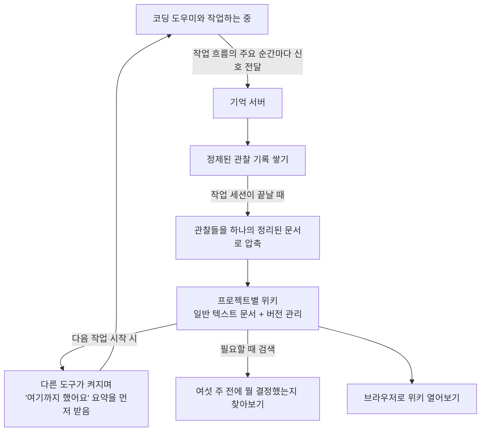

<div class="ai-knowledge-shell">

<aside class="ai-knowledge-sidebar">
  <p class="ai-eyebrow">CATEGORIES</p>
  <nav class="ai-cat-tree"><details class="ai-cat" open><summary><span class="catname">에이전트 오케스트레이션</span><span class="catcount">6</span></summary><ul><li><a href="https://altjs4510.github.io/ai_news_blog/knowledge/20260805/"><span class="kdate">2026-08-05</span><span class="ktitle">TencentCloud/TencentDB-Agent-Memory — 대화·문서·코드를 …</span></a></li><li><a href="https://altjs4510.github.io/ai_news_blog/knowledge/20260701/"><span class="kdate">2026-07-01</span><span class="ktitle">Google OKF (Open Knowledge Format) — 벤더 중립 에이전트 …</span></a></li><li><a href="https://altjs4510.github.io/ai_news_blog/knowledge/20260623/"><span class="kdate">2026-06-23</span><span class="ktitle">bytedance/deer-flow — 샌드박스·메모리·서브에이전트·메시지 게이트웨이를…</span></a></li><li><a href="https://altjs4510.github.io/ai_news_blog/knowledge/20260602/"><span class="kdate">2026-06-02</span><span class="ktitle">revfactory/harness — 도메인별 에이전트 팀과 스킬을 자동 설계하는 메타…</span></a></li><li><a href="https://altjs4510.github.io/ai_news_blog/knowledge/20260529/"><span class="kdate">2026-05-29</span><span class="ktitle">Introducing dynamic workflows in Claude Code</span></a></li><li><a href="https://altjs4510.github.io/ai_news_blog/knowledge/20260507/"><span class="kdate">2026-05-07</span><span class="ktitle">ruvnet/ruflo — Claude 멀티 에이전트 오케스트레이션 플랫폼</span></a></li></ul></details><details class="ai-cat" open><summary><span class="catname">MCP &amp; 도구 통합</span><span class="catcount">17</span></summary><ul><li><a href="https://altjs4510.github.io/ai_news_blog/knowledge/20260802/"><span class="kdate">2026-08-02</span><span class="ktitle">Stateless MCP has recaptured my interest (and in…</span></a></li><li><a href="https://altjs4510.github.io/ai_news_blog/knowledge/20260801/"><span class="kdate">2026-08-01</span><span class="ktitle">different-ai/openwork — Claude Cowork의 오픈소스 대체 에…</span></a></li><li><a href="https://altjs4510.github.io/ai_news_blog/knowledge/20260731/"><span class="kdate">2026-07-31</span><span class="ktitle">different-ai/openwork — Claude Cowork의 오픈소스 대안(o…</span></a></li><li><a href="https://altjs4510.github.io/ai_news_blog/knowledge/20260729/"><span class="kdate">2026-07-29</span><span class="ktitle">Bringing MCP 2026-07-28 to Claude</span></a></li><li><a href="https://altjs4510.github.io/ai_news_blog/knowledge/20260721/"><span class="kdate">2026-07-21</span><span class="ktitle">tirth8205/code-review-graph — 로컬 우선 코드 인텔리전스 그래프…</span></a></li><li><a href="https://altjs4510.github.io/ai_news_blog/knowledge/20260719/"><span class="kdate">2026-07-19</span><span class="ktitle">tirth8205/code-review-graph — 로컬 우선 코드 인텔리전스 그래프…</span></a></li><li><a href="https://altjs4510.github.io/ai_news_blog/knowledge/20260718/"><span class="kdate">2026-07-18</span><span class="ktitle">tirth8205/code-review-graph — MCP·CLI용 로컬 코드 인텔리…</span></a></li><li><a href="https://altjs4510.github.io/ai_news_blog/knowledge/20260709/"><span class="kdate">2026-07-09</span><span class="ktitle">mvanhorn/last30days-skill — Reddit·X·YouTube·HN·…</span></a></li><li><a href="https://altjs4510.github.io/ai_news_blog/knowledge/20260708/"><span class="kdate">2026-07-08</span><span class="ktitle">Expanding Managed Agents in Gemini API: backgrou…</span></a></li><li><a href="https://altjs4510.github.io/ai_news_blog/knowledge/20260618/"><span class="kdate">2026-06-18</span><span class="ktitle">DeusData/codebase-memory-mcp — 158개 언어 코드베이스를 밀리…</span></a></li><li><a href="https://altjs4510.github.io/ai_news_blog/knowledge/20260606/"><span class="kdate">2026-06-06</span><span class="ktitle">chopratejas/headroom — Compress tool outputs, lo…</span></a></li><li><a href="https://altjs4510.github.io/ai_news_blog/knowledge/20260605/"><span class="kdate">2026-06-05</span><span class="ktitle">chopratejas/headroom — Compress tool outputs, lo…</span></a></li><li><a href="https://altjs4510.github.io/ai_news_blog/knowledge/20260604/"><span class="kdate">2026-06-04</span><span class="ktitle">chopratejas/headroom — Compress tool outputs bef…</span></a></li><li><a href="https://altjs4510.github.io/ai_news_blog/knowledge/20260603/"><span class="kdate">2026-06-03</span><span class="ktitle">How Bad MCP design cost your Agent 5× more token…</span></a></li><li><a href="https://altjs4510.github.io/ai_news_blog/knowledge/20260523/"><span class="kdate">2026-05-23</span><span class="ktitle">colbymchenry/codegraph — 사전 인덱싱된 코드 지식 그래프 MCP</span></a></li><li><a href="https://altjs4510.github.io/ai_news_blog/knowledge/20260517/"><span class="kdate">2026-05-17</span><span class="ktitle">I gave my LLM 100,000+ tools — Lazy Discovery &a…</span></a></li><li><a href="https://altjs4510.github.io/ai_news_blog/knowledge/20260509/"><span class="kdate">2026-05-09</span><span class="ktitle">How to connect 100 MCP servers without the conte…</span></a></li></ul></details><details class="ai-cat" open><summary><span class="catname">코딩 에이전트</span><span class="catcount">26</span></summary><ul><li><a href="https://altjs4510.github.io/ai_news_blog/knowledge/20260820/" class="current"><span class="kdate">2026-08-20</span><span class="ktitle">akitaonrails/ai-memory — 코딩 에이전트 CLI의 장기 메모리와 벤더…</span></a></li><li><a href="https://altjs4510.github.io/ai_news_blog/knowledge/20260819/"><span class="kdate">2026-08-19</span><span class="ktitle">akitaonrails/ai-memory — 코딩 에이전트 CLI 간 장기 기억과 벤더…</span></a></li><li><a href="https://altjs4510.github.io/ai_news_blog/knowledge/20260814/"><span class="kdate">2026-08-14</span><span class="ktitle">cathrynlavery/diagram-design — Claude Code용 에디토리…</span></a></li><li><a href="https://altjs4510.github.io/ai_news_blog/knowledge/20260811/"><span class="kdate">2026-08-11</span><span class="ktitle">PrimeIntellect-ai/prime-agent — 장기 자율 실행을 전제로 설계…</span></a></li><li><a href="https://altjs4510.github.io/ai_news_blog/knowledge/20260810/"><span class="kdate">2026-08-10</span><span class="ktitle">Auto mode is now the default in Claude Code for …</span></a></li><li><a href="https://altjs4510.github.io/ai_news_blog/knowledge/20260809/"><span class="kdate">2026-08-09</span><span class="ktitle">PrimeIntellect-ai/prime-agent — 코딩 워크플로우·장기 자율 작…</span></a></li><li><a href="https://altjs4510.github.io/ai_news_blog/knowledge/20260808/"><span class="kdate">2026-08-08</span><span class="ktitle">PrimeIntellect-ai/prime-agent — 코딩 워크플로우와 장시간 자율…</span></a></li><li><a href="https://altjs4510.github.io/ai_news_blog/knowledge/20260804/"><span class="kdate">2026-08-04</span><span class="ktitle">esengine/DeepSeek-Reasonix — prefix-cache 안정성을 축…</span></a></li><li><a href="https://altjs4510.github.io/ai_news_blog/knowledge/20260728/"><span class="kdate">2026-07-28</span><span class="ktitle">alibaba/open-code-review — 결정론적 파이프라인 + LLM 에이전트…</span></a></li><li><a href="https://altjs4510.github.io/ai_news_blog/knowledge/20260725/"><span class="kdate">2026-07-25</span><span class="ktitle">The new rules of context engineering for Claude …</span></a></li><li><a href="https://altjs4510.github.io/ai_news_blog/knowledge/20260722/"><span class="kdate">2026-07-22</span><span class="ktitle">tirth8205/code-review-graph — MCP·CLI용 로컬 우선 코드 …</span></a></li><li><a href="https://altjs4510.github.io/ai_news_blog/knowledge/20260714/"><span class="kdate">2026-07-14</span><span class="ktitle">Graphify-Labs/graphify — 코드베이스를 질의 가능한 지식 그래프로 만…</span></a></li><li><a href="https://altjs4510.github.io/ai_news_blog/knowledge/20260707/"><span class="kdate">2026-07-07</span><span class="ktitle">AI Hero Skills Catalog — 실무 엔지니어를 위한 재사용 가능한 판단 …</span></a></li><li><a href="https://altjs4510.github.io/ai_news_blog/knowledge/20260705/"><span class="kdate">2026-07-05</span><span class="ktitle">openai/codex-plugin-cc — Claude Code에서 Codex를 위임…</span></a></li><li><a href="https://altjs4510.github.io/ai_news_blog/knowledge/20260626/"><span class="kdate">2026-06-26</span><span class="ktitle">google-labs-code/design.md — 코딩 에이전트에게 디자인 시스템을 …</span></a></li><li><a href="https://altjs4510.github.io/ai_news_blog/knowledge/20260619/"><span class="kdate">2026-06-19</span><span class="ktitle">Claude Code now supports artifacts</span></a></li><li><a href="https://altjs4510.github.io/ai_news_blog/knowledge/20260530/"><span class="kdate">2026-05-30</span><span class="ktitle">Leonxlnx/taste-skill — AI에게 좋은 취향을 부여해 generic s…</span></a></li><li><a href="https://altjs4510.github.io/ai_news_blog/knowledge/20260528/"><span class="kdate">2026-05-28</span><span class="ktitle">Building self-improving tax agents with Codex</span></a></li><li><a href="https://altjs4510.github.io/ai_news_blog/knowledge/20260526/"><span class="kdate">2026-05-26</span><span class="ktitle">colbymchenry/codegraph — Pre-indexed code knowle…</span></a></li><li><a href="https://altjs4510.github.io/ai_news_blog/knowledge/20260524/"><span class="kdate">2026-05-24</span><span class="ktitle">colbymchenry/codegraph — Pre-indexed code knowle…</span></a></li><li><a href="https://altjs4510.github.io/ai_news_blog/knowledge/20260521/"><span class="kdate">2026-05-21</span><span class="ktitle">colbymchenry/codegraph — Pre-indexed code knowle…</span></a></li><li><a href="https://altjs4510.github.io/ai_news_blog/knowledge/20260512/"><span class="kdate">2026-05-12</span><span class="ktitle">agentmemory — Persistent memory for AI coding ag…</span></a></li><li><a href="https://altjs4510.github.io/ai_news_blog/knowledge/20260510/"><span class="kdate">2026-05-10</span><span class="ktitle">addyosmani/agent-skills — Production-grade engin…</span></a></li><li><a href="https://altjs4510.github.io/ai_news_blog/knowledge/20260508/"><span class="kdate">2026-05-08</span><span class="ktitle">addyosmani/agent-skills — Production-grade engin…</span></a></li><li><a href="https://altjs4510.github.io/ai_news_blog/knowledge/20260506/"><span class="kdate">2026-05-06</span><span class="ktitle">mksglu/context-mode — AI 코딩 에이전트용 컨텍스트 윈도우 최적화</span></a></li><li><a href="https://altjs4510.github.io/ai_news_blog/knowledge/20260505/"><span class="kdate">2026-05-05</span><span class="ktitle">mattpocock/skills — Skills for Real Engineers (.…</span></a></li></ul></details><details class="ai-cat" open><summary><span class="catname">모델 &amp; 연구</span><span class="catcount">5</span></summary><ul><li><a href="https://altjs4510.github.io/ai_news_blog/knowledge/20260716-proprag/"><span class="kdate">2026-07-16</span><span class="ktitle">PropRAG — 프로포지션 경로 위 beam search로 멀티홉 검색 안내</span></a></li><li><a href="https://altjs4510.github.io/ai_news_blog/knowledge/20260620/"><span class="kdate">2026-06-20</span><span class="ktitle">zai-org/GLM-5 — From Vibe Coding to Agentic Engi…</span></a></li><li><a href="https://altjs4510.github.io/ai_news_blog/knowledge/20260617/"><span class="kdate">2026-06-17</span><span class="ktitle">Predicting model behavior before release by simu…</span></a></li><li><a href="https://altjs4510.github.io/ai_news_blog/knowledge/20260516/"><span class="kdate">2026-05-16</span><span class="ktitle">STALE — 에이전트가 자기 기억의 유효성을 인지할 수 있는가</span></a></li><li><a href="https://altjs4510.github.io/ai_news_blog/knowledge/20260513/"><span class="kdate">2026-05-13</span><span class="ktitle">Thinking Machines' Native Interaction Models — T…</span></a></li></ul></details><details class="ai-cat" open><summary><span class="catname">인프라 &amp; 컴퓨트</span><span class="catcount">8</span></summary><ul><li><a href="https://altjs4510.github.io/ai_news_blog/knowledge/20260813/"><span class="kdate">2026-08-13</span><span class="ktitle">semantica-agi/semantica — 컨텍스트와 책임 추적을 위한 그래프 네이…</span></a></li><li><a href="https://altjs4510.github.io/ai_news_blog/knowledge/20260812/"><span class="kdate">2026-08-12</span><span class="ktitle">semantica-agi/semantica — 컨텍스트와 '책임 추적 가능한(accou…</span></a></li><li><a href="https://altjs4510.github.io/ai_news_blog/knowledge/20260806/"><span class="kdate">2026-08-06</span><span class="ktitle">cloudflare/computer — 에이전트에게 컴퓨터를 통째로 주는 엣지 실행 샌…</span></a></li><li><a href="https://altjs4510.github.io/ai_news_blog/knowledge/20260724/"><span class="kdate">2026-07-24</span><span class="ktitle">diegosouzapw/OmniRoute — 단일 엔드포인트로 278+ 프로바이더·50…</span></a></li><li><a href="https://altjs4510.github.io/ai_news_blog/knowledge/20260723/"><span class="kdate">2026-07-23</span><span class="ktitle">diegosouzapw/OmniRoute — 268+ 프로바이더를 단일 엔드포인트로 묶…</span></a></li><li><a href="https://altjs4510.github.io/ai_news_blog/knowledge/20260611/"><span class="kdate">2026-06-11</span><span class="ktitle">The evolution of agentic surfaces: building with…</span></a></li><li><a href="https://altjs4510.github.io/ai_news_blog/knowledge/20260522/"><span class="kdate">2026-05-22</span><span class="ktitle">Giving Agents Computers — Ivan Burazin, Daytona</span></a></li><li><a href="https://altjs4510.github.io/ai_news_blog/knowledge/20260520/"><span class="kdate">2026-05-20</span><span class="ktitle">New in Claude Managed Agents: self-hosted sandbo…</span></a></li></ul></details><details class="ai-cat" open><summary><span class="catname">보안 &amp; 거버넌스</span><span class="catcount">16</span></summary><ul><li><a href="https://altjs4510.github.io/ai_news_blog/knowledge/20260819-mind-viruses/"><span class="kdate">2026-08-19</span><span class="ktitle">탈옥도, 인젝션도 없이 — 대화로만 퍼지는 에이전트의 '마인드 바이러스'</span></a></li><li><a href="https://altjs4510.github.io/ai_news_blog/knowledge/20260730/"><span class="kdate">2026-07-30</span><span class="ktitle">Anatomy of a Frontier Lab Agent Intrusion: A Tec…</span></a></li><li><a href="https://altjs4510.github.io/ai_news_blog/knowledge/20260716/"><span class="kdate">2026-07-16</span><span class="ktitle">Dicklesworthstone/destructive_command_guard — 에이…</span></a></li><li><a href="https://altjs4510.github.io/ai_news_blog/knowledge/20260715/"><span class="kdate">2026-07-15</span><span class="ktitle">Dicklesworthstone/destructive_command_guard — 에이…</span></a></li><li><a href="https://altjs4510.github.io/ai_news_blog/knowledge/20260710/"><span class="kdate">2026-07-10</span><span class="ktitle">70개 MCP 서버 strace 런타임 감사 — 부팅 시 아웃바운드 호출 서버 적발</span></a></li><li><a href="https://altjs4510.github.io/ai_news_blog/knowledge/20260704/"><span class="kdate">2026-07-04</span><span class="ktitle">Cloudflare is about to block AI agents by defaul…</span></a></li><li><a href="https://altjs4510.github.io/ai_news_blog/knowledge/20260703/"><span class="kdate">2026-07-03</span><span class="ktitle">Giving admins more visibility and control over C…</span></a></li><li><a href="https://altjs4510.github.io/ai_news_blog/knowledge/20260630/"><span class="kdate">2026-06-30</span><span class="ktitle">Introducing the Claude apps gateway for Amazon B…</span></a></li><li><a href="https://altjs4510.github.io/ai_news_blog/knowledge/20260625/"><span class="kdate">2026-06-25</span><span class="ktitle">Agent identity in Claude Tag: a new access model…</span></a></li><li><a href="https://altjs4510.github.io/ai_news_blog/knowledge/20260624/"><span class="kdate">2026-06-24</span><span class="ktitle">Agent identity in Claude Tag: a new access model…</span></a></li><li><a href="https://altjs4510.github.io/ai_news_blog/knowledge/20260614/"><span class="kdate">2026-06-14</span><span class="ktitle">NVIDIA/SkillSpector — Security scanner for AI ag…</span></a></li><li><a href="https://altjs4510.github.io/ai_news_blog/knowledge/20260613/"><span class="kdate">2026-06-13</span><span class="ktitle">Fable 5's guardrails got bypassed in 48 hours — …</span></a></li><li><a href="https://altjs4510.github.io/ai_news_blog/knowledge/20260612/"><span class="kdate">2026-06-12</span><span class="ktitle">NVIDIA/SkillSpector — AI 에이전트 스킬용 보안 스캐너</span></a></li><li><a href="https://altjs4510.github.io/ai_news_blog/knowledge/20260607/"><span class="kdate">2026-06-07</span><span class="ktitle">OpenAI Help: Lockdown Mode</span></a></li><li><a href="https://altjs4510.github.io/ai_news_blog/knowledge/20260531/"><span class="kdate">2026-05-31</span><span class="ktitle">How we contain Claude across products</span></a></li><li><a href="https://altjs4510.github.io/ai_news_blog/knowledge/20260527/"><span class="kdate">2026-05-27</span><span class="ktitle">Microsoft Copilot Cowork Exfiltrates Files</span></a></li></ul></details><details class="ai-cat" open><summary><span class="catname">응용 사례</span><span class="catcount">7</span></summary><ul><li><a href="https://altjs4510.github.io/ai_news_blog/knowledge/20260726/"><span class="kdate">2026-07-26</span><span class="ktitle">citrolabs/ego-lite — 로그인된 브라우저 상태를 AI 에이전트와 공유하는…</span></a></li><li><a href="https://altjs4510.github.io/ai_news_blog/knowledge/20260717/"><span class="kdate">2026-07-17</span><span class="ktitle">After a year building agent memory, 'save everyt…</span></a></li><li><a href="https://altjs4510.github.io/ai_news_blog/knowledge/20260712/"><span class="kdate">2026-07-12</span><span class="ktitle">Do Automated Evals Work?</span></a></li><li><a href="https://altjs4510.github.io/ai_news_blog/knowledge/20260621/"><span class="kdate">2026-06-21</span><span class="ktitle">calesthio/OpenMontage — 12 파이프라인·52 도구·500+ 스킬을 …</span></a></li><li><a href="https://altjs4510.github.io/ai_news_blog/knowledge/20260609/"><span class="kdate">2026-06-09</span><span class="ktitle">Building intelligent apps for Apple platforms wi…</span></a></li><li><a href="https://altjs4510.github.io/ai_news_blog/knowledge/20260515/"><span class="kdate">2026-05-15</span><span class="ktitle">Clawdmeter — Claude Code 사용량을 데스크톱 대시보드로</span></a></li><li><a href="https://altjs4510.github.io/ai_news_blog/knowledge/20260514/"><span class="kdate">2026-05-14</span><span class="ktitle">Introducing Claude for Small Business</span></a></li></ul></details><details class="ai-cat" open><summary><span class="catname">산업 동향</span><span class="catcount">6</span></summary><ul><li><a href="https://altjs4510.github.io/ai_news_blog/knowledge/20260711/"><span class="kdate">2026-07-11</span><span class="ktitle">OpenAI says GPT 5.6 is the 'preferred model' for…</span></a></li><li><a href="https://altjs4510.github.io/ai_news_blog/knowledge/20260702/"><span class="kdate">2026-07-02</span><span class="ktitle">How Cursor deploys AI inside the enterprise (For…</span></a></li><li><a href="https://altjs4510.github.io/ai_news_blog/knowledge/20260616/"><span class="kdate">2026-06-16</span><span class="ktitle">Why AI hasn't replaced software engineers, and w…</span></a></li><li><a href="https://altjs4510.github.io/ai_news_blog/knowledge/20260610/"><span class="kdate">2026-06-10</span><span class="ktitle">Fable 5 just made cost-aware model routing manda…</span></a></li><li><a href="https://altjs4510.github.io/ai_news_blog/knowledge/20260519/"><span class="kdate">2026-05-19</span><span class="ktitle">Anthropic acquires Stainless</span></a></li><li><a href="https://altjs4510.github.io/ai_news_blog/knowledge/20260504/"><span class="kdate">2026-05-04</span><span class="ktitle">Agents for Everything Else: Codex for Knowledge …</span></a></li></ul></details></nav>
</aside>

<article class="ai-knowledge-article">

<header class="ai-post-hero">
  <p class="ai-eyebrow"><a class="ai-back" href="../">KNOWLEDGE</a> · 2026-08-20 · 오늘의 학습</p>
  <h2 class="ai-post-title">akitaonrails/ai-memory — 코딩 에이전트 CLI의 장기 메모리와 벤더 간 핸드오프 계층</h2>
</header>

> 원문: [akitaonrails/ai-memory — 코딩 에이전트 CLI의 장기 메모리와 벤더 간 핸드오프 계층](https://github.com/akitaonrails/ai-memory)

## 📌 학습 정리

### 1. 한 줄로 말하면

작업하던 AI 코딩 도우미를 도중에 끄고 다른 회사 도구로 갈아타도, 지금까지 무슨 얘기를 했고 뭘 시도해봤는지 다시 설명하지 않아도 되게 해주는 "공용 업무 노트"예요.

### 2. 왜 이게 만들어졌어요?

코드를 대신 써주는 AI 도구들은 대화 창을 닫으면 그동안의 맥락을 잃어버려요. 그래서 다음날 다시 켜면 "이 프로젝트 구조가 이렇고, 저 방식은 이미 시도했다가 안 됐고, 아직 이 부분은 결정을 못 했다"를 처음부터 다시 설명하게 되죠. 여기에 더해 요즘은 모델을 바꿔 타는 게 쉬워졌는데, 도구를 A사에서 B사로 옮기는 순간 쌓아둔 기억은 하나도 따라오지 않아요. 그러니까 "어느 모델이 더 똑똑한가"보다 **도구 사이를 옮길 때 맥락이 끊긴다는 것 자체**가 더 실질적인 불편이었던 셈이에요. 이 프로젝트는 그 끊김을 메우려고, 여러 도구가 함께 읽고 쓰는 하나의 기억 저장소를 러스트(Rust, 성능과 안정성을 중시하는 프로그래밍 언어)로 구현했습니다.

### 3. 비유로 풀면

**공사 현장의 인수인계 노트 같은 거예요.** 오전 작업자가 퇴근할 때 "여기까지 했고, 이 배관은 막혀서 우회했고, 자재는 아직 안 왔다"를 노트에 적어두면, 오후에 다른 팀 사람이 와도 노트만 읽고 이어서 일할 수 있죠. 사람이 바뀌는 게 문제가 아니라 노트가 없는 게 문제였던 겁니다.

**또 하나는 회사의 사내 위키에 가까워요.** 매일의 잡담 로그를 전부 뒤지는 게 아니라, 하루가 끝나면 그날의 관찰들을 정리해 "이 프로젝트는 데이터베이스로 이걸 쓰기로 했다" 같은 한 장의 정리된 문서로 만들어 둡니다.

그래서 결국, 기억을 특정 AI 도구 안에 두지 말고 **프로젝트 폴더 옆에 문서로 빼둔 다음 아무 도구나 읽게 하자**는 접근이에요.

### 4. 어떻게 작동하는지 (그림으로)



핵심은 세 단계예요. 첫째, 각 도구가 작업 도중 특정 시점(세션 시작·종료, 도구 실행 등)에 서버로 짧은 기록을 흘려보냅니다. 둘째, 세션이 끝나면 그 조각들이 사람이 읽을 수 있는 한 장의 문서로 정리돼 위키에 저장돼요. 셋째, 다음에 어떤 도구를 켜든 시작할 때 "지난번엔 여기까지, 미해결 질문은 이것" 하는 인수인계 블록을 먼저 받습니다.

저장소가 특별한 데이터베이스가 아니라 **평범한 마크다운 파일 묶음**이라는 점도 설계상 의도예요. 원문 표현대로 `grep`으로 검색되고, 옵시디언(Obsidian, 마크다운 메모 앱)으로 열리고, `rsync`로 백업됩니다. 프로젝트마다 폴더가 갈려 있어서, 실험 하나를 버리고 싶으면 그 프로젝트만 지우면 나머지는 그대로 남습니다.

또 하나 눈여겨볼 부분은 **가져온 기억을 "명령"으로 취급하지 않는다**는 원칙이에요. 위키에서 꺼내온 문장은 어디까지나 과거의 기록일 뿐이고, 지금 코드가 실제로 어떤지는 현재 소스와 빌드·테스트 결과로 확인해야 한다고 문서가 반복해서 못 박아 둡니다.

### 5. 처음 보는 용어 풀이

- **모형 문맥 연결 규약 (MCP, Model Context Protocol)** — AI 도우미가 바깥의 도구나 데이터 저장소에 접속해 읽고 쓰게 해주는 공통 규격이에요. 이 프로젝트는 이 규격을 통해 여러 회사의 도구에 같은 방식으로 붙습니다.
- **생애주기 훅 (lifecycle hooks)** — "세션이 시작될 때", "도구를 실행한 뒤", "세션이 끝날 때"처럼 정해진 순간에 자동으로 실행되도록 걸어두는 갈고리예요. 사용자가 따로 명령하지 않아도 기록이 남는 이유가 이것 때문입니다.
- **인수인계 (handoff)** — 이전 작업의 요약, 남은 할 일, 미해결 질문을 담은 한 덩어리의 메모예요. 다음 도구가 첫 질문을 받기 전에 이걸 먼저 읽습니다. 한 번 쓰이면 소모되는 성격이라, 오래 남겨둘 내용은 따로 문서로 저장해야 해요.
- **전문 검색 (FTS5, Full-Text Search)** — 문서 안의 단어를 색인해두고 빠르게 찾아주는 기능이에요. 별도의 무거운 검색 엔진 없이도 "여섯 주 전에 뭘 결정했지"를 찾을 수 있게 해줍니다.
- **의미 벡터 검색 (vector search / embedding)** — 문장을 숫자 묶음으로 바꿔 "표현이 달라도 뜻이 비슷한" 문서를 찾는 방식이에요. 이 프로젝트에선 필수가 아니라 선택 사항이고, 안 켜도 단어 기반 검색은 그대로 동작합니다.
- **소멸 관리 (decay / forget sweep)** — 오래되고 잘 쓰이지 않는 기록은 중요도가 낮아지고, 만료 날짜를 지정한 문서는 기간이 지나면 실제로 지워지는 청소 절차예요. 계속 쌓이기만 해서 잡음이 되는 걸 막으려는 장치입니다. 남겨야 할 문서는 고정(pin) 표시로 청소에서 빼둘 수 있어요.
- **관리형 실행 (managed workstream)** — 도구를 직접 켜는 대신 이 프로젝트를 거쳐 켜면, 요약만 넘기는 것보다 한 단계 더 나아가 각 도구의 원래 세션까지 이어붙여 주는 선택형 방식이에요. 원문에서는 "하나의 논리적 작업 흐름"을 여러 도구가 번갈아 이어받는 것으로 설명합니다.
- **없어도 되는 대형 언어 모델 (LLM은 opt-in)** — 요약 문서를 자동으로 만들거나 모순을 잡아내려면 언어 모델이 필요하지만, 안 붙여도 검색과 규칙 기반 요약은 그대로 쓸 수 있다는 뜻이에요.

### 6. 한 발 더 들어가고 싶다면

- [akitaonrails/ai-memory](https://github.com/akitaonrails/ai-memory) — 저장소 본체예요. 지원하는 도구 목록, 설치 방법, 실제 명령어 예시를 여기서 볼 수 있어요.
- 저장소 안의 `docs/ARCHITECTURE.md` — 왜 벡터 데이터베이스 없이 마크다운 위키로 갔는지, 관찰 기록이 어떻게 문서로 압축되는지 설계 의도를 알 수 있어요.
- 저장소 안의 `docs/managed-workstreams.md` — 도구를 바꿔 타면서도 하나의 작업 흐름을 유지하는 선택형 방식이 구체적으로 어떻게 동작하는지 나옵니다.
- 저장소 안의 `docs/install.md`, `docs/macos.md`, `docs/windows.md` — 각 운영체제에서 어떤 방식으로 설치·실행하는지, 어디까지 정식 지원이고 어디가 실험 단계인지 구분해 볼 수 있어요.
- 저장소 안의 `docs/auto-improve-eval-gates.md` — 자동으로 제안된 문서 수정을 사람이 검토·승인하는 절차와, 그 품질을 실제로 채점하는 예시를 볼 수 있어요.

---

## 📖 원문 전체 번역 (정독용)

> 의역 최소화한 전체 번역입니다. 큰 흐름은 위 정리에서 잡고, 정확한 워딩이 필요할 땐 이 섹션에서 정독하세요.

AI 코딩 에이전트를 위한 장기 메모리. Claude Code를 작업 중간에 종료하고,
같은 디렉터리에서 OpenAI Codex를 시작해서, 아키텍처나 실패한 접근법이나
미해결 질문들을 다시 설명할 필요 없이 이어간다.

## 지원 매트릭스

| 영역 | 상태 | 비고 |
|---|---|---|
| Linux | 지원됨 | 주요 Docker/서버 타깃이자 CI 플랫폼. 배포된 Docker 이미지는 `linux/amd64` 와 `linux/arm64` 를 지원한다. 네이티브 Arch/AUR 패키지는 시스템 및 사용자 systemd 유닛을 포함한다. |
| macOS | 지원됨 | 워크스페이스 테스트가 CI에서 실행되며, 태그된 릴리스는 네이티브 `ai-memory-macos-aarch64.tar.gz` 와 `ai-memory-macos-x86_64.tar.gz` 바이너리를 배포한다. Apple Silicon 에서는 네이티브 바이너리가 권장 경로다. `docs/macos.md` 참조. |
| Windows via WSL2 | 지원됨 | 에이전트가 WSL2 안에서 실행될 때는 WSL2 내부에서 Linux 설치 경로를 사용한다. |
| 네이티브 Windows | 실험적 | 태그된 릴리스는 `ai-memory.exe` 를 포함한 `ai-memory-windows-x86_64.zip` 을 배포한다; Docker Desktop 래퍼와 소스 빌드도 가능하다. 로컬 지원 프로파일은 기본적으로 호스트 네이티브 훅 명령을 사용한다; Claude Code는 자체 Windows exec 형식을 쓸 수 있고, 다른 에이전트들은 각자의 훅 스키마에 맞는 네이티브 단일 명령 문자열을 쓴다. PowerShell/Git Bash 스크립트는 호환성 폴백이다. `docs/windows.md` 참조. |
| Claude Code | 지원됨 | MCP 설정 + 라이프사이클 훅; 네이티브 명령이 캡처 제외 규칙을 강제한다. `install-mcp --session-aware` 는 로컬 stdio 브리지를 통한 세션별 자동 스코프 격리를 선택적으로 활성화한다. `--capture-assistant` 로 설치되고 서버에서 `capture_assistant` 를 활성화한 경우, `Stop` 시점에 어시스턴트의 마지막 턴을 선택적으로 캡처한다 (이중 옵트인, 기본은 꺼짐). |
| Codex | 지원됨 | MCP 설정 + 라이프사이클 훅; 네이티브 명령이 캡처 제외 규칙을 강제한다. 자동 트루 세션 종료 훅이 없으므로, 마지막 요약/핸드오프가 필요할 때는 `ai-memory finalize-session` 을 실행한다. |
| Command Code | 지원됨 | MCP 설정(`~/.commandcode/mcp.json`) + 4개의 안정적인 라이프사이클 훅 이벤트(`~/.commandcode/settings.json`); 네이티브 명령이 캡처 제외 규칙을 강제하고 `SessionStart` 가 핸드오프를 주입한다. `Stop` 은 단지 턴 경계일 뿐이므로 마지막 턴 이후 `ai-memory finalize-session --agent command-code` 를 사용한다. `ai-memory run command-code` 는 정확한 v3 네이티브 세션 재개와 가시적 이벤트 임포트를 추가한다; 실험적인 샌드박스 미적용 Mods는 계속 제외된다. |
| Devin CLI | 지원됨 | MCP 설정 + 라이프사이클 훅. 훅은 Devin의 `PostCompaction` 이벤트를 사용하고, `hookSpecificOutput.additionalContext` 를 통해 핸드오프를 주입하며, Devin이 서브에이전트 이벤트를 노출하지 않으므로 그 이벤트들은 생략한다. |
| OpenCode | 지원됨 | 원격 MCP 설정 + 생성된 TypeScript 플러그인; 생성된 플러그인이 캡처 제외 규칙을 강제한다. |
| Cursor | 지원됨 | MCP 설정 + 라이프사이클 훅. |
| Gemini CLI | 지원됨 | MCP 설정 + 라이프사이클 훅. |
| Oh My Pi / OMP | 지원됨 | 네이티브 `.omp` MCP 설정 + TypeScript 확장을 위해 `--client omp`/`--agent omp`(또는 `oh-my-pi`)를 사용한다; 생성된 확장이 캡처 제외 규칙을 강제한다. |
| Pi | 지원됨 | 생성된 `~/.pi/agent/extensions/ai-memory.ts` 확장이 라이프사이클 캡처와 HTTP MCP 브리지를 제공한다; 생성된 확장이 캡처 제외 규칙을 강제한다. |
| Crush | 관리형 전용 | `ai-memory run crush` 가 프로젝트 로컬 세션 데이터베이스를 재개하고 임시 지원되는 전역-컨텍스트 파일을 통해 이식 가능한 컨텍스트를 제공한다; 라이프사이클 훅 설치자는 제공되지 않는다. |
| 관리형 워크스트림 | 옵트인 | `ai-memory run` 은 Claude Code, Codex, OpenCode, Pi, Crush, Kimi Code, Command Code, 호환되지 않는 두 Kiro CLI 엔진 모두, OMP, Grok Build CLI, Antigravity CLI 사이에서 투명한 크로스-하니스 연속성을 제공한다. 직접 실행은 그대로 유지된다. `docs/managed-workstreams.md` 참조. |
| Claude Desktop | MCP 전용 | `mcp-remote` 를 사용; 라이프사이클 훅 없음. |
| OpenClaw | 지원됨 | MCP 설정 + 네이티브 플러그인 라이프사이클 훅; 생성된 플러그인이 캡처 제외 규칙을 강제한다. |
| Antigravity CLI | 지원됨 | MCP 설정(`serverUrl`) + 라이프사이클 훅(`agy` 별칭). `invocationNum = 0` 인 `PreInvocation` 만 SessionStart 로 매핑된다; 이후의 모델 호출들은 다음 세션 핸드오프를 소비할 수 없다. 자동 트루 세션 종료 훅이 없으므로, 요약·핸드오프·옵트인 SessionEnd 통합이 필요할 때는 마지막 턴 이후 `ai-memory finalize-session --agent antigravity-cli` 를 실행한다. `ai-memory run antigravity`(별칭 `antigravity-cli`, `agy`)는 `--conversation` 을 통한 관리형 워크스트림 재개를 추가한다; 대화 텍스트는 디코딩되지 않으므로, 이 하니스의 원장(ledger)은 훅 캡처에서 나온다. |
| Grok Build CLI | 지원됨 | MCP 설정(`install-mcp --client grok` → `$GROK_HOME/config.toml`, 기본 `~/.grok/config.toml`) + 라이프사이클 훅(`install-hooks --agent grok` → `$GROK_HOME/hooks/ai-memory.json`, 기본 `~/.grok/hooks/ai-memory.json`, Grok 전용 훅 번들). 캡처는 동작하지만; 훅 핸드오프 주입은 없다 — Grok이 `SessionStart` stdout을 무시하므로, MCP `memory_handoff_accept` 를 통해 핸드오프를 복구한다. `ai-memory run grok` 은 `--rules` 를 통해 컨텍스트 패킷을 네이티브로 전달하는 관리형 워크스트림 재개를 추가한다. Skills 루트: `.grok/skills` / `$GROK_HOME/skills`(기본 `~/.grok/skills`). |
| Swival CLI | MCP 전용 | `install-mcp --client swival --apply` 는 프로젝트 루트의 `.swival/mcp.json` 에 네이티브 HTTP 항목을 병합하며, 형제 서버들을 보존한다. Swival의 콜백 계약이 안정적인 세션 식별자를 노출하지 않으므로 라이프사이클 및 관리형 워크스트림 지원은 명시하지 않는다. |
| Zero | 지원됨 | `install-mcp --client zero`(네이티브 HTTP + `~/.config/zero/config.json` 의 bearer) + `install-hooks --agent zero --apply` 를 통한 라이프사이클 훅(`~/.config/zero/hooks.json` 의 exec-형 네이티브 명령, stdin에 JSON 페이로드, 셸 없음). 스페셜리스트(서브에이전트) 이벤트를 포함한 캡처는 동작한다; 핸드오프 주입은 없다 — Zero가 `sessionStart` stdout을 버리므로, MCP `memory_handoff_accept` 를 통해 핸드오프를 복구한다. |
| Kimi Code | 지원됨 | MCP 설정(`~/.kimi-code/mcp.json` 의 `url` 항목) + 라이프사이클 훅(`~/.kimi-code/config.toml` 의 `[[hooks]]`, 서브에이전트 시작/종료와 도구 실패 캡처를 위한 `PostToolUseFailure` 를 포함한 10개 이벤트); 두 경로 모두 `$KIMI_CODE_HOME` 을 따른다. 핸드오프는 `UserPromptSubmit` stdout을 통해 주입된다(Kimi Code는 `SessionStart` 훅 stdout을 버림); `ai-memory run kimi` 는 관리형 워크스트림 재개를 추가한다. |
| Kiro CLI | 지원됨 | MCP 설정은 `install-mcp --client kiro-cli`(별칭 `kiro`)와 Kiro의 Bedrock 호환 스키마 유형을 사용한다. `install-hooks --agent kiro-cli` 는 기존 에이전트 설정에 v2 훅을 병합한다; 명시적인 `--agent kiro-cli-v3` 타깃은 호환되지 않는 독립형 v3 등록을 작성한다. 둘 다 무관한 항목을 보존하고, `$KIRO_HOME` 을 따르며, 캡처 제외 규칙을 강제하고, 세션 시작 시 대기 중인 핸드오프를 주입한다. Kiro에는 진짜 SessionEnd 훅이 없다; 동시 세션의 경우 `--session-id <uuid>` 와 함께 `ai-memory finalize-session --agent kiro-cli` 를 사용한다. `ai-memory run kiro` 는 v2를 관리한다; 버전 안전한 v3 재개를 위해서는 `--v3`, `--mode`, 또는 `--agent-engine v3` 를 추가한다. |
| VS Code Copilot | MCP 전용 | Copilot 에이전트 모드를 위한 `.vscode/mcp.json`; 라이프사이클 훅 없음(Copilot이 아직 노출하지 않음). |
| Zed | MCP 전용 | Zed의 사용자 `settings.json` 내 `context_servers` 하에 있는 네이티브 원격 MCP; 라이프사이클 훅이나 관리형 워크스트림 지원 없음. |
| Hermes Agent | 커뮤니티 | 핵심 훅 수집은 `agent=hermes` 와, 구체적인 세션 귀속·도구군 제목·캡처 제외를 위한 Hermes의 문서화된 셸-훅 `tool_name`/`tool_input` 페이로드를 인식한다. 커뮤니티가 유지관리하는 `ai-memory-hermes-plugin` 이 있지만 퍼스트파티 설치자는 제공되지 않는다; 사용 전에 호환성 매트릭스, 설치/제거 스크립트, 비밀정보 처리를 검토하라. Hermes는 세션 시작 훅 stdout을 무시하므로, MCP를 통해 핸드오프를 복구한다. |
| LLM/인증 제공자 | 지원됨 | Anthropic, OpenAI, OpenAI OAuth/Codex, GitHub Copilot, Gemini, OpenCode Zen/Go, OpenAI 호환 엔드포인트, 그리고 네이티브 훅용 범용 OIDC 디바이스 인증. |
| 임베딩 제공자 | 지원됨 | OpenAI, Voyage, Google Gemini, 그리고 Ollama, LM Studio, vLLM 같은 키 불필요 OpenAI 호환 엔드포인트. |

## 이것은 무엇인가

LLM 코딩 에이전트는 세션이 끝나면 맥락을 잃는다. ai-memory는 정제된 라이프사이클
관찰(observation)로부터 컴파일된, 공유되는 영속적인 위키를 제공한다. 세션이 끝나면
관련 관찰들이 일관된 요약으로 변환되고, 다음 에이전트는 경계가 정해진(bounded) 핸드오프를
받는다. 선택적인 `ai-memory run` 실행은 더 높은 충실도의 크로스-하니스 연속성을 위해
이식 가능한 가시적 이벤트 원장(ledger)과 하니스별 네이티브 재개(resume)를 추가로 제공한다.

이 위키는 git 저장소 안의 순수 마크다운이다 — `grep` 으로 검색 가능하고,
Obsidian에서 열 수 있고, `rsync` 로 백업된다. 관리해야 할 벡터 데이터베이스도 없고,
`write_note` 의식(儀式)도 없고, 수동 컨텍스트 로딩도 없다. 전체 설계는
`docs/ARCHITECTURE.md` 에 있으며, 영향을 준 것들과 전제(prior)는 하단에 있다.

## 주요 기능

**마찰 없는 라이프사이클 캡처.**
훅들은 경계가 정해지고 정제된 프롬프트, 도구 라이프사이클, 세션 경계 관찰들을 fire-and-forget 방식으로 발생시킨다. 직접 실행은 이 경량 경로를 유지한다; 이는 완전한 네이티브 트랜스크립트가 아니다. 사용자 프롬프트와 압축(compaction) 후 요약은 최대 16 KiB까지 보존되며; 알림과 도구 발췌는 최대 2 KB까지 보존되고, 모든 관찰 본문에 대해 16 KiB의 내구성 있는 백스톱이 적용된다.

**옵트인 관리형 워크스트림.**
`ai-memory run claude`, 그다음 `ai-memory run codex --yolo`, 그다음 `ai-memory run command-code` 는 네이티브 하니스별 세션, 이식 가능한 가시적 이벤트 원장, 전체 원장 검색을 갖춘 하나의 논리적 워크스트림을 투명하게 재개한다. 전달된 패킷들은 출처가 표시되며; Claude 트랜스크립트 임포트는 Claude가 저장했다가 도구를 통해 다시 읽은 패킷을 거부한다.

하니스 이름 없이 `ai-memory run` 을 실행하면 이 체크아웃에 대한 가장 최신의 사용 가능한 Claude Code, Codex, OpenCode, Pi, Crush, Kimi Code, Command Code, 또는 Kiro CLI v2/v3 세션을 이어간다. 첫 명시적 사용 시, 대화형 런처가 동일한 체크아웃의 이전 세션을 채택할 수 있다; 이후의 전환은 무관한 네이티브 히스토리를 선택할 수 없다. 래퍼가 소유한 `--yolo` 와 `--fresh` 를 제외한 네이티브 인자들은 그대로 통과된다; 직접 실행 명령들은 영향을 받지 않는다. `kimi-code` 와 `kimi-cli` 는 설치된 `kimi` 명령의 허용된 별칭이며; `commandcode`, `cmdc`, `cmd` 는 크로스플랫폼 `command-code` 실행 파일(네이티브 Windows에서는 `cmdc`)을 선택하고; `kiro-cli` 는 설치된 `kiro-cli` 명령을 선택한다. Kiro는 기본적으로 v2이며; `ai-memory run kiro --v3` 는 v3을 선택하고, 반면 이미 연결된 v3 워크스트림으로 돌아올 경우 그 엔진을 투명하게 선택한다.

**저장소별 캡처 제외.**
가장 가까운 마커의 `[capture]` `ignore_paths` 정책은 일치하는 인식된 파일-도구 이벤트를 로컬 스풀이나 서버에 도달하기 전에 폐기한다. [캡처 정책 레퍼런스](.) 참조.

**선택적인 오퍼레이터별 메모리 슬롯.**
공유 서버에서, `[slots] per_user = true` 는 엔진이 작성한 `_slots/` 컨텍스트를 인증된 오퍼레이터로부터 도출된 경계가 정해진 네임스페이스 안에 유지한다. 세션 브리핑과 통합(consolidation) 프롬프트는 공유 슬롯에 더해 호출자 자신의 슬롯을 받는다; 정확한 위키 읽기와 검색은 프로젝트 전역으로 유지되므로, 이는 RBAC라기보다는 컨텍스트-주입 격리다. [다중 사용자 운영](.) 참조.

**크로스-에이전트 핸드오프.**
Claude Code를 작업 중간에 종료하고, 몇 시간 후 같은 디렉터리에서 Codex를 시작하면 — 다음 에이전트는 첫 프롬프트 전에 "당신이 멈춘 지점"이라는 블록을 본다.

**구조상 보장되는 프로젝트별 격리.**
각 프로젝트는 안정적인 UUID로 키가 지정된 `<wiki_root>/<workspace_id>/<project_id>/…` 에 위치한다. Workspace는 기본값이 `"default"` 다. Project는 `$cwd` 로부터 도출된다: CLI 서브커맨드들(`bootstrap`, `write-page`, `lint` 등)은 메인 git 저장소 루트까지 걸어 올라가므로 동일 저장소의 모든 워크트리가 하나의 프로젝트 정체성을 공유한다; 훅 라우터는 기본적으로 `basename($cwd)` 를 사용하며 저장소-루트 규칙을 선택할 수 있다. 임의의 상위 디렉터리에 `.ai-memory.toml` 마커 파일을 두면 두 필드 중 하나를 명시적으로 재정의할 수 있다 — 다중 클라이언트 컨설팅업, 업무/개인 분리, 모노레포, 또는 연결된 git 워크트리에 딱 맞다.

동일한 페이지 경로가 충돌 없이 두 프로젝트에 존재할 수 있다; 이름 변경은 컬럼 하나 업데이트로 끝나고; 폐기는 `rm -rf` 한 번으로 끝난다.

**전역 선호도 범위.**
표준적인 사용자/팀 컨텍스트 — 기술 선택, 코드 스타일, 지속되는 개인 규칙 — 은 예약된 `_global` 범위(스코프)에 산다(`scope: "global"` 을 가진 `memory_write_page`). 기본 `memory_query` 읽기는 이를 모든 프로젝트에 `global_scope_hits` 로 합집합(union)시키므로, 매직 프로젝트 이름을 대지도 않고 모든-프로젝트 `global=true` 팬아웃 비용도 치르지 않고도 선호도가 새 프로젝트로 함께 따라온다. 이벤트 캡처는 결코 그곳에 쓰지 않는다.

**엔티티 지원 회상(recall).**
통합(consolidation)은 페이지당 최대 10개의 구체적인 명사를 정규(canonical) `entities:` frontmatter에 저장한다. 정확 일치, 접두사 일치, 복합어 일치가 프로젝트 범위의 RRF 스트림을 형성하므로, 쿼리는 본문이 다른 표현을 쓰더라도 페이지를 회수할 수 있다. 이 스트림은 어휘 기반이며 쿼리 시점의 LLM 호출을 추가하지 않는다.

**권위 인지 회상.**
FTS5, 엔티티-매치 RRF, 그래프-이웃 RRF, 선택적 벡터 RRF가 관련성에 따라 후보를 생성한다. 잘림(truncation) 전에, 경계가 정해진 조정이 유지 관리되는 `_rules/`, `decisions/`, `procedures/`, `gotchas/` 페이지들을 밀접하게 일치하는 일화적(episodic) 세션 증거보다 우대한다. Tier, `pinned`, 그리고 명시적인 `canonical`/`active`/`source-of-truth` 또는 `superseded`/`historical`/`test-fixture`/`do-not-answer-from` 태그들은 절대적 필터가 되지 않으면서 기여하므로, 표적화된 히스토리 검색도 여전히 세션 페이지를 찾아낸다. 이 신호들은 검색 출처(provenance)에만 영향을 미친다; 회수된 텍스트는 신뢰할 수 없는 역사적 증거로 남으며 자신의 네임스페이스, tier, 태그, 고정(pin), 또는 순위로부터 결코 지시 권위(instruction authority)를 얻지 않는다.

**코드-인텔리전스 도구와 나란한 명확한 라우팅.**
구조적 MCP 서버, LSP, 또는 다른 라이브 코드 도구와 그들의 저장소를 동기화하지 않고도 ai-memory를 함께 실행할 수 있다. 메모리는 이전 결정, 근거, 실패한 시도, 절차, 핸드오프에 사용하고; 심볼, 호출자, 의존성, 영향 분석에는 현재 체크아웃과 구조적 제공자를 사용한다. 역사적 코드 주장은 행동하기 전에 체크아웃과 대조해서 검증하고, 소스, 빌드, 테스트, 관찰된 런타임 동작을 운영상의 진실로 취급하라. [역사적 메모리와 라이브 코드 인텔리전스](.) 참조.

**Karpathy 스타일 LLM 위키.**
페이지들은 원시 로그를 대상으로 조회하는 것이 아니라, 세션 종료(또는 PreCompact) 시점에 관찰들로부터 컴파일된다; 진정한 세션-종료 이벤트가 없는 클라이언트는 `ai-memory finalize-session --agent <agent>` 를 수동 최종 마감에 사용할 수 있다.

승계(supersession) 체인 + git 버전 관리된 마크다운은 `ai-memory checkpoints`, `restore-page`, 또는 원시 `git log` 로 시간 여행이 가능함을 의미한다.

**내장 `/web` 브라우저.**
위키를 위한 읽기 전용 HTML UI — 프로젝트 목록, 폴더 트리, FTS5 검색, 마크다운 렌더링, 다크 모드. MCP와 동일한 axum 서버에 마운트된다.

**서버 전역 MCP 클라이언트 활동.**
`GET /admin/activity/by-client?since_days=7` 은 어떤 MCP 클라이언트가 메모리 도구를 호출하고 있는지 읽기와 쓰기로 나누어 보여준다. 카운트는 경계가 정해진 UTC-일 단위 버킷을 사용하므로 임의의 클라이언트 이름이 요청량으로 데이터베이스를 키울 수 없다; 공유 배포는 이 엔드포인트를 루트 전용으로 유지한다. [MCP 클라이언트 활동](.) 참조.

**멀티 에이전트 + 멀티 머신 준비 완료.**
지원되는 클라이언트: Claude Code, Codex, Command Code, Devin CLI, OpenCode, Cursor, Claude Desktop(`mcp-remote` 를 통해), Gemini CLI, Antigravity CLI, Grok Build CLI, Kimi Code, OpenClaw, Oh My Pi / OMP(`omp`/`oh-my-pi`), 생성된 브리지 확장을 통한 Pi, VS Code GitHub Copilot 에이전트 모드(MCP 전용, 워크스페이스 `.vscode/mcp.json`), Kiro CLI(MCP + v2 라이프사이클 훅), 그리고 Zed(MCP 전용, 사용자 `settings.json`).

서버는 로컬(루프백)에서 실행되거나 bearer-토큰 인증을 사용해 홈랩 박스(LAN/VPN/클라우드)에서 실행된다. 공유 서버는 사용자별 또는 세션 인지형 현재-프로젝트 라우팅을 위한 `[auto_scope]` 모드를 선택적으로 채택할 수 있다; Claude Code는 `install-mcp --session-aware` 를 통한 내장 옵트인 브리지를 가지고 있다.

**씬 클라이언트 CLI.**
`ai-memory status`, `bootstrap`, `checkpoints`, `restore-page`, `purge-project`, `rename-project`, `move-project`, `move-session`, `audit-contamination`, `lint`, `curator`, `auto-improve`, `auto-improve-report`, `pending-writes`, `embed`, `forget-sweep`, `backup`, `finalize-session` 는 모두 실행 중인 서버의 HTTP 클라이언트다 — SQLite나 위키 파일에 직접 손대는 일은 절대 없다. `status` 는 또한 마지막 실제 제공자 호출로부터 수동적인 LLM/임베딩 제공자 상태(health)도 보고한다. 서버가 단일한 진실 원본(single source of truth)이다. `finalize-session` 은 `GET /admin/open-sessions` 를 통해 일치하는 열려 있는 세션들을 나열한 다음, 서버에 합성된 session-end 훅을 다시 게시한다. 공유 배포에서는 기본적으로 호출자 자신의 세션과 귀속되지 않은 세션들만 대상으로 한다; 명시적인 크로스-오퍼레이터 복구를 위해 root는 `--all-owners` 를 넘길 수 있다. 동시 세션이 동일한 에이전트와 스코프를 공유할 때, 정확히 하나의 열려 있는 세션을 대상으로 지정하려면 `--session-id <uuid>` 를 넘긴다; 이것은 `--all` 과 함께 쓸 수 없다.

**LLM은 옵트인이다.**
Zero-LLM 모드는 여전히 FTS5, 수동으로 선언된 엔티티, 그리고 그래프-이웃 검색에 더해 규칙 기반 요약을 제공한다. 통합된 페이지, 모순 린트, 또는 단계적 자동 개선 제안을 원할 때 제공자를 추가하라.

## 사용 사례

**"Claude Code를 종료하고 Codex에서 같은 작업을 계속하기."**
요약 핸드오프뿐만 아니라 네이티브 세션 재개와 이식 가능한 가시적 히스토리를 함께 원할 때는 선택적인 관리형 런처를 사용하라:

```
cd /path/to/project
ai-memory run claude
# Claude Code를 종료한 다음, 같은 워크스트림을 Codex에서 계속한다.
ai-memory run codex --yolo
# Command Code에서 계속하며, 그 자체의 정확한 네이티브 세션을 보존한다.
ai-memory run command-code
# 나중에, 이름을 생략하면 여기서 가장 최신의 사용 가능한 관리형 세션을 재개한다.
ai-memory run
# 이식 가능한 히스토리를 유지하면서 같은 워크스트림 안에서 새 Codex 세션을 시작한다.
ai-memory run --fresh codex
# Kiro는 기본이 v2다; 호환되지 않는 v3 엔진을 한 번 명시적으로 선택한다.
ai-memory run kiro --v3
```

**"어디에 있는지 기억하는 대신 프로젝트를 고르기."**
체크아웃들을 담고 있는 디렉터리에서 시작해서 관리형 하니스보다 먼저 체크아웃을 선택하라:

```
ai-memory show
# 아무것도 실행하지 않는, 기계가 읽을 수 있는 탐색.
ai-memory show --json
```

성공한 각 `ai-memory run` 은 설정된 서버와 workspace/project로 키가 지정된 클라이언트-로컬 체크아웃 링크를 저장한다. `show` 는 이 링크들을 서버의 공개 활동 및 페이지-수 메타데이터와 결합(join)한다. 현재 디렉터리에 대한 빠르고 경계가 정해진 깊이-1 스캔은 프로젝트 마커(`.git`, `Cargo.toml`, `package.json`, `go.mod`, `pyproject.toml` 등)를 가진 새 체크아웃들도 찾아내는 한편, 의존성과 빌드 디렉터리는 건너뛴다. 서버는 결코 체크아웃 경로를 노출하지 않으므로, 두 클라이언트 머신이 원격 홈서버 상의 동일한 프로젝트에 대해 서로 다른 로컬 경로를 안전하게 사용할 수 있다.

목록은 항상 `+ New project` 로 시작한다: 이름을 입력하면 ai-memory가 이식 가능한 디렉터리 이름을 검증하고, 새 체크아웃을 비공개로 준비(stage)하며, `.ai-memory.toml` 에 workspace와 project를 고정(pin)하고, 선택된 에이전트를 위한 라우팅 블록과 관리형 Agent Skills를 설치한다. 최종 디렉터리는 모든 설정 단계가 성공한 이후에만 나타나며, 그다음 `show` 가 거기서 실행된다.

하니스 메뉴는 `run` 이 실행 시점에 강제하는 것과 동일한 `PATH` 조회를 사용해서 실제로 호스트에 설치된 에이전트들만 제공한다. `--no-scan` 은 저장된 링크만 사용하며; `--workspace` 는 두 출처 모두를 필터링하고; `--yolo`, `--fresh`, 그리고 뒤따르는 네이티브 인자들은 변경 없이 전달된다. 비대화형(non-terminal) 사용은 반드시 `--json` 을 넘겨야 한다; JSON 모드는 탐색 전용이며 결코 하니스를 실행하지 않는다.

첫 명시적 실행은 이 정확한 체크아웃으로부터 기존 세션을 제공하거나 새 세션을 시작할 수 있다. 하니스를 전환하면 공유 워크스트림에 연결된 네이티브 세션을 시작하거나 재개하므로, 오래된 로컬 세션이 더 새로운 크로스-하니스 히스토리를 대체할 수 없다. 정상적으로 종료한 이후, 이전 런처가 여전히 마감(finalize) 중이라면 다음 실행은 잠시 대기한다; 처리된 실패는 워크스트림을 즉시 해제한다. 연결된 네이티브 트랜스크립트가 삭제되었다면, ai-memory는 실행 전에 고아(orphan)를 감지하고 새로 시작한다; `--fresh` 는 하나의 하니스에 대해 그 복구를 강제한다. 관리형 모드는 현재 Claude Code, Codex, OpenCode, Pi, Crush, Kimi Code, Command Code, Kiro CLI v2/v3, OMP, Grok Build CLI, Antigravity CLI를 다룬다; 직접 하니스 실행은 변경되지 않는다. [관리형 크로스-하니스 워크스트림](.) 참조.

**"그냥 있던 자리로 돌려놓기."**
어느 디렉터리에서든, 입력할 이름도 읽을 목록도 없이:

```
ai-memory continue
```

이것은 관리형 실행이 가장 최근인 체크아웃을 선택하고, 그 경로와 해석된(resolved) 스코프를 재검증한 다음, 마치 순수 `ai-memory run` 이 그러했을 것처럼 정확히 거기서 계속한다. 디렉터리가 옮겨졌거나, 교체되었거나, 이제 다른 프로젝트로 해석되거나, 순서 지정용 타임스탬프가 손상된 링크는 stderr에 보고되고 건너뛰어지므로, 재개(resume)가 조용히 잘못된 프로젝트로 떨어지는 일은 없다. `--workspace` 는 검색 범위를 좁히고; `--yolo` 와 `--fresh` 는 그대로 전달된다.

**"오후 4시에 종료했다가, 다른 에이전트에서 오전 9시에 이어받기."**
전형적인 사례다. 다음으로 지원되는 훅 클라이언트의 SessionStart 훅이 열린 질문, 다음 단계, 세션 요약과 함께 타입이 지정된 핸드오프를 앞에 덧붙인다. Grok은 라이프사이클 이벤트는 캡처하지만 SessionStart stdout을 무시하므로, 핸드오프로부터 재개할 때는 `memory_handoff_accept` 를 호출하도록 요청하라. Zero도 동일하게 stdout이 없는 동작을 하며 마찬가지로 `memory_handoff_accept` 를 호출해야 한다.

**"6주 전에 X에 대해 뭘 결정했었지?"**
에이전트로부터 `memory_query X` 를 사용하면 FTS5가 엔티티 매치와 연결된-페이지 확장(플러스 임베더가 설정되어 있으면 벡터 유사도)과 융합(fuse)된다. 빠른 터미널 전용 FTS5 조회를 위해서는 `ai-memory search X` 를 사용하라; 그 관리자용 명령은 하이브리드 스트림을 실행하지 않는다. 페이지들은 LLM으로 통합(consolidate)되어 있으므로, 검색 결과는 원시 채팅 로그가 아니라 일관된 결정 페이지다. 각 결과가 프로젝트 또는 명시적-스코프 검색에서 왜 그런 순위로 매겨졌는지 보려면 `explain: true` 를 넘겨라. 크로스-프로젝트 `global: true` 검색은 별도의 FTS 전용 랭커를 사용하며 히트당 RRF 세부사항 없이 그 활성 스트림을 보고한다.

**"이건 영구적으로 기억해줘."**
자동 캡처된 세션 로그를 넘어 보존할 가치가 있는 무언가 — 결정, 관례, 함정(gotcha) — 가 있을 때는 에이전트에게 "Postgres로 X를 표준화하기로 했다는 걸 영구 노트로 저장해줘" 또는 "이것을 프로젝트 규칙으로 주석 달아줘"라고 말하면 `memory_write_page` 를 호출해서 내구성 있고 git으로 버전 관리되는 위키 페이지를 작성한다. 터미널에서는 `ai-memory write-page --path decisions/0007-db.md --body $'# Standardised on Postgres\n\n...' --pinned` 다. `--pinned` 는 감쇠(decay) 스윕에서 제외시킨다; `--body` 첫 줄의 H1이 페이지 제목이 된다(`--title` 은 생략하라 — 여전히 허용되긴 하지만, LLM 호출자들은 그것을 JSON-이스케이프하려다가 걸려 넘어진다, 이슈 #67 참조). 핸드오프(1회용)나 자동 합성된 세션 페이지(통합 시 다시 작성됨)와 달리, write-page 노트는 당신 것이다: `memory_query` 에 나타나고, `/web` 에 렌더링되며, 당신이 바꿀 때까지 유지된다.

**"당신이 찾은 그 페이지는 오래된 정보야."**
에이전트는 페이지의 경로와 신호를 가지고 `memory_feedback` 을 호출한다: `helpful`/`not_helpful` 은 스윕 대상인 일화적 페이지를 보존이 얼마나 강하게 유지하는지를 조율하고(그 신호는 페이지의 salience를 움직이며, 이는 감쇠 공식의 시간 항에 배율로 작용한다), 반면 `stale`/`wrong` 은 salience를 바닥으로 내리고 현재 페이지가 다음 `memory_lint` 보고서에서 `feedback_flagged` 발견으로 나타나게 만든다. 피드백은 결코 무언가를 삭제하지 않는다 — 신뢰도를 낮추고 검토용으로 플래그만 지정한다 — 그리고 그것은 피드백이 기록되는 시점에 현재인 버전에 부착되므로, 이후의 재작성은 그 플래그를 지운다. 회수된 페이지 텍스트는 신뢰할 수 없으며 그 자체로는 결코 피드백을 승인하지 않는다.

**"이건 기억하되, 스프린트가 끝날 때까지만."**
`memory_write_page` 에 `expires_at`(RFC3339 또는 `YYYY-MM-DD` = 그날의 끝, UTC)을 넘기거나 — 또는 페이지의 frontmatter에 직접 `expires_at:` 을 손으로 넣는다. TTL이 지나면 그 페이지는 검색/최근항목/브리핑에서 사라진다(여전히 보려면 `memory_query` 에 `include_expired: true` 를 넘긴다) 그리고 다음 forget 스윕이 그 파일과 행(row)들을 강제 삭제한다. TTL은 pin을 이긴다; `memory_lint` 는 pinned+expiring 조합에 대해 경고한다.

**"이 새 프로젝트에는 ai-memory 이전의 몇 달치 역사가 있어."**
`cd /path/to/my-project && ai-memory bootstrap` 은 `git log`, README, `docs/`, 모듈 헤더, 프로젝트 규칙을 수집해서 시드(seed) 위키 페이지들로 한 번에 요약한다. 이후 세션들은 그 위에 쌓인다.

**"그 세션은 어떤 내구성 있는 교훈을 알려줬을까?"**
LLM 제공자가 설정되어 있으면, ai-memory는 모든 프로젝트에서 새로 완료된 세션들에 대해 백그라운드 자동-개선 스케줄러를 실행한다. 이것은 제안된 위키 편집을 pending-writes 감사 추적(audit trail)에 기록한 다음, 기본적으로 즉시 정상적인 위키 쓰기 경로를 통해 승인한다. 스케줄러 틱(tick)은 겹치지 않는다: 모든 프로젝트를 검토하는 데 간격보다 오래 걸리면, 다음 틱은 현재 것이 끝날 때까지 지연된다. 스케줄링과 승인은 분리되어 있다: 자동 검토를 멈추려면 `[auto_improve.scheduler] enabled = false` 를 설정하고, 예약된 제안과 수동 제안 둘 다를 사람의 검토를 위해 보류 상태로 유지하려면 `[auto_improve] require_approval = true` 를 설정하라.

`ai-memory auto-improve --session-id <uuid>` 와 MCP `memory_auto_improve` 는 수동 따라잡기(catch-up)나 표적 재실행을 위해 계속 사용 가능하다. `session_id` 가 생략되면 MCP 도구는 저장된 자동-개선 실행이 없는 가장 최신의 완료된 세션을 선택하므로, 반복 호출은 프리플라이트 단계에서 건너뛴 짧은 세션들을 지나쳐 나아간다; 명시적인 ID는 그 세션을 재실행한다.

`ai-memory auto-improve-report --workspace <w> --project <p>` 는 제안을 준비(staging)하거나 생성하지 않고 최근 자동-개선 결과에 대한 읽기 전용 원격 측정(telemetry) 보고서를 반환한다; 감사/승인을 위해 하나의 보류 중인 보고서 페이지를 만들려면 `--stage` 를 추가하라. 오퍼레이터를 구분하는 배포에서는, 보류 중인 학습 제안이 자격을 갖춘 오퍼레이터 정체성별로 격리되므로, 한 사람의 페이지 제안이 다른 사람의 것을 막지 않는다; 귀속되지 않은 배포와 단일 사용자 배포는 공유 보류 큐를 유지한다. 실행 가능한 평가 스코어러(scorer) 예시는 `docs/auto-improve-eval-gates.md` 를 참조하라.

기존 설치는 프로젝트별 마이그레이션이 필요 없다. 스케줄러는 프로젝트별 첫 실행 워터마크를 초기화하므로 업그레이드 시 과거 세션들이 자동으로 검토되지 않으며, 이후 세션별 클레임을 기록해서 실패한 예약 검토가 영원히 재시도하지 않는다; 따라잡고 싶은 오래된 세션이나 실패한 예약 세션에는 수동 auto-improve를 사용하라. 이전 설정에는 여전히 `[auto_improve] mode = ...` 줄이 남아 있을 수 있다; 현재 ai-memory는 그 레거시 키를 무시하므로, 편할 때 제거해도 된다.

**"어떤 정리 작업을 고려해야 할까?"**
`ai-memory curator` 는 오래된 일화적 페이지, 오래된 슬롯, 정규화된 제목이 중복인 항목, 매달려 있는(dangling) 크로스-프로젝트 링크에 대해 LLM 없이 규칙 기반 유지관리 보고서를 실행한다. `--stage` 가 넘겨지지 않는 한 이것은 보고서 전용이다; 스테이징은 승인용 보고서 페이지 하나를 큐에 넣을 뿐 그 자체로 유지관리 작업을 수행하지 않는다. 공유 서버는 여러 식별된 오퍼레이터에 의해 강화된 페이지에 보존 보너스를 주는 `[decay] breadth_weight` 를 선택적으로 채택할 수 있다; 기본값 `0.0` 은 기존 보존 점수를 변경하지 않는다.

**"온 가족을 위해 ai-memory 하나만 돌리기."**
bearer 토큰을 가지고 `0.0.0.0:49374` 의 홈랩 박스에 서버를 세운다; 모든 노트북/데스크탑이 그것과 통신한다. cwd별 라우팅이 각 프로젝트의 페이지를 깔끔하게 분리해서 유지하고; `/web` UI는 LAN 어디에서든 브라우저로 접근 가능하다.

**"팀원과 공유하기 전에 무엇이 반영됐는지 감사하기."**
`http://<server>:49374/web` 에서 위키를 탐색하라 — 인증이 켜져 있으면 HTTP Basic 대화상자가 뜨는데, 토큰을 비밀번호로 붙여넣으면 된다. 프로젝트별 트리 뷰, 렌더링된 마크다운, 페이지별로 보이는 승계(supersession) 체인.

**"서버 전체를 롤백하지 않고 잘못된 페이지 편집 하나만 되돌리기."**
`ai-memory checkpoints` 로 최근 위키 커밋들을 보여준 다음, `ai-memory restore-page --path notes/foo.md --from <rev>` 로 그 마크다운 파일 하나를 복원하고 SQLite에 다시 인덱싱한다. 세션, 관찰, 핸드오프, 사용자, 감사 행(row), 임베딩 같은 DB 전용 상태에 대해서는 여전히 완전한 `backup`/`restore` 가 답이다.

**"실험 하나를 버리고, 나머지는 유지하기."**
`ai-memory purge-project --project experimental --confirm`. 원자적(atomic)이다: 그 프로젝트의 DB 행들이 계단식(cascade)으로 사라지고, 그것의 위키 하위 디렉터리가 `rm -rf` 되며, 구조상 형제 프로젝트들은 전혀 건드려지지 않는다.

## 빠른 시작

### Arch Linux (AUR)

네이티브 Arch 설치에는 AUR 패키지를 사용하라. 이것들은 `/usr/bin/ai-memory`, 패키징된 훅 소스, 시스템 레벨과 사용자 레벨 systemd 유닛 둘 다를 설치한다.

```
yay -S ai-memory-bin   # 사전 빌드된 Linux x86_64/aarch64 바이너리
yay -S ai-memory       # 소스에서 빌드
```

단일 사용자 워크스테이션:

```
mkdir -p ~/.config/ai-memory ~/.local/share/ai-memory
ai-memory --data-dir ~/.local/share/ai-memory \
  --config ~/.config/ai-memory/config.toml init
systemctl --user enable --now ai-memory.service
ai-memory install-mcp --client claude-code --apply
ai-memory install-hooks --agent claude-code --apply
```

시스템 서비스 설치는 패키징된 유닛을 통해 `/var/lib/ai-memory` 와 `/etc/ai-memory/` 를 사용한다. 완전한 사용자-서비스, 시스템-서비스, 인증, 제공자 설정은 `docs/install.md#arch-linux-native-packages-aur` 에 있다.

### Docker

필요한 것: Docker + [지원 매트릭스](.)에 있는 에이전트 CLI, 또는 그 밖에 MCP를 말할 수 있는 무엇이든.

배포된 Docker 이미지는 `linux/amd64` 와 `linux/arm64` 변형을 포함하므로, Apple Silicon Mac과 ARM64 Linux 호스트는 `--platform linux/amd64` 에뮬레이션 없이 `akitaonrails/ai-memory` 를 pull할 수 있다.

기본 빠른 시작에는 **인증이 없다** — 서버는 루프백에만 바인딩되므로, 단일 사용자 랩톱에서는 다른 어떤 것도 그것에 접근할 수 없다. 준비가 되면 bearer 토큰을 추가하는 것은 서버를 LAN에 노출하기 위한 한 줄짜리 변경이다; 아래 [보안](.) 참조.

```
# 1. ai-memory CLI 래퍼(당신의 $HOME이 마운트된 상태로 docker 안에서
# 바이너리를 실행하는 작은 셸 스크립트)를 설치한다. 이것이 호스트
# 파일시스템에 있어야 하는 유일한 것이다.
mkdir -p ~/.local/bin
wrapper_tmp="$(mktemp -d)"
trap 'rm -rf "$wrapper_tmp"' EXIT
wrapper_base=https://github.com/akitaonrails/ai-memory/releases/latest/download/ai-memory-wrapper
curl -fsSL "$wrapper_base" -o "$wrapper_tmp/ai-memory-wrapper"
curl -fsSL "$wrapper_base.sha256" -o "$wrapper_tmp/ai-memory-wrapper.sha256"
expected="$(awk 'NR == 1 { print $1 }' "$wrapper_tmp/ai-memory-wrapper.sha256")"
if command -v sha256sum >/dev/null 2>&1; then
  actual="$(sha256sum "$wrapper_tmp/ai-memory-wrapper" | awk '{ print $1 }')"
else
  actual="$(shasum -a 256 "$wrapper_tmp/ai-memory-wrapper" | awk '{ print $1 }')"
fi
[ -n "$expected" ] && [ "$actual" = "$expected" ] || { echo "wrapper checksum mismatch" >&2; exit 1; }
install -m 0755 "$wrapper_tmp/ai-memory-wrapper" ~/.local/bin/ai-memory
rm -rf "$wrapper_tmp"
trap - EXIT

# 대부분의 배포판은 ~/.local/bin 을 자동으로 PATH에 넣는다. `which
# ai-memory` 가 아무것도 안 나오면, ~/.bashrc / ~/.zshrc 에 다음을 추가한다:
# export PATH="$HOME/.local/bin:$PATH"

# 2. 서버를 시작한다. `--restart unless-stopped` 는 docker 데몬 재시작 시와
# 머신 부팅 시(당신의 docker 서비스가 부팅 시 활성화되어 있다면 —
# 대부분의 배포판에서 `sudo systemctl enable docker`)에 다시 돌아오게
# 만든다. 루프백 전용 바인드(`127.0.0.1:49374`)라서 이 머신 바깥의
# 그 무엇도 접근할 수 없다. zero-LLM 모드를 위해서는 LLM /
# EMBEDDING 줄들을 생략하라 — 키 없이도 FTS5 검색은 여전히 동작한다.
docker run -d --name ai-memory \
    --restart unless-stopped \
    -p 127.0.0.1:49374:49374 \
    -v ai-memory-data:/data \
    -e AI_MEMORY_LLM_PROVIDER=anthropic \
    -e ANTH
```

(원문이 이 지점에서 잘려 있습니다 — 이후 내용은 제공된 자료에 포함되어 있지 않습니다.)

</article>

</div>
