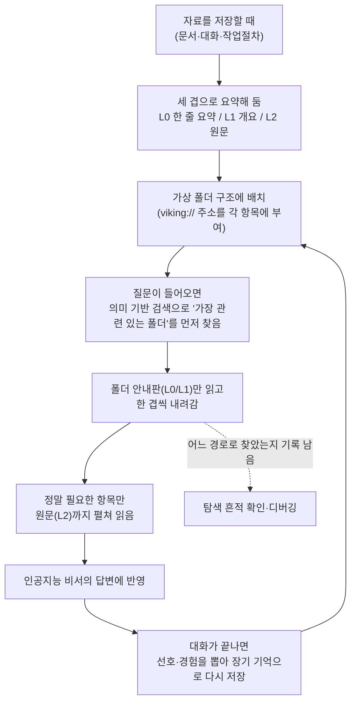

<div class="ai-knowledge-shell">

<aside class="ai-knowledge-sidebar">
  <p class="ai-eyebrow">CATEGORIES</p>
  <nav class="ai-cat-tree"><details class="ai-cat" open><summary><span class="catname">에이전트 오케스트레이션</span><span class="catcount">7</span></summary><ul><li><a href="https://altjs4510.github.io/ai_news_blog/knowledge/20260805/"><span class="kdate">2026-08-05</span><span class="ktitle">TencentCloud/TencentDB-Agent-Memory — 대화·문서·코드를 …</span></a></li><li><a href="https://altjs4510.github.io/ai_news_blog/knowledge/20260708/"><span class="kdate">2026-07-08</span><span class="ktitle">Expanding Managed Agents in Gemini API: backgrou…</span></a></li><li><a href="https://altjs4510.github.io/ai_news_blog/knowledge/20260623/"><span class="kdate">2026-06-23</span><span class="ktitle">bytedance/deer-flow — 샌드박스·메모리·서브에이전트·메시지 게이트웨이를…</span></a></li><li><a href="https://altjs4510.github.io/ai_news_blog/knowledge/20260611/"><span class="kdate">2026-06-11</span><span class="ktitle">The evolution of agentic surfaces: building with…</span></a></li><li><a href="https://altjs4510.github.io/ai_news_blog/knowledge/20260602/"><span class="kdate">2026-06-02</span><span class="ktitle">revfactory/harness — 도메인별 에이전트 팀과 스킬을 자동 설계하는 메타…</span></a></li><li><a href="https://altjs4510.github.io/ai_news_blog/knowledge/20260529/"><span class="kdate">2026-05-29</span><span class="ktitle">Introducing dynamic workflows in Claude Code</span></a></li><li><a href="https://altjs4510.github.io/ai_news_blog/knowledge/20260507/"><span class="kdate">2026-05-07</span><span class="ktitle">ruvnet/ruflo — Claude 멀티 에이전트 오케스트레이션 플랫폼</span></a></li></ul></details><details class="ai-cat" open><summary><span class="catname">MCP &amp; 도구 통합</span><span class="catcount">17</span></summary><ul><li><a href="https://altjs4510.github.io/ai_news_blog/knowledge/20260802/"><span class="kdate">2026-08-02</span><span class="ktitle">Stateless MCP has recaptured my interest (and in…</span></a></li><li><a href="https://altjs4510.github.io/ai_news_blog/knowledge/20260801/"><span class="kdate">2026-08-01</span><span class="ktitle">different-ai/openwork — Claude Cowork의 오픈소스 대체 에…</span></a></li><li><a href="https://altjs4510.github.io/ai_news_blog/knowledge/20260731/"><span class="kdate">2026-07-31</span><span class="ktitle">different-ai/openwork — Claude Cowork의 오픈소스 대안(o…</span></a></li><li><a href="https://altjs4510.github.io/ai_news_blog/knowledge/20260729/"><span class="kdate">2026-07-29</span><span class="ktitle">Bringing MCP 2026-07-28 to Claude</span></a></li><li><a href="https://altjs4510.github.io/ai_news_blog/knowledge/20260719/"><span class="kdate">2026-07-19</span><span class="ktitle">tirth8205/code-review-graph — 로컬 우선 코드 인텔리전스 그래프…</span></a></li><li><a href="https://altjs4510.github.io/ai_news_blog/knowledge/20260718/"><span class="kdate">2026-07-18</span><span class="ktitle">tirth8205/code-review-graph — MCP·CLI용 로컬 코드 인텔리…</span></a></li><li><a href="https://altjs4510.github.io/ai_news_blog/knowledge/20260709/"><span class="kdate">2026-07-09</span><span class="ktitle">mvanhorn/last30days-skill — Reddit·X·YouTube·HN·…</span></a></li><li><a href="https://altjs4510.github.io/ai_news_blog/knowledge/20260618/"><span class="kdate">2026-06-18</span><span class="ktitle">DeusData/codebase-memory-mcp — 158개 언어 코드베이스를 밀리…</span></a></li><li><a href="https://altjs4510.github.io/ai_news_blog/knowledge/20260606/"><span class="kdate">2026-06-06</span><span class="ktitle">chopratejas/headroom — Compress tool outputs, lo…</span></a></li><li><a href="https://altjs4510.github.io/ai_news_blog/knowledge/20260605/"><span class="kdate">2026-06-05</span><span class="ktitle">chopratejas/headroom — Compress tool outputs, lo…</span></a></li><li><a href="https://altjs4510.github.io/ai_news_blog/knowledge/20260604/"><span class="kdate">2026-06-04</span><span class="ktitle">chopratejas/headroom — Compress tool outputs bef…</span></a></li><li><a href="https://altjs4510.github.io/ai_news_blog/knowledge/20260603/"><span class="kdate">2026-06-03</span><span class="ktitle">How Bad MCP design cost your Agent 5× more token…</span></a></li><li><a href="https://altjs4510.github.io/ai_news_blog/knowledge/20260523/"><span class="kdate">2026-05-23</span><span class="ktitle">colbymchenry/codegraph — 사전 인덱싱된 코드 지식 그래프 MCP</span></a></li><li><a href="https://altjs4510.github.io/ai_news_blog/knowledge/20260520/"><span class="kdate">2026-05-20</span><span class="ktitle">New in Claude Managed Agents: self-hosted sandbo…</span></a></li><li><a href="https://altjs4510.github.io/ai_news_blog/knowledge/20260517/"><span class="kdate">2026-05-17</span><span class="ktitle">I gave my LLM 100,000+ tools — Lazy Discovery &a…</span></a></li><li><a href="https://altjs4510.github.io/ai_news_blog/knowledge/20260509/"><span class="kdate">2026-05-09</span><span class="ktitle">How to connect 100 MCP servers without the conte…</span></a></li><li><a href="https://altjs4510.github.io/ai_news_blog/knowledge/20260506/"><span class="kdate">2026-05-06</span><span class="ktitle">mksglu/context-mode — AI 코딩 에이전트용 컨텍스트 윈도우 최적화</span></a></li></ul></details><details class="ai-cat" open><summary><span class="catname">코딩 에이전트</span><span class="catcount">26</span></summary><ul><li><a href="https://altjs4510.github.io/ai_news_blog/knowledge/20260820/"><span class="kdate">2026-08-20</span><span class="ktitle">akitaonrails/ai-memory — 코딩 에이전트 CLI의 장기 메모리와 벤더…</span></a></li><li><a href="https://altjs4510.github.io/ai_news_blog/knowledge/20260819/"><span class="kdate">2026-08-19</span><span class="ktitle">akitaonrails/ai-memory — 코딩 에이전트 CLI 간 장기 기억과 벤더…</span></a></li><li><a href="https://altjs4510.github.io/ai_news_blog/knowledge/20260814/"><span class="kdate">2026-08-14</span><span class="ktitle">cathrynlavery/diagram-design — Claude Code용 에디토리…</span></a></li><li><a href="https://altjs4510.github.io/ai_news_blog/knowledge/20260811/"><span class="kdate">2026-08-11</span><span class="ktitle">PrimeIntellect-ai/prime-agent — 장기 자율 실행을 전제로 설계…</span></a></li><li><a href="https://altjs4510.github.io/ai_news_blog/knowledge/20260810/"><span class="kdate">2026-08-10</span><span class="ktitle">Auto mode is now the default in Claude Code for …</span></a></li><li><a href="https://altjs4510.github.io/ai_news_blog/knowledge/20260809/"><span class="kdate">2026-08-09</span><span class="ktitle">PrimeIntellect-ai/prime-agent — 코딩 워크플로우·장기 자율 작…</span></a></li><li><a href="https://altjs4510.github.io/ai_news_blog/knowledge/20260808/"><span class="kdate">2026-08-08</span><span class="ktitle">PrimeIntellect-ai/prime-agent — 코딩 워크플로우와 장시간 자율…</span></a></li><li><a href="https://altjs4510.github.io/ai_news_blog/knowledge/20260804/"><span class="kdate">2026-08-04</span><span class="ktitle">esengine/DeepSeek-Reasonix — prefix-cache 안정성을 축…</span></a></li><li><a href="https://altjs4510.github.io/ai_news_blog/knowledge/20260728/"><span class="kdate">2026-07-28</span><span class="ktitle">alibaba/open-code-review — 결정론적 파이프라인 + LLM 에이전트…</span></a></li><li><a href="https://altjs4510.github.io/ai_news_blog/knowledge/20260725/"><span class="kdate">2026-07-25</span><span class="ktitle">The new rules of context engineering for Claude …</span></a></li><li><a href="https://altjs4510.github.io/ai_news_blog/knowledge/20260722/"><span class="kdate">2026-07-22</span><span class="ktitle">tirth8205/code-review-graph — MCP·CLI용 로컬 우선 코드 …</span></a></li><li><a href="https://altjs4510.github.io/ai_news_blog/knowledge/20260721/"><span class="kdate">2026-07-21</span><span class="ktitle">tirth8205/code-review-graph — 로컬 우선 코드 인텔리전스 그래프…</span></a></li><li><a href="https://altjs4510.github.io/ai_news_blog/knowledge/20260714/"><span class="kdate">2026-07-14</span><span class="ktitle">Graphify-Labs/graphify — 코드베이스를 질의 가능한 지식 그래프로 만…</span></a></li><li><a href="https://altjs4510.github.io/ai_news_blog/knowledge/20260707/"><span class="kdate">2026-07-07</span><span class="ktitle">AI Hero Skills Catalog — 실무 엔지니어를 위한 재사용 가능한 판단 …</span></a></li><li><a href="https://altjs4510.github.io/ai_news_blog/knowledge/20260705/"><span class="kdate">2026-07-05</span><span class="ktitle">openai/codex-plugin-cc — Claude Code에서 Codex를 위임…</span></a></li><li><a href="https://altjs4510.github.io/ai_news_blog/knowledge/20260626/"><span class="kdate">2026-06-26</span><span class="ktitle">google-labs-code/design.md — 코딩 에이전트에게 디자인 시스템을 …</span></a></li><li><a href="https://altjs4510.github.io/ai_news_blog/knowledge/20260619/"><span class="kdate">2026-06-19</span><span class="ktitle">Claude Code now supports artifacts</span></a></li><li><a href="https://altjs4510.github.io/ai_news_blog/knowledge/20260530/"><span class="kdate">2026-05-30</span><span class="ktitle">Leonxlnx/taste-skill — AI에게 좋은 취향을 부여해 generic s…</span></a></li><li><a href="https://altjs4510.github.io/ai_news_blog/knowledge/20260528/"><span class="kdate">2026-05-28</span><span class="ktitle">Building self-improving tax agents with Codex</span></a></li><li><a href="https://altjs4510.github.io/ai_news_blog/knowledge/20260526/"><span class="kdate">2026-05-26</span><span class="ktitle">colbymchenry/codegraph — Pre-indexed code knowle…</span></a></li><li><a href="https://altjs4510.github.io/ai_news_blog/knowledge/20260524/"><span class="kdate">2026-05-24</span><span class="ktitle">colbymchenry/codegraph — Pre-indexed code knowle…</span></a></li><li><a href="https://altjs4510.github.io/ai_news_blog/knowledge/20260521/"><span class="kdate">2026-05-21</span><span class="ktitle">colbymchenry/codegraph — Pre-indexed code knowle…</span></a></li><li><a href="https://altjs4510.github.io/ai_news_blog/knowledge/20260512/"><span class="kdate">2026-05-12</span><span class="ktitle">agentmemory — Persistent memory for AI coding ag…</span></a></li><li><a href="https://altjs4510.github.io/ai_news_blog/knowledge/20260510/"><span class="kdate">2026-05-10</span><span class="ktitle">addyosmani/agent-skills — Production-grade engin…</span></a></li><li><a href="https://altjs4510.github.io/ai_news_blog/knowledge/20260508/"><span class="kdate">2026-05-08</span><span class="ktitle">addyosmani/agent-skills — Production-grade engin…</span></a></li><li><a href="https://altjs4510.github.io/ai_news_blog/knowledge/20260505/"><span class="kdate">2026-05-05</span><span class="ktitle">mattpocock/skills — Skills for Real Engineers (.…</span></a></li></ul></details><details class="ai-cat" open><summary><span class="catname">모델 &amp; 연구</span><span class="catcount">5</span></summary><ul><li><a href="https://altjs4510.github.io/ai_news_blog/knowledge/20260716-proprag/"><span class="kdate">2026-07-16</span><span class="ktitle">PropRAG — 프로포지션 경로 위 beam search로 멀티홉 검색 안내</span></a></li><li><a href="https://altjs4510.github.io/ai_news_blog/knowledge/20260620/"><span class="kdate">2026-06-20</span><span class="ktitle">zai-org/GLM-5 — From Vibe Coding to Agentic Engi…</span></a></li><li><a href="https://altjs4510.github.io/ai_news_blog/knowledge/20260617/"><span class="kdate">2026-06-17</span><span class="ktitle">Predicting model behavior before release by simu…</span></a></li><li><a href="https://altjs4510.github.io/ai_news_blog/knowledge/20260516/"><span class="kdate">2026-05-16</span><span class="ktitle">STALE — 에이전트가 자기 기억의 유효성을 인지할 수 있는가</span></a></li><li><a href="https://altjs4510.github.io/ai_news_blog/knowledge/20260513/"><span class="kdate">2026-05-13</span><span class="ktitle">Thinking Machines' Native Interaction Models — T…</span></a></li></ul></details><details class="ai-cat" open><summary><span class="catname">인프라 &amp; 컴퓨트</span><span class="catcount">7</span></summary><ul><li><a href="https://altjs4510.github.io/ai_news_blog/knowledge/20260821/" class="current"><span class="kdate">2026-08-21</span><span class="ktitle">volcengine/OpenViking — 에이전트 메모리·Knowledge RAG·스…</span></a></li><li><a href="https://altjs4510.github.io/ai_news_blog/knowledge/20260813/"><span class="kdate">2026-08-13</span><span class="ktitle">semantica-agi/semantica — 컨텍스트와 책임 추적을 위한 그래프 네이…</span></a></li><li><a href="https://altjs4510.github.io/ai_news_blog/knowledge/20260812/"><span class="kdate">2026-08-12</span><span class="ktitle">semantica-agi/semantica — 컨텍스트와 '책임 추적 가능한(accou…</span></a></li><li><a href="https://altjs4510.github.io/ai_news_blog/knowledge/20260806/"><span class="kdate">2026-08-06</span><span class="ktitle">cloudflare/computer — 에이전트에게 컴퓨터를 통째로 주는 엣지 실행 샌…</span></a></li><li><a href="https://altjs4510.github.io/ai_news_blog/knowledge/20260724/"><span class="kdate">2026-07-24</span><span class="ktitle">diegosouzapw/OmniRoute — 단일 엔드포인트로 278+ 프로바이더·50…</span></a></li><li><a href="https://altjs4510.github.io/ai_news_blog/knowledge/20260723/"><span class="kdate">2026-07-23</span><span class="ktitle">diegosouzapw/OmniRoute — 268+ 프로바이더를 단일 엔드포인트로 묶…</span></a></li><li><a href="https://altjs4510.github.io/ai_news_blog/knowledge/20260522/"><span class="kdate">2026-05-22</span><span class="ktitle">Giving Agents Computers — Ivan Burazin, Daytona</span></a></li></ul></details><details class="ai-cat" open><summary><span class="catname">보안 &amp; 거버넌스</span><span class="catcount">15</span></summary><ul><li><a href="https://altjs4510.github.io/ai_news_blog/knowledge/20260819-mind-viruses/"><span class="kdate">2026-08-19</span><span class="ktitle">탈옥도, 인젝션도 없이 — 대화로만 퍼지는 에이전트의 '마인드 바이러스'</span></a></li><li><a href="https://altjs4510.github.io/ai_news_blog/knowledge/20260730/"><span class="kdate">2026-07-30</span><span class="ktitle">Anatomy of a Frontier Lab Agent Intrusion: A Tec…</span></a></li><li><a href="https://altjs4510.github.io/ai_news_blog/knowledge/20260716/"><span class="kdate">2026-07-16</span><span class="ktitle">Dicklesworthstone/destructive_command_guard — 에이…</span></a></li><li><a href="https://altjs4510.github.io/ai_news_blog/knowledge/20260715/"><span class="kdate">2026-07-15</span><span class="ktitle">Dicklesworthstone/destructive_command_guard — 에이…</span></a></li><li><a href="https://altjs4510.github.io/ai_news_blog/knowledge/20260710/"><span class="kdate">2026-07-10</span><span class="ktitle">70개 MCP 서버 strace 런타임 감사 — 부팅 시 아웃바운드 호출 서버 적발</span></a></li><li><a href="https://altjs4510.github.io/ai_news_blog/knowledge/20260704/"><span class="kdate">2026-07-04</span><span class="ktitle">Cloudflare is about to block AI agents by defaul…</span></a></li><li><a href="https://altjs4510.github.io/ai_news_blog/knowledge/20260630/"><span class="kdate">2026-06-30</span><span class="ktitle">Introducing the Claude apps gateway for Amazon B…</span></a></li><li><a href="https://altjs4510.github.io/ai_news_blog/knowledge/20260625/"><span class="kdate">2026-06-25</span><span class="ktitle">Agent identity in Claude Tag: a new access model…</span></a></li><li><a href="https://altjs4510.github.io/ai_news_blog/knowledge/20260624/"><span class="kdate">2026-06-24</span><span class="ktitle">Agent identity in Claude Tag: a new access model…</span></a></li><li><a href="https://altjs4510.github.io/ai_news_blog/knowledge/20260614/"><span class="kdate">2026-06-14</span><span class="ktitle">NVIDIA/SkillSpector — Security scanner for AI ag…</span></a></li><li><a href="https://altjs4510.github.io/ai_news_blog/knowledge/20260613/"><span class="kdate">2026-06-13</span><span class="ktitle">Fable 5's guardrails got bypassed in 48 hours — …</span></a></li><li><a href="https://altjs4510.github.io/ai_news_blog/knowledge/20260612/"><span class="kdate">2026-06-12</span><span class="ktitle">NVIDIA/SkillSpector — AI 에이전트 스킬용 보안 스캐너</span></a></li><li><a href="https://altjs4510.github.io/ai_news_blog/knowledge/20260607/"><span class="kdate">2026-06-07</span><span class="ktitle">OpenAI Help: Lockdown Mode</span></a></li><li><a href="https://altjs4510.github.io/ai_news_blog/knowledge/20260531/"><span class="kdate">2026-05-31</span><span class="ktitle">How we contain Claude across products</span></a></li><li><a href="https://altjs4510.github.io/ai_news_blog/knowledge/20260527/"><span class="kdate">2026-05-27</span><span class="ktitle">Microsoft Copilot Cowork Exfiltrates Files</span></a></li></ul></details><details class="ai-cat" open><summary><span class="catname">응용 사례</span><span class="catcount">6</span></summary><ul><li><a href="https://altjs4510.github.io/ai_news_blog/knowledge/20260726/"><span class="kdate">2026-07-26</span><span class="ktitle">citrolabs/ego-lite — 로그인된 브라우저 상태를 AI 에이전트와 공유하는…</span></a></li><li><a href="https://altjs4510.github.io/ai_news_blog/knowledge/20260717/"><span class="kdate">2026-07-17</span><span class="ktitle">After a year building agent memory, 'save everyt…</span></a></li><li><a href="https://altjs4510.github.io/ai_news_blog/knowledge/20260621/"><span class="kdate">2026-06-21</span><span class="ktitle">calesthio/OpenMontage — 12 파이프라인·52 도구·500+ 스킬을 …</span></a></li><li><a href="https://altjs4510.github.io/ai_news_blog/knowledge/20260609/"><span class="kdate">2026-06-09</span><span class="ktitle">Building intelligent apps for Apple platforms wi…</span></a></li><li><a href="https://altjs4510.github.io/ai_news_blog/knowledge/20260515/"><span class="kdate">2026-05-15</span><span class="ktitle">Clawdmeter — Claude Code 사용량을 데스크톱 대시보드로</span></a></li><li><a href="https://altjs4510.github.io/ai_news_blog/knowledge/20260514/"><span class="kdate">2026-05-14</span><span class="ktitle">Introducing Claude for Small Business</span></a></li></ul></details><details class="ai-cat" open><summary><span class="catname">산업 동향</span><span class="catcount">9</span></summary><ul><li><a href="https://altjs4510.github.io/ai_news_blog/knowledge/20260712/"><span class="kdate">2026-07-12</span><span class="ktitle">Do Automated Evals Work?</span></a></li><li><a href="https://altjs4510.github.io/ai_news_blog/knowledge/20260711/"><span class="kdate">2026-07-11</span><span class="ktitle">OpenAI says GPT 5.6 is the 'preferred model' for…</span></a></li><li><a href="https://altjs4510.github.io/ai_news_blog/knowledge/20260703/"><span class="kdate">2026-07-03</span><span class="ktitle">Giving admins more visibility and control over C…</span></a></li><li><a href="https://altjs4510.github.io/ai_news_blog/knowledge/20260702/"><span class="kdate">2026-07-02</span><span class="ktitle">How Cursor deploys AI inside the enterprise (For…</span></a></li><li><a href="https://altjs4510.github.io/ai_news_blog/knowledge/20260701/"><span class="kdate">2026-07-01</span><span class="ktitle">Google OKF (Open Knowledge Format) — 벤더 중립 에이전트 …</span></a></li><li><a href="https://altjs4510.github.io/ai_news_blog/knowledge/20260616/"><span class="kdate">2026-06-16</span><span class="ktitle">Why AI hasn't replaced software engineers, and w…</span></a></li><li><a href="https://altjs4510.github.io/ai_news_blog/knowledge/20260610/"><span class="kdate">2026-06-10</span><span class="ktitle">Fable 5 just made cost-aware model routing manda…</span></a></li><li><a href="https://altjs4510.github.io/ai_news_blog/knowledge/20260519/"><span class="kdate">2026-05-19</span><span class="ktitle">Anthropic acquires Stainless</span></a></li><li><a href="https://altjs4510.github.io/ai_news_blog/knowledge/20260504/"><span class="kdate">2026-05-04</span><span class="ktitle">Agents for Everything Else: Codex for Knowledge …</span></a></li></ul></details></nav>
</aside>

<article class="ai-knowledge-article">

<header class="ai-post-hero">
  <p class="ai-eyebrow"><a class="ai-back" href="../">KNOWLEDGE</a> · 2026-08-21 · 오늘의 학습</p>
  <h2 class="ai-post-title">volcengine/OpenViking — 에이전트 메모리·Knowledge RAG·스킬을 하나로 묶은 self-evolving Context Database</h2>
</header>

> 원문: [volcengine/OpenViking — 에이전트 메모리·Knowledge RAG·스킬을 하나로 묶은 self-evolving Context Database](https://github.com/volcengine/OpenViking)

## 📌 학습 정리

### 1. 한 줄로 말하면

인공지능 비서가 기억해야 할 것들(과거 대화, 참고 문서, 일하는 방법)을 컴퓨터 폴더처럼 정리해두고, 필요할 때 직접 폴더를 열어가며 찾아 쓰게 만드는 저장소예요.

### 2. 왜 이게 만들어졌어요?

지금까지 인공지능 비서에게 뭔가를 기억시키는 방식은 대개 "비슷한 내용 찾아주는 검색 창고"에 텍스트를 잘게 잘라 넣어두는 식이었어요. 문제는 그 창고가 속을 들여다볼 수 없는 검은 상자라서, 엉뚱한 조각을 물어 왔을 때 왜 그걸 골랐는지 추적하기 어렵다는 점이었죠. 게다가 과거 대화 기억, 참고 자료, 작업 절차가 각각 다른 도구·다른 저장소로 흩어져 있어서 관리도 따로, 문제 원인 찾기도 따로였습니다. 여기에 자료를 통째로 집어넣다 보면 인공지능이 한 번에 읽는 분량(토큰)이 불어나 비용과 속도도 함께 나빠집니다. OpenViking은 이 셋을 하나의 가상 폴더 구조로 합치고, 필요한 깊이만 꺼내 쓰자는 제안으로 나왔어요.

### 3. 비유로 풀면

이건 마치 잘 정리된 도서관 서가 같은 거예요. 각 서가 앞에는 "이 칸엔 뭐가 있다"는 한 줄 안내판이 붙어 있고, 그 옆엔 좀 더 자세한 목차가, 책 자체는 서가 안에 있죠. 사서는 안내판만 훑고 이 칸이 맞는지 판단한 다음, 정말 필요할 때만 책을 뽑아 펼칩니다.

또 하나는 컴퓨터 파일 탐색기예요. 어떤 파일을 왜 열었는지 경로가 그대로 남으니, 잘못된 자료를 참고했을 때 "이 폴더에서 이걸 집었구나"를 되짚을 수 있습니다.

그래서 결국, 검색 결과를 통째로 받아드는 대신 인공지능이 스스로 폴더를 훑어 내려가며 필요한 만큼만 읽고, 그 경로가 기록으로 남는 구조라는 뜻입니다.

### 4. 어떻게 작동하는지 (그림으로)



핵심은 저장할 때 이미 세 단계 요약을 만들어 둔다는 점이에요. 그래서 찾을 때는 원문을 다 읽지 않고 짧은 요약만으로 "이 방향이 맞나"를 판단하며 좁혀 들어갈 수 있습니다. 마지막 단계에서 세션이 끝나면 그 안에서 드러난 사용자 취향이나 작업 경험을 따로 정리해 다시 저장하니, 쓸수록 폴더가 채워지는 순환이 생깁니다.

### 5. 처음 보는 용어 풀이

- **맥락 데이터베이스 (context database)** — 인공지능이 답할 때 참고할 재료(기억·문서·절차)를 모아 보관하는 저장소예요. 일반 데이터베이스가 업무 데이터를 담듯, 이건 "지금 무엇을 알고 있어야 하는가"를 담습니다.
- **가상 파일 시스템 (virtual filesystem)** — 실제 디스크 폴더는 아니지만 폴더·파일처럼 보이고 다뤄지는 구조입니다. 그래서 목록 보기(`ls`), 구조 보기(`tree`), 찾기(`find`) 같은 익숙한 방식으로 접근할 수 있어요.
- **세 겹 적재 (L0/L1/L2 tiered loading)** — 같은 자료를 한 줄 요약(L0, 약 100 토큰), 구조와 핵심을 담은 개요(L1, 약 2천 토큰), 원문 전체(L2)로 나눠 보관하는 방식이에요. 판단은 가벼운 층에서 하고 무거운 층은 꼭 필요할 때만 열어 비용을 아낍니다.
- **토큰 (token)** — 인공지능이 글을 읽고 쓸 때 세는 단위로, 대략 단어 조각에 해당합니다. 많이 읽히면 그만큼 비용과 응답 시간이 늘어나기 때문에 절약 대상이 됩니다.
- **디렉터리 재귀 검색 (directory recursive retrieval)** — 개별 조각을 바로 집는 대신 가장 점수가 높은 폴더를 먼저 고르고, 거기서 한 겹씩 아래로 내려가며 좁히는 찾기 방식이에요. 결과가 주변 맥락과 함께 딸려 오는 게 장점입니다.
- **관측 가능한 검색 (observable retrieval)** — 질문마다 "어떤 폴더를 거쳐 이 결과에 닿았는지"의 경로를 남겨두는 성질이에요. 결과가 이상할 때 원인 지점을 짚을 수 있습니다.
- **의미 기반 검색 창고 (vector store)** — 글을 숫자 배열로 바꿔 저장해 뜻이 비슷한 것끼리 찾아주는 저장소예요. 편리하지만 왜 그걸 골랐는지 사람이 들여다보기 어려운 점이 이 프로젝트의 출발 문제의식이었습니다.
- **스킬 (skill) / 자원 (resource) / 기억 (memory)** — 각각 "일하는 방법", "참고할 문서·저장소·웹페이지", "사용자 취향과 과거 경험"에 해당하는 세 종류의 맥락이에요. 원래는 따로 관리되던 것들을 같은 폴더 체계 안에 나란히 두는 게 이 프로젝트의 특징입니다.
- **자기진화 (self-evolving)** — 대화가 끝나면 그 안에서 드러난 선호와 경험을 자동으로 뽑아 장기 기억에 더하는 성질을 말해요. 사람이 매번 손으로 정리해 넣지 않아도 쌓이는 방향을 노린 설계입니다.

원문에는 성능 측정 결과도 함께 실려 있어요. 긴 대화 속 사용자 기억을 다루는 시험(LoCoMo)에서 세 종류의 인공지능 비서 연동 모두 정확도가 80~83% 구간에 들었고, 각자의 기본 기억 기능을 쓸 때는 24~57%였다고 합니다. 같은 조건에서 읽어들이는 분량은 34.3~91.0%, 질문 응답 지연은 58.45~66.10% 줄었다고 적혀 있고, 여러 차례 주고받는 작업 시험(tau2-bench)에서는 성공률이 소매 상황 +6.87포인트, 항공 상황 +11.87포인트 높아졌다고 해요. 다만 이건 프로젝트 측이 자체 공개한 수치이니, 세팅 조건까지 함께 보는 편이 안전합니다.

설치와 시작은 파이썬 3.10 이상 환경에서 `pip install openviking`으로 받고, `openviking-server init`이 대화형으로 제공자·모델 설정을 잡아준다고 소개돼 있어요. 굳이 설치하지 않고 브라우저에서 먼저 만져보는 방법도 안내되어 있습니다. 라이선스는 본체가 AGPLv3이고 일부 구성요소는 Apache 2.0이며, 원문은 오픈소스판에 기능 제한이 없다는 점을 명시하고 있어요.

### 6. 한 발 더 들어가고 싶다면

- [OpenViking 저장소](https://github.com/volcengine/OpenViking) — 설치 방법, 명령어 예시, 폴더 구조 전체를 원문 그대로 볼 수 있어요.
- [OpenViking Studio](https://openviking.ai) — 설치 없이 브라우저에서 맥락 저장·검색이 어떻게 도는지 직접 눌러볼 수 있는 체험판이라고 안내되어 있어요.
- [VikingMem 논문 (arXiv:2605.29640)](https://arxiv.org/abs/2605.29640) — 이 프로젝트가 일부 공개했다고 밝힌 핵심 기능의 학술적 배경과 설계 근거를 알 수 있어요.
- [문서 사이트 docs.openviking.ai](https://docs.openviking.ai) — 설정 파일 작성법, 배포, 여러 인공지능 도구와 연동하는 방법 같은 실무 절차를 알 수 있어요.
- [블로그 blog.openviking.ai](https://blog.openviking.ai) — 왜 맥락을 데이터베이스로 다뤄야 한다고 보는지, 설계 관점의 이야기를 따라갈 수 있어요.

---

## 📖 원문 전체 번역 (정독용)

> 의역 최소화한 전체 번역입니다. 큰 흐름은 위 정리에서 잡고, 정확한 워딩이 필요할 땐 이 섹션에서 정독하세요.

# OpenViking: The Context Database for AI Agents

English / 中文 / 日本語

Website · Live Demo · GitHub · Issues · Docs

👋 커뮤니티에 참여하세요
📱 Lark Group · WeChat · Discord · X

## OpenViking이란

OpenViking은 AI 에이전트를 위한 오픈소스 컨텍스트 데이터베이스다. 메모리, 리소스, 스킬을 `viking://` 프로토콜 아래 하나의 가상 파일시스템으로 저장하므로, 에이전트는 블랙박스 벡터 스토어에 질의하는 대신 `ls`, `tree`, `find`로 자신의 컨텍스트를 탐색한다. 콘텐츠는 세 개의 티어 — L0 abstract, L1 overview, L2 details — 로 처리되어 필요한 만큼만 로드된다. 모든 조회(retrieval)는 지켜보고 디버깅할 수 있는 궤적(trajectory)을 남긴다. 전체 소개는 다음을 참조: **Getting started**.

**OpenViking Studio** 플레이그라운드 — 설치 없이 브라우저에서 바로 열어볼 수 있는 라이브 데모.

## OpenViking을 쓰는 이유

**모든 컨텍스트를 위한 하나의 파일시스템.** 메모리, 리소스, 스킬은 각각 `viking://` URI를 갖는다. 에이전트는 파일을 다루는 개발자처럼 컨텍스트를 결정론적으로 찾고 다룰 수 있다. → **Viking URI · Context types**

**티어형 로딩으로 토큰 사용을 줄인다.** 모든 엔트리는 쓰여질 때 L0(abstract), L1(overview), L2(details)로 처리된 뒤, 작업이 요구하는 깊이만큼만 로드된다. → **Context layers**

**디렉토리 재귀 조회.** 벡터 검색이 먼저 가장 점수가 높은 디렉토리를 찾은 다음, 계층별로 점점 더 깊이 파고들어가므로 결과가 주변 컨텍스트를 온전히 유지한 채 도착한다. → **Retrieval**

**관찰 가능한 조회.** 각 쿼리는 디렉토리 탐색 궤적을 보존한다. 결과가 이상해 보이면 어떤 경로가 그 결과를 만들어냈는지 정확히 볼 수 있다. → **Retrieval**

**세션이 메모리가 된다.** 세션이 커밋된 후, OpenViking은 비동기적으로 사용자 선호와 에이전트 경험을 장기 메모리로 추출한다. → **Session**

전체 구성 요소가 어떻게 맞물리는지는 **Architecture**를 참조. 이 설계 이면의 사고방식은 **The Database Paradigm for Context Engineering**을 참조.

```
viking://
├── resources/              # 리소스: 프로젝트 문서, 저장소, 웹 페이지 등
│   └── my_project/
│       ├── docs/
│       │   ├── api/
│       │   └── tutorials/
│       └── src/
└── user/
    └── {user_id}/
        ├── memories/
        │   └── preferences/
        │       ├── writing_style
        │       └── coding_habits
        ├── resources/
        │   └── private_project/
        ├── skills/
        │   ├── search_code
        │   └── analyze_data
        └── peers/
            └── web-visitor-alice/
```

세 가지 로딩 티어:

- **L0 (Abstract)**: 빠른 관련성 확인을 위한 한 문장 요약.
- **L1 (Overview)**: 계획 수립을 위한 핵심 정보와 사용 시나리오.
- **L2 (Details)**: 필요할 때만 읽는 전체 원본 데이터.

각 디렉토리는 자체 L0/L1 레이어를 가지므로, 전체 파일을 읽기 전에 관련성을 판단할 수 있다:

```
viking://resources/my_project/
├── .abstract               # L0: ~100 토큰 - 빠른 관련성 확인
├── .overview               # L1: ~2k 토큰 - 구조와 핵심 포인트
└── docs/
    ├── .abstract
    ├── .overview
    └── api/
        ├── auth.md         # L2: 전체 콘텐츠, 필요 시 로드
        └── endpoints.md
```

## 성능 검증

OpenViking 0.3.22는 장기 대화 사용자 메모리(LoCoMo)와 멀티턴 에이전트 태스크(tau2-bench)에서 평가되었다. 지식베이스 QA를 포함한 전체 결과와 설정 세부 사항은 **benchmark report**에 있으며, 재현 스크립트는 `./benchmark`에 있다.

**사용자 메모리 (LoCoMo)**: OpenViking을 적용하면 세 가지 에이전트 통합 모두 80~83% 정확도에 도달한다 — 네이티브 메모리에서의 24~57%에서 상승한 것 — 동시에 입력 토큰은 34.3~91.0% 감소하고 쿼리 지연시간은 58.45~66.10% 감소한다.

**에이전트 경험 (tau2-bench)**: 경험 메모리는 동일한 LLM에서 메모리가 없는 경우 대비 태스크 성공률을 +6.87pp(retail), +11.87pp(airline) 끌어올린다.

## 빠른 시작

💡 **먼저 실제로 동작하는 걸 보고 싶다면?** **OpenViking Studio**를 시도해보라 — 컨텍스트 플레이그라운드, 시맨틱 검색, 멀티 에이전트 허브가 포함된 라이브 호스팅 인스턴스다. 설치가 필요 없다.

Python 3.10 이상 필요.

```
pip install openviking --upgrade
openviking-server init      # 대화형 마법사: providers, models, ov.conf
openviking-server doctor    # 설정 검증
openviking-server           # 시작 (백그라운드: nohup openviking-server > openviking.log 2>&1 &)
```

`init`은 프로바이더 설정을 안내하며 `~/.openviking/ov.conf`를 작성한다. Volcengine, OpenAI, Codex OAuth, Kimi, GLM, 로컬 Ollama를 지원한다 — Ollama의 경우 런타임을 탐지·설치하고 하드웨어에 맞는 모델을 받아올 수 있다.

`doctor`는 서버 실행 없이 설정 파일, Python 버전, 프로바이더 연결성, 디스크 공간을 점검한다. 수동 `ov.conf` 템플릿, 프로바이더별 예시, 환경 변수, Windows 설정은: **Configuration guide · Quick start docs**를 참조.

설치본에는 이미 `ov` 클라이언트 CLI가 포함되어 있다. 서버가 실행 중일 때:

```
ov status
ov add-resource https://github.com/volcengine/OpenViking   # --wait
ov ls viking://resources/
ov tree viking://resources/volcengine -L 2   # --wait가 아니면 시맨틱 처리를 위해 시간이 좀 걸림
ov find "what is openviking"
ov grep "openviking" --uri viking://resources/volcengine/OpenViking/docs/en
```

다음 단계: 클라이언트 설정(`ov config`), 독립 CLI 설치(npm / cargo), 인덱스 재구축 같은 고급 사용법은 **CLI setup**을 참조.

Docker 및 프로덕션 배포: **Deployment guide**.

## 에이전트와 함께 사용하기

통합(Integrations)은 OpenViking의 recall을 에이전트의 컨텍스트에 주입하고 세션 메모리를 자동 커밋한다:

Claude Code · Codex · OpenClaw · Hermes · Cursor · TRAE / TRAE CN / TraeCode CLI 2.0 · OpenCode · pi · Agent Plugins 1.0 · MCP clients · LangChain / LangGraph

각 에이전트별 설정 방법: **Agent integrations overview**.

## OpenViking Helper (베타)

OpenViking Helper는 데스크톱 콘솔로, 현재 macOS와 Windows x64용 베타 버전이다:

- **시각적 로컬 에이전트 설정**: OpenViking CLI, Claude Code, Codex, Cursor, Trae, OpenCode를 탐지한 뒤 지원되는 플러그인, MCP, Hook, CLI 통합을 구성한다.
- **세션 트레이스 검사**: Claude Code, Codex, Trae 세션을 파싱해 OpenViking recall, 프롬프트 주입, MCP 호출, capture, commit 이벤트를 보여준다.
- **로컬 메모리·스킬 관리**: 로컬 메모리/규칙 파일과 `SKILL.md` 스킬을 보고, OpenViking과 동기화한다.

다운로드: macOS Apple Silicon (arm64) · macOS Intel (x64) · Windows (x64)

## VikingBot

VikingBot은 OpenViking 위에 구축된 AI 에이전트 프레임워크다:

```
pip install "openviking[bot]"
openviking-server --with-bot
ov chat   # 다른 터미널에서
```

공식 Docker 이미지는 VikingBot을 번들로 포함하며, 서버 및 콘솔 UI와 함께 기본적으로 시작된다. 자세한 내용: **VikingBot guide**.

## 프로덕션 배포

프로덕션 환경에서는 OpenViking을 독립 HTTP 서비스로 실행한다 — **Server deployment** 및 **Deployment guide**를 참조.

## 상용 에디션

오픈소스 에디션은 기능이 제한되어 있지 않다.

이 저장소의 OpenViking은 AGPLv3 하에 완전한 오픈소스다: 기능 게이트 없음, 계정 불필요, 활성화 키 불필요. 위의 "프로덕션 배포"를 따라 직접 프로덕션에서 운영하면 되며, 앞으로도 계속 그럴 것이다.

아래 두 에디션은 "이용할 수 있는가"가 아니라 "누가 운영하고 어디서 실행되는가"에 대한 답이다.

**☁️ Managed SaaS**

**Volcano Engine**에서 공식 호스팅. 설정도 운영도 필요 없다.

- **Personal** — 개인 개발자용. 최대 50개 파일까지 무료 체험, VikingDB로 로컬 하드웨어를 훨씬 뛰어넘는 확장성 제공.
- **Enterprise** — 다중 사용자 컨텍스트 관리, 팀 협업 및 권한, 엔터프라이즈 SLA 및 지원.

기존 오픈소스 사용자는 마이그레이션 도구로 이전할 수 있다.

→ Volcano Engine 제품 페이지 · Documentation

중국 이외 지역을 위한 글로벌 호스팅은 **BytePlus**에서 곧 제공될 예정이다.

**🏢 Self-Managed**

사용자 자신의 환경 안에서 실행된다. 데이터가 그 환경을 벗어나지 않는다.

- **Online** — 사용자의 클라우드 계정/VPC에 배포, BYOC 지원, 업데이트 및 라이선싱을 위한 아웃바운드 접속 포함.
- **Offline** — 인터넷 접속이 전혀 없는 완전 에어갭 환경용, 규제 산업 대상.

오픈소스 에디션 위에 분산 배포와 공식 지원을 추가하며, 라이선스 키로 활성화한다.

→ Self-managed 배포 관련 문의

오픈소스 에디션만 실행하고 싶다면? 그냥 하면 된다 — 누구에게도 연락할 필요 없다. **빠른 시작**으로 이동하라.

## 연구

OpenViking은 VikingMem 논문에서 설명된 핵심 기능의 일부를 오픈소스로 제공한다:

**VikingMem: A Memory Base Management System for Stateful LLM-based Applications**

Jiajie Fu, Junwen Chen, Mengzhao Wang, Aoxiang He, Maojia Sheng, Xiangyu Ke, Yifan Zhu, Yunjun Gao.
arXiv:2605.29640, 2026. VLDB 2026 채택.

📄 arXiv에서 논문 읽기

## 파트너 프로젝트

OpenViking은 컨텍스트 데이터 생태계를 구축하기 위해 다른 오픈소스 프로젝트와의 협업을 환영한다. 확정된 파트너는 다음과 같다:

- **deer-flow** - 오픈소스 장기 지평(long-horizon) SuperAgent 하니스
- **NoKV** - AI 네이티브 분산 파일 시스템
- **loopx** - 경량 루프 엔지니어링 상태 커널
- **Hermes Agent** - 당신과 함께 성장하는 에이전트

파트너 목록에 합류하고 싶다면 커뮤니티에 이슈를 제출해 신청하라.

## 커뮤니티 & 기여

OpenViking은 아직 초기 단계이며, 만들어야 할 것이 많이 남아 있다.

- **Docs**: docs.openviking.ai · FAQ
- **Blog**: blog.openviking.ai
- **Team**: About us
- **Chat**: 📱 Lark Group · 💬 WeChat · 🎮 Discord · 🐦 X
- **Contribute**: 버그 수정과 신규 기능 기여를 모두 환영한다 — CONTRIBUTING.md 참조

## 보안 및 개인정보

이 프로젝트는 보안을 중요하게 다룬다.

취약점 신고 및 지원 버전에 대해서는 SECURITY.md를 참조.

## 라이선스

OpenViking 프로젝트는 구성 요소별로 다른 라이선스를 사용한다:

- **Main Project**: AGPLv3 - 자세한 내용은 LICENSE 파일 참조
- **crates/ov_cli**: Apache 2.0 - 자세한 내용은 LICENSE 참조
- **examples**: Apache 2.0 - 자세한 내용은 LICENSE 참조
- **third_party**: 각 서드파티 프로젝트의 원 라이선스

</article>

</div>

<!-- ai-related-links -->
<aside class="ai-related-links">
  <p class="ai-eyebrow">관련 학습</p>
  <ul><li><a href="https://altjs4510.github.io/ai_news_blog/knowledge/20260805/"><span class="kdate">2026-08-05</span><span class="ktitle">TencentCloud/TencentDB-Agent-Memory — 대화·문서·코드를 …</span></a></li><li><a href="https://altjs4510.github.io/ai_news_blog/knowledge/20260701/"><span class="kdate">2026-07-01</span><span class="ktitle">Google OKF (Open Knowledge Format) — 벤더 중립 에이전트 …</span></a></li><li><a href="https://altjs4510.github.io/ai_news_blog/knowledge/20260512/"><span class="kdate">2026-05-12</span><span class="ktitle">agentmemory — Persistent memory for AI coding ag…</span></a></li></ul>
</aside>
<!-- /ai-related-links -->
