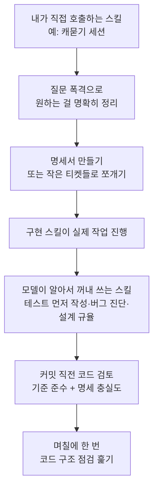

<div class="ai-knowledge-shell">

<aside class="ai-knowledge-sidebar">
  <p class="ai-eyebrow">CATEGORIES</p>
  <nav class="ai-cat-tree"><details class="ai-cat" open><summary><span class="catname">에이전트 오케스트레이션</span><span class="catcount">15</span></summary><ul><li><a href="https://altjs4510.github.io/ai_news_blog/knowledge/20260904/"><span class="kdate">2026-09-04</span><span class="ktitle">HarnessDev: Can LLMs Create and Evolve Their Own…</span></a></li><li><a href="https://altjs4510.github.io/ai_news_blog/knowledge/20260831-openexecutive-virtual-c-suite/"><span class="kdate">2026-08-31</span><span class="ktitle">Open Executive — 8명의 전문 에이전트를 하나의 임원 목소리로</span></a></li><li><a href="https://altjs4510.github.io/ai_news_blog/knowledge/20260828/"><span class="kdate">2026-08-28</span><span class="ktitle">Google ADK for Python v2.8.0 — RemoteA2aAgent 네이…</span></a></li><li><a href="https://altjs4510.github.io/ai_news_blog/knowledge/20260826/"><span class="kdate">2026-08-26</span><span class="ktitle">apache/maka — 도구 호출·권한 결정·종료 이벤트를 append-only 로그…</span></a></li><li><a href="https://altjs4510.github.io/ai_news_blog/knowledge/20260823/"><span class="kdate">2026-08-23</span><span class="ktitle">The Evolution of the Agent Harness — 하네스가 모델 가중치…</span></a></li><li><a href="https://altjs4510.github.io/ai_news_blog/knowledge/20260821/"><span class="kdate">2026-08-21</span><span class="ktitle">volcengine/OpenViking — 에이전트 메모리·Knowledge RAG·스…</span></a></li><li><a href="https://altjs4510.github.io/ai_news_blog/knowledge/20260805/"><span class="kdate">2026-08-05</span><span class="ktitle">TencentCloud/TencentDB-Agent-Memory — 대화·문서·코드를 …</span></a></li><li><a href="https://altjs4510.github.io/ai_news_blog/knowledge/20260708/"><span class="kdate">2026-07-08</span><span class="ktitle">Expanding Managed Agents in Gemini API: backgrou…</span></a></li><li><a href="https://altjs4510.github.io/ai_news_blog/knowledge/20260707/"><span class="kdate">2026-07-07</span><span class="ktitle">AI Hero Skills Catalog — 실무 엔지니어를 위한 재사용 가능한 판단 …</span></a></li><li><a href="https://altjs4510.github.io/ai_news_blog/knowledge/20260623/"><span class="kdate">2026-06-23</span><span class="ktitle">bytedance/deer-flow — 샌드박스·메모리·서브에이전트·메시지 게이트웨이를…</span></a></li><li><a href="https://altjs4510.github.io/ai_news_blog/knowledge/20260621/"><span class="kdate">2026-06-21</span><span class="ktitle">calesthio/OpenMontage — 12 파이프라인·52 도구·500+ 스킬을 …</span></a></li><li><a href="https://altjs4510.github.io/ai_news_blog/knowledge/20260611/"><span class="kdate">2026-06-11</span><span class="ktitle">The evolution of agentic surfaces: building with…</span></a></li><li><a href="https://altjs4510.github.io/ai_news_blog/knowledge/20260602/"><span class="kdate">2026-06-02</span><span class="ktitle">revfactory/harness — 도메인별 에이전트 팀과 스킬을 자동 설계하는 메타…</span></a></li><li><a href="https://altjs4510.github.io/ai_news_blog/knowledge/20260529/"><span class="kdate">2026-05-29</span><span class="ktitle">Introducing dynamic workflows in Claude Code</span></a></li><li><a href="https://altjs4510.github.io/ai_news_blog/knowledge/20260507/"><span class="kdate">2026-05-07</span><span class="ktitle">ruvnet/ruflo — Claude 멀티 에이전트 오케스트레이션 플랫폼</span></a></li></ul></details><details class="ai-cat" open><summary><span class="catname">MCP &amp; 도구 통합</span><span class="catcount">16</span></summary><ul><li><a href="https://altjs4510.github.io/ai_news_blog/knowledge/20260829/"><span class="kdate">2026-08-29</span><span class="ktitle">cursor/plugins — 플러그인 명세(specification)와 공식 플러그인…</span></a></li><li><a href="https://altjs4510.github.io/ai_news_blog/knowledge/20260802/"><span class="kdate">2026-08-02</span><span class="ktitle">Stateless MCP has recaptured my interest (and in…</span></a></li><li><a href="https://altjs4510.github.io/ai_news_blog/knowledge/20260801/"><span class="kdate">2026-08-01</span><span class="ktitle">different-ai/openwork — Claude Cowork의 오픈소스 대체 에…</span></a></li><li><a href="https://altjs4510.github.io/ai_news_blog/knowledge/20260731/"><span class="kdate">2026-07-31</span><span class="ktitle">different-ai/openwork — Claude Cowork의 오픈소스 대안(o…</span></a></li><li><a href="https://altjs4510.github.io/ai_news_blog/knowledge/20260729/"><span class="kdate">2026-07-29</span><span class="ktitle">Bringing MCP 2026-07-28 to Claude</span></a></li><li><a href="https://altjs4510.github.io/ai_news_blog/knowledge/20260721/"><span class="kdate">2026-07-21</span><span class="ktitle">tirth8205/code-review-graph — 로컬 우선 코드 인텔리전스 그래프…</span></a></li><li><a href="https://altjs4510.github.io/ai_news_blog/knowledge/20260719/"><span class="kdate">2026-07-19</span><span class="ktitle">tirth8205/code-review-graph — 로컬 우선 코드 인텔리전스 그래프…</span></a></li><li><a href="https://altjs4510.github.io/ai_news_blog/knowledge/20260709/"><span class="kdate">2026-07-09</span><span class="ktitle">mvanhorn/last30days-skill — Reddit·X·YouTube·HN·…</span></a></li><li><a href="https://altjs4510.github.io/ai_news_blog/knowledge/20260618/"><span class="kdate">2026-06-18</span><span class="ktitle">DeusData/codebase-memory-mcp — 158개 언어 코드베이스를 밀리…</span></a></li><li><a href="https://altjs4510.github.io/ai_news_blog/knowledge/20260606/"><span class="kdate">2026-06-06</span><span class="ktitle">chopratejas/headroom — Compress tool outputs, lo…</span></a></li><li><a href="https://altjs4510.github.io/ai_news_blog/knowledge/20260605/"><span class="kdate">2026-06-05</span><span class="ktitle">chopratejas/headroom — Compress tool outputs, lo…</span></a></li><li><a href="https://altjs4510.github.io/ai_news_blog/knowledge/20260604/"><span class="kdate">2026-06-04</span><span class="ktitle">chopratejas/headroom — Compress tool outputs bef…</span></a></li><li><a href="https://altjs4510.github.io/ai_news_blog/knowledge/20260603/"><span class="kdate">2026-06-03</span><span class="ktitle">How Bad MCP design cost your Agent 5× more token…</span></a></li><li><a href="https://altjs4510.github.io/ai_news_blog/knowledge/20260523/"><span class="kdate">2026-05-23</span><span class="ktitle">colbymchenry/codegraph — 사전 인덱싱된 코드 지식 그래프 MCP</span></a></li><li><a href="https://altjs4510.github.io/ai_news_blog/knowledge/20260517/"><span class="kdate">2026-05-17</span><span class="ktitle">I gave my LLM 100,000+ tools — Lazy Discovery &a…</span></a></li><li><a href="https://altjs4510.github.io/ai_news_blog/knowledge/20260509/"><span class="kdate">2026-05-09</span><span class="ktitle">How to connect 100 MCP servers without the conte…</span></a></li></ul></details><details class="ai-cat" open><summary><span class="catname">코딩 에이전트</span><span class="catcount">30</span></summary><ul><li><a href="https://altjs4510.github.io/ai_news_blog/knowledge/20260903/"><span class="kdate">2026-09-03</span><span class="ktitle">pacifio/atlas — 여러 코딩 에이전트의 변경을 한곳에서 추적·질의하는 '에이…</span></a></li><li><a href="https://altjs4510.github.io/ai_news_blog/knowledge/20260901/"><span class="kdate">2026-09-01</span><span class="ktitle">affaan-m/ECC — 스킬·본능·메모리·보안을 묶은 에이전트 하네스 성능 최적화 …</span></a></li><li><a href="https://altjs4510.github.io/ai_news_blog/knowledge/20260831-gitnexus-code-knowledge-graph/"><span class="kdate">2026-08-31</span><span class="ktitle">GitNexus — 코드베이스를 지식그래프로 바꿔 에이전트에게 쥐어주기</span></a></li><li><a href="https://altjs4510.github.io/ai_news_blog/knowledge/20260822/" class="current"><span class="kdate">2026-08-22</span><span class="ktitle">mattpocock/skills — Skills for Real Engineers (하…</span></a></li><li><a href="https://altjs4510.github.io/ai_news_blog/knowledge/20260820/"><span class="kdate">2026-08-20</span><span class="ktitle">akitaonrails/ai-memory — 코딩 에이전트 CLI의 장기 메모리와 벤더…</span></a></li><li><a href="https://altjs4510.github.io/ai_news_blog/knowledge/20260819/"><span class="kdate">2026-08-19</span><span class="ktitle">akitaonrails/ai-memory — 코딩 에이전트 CLI 간 장기 기억과 벤더…</span></a></li><li><a href="https://altjs4510.github.io/ai_news_blog/knowledge/20260811/"><span class="kdate">2026-08-11</span><span class="ktitle">PrimeIntellect-ai/prime-agent — 장기 자율 실행을 전제로 설계…</span></a></li><li><a href="https://altjs4510.github.io/ai_news_blog/knowledge/20260810/"><span class="kdate">2026-08-10</span><span class="ktitle">Auto mode is now the default in Claude Code for …</span></a></li><li><a href="https://altjs4510.github.io/ai_news_blog/knowledge/20260809/"><span class="kdate">2026-08-09</span><span class="ktitle">PrimeIntellect-ai/prime-agent — 코딩 워크플로우·장기 자율 작…</span></a></li><li><a href="https://altjs4510.github.io/ai_news_blog/knowledge/20260808/"><span class="kdate">2026-08-08</span><span class="ktitle">PrimeIntellect-ai/prime-agent — 코딩 워크플로우와 장시간 자율…</span></a></li><li><a href="https://altjs4510.github.io/ai_news_blog/knowledge/20260804/"><span class="kdate">2026-08-04</span><span class="ktitle">esengine/DeepSeek-Reasonix — prefix-cache 안정성을 축…</span></a></li><li><a href="https://altjs4510.github.io/ai_news_blog/knowledge/20260728/"><span class="kdate">2026-07-28</span><span class="ktitle">alibaba/open-code-review — 결정론적 파이프라인 + LLM 에이전트…</span></a></li><li><a href="https://altjs4510.github.io/ai_news_blog/knowledge/20260725/"><span class="kdate">2026-07-25</span><span class="ktitle">The new rules of context engineering for Claude …</span></a></li><li><a href="https://altjs4510.github.io/ai_news_blog/knowledge/20260722/"><span class="kdate">2026-07-22</span><span class="ktitle">tirth8205/code-review-graph — MCP·CLI용 로컬 우선 코드 …</span></a></li><li><a href="https://altjs4510.github.io/ai_news_blog/knowledge/20260718/"><span class="kdate">2026-07-18</span><span class="ktitle">tirth8205/code-review-graph — MCP·CLI용 로컬 코드 인텔리…</span></a></li><li><a href="https://altjs4510.github.io/ai_news_blog/knowledge/20260715/"><span class="kdate">2026-07-15</span><span class="ktitle">Dicklesworthstone/destructive_command_guard — 에이…</span></a></li><li><a href="https://altjs4510.github.io/ai_news_blog/knowledge/20260714/"><span class="kdate">2026-07-14</span><span class="ktitle">Graphify-Labs/graphify — 코드베이스를 질의 가능한 지식 그래프로 만…</span></a></li><li><a href="https://altjs4510.github.io/ai_news_blog/knowledge/20260705/"><span class="kdate">2026-07-05</span><span class="ktitle">openai/codex-plugin-cc — Claude Code에서 Codex를 위임…</span></a></li><li><a href="https://altjs4510.github.io/ai_news_blog/knowledge/20260626/"><span class="kdate">2026-06-26</span><span class="ktitle">google-labs-code/design.md — 코딩 에이전트에게 디자인 시스템을 …</span></a></li><li><a href="https://altjs4510.github.io/ai_news_blog/knowledge/20260619/"><span class="kdate">2026-06-19</span><span class="ktitle">Claude Code now supports artifacts</span></a></li><li><a href="https://altjs4510.github.io/ai_news_blog/knowledge/20260530/"><span class="kdate">2026-05-30</span><span class="ktitle">Leonxlnx/taste-skill — AI에게 좋은 취향을 부여해 generic s…</span></a></li><li><a href="https://altjs4510.github.io/ai_news_blog/knowledge/20260528/"><span class="kdate">2026-05-28</span><span class="ktitle">Building self-improving tax agents with Codex</span></a></li><li><a href="https://altjs4510.github.io/ai_news_blog/knowledge/20260526/"><span class="kdate">2026-05-26</span><span class="ktitle">colbymchenry/codegraph — Pre-indexed code knowle…</span></a></li><li><a href="https://altjs4510.github.io/ai_news_blog/knowledge/20260524/"><span class="kdate">2026-05-24</span><span class="ktitle">colbymchenry/codegraph — Pre-indexed code knowle…</span></a></li><li><a href="https://altjs4510.github.io/ai_news_blog/knowledge/20260521/"><span class="kdate">2026-05-21</span><span class="ktitle">colbymchenry/codegraph — Pre-indexed code knowle…</span></a></li><li><a href="https://altjs4510.github.io/ai_news_blog/knowledge/20260512/"><span class="kdate">2026-05-12</span><span class="ktitle">agentmemory — Persistent memory for AI coding ag…</span></a></li><li><a href="https://altjs4510.github.io/ai_news_blog/knowledge/20260510/"><span class="kdate">2026-05-10</span><span class="ktitle">addyosmani/agent-skills — Production-grade engin…</span></a></li><li><a href="https://altjs4510.github.io/ai_news_blog/knowledge/20260508/"><span class="kdate">2026-05-08</span><span class="ktitle">addyosmani/agent-skills — Production-grade engin…</span></a></li><li><a href="https://altjs4510.github.io/ai_news_blog/knowledge/20260506/"><span class="kdate">2026-05-06</span><span class="ktitle">mksglu/context-mode — AI 코딩 에이전트용 컨텍스트 윈도우 최적화</span></a></li><li><a href="https://altjs4510.github.io/ai_news_blog/knowledge/20260505/"><span class="kdate">2026-05-05</span><span class="ktitle">mattpocock/skills — Skills for Real Engineers (.…</span></a></li></ul></details><details class="ai-cat" open><summary><span class="catname">모델 &amp; 연구</span><span class="catcount">5</span></summary><ul><li><a href="https://altjs4510.github.io/ai_news_blog/knowledge/20260716-proprag/"><span class="kdate">2026-07-16</span><span class="ktitle">PropRAG — 프로포지션 경로 위 beam search로 멀티홉 검색 안내</span></a></li><li><a href="https://altjs4510.github.io/ai_news_blog/knowledge/20260620/"><span class="kdate">2026-06-20</span><span class="ktitle">zai-org/GLM-5 — From Vibe Coding to Agentic Engi…</span></a></li><li><a href="https://altjs4510.github.io/ai_news_blog/knowledge/20260617/"><span class="kdate">2026-06-17</span><span class="ktitle">Predicting model behavior before release by simu…</span></a></li><li><a href="https://altjs4510.github.io/ai_news_blog/knowledge/20260516/"><span class="kdate">2026-05-16</span><span class="ktitle">STALE — 에이전트가 자기 기억의 유효성을 인지할 수 있는가</span></a></li><li><a href="https://altjs4510.github.io/ai_news_blog/knowledge/20260513/"><span class="kdate">2026-05-13</span><span class="ktitle">Thinking Machines' Native Interaction Models — T…</span></a></li></ul></details><details class="ai-cat" open><summary><span class="catname">인프라 &amp; 컴퓨트</span><span class="catcount">7</span></summary><ul><li><a href="https://altjs4510.github.io/ai_news_blog/knowledge/20260813/"><span class="kdate">2026-08-13</span><span class="ktitle">semantica-agi/semantica — 컨텍스트와 책임 추적을 위한 그래프 네이…</span></a></li><li><a href="https://altjs4510.github.io/ai_news_blog/knowledge/20260812/"><span class="kdate">2026-08-12</span><span class="ktitle">semantica-agi/semantica — 컨텍스트와 '책임 추적 가능한(accou…</span></a></li><li><a href="https://altjs4510.github.io/ai_news_blog/knowledge/20260806/"><span class="kdate">2026-08-06</span><span class="ktitle">cloudflare/computer — 에이전트에게 컴퓨터를 통째로 주는 엣지 실행 샌…</span></a></li><li><a href="https://altjs4510.github.io/ai_news_blog/knowledge/20260724/"><span class="kdate">2026-07-24</span><span class="ktitle">diegosouzapw/OmniRoute — 단일 엔드포인트로 278+ 프로바이더·50…</span></a></li><li><a href="https://altjs4510.github.io/ai_news_blog/knowledge/20260723/"><span class="kdate">2026-07-23</span><span class="ktitle">diegosouzapw/OmniRoute — 268+ 프로바이더를 단일 엔드포인트로 묶…</span></a></li><li><a href="https://altjs4510.github.io/ai_news_blog/knowledge/20260522/"><span class="kdate">2026-05-22</span><span class="ktitle">Giving Agents Computers — Ivan Burazin, Daytona</span></a></li><li><a href="https://altjs4510.github.io/ai_news_blog/knowledge/20260520/"><span class="kdate">2026-05-20</span><span class="ktitle">New in Claude Managed Agents: self-hosted sandbo…</span></a></li></ul></details><details class="ai-cat" open><summary><span class="catname">보안 &amp; 거버넌스</span><span class="catcount">17</span></summary><ul><li><a href="https://altjs4510.github.io/ai_news_blog/knowledge/20260902/"><span class="kdate">2026-09-02</span><span class="ktitle">AIR raises $50M to help companies vet the skills…</span></a></li><li><a href="https://altjs4510.github.io/ai_news_blog/knowledge/20260827/"><span class="kdate">2026-08-27</span><span class="ktitle">Claude in Chrome is generally available</span></a></li><li><a href="https://altjs4510.github.io/ai_news_blog/knowledge/20260819-mind-viruses/"><span class="kdate">2026-08-19</span><span class="ktitle">탈옥도, 인젝션도 없이 — 대화로만 퍼지는 에이전트의 '마인드 바이러스'</span></a></li><li><a href="https://altjs4510.github.io/ai_news_blog/knowledge/20260730/"><span class="kdate">2026-07-30</span><span class="ktitle">Anatomy of a Frontier Lab Agent Intrusion: A Tec…</span></a></li><li><a href="https://altjs4510.github.io/ai_news_blog/knowledge/20260716/"><span class="kdate">2026-07-16</span><span class="ktitle">Dicklesworthstone/destructive_command_guard — 에이…</span></a></li><li><a href="https://altjs4510.github.io/ai_news_blog/knowledge/20260710/"><span class="kdate">2026-07-10</span><span class="ktitle">70개 MCP 서버 strace 런타임 감사 — 부팅 시 아웃바운드 호출 서버 적발</span></a></li><li><a href="https://altjs4510.github.io/ai_news_blog/knowledge/20260704/"><span class="kdate">2026-07-04</span><span class="ktitle">Cloudflare is about to block AI agents by defaul…</span></a></li><li><a href="https://altjs4510.github.io/ai_news_blog/knowledge/20260703/"><span class="kdate">2026-07-03</span><span class="ktitle">Giving admins more visibility and control over C…</span></a></li><li><a href="https://altjs4510.github.io/ai_news_blog/knowledge/20260630/"><span class="kdate">2026-06-30</span><span class="ktitle">Introducing the Claude apps gateway for Amazon B…</span></a></li><li><a href="https://altjs4510.github.io/ai_news_blog/knowledge/20260625/"><span class="kdate">2026-06-25</span><span class="ktitle">Agent identity in Claude Tag: a new access model…</span></a></li><li><a href="https://altjs4510.github.io/ai_news_blog/knowledge/20260624/"><span class="kdate">2026-06-24</span><span class="ktitle">Agent identity in Claude Tag: a new access model…</span></a></li><li><a href="https://altjs4510.github.io/ai_news_blog/knowledge/20260614/"><span class="kdate">2026-06-14</span><span class="ktitle">NVIDIA/SkillSpector — Security scanner for AI ag…</span></a></li><li><a href="https://altjs4510.github.io/ai_news_blog/knowledge/20260613/"><span class="kdate">2026-06-13</span><span class="ktitle">Fable 5's guardrails got bypassed in 48 hours — …</span></a></li><li><a href="https://altjs4510.github.io/ai_news_blog/knowledge/20260612/"><span class="kdate">2026-06-12</span><span class="ktitle">NVIDIA/SkillSpector — AI 에이전트 스킬용 보안 스캐너</span></a></li><li><a href="https://altjs4510.github.io/ai_news_blog/knowledge/20260607/"><span class="kdate">2026-06-07</span><span class="ktitle">OpenAI Help: Lockdown Mode</span></a></li><li><a href="https://altjs4510.github.io/ai_news_blog/knowledge/20260531/"><span class="kdate">2026-05-31</span><span class="ktitle">How we contain Claude across products</span></a></li><li><a href="https://altjs4510.github.io/ai_news_blog/knowledge/20260527/"><span class="kdate">2026-05-27</span><span class="ktitle">Microsoft Copilot Cowork Exfiltrates Files</span></a></li></ul></details><details class="ai-cat" open><summary><span class="catname">응용 사례</span><span class="catcount">7</span></summary><ul><li><a href="https://altjs4510.github.io/ai_news_blog/knowledge/20260814/"><span class="kdate">2026-08-14</span><span class="ktitle">cathrynlavery/diagram-design — Claude Code용 에디토리…</span></a></li><li><a href="https://altjs4510.github.io/ai_news_blog/knowledge/20260726/"><span class="kdate">2026-07-26</span><span class="ktitle">citrolabs/ego-lite — 로그인된 브라우저 상태를 AI 에이전트와 공유하는…</span></a></li><li><a href="https://altjs4510.github.io/ai_news_blog/knowledge/20260717/"><span class="kdate">2026-07-17</span><span class="ktitle">After a year building agent memory, 'save everyt…</span></a></li><li><a href="https://altjs4510.github.io/ai_news_blog/knowledge/20260712/"><span class="kdate">2026-07-12</span><span class="ktitle">Do Automated Evals Work?</span></a></li><li><a href="https://altjs4510.github.io/ai_news_blog/knowledge/20260609/"><span class="kdate">2026-06-09</span><span class="ktitle">Building intelligent apps for Apple platforms wi…</span></a></li><li><a href="https://altjs4510.github.io/ai_news_blog/knowledge/20260515/"><span class="kdate">2026-05-15</span><span class="ktitle">Clawdmeter — Claude Code 사용량을 데스크톱 대시보드로</span></a></li><li><a href="https://altjs4510.github.io/ai_news_blog/knowledge/20260514/"><span class="kdate">2026-05-14</span><span class="ktitle">Introducing Claude for Small Business</span></a></li></ul></details><details class="ai-cat" open><summary><span class="catname">산업 동향</span><span class="catcount">8</span></summary><ul><li><a href="https://altjs4510.github.io/ai_news_blog/knowledge/20260830/"><span class="kdate">2026-08-30</span><span class="ktitle">[AINews] OpenAI shuts off Cursor — 프론티어 모델 공급 차단…</span></a></li><li><a href="https://altjs4510.github.io/ai_news_blog/knowledge/20260711/"><span class="kdate">2026-07-11</span><span class="ktitle">OpenAI says GPT 5.6 is the 'preferred model' for…</span></a></li><li><a href="https://altjs4510.github.io/ai_news_blog/knowledge/20260702/"><span class="kdate">2026-07-02</span><span class="ktitle">How Cursor deploys AI inside the enterprise (For…</span></a></li><li><a href="https://altjs4510.github.io/ai_news_blog/knowledge/20260701/"><span class="kdate">2026-07-01</span><span class="ktitle">Google OKF (Open Knowledge Format) — 벤더 중립 에이전트 …</span></a></li><li><a href="https://altjs4510.github.io/ai_news_blog/knowledge/20260616/"><span class="kdate">2026-06-16</span><span class="ktitle">Why AI hasn't replaced software engineers, and w…</span></a></li><li><a href="https://altjs4510.github.io/ai_news_blog/knowledge/20260610/"><span class="kdate">2026-06-10</span><span class="ktitle">Fable 5 just made cost-aware model routing manda…</span></a></li><li><a href="https://altjs4510.github.io/ai_news_blog/knowledge/20260519/"><span class="kdate">2026-05-19</span><span class="ktitle">Anthropic acquires Stainless</span></a></li><li><a href="https://altjs4510.github.io/ai_news_blog/knowledge/20260504/"><span class="kdate">2026-05-04</span><span class="ktitle">Agents for Everything Else: Codex for Knowledge …</span></a></li></ul></details></nav>
</aside>

<article class="ai-knowledge-article">

<header class="ai-post-hero">
  <p class="ai-eyebrow"><a class="ai-back" href="../">KNOWLEDGE</a> · 2026-08-22 · 오늘의 학습</p>
  <h2 class="ai-post-title">mattpocock/skills — Skills for Real Engineers (하루 3,368 stars, 트렌딩 1위급)</h2>
</header>

> 원문: [mattpocock/skills — Skills for Real Engineers (하루 3,368 stars, 트렌딩 1위급)](https://github.com/mattpocock/skills)

## 📌 학습 정리

### 1. 한 줄로 말하면

똑똑한 코딩 조수에게 "일하는 순서와 습관"을 적어서 건네주는 작은 메모 묶음이에요. 기능을 추가하는 도구가 아니라, 조수가 어떤 순서로 물어보고 판단할지를 정해주는 쪽에 가깝습니다.

### 2. 왜 이게 만들어졌어요?

인공지능 코딩 조수(coding agent)에게 일을 맡기다 보면 반복되는 실패 패턴이 있습니다. 내가 원한 걸 잘못 이해하거나, 말을 너무 길게 늘어놓거나, 돌아가지 않는 코드를 내놓거나, 손대기 힘들 만큼 엉킨 코드를 쌓아놓는 식이죠. 원문에서는 이런 문제를 해결하려는 기존 방식들(GSD, BMAD, Spec-Kit 같은 개발 절차 프레임워크)이 "과정 자체를 대신 소유해버려서" 내 통제권이 사라지고, 그 과정에 문제가 생겼을 때 고치기 어렵다고 지적합니다. 그래서 저자는 크고 완결된 체계 대신, 작고 고쳐 쓰기 쉬우며 서로 조합할 수 있는 조각들을 만들었어요. 특정 모델에 묶이지 않고, 마음에 안 들면 직접 뜯어 고쳐 쓰라는 태도가 깔려 있습니다.

### 3. 비유로 풀면

이건 마치 새로 온 유능한 후배에게 건네는 **업무 체크리스트 묶음** 같은 거예요. "일 시작하기 전엔 나한테 꼭 이런 걸 물어봐라", "테스트 먼저 실패시켜 보고 고쳐라", "커밋 전엔 검토를 거쳐라" 같은 종이 몇 장이죠. 후배의 능력을 바꾸는 게 아니라, 능력을 쓰는 순서를 정해주는 겁니다.

또 하나는 **요리 레시피 카드함**에 가깝습니다. 큰 조리 기계를 들여놓는 게 아니라, 카드를 골라 쓰고 내 입맛에 맞게 메모를 덧붙이는 방식이에요. 그래서 결국, 이 저장소가 배포하는 건 새로운 기능이 아니라 '판단의 순서'입니다.

### 4. 어떻게 작동하는지 (그림으로)



스킬은 크게 두 종류로 나뉩니다. 내가 직접 이름을 불러야만 실행되는 것(사용자 호출)과, 상황이 맞으면 조수가 스스로 꺼내 쓰기도 하는 것(모델 호출)이에요. 앞의 것은 큰 흐름을 지휘하는 역할이고, 뒤의 것은 재사용되는 규율을 담고 있는데, 지휘 역할이 규율 역할을 부를 수는 있지만 지휘 역할끼리는 서로 부르지 않도록 선을 그어뒀습니다.

설치는 두 갈래인데 철학이 다릅니다. 관리되는 묶음으로 받으면 저자가 업데이트할 때 자동으로 따라오지만 내가 고칠 수는 없고, 설치 스크립트로 파일을 내 프로젝트에 복사하면 내 것이 되어 마음대로 고칠 수 있는 대신 업데이트는 내가 원할 때 직접 당겨와야 해요. 둘 다 설치하면 모든 스킬이 두 번씩 생기니 하나만 고르라고 안내합니다.

### 5. 처음 보는 용어 풀이

- **스킬 (skill)** — 조수가 특정 상황에서 따라야 할 절차와 판단 기준을 적어둔 문서 조각입니다. 프로그램이라기보다 "이럴 때 이렇게 해라"라고 적힌 지시서에 가깝고, 그래서 작고 고쳐 쓰기 쉽습니다.
- **캐묻기 세션 (grilling session)** — 작업을 시작하기 전에 조수가 나에게 집요하게 질문을 던져, 설계에서 아직 결정되지 않은 갈래를 모두 드러내게 만드는 과정입니다. 원문은 "아무도 자기가 원하는 걸 정확히 알지 못한다"는 말을 인용하며, 사람과 조수 사이의 소통 격차를 메우는 가장 기본적인 처방으로 둡니다.
- **공유 언어 (ubiquitous language / shared language)** — 프로젝트에서 쓰는 용어의 뜻을 정리해둔 문서(원문에선 `CONTEXT.md`)입니다. 조수가 스무 단어로 설명하던 걸 한 단어로 말할 수 있게 되고, 변수·함수·파일 이름도 일관돼서 코드를 돌아다니기 쉬워지고 생각에 쓰는 토큰도 줄어듭니다.
- **아키텍처 결정 기록 (ADR, Architecture Decision Record)** — "왜 이렇게 결정했는지" 설명하기 어려운 판단을 남겨두는 짧은 문서입니다. 나중에 사람이든 조수든 그 결정을 되짚을 때 근거가 됩니다.
- **되먹임 고리 (feedback loop)** — 조수가 만든 코드가 실제로 어떻게 동작하는지 알려주는 통로입니다. 타입 검사, 브라우저 접근, 자동 테스트 같은 것들이고, 이게 없으면 조수는 눈을 감고 나는 셈이 됩니다.
- **테스트 주도 개발 (TDD, test-driven development)** — 먼저 실패하는 테스트를 쓰고, 그걸 통과시키고, 그다음 정리하는 순서(빨강-초록-리팩터)로 개발하는 방식입니다. 조수에게 일정한 수준의 되먹임을 계속 주기 때문에 결과 코드 품질이 크게 달라진다고 설명합니다.
- **깊은 모듈 (deep module)** — 겉으로 드러난 사용법은 단순한데 안에 많은 기능이 들어 있는 부품입니다. 조수가 코드를 빠르게 찍어내면 복잡도도 그만큼 빨리 쌓이기 때문에, 매일 설계를 챙기는 기준점으로 이 개념을 씁니다.
- **진흙 공 (ball of mud)** — 구조 없이 뒤엉켜서 손대기 무서워진 코드베이스를 가리키는 표현입니다. 원문의 구조 점검 스킬은 이걸 대신 풀어주지는 않고, 개선 후보를 찾아서 보여주는 조사 역할까지만 한다고 분명히 선을 그어둡니다.

### 6. 한 발 더 들어가고 싶다면

- [mattpocock/skills 저장소](https://github.com/mattpocock/skills) — 각 스킬의 실제 문서 내용과, 설치 방식 두 갈래의 차이를 직접 확인할 수 있어요.
- [/wayfinder 스킬 소개 글](https://www.latent.space/p/wayfinder-skill) — 한 번의 작업 세션에 담기지 않는 큰 일을 '결정 티켓 지도'로 펼쳐 하나씩 풀어가는 패턴이 어떤 상황에서 쓰이는지 볼 수 있어요.

---

## 📖 원문 전체 번역 (정독용)

> 의역 최소화한 전체 번역입니다. 큰 흐름은 위 정리에서 잡고, 정확한 워딩이 필요할 땐 이 섹션에서 정독하세요.

# Skills For Real Engineers

내가 실제 엔지니어링을 하기 위해 매일 사용하는 에이전트 스킬들 — 바이브 코딩(vibe coding)이 아니다.

실제 애플리케이션을 개발하는 것은 어렵다. GSD, BMAD, Spec-Kit 같은 접근법들은 프로세스 자체를 소유함으로써 도움을 주려고 한다. 하지만 그렇게 하는 과정에서 당신의 통제권을 빼앗고, 그 과정에서 발생하는 버그를 해결하기 어렵게 만든다.

이 스킬들은 작고, 적용하기 쉽고, 조합 가능하도록 설계되었다. 어떤 모델과도 함께 작동한다. 수십 년간의 엔지니어링 경험에 기반한다. 마음대로 손을 대 보라. 당신만의 것으로 만들어라. 즐겨라.

이 스킬들의 변경 사항과 내가 새로 만드는 스킬들을 계속 따라가고 싶다면, 내 뉴스레터에서 다른 약 60,000명의 개발자들과 함께할 수 있다:

뉴스레터 구독하기

## 설치 (30초 설정)

들어가는 방법은 두 가지이고, 철학도 두 가지다.

**Claude Code 플러그인**은 전체 세트를 관리형 읽기 전용 묶음으로 설치하며, 내가 배포할 때마다 업데이트된다 — 즉 포크하는 것이 아니라 구독하는 방식이다.

**skills.sh**는 편집 가능한 스킬 파일들을 프로젝트에 복사해 넣으므로, 이를 손봐서 당신만의 것으로 만들 수 있다. 둘 중 하나를 선택하라 — 둘 다 설치하면 모든 스킬이 두 벌씩 남게 된다.

### 1. 스킬 받기

**Claude Code**

```
claude plugins install mattpocock-skills
```

또는 세션 내부에서:

```
/plugin install mattpocock-skills
```

이것은 Claude Code의 공식 마켓플레이스에 등록되어 있으므로, 사전에 따로 추가할 것이 없고, 업데이트는 자동으로 도착한다.

**Codex 및 그 외 에이전트**

```
npx skills@latest add mattpocock/skills
```

원하는 스킬들을 고르고, 어떤 코딩 에이전트에 설치할지 선택하라.

설치 프로그램이 어떤 스킬을 가져갈지 선택하게 해주므로, **setup-matt-pocock-skills**가 그 안에 포함되어 있는지 반드시 확인하라.

네이티브 Codex 플러그인은 로드맵에 있다 (`.agents/adr/0002-ship-as-a-claude-code-plugin.md` 참조).

**손수 만지고 싶은 사람들을 위해**

동일한 설치 프로그램을 (Claude Code를 포함한) 어떤 에이전트에서도 사용하라:

```
npx skills@latest add mattpocock/skills
```

이것은 스킬들을 당신의 저장소(repo) 안에 당신이 소유하고 편집할 수 있는 일반 파일로 써넣는다. 뒤에서 몰래 아무것도 업데이트되지 않는다. 내 최신 변경 사항을 원할 때는 `npx skills update`로 가져오면 된다.

### 2. `/setup-matt-pocock-skills` 실행

당신의 에이전트에서 저장소(repo)당 한 번 실행하라. 이것은 다음을 수행한다:

- 어떤 이슈 트래커를 사용할지 질문한다 (GitHub, Linear, 또는 로컬 파일)
- 티켓을 분류(triage)할 때 적용하는 레이블이 무엇인지 질문한다 (`/triage`가 레이블을 사용한다)
- 우리가 만드는 문서를 어디에 저장하고 싶은지 질문한다

### 3. 완료 — 이제 준비가 끝났다.

## 이 스킬들이 존재하는 이유

나는 Claude Code, Codex, 그 외 코딩 에이전트들에서 내가 흔히 목격하는 실패 양상들을 고치기 위한 방법으로 이 스킬들을 만들었다.

### #1: 에이전트가 내가 원하는 것을 하지 않았다

> "아무도 자신이 정확히 무엇을 원하는지 알지 못한다"
> — David Thomas & Andrew Hunt, 《The Pragmatic Programmer》

**문제점**: 소프트웨어 개발에서 가장 흔한 실패 양상은 정렬(alignment) 불일치다. 당신은 개발자가 당신이 원하는 것을 알고 있다고 생각한다. 그러다 그들이 만든 것을 보고 나서야, 그가 당신을 전혀 이해하지 못했다는 것을 깨닫는다.

AI 시대에도 이는 마찬가지다. 당신과 에이전트 사이에는 소통의 간극이 있다. 이를 고치는 방법은 **몰아붙이는 질문 세션(grilling session)** — 에이전트에게 당신이 만들고 있는 것에 대해 세세한 질문을 하도록 시키는 것이다.

**해결책**은 다음을 사용하는 것이다:

- `/grill-me` — 코드가 아닌 용도용
- `/grill-with-docs` — `/grill-me`와 같지만, 부가 기능이 더 추가됨 (아래 참조)

이것들은 내가 가장 자주 쓰는 스킬들이다. 작업을 시작하기 전에 에이전트와 정렬을 맞추고, 당신이 만들려는 변경 사항에 대해 깊이 생각하도록 돕는다. 변경을 하고 싶을 **때마다** 매번 사용하라.

### #2: 에이전트가 너무 장황하다

> 공통 언어(ubiquitous language)가 있으면, 개발자들 사이의 대화와 코드의 표현 모두 동일한 도메인 모델에서 파생된다.
> — Eric Evans, 《Domain-Driven-Design》

**문제점**: 프로젝트 초기에는 개발자와 그들이 소프트웨어를 만들어주는 대상(도메인 전문가)이 보통 서로 다른 언어를 쓴다.

나는 내 에이전트들에서도 같은 긴장을 느꼈다. 에이전트들은 보통 프로젝트에 던져진 채 그 안의 용어(jargon)를 알아서 파악하도록 요구받는다. 그래서 그들은 한 단어로 될 것을 20단어로 표현한다.

**해결책**은 공유 언어다. 이는 에이전트가 프로젝트에서 쓰이는 용어를 해독하도록 돕는 문서다.

**예시**

여기 내 `course-video-manager` 저장소에서 가져온 `CONTEXT.md` 예시가 있다. 어느 쪽이 읽기 더 쉬운가?

**변경 전**: "코스의 한 섹션 안에 있는 레슨이 '실체화(real)'될 때(즉, 파일 시스템 상의 자리를 부여받을 때) 문제가 발생한다"

**변경 후**: "실체화 캐스케이드(materialization cascade)에 문제가 있다"

이러한 간결함은 세션이 반복될수록 그 효과를 발한다.

이것은 `/grill-with-docs`에 내장되어 있다. 이것도 몰아붙이는 질문 세션이지만, AI와 함께 공유 언어를 구축하고, 설명하기 어려운 결정들을 ADR(Architecture Decision Record)로 문서화하는 데 도움을 준다.

이것이 얼마나 강력한지는 말로 설명하기 어렵다. 이것은 이 저장소에서 가장 멋진 단 하나의 기법일지도 모른다. 시도해 보고 직접 확인하라.

> **팁**
> 공유 언어는 장황함을 줄이는 것 외에도 다음과 같은 여러 이점이 있다:
> - 변수, 함수, 파일들이 공유 언어를 사용하여 **일관되게 명명**된다
> - 그 결과, **코드베이스가 에이전트에게 탐색하기 더 쉬워진다**
> - 에이전트가 더 간결한 언어에 접근할 수 있게 되므로, **에이전트가 사고에 소비하는 토큰도 줄어든다**

### #3: 코드가 작동하지 않는다

> "항상 작고 신중한 단계를 밟아라. 피드백의 속도가 당신의 속도 제한이다. 너무 큰 작업은 절대 맡지 마라."
> — David Thomas & Andrew Hunt, 《The Pragmatic Programmer》

**문제점**: 당신과 에이전트가 무엇을 만들지에 대해 정렬이 되었다고 하자. 그런데도 에이전트가 여전히 쓸모없는 것을 만들어낸다면 어떻게 되는가?

이제 당신의 피드백 루프를 살펴볼 때다. 에이전트가 만든 코드가 실제로 어떻게 작동하는지에 대한 피드백이 없다면, 에이전트는 눈을 감고 비행하는 것과 같다.

**해결책**: 당신에게는 정적 타입, 브라우저 접근, 자동화된 테스트라는 통상적인 일련의 피드백 루프가 필요하다.

자동화된 테스트의 경우, red-green-refactor 루프가 핵심이다. 이는 에이전트가 먼저 실패하는 테스트를 작성한 다음, 그 테스트를 고치는 방식이다. 이는 에이전트에게 일관된 수준의 피드백을 주어 훨씬 더 나은 코드를 만들어내는 데 도움이 된다.

나는 어떤 프로젝트에도 끼워 넣을 수 있는 `/tdd` 스킬을 만들었다. 이는 red-green-refactor를 장려하며, 무엇이 좋은 테스트고 무엇이 나쁜 테스트인지에 대해 에이전트에게 충분한 안내를 제공한다.

디버깅을 위해서는, 최선의 디버깅 관행들을 단계별로 통제되는 규율적인 루프로 감싼 `/diagnosing-bugs` 스킬도 만들었다.

### #4: 우리는 진흙 덩어리(ball of mud)를 만들어 버렸다

> "매일 시스템의 설계에 투자하라."
> — Kent Beck, 《Extreme Programming Explained》

> "최고의 모듈들은 깊다(deep). 그것들은 단순한 인터페이스를 통해 많은 기능에 접근할 수 있게 해준다."
> — John Ousterhout, 《A Philosophy Of Software Design》

**문제점**: 에이전트로 만들어진 앱들 대부분은 복잡하고 변경하기 어렵다. 에이전트들이 코딩을 급격히 가속화할 수 있기 때문에, 그들은 소프트웨어 엔트로피 역시 가속화한다. 코드베이스는 전례 없는 속도로 더 복잡해진다.

이에 대한 **해결책**은 AI 기반 개발에 대한 급진적으로 새로운 접근 방식이다: 코드의 설계에 신경을 쓰는 것.

이는 이 스킬들의 모든 계층에 내재되어 있다:

`/to-spec`은 스펙을 작성하기 전에 당신이 어떤 모듈을 손대고 있는지에 대해 질문 세례를 던진다.

그리고 결정적으로, `/improve-codebase-architecture`는 코드베이스를 조사해 심화(deepening)할 수 있는 기회들을 찾아내고 그 후보들을 당신에게 건네준다. 나는 며칠에 한 번씩 당신의 코드베이스에 이를 실행해보길 권한다. 이것은 조사(survey)이지, 구조(rescue)가 아니다: 정말로 오래된 코드베이스에서는 실제 후보들을 찾아내겠지만, 진흙 자체를 풀어내주지는 않는다.

## 요약

소프트웨어 엔지니어링의 근본 원리들은 그 어느 때보다 중요하다. 이 스킬들은 이러한 근본 원리들을 반복 가능한 실천으로 압축해내려는 나의 최선의 시도이며, 당신의 커리어 중 최고의 앱을 만들어내는 데 도움을 주기 위한 것이다. 즐기시길.

## 레퍼런스

이것들은 하나의 축을 기준으로 나뉜다: 누가 그것들을 호출할 수 있는가.

**사용자 호출형(User-invoked)** 스킬들은 당신이 직접 입력할 때에만 도달 가능하다(예: `/grill-me`). 이들의 역할은 오케스트레이션(orchestrate)이다.

**모델 호출형(Model-invoked)** 스킬들은 당신이 호출할 수도 있고, 작업에 적합하다고 판단되면 에이전트가 자동으로 끌어다 쓸 수도 있다. 이들은 재사용 가능한 규율(discipline)을 담고 있다. 사용자 호출형 스킬은 모델 호출형 스킬들을 호출할 수 있지만, 다른 사용자 호출형 스킬을 호출하는 일은 결코 없다.

### 엔지니어링

코드 작업을 위해 내가 매일 사용하는 스킬들.

**사용자 호출형(User-invoked)**

- **ask-matt**: 당신의 상황에 어떤 스킬이나 흐름이 맞는지 물어본다. 이 저장소 안의 사용자 호출형 스킬들에 대한 라우터.
- **grill-with-docs**: 프로젝트의 도메인 모델도 함께 구축하는 몰아붙이는 질문 세션으로, 용어를 다듬고 `CONTEXT.md`와 ADR을 즉석에서 갱신한다.
- **triage**: 이슈들을 트리아지 역할의 상태 기계(state machine)를 통해 이동시킨다.
- **improve-codebase-architecture**: 코드베이스를 스캔해 심화 기회를 찾고, 이를 시각적인 HTML 리포트로 제시한 다음, 당신이 고른 항목을 놓고 질문 세례를 진행한다.
- **setup-matt-pocock-skills**: 이 저장소를 엔지니어링 스킬들(이슈 트래커, 트리아지 레이블, 도메인 문서 레이아웃)에 맞게 구성한다. 다른 엔지니어링 스킬들을 사용하기 전에 저장소당 한 번 실행하라.
- **to-spec**: 현재 대화를 스펙으로 바꾸어 이슈 트래커에 게시한다. 인터뷰 없이, 이미 논의된 내용을 그대로 종합할 뿐이다.
- **to-tickets**: 어떤 계획, 스펙, 또는 대화든 트레이서 불릿(tracer-bullet) 티켓들의 집합으로 쪼갠다. 각 티켓은 자신을 막고 있는 엣지(blocking edge)를 명시하며, 로컬 파일 안의 텍스트로, 또는 실제 트래커 상의 네이티브 블로킹 링크로 작성된다.
- **implement**: 스펙이나 티켓 집합에 기술된 작업을 만들어낸다. 사전에 합의된 지점(seam)에서 `/tdd`를 구동하고, 커밋하기 전에 `/code-review`로 마무리한다.
- **wayfinder**: 단일 에이전트 세션이 담을 수 없는 거대한 작업량을, 이슈 트래커 위의 의사결정 티켓들로 이루어진 공유 지도(map)로 계획하고, 목적지로 가는 길이 명확해질 때까지 하나씩 해결해 나간다.

**모델 호출형(Model-invoked)**

- **prototype**: 디자인 질문에 답하기 위한 일회용 프로토타입을 만든다. 상태/로직 질문을 위한 단일 공유 가능한 HTML 파일이거나, 하나의 라우트에서 전환 가능한 여러 개의 극단적으로 다른 UI 변형들이다.
- **diagnosing-bugs**: 어려운 버그와 성능 회귀(regression)를 위한 규율적인 진단 루프: 이 버그에 대해 레드(red)가 되는 피드백 루프를 구축 → 최소화(minimise) → 가설 수립(hypothesise) → 계측(instrument) → 수정(fix) → 회귀 테스트(regression-test).
- **research**: 신뢰도 높은 1차 출처를 대상으로 질문을 조사하고, 그 결과를 저장소 안에 출처가 명시된 마크다운 파일로 기록한다. 백그라운드 에이전트로 실행된다.
- **tdd**: red-green-refactor 루프를 이용한 테스트 주도 개발. 한 번에 하나의 수직 슬라이스(vertical slice)씩 기능을 만들거나 버그를 고친다.
- **domain-modeling**: 프로젝트의 도메인 모델을 능동적으로 구축하고 다듬는다: 용어들을 용어집(glossary)에 대비해 검증하고, 엣지 케이스 시나리오로 스트레스 테스트하며, `CONTEXT.md`와 ADR을 즉석에서 갱신한다.
- **codebase-design**: 깊은 모듈(deep module)을 설계하기 위한 공유 규율과 어휘: 작은 인터페이스 뒤에 많은 행동을 두고, 깨끗한 지점(seam)에 배치하며, 그 인터페이스를 통해 테스트 가능하게 만든다.
- **code-review**: 고정된 지점 이후의 diff에 대한 두 축(two-axis) 리뷰: **표준(Standards)**(저장소의 코딩 표준을 따르는가, 여기에 Fowler의 코드 스멜(smell) 기준선을 더한 것) 그리고 **스펙(Spec)**(원래의 이슈/스펙을 충실히 구현했는가?). 서로가 서로를 오염시키지 않도록 병렬 서브 에이전트로 실행된다.
- **resolving-merge-conflicts**: 진행 중인 git 머지 혹은 리베이스 충돌을 헝크(hunk) 단위로 하나씩 처리하며, 각 쪽의 1차 출처로 추적된 의도(intent)에 따라 해결한 후, 그 작업을 완료한다(결코 `--abort` 하지 않는다).
- **wizard**: 오직 인간만이 수행할 수 있는 단계들을 안내하는 대화형 bash 마법사(wizard)를 생성한다: 인프라 프로비저닝, 자격 증명이나 CI 시크릿 설정, 낯선 서드파티 대시보드 조작, 또는 일회성 마이그레이션이나 컷오버 실행.

### 생산성(Productivity)

코드에 특화되지 않은 일반적인 워크플로우 도구들.

**사용자 호출형(User-invoked)**

- **grill-me**: 계획이나 디자인에 대해 디자인 트리의 모든 갈래가 해결될 때까지 끊임없이 질문 세례를 받는다.
- **handoff**: 현재 대화를 인수인계 문서로 압축해, 다른 에이전트가 작업을 이어갈 수 있도록 한다.
- **teach**: 현재 디렉토리를 상태를 유지하는 학습 워크스페이스로 활용해, 여러 세션에 걸쳐 사용자에게 새로운 스킬이나 개념을 가르친다.
- **to-questionnaire**: 혼자서는 답할 수 없는 결정을, 그것에 답할 수 있는 그 한 사람을 위한 마크다운 질문지로 바꾼다. 비동기로 채워지거나, 회의에서 함께 작성된다. 이는 대상(주제)에 대해서가 아니라, 발송(누구를 위한 것인지, 무엇이 필요한지)에 대해 당신에게 질문 세례를 던진다.
- **wait-what**: 어떤 메시지가 제대로 전달되지 않는 순간 이것을 실행하라. 에이전트가 당신이 놓친 맥락을 담아, 당신의 `CONTEXT.md` 어휘를 사용하여 평이한 언어로 그 메시지를 다시 전달(pitch)해준다.

**모델 호출형(Model-invoked)**

- **grilling**: 계획, 결정, 아이디어에 대해 디자인 트리의 모든 갈래가 해결될 때까지 사용자에게 끊임없이 질문 세례를 던진다. `grill-me`, `grill-with-docs`, `triage`, `wayfinder`, `improve-codebase-architecture`의 배후에 있는 재사용 가능한 인터뷰 프리미티브(primitive)다.
- **writing-for-agents**: 에이전트를 위한 문서 작성: 스킬, AGENTS.md/CLAUDE.md, 그리고 에이전트가 포인터로 도달하는 모든 문서.

</article>

</div>

<!-- ai-related-links -->
<aside class="ai-related-links">
  <p class="ai-eyebrow">관련 학습</p>
  <ul><li><a href="https://altjs4510.github.io/ai_news_blog/knowledge/20260505/"><span class="kdate">2026-05-05</span><span class="ktitle">mattpocock/skills — Skills for Real Engineers (.…</span></a></li><li><a href="https://altjs4510.github.io/ai_news_blog/knowledge/20260530/"><span class="kdate">2026-05-30</span><span class="ktitle">Leonxlnx/taste-skill — AI에게 좋은 취향을 부여해 generic s…</span></a></li><li><a href="https://altjs4510.github.io/ai_news_blog/knowledge/20260707/"><span class="kdate">2026-07-07</span><span class="ktitle">AI Hero Skills Catalog — 실무 엔지니어를 위한 재사용 가능한 판단 …</span></a></li></ul>
</aside>
<!-- /ai-related-links -->
