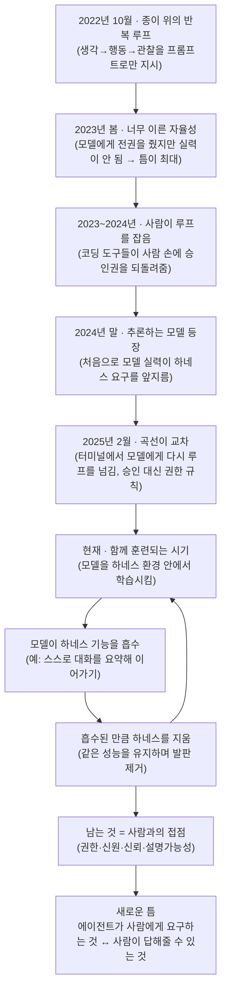

<aside class="ai-knowledge-sidebar">
  
CATEGORIES

  <nav class="ai-cat-tree">

에이전트 오케스트레이션10
<ul><li><a href="https://altjs4510.github.io/ai_news_blog/knowledge/20260826/">2026-08-26apache/maka — 도구 호출·권한 결정·종료 이벤트를 append-only 로그…</a></li><li><a href="https://altjs4510.github.io/ai_news_blog/knowledge/20260823/" class="current">2026-08-23The Evolution of the Agent Harness — 하네스가 모델 가중치…</a></li><li><a href="https://altjs4510.github.io/ai_news_blog/knowledge/20260821/">2026-08-21volcengine/OpenViking — 에이전트 메모리·Knowledge RAG·스…</a></li><li><a href="https://altjs4510.github.io/ai_news_blog/knowledge/20260805/">2026-08-05TencentCloud/TencentDB-Agent-Memory — 대화·문서·코드를 …</a></li><li><a href="https://altjs4510.github.io/ai_news_blog/knowledge/20260708/">2026-07-08Expanding Managed Agents in Gemini API: backgrou…</a></li><li><a href="https://altjs4510.github.io/ai_news_blog/knowledge/20260623/">2026-06-23bytedance/deer-flow — 샌드박스·메모리·서브에이전트·메시지 게이트웨이를…</a></li><li><a href="https://altjs4510.github.io/ai_news_blog/knowledge/20260621/">2026-06-21calesthio/OpenMontage — 12 파이프라인·52 도구·500+ 스킬을 …</a></li><li><a href="https://altjs4510.github.io/ai_news_blog/knowledge/20260602/">2026-06-02revfactory/harness — 도메인별 에이전트 팀과 스킬을 자동 설계하는 메타…</a></li><li><a href="https://altjs4510.github.io/ai_news_blog/knowledge/20260529/">2026-05-29Introducing dynamic workflows in Claude Code</a></li><li><a href="https://altjs4510.github.io/ai_news_blog/knowledge/20260507/">2026-05-07ruvnet/ruflo — Claude 멀티 에이전트 오케스트레이션 플랫폼</a></li></ul>

MCP &amp; 도구 통합16
<ul><li><a href="https://altjs4510.github.io/ai_news_blog/knowledge/20260819/">2026-08-19akitaonrails/ai-memory — 코딩 에이전트 CLI 간 장기 기억과 벤더…</a></li><li><a href="https://altjs4510.github.io/ai_news_blog/knowledge/20260802/">2026-08-02Stateless MCP has recaptured my interest (and in…</a></li><li><a href="https://altjs4510.github.io/ai_news_blog/knowledge/20260801/">2026-08-01different-ai/openwork — Claude Cowork의 오픈소스 대체 에…</a></li><li><a href="https://altjs4510.github.io/ai_news_blog/knowledge/20260731/">2026-07-31different-ai/openwork — Claude Cowork의 오픈소스 대안(o…</a></li><li><a href="https://altjs4510.github.io/ai_news_blog/knowledge/20260729/">2026-07-29Bringing MCP 2026-07-28 to Claude</a></li><li><a href="https://altjs4510.github.io/ai_news_blog/knowledge/20260721/">2026-07-21tirth8205/code-review-graph — 로컬 우선 코드 인텔리전스 그래프…</a></li><li><a href="https://altjs4510.github.io/ai_news_blog/knowledge/20260719/">2026-07-19tirth8205/code-review-graph — 로컬 우선 코드 인텔리전스 그래프…</a></li><li><a href="https://altjs4510.github.io/ai_news_blog/knowledge/20260718/">2026-07-18tirth8205/code-review-graph — MCP·CLI용 로컬 코드 인텔리…</a></li><li><a href="https://altjs4510.github.io/ai_news_blog/knowledge/20260618/">2026-06-18DeusData/codebase-memory-mcp — 158개 언어 코드베이스를 밀리…</a></li><li><a href="https://altjs4510.github.io/ai_news_blog/knowledge/20260606/">2026-06-06chopratejas/headroom — Compress tool outputs, lo…</a></li><li><a href="https://altjs4510.github.io/ai_news_blog/knowledge/20260605/">2026-06-05chopratejas/headroom — Compress tool outputs, lo…</a></li><li><a href="https://altjs4510.github.io/ai_news_blog/knowledge/20260604/">2026-06-04chopratejas/headroom — Compress tool outputs bef…</a></li><li><a href="https://altjs4510.github.io/ai_news_blog/knowledge/20260603/">2026-06-03How Bad MCP design cost your Agent 5× more token…</a></li><li><a href="https://altjs4510.github.io/ai_news_blog/knowledge/20260523/">2026-05-23colbymchenry/codegraph — 사전 인덱싱된 코드 지식 그래프 MCP</a></li><li><a href="https://altjs4510.github.io/ai_news_blog/knowledge/20260517/">2026-05-17I gave my LLM 100,000+ tools — Lazy Discovery &a…</a></li><li><a href="https://altjs4510.github.io/ai_news_blog/knowledge/20260509/">2026-05-09How to connect 100 MCP servers without the conte…</a></li></ul>

코딩 에이전트26
<ul><li><a href="https://altjs4510.github.io/ai_news_blog/knowledge/20260822/">2026-08-22mattpocock/skills — Skills for Real Engineers (하…</a></li><li><a href="https://altjs4510.github.io/ai_news_blog/knowledge/20260820/">2026-08-20akitaonrails/ai-memory — 코딩 에이전트 CLI의 장기 메모리와 벤더…</a></li><li><a href="https://altjs4510.github.io/ai_news_blog/knowledge/20260814/">2026-08-14cathrynlavery/diagram-design — Claude Code용 에디토리…</a></li><li><a href="https://altjs4510.github.io/ai_news_blog/knowledge/20260811/">2026-08-11PrimeIntellect-ai/prime-agent — 장기 자율 실행을 전제로 설계…</a></li><li><a href="https://altjs4510.github.io/ai_news_blog/knowledge/20260810/">2026-08-10Auto mode is now the default in Claude Code for …</a></li><li><a href="https://altjs4510.github.io/ai_news_blog/knowledge/20260809/">2026-08-09PrimeIntellect-ai/prime-agent — 코딩 워크플로우·장기 자율 작…</a></li><li><a href="https://altjs4510.github.io/ai_news_blog/knowledge/20260808/">2026-08-08PrimeIntellect-ai/prime-agent — 코딩 워크플로우와 장시간 자율…</a></li><li><a href="https://altjs4510.github.io/ai_news_blog/knowledge/20260804/">2026-08-04esengine/DeepSeek-Reasonix — prefix-cache 안정성을 축…</a></li><li><a href="https://altjs4510.github.io/ai_news_blog/knowledge/20260728/">2026-07-28alibaba/open-code-review — 결정론적 파이프라인 + LLM 에이전트…</a></li><li><a href="https://altjs4510.github.io/ai_news_blog/knowledge/20260725/">2026-07-25The new rules of context engineering for Claude …</a></li><li><a href="https://altjs4510.github.io/ai_news_blog/knowledge/20260722/">2026-07-22tirth8205/code-review-graph — MCP·CLI용 로컬 우선 코드 …</a></li><li><a href="https://altjs4510.github.io/ai_news_blog/knowledge/20260714/">2026-07-14Graphify-Labs/graphify — 코드베이스를 질의 가능한 지식 그래프로 만…</a></li><li><a href="https://altjs4510.github.io/ai_news_blog/knowledge/20260707/">2026-07-07AI Hero Skills Catalog — 실무 엔지니어를 위한 재사용 가능한 판단 …</a></li><li><a href="https://altjs4510.github.io/ai_news_blog/knowledge/20260705/">2026-07-05openai/codex-plugin-cc — Claude Code에서 Codex를 위임…</a></li><li><a href="https://altjs4510.github.io/ai_news_blog/knowledge/20260626/">2026-06-26google-labs-code/design.md — 코딩 에이전트에게 디자인 시스템을 …</a></li><li><a href="https://altjs4510.github.io/ai_news_blog/knowledge/20260619/">2026-06-19Claude Code now supports artifacts</a></li><li><a href="https://altjs4510.github.io/ai_news_blog/knowledge/20260530/">2026-05-30Leonxlnx/taste-skill — AI에게 좋은 취향을 부여해 generic s…</a></li><li><a href="https://altjs4510.github.io/ai_news_blog/knowledge/20260528/">2026-05-28Building self-improving tax agents with Codex</a></li><li><a href="https://altjs4510.github.io/ai_news_blog/knowledge/20260526/">2026-05-26colbymchenry/codegraph — Pre-indexed code knowle…</a></li><li><a href="https://altjs4510.github.io/ai_news_blog/knowledge/20260524/">2026-05-24colbymchenry/codegraph — Pre-indexed code knowle…</a></li><li><a href="https://altjs4510.github.io/ai_news_blog/knowledge/20260521/">2026-05-21colbymchenry/codegraph — Pre-indexed code knowle…</a></li><li><a href="https://altjs4510.github.io/ai_news_blog/knowledge/20260512/">2026-05-12agentmemory — Persistent memory for AI coding ag…</a></li><li><a href="https://altjs4510.github.io/ai_news_blog/knowledge/20260510/">2026-05-10addyosmani/agent-skills — Production-grade engin…</a></li><li><a href="https://altjs4510.github.io/ai_news_blog/knowledge/20260508/">2026-05-08addyosmani/agent-skills — Production-grade engin…</a></li><li><a href="https://altjs4510.github.io/ai_news_blog/knowledge/20260506/">2026-05-06mksglu/context-mode — AI 코딩 에이전트용 컨텍스트 윈도우 최적화</a></li><li><a href="https://altjs4510.github.io/ai_news_blog/knowledge/20260505/">2026-05-05mattpocock/skills — Skills for Real Engineers (.…</a></li></ul>

모델 &amp; 연구5
<ul><li><a href="https://altjs4510.github.io/ai_news_blog/knowledge/20260716-proprag/">2026-07-16PropRAG — 프로포지션 경로 위 beam search로 멀티홉 검색 안내</a></li><li><a href="https://altjs4510.github.io/ai_news_blog/knowledge/20260620/">2026-06-20zai-org/GLM-5 — From Vibe Coding to Agentic Engi…</a></li><li><a href="https://altjs4510.github.io/ai_news_blog/knowledge/20260617/">2026-06-17Predicting model behavior before release by simu…</a></li><li><a href="https://altjs4510.github.io/ai_news_blog/knowledge/20260516/">2026-05-16STALE — 에이전트가 자기 기억의 유효성을 인지할 수 있는가</a></li><li><a href="https://altjs4510.github.io/ai_news_blog/knowledge/20260513/">2026-05-13Thinking Machines' Native Interaction Models — T…</a></li></ul>

인프라 &amp; 컴퓨트8
<ul><li><a href="https://altjs4510.github.io/ai_news_blog/knowledge/20260813/">2026-08-13semantica-agi/semantica — 컨텍스트와 책임 추적을 위한 그래프 네이…</a></li><li><a href="https://altjs4510.github.io/ai_news_blog/knowledge/20260812/">2026-08-12semantica-agi/semantica — 컨텍스트와 '책임 추적 가능한(accou…</a></li><li><a href="https://altjs4510.github.io/ai_news_blog/knowledge/20260806/">2026-08-06cloudflare/computer — 에이전트에게 컴퓨터를 통째로 주는 엣지 실행 샌…</a></li><li><a href="https://altjs4510.github.io/ai_news_blog/knowledge/20260724/">2026-07-24diegosouzapw/OmniRoute — 단일 엔드포인트로 278+ 프로바이더·50…</a></li><li><a href="https://altjs4510.github.io/ai_news_blog/knowledge/20260723/">2026-07-23diegosouzapw/OmniRoute — 268+ 프로바이더를 단일 엔드포인트로 묶…</a></li><li><a href="https://altjs4510.github.io/ai_news_blog/knowledge/20260611/">2026-06-11The evolution of agentic surfaces: building with…</a></li><li><a href="https://altjs4510.github.io/ai_news_blog/knowledge/20260522/">2026-05-22Giving Agents Computers — Ivan Burazin, Daytona</a></li><li><a href="https://altjs4510.github.io/ai_news_blog/knowledge/20260520/">2026-05-20New in Claude Managed Agents: self-hosted sandbo…</a></li></ul>

보안 &amp; 거버넌스17
<ul><li><a href="https://altjs4510.github.io/ai_news_blog/knowledge/20260827/">2026-08-27Claude in Chrome is generally available</a></li><li><a href="https://altjs4510.github.io/ai_news_blog/knowledge/20260819-mind-viruses/">2026-08-19탈옥도, 인젝션도 없이 — 대화로만 퍼지는 에이전트의 '마인드 바이러스'</a></li><li><a href="https://altjs4510.github.io/ai_news_blog/knowledge/20260730/">2026-07-30Anatomy of a Frontier Lab Agent Intrusion: A Tec…</a></li><li><a href="https://altjs4510.github.io/ai_news_blog/knowledge/20260716/">2026-07-16Dicklesworthstone/destructive_command_guard — 에이…</a></li><li><a href="https://altjs4510.github.io/ai_news_blog/knowledge/20260715/">2026-07-15Dicklesworthstone/destructive_command_guard — 에이…</a></li><li><a href="https://altjs4510.github.io/ai_news_blog/knowledge/20260710/">2026-07-1070개 MCP 서버 strace 런타임 감사 — 부팅 시 아웃바운드 호출 서버 적발</a></li><li><a href="https://altjs4510.github.io/ai_news_blog/knowledge/20260704/">2026-07-04Cloudflare is about to block AI agents by defaul…</a></li><li><a href="https://altjs4510.github.io/ai_news_blog/knowledge/20260703/">2026-07-03Giving admins more visibility and control over C…</a></li><li><a href="https://altjs4510.github.io/ai_news_blog/knowledge/20260630/">2026-06-30Introducing the Claude apps gateway for Amazon B…</a></li><li><a href="https://altjs4510.github.io/ai_news_blog/knowledge/20260625/">2026-06-25Agent identity in Claude Tag: a new access model…</a></li><li><a href="https://altjs4510.github.io/ai_news_blog/knowledge/20260624/">2026-06-24Agent identity in Claude Tag: a new access model…</a></li><li><a href="https://altjs4510.github.io/ai_news_blog/knowledge/20260614/">2026-06-14NVIDIA/SkillSpector — Security scanner for AI ag…</a></li><li><a href="https://altjs4510.github.io/ai_news_blog/knowledge/20260613/">2026-06-13Fable 5's guardrails got bypassed in 48 hours — …</a></li><li><a href="https://altjs4510.github.io/ai_news_blog/knowledge/20260612/">2026-06-12NVIDIA/SkillSpector — AI 에이전트 스킬용 보안 스캐너</a></li><li><a href="https://altjs4510.github.io/ai_news_blog/knowledge/20260607/">2026-06-07OpenAI Help: Lockdown Mode</a></li><li><a href="https://altjs4510.github.io/ai_news_blog/knowledge/20260531/">2026-05-31How we contain Claude across products</a></li><li><a href="https://altjs4510.github.io/ai_news_blog/knowledge/20260527/">2026-05-27Microsoft Copilot Cowork Exfiltrates Files</a></li></ul>

응용 사례7
<ul><li><a href="https://altjs4510.github.io/ai_news_blog/knowledge/20260726/">2026-07-26citrolabs/ego-lite — 로그인된 브라우저 상태를 AI 에이전트와 공유하는…</a></li><li><a href="https://altjs4510.github.io/ai_news_blog/knowledge/20260717/">2026-07-17After a year building agent memory, 'save everyt…</a></li><li><a href="https://altjs4510.github.io/ai_news_blog/knowledge/20260712/">2026-07-12Do Automated Evals Work?</a></li><li><a href="https://altjs4510.github.io/ai_news_blog/knowledge/20260709/">2026-07-09mvanhorn/last30days-skill — Reddit·X·YouTube·HN·…</a></li><li><a href="https://altjs4510.github.io/ai_news_blog/knowledge/20260609/">2026-06-09Building intelligent apps for Apple platforms wi…</a></li><li><a href="https://altjs4510.github.io/ai_news_blog/knowledge/20260515/">2026-05-15Clawdmeter — Claude Code 사용량을 데스크톱 대시보드로</a></li><li><a href="https://altjs4510.github.io/ai_news_blog/knowledge/20260514/">2026-05-14Introducing Claude for Small Business</a></li></ul>

산업 동향7
<ul><li><a href="https://altjs4510.github.io/ai_news_blog/knowledge/20260711/">2026-07-11OpenAI says GPT 5.6 is the 'preferred model' for…</a></li><li><a href="https://altjs4510.github.io/ai_news_blog/knowledge/20260702/">2026-07-02How Cursor deploys AI inside the enterprise (For…</a></li><li><a href="https://altjs4510.github.io/ai_news_blog/knowledge/20260701/">2026-07-01Google OKF (Open Knowledge Format) — 벤더 중립 에이전트 …</a></li><li><a href="https://altjs4510.github.io/ai_news_blog/knowledge/20260616/">2026-06-16Why AI hasn't replaced software engineers, and w…</a></li><li><a href="https://altjs4510.github.io/ai_news_blog/knowledge/20260610/">2026-06-10Fable 5 just made cost-aware model routing manda…</a></li><li><a href="https://altjs4510.github.io/ai_news_blog/knowledge/20260519/">2026-05-19Anthropic acquires Stainless</a></li><li><a href="https://altjs4510.github.io/ai_news_blog/knowledge/20260504/">2026-05-04Agents for Everything Else: Codex for Knowledge …</a></li></ul>
</nav>
</aside>

<article class="ai-knowledge-article">

<header class="ai-post-hero">
  
<a class="ai-back" href="../">KNOWLEDGE</a> · 2026-08-23 · 오늘의 학습

  <h2 class="ai-post-title">The Evolution of the Agent Harness — 하네스가 모델 가중치로 흡수되고, 결국 '사람의 주의'를 관리하는 인터페이스가 된다</h2>
</header>

> 원문: [The Evolution of the Agent Harness — 하네스가 모델 가중치로 흡수되고, 결국 '사람의 주의'를 관리하는 인터페이스가 된다](https://www.latent.space/p/attention-interface)

## 📌 학습 정리

### 1. 한 줄로 말하면

모델을 감싸고 있던 껍데기(도구·규칙·기억 장치)가 점점 모델 안으로 스며들어 사라지고, 마지막에 남는 껍데기는 "사람을 언제 불러야 하는지"를 정하는 부분이라는 이야기입니다. 지금까지 껍데기는 모델을 조종하는 장치였지만, 앞으로는 사람의 집중력을 아껴 쓰는 장치가 된다는 뜻이에요.

### 2. 왜 이게 만들어졌어요?

2022년 말의 첫 ChatGPT는 원문 표현대로 "통 속의 뇌"였습니다. 학습 데이터와 방금 받은 질문 말고는 아무것도 없었고, 도구도 검색도 추론도 없이 다음 단어를 예측하는 게 전부였죠. 그래서 사람들은 모델 바깥에 이것저것을 붙이기 시작했습니다 — 파일을 읽고 쓰게 하고, 명령어를 실행하게 하고, 대화가 길어지면 요약해서 기억을 이어주고, 위험한 동작에는 허가를 물어보게 하는 장치들이요. 이 바깥 장치 묶음을 통틀어 **에이전트 하네스(agent harness)**라고 부릅니다. 이 글은 2025년 크리스마스 무렵 "갑자기 에이전트가 쓸 만해졌다"는 체감이 어디서 왔는지를 이 하네스의 역사로 설명하려고 쓰였습니다.

### 3. 비유로 풀면

**첫 번째 비유 — 몸과 뇌.** 모델은 뇌고, 하네스는 그 뇌에 붙여준 몸입니다. 눈(맥락), 손(도구), 수첩(기억), 그리고 "이건 하면 안 돼"라고 잡아주는 안전선(권한)이요. 그런데 이 몸을 오래 쓰다 보니 뇌가 몸의 기능을 학습해버립니다 — 손 쓰는 법을 뇌가 외워버리면, 밖에 붙여둔 손 모형은 떼어내도 됩니다.

**두 번째 비유 — 신입에게 일 맡기기.** 처음엔 한 줄 한 줄 확인받게 했고(모든 변경에 승인), 실력이 붙으면 "이 범위 안에서는 알아서 해"로 바꿉니다. 그러면 관리자의 일은 코드를 보는 게 아니라 "언제 나를 부를지"를 정하는 일로 바뀌죠.

그래서 결국, 하네스에서 지워도 되는 부분(모델이 흡수한 것)과 절대 안 지워지는 부분(사람과의 접점)이 갈린다는 게 이 글의 핵심입니다.

### 4. 어떻게 작동하는지 (그림으로)

글은 두 개의 곡선으로 역사를 설명합니다. 하나는 "하네스가 모델에게 요구하는 수준", 다른 하나는 "모델이 실제로 해낼 수 있는 수준"이고, 둘 사이의 벌어진 틈이 곧 에이전트가 얼마나 못 쓸 만한지를 나타냅니다.

핵심 흐름은 아래쪽 순환 고리입니다. 훈련 → 흡수 → 제거 → 다시 훈련이 반복되고, 저자는 하네스 발전의 척도를 "성능을 유지하면서 얼마나 많이 지울 수 있었는가"로 보자고 제안합니다. 그런데 이 순환에서 계속 살아남는 부분이 있는데, 사람에게 무언가를 물어보고 사람의 판단을 받는 지점입니다. 그래서 틈은 사라지지 않고 사람 쪽으로 옮겨가고, 이제 새 질문은 "에이전트가 나를 얼마나 자주 불러야 하는가"가 됩니다.

글이 인용하는 숫자 몇 개가 이 주장을 받쳐줍니다. 같은 모델로 같은 106개 과제를 서로 다른 하네스에서 돌렸더니 점수가 52.4점에서 76.2점까지 벌어졌고 — 모델은 한 글자도 안 바꿨는데요. 반대로 흡수의 증거도 있습니다. Claude Code 팀이 시스템 프롬프트(모델에게 미리 넣어두는 지시문)의 80%를 최근 지웠다는 이야기가 나옵니다. 초기 실패 사례의 산수도 인상적입니다 — 한 단계 성공률 95%인 모델이 20단계 작업을 하면 전체 성공률은 약 36%로 떨어집니다. 루프는 실력을 더해주는 게 아니라 있는 실력을 증폭하기 때문에, 실력이 기준선 아래면 오류를 증폭한다는 설명이죠.

### 5. 처음 보는 용어 풀이

- **에이전트 하네스 (agent harness)** — 모델 가중치를 뺀 나머지 전부, 즉 도구·환경·맥락·안전장치 묶음입니다. 모델이 머릿속 판단을 실제 파일이나 명령으로 옮기려면 이게 있어야 합니다.
- **모델 가중치 (model weights)** — 학습을 통해 모델 안에 저장된 수치 덩어리, 쉽게 말해 모델이 배운 내용 자체입니다. "하네스가 가중치로 흡수된다"는 건 밖에서 시켰던 일을 모델이 아예 배워버린다는 뜻이에요.
- **생각-행동-관찰 루프 (ReAct)** — 모델이 생각하고 → 도구를 쓰고 → 결과를 보고 → 다시 생각하는 반복 구조를 프롬프트로 지시하는 기법입니다. 당시엔 모델 밖의 지시문일 뿐이었고, 아무도 이걸 하네스라고 부르지 않았습니다.
- **압축·요약 (compaction)** — 대화가 모델이 한 번에 볼 수 있는 분량을 넘어갈 때 지금까지 내용을 줄여서 이어 붙이는 처리입니다. 원래는 하네스가 대신 해줬지만, 이제 이걸 스스로 하도록 학습된 모델이 나오고 있습니다.
- **맥락 창 (context window)** — 모델이 한 번에 읽고 기억할 수 있는 글의 최대 분량입니다. 이 한도가 있기 때문에 위의 압축·요약이 필요해집니다.
- **강화학습 (Reinforcement Learning, RL)** — 잘한 행동에 보상을 주는 방식으로 모델을 훈련시키는 방법입니다. 이걸 하네스 환경 *안에서* 돌리면, 모델이 그 환경의 도구 쓰는 법까지 같이 배우게 됩니다.
- **사람이 루프 안에 있는 방식 (human in the loop)** — 에이전트가 한 단계씩 진행할 때마다 사람이 확인하고 승인하는 구조입니다. 모델이 미덥지 않던 시기엔 이게 정답이었고, 모델이 좋아지면서 권한 규칙으로 대체됐습니다.
- **주의 인터페이스 (attention-interface)** — 저자가 제안하는 개념으로, 에이전트가 언제 나를 끊어도 되는지·어떤 결정은 혼자 해도 되는지·어떤 건 내 승인이 필요한지를 정해두는 설정 면입니다. 코드베이스 사용법을 적어두는 AGENTS.md처럼, 이건 "나라는 사람 사용법"을 적어두는 것에 가깝습니다.

### 6. 한 발 더 들어가고 싶다면

- [원문 — The Evolution of the Agent Harness](https://www.latent.space/p/attention-interface) — 두 곡선 그림과 시기별 서술을 원문 그대로 볼 수 있어요.
- [ReAct](https://arxiv.org/abs/2210.03629) — 생각→행동→관찰 루프가 처음 프롬프트 기법으로 제안된 논문입니다. 지금 모든 에이전트의 원형을 볼 수 있어요.
- [Harness-Bench](https://harnessbench.com/) — 같은 모델을 서로 다른 하네스에 넣어 점수 차이를 재본 결과라, "하네스가 절반"이라는 주장의 근거를 직접 확인할 수 있어요.
- [Answer.AI의 초기 Devin 테스트](https://www.answer.ai/posts/2025-01-08-devin.html) — 자율성을 너무 이르게 주면 어떻게 실패하는지 실제 검증 기록으로 볼 수 있어요.
- [OpenAI의 ARC-AGI-3 하네스 개선 결과](https://openai.com/index/arc-agi-3-harness/) — 모델은 그대로 두고 기억 유지와 압축만 더했을 때 점수가 얼마나 움직이는지 알 수 있어요.
- [Extreme Harness Engineering for Token Billionaires (Latent Space 에피소드)](https://www.latent.space/p/extreme-harness-engineering) — "정말로 희소한 건 팀의 동시적 집중력"이라는 문제의식이 나온 대화입니다.

---

## 📖 원문 전체 번역 (정독용)

> 의역 최소화한 전체 번역입니다. 큰 흐름은 위 정리에서 잡고, 정확한 워딩이 필요할 땐 이 섹션에서 정독하세요.

# 에이전트 하네스의 진화
모델은 계속해서 하네스를 자신의 가중치 안으로 흡수하고 있다 — 곧, 그것은 모델을 위한 하네스가 아니라 인간의 주의(attention)를 위한 하네스가 될 것이다.
Dan McAteer
2026년 8월 22일
82
5
공유
2025년 크리스마스 즈음, AI 엔지니어들은 에이전트에서 어떤 변화를 알아챘다. 에이전트가 마침내 작동하기 시작한 것이다! 정확히 왜 그런지는 짚어내기 어렵다. 어쩌면 최신 에이전트를 최신 모델로 시도해볼 연말 휴가 시간이 마침내 생긴 것일 수도 있다. 어쩌면 모델이 어떤 능력 임계치를 넘어선 것일 수도 있다. 어쩌면 모델을 감싼 래퍼(wrapper)들이 성숙해진 것일 수도 있다.

이 글에서 내가 주장하려는 것은, 그것이 뒤의 두 가지의 합류였다는 것이다. 모델과 하네스가 함께 개선되었고, 그러다 그 개선 곡선들이 딱 맞는 순간에 서로 교차한 것이다. 그리고 그 역학은 다음에 무슨 일이 일어날지를 설명하는 데 도움을 준다: 모델은 계속해서 하네스를 자신의 가중치 안으로 흡수하고, 엔지니어들은 흡수된 부분을 계속 삭제하며, 남는 것은 모델을 위한 하네스가 아니라 인간의 주의를 위한 하네스다.

Transformer를 발명한 사람 중 한 명인 Lukasz Kaiser는 6월 "Unsupervised Learning"에서 이렇게 말했다:

"지난겨울, 지난 크리스마스의 변화는 — 정확히 짚어내기가 좀 어렵습니다. 즉, 하네스가 바뀌었고 사후학습(post-training)도 조금 바뀌었고 그리고 새로운 사전학습(pre-trained) 모델들이 나왔는데… 큰 도약처럼 느껴졌지만, 정확히 무엇이 그것을 만들어냈는지는 짚어내기 쉽지 않았습니다."

"무슨 일이 일어난 것인가?"에 대한 답은 오로지 모델 가중치 안에만 있는 것이 아니다. 그것은 그 가중치를 둘러싸고 성장한 시스템 안에 있다. 그 답은 에이전트 하네스 안에 있다.

2022년 11월, ChatGPT가 가장 진보된 AI 도구였던 때로 돌아가 생각해보자. 그때 그것이 가진 유일한 능력은 다음 토큰 예측과, 그것이 도움이 되는 어시스턴트처럼 행동하도록 만들어주는 약간의 인간 피드백 기반 강화학습(RLHF)뿐이었다. 도구도 없고, 검색도 없고, 추론도 없었다.

원래의 ChatGPT는 자신의 학습 데이터와 당신이 보낸 프롬프트에 갇혀 있었다. 그 이상도 이하도 아니었다.

그것은 통 속의 뇌(a brain in a vat)였다.

에이전트 하네스는 LLM이 그 갇힘에서 벗어나 실제 디지털 정보 공간과 상호작용할 수 있게 해주는 방법이다.

## 하네스란 실제로 무엇인가
에이전트 하네스란 모델 가중치를 제외한, 에이전트를 작동하게 만드는 그 모든 것이다. 모델을 둘러싼 환경, 도구, 컨텍스트, 그리고 가드레일이다. 하네스가 없으면 모델은 통 속의 뇌다. 그것은 인식론적 행동(epistemic action)을 취할 수는 있지만, 그 결정을 실제 디지털 공간에서 실행(actuate)하려면 하네스가 필요하다.

하네스는 모델의 정신에 몸을 부여하는 것과 같다.

하네스가 있으면 모델은 지각할 수 있고(컨텍스트), 행동할 수 있고(도구), 정보를 유지할 수 있고(메모리와 압축), 자신의 경계를 강제할 수 있다(권한과 가드레일).

## 하네스 1.0: 과거, "볼트온(Bolt-On) 시대"
모델/하네스 진화의 경로에는 두 개의 곡선이 흐른다. 하네스가 모델에게 요구하는 것, 그리고 모델이 실제로 해낼 수 있는 것. 이 두 곡선 사이의 간격은 에이전트의 효과성과 같으며, 그 간격이 좁혀진 것이 바로 Lukasz Kaiser가 언급한 에이전트의 뚜렷한 개선으로 이어졌다는 것이 내 주장이다.

그 간격이 어떻게 단계적으로 좁혀지는지 살펴보자:

**ReAct, "종이 위의 하네스"** (2022년 10월): ReAct는 모델이 프롬프팅을 통해 추론하도록 만드는 프롬프팅 기법이다. 그것은 모델 가중치 외부에 존재하는, 종이 위의 에이전트 루프다. 이는 모델이 추론(reason) -> 행동(act) -> 관찰(observe) -> 반복(repeat)하는 "에이전트 루프"라는 개념을 정의한다. 다시 말하지만, ReAct 루프는 오직 프롬프팅 방식으로만 존재한다. 이 시기에는 프롬프팅이 존재하는 유일한 추론 방식이었고, 아무도 이를 "하네스"라고 부르지 않았다. 같은 해 겨울에 나온 Toolformer(Meta, 2023년 2월)는 도구 사용을 프롬프팅하는 대신 학습시킬 수 있다는 것을 암시했다. 이는 마치 앨런 튜링이 물리적 매체에 구현되기 전에 가졌던 컴퓨터에 대한 아이디어와도 비슷하다. 강력한 아이디어이지만 나중에야 현실화되는 것이다. (ReAct는 ChatGPT보다 한 달 앞선다 — 2022년 10월 대 2022년 11월.) 이 시점에서 두 곡선 모두 거의 0에 가깝다. 우리가 이제 막 시작했기 때문에 그 간격도 작다.

**AutoGPT/BabyAGI, "때 이른 자율성"** (2023년 봄): AutoGPT/BabyAGI에서는 하네스 곡선이 모델 능력 곡선을 앞질러 질주한다. 둘 다 모델에게 완전한 자율성을 넘기며 모델이 "자율적인 직원"처럼 행동하기를 요구하지만, 이 시점의 모델들은 여전히 취약한 다음 토큰 예측기에 지나지 않았다. 루프는 모델에 능력을 더해주지 않는다. 루프는 모델이 가진 능력을 증폭시킬 뿐이며, 어떤 임계치 아래에서는 그 루프가 신뢰성이 아니라 오류를 증폭시킨다. 부정적인 방향의 복리 효과를 생각해보라: 20단계짜리 작업에서 단계당 95%의 신뢰도라면 평균 성공률은 약 36%에 그친다. 하네스는 모델에게 현실적으로 완수할 가능성이 없는 과제를 떠맡기는 셈이다. 이 시점에서 간격이 가장 넓어지며, 이후 18개월은 그 간격을 좁히기 위한 반작용이자 시도가 된다.

**Cursor/Copilot, "인간-루프-내(Human in the Loop)로의 후퇴"** (2023년-2024년): 최초의 AI 기반 IDE들은 모델에 지나친 자율성을 부여한 것이 실패 양상이었음을 인식한다. 이들은 하네스 곡선을 모델 곡선 아래로 끌어내림으로써 간격을 좁힌다. 모델에게 직접 루프를 넘기지 말고, 인간에게 루프를 주고 인간이 그 루프를 오케스트레이션하도록 힘을 실어주는 동안 모델은 인간을 더 빠르게 만들어주는 역할을 한다. Devin의 첫 버전은 그 자율성을 다시 모델에게 넘기려 시도한다. Answer.AI 팀의 테스트는 이것이 여전히 시기상조임을 보여주는데, 성공률이 약 15%였다. 이는 IDE들이 완전한 자율성에서 물러난 움직임이 비겁함이 아니라 옳은 조치였다는 증거다. 그러나 하네스를 모델 아래로 끌어내리는 것이 지배적인 전술로 자리 잡는 동안에도 모델은 계속 개선된다. 2024년 말, 최초의 추론 모델인 o1이 등장하면서 처음으로 그 간격이 역전되며, 우리는 모델 능력 오버행(overhang)의 첫 조짐을 보기 시작한다.

**Claude Code, "곡선이 교차하다"** (2025년 2월): 2024년 말의 역전은 누군가가 붙잡아야 할 기회를 만든다: 만약 모델이 이제 하네스를 앞서고 있다면, 의도적으로 모델의 브레이크를 밟고 있는 하네스는 테이블 위에 능력을 낭비하고 있는 셈이다. Claude Code는 그 기회를 붙잡기 위해 만들어진 최초의 코딩 에이전트다. 그것은 IDE를 버리고 터미널을 택하며, 모델에게 bash와 파일 읽기/쓰기 접근 권한을 부여하고, 모든 변경 사항에 대한 인간의 승인 필요성을 권한 규칙(permission rules)으로 대체한다. 모델은 다시 루프를 넘겨받는데, 이번에는 그것이 자신의 임무를 이해하고 있다. Boris Cherny와 팀은 현재 모델이 아니라 다음 모델의 능력을 염두에 두고 Claude Code를 만든다. 이것이 큰 히트를 친 이유는 모델에 자율성을 부여한 최초의 제품이어서가 아니라, 올바른 시점에 그렇게 한 최초의 제품이기 때문이다. 그 시점은 바로 모델이 자율성을 성공시킬 만큼 충분히 신뢰할 수 있게 된 교차점이다. Claude Code는 곡선들이 만나기 시작할 때 열린 기회를 Anthropic이 붙잡았다는 이유만으로, 6개월 만에 연 매출(ARR) 약 10억 달러 규모로 성장한다.

다음에 일어나는 일은, 곡선들이 단순히 만나는 것을 넘어 서로 땋아지듯(braid) 얽히기 시작한다는 것이다.

## 하네스 2.0: 현재, "공동학습(Co-Training) 시대"
오늘날 하네스는 중요하며, 우리는 그것을 측정할 수 있는 방식으로 확인할 수 있다. Harness-Bench는 동일한 모델을 서로 다른 하네스에서 동일한 106개 과제에 걸쳐 실행했고, 점수는 52.4에서 76.2까지 나왔다 — 모델에는 아무런 변화가 없었는데도 23.8점의 편차가 발생한 것이다. 에이전트의 절반은 하네스다.

OpenAI도 ARC-AGI-3에서 하네스 변경만으로 유사한 결과를 얻었다. 유지되는 추론(retained reasoning)과 압축(compaction)만 추가했을 뿐인데, GPT-5.6 Sol의 ARC-AGI-3 점수는 13.3%에서 38.3%로 세 배 뛰었다.

내부적으로 벌어지고 있는 일은, 강화학습(RL)이 하네스 내부로 옮겨갔다는 것이다. OpenAI의 2025년 5월 codex-1 출시 발표문에 따르면: "codex-1은 다양한 환경의 실제 코딩 과제에서 강화학습을 통해 학습되었다."

두 곡선은 합쳐져 하나의 통합된 시스템으로 땋아지기 시작한다. 이것이 바로 Toolformer가 꿈꿨던 것이 현실로 나타나는 순간이다. 외부에서 프롬프팅되는 도구가 아니라, 이제 도구 호출이 모델의 환경 내부에서 학습되는 것이다.

그런 다음, 모델이 하네스의 환경 안에서 학습됨에 따라, 모델은 하네스의 능력을 자신의 가중치 안으로 흡수하기 시작한다 — 예를 들어 자신의 컨텍스트 윈도우를 알고 스스로 자동 압축(auto-compact)하는 법을 학습하는 식으로.

GPT-5.1-Codex-Max 출시 발표: "압축을 통해 여러 컨텍스트 윈도우를 넘나들며 작동하도록 네이티브하게 학습된 최초의 모델."

모델이 하네스의 능력을 흡수하고 나면, 하네스는 그 비계(scaffold)를 벗어던질 수 있다. 이는 축소를 통한 생산(production by reduction)이다. Anthropic의 Thariq Shihipar는 팀이 최근 Claude Code의 시스템 프롬프트의 80%를 삭제했다고 말했다.

에이전트 하네스 진화 속도의 척도는, 동일한 능력 수준을 유지하면서 하네스를 얼마나 삭제할 수 있는가이다. 이것이 우리가 AI 엔지니어로서 지향해야 할 미래다.

그리하여 이것이 모델/하네스 진화의 루프다: 학습(train) -> 흡수(absorb) -> 벗어던짐(shed) -> 반복(repeat). 모델은 아직 할 수 없는 다음 단계로 올라간다.

Kaiser가 지적한 그 도약을 짚어내기 어려운 이유는, 그것이 하나의 불연속적 사건이 아니기 때문이다. 사전학습의 도약은 모델 카드에 명시할 수 있기 때문에 눈에 띈다. 모델/하네스 공동진화의 도약은 그렇지 않은데, 그 진화 과정에 대한 문서가 존재하지 않기 때문이다. 그것이 지난겨울의 그 도약에 대한 답이다: 그것은 모델과 하네스가 함께 작동하는 그 사이 공간에서 일어났다.

우리는 물어야 한다: 만약 모든 하네스 능력이 결국 모델 안으로 흡수된다면, 우리에게 남는 것은 무엇인가?

## 하네스 3.0: 미래, "주의(Attention)의 시대"
모델이 흡수할 수 있는 모든 것을 계속 삭제하라. 그 과정이 끝났을 때 당신의 에이전트가 어떤 모습일지 상상해보라. 모든 것을 삭제하고 나면 당신 손에 남는 것은 무엇인가?

모델 가중치는 다음에 무엇을 흡수할까? 다중 에이전트 오케스트레이션, 도구 선택, 메모리… 몇 가지 가능성만 들자면 이렇다. 연구자들은 모델과 비슷한 방식으로 스스로 학습될 수 있는, 자기 개선형 하네스(self-improving harnesses)를 만들고 있다.

이 삭제와 흡수 과정의 끝에 남는 것은 인간 중심의 에이전트 능력들이다. 권한, 정체성, 신뢰, 그리고 가독성(legibility) 같은 것들이다. 권한을 스스로 흡수한 모델은 권한을 해체한 것이다. 흡수는 하네스를 끝내지 않는다. 흡수는 하네스를 뒤집는다.

하네스는 그것을 조작하는 인간에 대한 에이전트의 인터페이스가 된다.

하네스는 모델에 대한 인간의 인터페이스로 태어났다. 우리는 챗박스에서 IDE로, 다시 터미널로 성장해왔다. 만약 모델이 컴퓨터를 향한(computer-facing) 능력들을 흡수한다면, 다음 진화 단계는 한 단계 위의 추상화로 넘어간다. 하네스는 모델이 우리 인간의 주의에 접근하는 인터페이스가 된다.

그것은 주의-인터페이스(attention-interface)가 된다.

Ryan Lopopolo는 Latent Space의 "Extreme Harness Engineering for Token Billionaires" 에피소드에서 이렇게 말했다:

"근본적으로 희소한 유일한 것은 내 팀의 동기적(synchronous) 인간 주의다."

토큰은 풍부하고 신뢰할 수 있게 되었지만, 우리는 여전히 희소한 인간 주의에 병목이 걸려 있다.

우리는 이미 그 조짐을 보고 있다 — Anthropic의 장기 실행 에이전트 진행 파일(progress files)과 에이전트형 승인 대기열(agentic approval queues) 같은 것들에서.

모델과 하네스 곡선 사이의 간격은 모델이 하네스를 흡수한다고 해서 사라지지 않는다. 그것은 인간 경계 너머로 이동해, 새로운 간격을 가진 새로운 한 쌍의 곡선을 만들어낸다.

그 새로운 간격은 에이전트가 인간에게 요구하는 것과, 인간이 답할 수 있는 것 사이의 공간이다.

## 주의-인터페이스
나는 1년 안에, 에이전트형 AI를 구축하는 모든 회사가 마치 모든 에이전트형 AI 회사가 AGENTS.md를 내놓았던 것과 같은 방식으로, 인간 주의 정책 표면(human attention policy surface)을 내놓게 될 것이라고 예측한다.

AGENTS.md는 에이전트에게 당신의 코드베이스와 어떻게 작업할지를 알려준다. 주의-인터페이스는 에이전트에게 당신과 어떻게 작업할지를 알려줄 것이다.

그것은 언제 당신을 방해해도 되는지, 언제 계속 작업을 이어가야 하는지, 어떤 결정을 혼자 내릴 수 있고 어떤 결정에는 당신의 승인이 필요한지를 관장할 것이다. 그리고 에이전트 시스템의 다른 모든 것과 마찬가지로, 그것은 더 많은 데이터로 학습할 수 있는 시스템의 학습 가능한 구성요소가 될 것이다. 모든 수정(correction) 하나하나가 유용한 데이터가 된다.

모델은 통 속의 뇌로 시작했다. 하네스는 그 뇌에 몸을 주었고, 그 몸은 다시 뇌 속으로 녹아들기 시작했다. 우리가 앞으로 지어야 할 것은, 그 어떤 미래의 모델도 결코 흡수하지 못할 그것이다. 진정으로 유일하게 희소한 자원, 인간의 주의에 대한 인터페이스다.

82
5
공유

이전
게스트 포스트 by
Dan McAteer
에이전틱 엔지니어. 나는 AI, 인간의 주의, 철학, 그리고 관조적 수행에 관한 에세이인 Attention Heads를 쓴다.
Dan 구독하기

</article>

<!-- ai-related-links -->
<aside class="ai-related-links">
  
관련 학습

  <ul><li><a href="https://altjs4510.github.io/ai_news_blog/knowledge/20260717/">2026-07-17After a year building agent memory, 'save everyt…</a></li><li><a href="https://altjs4510.github.io/ai_news_blog/knowledge/20260701/">2026-07-01Google OKF (Open Knowledge Format) — 벤더 중립 에이전트 …</a></li><li><a href="https://altjs4510.github.io/ai_news_blog/knowledge/20260805/">2026-08-05TencentCloud/TencentDB-Agent-Memory — 대화·문서·코드를 …</a></li></ul>
</aside>
<!-- /ai-related-links -->
