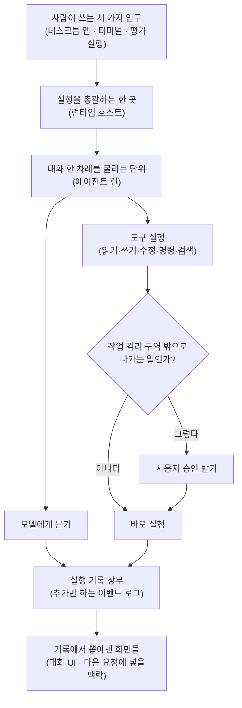

<div class="ai-knowledge-shell">

<aside class="ai-knowledge-sidebar">
  <p class="ai-eyebrow">CATEGORIES</p>
  <nav class="ai-cat-tree"><details class="ai-cat" open><summary><span class="catname">에이전트 오케스트레이션</span><span class="catcount">15</span></summary><ul><li><a href="https://altjs4510.github.io/ai_news_blog/knowledge/20260904/"><span class="kdate">2026-09-04</span><span class="ktitle">HarnessDev: Can LLMs Create and Evolve Their Own…</span></a></li><li><a href="https://altjs4510.github.io/ai_news_blog/knowledge/20260831-openexecutive-virtual-c-suite/"><span class="kdate">2026-08-31</span><span class="ktitle">Open Executive — 8명의 전문 에이전트를 하나의 임원 목소리로</span></a></li><li><a href="https://altjs4510.github.io/ai_news_blog/knowledge/20260828/"><span class="kdate">2026-08-28</span><span class="ktitle">Google ADK for Python v2.8.0 — RemoteA2aAgent 네이…</span></a></li><li><a href="https://altjs4510.github.io/ai_news_blog/knowledge/20260826/" class="current"><span class="kdate">2026-08-26</span><span class="ktitle">apache/maka — 도구 호출·권한 결정·종료 이벤트를 append-only 로그…</span></a></li><li><a href="https://altjs4510.github.io/ai_news_blog/knowledge/20260823/"><span class="kdate">2026-08-23</span><span class="ktitle">The Evolution of the Agent Harness — 하네스가 모델 가중치…</span></a></li><li><a href="https://altjs4510.github.io/ai_news_blog/knowledge/20260821/"><span class="kdate">2026-08-21</span><span class="ktitle">volcengine/OpenViking — 에이전트 메모리·Knowledge RAG·스…</span></a></li><li><a href="https://altjs4510.github.io/ai_news_blog/knowledge/20260805/"><span class="kdate">2026-08-05</span><span class="ktitle">TencentCloud/TencentDB-Agent-Memory — 대화·문서·코드를 …</span></a></li><li><a href="https://altjs4510.github.io/ai_news_blog/knowledge/20260708/"><span class="kdate">2026-07-08</span><span class="ktitle">Expanding Managed Agents in Gemini API: backgrou…</span></a></li><li><a href="https://altjs4510.github.io/ai_news_blog/knowledge/20260707/"><span class="kdate">2026-07-07</span><span class="ktitle">AI Hero Skills Catalog — 실무 엔지니어를 위한 재사용 가능한 판단 …</span></a></li><li><a href="https://altjs4510.github.io/ai_news_blog/knowledge/20260623/"><span class="kdate">2026-06-23</span><span class="ktitle">bytedance/deer-flow — 샌드박스·메모리·서브에이전트·메시지 게이트웨이를…</span></a></li><li><a href="https://altjs4510.github.io/ai_news_blog/knowledge/20260621/"><span class="kdate">2026-06-21</span><span class="ktitle">calesthio/OpenMontage — 12 파이프라인·52 도구·500+ 스킬을 …</span></a></li><li><a href="https://altjs4510.github.io/ai_news_blog/knowledge/20260611/"><span class="kdate">2026-06-11</span><span class="ktitle">The evolution of agentic surfaces: building with…</span></a></li><li><a href="https://altjs4510.github.io/ai_news_blog/knowledge/20260602/"><span class="kdate">2026-06-02</span><span class="ktitle">revfactory/harness — 도메인별 에이전트 팀과 스킬을 자동 설계하는 메타…</span></a></li><li><a href="https://altjs4510.github.io/ai_news_blog/knowledge/20260529/"><span class="kdate">2026-05-29</span><span class="ktitle">Introducing dynamic workflows in Claude Code</span></a></li><li><a href="https://altjs4510.github.io/ai_news_blog/knowledge/20260507/"><span class="kdate">2026-05-07</span><span class="ktitle">ruvnet/ruflo — Claude 멀티 에이전트 오케스트레이션 플랫폼</span></a></li></ul></details><details class="ai-cat" open><summary><span class="catname">MCP &amp; 도구 통합</span><span class="catcount">16</span></summary><ul><li><a href="https://altjs4510.github.io/ai_news_blog/knowledge/20260829/"><span class="kdate">2026-08-29</span><span class="ktitle">cursor/plugins — 플러그인 명세(specification)와 공식 플러그인…</span></a></li><li><a href="https://altjs4510.github.io/ai_news_blog/knowledge/20260802/"><span class="kdate">2026-08-02</span><span class="ktitle">Stateless MCP has recaptured my interest (and in…</span></a></li><li><a href="https://altjs4510.github.io/ai_news_blog/knowledge/20260801/"><span class="kdate">2026-08-01</span><span class="ktitle">different-ai/openwork — Claude Cowork의 오픈소스 대체 에…</span></a></li><li><a href="https://altjs4510.github.io/ai_news_blog/knowledge/20260731/"><span class="kdate">2026-07-31</span><span class="ktitle">different-ai/openwork — Claude Cowork의 오픈소스 대안(o…</span></a></li><li><a href="https://altjs4510.github.io/ai_news_blog/knowledge/20260729/"><span class="kdate">2026-07-29</span><span class="ktitle">Bringing MCP 2026-07-28 to Claude</span></a></li><li><a href="https://altjs4510.github.io/ai_news_blog/knowledge/20260721/"><span class="kdate">2026-07-21</span><span class="ktitle">tirth8205/code-review-graph — 로컬 우선 코드 인텔리전스 그래프…</span></a></li><li><a href="https://altjs4510.github.io/ai_news_blog/knowledge/20260719/"><span class="kdate">2026-07-19</span><span class="ktitle">tirth8205/code-review-graph — 로컬 우선 코드 인텔리전스 그래프…</span></a></li><li><a href="https://altjs4510.github.io/ai_news_blog/knowledge/20260709/"><span class="kdate">2026-07-09</span><span class="ktitle">mvanhorn/last30days-skill — Reddit·X·YouTube·HN·…</span></a></li><li><a href="https://altjs4510.github.io/ai_news_blog/knowledge/20260618/"><span class="kdate">2026-06-18</span><span class="ktitle">DeusData/codebase-memory-mcp — 158개 언어 코드베이스를 밀리…</span></a></li><li><a href="https://altjs4510.github.io/ai_news_blog/knowledge/20260606/"><span class="kdate">2026-06-06</span><span class="ktitle">chopratejas/headroom — Compress tool outputs, lo…</span></a></li><li><a href="https://altjs4510.github.io/ai_news_blog/knowledge/20260605/"><span class="kdate">2026-06-05</span><span class="ktitle">chopratejas/headroom — Compress tool outputs, lo…</span></a></li><li><a href="https://altjs4510.github.io/ai_news_blog/knowledge/20260604/"><span class="kdate">2026-06-04</span><span class="ktitle">chopratejas/headroom — Compress tool outputs bef…</span></a></li><li><a href="https://altjs4510.github.io/ai_news_blog/knowledge/20260603/"><span class="kdate">2026-06-03</span><span class="ktitle">How Bad MCP design cost your Agent 5× more token…</span></a></li><li><a href="https://altjs4510.github.io/ai_news_blog/knowledge/20260523/"><span class="kdate">2026-05-23</span><span class="ktitle">colbymchenry/codegraph — 사전 인덱싱된 코드 지식 그래프 MCP</span></a></li><li><a href="https://altjs4510.github.io/ai_news_blog/knowledge/20260517/"><span class="kdate">2026-05-17</span><span class="ktitle">I gave my LLM 100,000+ tools — Lazy Discovery &a…</span></a></li><li><a href="https://altjs4510.github.io/ai_news_blog/knowledge/20260509/"><span class="kdate">2026-05-09</span><span class="ktitle">How to connect 100 MCP servers without the conte…</span></a></li></ul></details><details class="ai-cat" open><summary><span class="catname">코딩 에이전트</span><span class="catcount">30</span></summary><ul><li><a href="https://altjs4510.github.io/ai_news_blog/knowledge/20260903/"><span class="kdate">2026-09-03</span><span class="ktitle">pacifio/atlas — 여러 코딩 에이전트의 변경을 한곳에서 추적·질의하는 '에이…</span></a></li><li><a href="https://altjs4510.github.io/ai_news_blog/knowledge/20260901/"><span class="kdate">2026-09-01</span><span class="ktitle">affaan-m/ECC — 스킬·본능·메모리·보안을 묶은 에이전트 하네스 성능 최적화 …</span></a></li><li><a href="https://altjs4510.github.io/ai_news_blog/knowledge/20260831-gitnexus-code-knowledge-graph/"><span class="kdate">2026-08-31</span><span class="ktitle">GitNexus — 코드베이스를 지식그래프로 바꿔 에이전트에게 쥐어주기</span></a></li><li><a href="https://altjs4510.github.io/ai_news_blog/knowledge/20260822/"><span class="kdate">2026-08-22</span><span class="ktitle">mattpocock/skills — Skills for Real Engineers (하…</span></a></li><li><a href="https://altjs4510.github.io/ai_news_blog/knowledge/20260820/"><span class="kdate">2026-08-20</span><span class="ktitle">akitaonrails/ai-memory — 코딩 에이전트 CLI의 장기 메모리와 벤더…</span></a></li><li><a href="https://altjs4510.github.io/ai_news_blog/knowledge/20260819/"><span class="kdate">2026-08-19</span><span class="ktitle">akitaonrails/ai-memory — 코딩 에이전트 CLI 간 장기 기억과 벤더…</span></a></li><li><a href="https://altjs4510.github.io/ai_news_blog/knowledge/20260811/"><span class="kdate">2026-08-11</span><span class="ktitle">PrimeIntellect-ai/prime-agent — 장기 자율 실행을 전제로 설계…</span></a></li><li><a href="https://altjs4510.github.io/ai_news_blog/knowledge/20260810/"><span class="kdate">2026-08-10</span><span class="ktitle">Auto mode is now the default in Claude Code for …</span></a></li><li><a href="https://altjs4510.github.io/ai_news_blog/knowledge/20260809/"><span class="kdate">2026-08-09</span><span class="ktitle">PrimeIntellect-ai/prime-agent — 코딩 워크플로우·장기 자율 작…</span></a></li><li><a href="https://altjs4510.github.io/ai_news_blog/knowledge/20260808/"><span class="kdate">2026-08-08</span><span class="ktitle">PrimeIntellect-ai/prime-agent — 코딩 워크플로우와 장시간 자율…</span></a></li><li><a href="https://altjs4510.github.io/ai_news_blog/knowledge/20260804/"><span class="kdate">2026-08-04</span><span class="ktitle">esengine/DeepSeek-Reasonix — prefix-cache 안정성을 축…</span></a></li><li><a href="https://altjs4510.github.io/ai_news_blog/knowledge/20260728/"><span class="kdate">2026-07-28</span><span class="ktitle">alibaba/open-code-review — 결정론적 파이프라인 + LLM 에이전트…</span></a></li><li><a href="https://altjs4510.github.io/ai_news_blog/knowledge/20260725/"><span class="kdate">2026-07-25</span><span class="ktitle">The new rules of context engineering for Claude …</span></a></li><li><a href="https://altjs4510.github.io/ai_news_blog/knowledge/20260722/"><span class="kdate">2026-07-22</span><span class="ktitle">tirth8205/code-review-graph — MCP·CLI용 로컬 우선 코드 …</span></a></li><li><a href="https://altjs4510.github.io/ai_news_blog/knowledge/20260718/"><span class="kdate">2026-07-18</span><span class="ktitle">tirth8205/code-review-graph — MCP·CLI용 로컬 코드 인텔리…</span></a></li><li><a href="https://altjs4510.github.io/ai_news_blog/knowledge/20260715/"><span class="kdate">2026-07-15</span><span class="ktitle">Dicklesworthstone/destructive_command_guard — 에이…</span></a></li><li><a href="https://altjs4510.github.io/ai_news_blog/knowledge/20260714/"><span class="kdate">2026-07-14</span><span class="ktitle">Graphify-Labs/graphify — 코드베이스를 질의 가능한 지식 그래프로 만…</span></a></li><li><a href="https://altjs4510.github.io/ai_news_blog/knowledge/20260705/"><span class="kdate">2026-07-05</span><span class="ktitle">openai/codex-plugin-cc — Claude Code에서 Codex를 위임…</span></a></li><li><a href="https://altjs4510.github.io/ai_news_blog/knowledge/20260626/"><span class="kdate">2026-06-26</span><span class="ktitle">google-labs-code/design.md — 코딩 에이전트에게 디자인 시스템을 …</span></a></li><li><a href="https://altjs4510.github.io/ai_news_blog/knowledge/20260619/"><span class="kdate">2026-06-19</span><span class="ktitle">Claude Code now supports artifacts</span></a></li><li><a href="https://altjs4510.github.io/ai_news_blog/knowledge/20260530/"><span class="kdate">2026-05-30</span><span class="ktitle">Leonxlnx/taste-skill — AI에게 좋은 취향을 부여해 generic s…</span></a></li><li><a href="https://altjs4510.github.io/ai_news_blog/knowledge/20260528/"><span class="kdate">2026-05-28</span><span class="ktitle">Building self-improving tax agents with Codex</span></a></li><li><a href="https://altjs4510.github.io/ai_news_blog/knowledge/20260526/"><span class="kdate">2026-05-26</span><span class="ktitle">colbymchenry/codegraph — Pre-indexed code knowle…</span></a></li><li><a href="https://altjs4510.github.io/ai_news_blog/knowledge/20260524/"><span class="kdate">2026-05-24</span><span class="ktitle">colbymchenry/codegraph — Pre-indexed code knowle…</span></a></li><li><a href="https://altjs4510.github.io/ai_news_blog/knowledge/20260521/"><span class="kdate">2026-05-21</span><span class="ktitle">colbymchenry/codegraph — Pre-indexed code knowle…</span></a></li><li><a href="https://altjs4510.github.io/ai_news_blog/knowledge/20260512/"><span class="kdate">2026-05-12</span><span class="ktitle">agentmemory — Persistent memory for AI coding ag…</span></a></li><li><a href="https://altjs4510.github.io/ai_news_blog/knowledge/20260510/"><span class="kdate">2026-05-10</span><span class="ktitle">addyosmani/agent-skills — Production-grade engin…</span></a></li><li><a href="https://altjs4510.github.io/ai_news_blog/knowledge/20260508/"><span class="kdate">2026-05-08</span><span class="ktitle">addyosmani/agent-skills — Production-grade engin…</span></a></li><li><a href="https://altjs4510.github.io/ai_news_blog/knowledge/20260506/"><span class="kdate">2026-05-06</span><span class="ktitle">mksglu/context-mode — AI 코딩 에이전트용 컨텍스트 윈도우 최적화</span></a></li><li><a href="https://altjs4510.github.io/ai_news_blog/knowledge/20260505/"><span class="kdate">2026-05-05</span><span class="ktitle">mattpocock/skills — Skills for Real Engineers (.…</span></a></li></ul></details><details class="ai-cat" open><summary><span class="catname">모델 &amp; 연구</span><span class="catcount">5</span></summary><ul><li><a href="https://altjs4510.github.io/ai_news_blog/knowledge/20260716-proprag/"><span class="kdate">2026-07-16</span><span class="ktitle">PropRAG — 프로포지션 경로 위 beam search로 멀티홉 검색 안내</span></a></li><li><a href="https://altjs4510.github.io/ai_news_blog/knowledge/20260620/"><span class="kdate">2026-06-20</span><span class="ktitle">zai-org/GLM-5 — From Vibe Coding to Agentic Engi…</span></a></li><li><a href="https://altjs4510.github.io/ai_news_blog/knowledge/20260617/"><span class="kdate">2026-06-17</span><span class="ktitle">Predicting model behavior before release by simu…</span></a></li><li><a href="https://altjs4510.github.io/ai_news_blog/knowledge/20260516/"><span class="kdate">2026-05-16</span><span class="ktitle">STALE — 에이전트가 자기 기억의 유효성을 인지할 수 있는가</span></a></li><li><a href="https://altjs4510.github.io/ai_news_blog/knowledge/20260513/"><span class="kdate">2026-05-13</span><span class="ktitle">Thinking Machines' Native Interaction Models — T…</span></a></li></ul></details><details class="ai-cat" open><summary><span class="catname">인프라 &amp; 컴퓨트</span><span class="catcount">7</span></summary><ul><li><a href="https://altjs4510.github.io/ai_news_blog/knowledge/20260813/"><span class="kdate">2026-08-13</span><span class="ktitle">semantica-agi/semantica — 컨텍스트와 책임 추적을 위한 그래프 네이…</span></a></li><li><a href="https://altjs4510.github.io/ai_news_blog/knowledge/20260812/"><span class="kdate">2026-08-12</span><span class="ktitle">semantica-agi/semantica — 컨텍스트와 '책임 추적 가능한(accou…</span></a></li><li><a href="https://altjs4510.github.io/ai_news_blog/knowledge/20260806/"><span class="kdate">2026-08-06</span><span class="ktitle">cloudflare/computer — 에이전트에게 컴퓨터를 통째로 주는 엣지 실행 샌…</span></a></li><li><a href="https://altjs4510.github.io/ai_news_blog/knowledge/20260724/"><span class="kdate">2026-07-24</span><span class="ktitle">diegosouzapw/OmniRoute — 단일 엔드포인트로 278+ 프로바이더·50…</span></a></li><li><a href="https://altjs4510.github.io/ai_news_blog/knowledge/20260723/"><span class="kdate">2026-07-23</span><span class="ktitle">diegosouzapw/OmniRoute — 268+ 프로바이더를 단일 엔드포인트로 묶…</span></a></li><li><a href="https://altjs4510.github.io/ai_news_blog/knowledge/20260522/"><span class="kdate">2026-05-22</span><span class="ktitle">Giving Agents Computers — Ivan Burazin, Daytona</span></a></li><li><a href="https://altjs4510.github.io/ai_news_blog/knowledge/20260520/"><span class="kdate">2026-05-20</span><span class="ktitle">New in Claude Managed Agents: self-hosted sandbo…</span></a></li></ul></details><details class="ai-cat" open><summary><span class="catname">보안 &amp; 거버넌스</span><span class="catcount">17</span></summary><ul><li><a href="https://altjs4510.github.io/ai_news_blog/knowledge/20260902/"><span class="kdate">2026-09-02</span><span class="ktitle">AIR raises $50M to help companies vet the skills…</span></a></li><li><a href="https://altjs4510.github.io/ai_news_blog/knowledge/20260827/"><span class="kdate">2026-08-27</span><span class="ktitle">Claude in Chrome is generally available</span></a></li><li><a href="https://altjs4510.github.io/ai_news_blog/knowledge/20260819-mind-viruses/"><span class="kdate">2026-08-19</span><span class="ktitle">탈옥도, 인젝션도 없이 — 대화로만 퍼지는 에이전트의 '마인드 바이러스'</span></a></li><li><a href="https://altjs4510.github.io/ai_news_blog/knowledge/20260730/"><span class="kdate">2026-07-30</span><span class="ktitle">Anatomy of a Frontier Lab Agent Intrusion: A Tec…</span></a></li><li><a href="https://altjs4510.github.io/ai_news_blog/knowledge/20260716/"><span class="kdate">2026-07-16</span><span class="ktitle">Dicklesworthstone/destructive_command_guard — 에이…</span></a></li><li><a href="https://altjs4510.github.io/ai_news_blog/knowledge/20260710/"><span class="kdate">2026-07-10</span><span class="ktitle">70개 MCP 서버 strace 런타임 감사 — 부팅 시 아웃바운드 호출 서버 적발</span></a></li><li><a href="https://altjs4510.github.io/ai_news_blog/knowledge/20260704/"><span class="kdate">2026-07-04</span><span class="ktitle">Cloudflare is about to block AI agents by defaul…</span></a></li><li><a href="https://altjs4510.github.io/ai_news_blog/knowledge/20260703/"><span class="kdate">2026-07-03</span><span class="ktitle">Giving admins more visibility and control over C…</span></a></li><li><a href="https://altjs4510.github.io/ai_news_blog/knowledge/20260630/"><span class="kdate">2026-06-30</span><span class="ktitle">Introducing the Claude apps gateway for Amazon B…</span></a></li><li><a href="https://altjs4510.github.io/ai_news_blog/knowledge/20260625/"><span class="kdate">2026-06-25</span><span class="ktitle">Agent identity in Claude Tag: a new access model…</span></a></li><li><a href="https://altjs4510.github.io/ai_news_blog/knowledge/20260624/"><span class="kdate">2026-06-24</span><span class="ktitle">Agent identity in Claude Tag: a new access model…</span></a></li><li><a href="https://altjs4510.github.io/ai_news_blog/knowledge/20260614/"><span class="kdate">2026-06-14</span><span class="ktitle">NVIDIA/SkillSpector — Security scanner for AI ag…</span></a></li><li><a href="https://altjs4510.github.io/ai_news_blog/knowledge/20260613/"><span class="kdate">2026-06-13</span><span class="ktitle">Fable 5's guardrails got bypassed in 48 hours — …</span></a></li><li><a href="https://altjs4510.github.io/ai_news_blog/knowledge/20260612/"><span class="kdate">2026-06-12</span><span class="ktitle">NVIDIA/SkillSpector — AI 에이전트 스킬용 보안 스캐너</span></a></li><li><a href="https://altjs4510.github.io/ai_news_blog/knowledge/20260607/"><span class="kdate">2026-06-07</span><span class="ktitle">OpenAI Help: Lockdown Mode</span></a></li><li><a href="https://altjs4510.github.io/ai_news_blog/knowledge/20260531/"><span class="kdate">2026-05-31</span><span class="ktitle">How we contain Claude across products</span></a></li><li><a href="https://altjs4510.github.io/ai_news_blog/knowledge/20260527/"><span class="kdate">2026-05-27</span><span class="ktitle">Microsoft Copilot Cowork Exfiltrates Files</span></a></li></ul></details><details class="ai-cat" open><summary><span class="catname">응용 사례</span><span class="catcount">7</span></summary><ul><li><a href="https://altjs4510.github.io/ai_news_blog/knowledge/20260814/"><span class="kdate">2026-08-14</span><span class="ktitle">cathrynlavery/diagram-design — Claude Code용 에디토리…</span></a></li><li><a href="https://altjs4510.github.io/ai_news_blog/knowledge/20260726/"><span class="kdate">2026-07-26</span><span class="ktitle">citrolabs/ego-lite — 로그인된 브라우저 상태를 AI 에이전트와 공유하는…</span></a></li><li><a href="https://altjs4510.github.io/ai_news_blog/knowledge/20260717/"><span class="kdate">2026-07-17</span><span class="ktitle">After a year building agent memory, 'save everyt…</span></a></li><li><a href="https://altjs4510.github.io/ai_news_blog/knowledge/20260712/"><span class="kdate">2026-07-12</span><span class="ktitle">Do Automated Evals Work?</span></a></li><li><a href="https://altjs4510.github.io/ai_news_blog/knowledge/20260609/"><span class="kdate">2026-06-09</span><span class="ktitle">Building intelligent apps for Apple platforms wi…</span></a></li><li><a href="https://altjs4510.github.io/ai_news_blog/knowledge/20260515/"><span class="kdate">2026-05-15</span><span class="ktitle">Clawdmeter — Claude Code 사용량을 데스크톱 대시보드로</span></a></li><li><a href="https://altjs4510.github.io/ai_news_blog/knowledge/20260514/"><span class="kdate">2026-05-14</span><span class="ktitle">Introducing Claude for Small Business</span></a></li></ul></details><details class="ai-cat" open><summary><span class="catname">산업 동향</span><span class="catcount">8</span></summary><ul><li><a href="https://altjs4510.github.io/ai_news_blog/knowledge/20260830/"><span class="kdate">2026-08-30</span><span class="ktitle">[AINews] OpenAI shuts off Cursor — 프론티어 모델 공급 차단…</span></a></li><li><a href="https://altjs4510.github.io/ai_news_blog/knowledge/20260711/"><span class="kdate">2026-07-11</span><span class="ktitle">OpenAI says GPT 5.6 is the 'preferred model' for…</span></a></li><li><a href="https://altjs4510.github.io/ai_news_blog/knowledge/20260702/"><span class="kdate">2026-07-02</span><span class="ktitle">How Cursor deploys AI inside the enterprise (For…</span></a></li><li><a href="https://altjs4510.github.io/ai_news_blog/knowledge/20260701/"><span class="kdate">2026-07-01</span><span class="ktitle">Google OKF (Open Knowledge Format) — 벤더 중립 에이전트 …</span></a></li><li><a href="https://altjs4510.github.io/ai_news_blog/knowledge/20260616/"><span class="kdate">2026-06-16</span><span class="ktitle">Why AI hasn't replaced software engineers, and w…</span></a></li><li><a href="https://altjs4510.github.io/ai_news_blog/knowledge/20260610/"><span class="kdate">2026-06-10</span><span class="ktitle">Fable 5 just made cost-aware model routing manda…</span></a></li><li><a href="https://altjs4510.github.io/ai_news_blog/knowledge/20260519/"><span class="kdate">2026-05-19</span><span class="ktitle">Anthropic acquires Stainless</span></a></li><li><a href="https://altjs4510.github.io/ai_news_blog/knowledge/20260504/"><span class="kdate">2026-05-04</span><span class="ktitle">Agents for Everything Else: Codex for Knowledge …</span></a></li></ul></details></nav>
</aside>

<article class="ai-knowledge-article">

<header class="ai-post-hero">
  <p class="ai-eyebrow"><a class="ai-back" href="../">KNOWLEDGE</a> · 2026-08-26 · 오늘의 학습</p>
  <h2 class="ai-post-title">apache/maka — 도구 호출·권한 결정·종료 이벤트를 append-only 로그로 남기는 로컬 우선 에이전트 워크스페이스</h2>
</header>

> 원문: [apache/maka — 도구 호출·권한 결정·종료 이벤트를 append-only 로그로 남기는 로컬 우선 에이전트 워크스페이스](https://github.com/apache/maka)

## 📌 학습 정리

### 1. 한 줄로 말하면

내 컴퓨터 안에서만 도는 AI 비서 작업실인데, 이 비서가 뭘 읽고 뭘 고쳤고 어디서 멈췄는지를 전부 장부에 적어두는 도구예요. 화면에 보이는 대화는 그 장부를 예쁘게 보여주는 창일 뿐이고, 원본 기록은 따로 남아 있습니다.

### 2. 왜 이게 만들어졌어요?

지금까지 AI 비서 도구들은 대체로 "대화 화면이 곧 기록"이었어요. 화면에 남은 말풍선이 사실상 유일한 사본이라, 대화가 길어져서 앞부분을 잘라내면 그 내용은 그냥 사라지는 셈이었죠. 게다가 비서가 파일을 고치거나 명령어를 실행하는 등 실제로 손을 대는 순간이 늘어나면서, "그때 정확히 뭘 했더라"를 나중에 되짚기가 어려워졌습니다. Maka는 그 반대로 접근합니다. 모델이 주고받은 말, 도구를 호출한 기록, 그 결과, 그리고 그 차례가 어떻게 끝났는지까지 전부 되살릴 수 있는 사실로 먼저 적어두고, 화면과 다음 요청은 그 기록에서 뽑아낸 화면일 뿐이라는 구조예요. 여기에 "내 데이터는 내 기기에" 원칙을 더해, 세션·설정·실행 기록을 기본적으로 로컬에 두고 모델만 각자 원하는 걸 연결해 쓰게 했습니다.

### 3. 비유로 풀면

병원 진료 기록부와 비슷해요. 의사가 환자에게 무슨 말을 했는지, 어떤 검사를 지시했는지, 결과가 뭐였는지, 진료가 어떻게 마무리됐는지를 차트에 적어두죠. 다음 진료 때 의사가 차트 전체를 다시 읽지는 않고 요약만 훑지만, 그렇다고 차트를 찢어버리지는 않습니다.

그래서 결국, 다음 요청에 넣을 내용을 짧게 줄이는 것과 기록을 지우는 것은 전혀 다른 일이라는 게 이 도구의 핵심 주장이에요.

또 하나는 출입 통제가 있는 사무실 같은 면이에요. 비서가 자기 책상 위에서 하는 일은 그냥 하지만, 정해진 구역 밖으로 나가는 일 — 파일을 쓰거나 터미널 명령을 돌리는 일 — 은 문 앞에서 승인을 받아야 통과합니다.

### 4. 어떻게 작동하는지 (그림으로)



세 가지 입구가 있지만 실제로 비서를 돌리는 곳은 런타임 호스트 한 군데예요. 여기서 모델 호출과 도구 실행이 일어나고, 그 과정에서 생긴 일들이 전부 장부에 차곡차곡 쌓입니다. 화면에 보이는 대화나 다음번 모델 요청에 넣을 요약은 그 장부를 바탕으로 만들어낸 결과물이고, 도중에 프로그램이 죽어도 장부가 남아 있어서 복구하거나 이어서 진행할 수 있다는 게 설계 의도입니다.

### 5. 처음 보는 용어 풀이

- **에이전트 / 비서 프로그램 (Agent)** — 사람이 목표만 주면 스스로 파일을 읽고 명령을 실행하며 여러 단계를 밟아 일을 처리하는 프로그램이에요. 단순히 답만 내놓는 챗봇과 달리 실제로 무언가를 건드립니다.
- **내 기기 우선 (local-first)** — 세션 기록, 설정, 실행 이력을 기본적으로 내 컴퓨터에 저장한다는 방침이에요. 모델은 클라우드 API든 내 컴퓨터에서 도는 모델이든 원하는 걸 골라 연결합니다.
- **추가만 하는 기록 (append-only 로그)** — 새 사건을 뒤에 덧붙이기만 하고 이미 적힌 내용은 고치거나 지우지 않는 기록 방식이에요. 그래서 나중에 "그때 무슨 일이 있었는지"를 순서대로 되짚을 수 있습니다.
- **도구 호출 (tool call)** — 모델이 직접 답을 쓰는 대신 "이 파일을 읽어줘", "이 명령을 실행해줘" 하고 프로그램에게 실제 작업을 시키는 걸 말해요. Maka에는 읽기(Read), 쓰기(Write), 수정(Edit), 명령 실행(Bash), 파일 찾기(Glob), 내용 검색(Grep)이 기본으로 들어 있습니다.
- **작업 격리 구역 (sandbox)** — 비서가 마음대로 움직여도 되는 안전한 울타리예요. 파일을 쓰거나 셸 명령을 돌리는 것처럼 이 울타리를 넘는 작업은 먼저 승인을 통과해야 합니다.
- **한 차례의 주고받음 (Turn)** — 사람이 요청한 뒤 비서가 필요한 도구를 쓰고 답을 내놓기까지의 한 덩어리를 말해요. 이게 어떻게 끝났는지(정상 완료·중단·실패)도 기록에 남습니다.
- **중단된 작업 이어하기 (resume)** — 도중에 끊긴 차례를 기록을 근거로 다시 이어가는 기능이에요. 기본적으로는 꺼져 있는데, 이어하려면 모델을 다시 호출해야 해서 비용이 들기 때문입니다.
- **인큐베이팅 (Incubating)** — 아파치 소프트웨어 재단(ASF)에 새로 들어온 프로젝트가 거치는 준비 단계예요. 코드 완성도와는 별개로, 아직 재단의 정식 인증을 받기 전 상태라는 뜻입니다.

### 6. 한 발 더 들어가고 싶다면

- [apache/maka 저장소](https://github.com/apache/maka) — 소스에서 직접 빌드해 돌려보는 절차와 전체 구조를 볼 수 있어요. 현재 데스크톱 앱은 애플 실리콘 맥만 지원한다는 점도 여기 적혀 있습니다.
- 저장소 안의 `ARCHITECTURE.md` — 실행 기록이 어떻게 화면과 다음 요청으로 이어지는지, 시스템 전체 지도와 코드 경계를 정리한 문서예요.
- 저장소 안의 `SECURITY.md`와 개인정보·이어하기 관련 문서 — 자격 증명이 로컬에 어떤 형태로 저장되는지, 이어하기를 켰을 때 무엇이 달라지는지 확인할 수 있습니다.
- 저장소 안의 `CONTRIBUTING.md` — 코드를 고쳐 기여하려 할 때 어떤 검사를 통과시켜야 하는지 알려줍니다.
- 저장소 안의 `.github/ASF_SOURCE_RELEASE.md` — 아직 정식 배포본이 없는 상태에서, 앞으로 어떤 절차를 거쳐야 공식 릴리스로 인정되는지 설명합니다.

---

## 📖 원문 전체 번역 (정독용)

> 의역 최소화한 전체 번역입니다. 큰 흐름은 위 정리에서 잡고, 정확한 워딩이 필요할 땐 이 섹션에서 정독하세요.

# Apache Maka (Incubating)

Apache Software Foundation에서 인큐베이팅 중

실제 업무를 위해 만들어진 로컬 우선(local-first) Agent 워크스페이스.

Maka는 프로젝트를 검사하고, 샌드박스 경계 안에서 도구를 실행하며, 모델 메시지와 도구 호출을 복구 가능한 실행 사실(execution facts)로 기록한다 — 여러분의 머신에서, 단 하나의 Runtime Host를 통해.

**참고**

Apache Maka (Incubating)는 Apache Incubator PMC가 후원하며 Apache Software Foundation(ASF)에서 인큐베이션을 진행 중인 프로젝트다. 인큐베이션은 인프라, 커뮤니케이션, 의사결정 절차가 다른 성공적인 ASF 프로젝트들과 부합하는 수준으로 안정화되었다는 추가 검토가 있을 때까지, 새로 승인된 모든 프로젝트에 요구되는 절차다. 인큐베이션 상태가 반드시 코드의 완성도나 안정성을 반영하는 것은 아니지만, 아직 ASF의 완전한 승인을 받지 못했다는 것을 나타낸다.

**DISCLAIMER-WIP**

프로젝트가 현재 인지하고 있는 이슈들을 기록한다.

**중요**

Maka는 현재 활발히 개발 중이다. macOS Apple Silicon 데스크톱 빌드는 초기 공개 릴리스이며, 데이터 형식, CLI 명령어, 실험적 기능들이 여전히 변경될 수 있다.

## Maka를 쓰는 이유

**여러분의 머신, 여러분의 데이터.**
세션, 설정, 실행 기록은 기본적으로 로컬에 남는다. 모델은 여러분이 직접 가져온다 — 클라우드 API, 로컬 모델, 또는 호환 게이트웨이.

**기록은 보존된다.**
모델 메시지, 도구 호출, 도구 결과, 그리고 한 턴이 어떻게 종료되었는지가 기록된다. UI와 다음 모델 호출은 그 기록에 대한 뷰(view)일 뿐, 유일한 사본이 아니다.

**컨텍스트를 짧게 만드는 것이 히스토리 삭제를 의미하지는 않는다.**
Maka는 다음 프롬프트에서 오래된 도구 출력을 생략할 수 있지만, 그렇다고 저장된 증거를 폐기하는 것은 아니다.

**한 곳이 에이전트를 실행한다.**
데스크톱, 터미널, Maka evaluation 모두 Runtime Host를 거친다. Eval은 오직 실험(experiment)과 그 점수만 소유한다.

읽어볼 것: 설계에 대해서는 **Maka Backend Architecture**를 참조.

## 표면(Surfaces)

| 진입점 | 가장 적합한 용도 | 현재 기능 |
|---|---|---|
| Desktop | 일상적인 상호작용, 파일 및 Artifact 워크플로, 모델 및 권한 설정 | 스트리밍 세션, 도구 타임라인, 브랜칭, 검색, 복구를 갖춘 Electron + React |
| TUI / CLI | 현재 프로젝트 디렉토리에서 Maka를 사용하거나 하나의 비대화형 Turn을 실행 | `maka`, `maka run`; Desktop과 워크스페이스 및 모델 연결을 공유 |
| Eval | Maka와 외부 subject를 아우르는 재현 가능한 벤치마크 실험 | `maka eval run <spec> --out <directory>` |

## 현재 기능

**Agent Runtime**
- 다중 모델 연결, 스트리밍 출력, 사고(thinking), 사용량, 더 명확해진 provider 오류;
- 내장 도구: `Read`, `Write`, `Edit`, `Bash`, `Glob`, `Grep`. Computer Use와 카탈로그 스킬은 선택 사항이며 기본으로 켜져 있지 않다;
- 샌드박스를 벗어나는 도구는 승인이 필요하며, 실행은 중단될 수 있고, 실패는 분류된다;
- 내구성 있는(durable) 실행 기록, 크래시 복구, 중단된 턴의 선택적 재개(resume).

**Desktop workspace**
- Turn에서 세션 생성, 보관, 검색, 이름 변경, 재시도, 재생성, 브랜치 생성;
- Artifact 목록 및 미리보기, 워크스페이스 지침, 모델 설정, 샌드박스 설정;
- 설정 시 로컬 메모리 및 웹 검색;
- 채팅 앱(IM 봇)은 실험적이다. **IM onboarding** 참조.

**Evaluation**
- task × repetition × subject 셀로 확장되는 선언적(declarative) 다중 arm 실험;
- 대상 인프라 교체와 최초 유효(earliest-valid) 선택을 지원하는, 셀별로 불변(immutable)인 attempt;
- 점수, 정규화된 사용량, 귀속 비용(attributable cost), 소요 시간, 상태, 실패 원인, artifact를 위한 소형 결과 커널;
- Maka subject는 오직 Runtime Host를 통해서만 실행되며, 외부 subject는 범용 외부 subject 어댑터를 사용한다.

## Quick start

### 릴리스 및 다운로드

Apache Maka는 아직 Apache 릴리스를 낸 적이 없다. 이 저장소에서 또는 패키지 레지스트리에서 현재까지 게시된 모든 것은 인큐베이션 이전 또는 인큐베이션 도중에 만들어진 것으로, Apache Software Foundation의 릴리스가 아니며, Incubator PMC의 검토나 투표를 거치지 않았다.

Apache 릴리스가 존재하게 되면, 공식 릴리스는 ASF가 게시하고 podling PPMC와 Incubator PMC가 승인한 소스 릴리스가 된다. 그 소스로부터 빌드되어 다른 곳(예: 패키지 레지스트리 또는 Desktop 설치 프로그램)을 통해 배포되는 패키지는 릴리스 자체가 아니라 편의상 제공되는 산출물(convenience artifact)이며, 승인된 소스 릴리스로부터 빌드되었을 때만 유효하다.

`.github/ASF_SOURCE_RELEASE.md`에 후보 계약, 서명 경로, 검증 절차가 담겨 있다.

승인된 소스 릴리스가 존재하기 전까지, 이 README는 빌드된 다운로드 파일을 권장하지 않는다. 아래 설명된 대로 소스에서 Maka를 빌드하고 실행하라. Desktop은 현재 Apple Silicon Mac(`arm64`)을 대상으로 한다. Intel Mac과 Linux는 아직 지원되지 않는다. **Windows**는 서명되지 않은 프리뷰이며, 지원되는 릴리스 등급이 아니다.

### 요구 사항

- Node.js 22.19 이상(CI는 Node.js 24 사용);
- npm(lockfile과 스크립트가 npm을 사용하며, 현재 `packageManager`는 npm 11);
- Git;
- Runtime의 `Grep` 도구가 사용하는 `ripgrep`.

### Desktop 시작하기

```
git clone https://github.com/apache/maka.git
cd maka
npm ci
npm run dev
```

`npm run dev`는 HMR을 지원하는 Desktop 개발 환경을 시작한다. Electron을 시작하기 전에 모든 워크스페이스를 빌드하려면 다음을 사용하라:

```
npm run dev:full
```

`ELECTRON_SKIP_BINARY_DOWNLOAD=1`로 의존성을 설치했다면, 시작하기 전에 Electron 플랫폼 바이너리를 설치해야 한다:

```
node node_modules/electron/install.js
```

### 첫 실행

Maka는 공유 모델 계정을 번들로 제공하지 않는다. 첫 실행 시:

1. `Settings → Models`를 연다;
2. API, 로컬 모델, 또는 지원되는 계정 연결을 추가한다;
3. 테스트하고 기본 모델을 선택한다;
4. 워크스페이스로 돌아가 작업을 시작한다.

앱은 설정됨(configured), 전송 준비됨(send-ready), 실험적(experimental) 연결 상태를 구분한다. Runtime에 연결되지 않은 계정 흐름은 사용 가능한 모델로 표시되지 않는다.

### 터미널 진입점

공개 npm 패키지에 대해서는 **CLI installation and usage guide**를 참조하라.

아래 명령어들은 소스 체크아웃에서 개발용 CLI를 실행한다.

먼저 워크스페이스를 빌드한다:

```
npm run build
```

그런 다음 TUI를 시작하거나 하나의 Turn을 실행한다:

```
npm run cli:dev
npm run cli:dev -- run "Summarize this repository and identify its most important risk"
npm run cli:dev -- run --graph "Implement two independent slices, integrate them, then review the result"
npm run cli:dev -- --help
```

TUI는 `/graph on`, `/graph off`, `/graph <task>`도 받아들인다. 비대화형 `--graph` 실행은 최종 supervisor 출력을 출력하기 전에 내구성 있는 Graph가 끝날 때까지 대기한다. Graph 구현 오퍼레이터는 격리된 Git worktree를 사용하므로, 소스 프로젝트는 클린한 Git worktree여야 한다.

저장소 CLI는 개발용 Desktop 빌드와 동일한 `Maka Dev` 프로필을 사용한다. **릴리스된** `maka` 바이너리는 계속해서 `Maka` 프로필을 사용하며, 두 프로필은 자동으로 복사되거나 동기화되지 않는다. Evaluation 스펙과 어댑터는 `packages/eval`에 있다.

## 아키텍처

백엔드의 근간(spine)은 다음과 같다:

```
Desktop / TUI / CLI → Runtime Host → SessionManager → AgentRun
                                             ↓
                         Model + Tool Runtime → Runtime Event Log
                                             ↓
                              Context / Session / UI projections

Experiment → Cells → Attempts → Results
                    ↓
       Runtime Host executes Maka subjects
```

`ARCHITECTURE.md`부터 시작하라. 시스템 지도, 코드 경계, 문제 지향적(problem-oriented) 읽기 경로, 그리고 여섯 개의 이중언어(bilingual) 심층 분석을 제공한다.

## 저장소 구조

```
apps/desktop/       Electron main / preload / React renderer

packages/core/      Sessions, Events, Permissions, Connections를 위한 순수 계약(contract)
packages/storage/   SQLite 운영 상태, 설정, payload 저장소
packages/runtime/   AgentRun, 모델 어댑터, 도구, 컨텍스트, 복구
packages/eval/      Experiment cell, attempt, result, executor/subject 어댑터
packages/cli/       TUI 및 비대화형 CLI
packages/ui/        공유 대화, Markdown, Artifact, UI 기본 요소(primitives)

docs/               아키텍처, 제품, 보안, 프라이버시, 테스트 계약
scripts/            빌드 위생(hygiene), 시각적 점검, 스모크 테스트, 릴리스 헬퍼
```

## 로컬 데이터 및 복구

워크스페이스 데이터는 기본적으로 Electron `userData` 아래에 위치한다:

```
<Electron userData>/workspaces/default/
  runtime.sqlite
  connection-catalog.json
  credential-vault.json
  settings.json
  artifacts/
```

API 키 및 이와 유사한 비밀 값들은 로컬 평문 파일(`credential-vault.json`)에 저장되며, 여러분의 OS 계정만 읽을 수 있다. Renderer는 이를 전혀 보지 못한다.

파일을 쓰거나 셸을 실행하는 도구는 먼저 샌드박스 경계를 통과해야 한다.

`runtime.sqlite`는 살아있는(live) 기록이다. 예전 JSONL transcript와 Electron `safeStorage` credential 파일은 임포트되지 않는다 — 업그레이드된 워크스페이스는 빈 스레드를 표시할 수 있으며, 그런 credential들은 다시 입력해야 한다.

중단된 턴을 재개하는 기능은 기본적으로 꺼져 있다. Desktop의 **Safe resume**, CLI의 `/resume`, 그리고 시작 시 자동 재개를 원할 경우에만 `MAKA_RUNTIME_SAFE_BOUNDARY_RESUME=1`을 설정하라 — 이 호출들은 모델을 호출하며 토큰을 사용한다.

자세한 내용: `SECURITY.md`, **privacy**, **resume**.

## 개발 및 검증

변경 사항을 제출하기 전에 `CONTRIBUTING.md`를 읽어라.

일반적인 저장소 수준 명령어:

```
npm run build
npm run typecheck
npm test
npm run check:release
```

하나의 워크스페이스만 독립적으로 실행:

```
npm --workspace @maka/runtime test
npm --workspace @maka/eval test
npm --workspace @maka/desktop test
```

`refresh:model-metadata`를 사용하면 models.dev로부터 현재 카탈로그를 가져오고, 커밋된 스냅샷을 업데이트하고, 파생된 TypeScript 파일들을 재생성한다. 커밋된 모델, capability, provider override, pricing 필드 중 어느 하나라도 사라지면 refresh는 실패로 닫힌다(fail closed) — 의도된 upstream 제거 내용을 검토한 뒤에는 다음으로 승인하라:

```
npm run refresh:model-metadata -- --accept-upstream-removals
```

`sync:model-metadata`는 의도적으로 오프라인이다: 이는 커밋된 스냅샷으로부터 그 파일들만 재생성한다. 접근 경로에 특화된 override는 `model-metadata.ts`에 유지하라; 생성된 파일들을 손으로 편집하지 마라.

```
npm run refresh:model-metadata
npm --workspace @maka/core test
```

Desktop의 실제 창(real-window) 및 시각적 검증:

```
npm --workspace @maka/desktop run e2e
npm --workspace @maka/desktop run smoke:real-window
```

코드를 제출하기 전에, 변경 사항에 비례하여 typecheck, build, 그리고 집중 테스트(focused test)를 실행하고, 이어서 `git diff --check`를 실행하라.

## 문서

- 문서 인덱스 및 authority map
- Backend architecture
- Product design
- Contributing guide
- Security policy

## 라이선스

Maka는 **Apache License 2.0** 하에 라이선스가 부여된다. 저작자 표시 정보는 `NOTICE`를 참조하라. 서드파티 구성 요소들은 각각의 라이선스와 고지 사항의 적용을 받는다.

Apache Maka, Maka, Apache, Apache 깃털(feather), Apache Maka 프로젝트 로고는 The Apache Software Foundation의 등록 상표 또는 상표다.

</article>

</div>

<!-- ai-related-links -->
<aside class="ai-related-links">
  <p class="ai-eyebrow">관련 학습</p>
  <ul><li><a href="https://altjs4510.github.io/ai_news_blog/knowledge/20260710/"><span class="kdate">2026-07-10</span><span class="ktitle">70개 MCP 서버 strace 런타임 감사 — 부팅 시 아웃바운드 호출 서버 적발</span></a></li><li><a href="https://altjs4510.github.io/ai_news_blog/knowledge/20260624/"><span class="kdate">2026-06-24</span><span class="ktitle">Agent identity in Claude Tag: a new access model…</span></a></li><li><a href="https://altjs4510.github.io/ai_news_blog/knowledge/20260731/"><span class="kdate">2026-07-31</span><span class="ktitle">different-ai/openwork — Claude Cowork의 오픈소스 대안(o…</span></a></li></ul>
</aside>
<!-- /ai-related-links -->
