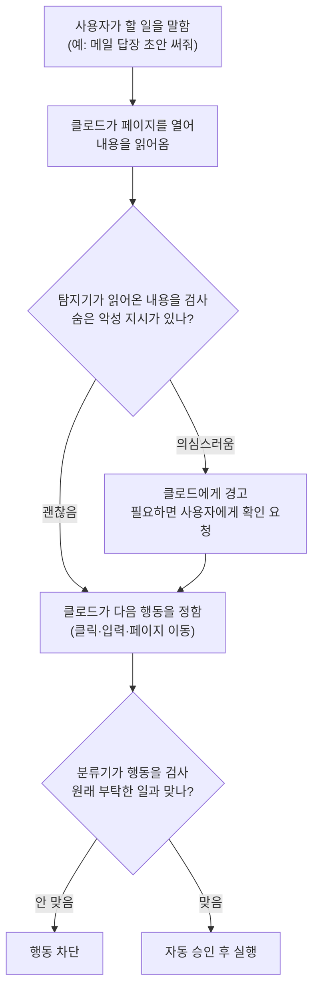

<aside class="ai-knowledge-sidebar">
  
CATEGORIES

  <nav class="ai-cat-tree">

에이전트 오케스트레이션10
<ul><li><a href="https://altjs4510.github.io/ai_news_blog/knowledge/20260828/">2026-08-28Google ADK for Python v2.8.0 — RemoteA2aAgent 네이…</a></li><li><a href="https://altjs4510.github.io/ai_news_blog/knowledge/20260823/">2026-08-23The Evolution of the Agent Harness — 하네스가 모델 가중치…</a></li><li><a href="https://altjs4510.github.io/ai_news_blog/knowledge/20260709/">2026-07-09mvanhorn/last30days-skill — Reddit·X·YouTube·HN·…</a></li><li><a href="https://altjs4510.github.io/ai_news_blog/knowledge/20260708/">2026-07-08Expanding Managed Agents in Gemini API: backgrou…</a></li><li><a href="https://altjs4510.github.io/ai_news_blog/knowledge/20260623/">2026-06-23bytedance/deer-flow — 샌드박스·메모리·서브에이전트·메시지 게이트웨이를…</a></li><li><a href="https://altjs4510.github.io/ai_news_blog/knowledge/20260621/">2026-06-21calesthio/OpenMontage — 12 파이프라인·52 도구·500+ 스킬을 …</a></li><li><a href="https://altjs4510.github.io/ai_news_blog/knowledge/20260611/">2026-06-11The evolution of agentic surfaces: building with…</a></li><li><a href="https://altjs4510.github.io/ai_news_blog/knowledge/20260602/">2026-06-02revfactory/harness — 도메인별 에이전트 팀과 스킬을 자동 설계하는 메타…</a></li><li><a href="https://altjs4510.github.io/ai_news_blog/knowledge/20260529/">2026-05-29Introducing dynamic workflows in Claude Code</a></li><li><a href="https://altjs4510.github.io/ai_news_blog/knowledge/20260507/">2026-05-07ruvnet/ruflo — Claude 멀티 에이전트 오케스트레이션 플랫폼</a></li></ul>

MCP &amp; 도구 통합18
<ul><li><a href="https://altjs4510.github.io/ai_news_blog/knowledge/20260829/">2026-08-29cursor/plugins — 플러그인 명세(specification)와 공식 플러그인…</a></li><li><a href="https://altjs4510.github.io/ai_news_blog/knowledge/20260805/">2026-08-05TencentCloud/TencentDB-Agent-Memory — 대화·문서·코드를 …</a></li><li><a href="https://altjs4510.github.io/ai_news_blog/knowledge/20260802/">2026-08-02Stateless MCP has recaptured my interest (and in…</a></li><li><a href="https://altjs4510.github.io/ai_news_blog/knowledge/20260801/">2026-08-01different-ai/openwork — Claude Cowork의 오픈소스 대체 에…</a></li><li><a href="https://altjs4510.github.io/ai_news_blog/knowledge/20260731/">2026-07-31different-ai/openwork — Claude Cowork의 오픈소스 대안(o…</a></li><li><a href="https://altjs4510.github.io/ai_news_blog/knowledge/20260729/">2026-07-29Bringing MCP 2026-07-28 to Claude</a></li><li><a href="https://altjs4510.github.io/ai_news_blog/knowledge/20260721/">2026-07-21tirth8205/code-review-graph — 로컬 우선 코드 인텔리전스 그래프…</a></li><li><a href="https://altjs4510.github.io/ai_news_blog/knowledge/20260719/">2026-07-19tirth8205/code-review-graph — 로컬 우선 코드 인텔리전스 그래프…</a></li><li><a href="https://altjs4510.github.io/ai_news_blog/knowledge/20260718/">2026-07-18tirth8205/code-review-graph — MCP·CLI용 로컬 코드 인텔리…</a></li><li><a href="https://altjs4510.github.io/ai_news_blog/knowledge/20260701/">2026-07-01Google OKF (Open Knowledge Format) — 벤더 중립 에이전트 …</a></li><li><a href="https://altjs4510.github.io/ai_news_blog/knowledge/20260618/">2026-06-18DeusData/codebase-memory-mcp — 158개 언어 코드베이스를 밀리…</a></li><li><a href="https://altjs4510.github.io/ai_news_blog/knowledge/20260606/">2026-06-06chopratejas/headroom — Compress tool outputs, lo…</a></li><li><a href="https://altjs4510.github.io/ai_news_blog/knowledge/20260605/">2026-06-05chopratejas/headroom — Compress tool outputs, lo…</a></li><li><a href="https://altjs4510.github.io/ai_news_blog/knowledge/20260604/">2026-06-04chopratejas/headroom — Compress tool outputs bef…</a></li><li><a href="https://altjs4510.github.io/ai_news_blog/knowledge/20260603/">2026-06-03How Bad MCP design cost your Agent 5× more token…</a></li><li><a href="https://altjs4510.github.io/ai_news_blog/knowledge/20260523/">2026-05-23colbymchenry/codegraph — 사전 인덱싱된 코드 지식 그래프 MCP</a></li><li><a href="https://altjs4510.github.io/ai_news_blog/knowledge/20260517/">2026-05-17I gave my LLM 100,000+ tools — Lazy Discovery &a…</a></li><li><a href="https://altjs4510.github.io/ai_news_blog/knowledge/20260509/">2026-05-09How to connect 100 MCP servers without the conte…</a></li></ul>

코딩 에이전트28
<ul><li><a href="https://altjs4510.github.io/ai_news_blog/knowledge/20260826/">2026-08-26apache/maka — 도구 호출·권한 결정·종료 이벤트를 append-only 로그…</a></li><li><a href="https://altjs4510.github.io/ai_news_blog/knowledge/20260822/">2026-08-22mattpocock/skills — Skills for Real Engineers (하…</a></li><li><a href="https://altjs4510.github.io/ai_news_blog/knowledge/20260820/">2026-08-20akitaonrails/ai-memory — 코딩 에이전트 CLI의 장기 메모리와 벤더…</a></li><li><a href="https://altjs4510.github.io/ai_news_blog/knowledge/20260819/">2026-08-19akitaonrails/ai-memory — 코딩 에이전트 CLI 간 장기 기억과 벤더…</a></li><li><a href="https://altjs4510.github.io/ai_news_blog/knowledge/20260814/">2026-08-14cathrynlavery/diagram-design — Claude Code용 에디토리…</a></li><li><a href="https://altjs4510.github.io/ai_news_blog/knowledge/20260811/">2026-08-11PrimeIntellect-ai/prime-agent — 장기 자율 실행을 전제로 설계…</a></li><li><a href="https://altjs4510.github.io/ai_news_blog/knowledge/20260810/">2026-08-10Auto mode is now the default in Claude Code for …</a></li><li><a href="https://altjs4510.github.io/ai_news_blog/knowledge/20260809/">2026-08-09PrimeIntellect-ai/prime-agent — 코딩 워크플로우·장기 자율 작…</a></li><li><a href="https://altjs4510.github.io/ai_news_blog/knowledge/20260808/">2026-08-08PrimeIntellect-ai/prime-agent — 코딩 워크플로우와 장시간 자율…</a></li><li><a href="https://altjs4510.github.io/ai_news_blog/knowledge/20260804/">2026-08-04esengine/DeepSeek-Reasonix — prefix-cache 안정성을 축…</a></li><li><a href="https://altjs4510.github.io/ai_news_blog/knowledge/20260728/">2026-07-28alibaba/open-code-review — 결정론적 파이프라인 + LLM 에이전트…</a></li><li><a href="https://altjs4510.github.io/ai_news_blog/knowledge/20260725/">2026-07-25The new rules of context engineering for Claude …</a></li><li><a href="https://altjs4510.github.io/ai_news_blog/knowledge/20260722/">2026-07-22tirth8205/code-review-graph — MCP·CLI용 로컬 우선 코드 …</a></li><li><a href="https://altjs4510.github.io/ai_news_blog/knowledge/20260714/">2026-07-14Graphify-Labs/graphify — 코드베이스를 질의 가능한 지식 그래프로 만…</a></li><li><a href="https://altjs4510.github.io/ai_news_blog/knowledge/20260707/">2026-07-07AI Hero Skills Catalog — 실무 엔지니어를 위한 재사용 가능한 판단 …</a></li><li><a href="https://altjs4510.github.io/ai_news_blog/knowledge/20260705/">2026-07-05openai/codex-plugin-cc — Claude Code에서 Codex를 위임…</a></li><li><a href="https://altjs4510.github.io/ai_news_blog/knowledge/20260626/">2026-06-26google-labs-code/design.md — 코딩 에이전트에게 디자인 시스템을 …</a></li><li><a href="https://altjs4510.github.io/ai_news_blog/knowledge/20260619/">2026-06-19Claude Code now supports artifacts</a></li><li><a href="https://altjs4510.github.io/ai_news_blog/knowledge/20260530/">2026-05-30Leonxlnx/taste-skill — AI에게 좋은 취향을 부여해 generic s…</a></li><li><a href="https://altjs4510.github.io/ai_news_blog/knowledge/20260528/">2026-05-28Building self-improving tax agents with Codex</a></li><li><a href="https://altjs4510.github.io/ai_news_blog/knowledge/20260526/">2026-05-26colbymchenry/codegraph — Pre-indexed code knowle…</a></li><li><a href="https://altjs4510.github.io/ai_news_blog/knowledge/20260524/">2026-05-24colbymchenry/codegraph — Pre-indexed code knowle…</a></li><li><a href="https://altjs4510.github.io/ai_news_blog/knowledge/20260521/">2026-05-21colbymchenry/codegraph — Pre-indexed code knowle…</a></li><li><a href="https://altjs4510.github.io/ai_news_blog/knowledge/20260512/">2026-05-12agentmemory — Persistent memory for AI coding ag…</a></li><li><a href="https://altjs4510.github.io/ai_news_blog/knowledge/20260510/">2026-05-10addyosmani/agent-skills — Production-grade engin…</a></li><li><a href="https://altjs4510.github.io/ai_news_blog/knowledge/20260508/">2026-05-08addyosmani/agent-skills — Production-grade engin…</a></li><li><a href="https://altjs4510.github.io/ai_news_blog/knowledge/20260506/">2026-05-06mksglu/context-mode — AI 코딩 에이전트용 컨텍스트 윈도우 최적화</a></li><li><a href="https://altjs4510.github.io/ai_news_blog/knowledge/20260505/">2026-05-05mattpocock/skills — Skills for Real Engineers (.…</a></li></ul>

모델 &amp; 연구6
<ul><li><a href="https://altjs4510.github.io/ai_news_blog/knowledge/20260821/">2026-08-21volcengine/OpenViking — 에이전트 메모리·Knowledge RAG·스…</a></li><li><a href="https://altjs4510.github.io/ai_news_blog/knowledge/20260716-proprag/">2026-07-16PropRAG — 프로포지션 경로 위 beam search로 멀티홉 검색 안내</a></li><li><a href="https://altjs4510.github.io/ai_news_blog/knowledge/20260620/">2026-06-20zai-org/GLM-5 — From Vibe Coding to Agentic Engi…</a></li><li><a href="https://altjs4510.github.io/ai_news_blog/knowledge/20260617/">2026-06-17Predicting model behavior before release by simu…</a></li><li><a href="https://altjs4510.github.io/ai_news_blog/knowledge/20260516/">2026-05-16STALE — 에이전트가 자기 기억의 유효성을 인지할 수 있는가</a></li><li><a href="https://altjs4510.github.io/ai_news_blog/knowledge/20260513/">2026-05-13Thinking Machines' Native Interaction Models — T…</a></li></ul>

인프라 &amp; 컴퓨트8
<ul><li><a href="https://altjs4510.github.io/ai_news_blog/knowledge/20260813/">2026-08-13semantica-agi/semantica — 컨텍스트와 책임 추적을 위한 그래프 네이…</a></li><li><a href="https://altjs4510.github.io/ai_news_blog/knowledge/20260812/">2026-08-12semantica-agi/semantica — 컨텍스트와 '책임 추적 가능한(accou…</a></li><li><a href="https://altjs4510.github.io/ai_news_blog/knowledge/20260806/">2026-08-06cloudflare/computer — 에이전트에게 컴퓨터를 통째로 주는 엣지 실행 샌…</a></li><li><a href="https://altjs4510.github.io/ai_news_blog/knowledge/20260724/">2026-07-24diegosouzapw/OmniRoute — 단일 엔드포인트로 278+ 프로바이더·50…</a></li><li><a href="https://altjs4510.github.io/ai_news_blog/knowledge/20260723/">2026-07-23diegosouzapw/OmniRoute — 268+ 프로바이더를 단일 엔드포인트로 묶…</a></li><li><a href="https://altjs4510.github.io/ai_news_blog/knowledge/20260630/">2026-06-30Introducing the Claude apps gateway for Amazon B…</a></li><li><a href="https://altjs4510.github.io/ai_news_blog/knowledge/20260522/">2026-05-22Giving Agents Computers — Ivan Burazin, Daytona</a></li><li><a href="https://altjs4510.github.io/ai_news_blog/knowledge/20260520/">2026-05-20New in Claude Managed Agents: self-hosted sandbo…</a></li></ul>

보안 &amp; 거버넌스16
<ul><li><a href="https://altjs4510.github.io/ai_news_blog/knowledge/20260827/" class="current">2026-08-27Claude in Chrome is generally available</a></li><li><a href="https://altjs4510.github.io/ai_news_blog/knowledge/20260819-mind-viruses/">2026-08-19탈옥도, 인젝션도 없이 — 대화로만 퍼지는 에이전트의 '마인드 바이러스'</a></li><li><a href="https://altjs4510.github.io/ai_news_blog/knowledge/20260730/">2026-07-30Anatomy of a Frontier Lab Agent Intrusion: A Tec…</a></li><li><a href="https://altjs4510.github.io/ai_news_blog/knowledge/20260716/">2026-07-16Dicklesworthstone/destructive_command_guard — 에이…</a></li><li><a href="https://altjs4510.github.io/ai_news_blog/knowledge/20260715/">2026-07-15Dicklesworthstone/destructive_command_guard — 에이…</a></li><li><a href="https://altjs4510.github.io/ai_news_blog/knowledge/20260710/">2026-07-1070개 MCP 서버 strace 런타임 감사 — 부팅 시 아웃바운드 호출 서버 적발</a></li><li><a href="https://altjs4510.github.io/ai_news_blog/knowledge/20260704/">2026-07-04Cloudflare is about to block AI agents by defaul…</a></li><li><a href="https://altjs4510.github.io/ai_news_blog/knowledge/20260703/">2026-07-03Giving admins more visibility and control over C…</a></li><li><a href="https://altjs4510.github.io/ai_news_blog/knowledge/20260625/">2026-06-25Agent identity in Claude Tag: a new access model…</a></li><li><a href="https://altjs4510.github.io/ai_news_blog/knowledge/20260624/">2026-06-24Agent identity in Claude Tag: a new access model…</a></li><li><a href="https://altjs4510.github.io/ai_news_blog/knowledge/20260614/">2026-06-14NVIDIA/SkillSpector — Security scanner for AI ag…</a></li><li><a href="https://altjs4510.github.io/ai_news_blog/knowledge/20260613/">2026-06-13Fable 5's guardrails got bypassed in 48 hours — …</a></li><li><a href="https://altjs4510.github.io/ai_news_blog/knowledge/20260612/">2026-06-12NVIDIA/SkillSpector — AI 에이전트 스킬용 보안 스캐너</a></li><li><a href="https://altjs4510.github.io/ai_news_blog/knowledge/20260607/">2026-06-07OpenAI Help: Lockdown Mode</a></li><li><a href="https://altjs4510.github.io/ai_news_blog/knowledge/20260531/">2026-05-31How we contain Claude across products</a></li><li><a href="https://altjs4510.github.io/ai_news_blog/knowledge/20260527/">2026-05-27Microsoft Copilot Cowork Exfiltrates Files</a></li></ul>

응용 사례6
<ul><li><a href="https://altjs4510.github.io/ai_news_blog/knowledge/20260726/">2026-07-26citrolabs/ego-lite — 로그인된 브라우저 상태를 AI 에이전트와 공유하는…</a></li><li><a href="https://altjs4510.github.io/ai_news_blog/knowledge/20260717/">2026-07-17After a year building agent memory, 'save everyt…</a></li><li><a href="https://altjs4510.github.io/ai_news_blog/knowledge/20260712/">2026-07-12Do Automated Evals Work?</a></li><li><a href="https://altjs4510.github.io/ai_news_blog/knowledge/20260609/">2026-06-09Building intelligent apps for Apple platforms wi…</a></li><li><a href="https://altjs4510.github.io/ai_news_blog/knowledge/20260515/">2026-05-15Clawdmeter — Claude Code 사용량을 데스크톱 대시보드로</a></li><li><a href="https://altjs4510.github.io/ai_news_blog/knowledge/20260514/">2026-05-14Introducing Claude for Small Business</a></li></ul>

산업 동향7
<ul><li><a href="https://altjs4510.github.io/ai_news_blog/knowledge/20260830/">2026-08-30[AINews] OpenAI shuts off Cursor — 프론티어 모델 공급 차단…</a></li><li><a href="https://altjs4510.github.io/ai_news_blog/knowledge/20260711/">2026-07-11OpenAI says GPT 5.6 is the 'preferred model' for…</a></li><li><a href="https://altjs4510.github.io/ai_news_blog/knowledge/20260702/">2026-07-02How Cursor deploys AI inside the enterprise (For…</a></li><li><a href="https://altjs4510.github.io/ai_news_blog/knowledge/20260616/">2026-06-16Why AI hasn't replaced software engineers, and w…</a></li><li><a href="https://altjs4510.github.io/ai_news_blog/knowledge/20260610/">2026-06-10Fable 5 just made cost-aware model routing manda…</a></li><li><a href="https://altjs4510.github.io/ai_news_blog/knowledge/20260519/">2026-05-19Anthropic acquires Stainless</a></li><li><a href="https://altjs4510.github.io/ai_news_blog/knowledge/20260504/">2026-05-04Agents for Everything Else: Codex for Knowledge …</a></li></ul>
</nav>
</aside>

<article class="ai-knowledge-article">

<header class="ai-post-hero">
  
<a class="ai-back" href="../">KNOWLEDGE</a> · 2026-08-27 · 오늘의 학습

  <h2 class="ai-post-title">Claude in Chrome is generally available</h2>
</header>

> 원문: [Claude in Chrome is generally available](https://claude.com/blog/claude-in-chrome-generally-available)

## 📌 학습 정리

### 1. 한 줄로 말하면

크롬 브라우저 안에 AI 조수를 앉혀두고, 내가 이미 로그인해 둔 화면을 대신 보고 클릭하고 입력하게 맡기는 기능이 정식으로 열렸어요. 이제는 매번 "이거 눌러도 돼?"를 묻지 않고 스스로 판단해 움직이되, 그 판단이 안전한지 검사하는 장치가 뒤에 붙어 있습니다.

### 2. 왜 이게 만들어졌어요?

AI에게 일을 시키려면 보통 그 도구와 AI가 미리 연결돼 있어야 합니다. 그런데 회사 안에서 실제로 쓰는 것들 — 사내 대시보드, 오래된 레거시 시스템, 거래처가 준 포털 같은 것들 — 은 그런 연결 통로 자체가 없는 경우가 훨씬 많죠. 그래서 사람이 브라우저를 열고 로그인해서 손으로 처리하는 수밖에 없었습니다. 크롬용 클로드는 그 지점을 파고들어서, 별도 연결 없이 **내가 보고 있는 웹 페이지 그 자체**를 AI가 읽고 조작하게 만듭니다. 다만 이 방식은 바깥 웹의 내용을 그대로 집어삼키는 구조라 위험이 따르는데, 그래서 작년에 바로 정식 출시하지 않고 시범 운영(pilot)으로 먼저 열어 방어 장치를 다듬은 뒤 이제야 정식 공개한 거예요.

### 3. 비유로 풀면

**첫 번째 비유.** 인턴에게 내 노트북을 그대로 넘겨주는 것과 비슷해요. 로그인은 이미 다 돼 있으니 인턴은 아이디·비밀번호를 몰라도 화면을 보고 일을 처리할 수 있죠. 대신 그 인턴이 "이 메일에 적힌 대로 하세요"라는 문구를 곧이곧대로 믿으면 곤란해집니다.

**두 번째 비유.** 그래서 붙은 장치가 두 겹인데, 하나는 **들어오는 우편물을 미리 열어보는 검열관**이고, 다른 하나는 **인턴이 뭔가 실행하기 직전에 "그거 원래 지시받은 일 맞아?"라고 되묻는 감독관**입니다.

그래서 결국, 자율성을 넓힌 대신 "무엇을 읽었는가"와 "무엇을 하려는가" 양쪽에 각각 검사대를 세워서 균형을 맞춘 구조예요.

### 4. 어떻게 작동하는지 (그림으로)

흐름을 말로 풀면, 클로드가 웹 페이지를 읽어오는 순간 그 내용을 먼저 훑어보는 검사가 한 번 있고, 클로드가 실제로 뭔가를 누르거나 입력하기 직전에 "이게 원래 부탁받은 일에 부합하나"를 대조하는 검사가 또 한 번 있습니다. 이 두 번째 검사가 통과되면 사람에게 묻지 않고 알아서 실행되는데, 이게 클로드 코드(Claude Code)의 자동 모드와 같은 방식이라고 원문은 설명합니다. 매번 직접 승인하고 싶으면 설정에서 이 자동 승인을 꺼둘 수 있어요.

성능 측정 부분도 짚어두면 좋은데, 원문에 따르면 초기 평가 방식은 공격 성공률이 0%까지 떨어져 더 이상 변별력이 없다고 보고 폐기했고, 전문 침투 시험자들이 만든 더 강한 공격으로 새 평가를 돌렸습니다. 아무 방어 장치도 없는 상태에서는 모델에 도달한 공격이 일부 성공했지만(Opus 4.5는 17.6%, Opus 5는 3.8%), 탐지기와 안전 분류기를 함께 켜면 여러 모델에서 성공한 공격이 없었고 한 모델에서만 0.3%가 남았다고 합니다. 다만 이런 공격 기법은 계속 진화하는 움직이는 표적이라, 방어도 계속 갱신해야 한다는 점을 원문 스스로 인정하고 있어요.

### 5. 처음 보는 용어 풀이

- **프롬프트 주입 공격 (prompt injection)** — 웹 페이지나 메일, 입력 칸 안에 사람 눈에는 잘 안 보이게 악성 지시를 숨겨두고, AI가 그걸 사용자의 지시로 착각해 따르게 만드는 공격입니다. 원문의 예시처럼, 메일 답장을 부탁했는데 어떤 메일에 숨은 문구가 "다른 메일들을 이 주소로 전달해"라고 시켜버리는 식이에요.
- **탐지기 (probe)** — AI가 웹에서 읽어온 내용을 훑어서 숨은 악성 지시가 섞였는지 미리 걸러내는 검사 장치입니다. 걸리면 클로드에게 "이 내용은 의심하고 봐라"라고 경고하고, 필요하면 사용자에게 물어보게 만듭니다.
- **안전 분류기 (safety classifier)** — 클로드가 실행하려는 행동 하나하나를, 사용자가 원래 부탁한 내용과 맞는지 대조해 판정하는 장치입니다. 맞지 않으면 실행 전에 차단합니다.
- **도구 호출과 도구 결과 (tool call / tool result)** — AI가 "이 페이지를 읽어줘" 같은 요청을 시스템에 던지는 것이 도구 호출이고, 그 결과로 돌아온 페이지 내용이 도구 결과입니다. 웹의 바깥 내용이 AI에게 들어오는 통로가 바로 이 도구 결과라서, 검사도 여기서 이뤄집니다.
- **자동 승인과 자동 모드 (auto mode)** — 안전하다고 판단된 행동은 사람 확인 없이 바로 실행하는 방식입니다. 예전에는 모든 행동마다 사람이 승인해야 했는데, 이제 기본값이 자동이고 설정에서 수동으로 되돌릴 수 있어요.
- **레드팀 (red-teamer)** — 방어를 뚫어보는 역할을 맡은 전문가들입니다. 이들이 만든 공격을 모아 평가 기준으로 쓰고, 새로 성공한 공격은 라이브러리에 축적해 다음 모델 학습과 방어 장치에 반영합니다.
- **공격 성공률 (attack success rate)** — 시도한 공격 중 실제로 AI를 속이는 데 성공한 비율입니다. 원문은 "모델에 도달한 공격"만 분모로 잡는데, 클로드가 애초에 그 악성 문구를 마주치지 않고 지나가는 경우도 있기 때문이라고 각주로 밝히고 있어요.

### 6. 한 발 더 들어가고 싶다면

- [프롬프트 주입(prompt injection)](https://claude.com/blog/claude-in-chrome-generally-available) — 원문 안에서 이 개념이 무엇이고 왜 브라우저에서 특히 위험한지 짚어주는 대목입니다.
- 브라우저 사용 안전장치(browser-use safeguards) 문서 — 시범 운영 당시 발표한 것보다 더 자세하게, 어떤 방어를 어떻게 겹쳐 놨는지 설명한 자료라고 원문이 안내합니다.
- 2025년 11월 브라우저 프롬프트 주입 방어 글 — 지금 결과와 비교할 수 있는 이전 시점의 기준선을 알 수 있어요. 원문의 수치 비교가 대부분 이 시점을 기준으로 삼습니다.
- 크롬 웹 스토어(Chrome Web Store) — 실제 설치 경로입니다. 유료 요금제에서 쓸 수 있고, 다른 크로미움 계열 브라우저나 모바일에서는 아직 안 된다는 점을 원문이 명시합니다.
- 관리자 설정 가이드(admin setup guide) — 기업 요금제에서 조직 설정으로 이 기능을 관리하고, 허용된 도메인으로만 제한하는 방법을 다룹니다.

---

## 📖 원문 전체 번역 (정독용)

> 의역 최소화한 전체 번역입니다. 큰 흐름은 위 정리에서 잡고, 정확한 워딩이 필요할 땐 이 섹션에서 정독하세요.

# Claude in Chrome이 정식 출시되었습니다

Claude에게 브라우저 안에서 작업을 맡기고, 탭을 넘나들며 작업하게 하고, 데스크톱·모바일·웹 앱에서 대화를 이어가세요.

**카테고리**: 제품 발표
**제품**: Claude Cowork, Claude 앱
**날짜**: 2026년 8월 26일
**읽는 시간**: 5분

Claude in Chrome이 이제 모든 유료 Claude 플랜에서 정식 출시되었습니다. 이제 Claude는 매 작업마다 승인을 받을 필요 없이 브라우저에서 자율적으로 동작도 취할 수 있습니다. 안전 분류기(safety classifier)가 각 동작을 실행하기 전에 검증하여 그것이 안전하고 사용자의 요청과 일치하는지 확인합니다.

여러분이 매일 사용하는 많은 도구들은 [Claude에 연결됩니다](https://claude.com/blog). 하지만 내부 대시보드, 레거시 시스템, 벤더 포털 같은 다른 많은 도구들은 그렇지 않습니다. Claude in Chrome은 Claude가 그런 도구들에 접근할 수 있게 해줍니다. Claude는 여러분이 보고 있는 페이지를 볼 수 있고, 텍스트 읽기·입력, 링크 클릭, 페이지 간 이동, 폼 작성과 같은 동작을 여러분의 기존 로그인을 사용해 수행할 수 있습니다.

저희는 작년에 Claude in Chrome을 파일럿으로 처음 발표하여, 이를 테스트하는 동시에 [프롬프트 인젝션](https://claude.com/blog)에 대한 방어를 보강할 수 있었습니다. 프롬프트 인젝션이란 웹사이트, 이메일, 문서 안에 숨겨져 있으면서 AI 에이전트가 사용자의 의도에 반하는 행동을 하도록 속이려는 악의적인 지시를 말합니다. 아래에서 설명하는 이 방어 체계들 덕분에 저희는 Claude in Chrome을 더 널리 정식 출시할 자신감을 갖게 되었습니다.

## 프롬프트 인젝션으로부터 보호하기

파일럿을 발표할 때 [설명했듯이](https://claude.com/blog), 브라우저에서 동작하는 AI 에이전트는 프롬프트 인젝션에도 취약합니다. 그래서 저희는 Claude in Chrome을 더 넓게 출시하기 전에 안전장치를 개선하기 위해 노력해왔습니다.

프롬프트 인젝션 공격에서는 악의적인 행위자가 웹페이지, 이메일, 폼 필드 같은 웹 콘텐츠 안에 지시를 숨깁니다. 사용자는 이를 전혀 보지 못할 수 있지만, 이러한 지시는 에이전트를 사용자가 전혀 요청하지 않은 행동으로 유도할 수 있습니다. 예를 들어, 여러분이 Claude에게 이메일 답장 초안을 작성해달라고 요청했다면, 어떤 메시지 안에 숨겨진 지시가 Claude에게 여러분의 다른 이메일들을 공격자에게 전달하라고 지시할 수도 있습니다.

출시 당시 저희는 이러한 공격에 대한 Claude의 방어를 어떻게 테스트했는지, 그리고 당시 마련되어 있던 안전장치를 설명했습니다. 이후 저희는 [브라우저 사용 안전장치](https://claude.com/blog)에 대해 더 상세한 설명을 공개했습니다. 그 이후로 저희는 모델과 [프로브(probes)](https://claude.com/blog) 양쪽 모두를 훈련하는 방식을 개선했고, Claude가 Chrome에서 더 안전하게 더 많은 자율적 동작을 수행할 수 있도록 하는 추가적인 분류기 세트를 도입했습니다. 다음 절에서는 이러한 안전장치의 효과를 보여주는 평가 결과를 논의합니다.

**Claude가 더 많은 공격을 인식합니다.** 저희는 내부 자동화된 공격자, 외부 레드팀, 그리고 실제 환경 모니터링에서 확보한, 계속 늘어나는 공격 라이브러리를 대상으로 Claude를 훈련시킵니다. 새로운 공격이 현재 모델에 성공하면, 이는 라이브러리에 추가되어 향후 모델의 훈련과 배포된 안전장치에 반영되며, 이를 통해 그 공격을 인식하도록 학습됩니다. 2025년 11월 [브라우저 사용을 위한 프롬프트 인젝션 방어](https://claude.com/blog)에 대해 처음 글을 쓴 이후, 저희는 Claude가 이러한 공격에 상당히 더 강한 저항력을 갖도록 만들었습니다.

**프로브가 Claude가 콘텐츠에 대해 행동하기 전에 웹 콘텐츠를 검사합니다.** 웹 콘텐츠는 도구 결과(tool result)를 통해 Claude에게 전달됩니다. 페이지를 읽거나 이메일을 여는 것과 같은 동작을 수행하기 위해, 모델은 도구 호출(tool call)을 합니다. 도구 결과는 모델이 그 출력(이 경우 페이지나 이메일의 콘텐츠)을 읽을 수 있게 해줍니다. 저희는 이러한 결과들을 스캔하여 잠재적인 프롬프트 인젝션을 찾아내도록 프로브를 훈련시킵니다. 프로브가 가능성 있는 공격을 감지하면, Claude는 해당 콘텐츠를 의심스러운 것으로 취급하도록, 그리고 필요하다면 동작을 취하기 전에 사용자에게 확인하도록 경고를 받습니다. 저희는 이 프로브를 Claude Opus 4.5와 함께 처음 배포했으며, 이후 이들이 다루는 공격 유형을 확장해왔습니다.

**동작은 실행 전에 검증됩니다.** Claude in Chrome에서 Claude는 이제 안전하다고 판단되는 동작을 [Claude Code의 auto mode](https://claude.com/blog)와 동일한 메커니즘을 사용하여 자동으로 승인합니다. (Claude의 동작을 계속 수동으로 승인하고 싶다면 설정에서 이를 끌 수 있습니다.) 분류기가 Claude가 취하려는 동작, 예를 들어 새 웹사이트로 이동하거나 페이지에 텍스트를 입력하는 것과 같은 동작을 검토하고, 이를 여러분이 원래 요청한 내용과 대조해 확인합니다. 만약 그 동작이 여러분의 요청과 일치하지 않으면, 해당 동작은 차단됩니다.

## Claude의 프롬프트 인젝션에 대한 견고성 측정

저희는 Claude in Chrome이 브라우저 기반 작업에 사용하기 안전한지 확인하기 위해 이러한 안전장치를 테스트했습니다. 여기서는 가장 최근 평가의 결과를 보고합니다.

Claude Cowork의 프롬프트 인젝션 공격에 대한 회복력을 테스트하는 [초기 평가](https://claude.com/blog)(Claude in Chrome 파일럿을 출시하면서 처음 개발됨)에서, [Cowork 하네스](https://claude.com/blog) 안에서 위에서 논의한 프로브와 분류기 없이도 Claude Fable 5, Claude Opus 5, Claude Sonnet 5 중 어느 모델에도 성공한 공격은 없었습니다.

*Claude Opus 4.5, Sonnet 5, Opus 5, Fable 5를 상대로 한 프롬프트 인젝션 공격의 성공률. Opus 4.5는 확장 사고(extended thinking)와 함께 실행되었는데, 이는 저희의 새로운 기본값인 적응형 사고(adaptive thinking)를 지원하지 않기 때문입니다. 다른 모든 모델은 기본값인 중간 노력(medium effort) 수준의 적응형 사고로 실행되었습니다. 2025년 11월 블로그 게시물에서 논의된 결과는 확장 사고를 활성화하지 않은 상태에서 실행되었지만, Fable 5는 사고 기능을 끌 수 없기 때문에 여기서는 사고 활성화 상태의 결과를 보고합니다. 11월에 사용했던 채점(grader) 모델도 더 이상 사용할 수 없어서, 저희는 더 성능 좋은 채점 파이프라인과 성공한 공격에 대한 수동 검토를 결합한 방식으로 전환했으며, 이는 오탐(false positive)을 더 적게 만듭니다.*

저희가 그 평가에서 포화 상태(saturation, 성공률 0%로 입증됨)에 도달했기 때문에, 저희는 그 평가를 폐기하기로 결정했습니다. 전문 레드팀이 확보한 더 강력한 공격을 사용하는 [현재 평가](https://claude.com/blog)에서는, 모델에 도달한 공격이 추가 안전장치가 전혀 없는 상태에서 Opus 4.5를 상대로는 17.6%, Opus 5를 상대로는 3.8%의 확률로 성공했습니다. 2025년 11월 시점에 사용 가능했던 가장 강력한 안전장치를 갖춘 상태에서, 프로브와 함께 실행된 Opus 4.5를 상대로 한 공격은 16.7%의 확률로 성공했습니다. Opus 4.8 이후의 모든 모델을 상대로, 프로브와 안전 분류기를 함께 실행했을 때는 Claude Sonnet 5, Claude Opus 5, Claude Mythos 5 어느 모델에도 성공한 공격이 없었습니다. Fable 5를 상대로는 0.3%의 공격 성공률을 확인했습니다. 저희는 성공한 모든 돌파 사례가 낮은 심각도의 시나리오에 해당함을 수동으로 검증했으며, 이를 완화하기 위해 노력하고 있습니다.

*프로브에 자동 승인 안전 분류기까지 더한 상태에서는 Claude Sonnet 5나 Opus 5를 상대로 성공한 공격이 없었고, Fable 5를 상대로는 0.3%의 공격이 성공했습니다. Opus 4.5의 모델 행동 방식으로 인해 모델에 도달하는 공격의 수 자체는 더 적었지만, 그럼에도 성공한 공격의 비율은 가장 높았습니다.*

프롬프트 인젝션은 여전히 움직이는 표적입니다. 이 접근 방식이 현재의 공격을 방어해내긴 하지만, 저희는 안전장치가 공격자들의 진화하는 수법보다 계속 앞서 있도록 만들어야 합니다. 모델을 새로 출시할 때마다, 저희는 공격 탐지, 레드팀 운영, 그리고 더 정교한 분류기 구축을 위한 더욱 발전된 자동화 시스템 개발에 계속 투자하고 있습니다.

## 시작하기

Claude in Chrome을 사용하려면 [Chrome 웹 스토어](https://claude.com/blog)에서 설치하세요. 엔터프라이즈 플랜에서는 관리자가 조직 설정(Organization Settings)에서 이를 관리하고 승인된 도메인으로 제한할 수 있습니다. [관리자 설정 가이드](https://claude.com/blog)를 참조하세요.

컴퓨터에 있는 파일이나 다른 애플리케이션과 함께 작업하려면 여전히 Claude 데스크톱 앱을 사용해야 합니다. Claude in Chrome은 아직 다른 Chromium 기반 브라우저나 모바일에서는 동작하지 않습니다.

---

¹ 모든 공격이 모델에 도달하는(즉, 모델에게 보여지는) 것은 아닙니다. 어떤 경우에는 Claude가 취하는 동작으로 인해 악의적인 지시를 전혀 마주치지 않게 되기도 합니다.

</article>

<!-- ai-related-links -->
<aside class="ai-related-links">
  
관련 학습

  <ul><li><a href="https://altjs4510.github.io/ai_news_blog/knowledge/20260520/">2026-05-20New in Claude Managed Agents: self-hosted sandbo…</a></li><li><a href="https://altjs4510.github.io/ai_news_blog/knowledge/20260611/">2026-06-11The evolution of agentic surfaces: building with…</a></li><li><a href="https://altjs4510.github.io/ai_news_blog/knowledge/20260630/">2026-06-30Introducing the Claude apps gateway for Amazon B…</a></li></ul>
</aside>
<!-- /ai-related-links -->
