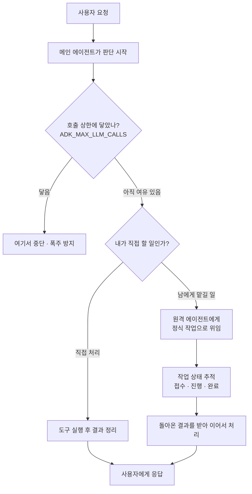

<aside class="ai-knowledge-sidebar">
  
CATEGORIES

  <nav class="ai-cat-tree">

에이전트 오케스트레이션12
<ul><li><a href="https://altjs4510.github.io/ai_news_blog/knowledge/20260828/" class="current">2026-08-28Google ADK for Python v2.8.0 — RemoteA2aAgent 네이…</a></li><li><a href="https://altjs4510.github.io/ai_news_blog/knowledge/20260826/">2026-08-26apache/maka — 도구 호출·권한 결정·종료 이벤트를 append-only 로그…</a></li><li><a href="https://altjs4510.github.io/ai_news_blog/knowledge/20260805/">2026-08-05TencentCloud/TencentDB-Agent-Memory — 대화·문서·코드를 …</a></li><li><a href="https://altjs4510.github.io/ai_news_blog/knowledge/20260726/">2026-07-26citrolabs/ego-lite — 로그인된 브라우저 상태를 AI 에이전트와 공유하는…</a></li><li><a href="https://altjs4510.github.io/ai_news_blog/knowledge/20260708/">2026-07-08Expanding Managed Agents in Gemini API: backgrou…</a></li><li><a href="https://altjs4510.github.io/ai_news_blog/knowledge/20260707/">2026-07-07AI Hero Skills Catalog — 실무 엔지니어를 위한 재사용 가능한 판단 …</a></li><li><a href="https://altjs4510.github.io/ai_news_blog/knowledge/20260623/">2026-06-23bytedance/deer-flow — 샌드박스·메모리·서브에이전트·메시지 게이트웨이를…</a></li><li><a href="https://altjs4510.github.io/ai_news_blog/knowledge/20260621/">2026-06-21calesthio/OpenMontage — 12 파이프라인·52 도구·500+ 스킬을 …</a></li><li><a href="https://altjs4510.github.io/ai_news_blog/knowledge/20260602/">2026-06-02revfactory/harness — 도메인별 에이전트 팀과 스킬을 자동 설계하는 메타…</a></li><li><a href="https://altjs4510.github.io/ai_news_blog/knowledge/20260529/">2026-05-29Introducing dynamic workflows in Claude Code</a></li><li><a href="https://altjs4510.github.io/ai_news_blog/knowledge/20260507/">2026-05-07ruvnet/ruflo — Claude 멀티 에이전트 오케스트레이션 플랫폼</a></li><li><a href="https://altjs4510.github.io/ai_news_blog/knowledge/20260504/">2026-05-04Agents for Everything Else: Codex for Knowledge …</a></li></ul>

MCP &amp; 도구 통합20
<ul><li><a href="https://altjs4510.github.io/ai_news_blog/knowledge/20260829/">2026-08-29cursor/plugins — 플러그인 명세(specification)와 공식 플러그인…</a></li><li><a href="https://altjs4510.github.io/ai_news_blog/knowledge/20260802/">2026-08-02Stateless MCP has recaptured my interest (and in…</a></li><li><a href="https://altjs4510.github.io/ai_news_blog/knowledge/20260801/">2026-08-01different-ai/openwork — Claude Cowork의 오픈소스 대체 에…</a></li><li><a href="https://altjs4510.github.io/ai_news_blog/knowledge/20260731/">2026-07-31different-ai/openwork — Claude Cowork의 오픈소스 대안(o…</a></li><li><a href="https://altjs4510.github.io/ai_news_blog/knowledge/20260729/">2026-07-29Bringing MCP 2026-07-28 to Claude</a></li><li><a href="https://altjs4510.github.io/ai_news_blog/knowledge/20260721/">2026-07-21tirth8205/code-review-graph — 로컬 우선 코드 인텔리전스 그래프…</a></li><li><a href="https://altjs4510.github.io/ai_news_blog/knowledge/20260719/">2026-07-19tirth8205/code-review-graph — 로컬 우선 코드 인텔리전스 그래프…</a></li><li><a href="https://altjs4510.github.io/ai_news_blog/knowledge/20260718/">2026-07-18tirth8205/code-review-graph — MCP·CLI용 로컬 코드 인텔리…</a></li><li><a href="https://altjs4510.github.io/ai_news_blog/knowledge/20260709/">2026-07-09mvanhorn/last30days-skill — Reddit·X·YouTube·HN·…</a></li><li><a href="https://altjs4510.github.io/ai_news_blog/knowledge/20260701/">2026-07-01Google OKF (Open Knowledge Format) — 벤더 중립 에이전트 …</a></li><li><a href="https://altjs4510.github.io/ai_news_blog/knowledge/20260618/">2026-06-18DeusData/codebase-memory-mcp — 158개 언어 코드베이스를 밀리…</a></li><li><a href="https://altjs4510.github.io/ai_news_blog/knowledge/20260606/">2026-06-06chopratejas/headroom — Compress tool outputs, lo…</a></li><li><a href="https://altjs4510.github.io/ai_news_blog/knowledge/20260605/">2026-06-05chopratejas/headroom — Compress tool outputs, lo…</a></li><li><a href="https://altjs4510.github.io/ai_news_blog/knowledge/20260604/">2026-06-04chopratejas/headroom — Compress tool outputs bef…</a></li><li><a href="https://altjs4510.github.io/ai_news_blog/knowledge/20260603/">2026-06-03How Bad MCP design cost your Agent 5× more token…</a></li><li><a href="https://altjs4510.github.io/ai_news_blog/knowledge/20260523/">2026-05-23colbymchenry/codegraph — 사전 인덱싱된 코드 지식 그래프 MCP</a></li><li><a href="https://altjs4510.github.io/ai_news_blog/knowledge/20260519/">2026-05-19Anthropic acquires Stainless</a></li><li><a href="https://altjs4510.github.io/ai_news_blog/knowledge/20260517/">2026-05-17I gave my LLM 100,000+ tools — Lazy Discovery &a…</a></li><li><a href="https://altjs4510.github.io/ai_news_blog/knowledge/20260512/">2026-05-12agentmemory — Persistent memory for AI coding ag…</a></li><li><a href="https://altjs4510.github.io/ai_news_blog/knowledge/20260509/">2026-05-09How to connect 100 MCP servers without the conte…</a></li></ul>

코딩 에이전트26
<ul><li><a href="https://altjs4510.github.io/ai_news_blog/knowledge/20260823/">2026-08-23The Evolution of the Agent Harness — 하네스가 모델 가중치…</a></li><li><a href="https://altjs4510.github.io/ai_news_blog/knowledge/20260822/">2026-08-22mattpocock/skills — Skills for Real Engineers (하…</a></li><li><a href="https://altjs4510.github.io/ai_news_blog/knowledge/20260820/">2026-08-20akitaonrails/ai-memory — 코딩 에이전트 CLI의 장기 메모리와 벤더…</a></li><li><a href="https://altjs4510.github.io/ai_news_blog/knowledge/20260819/">2026-08-19akitaonrails/ai-memory — 코딩 에이전트 CLI 간 장기 기억과 벤더…</a></li><li><a href="https://altjs4510.github.io/ai_news_blog/knowledge/20260814/">2026-08-14cathrynlavery/diagram-design — Claude Code용 에디토리…</a></li><li><a href="https://altjs4510.github.io/ai_news_blog/knowledge/20260811/">2026-08-11PrimeIntellect-ai/prime-agent — 장기 자율 실행을 전제로 설계…</a></li><li><a href="https://altjs4510.github.io/ai_news_blog/knowledge/20260810/">2026-08-10Auto mode is now the default in Claude Code for …</a></li><li><a href="https://altjs4510.github.io/ai_news_blog/knowledge/20260809/">2026-08-09PrimeIntellect-ai/prime-agent — 코딩 워크플로우·장기 자율 작…</a></li><li><a href="https://altjs4510.github.io/ai_news_blog/knowledge/20260808/">2026-08-08PrimeIntellect-ai/prime-agent — 코딩 워크플로우와 장시간 자율…</a></li><li><a href="https://altjs4510.github.io/ai_news_blog/knowledge/20260804/">2026-08-04esengine/DeepSeek-Reasonix — prefix-cache 안정성을 축…</a></li><li><a href="https://altjs4510.github.io/ai_news_blog/knowledge/20260728/">2026-07-28alibaba/open-code-review — 결정론적 파이프라인 + LLM 에이전트…</a></li><li><a href="https://altjs4510.github.io/ai_news_blog/knowledge/20260725/">2026-07-25The new rules of context engineering for Claude …</a></li><li><a href="https://altjs4510.github.io/ai_news_blog/knowledge/20260722/">2026-07-22tirth8205/code-review-graph — MCP·CLI용 로컬 우선 코드 …</a></li><li><a href="https://altjs4510.github.io/ai_news_blog/knowledge/20260714/">2026-07-14Graphify-Labs/graphify — 코드베이스를 질의 가능한 지식 그래프로 만…</a></li><li><a href="https://altjs4510.github.io/ai_news_blog/knowledge/20260705/">2026-07-05openai/codex-plugin-cc — Claude Code에서 Codex를 위임…</a></li><li><a href="https://altjs4510.github.io/ai_news_blog/knowledge/20260626/">2026-06-26google-labs-code/design.md — 코딩 에이전트에게 디자인 시스템을 …</a></li><li><a href="https://altjs4510.github.io/ai_news_blog/knowledge/20260619/">2026-06-19Claude Code now supports artifacts</a></li><li><a href="https://altjs4510.github.io/ai_news_blog/knowledge/20260530/">2026-05-30Leonxlnx/taste-skill — AI에게 좋은 취향을 부여해 generic s…</a></li><li><a href="https://altjs4510.github.io/ai_news_blog/knowledge/20260528/">2026-05-28Building self-improving tax agents with Codex</a></li><li><a href="https://altjs4510.github.io/ai_news_blog/knowledge/20260526/">2026-05-26colbymchenry/codegraph — Pre-indexed code knowle…</a></li><li><a href="https://altjs4510.github.io/ai_news_blog/knowledge/20260524/">2026-05-24colbymchenry/codegraph — Pre-indexed code knowle…</a></li><li><a href="https://altjs4510.github.io/ai_news_blog/knowledge/20260521/">2026-05-21colbymchenry/codegraph — Pre-indexed code knowle…</a></li><li><a href="https://altjs4510.github.io/ai_news_blog/knowledge/20260510/">2026-05-10addyosmani/agent-skills — Production-grade engin…</a></li><li><a href="https://altjs4510.github.io/ai_news_blog/knowledge/20260508/">2026-05-08addyosmani/agent-skills — Production-grade engin…</a></li><li><a href="https://altjs4510.github.io/ai_news_blog/knowledge/20260506/">2026-05-06mksglu/context-mode — AI 코딩 에이전트용 컨텍스트 윈도우 최적화</a></li><li><a href="https://altjs4510.github.io/ai_news_blog/knowledge/20260505/">2026-05-05mattpocock/skills — Skills for Real Engineers (.…</a></li></ul>

모델 &amp; 연구7
<ul><li><a href="https://altjs4510.github.io/ai_news_blog/knowledge/20260821/">2026-08-21volcengine/OpenViking — 에이전트 메모리·Knowledge RAG·스…</a></li><li><a href="https://altjs4510.github.io/ai_news_blog/knowledge/20260717/">2026-07-17After a year building agent memory, 'save everyt…</a></li><li><a href="https://altjs4510.github.io/ai_news_blog/knowledge/20260716-proprag/">2026-07-16PropRAG — 프로포지션 경로 위 beam search로 멀티홉 검색 안내</a></li><li><a href="https://altjs4510.github.io/ai_news_blog/knowledge/20260620/">2026-06-20zai-org/GLM-5 — From Vibe Coding to Agentic Engi…</a></li><li><a href="https://altjs4510.github.io/ai_news_blog/knowledge/20260617/">2026-06-17Predicting model behavior before release by simu…</a></li><li><a href="https://altjs4510.github.io/ai_news_blog/knowledge/20260516/">2026-05-16STALE — 에이전트가 자기 기억의 유효성을 인지할 수 있는가</a></li><li><a href="https://altjs4510.github.io/ai_news_blog/knowledge/20260513/">2026-05-13Thinking Machines' Native Interaction Models — T…</a></li></ul>

인프라 &amp; 컴퓨트8
<ul><li><a href="https://altjs4510.github.io/ai_news_blog/knowledge/20260813/">2026-08-13semantica-agi/semantica — 컨텍스트와 책임 추적을 위한 그래프 네이…</a></li><li><a href="https://altjs4510.github.io/ai_news_blog/knowledge/20260812/">2026-08-12semantica-agi/semantica — 컨텍스트와 '책임 추적 가능한(accou…</a></li><li><a href="https://altjs4510.github.io/ai_news_blog/knowledge/20260806/">2026-08-06cloudflare/computer — 에이전트에게 컴퓨터를 통째로 주는 엣지 실행 샌…</a></li><li><a href="https://altjs4510.github.io/ai_news_blog/knowledge/20260724/">2026-07-24diegosouzapw/OmniRoute — 단일 엔드포인트로 278+ 프로바이더·50…</a></li><li><a href="https://altjs4510.github.io/ai_news_blog/knowledge/20260723/">2026-07-23diegosouzapw/OmniRoute — 268+ 프로바이더를 단일 엔드포인트로 묶…</a></li><li><a href="https://altjs4510.github.io/ai_news_blog/knowledge/20260611/">2026-06-11The evolution of agentic surfaces: building with…</a></li><li><a href="https://altjs4510.github.io/ai_news_blog/knowledge/20260522/">2026-05-22Giving Agents Computers — Ivan Burazin, Daytona</a></li><li><a href="https://altjs4510.github.io/ai_news_blog/knowledge/20260520/">2026-05-20New in Claude Managed Agents: self-hosted sandbo…</a></li></ul>

보안 &amp; 거버넌스17
<ul><li><a href="https://altjs4510.github.io/ai_news_blog/knowledge/20260827/">2026-08-27Claude in Chrome is generally available</a></li><li><a href="https://altjs4510.github.io/ai_news_blog/knowledge/20260819-mind-viruses/">2026-08-19탈옥도, 인젝션도 없이 — 대화로만 퍼지는 에이전트의 '마인드 바이러스'</a></li><li><a href="https://altjs4510.github.io/ai_news_blog/knowledge/20260730/">2026-07-30Anatomy of a Frontier Lab Agent Intrusion: A Tec…</a></li><li><a href="https://altjs4510.github.io/ai_news_blog/knowledge/20260716/">2026-07-16Dicklesworthstone/destructive_command_guard — 에이…</a></li><li><a href="https://altjs4510.github.io/ai_news_blog/knowledge/20260715/">2026-07-15Dicklesworthstone/destructive_command_guard — 에이…</a></li><li><a href="https://altjs4510.github.io/ai_news_blog/knowledge/20260710/">2026-07-1070개 MCP 서버 strace 런타임 감사 — 부팅 시 아웃바운드 호출 서버 적발</a></li><li><a href="https://altjs4510.github.io/ai_news_blog/knowledge/20260704/">2026-07-04Cloudflare is about to block AI agents by defaul…</a></li><li><a href="https://altjs4510.github.io/ai_news_blog/knowledge/20260703/">2026-07-03Giving admins more visibility and control over C…</a></li><li><a href="https://altjs4510.github.io/ai_news_blog/knowledge/20260630/">2026-06-30Introducing the Claude apps gateway for Amazon B…</a></li><li><a href="https://altjs4510.github.io/ai_news_blog/knowledge/20260625/">2026-06-25Agent identity in Claude Tag: a new access model…</a></li><li><a href="https://altjs4510.github.io/ai_news_blog/knowledge/20260624/">2026-06-24Agent identity in Claude Tag: a new access model…</a></li><li><a href="https://altjs4510.github.io/ai_news_blog/knowledge/20260614/">2026-06-14NVIDIA/SkillSpector — Security scanner for AI ag…</a></li><li><a href="https://altjs4510.github.io/ai_news_blog/knowledge/20260613/">2026-06-13Fable 5's guardrails got bypassed in 48 hours — …</a></li><li><a href="https://altjs4510.github.io/ai_news_blog/knowledge/20260612/">2026-06-12NVIDIA/SkillSpector — AI 에이전트 스킬용 보안 스캐너</a></li><li><a href="https://altjs4510.github.io/ai_news_blog/knowledge/20260607/">2026-06-07OpenAI Help: Lockdown Mode</a></li><li><a href="https://altjs4510.github.io/ai_news_blog/knowledge/20260531/">2026-05-31How we contain Claude across products</a></li><li><a href="https://altjs4510.github.io/ai_news_blog/knowledge/20260527/">2026-05-27Microsoft Copilot Cowork Exfiltrates Files</a></li></ul>

응용 사례4
<ul><li><a href="https://altjs4510.github.io/ai_news_blog/knowledge/20260712/">2026-07-12Do Automated Evals Work?</a></li><li><a href="https://altjs4510.github.io/ai_news_blog/knowledge/20260609/">2026-06-09Building intelligent apps for Apple platforms wi…</a></li><li><a href="https://altjs4510.github.io/ai_news_blog/knowledge/20260515/">2026-05-15Clawdmeter — Claude Code 사용량을 데스크톱 대시보드로</a></li><li><a href="https://altjs4510.github.io/ai_news_blog/knowledge/20260514/">2026-05-14Introducing Claude for Small Business</a></li></ul>

산업 동향4
<ul><li><a href="https://altjs4510.github.io/ai_news_blog/knowledge/20260711/">2026-07-11OpenAI says GPT 5.6 is the 'preferred model' for…</a></li><li><a href="https://altjs4510.github.io/ai_news_blog/knowledge/20260702/">2026-07-02How Cursor deploys AI inside the enterprise (For…</a></li><li><a href="https://altjs4510.github.io/ai_news_blog/knowledge/20260616/">2026-06-16Why AI hasn't replaced software engineers, and w…</a></li><li><a href="https://altjs4510.github.io/ai_news_blog/knowledge/20260610/">2026-06-10Fable 5 just made cost-aware model routing manda…</a></li></ul>
</nav>
</aside>

<article class="ai-knowledge-article">

<header class="ai-post-hero">
  
<a class="ai-back" href="../">KNOWLEDGE</a> · 2026-08-28 · 오늘의 학습

  <h2 class="ai-post-title">Google ADK for Python v2.8.0 — RemoteA2aAgent 네이티브 task 모드 + ADK_MAX_LLM_CALLS 호출 상한</h2>
</header>

> 원문: [Google ADK for Python v2.8.0 — RemoteA2aAgent 네이티브 task 모드 + ADK_MAX_LLM_CALLS 호출 상한](https://github.com/google/adk-python/releases/tag/v2.8.0)

## 📌 학습 정리

### 1. 한 줄로 말하면

다른 팀에 일을 맡길 때 "이건 정식으로 접수해서 처리해줘"라고 제대로 넘길 수 있게 되고, 동시에 우리 쪽에서는 "한 번 일할 때 최대 몇 번까지만 생각해라"라는 상한선을 걸어둘 수 있게 된 업데이트예요.

### 2. 왜 이게 만들어졌어요?

AI 에이전트(agent, 사람 대신 목표를 받아 스스로 도구를 골라 일을 처리하는 프로그램)를 여러 개 붙여서 쓰기 시작하면 두 가지 골칫거리가 생겨요. 하나는 "다른 곳에 떠 있는 원격 에이전트에게 일을 넘길 때 그 일이 지금 어디까지 왔는지"를 제대로 추적하기 어렵다는 거예요. 원래는 그냥 메시지 하나 던지고 답을 기다리는 식이라, 오래 걸리는 작업이면 상태를 알 방법이 마땅치 않았습니다. 다른 하나는 에이전트가 스스로 판단을 반복하다 보면 언어 모델(LLM)을 몇 번이나 부를지 예측이 안 되고, 잘못 걸리면 무한히 돌면서 비용을 태운다는 점이었고요. 이번 v2.8.0은 이 두 가지를 각각 "정식 작업 단위로 넘기기"와 "호출 횟수 상한을 환경 설정으로 못 박기"로 다루고 있어요.

### 3. 비유로 풀면

첫 번째는 **외주 발주서**예요. 예전에는 협력사에 "이것 좀 해주세요" 하고 메신저로 말만 던져놓는 느낌이었다면, 이제는 접수번호가 붙은 정식 발주서를 넘기는 셈이에요. 접수됐는지, 진행 중인지, 끝났는지가 그 번호 하나로 따라다닙니다.

두 번째는 **회의실 예약 시간 제한**에 가까워요. "이 안건은 아무리 길어도 회의 N번 안에서 끝내라"라고 미리 못을 박아두는 거죠. 참석자가 열심히 논의하다 밤을 새우는 걸 막는 안전장치입니다.

그래서 결국 이번 릴리스의 방향은 "에이전트를 더 똑똑하게"가 아니라 "일을 넘기는 경계와, 멈춰야 할 지점을 시스템 차원에서 명확히 하자"에 가깝습니다.

### 4. 어떻게 작동하는지 (그림으로)

흐름은 이렇게 읽으면 됩니다. 요청이 들어오면 에이전트가 판단을 시작하는데, 매번 돌기 전에 "이번 처리에서 모델을 이미 몇 번 불렀나"를 확인하고 상한에 닿았으면 거기서 멈춥니다. 상한 안이라면 직접 처리하거나, 멀리 있는 다른 에이전트에게 정식 작업 단위로 넘기고 그 진행 상태를 따라가면서 결과를 받아옵니다. 위임과 상한이 서로 다른 층에서 각각 걸려 있다는 게 핵심이에요.

이번 릴리스에는 이 두 가지 말고도 눈여겨볼 흐름이 하나 더 있어요. 어떤 에이전트가 어떤 작업에서 토큰을 얼마나 썼는지, 모델과 도구를 몇 번 불렀는지를 기록하는 관측 기능(telemetry)이 실험적으로 들어갔습니다. 기본은 꺼져 있고 `ADK_EXPERIMENTAL_TELEMETRY=true` 로 켜는 방식이라, 상한을 걸기 전에 "우리가 실제로 얼마나 쓰고 있는지"를 먼저 재볼 수 있는 셈이에요.

안전 쪽 손질도 꽤 들어갔는데, 결이 비슷합니다. 다른 에이전트가 돌려준 출력이 마치 지시문인 것처럼 행세하지 못하도록 울타리를 치고, 데이터베이스 조회 도구에서 악의적 질의가 끼어드는 걸 막고, 디버그 기록에 인증 정보가 그대로 남지 않게 가리는 식이에요. 전부 "에이전트가 바깥과 주고받는 지점에서 사고가 나지 않게" 조이는 작업입니다.

### 5. 처음 보는 용어 풀이

- **에이전트 개발 키트 (ADK, Agent Development Kit)** — 구글이 내놓은, AI 에이전트를 만들고 운영하기 위한 파이썬 도구 모음이에요. 에이전트가 도구를 쓰고, 다른 에이전트에게 일을 넘기고, 실행 상태를 관리하는 뼈대를 제공합니다.
- **에이전트 간 통신 규약 (A2A, Agent-to-Agent)** — 서로 다른 곳에서 돌아가는 에이전트들이 대화하고 일을 주고받기 위한 공통 약속이에요. 사람으로 치면 회사 간에 문서를 주고받는 표준 양식 같은 거고요.
- **원격 에이전트 위임 객체 (RemoteA2aAgent)** — 내 쪽 코드에서는 평범한 에이전트처럼 보이지만, 실제로는 멀리 떨어진 다른 에이전트에게 일을 넘겨주는 대리인 역할을 합니다. 이번 버전에서 그 위임을 "정식 작업(task) 단위"로 다룰 수 있게 됐어요.
- **모델 호출 상한 설정값 (ADK_MAX_LLM_CALLS)** — 한 번의 처리 과정에서 언어 모델을 최대 몇 번까지 부를 수 있는지를 정해두는 환경 설정값이에요. 코드를 고치지 않고 실행 환경에서 바로 걸 수 있다는 게 핵심입니다.
- **관측 정보 수집 (telemetry)** — 시스템이 돌아가는 동안 "무엇을 몇 번 했고 얼마나 썼는지"를 기록해 두는 기능이에요. 나중에 비용을 따지거나 느려진 지점을 찾을 때 근거가 됩니다.
- **사람 개입 확인 (HITL tool confirmation, Human-In-The-Loop)** — 에이전트가 위험한 작업을 실행하기 전에 사람에게 "정말 해도 될까요?"라고 묻고 승인을 받는 절차예요. 이번 버전에서 이 확인 흐름이 깨졌던 문제를 되돌리는 수정이 들어갔습니다.
- **지시문 위장 방지 (prompt injection 대응)** — 외부에서 들어온 텍스트가 마치 시스템의 명령인 척 섞여들어 에이전트를 조종하는 걸 막는 처리예요. 다른 에이전트의 출력이나 외부 이벤트 데이터를 그대로 신뢰하지 않는 방향의 수정들이 여럿 포함됐어요.
- **저장된 대화 상태 (session)** — 에이전트가 지금까지 무슨 대화를 했고 어디까지 진행했는지를 담아두는 기록이에요. 이번에 중복 기록을 걸러내고 오래된 형식을 안전하게 읽어오는 쪽 손질이 들어갔습니다.

### 6. 한 발 더 들어가고 싶다면

- [google/adk-python v2.8.0 릴리스 노트](https://github.com/google/adk-python/releases/tag/v2.8.0) — 이번에 추가·수정된 항목 전체 목록을 볼 수 있어요. 위에서 다룬 것 말고도 어떤 성능 개선과 버그 수정이 들어갔는지 확인하기 좋습니다.

---

## 📖 원문 전체 번역 (정독용)

> 의역 최소화한 전체 번역입니다. 큰 흐름은 위 정리에서 잡고, 정확한 워딩이 필요할 땐 이 섹션에서 정독하세요.

google / adk-python
Public

Notifications
알림 설정을 변경하려면 로그인해야 합니다

Fork 3.9k
Star 21.3k

v2.8.0
Latest
Latest
Compare

wukath 가 이 릴리스를 발행함
26 Aug 23:25
v2.8.0
76a96e6

## 2.8.0 (2026-08-25)

### Features

- a2a: RemoteA2aAgent에 네이티브 task 모드 지원 추가 (72f3ff5)
- 최대 LLM 호출 수 한도를 설정하는 ADK_MAX_LLM_CALLS 환경변수 추가 (75679db)
- data_agent 툴셋에 create_data_agent 툴 추가 (5cd38a0)
- data_agent 툴셋에 delete_data_agent 툴 추가 (9b451fc)
- data_agent 툴셋의 list_accessible_data_agents 에 location 파라미터 추가 (393ec08)
- Model Armor 가드레일 플러그인 추가 (11efc3f)
- nvidia nim 통합 샘플 추가 (c6bba8d)
- adk_inject_state 를 통한 skill state 주입 샘플 추가 (9384127)
- load_artifact_tool 에 spreadsheet mime 타입 추가 (370027a)
- data_agent 툴셋에 update_data_agent 툴 추가 (92d00aa)
- Vertex AI API 버전 설정 허용 (ede87c2), closes #3246
- 스트리밍 툴이 yield 별로 응답 스케줄링을 설정할 수 있도록 허용 (bf2efd7)
- antigravity: function_response 에 대한 클라이언트 사이드 툴 결과(outcome) 캡처 (4599a52)
- cli: Agent Engine 배포에 Cloud Build worker pool 지원 (e577c30)
- eval: AgentEvaluator 에서 커스텀 메트릭 지원 (babb11c)
- BigQuery 툴의 SQL 인젝션 취약점 방지 (d6290a0)
- live: ADK API 서버에서 허용되는 modality 에 VIDEO 추가 (dd998a7)
- live: 라이브 스트리밍 툴이 사용자에게 직접 메시지를 보낼 수 있도록 허용 (98896eb)
- live: 라이브 모드에서 before/after 모델 콜백 실행 (ef2d680)
- live: LlmResponse 및 Event 에 라이브 `interaction_status` 노출 (b858904)
- live: 라이브 세션을 열 때 RunConfig.session_resumption.handle 사용 (eac32c3)
- mcp: MCP HTTP 교환 내역을 OpenTelemetry 로그 레코드로 보고 (85a6fa1)
- asyncio.gather() 를 이용한 LLM-as-judge 평가 병렬화 (0dbb88c)
- set_model_response 스키마에서 필드 설명(description) 보존 (a30858b), closes #6707
- LLM 호출 span 에 컨텍스트 캐시 상태 기록 (c0614d6)
- AgentRegistry 에서 RemoteA2aAgent 의 인증(auth) 해결 (d695494)
- RemoteA2aAgent 에서 auth_scheme 및 auth_credential 지원 (d42c634)
- Gemini 및 AnthropicLlm 에 커스텀 LLM 클라이언트 주입 지원 (a01d516), closes #5027
- Vertex Memory Bank 에서 memory_id 및 allowed_topics 지원 (bf73360)
- MultimodalToolResultsPlugin 에서 옵트인 세션 보존(retention) 지원 (775c1bd), closes #6695
- ParallelAgent 에서 sub-agent escalation 이벤트 지원 (0fd681e), closes #5104

### Telemetry

- telemetry: invoke_agent 에 대해 호출(invocation)별 토큰 소모 메트릭 추가 (dc00db5)
- telemetry: 워크플로우별 추론(inference) 및 tool call 카운트 추가 (6e6c4a5)
- telemetry: 워크플로우별 토큰 소모 메트릭 추가 (dd8797e)
- telemetry: `load_skill_resource` span 의 텔레메트리 확장 (6e0facf)
- telemetry: runner 의 invocation span 에서 RunConfig.telemetry 를 존중하도록 처리 (00fc6eb)

참고: 에이전트 호출별/워크플로우별 토큰 사용량, 워크플로우별 추론 및 tool call 카운트, 확장된 load_skill 속성을 위한 신규 실험적(experimental) 텔레메트리 기능입니다. 기본값은 꺼짐(off)이며, `ADK_EXPERIMENTAL_TELEMETRY=true` 또는 `RunConfig.telemetry.adk_experimental_telemetry_opt_in=True` 로 옵트인해야 합니다.

### Bug Fixes

- a2a: 파일 페이로드가 디버그 로그 라인에 남지 않도록 처리 (ef158d3)
- agents: 에이전트가 로드에 실패했을 때 어떤 툴셋을 잃었는지 보고 (66930e6)
- artifacts: 파일 아티팩트 버전을 원자적(atomic)으로 발행 (94475c9)
- auth: 클라이언트 응답이 아니라 요청에서 auth scheme 을 가져오도록 수정 (8989aea)
- 재수화(rehydration) 중 O(n^2) 딥 이벤트 비교 회피 (b8dd086), closes #6657
- agent-config 코드 참조에서 yaml 및 ruamel 역직렬화 차단 (924d802)
- LiteLLM 및 Anthropic 모델에서 캐시 읽기/쓰기 토큰 카운트 (d0b33a0), closes #5835
- 어떤 invocation 을 재개할지 추론할 때 첫 번째뿐 아니라 모든 function response 를 확인 (5449314)
- cli: 테스트 클라이언트 연결 해제 시 pytest 서브프로세스 정리 (a84a4b5)
- cli: `adk test --rebuild`, Web UI 테스트 저장, CLI JSONL 에서 비-ASCII 텍스트 보존 (dc735bd)
- cli: env_vars 재정의 시 값이 아니라 환경변수 이름을 보고 (b0c599f)
- 컴팩션(compaction) 시 tool call 및 response 문자 수 카운트 (66908e4)
- a2a extra 가 서빙 가능하도록 a2a-sdk[http-server] 선언 (65234e7)
- InMemorySessionService.append_event 에서 이벤트 중복 제거 (4d74774), closes #5723
- 병렬 sub-agent 실패를 호출자에게 전달 (ece924c), closes #5455
- 두 필드 표기 방식 모두에서 MCP 툴 오류 감지 (d18df2f)
- CLI 인자에 대해 Windows glob 확장 비활성화 (2638155), closes #6248
- ContextCacheConfig 에 대해 Anthropic 프롬프트 캐시 브레이크포인트 발행 (811d379), closes #5395
- 릴레이된 에이전트 출력이 지시(instruction)로 위장할 수 없도록 펜스 처리 (9ffe8be)
- A2A 클라이언트의 사용자 대면 응답에서 thought 파트 필터링 (8963a04), closes #4676
- transfer_to_agent 가 있는 에이전트 계층에서 내장 검색 툴 수정 (f3250bd)
- RunConfig.http_options 복사로 인한 크래시 및 invocation 간 누수 수정 (67ca98c)
- flows: function response 를 그것이 응답하는 call 과 짝지음 (deee6d2), closes #6761
- flows: 교차 에이전트 컨텍스트 렌더링 시 function_call.args 정렬 (735402d)
- mock SessionService 인스턴스에 대해 `invocation_context.branch` 할당을 가드 (9917922)
- _content_to_message_param 에서 파트가 없는 Content 를 가드 (1ed8d48)
- Windows 에서 배포 정리(cleanup) 시 읽기 전용 .git 파일 처리 (c93fcc0)
- Workflow 실행에서 before_run_callback 조기 종료를 존중 (dac1869), closes #6013
- LiteLLM 경로에서 ContextCacheConfig 존중 (b1c984b)
- 오류 메시지의 명확성과 실행 가능한 컨텍스트 개선 (7c2af5f)
- rubric judge 프롬프트에 grounding 메타데이터 포함 (b0cdecf), closes #5831
- integrations: API 레지스트리 자격증명을 google API 엔드포인트에만 전송 (cc275f0)
- 비-텍스트 static_instruction 을 안정적인 요청 프리픽스로 유지 (deda5b3), closes #6652
- 단일 턴 노드 컨텍스트 전반에서 세션 아이덴티티 유지 (c602065), closes #6691
- tool call 을 최대 1회로 유지 (5bcf5cd)
- live: 라이브 에이전트 실행 종료 시 백그라운드 tool task 중지 (0088abb)
- live: 라이브 실행이 호출자의 RunConfig 에 다시 쓰지 않도록 방지 (0b39e72)
- SqliteSessionService 의 state 병합이 dict.update() 시맨틱을 사용하도록 수정 (e4ba704), closes #6728
- mcp: MCP 세션 풀에서 유휴(idle) 세션 축출 (69a3ca5)
- https 엔드포인트에만 기본 자격증명 첨부 (5d3d152)
- adk_version >= 2.2.0 인 경우에만 --gemini_enterprise_app_name 발행 (00932e6)
- PDF 업로드에 대해 Azure 로 파일 메타데이터 튜플 전달 (ff4567d), closes #6539
- RestApiTool 에서 경로 파라미터 값을 percent-encode (25f53bd)
- agent_engine 배포 후 Gemini Enterprise 등록 문서로 안내 (1d2d1ed), closes #6633
- invocation_events 가 비어있을 때 developer_instructions 채우기 (69c9090), closes #5593
- 노드 경로에서 호출자가 제공한 id 보다 function response 자체의 invocation 을 우선 (4d0d63c)
- 비동기 제너레이터 간 contextvars 누수 방지 (bb86bdd), closes #5722
- support_cfc 활성화 시 중복 함수 실행 방지 (c986ff0)
- 중복 OAuth 프롬프트 방지 및 tool resumption 수정 (eaad2f8)
- 단일 턴 에이전트 재개 시 중복 합성(synthetic) user 이벤트 방지 (e753651)
- 워크플로우 내 GitHub 이벤트 데이터를 통한 prompt injection 방지 (4f558f1)
- InMemoryMemoryService.search_memory 결과의 순위화 및 상한 적용 (f3fae72)
- 동기(synchronous) Runner.run() 에서 에이전트 오류 재발생(re-raise) (b55000d)
- long-running function 이름을 metadata 가 아니라 data 에서 읽기 (029c17b), closes #6295
- DebugLoggingPlugin 출력 파일에서 자격증명 마스킹(redact) (a86bd25)
- 디버그 로그의 generate_content_config.http_options 에서 자격증명 마스킹 (1cd6f46)
- 음수 recent-event 한도 거부 (26110c7)
- A2A 를 통해 도착한 tool confirmation 거부 (9e9eaa6), closes #6461
- 'No root_agent found' 대신 root_agent 타입 불일치를 보고 (4f07c93), closes #6606
- LLM 레지스트리에서 Claude 5 모델명 해결 (42a4a5f)
- 레거시 create-eval-set 라우트의 NameError 해결 (023f45c)
- litellm_proxy 프리픽스 뒤의 중첩된 provider 해결 (602e58d), closes #6538
- 서버 연결 해제(disconnect) 로그 해결 (3f2d399)
- 시스템적인 parts[0] 인덱싱 버그 해결 (2109ea9), closes #6616
- Runner 에서 non-root 에이전트 노드를 실행하거나 sub-agent 를 재개할 때 세션 기록으로부터 `invocation_context.branch` 복원 (676d1e7)
- 레거시 v0 세션 이벤트 액션의 언피클링(unpickling) 제한 (97c2af0), closes #5634
- 텍스트가 아닌 파트로 시작하는 사용자 메시지를 가진 invocation 재개 (6d8c588)
- 모든 HITL tool confirmation 을 깨뜨렸던 A2A 가드 되돌리기(revert) (9a32eba)
- 워크플로우 ID 및 재시도 지터(jitter)를 플랫폼 심(seam)을 통해 라우팅 (8f85107)
- samples: 숫자형 tool 파라미터를 해당 docstring 에 맞게 확장 (0c67410)
- JSON state 컬럼에 쓰기 전에 state delta 를 정제(sanitize) (3f9e6be)
- CrewAI 또는 LangChain function declaration 에 필수(required) 목록 전송 (186d9f7)
- sessions: InMemorySessionService 이벤트를 id 가 아닌 동등성(equality) 기준으로 중복 제거 (c9323d5)
- sessions: 제한된(restricted) unpickler 로 레거시 v0 이벤트 액션 로드 (fb15710)
- sessions: v0 PostgreSQL 마이그레이션에서 이벤트 액션 유실 방지 (e3ae4ac)
- skills: frontmatter 검증에 실패한 검색 결과 건너뛰기 (3c977bc), closes #6838
- AgentLoader.list_agents() 에서 비-에이전트 디렉터리 건너뛰기 (caac070)
- generate_return_doc 에서 숫자가 아닌 응답 키 건너뛰기 (920bc3e), closes #6174
- 대화 기록으로 thought summary 를 재전송하지 않도록 중지 (e4f5900)
- 대화 기록으로 thought summary 를 재전송하지 않도록 중지 (3c1b1bc)
- RemoteA2aAgent 가 자격증명 요청을 원격 피어로 전달하지 않도록 중지 (2aea859)
- SDK 가 스트림을 이동시킬 때 세션 liveness probe 가 크래시하지 않도록 수정 (d9f4d3d)
- PlanReActPlanner 출력에서 내부 planning 태그 제거 (ac8dad2), closes #3378
- telemetry: 추론(inference) 종료 시 inference span 도 종료 (ecc730c)
- telemetry: 플러그인이 모델 호출을 단락(short-circuit) 시킬 때 call_llm span 속성 기록 (0321136)
- tools: 빈 retrieval 에서 예외를 발생시키는 대신 매치 없음(no match) 보고 (99660d9)
- tools: AgentTool 의 중첩 에이전트를 unary 모드로 실행 (0d5752b)
- tools: 호출자의 RunConfig 하에서 agent tool 실행 (983c280)
- 대화 기록 전송 후 Gemini 3.x Live 응답 트리거 (7616c78)
- unit guide 스킬을 업데이트하여 내부 구현 세부사항 제외 (0c0296c)
- OpenAPI SA 헬퍼에 OAuth2 client-credentials scheme 사용 (9897217), closes #6656
- InMemoryMemoryService 에서 유니코드 인식(Unicode-aware) 키워드 추출 사용 (b8ea1e8), closes #5501
- 세션 초기화 이벤트 검증 (3fa71b6), closes #5290
- Spanner 검색 툴에서 SQL 식별자 검증 (8d2f277), closes #5913
- workflow: worker 가 취소될 때 병렬 worker 항목도 취소 (dec729f)
- workflow: 추상 서브클래스가 타입 체크되도록 BaseNode 에 abc.ABC 선언 (f3b59fd)
- workflow: 부분(partial) 이벤트 내의 function call 에 대해 동작하지 않도록 처리 (816ada5), closes #6583
- workflow: START 를 충족된 JoinNode 선행자(predecessor)로 존중 (d8df6fd)
- workflow: 노드 자체의 auth 설정으로부터 노드 auth 재개 (5b59139)

### Performance Improvements

- 스트리밍된 function call 인자를 연결(concatenate)하는 대신 버퍼링 (f604de2)
- Pub/Sub publisher 캐시를 옵션 값 기준으로 키(key) 지정 (51231cd)
- prompt 조립(assembly) 시 불필요한 이벤트 스캔 제거 (d7adc1c)
- prompt 조립(assembly) 시 불필요한 이벤트 스캔 제거 (e66fdd2)
- 선택적(optional) id-pairing provider 를 요청마다가 아니라 한 번만 해결 (203461c)
- 로컬 코드 실행을 일반(plain) 자식 인터프리터에서 실행 (c244a9c)
- Google 자격증명 갱신(refresh)을 이벤트 루프 밖에서 실행 (2aa2b46)

### Documentation

- 실시간 입력(realtime input)에 대한 audio_stream_end 문서 추가 (17cb265)
- 어떤 변형(variant)이 검증되는지에 관한 노드 스키마 docstring 수정 (e649a38)
- invocation-subtree 이벤트 필터의 문서화된 계약(contract) 수정 (be8fcf4)
- README 의 오타 및 문법 수정 (ffe518a)
- guides: BaseCodeExecutor 에 대한 개발자 unit guide 추가 (b370fc0)
- guides: BasePlanner 에 대한 개발자 unit guide 추가 (ea23a89)
- guides: Runner 및 Runner Live Streaming 에 대한 개발자 unit guide 추가 (1d89e0f)
- workflow 가이드 정비 및 BaseNode 문서화 (7c7d2ba)
- sample creator 스킬에게 디렉터리를 `$category` 로 접두어(prefix)하거나 `_agent` 로 접미어(suffix)하지 말라고 지시 (50c3edf)

### Assets
2개

</article>

<!-- ai-related-links -->
<aside class="ai-related-links">
  
관련 학습

  <ul><li><a href="https://altjs4510.github.io/ai_news_blog/knowledge/20260708/">2026-07-08Expanding Managed Agents in Gemini API: backgrou…</a></li><li><a href="https://altjs4510.github.io/ai_news_blog/knowledge/20260630/">2026-06-30Introducing the Claude apps gateway for Amazon B…</a></li><li><a href="https://altjs4510.github.io/ai_news_blog/knowledge/20260611/">2026-06-11The evolution of agentic surfaces: building with…</a></li></ul>
</aside>
<!-- /ai-related-links -->
