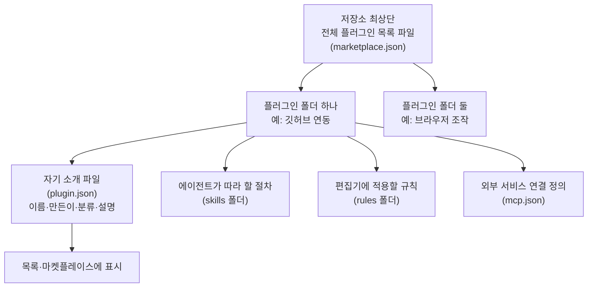

<div class="ai-knowledge-shell">

<aside class="ai-knowledge-sidebar">
  <p class="ai-eyebrow">CATEGORIES</p>
  <nav class="ai-cat-tree"><details class="ai-cat" open><summary><span class="catname">에이전트 오케스트레이션</span><span class="catcount">10</span></summary><ul><li><a href="https://altjs4510.github.io/ai_news_blog/knowledge/20260828/"><span class="kdate">2026-08-28</span><span class="ktitle">Google ADK for Python v2.8.0 — RemoteA2aAgent 네이…</span></a></li><li><a href="https://altjs4510.github.io/ai_news_blog/knowledge/20260823/"><span class="kdate">2026-08-23</span><span class="ktitle">The Evolution of the Agent Harness — 하네스가 모델 가중치…</span></a></li><li><a href="https://altjs4510.github.io/ai_news_blog/knowledge/20260709/"><span class="kdate">2026-07-09</span><span class="ktitle">mvanhorn/last30days-skill — Reddit·X·YouTube·HN·…</span></a></li><li><a href="https://altjs4510.github.io/ai_news_blog/knowledge/20260708/"><span class="kdate">2026-07-08</span><span class="ktitle">Expanding Managed Agents in Gemini API: backgrou…</span></a></li><li><a href="https://altjs4510.github.io/ai_news_blog/knowledge/20260623/"><span class="kdate">2026-06-23</span><span class="ktitle">bytedance/deer-flow — 샌드박스·메모리·서브에이전트·메시지 게이트웨이를…</span></a></li><li><a href="https://altjs4510.github.io/ai_news_blog/knowledge/20260621/"><span class="kdate">2026-06-21</span><span class="ktitle">calesthio/OpenMontage — 12 파이프라인·52 도구·500+ 스킬을 …</span></a></li><li><a href="https://altjs4510.github.io/ai_news_blog/knowledge/20260611/"><span class="kdate">2026-06-11</span><span class="ktitle">The evolution of agentic surfaces: building with…</span></a></li><li><a href="https://altjs4510.github.io/ai_news_blog/knowledge/20260602/"><span class="kdate">2026-06-02</span><span class="ktitle">revfactory/harness — 도메인별 에이전트 팀과 스킬을 자동 설계하는 메타…</span></a></li><li><a href="https://altjs4510.github.io/ai_news_blog/knowledge/20260529/"><span class="kdate">2026-05-29</span><span class="ktitle">Introducing dynamic workflows in Claude Code</span></a></li><li><a href="https://altjs4510.github.io/ai_news_blog/knowledge/20260507/"><span class="kdate">2026-05-07</span><span class="ktitle">ruvnet/ruflo — Claude 멀티 에이전트 오케스트레이션 플랫폼</span></a></li></ul></details><details class="ai-cat" open><summary><span class="catname">MCP &amp; 도구 통합</span><span class="catcount">18</span></summary><ul><li><a href="https://altjs4510.github.io/ai_news_blog/knowledge/20260829/" class="current"><span class="kdate">2026-08-29</span><span class="ktitle">cursor/plugins — 플러그인 명세(specification)와 공식 플러그인…</span></a></li><li><a href="https://altjs4510.github.io/ai_news_blog/knowledge/20260805/"><span class="kdate">2026-08-05</span><span class="ktitle">TencentCloud/TencentDB-Agent-Memory — 대화·문서·코드를 …</span></a></li><li><a href="https://altjs4510.github.io/ai_news_blog/knowledge/20260802/"><span class="kdate">2026-08-02</span><span class="ktitle">Stateless MCP has recaptured my interest (and in…</span></a></li><li><a href="https://altjs4510.github.io/ai_news_blog/knowledge/20260801/"><span class="kdate">2026-08-01</span><span class="ktitle">different-ai/openwork — Claude Cowork의 오픈소스 대체 에…</span></a></li><li><a href="https://altjs4510.github.io/ai_news_blog/knowledge/20260731/"><span class="kdate">2026-07-31</span><span class="ktitle">different-ai/openwork — Claude Cowork의 오픈소스 대안(o…</span></a></li><li><a href="https://altjs4510.github.io/ai_news_blog/knowledge/20260729/"><span class="kdate">2026-07-29</span><span class="ktitle">Bringing MCP 2026-07-28 to Claude</span></a></li><li><a href="https://altjs4510.github.io/ai_news_blog/knowledge/20260721/"><span class="kdate">2026-07-21</span><span class="ktitle">tirth8205/code-review-graph — 로컬 우선 코드 인텔리전스 그래프…</span></a></li><li><a href="https://altjs4510.github.io/ai_news_blog/knowledge/20260719/"><span class="kdate">2026-07-19</span><span class="ktitle">tirth8205/code-review-graph — 로컬 우선 코드 인텔리전스 그래프…</span></a></li><li><a href="https://altjs4510.github.io/ai_news_blog/knowledge/20260718/"><span class="kdate">2026-07-18</span><span class="ktitle">tirth8205/code-review-graph — MCP·CLI용 로컬 코드 인텔리…</span></a></li><li><a href="https://altjs4510.github.io/ai_news_blog/knowledge/20260701/"><span class="kdate">2026-07-01</span><span class="ktitle">Google OKF (Open Knowledge Format) — 벤더 중립 에이전트 …</span></a></li><li><a href="https://altjs4510.github.io/ai_news_blog/knowledge/20260618/"><span class="kdate">2026-06-18</span><span class="ktitle">DeusData/codebase-memory-mcp — 158개 언어 코드베이스를 밀리…</span></a></li><li><a href="https://altjs4510.github.io/ai_news_blog/knowledge/20260606/"><span class="kdate">2026-06-06</span><span class="ktitle">chopratejas/headroom — Compress tool outputs, lo…</span></a></li><li><a href="https://altjs4510.github.io/ai_news_blog/knowledge/20260605/"><span class="kdate">2026-06-05</span><span class="ktitle">chopratejas/headroom — Compress tool outputs, lo…</span></a></li><li><a href="https://altjs4510.github.io/ai_news_blog/knowledge/20260604/"><span class="kdate">2026-06-04</span><span class="ktitle">chopratejas/headroom — Compress tool outputs bef…</span></a></li><li><a href="https://altjs4510.github.io/ai_news_blog/knowledge/20260603/"><span class="kdate">2026-06-03</span><span class="ktitle">How Bad MCP design cost your Agent 5× more token…</span></a></li><li><a href="https://altjs4510.github.io/ai_news_blog/knowledge/20260523/"><span class="kdate">2026-05-23</span><span class="ktitle">colbymchenry/codegraph — 사전 인덱싱된 코드 지식 그래프 MCP</span></a></li><li><a href="https://altjs4510.github.io/ai_news_blog/knowledge/20260517/"><span class="kdate">2026-05-17</span><span class="ktitle">I gave my LLM 100,000+ tools — Lazy Discovery &a…</span></a></li><li><a href="https://altjs4510.github.io/ai_news_blog/knowledge/20260509/"><span class="kdate">2026-05-09</span><span class="ktitle">How to connect 100 MCP servers without the conte…</span></a></li></ul></details><details class="ai-cat" open><summary><span class="catname">코딩 에이전트</span><span class="catcount">28</span></summary><ul><li><a href="https://altjs4510.github.io/ai_news_blog/knowledge/20260826/"><span class="kdate">2026-08-26</span><span class="ktitle">apache/maka — 도구 호출·권한 결정·종료 이벤트를 append-only 로그…</span></a></li><li><a href="https://altjs4510.github.io/ai_news_blog/knowledge/20260822/"><span class="kdate">2026-08-22</span><span class="ktitle">mattpocock/skills — Skills for Real Engineers (하…</span></a></li><li><a href="https://altjs4510.github.io/ai_news_blog/knowledge/20260820/"><span class="kdate">2026-08-20</span><span class="ktitle">akitaonrails/ai-memory — 코딩 에이전트 CLI의 장기 메모리와 벤더…</span></a></li><li><a href="https://altjs4510.github.io/ai_news_blog/knowledge/20260819/"><span class="kdate">2026-08-19</span><span class="ktitle">akitaonrails/ai-memory — 코딩 에이전트 CLI 간 장기 기억과 벤더…</span></a></li><li><a href="https://altjs4510.github.io/ai_news_blog/knowledge/20260814/"><span class="kdate">2026-08-14</span><span class="ktitle">cathrynlavery/diagram-design — Claude Code용 에디토리…</span></a></li><li><a href="https://altjs4510.github.io/ai_news_blog/knowledge/20260811/"><span class="kdate">2026-08-11</span><span class="ktitle">PrimeIntellect-ai/prime-agent — 장기 자율 실행을 전제로 설계…</span></a></li><li><a href="https://altjs4510.github.io/ai_news_blog/knowledge/20260810/"><span class="kdate">2026-08-10</span><span class="ktitle">Auto mode is now the default in Claude Code for …</span></a></li><li><a href="https://altjs4510.github.io/ai_news_blog/knowledge/20260809/"><span class="kdate">2026-08-09</span><span class="ktitle">PrimeIntellect-ai/prime-agent — 코딩 워크플로우·장기 자율 작…</span></a></li><li><a href="https://altjs4510.github.io/ai_news_blog/knowledge/20260808/"><span class="kdate">2026-08-08</span><span class="ktitle">PrimeIntellect-ai/prime-agent — 코딩 워크플로우와 장시간 자율…</span></a></li><li><a href="https://altjs4510.github.io/ai_news_blog/knowledge/20260804/"><span class="kdate">2026-08-04</span><span class="ktitle">esengine/DeepSeek-Reasonix — prefix-cache 안정성을 축…</span></a></li><li><a href="https://altjs4510.github.io/ai_news_blog/knowledge/20260728/"><span class="kdate">2026-07-28</span><span class="ktitle">alibaba/open-code-review — 결정론적 파이프라인 + LLM 에이전트…</span></a></li><li><a href="https://altjs4510.github.io/ai_news_blog/knowledge/20260725/"><span class="kdate">2026-07-25</span><span class="ktitle">The new rules of context engineering for Claude …</span></a></li><li><a href="https://altjs4510.github.io/ai_news_blog/knowledge/20260722/"><span class="kdate">2026-07-22</span><span class="ktitle">tirth8205/code-review-graph — MCP·CLI용 로컬 우선 코드 …</span></a></li><li><a href="https://altjs4510.github.io/ai_news_blog/knowledge/20260714/"><span class="kdate">2026-07-14</span><span class="ktitle">Graphify-Labs/graphify — 코드베이스를 질의 가능한 지식 그래프로 만…</span></a></li><li><a href="https://altjs4510.github.io/ai_news_blog/knowledge/20260707/"><span class="kdate">2026-07-07</span><span class="ktitle">AI Hero Skills Catalog — 실무 엔지니어를 위한 재사용 가능한 판단 …</span></a></li><li><a href="https://altjs4510.github.io/ai_news_blog/knowledge/20260705/"><span class="kdate">2026-07-05</span><span class="ktitle">openai/codex-plugin-cc — Claude Code에서 Codex를 위임…</span></a></li><li><a href="https://altjs4510.github.io/ai_news_blog/knowledge/20260626/"><span class="kdate">2026-06-26</span><span class="ktitle">google-labs-code/design.md — 코딩 에이전트에게 디자인 시스템을 …</span></a></li><li><a href="https://altjs4510.github.io/ai_news_blog/knowledge/20260619/"><span class="kdate">2026-06-19</span><span class="ktitle">Claude Code now supports artifacts</span></a></li><li><a href="https://altjs4510.github.io/ai_news_blog/knowledge/20260530/"><span class="kdate">2026-05-30</span><span class="ktitle">Leonxlnx/taste-skill — AI에게 좋은 취향을 부여해 generic s…</span></a></li><li><a href="https://altjs4510.github.io/ai_news_blog/knowledge/20260528/"><span class="kdate">2026-05-28</span><span class="ktitle">Building self-improving tax agents with Codex</span></a></li><li><a href="https://altjs4510.github.io/ai_news_blog/knowledge/20260526/"><span class="kdate">2026-05-26</span><span class="ktitle">colbymchenry/codegraph — Pre-indexed code knowle…</span></a></li><li><a href="https://altjs4510.github.io/ai_news_blog/knowledge/20260524/"><span class="kdate">2026-05-24</span><span class="ktitle">colbymchenry/codegraph — Pre-indexed code knowle…</span></a></li><li><a href="https://altjs4510.github.io/ai_news_blog/knowledge/20260521/"><span class="kdate">2026-05-21</span><span class="ktitle">colbymchenry/codegraph — Pre-indexed code knowle…</span></a></li><li><a href="https://altjs4510.github.io/ai_news_blog/knowledge/20260512/"><span class="kdate">2026-05-12</span><span class="ktitle">agentmemory — Persistent memory for AI coding ag…</span></a></li><li><a href="https://altjs4510.github.io/ai_news_blog/knowledge/20260510/"><span class="kdate">2026-05-10</span><span class="ktitle">addyosmani/agent-skills — Production-grade engin…</span></a></li><li><a href="https://altjs4510.github.io/ai_news_blog/knowledge/20260508/"><span class="kdate">2026-05-08</span><span class="ktitle">addyosmani/agent-skills — Production-grade engin…</span></a></li><li><a href="https://altjs4510.github.io/ai_news_blog/knowledge/20260506/"><span class="kdate">2026-05-06</span><span class="ktitle">mksglu/context-mode — AI 코딩 에이전트용 컨텍스트 윈도우 최적화</span></a></li><li><a href="https://altjs4510.github.io/ai_news_blog/knowledge/20260505/"><span class="kdate">2026-05-05</span><span class="ktitle">mattpocock/skills — Skills for Real Engineers (.…</span></a></li></ul></details><details class="ai-cat" open><summary><span class="catname">모델 &amp; 연구</span><span class="catcount">6</span></summary><ul><li><a href="https://altjs4510.github.io/ai_news_blog/knowledge/20260821/"><span class="kdate">2026-08-21</span><span class="ktitle">volcengine/OpenViking — 에이전트 메모리·Knowledge RAG·스…</span></a></li><li><a href="https://altjs4510.github.io/ai_news_blog/knowledge/20260716-proprag/"><span class="kdate">2026-07-16</span><span class="ktitle">PropRAG — 프로포지션 경로 위 beam search로 멀티홉 검색 안내</span></a></li><li><a href="https://altjs4510.github.io/ai_news_blog/knowledge/20260620/"><span class="kdate">2026-06-20</span><span class="ktitle">zai-org/GLM-5 — From Vibe Coding to Agentic Engi…</span></a></li><li><a href="https://altjs4510.github.io/ai_news_blog/knowledge/20260617/"><span class="kdate">2026-06-17</span><span class="ktitle">Predicting model behavior before release by simu…</span></a></li><li><a href="https://altjs4510.github.io/ai_news_blog/knowledge/20260516/"><span class="kdate">2026-05-16</span><span class="ktitle">STALE — 에이전트가 자기 기억의 유효성을 인지할 수 있는가</span></a></li><li><a href="https://altjs4510.github.io/ai_news_blog/knowledge/20260513/"><span class="kdate">2026-05-13</span><span class="ktitle">Thinking Machines' Native Interaction Models — T…</span></a></li></ul></details><details class="ai-cat" open><summary><span class="catname">인프라 &amp; 컴퓨트</span><span class="catcount">8</span></summary><ul><li><a href="https://altjs4510.github.io/ai_news_blog/knowledge/20260813/"><span class="kdate">2026-08-13</span><span class="ktitle">semantica-agi/semantica — 컨텍스트와 책임 추적을 위한 그래프 네이…</span></a></li><li><a href="https://altjs4510.github.io/ai_news_blog/knowledge/20260812/"><span class="kdate">2026-08-12</span><span class="ktitle">semantica-agi/semantica — 컨텍스트와 '책임 추적 가능한(accou…</span></a></li><li><a href="https://altjs4510.github.io/ai_news_blog/knowledge/20260806/"><span class="kdate">2026-08-06</span><span class="ktitle">cloudflare/computer — 에이전트에게 컴퓨터를 통째로 주는 엣지 실행 샌…</span></a></li><li><a href="https://altjs4510.github.io/ai_news_blog/knowledge/20260724/"><span class="kdate">2026-07-24</span><span class="ktitle">diegosouzapw/OmniRoute — 단일 엔드포인트로 278+ 프로바이더·50…</span></a></li><li><a href="https://altjs4510.github.io/ai_news_blog/knowledge/20260723/"><span class="kdate">2026-07-23</span><span class="ktitle">diegosouzapw/OmniRoute — 268+ 프로바이더를 단일 엔드포인트로 묶…</span></a></li><li><a href="https://altjs4510.github.io/ai_news_blog/knowledge/20260630/"><span class="kdate">2026-06-30</span><span class="ktitle">Introducing the Claude apps gateway for Amazon B…</span></a></li><li><a href="https://altjs4510.github.io/ai_news_blog/knowledge/20260522/"><span class="kdate">2026-05-22</span><span class="ktitle">Giving Agents Computers — Ivan Burazin, Daytona</span></a></li><li><a href="https://altjs4510.github.io/ai_news_blog/knowledge/20260520/"><span class="kdate">2026-05-20</span><span class="ktitle">New in Claude Managed Agents: self-hosted sandbo…</span></a></li></ul></details><details class="ai-cat" open><summary><span class="catname">보안 &amp; 거버넌스</span><span class="catcount">16</span></summary><ul><li><a href="https://altjs4510.github.io/ai_news_blog/knowledge/20260827/"><span class="kdate">2026-08-27</span><span class="ktitle">Claude in Chrome is generally available</span></a></li><li><a href="https://altjs4510.github.io/ai_news_blog/knowledge/20260819-mind-viruses/"><span class="kdate">2026-08-19</span><span class="ktitle">탈옥도, 인젝션도 없이 — 대화로만 퍼지는 에이전트의 '마인드 바이러스'</span></a></li><li><a href="https://altjs4510.github.io/ai_news_blog/knowledge/20260730/"><span class="kdate">2026-07-30</span><span class="ktitle">Anatomy of a Frontier Lab Agent Intrusion: A Tec…</span></a></li><li><a href="https://altjs4510.github.io/ai_news_blog/knowledge/20260716/"><span class="kdate">2026-07-16</span><span class="ktitle">Dicklesworthstone/destructive_command_guard — 에이…</span></a></li><li><a href="https://altjs4510.github.io/ai_news_blog/knowledge/20260715/"><span class="kdate">2026-07-15</span><span class="ktitle">Dicklesworthstone/destructive_command_guard — 에이…</span></a></li><li><a href="https://altjs4510.github.io/ai_news_blog/knowledge/20260710/"><span class="kdate">2026-07-10</span><span class="ktitle">70개 MCP 서버 strace 런타임 감사 — 부팅 시 아웃바운드 호출 서버 적발</span></a></li><li><a href="https://altjs4510.github.io/ai_news_blog/knowledge/20260704/"><span class="kdate">2026-07-04</span><span class="ktitle">Cloudflare is about to block AI agents by defaul…</span></a></li><li><a href="https://altjs4510.github.io/ai_news_blog/knowledge/20260703/"><span class="kdate">2026-07-03</span><span class="ktitle">Giving admins more visibility and control over C…</span></a></li><li><a href="https://altjs4510.github.io/ai_news_blog/knowledge/20260625/"><span class="kdate">2026-06-25</span><span class="ktitle">Agent identity in Claude Tag: a new access model…</span></a></li><li><a href="https://altjs4510.github.io/ai_news_blog/knowledge/20260624/"><span class="kdate">2026-06-24</span><span class="ktitle">Agent identity in Claude Tag: a new access model…</span></a></li><li><a href="https://altjs4510.github.io/ai_news_blog/knowledge/20260614/"><span class="kdate">2026-06-14</span><span class="ktitle">NVIDIA/SkillSpector — Security scanner for AI ag…</span></a></li><li><a href="https://altjs4510.github.io/ai_news_blog/knowledge/20260613/"><span class="kdate">2026-06-13</span><span class="ktitle">Fable 5's guardrails got bypassed in 48 hours — …</span></a></li><li><a href="https://altjs4510.github.io/ai_news_blog/knowledge/20260612/"><span class="kdate">2026-06-12</span><span class="ktitle">NVIDIA/SkillSpector — AI 에이전트 스킬용 보안 스캐너</span></a></li><li><a href="https://altjs4510.github.io/ai_news_blog/knowledge/20260607/"><span class="kdate">2026-06-07</span><span class="ktitle">OpenAI Help: Lockdown Mode</span></a></li><li><a href="https://altjs4510.github.io/ai_news_blog/knowledge/20260531/"><span class="kdate">2026-05-31</span><span class="ktitle">How we contain Claude across products</span></a></li><li><a href="https://altjs4510.github.io/ai_news_blog/knowledge/20260527/"><span class="kdate">2026-05-27</span><span class="ktitle">Microsoft Copilot Cowork Exfiltrates Files</span></a></li></ul></details><details class="ai-cat" open><summary><span class="catname">응용 사례</span><span class="catcount">6</span></summary><ul><li><a href="https://altjs4510.github.io/ai_news_blog/knowledge/20260726/"><span class="kdate">2026-07-26</span><span class="ktitle">citrolabs/ego-lite — 로그인된 브라우저 상태를 AI 에이전트와 공유하는…</span></a></li><li><a href="https://altjs4510.github.io/ai_news_blog/knowledge/20260717/"><span class="kdate">2026-07-17</span><span class="ktitle">After a year building agent memory, 'save everyt…</span></a></li><li><a href="https://altjs4510.github.io/ai_news_blog/knowledge/20260712/"><span class="kdate">2026-07-12</span><span class="ktitle">Do Automated Evals Work?</span></a></li><li><a href="https://altjs4510.github.io/ai_news_blog/knowledge/20260609/"><span class="kdate">2026-06-09</span><span class="ktitle">Building intelligent apps for Apple platforms wi…</span></a></li><li><a href="https://altjs4510.github.io/ai_news_blog/knowledge/20260515/"><span class="kdate">2026-05-15</span><span class="ktitle">Clawdmeter — Claude Code 사용량을 데스크톱 대시보드로</span></a></li><li><a href="https://altjs4510.github.io/ai_news_blog/knowledge/20260514/"><span class="kdate">2026-05-14</span><span class="ktitle">Introducing Claude for Small Business</span></a></li></ul></details><details class="ai-cat" open><summary><span class="catname">산업 동향</span><span class="catcount">7</span></summary><ul><li><a href="https://altjs4510.github.io/ai_news_blog/knowledge/20260830/"><span class="kdate">2026-08-30</span><span class="ktitle">[AINews] OpenAI shuts off Cursor — 프론티어 모델 공급 차단…</span></a></li><li><a href="https://altjs4510.github.io/ai_news_blog/knowledge/20260711/"><span class="kdate">2026-07-11</span><span class="ktitle">OpenAI says GPT 5.6 is the 'preferred model' for…</span></a></li><li><a href="https://altjs4510.github.io/ai_news_blog/knowledge/20260702/"><span class="kdate">2026-07-02</span><span class="ktitle">How Cursor deploys AI inside the enterprise (For…</span></a></li><li><a href="https://altjs4510.github.io/ai_news_blog/knowledge/20260616/"><span class="kdate">2026-06-16</span><span class="ktitle">Why AI hasn't replaced software engineers, and w…</span></a></li><li><a href="https://altjs4510.github.io/ai_news_blog/knowledge/20260610/"><span class="kdate">2026-06-10</span><span class="ktitle">Fable 5 just made cost-aware model routing manda…</span></a></li><li><a href="https://altjs4510.github.io/ai_news_blog/knowledge/20260519/"><span class="kdate">2026-05-19</span><span class="ktitle">Anthropic acquires Stainless</span></a></li><li><a href="https://altjs4510.github.io/ai_news_blog/knowledge/20260504/"><span class="kdate">2026-05-04</span><span class="ktitle">Agents for Everything Else: Codex for Knowledge …</span></a></li></ul></details></nav>
</aside>

<article class="ai-knowledge-article">

<header class="ai-post-hero">
  <p class="ai-eyebrow"><a class="ai-back" href="../">KNOWLEDGE</a> · 2026-08-29 · 오늘의 학습</p>
  <h2 class="ai-post-title">cursor/plugins — 플러그인 명세(specification)와 공식 플러그인을 함께 공개</h2>
</header>

> 원문: [cursor/plugins — 플러그인 명세(specification)와 공식 플러그인을 함께 공개](https://github.com/cursor/plugins)

## 📌 학습 정리

### 1. 한 줄로 말하면

코딩을 도와주는 AI 편집기 커서(Cursor)에 "기능 꾸러미"를 끼워 넣을 수 있게 만든 저장소예요. 꾸러미 하나하나가 폴더로 정리돼 있고, 어떤 모양으로 만들어야 하는지 규격까지 함께 공개돼 있습니다.

### 2. 왜 이게 만들어졌어요?

AI 코딩 도구는 기본 상태로는 그 도구가 아는 것만 할 수 있어요. 지메일을 읽거나 깃허브 이슈를 정리하거나 브라우저를 직접 눌러보게 하려면, 매번 사람이 연결 설정을 손으로 붙여줘야 했습니다. 그러다 보니 팀마다 비슷한 연결 코드를 각자 다시 만들고, 어디에 무엇을 넣어야 하는지도 제각각이었죠. 이 저장소는 그 연결을 "플러그인"이라는 하나의 단위로 묶고, 폴더 구조와 설명 파일의 형식을 정해두는 방식으로 그 반복을 줄이려는 시도예요. 저장소에는 60개 가까운 플러그인이 이미 들어 있어서, 규격만 보는 게 아니라 그 규격대로 만들어진 실물 예시를 함께 볼 수 있습니다.

### 3. 비유로 풀면

콘센트와 플러그의 관계에 가까워요. 벽에 붙은 콘센트 모양이 정해져 있으니 선풍기든 노트북 충전기든 만드는 회사가 달라도 그냥 꽂으면 되죠. 여기서 정해둔 폴더 구조와 설명 파일이 그 콘센트 모양 역할을 합니다.

또는 앱스토어 등록 규칙을 떠올려도 좋아요. 앱 하나하나가 정해진 형식의 정보(이름, 만든 사람, 분류, 설명)를 제출해야 목록에 올라가는 것처럼, 각 플러그인도 자기 소개 파일을 갖춰야 목록에 등장합니다. 그래서 결국, "무엇을 선언해야 하는지"가 정해져 있으니 누가 만들든 같은 방식으로 꽂히고 같은 방식으로 목록에 나타난다는 이야기예요.

### 4. 어떻게 작동하는지 (그림으로)



저장소 맨 위에는 전체 플러그인을 나열한 목록 파일이 하나 있고, 그 아래로 플러그인마다 독립된 폴더가 나란히 놓입니다. 각 폴더 안에는 자기를 소개하는 설명 파일이 반드시 들어가고, 필요에 따라 절차를 적어둔 문서, 편집기 규칙, 외부 서비스 연결 정보가 추가돼요. 목록에 보이는 이름과 만든 사람 정보는 사람이 따로 적는 게 아니라 각 폴더의 소개 파일 값을 그대로 가져다 씁니다.

### 5. 처음 보는 용어 풀이

- **끼워 넣는 기능 꾸러미 (plugin)** — 본체를 고치지 않고도 기능을 더할 수 있게 따로 포장해둔 묶음이에요. 여기서는 폴더 하나가 플러그인 하나입니다.
- **자기 소개 파일 (manifest)** — 이 꾸러미가 무엇이고 누가 만들었고 어떤 분류인지 적어둔 정보 파일이에요. 도구가 사람 대신 이 파일을 읽어서 목록에 올리고 어떻게 다룰지 판단합니다. 여기서는 `plugin.json`이 그 역할을 해요.
- **꾸러미 장터 (marketplace)** — 여러 플러그인을 한자리에 모아 고를 수 있게 한 목록이에요. 저장소 최상단의 `marketplace.json`이 전체 목록을 들고 있습니다.
- **에이전트 기술 (agent skills)** — AI가 특정 작업을 할 때 따라 읽는 절차서예요. `SKILL.md`라는 문서로 적고, 문서 맨 위에 언제 쓰는 기술인지 같은 메타 정보를 붙입니다.
- **편집기 규칙 (rules)** — "이 프로젝트에서는 이렇게 해라" 같은 약속을 적어두는 파일이에요. `.mdc` 확장자로 관리됩니다.
- **외부 서비스 연결 규격 (MCP, Model Context Protocol)** — AI가 외부 도구나 서비스와 대화하는 방식을 정해둔 공통 약속이에요. `mcp.json`에 어떤 서버에 붙을지를 적어두면, 플러그인이 그 서비스를 다룰 수 있게 됩니다.
- **변경 이력 (CHANGELOG)** — 이 꾸러미가 버전마다 무엇이 바뀌었는지 적어두는 기록 파일이에요. 쓰는 쪽에서 업데이트 여부를 판단할 때 봅니다.

### 6. 한 발 더 들어가고 싶다면

- [cursor/plugins 저장소](https://github.com/cursor/plugins) — 폴더 구조가 실제로 어떻게 생겼는지, 그리고 60개 가까운 플러그인이 각각 어떤 소개 파일을 갖고 있는지 직접 열어볼 수 있어요. 특히 새 플러그인의 뼈대를 만들어주는 `create-plugin`, 큰 작업을 여러 에이전트에 나눠 돌리는 `orchestrate` 같은 항목을 보면 이 규격 위에서 무엇까지 만들 수 있는지 감이 잡힙니다.

---

## 📖 원문 전체 번역 (정독용)

> 의역 최소화한 전체 번역입니다. 큰 흐름은 위 정리에서 잡고, 정확한 워딩이 필요할 땐 이 섹션에서 정독하세요.

Cursor plugins

인기 있는 개발자 도구, 프레임워크, SaaS 제품용 공식 Cursor 플러그인 모음. 각 플러그인은 저장소 루트에 위치한 독립 디렉토리이며, 각자 자체 `.cursor-plugin/plugin.json` 매니페스트를 가진다.

## Plugins

| name | Plugin | Author | Category | description (from marketplace) |
|---|---|---|---|---|
| teaching | Teaching | Cursor | Utilities | 스킬 매핑, 연습 계획, 학습 회고. |
| continual-learning | Continual Learning | Cursor | Developer Tools | 고신호 불릿 포인트만 사용하는, AGENTS.md 를 위한 트랜스크립트 기반 점증적 메모리 업데이트. |
| cursor-team-kit | Cursor Team Kit | Cursor | Developer Tools | CI, 코드 리뷰, 배포, 로컬 자동화, 검증을 위한 내부 팀 워크플로우. |
| thermos | Thermos | Cursor | Developer Tools | 써모-뉴클리어 브랜치 리뷰: 심층 보안/정합성 감사, 엄격한 코드 품질 루브릭, 병렬 서브에이전트, thermos 오케스트레이션, 선택적 머지 준비완료 PR 플로우. |
| create-plugin | Create Plugin | Cursor | Developer Tools | 새 에이전트 플러그인을 스캐폴딩하고 검증. |
| ralph-loop | Ralph Loop | Cursor | Developer Tools | Ralph Wiggum 기법을 사용하는 반복적 자기참조 AI 루프. |
| agent-compatibility | Agent Compatibility | Cursor | Developer Tools | CLI 기반 저장소 호환성 스캔과, 실제 상태와 대조해 기동(startup)·검증·문서를 감사하는 에이전트들. |
| cli-for-agent | CLI for Agents | Cursor | Developer Tools | 코딩 에이전트가 신뢰성 있게 실행할 수 있는 CLI를 설계하기 위한 패턴들: 플래그, 예시가 포함된 help, 파이프라인, 오류, 멱등성, dry-run. |
| pr-review-canvas | PR Review Canvas | Cursor | Developer Tools | PR diff를 중요도별로 그룹핑한 리뷰 캔버스로 렌더링. |
| docs-canvas | Docs Canvas | Cursor | Developer Tools | 문서를 탐색 가능한 캔버스로 렌더링. |
| cursor-sdk | Cursor SDK | Cursor | Developer Tools | TypeScript SDK로 앱, 스크립트, 자동화를 구축. |
| orchestrate | Orchestrate | Cursor | Developer Tools | 플래너, 워커, 검증자, 구조화된 핸드오프를 갖춘 병렬 클라우드 에이전트들에 대규모 작업을 분산(fan out). |
| pstack | pstack | Lauren Tan | Developer Tools | 빠르게 가고 싶다면, 먼저 깊게 가라. pstack은 더 적게 쓰되 더 높은 품질의 코드를 작성하도록 돕는다. 자신 있게 병렬화할 수 있는 엄격한 에이전트 워크플로우들. |
| gmail | Gmail | Cursor | Productivity | 이메일 검색, 읽기, 초안 작성, 관리. |
| google-drive | Google Drive | Cursor | Productivity | 파일 검색, 읽기, 생성, 공유. |
| google-calendar | Google Calendar | Cursor | Productivity | 일정 검색 및 회의 예약. |
| gong | Gong | Cursor | Integrations | 계정 요약, 딜 인사이트, 통화 브리프 가져오기. |
| salesforce | Salesforce | Cursor | Integrations | 조직 내 레코드 조회, 생성, 업데이트. |
| playwright | Playwright | Cursor | Integrations | 실제 브라우저에서 탐색, 클릭, 스크린샷, 테스트. |
| github | GitHub | Cursor | Integrations | 저장소, 이슈, 풀 리퀘스트, Actions 관리. |
| ashby | Ashby | Cursor | Integrations | 후보자 검색, 인터뷰 준비, 파이프라인 작업 관리. |
| hubspot | HubSpot | Cursor | Integrations | 연락처, 회사, 딜, 티켓 검색 및 업데이트. |
| intercom | Intercom | Cursor | Integrations | 대화, 연락처, Help Center 문서 검색. |
| zoom | Zoom | Cursor | Integrations | 미팅 검색, 트랜스크립트 가져오기, Zoom Docs 작업. |
| x | X | Cursor | Integrations | 게시물 검색, 타임라인 읽기, 트렌드 가져오기, 북마크 관리. |
| clay | Clay | Cursor | Integrations | 인물·기업 정보 보강, AI 리서치 에이전트 실행. |
| circleback | Circleback | Cursor | Integrations | 미팅, 트랜스크립트, 액션 아이템, 이메일 검색. |
| docusign | Docusign | Cursor | Integrations | 봉투(envelope), 템플릿, 워크플로우, 계약서 관리. |
| navan | Navan | Cursor | Integrations | 경비, 출장 예약, 정책, 카드 조회. |
| profound | Profound | Cursor | Integrations | AI 가시성, 감성(sentiment), 인용 추적. |
| juicebox | Juicebox | Cursor | Integrations | 채용 분석, 숏리스트, 소싱 에이전트 조회. |
| outreach | Outreach | Cursor | Integrations | 시퀀스, 잠재고객, Kaia 미팅 검색. |
| amplemarket | Amplemarket | Cursor | Integrations | 인물·기업 검색, 리드 보강, 시퀀스 실행. |
| klaviyo | Klaviyo | Cursor | Integrations | 프로필, 세그먼트, 캠페인, 플로우 관리. |
| customer-io | Customer.io | Cursor | Integrations | 캠페인 구축, 세그먼트 관리, 사람 정보 조회. |
| mailerlite | MailerLite | Cursor | Integrations | 구독자, 그룹, 캠페인, 자동화 관리. |
| brevo | Brevo | Cursor | Integrations | 연락처, 이메일/SMS 캠페인, CRM 딜 관리. |
| typeform | Typeform | Cursor | Integrations | 폼 구축, 응답 분석, 연락처 관리. |
| jotform | Jotform | Cursor | Integrations | 폼 생성·편집 후 제출 내용 읽기. |
| semrush | Semrush | Cursor | Integrations | 키워드, 백링크, 트래픽, 경쟁사 리서치. |
| ahrefs | Ahrefs | Cursor | Integrations | 키워드, 백링크, 랭킹, 사이트 상태 리서치. |
| godaddy | GoDaddy | Cursor | Integrations | 도메인 이름 브레인스토밍 및 가용성 확인. |
| upwork | Upwork | Cursor | Integrations | 인재 검색, 구인 게시, 계약 관리. |
| workable | Workable | Cursor | Integrations | 후보자 검색, 파이프라인 이동, HR 레코드 관리. |
| brex | Brex | Cursor | Integrations | 경비, 영수증, 청구서, 카드, 출장 조회. |
| mercury | Mercury | Cursor | Integrations | 잔액, 거래내역, 명세서, 카드 읽기. |
| todoist | Todoist | Cursor | Integrations | 작업 및 프로젝트 생성, 검색, 완료 처리. |
| calendly | Calendly | Cursor | Integrations | 가용성 확인 및 예약, 취소, 재조정. |
| smartsheet | Smartsheet | Cursor | Integrations | 시트, 행, 워크스페이스 조회 및 업데이트. |
| wrike | Wrike | Cursor | Integrations | 프로젝트 검색, 작업 생성, 코멘트 게시. |
| coda | Coda | Cursor | Integrations | 문서 검색, 페이지 읽기, 테이블 업데이트. |
| guru | Guru | Cursor | Integrations | 회사 지식 검색 및 검증된 답변 초안 작성. |
| fireflies | Fireflies | Cursor | Integrations | 미팅 트랜스크립트, 요약, 액션 아이템 검색. |
| otter | Otter.ai | Cursor | Integrations | 미팅 이력 검색 및 전체 트랜스크립트 가져오기. |
| fathom | Fathom | Cursor | Integrations | 미팅 검색 및 트랜스크립트·요약 가져오기. |
| craft | Craft | Cursor | Integrations | 문서 및 일일 노트 검색, 생성, 업데이트. |
| mem | Mem | Cursor | Integrations | 노트 및 컬렉션 캡처, 검색, 정리. |
| readwise | Readwise | Cursor | Integrations | 하이라이트 및 Reader 문서 검색, 아티클 저장. |
| similarweb | Similarweb | Cursor | Integrations | 웹사이트 트래픽, 오디언스, 경쟁사 분석. |
| xero | Xero | Cursor | Integrations | 인보이스, 연락처, 리포트, 급여 읽기·쓰기. |

Author 값은 각 플러그인의 `plugin.json` 내 `author.name` 값과 일치한다(Cursor는 매니페스트에 `plugins@cursor.com` 을 기재해 두었다).

## Repository structure

이것은 다중 플러그인 마켓플레이스 저장소이다. 루트의 `.cursor-plugin/marketplace.json` 이 모든 플러그인을 나열하며, 각 플러그인은 각자의 매니페스트를 가진다:

```
plugins/
├── .cursor-plugin/
│   └── marketplace.json       # Marketplace manifest (lists all plugins)
├── plugin-name/
│   ├── .cursor-plugin/
│   │   └── plugin.json        # Per-plugin manifest
│   ├── skills/                # Agent skills (SKILL.md with frontmatter)
│   ├── rules/                 # Cursor rules (.mdc files)
│   ├── mcp.json               # MCP server definitions
│   ├── README.md
│   ├── CHANGELOG.md
│   └── LICENSE
└── ...
```

## License

MIT

</article>

</div>

<!-- ai-related-links -->
<aside class="ai-related-links">
  <p class="ai-eyebrow">관련 학습</p>
  <ul><li><a href="https://altjs4510.github.io/ai_news_blog/knowledge/20260705/"><span class="kdate">2026-07-05</span><span class="ktitle">openai/codex-plugin-cc — Claude Code에서 Codex를 위임…</span></a></li><li><a href="https://altjs4510.github.io/ai_news_blog/knowledge/20260709/"><span class="kdate">2026-07-09</span><span class="ktitle">mvanhorn/last30days-skill — Reddit·X·YouTube·HN·…</span></a></li><li><a href="https://altjs4510.github.io/ai_news_blog/knowledge/20260707/"><span class="kdate">2026-07-07</span><span class="ktitle">AI Hero Skills Catalog — 실무 엔지니어를 위한 재사용 가능한 판단 …</span></a></li></ul>
</aside>
<!-- /ai-related-links -->
