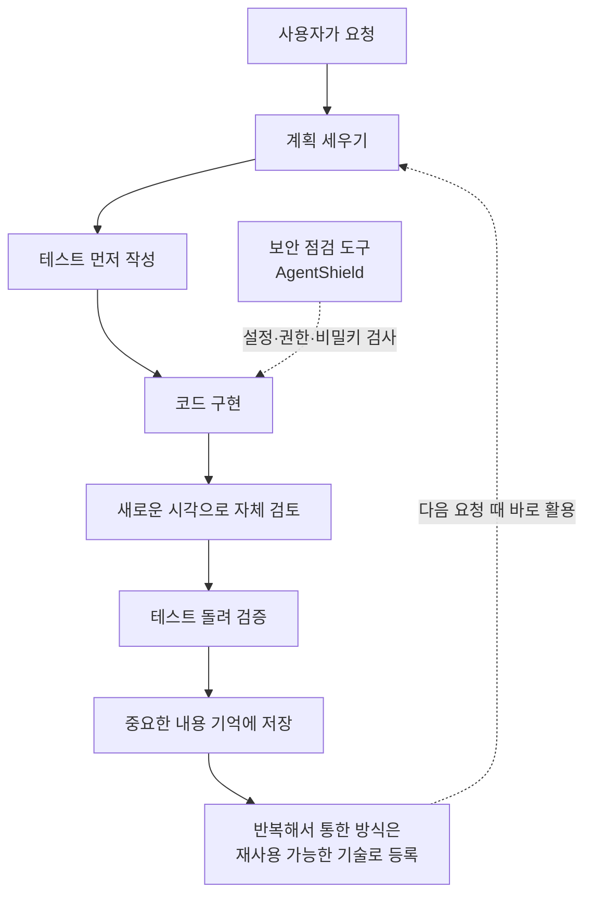

<aside class="ai-knowledge-sidebar">
  
CATEGORIES

  <nav class="ai-cat-tree">

에이전트 오케스트레이션15
<ul><li><a href="https://altjs4510.github.io/ai_news_blog/knowledge/20260904/">2026-09-04HarnessDev: Can LLMs Create and Evolve Their Own…</a></li><li><a href="https://altjs4510.github.io/ai_news_blog/knowledge/20260831-openexecutive-virtual-c-suite/">2026-08-31Open Executive — 8명의 전문 에이전트를 하나의 임원 목소리로</a></li><li><a href="https://altjs4510.github.io/ai_news_blog/knowledge/20260828/">2026-08-28Google ADK for Python v2.8.0 — RemoteA2aAgent 네이…</a></li><li><a href="https://altjs4510.github.io/ai_news_blog/knowledge/20260826/">2026-08-26apache/maka — 도구 호출·권한 결정·종료 이벤트를 append-only 로그…</a></li><li><a href="https://altjs4510.github.io/ai_news_blog/knowledge/20260823/">2026-08-23The Evolution of the Agent Harness — 하네스가 모델 가중치…</a></li><li><a href="https://altjs4510.github.io/ai_news_blog/knowledge/20260821/">2026-08-21volcengine/OpenViking — 에이전트 메모리·Knowledge RAG·스…</a></li><li><a href="https://altjs4510.github.io/ai_news_blog/knowledge/20260805/">2026-08-05TencentCloud/TencentDB-Agent-Memory — 대화·문서·코드를 …</a></li><li><a href="https://altjs4510.github.io/ai_news_blog/knowledge/20260708/">2026-07-08Expanding Managed Agents in Gemini API: backgrou…</a></li><li><a href="https://altjs4510.github.io/ai_news_blog/knowledge/20260707/">2026-07-07AI Hero Skills Catalog — 실무 엔지니어를 위한 재사용 가능한 판단 …</a></li><li><a href="https://altjs4510.github.io/ai_news_blog/knowledge/20260623/">2026-06-23bytedance/deer-flow — 샌드박스·메모리·서브에이전트·메시지 게이트웨이를…</a></li><li><a href="https://altjs4510.github.io/ai_news_blog/knowledge/20260621/">2026-06-21calesthio/OpenMontage — 12 파이프라인·52 도구·500+ 스킬을 …</a></li><li><a href="https://altjs4510.github.io/ai_news_blog/knowledge/20260611/">2026-06-11The evolution of agentic surfaces: building with…</a></li><li><a href="https://altjs4510.github.io/ai_news_blog/knowledge/20260602/">2026-06-02revfactory/harness — 도메인별 에이전트 팀과 스킬을 자동 설계하는 메타…</a></li><li><a href="https://altjs4510.github.io/ai_news_blog/knowledge/20260529/">2026-05-29Introducing dynamic workflows in Claude Code</a></li><li><a href="https://altjs4510.github.io/ai_news_blog/knowledge/20260507/">2026-05-07ruvnet/ruflo — Claude 멀티 에이전트 오케스트레이션 플랫폼</a></li></ul>

MCP &amp; 도구 통합16
<ul><li><a href="https://altjs4510.github.io/ai_news_blog/knowledge/20260829/">2026-08-29cursor/plugins — 플러그인 명세(specification)와 공식 플러그인…</a></li><li><a href="https://altjs4510.github.io/ai_news_blog/knowledge/20260802/">2026-08-02Stateless MCP has recaptured my interest (and in…</a></li><li><a href="https://altjs4510.github.io/ai_news_blog/knowledge/20260801/">2026-08-01different-ai/openwork — Claude Cowork의 오픈소스 대체 에…</a></li><li><a href="https://altjs4510.github.io/ai_news_blog/knowledge/20260731/">2026-07-31different-ai/openwork — Claude Cowork의 오픈소스 대안(o…</a></li><li><a href="https://altjs4510.github.io/ai_news_blog/knowledge/20260729/">2026-07-29Bringing MCP 2026-07-28 to Claude</a></li><li><a href="https://altjs4510.github.io/ai_news_blog/knowledge/20260721/">2026-07-21tirth8205/code-review-graph — 로컬 우선 코드 인텔리전스 그래프…</a></li><li><a href="https://altjs4510.github.io/ai_news_blog/knowledge/20260719/">2026-07-19tirth8205/code-review-graph — 로컬 우선 코드 인텔리전스 그래프…</a></li><li><a href="https://altjs4510.github.io/ai_news_blog/knowledge/20260709/">2026-07-09mvanhorn/last30days-skill — Reddit·X·YouTube·HN·…</a></li><li><a href="https://altjs4510.github.io/ai_news_blog/knowledge/20260618/">2026-06-18DeusData/codebase-memory-mcp — 158개 언어 코드베이스를 밀리…</a></li><li><a href="https://altjs4510.github.io/ai_news_blog/knowledge/20260606/">2026-06-06chopratejas/headroom — Compress tool outputs, lo…</a></li><li><a href="https://altjs4510.github.io/ai_news_blog/knowledge/20260605/">2026-06-05chopratejas/headroom — Compress tool outputs, lo…</a></li><li><a href="https://altjs4510.github.io/ai_news_blog/knowledge/20260604/">2026-06-04chopratejas/headroom — Compress tool outputs bef…</a></li><li><a href="https://altjs4510.github.io/ai_news_blog/knowledge/20260603/">2026-06-03How Bad MCP design cost your Agent 5× more token…</a></li><li><a href="https://altjs4510.github.io/ai_news_blog/knowledge/20260523/">2026-05-23colbymchenry/codegraph — 사전 인덱싱된 코드 지식 그래프 MCP</a></li><li><a href="https://altjs4510.github.io/ai_news_blog/knowledge/20260517/">2026-05-17I gave my LLM 100,000+ tools — Lazy Discovery &a…</a></li><li><a href="https://altjs4510.github.io/ai_news_blog/knowledge/20260509/">2026-05-09How to connect 100 MCP servers without the conte…</a></li></ul>

코딩 에이전트30
<ul><li><a href="https://altjs4510.github.io/ai_news_blog/knowledge/20260903/">2026-09-03pacifio/atlas — 여러 코딩 에이전트의 변경을 한곳에서 추적·질의하는 '에이…</a></li><li><a href="https://altjs4510.github.io/ai_news_blog/knowledge/20260901/" class="current">2026-09-01affaan-m/ECC — 스킬·본능·메모리·보안을 묶은 에이전트 하네스 성능 최적화 …</a></li><li><a href="https://altjs4510.github.io/ai_news_blog/knowledge/20260831-gitnexus-code-knowledge-graph/">2026-08-31GitNexus — 코드베이스를 지식그래프로 바꿔 에이전트에게 쥐어주기</a></li><li><a href="https://altjs4510.github.io/ai_news_blog/knowledge/20260822/">2026-08-22mattpocock/skills — Skills for Real Engineers (하…</a></li><li><a href="https://altjs4510.github.io/ai_news_blog/knowledge/20260820/">2026-08-20akitaonrails/ai-memory — 코딩 에이전트 CLI의 장기 메모리와 벤더…</a></li><li><a href="https://altjs4510.github.io/ai_news_blog/knowledge/20260819/">2026-08-19akitaonrails/ai-memory — 코딩 에이전트 CLI 간 장기 기억과 벤더…</a></li><li><a href="https://altjs4510.github.io/ai_news_blog/knowledge/20260811/">2026-08-11PrimeIntellect-ai/prime-agent — 장기 자율 실행을 전제로 설계…</a></li><li><a href="https://altjs4510.github.io/ai_news_blog/knowledge/20260810/">2026-08-10Auto mode is now the default in Claude Code for …</a></li><li><a href="https://altjs4510.github.io/ai_news_blog/knowledge/20260809/">2026-08-09PrimeIntellect-ai/prime-agent — 코딩 워크플로우·장기 자율 작…</a></li><li><a href="https://altjs4510.github.io/ai_news_blog/knowledge/20260808/">2026-08-08PrimeIntellect-ai/prime-agent — 코딩 워크플로우와 장시간 자율…</a></li><li><a href="https://altjs4510.github.io/ai_news_blog/knowledge/20260804/">2026-08-04esengine/DeepSeek-Reasonix — prefix-cache 안정성을 축…</a></li><li><a href="https://altjs4510.github.io/ai_news_blog/knowledge/20260728/">2026-07-28alibaba/open-code-review — 결정론적 파이프라인 + LLM 에이전트…</a></li><li><a href="https://altjs4510.github.io/ai_news_blog/knowledge/20260725/">2026-07-25The new rules of context engineering for Claude …</a></li><li><a href="https://altjs4510.github.io/ai_news_blog/knowledge/20260722/">2026-07-22tirth8205/code-review-graph — MCP·CLI용 로컬 우선 코드 …</a></li><li><a href="https://altjs4510.github.io/ai_news_blog/knowledge/20260718/">2026-07-18tirth8205/code-review-graph — MCP·CLI용 로컬 코드 인텔리…</a></li><li><a href="https://altjs4510.github.io/ai_news_blog/knowledge/20260715/">2026-07-15Dicklesworthstone/destructive_command_guard — 에이…</a></li><li><a href="https://altjs4510.github.io/ai_news_blog/knowledge/20260714/">2026-07-14Graphify-Labs/graphify — 코드베이스를 질의 가능한 지식 그래프로 만…</a></li><li><a href="https://altjs4510.github.io/ai_news_blog/knowledge/20260705/">2026-07-05openai/codex-plugin-cc — Claude Code에서 Codex를 위임…</a></li><li><a href="https://altjs4510.github.io/ai_news_blog/knowledge/20260626/">2026-06-26google-labs-code/design.md — 코딩 에이전트에게 디자인 시스템을 …</a></li><li><a href="https://altjs4510.github.io/ai_news_blog/knowledge/20260619/">2026-06-19Claude Code now supports artifacts</a></li><li><a href="https://altjs4510.github.io/ai_news_blog/knowledge/20260530/">2026-05-30Leonxlnx/taste-skill — AI에게 좋은 취향을 부여해 generic s…</a></li><li><a href="https://altjs4510.github.io/ai_news_blog/knowledge/20260528/">2026-05-28Building self-improving tax agents with Codex</a></li><li><a href="https://altjs4510.github.io/ai_news_blog/knowledge/20260526/">2026-05-26colbymchenry/codegraph — Pre-indexed code knowle…</a></li><li><a href="https://altjs4510.github.io/ai_news_blog/knowledge/20260524/">2026-05-24colbymchenry/codegraph — Pre-indexed code knowle…</a></li><li><a href="https://altjs4510.github.io/ai_news_blog/knowledge/20260521/">2026-05-21colbymchenry/codegraph — Pre-indexed code knowle…</a></li><li><a href="https://altjs4510.github.io/ai_news_blog/knowledge/20260512/">2026-05-12agentmemory — Persistent memory for AI coding ag…</a></li><li><a href="https://altjs4510.github.io/ai_news_blog/knowledge/20260510/">2026-05-10addyosmani/agent-skills — Production-grade engin…</a></li><li><a href="https://altjs4510.github.io/ai_news_blog/knowledge/20260508/">2026-05-08addyosmani/agent-skills — Production-grade engin…</a></li><li><a href="https://altjs4510.github.io/ai_news_blog/knowledge/20260506/">2026-05-06mksglu/context-mode — AI 코딩 에이전트용 컨텍스트 윈도우 최적화</a></li><li><a href="https://altjs4510.github.io/ai_news_blog/knowledge/20260505/">2026-05-05mattpocock/skills — Skills for Real Engineers (.…</a></li></ul>

모델 &amp; 연구5
<ul><li><a href="https://altjs4510.github.io/ai_news_blog/knowledge/20260716-proprag/">2026-07-16PropRAG — 프로포지션 경로 위 beam search로 멀티홉 검색 안내</a></li><li><a href="https://altjs4510.github.io/ai_news_blog/knowledge/20260620/">2026-06-20zai-org/GLM-5 — From Vibe Coding to Agentic Engi…</a></li><li><a href="https://altjs4510.github.io/ai_news_blog/knowledge/20260617/">2026-06-17Predicting model behavior before release by simu…</a></li><li><a href="https://altjs4510.github.io/ai_news_blog/knowledge/20260516/">2026-05-16STALE — 에이전트가 자기 기억의 유효성을 인지할 수 있는가</a></li><li><a href="https://altjs4510.github.io/ai_news_blog/knowledge/20260513/">2026-05-13Thinking Machines' Native Interaction Models — T…</a></li></ul>

인프라 &amp; 컴퓨트7
<ul><li><a href="https://altjs4510.github.io/ai_news_blog/knowledge/20260813/">2026-08-13semantica-agi/semantica — 컨텍스트와 책임 추적을 위한 그래프 네이…</a></li><li><a href="https://altjs4510.github.io/ai_news_blog/knowledge/20260812/">2026-08-12semantica-agi/semantica — 컨텍스트와 '책임 추적 가능한(accou…</a></li><li><a href="https://altjs4510.github.io/ai_news_blog/knowledge/20260806/">2026-08-06cloudflare/computer — 에이전트에게 컴퓨터를 통째로 주는 엣지 실행 샌…</a></li><li><a href="https://altjs4510.github.io/ai_news_blog/knowledge/20260724/">2026-07-24diegosouzapw/OmniRoute — 단일 엔드포인트로 278+ 프로바이더·50…</a></li><li><a href="https://altjs4510.github.io/ai_news_blog/knowledge/20260723/">2026-07-23diegosouzapw/OmniRoute — 268+ 프로바이더를 단일 엔드포인트로 묶…</a></li><li><a href="https://altjs4510.github.io/ai_news_blog/knowledge/20260522/">2026-05-22Giving Agents Computers — Ivan Burazin, Daytona</a></li><li><a href="https://altjs4510.github.io/ai_news_blog/knowledge/20260520/">2026-05-20New in Claude Managed Agents: self-hosted sandbo…</a></li></ul>

보안 &amp; 거버넌스17
<ul><li><a href="https://altjs4510.github.io/ai_news_blog/knowledge/20260902/">2026-09-02AIR raises $50M to help companies vet the skills…</a></li><li><a href="https://altjs4510.github.io/ai_news_blog/knowledge/20260827/">2026-08-27Claude in Chrome is generally available</a></li><li><a href="https://altjs4510.github.io/ai_news_blog/knowledge/20260819-mind-viruses/">2026-08-19탈옥도, 인젝션도 없이 — 대화로만 퍼지는 에이전트의 '마인드 바이러스'</a></li><li><a href="https://altjs4510.github.io/ai_news_blog/knowledge/20260730/">2026-07-30Anatomy of a Frontier Lab Agent Intrusion: A Tec…</a></li><li><a href="https://altjs4510.github.io/ai_news_blog/knowledge/20260716/">2026-07-16Dicklesworthstone/destructive_command_guard — 에이…</a></li><li><a href="https://altjs4510.github.io/ai_news_blog/knowledge/20260710/">2026-07-1070개 MCP 서버 strace 런타임 감사 — 부팅 시 아웃바운드 호출 서버 적발</a></li><li><a href="https://altjs4510.github.io/ai_news_blog/knowledge/20260704/">2026-07-04Cloudflare is about to block AI agents by defaul…</a></li><li><a href="https://altjs4510.github.io/ai_news_blog/knowledge/20260703/">2026-07-03Giving admins more visibility and control over C…</a></li><li><a href="https://altjs4510.github.io/ai_news_blog/knowledge/20260630/">2026-06-30Introducing the Claude apps gateway for Amazon B…</a></li><li><a href="https://altjs4510.github.io/ai_news_blog/knowledge/20260625/">2026-06-25Agent identity in Claude Tag: a new access model…</a></li><li><a href="https://altjs4510.github.io/ai_news_blog/knowledge/20260624/">2026-06-24Agent identity in Claude Tag: a new access model…</a></li><li><a href="https://altjs4510.github.io/ai_news_blog/knowledge/20260614/">2026-06-14NVIDIA/SkillSpector — Security scanner for AI ag…</a></li><li><a href="https://altjs4510.github.io/ai_news_blog/knowledge/20260613/">2026-06-13Fable 5's guardrails got bypassed in 48 hours — …</a></li><li><a href="https://altjs4510.github.io/ai_news_blog/knowledge/20260612/">2026-06-12NVIDIA/SkillSpector — AI 에이전트 스킬용 보안 스캐너</a></li><li><a href="https://altjs4510.github.io/ai_news_blog/knowledge/20260607/">2026-06-07OpenAI Help: Lockdown Mode</a></li><li><a href="https://altjs4510.github.io/ai_news_blog/knowledge/20260531/">2026-05-31How we contain Claude across products</a></li><li><a href="https://altjs4510.github.io/ai_news_blog/knowledge/20260527/">2026-05-27Microsoft Copilot Cowork Exfiltrates Files</a></li></ul>

응용 사례7
<ul><li><a href="https://altjs4510.github.io/ai_news_blog/knowledge/20260814/">2026-08-14cathrynlavery/diagram-design — Claude Code용 에디토리…</a></li><li><a href="https://altjs4510.github.io/ai_news_blog/knowledge/20260726/">2026-07-26citrolabs/ego-lite — 로그인된 브라우저 상태를 AI 에이전트와 공유하는…</a></li><li><a href="https://altjs4510.github.io/ai_news_blog/knowledge/20260717/">2026-07-17After a year building agent memory, 'save everyt…</a></li><li><a href="https://altjs4510.github.io/ai_news_blog/knowledge/20260712/">2026-07-12Do Automated Evals Work?</a></li><li><a href="https://altjs4510.github.io/ai_news_blog/knowledge/20260609/">2026-06-09Building intelligent apps for Apple platforms wi…</a></li><li><a href="https://altjs4510.github.io/ai_news_blog/knowledge/20260515/">2026-05-15Clawdmeter — Claude Code 사용량을 데스크톱 대시보드로</a></li><li><a href="https://altjs4510.github.io/ai_news_blog/knowledge/20260514/">2026-05-14Introducing Claude for Small Business</a></li></ul>

산업 동향8
<ul><li><a href="https://altjs4510.github.io/ai_news_blog/knowledge/20260830/">2026-08-30[AINews] OpenAI shuts off Cursor — 프론티어 모델 공급 차단…</a></li><li><a href="https://altjs4510.github.io/ai_news_blog/knowledge/20260711/">2026-07-11OpenAI says GPT 5.6 is the 'preferred model' for…</a></li><li><a href="https://altjs4510.github.io/ai_news_blog/knowledge/20260702/">2026-07-02How Cursor deploys AI inside the enterprise (For…</a></li><li><a href="https://altjs4510.github.io/ai_news_blog/knowledge/20260701/">2026-07-01Google OKF (Open Knowledge Format) — 벤더 중립 에이전트 …</a></li><li><a href="https://altjs4510.github.io/ai_news_blog/knowledge/20260616/">2026-06-16Why AI hasn't replaced software engineers, and w…</a></li><li><a href="https://altjs4510.github.io/ai_news_blog/knowledge/20260610/">2026-06-10Fable 5 just made cost-aware model routing manda…</a></li><li><a href="https://altjs4510.github.io/ai_news_blog/knowledge/20260519/">2026-05-19Anthropic acquires Stainless</a></li><li><a href="https://altjs4510.github.io/ai_news_blog/knowledge/20260504/">2026-05-04Agents for Everything Else: Codex for Knowledge …</a></li></ul>
</nav>
</aside>

<article class="ai-knowledge-article">

<header class="ai-post-hero">
  
<a class="ai-back" href="../">KNOWLEDGE</a> · 2026-09-01 · 오늘의 학습

  <h2 class="ai-post-title">affaan-m/ECC — 스킬·본능·메모리·보안을 묶은 에이전트 하네스 성능 최적화 시스템</h2>
</header>

> 원문: [affaan-m/ECC — 스킬·본능·메모리·보안을 묶은 에이전트 하네스 성능 최적화 시스템](https://github.com/affaan-m/ECC)

## 📌 학습 정리

### 1. 한 줄로 말하면

코딩을 도와주는 AI에게 "일하는 방식"을 통째로 설치해주는 도구 모음이에요. 매번 "계획부터 세우고, 테스트로 확인하고, 다시 검토해줘"라고 부탁하는 대신, 그 습관 자체를 미리 깔아두는 거죠.

### 2. 왜 이게 만들어졌어요?

지금의 코딩 도우미 AI는 코드를 잘 씁니다. 문제는 매번 처음부터 시작한다는 거예요. 어제 어떻게 일했는지, 어떤 방식이 잘 통했는지 기억을 못 하니까 사용자가 매 대화마다 "먼저 계획을 세워줘", "테스트를 먼저 짜줘", "다 짰으면 새 눈으로 다시 봐줘" 같은 지시를 반복해서 붙여야 했습니다. 이 반복을 없애자는 게 ECC의 출발점이에요. 계획 → 테스트 → 구현 → 리뷰 → 검증 → 기억 → 개선이라는 순서를 한 번 설치해두면, 그다음부터는 그게 그냥 그 AI가 일하는 기본 방식이 됩니다. 원문의 표현을 빌리면 "컨텍스트 창은 최적화하고, 나머지는 전부 저장해둔다"는 접근이에요.

### 3. 비유로 풀면

이건 마치 새로 온 유능한 신입에게 회사의 업무 매뉴얼과 체크리스트를 한 번에 건네주는 것과 비슷해요. 그 사람의 실력을 바꾸는 게 아니라, 일하는 절차와 참고 자료를 정리해서 쥐여주는 겁니다.

또 하나는 주방 세팅 비유예요. 요리사(모델)를 더 뛰어난 사람으로 교체하는 게 아니라, 도마와 칼과 재료를 손 닿는 자리에 미리 배치해두는 쪽이죠. 그래서 결국 ECC가 손대는 건 AI 모델 자체가 아니라, 모델이 매번 무엇을 보고 어떤 순서로 움직일지를 정해주는 그 바깥 껍데기입니다.

### 4. 어떻게 작동하는지 (그림으로)

흐름은 위에서 아래로 한 바퀴 도는 구조예요. 요청이 들어오면 바로 코드를 쓰는 게 아니라 계획을 먼저 세우고, 테스트를 앞세우고, 구현 후에는 앞의 대화 맥락에 물들지 않은 상태에서 다시 한 번 검토합니다. 마지막 단계가 특징적인데, 잘 통한 방법을 저장해두고 재사용 가능한 형태로 만들어서 다음 작업 때 처음부터 다시 만들지 않게 합니다.

### 5. 처음 보는 용어 풀이

- **하네스 (harness)** — AI 모델을 실제로 쓸 수 있게 감싸주는 껍데기 프로그램이에요. 코딩 도우미 도구들(Claude Code, Codex, Cursor 등)이 여기 해당하고, ECC는 모델이 아니라 이 껍데기의 성능을 다듬는 걸 목표로 합니다.
- **컨텍스트 창 (context window)** — AI가 한 번에 눈앞에 놓고 볼 수 있는 정보의 양이에요. 한정된 책상 넓이 같은 것이라, 여기에 무엇을 올릴지 고르는 게 성능에 직결됩니다.
- **기술 (skills)** — 특정 작업을 어떻게 처리할지 적어둔 절차서예요. ECC에는 테스트 우선 개발, 조사, 보안, 문서 작성 등 286개가 들어 있고, 필요한 상황에 해당 절차서가 불려 나옵니다.
- **에이전트 (agents)** — 특정 역할에 특화된 일꾼 설정이에요. 계획 담당, 코드 리뷰 담당, 빌드 오류 수리 담당처럼 나뉘어 있어서 상황에 맞는 쪽이 호출됩니다.
- **훅 (hooks)** — 특정 시점에 자동으로 끼어들어 실행되는 장치예요. 세션이 끝날 때 요약을 남기거나 규칙을 강제하는 식인데, 자동 실행이라는 성격 때문에 설치 시 사용자가 명시적으로 켤지 끌지 결정하게 되어 있습니다.
- **규칙 (rules)** — 항상 컨텍스트에 올라가 있는 기준선이에요. 늘 자리를 차지하니까 원문도 공통 규칙 하나에 실제 쓰는 언어 묶음 하나 정도만 얹으라고 권합니다.
- **본능 (instincts)** — 반복해서 통했던 방식이 누적되어 자동으로 반영되는 부분이에요. 매번 지시하지 않아도 몸에 밴 습관처럼 동작하게 하려는 장치입니다.
- **AgentShield** — AI 설정 자체를 검사하는 보안 점검 도구예요. 프롬프트, 훅, 연결 설정, 권한, 비밀키, 에이전트 파일 등에 위험한 게 섞여 있지 않은지 확인합니다.

### 6. 한 발 더 들어가고 싶다면

- [github.com/affaan-m/ECC](https://github.com/affaan-m/ECC) — 실제 저장소예요. 기술·에이전트·규칙 파일들이 어떤 형태로 생겼는지 직접 볼 수 있습니다.
- [ecc.tools](https://ecc.tools) — 프로젝트 공식 웹사이트고, 원문이 안전한 설치 경로로 명시한 곳 중 하나예요.
- [MCP 연결 정책 문서 (docs/MCP-CONNECTOR-POLICY.md)](https://github.com/affaan-m/ECC/blob/main/docs/MCP-CONNECTOR-POLICY.md) — 외부 도구 연결을 기본으로 몇 개까지 켜둘지 고민한 흔적이 담겨 있어요. 기본 연결을 6개에서 1개로 줄인 판단 근거를 볼 수 있습니다.
- 원문 안의 "지원 현황 표(support status matrix)"와 "플랫폼 지원(Platform Support)" 항목 — 도구마다 기능이 어디까지 되는지 차이가 큽니다. 특정 도구를 쓰고 있다면 설치 전에 여기부터 확인하는 게 좋아요.

---

## 📖 원문 전체 번역 (정독용)

> 의역 최소화한 전체 번역입니다. 큰 흐름은 위 정리에서 잡고, 정확한 워딩이 필요할 땐 이 섹션에서 정독하세요.

Language:
English
|
Português (Brasil)
|
简体中文
|
繁體中文
|
日本語
|
한국어
|
Türkçe
|
Русский
|
Tiếng Việt
|
ไทย
|
Deutsch
|
Español
|
Українська

주의
공식 출처만 이용하세요.
ECC 는 검증된 채널에서만 설치하세요: GitHub 저장소
github.com/affaan-m/ECC
, npm 패키지
ecc-universal
및
ecc-agentshield
,
GitHub App
, 플러그인 슬러그
ecc@ecc
, 그리고 프로젝트 웹사이트
ecc.tools
. 서드파티 재업로드와 비공식 미러는 프로젝트가 관리·검토하지 않으며 악성코드를 포함할 수 있습니다.

Claude Code 로 설치
터미널에서 표준 안내 설정을 실행하세요:

npx ecc-universal setup

npm 이 버전 또는 캐시 오류를 보고하면, 재시도 전 레지스트리 버전을 확인하세요:

npm view ecc-universal version

이 경로는 Node.js 18 이상, Git, 그리고
PATH
상의 Claude Code 2.1 이상을 필요로 합니다. 이 방식은 하나의
ecc@ecc
플러그인 스코프를 안전하게 설치·업데이트·이동시키며, 사용자가 선택한 훅 프로파일을 기록합니다.

또는, Claude Code 안에서 네이티브 플러그인 명령을 직접 실행할 수도 있습니다:

/plugin marketplace add https://github.com/affaan-m/ECC
/plugin install ecc@ecc

네이티브 경로는 ECC 의 스킬, 에이전트, 명령, 플러그인 관리 훅을 설치합니다. 이 방식을 선택했다면 거기서 멈추세요. 이어서 Claude Code 에 전체 수동 설치를 또 실행하지 마세요.

두 경로 모두 동일한
ecc@ecc
플러그인을 설치합니다. 하나만 선택하고
그 위에 다른 수동 Claude 설치를 겹쳐 쌓지 마세요.

ECC Pro + GitHub App
무료 설치
·
프라이빗 저장소는 $19/좌석/월부터
ECC 후원하기
오픈소스 프로젝트에 자금 지원
커뮤니티
Discord · Q&A · Show and Tell
OSS 는 계속 무료입니다.
이 저장소는 영원히 MIT 라이선스입니다. ECC Pro 는 프라이빗 저장소를 위한 호스팅된 GitHub App 입니다.
후원자
와
Pro 구독자
가 이 작업에 자금을 댑니다. 그래서 단독 메인테이너가 7개 하네스에 걸쳐 매주 출시할 수 있는 것입니다.

파트너 & 후원자
커뮤니티 후원자:
Mike Morgan
·
@jasonwu513
·
@1anter
·
@massimotodaro
·
@meadmccabe
후원자 되기
·
후원 등급
·
후원 프로그램

설치로 이동 ↓

ECC
여러분의 에이전트는 코드를 작성할 수 있지만, ECC 는 거기에 조율된 엔지니어링 시스템과 툴박스를 부여합니다: 구축 전에 계획하고, 테스트로 변경 사항을 검증하고, 새로운 컨텍스트에서 자신의 작업을 스스로 리뷰하고, 중요한 것을 기억하며, 반복된 성공을 재사용 가능한 스킬과 워크플로로 전환합니다.

계획(plan) -> 테스트(test) -> 구현(implement) -> 리뷰(review) -> 검증(verify) -> 기억(remember) -> 개선(improve)

이 프로세스를 매 프롬프트마다 재구축하는 대신, 한 번 설치하여 에이전트가 일하는 방식의 일부로 만드세요.

컨텍스트 윈도우를 최적화하세요. 나머지 모든 것은 영속화하세요.
ECC 는 MIT 라이선스 오픈소스입니다. 현재 Claude Code 에서 가장 잘 동작하며, 지원되는 Codex 동기화 경로가 있고, Cursor, OpenCode, Gemini, Zed, GitHub Copilot, Antigravity, Qwen 및 기타 하네스를 위한 기능 제한 어댑터를 제공합니다. 기능 동등성을 가정하기 전에
지원 상태 매트릭스
를 확인하세요.

68 개 에이전트, 286 개 스킬, 94 개 레거시 명령 심(shim)에 더해, 훅, 규칙, 메모리, 지속 학습, AgentShield 보안 스캐닝에 접근할 수 있습니다. 에이전트들은 계획, 리뷰, 빌드 복구, 보안, 아키텍처, 도메인 작업에 특화되어 있습니다.

| 포함 항목 | 개수 | 제공하는 것 |
|---|---|---|
| 에이전트 | 68 개 에이전트 | 계획, 리뷰, 빌드 복구, 보안, 아키텍처, 도메인 작업 |
| 스킬 | 286 개 스킬 | TDD, 리서치, 보안, 문서, 프론트엔드, 데이터, ML, 운영 등 |
| 명령 | 94 개 명령 | ECC 가 스킬 우선 표면으로 옮겨가는 동안의 편리한 진입점 |
| 훅과 메모리 | 런타임 | 강제, 세션 요약, 지속 학습, 본능(instincts), 컨텍스트 제어 |
| 규칙 | 선택적 | 언어나 프로젝트별로 선택하는 항상 로드되는 표준 |
| AgentShield | 포함 | 프롬프트, 훅, MCP 설정, 권한, 시크릿, 에이전트 파일에 대한 스캐닝 |

## ECC 설치

중요
ECC 2.2 는 Claude Code, Codex, Kimi Code 를 위한 안내형 패키지 설정을 포함합니다.
universal 패키지는 Node.js 18 이상을 필요로 합니다. Claude 플러그인 설정 또한
PATH
상의 Git 과 Claude Code 2.1 이상을 필요로 합니다.

권장: universal 안내형 설정
터미널에서 패키지 명령을 실행하세요. Claude Code 설정, 업데이트, 스코프 변경, 훅 프로파일 변경을 위해:

npx ecc-universal setup

Claude Code, Codex, Kimi Code 를 하나의 검토된 흐름으로 설정하려면:

npx ecc-universal install --guided

한 경로만 선택하세요 (하네스별로)
ECC 는 Claude Code, Codex 및 기타 하네스를 동시에 사용할 수 있습니다. 각 하네스마다 하나의 설치 방법을 선택하세요:

권장 기본값:
위의 안내형 Claude 플러그인 설정을 실행
Claude Code 에서도 지원:
위의
네이티브 플러그인 명령
사용
릴리스 2.2 에서 제공:
Claude Code, Codex, Kimi Code 를 위한 안내형 패키지 설정

동작함:
Claude Code 플러그인 + Codex 네이티브 플러그인
동작함:
Claude Code 플러그인 + 레거시 Codex 동기화 흐름
피할 것:
Claude Code 플러그인 + 전체 Claude 수동 설치
피할 것:
Codex 동기화 + Codex 마켓플레이스 플러그인

설치 방법을 겹쳐 쌓지 마세요.
동일한 하네스에 ECC 를 두 번 설치하면 스킬, 명령, 훅, 설정이 중복될 수 있습니다. 여러 하네스에 한 번씩 설치하는 것은 그렇지 않습니다.
이미 여러 설치를 겹쳐 쌓아서 중복된 것처럼 보인다면,
ECC 재설정/제거
로 바로 건너뛰세요.

설치에 문제가 있나요?
짧은
설치 또는 런타임 문제 양식
을 열거나
ecc feedback
을 실행하세요. ECC 는 진단 정보를 자동으로 업로드하지 않습니다.

Claude Code 세부 사항
Claude Code 는 마켓플레이스, 플러그인, 또는 충돌하는 스코프가 이미 존재할 때 발생하는 오류를 포함해 이러한 내장 명령들을 소유합니다. ECC 는 그 파서를 가로챌 수 없습니다. 두 네이티브 명령 중 하나라도 기존 설치나 스코프 충돌을 보고하면, 2.2 안내형 설정을 사용하거나 재시도 전에 충돌하는 Claude 플러그인 스코프를 해결하세요. 그 위에 수동 설치를 겹치지 마세요.

ECC 설치 후,
/ecc:configure-ecc
는 Claude 내부의 네임스페이스가 지정된 재구성 스킬입니다. 동일한 안전한 설정 흐름에 위임하지만, 플러그인이 설치된 후에만 사용 가능하며 첫 설치 시 Claude Code 의 내장
/plugin
명령을 대체할 수 없습니다.

Claude Code 플러그인은
규칙(rules)
을 배포할 수 없으므로, 실제로 원하는 규칙 팩만 추가하세요:

git clone https://github.com/affaan-m/ECC.git
cd ECC
mkdir -p ~/.claude/rules/ecc
cp -R rules/common ~/.claude/rules/ecc/
cp -R rules/typescript ~/.claude/rules/ecc/  # 사용하는 스택으로 대체하세요

rules/common
과 실제로 사용하는 언어 또는 프레임워크 팩 하나로 시작하세요. 플러그인을 설치했다면, 이후
./install.sh --profile full
을 실행하지 마세요.

settings.json 을 선호하시나요? 마켓플레이스를 선언적으로 추가하세요
~/.claude/settings.json
에 직접 추가하세요:

{
  "extraKnownMarketplaces": {
    "ecc": {
      "source": {
        "source": "github",
        "repo": "affaan-m/ECC"
      }
    }
  },
  "enabledPlugins": {
    "ecc@ecc": true
  }
}

이는 위의 두 `/plugin` 명령과 동일한 결과를 제공합니다.

명명 + 마이그레이션 참고 (ecc@ecc, affaan-m/ECC, ecc-universal)
ECC 는 세 개의 공개 식별자를 가지며, 이들은 서로 바꿔 쓸 수 없습니다:

GitHub 소스 저장소:
affaan-m/ECC

Claude 마켓플레이스/플러그인 식별자:
ecc@ecc

npm 패키지:
ecc-universal

이는 의도된 것입니다. Anthropic 마켓플레이스/플러그인 설치는 정본 플러그인 식별자로 키가 지정되므로, ECC 는 도구 이름과 슬래시 명령 네임스페이스를 엄격한 Desktop/API 검증기에 맞게 충분히 짧게 유지하기 위해
ecc@ecc
를 사용합니다. 오래된 게시물에는 예전의 긴 마켓플레이스 식별자가 여전히 표시될 수 있는데, 이는 레거시 별칭으로만 취급하세요. 별개로, npm 패키지는
ecc-universal
로 유지되었으므로, npm 설치와 마켓플레이스 설치는 의도적으로 다른 이름을 사용합니다.

npm 릴리스는 커밋 단위가 아니라 버전 태그 단위로 잘리므로,
ecc-universal
은
main
에 대한 모든 push 가 아니라 릴리스(2.1, 2.2, ...)를 추적합니다. 최신 개발 버전을 원한다면 git 에서 설치하세요.

로컬 Claude 설정이 지워지거나 리셋되었다고 해서 무언가를 재구매해야 하는 것은 아닙니다.
node scripts/ecc.js list-installed
로 시작한 다음, 재설치 전에
node scripts/ecc.js doctor
와
node scripts/ecc.js repair
를 실행하세요. 이는 보통 설정을 재구축하지 않고도 ECC 가 관리하는 파일을 복원합니다.

Codex 앱과 CLI
현재 Codex 릴리스는 ECC 를 네이티브 저장소-마켓플레이스 플러그인으로 설치할 수 있습니다. 마켓플레이스 항목은 저장소 루트를 사용하므로 Codex 의 캐시는 매니페스트와 함께 참조된 모든 스킬, MCP 설정, 훅 런타임, 스크립트, 자산을 받습니다:

codex plugin marketplace add affaan-m/ECC
codex plugin add ecc@ecc
codex plugin list --json
node scripts/codex/check-plugin-cache.js

두 add 명령 모두 멱등적입니다. 나중에 새로고침하려면,
codex plugin marketplace upgrade ecc
를 실행한 다음
codex plugin add ecc@ecc
를 실행하세요. Codex 는 활성
CODEX_HOME
안에 하나의 활성화된 플러그인 상태를 저장합니다. Claude 의
user
,
project
,
local
스코프는 제공하지 않습니다. 네이티브 훅은 명시적 신뢰 결정을 필요로 하며 Claude 의 네 가지 ECC 훅 프로파일을 사용하지 않습니다. Codex 내부에서는 안내형 프로바이더 인식 흐름을 위해
$configure-ecc
를 호출하세요.

이전의
scripts/sync-ecc-to-codex.sh
경로는
~/.codex
안에 복사되고 병합된 설정이 의도적으로 필요한 사용자를 위한 지원 중단 예정 호환 옵션입니다. 네이티브 플러그인에는 필요하지 않습니다. 새로운 동기화 실행은 소유권 매니페스트를 작성하여 정리 시 수정된 사용자 파일을 보존할 수 있게 합니다.
~/.codex/config.toml
이 존재하도록 Codex 를 먼저 한 번 실행한 다음:

git clone https://github.com/affaan-m/ECC.git
cd ECC
npm install
bash scripts/sync-ecc-to-codex.sh

Codex 대화나 네이티브 플러그인 캐시를 건드리지 않고 그 레거시 레이어를 검사하거나 제거하려면:

node scripts/ecc.js uninstall --legacy-codex-sync --dry-run
node scripts/ecc.js uninstall --legacy-codex-sync

매니페스트 이전 설치는 보수적으로 처리됩니다: ECC 는 표시된
AGENTS.md
블록을 제거하지만 소유권을 증명할 수 없는 복사된 파일은 보존하고 검토를 위해 보고합니다.

Codex 에서 프로젝트 로컬 설정을 위해 ECC 저장소를 직접 열 수도 있습니다. Codex 는 전역 동기화 없이 루트
AGENTS.md
와
.codex/
안의 신뢰된 프로젝트 설정을 읽습니다. 동기화 흐름 위에 네이티브 마켓플레이스 플러그인을 추가하지 마세요.

저장소 탐색, 소유권, PR diff 패킷 가이드를 위해서는
Codex ECC 탐색 지도
를 읽으세요. 네이티브 라이프사이클 세부 사항은
.codex 플러그인 노트
를 참조하세요.

기타 에이전트와 에디터
Cursor, OpenCode, Gemini, Zed, Antigravity, Qwen, Hermes, OpenClaw, Kimi, CodeBuddy, JoyCode, Copilot

ECC 를 한 번 클론한 다음, 여러분의 하네스에 맞는 대상을 선택하세요:

git clone https://github.com/affaan-m/ECC.git
cd ECC

| 하네스 | 설치 또는 설정 | 참고 |
|---|---|---|
| Cursor | `./install.sh --profile minimal --target cursor` | 프로젝트 로컬 `.cursor/` 어댑터 |
| OpenCode | `npm install && npm run build:opencode && ./install.sh --profile full --target opencode` | 전체 설치 전 플러그인 페이로드 빌드 |
| Gemini CLI | `./install.sh --profile minimal --target gemini` | 프로젝트 로컬 `.gemini/` 설정 |
| Zed | `./install.sh --profile minimal --target zed` | 프로젝트 로컬 `.zed/` 어댑터 |
| Antigravity | `./install.sh --profile minimal --target antigravity` | Antigravity 가이드 참조 |
| Qwen CLI | `./install.sh --profile minimal --target qwen` | Qwen 가이드 참조 |
| Hermes | `./install.sh --profile minimal --target hermes` | Hermes 설정 가이드 참조 |
| OpenClaw | `./install.sh --profile minimal --target openclaw` | 관리형 홈 디렉토리 설치 |
| Kimi Code CLI | `./install.sh --profile minimal --target kimi` | 프로젝트 로컬 `.kimi-code/` 설치 |
| CodeBuddy | `./install.sh --profile minimal --target codebuddy` | 프로젝트 로컬 `.codebuddy/` 설치 |
| JoyCode | `./install.sh --profile minimal --target joycode` | 프로젝트 로컬 `.joycode/` 설치 |

GitHub Copilot 지원은 이미 이 저장소에 포함되어 있습니다.
.github/copilot-instructions.md
는 지시 레이어를 제공하고,
.github/prompts/
는 재사용 가능한
/plan
,
/tdd
,
/security-review
,
/build-fix
,
/refactor
프롬프트를 포함하며,
.vscode/settings.json
은
chat.promptFiles
를 활성화합니다.

ECC 네이티브 대상이 없는 하네스의 경우,
수동 적용 가이드
를 사용하세요. 훅이나 네이티브 스킬 발견 기능이 있는 척하지 않으면서 채팅형 도구에 소수의 ECC 스킬과 워크플로 지시를 옮기는 방법을 설명합니다.

Cursor 는 에이전트 정의를
.cursor/agents/ecc-*.md
아래에 설치합니다. Cursor 네이티브 로딩 동작은 Cursor 빌드에 따라 다를 수 있습니다. ECC 는 루트
AGENTS.md
를
.cursor/
에 설치하지 않습니다. 어댑터는 Cursor 의 컨텍스트를 네이티브 규칙 및 에이전트 표면으로 범위를 좁혀 유지합니다.

기능 동등성, 훅 어댑터, 제약사항 등 하네스별 심층 참고 사항은 아래
플랫폼 지원
에 있습니다.

## 셀프 호스팅 모델과 커스텀 엔드포인트
ECC 는 각 하네스의 일반적인 설정을 통해 동작하므로, 공식 프로바이더, 호환 커스텀 API 엔드포인트나 모델 게이트웨이, 또는 셀프 호스팅 모델을 ECC 의 워크플로 변경 없이 사용할 수 있습니다.

Claude Code 의 경우, ECC 는 Anthropic 호스팅 전송 설정을 하드코딩하지 않습니다. 최소 게이트웨이 예시:

export ANTHROPIC_BASE_URL=https://your-gateway.example.com
export ANTHROPIC_AUTH_TOKEN=your-token
claude

게이트웨이가 모델 이름을 재매핑한다면, 이는 ECC 가 아니라 Claude Code 에서 설정하세요.
claude
CLI 가 이미 동작하고 있다면 ECC 의 훅, 스킬, 명령, 규칙은 모델 프로바이더에 구애받지 않습니다. Anthropic 의
LLM 게이트웨이 문서
와
모델 설정 문서
를 참조하세요.

별도의 컴퓨트와 서빙 설정을 이용해 그 게이트웨이 뒤에서 오픈소스 모델을 실행하거나 셀프 호스팅하세요. GPU 용량이 필요하다면,
Itô
가 ECC 가 선호하는 컴퓨트 후원사입니다. 다른 GPU 프로바이더도 다 동작합니다. 후원 링크는 수동적입니다: RFQ 를 호출하거나, 용량을 예약하거나, 컴퓨트를 프로비저닝하거나, 서빙을 설정하지 않습니다. 별개로,
ecc ito find
는 명시적으로 설정된 정본 Itô CLI 를 호출하여 실시간 인증된 RFQ 를 제출합니다; 용량을 예약하지는 않습니다. Itô 를 통한 관리형 추론은 아직 라이브 상태가 아닙니다.

ECC + Itô 컴퓨트로 Kimi 셀프 호스팅하기
Kimi Code 하네스와 모델 서빙 레이어는 별개입니다. ECC 는 에이전트 하네스를 설정하고, 여러분은 API 엔드포인트를 가져오거나 여러분 자신의 GPU 용량에 오픈 웨이트 Kimi 모델을 셀프 호스팅합니다. 이 어댑터는 Kimi Code 0.31.x (
@moonshot-ai/kimi-code
)에 대해 검증되었습니다:

1. GPU 용량 확보
Itô 나 다른 GPU 프로바이더를 사용하세요.

2. Kimi 서빙
선택한 체크포인트를 호환 엔드포인트를 통해 노출하세요.

3. ECC 와 함께 Kimi Code 실행
프로젝트 지시와 스킬을 설치한 다음 Kimi Code 를 시작하세요.

Kimi Code 의
공식 프로바이더 가이드
로 엔드포인트를 설정한 다음, ECC 를 설치하세요:

bash ./install.sh --target kimi --profile minimal
node scripts/ecc.js doctor --target kimi
kimi

Kimi Code 는 설치된
.kimi-code/AGENTS.md
지시와
.kimi-code/skills/
워크플로를 네이티브로 발견합니다; 프로젝트 레벨의
.agents/skills/
도 공식 발견 위치입니다. ECC 는 프로젝트 MCP 항목을
.kimi-code/mcp.json
에 안전하게 병합하며 사용자 레벨의
~/.kimi-code/config.toml
은 변경하지 않습니다. Kimi Code 는 네이티브 훅을 지원하지만, ECC 의 현재 관리형 프로젝트 어댑터는 이를 설정하지 않으므로 이 설치기는 Kimi 훅 프로파일을 제공하지 않습니다. 설치기의 드라이런과 회귀 테스트 스위트는 모든 관리형 Kimi 쓰기가 프로젝트 로컬
.kimi-code/
루트 안에 머무는지 검증합니다.

Itô 컴퓨트 CLI 브릿지
ecc ito
는 별도로 설치된 정본 Itô 클라이언트에 위임합니다; ECC 는 두 번째 API 클라이언트를 유지하지 않습니다.
ecc ito login [--no-browser]
는 디바이스 인가를 수행하고, 기본적으로 Itô 확인 페이지를 열며, macOS 키체인에 디바이스 토큰을 저장합니다;
--no-browser
는 페이지 핸드오프를 억제합니다. ECC 자체는 브라우저 자동화를 하지 않습니다.

ecc ito auth
는 검증 전용이며
--no-browser
를 거부합니다. 사용 가능한 작업은
ecc ito login
,
ecc ito auth
,
ecc ito find
,
ecc ito status
, 그리고 별도로 게이트된
ecc ito evals
입니다. 대응하는 MCP 도구는
ito_auth
,
ito_find
,
ito_status
로 유지됩니다;
ito_auth
는 기존 자격 증명을 검증하며 노드 자격 확인은 CLI 전용입니다.

ito-compute-cli
패키지는 현재 게시되지 않았습니다. Itô 런타임 저장소(데스크가 강화되는 동안 비공개; 디자인 파트너는 접근 가능)의
cli/ito-compute-cli
아래에서 로컬로 빌드하고,
npm ci
와
npm run check
를 실행한 다음,
ECC_ITO_CLI_EXECUTABLE
을 그 빌드의 절대
dist/bin/ito.js
경로로 설정하세요. 로그인은 절대
ITO_API_KEY
를 상속하지 않습니다; auth, find, status 는 설정되어 있으면
ITO_API_KEY
를 직접 전달하며,
ITO_AUTH_MODE=legacy
는 필요하지 않습니다.

ecc ito logout
은 현재 디바이스 자격 증명을 취소하며 원격 취소를 확인할 수 없는 경우 로컬 사본을 유지합니다. 디바이스 토큰은 기본적으로 macOS 키체인을 사용합니다; 명시적 파일 폴백은 소유자 전용 디렉토리/파일 권한을 유지해야 합니다. ECC 는
PATH
를 통해 이 자격 증명을 보유한 클라이언트를 발견하지 않습니다. 전체 RFQ 권한과 MCP 설정 계약은
ito-compute
스킬
을 참조하세요.

find
는 실시간 인증된 RFQ 를 제출합니다. 용량을 예약하지는 않습니다.
evals
는
ITO_ENABLE_SIXTYTWO_LIVE=1
과
--live-sixtytwo
둘 다, 별도로 설치된
sixtytwo-cli==0.3.33
, 명시적 노드 목록, 그리고 기존의 절대 설정 디렉토리를 필요로 합니다. 대여, 실행, 복구, 수리, 구매를 할 수 없습니다. ECC 는 견적 잠금, 구매, 워크로드, 추론 경로를 전혀 노출하지 않으며, 누락된 클라이언트나 실패한 라이브 호출을 로컬 결과로 절대 대체하지 않습니다.

## 고급 설치 옵션
이 옵션들은 기본 설치 경로 바로 아래, 여기 그대로 남아 있어서 기본 설정이 맞지 않을 때 README 를 뒤지지 않아도 됩니다.

훅 런타임 없는 저(低)컨텍스트 설치
저컨텍스트 / 훅 없음 경로
런타임 훅 없이 ECC 의 규칙, 에이전트, 명령, 플랫폼 설정, 핵심 워크플로를 원할 때 이를 사용하세요:

npx ecc-universal install --profile minimal --target claude

소스 체크아웃에서는, 동등한 명령은 다음과 같습니다:

./install.sh --profile minimal --target claude

Windows:

.\install.ps1 --profile minimal --target claude

이 프로파일은 의도적으로
hooks-runtime
을 제외합니다.

Claude 수동 설치는 각 스킬을
~/.claude/skills/<skill-name>/
(또는
claude-project
의 경우
.claude/skills/<skill-name>/
) 바로 아래에 배치하여 Claude Code 가 이를 발견할 수 있도록 합니다. 이전 ECC 수동 설치를 업그레이드할 때, 설치기는 ECC 설치 상태에 기록된 중첩된
skills/ecc/
파일만 마이그레이션합니다. 평평한(flat) 스킬 디렉토리가 사용자 소유라면, ECC 는 이를 보존하고 충돌 경고를 출력하며, 사용자 파일을 덮어쓰는 대신 안전한 제거를 위해 이전의 관리형 사본을 계속 추적합니다.

훅이 비활성화된 일반 core 프로파일의 경우:

./install.sh --profile core --without baseline:hooks --target claude
./install.sh --profile core --no-hooks --target claude

원한다면 나중에 훅 런타임을 추가하세요:

./install.sh --target claude --modules hooks-runtime --enable-hooks

프로파일이나 모듈이 훅 런타임을 구체화하게 되는 모든 설치는 명시적 결정을 필요로 합니다.
--enable-hooks
나
--no-hooks
없이는, 설치기가 훅이 할 수 있는 일을 출력하고 아무것도 쓰기 전에 멈춥니다. 안내형 설치기(
ecc install --guided
)는 이 선택을 대화형으로 묻습니다.

필요한 컴포넌트만 선택하기
먼저 알맞은 컴포넌트 찾기
어떤 컴포넌트가 여러분의 작업에 맞는지 패키지에 포함된 어드바이저에게 물어보세요:

node scripts/ecc.js consult "security reviews" --target claude

이는 매칭되는 컴포넌트, 관련 프로파일, 미리보기/설치 명령을 반환합니다. 정확한 파일 계획을 검사하고 싶다면 설치 전에 미리보기 명령을 사용하세요.

명시적 스킬이나 역량을 설치할 수도 있습니다:

./install.sh --target claude --skills tdd-workflow,security-review
node scripts/ecc.js install --profile minimal --target claude --with capability:machine-learning

수동으로 컴포넌트별로 복사하는 것도 가능합니다. 각 컴포넌트는 완전히 독립적입니다:

# 에이전트만
cp agents/*.md ~/.claude/agents/

# 규칙 디렉토리 (공통 + 언어별)
mkdir -p ~/.claude/rules/ecc
cp -r rules/common ~/.claude/rules/ecc/
cp -r rules/typescript ~/.claude/rules/ecc/  # 사용하는 스택 선택

# 핵심/일반 스킬만 (Claude Code 는 ~/.claude/skills 의 직접 하위 항목에서
# 스킬을 로드합니다; 수동 설치를 ~/.claude/skills/ecc/ 아래에 중첩시키지 마세요)
mkdir -p ~/.claude/skills
cp -r .agents/skills/* ~/.claude/skills/
cp -r skills/search-first ~/.claude/skills/

# 선택 사항: 마이그레이션 중 슬래시 명령 호환성 유지
mkdir -p ~/.claude/commands
cp commands/*.md ~/.claude/commands/

지원 중단된 shim 은
legacy-command-shims/
에 있습니다.
/tdd
와 같은 오래된 이름이 여전히 필요한 경우에만 거기서 개별 파일을 복사하세요.

전역 규칙 대신 프로젝트 로컬 규칙
ECC 의 표준을 모든 Claude Code 세션이 아니라 하나의 저장소에만 적용하고 싶을 때 프로젝트 로컬 규칙을 사용하세요:

cd your-project
mkdir -p .claude/rules/ecc
cp -R /path/to/ECC/rules/common .claude/rules/ecc/
cp -R /path/to/ECC/rules/typescript .claude/rules/ecc/

규칙은 항상 로드되는 컨텍스트이므로,
common
과 실제로 사용하는 스택을 위한 팩 하나로 시작하세요. 규칙을 수동으로 복사할 때는, 상대 참조가 계속 동작하고 파일명이 충돌하지 않도록 그 안의 파일이 아니라 전체 언어 디렉토리(예:
rules/common
또는
rules/golang
)를 복사하세요.

완전 수동 Claude 설치
이는 의도적으로 플러그인 경로를 건너뛸 때만 사용하세요:

git clone https://github.com/affaan-m/ECC.git
cd ECC
./install.sh --profile full

Windows:

git clone https://github.com/affaan-m/ECC.git
cd ECC
.\install.ps1 --profile full

이 경로를 선택했다면 거기서 멈추세요.
/plugin install
도 실행하지 마세요.

수동으로 선택한 설치의 경우, Claude 는
~/.claude/skills/
의 직접 하위 항목으로 스킬을 발견합니다; 이를
~/.claude/skills/ecc/
아래에 중첩시키지 마세요.

훅 설치
저장소 원본의
hooks/hooks.json
을
~/.claude/settings.json
이나
~/.claude/hooks/hooks.json
에 그대로 복사하지 마세요. 그 파일은 플러그인/저장소 지향이므로, 훅 명령 경로가 올바르게 재작성되도록 설치기를 사용하세요:

bash ./install.sh --target claude --modules hooks-runtime --enable-hooks

이는 해결된 훅을
~/.claude/hooks/hooks.json
에 작성하고 기존의
~/.claude/settings.json
은 그대로 둡니다.

/plugin install
을 통해 ECC 를 설치했다면, 그 훅들을
settings.json
에 복사하지 마세요. Claude Code v2.1+ 는 이미 플러그인
hooks/hooks.json
을 자동으로 로드하며,
settings.json
에 이를 중복시키면 중복 실행과 크로스 플랫폼 훅 충돌이 발생합니다.

Windows 에서는, Claude 의 설정 루트는
%USERPROFILE%\\.claude
입니다; 훅 런타임을 다음으로 설치하세요:

pwsh -File .\install.ps1 --target claude --modules hooks-runtime --enable-hooks

MCP 설정
Claude 플러그인 설치는 의도적으로 ECC 의 번들된 MCP 서버 정의를 자동으로 활성화하지 않습니다. 이는 엄격한 서드파티 게이트웨이에서 지나치게 긴 플러그인 MCP 도구 이름을 피하면서 수동 MCP 설정을 가능하게 유지합니다.

라이브 Claude Code 서버 변경을 위해서는 Claude Code 의
/mcp
명령이나 CLI 관리형 MCP 설정을 사용하세요; Claude Code 는 이러한 선택을
~/.claude.json
에 영속화합니다. 저장소 로컬 MCP 접근을 위해서는
mcp-configs/mcp-servers.json
에서 원하는 MCP 서버 정의를 프로젝트 범위의
.mcp.json
에 복사하세요.

ECC 는 정확히 하나의 기본 커넥터(
chrome-devtools
)만 제공합니다; 나머지는 모두 CLI/REST API 를 감싸는 스킬이거나 옵트인 카탈로그 항목입니다. 그 규칙과 이전의 여섯 기본값을 지원 중단시킨 2026년 6월 감사는
docs/MCP-CONNECTOR-POLICY.md
에 있습니다.

이미 ECC 번들 MCP 의 자체 사본을 실행 중이라면, 다음을 설정하세요:

export ECC_DISABLED_MCPS="chrome-devtools"

ECC 가 관리하는 설치와 Codex 동기화 흐름은 중복을 다시 추가하는 대신 그 번들 서버들을 건너뛰거나 제거할 것입니다.
ECC_DISABLED_MCPS
는 ECC 설치/동기화 필터이지, 라이브 Claude Code 토글이 아닙니다.

중요:
YOUR_*_HERE
자리표시자를 실제 API 키로 교체하세요.

멀티 모델 명령은 추가 설정이 필요합니다
multi-*
명령은 기본 플러그인/규칙 설치에
포함되지 않습니다
.

/multi-plan
,
/multi-execute
,
/multi-backend
,
/multi-frontend
,
/multi-workflow
를 사용하려면,
ccg-workflow
런타임도 설치해야 합니다.
npx ccg-workflow
로 초기화하세요.

그 런타임은 이 명령들이 기대하는 외부 의존성을 제공합니다, 다음을 포함하여:

~/.claude/bin/codeagent-wrapper
~/.claude/.ccg/prompts/*

ccg-workflow
없이는, 이
multi-*
명령들이 올바르게 실행되지 않습니다.

## 재설정, 복구, 제거

ECC 재설정/제거
universal 패키지에서 설치했다면, 설치에 사용한 것과 동일한
프로젝트 디렉토리에서 다음 명령들을 실행하세요:

npx ecc-universal list-installed
npx ecc-universal doctor
npx ecc-universal repair
npx ecc-universal uninstall --dry-run
npx ecc-universal uninstall

소스 체크아웃에서는, 재설치 전에 관리형 상태를 검사하세요:

node scripts/ecc.js list-installed
node scripts/ecc.js doctor
node scripts/ecc.js repair
node scripts/ecc.js uninstall --dry-run

직접적인 소스 체크아웃 제거의 경우:

node scripts/uninstall.js --dry-run
node scripts/uninstall.js

떠나시는 경우, 제거 명령은 선택적인
20초 피드백 양식
을 출력합니다. 이는 공개 GitHub 이슈이며, 제거를 절대 막지 않고, ECC 는 진단 정보를 업로드하지 않습니다.
ecc feedback
을 언제든 실행하여 문제, 피드백, 기능 제안 경로를 볼 수도 있습니다.

플러그인 사용자는 Claude Code 에서 플러그인을 제거한 다음, 수동으로 복사했고 더 이상 원하지 않는 규칙 폴더만 삭제해야 합니다. ECC 는 설치 상태에 기록된 파일만 제거합니다. 여러분의 하네스 디렉토리에 있는 관련 없는 파일을 소유권 주장하지 않습니다.

방법을 겹쳐 쌓았다면, 다음 순서로 정리하세요:

Claude Code 플러그인 설치를 제거하세요.
관리형 설치 상태를 포함하는 프로젝트 디렉토리에서 ECC 제거 명령을 실행하세요.
수동으로 복사했고 더 이상 원하지 않는 추가 규칙 폴더를 삭제하세요.
단일 경로를 사용하여 한 번만 재설치하세요.

Universal 안내형 설정 세부 사항

중요
이 패키지 러너 명령들은
ecc-universal
2.2.0 이상과
Node.js 18 이상을 필요로 합니다. Claude 플러그인 설정은 또한 Git 과 Claude Code
2.1 이상을
PATH
상에 필요로 합니다.

Claude Code 플러그인 설정, 업데이트, 스코프 변경, 훅 프로파일 변경을 위해:

npx ecc-universal setup

ECC 2.2 는 현대적 패키지 러너를 통해 동일한 안내형 설정을 지원합니다:

| 패키지 러너 | 안내형 설정 명령 |
|---|---|
| npm / npx | `npx ecc-universal setup` |
| pnpm | `pnpm dlx ecc-universal setup` |
| Yarn 2+ | `yarn dlx ecc-universal setup` |
| Bun | `bunx ecc-universal setup` |

Yarn Classic 1 은
yarn dlx
를 제공하지 않습니다; 일회성 실행을 위해서는
npx
를 사용하거나, 패키지를 전역으로 설치하거나, Yarn 을 업그레이드하세요.

마법사는 변경을 가하기 전에 공식 마켓플레이스와 모든 네이티브 Claude 설치 스코프를 인벤토리한 다음,
ecc@ecc
를 여러분이 선택한 스코프로 설치하거나, 업데이트하거나, 안전하게 이동시킵니다. ECC 를 업데이트하거나, 스코프를 변경하거나, 훅 프로파일을 변경하고 싶을 때마다 동일한 명령을 다시 실행하세요. 이 설정 마법사는 현재 Claude Code 플러그인을 설정합니다; Codex 나 Kimi Code 를 위해서는 아래의 멀티 하네스 마법사를 사용하세요.

하나의 검토된 흐름으로 둘 이상의 코딩 에이전트를 설정하려면, 멀티 하네스 마법사를 사용하세요:

npx ecc-universal install --guided

이는 Claude Code, Codex, Kimi Code 의 임의 조합을 선택할 수 있게 하고, 각 설치 채널과 목적지를 보여주며, 첫 쓰기 전에 모든 선택을 프리플라이트하고, 마지막으로 한 번의 최종 확인을 요청합니다.

| 하네스 | 안내형 설치 동작 |
|---|---|
| Claude Code | 하나의 `user`, `project`, 또는 `local` 스코프와 ECC 훅 프로파일을 가진 네이티브 `ecc@ecc` 플러그인 |
| Codex | 네이티브 Codex 마켓플레이스/플러그인 라이프사이클; 훅 검토와 신뢰는 Codex 소유로 남음 |
| Kimi Code | `./.kimi-code` 아래의 관리형 프로젝트 파일; ECC 훅, 모델/프로바이더 설정, 인증은 설정되지 않음 |

자동화를 위해서는, 모든 프로바이더별 선택을 명시적으로 하세요:

npx ecc-universal install --guided \
  --harness claude --harness codex --harness kimi \
  --claude-scope local --claude-hooks standard \
  --profile core --yes

네이티브 안내형 Codex 경로와 관리형 Kimi 경로를 쓰기 전에 검증하세요:

npx ecc-universal install --guided --harness codex --dry-run
npx ecc-universal install --profile core --target kimi --dry-run

추가 패키지 이름 명령들도 2.2 별칭을 통해 사용 가능합니다:

npx ecc-universal consult "security reviews" --target claude
npx ecc-universal install --profile minimal --target claude --with capability:machine-learning
npx ecc-universal doctor --target kimi

다음을 사용하지 마세요
npx ecc-install --profile minimal --target claude
:
ecc-install
은
ecc-universal
내부의 바이너리 이름이지, 별도로 게시된 npm 패키지가 아닙니다.

ECC 는 또한
cursor
,
antigravity
,
gemini
,
opencode
,
codebuddy
,
joycode
,
qwen
,
zed
,
hermes
,
openclaw
를 위한 고급 관리형 어댑터를 제공합니다. 이 대상들은 각 어댑터가 안내형 충돌, 업데이트, 복구, 제거 라이프사이클 매트릭스를 통과할 때까지 여전히 문서화된
ecc install --target ...
경로를 사용합니다. 어느 마법사도 감지된 모든 하네스에 조용히 설치하지 않습니다.

## ECC 사용 시작하기
전체 카탈로그가 아니라 필요한 워크플로부터 시작하세요.

| 무엇을 하고 있나요 | 여기서 시작하세요 |
|---|---|
| 기능 구축 | `/ecc:plan "기능 설명"`, 그다음 `tdd-workflow` |
| 버그 수정 | 실패하는 테스트로 재현한 다음 `tdd-workflow` 사용 |
| 새 코드 리뷰 | 새로운 컨텍스트에서의 리뷰를 위해 `/code-review` |
| 빌드 복구 | `/build-fix` |
| 코드베이스 정리 | `/refactor-clean` |
| 컨텍스트 압박 확인 | `/context-budget` |
| 긴 세션 종료 | `/save-session` 또는 `/learn-eval` |
| 나중에 재개 | `/resume-session` |
| 에이전트 설정 감사 | `/security-scan` 또는 `npx -y ecc-agentshield scan --path .` |

플러그인 명령과 수동 명령
Claude Code 플러그인 명령은 네임스페이스가 지정된 형태를 사용합니다:

/ecc:plan "Add authentication"

수동 설치는 더 짧은 호환 형태를 노출할 수 있습니다:

/plan "Add authentication"

스킬이 주요 워크플로 표면입니다. 명령은 편리한 진입점이자 호환성 shim 으로 남습니다. 설치된 것을 다음으로 확인하세요:

/plugin list ecc@ecc

어떤 에이전트를 사용해야 하나요?
스킬이 정본 워크플로 표면이며, 유지 관리되는 슬래시 항목은 명령 우선 워크플로를 위해 계속 사용 가능합니다.

| 하고 싶은 것 | 이 표면 사용 | 사용되는 에이전트 |
|---|---|---|
| 새 기능 계획 | `/ecc:plan "Add auth"` | planner |
| 시스템 아키텍처 설계 | `/ecc:plan` + architect 에이전트 | architect |
| 테스트 우선으로 코드 작성 | `tdd-workflow` 스킬 | tdd-guide |
| 방금 작성한 코드 리뷰 | `/code-review` | code-reviewer |
| 실패하는 빌드 수정 | `/build-fix` | build-error-resolver |
| End-to-end 테스트 실행 | `e2e-testing` 스킬 | e2e-runner |
| 보안 취약점 찾기 | `/security-scan` | security-reviewer |
| 죽은 코드 제거 | `/refactor-clean` | refactor-cleaner |
| 문서 업데이트 | `/update-docs` | doc-updater |
| Go 코드 리뷰 | `/go-review` | go-reviewer |
| Python 코드 리뷰 | `/python-review` | python-reviewer |
| F# 코드 리뷰 | (직접 `fsharp-reviewer` 호출) | fsharp-reviewer |
| TypeScript/JavaScript 코드 리뷰 | (직접 `typescript-reviewer` 호출) | typescript-reviewer |
| HarmonyOS 앱 개발 | (직접 `harmonyos-app-resolver` 호출) | harmonyos-app-resolver |
| 데이터베이스 쿼리 감사 | (자동 위임) | database-reviewer |
| 프로덕션 ML 변경 리뷰 | `mle-workflow` 스킬 + `mle-reviewer` 에이전트 | mle-reviewer |

일반 워크플로
아래의 슬래시 형태는 유지 관리되는 명령 표면의 일부로 남아 있는 곳에서 표시됩니다. 지원 중단된 짧은 이름 shim(예:
/tdd
,
/eval
)은 명시적 옵트인 전용으로
legacy-command-shims/
에 있습니다.

새 기능 시작하기:

/ecc:plan "Add user authentication with OAuth"
                                              -> planner 가 구현 청사진을 생성
tdd-workflow skill                            -

(원문이 여기서 잘려 있습니다 — 제공된 자료는 이 지점까지입니다.)

</article>

<!-- ai-related-links -->
<aside class="ai-related-links">
  
관련 학습

  <ul><li><a href="https://altjs4510.github.io/ai_news_blog/knowledge/20260516/">2026-05-16STALE — 에이전트가 자기 기억의 유효성을 인지할 수 있는가</a></li><li><a href="https://altjs4510.github.io/ai_news_blog/knowledge/20260701/">2026-07-01Google OKF (Open Knowledge Format) — 벤더 중립 에이전트 …</a></li><li><a href="https://altjs4510.github.io/ai_news_blog/knowledge/20260717/">2026-07-17After a year building agent memory, 'save everyt…</a></li></ul>
</aside>
<!-- /ai-related-links -->
