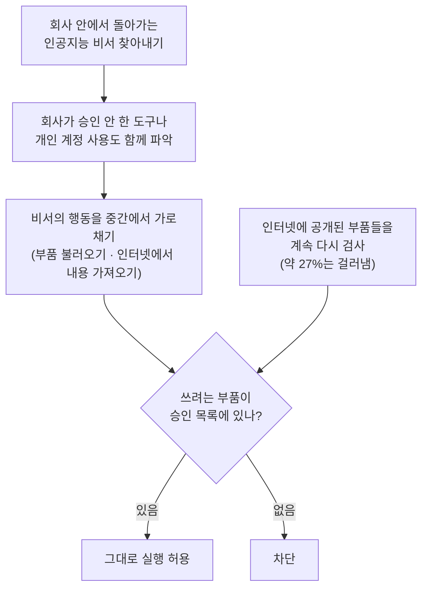

<aside class="ai-knowledge-sidebar">
  
CATEGORIES

  <nav class="ai-cat-tree">

에이전트 오케스트레이션11
<ul><li><a href="https://altjs4510.github.io/ai_news_blog/knowledge/20260831-openexecutive-virtual-c-suite/">2026-08-31Open Executive — 8명의 전문 에이전트를 하나의 임원 목소리로</a></li><li><a href="https://altjs4510.github.io/ai_news_blog/knowledge/20260828/">2026-08-28Google ADK for Python v2.8.0 — RemoteA2aAgent 네이…</a></li><li><a href="https://altjs4510.github.io/ai_news_blog/knowledge/20260823/">2026-08-23The Evolution of the Agent Harness — 하네스가 모델 가중치…</a></li><li><a href="https://altjs4510.github.io/ai_news_blog/knowledge/20260805/">2026-08-05TencentCloud/TencentDB-Agent-Memory — 대화·문서·코드를 …</a></li><li><a href="https://altjs4510.github.io/ai_news_blog/knowledge/20260709/">2026-07-09mvanhorn/last30days-skill — Reddit·X·YouTube·HN·…</a></li><li><a href="https://altjs4510.github.io/ai_news_blog/knowledge/20260708/">2026-07-08Expanding Managed Agents in Gemini API: backgrou…</a></li><li><a href="https://altjs4510.github.io/ai_news_blog/knowledge/20260623/">2026-06-23bytedance/deer-flow — 샌드박스·메모리·서브에이전트·메시지 게이트웨이를…</a></li><li><a href="https://altjs4510.github.io/ai_news_blog/knowledge/20260621/">2026-06-21calesthio/OpenMontage — 12 파이프라인·52 도구·500+ 스킬을 …</a></li><li><a href="https://altjs4510.github.io/ai_news_blog/knowledge/20260602/">2026-06-02revfactory/harness — 도메인별 에이전트 팀과 스킬을 자동 설계하는 메타…</a></li><li><a href="https://altjs4510.github.io/ai_news_blog/knowledge/20260529/">2026-05-29Introducing dynamic workflows in Claude Code</a></li><li><a href="https://altjs4510.github.io/ai_news_blog/knowledge/20260507/">2026-05-07ruvnet/ruflo — Claude 멀티 에이전트 오케스트레이션 플랫폼</a></li></ul>

MCP &amp; 도구 통합17
<ul><li><a href="https://altjs4510.github.io/ai_news_blog/knowledge/20260829/">2026-08-29cursor/plugins — 플러그인 명세(specification)와 공식 플러그인…</a></li><li><a href="https://altjs4510.github.io/ai_news_blog/knowledge/20260802/">2026-08-02Stateless MCP has recaptured my interest (and in…</a></li><li><a href="https://altjs4510.github.io/ai_news_blog/knowledge/20260801/">2026-08-01different-ai/openwork — Claude Cowork의 오픈소스 대체 에…</a></li><li><a href="https://altjs4510.github.io/ai_news_blog/knowledge/20260731/">2026-07-31different-ai/openwork — Claude Cowork의 오픈소스 대안(o…</a></li><li><a href="https://altjs4510.github.io/ai_news_blog/knowledge/20260729/">2026-07-29Bringing MCP 2026-07-28 to Claude</a></li><li><a href="https://altjs4510.github.io/ai_news_blog/knowledge/20260726/">2026-07-26citrolabs/ego-lite — 로그인된 브라우저 상태를 AI 에이전트와 공유하는…</a></li><li><a href="https://altjs4510.github.io/ai_news_blog/knowledge/20260721/">2026-07-21tirth8205/code-review-graph — 로컬 우선 코드 인텔리전스 그래프…</a></li><li><a href="https://altjs4510.github.io/ai_news_blog/knowledge/20260719/">2026-07-19tirth8205/code-review-graph — 로컬 우선 코드 인텔리전스 그래프…</a></li><li><a href="https://altjs4510.github.io/ai_news_blog/knowledge/20260718/">2026-07-18tirth8205/code-review-graph — MCP·CLI용 로컬 코드 인텔리…</a></li><li><a href="https://altjs4510.github.io/ai_news_blog/knowledge/20260618/">2026-06-18DeusData/codebase-memory-mcp — 158개 언어 코드베이스를 밀리…</a></li><li><a href="https://altjs4510.github.io/ai_news_blog/knowledge/20260606/">2026-06-06chopratejas/headroom — Compress tool outputs, lo…</a></li><li><a href="https://altjs4510.github.io/ai_news_blog/knowledge/20260605/">2026-06-05chopratejas/headroom — Compress tool outputs, lo…</a></li><li><a href="https://altjs4510.github.io/ai_news_blog/knowledge/20260604/">2026-06-04chopratejas/headroom — Compress tool outputs bef…</a></li><li><a href="https://altjs4510.github.io/ai_news_blog/knowledge/20260603/">2026-06-03How Bad MCP design cost your Agent 5× more token…</a></li><li><a href="https://altjs4510.github.io/ai_news_blog/knowledge/20260523/">2026-05-23colbymchenry/codegraph — 사전 인덱싱된 코드 지식 그래프 MCP</a></li><li><a href="https://altjs4510.github.io/ai_news_blog/knowledge/20260517/">2026-05-17I gave my LLM 100,000+ tools — Lazy Discovery &a…</a></li><li><a href="https://altjs4510.github.io/ai_news_blog/knowledge/20260509/">2026-05-09How to connect 100 MCP servers without the conte…</a></li></ul>

코딩 에이전트32
<ul><li><a href="https://altjs4510.github.io/ai_news_blog/knowledge/20260903/">2026-09-03pacifio/atlas — 여러 코딩 에이전트의 변경을 한곳에서 추적·질의하는 '에이…</a></li><li><a href="https://altjs4510.github.io/ai_news_blog/knowledge/20260901/">2026-09-01affaan-m/ECC — 스킬·본능·메모리·보안을 묶은 에이전트 하네스 성능 최적화 …</a></li><li><a href="https://altjs4510.github.io/ai_news_blog/knowledge/20260831-gitnexus-code-knowledge-graph/">2026-08-31GitNexus — 코드베이스를 지식그래프로 바꿔 에이전트에게 쥐어주기</a></li><li><a href="https://altjs4510.github.io/ai_news_blog/knowledge/20260826/">2026-08-26apache/maka — 도구 호출·권한 결정·종료 이벤트를 append-only 로그…</a></li><li><a href="https://altjs4510.github.io/ai_news_blog/knowledge/20260822/">2026-08-22mattpocock/skills — Skills for Real Engineers (하…</a></li><li><a href="https://altjs4510.github.io/ai_news_blog/knowledge/20260820/">2026-08-20akitaonrails/ai-memory — 코딩 에이전트 CLI의 장기 메모리와 벤더…</a></li><li><a href="https://altjs4510.github.io/ai_news_blog/knowledge/20260819/">2026-08-19akitaonrails/ai-memory — 코딩 에이전트 CLI 간 장기 기억과 벤더…</a></li><li><a href="https://altjs4510.github.io/ai_news_blog/knowledge/20260814/">2026-08-14cathrynlavery/diagram-design — Claude Code용 에디토리…</a></li><li><a href="https://altjs4510.github.io/ai_news_blog/knowledge/20260811/">2026-08-11PrimeIntellect-ai/prime-agent — 장기 자율 실행을 전제로 설계…</a></li><li><a href="https://altjs4510.github.io/ai_news_blog/knowledge/20260810/">2026-08-10Auto mode is now the default in Claude Code for …</a></li><li><a href="https://altjs4510.github.io/ai_news_blog/knowledge/20260809/">2026-08-09PrimeIntellect-ai/prime-agent — 코딩 워크플로우·장기 자율 작…</a></li><li><a href="https://altjs4510.github.io/ai_news_blog/knowledge/20260808/">2026-08-08PrimeIntellect-ai/prime-agent — 코딩 워크플로우와 장시간 자율…</a></li><li><a href="https://altjs4510.github.io/ai_news_blog/knowledge/20260804/">2026-08-04esengine/DeepSeek-Reasonix — prefix-cache 안정성을 축…</a></li><li><a href="https://altjs4510.github.io/ai_news_blog/knowledge/20260728/">2026-07-28alibaba/open-code-review — 결정론적 파이프라인 + LLM 에이전트…</a></li><li><a href="https://altjs4510.github.io/ai_news_blog/knowledge/20260725/">2026-07-25The new rules of context engineering for Claude …</a></li><li><a href="https://altjs4510.github.io/ai_news_blog/knowledge/20260722/">2026-07-22tirth8205/code-review-graph — MCP·CLI용 로컬 우선 코드 …</a></li><li><a href="https://altjs4510.github.io/ai_news_blog/knowledge/20260715/">2026-07-15Dicklesworthstone/destructive_command_guard — 에이…</a></li><li><a href="https://altjs4510.github.io/ai_news_blog/knowledge/20260714/">2026-07-14Graphify-Labs/graphify — 코드베이스를 질의 가능한 지식 그래프로 만…</a></li><li><a href="https://altjs4510.github.io/ai_news_blog/knowledge/20260707/">2026-07-07AI Hero Skills Catalog — 실무 엔지니어를 위한 재사용 가능한 판단 …</a></li><li><a href="https://altjs4510.github.io/ai_news_blog/knowledge/20260705/">2026-07-05openai/codex-plugin-cc — Claude Code에서 Codex를 위임…</a></li><li><a href="https://altjs4510.github.io/ai_news_blog/knowledge/20260626/">2026-06-26google-labs-code/design.md — 코딩 에이전트에게 디자인 시스템을 …</a></li><li><a href="https://altjs4510.github.io/ai_news_blog/knowledge/20260619/">2026-06-19Claude Code now supports artifacts</a></li><li><a href="https://altjs4510.github.io/ai_news_blog/knowledge/20260530/">2026-05-30Leonxlnx/taste-skill — AI에게 좋은 취향을 부여해 generic s…</a></li><li><a href="https://altjs4510.github.io/ai_news_blog/knowledge/20260528/">2026-05-28Building self-improving tax agents with Codex</a></li><li><a href="https://altjs4510.github.io/ai_news_blog/knowledge/20260526/">2026-05-26colbymchenry/codegraph — Pre-indexed code knowle…</a></li><li><a href="https://altjs4510.github.io/ai_news_blog/knowledge/20260524/">2026-05-24colbymchenry/codegraph — Pre-indexed code knowle…</a></li><li><a href="https://altjs4510.github.io/ai_news_blog/knowledge/20260521/">2026-05-21colbymchenry/codegraph — Pre-indexed code knowle…</a></li><li><a href="https://altjs4510.github.io/ai_news_blog/knowledge/20260512/">2026-05-12agentmemory — Persistent memory for AI coding ag…</a></li><li><a href="https://altjs4510.github.io/ai_news_blog/knowledge/20260510/">2026-05-10addyosmani/agent-skills — Production-grade engin…</a></li><li><a href="https://altjs4510.github.io/ai_news_blog/knowledge/20260508/">2026-05-08addyosmani/agent-skills — Production-grade engin…</a></li><li><a href="https://altjs4510.github.io/ai_news_blog/knowledge/20260506/">2026-05-06mksglu/context-mode — AI 코딩 에이전트용 컨텍스트 윈도우 최적화</a></li><li><a href="https://altjs4510.github.io/ai_news_blog/knowledge/20260505/">2026-05-05mattpocock/skills — Skills for Real Engineers (.…</a></li></ul>

모델 &amp; 연구6
<ul><li><a href="https://altjs4510.github.io/ai_news_blog/knowledge/20260821/">2026-08-21volcengine/OpenViking — 에이전트 메모리·Knowledge RAG·스…</a></li><li><a href="https://altjs4510.github.io/ai_news_blog/knowledge/20260716-proprag/">2026-07-16PropRAG — 프로포지션 경로 위 beam search로 멀티홉 검색 안내</a></li><li><a href="https://altjs4510.github.io/ai_news_blog/knowledge/20260620/">2026-06-20zai-org/GLM-5 — From Vibe Coding to Agentic Engi…</a></li><li><a href="https://altjs4510.github.io/ai_news_blog/knowledge/20260617/">2026-06-17Predicting model behavior before release by simu…</a></li><li><a href="https://altjs4510.github.io/ai_news_blog/knowledge/20260516/">2026-05-16STALE — 에이전트가 자기 기억의 유효성을 인지할 수 있는가</a></li><li><a href="https://altjs4510.github.io/ai_news_blog/knowledge/20260513/">2026-05-13Thinking Machines' Native Interaction Models — T…</a></li></ul>

인프라 &amp; 컴퓨트8
<ul><li><a href="https://altjs4510.github.io/ai_news_blog/knowledge/20260813/">2026-08-13semantica-agi/semantica — 컨텍스트와 책임 추적을 위한 그래프 네이…</a></li><li><a href="https://altjs4510.github.io/ai_news_blog/knowledge/20260812/">2026-08-12semantica-agi/semantica — 컨텍스트와 '책임 추적 가능한(accou…</a></li><li><a href="https://altjs4510.github.io/ai_news_blog/knowledge/20260806/">2026-08-06cloudflare/computer — 에이전트에게 컴퓨터를 통째로 주는 엣지 실행 샌…</a></li><li><a href="https://altjs4510.github.io/ai_news_blog/knowledge/20260724/">2026-07-24diegosouzapw/OmniRoute — 단일 엔드포인트로 278+ 프로바이더·50…</a></li><li><a href="https://altjs4510.github.io/ai_news_blog/knowledge/20260723/">2026-07-23diegosouzapw/OmniRoute — 268+ 프로바이더를 단일 엔드포인트로 묶…</a></li><li><a href="https://altjs4510.github.io/ai_news_blog/knowledge/20260611/">2026-06-11The evolution of agentic surfaces: building with…</a></li><li><a href="https://altjs4510.github.io/ai_news_blog/knowledge/20260522/">2026-05-22Giving Agents Computers — Ivan Burazin, Daytona</a></li><li><a href="https://altjs4510.github.io/ai_news_blog/knowledge/20260520/">2026-05-20New in Claude Managed Agents: self-hosted sandbo…</a></li></ul>

보안 &amp; 거버넌스17
<ul><li><a href="https://altjs4510.github.io/ai_news_blog/knowledge/20260902/" class="current">2026-09-02AIR raises $50M to help companies vet the skills…</a></li><li><a href="https://altjs4510.github.io/ai_news_blog/knowledge/20260827/">2026-08-27Claude in Chrome is generally available</a></li><li><a href="https://altjs4510.github.io/ai_news_blog/knowledge/20260819-mind-viruses/">2026-08-19탈옥도, 인젝션도 없이 — 대화로만 퍼지는 에이전트의 '마인드 바이러스'</a></li><li><a href="https://altjs4510.github.io/ai_news_blog/knowledge/20260730/">2026-07-30Anatomy of a Frontier Lab Agent Intrusion: A Tec…</a></li><li><a href="https://altjs4510.github.io/ai_news_blog/knowledge/20260716/">2026-07-16Dicklesworthstone/destructive_command_guard — 에이…</a></li><li><a href="https://altjs4510.github.io/ai_news_blog/knowledge/20260710/">2026-07-1070개 MCP 서버 strace 런타임 감사 — 부팅 시 아웃바운드 호출 서버 적발</a></li><li><a href="https://altjs4510.github.io/ai_news_blog/knowledge/20260704/">2026-07-04Cloudflare is about to block AI agents by defaul…</a></li><li><a href="https://altjs4510.github.io/ai_news_blog/knowledge/20260703/">2026-07-03Giving admins more visibility and control over C…</a></li><li><a href="https://altjs4510.github.io/ai_news_blog/knowledge/20260630/">2026-06-30Introducing the Claude apps gateway for Amazon B…</a></li><li><a href="https://altjs4510.github.io/ai_news_blog/knowledge/20260625/">2026-06-25Agent identity in Claude Tag: a new access model…</a></li><li><a href="https://altjs4510.github.io/ai_news_blog/knowledge/20260624/">2026-06-24Agent identity in Claude Tag: a new access model…</a></li><li><a href="https://altjs4510.github.io/ai_news_blog/knowledge/20260614/">2026-06-14NVIDIA/SkillSpector — Security scanner for AI ag…</a></li><li><a href="https://altjs4510.github.io/ai_news_blog/knowledge/20260613/">2026-06-13Fable 5's guardrails got bypassed in 48 hours — …</a></li><li><a href="https://altjs4510.github.io/ai_news_blog/knowledge/20260612/">2026-06-12NVIDIA/SkillSpector — AI 에이전트 스킬용 보안 스캐너</a></li><li><a href="https://altjs4510.github.io/ai_news_blog/knowledge/20260607/">2026-06-07OpenAI Help: Lockdown Mode</a></li><li><a href="https://altjs4510.github.io/ai_news_blog/knowledge/20260531/">2026-05-31How we contain Claude across products</a></li><li><a href="https://altjs4510.github.io/ai_news_blog/knowledge/20260527/">2026-05-27Microsoft Copilot Cowork Exfiltrates Files</a></li></ul>

응용 사례4
<ul><li><a href="https://altjs4510.github.io/ai_news_blog/knowledge/20260717/">2026-07-17After a year building agent memory, 'save everyt…</a></li><li><a href="https://altjs4510.github.io/ai_news_blog/knowledge/20260712/">2026-07-12Do Automated Evals Work?</a></li><li><a href="https://altjs4510.github.io/ai_news_blog/knowledge/20260609/">2026-06-09Building intelligent apps for Apple platforms wi…</a></li><li><a href="https://altjs4510.github.io/ai_news_blog/knowledge/20260514/">2026-05-14Introducing Claude for Small Business</a></li></ul>

산업 동향9
<ul><li><a href="https://altjs4510.github.io/ai_news_blog/knowledge/20260830/">2026-08-30[AINews] OpenAI shuts off Cursor — 프론티어 모델 공급 차단…</a></li><li><a href="https://altjs4510.github.io/ai_news_blog/knowledge/20260711/">2026-07-11OpenAI says GPT 5.6 is the 'preferred model' for…</a></li><li><a href="https://altjs4510.github.io/ai_news_blog/knowledge/20260702/">2026-07-02How Cursor deploys AI inside the enterprise (For…</a></li><li><a href="https://altjs4510.github.io/ai_news_blog/knowledge/20260701/">2026-07-01Google OKF (Open Knowledge Format) — 벤더 중립 에이전트 …</a></li><li><a href="https://altjs4510.github.io/ai_news_blog/knowledge/20260616/">2026-06-16Why AI hasn't replaced software engineers, and w…</a></li><li><a href="https://altjs4510.github.io/ai_news_blog/knowledge/20260610/">2026-06-10Fable 5 just made cost-aware model routing manda…</a></li><li><a href="https://altjs4510.github.io/ai_news_blog/knowledge/20260519/">2026-05-19Anthropic acquires Stainless</a></li><li><a href="https://altjs4510.github.io/ai_news_blog/knowledge/20260515/">2026-05-15Clawdmeter — Claude Code 사용량을 데스크톱 대시보드로</a></li><li><a href="https://altjs4510.github.io/ai_news_blog/knowledge/20260504/">2026-05-04Agents for Everything Else: Codex for Knowledge …</a></li></ul>
</nav>
</aside>

<article class="ai-knowledge-article">

<header class="ai-post-hero">
  
<a class="ai-back" href="../">KNOWLEDGE</a> · 2026-09-02 · 오늘의 학습

  <h2 class="ai-post-title">AIR raises $50M to help companies vet the skills and add-ons AI agents use</h2>
</header>

> 원문: [AIR raises $50M to help companies vet the skills and add-ons AI agents use](https://techcrunch.com/2026/09/01/air-raises-50m-to-help-companies-vet-the-skills-and-add-ons-ai-agents-use/)

## 📌 학습 정리

### 1. 한 줄로 말하면

인공지능 비서(AI 에이전트)에게 새 기능을 붙여줄 때, 그 부품이 안전한지 대신 검사해주는 회사가 500억 원 넘는 투자를 받았다는 이야기입니다. 스마트폰에 앱을 아무거나 깔지 않도록 앱스토어가 심사하듯, 인공지능이 쓰는 부품에도 심사대를 만들자는 발상이에요.

### 2. 왜 이게 만들어졌어요?

요즘 회사들은 인공지능 비서에게 사내 시스템 접근 권한을 점점 더 많이 주고 있습니다. 그런데 이 비서들은 혼자 일하는 게 아니라, 스킬·플러그인·연결 서버 같은 추가 부품을 갖다 붙여서 능력을 늘리죠. 문제는 그 부품들이 인터넷 여기저기에 공개돼 있고, 누가 만들었고 안에 뭐가 들었는지 확인하는 절차가 사실상 없다는 점입니다. AIR라는 보안 스타트업은 여기서 "예전에 우리가 컴퓨터 부품 프로그램에 서명을 요구하게 된 것과 똑같은 상황인데, 그 교훈을 아직 안 배웠다"고 봤고, 그 검사 체계를 만들겠다며 두 번의 초기 투자로 총 5,000만 달러를 모았습니다.

원문에서 창업자 야이르 사반(Yair Saban, 대표)이 든 비유가 이걸 잘 보여줍니다. 2000년대 초에는 장치 드라이버를 설치할 때 서명이 필요 없었지만, 지금은 커널에 코드를 밀어 넣는 일이라 반드시 누가 서명했는지 뜬다는 거죠. 스킬이나 플러그인, 연결 서버는 같은 종류의 위험인데 아직 그런 확인 장치가 없다는 게 그의 진단입니다.

### 3. 비유로 풀면

이건 마치 **공항 보안검색대**를 세우는 일 같아요. 비행기(인공지능 비서) 자체를 공격하는 대신, 승객이 들고 타는 짐(스킬·플러그인) 안에 위험물을 넣는 쪽이 훨씬 쉽거든요. 그래서 검사는 비행기가 아니라 짐이 실리는 길목에서 해야 합니다.

또 하나는 **동네 정육점 원산지 표시** 같은 거예요. 한 번 "안전" 도장을 찍었다고 끝이 아니라, 납품처가 바뀌거나 주인이 바뀌면 다시 확인해야 하니까요. 실제로 원문은 예전에 승인했던 스킬도 그 안에서 내려받는 꾸러미가 바뀌거나 개발자 계정이 털리면 위험해질 수 있다고 짚습니다.

그래서 결국, 이 회사가 파는 건 "한 번 검사해주는 도구"가 아니라 "계속 다시 검사해주는 파이프라인"입니다. 투자자 쪽에서도 이건 검사 문제라기보다 그걸 쉬지 않고 돌리는 기반 설비 문제에 가깝다고 표현했어요.

### 4. 어떻게 작동하는지 (그림으로)

흐름은 크게 세 단계입니다. 먼저 회사 안에 어떤 인공지능 비서가 돌아다니는지 눈에 보이게 만들고, 그다음 비서가 뭔가를 실행하려는 순간을 중간에서 붙잡아 분석하고, 마지막으로 그 부품이 회사가 관리하는 승인 목록을 통과했는지 대조합니다. 승인 목록 자체는 인터넷에 공개된 부품들을 계속 다시 살펴보며 갱신하는데, 지금은 발견한 부품의 약 27%를 걸러내고 있다고 합니다.

### 5. 처음 보는 용어 풀이

- **인공지능 비서 / 대신 일해주는 프로그램 (AI agent)** — 사람이 매번 지시하지 않아도 스스로 판단해서 여러 단계 작업을 처리하는 프로그램입니다. 회사 데이터베이스나 업무 시스템에 직접 접근해 일할 수 있다는 점이 기존 챗봇과 다른 지점이에요.
- **부품 공급망 (software supply chain)** — 하나의 소프트웨어가 돌아가려고 끌어다 쓰는 외부 부품들의 전체 경로를 말합니다. 원문은 인공지능 비서 주변에도 이런 공급망이 새로 생기고 있다고 봅니다.
- **능력 확장 꾸러미 (skills / plug-ins / add-ons)** — 인공지능 비서에게 "이런 일은 이렇게 하면 돼"라고 붙여주는 추가 기능 묶음입니다. 인터넷에 공개된 걸 그냥 갖다 쓰는 경우가 많아서 검사 대상이 됩니다.
- **외부 도구 연결 서버 (MCP server)** — 인공지능 비서가 바깥 프로그램이나 데이터에 접근할 수 있도록 중간에서 연결해주는 서버입니다. 연결 통로인 만큼 여기가 오염되면 영향이 큽니다.
- **내용 오염 공격 (content poisoning)** — 인공지능 비서를 직접 해킹하는 대신, 그 비서가 읽어 들이는 자료에 미리 나쁜 지시를 심어두는 방식입니다. 비서가 인터넷과 사내 시스템을 오갈수록 이 통로가 넓어진다는 게 원문의 우려예요.
- **허용 목록 (whitelist)** — "이건 써도 된다"고 미리 승인해둔 부품들의 명단입니다. 목록에 없으면 막는 방식이라, 목록을 얼마나 부지런히 갱신하느냐가 핵심이 됩니다.
- **차단·검사 계층 (enforcement layer)** — 비서가 실제로 행동에 옮기기 직전에 끼어들어 그 행동을 들여다보고 통과 여부를 정하는 층입니다. 앞의 허용 목록이 실제로 작동하게 만드는 실행 지점이라고 보면 됩니다.
- **회사가 모르는 도구 사용 (shadow IT)** — 직원이 정보기술 부서 승인 없이 개인 계정으로 인공지능 도구를 쓰는 상황입니다. 회사 입장에선 관리 밖의 구멍이라 찾아내는 것 자체가 제품 기능이 됩니다.

### 6. 한 발 더 들어가고 싶다면

- [AIR](https://techcrunch.com/2026/09/01/air-raises-50m-to-help-companies-vet-the-skills-and-add-ons-ai-agents-use/) — 이번 이야기의 주인공 회사. 인공지능 비서가 쓰는 부품을 찾아내고 검사하고 막는 방식을 한 묶음으로 파는 곳이 어떤 모습인지 볼 수 있어요.
- [Noma Security](https://techcrunch.com/2026/09/01/air-raises-50m-to-help-companies-vet-the-skills-and-add-ons-ai-agents-use/) — 비서·연결 서버·스킬을 찾아내고 접근을 통제하며 실행 중에도 지켜보는 경쟁 제품. 같은 문제를 다른 각도로 푸는 예시입니다.
- [Zenity](https://techcrunch.com/2026/09/01/air-raises-50m-to-help-companies-vet-the-skills-and-add-ons-ai-agents-use/) — 비슷한 보안·관리 도구를 파는 회사. 이 분야에 돈이 얼마나 몰리는지(작년 1억 달러대 투자 유치 사례들)를 가늠할 수 있어요.
- [Astrix Security](https://techcrunch.com/2026/09/01/air-raises-50m-to-help-companies-vet-the-skills-and-add-ons-ai-agents-use/) — 신원 확인을 축으로 비서와 연결 서버를 통제하는 접근. "무엇을 실행하나"가 아니라 "누구인가"로 푸는 방식이 궁금하면 볼 만합니다.
- [Operant AI](https://techcrunch.com/2026/09/01/air-raises-50m-to-help-companies-vet-the-skills-and-add-ons-ai-agents-use/) — 비서 보호와 함께 연결 서버 앞단에 관문을 두는 제품. 통로를 하나로 좁혀 관리하는 설계가 어떤 건지 참고가 됩니다.

---

## 📖 원문 전체 번역 (정독용)

> 의역 최소화한 전체 번역입니다. 큰 흐름은 위 정리에서 잡고, 정확한 워딩이 필요할 땐 이 섹션에서 정독하세요.

기업들이 자사 시스템의 점점 더 많은 부분에 대해 AI 에이전트에 접근 권한을 부여하기 시작하면서, AI 에이전트가 사용하는 새로운 툴링—스킬, 플러그인, MCP 서버, 그리고 에이전트가 인터넷과 상호작용할 수 있게 해주는 애드온—을 중심으로 새로운 소프트웨어 공급망이 형성되고 있는 것으로 보인다.

AI 보안 스타트업 AIR는 기업들에게 이 공급망을 모니터링할 방법이 필요하리라고 보고 있으며, 이제 두 차례의 시드 라운드에 걸쳐 5,000만 달러를 조달해 그 제품을 만들기 위해 스텔스 모드에서 나온다.

이스라엘 8200부대(Unit 8200) 정보부대 출신으로 공격적 사이버보안 업무를 담당했던 야이르 사반(Yair Saban, CEO)과 니브 호프만(Niv Hoffman, CTO)이 창업한 AIR는 기업 내부에서 실행 중인 에이전트를 발견하고, 그 에이전트가 사용하는 스킬·툴·컴포넌트를 지속적으로 검증하며, 보안 기준을 통과하지 못한 소프트웨어나 외부 소스와의 상호작용을 차단할 수 있는 플랫폼을 제공한다. 또한 AI 에이전트용으로 검증된 애드온과 스킬을 모아놓은 마켓플레이스도 제공한다.

사반이 TechCrunch에 밝힌 바에 따르면, 두 차례의 펀딩 라운드는 몇 주 간격을 두고 마감됐다. 첫 번째 라운드에서 1,000만 달러를, 두 번째 라운드에서 4,000만 달러를 조달했다. 첫 번째 라운드는 세쿼이아(Sequoia)가, 두 번째 라운드는 그린오크스(Greenoaks)가 주도했다고 사반은 전했다. 스위시(Swish), 네츠(Netz), 그리고 코그니션(Cognition) 사장 잭 프랭클(Zach Frankel), 위즈(Wiz) 공동창업자 이논 코스티카(Yinon Costica), 이온(Eon) 공동창업자 오피르 얼리치(Ofir Ehrlich), 앤 노이버거(Anne Neuberger), 오메르 아담(Omer Adam), 클레이(Clay) 공동창업자 바룬 아난드(Varun Anand) 등 다른 엔젤 투자자들도 참여했다.

AIR의 논지는 이렇다: 기업 전반에서 AI 에이전트가 통째로 활용되는 방식이 점점 운영체제(operating system)를 닮아가고 있는데, 정작 에이전트가 사용하는 툴이나 설치할 수 있는 소프트웨어에는 아직 우리가 드라이버나 애플리케이션에 부여하는 수준의 감독이 이루어지지 않고 있다는 것이다.

"2000년대 초반에는 드라이버를 설치할 때 그 드라이버가 서명(signed)될 필요가 없었습니다. 오늘날에는 드라이버를 설치할 때마다 누가 서명했는지 알려주는 서명이 표시되는데, 이는 그 드라이버가 실제로 커널에 코드를 로드하기 때문입니다." 사반은 말했다. "스킬이나 플러그인, MCP에는 그런 게 없습니다. 안타까운 일이죠, 왜냐하면 메커니즘은 똑같고 교훈도 똑같은데, 우리가 그 교훈을 배우지 못했으니까요."

그는 가장 큰 위험이, AI 에이전트가 데이터베이스와 기업 시스템 전반에 걸쳐 더 자율적으로 작업하고 인터넷에 연결되기 시작하면서, 공격자들이 에이전트를 직접 공격하는 대신 에이전트가 소비하는 콘텐츠를 오염시킬 수 있다는 점이라고 주장한다.

이 스타트업은 이를 가시성(visibility) 제품으로 해결할 수 있다고 말한다. 이 제품은 기업 환경 전반에서 활성화된 에이전트를 찾아내고, IT 부서가 승인하지 않은 AI 툴을 사용하는 직원이나 개인 계정을 사용하는 직원을 식별한다. 그런 다음, 에이전트에 훅(hook)을 걸어 스킬 로딩이나 인터넷에서 콘텐츠를 가져오는 것과 같은 액션을 가로채 분석하는 집행(enforcement) 레이어를 사용한다. 마지막으로, AIR는 에이전트가 사용하려는 툴, 애드온, 소프트웨어를 이 스타트업이 유지·관리하는 화이트리스트와 대조해 검사하기도 한다.

사반에 따르면, 이 스타트업은 인터넷에 공개돼 있는 스킬과 애드온을 변경 사항 및 악성 행위 여부에 대해 평가함으로써 이 화이트리스트를 유지한다. 이전에 승인된 스킬이라도 해당 스킬이 다운로드하는 패키지가 변경되거나 개발자 계정이 침해되면 위험해질 수 있기 때문이다. 그는 AIR의 플랫폼이 현재 온라인에서 발견하는 애드온과 스킬 중 약 27%를 걸러내고 있다고 덧붙였다.

AIR는 20곳이 넘는 고객을 보유하고 있다고 주장하며, 사반은 이 중 약 4분의 1이 대기업이라고 말했다. 그는 특히 규제가 심한 산업, 그중에서도 금융 서비스와 제약 회사에서 지금까지 가장 강한 수요를 확인했다고 밝혔다.

그러나 AIR가 이 분야에서 유일한 회사인 것은 결코 아니다.

노마 시큐리티(Noma Security)는 에이전트, MCP 서버, 스킬에 대한 발견, 접근 제어, 런타임 모니터링을 제공하며, 제니티(Zenity)는 유사하게 작동하는 보안 및 거버넌스 툴을 판매한다. 아스트릭스 시큐리티(Astrix Security)의 아이덴티티 플랫폼 역시 기업이 에이전트와 MCP 서버를 발견하고 통제할 수 있게 해주며, 오퍼런트 AI(Operant AI)는 에이전트 보호 기능과 MCP 게이트웨이를 함께 제공한다.

이 카테고리를 쫓는 벤처 자금 규모도 상당하다. 제니티는 8월에 1억 2,500만 달러 규모의 시리즈 C를 조달했고, 노마는 지난해 1억 달러 규모의 시리즈 B를 조달했다.

사반은 AIR의 해자(moat)가 AI 에이전트를 둘러싸고 성장하는 스킬·애드온 생태계를 지속적으로 검증하는 능력에 있다고 본다. "스킬과 플러그인 웹사이트를 지속적으로 검증하는 것, 이건 하기 어려운 미션입니다. 엔드포인트에 대한 가시성을 확보하는 것, 그건 쉽습니다. 누구나 할 겁니다. 거기에 해자를 만들기는 어렵죠." 그는 말했다.

또한 이 CEO는 AI 랩과 프로바이더들이 결국에는 악성 스킬 및 툴 사용을 걸러내는 보안 점검과 정책을 자체적으로 구축하게 될 것이라고 인정하면서도, 기업들이 여전히 여러 벤더에 걸쳐 작동하는 독립적인 제품을 구매하고 싶어할 것이라고 생각한다.

"이것은 스캐닝 문제가 아니라, 지속적인 재검증(continuous re-verification) 문제입니다." 세쿼이아의 파트너 보고밀 발칸스키(Bogomil Balkansky)는 TechCrunch에 이메일 성명으로 밝혔다. "한 기업의 에이전트들이 접촉하는 모든 스킬, 플러그인, MCP 서버, 서브 에이전트를 검사하고, 그것들이 변경될 때마다 실시간으로, 그리고 기업 전체의 에이전트 함대 전반에 걸쳐 재검사하는 것은, 보안 문제이기 이전에 근본적으로 인프라 문제입니다. AIR는 지난 1년을 그 파이프라인을 구축하는 데 썼습니다. 더 나은 스캐너를 만든다고 그걸 따라잡을 수 있는 게 아닙니다."

AIR는 현재 약 40명의 직원을 두고 있다. 사반은 새로 조달한 자본이 주로 연구 인력 채용과 미국·유럽에서의 시장 진출(go-to-market) 노력 확대에 쓰일 것이라고 말했다.

**주제**
AI, AI agents, ai security, Greenoaks Capital, Security, Sequoia Capital, Startups

*본 기사 내 링크를 통해 구매가 이루어질 경우, 저희가 소액의 수수료를 받을 수 있습니다. 이는 저희의 편집 독립성에 영향을 미치지 않습니다.*

**램 아이어(Ram Iyer)** — 에디터
램은 금융·기술 분야 기자 겸 에디터다. 로이터(Reuters)와 아큐리스 글로벌(Acuris Global)에서 북미 및 유럽의 M&A, 주식, 규제 뉴스, 채권 시장을 취재했으며, 여행·관광·엔터테인먼트·도서 관련 글도 써왔다.
램에게서 온 연락을 확인하거나 연락하고 싶다면 ram.iyer@techcrunch.com 으로 이메일을 보내면 된다.

</article>

<!-- ai-related-links -->
<aside class="ai-related-links">
  
관련 학습

  <ul><li><a href="https://altjs4510.github.io/ai_news_blog/knowledge/20260703/">2026-07-03Giving admins more visibility and control over C…</a></li><li><a href="https://altjs4510.github.io/ai_news_blog/knowledge/20260610/">2026-06-10Fable 5 just made cost-aware model routing manda…</a></li><li><a href="https://altjs4510.github.io/ai_news_blog/knowledge/20260612/">2026-06-12NVIDIA/SkillSpector — AI 에이전트 스킬용 보안 스캐너</a></li></ul>
</aside>
<!-- /ai-related-links -->
