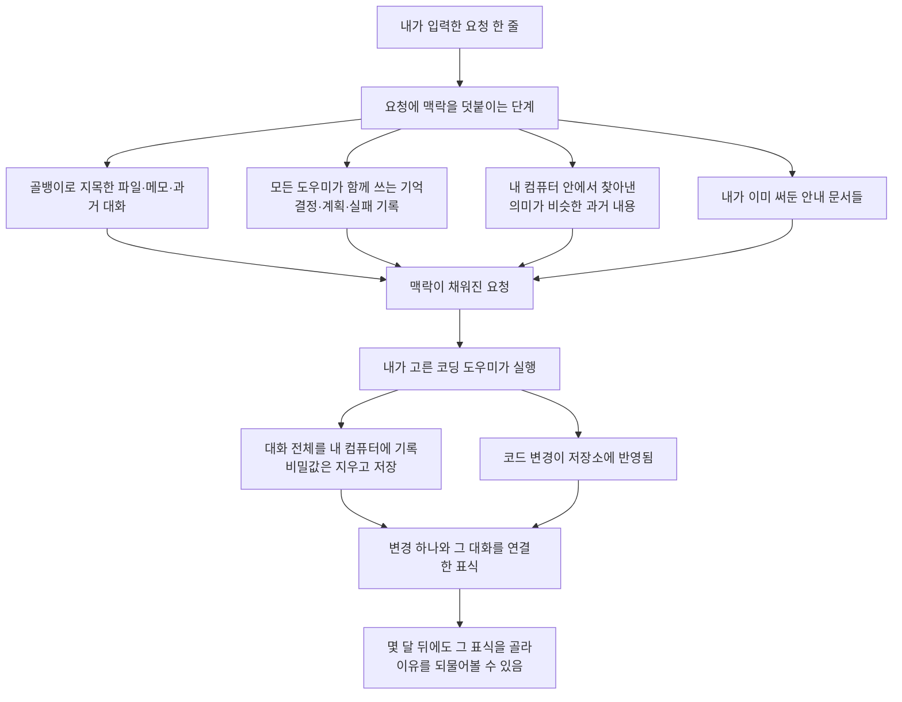

<div class="ai-knowledge-shell">

<aside class="ai-knowledge-sidebar">
  <p class="ai-eyebrow">CATEGORIES</p>
  <nav class="ai-cat-tree"><details class="ai-cat" open><summary><span class="catname">에이전트 오케스트레이션</span><span class="catcount">11</span></summary><ul><li><a href="https://altjs4510.github.io/ai_news_blog/knowledge/20260831-openexecutive-virtual-c-suite/"><span class="kdate">2026-08-31</span><span class="ktitle">Open Executive — 8명의 전문 에이전트를 하나의 임원 목소리로</span></a></li><li><a href="https://altjs4510.github.io/ai_news_blog/knowledge/20260828/"><span class="kdate">2026-08-28</span><span class="ktitle">Google ADK for Python v2.8.0 — RemoteA2aAgent 네이…</span></a></li><li><a href="https://altjs4510.github.io/ai_news_blog/knowledge/20260823/"><span class="kdate">2026-08-23</span><span class="ktitle">The Evolution of the Agent Harness — 하네스가 모델 가중치…</span></a></li><li><a href="https://altjs4510.github.io/ai_news_blog/knowledge/20260805/"><span class="kdate">2026-08-05</span><span class="ktitle">TencentCloud/TencentDB-Agent-Memory — 대화·문서·코드를 …</span></a></li><li><a href="https://altjs4510.github.io/ai_news_blog/knowledge/20260709/"><span class="kdate">2026-07-09</span><span class="ktitle">mvanhorn/last30days-skill — Reddit·X·YouTube·HN·…</span></a></li><li><a href="https://altjs4510.github.io/ai_news_blog/knowledge/20260708/"><span class="kdate">2026-07-08</span><span class="ktitle">Expanding Managed Agents in Gemini API: backgrou…</span></a></li><li><a href="https://altjs4510.github.io/ai_news_blog/knowledge/20260623/"><span class="kdate">2026-06-23</span><span class="ktitle">bytedance/deer-flow — 샌드박스·메모리·서브에이전트·메시지 게이트웨이를…</span></a></li><li><a href="https://altjs4510.github.io/ai_news_blog/knowledge/20260621/"><span class="kdate">2026-06-21</span><span class="ktitle">calesthio/OpenMontage — 12 파이프라인·52 도구·500+ 스킬을 …</span></a></li><li><a href="https://altjs4510.github.io/ai_news_blog/knowledge/20260602/"><span class="kdate">2026-06-02</span><span class="ktitle">revfactory/harness — 도메인별 에이전트 팀과 스킬을 자동 설계하는 메타…</span></a></li><li><a href="https://altjs4510.github.io/ai_news_blog/knowledge/20260529/"><span class="kdate">2026-05-29</span><span class="ktitle">Introducing dynamic workflows in Claude Code</span></a></li><li><a href="https://altjs4510.github.io/ai_news_blog/knowledge/20260507/"><span class="kdate">2026-05-07</span><span class="ktitle">ruvnet/ruflo — Claude 멀티 에이전트 오케스트레이션 플랫폼</span></a></li></ul></details><details class="ai-cat" open><summary><span class="catname">MCP &amp; 도구 통합</span><span class="catcount">17</span></summary><ul><li><a href="https://altjs4510.github.io/ai_news_blog/knowledge/20260829/"><span class="kdate">2026-08-29</span><span class="ktitle">cursor/plugins — 플러그인 명세(specification)와 공식 플러그인…</span></a></li><li><a href="https://altjs4510.github.io/ai_news_blog/knowledge/20260802/"><span class="kdate">2026-08-02</span><span class="ktitle">Stateless MCP has recaptured my interest (and in…</span></a></li><li><a href="https://altjs4510.github.io/ai_news_blog/knowledge/20260801/"><span class="kdate">2026-08-01</span><span class="ktitle">different-ai/openwork — Claude Cowork의 오픈소스 대체 에…</span></a></li><li><a href="https://altjs4510.github.io/ai_news_blog/knowledge/20260731/"><span class="kdate">2026-07-31</span><span class="ktitle">different-ai/openwork — Claude Cowork의 오픈소스 대안(o…</span></a></li><li><a href="https://altjs4510.github.io/ai_news_blog/knowledge/20260729/"><span class="kdate">2026-07-29</span><span class="ktitle">Bringing MCP 2026-07-28 to Claude</span></a></li><li><a href="https://altjs4510.github.io/ai_news_blog/knowledge/20260726/"><span class="kdate">2026-07-26</span><span class="ktitle">citrolabs/ego-lite — 로그인된 브라우저 상태를 AI 에이전트와 공유하는…</span></a></li><li><a href="https://altjs4510.github.io/ai_news_blog/knowledge/20260721/"><span class="kdate">2026-07-21</span><span class="ktitle">tirth8205/code-review-graph — 로컬 우선 코드 인텔리전스 그래프…</span></a></li><li><a href="https://altjs4510.github.io/ai_news_blog/knowledge/20260719/"><span class="kdate">2026-07-19</span><span class="ktitle">tirth8205/code-review-graph — 로컬 우선 코드 인텔리전스 그래프…</span></a></li><li><a href="https://altjs4510.github.io/ai_news_blog/knowledge/20260718/"><span class="kdate">2026-07-18</span><span class="ktitle">tirth8205/code-review-graph — MCP·CLI용 로컬 코드 인텔리…</span></a></li><li><a href="https://altjs4510.github.io/ai_news_blog/knowledge/20260618/"><span class="kdate">2026-06-18</span><span class="ktitle">DeusData/codebase-memory-mcp — 158개 언어 코드베이스를 밀리…</span></a></li><li><a href="https://altjs4510.github.io/ai_news_blog/knowledge/20260606/"><span class="kdate">2026-06-06</span><span class="ktitle">chopratejas/headroom — Compress tool outputs, lo…</span></a></li><li><a href="https://altjs4510.github.io/ai_news_blog/knowledge/20260605/"><span class="kdate">2026-06-05</span><span class="ktitle">chopratejas/headroom — Compress tool outputs, lo…</span></a></li><li><a href="https://altjs4510.github.io/ai_news_blog/knowledge/20260604/"><span class="kdate">2026-06-04</span><span class="ktitle">chopratejas/headroom — Compress tool outputs bef…</span></a></li><li><a href="https://altjs4510.github.io/ai_news_blog/knowledge/20260603/"><span class="kdate">2026-06-03</span><span class="ktitle">How Bad MCP design cost your Agent 5× more token…</span></a></li><li><a href="https://altjs4510.github.io/ai_news_blog/knowledge/20260523/"><span class="kdate">2026-05-23</span><span class="ktitle">colbymchenry/codegraph — 사전 인덱싱된 코드 지식 그래프 MCP</span></a></li><li><a href="https://altjs4510.github.io/ai_news_blog/knowledge/20260517/"><span class="kdate">2026-05-17</span><span class="ktitle">I gave my LLM 100,000+ tools — Lazy Discovery &a…</span></a></li><li><a href="https://altjs4510.github.io/ai_news_blog/knowledge/20260509/"><span class="kdate">2026-05-09</span><span class="ktitle">How to connect 100 MCP servers without the conte…</span></a></li></ul></details><details class="ai-cat" open><summary><span class="catname">코딩 에이전트</span><span class="catcount">32</span></summary><ul><li><a href="https://altjs4510.github.io/ai_news_blog/knowledge/20260903/" class="current"><span class="kdate">2026-09-03</span><span class="ktitle">pacifio/atlas — 여러 코딩 에이전트의 변경을 한곳에서 추적·질의하는 '에이…</span></a></li><li><a href="https://altjs4510.github.io/ai_news_blog/knowledge/20260901/"><span class="kdate">2026-09-01</span><span class="ktitle">affaan-m/ECC — 스킬·본능·메모리·보안을 묶은 에이전트 하네스 성능 최적화 …</span></a></li><li><a href="https://altjs4510.github.io/ai_news_blog/knowledge/20260831-gitnexus-code-knowledge-graph/"><span class="kdate">2026-08-31</span><span class="ktitle">GitNexus — 코드베이스를 지식그래프로 바꿔 에이전트에게 쥐어주기</span></a></li><li><a href="https://altjs4510.github.io/ai_news_blog/knowledge/20260826/"><span class="kdate">2026-08-26</span><span class="ktitle">apache/maka — 도구 호출·권한 결정·종료 이벤트를 append-only 로그…</span></a></li><li><a href="https://altjs4510.github.io/ai_news_blog/knowledge/20260822/"><span class="kdate">2026-08-22</span><span class="ktitle">mattpocock/skills — Skills for Real Engineers (하…</span></a></li><li><a href="https://altjs4510.github.io/ai_news_blog/knowledge/20260820/"><span class="kdate">2026-08-20</span><span class="ktitle">akitaonrails/ai-memory — 코딩 에이전트 CLI의 장기 메모리와 벤더…</span></a></li><li><a href="https://altjs4510.github.io/ai_news_blog/knowledge/20260819/"><span class="kdate">2026-08-19</span><span class="ktitle">akitaonrails/ai-memory — 코딩 에이전트 CLI 간 장기 기억과 벤더…</span></a></li><li><a href="https://altjs4510.github.io/ai_news_blog/knowledge/20260814/"><span class="kdate">2026-08-14</span><span class="ktitle">cathrynlavery/diagram-design — Claude Code용 에디토리…</span></a></li><li><a href="https://altjs4510.github.io/ai_news_blog/knowledge/20260811/"><span class="kdate">2026-08-11</span><span class="ktitle">PrimeIntellect-ai/prime-agent — 장기 자율 실행을 전제로 설계…</span></a></li><li><a href="https://altjs4510.github.io/ai_news_blog/knowledge/20260810/"><span class="kdate">2026-08-10</span><span class="ktitle">Auto mode is now the default in Claude Code for …</span></a></li><li><a href="https://altjs4510.github.io/ai_news_blog/knowledge/20260809/"><span class="kdate">2026-08-09</span><span class="ktitle">PrimeIntellect-ai/prime-agent — 코딩 워크플로우·장기 자율 작…</span></a></li><li><a href="https://altjs4510.github.io/ai_news_blog/knowledge/20260808/"><span class="kdate">2026-08-08</span><span class="ktitle">PrimeIntellect-ai/prime-agent — 코딩 워크플로우와 장시간 자율…</span></a></li><li><a href="https://altjs4510.github.io/ai_news_blog/knowledge/20260804/"><span class="kdate">2026-08-04</span><span class="ktitle">esengine/DeepSeek-Reasonix — prefix-cache 안정성을 축…</span></a></li><li><a href="https://altjs4510.github.io/ai_news_blog/knowledge/20260728/"><span class="kdate">2026-07-28</span><span class="ktitle">alibaba/open-code-review — 결정론적 파이프라인 + LLM 에이전트…</span></a></li><li><a href="https://altjs4510.github.io/ai_news_blog/knowledge/20260725/"><span class="kdate">2026-07-25</span><span class="ktitle">The new rules of context engineering for Claude …</span></a></li><li><a href="https://altjs4510.github.io/ai_news_blog/knowledge/20260722/"><span class="kdate">2026-07-22</span><span class="ktitle">tirth8205/code-review-graph — MCP·CLI용 로컬 우선 코드 …</span></a></li><li><a href="https://altjs4510.github.io/ai_news_blog/knowledge/20260715/"><span class="kdate">2026-07-15</span><span class="ktitle">Dicklesworthstone/destructive_command_guard — 에이…</span></a></li><li><a href="https://altjs4510.github.io/ai_news_blog/knowledge/20260714/"><span class="kdate">2026-07-14</span><span class="ktitle">Graphify-Labs/graphify — 코드베이스를 질의 가능한 지식 그래프로 만…</span></a></li><li><a href="https://altjs4510.github.io/ai_news_blog/knowledge/20260707/"><span class="kdate">2026-07-07</span><span class="ktitle">AI Hero Skills Catalog — 실무 엔지니어를 위한 재사용 가능한 판단 …</span></a></li><li><a href="https://altjs4510.github.io/ai_news_blog/knowledge/20260705/"><span class="kdate">2026-07-05</span><span class="ktitle">openai/codex-plugin-cc — Claude Code에서 Codex를 위임…</span></a></li><li><a href="https://altjs4510.github.io/ai_news_blog/knowledge/20260626/"><span class="kdate">2026-06-26</span><span class="ktitle">google-labs-code/design.md — 코딩 에이전트에게 디자인 시스템을 …</span></a></li><li><a href="https://altjs4510.github.io/ai_news_blog/knowledge/20260619/"><span class="kdate">2026-06-19</span><span class="ktitle">Claude Code now supports artifacts</span></a></li><li><a href="https://altjs4510.github.io/ai_news_blog/knowledge/20260530/"><span class="kdate">2026-05-30</span><span class="ktitle">Leonxlnx/taste-skill — AI에게 좋은 취향을 부여해 generic s…</span></a></li><li><a href="https://altjs4510.github.io/ai_news_blog/knowledge/20260528/"><span class="kdate">2026-05-28</span><span class="ktitle">Building self-improving tax agents with Codex</span></a></li><li><a href="https://altjs4510.github.io/ai_news_blog/knowledge/20260526/"><span class="kdate">2026-05-26</span><span class="ktitle">colbymchenry/codegraph — Pre-indexed code knowle…</span></a></li><li><a href="https://altjs4510.github.io/ai_news_blog/knowledge/20260524/"><span class="kdate">2026-05-24</span><span class="ktitle">colbymchenry/codegraph — Pre-indexed code knowle…</span></a></li><li><a href="https://altjs4510.github.io/ai_news_blog/knowledge/20260521/"><span class="kdate">2026-05-21</span><span class="ktitle">colbymchenry/codegraph — Pre-indexed code knowle…</span></a></li><li><a href="https://altjs4510.github.io/ai_news_blog/knowledge/20260512/"><span class="kdate">2026-05-12</span><span class="ktitle">agentmemory — Persistent memory for AI coding ag…</span></a></li><li><a href="https://altjs4510.github.io/ai_news_blog/knowledge/20260510/"><span class="kdate">2026-05-10</span><span class="ktitle">addyosmani/agent-skills — Production-grade engin…</span></a></li><li><a href="https://altjs4510.github.io/ai_news_blog/knowledge/20260508/"><span class="kdate">2026-05-08</span><span class="ktitle">addyosmani/agent-skills — Production-grade engin…</span></a></li><li><a href="https://altjs4510.github.io/ai_news_blog/knowledge/20260506/"><span class="kdate">2026-05-06</span><span class="ktitle">mksglu/context-mode — AI 코딩 에이전트용 컨텍스트 윈도우 최적화</span></a></li><li><a href="https://altjs4510.github.io/ai_news_blog/knowledge/20260505/"><span class="kdate">2026-05-05</span><span class="ktitle">mattpocock/skills — Skills for Real Engineers (.…</span></a></li></ul></details><details class="ai-cat" open><summary><span class="catname">모델 &amp; 연구</span><span class="catcount">6</span></summary><ul><li><a href="https://altjs4510.github.io/ai_news_blog/knowledge/20260821/"><span class="kdate">2026-08-21</span><span class="ktitle">volcengine/OpenViking — 에이전트 메모리·Knowledge RAG·스…</span></a></li><li><a href="https://altjs4510.github.io/ai_news_blog/knowledge/20260716-proprag/"><span class="kdate">2026-07-16</span><span class="ktitle">PropRAG — 프로포지션 경로 위 beam search로 멀티홉 검색 안내</span></a></li><li><a href="https://altjs4510.github.io/ai_news_blog/knowledge/20260620/"><span class="kdate">2026-06-20</span><span class="ktitle">zai-org/GLM-5 — From Vibe Coding to Agentic Engi…</span></a></li><li><a href="https://altjs4510.github.io/ai_news_blog/knowledge/20260617/"><span class="kdate">2026-06-17</span><span class="ktitle">Predicting model behavior before release by simu…</span></a></li><li><a href="https://altjs4510.github.io/ai_news_blog/knowledge/20260516/"><span class="kdate">2026-05-16</span><span class="ktitle">STALE — 에이전트가 자기 기억의 유효성을 인지할 수 있는가</span></a></li><li><a href="https://altjs4510.github.io/ai_news_blog/knowledge/20260513/"><span class="kdate">2026-05-13</span><span class="ktitle">Thinking Machines' Native Interaction Models — T…</span></a></li></ul></details><details class="ai-cat" open><summary><span class="catname">인프라 &amp; 컴퓨트</span><span class="catcount">8</span></summary><ul><li><a href="https://altjs4510.github.io/ai_news_blog/knowledge/20260813/"><span class="kdate">2026-08-13</span><span class="ktitle">semantica-agi/semantica — 컨텍스트와 책임 추적을 위한 그래프 네이…</span></a></li><li><a href="https://altjs4510.github.io/ai_news_blog/knowledge/20260812/"><span class="kdate">2026-08-12</span><span class="ktitle">semantica-agi/semantica — 컨텍스트와 '책임 추적 가능한(accou…</span></a></li><li><a href="https://altjs4510.github.io/ai_news_blog/knowledge/20260806/"><span class="kdate">2026-08-06</span><span class="ktitle">cloudflare/computer — 에이전트에게 컴퓨터를 통째로 주는 엣지 실행 샌…</span></a></li><li><a href="https://altjs4510.github.io/ai_news_blog/knowledge/20260724/"><span class="kdate">2026-07-24</span><span class="ktitle">diegosouzapw/OmniRoute — 단일 엔드포인트로 278+ 프로바이더·50…</span></a></li><li><a href="https://altjs4510.github.io/ai_news_blog/knowledge/20260723/"><span class="kdate">2026-07-23</span><span class="ktitle">diegosouzapw/OmniRoute — 268+ 프로바이더를 단일 엔드포인트로 묶…</span></a></li><li><a href="https://altjs4510.github.io/ai_news_blog/knowledge/20260611/"><span class="kdate">2026-06-11</span><span class="ktitle">The evolution of agentic surfaces: building with…</span></a></li><li><a href="https://altjs4510.github.io/ai_news_blog/knowledge/20260522/"><span class="kdate">2026-05-22</span><span class="ktitle">Giving Agents Computers — Ivan Burazin, Daytona</span></a></li><li><a href="https://altjs4510.github.io/ai_news_blog/knowledge/20260520/"><span class="kdate">2026-05-20</span><span class="ktitle">New in Claude Managed Agents: self-hosted sandbo…</span></a></li></ul></details><details class="ai-cat" open><summary><span class="catname">보안 &amp; 거버넌스</span><span class="catcount">17</span></summary><ul><li><a href="https://altjs4510.github.io/ai_news_blog/knowledge/20260902/"><span class="kdate">2026-09-02</span><span class="ktitle">AIR raises $50M to help companies vet the skills…</span></a></li><li><a href="https://altjs4510.github.io/ai_news_blog/knowledge/20260827/"><span class="kdate">2026-08-27</span><span class="ktitle">Claude in Chrome is generally available</span></a></li><li><a href="https://altjs4510.github.io/ai_news_blog/knowledge/20260819-mind-viruses/"><span class="kdate">2026-08-19</span><span class="ktitle">탈옥도, 인젝션도 없이 — 대화로만 퍼지는 에이전트의 '마인드 바이러스'</span></a></li><li><a href="https://altjs4510.github.io/ai_news_blog/knowledge/20260730/"><span class="kdate">2026-07-30</span><span class="ktitle">Anatomy of a Frontier Lab Agent Intrusion: A Tec…</span></a></li><li><a href="https://altjs4510.github.io/ai_news_blog/knowledge/20260716/"><span class="kdate">2026-07-16</span><span class="ktitle">Dicklesworthstone/destructive_command_guard — 에이…</span></a></li><li><a href="https://altjs4510.github.io/ai_news_blog/knowledge/20260710/"><span class="kdate">2026-07-10</span><span class="ktitle">70개 MCP 서버 strace 런타임 감사 — 부팅 시 아웃바운드 호출 서버 적발</span></a></li><li><a href="https://altjs4510.github.io/ai_news_blog/knowledge/20260704/"><span class="kdate">2026-07-04</span><span class="ktitle">Cloudflare is about to block AI agents by defaul…</span></a></li><li><a href="https://altjs4510.github.io/ai_news_blog/knowledge/20260703/"><span class="kdate">2026-07-03</span><span class="ktitle">Giving admins more visibility and control over C…</span></a></li><li><a href="https://altjs4510.github.io/ai_news_blog/knowledge/20260630/"><span class="kdate">2026-06-30</span><span class="ktitle">Introducing the Claude apps gateway for Amazon B…</span></a></li><li><a href="https://altjs4510.github.io/ai_news_blog/knowledge/20260625/"><span class="kdate">2026-06-25</span><span class="ktitle">Agent identity in Claude Tag: a new access model…</span></a></li><li><a href="https://altjs4510.github.io/ai_news_blog/knowledge/20260624/"><span class="kdate">2026-06-24</span><span class="ktitle">Agent identity in Claude Tag: a new access model…</span></a></li><li><a href="https://altjs4510.github.io/ai_news_blog/knowledge/20260614/"><span class="kdate">2026-06-14</span><span class="ktitle">NVIDIA/SkillSpector — Security scanner for AI ag…</span></a></li><li><a href="https://altjs4510.github.io/ai_news_blog/knowledge/20260613/"><span class="kdate">2026-06-13</span><span class="ktitle">Fable 5's guardrails got bypassed in 48 hours — …</span></a></li><li><a href="https://altjs4510.github.io/ai_news_blog/knowledge/20260612/"><span class="kdate">2026-06-12</span><span class="ktitle">NVIDIA/SkillSpector — AI 에이전트 스킬용 보안 스캐너</span></a></li><li><a href="https://altjs4510.github.io/ai_news_blog/knowledge/20260607/"><span class="kdate">2026-06-07</span><span class="ktitle">OpenAI Help: Lockdown Mode</span></a></li><li><a href="https://altjs4510.github.io/ai_news_blog/knowledge/20260531/"><span class="kdate">2026-05-31</span><span class="ktitle">How we contain Claude across products</span></a></li><li><a href="https://altjs4510.github.io/ai_news_blog/knowledge/20260527/"><span class="kdate">2026-05-27</span><span class="ktitle">Microsoft Copilot Cowork Exfiltrates Files</span></a></li></ul></details><details class="ai-cat" open><summary><span class="catname">응용 사례</span><span class="catcount">4</span></summary><ul><li><a href="https://altjs4510.github.io/ai_news_blog/knowledge/20260717/"><span class="kdate">2026-07-17</span><span class="ktitle">After a year building agent memory, 'save everyt…</span></a></li><li><a href="https://altjs4510.github.io/ai_news_blog/knowledge/20260712/"><span class="kdate">2026-07-12</span><span class="ktitle">Do Automated Evals Work?</span></a></li><li><a href="https://altjs4510.github.io/ai_news_blog/knowledge/20260609/"><span class="kdate">2026-06-09</span><span class="ktitle">Building intelligent apps for Apple platforms wi…</span></a></li><li><a href="https://altjs4510.github.io/ai_news_blog/knowledge/20260514/"><span class="kdate">2026-05-14</span><span class="ktitle">Introducing Claude for Small Business</span></a></li></ul></details><details class="ai-cat" open><summary><span class="catname">산업 동향</span><span class="catcount">9</span></summary><ul><li><a href="https://altjs4510.github.io/ai_news_blog/knowledge/20260830/"><span class="kdate">2026-08-30</span><span class="ktitle">[AINews] OpenAI shuts off Cursor — 프론티어 모델 공급 차단…</span></a></li><li><a href="https://altjs4510.github.io/ai_news_blog/knowledge/20260711/"><span class="kdate">2026-07-11</span><span class="ktitle">OpenAI says GPT 5.6 is the 'preferred model' for…</span></a></li><li><a href="https://altjs4510.github.io/ai_news_blog/knowledge/20260702/"><span class="kdate">2026-07-02</span><span class="ktitle">How Cursor deploys AI inside the enterprise (For…</span></a></li><li><a href="https://altjs4510.github.io/ai_news_blog/knowledge/20260701/"><span class="kdate">2026-07-01</span><span class="ktitle">Google OKF (Open Knowledge Format) — 벤더 중립 에이전트 …</span></a></li><li><a href="https://altjs4510.github.io/ai_news_blog/knowledge/20260616/"><span class="kdate">2026-06-16</span><span class="ktitle">Why AI hasn't replaced software engineers, and w…</span></a></li><li><a href="https://altjs4510.github.io/ai_news_blog/knowledge/20260610/"><span class="kdate">2026-06-10</span><span class="ktitle">Fable 5 just made cost-aware model routing manda…</span></a></li><li><a href="https://altjs4510.github.io/ai_news_blog/knowledge/20260519/"><span class="kdate">2026-05-19</span><span class="ktitle">Anthropic acquires Stainless</span></a></li><li><a href="https://altjs4510.github.io/ai_news_blog/knowledge/20260515/"><span class="kdate">2026-05-15</span><span class="ktitle">Clawdmeter — Claude Code 사용량을 데스크톱 대시보드로</span></a></li><li><a href="https://altjs4510.github.io/ai_news_blog/knowledge/20260504/"><span class="kdate">2026-05-04</span><span class="ktitle">Agents for Everything Else: Codex for Knowledge …</span></a></li></ul></details></nav>
</aside>

<article class="ai-knowledge-article">

<header class="ai-post-hero">
  <p class="ai-eyebrow"><a class="ai-back" href="../">KNOWLEDGE</a> · 2026-09-03 · 오늘의 학습</p>
  <h2 class="ai-post-title">pacifio/atlas — 여러 코딩 에이전트의 변경을 한곳에서 추적·질의하는 '에이전트용 소스 컨트롤' (Rust, 하루 895 stars)</h2>
</header>

> 원문: [pacifio/atlas — 여러 코딩 에이전트의 변경을 한곳에서 추적·질의하는 '에이전트용 소스 컨트롤' (Rust, 하루 895 stars)](https://github.com/pacifio/atlas)

## 📌 학습 정리

### 1. 한 줄로 말하면

여러 AI 코딩 도우미가 같은 코드를 고칠 때, 누가 무엇을 왜 바꿨는지를 나중에도 물어볼 수 있게 기록해 두는 작업 기록장입니다. 코드 자체의 변경 이력만이 아니라, 그 변경을 만들어낸 대화까지 함께 붙잡아 둡니다.

### 2. 왜 이게 만들어졌어요?

요즘은 코드의 상당 부분을 사람이 아니라 AI 코딩 도우미가 씁니다. 그런데 결과물인 코드만 저장소에 남고, "왜 이렇게 고쳤는지"는 터미널 화면이 스크롤되는 순간 사라져 버립니다. 게다가 도우미마다 기억이 따로 놀아서, 한 도우미와 한참 얘기해 정리한 결정 사항이 다른 도우미로 옮겨가는 순간 처음부터 다시 설명해야 합니다. 참고할 맥락이 담긴 파일들도 프로젝트 곳곳에 흩어져 있어서, 어떤 도우미는 이걸 읽고 어떤 도우미는 저걸 읽는 식으로 제각각이었고요. Atlas는 이 세 가지 — 사라지는 이유, 끊기는 기억, 흩어진 맥락 — 를 한 자리에 모아 두려는 시도입니다.

### 3. 비유로 풀면

이건 마치 **병원 진료 기록** 같은 거예요. 검사 결과지(코드 변경)만 남기는 게 아니라, 어떤 증상으로 왔고 의사가 무엇을 물었고 왜 그 처방을 내렸는지까지 한 묶음으로 차트에 남기는 것이죠. 그리고 다음에 다른 의사를 만나도 그 차트를 그대로 넘겨받으니, 환자가 자기 병력을 처음부터 설명할 필요가 없습니다.

그래서 결국, Atlas는 "무엇이 바뀌었나"만 남는 기존 이력에 "누구의 도우미가, 어떤 요청을 받고, 어떤 판단으로 바꿨나"를 붙여서 나중에 되물을 수 있게 만들고, 그 기록을 도우미들이 공유하게 합니다.

### 4. 어떻게 작동하는지 (그림으로)



흐름의 핵심은 요청이 도우미에게 도착하기 *전에* 맥락을 붙이고, 도우미가 일한 *뒤에* 그 과정을 기록으로 남긴다는 두 갈래입니다. 코드 변경이 저장소에 반영되면 그 변경과 방금의 대화를 이어 붙인 표식이 만들어지고, 이 표식은 나중에 이력을 정리하거나 합쳐도 다시 연결되도록 되어 있습니다. 그리고 정말로 애매해서 어느 대화와 짝지어야 할지 알 수 없는 경우에는 억지로 추측하지 않고 연결을 끊어 두는 쪽을 택합니다.

### 5. 처음 보는 용어 풀이

- **코딩 도우미 (coding agent)** — 사람의 요청을 받아 코드를 직접 읽고 고치는 AI 프로그램입니다. Claude Code, Codex 같은 것들이 여기 해당하고, Atlas는 이들을 그대로 불러와 나란히 돌립니다.
- **변경 표식 (checkpoint)** — 코드 변경 한 건과 그것을 만들어낸 대화(요청, 도구 호출, 판단 근거)를 하나로 묶어 둔 기록입니다. 커밋만 봐서는 알 수 없는 "왜"를 나중에 되찾기 위한 장치예요.
- **소스 컨트롤 (source control)** — 코드가 언제 어떻게 바뀌었는지를 차곡차곡 저장해 두는 방식으로, Git이 대표적입니다. Atlas는 여기에 "어떤 도우미가 왜"라는 층을 얹었다고 보면 됩니다.
- **공유 기억 (shared agent memory)** — 어떤 도우미가 내린 결정이나 계획, 실패 경험을 다른 도우미도 읽을 수 있게 모아 둔 저장소입니다. 원래는 도우미마다 자기 기록만 볼 수 있어서 서로의 히스토리를 참조할 방법이 없었습니다.
- **골뱅이 지목 (@ mentions)** — 요청문 안에 `@`를 붙여 파일, 폴더, 메모, 논문, 과거 대화 같은 것을 콕 집어 넣는 방식입니다. 큰 파일은 내용을 통째로 붙여넣는 대신 위치만 알려줘서, 대화 공간을 잡아먹지 않게 합니다.
- **기기 안에서 처리 (local / on-device)** — 코드와 메모, 대화 기록이 인터넷으로 올라가지 않고 내 컴퓨터에 남는다는 뜻입니다. 검색을 위해 문장의 의미를 숫자로 바꾸는 계산도 기기 안에서 이뤄지고, 팀과 공유하고 싶을 때만 따로 로그인해 켜는 구조입니다.
- **에이전트 연결 규약 (ACP)** — 여러 회사의 코딩 도우미를 같은 방식으로 불러 쓰기 위한 공통 통신 약속입니다. 이 규약을 따르는 도우미라면 Atlas가 목록에서 골라 실행할 수 있습니다.
- **잠금 없는 저장 형식** — 메모는 일반 텍스트 문서, 작업판은 구조화된 텍스트 파일, 대화 기록은 한 줄에 한 건씩 쌓인 파일로 남깁니다. Atlas를 닫고 다른 편집기로 열어도 그대로 읽히고, 예외는 "어떤 대화가 어떤 변경을 만들었나"를 빠르게 조회하기 위한 작은 데이터베이스 하나뿐입니다.

### 6. 한 발 더 들어가고 싶다면

- [github.com/pacifio/atlas](https://github.com/pacifio/atlas) — 저장소 본체입니다. 직접 빌드해 보거나 구조를 들여다보고 싶을 때 출발점이에요.
- [docs.tryatlas.cc](https://docs.tryatlas.cc) — 변경 표식, 공유 기억, 기술 문서 등 기능별 설명이 정리돼 있어 개념을 더 자세히 볼 수 있습니다.
- [tryatlas.cc](https://tryatlas.cc) — 설치 파일을 받는 곳입니다. 지원되는 환경은 macOS이고, 다른 운영체제는 같은 코드로 만들 수는 있지만 검증되지 않은 상태라고 밝히고 있어요.
- [github.com/pacifio/atlas/issues](https://github.com/pacifio/atlas/issues) — 실제로 쓰다 막힌 사람들의 질문과 문제가 쌓이는 곳이라, 도입 전에 어떤 한계가 있는지 가늠하기 좋습니다.
- [discord.gg/GmnFggaPfP](https://discord.gg/GmnFggaPfP) — 개발 관련 질문이나 기능 제안이 오가는 커뮤니티 채널입니다.

---

## 📖 원문 전체 번역 (정독용)

> 의역 최소화한 전체 번역입니다. 큰 흐름은 위 정리에서 잡고, 정확한 워딩이 필요할 땐 이 섹션에서 정독하세요.

Download · Discord · Docs · Contributing · Issues

## Atlas

Atlas는 코딩 에이전트를 위한 소스 컨트롤이다. 모든 에이전트 실행은 체크포인트를 만든다: 커밋은 그 커밋을 만든 세션과 함께, 프롬프트·툴 호출·추론 과정과 연결되어 되돌아본다. 어떤 에이전트가 정확히 무엇을, 왜 했는지 알 수 있다.

Claude Code, Codex, Atlas 자체 에이전트, 또는 ACP 레지스트리의 무엇이든 같은 코드베이스에 대해 나란히 실행할 수 있고, 공유 메모리가 있어서 작업 도중 에이전트를 바꿔도 처음부터 다시 시작할 필요가 없다.

**모든 커밋을, 설명과 함께.**
체크포인트는 커밋을 그 커밋을 만든 세션과 연결한다: 프롬프트, 툴 호출, 파일 변경이 함께 보관되어 몇 달 뒤에도 질의할 수 있다.

**어떤 에이전트든, 나란히 실행.**
Claude Code, Codex, Atlas 자체 에이전트, 그리고 더 넓은 ACP 레지스트리까지 모두 같은 창에서, 같은 코드베이스를 대상으로 실행된다. 작업 도중 에이전트를 바꿔도 처음부터 다시 시작할 필요가 없다.

**하나의 메모리, 모든 에이전트.**
Claude Code가 내린 결정은 Codex의 다음 프롬프트에도 나타난다. 계획, 파일 변경, 실패, 아키텍처 노트가 자동으로 공유되며, 온디바이스에서 당신이 묻는 것과 매칭된다.

**당신의 노트가 에이전트 컨텍스트가 된다.**
`.atlas/knowledge/` 안의 마크다운, 그리고 이미 작성해둔 `CLAUDE.md`와 `AGENTS.md`가 프로젝트 내 모든 에이전트에 공급된다.

**`@`로 무엇이든 프롬프트에 넣기.**
파일, 폴더, 심볼, 브랜치, 커밋, 노트, 논문, 과거 세션이 프롬프트가 전송되기 전에 로컬에서 해석(resolve)된다.

**기본적으로 로컬.**
코드, 노트, 세션은 당신의 머신에 남는다. 팀 단위로 동기화하고 싶을 때만 로그인하여 조직(organisation)을 만들면 된다.

Join the Discord · #general 채팅 · #dev 빌드 질문 · #feature-requests 아이디어 · #bugs 버그 신고

변경 사항을 보내려면 `CONTRIBUTING.md`부터 시작하거나, 무엇이든 문제가 생기면 issue를 열어라.

### 목차
- Why Atlas
- How it works
- Checkpoints
- Features
- Download
- Build from source
- Contributing
- Local by default
- Links

## Why Atlas

에이전트는 이제 코드의 상당 부분을 작성하면서도 그 배후의 추론은 하나도 남기지 않는다. Atlas는 둘 다 기록하고, 질의 가능하게 만든다: 무엇이 바뀌었는지, 어느 에이전트에 의해서인지, 어느 시점에 그랬는지.

**에이전트는 매 세션 처음부터 시작한다.**
Atlas는 결정, 계획, 변경 사항에 대한 영속적인 온디바이스 메모리를 유지하며, 관련 부분을 매 턴마다 밀어 넣는다.

**에이전트를 바꾸면 맥락(thread)을 잃는다.**
새 세션의 첫 메시지에는 정제된 사실 팩(fact pack)과 마지막 세션의 말미가 실려 오는데, 그 세션이 다른 에이전트에서 실행된 것이었더라도 마찬가지다.

**볼 수 없는 것은 검토할 수 없다.**
모든 세션이 저장되고 검색 가능하며, 실제 커밋 그래프와 실제로 반영된 파일 단위 diff와 나란히 놓인다.

**컨텍스트가 열 군데에 흩어져 산다.**
지식 베이스, `CLAUDE.md`, `AGENTS.md`, Claude Code의 메모리 파일, Codex의 히스토리가 모든 에이전트가 읽는 하나의 인덱스로 합쳐진다.

**아무것도 갇혀 있지 않다(lock-in 없음).**
노트는 마크다운이고, 캔버스는 JSON이고, 세션은 JSONL이며, 에디터는 디스크 위의 파일이다. Atlas를 닫고 vim에서 이어서 작업할 수 있다. 유일한 예외는 체크포인트 레코드(어떤 에이전트 세션이 어떤 커밋을 만들었는지)인데, 이는 프로젝트의 gitignore 대상인 `.atlas/` 안에 SQLite로 저장된다. 읽히는 게 아니라 질의되는 데이터이기 때문이다.

**밑바닥부터 에이전트를 위해 구축.**
에이전트 런타임, 공유 메모리, 세션 히스토리가 나머지 앱이 그 위에 세워지는 토대다.

## How it works

Atlas는 당신의 에이전트를 있는 그대로 실행하면서, 에이전트가 보는 것을 풍부하게 만든다.

Claude Code와 Codex는 가장 많이 쓰이고 가장 많이 테스트된 경로인 **ACP**를 통해 외부 서브프로세스로 실행된다. Atlas 에이전트는 우리의 Rust 에이전트 프레임워크인 **Cersei** 위에서 인프로세스(in-process)로 실행된다.

그 외에도 Atlas는 ACP 레지스트리에 있는 어떤 에이전트든(Cursor, OpenCode, Kilo Code 등) 각각의 공식 바이너리를 자동으로 끌어와 실행할 수 있다. 이들 모두 동일한 전송 경로(send path)를 거치므로, 아래 내용은 어떤 것을 선택하든 동일하게 적용된다.

> **참고**: 레지스트리의 롱테일 에이전트들에 대한 QA는 진행 중이다.

당신의 메시지가 에이전트에 도달하기 전에, Atlas는 그 주변에 컨텍스트를 조립한다:

| 주입되는 것 | 출처 | 시점 |
|---|---|---|
| `@` 멘션 | 프롬프트가 전송되기 전에 Rust로 로컬에서 해석됨. 노트, 스킬, 논문, 과거 세션은 그대로 인라인되고; 파일과 폴더는 경로로 해석됨 | 매 턴 |
| 공유 에이전트 메모리 | 어떤 에이전트든 작성한 활성 계획, 결정, 파일 변경, 실패, 아키텍처 노트 | 매 턴 |
| 시맨틱 매칭 | 당신의 메시지가 온디바이스에서 임베딩되어 프로젝트의 메모리 인덱스와 매칭됨 | 매 턴 |
| 세션 인계(handoff) | 정제된 사실 팩과, 이 프로젝트에서의 마지막 세션의 말미(다른 에이전트의 것 포함) | 첫 메시지 |
| 당신이 이미 작성한 것 | 지식 노트, `CLAUDE.md`, `AGENTS.md`, Claude Code의 메모리 파일, Codex의 히스토리가 하나의 인덱스로 합쳐짐 | 계속(continuously) |

**하나의 경로, 에이전트별 특수 처리 없음.**
기존의 Claude Code나 Codex 구독을 Atlas를 통해 실행하면, 작업 방식은 그대로인 채로 세션이 더 많은 컨텍스트를 얻는다.

**Claude Code의 메모리가 Codex에 보이고, 그 반대도 마찬가지다.**
어느 쪽 에이전트도 혼자서는 다른 쪽의 히스토리를 읽을 수 없다.

**폴더는 붙여넣기가 아니라 포인터로 해석된다.**
5000줄짜리 파일을 `@`하면 에이전트가 필요할 때 읽는 경로 하나가 전송되므로, 한 번의 멘션이 세션 나머지 동안 컨텍스트 윈도우를 점유하지 않는다.

**임베딩은 당신의 머신에서 실행된다.**
검색(retrieval)은 절대 기기를 벗어나지 않는다.

## Checkpoints

체크포인트는 커밋 자체만으로는 알 수 없는 것—어떤 세션이 그 커밋을 만들었는지, 에이전트가 무엇을 요청받았는지, 어떤 툴 호출을 했는지, 그 변경의 배후 추론이 무엇이었는지—을 담아, 터미널이 스크롤되는 순간 사라지는 대신 함께 보관해 둔 것이다.

Atlas는 모든 에이전트 세션을 로컬 `.atlas/sessions.db`에 기록하며, 어떤 것이든 디스크에 닿기 전에 비밀 정보(secrets)는 제거된다. 커밋할 때(어떤 툴에서든, Atlas가 닫혀 있어도), 그 커밋은 이를 만든 세션과 체크포인트로 다시 연결되며, 그 연결은 리베이스와 amend를 거쳐도 유지된다.

원본 트랜스크립트를 읽지 않아도 컨텍스트를 되찾을 수 있다: 체크포인트를 선택해서 직접 대화하면, 그 세션에서 실제로 일어난 일을 바탕으로 답한다. 로컬 모드는 계정 없이 완전히 오프라인으로 동작한다.

## Features

### Agents

| 기능 | 설명 | 링크 |
|---|---|---|
| 멀티 에이전트 세션 | Claude Code, Codex, 그리고 Atlas의 네이티브 에이전트를 세션별로 선택할 수 있고, 탭 전반에 걸쳐 병렬로 실행된다. 세션은 탭과 독립적이라, 전환해도 진행 중인 실행이 끊기지 않는다 | Chat & Sessions |
| 공유 에이전트 메모리 | 모든 에이전트가 읽고 쓰는 온디바이스 시맨틱 인덱스(로컬 임베딩, HNSW 검색) | Memory |
| @ 멘션 | 파일, 폴더, 심볼, 브랜치, 커밋, 노트, 스킬, 논문, 과거 세션의 로컬 해석 | Chat & Sessions |
| Skills | 전역 또는 프로젝트별로 범위가 지정되는 SKILL.md 파일, 그 에이전트 고유의 skills 디렉토리에 심링크되어 에이전트별로 활성화됨 | Skills |
| Packs | skills.sh 인덱스를 통해 발견되는 스킬·서브에이전트·명령·훅·스크립트 모음이 담긴 GitHub 레포를 설치 | Skills |
| 모델 채팅 | 에이전트 루프 없이 모델과 그 자체 탭에서 직접 대화 | Chat & Sessions |
| Organisations | 로그인하여 조직을 만들고 기기·팀원 간 동기화 | Organisations |

### Agent history

| 기능 | 설명 |
|---|---|
| 세션 캡처 | 모든 세션이 `.atlas/sessions.db`에 기록됨: 프롬프트, 메시지, 툴 호출, 각각이 건드린 파일, 적용한 패치 |
| Checkpoints | 각 세션이 그것이 만들어낸 커밋과 연결됨. 커밋은 가로채는(intercept) 것이 아니라 관찰(observe)되므로, 터미널에서, 다른 에디터에서, 또는 Atlas가 닫혀 있는 동안 만들어진 커밋도 자신의 세션을 여전히 찾아낸다 |
| 히스토리 재작성에도 유지됨 | 링크는 패치 ID 조정(patch-id reconciliation)을 통해 amend와 rebase를 거쳐도 다시 이어진다. squash로 인해 링크가 정말로 모호해지면, 추측하는 대신 고아(orphan) 상태로 남긴다 |
| 트랜스크립트 임포트 | 기존 Claude Code 히스토리를 소급 채워 넣어(backfill), 기록이 Atlas를 설치하기 이전부터 시작하게 한다 |
| 기록 시 비밀 정보 제거 | 무엇이든 영속화되기 전에 리댁션(redaction)이 실행되므로, 로컬 저장소 자체가 유출 위험이 되는 일이 없다 |
| 캡처 상태(health) | 워크스페이스별 신호 하나 — OK, Degraded, Stopped 각각에 이유와 다음 조치가 함께 표시됨 |
| Mission control | 에이전트 활동 대시보드: 시간에 따른 사용량, 소비 내역 분석, 타임라인, 필터링 가능한 로그 테이블 |

계정도 네트워크도 없이 동작한다.

### The workspace

| 기능 | 설명 | 링크 |
|---|---|---|
| Editor | CodeMirror 편집 화면, 프로젝트별 에디터 상태는 재시작해도 복원됨 | Editor |
| Git | 레인 배정이 있는 실제 커밋 그래프, stage/unstage/commit, 브랜치 작업, 파일 단위 diff | Git & Diff |
| Terminal | 각 명령이 자신의 출력·종료 코드·소요 시간을 함께 갖는 블록 터미널, 그리고 `vim`, `htop` 등을 위한 완전한 인터랙티브 화면 | Terminal |
| Knowledge base | `.atlas/knowledge/` 안의 순수 마크다운 노트, 코드와 나란히 버전 관리되며, 백링크·링크 그래프·HTML 또는 독립 실행 서버 바이너리로의 export 지원 | Knowledge base |
| Research | arXiv와 Semantic Scholar 검색, 논문을 가져와 앱 안에서 읽고, `@`로 프롬프트에 멘션 | Research |
| Browser | 실제 로그인, 쿠키, 리더 모드를 갖춘 탭 안의 네이티브 WebKit 웹뷰 | Explorer |
| Spaces | 노트와 그 연결 관계를 위한 공간형 보드, 프로젝트 안에 JSON으로 저장됨 | Chat & Sessions |
| Split view | 각자 자신의 탭을 가진 최대 3개의 크기 조절 가능한 컬럼 | Editor |
| Activity log | 프로젝트 내 모든 주요 이벤트, 필터링 가능, 재시작해도 고정할 수 있는 행(row) | Timeline |

## Download

`tryatlas.cc` 또는 releases 페이지에서 최신 `.dmg`를 받아라.

> **참고**: macOS가 지원 플랫폼이다.

## Build from source

> **참고**: Linux와 Windows는 동일한 Tauri 코드베이스로 빌드되지만 테스트되지 않았다.

Claude Code 에이전트를 사용하려면 `claude` CLI를 설치하고 `PATH`에 넣어라. Atlas의 네이티브 에이전트는 외부 CLI가 필요 없다.

Bun, Rust(stable, `rustup` 경유), Xcode Command Line Tools가 필요하다.

**Linux 시스템 의존성**(GTK 3, WebKit2GTK 4.1, GLib 헤더)

Debian / Ubuntu / Linux Mint:
```
sudo apt install -y libglib2.0-dev libgtk-3-dev libwebkit2gtk-4.1-dev
```

Fedora / RHEL:
```
sudo dnf install glib2-devel gtk3-devel webkit2gtk4.1-devel
```

Arch Linux / Manjaro:
```
sudo pacman -S glib2 gtk3 webkit2gtk-4.1
```

openSUSE:
```
sudo zypper install glib2-devel gtk3-devel webkit2gtk3-devel
```

```
git clone https://github.com/pacifio/atlas
cd atlas
bun install
bun run dev:app
```

첫 Rust 컴파일은 몇 분 걸린다; 그 이후로는 몇 초면 된다. 프런트엔드 전용 반복 작업에는 `bun run dev`를 쓰되, `invoke()`를 호출하는 것은 무엇이든 `dev:app`이 필요하다.

프로덕션 빌드:
```
bun run build:app        # .app 번들
bun run build:app:dmg     # .app + .dmg 설치 파일
```

## Contributing

`CONTRIBUTING.md`를 참고하라. 사람들이 흔히 걸리는 지점 하나: **기능 작업은 `main`이 아니라 현재 버전 브랜치를 타겟으로 한다.** `main`은 완성된 버전 브랜치만 받고, 그 머지가 곧 릴리스다.

`ARCHITECTURE.md`는 Atlas가 어떻게 구축되어 있는지를 다룬다. `SECURITY.md`는 취약점 신고를 다룬다.

## Local by default

당신의 코드, 노트, 세션은 당신의 머신에 남는다. 에이전트를 실행하기 위해 업로드되는 것은 아무것도 없다.

**비밀 정보는 디스크에 무엇이든 기록되기 전에 제거된다.** 업로드 전이 아니라, 영속화(persistence) 전이다.

**세션 캡처는 기본적으로 로컬 전용이다.** 당신의 에이전트 세션에 대한 Checkpoints 기록은 당신의 머신 위 `.atlas/sessions.db`에 기록되며 그곳에 머문다. 계정이 필요 없고, 당신이 명시적으로 동기화에 옵트인(opt-in)하기 전까지는 어디로도 전송되지 않는다.

**계정은 옵트인이다.** 조직을 만들고 기기·팀원 간에 동기화하려면 로그인하라.

**익명 사용 분석은 기본적으로 켜져 있다.** 대략적인 메타데이터일 뿐, 코드나 프롬프트는 절대 포함되지 않는다. 무엇이 수집되는지, 어떻게 끄는지는 별도 문서 참조.

## Links

- Website: tryatlas.cc
- Docs: docs.tryatlas.cc
- Discord: discord.gg/GmnFggaPfP
- Issues: github.com/pacifio/atlas/issues
- Telemetry: Atlas가 무엇을 수집하는지, 어떻게 끄는지

## Contributors

## License

MIT. `LICENSE` 참고.

</article>

</div>

<!-- ai-related-links -->
<aside class="ai-related-links">
  <p class="ai-eyebrow">관련 학습</p>
  <ul><li><a href="https://altjs4510.github.io/ai_news_blog/knowledge/20260618/"><span class="kdate">2026-06-18</span><span class="ktitle">DeusData/codebase-memory-mcp — 158개 언어 코드베이스를 밀리…</span></a></li><li><a href="https://altjs4510.github.io/ai_news_blog/knowledge/20260714/"><span class="kdate">2026-07-14</span><span class="ktitle">Graphify-Labs/graphify — 코드베이스를 질의 가능한 지식 그래프로 만…</span></a></li><li><a href="https://altjs4510.github.io/ai_news_blog/knowledge/20260521/"><span class="kdate">2026-05-21</span><span class="ktitle">colbymchenry/codegraph — Pre-indexed code knowle…</span></a></li></ul>
</aside>
<!-- /ai-related-links -->
