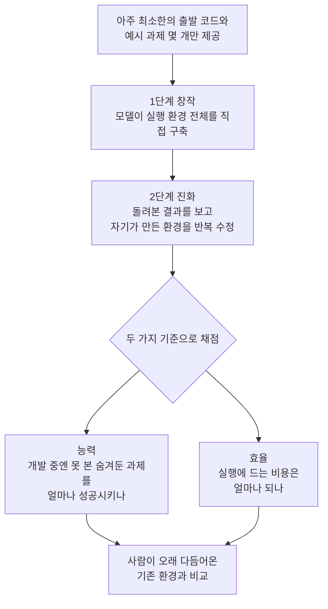

<aside class="ai-knowledge-sidebar">
  
CATEGORIES

  <nav class="ai-cat-tree">

에이전트 오케스트레이션12
<ul><li><a href="https://altjs4510.github.io/ai_news_blog/knowledge/20260904/" class="current">2026-09-04HarnessDev: Can LLMs Create and Evolve Their Own…</a></li><li><a href="https://altjs4510.github.io/ai_news_blog/knowledge/20260831-openexecutive-virtual-c-suite/">2026-08-31Open Executive — 8명의 전문 에이전트를 하나의 임원 목소리로</a></li><li><a href="https://altjs4510.github.io/ai_news_blog/knowledge/20260828/">2026-08-28Google ADK for Python v2.8.0 — RemoteA2aAgent 네이…</a></li><li><a href="https://altjs4510.github.io/ai_news_blog/knowledge/20260823/">2026-08-23The Evolution of the Agent Harness — 하네스가 모델 가중치…</a></li><li><a href="https://altjs4510.github.io/ai_news_blog/knowledge/20260805/">2026-08-05TencentCloud/TencentDB-Agent-Memory — 대화·문서·코드를 …</a></li><li><a href="https://altjs4510.github.io/ai_news_blog/knowledge/20260709/">2026-07-09mvanhorn/last30days-skill — Reddit·X·YouTube·HN·…</a></li><li><a href="https://altjs4510.github.io/ai_news_blog/knowledge/20260708/">2026-07-08Expanding Managed Agents in Gemini API: backgrou…</a></li><li><a href="https://altjs4510.github.io/ai_news_blog/knowledge/20260623/">2026-06-23bytedance/deer-flow — 샌드박스·메모리·서브에이전트·메시지 게이트웨이를…</a></li><li><a href="https://altjs4510.github.io/ai_news_blog/knowledge/20260621/">2026-06-21calesthio/OpenMontage — 12 파이프라인·52 도구·500+ 스킬을 …</a></li><li><a href="https://altjs4510.github.io/ai_news_blog/knowledge/20260602/">2026-06-02revfactory/harness — 도메인별 에이전트 팀과 스킬을 자동 설계하는 메타…</a></li><li><a href="https://altjs4510.github.io/ai_news_blog/knowledge/20260529/">2026-05-29Introducing dynamic workflows in Claude Code</a></li><li><a href="https://altjs4510.github.io/ai_news_blog/knowledge/20260507/">2026-05-07ruvnet/ruflo — Claude 멀티 에이전트 오케스트레이션 플랫폼</a></li></ul>

MCP &amp; 도구 통합17
<ul><li><a href="https://altjs4510.github.io/ai_news_blog/knowledge/20260829/">2026-08-29cursor/plugins — 플러그인 명세(specification)와 공식 플러그인…</a></li><li><a href="https://altjs4510.github.io/ai_news_blog/knowledge/20260802/">2026-08-02Stateless MCP has recaptured my interest (and in…</a></li><li><a href="https://altjs4510.github.io/ai_news_blog/knowledge/20260801/">2026-08-01different-ai/openwork — Claude Cowork의 오픈소스 대체 에…</a></li><li><a href="https://altjs4510.github.io/ai_news_blog/knowledge/20260731/">2026-07-31different-ai/openwork — Claude Cowork의 오픈소스 대안(o…</a></li><li><a href="https://altjs4510.github.io/ai_news_blog/knowledge/20260729/">2026-07-29Bringing MCP 2026-07-28 to Claude</a></li><li><a href="https://altjs4510.github.io/ai_news_blog/knowledge/20260726/">2026-07-26citrolabs/ego-lite — 로그인된 브라우저 상태를 AI 에이전트와 공유하는…</a></li><li><a href="https://altjs4510.github.io/ai_news_blog/knowledge/20260721/">2026-07-21tirth8205/code-review-graph — 로컬 우선 코드 인텔리전스 그래프…</a></li><li><a href="https://altjs4510.github.io/ai_news_blog/knowledge/20260719/">2026-07-19tirth8205/code-review-graph — 로컬 우선 코드 인텔리전스 그래프…</a></li><li><a href="https://altjs4510.github.io/ai_news_blog/knowledge/20260718/">2026-07-18tirth8205/code-review-graph — MCP·CLI용 로컬 코드 인텔리…</a></li><li><a href="https://altjs4510.github.io/ai_news_blog/knowledge/20260618/">2026-06-18DeusData/codebase-memory-mcp — 158개 언어 코드베이스를 밀리…</a></li><li><a href="https://altjs4510.github.io/ai_news_blog/knowledge/20260606/">2026-06-06chopratejas/headroom — Compress tool outputs, lo…</a></li><li><a href="https://altjs4510.github.io/ai_news_blog/knowledge/20260605/">2026-06-05chopratejas/headroom — Compress tool outputs, lo…</a></li><li><a href="https://altjs4510.github.io/ai_news_blog/knowledge/20260604/">2026-06-04chopratejas/headroom — Compress tool outputs bef…</a></li><li><a href="https://altjs4510.github.io/ai_news_blog/knowledge/20260603/">2026-06-03How Bad MCP design cost your Agent 5× more token…</a></li><li><a href="https://altjs4510.github.io/ai_news_blog/knowledge/20260523/">2026-05-23colbymchenry/codegraph — 사전 인덱싱된 코드 지식 그래프 MCP</a></li><li><a href="https://altjs4510.github.io/ai_news_blog/knowledge/20260517/">2026-05-17I gave my LLM 100,000+ tools — Lazy Discovery &a…</a></li><li><a href="https://altjs4510.github.io/ai_news_blog/knowledge/20260509/">2026-05-09How to connect 100 MCP servers without the conte…</a></li></ul>

코딩 에이전트32
<ul><li><a href="https://altjs4510.github.io/ai_news_blog/knowledge/20260903/">2026-09-03pacifio/atlas — 여러 코딩 에이전트의 변경을 한곳에서 추적·질의하는 '에이…</a></li><li><a href="https://altjs4510.github.io/ai_news_blog/knowledge/20260901/">2026-09-01affaan-m/ECC — 스킬·본능·메모리·보안을 묶은 에이전트 하네스 성능 최적화 …</a></li><li><a href="https://altjs4510.github.io/ai_news_blog/knowledge/20260831-gitnexus-code-knowledge-graph/">2026-08-31GitNexus — 코드베이스를 지식그래프로 바꿔 에이전트에게 쥐어주기</a></li><li><a href="https://altjs4510.github.io/ai_news_blog/knowledge/20260826/">2026-08-26apache/maka — 도구 호출·권한 결정·종료 이벤트를 append-only 로그…</a></li><li><a href="https://altjs4510.github.io/ai_news_blog/knowledge/20260822/">2026-08-22mattpocock/skills — Skills for Real Engineers (하…</a></li><li><a href="https://altjs4510.github.io/ai_news_blog/knowledge/20260820/">2026-08-20akitaonrails/ai-memory — 코딩 에이전트 CLI의 장기 메모리와 벤더…</a></li><li><a href="https://altjs4510.github.io/ai_news_blog/knowledge/20260819/">2026-08-19akitaonrails/ai-memory — 코딩 에이전트 CLI 간 장기 기억과 벤더…</a></li><li><a href="https://altjs4510.github.io/ai_news_blog/knowledge/20260814/">2026-08-14cathrynlavery/diagram-design — Claude Code용 에디토리…</a></li><li><a href="https://altjs4510.github.io/ai_news_blog/knowledge/20260811/">2026-08-11PrimeIntellect-ai/prime-agent — 장기 자율 실행을 전제로 설계…</a></li><li><a href="https://altjs4510.github.io/ai_news_blog/knowledge/20260810/">2026-08-10Auto mode is now the default in Claude Code for …</a></li><li><a href="https://altjs4510.github.io/ai_news_blog/knowledge/20260809/">2026-08-09PrimeIntellect-ai/prime-agent — 코딩 워크플로우·장기 자율 작…</a></li><li><a href="https://altjs4510.github.io/ai_news_blog/knowledge/20260808/">2026-08-08PrimeIntellect-ai/prime-agent — 코딩 워크플로우와 장시간 자율…</a></li><li><a href="https://altjs4510.github.io/ai_news_blog/knowledge/20260804/">2026-08-04esengine/DeepSeek-Reasonix — prefix-cache 안정성을 축…</a></li><li><a href="https://altjs4510.github.io/ai_news_blog/knowledge/20260728/">2026-07-28alibaba/open-code-review — 결정론적 파이프라인 + LLM 에이전트…</a></li><li><a href="https://altjs4510.github.io/ai_news_blog/knowledge/20260725/">2026-07-25The new rules of context engineering for Claude …</a></li><li><a href="https://altjs4510.github.io/ai_news_blog/knowledge/20260722/">2026-07-22tirth8205/code-review-graph — MCP·CLI용 로컬 우선 코드 …</a></li><li><a href="https://altjs4510.github.io/ai_news_blog/knowledge/20260715/">2026-07-15Dicklesworthstone/destructive_command_guard — 에이…</a></li><li><a href="https://altjs4510.github.io/ai_news_blog/knowledge/20260714/">2026-07-14Graphify-Labs/graphify — 코드베이스를 질의 가능한 지식 그래프로 만…</a></li><li><a href="https://altjs4510.github.io/ai_news_blog/knowledge/20260707/">2026-07-07AI Hero Skills Catalog — 실무 엔지니어를 위한 재사용 가능한 판단 …</a></li><li><a href="https://altjs4510.github.io/ai_news_blog/knowledge/20260705/">2026-07-05openai/codex-plugin-cc — Claude Code에서 Codex를 위임…</a></li><li><a href="https://altjs4510.github.io/ai_news_blog/knowledge/20260626/">2026-06-26google-labs-code/design.md — 코딩 에이전트에게 디자인 시스템을 …</a></li><li><a href="https://altjs4510.github.io/ai_news_blog/knowledge/20260619/">2026-06-19Claude Code now supports artifacts</a></li><li><a href="https://altjs4510.github.io/ai_news_blog/knowledge/20260530/">2026-05-30Leonxlnx/taste-skill — AI에게 좋은 취향을 부여해 generic s…</a></li><li><a href="https://altjs4510.github.io/ai_news_blog/knowledge/20260528/">2026-05-28Building self-improving tax agents with Codex</a></li><li><a href="https://altjs4510.github.io/ai_news_blog/knowledge/20260526/">2026-05-26colbymchenry/codegraph — Pre-indexed code knowle…</a></li><li><a href="https://altjs4510.github.io/ai_news_blog/knowledge/20260524/">2026-05-24colbymchenry/codegraph — Pre-indexed code knowle…</a></li><li><a href="https://altjs4510.github.io/ai_news_blog/knowledge/20260521/">2026-05-21colbymchenry/codegraph — Pre-indexed code knowle…</a></li><li><a href="https://altjs4510.github.io/ai_news_blog/knowledge/20260512/">2026-05-12agentmemory — Persistent memory for AI coding ag…</a></li><li><a href="https://altjs4510.github.io/ai_news_blog/knowledge/20260510/">2026-05-10addyosmani/agent-skills — Production-grade engin…</a></li><li><a href="https://altjs4510.github.io/ai_news_blog/knowledge/20260508/">2026-05-08addyosmani/agent-skills — Production-grade engin…</a></li><li><a href="https://altjs4510.github.io/ai_news_blog/knowledge/20260506/">2026-05-06mksglu/context-mode — AI 코딩 에이전트용 컨텍스트 윈도우 최적화</a></li><li><a href="https://altjs4510.github.io/ai_news_blog/knowledge/20260505/">2026-05-05mattpocock/skills — Skills for Real Engineers (.…</a></li></ul>

모델 &amp; 연구6
<ul><li><a href="https://altjs4510.github.io/ai_news_blog/knowledge/20260821/">2026-08-21volcengine/OpenViking — 에이전트 메모리·Knowledge RAG·스…</a></li><li><a href="https://altjs4510.github.io/ai_news_blog/knowledge/20260716-proprag/">2026-07-16PropRAG — 프로포지션 경로 위 beam search로 멀티홉 검색 안내</a></li><li><a href="https://altjs4510.github.io/ai_news_blog/knowledge/20260620/">2026-06-20zai-org/GLM-5 — From Vibe Coding to Agentic Engi…</a></li><li><a href="https://altjs4510.github.io/ai_news_blog/knowledge/20260617/">2026-06-17Predicting model behavior before release by simu…</a></li><li><a href="https://altjs4510.github.io/ai_news_blog/knowledge/20260516/">2026-05-16STALE — 에이전트가 자기 기억의 유효성을 인지할 수 있는가</a></li><li><a href="https://altjs4510.github.io/ai_news_blog/knowledge/20260513/">2026-05-13Thinking Machines' Native Interaction Models — T…</a></li></ul>

인프라 &amp; 컴퓨트8
<ul><li><a href="https://altjs4510.github.io/ai_news_blog/knowledge/20260813/">2026-08-13semantica-agi/semantica — 컨텍스트와 책임 추적을 위한 그래프 네이…</a></li><li><a href="https://altjs4510.github.io/ai_news_blog/knowledge/20260812/">2026-08-12semantica-agi/semantica — 컨텍스트와 '책임 추적 가능한(accou…</a></li><li><a href="https://altjs4510.github.io/ai_news_blog/knowledge/20260806/">2026-08-06cloudflare/computer — 에이전트에게 컴퓨터를 통째로 주는 엣지 실행 샌…</a></li><li><a href="https://altjs4510.github.io/ai_news_blog/knowledge/20260724/">2026-07-24diegosouzapw/OmniRoute — 단일 엔드포인트로 278+ 프로바이더·50…</a></li><li><a href="https://altjs4510.github.io/ai_news_blog/knowledge/20260723/">2026-07-23diegosouzapw/OmniRoute — 268+ 프로바이더를 단일 엔드포인트로 묶…</a></li><li><a href="https://altjs4510.github.io/ai_news_blog/knowledge/20260611/">2026-06-11The evolution of agentic surfaces: building with…</a></li><li><a href="https://altjs4510.github.io/ai_news_blog/knowledge/20260522/">2026-05-22Giving Agents Computers — Ivan Burazin, Daytona</a></li><li><a href="https://altjs4510.github.io/ai_news_blog/knowledge/20260520/">2026-05-20New in Claude Managed Agents: self-hosted sandbo…</a></li></ul>

보안 &amp; 거버넌스17
<ul><li><a href="https://altjs4510.github.io/ai_news_blog/knowledge/20260902/">2026-09-02AIR raises $50M to help companies vet the skills…</a></li><li><a href="https://altjs4510.github.io/ai_news_blog/knowledge/20260827/">2026-08-27Claude in Chrome is generally available</a></li><li><a href="https://altjs4510.github.io/ai_news_blog/knowledge/20260819-mind-viruses/">2026-08-19탈옥도, 인젝션도 없이 — 대화로만 퍼지는 에이전트의 '마인드 바이러스'</a></li><li><a href="https://altjs4510.github.io/ai_news_blog/knowledge/20260730/">2026-07-30Anatomy of a Frontier Lab Agent Intrusion: A Tec…</a></li><li><a href="https://altjs4510.github.io/ai_news_blog/knowledge/20260716/">2026-07-16Dicklesworthstone/destructive_command_guard — 에이…</a></li><li><a href="https://altjs4510.github.io/ai_news_blog/knowledge/20260710/">2026-07-1070개 MCP 서버 strace 런타임 감사 — 부팅 시 아웃바운드 호출 서버 적발</a></li><li><a href="https://altjs4510.github.io/ai_news_blog/knowledge/20260704/">2026-07-04Cloudflare is about to block AI agents by defaul…</a></li><li><a href="https://altjs4510.github.io/ai_news_blog/knowledge/20260703/">2026-07-03Giving admins more visibility and control over C…</a></li><li><a href="https://altjs4510.github.io/ai_news_blog/knowledge/20260630/">2026-06-30Introducing the Claude apps gateway for Amazon B…</a></li><li><a href="https://altjs4510.github.io/ai_news_blog/knowledge/20260625/">2026-06-25Agent identity in Claude Tag: a new access model…</a></li><li><a href="https://altjs4510.github.io/ai_news_blog/knowledge/20260624/">2026-06-24Agent identity in Claude Tag: a new access model…</a></li><li><a href="https://altjs4510.github.io/ai_news_blog/knowledge/20260614/">2026-06-14NVIDIA/SkillSpector — Security scanner for AI ag…</a></li><li><a href="https://altjs4510.github.io/ai_news_blog/knowledge/20260613/">2026-06-13Fable 5's guardrails got bypassed in 48 hours — …</a></li><li><a href="https://altjs4510.github.io/ai_news_blog/knowledge/20260612/">2026-06-12NVIDIA/SkillSpector — AI 에이전트 스킬용 보안 스캐너</a></li><li><a href="https://altjs4510.github.io/ai_news_blog/knowledge/20260607/">2026-06-07OpenAI Help: Lockdown Mode</a></li><li><a href="https://altjs4510.github.io/ai_news_blog/knowledge/20260531/">2026-05-31How we contain Claude across products</a></li><li><a href="https://altjs4510.github.io/ai_news_blog/knowledge/20260527/">2026-05-27Microsoft Copilot Cowork Exfiltrates Files</a></li></ul>

응용 사례4
<ul><li><a href="https://altjs4510.github.io/ai_news_blog/knowledge/20260717/">2026-07-17After a year building agent memory, 'save everyt…</a></li><li><a href="https://altjs4510.github.io/ai_news_blog/knowledge/20260712/">2026-07-12Do Automated Evals Work?</a></li><li><a href="https://altjs4510.github.io/ai_news_blog/knowledge/20260609/">2026-06-09Building intelligent apps for Apple platforms wi…</a></li><li><a href="https://altjs4510.github.io/ai_news_blog/knowledge/20260514/">2026-05-14Introducing Claude for Small Business</a></li></ul>

산업 동향9
<ul><li><a href="https://altjs4510.github.io/ai_news_blog/knowledge/20260830/">2026-08-30[AINews] OpenAI shuts off Cursor — 프론티어 모델 공급 차단…</a></li><li><a href="https://altjs4510.github.io/ai_news_blog/knowledge/20260711/">2026-07-11OpenAI says GPT 5.6 is the 'preferred model' for…</a></li><li><a href="https://altjs4510.github.io/ai_news_blog/knowledge/20260702/">2026-07-02How Cursor deploys AI inside the enterprise (For…</a></li><li><a href="https://altjs4510.github.io/ai_news_blog/knowledge/20260701/">2026-07-01Google OKF (Open Knowledge Format) — 벤더 중립 에이전트 …</a></li><li><a href="https://altjs4510.github.io/ai_news_blog/knowledge/20260616/">2026-06-16Why AI hasn't replaced software engineers, and w…</a></li><li><a href="https://altjs4510.github.io/ai_news_blog/knowledge/20260610/">2026-06-10Fable 5 just made cost-aware model routing manda…</a></li><li><a href="https://altjs4510.github.io/ai_news_blog/knowledge/20260519/">2026-05-19Anthropic acquires Stainless</a></li><li><a href="https://altjs4510.github.io/ai_news_blog/knowledge/20260515/">2026-05-15Clawdmeter — Claude Code 사용량을 데스크톱 대시보드로</a></li><li><a href="https://altjs4510.github.io/ai_news_blog/knowledge/20260504/">2026-05-04Agents for Everything Else: Codex for Knowledge …</a></li></ul>
</nav>
</aside>

<article class="ai-knowledge-article">

<header class="ai-post-hero">
  
<a class="ai-back" href="../">KNOWLEDGE</a> · 2026-09-04 · 오늘의 학습

  <h2 class="ai-post-title">HarnessDev: Can LLMs Create and Evolve Their Own Agent Harness?</h2>
</header>

> 원문: [HarnessDev: Can LLMs Create and Evolve Their Own Agent Harness?](https://huggingface.co/papers/2609.01437)

## 📌 학습 정리

### 1. 한 줄로 말하면

인공지능(AI)에게 "일 잘해봐"가 아니라 "네가 일할 작업실을 직접 지어봐"라고 시킨 뒤, 그 작업실이 실제로 쓸 만한지 채점하는 시험지입니다.

### 2. 왜 이게 만들어졌어요?

요즘 AI 에이전트(스스로 도구를 쓰며 여러 단계 작업을 처리하는 AI)의 실력은 모델 자체만으로 결정되지 않습니다. 모델 바깥에 붙는 실행 환경 — 어떤 도구를 쥐여줄지, 작업을 어떤 순서로 돌릴지, 결과를 어떻게 되먹임할지 같은 배선 — 을 바꾸는 것만으로도 성적이 크게 달라진다는 게 원문의 출발점입니다. 그런데 지금까지의 평가는 대부분 "이미 정해진 실행 환경 하나를 깔아두고, 그 위에서 모델이 문제를 몇 개 맞혔나"만 봤습니다. 정작 그 실행 환경 자체를 모델이 만들어낼 수 있는지는 상대적으로 덜 다뤄졌다는 거죠. HarnessDev는 그래서 채점 단위를 "과제의 답"에서 "돌아가는 실행 환경"으로 옮겨봅니다.

### 3. 비유로 풀면

이건 마치 요리 시험에서 완성된 요리 대신 **주방을 채점하는 것**과 비슷합니다. 지금까지는 "이 주방을 줄 테니 파스타를 만들어보라"였다면, 여기서는 빈 조리대와 예시 레시피 몇 장만 주고 "쓸 만한 주방을 직접 꾸며보라"고 한 뒤, 나중에 다른 요리사가 그 주방에서 처음 보는 메뉴를 얼마나 잘 만드는지로 점수를 매기는 식이에요.

또 하나는 **작업 매뉴얼을 스스로 고쳐 쓰는 신입**의 그림입니다. 일단 자기 나름의 업무 순서를 만들어 보고, 실제로 돌려본 결과를 보며 매뉴얼을 계속 손봅니다. 그래서 결국 이 연구가 묻는 건 "AI가 문제를 푸느냐"가 아니라 "AI가 자기 일하는 방식을 스스로 설계하고 개선할 수 있느냐"입니다.

### 4. 어떻게 작동하는지 (그림으로)

흐름은 크게 두 단계입니다. 먼저 **창작(Creation)** 단계에서 모델은 뼈대만 있는 시작점과 소수의 사례에서 출발해 완결된 실행 시스템을 만들고, 이어지는 **진화(Evolution)** 단계에서는 자기가 만든 그 환경을 실제 실행 결과를 근거로 계속 고쳐나갑니다.

채점은 결과물 하나로 끝나지 않고, 개발 과정에서는 보여주지 않은 숨겨진 과제로 능력을 재고, 동시에 실행에 든 비용까지 함께 봅니다. 원문에 따르면 창작 단계 실험은 여섯 개의 제작자 모델, 네 개 영역, 다섯 개 downstream 벤치마크에 걸쳐 총 2,207개의 과제 사례를 다뤘습니다.

결과는 반반입니다. 코드 영역과 검색·리서치 영역에서는 모델이 만든 실행 환경이 사람이 오래 다듬어온 것에 여전히 꽤 못 미쳤지만, 글쓰기와 머신러닝 실험 영역에서는 비교 대상과 비슷하거나 앞서기도 했습니다. 다만 실행 비용의 편차가 컸고, 진화 단계에서 얻은 개선은 불안정한 데다 숨겨둔 과제로는 일부만 이어졌습니다. 특히 실행하는 모델을 고정해서 실험해보니 성능 향상이 "그 환경을 돌리는 모델"에 크게 의존했다는 점 — 즉 다른 모델로 옮겨 붙이면 효과가 잘 따라오지 않는다는 점이 눈에 띕니다.

### 5. 처음 보는 용어 풀이

- **에이전트 실행 환경 (agent harness)** — 모델 자체가 아니라 그 바깥에 붙는 실행 배선입니다. 어떤 도구를 쓰게 할지, 작업을 어떤 절차로 돌릴지 같은 것들로, 모델을 그대로 두고 이것만 바꿔도 성적이 크게 달라진다고 합니다.
- **모델 바깥의 실행 인프라 (model-external execution infrastructure)** — 위의 실행 환경을 좀 더 딱딱하게 부르는 말입니다. 모델 가중치(모델이 학습으로 갖게 된 내부 수치)와 무관하게 갈아끼울 수 있는 부분을 가리킵니다.
- **벤치마크 (benchmark)** — 여러 시스템을 같은 조건에서 비교하려고 만든 공통 시험 문제 묶음입니다. HarnessDev 자체가 이런 시험지에 해당합니다.
- **숨겨둔 평가 과제 (held-out benchmarks / hidden evaluation tasks)** — 만드는 동안에는 절대 보여주지 않다가 채점할 때만 꺼내는 문제들입니다. 눈앞의 예시에만 맞춘 결과물인지, 처음 보는 상황에도 통하는지를 갈라내기 위한 장치예요.
- **실행 토큰 비용 (execution-token cost)** — 그 환경을 한 번 돌릴 때 모델이 읽고 쓰는 글자 단위(토큰) 분량, 곧 비용입니다. 성적이 같아도 이 비용이 크게 다를 수 있어서 능력과 함께 나란히 봅니다.
- **후속 과제 (downstream)** — 만들어진 실행 환경 위에서 실제로 풀게 되는 최종 작업들을 뜻합니다. 환경이 잘 만들어졌는지는 결국 이 후속 과제 성적으로 드러납니다.
- **모델 간 이전 (transfer across models)** — 한 모델에서 잘 통하던 개선이 다른 모델로 옮겼을 때도 그대로 통하는지를 말합니다. 원문 실험에서는 이 이전이 제한적이었습니다.

### 6. 한 발 더 들어가고 싶다면

- [HarnessDev 논문 페이지 (Hugging Face)](https://huggingface.co/papers/2609.01437) — 초록과 저자, 커뮤니티 반응을 한자리에서 볼 수 있어요.
- [프로젝트 페이지](https://self-developing-agents.github.io/) — 논문 저자들이 직접 정리한 소개 페이지로, 벤치마크의 전체 그림을 잡기에 좋습니다.

---

## 📖 원문 전체 번역 (정독용)

> 의역 최소화한 전체 번역입니다. 큰 흐름은 위 정리에서 잡고, 정확한 워딩이 필요할 땐 이 섹션에서 정독하세요.

# HarnessDev: LLM은 스스로 자신의 에이전트 하네스를 만들고 발전시킬 수 있는가?

Papers
arxiv:2609.01437
마크다운 복사

**HarnessDev: Can LLMs Create and Evolve Their Own Agent Harness?**

2026년 9월 1일 게시
·
9월 3일 wuyuhao 제출
·
오늘의 논문 #2
·
ByteDance Seed
추천 136 (+128)

저자: Yuhao Wu, Jingyuan Zhang, Jiajun Shi, Xinping Lei, Qingshui Gu, Yuxuan Zhang, Zexuan Wang, Chen He, Chen Huang, Maojia Song, Zhiyuan Zeng, Shaowen Wang, Jinkai Liu, Yunfeng Shi, Jiaheng Liu, Shen Yan, Wenhao Huang, Ge Zhang, Wenxuan Zhang

## 초록

HarnessDev는 에이전트를 최종 과업 산출물이 아니라 실행 인프라를 구축하고 반복적으로 개선하는 능력으로 평가하며, 이를 통해 자체 구축된 하네스들이 능력과 효율성 면에서 크게 편차를 보이고 모델 간 전이가 잘 되지 않는다는 사실을 드러낸다.

thinkingmachines/Inkling-Small 로 생성됨

에이전트가 연구 프로토타입에서 배포된 도구로 이동함에 따라, 그 능력은 점점 더 모델 외부의 **실행 인프라**(흔히 **에이전트 하네스(agent harness)**라 불림)에 의존하게 된다. 모델 가중치를 고정한 채 이 하네스를 바꾸는 것만으로도 과업 성능이 상당히 달라질 수 있다. 현재의 에이전트 평가는 대체로 선택된 특정 하네스 하에서의 다운스트림 성능을 보고할 뿐, 모델 스스로가 그 하네스를 개발하는 능력에 대해서는 상대적으로 충분히 탐구되지 않았다. 우리는 평가의 단위를 과업 산출물에서 실행 가능한 인프라로 전환하는 벤치마크인 **HarnessDev**를 소개한다.

**HarnessDev**는 두 단계로 구성된다. Creation(생성) 단계에서는 에이전트가 최소한의 씨앗(seed)과 소수의 사례에서 출발해 완전한 실행 시스템을 구축한다. Evolution(진화) 단계에서는 자신이 만든 하네스에서 출발해, 다운스트림 실행 피드백을 이용해 벤치마크 성능 개선을 목표로 반복적으로 이를 수정한다. 그런 다음 우리는 구축된 각 하네스를 능력(**held-out 벤치마크**에서의 과업 성공률)과 효율성(**실행-토큰 비용**)의 두 축으로 평가한다. 보고된 Creation 결과는 6개의 생성자 **LLM**, 4개의 도메인, 총 2,207개의 고유한 다운스트림 인스턴스로 이루어진 5개의 다운스트림 벤치마크를 다루며, 숨겨진 평가 과업들은 개발 과정에서 제외되었다. 우리는 생성된 하네스들이 코드 및 검색·리서치 영역에서는 성숙한 인간 설계 참조 시스템에 상당히 뒤처지는 반면, 글쓰기 및 머신러닝 실험 영역에서는 선정된 참조 시스템과 대등하거나 이를 능가한다는 사실을 발견했으며, 실행 비용 면에서는 큰 편차가 있었다. Evolution은 일부 성능 향상을 만들어내지만, 그 향상은 불안정하며 held-out 과업으로는 부분적으로만 전이된다. 고정된 런타임 모델을 사용한 실험은 나아가 그 성능 향상이 하네스를 실행하는 모델에 크게 의존한다는 것을 보여주며, 이는 모델 간 전이가 제한적임을 시사한다.

arXiv 페이지 보기
PDF 보기
프로젝트 페이지
컬렉션에 추가

## 커뮤니티

**mozhu** (논문 제출자) — 약 14시간 전

우리는 LLM이 자신의 다운스트림 성능을 좌우하는 에이전트 하네스를 만들고 반복적으로 개선할 수 있는지를 평가하는 벤치마크인 HarnessDev를 소개합니다. 6개의 생성자 LLM, 4개의 도메인, 5개의 벤치마크에 걸쳐, 생성된 하네스들은 가능성을 보이지만 코드, 검색, 리서치 영역에서는 여전히 성숙한 인간 설계 시스템에 뒤처지며, 진화(evolution)로 인한 성능 향상은 종종 불안정하고 런타임 모델에 의존적입니다. 프로젝트 페이지: https://self-developing-agents.github.io/
번역 보기
👍 2
답글

**yuuhan** — 약 5시간 전

이 연구가 돋보이는 지점은 단순히 또 하나의 에이전트 벤치마크라서가 아니라, 모두가 의존하지만 좀처럼 평가되지 않는 엔지니어링 비중이 높은 계층을 겨냥하고 있다는 데 있습니다.
번역 보기
🔥 1
답글

편집 | 미리보기
텍스트 입력창에 드래그, 붙여넣기, 또는 여기 클릭으로 이미지·오디오·비디오를 업로드할 수 있습니다.
이미지를 업로드하려면 탭하거나 여기에 붙여넣으세요

댓글 · 가입 또는 로그인하여 댓글 작성

추천 136 (+124)

에이전트에서 이 논문 받기:
`hf papers read 2609.01437`

최신 CLI가 없으신가요?
`curl -LsSf https://hf.co/cli/install.sh | bash`

**이 논문을 인용하는 모델** — 0
이 논문을 링크한 모델 없음
모델 README.md에서 arxiv.org/abs/2609.01437 을 인용하면 이 페이지에 링크됩니다.

**이 논문을 인용하는 데이터셋** — 0
이 논문을 링크한 데이터셋 없음
데이터셋 README.md에서 arxiv.org/abs/2609.01437 을 인용하면 이 페이지에 링크됩니다.

**이 논문을 인용하는 Space** — 0
이 논문을 링크한 Space 없음
Space README.md에서 arxiv.org/abs/2609.01437 을 인용하면 이 페이지에 링크됩니다.

**이 논문을 포함한 컬렉션** — 2

</article>

