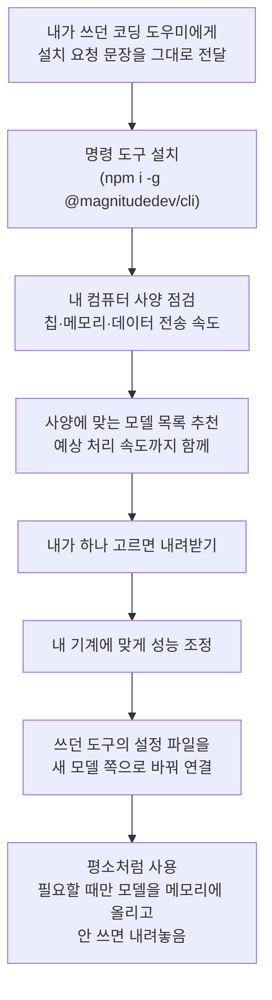

<div class="ai-knowledge-shell">

<aside class="ai-knowledge-sidebar">
  <p class="ai-eyebrow">CATEGORIES</p>
  <nav class="ai-cat-tree"><details class="ai-cat" open><summary><span class="catname">에이전트 오케스트레이션</span><span class="catcount">14</span></summary><ul><li><a href="https://altjs4510.github.io/ai_news_blog/knowledge/20260904/"><span class="kdate">2026-09-04</span><span class="ktitle">HarnessDev: Can LLMs Create and Evolve Their Own…</span></a></li><li><a href="https://altjs4510.github.io/ai_news_blog/knowledge/20260831-openexecutive-virtual-c-suite/"><span class="kdate">2026-08-31</span><span class="ktitle">Open Executive — 8명의 전문 에이전트를 하나의 임원 목소리로</span></a></li><li><a href="https://altjs4510.github.io/ai_news_blog/knowledge/20260828/"><span class="kdate">2026-08-28</span><span class="ktitle">Google ADK for Python v2.8.0 — RemoteA2aAgent 네이…</span></a></li><li><a href="https://altjs4510.github.io/ai_news_blog/knowledge/20260826/"><span class="kdate">2026-08-26</span><span class="ktitle">apache/maka — 도구 호출·권한 결정·종료 이벤트를 append-only 로그…</span></a></li><li><a href="https://altjs4510.github.io/ai_news_blog/knowledge/20260823/"><span class="kdate">2026-08-23</span><span class="ktitle">The Evolution of the Agent Harness — 하네스가 모델 가중치…</span></a></li><li><a href="https://altjs4510.github.io/ai_news_blog/knowledge/20260805/"><span class="kdate">2026-08-05</span><span class="ktitle">TencentCloud/TencentDB-Agent-Memory — 대화·문서·코드를 …</span></a></li><li><a href="https://altjs4510.github.io/ai_news_blog/knowledge/20260717/"><span class="kdate">2026-07-17</span><span class="ktitle">After a year building agent memory, 'save everyt…</span></a></li><li><a href="https://altjs4510.github.io/ai_news_blog/knowledge/20260708/"><span class="kdate">2026-07-08</span><span class="ktitle">Expanding Managed Agents in Gemini API: backgrou…</span></a></li><li><a href="https://altjs4510.github.io/ai_news_blog/knowledge/20260707/"><span class="kdate">2026-07-07</span><span class="ktitle">AI Hero Skills Catalog — 실무 엔지니어를 위한 재사용 가능한 판단 …</span></a></li><li><a href="https://altjs4510.github.io/ai_news_blog/knowledge/20260623/"><span class="kdate">2026-06-23</span><span class="ktitle">bytedance/deer-flow — 샌드박스·메모리·서브에이전트·메시지 게이트웨이를…</span></a></li><li><a href="https://altjs4510.github.io/ai_news_blog/knowledge/20260611/"><span class="kdate">2026-06-11</span><span class="ktitle">The evolution of agentic surfaces: building with…</span></a></li><li><a href="https://altjs4510.github.io/ai_news_blog/knowledge/20260602/"><span class="kdate">2026-06-02</span><span class="ktitle">revfactory/harness — 도메인별 에이전트 팀과 스킬을 자동 설계하는 메타…</span></a></li><li><a href="https://altjs4510.github.io/ai_news_blog/knowledge/20260529/"><span class="kdate">2026-05-29</span><span class="ktitle">Introducing dynamic workflows in Claude Code</span></a></li><li><a href="https://altjs4510.github.io/ai_news_blog/knowledge/20260507/"><span class="kdate">2026-05-07</span><span class="ktitle">ruvnet/ruflo — Claude 멀티 에이전트 오케스트레이션 플랫폼</span></a></li></ul></details><details class="ai-cat" open><summary><span class="catname">MCP &amp; 도구 통합</span><span class="catcount">20</span></summary><ul><li><a href="https://altjs4510.github.io/ai_news_blog/knowledge/20260829/"><span class="kdate">2026-08-29</span><span class="ktitle">cursor/plugins — 플러그인 명세(specification)와 공식 플러그인…</span></a></li><li><a href="https://altjs4510.github.io/ai_news_blog/knowledge/20260802/"><span class="kdate">2026-08-02</span><span class="ktitle">Stateless MCP has recaptured my interest (and in…</span></a></li><li><a href="https://altjs4510.github.io/ai_news_blog/knowledge/20260801/"><span class="kdate">2026-08-01</span><span class="ktitle">different-ai/openwork — Claude Cowork의 오픈소스 대체 에…</span></a></li><li><a href="https://altjs4510.github.io/ai_news_blog/knowledge/20260731/"><span class="kdate">2026-07-31</span><span class="ktitle">different-ai/openwork — Claude Cowork의 오픈소스 대안(o…</span></a></li><li><a href="https://altjs4510.github.io/ai_news_blog/knowledge/20260729/"><span class="kdate">2026-07-29</span><span class="ktitle">Bringing MCP 2026-07-28 to Claude</span></a></li><li><a href="https://altjs4510.github.io/ai_news_blog/knowledge/20260726/"><span class="kdate">2026-07-26</span><span class="ktitle">citrolabs/ego-lite — 로그인된 브라우저 상태를 AI 에이전트와 공유하는…</span></a></li><li><a href="https://altjs4510.github.io/ai_news_blog/knowledge/20260721/"><span class="kdate">2026-07-21</span><span class="ktitle">tirth8205/code-review-graph — 로컬 우선 코드 인텔리전스 그래프…</span></a></li><li><a href="https://altjs4510.github.io/ai_news_blog/knowledge/20260719/"><span class="kdate">2026-07-19</span><span class="ktitle">tirth8205/code-review-graph — 로컬 우선 코드 인텔리전스 그래프…</span></a></li><li><a href="https://altjs4510.github.io/ai_news_blog/knowledge/20260718/"><span class="kdate">2026-07-18</span><span class="ktitle">tirth8205/code-review-graph — MCP·CLI용 로컬 코드 인텔리…</span></a></li><li><a href="https://altjs4510.github.io/ai_news_blog/knowledge/20260709/"><span class="kdate">2026-07-09</span><span class="ktitle">mvanhorn/last30days-skill — Reddit·X·YouTube·HN·…</span></a></li><li><a href="https://altjs4510.github.io/ai_news_blog/knowledge/20260701/"><span class="kdate">2026-07-01</span><span class="ktitle">Google OKF (Open Knowledge Format) — 벤더 중립 에이전트 …</span></a></li><li><a href="https://altjs4510.github.io/ai_news_blog/knowledge/20260618/"><span class="kdate">2026-06-18</span><span class="ktitle">DeusData/codebase-memory-mcp — 158개 언어 코드베이스를 밀리…</span></a></li><li><a href="https://altjs4510.github.io/ai_news_blog/knowledge/20260606/"><span class="kdate">2026-06-06</span><span class="ktitle">chopratejas/headroom — Compress tool outputs, lo…</span></a></li><li><a href="https://altjs4510.github.io/ai_news_blog/knowledge/20260605/"><span class="kdate">2026-06-05</span><span class="ktitle">chopratejas/headroom — Compress tool outputs, lo…</span></a></li><li><a href="https://altjs4510.github.io/ai_news_blog/knowledge/20260604/"><span class="kdate">2026-06-04</span><span class="ktitle">chopratejas/headroom — Compress tool outputs bef…</span></a></li><li><a href="https://altjs4510.github.io/ai_news_blog/knowledge/20260603/"><span class="kdate">2026-06-03</span><span class="ktitle">How Bad MCP design cost your Agent 5× more token…</span></a></li><li><a href="https://altjs4510.github.io/ai_news_blog/knowledge/20260523/"><span class="kdate">2026-05-23</span><span class="ktitle">colbymchenry/codegraph — 사전 인덱싱된 코드 지식 그래프 MCP</span></a></li><li><a href="https://altjs4510.github.io/ai_news_blog/knowledge/20260519/"><span class="kdate">2026-05-19</span><span class="ktitle">Anthropic acquires Stainless</span></a></li><li><a href="https://altjs4510.github.io/ai_news_blog/knowledge/20260517/"><span class="kdate">2026-05-17</span><span class="ktitle">I gave my LLM 100,000+ tools — Lazy Discovery &a…</span></a></li><li><a href="https://altjs4510.github.io/ai_news_blog/knowledge/20260509/"><span class="kdate">2026-05-09</span><span class="ktitle">How to connect 100 MCP servers without the conte…</span></a></li></ul></details><details class="ai-cat" open><summary><span class="catname">코딩 에이전트</span><span class="catcount">30</span></summary><ul><li><a href="https://altjs4510.github.io/ai_news_blog/knowledge/20260903/"><span class="kdate">2026-09-03</span><span class="ktitle">pacifio/atlas — 여러 코딩 에이전트의 변경을 한곳에서 추적·질의하는 '에이…</span></a></li><li><a href="https://altjs4510.github.io/ai_news_blog/knowledge/20260901/"><span class="kdate">2026-09-01</span><span class="ktitle">affaan-m/ECC — 스킬·본능·메모리·보안을 묶은 에이전트 하네스 성능 최적화 …</span></a></li><li><a href="https://altjs4510.github.io/ai_news_blog/knowledge/20260831-gitnexus-code-knowledge-graph/"><span class="kdate">2026-08-31</span><span class="ktitle">GitNexus — 코드베이스를 지식그래프로 바꿔 에이전트에게 쥐어주기</span></a></li><li><a href="https://altjs4510.github.io/ai_news_blog/knowledge/20260822/"><span class="kdate">2026-08-22</span><span class="ktitle">mattpocock/skills — Skills for Real Engineers (하…</span></a></li><li><a href="https://altjs4510.github.io/ai_news_blog/knowledge/20260820/"><span class="kdate">2026-08-20</span><span class="ktitle">akitaonrails/ai-memory — 코딩 에이전트 CLI의 장기 메모리와 벤더…</span></a></li><li><a href="https://altjs4510.github.io/ai_news_blog/knowledge/20260819/"><span class="kdate">2026-08-19</span><span class="ktitle">akitaonrails/ai-memory — 코딩 에이전트 CLI 간 장기 기억과 벤더…</span></a></li><li><a href="https://altjs4510.github.io/ai_news_blog/knowledge/20260814/"><span class="kdate">2026-08-14</span><span class="ktitle">cathrynlavery/diagram-design — Claude Code용 에디토리…</span></a></li><li><a href="https://altjs4510.github.io/ai_news_blog/knowledge/20260811/"><span class="kdate">2026-08-11</span><span class="ktitle">PrimeIntellect-ai/prime-agent — 장기 자율 실행을 전제로 설계…</span></a></li><li><a href="https://altjs4510.github.io/ai_news_blog/knowledge/20260810/"><span class="kdate">2026-08-10</span><span class="ktitle">Auto mode is now the default in Claude Code for …</span></a></li><li><a href="https://altjs4510.github.io/ai_news_blog/knowledge/20260809/"><span class="kdate">2026-08-09</span><span class="ktitle">PrimeIntellect-ai/prime-agent — 코딩 워크플로우·장기 자율 작…</span></a></li><li><a href="https://altjs4510.github.io/ai_news_blog/knowledge/20260808/"><span class="kdate">2026-08-08</span><span class="ktitle">PrimeIntellect-ai/prime-agent — 코딩 워크플로우와 장시간 자율…</span></a></li><li><a href="https://altjs4510.github.io/ai_news_blog/knowledge/20260804/"><span class="kdate">2026-08-04</span><span class="ktitle">esengine/DeepSeek-Reasonix — prefix-cache 안정성을 축…</span></a></li><li><a href="https://altjs4510.github.io/ai_news_blog/knowledge/20260728/"><span class="kdate">2026-07-28</span><span class="ktitle">alibaba/open-code-review — 결정론적 파이프라인 + LLM 에이전트…</span></a></li><li><a href="https://altjs4510.github.io/ai_news_blog/knowledge/20260725/"><span class="kdate">2026-07-25</span><span class="ktitle">The new rules of context engineering for Claude …</span></a></li><li><a href="https://altjs4510.github.io/ai_news_blog/knowledge/20260722/"><span class="kdate">2026-07-22</span><span class="ktitle">tirth8205/code-review-graph — MCP·CLI용 로컬 우선 코드 …</span></a></li><li><a href="https://altjs4510.github.io/ai_news_blog/knowledge/20260714/"><span class="kdate">2026-07-14</span><span class="ktitle">Graphify-Labs/graphify — 코드베이스를 질의 가능한 지식 그래프로 만…</span></a></li><li><a href="https://altjs4510.github.io/ai_news_blog/knowledge/20260705/"><span class="kdate">2026-07-05</span><span class="ktitle">openai/codex-plugin-cc — Claude Code에서 Codex를 위임…</span></a></li><li><a href="https://altjs4510.github.io/ai_news_blog/knowledge/20260626/"><span class="kdate">2026-06-26</span><span class="ktitle">google-labs-code/design.md — 코딩 에이전트에게 디자인 시스템을 …</span></a></li><li><a href="https://altjs4510.github.io/ai_news_blog/knowledge/20260619/"><span class="kdate">2026-06-19</span><span class="ktitle">Claude Code now supports artifacts</span></a></li><li><a href="https://altjs4510.github.io/ai_news_blog/knowledge/20260530/"><span class="kdate">2026-05-30</span><span class="ktitle">Leonxlnx/taste-skill — AI에게 좋은 취향을 부여해 generic s…</span></a></li><li><a href="https://altjs4510.github.io/ai_news_blog/knowledge/20260528/"><span class="kdate">2026-05-28</span><span class="ktitle">Building self-improving tax agents with Codex</span></a></li><li><a href="https://altjs4510.github.io/ai_news_blog/knowledge/20260526/"><span class="kdate">2026-05-26</span><span class="ktitle">colbymchenry/codegraph — Pre-indexed code knowle…</span></a></li><li><a href="https://altjs4510.github.io/ai_news_blog/knowledge/20260524/"><span class="kdate">2026-05-24</span><span class="ktitle">colbymchenry/codegraph — Pre-indexed code knowle…</span></a></li><li><a href="https://altjs4510.github.io/ai_news_blog/knowledge/20260521/"><span class="kdate">2026-05-21</span><span class="ktitle">colbymchenry/codegraph — Pre-indexed code knowle…</span></a></li><li><a href="https://altjs4510.github.io/ai_news_blog/knowledge/20260515/"><span class="kdate">2026-05-15</span><span class="ktitle">Clawdmeter — Claude Code 사용량을 데스크톱 대시보드로</span></a></li><li><a href="https://altjs4510.github.io/ai_news_blog/knowledge/20260512/"><span class="kdate">2026-05-12</span><span class="ktitle">agentmemory — Persistent memory for AI coding ag…</span></a></li><li><a href="https://altjs4510.github.io/ai_news_blog/knowledge/20260510/"><span class="kdate">2026-05-10</span><span class="ktitle">addyosmani/agent-skills — Production-grade engin…</span></a></li><li><a href="https://altjs4510.github.io/ai_news_blog/knowledge/20260508/"><span class="kdate">2026-05-08</span><span class="ktitle">addyosmani/agent-skills — Production-grade engin…</span></a></li><li><a href="https://altjs4510.github.io/ai_news_blog/knowledge/20260506/"><span class="kdate">2026-05-06</span><span class="ktitle">mksglu/context-mode — AI 코딩 에이전트용 컨텍스트 윈도우 최적화</span></a></li><li><a href="https://altjs4510.github.io/ai_news_blog/knowledge/20260505/"><span class="kdate">2026-05-05</span><span class="ktitle">mattpocock/skills — Skills for Real Engineers (.…</span></a></li></ul></details><details class="ai-cat" open><summary><span class="catname">모델 &amp; 연구</span><span class="catcount">7</span></summary><ul><li><a href="https://altjs4510.github.io/ai_news_blog/knowledge/20260821/"><span class="kdate">2026-08-21</span><span class="ktitle">volcengine/OpenViking — 에이전트 메모리·Knowledge RAG·스…</span></a></li><li><a href="https://altjs4510.github.io/ai_news_blog/knowledge/20260716-proprag/"><span class="kdate">2026-07-16</span><span class="ktitle">PropRAG — 프로포지션 경로 위 beam search로 멀티홉 검색 안내</span></a></li><li><a href="https://altjs4510.github.io/ai_news_blog/knowledge/20260620/"><span class="kdate">2026-06-20</span><span class="ktitle">zai-org/GLM-5 — From Vibe Coding to Agentic Engi…</span></a></li><li><a href="https://altjs4510.github.io/ai_news_blog/knowledge/20260617/"><span class="kdate">2026-06-17</span><span class="ktitle">Predicting model behavior before release by simu…</span></a></li><li><a href="https://altjs4510.github.io/ai_news_blog/knowledge/20260610/"><span class="kdate">2026-06-10</span><span class="ktitle">Fable 5 just made cost-aware model routing manda…</span></a></li><li><a href="https://altjs4510.github.io/ai_news_blog/knowledge/20260516/"><span class="kdate">2026-05-16</span><span class="ktitle">STALE — 에이전트가 자기 기억의 유효성을 인지할 수 있는가</span></a></li><li><a href="https://altjs4510.github.io/ai_news_blog/knowledge/20260513/"><span class="kdate">2026-05-13</span><span class="ktitle">Thinking Machines' Native Interaction Models — T…</span></a></li></ul></details><details class="ai-cat" open><summary><span class="catname">인프라 &amp; 컴퓨트</span><span class="catcount">8</span></summary><ul><li><a href="https://altjs4510.github.io/ai_news_blog/knowledge/20260905/" class="current"><span class="kdate">2026-09-05</span><span class="ktitle">magnitudedev/magnitude — 하드웨어에 맞는 최적 로컬 모델을 띄워 이…</span></a></li><li><a href="https://altjs4510.github.io/ai_news_blog/knowledge/20260813/"><span class="kdate">2026-08-13</span><span class="ktitle">semantica-agi/semantica — 컨텍스트와 책임 추적을 위한 그래프 네이…</span></a></li><li><a href="https://altjs4510.github.io/ai_news_blog/knowledge/20260812/"><span class="kdate">2026-08-12</span><span class="ktitle">semantica-agi/semantica — 컨텍스트와 '책임 추적 가능한(accou…</span></a></li><li><a href="https://altjs4510.github.io/ai_news_blog/knowledge/20260806/"><span class="kdate">2026-08-06</span><span class="ktitle">cloudflare/computer — 에이전트에게 컴퓨터를 통째로 주는 엣지 실행 샌…</span></a></li><li><a href="https://altjs4510.github.io/ai_news_blog/knowledge/20260724/"><span class="kdate">2026-07-24</span><span class="ktitle">diegosouzapw/OmniRoute — 단일 엔드포인트로 278+ 프로바이더·50…</span></a></li><li><a href="https://altjs4510.github.io/ai_news_blog/knowledge/20260723/"><span class="kdate">2026-07-23</span><span class="ktitle">diegosouzapw/OmniRoute — 268+ 프로바이더를 단일 엔드포인트로 묶…</span></a></li><li><a href="https://altjs4510.github.io/ai_news_blog/knowledge/20260522/"><span class="kdate">2026-05-22</span><span class="ktitle">Giving Agents Computers — Ivan Burazin, Daytona</span></a></li><li><a href="https://altjs4510.github.io/ai_news_blog/knowledge/20260520/"><span class="kdate">2026-05-20</span><span class="ktitle">New in Claude Managed Agents: self-hosted sandbo…</span></a></li></ul></details><details class="ai-cat" open><summary><span class="catname">보안 &amp; 거버넌스</span><span class="catcount">18</span></summary><ul><li><a href="https://altjs4510.github.io/ai_news_blog/knowledge/20260902/"><span class="kdate">2026-09-02</span><span class="ktitle">AIR raises $50M to help companies vet the skills…</span></a></li><li><a href="https://altjs4510.github.io/ai_news_blog/knowledge/20260827/"><span class="kdate">2026-08-27</span><span class="ktitle">Claude in Chrome is generally available</span></a></li><li><a href="https://altjs4510.github.io/ai_news_blog/knowledge/20260819-mind-viruses/"><span class="kdate">2026-08-19</span><span class="ktitle">탈옥도, 인젝션도 없이 — 대화로만 퍼지는 에이전트의 '마인드 바이러스'</span></a></li><li><a href="https://altjs4510.github.io/ai_news_blog/knowledge/20260730/"><span class="kdate">2026-07-30</span><span class="ktitle">Anatomy of a Frontier Lab Agent Intrusion: A Tec…</span></a></li><li><a href="https://altjs4510.github.io/ai_news_blog/knowledge/20260716/"><span class="kdate">2026-07-16</span><span class="ktitle">Dicklesworthstone/destructive_command_guard — 에이…</span></a></li><li><a href="https://altjs4510.github.io/ai_news_blog/knowledge/20260715/"><span class="kdate">2026-07-15</span><span class="ktitle">Dicklesworthstone/destructive_command_guard — 에이…</span></a></li><li><a href="https://altjs4510.github.io/ai_news_blog/knowledge/20260710/"><span class="kdate">2026-07-10</span><span class="ktitle">70개 MCP 서버 strace 런타임 감사 — 부팅 시 아웃바운드 호출 서버 적발</span></a></li><li><a href="https://altjs4510.github.io/ai_news_blog/knowledge/20260704/"><span class="kdate">2026-07-04</span><span class="ktitle">Cloudflare is about to block AI agents by defaul…</span></a></li><li><a href="https://altjs4510.github.io/ai_news_blog/knowledge/20260703/"><span class="kdate">2026-07-03</span><span class="ktitle">Giving admins more visibility and control over C…</span></a></li><li><a href="https://altjs4510.github.io/ai_news_blog/knowledge/20260630/"><span class="kdate">2026-06-30</span><span class="ktitle">Introducing the Claude apps gateway for Amazon B…</span></a></li><li><a href="https://altjs4510.github.io/ai_news_blog/knowledge/20260625/"><span class="kdate">2026-06-25</span><span class="ktitle">Agent identity in Claude Tag: a new access model…</span></a></li><li><a href="https://altjs4510.github.io/ai_news_blog/knowledge/20260624/"><span class="kdate">2026-06-24</span><span class="ktitle">Agent identity in Claude Tag: a new access model…</span></a></li><li><a href="https://altjs4510.github.io/ai_news_blog/knowledge/20260614/"><span class="kdate">2026-06-14</span><span class="ktitle">NVIDIA/SkillSpector — Security scanner for AI ag…</span></a></li><li><a href="https://altjs4510.github.io/ai_news_blog/knowledge/20260613/"><span class="kdate">2026-06-13</span><span class="ktitle">Fable 5's guardrails got bypassed in 48 hours — …</span></a></li><li><a href="https://altjs4510.github.io/ai_news_blog/knowledge/20260612/"><span class="kdate">2026-06-12</span><span class="ktitle">NVIDIA/SkillSpector — AI 에이전트 스킬용 보안 스캐너</span></a></li><li><a href="https://altjs4510.github.io/ai_news_blog/knowledge/20260607/"><span class="kdate">2026-06-07</span><span class="ktitle">OpenAI Help: Lockdown Mode</span></a></li><li><a href="https://altjs4510.github.io/ai_news_blog/knowledge/20260531/"><span class="kdate">2026-05-31</span><span class="ktitle">How we contain Claude across products</span></a></li><li><a href="https://altjs4510.github.io/ai_news_blog/knowledge/20260527/"><span class="kdate">2026-05-27</span><span class="ktitle">Microsoft Copilot Cowork Exfiltrates Files</span></a></li></ul></details><details class="ai-cat" open><summary><span class="catname">응용 사례</span><span class="catcount">4</span></summary><ul><li><a href="https://altjs4510.github.io/ai_news_blog/knowledge/20260712/"><span class="kdate">2026-07-12</span><span class="ktitle">Do Automated Evals Work?</span></a></li><li><a href="https://altjs4510.github.io/ai_news_blog/knowledge/20260621/"><span class="kdate">2026-06-21</span><span class="ktitle">calesthio/OpenMontage — 12 파이프라인·52 도구·500+ 스킬을 …</span></a></li><li><a href="https://altjs4510.github.io/ai_news_blog/knowledge/20260609/"><span class="kdate">2026-06-09</span><span class="ktitle">Building intelligent apps for Apple platforms wi…</span></a></li><li><a href="https://altjs4510.github.io/ai_news_blog/knowledge/20260514/"><span class="kdate">2026-05-14</span><span class="ktitle">Introducing Claude for Small Business</span></a></li></ul></details><details class="ai-cat" open><summary><span class="catname">산업 동향</span><span class="catcount">5</span></summary><ul><li><a href="https://altjs4510.github.io/ai_news_blog/knowledge/20260830/"><span class="kdate">2026-08-30</span><span class="ktitle">[AINews] OpenAI shuts off Cursor — 프론티어 모델 공급 차단…</span></a></li><li><a href="https://altjs4510.github.io/ai_news_blog/knowledge/20260711/"><span class="kdate">2026-07-11</span><span class="ktitle">OpenAI says GPT 5.6 is the 'preferred model' for…</span></a></li><li><a href="https://altjs4510.github.io/ai_news_blog/knowledge/20260702/"><span class="kdate">2026-07-02</span><span class="ktitle">How Cursor deploys AI inside the enterprise (For…</span></a></li><li><a href="https://altjs4510.github.io/ai_news_blog/knowledge/20260616/"><span class="kdate">2026-06-16</span><span class="ktitle">Why AI hasn't replaced software engineers, and w…</span></a></li><li><a href="https://altjs4510.github.io/ai_news_blog/knowledge/20260504/"><span class="kdate">2026-05-04</span><span class="ktitle">Agents for Everything Else: Codex for Knowledge …</span></a></li></ul></details></nav>
</aside>

<article class="ai-knowledge-article">

<header class="ai-post-hero">
  <p class="ai-eyebrow"><a class="ai-back" href="../">KNOWLEDGE</a> · 2026-09-05 · 오늘의 학습</p>
  <h2 class="ai-post-title">magnitudedev/magnitude — 하드웨어에 맞는 최적 로컬 모델을 띄워 이미 쓰는 에이전트에 그대로 꽂는 오픈소스 추론 서버</h2>
</header>

> 원문: [magnitudedev/magnitude — 하드웨어에 맞는 최적 로컬 모델을 띄워 이미 쓰는 에이전트에 그대로 꽂는 오픈소스 추론 서버](https://github.com/magnitudedev/magnitude)

## 📌 학습 정리

### 1. 한 줄로 말하면

내 컴퓨터 사양을 먼저 살펴보고, 거기서 제일 잘 돌아갈 인공지능 모델을 골라 설치해준 다음, 이미 쓰고 있던 코딩 도우미가 그 모델을 쓰도록 연결해주는 프로그램이에요. 인터넷 없이도, 돈 안 내고도 돌릴 수 있게 만드는 게 목적입니다.

### 2. 왜 이게 만들어졌어요?

코딩을 도와주는 인공지능 도구들은 보통 회사 서버에 있는 모델을 인터넷으로 불러다 씁니다. 그러면 쓸 때마다 사용료가 나가고, 내가 보낸 코드와 파일이 외부로 나가고, 정해진 사용량을 넘기면 잠시 멈춰야 하죠. 그래서 "모델을 내 컴퓨터에 직접 받아서 돌리면 되지 않나" 하는 생각이 자연스럽게 나오는데, 여기서 막힙니다. 내 노트북 사양에 어떤 모델이 들어가는지, 어떤 압축본을 받아야 하는지, 속도가 쓸 만하게 나올지를 판단하려면 꽤 알아야 하거든요. Magnitude는 그 판단을 사람 대신 해주고, 다운로드부터 설정 파일 수정까지 이어서 처리하겠다는 쪽으로 만들어진 도구입니다.

### 3. 비유로 풀면

이건 마치 컴퓨터 매장 직원이 내 예산과 용도를 먼저 물어보고 "이 사양이면 이 제품이 딱 맞고, 대략 이 정도 성능이 나옵니다"라고 짚어준 뒤, 설치와 초기 세팅까지 해주고 가는 것과 비슷해요. 내가 사양표를 하나하나 비교하지 않아도 됩니다.

또 하나는 자동차 엔진을 갈아 끼우는 그림이에요. 핸들과 계기판(내가 늘 쓰던 코딩 도구)은 그대로 두고, 그 아래 엔진(실제로 답을 만들어내는 모델)만 바깥 것에서 내 것으로 바꾸는 셈이죠.

그래서 결국, 쓰는 방식은 그대로 두고 "답을 만들어내는 부분"만 내 컴퓨터 안으로 옮기는 도구입니다.

### 4. 어떻게 작동하는지 (그림으로)



핵심은 "추천 → 설치 → 연결"이 한 흐름으로 이어진다는 점이에요. 내가 직접 사양을 재보거나 설정 파일을 열어 고칠 필요 없이, 쓰던 도구에 안내 문장 하나를 붙여넣으면 그 도구가 나머지 단계를 대신 밟아줍니다. 설치가 끝난 뒤에는 배경에서 조용히 돌면서, 모델이 필요할 때 메모리에 올리고 한동안 안 쓰거나 메모리가 빠듯해지면 알아서 내려놓습니다.

직접 목록을 보고 고르고 싶다면 설치 후 `magnitude setup`을 실행하면 추천 목록을 훑어보며 직접 선택할 수 있어요. macOS와 Linux를 지원하고, Windows에서는 리눅스를 윈도우 안에서 돌리는 환경(WSL)을 통해 쓸 수 있다고 안내합니다.

### 5. 처음 보는 용어 풀이

- **추론 서버 (inference server)** — 인공지능 모델에게 질문을 넣고 답을 받아오는 일을 전담하는 프로그램이에요. 모델을 메모리에 올려두고 요청이 오면 처리해주는, 일종의 접수 창구라고 보면 됩니다.
- **로컬 모델 (local model)** — 외부 회사 서버가 아니라 내 컴퓨터 안에 파일로 받아둔 인공지능 모델을 말합니다. 인터넷이 끊겨도 쓸 수 있고, 내가 넣은 내용이 밖으로 나가지 않는 게 장점이에요.
- **에이전트 / 하네스 (agent / harness)** — 여기서는 내가 평소에 쓰는 인공지능 코딩 도구를 가리킵니다. 원문에는 Pi, OpenCode, Hermes, OpenClaw, Codex, Claude Code, Oh My Pi, Cline이 연결 가능한 대상으로 적혀 있고, Magnitude 자체에도 기본으로 딸린 도구가 하나 있습니다.
- **양자화본 (quant, quantization)** — 모델을 원본보다 가볍게 눌러 담은 버전이에요. 용량과 메모리를 덜 쓰는 대신 정밀도를 조금 양보하는데, 어떤 압축 정도가 내 기계에 맞는지 고르는 게 은근히 까다로운 지점입니다.
- **GGUF 형식 (GGUF)** — 로컬에서 모델을 돌릴 때 널리 쓰이는 파일 형식 이름입니다. 이 형식으로 된 모델이면 추천 목록에 없더라도 직접 받아서 쓸 수 있다고 안내하고 있어요.
- **투기적 디코딩 (speculative decoding)** — 답을 만들어낼 때 앞부분을 미리 짐작해두고 맞으면 그대로 쓰는 방식의 속도 개선 기법입니다. Magnitude가 기계 사양에 맞춰 이런 설정들을 미리 맞춰둔다고 설명합니다.
- **초당 토큰 수 (tok/s)** — 모델이 글자를 얼마나 빨리 뱉어내는지를 재는 단위예요. 추천 목록에 이 예상치가 함께 표시돼서, 실제로 쓸 만한 속도인지 미리 가늠할 수 있습니다.
- **아파치 라이선스 2.0 (Apache License 2.0)** — 소스가 공개돼 있고, 고쳐 쓰거나 가져다 쓰는 것이 폭넓게 허용되는 조건이라는 뜻입니다.

### 6. 한 발 더 들어가고 싶다면

- [Documentation](https://docs.magnitude.run) — 설치 이후 실제 사용법과 설정 방식을 전반적으로 확인할 수 있어요.
- [CLI reference](https://docs.magnitude.run/cli) — 명령어 하나하나가 무슨 일을 하는지, 모델 설치·교체를 어떻게 하는지 알 수 있어요.
- [download compatible GGUF models from Hugging Face](https://huggingface.co/models?library=gguf) — 추천 목록 밖의 모델을 직접 골라 쓰고 싶을 때 어디서 찾는지 알 수 있어요.
- [Discord](https://discord.gg/magnitude) — 다른 사용자들이 어떤 사양에서 어떻게 쓰고 있는지, 막힌 지점을 어떻게 푸는지 물어볼 수 있어요.
- [Report an issue](https://github.com/magnitudedev/magnitude/issues) — 문제가 생겼을 때 어디에 알리는지, 이미 알려진 문제가 뭔지 볼 수 있어요.

---

## 📖 원문 전체 번역 (정독용)

> 의역 최소화한 전체 번역입니다. 큰 흐름은 위 정리에서 잡고, 정확한 워딩이 필요할 땐 이 섹션에서 정독하세요.

# Magnitude

로컬 모델로 당신의 에이전트를 구동하세요. 무료, 프라이빗, 오프라인.

Magnitude는 여러분의 하드웨어에 맞는 최적의 로컬 모델을 실행하여, 여러분이 이미 쓰고 있는 에이전트에 그대로 꽂아 넣는 오픈소스 추론 서버입니다. 여러분의 머신을 프로파일링하고, 맞는 모델을 추천한 다음, 그 모델을 다운로드하고 튜닝하고 실행합니다. Pi, OpenCode, Hermes, OpenClaw, Codex, Claude Code, Oh My Pi, Cline와 함께 작동하며, 내장 하니스(harness)를 사용할 수도 있습니다.

⭐ 저희가 더 많은 개발자에게 다가가 Magnitude 커뮤니티를 키울 수 있도록 도와주세요. 이 레포에 스타를 눌러주세요!

## 시작하기

에이전트에게 다음을 보내면 모델 안내와 설정을 진행해 줍니다:

Magnitude CLI로 로컬 모델을 설정해 줘. `npm i -g @magnitudedev/cli`(또는 내 패키지 매니저)로 설치한 다음, `magnitude docs onboarding`을 실행하고 안내를 따라줘.

여러분의 에이전트는 하드웨어를 프로파일링하고, 그에 맞는 최적의 모델들을 안내하며, 여러분이 선택한 모델을 다운로드하고, 스스로 해당 모델로 전환합니다.

Magnitude는 macOS와 Linux를 지원합니다. Windows는 WSL을 통해 지원됩니다.

직접 모델을 둘러보고 싶으신가요?

```
npm i -g @magnitudedev/cli
magnitude setup
```

대화형 설정을 이용하면 추천 모델을 둘러보고 직접 원하는 모델을 선택할 수 있습니다.

## 왜 Magnitude인가?

**무료로 실행:**
토큰 비용, API 키, 속도 제한이 없습니다

**완전한 프라이버시와 오프라인 동작:**
모델, 프롬프트, 파일이 여러분의 머신에만 머뭅니다

**에이전트 우선 설정:**
프롬프트 하나면 나머지는 에이전트가 안내합니다

**여러분의 하드웨어를 파악:**
칩, 메모리, 대역폭을 프로파일링합니다

**맞는 것을 추천:**
여러분의 머신에 맞는 최적의 모델을, 예상 tok/s와 함께 추천합니다

**엔드투엔드로 튜닝됨:**
투기적 디코딩(speculative decoding), 동시성 등이 여러분의 머신에 맞게 모두 설정됩니다

**필요할 때 모델 로드:**
요청 시 로드되고, 유휴 상태이거나 메모리가 부족할 때 언로드됩니다

**오픈소스:**
Apache 2.0, 여러분이 자유롭게 수정할 수 있습니다

## FAQ

**Magnitude란 무엇인가요?**
여러분의 하드웨어에 맞는 최적의 로컬 모델을 실행하여, 여러분이 이미 쓰고 있는 에이전트에 그대로 꽂아 넣는 오픈소스 추론 서버입니다. 여러분의 머신을 프로파일링하고, 맞는 모델을 추천한 다음, 그 모델을 다운로드하고 튜닝하고 실행합니다.

**어떤 하드웨어가 필요한가요?**
고정된 최소 사양은 없습니다. Magnitude가 여러분의 하드웨어를 프로파일링하여 여러분의 머신에 맞는 최적의 모델을 추천합니다. 메모리가 많을수록 더 큰 모델을 실행할 수 있습니다.

**그냥 에이전트에게 Ollama를 설정하게 하면 안 되나요?**
그렇게 하면 에이전트는 그저 추측할 수밖에 없습니다. 여러분의 하드웨어가 무엇인지, 어떤 양자화(quant)가 맞는지, 얼마나 빠르게 돌아갈지 알지 못합니다. Magnitude는 여러분의 머신에 맞춰 계산된 추천이 담긴 카탈로그와, 여러분의 하니스 설정을 작성해 주는 온보딩 플로우, 그리고 에이전트 워크로드에 맞춰 만들어진 추론 기능을 제공합니다. 모델은 딱 필요한 시점에 로드되고, 유휴 상태이거나 메모리가 부족해지면 언로드됩니다.

**어떤 하니스와 함께 작동하나요?**
Pi, OpenCode, Hermes, OpenClaw, Codex, Claude Code, Oh My Pi, Cline입니다. 설정 과정에서 여러분의 에이전트가 여러분이 선택한 모델에 여러분의 하니스를 연결해 줍니다. 또는 Magnitude의 내장 하니스를 사용할 수도 있습니다.

**설정 후에도 Magnitude를 관리해야 하나요?**
아니요. 백그라운드에서 실행되며, 여러분의 에이전트가 필요로 할 때 모델을 로드하고, 유휴 상태이거나 메모리가 부족해지면 언로드합니다. 여러분의 에이전트는 언제든지 Magnitude CLI를 통해 모델을 설치하거나 전환할 수 있습니다.

**제 데이터가 클라우드로 전송되나요?**
아니요. 프롬프트, 파일, 모델은 모두 여러분의 머신에 머뭅니다.

**완전히 오프라인으로 실행할 수 있나요?**
네. Magnitude와 모델이 한 번 다운로드되면 이후로는 인터넷 연결이 필요 없습니다.

**카탈로그 밖의 모델을 사용할 수 있나요?**
네. Hugging Face에서 호환되는 GGUF 모델을 다운로드하여 Magnitude에서 사용할 수 있습니다.

## 더 알아보기

문서
CLI 레퍼런스
Discord
이슈 신고

## 라이선스

Magnitude는 Apache License 2.0 하에 라이선스가 부여됩니다.

</article>

</div>
