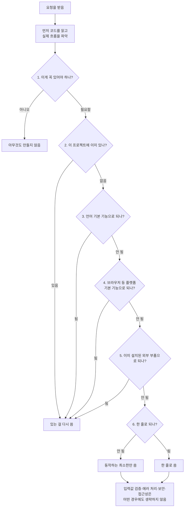

<div class="ai-knowledge-shell">

<aside class="ai-knowledge-sidebar">
  <p class="ai-eyebrow">CATEGORIES</p>
  <nav class="ai-cat-tree"><details class="ai-cat" open><summary><span class="catname">에이전트 오케스트레이션</span><span class="catcount">15</span></summary><ul><li><a href="https://altjs4510.github.io/ai_news_blog/knowledge/20260904/"><span class="kdate">2026-09-04</span><span class="ktitle">HarnessDev: Can LLMs Create and Evolve Their Own…</span></a></li><li><a href="https://altjs4510.github.io/ai_news_blog/knowledge/20260831-openexecutive-virtual-c-suite/"><span class="kdate">2026-08-31</span><span class="ktitle">Open Executive — 8명의 전문 에이전트를 하나의 임원 목소리로</span></a></li><li><a href="https://altjs4510.github.io/ai_news_blog/knowledge/20260828/"><span class="kdate">2026-08-28</span><span class="ktitle">Google ADK for Python v2.8.0 — RemoteA2aAgent 네이…</span></a></li><li><a href="https://altjs4510.github.io/ai_news_blog/knowledge/20260826/"><span class="kdate">2026-08-26</span><span class="ktitle">apache/maka — 도구 호출·권한 결정·종료 이벤트를 append-only 로그…</span></a></li><li><a href="https://altjs4510.github.io/ai_news_blog/knowledge/20260823/"><span class="kdate">2026-08-23</span><span class="ktitle">The Evolution of the Agent Harness — 하네스가 모델 가중치…</span></a></li><li><a href="https://altjs4510.github.io/ai_news_blog/knowledge/20260805/"><span class="kdate">2026-08-05</span><span class="ktitle">TencentCloud/TencentDB-Agent-Memory — 대화·문서·코드를 …</span></a></li><li><a href="https://altjs4510.github.io/ai_news_blog/knowledge/20260717/"><span class="kdate">2026-07-17</span><span class="ktitle">After a year building agent memory, 'save everyt…</span></a></li><li><a href="https://altjs4510.github.io/ai_news_blog/knowledge/20260709/"><span class="kdate">2026-07-09</span><span class="ktitle">mvanhorn/last30days-skill — Reddit·X·YouTube·HN·…</span></a></li><li><a href="https://altjs4510.github.io/ai_news_blog/knowledge/20260708/"><span class="kdate">2026-07-08</span><span class="ktitle">Expanding Managed Agents in Gemini API: backgrou…</span></a></li><li><a href="https://altjs4510.github.io/ai_news_blog/knowledge/20260623/"><span class="kdate">2026-06-23</span><span class="ktitle">bytedance/deer-flow — 샌드박스·메모리·서브에이전트·메시지 게이트웨이를…</span></a></li><li><a href="https://altjs4510.github.io/ai_news_blog/knowledge/20260621/"><span class="kdate">2026-06-21</span><span class="ktitle">calesthio/OpenMontage — 12 파이프라인·52 도구·500+ 스킬을 …</span></a></li><li><a href="https://altjs4510.github.io/ai_news_blog/knowledge/20260602/"><span class="kdate">2026-06-02</span><span class="ktitle">revfactory/harness — 도메인별 에이전트 팀과 스킬을 자동 설계하는 메타…</span></a></li><li><a href="https://altjs4510.github.io/ai_news_blog/knowledge/20260529/"><span class="kdate">2026-05-29</span><span class="ktitle">Introducing dynamic workflows in Claude Code</span></a></li><li><a href="https://altjs4510.github.io/ai_news_blog/knowledge/20260507/"><span class="kdate">2026-05-07</span><span class="ktitle">ruvnet/ruflo — Claude 멀티 에이전트 오케스트레이션 플랫폼</span></a></li><li><a href="https://altjs4510.github.io/ai_news_blog/knowledge/20260504/"><span class="kdate">2026-05-04</span><span class="ktitle">Agents for Everything Else: Codex for Knowledge …</span></a></li></ul></details><details class="ai-cat" open><summary><span class="catname">MCP &amp; 도구 통합</span><span class="catcount">17</span></summary><ul><li><a href="https://altjs4510.github.io/ai_news_blog/knowledge/20260829/"><span class="kdate">2026-08-29</span><span class="ktitle">cursor/plugins — 플러그인 명세(specification)와 공식 플러그인…</span></a></li><li><a href="https://altjs4510.github.io/ai_news_blog/knowledge/20260802/"><span class="kdate">2026-08-02</span><span class="ktitle">Stateless MCP has recaptured my interest (and in…</span></a></li><li><a href="https://altjs4510.github.io/ai_news_blog/knowledge/20260801/"><span class="kdate">2026-08-01</span><span class="ktitle">different-ai/openwork — Claude Cowork의 오픈소스 대체 에…</span></a></li><li><a href="https://altjs4510.github.io/ai_news_blog/knowledge/20260731/"><span class="kdate">2026-07-31</span><span class="ktitle">different-ai/openwork — Claude Cowork의 오픈소스 대안(o…</span></a></li><li><a href="https://altjs4510.github.io/ai_news_blog/knowledge/20260729/"><span class="kdate">2026-07-29</span><span class="ktitle">Bringing MCP 2026-07-28 to Claude</span></a></li><li><a href="https://altjs4510.github.io/ai_news_blog/knowledge/20260721/"><span class="kdate">2026-07-21</span><span class="ktitle">tirth8205/code-review-graph — 로컬 우선 코드 인텔리전스 그래프…</span></a></li><li><a href="https://altjs4510.github.io/ai_news_blog/knowledge/20260719/"><span class="kdate">2026-07-19</span><span class="ktitle">tirth8205/code-review-graph — 로컬 우선 코드 인텔리전스 그래프…</span></a></li><li><a href="https://altjs4510.github.io/ai_news_blog/knowledge/20260718/"><span class="kdate">2026-07-18</span><span class="ktitle">tirth8205/code-review-graph — MCP·CLI용 로컬 코드 인텔리…</span></a></li><li><a href="https://altjs4510.github.io/ai_news_blog/knowledge/20260701/"><span class="kdate">2026-07-01</span><span class="ktitle">Google OKF (Open Knowledge Format) — 벤더 중립 에이전트 …</span></a></li><li><a href="https://altjs4510.github.io/ai_news_blog/knowledge/20260618/"><span class="kdate">2026-06-18</span><span class="ktitle">DeusData/codebase-memory-mcp — 158개 언어 코드베이스를 밀리…</span></a></li><li><a href="https://altjs4510.github.io/ai_news_blog/knowledge/20260606/"><span class="kdate">2026-06-06</span><span class="ktitle">chopratejas/headroom — Compress tool outputs, lo…</span></a></li><li><a href="https://altjs4510.github.io/ai_news_blog/knowledge/20260605/"><span class="kdate">2026-06-05</span><span class="ktitle">chopratejas/headroom — Compress tool outputs, lo…</span></a></li><li><a href="https://altjs4510.github.io/ai_news_blog/knowledge/20260604/"><span class="kdate">2026-06-04</span><span class="ktitle">chopratejas/headroom — Compress tool outputs bef…</span></a></li><li><a href="https://altjs4510.github.io/ai_news_blog/knowledge/20260603/"><span class="kdate">2026-06-03</span><span class="ktitle">How Bad MCP design cost your Agent 5× more token…</span></a></li><li><a href="https://altjs4510.github.io/ai_news_blog/knowledge/20260523/"><span class="kdate">2026-05-23</span><span class="ktitle">colbymchenry/codegraph — 사전 인덱싱된 코드 지식 그래프 MCP</span></a></li><li><a href="https://altjs4510.github.io/ai_news_blog/knowledge/20260517/"><span class="kdate">2026-05-17</span><span class="ktitle">I gave my LLM 100,000+ tools — Lazy Discovery &a…</span></a></li><li><a href="https://altjs4510.github.io/ai_news_blog/knowledge/20260509/"><span class="kdate">2026-05-09</span><span class="ktitle">How to connect 100 MCP servers without the conte…</span></a></li></ul></details><details class="ai-cat" open><summary><span class="catname">코딩 에이전트</span><span class="catcount">31</span></summary><ul><li><a href="https://altjs4510.github.io/ai_news_blog/knowledge/20260906/" class="current"><span class="kdate">2026-09-06</span><span class="ktitle">DietrichGebert/ponytail — 에이전트를 '방에서 가장 게으른 시니어 …</span></a></li><li><a href="https://altjs4510.github.io/ai_news_blog/knowledge/20260903/"><span class="kdate">2026-09-03</span><span class="ktitle">pacifio/atlas — 여러 코딩 에이전트의 변경을 한곳에서 추적·질의하는 '에이…</span></a></li><li><a href="https://altjs4510.github.io/ai_news_blog/knowledge/20260901/"><span class="kdate">2026-09-01</span><span class="ktitle">affaan-m/ECC — 스킬·본능·메모리·보안을 묶은 에이전트 하네스 성능 최적화 …</span></a></li><li><a href="https://altjs4510.github.io/ai_news_blog/knowledge/20260831-gitnexus-code-knowledge-graph/"><span class="kdate">2026-08-31</span><span class="ktitle">GitNexus — 코드베이스를 지식그래프로 바꿔 에이전트에게 쥐어주기</span></a></li><li><a href="https://altjs4510.github.io/ai_news_blog/knowledge/20260822/"><span class="kdate">2026-08-22</span><span class="ktitle">mattpocock/skills — Skills for Real Engineers (하…</span></a></li><li><a href="https://altjs4510.github.io/ai_news_blog/knowledge/20260820/"><span class="kdate">2026-08-20</span><span class="ktitle">akitaonrails/ai-memory — 코딩 에이전트 CLI의 장기 메모리와 벤더…</span></a></li><li><a href="https://altjs4510.github.io/ai_news_blog/knowledge/20260819/"><span class="kdate">2026-08-19</span><span class="ktitle">akitaonrails/ai-memory — 코딩 에이전트 CLI 간 장기 기억과 벤더…</span></a></li><li><a href="https://altjs4510.github.io/ai_news_blog/knowledge/20260814/"><span class="kdate">2026-08-14</span><span class="ktitle">cathrynlavery/diagram-design — Claude Code용 에디토리…</span></a></li><li><a href="https://altjs4510.github.io/ai_news_blog/knowledge/20260811/"><span class="kdate">2026-08-11</span><span class="ktitle">PrimeIntellect-ai/prime-agent — 장기 자율 실행을 전제로 설계…</span></a></li><li><a href="https://altjs4510.github.io/ai_news_blog/knowledge/20260810/"><span class="kdate">2026-08-10</span><span class="ktitle">Auto mode is now the default in Claude Code for …</span></a></li><li><a href="https://altjs4510.github.io/ai_news_blog/knowledge/20260809/"><span class="kdate">2026-08-09</span><span class="ktitle">PrimeIntellect-ai/prime-agent — 코딩 워크플로우·장기 자율 작…</span></a></li><li><a href="https://altjs4510.github.io/ai_news_blog/knowledge/20260808/"><span class="kdate">2026-08-08</span><span class="ktitle">PrimeIntellect-ai/prime-agent — 코딩 워크플로우와 장시간 자율…</span></a></li><li><a href="https://altjs4510.github.io/ai_news_blog/knowledge/20260804/"><span class="kdate">2026-08-04</span><span class="ktitle">esengine/DeepSeek-Reasonix — prefix-cache 안정성을 축…</span></a></li><li><a href="https://altjs4510.github.io/ai_news_blog/knowledge/20260728/"><span class="kdate">2026-07-28</span><span class="ktitle">alibaba/open-code-review — 결정론적 파이프라인 + LLM 에이전트…</span></a></li><li><a href="https://altjs4510.github.io/ai_news_blog/knowledge/20260725/"><span class="kdate">2026-07-25</span><span class="ktitle">The new rules of context engineering for Claude …</span></a></li><li><a href="https://altjs4510.github.io/ai_news_blog/knowledge/20260722/"><span class="kdate">2026-07-22</span><span class="ktitle">tirth8205/code-review-graph — MCP·CLI용 로컬 우선 코드 …</span></a></li><li><a href="https://altjs4510.github.io/ai_news_blog/knowledge/20260714/"><span class="kdate">2026-07-14</span><span class="ktitle">Graphify-Labs/graphify — 코드베이스를 질의 가능한 지식 그래프로 만…</span></a></li><li><a href="https://altjs4510.github.io/ai_news_blog/knowledge/20260707/"><span class="kdate">2026-07-07</span><span class="ktitle">AI Hero Skills Catalog — 실무 엔지니어를 위한 재사용 가능한 판단 …</span></a></li><li><a href="https://altjs4510.github.io/ai_news_blog/knowledge/20260705/"><span class="kdate">2026-07-05</span><span class="ktitle">openai/codex-plugin-cc — Claude Code에서 Codex를 위임…</span></a></li><li><a href="https://altjs4510.github.io/ai_news_blog/knowledge/20260626/"><span class="kdate">2026-06-26</span><span class="ktitle">google-labs-code/design.md — 코딩 에이전트에게 디자인 시스템을 …</span></a></li><li><a href="https://altjs4510.github.io/ai_news_blog/knowledge/20260619/"><span class="kdate">2026-06-19</span><span class="ktitle">Claude Code now supports artifacts</span></a></li><li><a href="https://altjs4510.github.io/ai_news_blog/knowledge/20260530/"><span class="kdate">2026-05-30</span><span class="ktitle">Leonxlnx/taste-skill — AI에게 좋은 취향을 부여해 generic s…</span></a></li><li><a href="https://altjs4510.github.io/ai_news_blog/knowledge/20260528/"><span class="kdate">2026-05-28</span><span class="ktitle">Building self-improving tax agents with Codex</span></a></li><li><a href="https://altjs4510.github.io/ai_news_blog/knowledge/20260526/"><span class="kdate">2026-05-26</span><span class="ktitle">colbymchenry/codegraph — Pre-indexed code knowle…</span></a></li><li><a href="https://altjs4510.github.io/ai_news_blog/knowledge/20260524/"><span class="kdate">2026-05-24</span><span class="ktitle">colbymchenry/codegraph — Pre-indexed code knowle…</span></a></li><li><a href="https://altjs4510.github.io/ai_news_blog/knowledge/20260521/"><span class="kdate">2026-05-21</span><span class="ktitle">colbymchenry/codegraph — Pre-indexed code knowle…</span></a></li><li><a href="https://altjs4510.github.io/ai_news_blog/knowledge/20260512/"><span class="kdate">2026-05-12</span><span class="ktitle">agentmemory — Persistent memory for AI coding ag…</span></a></li><li><a href="https://altjs4510.github.io/ai_news_blog/knowledge/20260510/"><span class="kdate">2026-05-10</span><span class="ktitle">addyosmani/agent-skills — Production-grade engin…</span></a></li><li><a href="https://altjs4510.github.io/ai_news_blog/knowledge/20260508/"><span class="kdate">2026-05-08</span><span class="ktitle">addyosmani/agent-skills — Production-grade engin…</span></a></li><li><a href="https://altjs4510.github.io/ai_news_blog/knowledge/20260506/"><span class="kdate">2026-05-06</span><span class="ktitle">mksglu/context-mode — AI 코딩 에이전트용 컨텍스트 윈도우 최적화</span></a></li><li><a href="https://altjs4510.github.io/ai_news_blog/knowledge/20260505/"><span class="kdate">2026-05-05</span><span class="ktitle">mattpocock/skills — Skills for Real Engineers (.…</span></a></li></ul></details><details class="ai-cat" open><summary><span class="catname">모델 &amp; 연구</span><span class="catcount">6</span></summary><ul><li><a href="https://altjs4510.github.io/ai_news_blog/knowledge/20260821/"><span class="kdate">2026-08-21</span><span class="ktitle">volcengine/OpenViking — 에이전트 메모리·Knowledge RAG·스…</span></a></li><li><a href="https://altjs4510.github.io/ai_news_blog/knowledge/20260716-proprag/"><span class="kdate">2026-07-16</span><span class="ktitle">PropRAG — 프로포지션 경로 위 beam search로 멀티홉 검색 안내</span></a></li><li><a href="https://altjs4510.github.io/ai_news_blog/knowledge/20260620/"><span class="kdate">2026-06-20</span><span class="ktitle">zai-org/GLM-5 — From Vibe Coding to Agentic Engi…</span></a></li><li><a href="https://altjs4510.github.io/ai_news_blog/knowledge/20260617/"><span class="kdate">2026-06-17</span><span class="ktitle">Predicting model behavior before release by simu…</span></a></li><li><a href="https://altjs4510.github.io/ai_news_blog/knowledge/20260516/"><span class="kdate">2026-05-16</span><span class="ktitle">STALE — 에이전트가 자기 기억의 유효성을 인지할 수 있는가</span></a></li><li><a href="https://altjs4510.github.io/ai_news_blog/knowledge/20260513/"><span class="kdate">2026-05-13</span><span class="ktitle">Thinking Machines' Native Interaction Models — T…</span></a></li></ul></details><details class="ai-cat" open><summary><span class="catname">인프라 &amp; 컴퓨트</span><span class="catcount">10</span></summary><ul><li><a href="https://altjs4510.github.io/ai_news_blog/knowledge/20260905/"><span class="kdate">2026-09-05</span><span class="ktitle">magnitudedev/magnitude — 하드웨어에 맞는 최적 로컬 모델을 띄워 이…</span></a></li><li><a href="https://altjs4510.github.io/ai_news_blog/knowledge/20260813/"><span class="kdate">2026-08-13</span><span class="ktitle">semantica-agi/semantica — 컨텍스트와 책임 추적을 위한 그래프 네이…</span></a></li><li><a href="https://altjs4510.github.io/ai_news_blog/knowledge/20260812/"><span class="kdate">2026-08-12</span><span class="ktitle">semantica-agi/semantica — 컨텍스트와 '책임 추적 가능한(accou…</span></a></li><li><a href="https://altjs4510.github.io/ai_news_blog/knowledge/20260806/"><span class="kdate">2026-08-06</span><span class="ktitle">cloudflare/computer — 에이전트에게 컴퓨터를 통째로 주는 엣지 실행 샌…</span></a></li><li><a href="https://altjs4510.github.io/ai_news_blog/knowledge/20260724/"><span class="kdate">2026-07-24</span><span class="ktitle">diegosouzapw/OmniRoute — 단일 엔드포인트로 278+ 프로바이더·50…</span></a></li><li><a href="https://altjs4510.github.io/ai_news_blog/knowledge/20260723/"><span class="kdate">2026-07-23</span><span class="ktitle">diegosouzapw/OmniRoute — 268+ 프로바이더를 단일 엔드포인트로 묶…</span></a></li><li><a href="https://altjs4510.github.io/ai_news_blog/knowledge/20260630/"><span class="kdate">2026-06-30</span><span class="ktitle">Introducing the Claude apps gateway for Amazon B…</span></a></li><li><a href="https://altjs4510.github.io/ai_news_blog/knowledge/20260611/"><span class="kdate">2026-06-11</span><span class="ktitle">The evolution of agentic surfaces: building with…</span></a></li><li><a href="https://altjs4510.github.io/ai_news_blog/knowledge/20260522/"><span class="kdate">2026-05-22</span><span class="ktitle">Giving Agents Computers — Ivan Burazin, Daytona</span></a></li><li><a href="https://altjs4510.github.io/ai_news_blog/knowledge/20260520/"><span class="kdate">2026-05-20</span><span class="ktitle">New in Claude Managed Agents: self-hosted sandbo…</span></a></li></ul></details><details class="ai-cat" open><summary><span class="catname">보안 &amp; 거버넌스</span><span class="catcount">17</span></summary><ul><li><a href="https://altjs4510.github.io/ai_news_blog/knowledge/20260902/"><span class="kdate">2026-09-02</span><span class="ktitle">AIR raises $50M to help companies vet the skills…</span></a></li><li><a href="https://altjs4510.github.io/ai_news_blog/knowledge/20260827/"><span class="kdate">2026-08-27</span><span class="ktitle">Claude in Chrome is generally available</span></a></li><li><a href="https://altjs4510.github.io/ai_news_blog/knowledge/20260819-mind-viruses/"><span class="kdate">2026-08-19</span><span class="ktitle">탈옥도, 인젝션도 없이 — 대화로만 퍼지는 에이전트의 '마인드 바이러스'</span></a></li><li><a href="https://altjs4510.github.io/ai_news_blog/knowledge/20260730/"><span class="kdate">2026-07-30</span><span class="ktitle">Anatomy of a Frontier Lab Agent Intrusion: A Tec…</span></a></li><li><a href="https://altjs4510.github.io/ai_news_blog/knowledge/20260716/"><span class="kdate">2026-07-16</span><span class="ktitle">Dicklesworthstone/destructive_command_guard — 에이…</span></a></li><li><a href="https://altjs4510.github.io/ai_news_blog/knowledge/20260715/"><span class="kdate">2026-07-15</span><span class="ktitle">Dicklesworthstone/destructive_command_guard — 에이…</span></a></li><li><a href="https://altjs4510.github.io/ai_news_blog/knowledge/20260710/"><span class="kdate">2026-07-10</span><span class="ktitle">70개 MCP 서버 strace 런타임 감사 — 부팅 시 아웃바운드 호출 서버 적발</span></a></li><li><a href="https://altjs4510.github.io/ai_news_blog/knowledge/20260704/"><span class="kdate">2026-07-04</span><span class="ktitle">Cloudflare is about to block AI agents by defaul…</span></a></li><li><a href="https://altjs4510.github.io/ai_news_blog/knowledge/20260703/"><span class="kdate">2026-07-03</span><span class="ktitle">Giving admins more visibility and control over C…</span></a></li><li><a href="https://altjs4510.github.io/ai_news_blog/knowledge/20260625/"><span class="kdate">2026-06-25</span><span class="ktitle">Agent identity in Claude Tag: a new access model…</span></a></li><li><a href="https://altjs4510.github.io/ai_news_blog/knowledge/20260624/"><span class="kdate">2026-06-24</span><span class="ktitle">Agent identity in Claude Tag: a new access model…</span></a></li><li><a href="https://altjs4510.github.io/ai_news_blog/knowledge/20260614/"><span class="kdate">2026-06-14</span><span class="ktitle">NVIDIA/SkillSpector — Security scanner for AI ag…</span></a></li><li><a href="https://altjs4510.github.io/ai_news_blog/knowledge/20260613/"><span class="kdate">2026-06-13</span><span class="ktitle">Fable 5's guardrails got bypassed in 48 hours — …</span></a></li><li><a href="https://altjs4510.github.io/ai_news_blog/knowledge/20260612/"><span class="kdate">2026-06-12</span><span class="ktitle">NVIDIA/SkillSpector — AI 에이전트 스킬용 보안 스캐너</span></a></li><li><a href="https://altjs4510.github.io/ai_news_blog/knowledge/20260607/"><span class="kdate">2026-06-07</span><span class="ktitle">OpenAI Help: Lockdown Mode</span></a></li><li><a href="https://altjs4510.github.io/ai_news_blog/knowledge/20260531/"><span class="kdate">2026-05-31</span><span class="ktitle">How we contain Claude across products</span></a></li><li><a href="https://altjs4510.github.io/ai_news_blog/knowledge/20260527/"><span class="kdate">2026-05-27</span><span class="ktitle">Microsoft Copilot Cowork Exfiltrates Files</span></a></li></ul></details><details class="ai-cat" open><summary><span class="catname">응용 사례</span><span class="catcount">5</span></summary><ul><li><a href="https://altjs4510.github.io/ai_news_blog/knowledge/20260726/"><span class="kdate">2026-07-26</span><span class="ktitle">citrolabs/ego-lite — 로그인된 브라우저 상태를 AI 에이전트와 공유하는…</span></a></li><li><a href="https://altjs4510.github.io/ai_news_blog/knowledge/20260712/"><span class="kdate">2026-07-12</span><span class="ktitle">Do Automated Evals Work?</span></a></li><li><a href="https://altjs4510.github.io/ai_news_blog/knowledge/20260609/"><span class="kdate">2026-06-09</span><span class="ktitle">Building intelligent apps for Apple platforms wi…</span></a></li><li><a href="https://altjs4510.github.io/ai_news_blog/knowledge/20260515/"><span class="kdate">2026-05-15</span><span class="ktitle">Clawdmeter — Claude Code 사용량을 데스크톱 대시보드로</span></a></li><li><a href="https://altjs4510.github.io/ai_news_blog/knowledge/20260514/"><span class="kdate">2026-05-14</span><span class="ktitle">Introducing Claude for Small Business</span></a></li></ul></details><details class="ai-cat" open><summary><span class="catname">산업 동향</span><span class="catcount">6</span></summary><ul><li><a href="https://altjs4510.github.io/ai_news_blog/knowledge/20260830/"><span class="kdate">2026-08-30</span><span class="ktitle">[AINews] OpenAI shuts off Cursor — 프론티어 모델 공급 차단…</span></a></li><li><a href="https://altjs4510.github.io/ai_news_blog/knowledge/20260711/"><span class="kdate">2026-07-11</span><span class="ktitle">OpenAI says GPT 5.6 is the 'preferred model' for…</span></a></li><li><a href="https://altjs4510.github.io/ai_news_blog/knowledge/20260702/"><span class="kdate">2026-07-02</span><span class="ktitle">How Cursor deploys AI inside the enterprise (For…</span></a></li><li><a href="https://altjs4510.github.io/ai_news_blog/knowledge/20260616/"><span class="kdate">2026-06-16</span><span class="ktitle">Why AI hasn't replaced software engineers, and w…</span></a></li><li><a href="https://altjs4510.github.io/ai_news_blog/knowledge/20260610/"><span class="kdate">2026-06-10</span><span class="ktitle">Fable 5 just made cost-aware model routing manda…</span></a></li><li><a href="https://altjs4510.github.io/ai_news_blog/knowledge/20260519/"><span class="kdate">2026-05-19</span><span class="ktitle">Anthropic acquires Stainless</span></a></li></ul></details></nav>
</aside>

<article class="ai-knowledge-article">

<header class="ai-post-hero">
  <p class="ai-eyebrow"><a class="ai-back" href="../">KNOWLEDGE</a> · 2026-09-06 · 오늘의 학습</p>
  <h2 class="ai-post-title">DietrichGebert/ponytail — 에이전트를 '방에서 가장 게으른 시니어 개발자'처럼 생각하게 만드는 하니스</h2>
</header>

> 원문: [DietrichGebert/ponytail — 에이전트를 '방에서 가장 게으른 시니어 개발자'처럼 생각하게 만드는 하니스](https://github.com/DietrichGebert/ponytail)

## 📌 학습 정리

### 1. 한 줄로 말하면

코딩 도구가 시키지도 않은 기능까지 잔뜩 만들어내는 습관을, "정말 이거 필요해요?"라고 먼저 되묻게 바꿔주는 규칙 묶음이에요. 경력 오래된 선배가 50줄짜리 코드를 말없이 한 줄로 줄여버리는 그 감각을, AI에게 심어놓은 셈이죠.

### 2. 왜 이게 만들어졌어요?

AI 코딩 도구를 쓰다 보면 이런 일이 자주 생겨요. 날짜 선택기 하나 만들어 달라고 했는데, 외부 라이브러리를 설치하고, 감싸는 부품을 새로 만들고, 스타일 파일까지 추가한 뒤 시간대 처리 논의를 시작하는 식이죠. 지금까지 나온 대부분의 확장 도구는 "에이전트가 무엇을 더 할 수 있게 할까"를 고민했는데, 이 프로젝트는 정반대 질문을 설계 목표로 잡았어요 — "언제 아무것도 안 하기로 결정할까". 브라우저에 이미 들어 있는 기본 입력 기능 한 줄이면 될 일에 404줄을 쓰는 대신 23줄로 끝내는 쪽으로요.

### 3. 비유로 풀면

이건 마치 이사 갈 때 짐부터 싸는 사람과, 짐을 펼쳐놓고 "이거 버려도 되지 않아?"부터 묻는 사람의 차이 같은 거예요. 후자는 결국 트럭을 덜 부르고, 새 집에서 정리할 일도 줄죠.

또 하나는 사다리예요. 코드를 쓰기 전에 아래 칸부터 하나씩 밟아 올라가는데, 밟자마자 발이 걸리는 칸이 있으면 거기서 멈춰요. "이게 존재할 필요가 있나?"에서 걸리면 아예 안 만들고, "이미 이 프로젝트 안에 있나?"에서 걸리면 있는 걸 다시 쓰는 식이죠. 그래서 결국, 코드가 짧아지는 건 목표가 아니라 "필요한 것만 남겼더니 짧아진" 결과예요.

### 4. 어떻게 작동하는지 (그림으로)



핵심은 순서예요. 사다리를 밟는 건 문제를 이해한 *뒤*에 시작해요 — 손댈 코드를 먼저 읽고 실제 흐름을 따라간 다음에 어느 칸에서 멈출지 고릅니다. 만드는 데는 게으르되, 읽는 데는 게으르지 않다는 게 이 도구가 스스로 붙인 원칙이고요. 그리고 마지막 상자가 중요한데, 아무리 줄여도 신뢰 경계에서의 입력값 검증, 데이터 손실 처리, 보안, 접근성은 잘라내는 대상이 아니라고 못을 박아뒀어요.

측정 결과도 이 결에 맞춰 조심스럽게 적혀 있어요. 실제 오픈소스 저장소를 대상으로 12개 작업을 시켜본 결과 코드량 약 54%, 비용 약 20%, 시간 약 27%가 줄었고 안전 항목은 100% 유지됐다고 해요. 다만 과하게 만들 여지가 큰 작업(날짜·색상 선택기)에서 감소폭이 94%까지 크게 나오고, 원래 코드가 이미 최소한이면 거의 0에 가깝다는 것도 같이 밝혀뒀습니다. 예전에 발표했던 80~94%라는 숫자는 비교 대상이 불리했던 탓이라 지금 수치가 정정판이라는 설명도 붙어 있고요.

### 5. 처음 보는 용어 풀이

- **하니스 (harness)** — AI 에이전트를 감싸서 행동 규칙과 작업 환경을 정해주는 껍데기예요. 모델 자체를 바꾸는 게 아니라, 모델이 일할 때 지켜야 할 틀을 밖에서 씌우는 방식입니다.
- **일단 필요할 때 만들자 원칙 (YAGNI, You Aren't Gonna Need It)** — "나중에 필요할 것 같아서" 미리 만드는 걸 하지 말자는 오래된 개발 격언이에요. 사다리의 첫 칸이 바로 이 원칙입니다.
- **표준 라이브러리 (stdlib)** — 프로그래밍 언어에 처음부터 딸려 오는 기본 기능 모음이에요. 이걸로 되는 일이면 굳이 밖에서 뭘 가져올 이유가 없죠.
- **변경 내역 (git diff)** — 코드가 이전 상태에서 무엇이 늘고 줄었는지를 보여주는 차이 목록이에요. 이 프로젝트의 성능 측정은 에이전트가 남긴 이 차이를 세는 방식으로 했습니다.
- **접근성 (accessibility)** — 시각장애인용 화면 낭독기 같은 보조 수단을 쓰는 사람도 문제없이 쓸 수 있게 만드는 걸 뜻해요. 코드를 줄이더라도 여기는 손대지 않는다고 명시돼 있습니다.
- **하위 에이전트 (subagent)** — 큰 작업을 나눠 처리하려고 본체가 따로 띄우는 작은 에이전트예요. 이 규칙은 그렇게 새로 생긴 하위 에이전트에도 같이 주입되고, 어떤 종류에만 넣을지 조건을 걸 수도 있어요.
- **미뤄둔 빚 정리 (ponytail-debt)** — 지금은 간단히 넘어가되 나중에 손보기로 표시해둔 부분들을 한곳에 모아 목록으로 만들어주는 기능이에요. "나중에"가 "영영 안 함"이 되지 않게 하려는 장치입니다.
- **강도 단계 (lite / full / ultra / off)** — 규칙을 얼마나 세게 적용할지 고르는 스위치예요. 기본은 중간 단계인 full이고, 필요 없으면 아예 끌 수도 있어요.

### 6. 한 발 더 들어가고 싶다면

- [DietrichGebert/ponytail 저장소](https://github.com/DietrichGebert/ponytail) — 규칙 원문, 지원하는 도구별 설치 방법, 그리고 이 사다리가 실제로 어떤 코드를 어떻게 줄였는지 예시 모음을 볼 수 있어요.
- [tiangolo's full-stack-fastapi-template](https://github.com/tiangolo/full-stack-fastapi-template) — 성능 측정에 쓰인 실제 오픈소스 프로젝트예요. 어떤 성격의 코드베이스에서 잰 숫자인지 감을 잡을 수 있습니다.
- 저장소 안의 `benchmarks/results/2026-06-18-agentic.md` — 측정 방법, 작업별 상세 표, 그리고 저자가 스스로 밝힌 한계까지 담겨 있어요. 숫자를 그대로 믿기 전에 조건을 확인하고 싶다면 여기입니다.
- 저장소 안의 `examples/` — 사다리를 적용했을 때 살아남은 코드들이 모여 있어요. 규칙 설명보다 실제 결과물을 보는 쪽이 빠를 때 유용합니다.

---

## 📖 원문 전체 번역 (정독용)

> 의역 최소화한 전체 번역입니다. 큰 흐름은 위 정리에서 잡고, 정확한 워딩이 필요할 땐 이 섹션에서 정독하세요.

# Ponytail

그는 아무 말도 하지 않는다. 한 줄만 쓴다. 그리고 작동한다.

코드 ~54% 감소(최대 94%) · ~20% 저렴 · ~27% 빠름 · 100% 안전

실제 오픈소스 레포(FastAPI + React)를 편집하는 실제 Claude Code 세션에서, 스킬을 쓰지 않은 동일 에이전트를 기준으로 측정. ~54%는 12개 기능 작업(Haiku 4.5, n=4)에 대한 평균이며, 에이전트가 과잉 구축하는 경우(날짜 선택기)에는 94%까지 도달하고, 코드가 이미 최소화되어 있는 경우에는 거의 0에 가깝다. ponytail은 모든 안전장치를 유지하는 반면, 단순히 "한 줄로 써라"라고만 하는 프롬프트는 하나를 놓친다. (앞선 단발성 벤치마크는 80-94%를 고정 수치로 보고했으나, 공정한 에이전틱 베이스라인과 비교하면 이는 평균이 아니라 작업별 상한이다.)

전체 글
·
재현 방법
.

Español
·
한국어

당신은 그를 안다. 긴 포니테일. 타원형 안경. 버전 관리 시스템보다 오래 회사에 있었다. 당신이 그에게 50줄짜리 코드를 보여주면, 그는 그것을 보고, 아무 말도 하지 않은 채, 한 줄로 바꿔버린다.

Ponytail은 그를 당신의 AI 에이전트 안에 넣는다.

## 전후 비교

당신이 날짜 선택기를 요청한다. 당신의 에이전트는 flatpickr를 설치하고, 래퍼 컴포넌트를 작성하고, 스타일시트를 추가하고, 타임존에 관한 논의를 시작한다.

ponytail을 쓰면:
```
<!-- ponytail: browser has one -->
<input type="date">
```

더 많은 생존 사례는 `examples/`에 있다.

## 수치

정직한 측정은 실제 작업을 수행하는 실제 에이전트다: tiangolo의 full-stack-fastapi-template(실제 FastAPI + React 레포)을 편집하는 헤드리스 Claude Code 세션을, 그것이 남기는 `git diff`로 채점한다. 12개의 기능 티켓, 스킬 유무 각각의 동일 에이전트, n=4, Haiku 4.5.

vs 무-스킬 베이스라인

| | LOC | tokens | cost | time | safe |
|---|---|---|---|---|---|
| ponytail | -54% | -22% | -20% | -27% | 100% |
| caveman (간결 산문 대조군) | -20% | +7% | +3% | +2% | 100% |
| "YAGNI + 한 줄" 프롬프트 | -33% | -14% | -21% | -30% | 95% |

ponytail은 모든 지표를 절감하는 유일한 대상이며, 동시에 그렇게 하면서도 완전히 안전을 유지하는 유일한 대상이다. 절감폭은 실제 과잉 구축 함정이 있는 곳(날짜 선택기 404줄→23줄, 색상 선택기 287줄→23줄 — 컴포넌트 대신 네이티브 `<input>`을 쓰기 때문에)에서 가장 크고, 이미 최소화된 코드에서는 거의 0에 가깝다. 전체 방법론, 작업별 표, 한계점: `benchmarks/results/2026-06-18-agentic.md`.

### 이전 단발성 수치(고립된 생성)

다섯 가지 일상적 작업, 세 가지 모델, 세 가지 대상군(스킬 없음, caveman, ponytail), 열 번 실행, 중앙값 보고. 프롬프트 하나, 완성본 하나, 답변의 줄 수를 셈:

이 결과는 코드 80-94% 감소를 보여주었다. #126은 벌거벗은(bare) 모델 베이스라인이 응답에 산문과 선택지를 덧붙인다는 점을 정당하게 지적했고, 따라서 그 격차는 부분적으로 대화형 베이스라인 아티팩트다. 위의 에이전틱 수치가 수정되고 방어 가능한 버전이다. `npx promptfoo eval -c benchmarks/promptfooconfig.yaml`로 단발성 실행을 재현하라.

규칙은 결코 "토큰 최소화"였던 적이 없다. 규칙은: 작업에 필요한 것만 작성하되, 검증, 오류 처리, 보안, 접근성은 절대 잘라내지 않는다는 것이다. 코드가 작아지는 이유는 필요하기 때문이지, 골프(코드 짧게 줄이기 경쟁)를 했기 때문이 아니다. 낮은 비용과 지연시간은 사다리를 따르는 모델에서의 부수 효과다. 사고 토큰을 소비해 각 단계를 고민하는 간결한 추론 모델은 반대 방향으로 갈 수 있다(GPT-5.5에서는 실제로 그렇다).

## 작동 방식

코드를 작성하기 전에, 에이전트는 성립하는 첫 번째 단계에서 멈춘다:

1. 이게 존재할 필요가 있나?   → 아니오: 건너뛴다 (YAGNI)
2. 이미 이 코드베이스에 있나?  → 재사용하고, 다시 작성하지 않는다
3. 표준 라이브러리가 해주나?            → 그것을 쓴다
4. 네이티브 플랫폼 기능인가?   → 그것을 쓴다
5. 설치된 의존성인가?      → 그것을 쓴다
6. 한 줄인가?                  → 한 줄로 쓴다
7. 그때 비로소: 작동하는 최소한의 것

이 사다리는 문제를 이해한 이후에 작동하는 것이지, 이해를 대신하는 것이 아니다: 변경 사항이 닿는 코드를 읽고 실제 흐름을 추적한 뒤에야 단계를 고른다. 해법에 대해서는 게으르지만, 읽는 것에 대해서는 결코 게으르지 않다.

게으르지만, 태만하지는 않다: 신뢰 경계 검증, 데이터 손실 처리, 보안, 접근성은 결코 삭감 대상이 아니다.

## 설치

ponytail이 당신에게 요구할 최대한의 노력:

Claude Code 및 Codex 플러그인은 두 개의 작은 Node.js 라이프사이클 훅을 실행하므로, `node`가 PATH에 있어야 한다(Nix/nvm 사용자를 위한 참고: 비대화형 셸의 PATH에 있어야 한다). 없으면 스킬 자체는 여전히 작동하지만, 상시 활성화 기능은 매 프롬프트마다 오류를 내는 대신 조용히 꺼진 상태로 남는다.

### Claude Code

```
/plugin marketplace add DietrichGebert/ponytail
/plugin install ponytail@ponytail
```

(설치가 작동하려면 두 개의 별도 프롬프트를 보내야 한다)

Claude Code Desktop 앱의 Code 탭에서도 같은 절차: 위의 두 `/plugin` 명령을 프롬프트 박스에 입력하거나, 그 옆의 `+` 버튼을 클릭해 Plugins → Add plugin을 선택해 설정된 마켓플레이스를 탐색하고, 사이드바의 Customize에서 마켓플레이스를 관리한다.

### Codex

```
codex plugin marketplace add DietrichGebert/ponytail
codex plugin add ponytail@ponytail
```

`codex`를 실행하고 `/hooks`를 열어, 두 개의 라이프사이클 훅을 검토하고 신뢰한 뒤, 새 스레드를 시작한다.

같은 설치가 Codex 데스크톱 앱도 커버한다: 설치 후 앱을 재시작하면 플러그인을 인식한다.

### GitHub Copilot CLI

```
copilot plugin marketplace add DietrichGebert/ponytail
copilot plugin install ponytail@ponytail
```

대화형 Copilot CLI 세션에서는 슬래시 명령 등가물을 사용:
```
/plugin marketplace add DietrichGebert/ponytail
/plugin install ponytail@ponytail
```

Copilot CLI는 플러그인 명령을 플러그인 이름별로 네임스페이스화한다. 예:
```
/ponytail:ponytail ultra
/ponytail:ponytail-review
```

### Pi 에이전트 하니스

```
pi install git:github.com/DietrichGebert/ponytail
```

### OpenCode

`opencode.json`에 추가:
```
{"plugin": ["@dietrichgebert/ponytail"]}
```

체크아웃한 상태에서 직접 실행(플러그인이 `hooks/`와 `skills/`를 재사용함):
```
{"plugin": ["./.opencode/plugins/ponytail.mjs"]}
```

규칙 집합을 활성 레벨에서 매 턴마다 주입하고, `/ponytail` 명령을 추가한다(Commands 참조). OpenCode는 이 레포의 `AGENTS.md`도 자동으로 로드하므로, 플러그인 없이도 규칙이 유지된다. 플러그인은 `lite/full/ultra/off` 레벨을 추가한다.

`./` 경로는 프로젝트의 `opencode.json`을 기준으로 해석된다; 여러 프로젝트에서 하나의 체크아웃을 공유하려면 대신 `.mjs`의 절대 경로를 지정하라(자신의 파일을 기준으로 `hooks/`와 `skills/`를 찾는다).

### Gemini CLI

```
gemini extensions install https://github.com/DietrichGebert/ponytail
```

규칙 집합을 매 세션마다 상시 컨텍스트로 로드하고 `/ponytail` 명령을 등록한다; `skills/`도 함께 배포되어 작업에 필요할 때 활성화된다.

Gemini 어댑터는 의도적으로 루트의 `hooks/hooks.json`을 배포하지 않는다: Gemini는 그 경로를 자동으로 로드하는 반면, Ponytail의 라이프사이클 훅은 Claude/Codex 이벤트 이름을 사용하기 때문이다.

### Qoder

Qoder는 레포 루트에서 `AGENTS.md`를 상시 컨텍스트로 자동 로드하므로, 체크아웃 상태에서 ponytail을 실행하는 것은 별도 설정 없이 작동한다. 프로젝트별 규칙을 위해서는 `.qoder/rules/ponytail.md`를 프로젝트의 `.qoder/rules/`로 복사하라. 여섯 개의 ponytail 스킬(`/ponytail`, `/ponytail-review`, `/ponytail-audit`, `/ponytail-debt`, `/ponytail-gain`, `/ponytail-help`)은 Qoder의 Skill 시스템을 통해 이용 가능하다; `.qoder-plugin/plugin.json`의 플러그인 매니페스트가 `skills/` 디렉토리를 가리킨다.

완전한 플러그인 등급 지원(자동 모드 활성화 + 매 프롬프트마다 규칙 집합 주입)을 위해서는 `hooks/qoder-hooks.json`의 훅을 `.qoder/settings.json`에 추가하라. `PONYTAIL_DIR`을 당신의 ponytail 체크아웃 경로로 교체하라. Qoder의 `UserPromptSubmit` 훅은 첫 프롬프트에서 기본 모드를 활성화하고 매 턴마다 규칙 집합을 주입한다; `task|Task` 매처가 있는 `PreToolUse`는 서브에이전트에 규칙 집합을 주입한다. 레벨 전환(`/ponytail lite|full|ultra|off`)은 자동으로 작동한다.

### Antigravity CLI

Google은 Gemini CLI를 Antigravity CLI(`agy` 바이너리)로 명칭 변경 중이다; 같은 확장 기능이 그곳에도 설치된다:
```
agy plugin install https://github.com/DietrichGebert/ponytail
```

이는 이 레포의 `gemini-extension.json`을 재사용한다. 한 가지 차이점: Antigravity는 `/ponytail` 명령들을 스킬로 변환하므로, 슬래시 메뉴에서 선택하는 대신 채팅에 입력한다(예: 메시지로서 `/ponytail-review`). 마이그레이션이 완료(2026년 6월 18일경)될 때까지는 `gemini extensions install`도 여전히 작동한다. 항상 켜져 있는 규칙으로 실행하려면 규칙 집합을 `.agents/rules/`에 넣어라.

### Hermes Agent

```
hermes plugins install DietrichGebert/ponytail --enable
```

설치 후 Hermes를 재시작하라. 이 플러그인은 각 LLM 턴 이전에 활성 Ponytail 모드를 주입하고, 번들된 스킬들을 `ponytail:<skill>`로 등록하며, `/ponytail`, `/ponytail-review`, `/ponytail-audit`, `/ponytail-debt`, `/ponytail-gain`, `/ponytail-help`를 추가한다. 공유 게이트웨이에서는 Hermes 슬래시 명령 접근 제어로 `/ponytail`을 신뢰된 사용자로 제한하라; 런타임 모드는 프로세스 로컬이다.

### CodeWhale

프로젝트 루트에서 `AGENTS.md`를 읽으며, 별도 설정이 필요 없다. `AGENTS.md`를 당신의 프로젝트에 복사하거나, 이 레포의 체크아웃에서 `codewhale`를 실행하라. 그게 전부다.

### Swival

먼저 컬렉션을 당신의 라이브러리에 스테이징한 뒤, 원하는 스킬을 추가하라:
```
swival skills add --global https://github.com/DietrichGebert/ponytail  # ~/.config/swival/library 에 스테이징
swival skills add ponytail  # 이 프로젝트에 컬렉션 설치
swival skills add --global ponytail  # 또는 모든 프로젝트에서 활성화
```

Swival은 또한 프로젝트 루트의 `AGENTS.md`와 전역 `~/.config/swival/AGENTS.md`(명령어 없는 폴백)를 읽는다.

명령줄에서는 `$` 접두어를 사용해 명시적으로 스킬을 활성화한다. 예: `$ponytail-review`.

### Devin CLI

```
devin plugins install DietrichGebert/ponytail
```

ponytail을 Devin 플러그인으로 설치한다; 스킬은 `/ponytail:ponytail`, `/ponytail:ponytail-review` 등으로 사용 가능하다.

### OpenClaw

```
clawhub install ponytail
```

ponytail을 ClawHub에서 OpenClaw 스킬로 설치한다; review, audit, debt, gain, help 스킬도 같은 방식으로 설치한다(`clawhub install ponytail-review` 등). OpenClaw는 코딩 작업에 이를 적용하며 `/ponytail` 명령으로도 노출한다. ClawHub 없이는 `.openclaw/skills/ponytail`을 `~/.openclaw/skills/`로 복사하라.

### Grok Build

```
grok plugin install DietrichGebert/ponytail --trust
```

플러그인 활성화(기본값은 꺼짐): `/plugins` → Plugins → `ponytail`에서 Space 키, 또는 `~/.grok/config.toml`에서:
```
[plugins]
enabled = ["ponytail"]
```

새 세션을 시작하라(또는 플러그인을 다시 로드하라). 스킬은 `/ponytail`, `/ponytail-review`, `/ponytail-audit`, `/ponytail-debt`, `/ponytail-gain`, `/ponytail-help`로 표시된다. `grok inspect`로 확인하라. Grok은 자신의 스킬 설명을 근거로 코딩 작업에 대해 ponytail을 자동 호출할 수 있다; 활성화를 명시적으로 지정해야 할 때는 `/ponytail`(또는 `/ponytail lite`, `/ponytail full`, `/ponytail ultra`)을 사용하라. Grok 라이프사이클 훅은 사용되지 않는데, 그 SessionStart 출력이 지시를 주입할 수 없기 때문이다.

`AGENTS.md`는 플러그인 없이 체크아웃 상태에서도 명령어 없는 지침만으로 여전히 작동한다.

그게 다였다. 그는 자랑스러워할 것이다. 그는 그렇게 말하지 않을 것이다.

매 세션 활성화되며, 몇 가지 명령을 함께 갖는다(Commands 참조). `/ponytail ultra`는 코드베이스가 당신에게 개인적으로 잘못을 저질렀을 때를 위해 존재한다. 시작 및 모드 변경 텍스트가 현재 모드를 보여준다.

`PONYTAIL_DEFAULT_MODE` 환경 변수(`lite`/`full`/`ultra`/`off`) 또는 `~/.config/ponytail/config.json`(Windows에서는 `%APPDATA%\ponytail\config.json`)의 `defaultMode` 필드로 매 새 세션의 레벨을 설정하라. 기본값은 `full`이다.

활성화된 동안, 규칙 집합은 Agent 도구를 통해 생성된 모든 서브에이전트에도 주입된다. 이를 특정 에이전트 유형으로 범위 제한하려면(예: 읽기 전용 검색 에이전트에는 끄기), `PONYTAIL_SUBAGENT_MATCHER` 환경 변수를 서브에이전트의 `agent_type`에 대해 테스트되는 정규식으로 설정하라. 이는 앵커링되지 않고 대소문자 구분이 없다: `explore|general`은 둘 다 매칭되고, `^general$`은 정확히 일치하며, 플러그인 에이전트 유형은 `plugin:name` 형태다. 설정하지 않으면 모든 서브에이전트에 주입한다(기본값); 잘못된 정규식, 또는 플랫폼이 유형을 보고하지 않는 서브에이전트의 경우에도 주입으로 폴백된다.

Cursor, Windsurf, Cline, GitHub Copilot Chat(VS Code, JetBrains, Visual Studio 에디터 확장 — Install에서 다룬 독립형 Copilot CLI가 아님), Aider, Kiro, Zed, CodeWhale, Swival, Qoder: 이 레포에서 해당하는 규칙 파일을 복사하라(`.cursor/rules/`, `.windsurf/rules/`, `.clinerules/`, `.github/copilot-instructions.md`, `AGENTS.md`, `.kiro/steering/`, `.qoder/rules/`).

Kiro: `.kiro/steering/ponytail.md`를 `~/.kiro/steering/`(전역) 또는 프로젝트의 `.kiro/steering/`로 복사하라.

GitHub Copilot CLI 폴백(명령어 없는 모드): 프로젝트에서 `AGENTS.md`와 `.github/copilot-instructions.md`를 읽거나, 규칙을 `~/.copilot/copilot-instructions.md`로 복사해 모든 프로젝트에서 ponytail을 실행하라. 이 경로는 상시 안내를 유지하지만, 플러그인 모드 전환이나 훅은 추가하지 않는다.

Codex 확장 기능이 있는 VS Code는 `AGENTS.md`를 읽는데, 이 레포가 배포하므로, 레포 루트에서 별도 설정 없이 작동한다(`~/.codex/AGENTS.md`는 Codex를 전역화한다).

JetBrains Junie는 Settings → Tools → Junie → Project Settings → Guidelines Path에서 지정하면 `AGENTS.md`를 읽을 수 있다(아직 자동은 아니다). 이 레포는 `AGENTS.md`를 배포한다; `.junie/guidelines.md`는 Junie의 레거시 경로다.

Amp(Sourcegraph)는 작업 디렉토리와 `$HOME`까지의 상위 디렉토리에서 `AGENTS.md`를 읽는데, 이 레포가 배포하므로 별도 설정 없이 작동한다(`~/.config/amp/AGENTS.md`는 전역으로 작동한다).

Jules(Google)는 저장소 루트에서 `AGENTS.md`를 읽는데, 이 레포가 배포하므로 별도 설정 없이 규칙 집합을 인식한다.

어떤 파일이 어떤 에이전트에 매핑되는지: 에이전트 이식성(Agent portability).

## 제거

| 호스트 | 명령 |
|---|---|
| Claude Code | `/plugin remove ponytail` |
| Codex | `codex plugin remove ponytail` |
| Devin CLI | `devin plugins remove ponytail` |
| Grok Build | `grok plugin uninstall ponytail` |
| Pi 에이전트 | `pi uninstall ponytail` |
| Cursor / Windsurf / Cline / Qoder / 기타 | 복사한 규칙 파일 삭제 |

이는 플러그인 자체의 파일들을 제거한다. 이들은 플러그인 폴더 밖에 ponytail이 작성한 소량의 상태를 남긴다: 모드 플래그, `~/.config/ponytail/config.json`, 그리고 (설치 안내를 수락했다면) `~/.claude/settings.json`의 `statusLine` 항목이다. 이것들도 정리하려면 `node scripts/uninstall.js`를 실행하라.

위의 호스트 제거 명령보다 먼저 이것을 실행하라 — 이 스크립트 자체가 플러그인 파일이므로, 플러그인을 먼저 제거하면 이것도 삭제된다(또는 이 레포의 별도 클론에서 실행하라). 이는 statusLine 항목이 ponytail 자체의 스크립트를 가리킬 때만 제거한다. 따라서 직접 설정한 statusline은 손대지 않는다.

## 명령

| 명령 | 하는 일 |
|---|---|
| `/ponytail [lite \| full \| ultra \| off]` | 강도를 설정하거나 끈다. 인자 없으면 현재 레벨을 보고한다. |
| `/ponytail-review` | 현재 diff를 과잉 엔지니어링 여부로 검토해, 삭제 목록을 돌려준다. |
| `/ponytail-audit` | diff뿐 아니라 저장소 전체를 과잉 엔지니어링 여부로 감사한다. |
| `/ponytail-debt` | 당신이 미뤄둔 `ponytail:` 단축 표시들을 장부로 수집해, "나중에"가 "영영 안 함"이 되지 않게 한다. |
| `/ponytail-gain` | 벤치마크로부터 측정된 영향 스코어보드(코드 감소, 비용 감소, 속도 향상)를 보여준다. |
| `/ponytail-help` | 위 명령들에 대한 빠른 참조. |

명령은 스킬을 지원하는 호스트(Claude Code, Codex, Devin CLI, OpenCode, Gemini, pi, Swival, Hermes Agent, Qoder, Grok Build)가 필요하다. Codex에서는 이것들이 스킬이며, `@`로 호출한다(`@ponytail-review`). 명령어 없는 어댑터(Cursor, Windsurf, Cline, Copilot, Kiro, Antigravity)는 명령 없이 상시 규칙 집합만 로드한다.

## 개발

간결한 규칙 텍스트를 변경할 때는 에이전트 사본들을 정렬 상태로 유지하라:
```
node scripts/check-rule-copies.js
npm test
```

OpenClaw 스킬 패키지(`.openclaw/skills/`)는 `skills/`로부터 생성된다; 스킬을 변경한 후 `node scripts/build-openclaw-skills.js`를 다시 실행하라. 이것이 오래되어 있으면 테스트 스위트가 실패한다. ClawHub에 스킬을 게시하려면, 한 번 `clawhub login`을 실행한 뒤, `node scripts/publish-openclaw-skills.js`를 실행하라(`package.json` 버전으로 여섯 개 모두를 게시한다; 미리 보려면 `--dry-run`을 전달하라).

정확성 벤치마크는 이메일과 CSV 검사를 위해 Python을 실행한다; `python3`가 `python`보다 먼저 시도된다. CSV 검사에는 로컬에 `pandas`가 설치되어 있어야 한다.

## FAQ

**caveman과 함께 쓸 수 있나요?**

가능하며, 그렇게 해야 한다. Caveman은 에이전트가 말하는 것을 줄이고, ponytail은 에이전트가 만드는 것을 줄인다. 서로 다른 두 절반이며, 겹치지 않는다: caveman은 코드를 바이트 단위까지 정확히 그대로 두고, ponytail은 산문에 관여하지 않는다. 간결한 말로 최소한의 코드에 대해 이야기하는 것이다.

**설정 파일이 필요한가요?**

아니오. 선택적인 `~/.config/ponytail/config.json` 또는 `PONYTAIL_DEFAULT_MODE` 환경 변수로 기본 레벨을 설정할 수 있지만, 아무것도 필수는 아니다.

**정말로 120줄짜리 캐시 클래스가 필요하면요?**

당신은 필요하지 않다. 그래도 고집한다면 그는 그것을 만들 것이다. 천천히. 정확하게. 당신을 쳐다보면서.

**확장 가능한가요?**

당신이 결코 작성하지 않은 코드는 무한히 확장 가능하다. 버그 0개, CVE 0개, 태초 이래 가동률 100%.

**왜 "ponytail"인가요?**

당신은 정확히 그 이유를 알고 있다.

## 스폰서

## 라이선스

MIT. 작동하는 가장 짧은 라이선스.

## Star History

</article>

</div>
