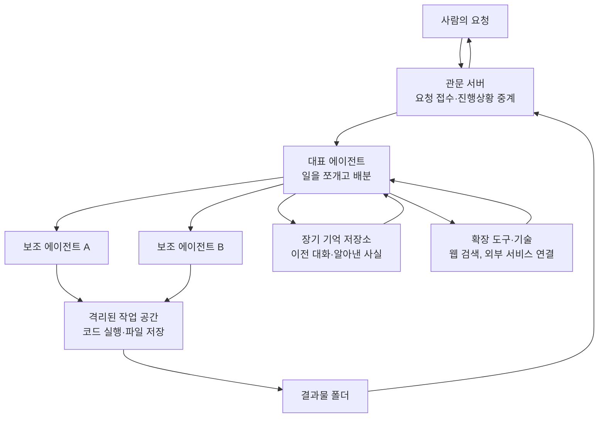

<div class="ai-knowledge-shell">

<aside class="ai-knowledge-sidebar">
  <p class="ai-eyebrow">CATEGORIES</p>
  <nav class="ai-cat-tree"><details class="ai-cat" open><summary><span class="catname">에이전트 오케스트레이션</span><span class="catcount">13</span></summary><ul><li><a href="https://altjs4510.github.io/ai_news_blog/knowledge/20260908/" class="current"><span class="kdate">2026-09-08</span><span class="ktitle">bytedance/deer-flow — 샌드박스·메모리·서브에이전트·메시지 게이트웨이를…</span></a></li><li><a href="https://altjs4510.github.io/ai_news_blog/knowledge/20260904/"><span class="kdate">2026-09-04</span><span class="ktitle">HarnessDev: Can LLMs Create and Evolve Their Own…</span></a></li><li><a href="https://altjs4510.github.io/ai_news_blog/knowledge/20260831-openexecutive-virtual-c-suite/"><span class="kdate">2026-08-31</span><span class="ktitle">Open Executive — 8명의 전문 에이전트를 하나의 임원 목소리로</span></a></li><li><a href="https://altjs4510.github.io/ai_news_blog/knowledge/20260828/"><span class="kdate">2026-08-28</span><span class="ktitle">Google ADK for Python v2.8.0 — RemoteA2aAgent 네이…</span></a></li><li><a href="https://altjs4510.github.io/ai_news_blog/knowledge/20260826/"><span class="kdate">2026-08-26</span><span class="ktitle">apache/maka — 도구 호출·권한 결정·종료 이벤트를 append-only 로그…</span></a></li><li><a href="https://altjs4510.github.io/ai_news_blog/knowledge/20260823/"><span class="kdate">2026-08-23</span><span class="ktitle">The Evolution of the Agent Harness — 하네스가 모델 가중치…</span></a></li><li><a href="https://altjs4510.github.io/ai_news_blog/knowledge/20260821/"><span class="kdate">2026-08-21</span><span class="ktitle">volcengine/OpenViking — 에이전트 메모리·Knowledge RAG·스…</span></a></li><li><a href="https://altjs4510.github.io/ai_news_blog/knowledge/20260805/"><span class="kdate">2026-08-05</span><span class="ktitle">TencentCloud/TencentDB-Agent-Memory — 대화·문서·코드를 …</span></a></li><li><a href="https://altjs4510.github.io/ai_news_blog/knowledge/20260623/"><span class="kdate">2026-06-23</span><span class="ktitle">bytedance/deer-flow — 샌드박스·메모리·서브에이전트·메시지 게이트웨이를…</span></a></li><li><a href="https://altjs4510.github.io/ai_news_blog/knowledge/20260611/"><span class="kdate">2026-06-11</span><span class="ktitle">The evolution of agentic surfaces: building with…</span></a></li><li><a href="https://altjs4510.github.io/ai_news_blog/knowledge/20260602/"><span class="kdate">2026-06-02</span><span class="ktitle">revfactory/harness — 도메인별 에이전트 팀과 스킬을 자동 설계하는 메타…</span></a></li><li><a href="https://altjs4510.github.io/ai_news_blog/knowledge/20260529/"><span class="kdate">2026-05-29</span><span class="ktitle">Introducing dynamic workflows in Claude Code</span></a></li><li><a href="https://altjs4510.github.io/ai_news_blog/knowledge/20260507/"><span class="kdate">2026-05-07</span><span class="ktitle">ruvnet/ruflo — Claude 멀티 에이전트 오케스트레이션 플랫폼</span></a></li></ul></details><details class="ai-cat" open><summary><span class="catname">MCP &amp; 도구 통합</span><span class="catcount">20</span></summary><ul><li><a href="https://altjs4510.github.io/ai_news_blog/knowledge/20260831-gitnexus-code-knowledge-graph/"><span class="kdate">2026-08-31</span><span class="ktitle">GitNexus — 코드베이스를 지식그래프로 바꿔 에이전트에게 쥐어주기</span></a></li><li><a href="https://altjs4510.github.io/ai_news_blog/knowledge/20260829/"><span class="kdate">2026-08-29</span><span class="ktitle">cursor/plugins — 플러그인 명세(specification)와 공식 플러그인…</span></a></li><li><a href="https://altjs4510.github.io/ai_news_blog/knowledge/20260802/"><span class="kdate">2026-08-02</span><span class="ktitle">Stateless MCP has recaptured my interest (and in…</span></a></li><li><a href="https://altjs4510.github.io/ai_news_blog/knowledge/20260801/"><span class="kdate">2026-08-01</span><span class="ktitle">different-ai/openwork — Claude Cowork의 오픈소스 대체 에…</span></a></li><li><a href="https://altjs4510.github.io/ai_news_blog/knowledge/20260731/"><span class="kdate">2026-07-31</span><span class="ktitle">different-ai/openwork — Claude Cowork의 오픈소스 대안(o…</span></a></li><li><a href="https://altjs4510.github.io/ai_news_blog/knowledge/20260729/"><span class="kdate">2026-07-29</span><span class="ktitle">Bringing MCP 2026-07-28 to Claude</span></a></li><li><a href="https://altjs4510.github.io/ai_news_blog/knowledge/20260721/"><span class="kdate">2026-07-21</span><span class="ktitle">tirth8205/code-review-graph — 로컬 우선 코드 인텔리전스 그래프…</span></a></li><li><a href="https://altjs4510.github.io/ai_news_blog/knowledge/20260719/"><span class="kdate">2026-07-19</span><span class="ktitle">tirth8205/code-review-graph — 로컬 우선 코드 인텔리전스 그래프…</span></a></li><li><a href="https://altjs4510.github.io/ai_news_blog/knowledge/20260718/"><span class="kdate">2026-07-18</span><span class="ktitle">tirth8205/code-review-graph — MCP·CLI용 로컬 코드 인텔리…</span></a></li><li><a href="https://altjs4510.github.io/ai_news_blog/knowledge/20260709/"><span class="kdate">2026-07-09</span><span class="ktitle">mvanhorn/last30days-skill — Reddit·X·YouTube·HN·…</span></a></li><li><a href="https://altjs4510.github.io/ai_news_blog/knowledge/20260708/"><span class="kdate">2026-07-08</span><span class="ktitle">Expanding Managed Agents in Gemini API: backgrou…</span></a></li><li><a href="https://altjs4510.github.io/ai_news_blog/knowledge/20260701/"><span class="kdate">2026-07-01</span><span class="ktitle">Google OKF (Open Knowledge Format) — 벤더 중립 에이전트 …</span></a></li><li><a href="https://altjs4510.github.io/ai_news_blog/knowledge/20260618/"><span class="kdate">2026-06-18</span><span class="ktitle">DeusData/codebase-memory-mcp — 158개 언어 코드베이스를 밀리…</span></a></li><li><a href="https://altjs4510.github.io/ai_news_blog/knowledge/20260606/"><span class="kdate">2026-06-06</span><span class="ktitle">chopratejas/headroom — Compress tool outputs, lo…</span></a></li><li><a href="https://altjs4510.github.io/ai_news_blog/knowledge/20260605/"><span class="kdate">2026-06-05</span><span class="ktitle">chopratejas/headroom — Compress tool outputs, lo…</span></a></li><li><a href="https://altjs4510.github.io/ai_news_blog/knowledge/20260604/"><span class="kdate">2026-06-04</span><span class="ktitle">chopratejas/headroom — Compress tool outputs bef…</span></a></li><li><a href="https://altjs4510.github.io/ai_news_blog/knowledge/20260603/"><span class="kdate">2026-06-03</span><span class="ktitle">How Bad MCP design cost your Agent 5× more token…</span></a></li><li><a href="https://altjs4510.github.io/ai_news_blog/knowledge/20260523/"><span class="kdate">2026-05-23</span><span class="ktitle">colbymchenry/codegraph — 사전 인덱싱된 코드 지식 그래프 MCP</span></a></li><li><a href="https://altjs4510.github.io/ai_news_blog/knowledge/20260517/"><span class="kdate">2026-05-17</span><span class="ktitle">I gave my LLM 100,000+ tools — Lazy Discovery &a…</span></a></li><li><a href="https://altjs4510.github.io/ai_news_blog/knowledge/20260509/"><span class="kdate">2026-05-09</span><span class="ktitle">How to connect 100 MCP servers without the conte…</span></a></li></ul></details><details class="ai-cat" open><summary><span class="catname">코딩 에이전트</span><span class="catcount">30</span></summary><ul><li><a href="https://altjs4510.github.io/ai_news_blog/knowledge/20260906/"><span class="kdate">2026-09-06</span><span class="ktitle">DietrichGebert/ponytail — 에이전트를 '방에서 가장 게으른 시니어 …</span></a></li><li><a href="https://altjs4510.github.io/ai_news_blog/knowledge/20260903/"><span class="kdate">2026-09-03</span><span class="ktitle">pacifio/atlas — 여러 코딩 에이전트의 변경을 한곳에서 추적·질의하는 '에이…</span></a></li><li><a href="https://altjs4510.github.io/ai_news_blog/knowledge/20260901/"><span class="kdate">2026-09-01</span><span class="ktitle">affaan-m/ECC — 스킬·본능·메모리·보안을 묶은 에이전트 하네스 성능 최적화 …</span></a></li><li><a href="https://altjs4510.github.io/ai_news_blog/knowledge/20260822/"><span class="kdate">2026-08-22</span><span class="ktitle">mattpocock/skills — Skills for Real Engineers (하…</span></a></li><li><a href="https://altjs4510.github.io/ai_news_blog/knowledge/20260820/"><span class="kdate">2026-08-20</span><span class="ktitle">akitaonrails/ai-memory — 코딩 에이전트 CLI의 장기 메모리와 벤더…</span></a></li><li><a href="https://altjs4510.github.io/ai_news_blog/knowledge/20260819/"><span class="kdate">2026-08-19</span><span class="ktitle">akitaonrails/ai-memory — 코딩 에이전트 CLI 간 장기 기억과 벤더…</span></a></li><li><a href="https://altjs4510.github.io/ai_news_blog/knowledge/20260814/"><span class="kdate">2026-08-14</span><span class="ktitle">cathrynlavery/diagram-design — Claude Code용 에디토리…</span></a></li><li><a href="https://altjs4510.github.io/ai_news_blog/knowledge/20260811/"><span class="kdate">2026-08-11</span><span class="ktitle">PrimeIntellect-ai/prime-agent — 장기 자율 실행을 전제로 설계…</span></a></li><li><a href="https://altjs4510.github.io/ai_news_blog/knowledge/20260810/"><span class="kdate">2026-08-10</span><span class="ktitle">Auto mode is now the default in Claude Code for …</span></a></li><li><a href="https://altjs4510.github.io/ai_news_blog/knowledge/20260809/"><span class="kdate">2026-08-09</span><span class="ktitle">PrimeIntellect-ai/prime-agent — 코딩 워크플로우·장기 자율 작…</span></a></li><li><a href="https://altjs4510.github.io/ai_news_blog/knowledge/20260808/"><span class="kdate">2026-08-08</span><span class="ktitle">PrimeIntellect-ai/prime-agent — 코딩 워크플로우와 장시간 자율…</span></a></li><li><a href="https://altjs4510.github.io/ai_news_blog/knowledge/20260804/"><span class="kdate">2026-08-04</span><span class="ktitle">esengine/DeepSeek-Reasonix — prefix-cache 안정성을 축…</span></a></li><li><a href="https://altjs4510.github.io/ai_news_blog/knowledge/20260728/"><span class="kdate">2026-07-28</span><span class="ktitle">alibaba/open-code-review — 결정론적 파이프라인 + LLM 에이전트…</span></a></li><li><a href="https://altjs4510.github.io/ai_news_blog/knowledge/20260725/"><span class="kdate">2026-07-25</span><span class="ktitle">The new rules of context engineering for Claude …</span></a></li><li><a href="https://altjs4510.github.io/ai_news_blog/knowledge/20260722/"><span class="kdate">2026-07-22</span><span class="ktitle">tirth8205/code-review-graph — MCP·CLI용 로컬 우선 코드 …</span></a></li><li><a href="https://altjs4510.github.io/ai_news_blog/knowledge/20260714/"><span class="kdate">2026-07-14</span><span class="ktitle">Graphify-Labs/graphify — 코드베이스를 질의 가능한 지식 그래프로 만…</span></a></li><li><a href="https://altjs4510.github.io/ai_news_blog/knowledge/20260707/"><span class="kdate">2026-07-07</span><span class="ktitle">AI Hero Skills Catalog — 실무 엔지니어를 위한 재사용 가능한 판단 …</span></a></li><li><a href="https://altjs4510.github.io/ai_news_blog/knowledge/20260705/"><span class="kdate">2026-07-05</span><span class="ktitle">openai/codex-plugin-cc — Claude Code에서 Codex를 위임…</span></a></li><li><a href="https://altjs4510.github.io/ai_news_blog/knowledge/20260626/"><span class="kdate">2026-06-26</span><span class="ktitle">google-labs-code/design.md — 코딩 에이전트에게 디자인 시스템을 …</span></a></li><li><a href="https://altjs4510.github.io/ai_news_blog/knowledge/20260619/"><span class="kdate">2026-06-19</span><span class="ktitle">Claude Code now supports artifacts</span></a></li><li><a href="https://altjs4510.github.io/ai_news_blog/knowledge/20260530/"><span class="kdate">2026-05-30</span><span class="ktitle">Leonxlnx/taste-skill — AI에게 좋은 취향을 부여해 generic s…</span></a></li><li><a href="https://altjs4510.github.io/ai_news_blog/knowledge/20260528/"><span class="kdate">2026-05-28</span><span class="ktitle">Building self-improving tax agents with Codex</span></a></li><li><a href="https://altjs4510.github.io/ai_news_blog/knowledge/20260526/"><span class="kdate">2026-05-26</span><span class="ktitle">colbymchenry/codegraph — Pre-indexed code knowle…</span></a></li><li><a href="https://altjs4510.github.io/ai_news_blog/knowledge/20260524/"><span class="kdate">2026-05-24</span><span class="ktitle">colbymchenry/codegraph — Pre-indexed code knowle…</span></a></li><li><a href="https://altjs4510.github.io/ai_news_blog/knowledge/20260521/"><span class="kdate">2026-05-21</span><span class="ktitle">colbymchenry/codegraph — Pre-indexed code knowle…</span></a></li><li><a href="https://altjs4510.github.io/ai_news_blog/knowledge/20260512/"><span class="kdate">2026-05-12</span><span class="ktitle">agentmemory — Persistent memory for AI coding ag…</span></a></li><li><a href="https://altjs4510.github.io/ai_news_blog/knowledge/20260510/"><span class="kdate">2026-05-10</span><span class="ktitle">addyosmani/agent-skills — Production-grade engin…</span></a></li><li><a href="https://altjs4510.github.io/ai_news_blog/knowledge/20260508/"><span class="kdate">2026-05-08</span><span class="ktitle">addyosmani/agent-skills — Production-grade engin…</span></a></li><li><a href="https://altjs4510.github.io/ai_news_blog/knowledge/20260506/"><span class="kdate">2026-05-06</span><span class="ktitle">mksglu/context-mode — AI 코딩 에이전트용 컨텍스트 윈도우 최적화</span></a></li><li><a href="https://altjs4510.github.io/ai_news_blog/knowledge/20260505/"><span class="kdate">2026-05-05</span><span class="ktitle">mattpocock/skills — Skills for Real Engineers (.…</span></a></li></ul></details><details class="ai-cat" open><summary><span class="catname">모델 &amp; 연구</span><span class="catcount">6</span></summary><ul><li><a href="https://altjs4510.github.io/ai_news_blog/knowledge/20260907-voicemem-dual-brain-memory/"><span class="kdate">2026-09-07</span><span class="ktitle">VoiceMem — 좌뇌·우뇌로 쪼갠 스트리밍 메모리로 음성 에이전트 지연 없애기</span></a></li><li><a href="https://altjs4510.github.io/ai_news_blog/knowledge/20260716-proprag/"><span class="kdate">2026-07-16</span><span class="ktitle">PropRAG — 프로포지션 경로 위 beam search로 멀티홉 검색 안내</span></a></li><li><a href="https://altjs4510.github.io/ai_news_blog/knowledge/20260620/"><span class="kdate">2026-06-20</span><span class="ktitle">zai-org/GLM-5 — From Vibe Coding to Agentic Engi…</span></a></li><li><a href="https://altjs4510.github.io/ai_news_blog/knowledge/20260617/"><span class="kdate">2026-06-17</span><span class="ktitle">Predicting model behavior before release by simu…</span></a></li><li><a href="https://altjs4510.github.io/ai_news_blog/knowledge/20260516/"><span class="kdate">2026-05-16</span><span class="ktitle">STALE — 에이전트가 자기 기억의 유효성을 인지할 수 있는가</span></a></li><li><a href="https://altjs4510.github.io/ai_news_blog/knowledge/20260513/"><span class="kdate">2026-05-13</span><span class="ktitle">Thinking Machines' Native Interaction Models — T…</span></a></li></ul></details><details class="ai-cat" open><summary><span class="catname">인프라 &amp; 컴퓨트</span><span class="catcount">8</span></summary><ul><li><a href="https://altjs4510.github.io/ai_news_blog/knowledge/20260905/"><span class="kdate">2026-09-05</span><span class="ktitle">magnitudedev/magnitude — 하드웨어에 맞는 최적 로컬 모델을 띄워 이…</span></a></li><li><a href="https://altjs4510.github.io/ai_news_blog/knowledge/20260813/"><span class="kdate">2026-08-13</span><span class="ktitle">semantica-agi/semantica — 컨텍스트와 책임 추적을 위한 그래프 네이…</span></a></li><li><a href="https://altjs4510.github.io/ai_news_blog/knowledge/20260812/"><span class="kdate">2026-08-12</span><span class="ktitle">semantica-agi/semantica — 컨텍스트와 '책임 추적 가능한(accou…</span></a></li><li><a href="https://altjs4510.github.io/ai_news_blog/knowledge/20260806/"><span class="kdate">2026-08-06</span><span class="ktitle">cloudflare/computer — 에이전트에게 컴퓨터를 통째로 주는 엣지 실행 샌…</span></a></li><li><a href="https://altjs4510.github.io/ai_news_blog/knowledge/20260724/"><span class="kdate">2026-07-24</span><span class="ktitle">diegosouzapw/OmniRoute — 단일 엔드포인트로 278+ 프로바이더·50…</span></a></li><li><a href="https://altjs4510.github.io/ai_news_blog/knowledge/20260723/"><span class="kdate">2026-07-23</span><span class="ktitle">diegosouzapw/OmniRoute — 268+ 프로바이더를 단일 엔드포인트로 묶…</span></a></li><li><a href="https://altjs4510.github.io/ai_news_blog/knowledge/20260522/"><span class="kdate">2026-05-22</span><span class="ktitle">Giving Agents Computers — Ivan Burazin, Daytona</span></a></li><li><a href="https://altjs4510.github.io/ai_news_blog/knowledge/20260520/"><span class="kdate">2026-05-20</span><span class="ktitle">New in Claude Managed Agents: self-hosted sandbo…</span></a></li></ul></details><details class="ai-cat" open><summary><span class="catname">보안 &amp; 거버넌스</span><span class="catcount">18</span></summary><ul><li><a href="https://altjs4510.github.io/ai_news_blog/knowledge/20260902/"><span class="kdate">2026-09-02</span><span class="ktitle">AIR raises $50M to help companies vet the skills…</span></a></li><li><a href="https://altjs4510.github.io/ai_news_blog/knowledge/20260827/"><span class="kdate">2026-08-27</span><span class="ktitle">Claude in Chrome is generally available</span></a></li><li><a href="https://altjs4510.github.io/ai_news_blog/knowledge/20260819-mind-viruses/"><span class="kdate">2026-08-19</span><span class="ktitle">탈옥도, 인젝션도 없이 — 대화로만 퍼지는 에이전트의 '마인드 바이러스'</span></a></li><li><a href="https://altjs4510.github.io/ai_news_blog/knowledge/20260730/"><span class="kdate">2026-07-30</span><span class="ktitle">Anatomy of a Frontier Lab Agent Intrusion: A Tec…</span></a></li><li><a href="https://altjs4510.github.io/ai_news_blog/knowledge/20260716/"><span class="kdate">2026-07-16</span><span class="ktitle">Dicklesworthstone/destructive_command_guard — 에이…</span></a></li><li><a href="https://altjs4510.github.io/ai_news_blog/knowledge/20260715/"><span class="kdate">2026-07-15</span><span class="ktitle">Dicklesworthstone/destructive_command_guard — 에이…</span></a></li><li><a href="https://altjs4510.github.io/ai_news_blog/knowledge/20260710/"><span class="kdate">2026-07-10</span><span class="ktitle">70개 MCP 서버 strace 런타임 감사 — 부팅 시 아웃바운드 호출 서버 적발</span></a></li><li><a href="https://altjs4510.github.io/ai_news_blog/knowledge/20260704/"><span class="kdate">2026-07-04</span><span class="ktitle">Cloudflare is about to block AI agents by defaul…</span></a></li><li><a href="https://altjs4510.github.io/ai_news_blog/knowledge/20260703/"><span class="kdate">2026-07-03</span><span class="ktitle">Giving admins more visibility and control over C…</span></a></li><li><a href="https://altjs4510.github.io/ai_news_blog/knowledge/20260630/"><span class="kdate">2026-06-30</span><span class="ktitle">Introducing the Claude apps gateway for Amazon B…</span></a></li><li><a href="https://altjs4510.github.io/ai_news_blog/knowledge/20260625/"><span class="kdate">2026-06-25</span><span class="ktitle">Agent identity in Claude Tag: a new access model…</span></a></li><li><a href="https://altjs4510.github.io/ai_news_blog/knowledge/20260624/"><span class="kdate">2026-06-24</span><span class="ktitle">Agent identity in Claude Tag: a new access model…</span></a></li><li><a href="https://altjs4510.github.io/ai_news_blog/knowledge/20260614/"><span class="kdate">2026-06-14</span><span class="ktitle">NVIDIA/SkillSpector — Security scanner for AI ag…</span></a></li><li><a href="https://altjs4510.github.io/ai_news_blog/knowledge/20260613/"><span class="kdate">2026-06-13</span><span class="ktitle">Fable 5's guardrails got bypassed in 48 hours — …</span></a></li><li><a href="https://altjs4510.github.io/ai_news_blog/knowledge/20260612/"><span class="kdate">2026-06-12</span><span class="ktitle">NVIDIA/SkillSpector — AI 에이전트 스킬용 보안 스캐너</span></a></li><li><a href="https://altjs4510.github.io/ai_news_blog/knowledge/20260607/"><span class="kdate">2026-06-07</span><span class="ktitle">OpenAI Help: Lockdown Mode</span></a></li><li><a href="https://altjs4510.github.io/ai_news_blog/knowledge/20260531/"><span class="kdate">2026-05-31</span><span class="ktitle">How we contain Claude across products</span></a></li><li><a href="https://altjs4510.github.io/ai_news_blog/knowledge/20260527/"><span class="kdate">2026-05-27</span><span class="ktitle">Microsoft Copilot Cowork Exfiltrates Files</span></a></li></ul></details><details class="ai-cat" open><summary><span class="catname">응용 사례</span><span class="catcount">6</span></summary><ul><li><a href="https://altjs4510.github.io/ai_news_blog/knowledge/20260726/"><span class="kdate">2026-07-26</span><span class="ktitle">citrolabs/ego-lite — 로그인된 브라우저 상태를 AI 에이전트와 공유하는…</span></a></li><li><a href="https://altjs4510.github.io/ai_news_blog/knowledge/20260717/"><span class="kdate">2026-07-17</span><span class="ktitle">After a year building agent memory, 'save everyt…</span></a></li><li><a href="https://altjs4510.github.io/ai_news_blog/knowledge/20260712/"><span class="kdate">2026-07-12</span><span class="ktitle">Do Automated Evals Work?</span></a></li><li><a href="https://altjs4510.github.io/ai_news_blog/knowledge/20260621/"><span class="kdate">2026-06-21</span><span class="ktitle">calesthio/OpenMontage — 12 파이프라인·52 도구·500+ 스킬을 …</span></a></li><li><a href="https://altjs4510.github.io/ai_news_blog/knowledge/20260609/"><span class="kdate">2026-06-09</span><span class="ktitle">Building intelligent apps for Apple platforms wi…</span></a></li><li><a href="https://altjs4510.github.io/ai_news_blog/knowledge/20260514/"><span class="kdate">2026-05-14</span><span class="ktitle">Introducing Claude for Small Business</span></a></li></ul></details><details class="ai-cat" open><summary><span class="catname">산업 동향</span><span class="catcount">9</span></summary><ul><li><a href="https://altjs4510.github.io/ai_news_blog/knowledge/20260907-humanmade-52week-rhythm/"><span class="kdate">2026-09-07</span><span class="ktitle">휴먼 메이드의 '52주 리듬' — 아이디어가 흔해진 시대에 값이 오르는 건 버리는 판단</span></a></li><li><a href="https://altjs4510.github.io/ai_news_blog/knowledge/20260830/"><span class="kdate">2026-08-30</span><span class="ktitle">[AINews] OpenAI shuts off Cursor — 프론티어 모델 공급 차단…</span></a></li><li><a href="https://altjs4510.github.io/ai_news_blog/knowledge/20260711/"><span class="kdate">2026-07-11</span><span class="ktitle">OpenAI says GPT 5.6 is the 'preferred model' for…</span></a></li><li><a href="https://altjs4510.github.io/ai_news_blog/knowledge/20260702/"><span class="kdate">2026-07-02</span><span class="ktitle">How Cursor deploys AI inside the enterprise (For…</span></a></li><li><a href="https://altjs4510.github.io/ai_news_blog/knowledge/20260616/"><span class="kdate">2026-06-16</span><span class="ktitle">Why AI hasn't replaced software engineers, and w…</span></a></li><li><a href="https://altjs4510.github.io/ai_news_blog/knowledge/20260610/"><span class="kdate">2026-06-10</span><span class="ktitle">Fable 5 just made cost-aware model routing manda…</span></a></li><li><a href="https://altjs4510.github.io/ai_news_blog/knowledge/20260519/"><span class="kdate">2026-05-19</span><span class="ktitle">Anthropic acquires Stainless</span></a></li><li><a href="https://altjs4510.github.io/ai_news_blog/knowledge/20260515/"><span class="kdate">2026-05-15</span><span class="ktitle">Clawdmeter — Claude Code 사용량을 데스크톱 대시보드로</span></a></li><li><a href="https://altjs4510.github.io/ai_news_blog/knowledge/20260504/"><span class="kdate">2026-05-04</span><span class="ktitle">Agents for Everything Else: Codex for Knowledge …</span></a></li></ul></details></nav>
</aside>

<article class="ai-knowledge-article">

<header class="ai-post-hero">
  <p class="ai-eyebrow"><a class="ai-back" href="../">KNOWLEDGE</a> · 2026-09-08 · 오늘의 학습</p>
  <h2 class="ai-post-title">bytedance/deer-flow — 샌드박스·메모리·서브에이전트·메시지 게이트웨이를 묶은 long-horizon SuperAgent 하네스</h2>
</header>

> 원문: [bytedance/deer-flow — 샌드박스·메모리·서브에이전트·메시지 게이트웨이를 묶은 long-horizon SuperAgent 하네스](https://github.com/bytedance/deer-flow)

## 📌 학습 정리

### 1. 한 줄로 말하면

여러 명의 AI 도우미가 각자 일을 맡아 몇 분에서 몇 시간까지 이어지는 긴 작업을 함께 끝내도록, 작업실·기억장치·연락망을 한 세트로 묶어 놓은 오픈소스 도구입니다. 이름은 DeerFlow 2.0이고, 만든 곳은 바이트댄스(ByteDance)입니다.

### 2. 왜 이게 만들어졌어요?

원래 이 프로젝트는 "딥 리서치(Deep Research)", 그러니까 AI가 자료를 찾아 읽고 보고서를 써주는 조사 도구였습니다. 그런데 조사 하나를 끝내는 것과, 몇 시간짜리 일을 중간에 멈추지 않고 계속 밀고 가는 것은 필요한 게 완전히 다릅니다. 긴 작업에는 코드를 실제로 돌려볼 공간, 앞에서 알아낸 걸 잊지 않는 기억, 일을 나눠 맡을 보조 일꾼, 그리고 그 일꾼들끼리 주고받는 연락 통로가 전부 필요하거든요. 그래서 2.0은 기존 코드를 하나도 재활용하지 않고 처음부터 다시 썼고(1.x 버전은 별도 브랜치로 유지됩니다), 조사 도구에서 "슈퍼 에이전트 하네스(super agent harness)" — 여러 AI를 태워서 굴리는 뼈대 — 로 성격을 바꿨습니다.

### 3. 비유로 풀면

이건 마치 **작은 프로젝트 사무실을 통째로 차려주는 것** 같은 거예요. 실험용 책상(격리된 실행 공간)이 따로 있고, 캐비닛에 지난 회의록이 쌓이고, 팀원 몇 명이 각자 일을 맡고, 그 사이를 오가는 사내 메신저가 있는 사무실이요. 사람은 "이거 좀 해줘"라고 말할 뿐, 안에서 누가 무엇을 하고 누구에게 넘기는지는 사무실 규칙이 정해줍니다.

또 하나, **전기 배선함**에 가까운 면도 있어요. 어떤 모델을 쓸지, 코드를 어디서 돌릴지, 결과를 어디로 보낼지를 설정 파일 한 곳에서 갈아끼우게 되어 있습니다. 그래서 결국 이 도구가 파는 건 똑똑함 자체가 아니라, **여러 AI를 오래 굴려도 안 무너지게 잡아주는 틀**입니다.

### 4. 어떻게 작동하는지 (그림으로)



사람이 요청을 넣으면 관문 서버(Gateway)가 받아서 대표 에이전트에게 넘기고, 대표는 일을 쪼개 보조 에이전트들에게 나눠 줍니다. 보조들은 격리된 작업 공간 안에서 코드를 돌리거나 파일을 만들고, 그동안 알아낸 사실은 기억 저장소에 쌓여 다음 판단에 다시 쓰입니다. 완성된 결과물은 지정된 출력 폴더에 놓이고, 관문 서버가 "이번 실행이 실제로 뭘 만들어냈는지"를 확인한 뒤에야 사용자에게 전달합니다.

### 5. 처음 보는 용어 풀이

- **에이전트 하네스 (agent harness)** — AI 모델 자체가 아니라, 모델을 태워서 일을 시키는 뼈대·마구입니다. 어떤 도구를 쥐여주고, 어디서 실행하고, 어떻게 결과를 받을지를 정해주는 층이에요.
- **보조 에이전트 (sub-agent)** — 대표 AI가 일부 업무를 떼어 맡기는 별도의 AI입니다. 사람이 팀원에게 "이 부분만 조사해줘"라고 위임하는 것과 같고, 원문에서는 한 번의 실행에서 몇 개까지 쓸지 상한도 설정할 수 있다고 합니다.
- **격리 실행 공간 (sandbox)** — AI가 만든 코드를 안전하게 돌려보는 분리된 방입니다. 내 컴퓨터에서 그대로 돌릴 수도, 도커(Docker)라는 격리 컨테이너 안에서 돌릴 수도, 쿠버네티스(Kubernetes)라는 서버 묶음 위에서 돌릴 수도 있습니다.
- **장기 기억 (long-term memory)** — 대화 한 판이 끝나도 남는 저장소입니다. 이전에 알아낸 사실이나 사용자의 취향을 다음 작업에서 다시 꺼내 쓰려고 두는 거예요.
- **모델 연결 규약 (MCP, Model Context Protocol)** — AI가 외부 서비스나 도구를 붙여 쓸 때의 공통 규격입니다. 도구 이름이 겹치지 않게 서버 이름을 앞에 붙여주거나, 오래 걸리는 작업을 배경에서 돌려놓고 나중에 결과를 받아오는 처리 같은 것들이 여기에 얹혀 있습니다.
- **관문 서버 (Gateway)** — 요청을 받고 진행 상황을 흘려보내는 앞단 서버입니다. 실행 중인 작업을 누가 소유하는지 관리하고, 중간에 취소되거나 서버가 죽어도 상태가 꼬이지 않게 정리하는 역할까지 합니다.
- **맥락 정리 (context compaction)** — 대화가 길어져 AI가 감당할 분량을 넘길 때, 앞부분을 요약해 자리를 비우는 작업입니다. 긴 작업일수록 필수라서 수동으로도 실행할 수 있게 열어뒀습니다.
- **점검 저장 (checkpoint)** — 작업 도중 상태를 중간중간 저장해두는 장치입니다. 문제가 생겼을 때 처음부터 다시 하지 않고 그 지점부터 이어가려는 목적이에요.

### 6. 한 발 더 들어가고 싶다면

- [DeerFlow 저장소](https://github.com/bytedance/deer-flow) — 설치 방법, 설정 파일 구조, 실행 모드를 원문 그대로 볼 수 있어요.
- [설치 안내 문서(Install.md)](https://raw.githubusercontent.com/bytedance/deer-flow/main/Install.md) — 코딩 도우미에게 그대로 건네면 알아서 설치를 진행하도록 만든 안내서라, "AI에게 설치를 시킨다"는 게 어떤 모습인지 감이 옵니다.

---

## 📖 원문 전체 번역 (정독용)

> 의역 최소화한 전체 번역입니다. 큰 흐름은 위 정리에서 잡고, 정확한 워딩이 필요할 땐 이 섹션에서 정독하세요.

# 🦌 DeerFlow - 2.0

English | 中文 | 日本語 | Français | Русский

2026년 2월 28일, DeerFlow는 버전 2 출시에 힘입어 GitHub Trending 🏆 #1 자리를 차지했습니다. 놀라운 커뮤니티 여러분께 정말 감사드립니다 — 여러분이 이걸 만들어냈습니다! 💪🔥

DeerFlow(**D**eep **E**xploration and **E**fficient **R**esearch **Flow**)는 서브에이전트(sub-agents), 메모리(memory), 샌드박스(sandboxes)를 오케스트레이션하여 거의 모든 것을 할 수 있는 오픈소스 **슈퍼 에이전트 하네스(super agent harness)**이며, **확장 가능한 스킬(extensible skills)**로 구동됩니다.

deer-flow-720p.mp4

> **Note**
> DeerFlow 2.0은 완전히 처음부터 다시 작성한 버전입니다.
> v1과 코드를 공유하지 않습니다. 원래의 Deep Research 프레임워크를 찾고 계시다면, `1.x` 브랜치에서 계속 관리되고 있습니다 — 그쪽에 대한 기여도 여전히 환영합니다. 활발한 개발은 2.0으로 이전했습니다.

## 공식 웹사이트

**공식 웹사이트**에서 더 자세히 알아보고 **실제 데모**를 확인하세요.
랜딩 페이지의 사례 연구(case studies)는 로그인 없이 화이트리스트로 지정된 읽기 전용 쇼케이스로 열립니다.

## 자매 프로젝트

**LLM Space** - DeerFlow 뒤에 숨은 우리의 비밀 병기를 만나보세요 — 에이전트 아이디어를 프로토타이핑하고, 각 하네스 단계를 검사하고, 실패를 리플레이하고, 성능을 벤치마킹할 수 있는 하나의 데스크톱 도구입니다.

## ByteDance Volcengine의 Coding Plan

DeerFlow 실행에는 Doubao-Seed-2.0-Code, DeepSeek v3.2, Kimi 2.5 사용을 강력히 권장합니다. 더 알아보기 — 중국 본토 지역의 개발자는 여기를 클릭하세요.

## InfoQuest

DeerFlow는 BytePlus가 독자적으로 개발한 지능형 검색 및 크롤링 툴셋인 **InfoQuest**를 새로 통합했습니다 (무료 온라인 체험 지원).

## 목차

- 🦌 DeerFlow - 2.0
- 공식 웹사이트
- ByteDance Volcengine의 Coding Plan
- InfoQuest
- 목차
- 한 줄 에이전트 설정
- 빠른 시작
  - 설정(Configuration)
  - 애플리케이션 실행
  - 배포 사이징
  - 옵션 1: Docker (권장)
  - 옵션 2: 로컬 개발
- 고급
  - 샌드박스 모드
  - MCP 서버
  - IM 채널
  - LangSmith 트레이싱
  - Langfuse 트레이싱
  - Monocle 트레이싱
  - 다중 프로바이더 사용
  - 개인 액세스 토큰
- Deep Research에서 Super Agent Harness로
- 핵심 기능
  - 스킬 & 도구
  - Claude Code 통합
  - 세션 목표(Session Goals)
  - 수동 컨텍스트 압축(Manual Context Compaction)
  - 서브에이전트
  - 샌드박스 & 파일 시스템
  - 컨텍스트 엔지니어링
  - 장기 메모리(Long-Term Memory)
  - 권장 모델
  - 임베디드 Python 클라이언트
  - 예약 작업(Scheduled Tasks)
  - 터미널 워크벤치(TUI)
- 문서
- ⚠️ 보안 공지
  - 잘못된 배포는 보안 위험을 초래할 수 있음
  - 보안 권장사항
- 기여
- 라이선스
- 감사의 말
  - 주요 기여자
- Star History

## 한 줄 에이전트 설정

Claude Code, Codex, Cursor, Windsurf 또는 다른 코딩 에이전트를 사용한다면, 다음 한 문장으로 설정 안내를 넘겨줄 수 있습니다:

```
Help me clone DeerFlow if needed, then bootstrap it for local development by following https://raw.githubusercontent.com/bytedance/deer-flow/main/Install.md
```

이 프롬프트는 코딩 에이전트를 위한 것입니다. 필요하면 레포를 클론하고, 가능하면 Docker를 선택하고, 사용자가 아직 제공해야 할 누락된 설정과 함께 정확한 다음 명령어를 제시하며 멈추도록 에이전트에게 지시합니다.

## 빠른 시작

### 설정(Configuration)

**DeerFlow 레포지토리 클론**

```
git clone https://github.com/bytedance/deer-flow.git
cd deer-flow
```

**설정 마법사 실행**

프로젝트 루트 디렉토리(`deer-flow/`)에서 다음을 실행합니다:

```
make setup
```

이는 LLM 프로바이더 선택, 선택적 웹 검색, 그리고 샌드박스 모드·bash 액세스·파일 쓰기 도구 같은 실행/안전 설정을 안내하는 대화형 마법사를 실행합니다. 최소한의 `config.yaml`을 생성하고 키를 `.env`에 기록합니다. 약 2분 정도 걸립니다.

마법사는 선택적 웹 검색 프로바이더도 설정할 수 있게 해주며, 지금은 건너뛸 수도 있습니다.

언제든 `make doctor`를 실행해 설정을 검증하고 실행 가능한 수정 힌트를 받을 수 있습니다.

로컬 설정이나 런타임 문제에 대해 GitHub 이슈를 여는 경우, `make support-bundle`을 실행하세요. 이 명령은 리포터의 다음 단계를 출력하고, 이슈에 붙여넣을 `*-issue-summary.md` 파일과 AI 지원 이슈 제출용 `*-issue-draft.md` 파일, 그리고 선택적으로 `.deer-flow/support-bundles/` 아래 증거 zip 파일을 작성합니다. AI 어시스턴트가 이슈를 제출하는 경우, 없는 사실을 지어내는 대신 초안에서 시작해 모든 REQUIRED 플레이스홀더를 채워야 합니다. zip 파일은 관리자가 요청하거나 요약만으로 충분하지 않을 때만 첨부하세요. 관리자와 AI 트리아지 도구는 `triage.json`에서 시작할 수 있습니다. 번들에는 마스킹된 진단 정보와 파일 매니페스트만 포함되며, `.env`, 원본 대화 메시지, 사용자 파일 내용은 포함되지 않습니다.

**고급 / 수동 설정**: `config.yaml`을 직접 편집하고 싶다면 대신 `make config`를 실행해 전체 템플릿을 복사하세요. CLI 기반 프로바이더(Codex CLI, Claude Code OAuth), OpenRouter, Responses API, `subagents.max_total_per_run` 같은 서브에이전트 런타임 상한 등을 포함한 전체 레퍼런스는 `config.example.yaml`을 참조하세요.

선택적 모델별 가격 책정은 가격이 매겨진 모든 모델에 걸쳐 단일 통화를 사용해야 합니다. 통화가 섞이면 DeerFlow는 유효하지 않은 집계값을 표시하는 대신 Console 비용 추정치를 비활성화합니다.

**수동 모델 설정 예시**

```yaml
models:
  - name: gpt-4o
    display_name: GPT-4o
    use: langchain_openai:ChatOpenAI
    model: gpt-4o
    api_key: $OPENAI_API_KEY

  - name: openrouter-gemini-2.5-flash
    display_name: Gemini 2.5 Flash (OpenRouter)
    use: langchain_openai:ChatOpenAI
    model: google/gemini-2.5-flash-preview
    api_key: $OPENROUTER_API_KEY
    base_url: https://openrouter.ai/api/v1

  - name: gpt-5-responses
    display_name: GPT-5 (Responses API)
    use: langchain_openai:ChatOpenAI
    model: gpt-5
    api_key: $OPENAI_API_KEY
    use_responses_api: true
    output_version: responses/v1

  - name: qwen3-32b-vllm
    display_name: Qwen3 32B (vLLM)
    use: deerflow.models.vllm_provider:VllmChatModel
    model: Qwen/Qwen3-32B
    api_key: $VLLM_API_KEY
    base_url: http://localhost:8000/v1
    supports_thinking: true
    when_thinking_enabled:
      extra_body:
        chat_template_kwargs:
          enable_thinking: true
```

OpenRouter 및 유사한 OpenAI 호환 게이트웨이는 `langchain_openai:ChatOpenAI`와 `base_url`을 함께 사용해 설정해야 합니다. 프로바이더별 환경 변수 이름을 선호한다면 `api_key`를 해당 변수로 명시적으로 지정하세요(예: `api_key: $OPENROUTER_API_KEY`).

OpenAI 모델을 `/v1/responses`를 통해 라우팅하려면 계속 `langchain_openai:ChatOpenAI`를 사용하되 `use_responses_api: true`와 `output_version: responses/v1`을 설정하세요.

설정 마법사에는 Z.AI GLM-5.3-Flash 프로필이 포함되어 있습니다. 이 모델은 thinking을 필요로 하고 자체 제한된 effort 레벨만 허용하기 때문에, 호환성 프로필은 모든 foreground/background 호출에서 thinking을 계속 활성화하고 DeerFlow의 일반적인 effort 선택기를 일시적으로 억제합니다. 이에 상응하는 수동 설정은 `config.example.yaml`을 참조하세요.

vLLM 0.19.0에는 `deerflow.models.vllm_provider:VllmChatModel`을 사용하세요. Qwen 스타일 reasoning 모델의 경우, DeerFlow는 `extra_body.chat_template_kwargs.enable_thinking`으로 reasoning을 토글하고, 다중 턴 tool-call 대화 전체에 걸쳐 vLLM의 비표준 `reasoning` 필드를 보존합니다. 레거시 `thinking` 설정은 하위 호환성을 위해 자동으로 정규화됩니다. 엔드포인트가 모든 스트리밍 청크마다 누적 사용량 스냅샷을 보고하는 경우, `cumulative_stream_usage: true`를 설정하면 DeerFlow가 그 스냅샷을 청크 단위 델타로 변환합니다. 이 옵션은 기본적으로 비활성화되어 있으며, 안정적인 completion id를 사용할 수 없을 때는 사용량을 그대로 둡니다. Reasoning 모델은 또한 서버가 `--reasoning-parser ...`로 시작되어야 할 수도 있습니다. 로컬 vLLM 배포가 비어 있지 않은 임의의 API 키를 받아들인다면, `VLLM_API_KEY`를 플레이스홀더 값으로 설정해도 됩니다.

**CLI 기반 프로바이더 예시:**

```yaml
models:
  - name: gpt-5.4
    display_name: GPT-5.4 (Codex CLI)
    use: deerflow.models.openai_codex_provider:CodexChatModel
    model: gpt-5.4
    supports_thinking: true
    supports_reasoning_effort: true

  - name: claude-sonnet-4.6
    display_name: Claude Sonnet 4.6 (Claude Code OAuth)
    use: deerflow.models.claude_provider:ClaudeChatModel
    model: claude-sonnet-4-6
    max_tokens: 4096
    supports_thinking: true
```

- Codex CLI는 `~/.codex/auth.json`을 읽습니다
- Claude Code는 `CLAUDE_CODE_OAUTH_TOKEN`, `ANTHROPIC_AUTH_TOKEN`, `CLAUDE_CODE_CREDENTIALS_PATH`, 또는 `~/.claude/.credentials.json`을 받아들입니다

ACP 에이전트 항목은 모델 프로바이더와는 별개입니다 — `acp_agents.codex`를 설정한다면 `npx -y @zed-industries/codex-acp` 같은 Codex ACP 어댑터를 가리키도록 하세요.

MiniMax Code는 ACP를 직접 구사합니다. 설치하고 인증한 다음 ACP 에이전트로 추가하세요:

```
npm install --global @minimax-ai/code
mcode login
```

```yaml
acp_agents:
  mcode:
    command: mcode
    args: ["acp"]
    description: MiniMax Code for implementation, refactoring, debugging, and repository tasks
    auto_approve_permissions: false
```

`mcode`는 Gateway 프로세스의 `PATH`에 있어야 합니다. Docker 호스트에만 설치하는 것으로는 Gateway 컨테이너 내부에서 사용할 수 없습니다. DeerFlow는 스레드별 ACP 워크스페이스에서 `invoke_acp_agent`를 통해 이를 호출하고, 활성화된 MCP 서버들을 전달합니다. 신뢰할 수 없는 작업에는 `auto_approve_permissions: false`를 유지하세요. MCode가 파일을 편집하거나 명령을 실행해야 하고 해당 작업을 신뢰할 때만 활성화하세요.

macOS에서는 필요하면 Claude Code 인증을 명시적으로 export하세요:

```
eval "$(python3 scripts/export_claude_code_oauth.py --print-export)"
```

API 키는 `.env`(권장)에 수동으로 설정하거나 셸에서 export할 수도 있습니다:

```
OPENAI_API_KEY=your-openai-api-key
TAVILY_API_KEY=your-tavily-api-key
```

### 애플리케이션 실행

#### 배포 사이징

DeerFlow 실행 방식을 선택할 때 실용적인 출발점으로 아래 표를 사용하세요:

| 배포 대상 | 시작 사양 | 권장 사양 | 비고 |
|---|---|---|---|
| 로컬 평가 / `make dev` | 4 vCPU, 8GB RAM, 20GB 여유 SSD | 8 vCPU, 16GB RAM | 개발자 1인 또는 호스팅형 모델 API를 쓰는 가벼운 세션 1개에 적합. 2 vCPU/4GB는 대개 부족함. |
| Docker 개발 / `make docker-start` | 4 vCPU, 8GB RAM, 25GB 여유 SSD | 8 vCPU, 16GB RAM | 이미지 빌드, 바인드 마운트, 샌드박스 컨테이너는 순수 로컬 개발보다 더 많은 여유가 필요함. |
| 장기 운영 서버 / `make up` | 8 vCPU, 16GB RAM, 40GB 여유 SSD | 16 vCPU, 32GB RAM | 공유 사용, 멀티 에이전트 실행, 보고서 생성, 또는 더 무거운 샌드박스 워크로드에 권장. |

이 수치들은 DeerFlow 자체를 대상으로 합니다. 로컬 LLM도 호스팅한다면 그 서비스는 별도로 사이징하세요.

지속적인 서버 운영에는 Linux + Docker가 권장 배포 대상입니다. macOS와 Windows는 개발 또는 평가 환경으로 취급하는 것이 가장 좋습니다.

CPU나 메모리 사용량이 고정적으로 최대치에 머문다면 먼저 동시 실행 수를 줄이고, 그다음 상위 사이징 티어로 이동하세요.

#### 옵션 1: Docker (권장)

Docker Desktop / Docker Engine과 **Docker Compose v2.24+**(`docker compose version`)가 필요합니다. 구버전 Compose 클라이언트는 `docker/docker-compose-dev.yaml`의 선택적 `env_file` 문법을 파싱할 수 없습니다.

**개발용** (핫 리로드, 소스 마운트):

```
make docker-init    # 샌드박스 이미지 pull (최초 1회 또는 이미지 업데이트 시)
make docker-start   # 서비스 시작 (config.yaml에서 샌드박스 모드 자동 감지)
make docker-logs    # 로그 확인
```

`make docker-start`는 `config.yaml`이 provisioner 모드(`provisioner_url`이 있는 `sandbox.use: deerflow.community.aio_sandbox:AioSandboxProvider`)를 사용할 때만 `provisioner`를 시작합니다.

Docker 빌드는 기본적으로 업스트림 `uv` 레지스트리를 사용합니다. 제한된 네트워크에서 더 빠른 미러가 필요하다면, `make docker-init` 또는 `make docker-start` 실행 전에 `UV_INDEX_URL=https://pypi.tuna.tsinghua.edu.cn/simple`과 `NPM_REGISTRY=https://registry.npmmirror.com`을 export하세요.

로컬 AIO 샌드박스 제어 트래픽은 항상 직접 연결됩니다: 루프백/사설 주소, 단일 레이블 클러스터 호스트, Docker/Podman 내부 호스트명은 `HTTP_PROXY`나 `HTTPS_PROXY`를 상속받지 않습니다. 외부 샌드박스 FQDN과 공인 IP는 환경 프록시 설정을 계속 따릅니다.

백엔드 프로세스는 다음 config 접근 시점에 `config.yaml` 변경 사항을 자동으로 반영하므로, 모델 메타데이터 업데이트에는 수동 재시작이 필요하지 않습니다.

체크포인트 저장 설정 `database.checkpoint_channel_mode`와 `database.checkpoint_delta.snapshot_frequency`(기본값 `10`)는 예외입니다. 둘 다 프로세스가 처음 에이전트를 빌드할 때(`DeerFlowClient`를 통한 경우 포함) 고정되며, 안전하게 변경하려면 프로세스 재시작이 필요합니다.

선택적 `database.checkpoint_cache` 섹션(delta 채널 모드 전용)은 구체화된 체크포인트 히스토리를 캐시합니다: `type`은 `memory`(기본값) 또는 `redis`이며, `max_entries: 0`은 캐시를 비활성화합니다. `redis` 백엔드는 Gateway/비동기 전용입니다. 동기식 TUI/임베디드 경로는 `memory`만 지원합니다. 캐시는 성능 전용입니다 — 비활성화해도 결과는 동일합니다 — 따라서 절대 고정되지 않으며, 하나의 체크포인트 데이터베이스를 공유하는 워커들이 서로 다른 캐시 설정으로 안전하게 실행될 수 있습니다.

> **Tip**
> Linux에서 Docker 기반 명령이 `permission denied while trying to connect to the Docker daemon socket at unix:///var/run/docker.sock`로 실패한다면, 사용자를 `docker` 그룹에 추가하고 재로그인한 후 다시 시도하세요. 전체 수정 방법은 `CONTRIBUTING.md`를 참조하세요.

**프로덕션** (로컬에서 이미지를 빌드하고, 런타임 설정과 데이터를 마운트):

```
make up      # 이미지 빌드 및 모든 프로덕션 서비스 시작
make down    # 컨테이너 중지 및 제거
```

접속: `http://localhost:2026`

`make up`은 성공을 보고하기 전에 Gateway `/health` 엔드포인트를 대기합니다. Gateway가 시작 대기 시간 내에 정상 상태가 되지 않으면, 배포는 0이 아닌 코드로 종료되고 컨테이너 상태와 최근 Gateway 로그를 출력합니다. 프로덕션 이미지는 이미 빌드된 환경에서 시작하며 컨테이너 시작 시 Python 종속성을 resolve하거나 설치하지 않습니다.

지속적인 배포를 위해서는 `database.backend`를 `sqlite` 또는 `postgres`로 설정하세요. 선택한 백엔드는 LangGraph checkpointer, LangGraph Store, DeerFlow 애플리케이션 데이터가 공유합니다. 존재하는 경우, 지원 중단된 `checkpointer` 섹션은 하위 호환성을 위해 앞의 두 가지를 오버라이드합니다.

통합 nginx 엔드포인트는 기본적으로 same-origin이며 브라우저 CORS 헤더를 내보내지 않습니다. split-origin이나 포트 포워딩된 브라우저 클라이언트를 운영한다면, `GATEWAY_CORS_ORIGINS`를 `http://localhost:3000` 같은 쉼표로 구분된 정확한 origin들로 설정하세요. 그러면 Gateway가 CORS 허용목록과 매칭되는 CSRF origin 검사를 적용합니다.

브라우저 로그인은 `HttpOnly` 세션 쿠키를 사용합니다. 로그인 페이지는 요청이 HTTPS(신뢰할 수 있는 `X-Forwarded-Proto: https` 포함)이거나 localhost HTTP일 때 브라우저 세션을 연장하는 "로그인 상태 유지" 옵션을 제공합니다. localhost 예외는 직접 요청의 `Host`를 사용하며 포워딩된 host 헤더는 무시합니다. 많은 임시 샌드박스 URL을 포함한 공개 HTTP 배포는 기본적으로 세션 쿠키로 폴백됩니다. DeerFlow는 비밀번호를 브라우저 저장소에 절대 저장하지 않습니다. UI는 이메일 주소만 기억할 수 있습니다.

DeerFlow는 프록시 뒤에서 브라우저 측 스킴과 origin을 복원하기 위해 여전히 `Forwarded`/`X-Forwarded-*` 헤더를 사용합니다. 번들된 nginx는 `X-Forwarded-Proto`를 설정하지만, 업스트림 HTTPS 값을 보존하며 모든 forwarded 헤더를 덮어쓰지는 않습니다. 트래픽이 DeerFlow에 도달하기 전에 클라이언트가 제공한 포워딩 헤더를 교체하거나 제거하도록 외부의 신뢰된 프록시를 설정하세요.

> **Important**
> Gateway는 여전히 프로세스 내에서 활성 실행 작업(active run tasks)을 소유하므로, 프로덕션은 기본적으로 단일 Gateway 워커(`GATEWAY_WORKERS=1`)로 동작합니다. 멀티 워커 배포에는 Postgres, Redis 스트림 브리지(`stream_bridge.type: redis`), `run_ownership.heartbeat_enabled: true`, 그리고 `run_events.backend: db`가 필요합니다. 프로세스 로컬 메모리/JSONL 이벤트 저장소는 워커 전반에 걸쳐 단일 전달 영수증(singleton delivery receipts)을 강제할 수 없습니다. 브리지는 워커 간 SSE 전달과 유계(bounded) `Last-Event-ID` 재생을 공유합니다. 유효한 재연결 커서가 trim되었거나, 이미 빈 스트림 대기를 확립한 구독자가 첫 전달 이전에 뒤처진 경우, Memory와 Redis는 부분 재생을 조용히 반환하는 대신 기계 판독 가능한 SSE `gap` 이벤트를 발생시킵니다. Web UI는 지속적인 스레드/이벤트 상태를 다시 로드하고 남은 tail부터 재개합니다. 리스(lease) 조정은 죽은 워커의 실행을 오류로 표시하고, 그 전달 영수증을 저장하고, 종료 스트림 마커를 발행하고, 보존된 스트림 정리를 예약하고, 영향받은 스레드 상태를 업데이트합니다. SSE, `/wait`, 그리고 내부 스트림 소비자는 idle 상태 확인을 위해 `stream_bridge.heartbeat_interval_seconds`(기본값 `15`)를 사용합니다. 이를 변경하려면 Gateway 재시작이 필요합니다. 잘못된 형식의 Redis 재연결 ID는 보존된 버퍼를 재생하는 대신 새 이벤트를 live-tail하며, 롤링 보존 버퍼 TTL(`stream_ttl_seconds`)은 실행 타임아웃이 아니라 정리용 안전장치로 남아 있습니다. IM 채널 상태 및 기타 프로세스 로컬 서비스는 여전히 자체 멀티 워커 조정이 필요합니다.
>
> 실행이 종료 스트림 마커를 발행한 후, 그 프로세스 로컬 `RunRecord`는 정리 전까지 기존의 5분 유예 기간 동안 계속 사용 가능합니다. 지속적인 실행 이력은 `RunStore`를 통해 계속 사용 가능하며, 스트림 브리지는 별도의 정리 일정에 따라 전달 tail을 보존합니다.
>
> 실행 취소(run cancellation)는 어느 Gateway 워커에든 도달할 수 있습니다. 비소유(non-owning) 워커는 이제 인터럽트 또는 롤백 요청을 활성 소유자(live owner)를 위해 저장하며, 소유자는 리스 갱신 시 이를 감지하고 정상적인 취소 흐름을 수행합니다. 로드 밸런서 라우팅만으로는 더 이상 409를 발생시키지 않습니다. 재시도가 소유자에게 도달하더라도 처음 수락된 액션이 우선하며, 수락된 취소는 소유자 완료와 원자적으로 경쟁합니다. 죽은 소유자는 여전히 리스 인수(lease takeover)와 고아(orphan) 복구를 따릅니다. 따라서 취소 지연 시간은 리스 하트비트 간격에 의해 상한이 정해집니다.
>
> 모델 복구 프로브(recovery probe)를 취소하면(대기 중이거나 재시도 대기 중일 때 포함) 다음 호출이 프로바이더가 복구되었는지 확인할 수 있게 됩니다. 취소는 프로바이더 실패로 집계되지 않으며 다른 호출의 활성 복구 프로브를 해제하지도 않습니다.
>
> 리스 하트비트가 활성화된 상태에서, 일시적인 RunStore 갱신 오류는 마지막으로 확인된 리스가 만료될 때까지만 재시도됩니다. 그 후 stale 워커는 로컬 실행을 취소하고 체크포인트, 완료 훅, 전달 영수증, 스레드 상태 마무리 처리를 억제합니다. 이미 진행 중인 원격 도구 부수 효과(side effect)는 여전히 로컬 취소 범위 밖에 있을 수 있습니다.
>
> 조정(reconciliation)은 후보 선택 후 리스를 다시 확인하는 원자적 인수 클레임(atomic takeover claim)을 사용하므로, 성공적인 소유자 갱신이 고아 복구보다 우선하며 하나의 조정자만 실행을 복구됨으로 보고할 수 있습니다. 여러 Gateway 워커가 Docker/AIO 또는 E2B 샌드박스 백엔드를 공유할 때는 `sandbox.ownership.type: redis`도 설정하세요. E2B는 백그라운드 시작 및 주기적 조정 시 이 리스를 사용하므로, 중복/고아 정리가 살아있는 피어의 샌드박스를 종료시킬 수 없습니다.

상세한 Docker 개발 가이드는 `CONTRIBUTING.md`를 참조하세요.

#### 옵션 2: 로컬 개발

서비스를 로컬에서 실행하는 것을 선호한다면:

전제 조건: 먼저 위의 "설정(Configuration)" 단계를 완료하세요 (`make setup`).

`make dev`는 프로젝트 루트에 유효한 `config.yaml`이 필요합니다. 해당 루트를 명시적으로 지정하려면 `DEER_FLOW_PROJECT_ROOT`를, 특정 설정 파일을 가리키려면 `DEER_FLOW_CONFIG_PATH`를 설정하세요. 런타임 상태는 기본적으로 프로젝트 루트 아래 `.deer-flow`이며 `DEER_FLOW_HOME`으로 이동할 수 있습니다. 스킬은 기본적으로 프로젝트 루트 아래 `skills/`이며 `DEER_FLOW_SKILLS_PATH`로 이동할 수 있습니다. 시작 전에 `make doctor`를 실행해 설정을 검증하세요.

Windows에서는 Git Bash에서 로컬 개발 플로우를 실행하세요. 네이티브 `cmd.exe`와 PowerShell 셸은 bash 기반 서비스 스크립트에서 지원되지 않으며, 일부 스크립트가 `cygpath` 같은 Git for Windows 유틸리티에 의존하기 때문에 WSL도 보장되지 않습니다.

문서화된 루트 `make` 명령들은 레포지토리의 `.sh` 파일들을 Bash를 통해 명시적으로 호출합니다. 따라서 POSIX 실행 비트를 보존하지 않는 소스 아카이브나 파일시스템에서도 계속 동작합니다. 그런 체크아웃에서 스크립트를 직접 호출할 때는 `bash ./scripts/<name>.sh ...`를 사용하세요.

**전제 조건 확인**:

```
make check   # Node.js 22+, pnpm, uv, nginx 확인
```

로컬 `make check`, `make install`, `make dev`, `make start` 진입점은 가능하면 직접 `pnpm`/`pnpm.cmd` 실행 파일을 사용하고, 그렇지 않으면 `corepack pnpm`으로 폴백합니다. 공유 러너와 진단은 레포지토리 경로를 절대 경로로 resolve하므로, 이 체크들은 호출자의 현재 디렉토리와 무관하게 동작합니다. Corepack은 `frontend/`에서 실행되므로 `frontend/package.json`에 고정된 `packageManager` 버전을 따릅니다. 전역 pnpm shim을 활성화할 필요가 없습니다.

**종속성 설치**:

```
make install   # 백엔드 + 프론트엔드 종속성 + pre-commit 훅 설치
```

**(선택) 샌드박스 이미지 사전 pull**:

```
# Docker/컨테이너 기반 샌드박스를 사용하는 경우 권장
make setup-sandbox
```

**(선택) 로컬 검토용 샘플 메모리 데이터 로드**:

```
python scripts/load_memory_sample.py
```

이는 샘플 픽스처를 기본 로컬 런타임 메모리 파일에 복사하여, 검토자가 즉시 `Settings > Memory`를 테스트할 수 있게 합니다. 가장 짧은 검토 흐름은 `backend/docs/MEMORY_SETTINGS_REVIEW.md`를 참조하세요.

**서비스 시작**:

```
make dev
```

**접속**: `http://localhost:2026`

로컬 서비스는 항상 내부 포트(`8001`, `3000`, `2026`)를 사용합니다. 루트 `.env` 변수 `PORT`는 공개된 Docker ingress만 설정하며, `make dev`가 사용하는 Next.js 포트는 변경하지 않습니다.

**시작 모드**

DeerFlow는 Gateway API 내부에서 에이전트 런타임을 실행합니다. 개발 모드는 핫 리로드를 활성화하고, 프로덕션 모드는 미리 빌드된 프론트엔드를 사용합니다.

| | 로컬 포그라운드 | 로컬 데몬 | Docker Dev | Docker Prod |
|---|---|---|---|---|
| Dev | `./scripts/serve.sh --dev` `make dev` | `./scripts/serve.sh --dev --daemon` `make dev-daemon` | `./scripts/docker.sh start` `make docker-start` | — |
| Prod | `./scripts/serve.sh --prod` `make start` | `./scripts/serve.sh --prod --daemon` `make start-daemon` | — | `./scripts/deploy.sh` `make up` |

| 액션 | 로컬 | Docker Dev | Docker Prod |
|---|---|---|---|
| Stop | `./scripts/serve.sh --stop` `make stop` | `./scripts/docker.sh stop` `make docker-stop` | `./scripts/deploy.sh down` `make down` |
| Restart | `./scripts/serve.sh --restart [flags]` | `./scripts/docker.sh restart` | — |

`make start`와 `make start-daemon`은 실행할 때마다 `next build`로 프론트엔드를 다시 빌드합니다. 마지막 빌드를 재사용하려면 `SKIP_FRONTEND_BUILD=1`을 전달하세요(또는 `./scripts/serve.sh --prod`를 직접 호출할 때 `--skip-frontend-build`를 추가). 이것은 opt-in입니다: `frontend/.next`에 완료된 빌드가 없으면 빠르게 실패합니다.

Gateway는 `/api/langgraph/*`를 소유하며, nginx 뒤에서 이 공개 LangGraph 호환 경로들을 자체 `/api/*` 라우터로 변환합니다.

**LangGraph Studio (선택 사항)**

기본 `make dev` 토폴로지는 DeerFlow의 Gateway 내장 런타임을 사용하며 LangGraph Studio가 필요하지 않습니다. 등록된 lead-agent 그래프를 독립형 개발 서버로 검사하고 테스트하려면, CLI가 `langgraph.json`을 찾을 수 있도록 `backend/`에서 다음 명령을 실행하세요:

```
cd backend
uv run langgraph dev --allow-blocking
```

이 명령은 로컬 API와 Studio UI URL을 출력합니다. 이 인메모리 서버는 개발 및 테스트 전용입니다. 이 플래그는 로컬 Studio 요청 동안 DeerFlow의 동기식 설정 및 그래프-팩토리 설정을 허용합니다. 프로덕션 서버 설정으로 취급되어서는 안 됩니다. 로컬 Studio 인증은 자동으로 처리되므로, 연결에 커스텀 헤더가 필요하지 않습니다. 프로덕션 워크로드에는 DeerFlow의 문서화된 프로덕션 시작 모드나 지원되는 LangSmith 배포를 사용하세요. 이 독립형 모드에서 어시스턴트 소유권과 출처(provenance)는 서버 소유입니다: Studio는 등록된 그래프와 그것이 생성하는 어시스턴트들을 발견할 수 있으며, 정상적인 어시스턴트 버전 선택이 계속 가능합니다.

잠긴(locked) 로컬 런타임이 지속된 개발 저장소를 로드하기 전에, DeerFlow는 레거시 어시스턴트 행(row)과 버전 이력을 복구하여 과거 클라이언트 메타데이터가 서버 권한을 복원하거나 런타임의 시작 정리(startup cleanup)에 의해 폐기되지 않도록 합니다. 백엔드 종속성을 `uv sync`로 동기화된 상태로 유지하세요. 이 호환성 경로는 선언된 LangGraph 런타임 버전을 요구하며, 지속된 저장소 계약(contract)이 더 이상 예상과 일치하지 않으면 경고를 기록합니다.

문서화된 명령은 LangGraph의 파일 기반 커스텀 앱 로더를 사용하며, 이는 DeerFlow의 회귀 테스트에서도 직접 다뤄집니다.

`backend/langgraph.json`을 LangGraph Studio나 직접적인 LangGraph Server를 통해 호출하는 워크플로우의 경우, DeerFlow는 해당 런타임이 발행한 인증된 신원(identity)을 소비하여 커스텀 에이전트 설정/SOUL, 사용자 스킬 및 스킬 정책, 업로드, 스레드 데이터, 메모리 읽기/쓰기에 사용합니다. 이는 인증된 실행이 공유 `default` 파일시스템 버킷 밖에 머물게 하며, 서버 소유 신원이 일반적인 클라이언트 제공 `user_id` 값보다 우선합니다. 이메일 주소 같은 외부 신원은 DeerFlow 저장소에 접근하기 전에 안정적이고 충돌 저항성이 있는 디렉토리 안전 사용자 ID로 매핑됩니다.

기본 DeerFlow 서비스 토폴로지는 위에서 설명한 Gateway 내장 런타임으로 유지됩니다.

Gateway 실행은 `/mnt/user-data/outputs` 아래에서 생성되거나 수정된 아티팩트에 대해 네이티브 전달(native delivery)을 자동으로 강제합니다: `present_files`는 현재 실행이 생성한 결과물을 최소 하나 이상 제시해야 하며, 종료 `run.delivery` 영수증이 지속적으로 기록되어야 합니다. 가상 아티팩트 경로는 출력 디렉토리 경계가 검증되기 전에, 해당 출력을 생성한 것과 동일한 인증된 사용자 및 스레드 범위 내에서 resolve됩니다. 출력 아티팩트를 생성하지 않는 실행은 일반적인 대화형 동작을 유지합니다.

DeerFlow의 내장 커스텀 이벤트는 두 LangGraph 스트리밍 인터페이스 모두를 통해 사용할 수 있습니다: 네이티브 클라이언트는 계속 `stream_mode="custom"`을 구독할 수 있으며, 콜백 기반 통합은 `astream_events(version="v2")`의 `on_custom_event` 레코드로 동일한 페이로드를 소비할 수 있습니다. 콜백 이벤트 이름은 페이로드의 `type` 필드와 일치합니다.

**Docker 프로덕션 배포**

`deploy.sh`는 빌드와 시작을 분리해서 지원합니다:

```
# 원스텝 (빌드 + 시작)
deploy.sh

# 투스텝 (한 번 빌드, 나중에 시작)
deploy.sh build   # 모든 이미지 빌드
deploy.sh start   # 미리 빌드된 이미지 시작

# 중지
deploy.sh down
```

## 고급

### 샌드박스 모드

DeerFlow는 여러 샌드박스 실행 모드를 지원합니다:

- **로컬 실행** (호스트 머신에서 직접 샌드박스 코드 실행)
- **Docker 실행** (격리된 Docker 컨테이너에서 샌드박스 코드 실행)
- **Kubernetes를 이용한 Docker 실행** (provisioner 서비스를 통해 Kubernetes pod에서 샌드박스 코드 실행)

로컬 실행에서 호스트 Bash가 활성화되면, DeerFlow는 `uname -s`로 OS 감지를 시작한 다음 Darwin에서는 `sw_vers`를 사용합니다. Linux에서는 활성 샌드박스 정책이 허용하는 경우에만 `/etc/os-release` 같은 호스트 시스템 파일을 읽습니다. 호스트 파일시스템 경로 검사는 여전히 적용됩니다. 차단된 경로 이후, 에이전트는 거부된 명령을 반복하는 대신 허용된 명령 전용 프로브나 가상 경로를 사용하도록 지시받습니다.

Docker 개발의 경우, 서비스 시작은 `config.yaml`의 샌드박스 모드를 따릅니다. 로컬/Docker 모드에서는 `provisioner`가 시작되지 않습니다.

선호하는 모드를 설정하려면 샌드박스 설정 가이드를 참조하세요.

### MCP 서버

DeerFlow는 기능을 확장하기 위해 설정 가능한 MCP 서버와 스킬을 지원합니다.

HTTP/SSE MCP 서버의 경우, OAuth 토큰 흐름(`client_credentials`, `refresh_token`)이 지원됩니다.

stdio MCP 서버의 경우, `tool_call_timeout`으로 도구 호출별 타임아웃을 설정할 수 있습니다. 지속적인 백그라운드 작업 호출은 HTTP/SSE 서버에서도 동일한 설정을 따릅니다.

서버 간 충돌을 방지하기 위해 MCP 도구 이름은 기본적으로 `<server_name>_` 접두사가 붙습니다. 서버가 이미 자체 도구를 네임스페이스로 구분하고 있다면, `extensions_config.json`에서 해당 서버에 `tool_name_prefix: false`를 설정해 원래 이름을 유지할 수 있습니다. 접두사는 결과 이름이 활성화된 모든 서버에서 여전히 고유할 때만 비활성화하세요.

Settings > Tools는 동시적인 형제(sibling) 변경을 보존하는 타겟팅된 변경(mutation)을 통해 한 번에 하나의 MCP 서버를 추가, 교체, 삭제합니다. 삭제는 본문 없는(bodyless) URL 주소 지정 요청을 사용합니다. 한 서버의 잘못된 stdio 명령은 더 이상 다른 서버의 토글을 막지 않으며, 그 잘못된 서버를 활성화하는 것은 여전히 명령 허용목록으로 보호되고 백엔드 검증 메시지를 UI에 표시합니다.

타겟팅된 업데이트는 SSE/HTTP 서버에 대해 DeerFlow의 `type` 필드와 MCP 스펙의 `transport` 필드를 모두 받아들입니다.

런타임 MCP 및 스킬 업데이트는 `extensions_config.json`을 원자적으로 교체하므로, 중단된 쓰기가 공유 설정을 잘리거나 부분적으로 작성된 상태로 남길 수 없습니다.

MCP 라우팅 힌트는 다른 도구를 금지하지 않으면서 매칭되는 요청에 대해 특정 MCP 도구를 선호하도록 할 수도 있습니다. `tool_search`가 MCP 스키마를 지연시킬 때, 매칭되는 라우팅 메타데이터는 모델 호출 전에 최대 `tool_search.auto_promote_top_k`개의 지연된 스키마를 자동 승격할 수 있습니다.

OpenViking 사용자는 소유자 바인딩된 USER API 키로 `/mcp`에 공식 Streamable HTTP 엔드포인트를 등록할 수 있습니다. 네이티브 `forget` 도구는 기능 동등성(capability parity)을 위해 노출됩니다. 삭제는 되돌릴 수 없으므로 명시적인 사용자 확인 후에만 호출해야 합니다. DeerFlow는 그 확인을 강제하지 않습니다. 이 명시적이고 모델이 선택하는 MCP 도구 경로는 별도의 자동 OpenViking 메모리 백엔드와 함께 실행될 수 있습니다. 이는 자동 턴 캡처나 회상을 대체하지 않습니다. OpenViking MCP 도구 설정을 참조하세요.

Gateway는 MCP 서버의 일반적인 `submit`/`status`/`cancel` 도구를 지속적인 백그라운드 작업으로 적응시킬 수 있습니다. 에이전트는 설정된 submit 도구와 DeerFlow 로컬 작업 ID만 볼 수 있습니다. 원격 ID는 submit 호출이 반환되기 전에 저장되며, status와 cancel은 런타임 내부에만 있습니다. 폴링은 워커 간 리스, 지수 재시도 백오프, 범위가 지정된 MCP 세션, 유계 결과 저장, 재시작 복구를 사용합니다. status 도구의 `isError`는 유계 진단으로 보존되고 재시도됩니다. 서버는 `status: "failed"`가 포함된 정상적인 구조화 결과를 통해 영구적인 원격 작업 결과를 보고합니다. 원격 폴링 힌트는 24시간으로 상한된 유한 양수이며, 아티팩트 참조 JSON은 64KiB로 제한되고, 작업/서버 식별자는 저장 전에 지속적인 SQL 컬럼 제한과 대조해 검증됩니다. 입력 필요(input-required) 및 종료(terminal) 업데이트는 멱등한 에이전트 실행을 통해 현재 채팅을 깨우며, `list_background_tasks`와 `cancel_background_task`는 사용자에게 원격 핸들을 요청하지 않고도 에이전트가 작업을 관리할 수 있게 합니다. 현재 스레드의 작업은 `GET /api/threads/{thread_id}/mcp-tasks`, 그 상세 엔드포인트, 그리고 `POST /api/threads/{thread_id}/mcp-tasks/{task_id}/cancel`을 통해 사용할 수 있습니다. 작업 런타임이 실제로 시작되면, Web UI는 채팅 헤더에서 실시간 상태 새로고침, 취소, 온디맨드 결과, 아티팩트, 입력 요청, 상태 오류, 취소 재시도 상세정보를 갖춘 동일한 안전한 로컬 뷰를 노출합니다. 기본적으로 비활성화된 배포와 메모리 백엔드 배포는 이 UI를 숨기며 작업 엔드포인트를 폴링하지 않습니다. 실패한 원격 취소는 백오프와 함께 계속 대기열에 남으며, 그 최신 유계 오류와 시도 횟수는 확장된 작업 카드에서 계속 표시됩니다. `config.yaml`에서 `mcp_tasks`를 활성화하고, `extensions_config.json`에서 정확한 원본 도구 이름으로 `task_toolsets`를 설정하고, SQL 데이터베이스 백엔드(`sqlite` 또는 `postgres`)를 사용하세요. 작업이 활성화된 서버의 연결, 인증, 인터셉터, 타임아웃, 바인딩 변경에는 Gateway 재시작이 필요합니다. 그렇지 않으면 에이전트 도구 발견과 백그라운드 호출이 서로 다른 설정 버전을 사용할 수 있습니다.

`input_required`는 현재로서는 알림 전용입니다: DeerFlow는 요청을 표시할 수 있지만 아직 제출은...

*(원문이 이 지점에서 잘려 있습니다 — 이후 내용은 제공된 자료에 포함되어 있지 않습니다.)*

</article>

</div>

<!-- ai-related-links -->
<aside class="ai-related-links">
  <p class="ai-eyebrow">관련 학습</p>
  <ul><li><a href="https://altjs4510.github.io/ai_news_blog/knowledge/20260602/"><span class="kdate">2026-06-02</span><span class="ktitle">revfactory/harness — 도메인별 에이전트 팀과 스킬을 자동 설계하는 메타…</span></a></li><li><a href="https://altjs4510.github.io/ai_news_blog/knowledge/20260805/"><span class="kdate">2026-08-05</span><span class="ktitle">TencentCloud/TencentDB-Agent-Memory — 대화·문서·코드를 …</span></a></li><li><a href="https://altjs4510.github.io/ai_news_blog/knowledge/20260701/"><span class="kdate">2026-07-01</span><span class="ktitle">Google OKF (Open Knowledge Format) — 벤더 중립 에이전트 …</span></a></li></ul>
</aside>
<!-- /ai-related-links -->
