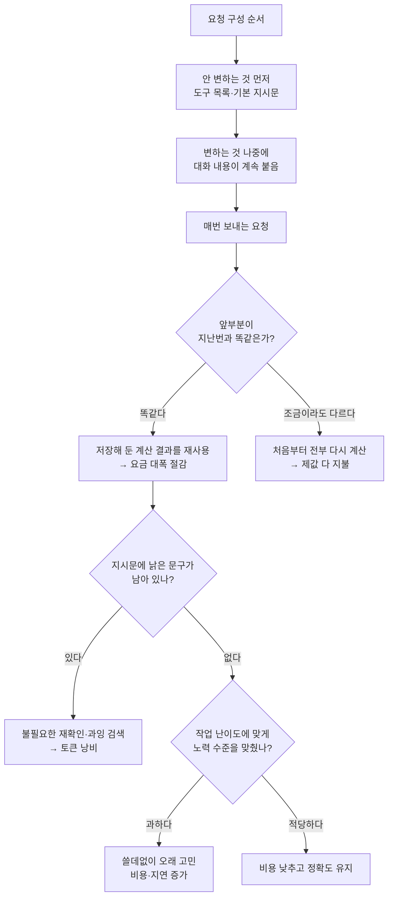

<aside class="ai-knowledge-sidebar">
  
CATEGORIES

  <nav class="ai-cat-tree">

에이전트 오케스트레이션14
<ul><li><a href="https://altjs4510.github.io/ai_news_blog/knowledge/20260908/">2026-09-08bytedance/deer-flow — 샌드박스·메모리·서브에이전트·메시지 게이트웨이를…</a></li><li><a href="https://altjs4510.github.io/ai_news_blog/knowledge/20260904/">2026-09-04HarnessDev: Can LLMs Create and Evolve Their Own…</a></li><li><a href="https://altjs4510.github.io/ai_news_blog/knowledge/20260831-openexecutive-virtual-c-suite/">2026-08-31Open Executive — 8명의 전문 에이전트를 하나의 임원 목소리로</a></li><li><a href="https://altjs4510.github.io/ai_news_blog/knowledge/20260828/">2026-08-28Google ADK for Python v2.8.0 — RemoteA2aAgent 네이…</a></li><li><a href="https://altjs4510.github.io/ai_news_blog/knowledge/20260823/">2026-08-23The Evolution of the Agent Harness — 하네스가 모델 가중치…</a></li><li><a href="https://altjs4510.github.io/ai_news_blog/knowledge/20260805/">2026-08-05TencentCloud/TencentDB-Agent-Memory — 대화·문서·코드를 …</a></li><li><a href="https://altjs4510.github.io/ai_news_blog/knowledge/20260726/">2026-07-26citrolabs/ego-lite — 로그인된 브라우저 상태를 AI 에이전트와 공유하는…</a></li><li><a href="https://altjs4510.github.io/ai_news_blog/knowledge/20260708/">2026-07-08Expanding Managed Agents in Gemini API: backgrou…</a></li><li><a href="https://altjs4510.github.io/ai_news_blog/knowledge/20260701/">2026-07-01Google OKF (Open Knowledge Format) — 벤더 중립 에이전트 …</a></li><li><a href="https://altjs4510.github.io/ai_news_blog/knowledge/20260623/">2026-06-23bytedance/deer-flow — 샌드박스·메모리·서브에이전트·메시지 게이트웨이를…</a></li><li><a href="https://altjs4510.github.io/ai_news_blog/knowledge/20260621/">2026-06-21calesthio/OpenMontage — 12 파이프라인·52 도구·500+ 스킬을 …</a></li><li><a href="https://altjs4510.github.io/ai_news_blog/knowledge/20260602/">2026-06-02revfactory/harness — 도메인별 에이전트 팀과 스킬을 자동 설계하는 메타…</a></li><li><a href="https://altjs4510.github.io/ai_news_blog/knowledge/20260529/">2026-05-29Introducing dynamic workflows in Claude Code</a></li><li><a href="https://altjs4510.github.io/ai_news_blog/knowledge/20260507/">2026-05-07ruvnet/ruflo — Claude 멀티 에이전트 오케스트레이션 플랫폼</a></li></ul>

MCP &amp; 도구 통합18
<ul><li><a href="https://altjs4510.github.io/ai_news_blog/knowledge/20260829/">2026-08-29cursor/plugins — 플러그인 명세(specification)와 공식 플러그인…</a></li><li><a href="https://altjs4510.github.io/ai_news_blog/knowledge/20260802/">2026-08-02Stateless MCP has recaptured my interest (and in…</a></li><li><a href="https://altjs4510.github.io/ai_news_blog/knowledge/20260801/">2026-08-01different-ai/openwork — Claude Cowork의 오픈소스 대체 에…</a></li><li><a href="https://altjs4510.github.io/ai_news_blog/knowledge/20260731/">2026-07-31different-ai/openwork — Claude Cowork의 오픈소스 대안(o…</a></li><li><a href="https://altjs4510.github.io/ai_news_blog/knowledge/20260729/">2026-07-29Bringing MCP 2026-07-28 to Claude</a></li><li><a href="https://altjs4510.github.io/ai_news_blog/knowledge/20260722/">2026-07-22tirth8205/code-review-graph — MCP·CLI용 로컬 우선 코드 …</a></li><li><a href="https://altjs4510.github.io/ai_news_blog/knowledge/20260721/">2026-07-21tirth8205/code-review-graph — 로컬 우선 코드 인텔리전스 그래프…</a></li><li><a href="https://altjs4510.github.io/ai_news_blog/knowledge/20260719/">2026-07-19tirth8205/code-review-graph — 로컬 우선 코드 인텔리전스 그래프…</a></li><li><a href="https://altjs4510.github.io/ai_news_blog/knowledge/20260718/">2026-07-18tirth8205/code-review-graph — MCP·CLI용 로컬 코드 인텔리…</a></li><li><a href="https://altjs4510.github.io/ai_news_blog/knowledge/20260709/">2026-07-09mvanhorn/last30days-skill — Reddit·X·YouTube·HN·…</a></li><li><a href="https://altjs4510.github.io/ai_news_blog/knowledge/20260618/">2026-06-18DeusData/codebase-memory-mcp — 158개 언어 코드베이스를 밀리…</a></li><li><a href="https://altjs4510.github.io/ai_news_blog/knowledge/20260606/">2026-06-06chopratejas/headroom — Compress tool outputs, lo…</a></li><li><a href="https://altjs4510.github.io/ai_news_blog/knowledge/20260605/">2026-06-05chopratejas/headroom — Compress tool outputs, lo…</a></li><li><a href="https://altjs4510.github.io/ai_news_blog/knowledge/20260604/">2026-06-04chopratejas/headroom — Compress tool outputs bef…</a></li><li><a href="https://altjs4510.github.io/ai_news_blog/knowledge/20260603/">2026-06-03How Bad MCP design cost your Agent 5× more token…</a></li><li><a href="https://altjs4510.github.io/ai_news_blog/knowledge/20260523/">2026-05-23colbymchenry/codegraph — 사전 인덱싱된 코드 지식 그래프 MCP</a></li><li><a href="https://altjs4510.github.io/ai_news_blog/knowledge/20260517/">2026-05-17I gave my LLM 100,000+ tools — Lazy Discovery &a…</a></li><li><a href="https://altjs4510.github.io/ai_news_blog/knowledge/20260509/">2026-05-09How to connect 100 MCP servers without the conte…</a></li></ul>

코딩 에이전트33
<ul><li><a href="https://altjs4510.github.io/ai_news_blog/knowledge/20260912/">2026-09-12Quoting Boris Cherny — 'Claude가 쓴 프로덕션 코드는 사람이 쓴…</a></li><li><a href="https://altjs4510.github.io/ai_news_blog/knowledge/20260910/">2026-09-10vastsa/PI-Desktop — Electron + Rust 호스트 코어 + 에이전…</a></li><li><a href="https://altjs4510.github.io/ai_news_blog/knowledge/20260906/">2026-09-06DietrichGebert/ponytail — 에이전트를 '방에서 가장 게으른 시니어 …</a></li><li><a href="https://altjs4510.github.io/ai_news_blog/knowledge/20260903/">2026-09-03pacifio/atlas — 여러 코딩 에이전트의 변경을 한곳에서 추적·질의하는 '에이…</a></li><li><a href="https://altjs4510.github.io/ai_news_blog/knowledge/20260901/">2026-09-01affaan-m/ECC — 스킬·본능·메모리·보안을 묶은 에이전트 하네스 성능 최적화 …</a></li><li><a href="https://altjs4510.github.io/ai_news_blog/knowledge/20260831-gitnexus-code-knowledge-graph/">2026-08-31GitNexus — 코드베이스를 지식그래프로 바꿔 에이전트에게 쥐어주기</a></li><li><a href="https://altjs4510.github.io/ai_news_blog/knowledge/20260826/">2026-08-26apache/maka — 도구 호출·권한 결정·종료 이벤트를 append-only 로그…</a></li><li><a href="https://altjs4510.github.io/ai_news_blog/knowledge/20260822/">2026-08-22mattpocock/skills — Skills for Real Engineers (하…</a></li><li><a href="https://altjs4510.github.io/ai_news_blog/knowledge/20260820/">2026-08-20akitaonrails/ai-memory — 코딩 에이전트 CLI의 장기 메모리와 벤더…</a></li><li><a href="https://altjs4510.github.io/ai_news_blog/knowledge/20260819/">2026-08-19akitaonrails/ai-memory — 코딩 에이전트 CLI 간 장기 기억과 벤더…</a></li><li><a href="https://altjs4510.github.io/ai_news_blog/knowledge/20260814/">2026-08-14cathrynlavery/diagram-design — Claude Code용 에디토리…</a></li><li><a href="https://altjs4510.github.io/ai_news_blog/knowledge/20260811/">2026-08-11PrimeIntellect-ai/prime-agent — 장기 자율 실행을 전제로 설계…</a></li><li><a href="https://altjs4510.github.io/ai_news_blog/knowledge/20260810/">2026-08-10Auto mode is now the default in Claude Code for …</a></li><li><a href="https://altjs4510.github.io/ai_news_blog/knowledge/20260809/">2026-08-09PrimeIntellect-ai/prime-agent — 코딩 워크플로우·장기 자율 작…</a></li><li><a href="https://altjs4510.github.io/ai_news_blog/knowledge/20260808/">2026-08-08PrimeIntellect-ai/prime-agent — 코딩 워크플로우와 장시간 자율…</a></li><li><a href="https://altjs4510.github.io/ai_news_blog/knowledge/20260804/">2026-08-04esengine/DeepSeek-Reasonix — prefix-cache 안정성을 축…</a></li><li><a href="https://altjs4510.github.io/ai_news_blog/knowledge/20260728/">2026-07-28alibaba/open-code-review — 결정론적 파이프라인 + LLM 에이전트…</a></li><li><a href="https://altjs4510.github.io/ai_news_blog/knowledge/20260725/">2026-07-25The new rules of context engineering for Claude …</a></li><li><a href="https://altjs4510.github.io/ai_news_blog/knowledge/20260715/">2026-07-15Dicklesworthstone/destructive_command_guard — 에이…</a></li><li><a href="https://altjs4510.github.io/ai_news_blog/knowledge/20260714/">2026-07-14Graphify-Labs/graphify — 코드베이스를 질의 가능한 지식 그래프로 만…</a></li><li><a href="https://altjs4510.github.io/ai_news_blog/knowledge/20260705/">2026-07-05openai/codex-plugin-cc — Claude Code에서 Codex를 위임…</a></li><li><a href="https://altjs4510.github.io/ai_news_blog/knowledge/20260626/">2026-06-26google-labs-code/design.md — 코딩 에이전트에게 디자인 시스템을 …</a></li><li><a href="https://altjs4510.github.io/ai_news_blog/knowledge/20260619/">2026-06-19Claude Code now supports artifacts</a></li><li><a href="https://altjs4510.github.io/ai_news_blog/knowledge/20260530/">2026-05-30Leonxlnx/taste-skill — AI에게 좋은 취향을 부여해 generic s…</a></li><li><a href="https://altjs4510.github.io/ai_news_blog/knowledge/20260528/">2026-05-28Building self-improving tax agents with Codex</a></li><li><a href="https://altjs4510.github.io/ai_news_blog/knowledge/20260526/">2026-05-26colbymchenry/codegraph — Pre-indexed code knowle…</a></li><li><a href="https://altjs4510.github.io/ai_news_blog/knowledge/20260524/">2026-05-24colbymchenry/codegraph — Pre-indexed code knowle…</a></li><li><a href="https://altjs4510.github.io/ai_news_blog/knowledge/20260521/">2026-05-21colbymchenry/codegraph — Pre-indexed code knowle…</a></li><li><a href="https://altjs4510.github.io/ai_news_blog/knowledge/20260512/">2026-05-12agentmemory — Persistent memory for AI coding ag…</a></li><li><a href="https://altjs4510.github.io/ai_news_blog/knowledge/20260510/">2026-05-10addyosmani/agent-skills — Production-grade engin…</a></li><li><a href="https://altjs4510.github.io/ai_news_blog/knowledge/20260508/">2026-05-08addyosmani/agent-skills — Production-grade engin…</a></li><li><a href="https://altjs4510.github.io/ai_news_blog/knowledge/20260506/">2026-05-06mksglu/context-mode — AI 코딩 에이전트용 컨텍스트 윈도우 최적화</a></li><li><a href="https://altjs4510.github.io/ai_news_blog/knowledge/20260505/">2026-05-05mattpocock/skills — Skills for Real Engineers (.…</a></li></ul>

모델 &amp; 연구7
<ul><li><a href="https://altjs4510.github.io/ai_news_blog/knowledge/20260907-voicemem-dual-brain-memory/">2026-09-07VoiceMem — 좌뇌·우뇌로 쪼갠 스트리밍 메모리로 음성 에이전트 지연 없애기</a></li><li><a href="https://altjs4510.github.io/ai_news_blog/knowledge/20260821/">2026-08-21volcengine/OpenViking — 에이전트 메모리·Knowledge RAG·스…</a></li><li><a href="https://altjs4510.github.io/ai_news_blog/knowledge/20260716-proprag/">2026-07-16PropRAG — 프로포지션 경로 위 beam search로 멀티홉 검색 안내</a></li><li><a href="https://altjs4510.github.io/ai_news_blog/knowledge/20260620/">2026-06-20zai-org/GLM-5 — From Vibe Coding to Agentic Engi…</a></li><li><a href="https://altjs4510.github.io/ai_news_blog/knowledge/20260617/">2026-06-17Predicting model behavior before release by simu…</a></li><li><a href="https://altjs4510.github.io/ai_news_blog/knowledge/20260516/">2026-05-16STALE — 에이전트가 자기 기억의 유효성을 인지할 수 있는가</a></li><li><a href="https://altjs4510.github.io/ai_news_blog/knowledge/20260513/">2026-05-13Thinking Machines' Native Interaction Models — T…</a></li></ul>

인프라 &amp; 컴퓨트10
<ul><li><a href="https://altjs4510.github.io/ai_news_blog/knowledge/20260905/">2026-09-05magnitudedev/magnitude — 하드웨어에 맞는 최적 로컬 모델을 띄워 이…</a></li><li><a href="https://altjs4510.github.io/ai_news_blog/knowledge/20260813/">2026-08-13semantica-agi/semantica — 컨텍스트와 책임 추적을 위한 그래프 네이…</a></li><li><a href="https://altjs4510.github.io/ai_news_blog/knowledge/20260812/">2026-08-12semantica-agi/semantica — 컨텍스트와 '책임 추적 가능한(accou…</a></li><li><a href="https://altjs4510.github.io/ai_news_blog/knowledge/20260806/">2026-08-06cloudflare/computer — 에이전트에게 컴퓨터를 통째로 주는 엣지 실행 샌…</a></li><li><a href="https://altjs4510.github.io/ai_news_blog/knowledge/20260724/">2026-07-24diegosouzapw/OmniRoute — 단일 엔드포인트로 278+ 프로바이더·50…</a></li><li><a href="https://altjs4510.github.io/ai_news_blog/knowledge/20260723/">2026-07-23diegosouzapw/OmniRoute — 268+ 프로바이더를 단일 엔드포인트로 묶…</a></li><li><a href="https://altjs4510.github.io/ai_news_blog/knowledge/20260630/">2026-06-30Introducing the Claude apps gateway for Amazon B…</a></li><li><a href="https://altjs4510.github.io/ai_news_blog/knowledge/20260611/">2026-06-11The evolution of agentic surfaces: building with…</a></li><li><a href="https://altjs4510.github.io/ai_news_blog/knowledge/20260522/">2026-05-22Giving Agents Computers — Ivan Burazin, Daytona</a></li><li><a href="https://altjs4510.github.io/ai_news_blog/knowledge/20260520/">2026-05-20New in Claude Managed Agents: self-hosted sandbo…</a></li></ul>

보안 &amp; 거버넌스17
<ul><li><a href="https://altjs4510.github.io/ai_news_blog/knowledge/20260913/">2026-09-13OpenAI agents attacked RubyGems back in May: Ope…</a></li><li><a href="https://altjs4510.github.io/ai_news_blog/knowledge/20260902/">2026-09-02AIR raises $50M to help companies vet the skills…</a></li><li><a href="https://altjs4510.github.io/ai_news_blog/knowledge/20260827/">2026-08-27Claude in Chrome is generally available</a></li><li><a href="https://altjs4510.github.io/ai_news_blog/knowledge/20260819-mind-viruses/">2026-08-19탈옥도, 인젝션도 없이 — 대화로만 퍼지는 에이전트의 '마인드 바이러스'</a></li><li><a href="https://altjs4510.github.io/ai_news_blog/knowledge/20260730/">2026-07-30Anatomy of a Frontier Lab Agent Intrusion: A Tec…</a></li><li><a href="https://altjs4510.github.io/ai_news_blog/knowledge/20260716/">2026-07-16Dicklesworthstone/destructive_command_guard — 에이…</a></li><li><a href="https://altjs4510.github.io/ai_news_blog/knowledge/20260710/">2026-07-1070개 MCP 서버 strace 런타임 감사 — 부팅 시 아웃바운드 호출 서버 적발</a></li><li><a href="https://altjs4510.github.io/ai_news_blog/knowledge/20260704/">2026-07-04Cloudflare is about to block AI agents by defaul…</a></li><li><a href="https://altjs4510.github.io/ai_news_blog/knowledge/20260703/">2026-07-03Giving admins more visibility and control over C…</a></li><li><a href="https://altjs4510.github.io/ai_news_blog/knowledge/20260625/">2026-06-25Agent identity in Claude Tag: a new access model…</a></li><li><a href="https://altjs4510.github.io/ai_news_blog/knowledge/20260624/">2026-06-24Agent identity in Claude Tag: a new access model…</a></li><li><a href="https://altjs4510.github.io/ai_news_blog/knowledge/20260614/">2026-06-14NVIDIA/SkillSpector — Security scanner for AI ag…</a></li><li><a href="https://altjs4510.github.io/ai_news_blog/knowledge/20260613/">2026-06-13Fable 5's guardrails got bypassed in 48 hours — …</a></li><li><a href="https://altjs4510.github.io/ai_news_blog/knowledge/20260612/">2026-06-12NVIDIA/SkillSpector — AI 에이전트 스킬용 보안 스캐너</a></li><li><a href="https://altjs4510.github.io/ai_news_blog/knowledge/20260607/">2026-06-07OpenAI Help: Lockdown Mode</a></li><li><a href="https://altjs4510.github.io/ai_news_blog/knowledge/20260531/">2026-05-31How we contain Claude across products</a></li><li><a href="https://altjs4510.github.io/ai_news_blog/knowledge/20260527/">2026-05-27Microsoft Copilot Cowork Exfiltrates Files</a></li></ul>

응용 사례6
<ul><li><a href="https://altjs4510.github.io/ai_news_blog/knowledge/20260911/">2026-09-11Now everyone can put data to work — ChatGPT Work…</a></li><li><a href="https://altjs4510.github.io/ai_news_blog/knowledge/20260717/">2026-07-17After a year building agent memory, 'save everyt…</a></li><li><a href="https://altjs4510.github.io/ai_news_blog/knowledge/20260712/">2026-07-12Do Automated Evals Work?</a></li><li><a href="https://altjs4510.github.io/ai_news_blog/knowledge/20260707/">2026-07-07AI Hero Skills Catalog — 실무 엔지니어를 위한 재사용 가능한 판단 …</a></li><li><a href="https://altjs4510.github.io/ai_news_blog/knowledge/20260609/">2026-06-09Building intelligent apps for Apple platforms wi…</a></li><li><a href="https://altjs4510.github.io/ai_news_blog/knowledge/20260514/">2026-05-14Introducing Claude for Small Business</a></li></ul>

산업 동향10
<ul><li><a href="https://altjs4510.github.io/ai_news_blog/knowledge/20260909/" class="current">2026-09-09Reducing cost and improving performance with Cla…</a></li><li><a href="https://altjs4510.github.io/ai_news_blog/knowledge/20260907-humanmade-52week-rhythm/">2026-09-07휴먼 메이드의 '52주 리듬' — 아이디어가 흔해진 시대에 값이 오르는 건 버리는 판단</a></li><li><a href="https://altjs4510.github.io/ai_news_blog/knowledge/20260830/">2026-08-30[AINews] OpenAI shuts off Cursor — 프론티어 모델 공급 차단…</a></li><li><a href="https://altjs4510.github.io/ai_news_blog/knowledge/20260711/">2026-07-11OpenAI says GPT 5.6 is the 'preferred model' for…</a></li><li><a href="https://altjs4510.github.io/ai_news_blog/knowledge/20260702/">2026-07-02How Cursor deploys AI inside the enterprise (For…</a></li><li><a href="https://altjs4510.github.io/ai_news_blog/knowledge/20260616/">2026-06-16Why AI hasn't replaced software engineers, and w…</a></li><li><a href="https://altjs4510.github.io/ai_news_blog/knowledge/20260610/">2026-06-10Fable 5 just made cost-aware model routing manda…</a></li><li><a href="https://altjs4510.github.io/ai_news_blog/knowledge/20260519/">2026-05-19Anthropic acquires Stainless</a></li><li><a href="https://altjs4510.github.io/ai_news_blog/knowledge/20260515/">2026-05-15Clawdmeter — Claude Code 사용량을 데스크톱 대시보드로</a></li><li><a href="https://altjs4510.github.io/ai_news_blog/knowledge/20260504/">2026-05-04Agents for Everything Else: Codex for Knowledge …</a></li></ul>
</nav>
</aside>

<article class="ai-knowledge-article">

<header class="ai-post-hero">
  
<a class="ai-back" href="../">KNOWLEDGE</a> · 2026-09-09 · 오늘의 학습

  <h2 class="ai-post-title">Reducing cost and improving performance with Claude Platform</h2>
</header>

> 원문: [Reducing cost and improving performance with Claude Platform](https://claude.com/blog/reducing-cost-and-improving-performance-with-claude-platform)

## 📌 학습 정리

### 1. 한 줄로 말하면

같은 AI 모델을 쓰면서도, 요청을 담는 방식만 손보면 돈은 덜 쓰고 결과는 오히려 더 좋아질 수 있다는 이야기입니다. 성능과 비용이 늘 맞바꾸는 관계는 아니라는 게 핵심이에요.

### 2. 왜 이게 만들어졌어요?

AI를 서비스에 붙여 쓰다 보면 "비용이 부담되니 저렴한 모델로 낮추자, 대신 품질은 좀 포기하자"는 식으로 결정하기 쉽습니다. 그런데 실제 사례를 뜯어보니, 비용이 새는 지점은 모델 자체가 아니라 **매번 똑같은 내용을 반복해서 다시 보내고 다시 계산시키는 구조**, 그리고 **예전 모델을 달래려고 넣어둔 낡은 지시문**인 경우가 많았다고 합니다. 예전 모델은 실수가 잦아서 "두 번 확인해", "최대한 꼼꼼하게" 같은 문구를 프롬프트에 덧대두는 게 상식이었는데, 최신 모델은 그 말을 곧이곧대로 따라서 불필요한 작업을 잔뜩 하고 그만큼 요금을 더 씁니다. 그래서 Anthropic은 모델을 바꾸기 전에 먼저 손볼 세 가지 — 캐시 활용, 지시문 정리, 들이는 노력의 수준 조절 — 를 정리하고, 그걸 도구로 자동화했습니다.

### 3. 비유로 풀면

첫 번째는 **매일 같은 카페에 가는 손님**입니다. 주문할 때마다 "저는 우유 알레르기가 있고, 얼음은 조금만, 컵은 이거로…" 하고 배경 설명을 처음부터 다시 하면 매번 시간이 걸리죠. 단골이 되면 바리스타가 그 전제를 이미 알고 있으니 "늘 먹던 걸로"만 말하면 됩니다. 다만 그 기억은 **앞부분이 글자 하나까지 똑같을 때만** 작동해서, 설명 맨 앞에 "오늘 날짜는 9월 8일이고요" 같은 매번 바뀌는 말을 붙이면 바리스타가 "어? 다른 손님인가?" 하고 처음부터 다시 듣게 됩니다.

두 번째는 **일 잘하는 신입에게 옛날 매뉴얼을 쥐여주는 상황**입니다. 예전 직원용으로 만든 "모든 문서는 세 번 검토할 것" 같은 규칙을, 이미 알아서 잘하는 사람에게 주면 시간만 두 배로 잡아먹습니다.

그래서 결국, 모델을 바꾸거나 돈을 더 쓰기 전에 **반복되는 앞부분을 안 바뀌게 고정하고, 낡은 지시문을 걷어내는 것**만으로 비용이 꽤 줄어든다는 게 이 글의 뼈대입니다.

### 4. 어떻게 작동하는지 (그림으로)

흐름을 말로 풀면 이렇습니다. 먼저 요청을 만들 때 **안 바뀌는 부분을 앞에, 계속 늘어나는 대화를 뒤에** 두면 앞부분을 재사용할 수 있어 요금이 크게 줄어듭니다. 그다음 지시문에서 옛날 모델용 잔소리를 걷어내고, 마지막으로 이 작업이 정말 깊게 고민해야 하는 일인지 판단해 노력 수준을 맞추는 순서입니다. Anthropic은 이 세 단계를 각각 `/claude-api prompt-audit`, `/claude-api cost-optimize`, `/claude-api hillclimb`라는 명령으로 자동화해 뒀습니다.

한 가지 덧붙이면, 이 저장된 계산 결과는 **기본 5분이면 사라집니다**. 그래서 중간에 오래 걸리는 작업(예: 다른 도구를 부르거나 하위 작업을 돌리는 사이)이 5분을 넘기면, 결과가 돌아왔을 땐 이미 캐시가 만료돼 있습니다. 이럴 땐 1시간짜리로 늘려 설정하는 선택지가 있다고 안내합니다.

실제 수치도 몇 개 나옵니다. 고객 지원 업무 테스트에서 낡은 지시문 여섯 가지를 걷어냈더니 **비용은 14.6% 줄고 정확도는 5.3% 올랐고**, 공개 벤치마크 네 곳에 자동 최적화를 돌렸을 땐 성능을 유지하면서 비용이 **52~73% 낮아졌다**고 합니다. 흥미로운 건 정확도가 오른 이유인데, 낡은 설정 때문에 요청이 아예 거부되거나, 서로 모순되는 규칙("항상 환불하라" vs "승인 없이 환불 금지") 때문에 모델이 마땅히 해야 할 환불을 미뤘던 사례가 있었습니다.

### 5. 처음 보는 용어 풀이

- **미리 계산해 둔 요청 앞부분 재사용 (prompt caching / 프롬프트 캐시)** — AI는 답을 만들기 전에 받은 글을 내부 상태로 바꾸는 준비 작업을 하는데, 이게 입력 처리 비용의 대부분입니다. 앞부분이 지난번과 똑같으면 그 준비 결과를 다시 꺼내 쓰고, 요금은 원래 입력 가격의 일부만 냅니다.
- **글자 단위로 완전히 같아야 함 (byte-exact)** — 캐시가 작동하려면 앞부분이 띄어쓰기 하나까지 동일해야 합니다. 그래서 시각이나 무작위 ID처럼 매번 바뀌는 값을 앞부분에 넣으면 안 됩니다.
- **캐시가 살아있는 시간 (TTL, time-to-live)** — 저장해 둔 계산 결과의 유효 기간입니다. 기본은 5분이고, 요청이 시작된 시점부터 세기 시작합니다.
- **들이는 노력의 수준 (effort)** — 모델에게 "얼마나 열심히 할지"를 알려주는 설정입니다. 낮으면 빨리 결론을 내고, 높으면 검증하고 다른 가능성까지 따져봅니다. 다만 높다고 늘 좋은 건 아니라서, 쉬운 일에 높게 두면 돈과 시간만 더 들고 답이 나빠지기도 합니다.
- **낡은 지시문 (prompting anti-patterns)** — 예전 모델의 약점을 메우려고 넣어둔 문구들입니다. "두 번 확인해", "반드시 단계별로 생각해", "최대한 꼼꼼하게" 같은 것들인데, 최신 모델에겐 오히려 방해가 됩니다.
- **잘 안 쓰는 도구는 나중에 불러오기 (defer_loading)** — 모델이 쓸 수 있는 도구 목록은 요청 맨 앞에 붙는데, 여기에 변화가 생기면 캐시가 깨집니다. 자주 안 쓰는 도구는 미리 선언하되 앞부분에서 빼두고, 실제로 필요할 때만 대화 중간에 붙이는 방식입니다.
- **대화가 길어졌을 때 정리하기 (compaction)** — 대화가 너무 길어지면 내용을 압축해 다시 쓰는 작업입니다. 이때 어차피 캐시가 깨지니, 모델이나 노력 수준을 바꿀 거라면 바로 이 타이밍이 손해가 적습니다.
- **모아서 한꺼번에 처리하기 (Batch API)** — 지금 당장 답이 필요 없는 작업들을 묶어서 한 번에 돌리는 방식입니다. 급하지 않은 대량 작업의 비용을 낮추는 데 씁니다.

### 6. 한 발 더 들어가고 싶다면

- [claude-api skill](https://claude.com/blog/reducing-cost-and-improving-performance-with-claude-platform) — 이 글에서 설명한 세 가지 점검 항목이 실제로 어떤 명령으로 묶여 있는지 볼 수 있어요.
- 원문 안의 **Claude Console**과 **cache diagnostics API** 언급 — 캐시가 왜 빗나갔는지, 두 요청이 정확히 어느 지점에서 달라졌는지 직접 확인하는 방법을 알 수 있어요.
- 관련 글 [Building commerce agents with Claude](https://claude.com/blog/reducing-cost-and-improving-performance-with-claude-platform) 및 [How Warp builds self-improving agents on Claude](https://claude.com/blog/reducing-cost-and-improving-performance-with-claude-platform) — 같은 플랫폼 위에서 실제 서비스를 만든 사례들의 구조를 엿볼 수 있어요.

---

## 📖 원문 전체 번역 (정독용)

> 의역 최소화한 전체 번역입니다. 큰 흐름은 위 정리에서 잡고, 정확한 워딩이 필요할 땐 이 섹션에서 정독하세요.

# Claude Platform 으로 비용을 줄이고 성능을 개선하기

프롬프트 캐싱, 지침(instructions), 그리고 effort 를 튜닝하면 애플리케이션 성능을 희생하지 않고도 Claude 의 비용을 줄일 수 있다.

**카테고리**: Agents
**제품**: Claude Platform
**날짜**: 2026년 9월 8일
**읽는 시간**: 5분

**저자**: Lance Martin

성능과 비용은 흔히 트레이드오프 관계로 여겨진다: 덜 쓰려면 결과가 나빠지는 걸 감수해야 한다는 것이다. 실제로 우리는 Claude Platform 을 쓰는 많은 애플리케이션이 세 가지 조치로 성능을 포기하지 않으면서도 비용을 줄일 수 있음을 확인했다: 프롬프트 캐시 적중률(hit rate)을 최대화하기, 프론티어 Claude 모델로 업그레이드할 때 프롬프트에서 안티패턴을 제거하기, 그리고 effort 를 작업에 맞게 보정하기. 우리는 이 가이드를 **claude-api 스킬**에 담아 두었다. 이 글에서는 **claude-api 스킬**을 갖춘 Claude Code 가 어떻게 성능을 유지하거나 개선하면서 비용을 줄일 방법을 찾아내는지 보여준다.

## 프롬프트 캐시

Claude 가 응답을 생성하기 전, 먼저 프롬프트를 내부 작업 상태(internal working state)로 처리한다. 이 단계를 **prefill** 이라 부르며, 입력을 처리하는 과정에서 비용이 많이 드는 부분이다. 프롬프트 캐싱은 그 상태(키-값, 즉 KV 캐시)를 저장한다: 요청이 동일한 프리픽스로 시작하면 Claude 는 그것을 재계산하는 대신 다시 읽어들인다. 캐시 읽기는 전체 입력 가격의 **일부만 청구된다**.

프롬프트 캐시를 효과적으로 활용하기 위해 고려해야 할 실용적인 사항이 몇 가지 있다. 첫째, 프롬프트 캐시는 특정 모델에 고정(pinned)된다. 둘째, 프롬프트 캐시 읽기는 프롬프트 프리픽스 전체에 걸쳐 **바이트 단위로 정확히(byte-exact)** 일치해야 한다. 마지막으로, 프롬프트 캐시는 **제한된 TTL(time-to-live)**을 갖는다.

이 점들을 염두에 두면, 실용적인 팁 몇 가지가 있다:

**대화 도중 effort 설정을 바꿀 때는 주의하라.** 이 설정들은 여러분의 콘텐츠보다 앞서 프롬프트에 렌더링되므로, 캐시된 프리픽스의 일부가 된다. Opus 5 와 Fable 5.1 을 포함한 일부 Claude 모델에서만 캐시를 깨뜨리지 않고 **대화 도중 effort 를 업데이트**할 수 있다.

**변동성 있는 값을 프리픽스 밖에 두라.** 시스템 프롬프트 안의 동적 타임스탬프나 ID 는 모델 호출마다 바뀔 수 있고, 캐시를 깨뜨린다.

**스스로 순서를 재배열하는 도구 정의(tool definitions)를 피하라.** Claude Messages API 를 사용할 때, **프롬프트는 고정된 순서로 조립**되며 도구 정의는 맨 위에 렌더링된다. 도구 정의에 대한 어떤 변경도 캐시를 깨뜨린다.

**대화를 분기(fork)할 때 주의하라.** 서브에이전트와 브랜치는 분기의 프리픽스가 바이트 단위로 동일하고, 동일한 모델을 쓰며, 동일한 effort 를 사용할 때만 부모의 캐시를 공유한다.

### 해결 방법

우리는 프롬프트 캐시 관리와 관련해 몇 가지 교훈을 **축적해 왔다**:

**프롬프트 캐시 적중률을 세심하게 모니터링하라.** Claude Console 과 **캐시 진단 API(cache diagnostics API)**는 프롬프트 캐시 미스(miss)의 원인(그림 1)과, 두 요청이 정확히 어디서 갈라졌는지를 포함한 프롬프트 캐시 진단 정보를 제공한다.

*그림 1. Claude Console 은 연속된 요청을 비교하고 프롬프트 프리픽스가 정확히 어디서 갈라졌는지를 식별해 예상치 못한 프롬프트 캐시 미스를 진단할 수 있다.*

**프롬프트 캐시 적중률을 세심하게 모니터링하라.** Claude Console 과 **캐시 진단 API**는 프롬프트 캐시 미스의 원인(그림 1)과, 두 요청이 정확히 어디서 갈라졌는지를 포함한 프롬프트 캐시 진단 정보를 제공한다.

**프롬프트 캐시 적중률을 세심하게 모니터링하라.** Claude Console 과 **캐시 진단 API**는 프롬프트 캐시 미스의 원인(그림 1)과, 두 요청이 정확히 어디서 갈라졌는지를 포함한 프롬프트 캐시 진단 정보를 제공한다.

**드물게 쓰이는 도구는 지연 로딩하라.** 모든 도구를 앞서 선언하되, 드물게 쓰이는 것들은 `defer_loading` 으로 표시하라: 이들은 캐시된 프리픽스 밖에 머물다가, Claude 가 도구 검색(tool search)으로 조회할 때만 대화에 덧붙여지므로 캐시가 보존된다.

**시스템 프롬프트 업데이트는 메시지로 적용하라.** Claude Platform 은 시스템 프롬프트를 직접 편집하는 대신, 대화 도중에 메시지로 시스템 지침을 추가할 수 있게 해주며, 이는 캐시를 보존한다.

**요청을 구성할 때 안정적인 부분이 안정적으로 유지되도록 배치하라.** 정적 컨텍스트(도구 정의와 시스템 프롬프트)를 먼저 넣고, 그 뒤에 늘어나는 대화를 배치하라(그림 2).

*그림 2. 동적 콘텐츠가 안정적인 프리픽스 뒤에 덧붙여지도록 프롬프트를 구성하라.*

**모델이나 effort 변경은 프롬프트 캐시가 이미 깨질 시점에 하라.** compaction 같은 특정 작업은 이미 캐시(대화)의 상당 부분을 다시 쓴다. 어차피 미스에 대한 비용을 치르는 것이므로, 이때가 모델이나 effort 를 전환하기에 **좋은 시점**이다.

**대화가 늘어남에 따라 캐시 브레이크포인트를 이동하라.** Claude Platform 을 사용하면 **자동 캐싱**을 설정해 캐시 브레이크포인트를 마지막으로 캐싱 가능한 블록에 적용할 수 있다.

**캐시를 미리 예열하라.** 지연 시간을 줄이기 위해, `max_tokens: 0` 과 명시적인 캐시 브레이크포인트로 요청을 보내라. 이는 아무것도 생성하지 않고 프롬프트를 처리해 캐시에 기록한다. 세션 시작 시점(예: 사용자가 타이핑하는 동안)에 이를 실행하면, 첫 실제 요청이 예열된 캐시를 만나게 된다.

**프롬프트 캐시 TTL 을 넘기지 마라.** 5분 캐시 TTL 은 요청 시작 시점부터 계산된다. 에이전트가 도구 호출이나 서브에이전트 요청에서 5분 넘게 블로킹되면, 결과가 돌아오기 전에 부모의 캐시가 만료된다. 이런 경우에는 대신 프리픽스에 **1시간 TTL 을 설정**하는 것을 고려하라.

## 지침(Instructions)

프롬프트는 모델의 약점을 보완하기 위한 지침들을 계속 축적할 수 있다. 이런 지침들은 **최신 Claude 모델**의 역량과 비교했을 때 시대에 뒤떨어질 수 있다. 다음은 프론티어 Claude 모델의 발목을 잡고 의도치 않게 비용을 늘릴 수 있는, 흔히 나타나는 프롬프팅 "안티패턴"들이다:

**검증 의례(Verification rituals).** "**작업을 재확인해라**"나 "**응답 전 두 번 검증해라**" 같은 지침은 프론티어 모델에 의해 문자 그대로 받아들여지는 경우가 많아 토큰을 낭비할 수 있다.

**철저함·강조 부스터(Thoroughness and emphasis boosters).** "**최대한 철저히 하라**", "**중요: 반드시 항상…**" 같은 표현은 프론티어 모델과 함께 쓸 때 장황함과 불필요한 도구 호출을 유발할 수 있다.

**강제 절차와 스크래치패드 스캐폴딩(Mandatory procedures and scratchpad scaffolds).** 고정된 단계별 프로세스(예: "**스크래치패드에 단계별로 생각하라**")나 추론 템플릿은 프론티어 모델에게 필요 없는 의례다. 이런 스캐폴딩은 네이티브 추론 위에 겹쳐 쌓여 불필요한 토큰을 사용하게 만들 수 있다.

**낡은 예시(Stale examples).** 이전 모델의 실패 양상에 맞춰 튜닝된 few-shot 예시들은 프론티어 모델이 필요 없는 요청에서도 긴 추론 사슬을 모방하도록 가르칠 수 있다.

**모순되는 규칙(Contradictory rules).** 프론티어 모델은 지침을 더 잘 따른다. 모순되는 지침("항상 정책 내에서 환불" vs. "에스컬레이션 없이는 절대 환불 발행 금지")은 프론티어 모델에 의해 더 문자 그대로 따라질 수 있고, 이는 성능 저하로 이어질 수 있다.

**낡은 설정(Dated configuration).** 이전 세대 Claude 를 위해 작성된 설정(예: 수동 thinking budget)은 프론티어 모델로 업그레이드할 때 Claude Platform 이 거부할 수 있다.

### 해결 방법

우리는 이런 안티패턴을 감시하는 새 명령을 추가해 claude-api 스킬을 업데이트했다. Claude Code 에서, 여러분의 프롬프트·스킬·도구 설명에 대해 `/claude-api prompt-audit` 을 실행하라. 이 감사(audit)는 작업 디렉터리 안의 모든 것을 다룬다 — Claude API 를 호출하는 애플리케이션 코드는 물론, Claude Code 자체의 설정(예: `CLAUDE.md` 나 스킬)까지 포함한다.

예를 들어, 우리는 고객 지원 벤치마크에서 Opus 4.8 에서 Opus 5 로의 모델 마이그레이션을 테스트했다. 우리는 깨끗한 프롬프트에서 시작해 한 번에 하나씩 안티패턴을 심어 넣었다(폐기된 thinking 설정, 한 쌍의 모순되는 환불 규칙, 수동 스크래치패드, "두 번 검증", "최대한 철저히", 그리고 강제된 6단계 절차) — 그렇게 여섯 개의 레거시 프롬프트를 만들었다.

우리는 각각을 Opus 4.8 에서, 모델 ID 만 바꾼 Opus 5 에서, 그리고 프롬프트마다 `/claude-api prompt-audit` 을 한 번씩 실행한 후의 Opus 5 에서 실행했다(그림 3 은 여섯 개의 평균을 보여준다).

*그림 3. Opus 4.8 에서 Opus 5 로의 모델 마이그레이션 과정에서 프롬프팅 안티패턴이 미치는 영향.*

*그림 3 | Opus 4.8 에서 Opus 5 로의 모델 마이그레이션 과정에서 프롬프팅 안티패턴이 미치는 영향.*

Opus 5 에서는, 검증 의례("**두 번 검증**")가 모든 환불마다 주문 조회를 중복시켜 불필요한 토큰을 사용한다. 강조 부스터("**최대한 철저히**")는 수십 건의 불필요한 지식베이스 검색으로 이어졌다.

`/claude-api prompt-audit` 를 실행해 안티패턴을 제거하자, 비용은 평균 14.6% 감소했고 정확도는 평균 5.3% 상승했다. 비용이 줄어든 것은 불필요한 도구 호출과 중복된 추론이 제거됐기 때문이다. 정확도가 오른 데는 세 가지 이유가 있었다. 폐기된 thinking 설정은 API 가 모든 라우팅 요청을 통째로 거부하게 만들었다. 모순되는 환불 규칙은 Opus 5 가 고객에게 확인을 요청하는 동안 마땅히 지급해야 할 네 건의 환불을 보류하게 만들었다. 그리고 수동 스크래치패드는 Opus 5 의 내장 thinking 과 충돌했다: 세 건의 티켓에서 Opus 5 는 도구 호출을 자신의 추론 안에 써넣고 실제로는 실행하지 않았다.

## Effort

**Effort** 는 Claude 에게 "얼마나 열심히 일할지"를 알려준다. 낮은 effort 에서는 Claude 가 대체로 더 빨리 결론에 도달한다. 높은 effort 에서는 Claude 가 답하기 전에 숙고하고, 검증하고, 대안을 탐색한다.

단일 모델 안에서도 effort 수준에 따른 비용 대 성능은 달라질 수 있다. 예를 들어, Claude Fable 5 는 FrontierCode Diamond(가장 어려운 50개 과제)에서 낮은 effort 로 작업당 $5.35 에 11.5% 를 기록한다. 최대 effort 에서는 Fable 5 가 작업당 $19.00 에 30.9% 를 얻는다. effort 를 바꾸면 점수는 약 2.7배(+19 포인트) 오르고, 비용은 약 3.5배가 든다(그림 4).

Claude Fable 5.1 의 경우, Humanity's Last Exam(도구 미사용)에서는 가파른 곡선이 나타나며 마지막 단계에서는 수익이 체감한다. 낮은 effort 에서는 질문당 약 $0.30 에 약 53% 를 기록하고, 최대 effort 에서는 약 $2.23 에 약 61% 를 기록한다. 최대치까지의 마지막 단계는 비용을 46% 더 들이면서 점수는 약 0.5포인트만 더한다. 이 이득은 벤치마크의 실행 간 노이즈 범위 안에 있으므로, 측정 가능한 이득 없이 더 많은 비용을 치르는 셈이다.

*그림 4. FrontierCode Diamond 에서 effort 수준별 Fable 5 성능 대 비용.*

Effort 는 양방향으로 잘못 보정될 수 있다:

**높을수록 항상 좋다고 가정하는 것.** 높은 effort 는 **과도한 숙고(over-thinking)**를 유발할 수 있다. Claude 가 과제가 요구하는 것보다 더 많은 시간을 숙고에 쓰게 되고, 이는 비용과 지연을 늘리며 답변 품질을 떨어뜨릴 수 있다. 숙고는 아직 찾아낼 증거가 남아 있을 때만 도움이 된다.

**낮은 effort 로 편향되는 것.** 너무 낮게 설정되면 Claude 는 충분한 증거를 확보하기 전에 멈춘다. 도구 호출을 더 적게 하므로, 세 번째가 아니라 첫 번째 검색 결과로부터 답할 수도 있다. 어려운 단계에서 덜 생각하고, 평소라면 스스로 실행했을 점검을 건너뛴다. 답변은 완성된 것처럼 보이지만, 부분적인 정보 위에 세워진 것이다.

### 해결 방법

effort 를 보정하는 유용한 방법 몇 가지가 있다:

**더 낮은 effort 로 더 강한 모델을 테스트하라.** 낮은 effort 의 더 강한 모델이, 열심히 일하는(높은 effort) 더 약한 모델보다 저렴할 수 있다. 예를 들어, CursorBench 3.2 에서 Claude Fable 5.1 은 낮은 effort 에서 Fable 5 의 높은 effort 성능과 **동등한 성능을 내면서** 비용은 3분의 1이다(그림 5). 더 새로운 모델이 더 저렴한 데는 두 가지 이유가 있다: 낮은 effort 에서는 과제당 작업량이 더 적고, Fable 5.1 의 프롬프트 캐시 읽기 가격은 백만 토큰당 $0.25 인 반면 Fable 5 는 $1.00 이다. Fable 5 의 가격 기준으로 계산해도 Fable 5.1 의 낮은 effort 는 약 40% 더 저렴할 것이다.

*그림 5. CursorBench 3.2 에서 effort 수준별 Fable 5 대 Fable 5.1.*

**여러분의 과제 형태(task shape)를 파악하라.** 다양한 **effort 수준의 범위**에 걸쳐 애플리케이션 성능을 측정하는 것은 여러분의 특정 과제에 대한 비용-성능 트레이드오프를 이해하는 유용한 방법이다. 포화되지 않은 평가에서, effort 수준에 걸쳐 비용-성능 곡선이 평탄하다면 이는 그 과제가 사고 연산(thinking compute)에 의해 제약받지 않는다는 것을 시사한다. 즉 effort 를 높이는 것이 도움이 되지 않는다.

이러한 보정은 흔히 모델과 effort 수준에 걸쳐 평가를 실행하는 과정을 수반한다. Claude Code 에서, `/claude-api hillclimb` 은 이 탐색을 대신 수행해 준다: 여러분의 평가를 학습(train) 셋과 테스트(test) 셋으로 나누고, 설정 변경을 제안하며, 발견한 것을 고치기 위해 실패한 학습 예시들을 읽는다.

우리는 이를 고객 지원 벤치마크에서 실행했는데, Opus 4.8 을 기본(높은) effort 로 시작점으로 삼았다. hillclimber 는 먼저 낮은 effort 의 Opus 5 를 시도하면서, 강제 도구 호출 의례·스크래치패드 단계·모순되는 규칙을 제거하기 위해 prompt-audit 를 적용했다. 그렇게 해서 Opus 4.8 기준선인 98.9% 학습 정확도를 넘어섰고, 비용을 티켓당 2.6센트로 줄였다.

*그림 6. Hillclimbing 은 모델 선택, effort, 프롬프트를 업데이트해 비용과 성능을 개선한다.*

그 다음 낮은 effort 의 Sonnet 5 로 내려갔는데, 이는 티켓당 1센트로 더 저렴했지만 정확도는 88.9% 로 떨어졌다. 실패한 학습 티켓들을 읽고, Claude 는 라우팅 규칙과 환불 상한 교차 참조를 프롬프트에 추가해 Sonnet 5 를 같은 비용으로 다시 98.9% 로 되돌려 놓았다.

탐색 과정에서 한 번도 보지 못했던 14개의 홀드아웃(held-out) 티켓에서, 최종 설정은 원래 설정의 78.6% 대비 90.5% 를 기록했으며, 비용은 약 5분의 1 수준이었다.

## 비용 절감 자동화

프롬프트 캐싱, 지침, effort 는 비용을 줄이기 위한 흔한 레버들이다. 우리의 **문서**는 이보다 훨씬 더 많은 것을 다룬다. Claude API 를 사용하는 애플리케이션 코드에 대한 전반적인 비용 감사를 실행하기 위해, 우리는 `/claude-api cost-optimize` 를 추가했다: 여러분의 지출이 어디로 가는지 프로파일링하고, 비용 절감을 적용하며, 평가를 제공하면 절감이 성능과 어떻게 트레이드오프되는지 보여준다.

cost-optimize 는 먼저 여러분의 토큰이 어디로 가는지 찾는 것에서 시작한다: Claude Admin API 키가 있다면 여러분 조직의 **사용량 및 비용 리포트**로부터, 여러분의 애플리케이션이 로깅한다면 각 API 응답의 usage 오브젝트로부터, 둘 다 없다면 요청을 구성하는 코드를 읽고 추정하는 방식으로.

그런 다음 활용 가능한 절감 방안을 순위 매긴다 — 프롬프트 캐싱을 시작으로, 각 요청이 담고 있는 것을 다듬고(prompt-audit 포함), 출력을 제한하고, 무인(unattended) 작업은 **배칭**한다. 평가를 제공하면 한 걸음 더 나아가 effort 수준과 모델 선택에 걸친 비용과 성능을 계산한다.

우리는 이를 Sonnet 5 를 기준선으로 삼아 네 개의 공개 벤치마크에서 실행했다(그림 7):

**LegalBench (~58% 비용 절감):** cost-optimize 는 과제 전반에 걸친 공유 프리픽스 캐싱, 낮은 effort 설정, 그리고 Batch API 를 통한 과제 처리를 제안했다. Thinking 토큰은 102,779 에서 8,284 로 줄었지만 통과율은 노이즈 범위 안에 머물렀고 비용은 ~58% 하락했다.

**tau2-bench retail (~73% 비용 절감):** 명시적인 브레이크포인트 배치를 통한 프롬프트 캐싱을 구현함으로써, cost-optimize 는 통과율을 그대로 유지하면서 지출을 73% 줄였다.

**OfficeQA Pro (~52% 비용 절감):** cost-optimize 는 배치 처리와 문서 캐싱을 추가했고, 이는 비용을 $136.20 에서 $64.87 로 낮췄다.

**SWE-bench Verified (~55% 비용 절감):** cost-optimize 는 기본 설정이 이미 올바르게 캐싱하고 있음을 발견했다. 절감은 effort 를 medium 으로 설정하고 에이전트의 출력을 몇 개의 간결한 문장으로 제한함으로써 나왔다. 과제당 중앙값 스텝 수는 29 에서 17 로, 프롬프트 토큰은 75.2M 에서 33.7M 으로 줄었다.

*그림 7. `/claude-api cost-optimize` 를 적용했을 때 벤치마크별 비용과 성능 변화.*

## 시작하기

프론티어 Claude 모델로 마이그레이션했고 기존 프롬프트를 그것에 맞춰 점검하고 싶다면 **`/claude-api prompt-audit`** 부터 시작하라. 이는 작업 디렉터리 안의 프롬프트, 스킬, 도구 설명을 스캔한다. 이는 Claude API 를 호출하는 애플리케이션 코드일 수도 있고, Claude Code 의 설정(CLAUDE.md, 스킬)일 수도 있다. 프론티어 모델의 발목을 잡는 흔한 안티패턴을 제거한다.

애플리케이션이 Claude API 를 사용하고 비용 감사를 원할 때는 **`/claude-api cost-optimize`** 를 활용하라. 토큰 지출을 프로파일링한 뒤 여러 레버를 테스트한다: prompt-audit 를 적용하는 것은 물론, 프롬프트 캐싱·무인 작업 배칭·출력 제한을 통해 비용을 낮출 방법도 확인한다. 평가를 제공하면 effort 와 모델 선택의 트레이드오프를 측정한다.

마지막으로, 비용과 성능에 걸친 반복적 탐색을 위해서는 **`/claude-api hillclimb`** 를 사용하라. 평가가 주어지면 Claude 는 이를 학습 셋과 테스트 셋으로 나눈 뒤, 기준선 성능을 유지하면서 비용을 줄이는 것을 목표로 여러분의 애플리케이션에 대한 업데이트를 제안한다. Claude 는 탐색을 이끌기 위해 실패한 학습 사례를 읽으며, 최종 설정은 홀드아웃 테스트 셋으로 점수 매겨진다.

더 알아보려면:
- 문서 보기, [여기](https://claude.com/blog/reducing-cost-and-improving-performance-with-claude-platform)
- 쿡북 보기, [여기](https://claude.com/blog/reducing-cost-and-improving-performance-with-claude-platform)

</article>

<!-- ai-related-links -->
<aside class="ai-related-links">
  
관련 학습

  <ul><li><a href="https://altjs4510.github.io/ai_news_blog/knowledge/20260703/">2026-07-03Giving admins more visibility and control over C…</a></li><li><a href="https://altjs4510.github.io/ai_news_blog/knowledge/20260610/">2026-06-10Fable 5 just made cost-aware model routing manda…</a></li><li><a href="https://altjs4510.github.io/ai_news_blog/knowledge/20260630/">2026-06-30Introducing the Claude apps gateway for Amazon B…</a></li></ul>
</aside>
<!-- /ai-related-links -->
