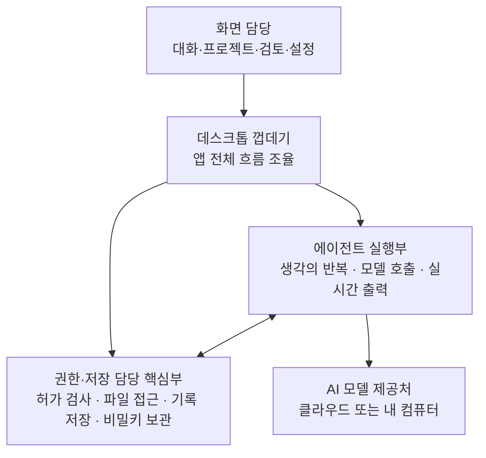

<div class="ai-knowledge-shell">

<aside class="ai-knowledge-sidebar">
  <p class="ai-eyebrow">CATEGORIES</p>
  <nav class="ai-cat-tree"><details class="ai-cat" open><summary><span class="catname">에이전트 오케스트레이션</span><span class="catcount">13</span></summary><ul><li><a href="https://altjs4510.github.io/ai_news_blog/knowledge/20260908/"><span class="kdate">2026-09-08</span><span class="ktitle">bytedance/deer-flow — 샌드박스·메모리·서브에이전트·메시지 게이트웨이를…</span></a></li><li><a href="https://altjs4510.github.io/ai_news_blog/knowledge/20260904/"><span class="kdate">2026-09-04</span><span class="ktitle">HarnessDev: Can LLMs Create and Evolve Their Own…</span></a></li><li><a href="https://altjs4510.github.io/ai_news_blog/knowledge/20260831-openexecutive-virtual-c-suite/"><span class="kdate">2026-08-31</span><span class="ktitle">Open Executive — 8명의 전문 에이전트를 하나의 임원 목소리로</span></a></li><li><a href="https://altjs4510.github.io/ai_news_blog/knowledge/20260828/"><span class="kdate">2026-08-28</span><span class="ktitle">Google ADK for Python v2.8.0 — RemoteA2aAgent 네이…</span></a></li><li><a href="https://altjs4510.github.io/ai_news_blog/knowledge/20260823/"><span class="kdate">2026-08-23</span><span class="ktitle">The Evolution of the Agent Harness — 하네스가 모델 가중치…</span></a></li><li><a href="https://altjs4510.github.io/ai_news_blog/knowledge/20260726/"><span class="kdate">2026-07-26</span><span class="ktitle">citrolabs/ego-lite — 로그인된 브라우저 상태를 AI 에이전트와 공유하는…</span></a></li><li><a href="https://altjs4510.github.io/ai_news_blog/knowledge/20260707/"><span class="kdate">2026-07-07</span><span class="ktitle">AI Hero Skills Catalog — 실무 엔지니어를 위한 재사용 가능한 판단 …</span></a></li><li><a href="https://altjs4510.github.io/ai_news_blog/knowledge/20260623/"><span class="kdate">2026-06-23</span><span class="ktitle">bytedance/deer-flow — 샌드박스·메모리·서브에이전트·메시지 게이트웨이를…</span></a></li><li><a href="https://altjs4510.github.io/ai_news_blog/knowledge/20260621/"><span class="kdate">2026-06-21</span><span class="ktitle">calesthio/OpenMontage — 12 파이프라인·52 도구·500+ 스킬을 …</span></a></li><li><a href="https://altjs4510.github.io/ai_news_blog/knowledge/20260611/"><span class="kdate">2026-06-11</span><span class="ktitle">The evolution of agentic surfaces: building with…</span></a></li><li><a href="https://altjs4510.github.io/ai_news_blog/knowledge/20260602/"><span class="kdate">2026-06-02</span><span class="ktitle">revfactory/harness — 도메인별 에이전트 팀과 스킬을 자동 설계하는 메타…</span></a></li><li><a href="https://altjs4510.github.io/ai_news_blog/knowledge/20260529/"><span class="kdate">2026-05-29</span><span class="ktitle">Introducing dynamic workflows in Claude Code</span></a></li><li><a href="https://altjs4510.github.io/ai_news_blog/knowledge/20260507/"><span class="kdate">2026-05-07</span><span class="ktitle">ruvnet/ruflo — Claude 멀티 에이전트 오케스트레이션 플랫폼</span></a></li></ul></details><details class="ai-cat" open><summary><span class="catname">MCP &amp; 도구 통합</span><span class="catcount">23</span></summary><ul><li><a href="https://altjs4510.github.io/ai_news_blog/knowledge/20260829/"><span class="kdate">2026-08-29</span><span class="ktitle">cursor/plugins — 플러그인 명세(specification)와 공식 플러그인…</span></a></li><li><a href="https://altjs4510.github.io/ai_news_blog/knowledge/20260821/"><span class="kdate">2026-08-21</span><span class="ktitle">volcengine/OpenViking — 에이전트 메모리·Knowledge RAG·스…</span></a></li><li><a href="https://altjs4510.github.io/ai_news_blog/knowledge/20260805/"><span class="kdate">2026-08-05</span><span class="ktitle">TencentCloud/TencentDB-Agent-Memory — 대화·문서·코드를 …</span></a></li><li><a href="https://altjs4510.github.io/ai_news_blog/knowledge/20260802/"><span class="kdate">2026-08-02</span><span class="ktitle">Stateless MCP has recaptured my interest (and in…</span></a></li><li><a href="https://altjs4510.github.io/ai_news_blog/knowledge/20260801/"><span class="kdate">2026-08-01</span><span class="ktitle">different-ai/openwork — Claude Cowork의 오픈소스 대체 에…</span></a></li><li><a href="https://altjs4510.github.io/ai_news_blog/knowledge/20260731/"><span class="kdate">2026-07-31</span><span class="ktitle">different-ai/openwork — Claude Cowork의 오픈소스 대안(o…</span></a></li><li><a href="https://altjs4510.github.io/ai_news_blog/knowledge/20260729/"><span class="kdate">2026-07-29</span><span class="ktitle">Bringing MCP 2026-07-28 to Claude</span></a></li><li><a href="https://altjs4510.github.io/ai_news_blog/knowledge/20260722/"><span class="kdate">2026-07-22</span><span class="ktitle">tirth8205/code-review-graph — MCP·CLI용 로컬 우선 코드 …</span></a></li><li><a href="https://altjs4510.github.io/ai_news_blog/knowledge/20260721/"><span class="kdate">2026-07-21</span><span class="ktitle">tirth8205/code-review-graph — 로컬 우선 코드 인텔리전스 그래프…</span></a></li><li><a href="https://altjs4510.github.io/ai_news_blog/knowledge/20260719/"><span class="kdate">2026-07-19</span><span class="ktitle">tirth8205/code-review-graph — 로컬 우선 코드 인텔리전스 그래프…</span></a></li><li><a href="https://altjs4510.github.io/ai_news_blog/knowledge/20260718/"><span class="kdate">2026-07-18</span><span class="ktitle">tirth8205/code-review-graph — MCP·CLI용 로컬 코드 인텔리…</span></a></li><li><a href="https://altjs4510.github.io/ai_news_blog/knowledge/20260709/"><span class="kdate">2026-07-09</span><span class="ktitle">mvanhorn/last30days-skill — Reddit·X·YouTube·HN·…</span></a></li><li><a href="https://altjs4510.github.io/ai_news_blog/knowledge/20260708/"><span class="kdate">2026-07-08</span><span class="ktitle">Expanding Managed Agents in Gemini API: backgrou…</span></a></li><li><a href="https://altjs4510.github.io/ai_news_blog/knowledge/20260701/"><span class="kdate">2026-07-01</span><span class="ktitle">Google OKF (Open Knowledge Format) — 벤더 중립 에이전트 …</span></a></li><li><a href="https://altjs4510.github.io/ai_news_blog/knowledge/20260618/"><span class="kdate">2026-06-18</span><span class="ktitle">DeusData/codebase-memory-mcp — 158개 언어 코드베이스를 밀리…</span></a></li><li><a href="https://altjs4510.github.io/ai_news_blog/knowledge/20260606/"><span class="kdate">2026-06-06</span><span class="ktitle">chopratejas/headroom — Compress tool outputs, lo…</span></a></li><li><a href="https://altjs4510.github.io/ai_news_blog/knowledge/20260605/"><span class="kdate">2026-06-05</span><span class="ktitle">chopratejas/headroom — Compress tool outputs, lo…</span></a></li><li><a href="https://altjs4510.github.io/ai_news_blog/knowledge/20260604/"><span class="kdate">2026-06-04</span><span class="ktitle">chopratejas/headroom — Compress tool outputs bef…</span></a></li><li><a href="https://altjs4510.github.io/ai_news_blog/knowledge/20260603/"><span class="kdate">2026-06-03</span><span class="ktitle">How Bad MCP design cost your Agent 5× more token…</span></a></li><li><a href="https://altjs4510.github.io/ai_news_blog/knowledge/20260523/"><span class="kdate">2026-05-23</span><span class="ktitle">colbymchenry/codegraph — 사전 인덱싱된 코드 지식 그래프 MCP</span></a></li><li><a href="https://altjs4510.github.io/ai_news_blog/knowledge/20260520/"><span class="kdate">2026-05-20</span><span class="ktitle">New in Claude Managed Agents: self-hosted sandbo…</span></a></li><li><a href="https://altjs4510.github.io/ai_news_blog/knowledge/20260517/"><span class="kdate">2026-05-17</span><span class="ktitle">I gave my LLM 100,000+ tools — Lazy Discovery &a…</span></a></li><li><a href="https://altjs4510.github.io/ai_news_blog/knowledge/20260509/"><span class="kdate">2026-05-09</span><span class="ktitle">How to connect 100 MCP servers without the conte…</span></a></li></ul></details><details class="ai-cat" open><summary><span class="catname">코딩 에이전트</span><span class="catcount">30</span></summary><ul><li><a href="https://altjs4510.github.io/ai_news_blog/knowledge/20260910/" class="current"><span class="kdate">2026-09-10</span><span class="ktitle">vastsa/PI-Desktop — Electron + Rust 호스트 코어 + 에이전…</span></a></li><li><a href="https://altjs4510.github.io/ai_news_blog/knowledge/20260906/"><span class="kdate">2026-09-06</span><span class="ktitle">DietrichGebert/ponytail — 에이전트를 '방에서 가장 게으른 시니어 …</span></a></li><li><a href="https://altjs4510.github.io/ai_news_blog/knowledge/20260903/"><span class="kdate">2026-09-03</span><span class="ktitle">pacifio/atlas — 여러 코딩 에이전트의 변경을 한곳에서 추적·질의하는 '에이…</span></a></li><li><a href="https://altjs4510.github.io/ai_news_blog/knowledge/20260901/"><span class="kdate">2026-09-01</span><span class="ktitle">affaan-m/ECC — 스킬·본능·메모리·보안을 묶은 에이전트 하네스 성능 최적화 …</span></a></li><li><a href="https://altjs4510.github.io/ai_news_blog/knowledge/20260831-gitnexus-code-knowledge-graph/"><span class="kdate">2026-08-31</span><span class="ktitle">GitNexus — 코드베이스를 지식그래프로 바꿔 에이전트에게 쥐어주기</span></a></li><li><a href="https://altjs4510.github.io/ai_news_blog/knowledge/20260826/"><span class="kdate">2026-08-26</span><span class="ktitle">apache/maka — 도구 호출·권한 결정·종료 이벤트를 append-only 로그…</span></a></li><li><a href="https://altjs4510.github.io/ai_news_blog/knowledge/20260822/"><span class="kdate">2026-08-22</span><span class="ktitle">mattpocock/skills — Skills for Real Engineers (하…</span></a></li><li><a href="https://altjs4510.github.io/ai_news_blog/knowledge/20260820/"><span class="kdate">2026-08-20</span><span class="ktitle">akitaonrails/ai-memory — 코딩 에이전트 CLI의 장기 메모리와 벤더…</span></a></li><li><a href="https://altjs4510.github.io/ai_news_blog/knowledge/20260819/"><span class="kdate">2026-08-19</span><span class="ktitle">akitaonrails/ai-memory — 코딩 에이전트 CLI 간 장기 기억과 벤더…</span></a></li><li><a href="https://altjs4510.github.io/ai_news_blog/knowledge/20260811/"><span class="kdate">2026-08-11</span><span class="ktitle">PrimeIntellect-ai/prime-agent — 장기 자율 실행을 전제로 설계…</span></a></li><li><a href="https://altjs4510.github.io/ai_news_blog/knowledge/20260810/"><span class="kdate">2026-08-10</span><span class="ktitle">Auto mode is now the default in Claude Code for …</span></a></li><li><a href="https://altjs4510.github.io/ai_news_blog/knowledge/20260809/"><span class="kdate">2026-08-09</span><span class="ktitle">PrimeIntellect-ai/prime-agent — 코딩 워크플로우·장기 자율 작…</span></a></li><li><a href="https://altjs4510.github.io/ai_news_blog/knowledge/20260808/"><span class="kdate">2026-08-08</span><span class="ktitle">PrimeIntellect-ai/prime-agent — 코딩 워크플로우와 장시간 자율…</span></a></li><li><a href="https://altjs4510.github.io/ai_news_blog/knowledge/20260804/"><span class="kdate">2026-08-04</span><span class="ktitle">esengine/DeepSeek-Reasonix — prefix-cache 안정성을 축…</span></a></li><li><a href="https://altjs4510.github.io/ai_news_blog/knowledge/20260728/"><span class="kdate">2026-07-28</span><span class="ktitle">alibaba/open-code-review — 결정론적 파이프라인 + LLM 에이전트…</span></a></li><li><a href="https://altjs4510.github.io/ai_news_blog/knowledge/20260725/"><span class="kdate">2026-07-25</span><span class="ktitle">The new rules of context engineering for Claude …</span></a></li><li><a href="https://altjs4510.github.io/ai_news_blog/knowledge/20260714/"><span class="kdate">2026-07-14</span><span class="ktitle">Graphify-Labs/graphify — 코드베이스를 질의 가능한 지식 그래프로 만…</span></a></li><li><a href="https://altjs4510.github.io/ai_news_blog/knowledge/20260705/"><span class="kdate">2026-07-05</span><span class="ktitle">openai/codex-plugin-cc — Claude Code에서 Codex를 위임…</span></a></li><li><a href="https://altjs4510.github.io/ai_news_blog/knowledge/20260626/"><span class="kdate">2026-06-26</span><span class="ktitle">google-labs-code/design.md — 코딩 에이전트에게 디자인 시스템을 …</span></a></li><li><a href="https://altjs4510.github.io/ai_news_blog/knowledge/20260619/"><span class="kdate">2026-06-19</span><span class="ktitle">Claude Code now supports artifacts</span></a></li><li><a href="https://altjs4510.github.io/ai_news_blog/knowledge/20260530/"><span class="kdate">2026-05-30</span><span class="ktitle">Leonxlnx/taste-skill — AI에게 좋은 취향을 부여해 generic s…</span></a></li><li><a href="https://altjs4510.github.io/ai_news_blog/knowledge/20260528/"><span class="kdate">2026-05-28</span><span class="ktitle">Building self-improving tax agents with Codex</span></a></li><li><a href="https://altjs4510.github.io/ai_news_blog/knowledge/20260526/"><span class="kdate">2026-05-26</span><span class="ktitle">colbymchenry/codegraph — Pre-indexed code knowle…</span></a></li><li><a href="https://altjs4510.github.io/ai_news_blog/knowledge/20260524/"><span class="kdate">2026-05-24</span><span class="ktitle">colbymchenry/codegraph — Pre-indexed code knowle…</span></a></li><li><a href="https://altjs4510.github.io/ai_news_blog/knowledge/20260521/"><span class="kdate">2026-05-21</span><span class="ktitle">colbymchenry/codegraph — Pre-indexed code knowle…</span></a></li><li><a href="https://altjs4510.github.io/ai_news_blog/knowledge/20260512/"><span class="kdate">2026-05-12</span><span class="ktitle">agentmemory — Persistent memory for AI coding ag…</span></a></li><li><a href="https://altjs4510.github.io/ai_news_blog/knowledge/20260510/"><span class="kdate">2026-05-10</span><span class="ktitle">addyosmani/agent-skills — Production-grade engin…</span></a></li><li><a href="https://altjs4510.github.io/ai_news_blog/knowledge/20260508/"><span class="kdate">2026-05-08</span><span class="ktitle">addyosmani/agent-skills — Production-grade engin…</span></a></li><li><a href="https://altjs4510.github.io/ai_news_blog/knowledge/20260506/"><span class="kdate">2026-05-06</span><span class="ktitle">mksglu/context-mode — AI 코딩 에이전트용 컨텍스트 윈도우 최적화</span></a></li><li><a href="https://altjs4510.github.io/ai_news_blog/knowledge/20260505/"><span class="kdate">2026-05-05</span><span class="ktitle">mattpocock/skills — Skills for Real Engineers (.…</span></a></li></ul></details><details class="ai-cat" open><summary><span class="catname">모델 &amp; 연구</span><span class="catcount">7</span></summary><ul><li><a href="https://altjs4510.github.io/ai_news_blog/knowledge/20260909/"><span class="kdate">2026-09-09</span><span class="ktitle">Reducing cost and improving performance with Cla…</span></a></li><li><a href="https://altjs4510.github.io/ai_news_blog/knowledge/20260907-voicemem-dual-brain-memory/"><span class="kdate">2026-09-07</span><span class="ktitle">VoiceMem — 좌뇌·우뇌로 쪼갠 스트리밍 메모리로 음성 에이전트 지연 없애기</span></a></li><li><a href="https://altjs4510.github.io/ai_news_blog/knowledge/20260716-proprag/"><span class="kdate">2026-07-16</span><span class="ktitle">PropRAG — 프로포지션 경로 위 beam search로 멀티홉 검색 안내</span></a></li><li><a href="https://altjs4510.github.io/ai_news_blog/knowledge/20260620/"><span class="kdate">2026-06-20</span><span class="ktitle">zai-org/GLM-5 — From Vibe Coding to Agentic Engi…</span></a></li><li><a href="https://altjs4510.github.io/ai_news_blog/knowledge/20260617/"><span class="kdate">2026-06-17</span><span class="ktitle">Predicting model behavior before release by simu…</span></a></li><li><a href="https://altjs4510.github.io/ai_news_blog/knowledge/20260516/"><span class="kdate">2026-05-16</span><span class="ktitle">STALE — 에이전트가 자기 기억의 유효성을 인지할 수 있는가</span></a></li><li><a href="https://altjs4510.github.io/ai_news_blog/knowledge/20260513/"><span class="kdate">2026-05-13</span><span class="ktitle">Thinking Machines' Native Interaction Models — T…</span></a></li></ul></details><details class="ai-cat" open><summary><span class="catname">인프라 &amp; 컴퓨트</span><span class="catcount">7</span></summary><ul><li><a href="https://altjs4510.github.io/ai_news_blog/knowledge/20260905/"><span class="kdate">2026-09-05</span><span class="ktitle">magnitudedev/magnitude — 하드웨어에 맞는 최적 로컬 모델을 띄워 이…</span></a></li><li><a href="https://altjs4510.github.io/ai_news_blog/knowledge/20260813/"><span class="kdate">2026-08-13</span><span class="ktitle">semantica-agi/semantica — 컨텍스트와 책임 추적을 위한 그래프 네이…</span></a></li><li><a href="https://altjs4510.github.io/ai_news_blog/knowledge/20260812/"><span class="kdate">2026-08-12</span><span class="ktitle">semantica-agi/semantica — 컨텍스트와 '책임 추적 가능한(accou…</span></a></li><li><a href="https://altjs4510.github.io/ai_news_blog/knowledge/20260806/"><span class="kdate">2026-08-06</span><span class="ktitle">cloudflare/computer — 에이전트에게 컴퓨터를 통째로 주는 엣지 실행 샌…</span></a></li><li><a href="https://altjs4510.github.io/ai_news_blog/knowledge/20260724/"><span class="kdate">2026-07-24</span><span class="ktitle">diegosouzapw/OmniRoute — 단일 엔드포인트로 278+ 프로바이더·50…</span></a></li><li><a href="https://altjs4510.github.io/ai_news_blog/knowledge/20260723/"><span class="kdate">2026-07-23</span><span class="ktitle">diegosouzapw/OmniRoute — 268+ 프로바이더를 단일 엔드포인트로 묶…</span></a></li><li><a href="https://altjs4510.github.io/ai_news_blog/knowledge/20260522/"><span class="kdate">2026-05-22</span><span class="ktitle">Giving Agents Computers — Ivan Burazin, Daytona</span></a></li></ul></details><details class="ai-cat" open><summary><span class="catname">보안 &amp; 거버넌스</span><span class="catcount">18</span></summary><ul><li><a href="https://altjs4510.github.io/ai_news_blog/knowledge/20260902/"><span class="kdate">2026-09-02</span><span class="ktitle">AIR raises $50M to help companies vet the skills…</span></a></li><li><a href="https://altjs4510.github.io/ai_news_blog/knowledge/20260827/"><span class="kdate">2026-08-27</span><span class="ktitle">Claude in Chrome is generally available</span></a></li><li><a href="https://altjs4510.github.io/ai_news_blog/knowledge/20260819-mind-viruses/"><span class="kdate">2026-08-19</span><span class="ktitle">탈옥도, 인젝션도 없이 — 대화로만 퍼지는 에이전트의 '마인드 바이러스'</span></a></li><li><a href="https://altjs4510.github.io/ai_news_blog/knowledge/20260730/"><span class="kdate">2026-07-30</span><span class="ktitle">Anatomy of a Frontier Lab Agent Intrusion: A Tec…</span></a></li><li><a href="https://altjs4510.github.io/ai_news_blog/knowledge/20260716/"><span class="kdate">2026-07-16</span><span class="ktitle">Dicklesworthstone/destructive_command_guard — 에이…</span></a></li><li><a href="https://altjs4510.github.io/ai_news_blog/knowledge/20260715/"><span class="kdate">2026-07-15</span><span class="ktitle">Dicklesworthstone/destructive_command_guard — 에이…</span></a></li><li><a href="https://altjs4510.github.io/ai_news_blog/knowledge/20260710/"><span class="kdate">2026-07-10</span><span class="ktitle">70개 MCP 서버 strace 런타임 감사 — 부팅 시 아웃바운드 호출 서버 적발</span></a></li><li><a href="https://altjs4510.github.io/ai_news_blog/knowledge/20260704/"><span class="kdate">2026-07-04</span><span class="ktitle">Cloudflare is about to block AI agents by defaul…</span></a></li><li><a href="https://altjs4510.github.io/ai_news_blog/knowledge/20260703/"><span class="kdate">2026-07-03</span><span class="ktitle">Giving admins more visibility and control over C…</span></a></li><li><a href="https://altjs4510.github.io/ai_news_blog/knowledge/20260630/"><span class="kdate">2026-06-30</span><span class="ktitle">Introducing the Claude apps gateway for Amazon B…</span></a></li><li><a href="https://altjs4510.github.io/ai_news_blog/knowledge/20260625/"><span class="kdate">2026-06-25</span><span class="ktitle">Agent identity in Claude Tag: a new access model…</span></a></li><li><a href="https://altjs4510.github.io/ai_news_blog/knowledge/20260624/"><span class="kdate">2026-06-24</span><span class="ktitle">Agent identity in Claude Tag: a new access model…</span></a></li><li><a href="https://altjs4510.github.io/ai_news_blog/knowledge/20260614/"><span class="kdate">2026-06-14</span><span class="ktitle">NVIDIA/SkillSpector — Security scanner for AI ag…</span></a></li><li><a href="https://altjs4510.github.io/ai_news_blog/knowledge/20260613/"><span class="kdate">2026-06-13</span><span class="ktitle">Fable 5's guardrails got bypassed in 48 hours — …</span></a></li><li><a href="https://altjs4510.github.io/ai_news_blog/knowledge/20260612/"><span class="kdate">2026-06-12</span><span class="ktitle">NVIDIA/SkillSpector — AI 에이전트 스킬용 보안 스캐너</span></a></li><li><a href="https://altjs4510.github.io/ai_news_blog/knowledge/20260607/"><span class="kdate">2026-06-07</span><span class="ktitle">OpenAI Help: Lockdown Mode</span></a></li><li><a href="https://altjs4510.github.io/ai_news_blog/knowledge/20260531/"><span class="kdate">2026-05-31</span><span class="ktitle">How we contain Claude across products</span></a></li><li><a href="https://altjs4510.github.io/ai_news_blog/knowledge/20260527/"><span class="kdate">2026-05-27</span><span class="ktitle">Microsoft Copilot Cowork Exfiltrates Files</span></a></li></ul></details><details class="ai-cat" open><summary><span class="catname">응용 사례</span><span class="catcount">6</span></summary><ul><li><a href="https://altjs4510.github.io/ai_news_blog/knowledge/20260814/"><span class="kdate">2026-08-14</span><span class="ktitle">cathrynlavery/diagram-design — Claude Code용 에디토리…</span></a></li><li><a href="https://altjs4510.github.io/ai_news_blog/knowledge/20260717/"><span class="kdate">2026-07-17</span><span class="ktitle">After a year building agent memory, 'save everyt…</span></a></li><li><a href="https://altjs4510.github.io/ai_news_blog/knowledge/20260712/"><span class="kdate">2026-07-12</span><span class="ktitle">Do Automated Evals Work?</span></a></li><li><a href="https://altjs4510.github.io/ai_news_blog/knowledge/20260609/"><span class="kdate">2026-06-09</span><span class="ktitle">Building intelligent apps for Apple platforms wi…</span></a></li><li><a href="https://altjs4510.github.io/ai_news_blog/knowledge/20260515/"><span class="kdate">2026-05-15</span><span class="ktitle">Clawdmeter — Claude Code 사용량을 데스크톱 대시보드로</span></a></li><li><a href="https://altjs4510.github.io/ai_news_blog/knowledge/20260514/"><span class="kdate">2026-05-14</span><span class="ktitle">Introducing Claude for Small Business</span></a></li></ul></details><details class="ai-cat" open><summary><span class="catname">산업 동향</span><span class="catcount">8</span></summary><ul><li><a href="https://altjs4510.github.io/ai_news_blog/knowledge/20260907-humanmade-52week-rhythm/"><span class="kdate">2026-09-07</span><span class="ktitle">휴먼 메이드의 '52주 리듬' — 아이디어가 흔해진 시대에 값이 오르는 건 버리는 판단</span></a></li><li><a href="https://altjs4510.github.io/ai_news_blog/knowledge/20260830/"><span class="kdate">2026-08-30</span><span class="ktitle">[AINews] OpenAI shuts off Cursor — 프론티어 모델 공급 차단…</span></a></li><li><a href="https://altjs4510.github.io/ai_news_blog/knowledge/20260711/"><span class="kdate">2026-07-11</span><span class="ktitle">OpenAI says GPT 5.6 is the 'preferred model' for…</span></a></li><li><a href="https://altjs4510.github.io/ai_news_blog/knowledge/20260702/"><span class="kdate">2026-07-02</span><span class="ktitle">How Cursor deploys AI inside the enterprise (For…</span></a></li><li><a href="https://altjs4510.github.io/ai_news_blog/knowledge/20260616/"><span class="kdate">2026-06-16</span><span class="ktitle">Why AI hasn't replaced software engineers, and w…</span></a></li><li><a href="https://altjs4510.github.io/ai_news_blog/knowledge/20260610/"><span class="kdate">2026-06-10</span><span class="ktitle">Fable 5 just made cost-aware model routing manda…</span></a></li><li><a href="https://altjs4510.github.io/ai_news_blog/knowledge/20260519/"><span class="kdate">2026-05-19</span><span class="ktitle">Anthropic acquires Stainless</span></a></li><li><a href="https://altjs4510.github.io/ai_news_blog/knowledge/20260504/"><span class="kdate">2026-05-04</span><span class="ktitle">Agents for Everything Else: Codex for Knowledge …</span></a></li></ul></details></nav>
</aside>

<article class="ai-knowledge-article">

<header class="ai-post-hero">
  <p class="ai-eyebrow"><a class="ai-back" href="../">KNOWLEDGE</a> · 2026-09-10 · 오늘의 학습</p>
  <h2 class="ai-post-title">vastsa/PI-Desktop — Electron + Rust 호스트 코어 + 에이전트 하네스 + 사용자 설치형 플러그인의 로컬 우선 코딩 에이전트 데스크톱</h2>
</header>

> 원문: [vastsa/PI-Desktop — Electron + Rust 호스트 코어 + 에이전트 하네스 + 사용자 설치형 플러그인의 로컬 우선 코딩 에이전트 데스크톱](https://github.com/vastsa/PI-Desktop)

## 📌 학습 정리

### 1. 한 줄로 말하면

내 컴퓨터 안에 코딩 도우미 전용 작업실을 하나 차려주는 프로그램이에요. 어떤 AI 모델을 데려다 쓸지는 내가 고르고, 그 도우미가 파일을 고치거나 명령을 실행할 때마다 내가 확인하고 넘길 수 있어요.

### 2. 왜 이게 만들어졌어요?

지금까지 코딩을 도와주는 AI는 대부분 셋 중 하나에 얹혀 있었어요. 터미널(검은 명령어 창) 안에 살거나, 코드 편집기의 확장 기능으로 붙어 있거나, 아예 남의 서버에서 돌아가는 웹 서비스였죠. 그러다 보니 편집기를 바꾸면 작업 흐름이 통째로 흔들리고, 여러 프로젝트를 오가며 며칠짜리 작업을 이어가기에는 화면이 너무 좁았어요. 게다가 대화 기록이나 자격 증명이 남의 서버를 거쳐 가는 구조라 어디까지가 내 컴퓨터 안 일인지 불분명하기도 했고요. PI-Desktop은 그 반대편에 서서, 에이전트에게 아예 자기 작업 공간을 하나 통째로 내주자는 쪽을 택했습니다. 다만 아직 초기 미리보기(Early Preview) 단계라, 인터페이스나 확장 규격은 계속 바뀔 수 있다고 스스로 밝히고 있어요.

### 3. 비유로 풀면

**작업실을 빌려주는 것 같은 거예요.** 지금까지의 코딩 AI가 "내 책상 한 귀퉁이를 빌려 쓰는 손님"이었다면, 이건 도우미에게 방 하나를 통째로 주고 열쇠는 내가 쥐고 있는 구조예요. 방 안에 프로젝트 서랍, 대화 기록장, 결과물 검토대, 알림판이 다 들어 있고요.

**공사 현장의 세 가지 계약 방식 같기도 해요.** 그냥 "알아서 해주세요"(에이전트), "설계도 먼저 보여주시면 승인할게요"(플랜), "완성된 모습만 합의하고 방법은 맡길게요"(골). 같은 작업자가 같은 일을 하는데, 내가 어느 지점에서 도장을 찍느냐만 달라져요.

그래서 결국 이 도구의 핵심은 "AI가 더 똑똑해진다"가 아니라 **AI가 일하는 공간과 승인 지점을 내가 정한다**는 쪽에 있어요.

### 4. 어떻게 작동하는지 (그림으로)



화면은 예쁘게 보여주는 일만 하고, 파일을 실제로 건드리거나 비밀키를 꺼내는 "위험한 일"은 전부 권한·저장 담당 핵심부를 거치게 되어 있어요. 에이전트 실행부는 모델과 대화하며 다음에 뭘 할지 정하지만, 정작 파일을 고치려면 핵심부에 허락을 구해야 하는 구조입니다. 이렇게 역할을 갈라 놓은 덕분에, 화면 쪽에 문제가 생겨도 곧바로 내 파일이 위험해지지는 않도록 설계되어 있어요.

저장되는 것들의 위치도 명시적이에요. 대화는 내 컴퓨터에 파일로, 설정도 내 컴퓨터에, API 자격 증명은 운영체제 자체의 비밀번호 보관함에 들어갑니다. 사용 통계 수집은 없다고 밝히고 있고, 다만 원격 모델을 쓰면 그 요청에 필요한 내용은 당연히 해당 업체로 전달돼요 — "아무것도 네트워크를 안 탄다"가 아니라 "중간에 이 앱 회사의 서버가 끼지 않는다"는 의미의 로컬 우선(local-first)입니다.

### 5. 처음 보는 용어 풀이

- **로컬 우선 (local-first)** — 데이터와 처리가 기본적으로 내 컴퓨터 안에서 이뤄지는 방식이에요. 이 앱의 경우 계정 가입도, 중간 중계 서버도 요구하지 않고, 모델 요청만 내가 지정한 곳으로 직접 나갑니다.
- **에이전트 / 플랜 / 골 모드 (Agent / Plan / Goal)** — 같은 도우미에게 서로 다른 승인 지점을 두는 세 가지 방식이에요. 에이전트는 바로 작업을 시작하고, 플랜은 확정된 실행 계획을 내가 승인해야 시작하며, 골은 목표와 완료 조건만 합의한 뒤 방법은 도우미가 정합니다.
- **서브에이전트 (Subagent)** — 큰 일을 나눠 맡기는 보조 도우미예요. 코드베이스 탐색, 조사, 테스트 분석 같은 독립적인 작업을 각자 자기 맥락에서 처리한 뒤 결과만 원래 도우미에게 돌려줍니다. 한 번의 대화에 모든 걸 욱여넣지 않아도 되게 해주는 장치예요.
- **스킬 (Skills)** — 도우미에게 미리 심어두는 재사용 가능한 작업 지침이에요. 전체에 적용하거나 특정 프로젝트에서만 켤 수도 있습니다.
- **모델 컨텍스트 프로토콜 (MCP, Model Context Protocol)** — 외부 도구나 서비스를 AI에 연결하는 공통 규격이에요. 이 규격을 따르면 앱을 다시 만들지 않고도 새 도구를 붙일 수 있습니다. 참고로 이 앱은 반대로 자기 자신이 외부 도구에 조종당하는 통로도 열어둘 수 있는데, 기본은 꺼져 있고 내 컴퓨터 안에서만 접근 가능하며, 켜면 호출하는 쪽이 앱과 같은 수준의 권한을 갖게 된다는 점을 문서가 분명히 경고하고 있어요.
- **플러그인 (Plugins)** — 앱 자체를 확장하는 설치형 부가 기능이에요. 도구, 명령어, 화면 패널, 테마, 상주 서비스까지 추가할 수 있습니다. 다만 문서는 이게 완전한 격리 상자가 아니라 "내가 믿기로 선택한 코드"라고 못 박고 있어서, 신뢰하는 것만 설치하라고 권해요.
- **일렉트론 (Electron)** — 웹 기술로 데스크톱 앱을 만드는 틀이에요. 여기서는 화면 부분에 쓰이되, 화면 쪽이 시스템 기능을 직접 부르지 못하도록 막아둔 형태로 쓰입니다.
- **러스트 (Rust)** — 속도와 안전성을 중시하는 프로그래밍 언어예요. 이 앱에서는 권한 검사, 파일 접근, 기록 저장, 비밀키 보관 같은 민감한 일을 맡는 핵심부를 이 언어로 만들었습니다.

### 6. 한 발 더 들어가고 싶다면

- [Documentation](https://github.com/vastsa/PI-Desktop) — 설치부터 모델 연결, 확장까지 공식 문서의 출발점이에요. 처음 만져볼 때 여기부터 보면 됩니다.
- [원문 저장소 vastsa/PI-Desktop](https://github.com/vastsa/PI-Desktop) — 소스 코드와 실행 방법이 있어요. 직접 빌드해보거나 구조를 뜯어보고 싶을 때 봅니다.
- [GitHub Releases](https://github.com/vastsa/PI-Desktop) — 맥·윈도우·리눅스용 설치 파일이 올라오는 곳이에요. 리눅스는 비교적 최근 배포판(우분투 22.04 이상 등)이 필요하다는 조건이 있으니 미리 확인하면 좋아요.
- [pi-mono](https://github.com/vastsa/PI-Desktop) — 이 앱의 에이전트 실행 부분이 기대고 있는 오픈소스 기반이에요. 실제 에이전트 루프가 어떻게 도는지 궁금하면 이쪽으로 내려가면 됩니다.

---

## 📖 원문 전체 번역 (정독용)

> 의역 최소화한 전체 번역입니다. 큰 흐름은 위 정리에서 잡고, 정확한 워딩이 필요할 땐 이 섹션에서 정독하세요.

PI-Desktop

AI 코딩 에이전트를 위한, 당신만의 로컬 우선 데스크톱 워크스페이스.

당신의 모델을 가져오세요. 어떤 로컬 프로젝트든 여세요. 에이전트가 작업하게 두세요 — 통제권은 당신이 쥔 채로.

PI-Desktop 계정 없음. 필수 릴레이 없음. 에디터 종속 없음.

PI-Desktop 다운로드
·
문서
·
스크린샷
·
简体中文

코딩 에이전트, 프로젝트, 모델, 도구, 장기 실행 세션을 위한 독립형 데스크톱 워크스페이스.

**중요**
PI-Desktop 은 현재 Early Preview 단계입니다.
프로젝트는 활발히 개발 중이며 실제 코딩 워크플로우에 이미 사용 가능하지만, API, 확장 인터페이스, 일부 데스크톱 동작은 계속 변화할 수 있습니다.

## 왜 PI-Desktop 인가?

대부분의 코딩 에이전트는 터미널, 에디터 확장, 또는 호스팅 서비스 안에 산다.
PI-Desktop 은 그들에게 자신만의 워크스페이스를 준다.

🖥️ **데스크톱 우선**
저장소와 세션을 넘나들며 작업하되, 에이전트 워크플로우를 하나의 에디터나 터미널에 묶지 않는다.
프로젝트, 대화, 리뷰, 파일, 미리보기, 알림, 확장 기능이 모두 하나의 워크스페이스에 산다.

✨ **당신의 모델을 가져오세요**
OpenAI, Anthropic, 로컬 모델, 호스팅 게이트웨이, 또는 어떤 OpenAI 호환 API 든 사용하라.
여러 프로바이더와 모델을 설정한 뒤 세션별로 전환하라.

🔍 **기본적으로 검사 가능**
에이전트는 파일을 읽고, 코드를 편집하고, 명령을 실행할 수 있다 — 하지만 특권적 동작은 PI-Desktop 의 권한 계층을 거친다.
diff 를 검토하고, 명령 출력을 확인하고, 각 세션에 얼마만큼의 자율성을 줄지 결정하라.

🧩 **확장하도록 만들어짐**
Skills, MCP 서버, Subagents, 설치 가능한 Plugins 를 추가하라.
플러그인은 도구, 명령, 패널, 테마, 서비스, 스킬, 새로운 워크스페이스 경험을 기여할 수 있다.

## 프롬프트에서 패치까지

시작하는 데는 몇 단계면 충분하다:

1. **모델 연결**
   `Settings → Model configuration` 을 열고, 프로바이더나 호환 API 를 선택한 뒤 자격 증명을 추가하라.
2. **프로젝트 열기**
   사이드바에서 어떤 로컬 저장소나 프로젝트 디렉토리든 추가하라.
3. **Agent, Plan, 또는 Goal 선택**
   `Agent` 는 즉시 작업을 시작한다.
   `Plan` 은 당신이 확정된 구현 계획을 승인할 때까지 대기한다.
   `Goal` 은 당신이 결과를 승인할 때까지 대기한 뒤, 에이전트가 경로를 선택한다.
4. **결과 검토**
   Review 패널에서 편집 내용을 검사하고, 명령 출력을 확인하고, 애플리케이션을 미리 보고, PI-Desktop 을 떠나지 않고 대화를 계속하라.

## 채팅창 그 이상

### Agent, Plan, Goal

동일한 에이전트. 세 개의 게이트. 특권적 도구는 어떤 모드에서든 여전히 권한 계층을 통과한다.

| | Agent | Plan | Goal |
|---|---|---|---|
| **당신이 승인하는 것** | 추가 없음 | 구현 계획 | 결과와 인수 기준 |
| **에이전트가 하는 것** | 읽고, 편집하고, 명령을 실행하고, 테스트하고, 반복한다 | 저장소를 연구하고, 확정된 계획을 작성한 뒤 대기한다 | 경로를 선택하고 목표가 충족될 때까지 작업한다 |
| **사용 시점** | 그냥 작업을 처리하길 원할 때 | 변경이 크거나 위험해서 접근 방식을 먼저 보고 싶을 때 | 경로가 아니라 결과에 신경 쓸 때 |

`Agent` 는 기본 루프다: 트리를 검사하고, 파일을 패치하고, 명령을 실행하며 계속 진행한다.

`Plan` 은 승인 경계다. 에이전트가 먼저 조사한 뒤 불변의 구현 계획을 만든다. 당신이 승인하기 전까지 실행은 시작되지 않는다.

`Goal` 은 결과 우선이다. 당신이 목표와 인수 기준을 고정하면, 에이전트가 거기에 도달할 방법을 결정한다.

### Subagents 에 작업 위임하기

큰 작업은 하나의 컨텍스트 윈도우에 담기지 않는 경우가 흔하다.
PI-Desktop 은 다음과 같은 독립적인 작업을 백그라운드 Subagents 에 위임할 수 있다:

- 코드베이스 탐색
- 다중 파일 구현
- 조사 및 리서치
- 테스트 분석
- 적대적(adversarial) 리뷰

각 Subagent 는 자신만의 컨텍스트에서 실행되며 결과를 부모 에이전트에게 보고한다.

### 장기 세션을 위해 구축된 워크스페이스

PI-Desktop 은 한 번에 하나 이상의 프롬프트를 위해 설계되었다.
여러 프로젝트와 세션을 관리하고, 대화를 고정(pin)하거나 보관(archive)하고, 세션을 분기하고, 에이전트가 실행 중인 동안 프롬프트를 큐에 넣고, `@` 로 파일을 참조하고, 슬래시 명령을 사용하고, 애플리케이션 전체를 검색할 수 있다.
스트리밍 응답은 체크포인트가 저장되어, 중단된 작업이 가능한 한 애플리케이션 재시작이나 런타임 오류를 견뎌낼 수 있다.

### 당신의 모델, 당신의 선택

PI-Desktop 은 에이전트 런타임을 하드코딩된 모델 목록에 묶어두지 않는다.
다음을 사용하라:

- OpenAI 및 Anthropic
- OpenAI 호환 API
- 호스팅된 모델 게이트웨이
- Ollama, LM Studio 같은 로컬 게이트웨이
- 동일 프로바이더 아래의 여러 모델
- 지원되는 경우 프로바이더 OAuth 계정

모델 설정에는 컨텍스트 윈도우, 출력 한도, 추론 제어, temperature, 그 외 모델별 동작이 포함될 수 있다.
Composer 에서 세션을 다시 만들지 않고도 직접 모델을 전환할 수 있다.

### 답만이 아니라 작업 자체를 검토하기

에이전트 워크스페이스에는 코딩 중 중요한 요소들을 위한 전용 화면(surface) 들이 포함된다:

- 트랜스크립트 탐색이 가능한 장기 실행 대화
- 세션별로 프로바이더, 모델, 추론 레벨 전환
- 플러그인 마켓플레이스를 통한 워크스페이스 확장
- 프로바이더 추가 및 모델 연결

모든 스크린샷 보기 →

## 앱을 다시 빌드하지 않는 확장 기능

PI-Desktop 은 에이전트를 얼마나 깊이 커스터마이즈하고 싶은지에 따라 여러 확장 계층을 가지고 있다.

**Skills**
에이전트에게 재사용 가능한 지시와 워크플로우를 제공하라.
스킬은 전역으로 설치되거나 개별 프로젝트에 대해서만 활성화될 수 있다.

**MCP**
Model Context Protocol 서버를 통해 외부 도구와 서비스를, 데스크톱 애플리케이션에 그것들을 내장하지 않고도 연결하라.
PI-Desktop 은 외부 MCP Agent 에 의해 제어될 수도 있다. `PI_DESKTOP_MCP_CONTROL=1` 로 앱을 시작한 뒤, Electron 사용자 데이터 디렉토리 안의 `mcp-control.json` 에서 루프백 엔드포인트와 bearer 토큰을 읽으면 된다. 이 엔드포인트는 프로젝트/세션/Agent 워크플로우와 검토된 데스크톱 작업(operation) 카탈로그를 지원한다. 기본적으로 비활성화되어 있으며, 루프백에만 바인딩되고, 호출하는 로컬 Agent 에게 해당 작업들에 대해 데스크톱과 동일한 권한을 부여한다 — `confirm: true` 는 사용자 프롬프트가 아니다.

**Subagents**
자신만의 지시, 도구, 모델 선택을 가진 전문화된 에이전트를 만들고, 다른 에이전트로부터 작업을 그들에게 위임하라.

**Plugins**
플러그인은 다음과 같은 것들로 PI-Desktop 자체를 확장할 수 있다:

- 에이전트 도구
- 명령
- 워크스페이스 패널
- work-panel 뷰
- Skills
- MCP 서버
- Subagents
- 테마
- 상주(resident) 서비스
- 플러그인 간(inter-plugin) 메시징

플러그인은 로컬에 설치되거나 `.piplug` 패키지 워크플로우를 사용해 마켓플레이스를 통해 설치될 수 있다.

**주의**
플러그인 프로세스는 권한으로 게이트되어 있고 렌더러로부터 격리되어 있지만, 플러그인은 여전히 완전한 운영체제 샌드박스가 아니라 사용자가 신뢰하는 코드다. 신뢰하는 플러그인만 설치하라.

첫 번째 플러그인 만들기 →

## 정확히 말해, 로컬 우선

PI-Desktop 은 **로컬 우선(local-first)** 이지, "네트워크에 절대 아무것도 닿지 않는다"는 뜻이 아니다.

| 데이터 | 동작 |
|---|---|
| 대화 | SQLite 인덱스와 함께 JSONL 로 로컬 저장 |
| 설정 | 당신의 머신에 저장 |
| API 자격 증명 | 운영체제 키체인에 저장 |
| 로그 | 로컬 |
| PI-Desktop 텔레메트리 | 없음 |
| 모델 요청 | 당신이 설정한 프로바이더나 엔드포인트로 직접 전송 |

필수 PI-Desktop 계정도 없고, 당신의 머신과 모델 프로바이더 사이에 필수 PI 호스팅 릴레이도 없다.
원격 모델 프로바이더를 사용한다면, 그 모델 요청에 필요한 컨텍스트는 자연히 해당 프로바이더의 자체 개인정보 보호 정책에 따라 그 프로바이더에게 전송된다.

## 다운로드

최신 빌드를 GitHub Releases 에서 다운로드하라.

| 플랫폼 | 아키텍처 | 패키지 |
|---|---|---|
| macOS | Apple Silicon | .dmg / .zip |
| macOS | Intel | .dmg / .zip |
| Windows | x64 | NSIS 설치 프로그램 / 포터블 exe |
| Linux | x64 | .AppImage / .deb / .rpm / .asar |

패키징된 빌드는 GitHub Releases 에서 업데이트를 확인하고 애플리케이션 내에서 새 버전을 노출할 수 있다. Windows NSIS 와 Linux AppImage 는 앱 내에서 다운로드 및 설치가 가능하다; macOS, Linux deb/rpm, Windows 포터블 exe 는 릴리스 페이지를 연다. Linux `.asar` 자산은 시스템 Electron 으로 재패키징할 수 있도록 제공된다; 대상 배포판에 필요한 네이티브 호스트와 패키징된 리소스를 추가한 뒤 `electron PI-Desktop-<version>-linux-x64.asar` 로 실행하라.

### Linux

Linux x64 패키지는 `glibc 2.35` 이상이 필요하다. 이는 다음에 포함된 라이브러리다:

- Ubuntu 22.04 이상
- Debian 12 이상
- Fedora 36 이상

Ubuntu 20.04, Debian 11, Fedora 35, 그리고 그보다 오래된 릴리스는 번들된 호스트를 로드할 수 없다. `ldd --version` 으로 확인하라.

### macOS

태그된 릴리스 워크플로우는 기본적으로 서명되지 않은 macOS 아티팩트를 게시한다. 신뢰할 수 있는 서명되지 않은 설치를 위해서는, `PI-Desktop.app` 을 Applications 로 옮기고 macOS 가 앱이 손상되었다고 말하면 `PI-Desktop-macOS-open.command` 를 더블클릭하라.

`sign_macos: true` 로 수동 실행된 작업은 게시 전에 Developer ID 자격 증명으로 macOS 아티팩트를 서명, 공증(notarize), 스테이플(staple) 한다; 서명된 빌드는 이 헬퍼가 필요 없다.

## 기존 세션 가져오기

이미 다른 코딩 에이전트를 사용하고 있는가?
PI-Desktop 은 다음을 포함한 지원되는 도구들로부터 로컬 세션을 가져올 수 있다:

- Claude Code
- Codex
- OpenCode
- Pi

기존 작업을 데스크톱 워크스페이스로 가져오려면 `Settings → Import` 를 열라.

## 아키텍처

PI-Desktop 은 사용자 인터페이스를, 특권을 가진 호스트 기능 및 에이전트 루프와 의도적으로 분리한다.

```
flowchart TB
    UI["React Renderer<br/>Chat · Projects · Reviews · Settings"]
    Electron["Electron Main<br/>Desktop orchestration"]
    Rust["Rust Host Core<br/>Permissions · Filesystem · SQLite · Secrets"]
    Agent["pi Agent Sidecar<br/>Agent loop · Models · Streaming"]
    Provider["Model Provider<br/>Cloud or Local"]

    UI --> Electron
    Electron --> Rust
    Electron --> Agent
    Agent <--> Rust
    Agent --> Provider
Loading
```

렌더러는 Node 통합을 가지지 않는다.
**Rust Host Core** 는 특권적 워크스페이스 작업, 권한, 영속성, 비밀정보(secrets)를 소유한다. **pi Agent Sidecar** 는 모델 상호작용과 에이전트 루프를 소유한다. Electron 은 이러한 책임들을 분리한 상태로 유지하면서 데스크톱 생명주기를 조율한다.

아키텍처 명세 읽기 →

## 프로젝트 상태

PI-Desktop 은 활발히 개발 중인 초기 프리뷰다.

현재 `0.14.x` 라인에는 데스크톱 셸, 스트리밍 에이전트 런타임, Agent / Plan / Goal 워크플로우, 권한 인지 워크스페이스 도구, 프로젝트와 세션, 세션 가져오기, 로컬 MCP 제어, MCP / Skills / Subagents, 백그라운드 위임, 다중 프로바이더 모델 설정, 플러그인과 마켓플레이스 지원, 컨텍스트 체크포인트, 알림, 릴리스 노트, 크로스 플랫폼 패키징이 포함되어 있다.

현재 우선순위는 다음을 포함한다:

- macOS 태그 릴리스 검증(qualification)
- 설치 프로그램 업그레이드 및 롤백 검증
- 지속적인 런타임 및 세션 복구 견고화
- 더 강력한 플러그인 샌드박싱과 게시자 검증
- 더 폭넓은 UI 주도 종단간(end-to-end) 커버리지

프로젝트 보드와 마일스톤을 통해 개발 진행 상황을 따라가라.

## 개발

### 요구 사항

- Node.js >=22.19
- pnpm >=10
- 안정적인(stable) Rust 툴체인

저장소는 현재 pnpm 11 을 고정(pin)하고 있으며, CI 와 릴리스 빌드는 Node 24 를 사용한다.

### 로컬 실행

```
git clone https://github.com/vastsa/PI-Desktop.git
cd PI-Desktop

pnpm install

cargo build -p host-core
pnpm build:js

pnpm dev
```

### 변경 사항 검증

```
pnpm typecheck
pnpm lint
pnpm test
```

추가적인 프로토콜, Plan, 감독(supervision), Subagent, Electron E2E 스위트는 저장소 명세에 문서화되어 있다.

## 문서

```
pnpm docs:dev
pnpm docs:check
```

유용한 참고 자료:

- 문서
- 명세 색인
- 아키텍처
- 제품 범위
- 플러그인 개발
- E2E 테스트 계획
- 릴리스 런북
- 저장소 에이전트 가이드

## 기여하기

이슈, 버그 리포트, 기능 제안, 문서 개선, 풀 리퀘스트를 환영한다.
더 큰 변경 사항의 경우, 이슈를 먼저 여는 것이 기존 아키텍처 및 제품 계약(contract)에 맞춰 구현을 조율하기 더 쉽게 해준다.

저장소에서 작업할 때는 `AGENTS.md` 와 명세 색인부터 시작하라.

이슈 보고
·
열린 이슈 보기

## 오픈소스 위에서 구축됨

PI-Desktop 은 오픈소스 생태계의 훌륭한 작업 위에서 구축된다.
에이전트 런타임은 `pi-mono` 의 `pi-ai` 와 `pi-agent-core` 를 사용한다.
데스크톱 애플리케이션은 Electron, React, TypeScript, Rust, SQLite, Vite, Tailwind CSS, Shiki, Mermaid, KaTeX, TypeBox, i18next 를 포함한 기술들로 구축된다.

PI-Desktop 을 가능하게 해준 모든 프로젝트와 기여자에게 감사드린다.

## 모델 감사(acknowledgements)

이 프로젝트는 아래의 모델들에 의해 만들어졌다 — 외로운 천재 한 명이 아니라, 토큰으로 움직이는 건설팀에 의해서.

| 프로바이더 | 모델 | 토큰 수 |
|---|---|---|
| OpenAI | gpt-5.6-luna | 5,304,019,817 |
| OpenAI | gpt-5.6-sol | 4,825,458,273 |
| OpenAI | gpt-5.4 | 4,213,269,324 |
| Anthropic | claude-opus-5 | 3,909,952,653 |
| OpenAI | gpt-5.5 | 3,800,382,171 |
| xAI | grok-4.5 | 1,947,736,115 |
| xAI | grok-4.6 | 797,233,571 |
| DeepSeek | deepseek-v4-flash | 329,790,234 |
| OpenAI | gpt-5.2-codex | 320,983,170 |
| Xiaomi | mimo-v2.5-pro | 304,822,052 |
| Anthropic | claude-fable-5-1 | 302,580,552 |
| OpenAI | gpt-5.6-terra | 274,107,085 |
| OpenAI | gpt-5.3-codex | 255,366,945 |
| OpenAI | gpt-5.1-codex-max | 220,947,212 |
| OpenAI | gpt-5.1 | 142,533,699 |
| — | Unknown model | 69,801,632 |
| Anthropic | claude-opus-4.6 | 55,223,768 |
| Zhipu | stealth/ox-alpha | 22,954,876 |
| Anthropic | claude-fable-5 | 16,116,907 |
| OpenAI | gpt-5.1-codex-mini | 12,895,478 |
| Xiaohongshu | dots-3-note-prev | 10,166,895 |
| OpenAI | gpt-5.1-codex | 3,916,509 |
| Xiaomi | mimo-v2.5 | 3,785,071 |

나열된 모델들의 총합: 27,144,044,009 토큰.

## 커뮤니티 링크

Linux.Do — 기술을 공유하고 논의하는 커뮤니티.

## 라이선스

PI-Desktop 은 GNU Lesser General Public License v3.0 하에 라이선스가 부여된다.
자세한 내용은 LICENSE 를 참조하라.

당신이 원하는 모델로 구축하라. 워크플로우는 당신 것으로 유지하라.

PI-Desktop 다운로드
macOS · Windows · Linux

</article>

</div>
