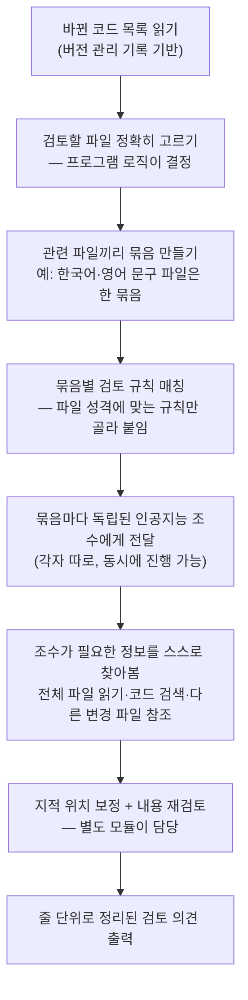

<div class="ai-knowledge-shell">

<aside class="ai-knowledge-sidebar">
  <p class="ai-eyebrow">CATEGORIES</p>
  <nav class="ai-cat-tree"><details class="ai-cat" open><summary><span class="catname">에이전트 오케스트레이션</span><span class="catcount">15</span></summary><ul><li><a href="https://altjs4510.github.io/ai_news_blog/knowledge/20260908/"><span class="kdate">2026-09-08</span><span class="ktitle">bytedance/deer-flow — 샌드박스·메모리·서브에이전트·메시지 게이트웨이를…</span></a></li><li><a href="https://altjs4510.github.io/ai_news_blog/knowledge/20260904/"><span class="kdate">2026-09-04</span><span class="ktitle">HarnessDev: Can LLMs Create and Evolve Their Own…</span></a></li><li><a href="https://altjs4510.github.io/ai_news_blog/knowledge/20260831-openexecutive-virtual-c-suite/"><span class="kdate">2026-08-31</span><span class="ktitle">Open Executive — 8명의 전문 에이전트를 하나의 임원 목소리로</span></a></li><li><a href="https://altjs4510.github.io/ai_news_blog/knowledge/20260828/"><span class="kdate">2026-08-28</span><span class="ktitle">Google ADK for Python v2.8.0 — RemoteA2aAgent 네이…</span></a></li><li><a href="https://altjs4510.github.io/ai_news_blog/knowledge/20260826/"><span class="kdate">2026-08-26</span><span class="ktitle">apache/maka — 도구 호출·권한 결정·종료 이벤트를 append-only 로그…</span></a></li><li><a href="https://altjs4510.github.io/ai_news_blog/knowledge/20260823/"><span class="kdate">2026-08-23</span><span class="ktitle">The Evolution of the Agent Harness — 하네스가 모델 가중치…</span></a></li><li><a href="https://altjs4510.github.io/ai_news_blog/knowledge/20260805/"><span class="kdate">2026-08-05</span><span class="ktitle">TencentCloud/TencentDB-Agent-Memory — 대화·문서·코드를 …</span></a></li><li><a href="https://altjs4510.github.io/ai_news_blog/knowledge/20260708/"><span class="kdate">2026-07-08</span><span class="ktitle">Expanding Managed Agents in Gemini API: backgrou…</span></a></li><li><a href="https://altjs4510.github.io/ai_news_blog/knowledge/20260701/"><span class="kdate">2026-07-01</span><span class="ktitle">Google OKF (Open Knowledge Format) — 벤더 중립 에이전트 …</span></a></li><li><a href="https://altjs4510.github.io/ai_news_blog/knowledge/20260623/"><span class="kdate">2026-06-23</span><span class="ktitle">bytedance/deer-flow — 샌드박스·메모리·서브에이전트·메시지 게이트웨이를…</span></a></li><li><a href="https://altjs4510.github.io/ai_news_blog/knowledge/20260621/"><span class="kdate">2026-06-21</span><span class="ktitle">calesthio/OpenMontage — 12 파이프라인·52 도구·500+ 스킬을 …</span></a></li><li><a href="https://altjs4510.github.io/ai_news_blog/knowledge/20260611/"><span class="kdate">2026-06-11</span><span class="ktitle">The evolution of agentic surfaces: building with…</span></a></li><li><a href="https://altjs4510.github.io/ai_news_blog/knowledge/20260602/"><span class="kdate">2026-06-02</span><span class="ktitle">revfactory/harness — 도메인별 에이전트 팀과 스킬을 자동 설계하는 메타…</span></a></li><li><a href="https://altjs4510.github.io/ai_news_blog/knowledge/20260529/"><span class="kdate">2026-05-29</span><span class="ktitle">Introducing dynamic workflows in Claude Code</span></a></li><li><a href="https://altjs4510.github.io/ai_news_blog/knowledge/20260507/"><span class="kdate">2026-05-07</span><span class="ktitle">ruvnet/ruflo — Claude 멀티 에이전트 오케스트레이션 플랫폼</span></a></li></ul></details><details class="ai-cat" open><summary><span class="catname">MCP &amp; 도구 통합</span><span class="catcount">17</span></summary><ul><li><a href="https://altjs4510.github.io/ai_news_blog/knowledge/20260829/"><span class="kdate">2026-08-29</span><span class="ktitle">cursor/plugins — 플러그인 명세(specification)와 공식 플러그인…</span></a></li><li><a href="https://altjs4510.github.io/ai_news_blog/knowledge/20260802/"><span class="kdate">2026-08-02</span><span class="ktitle">Stateless MCP has recaptured my interest (and in…</span></a></li><li><a href="https://altjs4510.github.io/ai_news_blog/knowledge/20260801/"><span class="kdate">2026-08-01</span><span class="ktitle">different-ai/openwork — Claude Cowork의 오픈소스 대체 에…</span></a></li><li><a href="https://altjs4510.github.io/ai_news_blog/knowledge/20260731/"><span class="kdate">2026-07-31</span><span class="ktitle">different-ai/openwork — Claude Cowork의 오픈소스 대안(o…</span></a></li><li><a href="https://altjs4510.github.io/ai_news_blog/knowledge/20260729/"><span class="kdate">2026-07-29</span><span class="ktitle">Bringing MCP 2026-07-28 to Claude</span></a></li><li><a href="https://altjs4510.github.io/ai_news_blog/knowledge/20260722/"><span class="kdate">2026-07-22</span><span class="ktitle">tirth8205/code-review-graph — MCP·CLI용 로컬 우선 코드 …</span></a></li><li><a href="https://altjs4510.github.io/ai_news_blog/knowledge/20260721/"><span class="kdate">2026-07-21</span><span class="ktitle">tirth8205/code-review-graph — 로컬 우선 코드 인텔리전스 그래프…</span></a></li><li><a href="https://altjs4510.github.io/ai_news_blog/knowledge/20260718/"><span class="kdate">2026-07-18</span><span class="ktitle">tirth8205/code-review-graph — MCP·CLI용 로컬 코드 인텔리…</span></a></li><li><a href="https://altjs4510.github.io/ai_news_blog/knowledge/20260709/"><span class="kdate">2026-07-09</span><span class="ktitle">mvanhorn/last30days-skill — Reddit·X·YouTube·HN·…</span></a></li><li><a href="https://altjs4510.github.io/ai_news_blog/knowledge/20260618/"><span class="kdate">2026-06-18</span><span class="ktitle">DeusData/codebase-memory-mcp — 158개 언어 코드베이스를 밀리…</span></a></li><li><a href="https://altjs4510.github.io/ai_news_blog/knowledge/20260606/"><span class="kdate">2026-06-06</span><span class="ktitle">chopratejas/headroom — Compress tool outputs, lo…</span></a></li><li><a href="https://altjs4510.github.io/ai_news_blog/knowledge/20260605/"><span class="kdate">2026-06-05</span><span class="ktitle">chopratejas/headroom — Compress tool outputs, lo…</span></a></li><li><a href="https://altjs4510.github.io/ai_news_blog/knowledge/20260604/"><span class="kdate">2026-06-04</span><span class="ktitle">chopratejas/headroom — Compress tool outputs bef…</span></a></li><li><a href="https://altjs4510.github.io/ai_news_blog/knowledge/20260603/"><span class="kdate">2026-06-03</span><span class="ktitle">How Bad MCP design cost your Agent 5× more token…</span></a></li><li><a href="https://altjs4510.github.io/ai_news_blog/knowledge/20260523/"><span class="kdate">2026-05-23</span><span class="ktitle">colbymchenry/codegraph — 사전 인덱싱된 코드 지식 그래프 MCP</span></a></li><li><a href="https://altjs4510.github.io/ai_news_blog/knowledge/20260517/"><span class="kdate">2026-05-17</span><span class="ktitle">I gave my LLM 100,000+ tools — Lazy Discovery &a…</span></a></li><li><a href="https://altjs4510.github.io/ai_news_blog/knowledge/20260509/"><span class="kdate">2026-05-09</span><span class="ktitle">How to connect 100 MCP servers without the conte…</span></a></li></ul></details><details class="ai-cat" open><summary><span class="catname">코딩 에이전트</span><span class="catcount">35</span></summary><ul><li><a href="https://altjs4510.github.io/ai_news_blog/knowledge/20260918/" class="current"><span class="kdate">2026-09-18</span><span class="ktitle">alibaba/open-code-review — 결정론적 파이프라인 + LLM 에이전트…</span></a></li><li><a href="https://altjs4510.github.io/ai_news_blog/knowledge/20260917/"><span class="kdate">2026-09-17</span><span class="ktitle">alibaba/open-code-review — 결정론적 파이프라인과 LLM 에이전트를…</span></a></li><li><a href="https://altjs4510.github.io/ai_news_blog/knowledge/20260916/"><span class="kdate">2026-09-16</span><span class="ktitle">alibaba/open-code-review — 결정론적 파이프라인과 LLM Agent…</span></a></li><li><a href="https://altjs4510.github.io/ai_news_blog/knowledge/20260915/"><span class="kdate">2026-09-15</span><span class="ktitle">alibaba/open-code-review — 결정적 파이프라인과 LLM 에이전트를 …</span></a></li><li><a href="https://altjs4510.github.io/ai_news_blog/knowledge/20260912/"><span class="kdate">2026-09-12</span><span class="ktitle">Quoting Boris Cherny — 'Claude가 쓴 프로덕션 코드는 사람이 쓴…</span></a></li><li><a href="https://altjs4510.github.io/ai_news_blog/knowledge/20260910/"><span class="kdate">2026-09-10</span><span class="ktitle">vastsa/PI-Desktop — Electron + Rust 호스트 코어 + 에이전…</span></a></li><li><a href="https://altjs4510.github.io/ai_news_blog/knowledge/20260906/"><span class="kdate">2026-09-06</span><span class="ktitle">DietrichGebert/ponytail — 에이전트를 '방에서 가장 게으른 시니어 …</span></a></li><li><a href="https://altjs4510.github.io/ai_news_blog/knowledge/20260903/"><span class="kdate">2026-09-03</span><span class="ktitle">pacifio/atlas — 여러 코딩 에이전트의 변경을 한곳에서 추적·질의하는 '에이…</span></a></li><li><a href="https://altjs4510.github.io/ai_news_blog/knowledge/20260901/"><span class="kdate">2026-09-01</span><span class="ktitle">affaan-m/ECC — 스킬·본능·메모리·보안을 묶은 에이전트 하네스 성능 최적화 …</span></a></li><li><a href="https://altjs4510.github.io/ai_news_blog/knowledge/20260831-gitnexus-code-knowledge-graph/"><span class="kdate">2026-08-31</span><span class="ktitle">GitNexus — 코드베이스를 지식그래프로 바꿔 에이전트에게 쥐어주기</span></a></li><li><a href="https://altjs4510.github.io/ai_news_blog/knowledge/20260822/"><span class="kdate">2026-08-22</span><span class="ktitle">mattpocock/skills — Skills for Real Engineers (하…</span></a></li><li><a href="https://altjs4510.github.io/ai_news_blog/knowledge/20260820/"><span class="kdate">2026-08-20</span><span class="ktitle">akitaonrails/ai-memory — 코딩 에이전트 CLI의 장기 메모리와 벤더…</span></a></li><li><a href="https://altjs4510.github.io/ai_news_blog/knowledge/20260819/"><span class="kdate">2026-08-19</span><span class="ktitle">akitaonrails/ai-memory — 코딩 에이전트 CLI 간 장기 기억과 벤더…</span></a></li><li><a href="https://altjs4510.github.io/ai_news_blog/knowledge/20260811/"><span class="kdate">2026-08-11</span><span class="ktitle">PrimeIntellect-ai/prime-agent — 장기 자율 실행을 전제로 설계…</span></a></li><li><a href="https://altjs4510.github.io/ai_news_blog/knowledge/20260810/"><span class="kdate">2026-08-10</span><span class="ktitle">Auto mode is now the default in Claude Code for …</span></a></li><li><a href="https://altjs4510.github.io/ai_news_blog/knowledge/20260809/"><span class="kdate">2026-08-09</span><span class="ktitle">PrimeIntellect-ai/prime-agent — 코딩 워크플로우·장기 자율 작…</span></a></li><li><a href="https://altjs4510.github.io/ai_news_blog/knowledge/20260808/"><span class="kdate">2026-08-08</span><span class="ktitle">PrimeIntellect-ai/prime-agent — 코딩 워크플로우와 장시간 자율…</span></a></li><li><a href="https://altjs4510.github.io/ai_news_blog/knowledge/20260804/"><span class="kdate">2026-08-04</span><span class="ktitle">esengine/DeepSeek-Reasonix — prefix-cache 안정성을 축…</span></a></li><li><a href="https://altjs4510.github.io/ai_news_blog/knowledge/20260728/"><span class="kdate">2026-07-28</span><span class="ktitle">alibaba/open-code-review — 결정론적 파이프라인 + LLM 에이전트…</span></a></li><li><a href="https://altjs4510.github.io/ai_news_blog/knowledge/20260725/"><span class="kdate">2026-07-25</span><span class="ktitle">The new rules of context engineering for Claude …</span></a></li><li><a href="https://altjs4510.github.io/ai_news_blog/knowledge/20260719/"><span class="kdate">2026-07-19</span><span class="ktitle">tirth8205/code-review-graph — 로컬 우선 코드 인텔리전스 그래프…</span></a></li><li><a href="https://altjs4510.github.io/ai_news_blog/knowledge/20260714/"><span class="kdate">2026-07-14</span><span class="ktitle">Graphify-Labs/graphify — 코드베이스를 질의 가능한 지식 그래프로 만…</span></a></li><li><a href="https://altjs4510.github.io/ai_news_blog/knowledge/20260705/"><span class="kdate">2026-07-05</span><span class="ktitle">openai/codex-plugin-cc — Claude Code에서 Codex를 위임…</span></a></li><li><a href="https://altjs4510.github.io/ai_news_blog/knowledge/20260626/"><span class="kdate">2026-06-26</span><span class="ktitle">google-labs-code/design.md — 코딩 에이전트에게 디자인 시스템을 …</span></a></li><li><a href="https://altjs4510.github.io/ai_news_blog/knowledge/20260619/"><span class="kdate">2026-06-19</span><span class="ktitle">Claude Code now supports artifacts</span></a></li><li><a href="https://altjs4510.github.io/ai_news_blog/knowledge/20260530/"><span class="kdate">2026-05-30</span><span class="ktitle">Leonxlnx/taste-skill — AI에게 좋은 취향을 부여해 generic s…</span></a></li><li><a href="https://altjs4510.github.io/ai_news_blog/knowledge/20260528/"><span class="kdate">2026-05-28</span><span class="ktitle">Building self-improving tax agents with Codex</span></a></li><li><a href="https://altjs4510.github.io/ai_news_blog/knowledge/20260526/"><span class="kdate">2026-05-26</span><span class="ktitle">colbymchenry/codegraph — Pre-indexed code knowle…</span></a></li><li><a href="https://altjs4510.github.io/ai_news_blog/knowledge/20260524/"><span class="kdate">2026-05-24</span><span class="ktitle">colbymchenry/codegraph — Pre-indexed code knowle…</span></a></li><li><a href="https://altjs4510.github.io/ai_news_blog/knowledge/20260521/"><span class="kdate">2026-05-21</span><span class="ktitle">colbymchenry/codegraph — Pre-indexed code knowle…</span></a></li><li><a href="https://altjs4510.github.io/ai_news_blog/knowledge/20260512/"><span class="kdate">2026-05-12</span><span class="ktitle">agentmemory — Persistent memory for AI coding ag…</span></a></li><li><a href="https://altjs4510.github.io/ai_news_blog/knowledge/20260510/"><span class="kdate">2026-05-10</span><span class="ktitle">addyosmani/agent-skills — Production-grade engin…</span></a></li><li><a href="https://altjs4510.github.io/ai_news_blog/knowledge/20260508/"><span class="kdate">2026-05-08</span><span class="ktitle">addyosmani/agent-skills — Production-grade engin…</span></a></li><li><a href="https://altjs4510.github.io/ai_news_blog/knowledge/20260506/"><span class="kdate">2026-05-06</span><span class="ktitle">mksglu/context-mode — AI 코딩 에이전트용 컨텍스트 윈도우 최적화</span></a></li><li><a href="https://altjs4510.github.io/ai_news_blog/knowledge/20260505/"><span class="kdate">2026-05-05</span><span class="ktitle">mattpocock/skills — Skills for Real Engineers (.…</span></a></li></ul></details><details class="ai-cat" open><summary><span class="catname">모델 &amp; 연구</span><span class="catcount">8</span></summary><ul><li><a href="https://altjs4510.github.io/ai_news_blog/knowledge/20260909/"><span class="kdate">2026-09-09</span><span class="ktitle">Reducing cost and improving performance with Cla…</span></a></li><li><a href="https://altjs4510.github.io/ai_news_blog/knowledge/20260907-voicemem-dual-brain-memory/"><span class="kdate">2026-09-07</span><span class="ktitle">VoiceMem — 좌뇌·우뇌로 쪼갠 스트리밍 메모리로 음성 에이전트 지연 없애기</span></a></li><li><a href="https://altjs4510.github.io/ai_news_blog/knowledge/20260821/"><span class="kdate">2026-08-21</span><span class="ktitle">volcengine/OpenViking — 에이전트 메모리·Knowledge RAG·스…</span></a></li><li><a href="https://altjs4510.github.io/ai_news_blog/knowledge/20260716-proprag/"><span class="kdate">2026-07-16</span><span class="ktitle">PropRAG — 프로포지션 경로 위 beam search로 멀티홉 검색 안내</span></a></li><li><a href="https://altjs4510.github.io/ai_news_blog/knowledge/20260620/"><span class="kdate">2026-06-20</span><span class="ktitle">zai-org/GLM-5 — From Vibe Coding to Agentic Engi…</span></a></li><li><a href="https://altjs4510.github.io/ai_news_blog/knowledge/20260617/"><span class="kdate">2026-06-17</span><span class="ktitle">Predicting model behavior before release by simu…</span></a></li><li><a href="https://altjs4510.github.io/ai_news_blog/knowledge/20260516/"><span class="kdate">2026-05-16</span><span class="ktitle">STALE — 에이전트가 자기 기억의 유효성을 인지할 수 있는가</span></a></li><li><a href="https://altjs4510.github.io/ai_news_blog/knowledge/20260513/"><span class="kdate">2026-05-13</span><span class="ktitle">Thinking Machines' Native Interaction Models — T…</span></a></li></ul></details><details class="ai-cat" open><summary><span class="catname">인프라 &amp; 컴퓨트</span><span class="catcount">7</span></summary><ul><li><a href="https://altjs4510.github.io/ai_news_blog/knowledge/20260905/"><span class="kdate">2026-09-05</span><span class="ktitle">magnitudedev/magnitude — 하드웨어에 맞는 최적 로컬 모델을 띄워 이…</span></a></li><li><a href="https://altjs4510.github.io/ai_news_blog/knowledge/20260813/"><span class="kdate">2026-08-13</span><span class="ktitle">semantica-agi/semantica — 컨텍스트와 책임 추적을 위한 그래프 네이…</span></a></li><li><a href="https://altjs4510.github.io/ai_news_blog/knowledge/20260806/"><span class="kdate">2026-08-06</span><span class="ktitle">cloudflare/computer — 에이전트에게 컴퓨터를 통째로 주는 엣지 실행 샌…</span></a></li><li><a href="https://altjs4510.github.io/ai_news_blog/knowledge/20260724/"><span class="kdate">2026-07-24</span><span class="ktitle">diegosouzapw/OmniRoute — 단일 엔드포인트로 278+ 프로바이더·50…</span></a></li><li><a href="https://altjs4510.github.io/ai_news_blog/knowledge/20260723/"><span class="kdate">2026-07-23</span><span class="ktitle">diegosouzapw/OmniRoute — 268+ 프로바이더를 단일 엔드포인트로 묶…</span></a></li><li><a href="https://altjs4510.github.io/ai_news_blog/knowledge/20260522/"><span class="kdate">2026-05-22</span><span class="ktitle">Giving Agents Computers — Ivan Burazin, Daytona</span></a></li><li><a href="https://altjs4510.github.io/ai_news_blog/knowledge/20260520/"><span class="kdate">2026-05-20</span><span class="ktitle">New in Claude Managed Agents: self-hosted sandbo…</span></a></li></ul></details><details class="ai-cat" open><summary><span class="catname">보안 &amp; 거버넌스</span><span class="catcount">20</span></summary><ul><li><a href="https://altjs4510.github.io/ai_news_blog/knowledge/20260913/"><span class="kdate">2026-09-13</span><span class="ktitle">OpenAI agents attacked RubyGems back in May: Ope…</span></a></li><li><a href="https://altjs4510.github.io/ai_news_blog/knowledge/20260902/"><span class="kdate">2026-09-02</span><span class="ktitle">AIR raises $50M to help companies vet the skills…</span></a></li><li><a href="https://altjs4510.github.io/ai_news_blog/knowledge/20260827/"><span class="kdate">2026-08-27</span><span class="ktitle">Claude in Chrome is generally available</span></a></li><li><a href="https://altjs4510.github.io/ai_news_blog/knowledge/20260819-mind-viruses/"><span class="kdate">2026-08-19</span><span class="ktitle">탈옥도, 인젝션도 없이 — 대화로만 퍼지는 에이전트의 '마인드 바이러스'</span></a></li><li><a href="https://altjs4510.github.io/ai_news_blog/knowledge/20260812/"><span class="kdate">2026-08-12</span><span class="ktitle">semantica-agi/semantica — 컨텍스트와 '책임 추적 가능한(accou…</span></a></li><li><a href="https://altjs4510.github.io/ai_news_blog/knowledge/20260730/"><span class="kdate">2026-07-30</span><span class="ktitle">Anatomy of a Frontier Lab Agent Intrusion: A Tec…</span></a></li><li><a href="https://altjs4510.github.io/ai_news_blog/knowledge/20260716/"><span class="kdate">2026-07-16</span><span class="ktitle">Dicklesworthstone/destructive_command_guard — 에이…</span></a></li><li><a href="https://altjs4510.github.io/ai_news_blog/knowledge/20260715/"><span class="kdate">2026-07-15</span><span class="ktitle">Dicklesworthstone/destructive_command_guard — 에이…</span></a></li><li><a href="https://altjs4510.github.io/ai_news_blog/knowledge/20260710/"><span class="kdate">2026-07-10</span><span class="ktitle">70개 MCP 서버 strace 런타임 감사 — 부팅 시 아웃바운드 호출 서버 적발</span></a></li><li><a href="https://altjs4510.github.io/ai_news_blog/knowledge/20260704/"><span class="kdate">2026-07-04</span><span class="ktitle">Cloudflare is about to block AI agents by defaul…</span></a></li><li><a href="https://altjs4510.github.io/ai_news_blog/knowledge/20260703/"><span class="kdate">2026-07-03</span><span class="ktitle">Giving admins more visibility and control over C…</span></a></li><li><a href="https://altjs4510.github.io/ai_news_blog/knowledge/20260630/"><span class="kdate">2026-06-30</span><span class="ktitle">Introducing the Claude apps gateway for Amazon B…</span></a></li><li><a href="https://altjs4510.github.io/ai_news_blog/knowledge/20260625/"><span class="kdate">2026-06-25</span><span class="ktitle">Agent identity in Claude Tag: a new access model…</span></a></li><li><a href="https://altjs4510.github.io/ai_news_blog/knowledge/20260624/"><span class="kdate">2026-06-24</span><span class="ktitle">Agent identity in Claude Tag: a new access model…</span></a></li><li><a href="https://altjs4510.github.io/ai_news_blog/knowledge/20260614/"><span class="kdate">2026-06-14</span><span class="ktitle">NVIDIA/SkillSpector — Security scanner for AI ag…</span></a></li><li><a href="https://altjs4510.github.io/ai_news_blog/knowledge/20260613/"><span class="kdate">2026-06-13</span><span class="ktitle">Fable 5's guardrails got bypassed in 48 hours — …</span></a></li><li><a href="https://altjs4510.github.io/ai_news_blog/knowledge/20260612/"><span class="kdate">2026-06-12</span><span class="ktitle">NVIDIA/SkillSpector — AI 에이전트 스킬용 보안 스캐너</span></a></li><li><a href="https://altjs4510.github.io/ai_news_blog/knowledge/20260607/"><span class="kdate">2026-06-07</span><span class="ktitle">OpenAI Help: Lockdown Mode</span></a></li><li><a href="https://altjs4510.github.io/ai_news_blog/knowledge/20260531/"><span class="kdate">2026-05-31</span><span class="ktitle">How we contain Claude across products</span></a></li><li><a href="https://altjs4510.github.io/ai_news_blog/knowledge/20260527/"><span class="kdate">2026-05-27</span><span class="ktitle">Microsoft Copilot Cowork Exfiltrates Files</span></a></li></ul></details><details class="ai-cat" open><summary><span class="catname">응용 사례</span><span class="catcount">9</span></summary><ul><li><a href="https://altjs4510.github.io/ai_news_blog/knowledge/20260911/"><span class="kdate">2026-09-11</span><span class="ktitle">Now everyone can put data to work — ChatGPT Work…</span></a></li><li><a href="https://altjs4510.github.io/ai_news_blog/knowledge/20260814/"><span class="kdate">2026-08-14</span><span class="ktitle">cathrynlavery/diagram-design — Claude Code용 에디토리…</span></a></li><li><a href="https://altjs4510.github.io/ai_news_blog/knowledge/20260726/"><span class="kdate">2026-07-26</span><span class="ktitle">citrolabs/ego-lite — 로그인된 브라우저 상태를 AI 에이전트와 공유하는…</span></a></li><li><a href="https://altjs4510.github.io/ai_news_blog/knowledge/20260717/"><span class="kdate">2026-07-17</span><span class="ktitle">After a year building agent memory, 'save everyt…</span></a></li><li><a href="https://altjs4510.github.io/ai_news_blog/knowledge/20260712/"><span class="kdate">2026-07-12</span><span class="ktitle">Do Automated Evals Work?</span></a></li><li><a href="https://altjs4510.github.io/ai_news_blog/knowledge/20260707/"><span class="kdate">2026-07-07</span><span class="ktitle">AI Hero Skills Catalog — 실무 엔지니어를 위한 재사용 가능한 판단 …</span></a></li><li><a href="https://altjs4510.github.io/ai_news_blog/knowledge/20260609/"><span class="kdate">2026-06-09</span><span class="ktitle">Building intelligent apps for Apple platforms wi…</span></a></li><li><a href="https://altjs4510.github.io/ai_news_blog/knowledge/20260515/"><span class="kdate">2026-05-15</span><span class="ktitle">Clawdmeter — Claude Code 사용량을 데스크톱 대시보드로</span></a></li><li><a href="https://altjs4510.github.io/ai_news_blog/knowledge/20260514/"><span class="kdate">2026-05-14</span><span class="ktitle">Introducing Claude for Small Business</span></a></li></ul></details><details class="ai-cat" open><summary><span class="catname">산업 동향</span><span class="catcount">8</span></summary><ul><li><a href="https://altjs4510.github.io/ai_news_blog/knowledge/20260907-humanmade-52week-rhythm/"><span class="kdate">2026-09-07</span><span class="ktitle">휴먼 메이드의 '52주 리듬' — 아이디어가 흔해진 시대에 값이 오르는 건 버리는 판단</span></a></li><li><a href="https://altjs4510.github.io/ai_news_blog/knowledge/20260830/"><span class="kdate">2026-08-30</span><span class="ktitle">[AINews] OpenAI shuts off Cursor — 프론티어 모델 공급 차단…</span></a></li><li><a href="https://altjs4510.github.io/ai_news_blog/knowledge/20260711/"><span class="kdate">2026-07-11</span><span class="ktitle">OpenAI says GPT 5.6 is the 'preferred model' for…</span></a></li><li><a href="https://altjs4510.github.io/ai_news_blog/knowledge/20260702/"><span class="kdate">2026-07-02</span><span class="ktitle">How Cursor deploys AI inside the enterprise (For…</span></a></li><li><a href="https://altjs4510.github.io/ai_news_blog/knowledge/20260616/"><span class="kdate">2026-06-16</span><span class="ktitle">Why AI hasn't replaced software engineers, and w…</span></a></li><li><a href="https://altjs4510.github.io/ai_news_blog/knowledge/20260610/"><span class="kdate">2026-06-10</span><span class="ktitle">Fable 5 just made cost-aware model routing manda…</span></a></li><li><a href="https://altjs4510.github.io/ai_news_blog/knowledge/20260519/"><span class="kdate">2026-05-19</span><span class="ktitle">Anthropic acquires Stainless</span></a></li><li><a href="https://altjs4510.github.io/ai_news_blog/knowledge/20260504/"><span class="kdate">2026-05-04</span><span class="ktitle">Agents for Everything Else: Codex for Knowledge …</span></a></li></ul></details></nav>
</aside>

<article class="ai-knowledge-article">

<header class="ai-post-hero">
  <p class="ai-eyebrow"><a class="ai-back" href="../">KNOWLEDGE</a> · 2026-09-18 · 오늘의 학습</p>
  <h2 class="ai-post-title">alibaba/open-code-review — 결정론적 파이프라인 + LLM 에이전트 하이브리드 코드 리뷰 (하루 3,290 stars)</h2>
</header>

> 원문: [alibaba/open-code-review — 결정론적 파이프라인 + LLM 에이전트 하이브리드 코드 리뷰 (하루 3,290 stars)](https://github.com/alibaba/open-code-review)

## 📌 학습 정리

### 1. 한 줄로 말하면

코드 검토를 사람 대신 해주는 도구인데, 기계가 확실히 판정할 수 있는 부분은 규칙으로 먼저 걸러내고, 애매해서 판단이 필요한 부분만 인공지능에게 맡기는 방식입니다. 전부 인공지능에게 떠넘기지 않는 게 핵심이에요.

### 2. 왜 이게 만들어졌어요?

요즘은 코드 검토를 범용 인공지능 비서에게 통째로 맡기는 경우가 많아졌는데, 원문에서는 그 방식에서 반복적으로 겪은 세 가지 불편을 이야기합니다. 첫째, 변경된 파일이 많아지면 인공지능이 "적당히 넘어가면서" 일부 파일만 보고 나머지를 빠뜨린다는 것. 둘째, 지적한 문제의 위치가 실제 코드 위치와 어긋나서 줄 번호나 파일 이름이 엉뚱하게 표시된다는 것. 셋째, 자연어 지시문으로 굴러가는 방식이라 디버깅이 어렵고, 지시문을 조금만 바꿔도 결과 품질이 크게 출렁인다는 것이죠. 원문은 이 세 가지의 뿌리를 "순수하게 언어로만 굴러가는 구조에는 검토 과정에 대한 강한 제약이 없다"는 점으로 봅니다. 그래서 알리바바 그룹이 2년간 사내에서 돌리며 수만 명의 개발자를 거친 도구를 오픈소스로 공개한 게 이 프로젝트입니다.

### 3. 비유로 풀면

공항 보안검색대를 떠올리면 비슷합니다. 모든 짐을 사람이 일일이 열어보는 게 아니라, 먼저 엑스레이 기계가 정해진 기준으로 전부 통과시키면서 "이건 무조건 걸러야 하는 것"을 기계적으로 잡아내고, 애매하게 찍힌 물건만 사람이 직접 열어봅니다. 기계가 잘하는 일과 사람이 잘하는 일을 섞어 쓰는 거죠.

다른 각도로는, 큰 짐을 옮길 때 한 사람이 다 드는 대신 상자 단위로 나눠서 여러 명이 나눠 드는 방식과도 닮았습니다. 이 도구도 관련 있는 파일들을 묶음으로 만들어 각 묶음을 독립된 작업 단위로 처리해요.

그래서 결국, "빠뜨리지 않기·위치 정확하게 짚기"처럼 틀리면 안 되는 부분은 프로그램 로직이 책임지고, "이 코드가 정말 문제인가"처럼 판단이 필요한 부분만 인공지능이 맡는 구조입니다.

### 4. 어떻게 작동하는지 (그림으로)



왼쪽 위에서 아래로 내려오는 앞부분(파일 선택·묶음 구성·규칙 매칭)은 전부 정해진 로직이 처리해서 결과가 매번 같게 나오도록 붙잡아 둡니다. 가운데의 인공지능 조수는 "이 코드에 뭘 더 확인해야 하지?"를 스스로 판단해서 필요한 파일을 열어보는, 유연함이 필요한 구간만 맡습니다. 마지막에 위치 보정과 내용 재검토를 따로 거치기 때문에, 지적한 문제가 엉뚱한 줄을 가리키는 일을 줄이려고 한 구조예요.

한 가지 더 눈에 띄는 건 **의도적인 선택**을 밝혀 뒀다는 점입니다. 같은 모델을 썼을 때 범용 비서보다 정확도(지적한 것 중 진짜 문제인 비율)와 종합 점수는 높지만, 재현율(전체 문제 중 찾아낸 비율)은 더 낮다고 원문이 직접 인정합니다. 헛다리 짚는 지적을 줄이는 대신 일부는 놓치는 쪽을 택한 거죠. 토큰 소비는 약 9분의 1 수준이라고 합니다.

### 5. 처음 보는 용어 풀이

- **코드 변경 내역 (Git diff)** — 이전 코드와 지금 코드의 차이만 뽑아낸 것. "어디가 어떻게 바뀌었는지"만 모아 놓은 목록이라 검토의 출발점이 됩니다.
- **명령줄 도구 (CLI)** — 화면의 버튼을 누르는 대신 터미널에 글자로 명령을 쳐서 쓰는 프로그램. 이 도구는 설치하면 `ocr`라는 명령으로 어디서든 부를 수 있습니다.
- **도구를 쓸 줄 아는 인공지능 조수 (agent with tool-use)** — 그냥 답만 내놓는 게 아니라, 필요하면 스스로 파일을 열어보고 검색까지 해가며 답을 만드는 인공지능. 표면적인 지적을 넘어 맥락을 보려면 이게 필요합니다.
- **정확도 / 재현율 / 종합 점수 (Precision / Recall / F1)** — 정확도는 "지적한 것 중 진짜 문제였던 비율"(높을수록 헛소리가 적음), 재현율은 "실제 문제 중 찾아낸 비율"(높을수록 놓친 게 적음), 종합 점수는 이 둘을 한 숫자로 합친 값입니다.
- **토큰 (token)** — 인공지능이 글을 처리할 때 세는 단위. 많이 쓸수록 비용이 올라가서, 같은 일을 적은 토큰으로 하면 그만큼 싸집니다.
- **위임 방식 (Delegation Mode)** — 이 도구가 인공지능을 직접 호출하지 않고, 파일 선택과 규칙 정리까지만 해준 뒤 실제 검토는 사용자가 이미 쓰고 있는 코딩 비서에게 넘기는 방식. 별도 인공지능 설정이나 열쇠(API 키)가 없어도 됩니다.
- **전체 파일 훑기 (ocr scan)** — 변경 내역이 아니라 파일 전체를 통째로 검토하는 기능. 처음 보는 코드 뭉치를 파악하거나, 최근에 바뀐 게 없어서 볼 차이가 없는 디렉터리를 점검할 때 씁니다.
- **지속적 통합·배포 (CI/CD)** — 코드를 올릴 때마다 자동으로 검사하고 배포하는 파이프라인. 이 도구는 여기에 끼워 넣어 자동 검토를 돌릴 수 있습니다.

### 6. 한 발 더 들어가고 싶다면

- [open-code-review 저장소](https://github.com/alibaba/open-code-review) — 설치 방법과 실제 명령어 사용법을 직접 확인할 수 있어요.
- [공식 문서 사이트](https://open-codereview.ai/docs) — 검토 규칙 커스터마이징, 설정값, 지속적 통합 연동 같은 세부 절차가 정리돼 있어요.
- [AACR-Bench 데이터셋](https://huggingface.co/datasets) 관련 안내는 원문에서 Hugging Face로 연결되며, 50개 오픈소스 저장소·200개 실제 병합 요청·10개 프로그래밍 언어를 80명 넘는 시니어 엔지니어가 교차 검증해 1,505개 정답 이슈를 붙인 자료라고 설명합니다 — 성능 숫자가 어떤 기준에서 나온 건지 가늠할 수 있어요.

---

## 📖 원문 전체 번역 (정독용)

> 의역 최소화한 전체 번역입니다. 큰 흐름은 위 정리에서 잡고, 정확한 워딩이 필요할 땐 이 섹션에서 정독하세요.

# OpenCodeReview

English | 简体中文 | 日本語 | 한국어 | Русский

## Open Code Review란 무엇인가?

Open Code Review는 AI 기반 코드 리뷰 CLI 도구다. 알리바바 그룹의 사내 공식 AI 코드 리뷰 어시스턴트로 시작되었으며 — 지난 2년간 수만 명의 개발자에게 서비스를 제공했고 수백만 건의 코드 결함을 찾아냈다. 대규모 환경에서 철저한 검증을 거친 뒤, 이를 커뮤니티를 위한 오픈소스 프로젝트로 인큐베이팅했다. 모델 엔드포인트만 설정하면 바로 시작할 수 있다.

이 도구는 Git diff를 읽고, 변경된 파일을 도구 사용 능력을 갖춘 에이전트를 통해 설정 가능한 LLM으로 보내, 라인 단위 정밀도를 갖는 구조화된 리뷰 코멘트를 생성한다. 에이전트는 파일 전체 내용을 읽고, 코드베이스를 검색하고, 다른 변경된 파일을 맥락으로 살펴볼 수 있어, 표면적인 diff 피드백에 그치지 않고 깊이 있는 리뷰를 생성한다. diff 리뷰를 넘어, `ocr scan`은 익숙하지 않은 코드베이스나 의미 있는 diff가 없는 디렉토리를 감사(auditing)하기 위해 파일 전체를 리뷰한다.

자세한 내용은 [공식 웹사이트](https://open-codereview.ai)를 방문하라.

## 벤치마크

동일한 기반 모델을 사용할 때, 범용 에이전트(Claude Code)와 비교해 Open Code Review는 **정밀도(Precision)**와 **F1**에서 상당히 높은 성능을 달성하면서도 토큰은 **약 1/9만** 소모하고 리뷰도 더 빠르게 완료한다. 다만 재현율(Recall)은 범용 에이전트보다 낮다는 점에 유의해야 한다 — 이는 노이즈보다 정밀도를 우선하는 의도적인 트레이드오프다.

이 실전 코드 리뷰 벤치마크는 인기 있는 오픈소스 저장소 **50개**, 실제 Pull Request **200개**, 프로그래밍 언어 **10개**를 기반으로 구축되었으며 — 80명 이상의 시니어 엔지니어가 교차 검증했다(**1,505건**의 주석 처리된 정답(ground-truth) 이슈).

[Hugging Face에서 AACR-Bench 데이터셋을 살펴보라](https://huggingface.co).

| 지표 | 측정 대상 | 중요한 이유 |
|---|---|---|
| F1 | 정밀도와 재현율의 조화 평균 | 전반적인 리뷰 품질을 나타내는 최적의 단일 지표 |
| Precision(정밀도) | 보고된 이슈 중 실제 결함인 비율 | 높을수록 처리해야 할 오탐(false alarm)이 줄어듦 |
| Recall(재현율) | 실제 결함 중 발견된 비율 | 높을수록 리뷰를 빠져나가는 이슈가 줄어듦 |
| Avg Time(평균 시간) | 리뷰당 실제 소요 시간 | CI 파이프라인 지연 시간에 영향 |
| Avg Token(평균 토큰) | 리뷰당 소모되는 총 토큰 | API 비용에 직접 영향 |

## 왜 Open Code Review인가?

### 범용 에이전트의 문제점

Skills를 활용한 Claude Code 같은 범용 에이전트를 코드 리뷰에 사용해본 적이 있다면, 다음과 같은 문제점들을 겪어봤을 것이다:

- **불완전한 커버리지** — 규모가 큰 변경사항에서는 에이전트가 "대충 넘어가는" 경향이 있어, 일부 파일만 선택적으로 리뷰하고 나머지는 놓친다.
- **위치 오차(Position drift)** — 보고된 이슈가 실제 코드 위치와 자주 일치하지 않으며, 라인 번호나 파일 참조가 목표에서 벗어난다.
- **불안정한 품질** — 자연어 기반 Skills는 디버깅하기 어렵고, 프롬프트의 사소한 변화만으로도 리뷰 품질이 크게 흔들린다.

근본 원인: 순수하게 언어 주도 방식인 아키텍처는 리뷰 프로세스에 대한 강한 제약(hard constraint)이 없다는 것이다.

### 핵심 설계: 결정론적 엔지니어링 × 에이전트 하이브리드

Open Code Review의 핵심 철학은 결정론적 엔지니어링과 에이전트를 결합해, 각각이 가장 잘하는 일을 맡도록 하는 것이다.

**결정론적 엔지니어링 — 강한 제약**

**절대 틀려서는 안 되는** 리뷰 단계에 대해서는 언어 모델이 아니라 엔지니어링 로직이 정확성을 보장한다:

- **정밀한 파일 선택** — 어떤 파일이 리뷰가 필요하고 어떤 파일이 필터링되어야 하는지를 정확히 결정하여, 중요한 변경사항이 누락되지 않도록 한다.
- **스마트 파일 번들링** — 관련 있는 파일들을 하나의 리뷰 단위로 묶는다(예: `message_en.properties`와 `message_zh.properties`를 함께 번들링). 각 번들은 독립된 컨텍스트를 가진 서브 에이전트로 실행되며 — 이는 아주 큰 변경사항에서도 안정성을 유지하고 동시 리뷰를 자연스럽게 지원하는 분할 정복(divide-and-conquer) 전략이다.
- **세밀한(fine-grained) 규칙 매칭** — 각 파일의 특성에 맞게 리뷰 규칙을 매칭하여, 모델의 주의를 날카롭게 집중시키고 정보 노이즈를 원천에서 제거한다. 순수하게 언어 주도로 규칙을 안내하는 방식과 비교해, 템플릿 엔진 기반의 규칙 매칭은 더 안정적이고 예측 가능하다.
- **외부 위치 지정 및 반성(reflection) 모듈** — 독립적인 코멘트 위치 지정 모듈과 코멘트 반성 모듈이 AI 피드백의 위치 정확도와 내용 정확도를 체계적으로 향상시킨다.

**에이전트 — 동적 의사결정**

에이전트의 강점은 가장 중요한 부분, 즉 동적 의사결정과 동적 컨텍스트 검색에 집중되어 있다:

- **시나리오에 맞춘 프롬프트** — 코드 리뷰에 깊이 최적화된 프롬프트 템플릿으로, 효과를 높이면서 토큰 소비를 줄인다.
- **시나리오에 맞춘 도구 세트(toolset)** — 대규모 프로덕션 데이터의 도구 호출 트레이스에 대한 심층 분석(호출 빈도 분포, 도구별 반복률, 새 도구가 전체 호출 체인에 미치는 영향 포함)을 통해 정제되어, 범용 에이전트 도구킷보다 코드 리뷰에 더 안정적이고 예측 가능한 전용 도구 세트를 만들어낸다.

## 사용 방법

### 사전 요구사항

**Git >= 2.41** — Open Code Review는 diff 생성, 코드 검색, 저장소 작업을 위해 Git에 의존한다.

### CLI

**설치**

```
npm install -g @alibaba-group/open-code-review
```

설치 후 `ocr` 명령을 전역에서 사용할 수 있다.

다른 설치 방법(설치 스크립트, GitHub Release 바이너리, 소스에서 빌드)은 [Installation](https://open-codereview.ai/docs)을 참고하라.

### 빠른 시작

**1. LLM 설정**

[Delegation Mode](https://open-codereview.ai/docs)를 사용하지 않는 한, 코드를 리뷰하기 전에 LLM을 설정해야 한다.

```
ocr config provider
# 내장된 provider를 선택하거나 커스텀 provider를 추가

ocr config model
# 활성 provider의 모델 선택
```

대화형 UI가 provider 선택, API 키 입력, 모델 설정을 안내한 뒤 연결 상태를 자동으로 테스트한다.

CLI 설정, 환경 변수, 커스텀 provider 및 기타 고급 설정은 [Configuration](https://open-codereview.ai/docs)을 참고하라.

**2. 리뷰**

```
cd your-project

# 워크스페이스 모드 — staged, unstaged, untracked 변경사항 전체 리뷰
ocr review

# 브랜치 범위 — feature-branch가 main에서 분기된 이후의 변경사항을 리뷰(merge-base 모드)
ocr review --from main --to feature-branch

# 단일 커밋
ocr review --commit abc123

# 중단된 범위 또는 커밋 리뷰 재개
ocr session list
ocr review --from main --to feature-branch --resume <session-id>

# 파일 전체 스캔 — diff 대신 파일 전체를 리뷰(git 히스토리 불필요)
ocr scan
# 저장소 전체를 스캔
ocr scan --path internal/agent
# 디렉토리 또는 특정 파일을 스캔
ocr scan --resume <session-id>
# 중단된 파일 전체 스캔 재개

# 결과를 파일로 저장(AI 호스트 에이전트에 권장)
ocr review --format json --output result.json

# Delegation 모드 — AI 코딩 에이전트가 직접 리뷰를 수행하도록 함
# OCR은 파일 선택과 규칙 해석을 처리하며, LLM 설정이 필요 없음
ocr delegate preview
ocr delegate rule src/main.go src/handler.go
```

## 문서

전체 문서는 [open-codereview.ai/docs](https://open-codereview.ai/docs)에서 확인할 수 있다:

- **Quickstart** — 설치 및 첫 리뷰 실행
- **Installation** — 모든 플랫폼과 패키지 매니저
- **CLI Reference** — 모든 명령어와 플래그
- **Review Rules** — 경로 필터링과 타겟팅으로 리뷰 규칙 커스터마이즈
- **Configuration** — 설정 키와 환경 변수
- **MCP Server** — 외부 도구로 리뷰 에이전트 확장
- **Coding Agent Integrations** — 사용 중인 플랫폼 선택
  - **Claude Code** — 리뷰 슬래시 커맨드가 포함된 플러그인 설치
  - **Codex** — 호출 가능한 리뷰 스킬이 포함된 플러그인 설치
  - **Cursor** — 이식 가능한 리뷰 스킬이 포함된 플러그인 설치
  - **Kimi Code** — 리뷰 슬래시 커맨드와 스킬이 포함된 플러그인 설치
  - **OpenCode** — 네이티브 리뷰 도구와 슬래시 커맨드 설치
  - **QCA Forward** — QCA 호스트 모델과 바로 게시 가능한 템플릿으로 delegation 모드 실행
  - **Skill-compatible agents** — 이식 가능한 에이전트 스킬 설치
- **Review Execution Modes** — 통합 이후, 어떤 LLM이 리뷰를 수행할지 선택
  - **Default (OCR-managed)** — OCR이 자체 설정된 LLM으로 리뷰를 실행
  - **Delegation Mode** — 사용자의 코딩 에이전트가 자체 LLM으로 리뷰를 실행; OCR API 키가 필요 없음
- **CI/CD Integration** — GitHub Actions, GitLab CI, GitFlic CI, Gerrit 통합
- **Session Viewer** — 브라우저에서 리뷰 세션을 탐색하고 재생하며, 코멘트를 수정됨/무시됨으로 표시하고 결과를 처리하는 동안 숨기기
- **Telemetry** — 관측성(observability)을 위한 OpenTelemetry 통합
- **FAQ** — 자주 묻는 질문과 문제 해결

## 기여

이 프로젝트는 기여해준 모든 분들 덕분에 존재한다. 개발 환경 설정, 코딩 가이드라인, pull request 제출 방법은 `CONTRIBUTING.md`를 참고하라.

## 라이선스

Apache-2.0 — Copyright 2026 Alibaba

</article>

</div>
