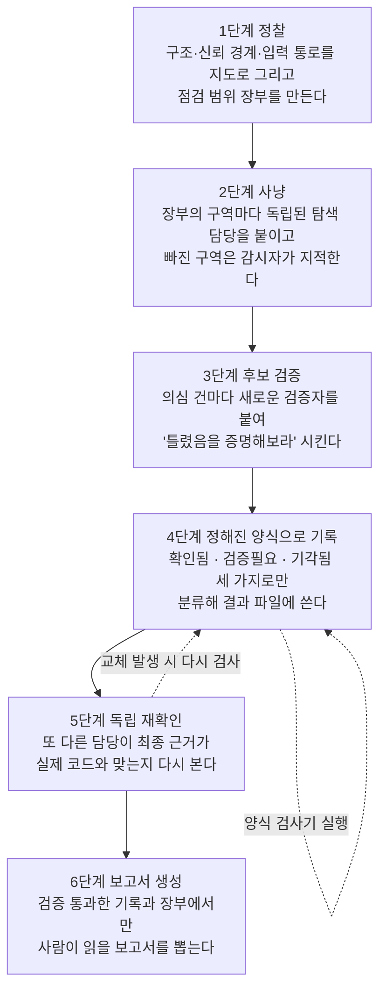

<div class="ai-knowledge-shell">

<aside class="ai-knowledge-sidebar">
  <p class="ai-eyebrow">CATEGORIES</p>
  <nav class="ai-cat-tree"><details class="ai-cat" open><summary><span class="catname">에이전트 오케스트레이션</span><span class="catcount">13</span></summary><ul><li><a href="https://altjs4510.github.io/ai_news_blog/knowledge/20260908/"><span class="kdate">2026-09-08</span><span class="ktitle">bytedance/deer-flow — 샌드박스·메모리·서브에이전트·메시지 게이트웨이를…</span></a></li><li><a href="https://altjs4510.github.io/ai_news_blog/knowledge/20260904/"><span class="kdate">2026-09-04</span><span class="ktitle">HarnessDev: Can LLMs Create and Evolve Their Own…</span></a></li><li><a href="https://altjs4510.github.io/ai_news_blog/knowledge/20260831-openexecutive-virtual-c-suite/"><span class="kdate">2026-08-31</span><span class="ktitle">Open Executive — 8명의 전문 에이전트를 하나의 임원 목소리로</span></a></li><li><a href="https://altjs4510.github.io/ai_news_blog/knowledge/20260828/"><span class="kdate">2026-08-28</span><span class="ktitle">Google ADK for Python v2.8.0 — RemoteA2aAgent 네이…</span></a></li><li><a href="https://altjs4510.github.io/ai_news_blog/knowledge/20260826/"><span class="kdate">2026-08-26</span><span class="ktitle">apache/maka — 도구 호출·권한 결정·종료 이벤트를 append-only 로그…</span></a></li><li><a href="https://altjs4510.github.io/ai_news_blog/knowledge/20260823/"><span class="kdate">2026-08-23</span><span class="ktitle">The Evolution of the Agent Harness — 하네스가 모델 가중치…</span></a></li><li><a href="https://altjs4510.github.io/ai_news_blog/knowledge/20260805/"><span class="kdate">2026-08-05</span><span class="ktitle">TencentCloud/TencentDB-Agent-Memory — 대화·문서·코드를 …</span></a></li><li><a href="https://altjs4510.github.io/ai_news_blog/knowledge/20260708/"><span class="kdate">2026-07-08</span><span class="ktitle">Expanding Managed Agents in Gemini API: backgrou…</span></a></li><li><a href="https://altjs4510.github.io/ai_news_blog/knowledge/20260623/"><span class="kdate">2026-06-23</span><span class="ktitle">bytedance/deer-flow — 샌드박스·메모리·서브에이전트·메시지 게이트웨이를…</span></a></li><li><a href="https://altjs4510.github.io/ai_news_blog/knowledge/20260602/"><span class="kdate">2026-06-02</span><span class="ktitle">revfactory/harness — 도메인별 에이전트 팀과 스킬을 자동 설계하는 메타…</span></a></li><li><a href="https://altjs4510.github.io/ai_news_blog/knowledge/20260529/"><span class="kdate">2026-05-29</span><span class="ktitle">Introducing dynamic workflows in Claude Code</span></a></li><li><a href="https://altjs4510.github.io/ai_news_blog/knowledge/20260507/"><span class="kdate">2026-05-07</span><span class="ktitle">ruvnet/ruflo — Claude 멀티 에이전트 오케스트레이션 플랫폼</span></a></li><li><a href="https://altjs4510.github.io/ai_news_blog/knowledge/20260504/"><span class="kdate">2026-05-04</span><span class="ktitle">Agents for Everything Else: Codex for Knowledge …</span></a></li></ul></details><details class="ai-cat" open><summary><span class="catname">MCP &amp; 도구 통합</span><span class="catcount">16</span></summary><ul><li><a href="https://altjs4510.github.io/ai_news_blog/knowledge/20260829/"><span class="kdate">2026-08-29</span><span class="ktitle">cursor/plugins — 플러그인 명세(specification)와 공식 플러그인…</span></a></li><li><a href="https://altjs4510.github.io/ai_news_blog/knowledge/20260802/"><span class="kdate">2026-08-02</span><span class="ktitle">Stateless MCP has recaptured my interest (and in…</span></a></li><li><a href="https://altjs4510.github.io/ai_news_blog/knowledge/20260801/"><span class="kdate">2026-08-01</span><span class="ktitle">different-ai/openwork — Claude Cowork의 오픈소스 대체 에…</span></a></li><li><a href="https://altjs4510.github.io/ai_news_blog/knowledge/20260731/"><span class="kdate">2026-07-31</span><span class="ktitle">different-ai/openwork — Claude Cowork의 오픈소스 대안(o…</span></a></li><li><a href="https://altjs4510.github.io/ai_news_blog/knowledge/20260729/"><span class="kdate">2026-07-29</span><span class="ktitle">Bringing MCP 2026-07-28 to Claude</span></a></li><li><a href="https://altjs4510.github.io/ai_news_blog/knowledge/20260722/"><span class="kdate">2026-07-22</span><span class="ktitle">tirth8205/code-review-graph — MCP·CLI용 로컬 우선 코드 …</span></a></li><li><a href="https://altjs4510.github.io/ai_news_blog/knowledge/20260721/"><span class="kdate">2026-07-21</span><span class="ktitle">tirth8205/code-review-graph — 로컬 우선 코드 인텔리전스 그래프…</span></a></li><li><a href="https://altjs4510.github.io/ai_news_blog/knowledge/20260618/"><span class="kdate">2026-06-18</span><span class="ktitle">DeusData/codebase-memory-mcp — 158개 언어 코드베이스를 밀리…</span></a></li><li><a href="https://altjs4510.github.io/ai_news_blog/knowledge/20260606/"><span class="kdate">2026-06-06</span><span class="ktitle">chopratejas/headroom — Compress tool outputs, lo…</span></a></li><li><a href="https://altjs4510.github.io/ai_news_blog/knowledge/20260605/"><span class="kdate">2026-06-05</span><span class="ktitle">chopratejas/headroom — Compress tool outputs, lo…</span></a></li><li><a href="https://altjs4510.github.io/ai_news_blog/knowledge/20260604/"><span class="kdate">2026-06-04</span><span class="ktitle">chopratejas/headroom — Compress tool outputs bef…</span></a></li><li><a href="https://altjs4510.github.io/ai_news_blog/knowledge/20260603/"><span class="kdate">2026-06-03</span><span class="ktitle">How Bad MCP design cost your Agent 5× more token…</span></a></li><li><a href="https://altjs4510.github.io/ai_news_blog/knowledge/20260526/"><span class="kdate">2026-05-26</span><span class="ktitle">colbymchenry/codegraph — Pre-indexed code knowle…</span></a></li><li><a href="https://altjs4510.github.io/ai_news_blog/knowledge/20260523/"><span class="kdate">2026-05-23</span><span class="ktitle">colbymchenry/codegraph — 사전 인덱싱된 코드 지식 그래프 MCP</span></a></li><li><a href="https://altjs4510.github.io/ai_news_blog/knowledge/20260517/"><span class="kdate">2026-05-17</span><span class="ktitle">I gave my LLM 100,000+ tools — Lazy Discovery &a…</span></a></li><li><a href="https://altjs4510.github.io/ai_news_blog/knowledge/20260509/"><span class="kdate">2026-05-09</span><span class="ktitle">How to connect 100 MCP servers without the conte…</span></a></li></ul></details><details class="ai-cat" open><summary><span class="catname">코딩 에이전트</span><span class="catcount">38</span></summary><ul><li><a href="https://altjs4510.github.io/ai_news_blog/knowledge/20260919/" class="current"><span class="kdate">2026-09-19</span><span class="ktitle">cloudflare/security-audit-skill — 다단계 보안 감사를 '독립…</span></a></li><li><a href="https://altjs4510.github.io/ai_news_blog/knowledge/20260918/"><span class="kdate">2026-09-18</span><span class="ktitle">alibaba/open-code-review — 결정론적 파이프라인 + LLM 에이전트…</span></a></li><li><a href="https://altjs4510.github.io/ai_news_blog/knowledge/20260917/"><span class="kdate">2026-09-17</span><span class="ktitle">alibaba/open-code-review — 결정론적 파이프라인과 LLM 에이전트를…</span></a></li><li><a href="https://altjs4510.github.io/ai_news_blog/knowledge/20260916/"><span class="kdate">2026-09-16</span><span class="ktitle">alibaba/open-code-review — 결정론적 파이프라인과 LLM Agent…</span></a></li><li><a href="https://altjs4510.github.io/ai_news_blog/knowledge/20260915/"><span class="kdate">2026-09-15</span><span class="ktitle">alibaba/open-code-review — 결정적 파이프라인과 LLM 에이전트를 …</span></a></li><li><a href="https://altjs4510.github.io/ai_news_blog/knowledge/20260912/"><span class="kdate">2026-09-12</span><span class="ktitle">Quoting Boris Cherny — 'Claude가 쓴 프로덕션 코드는 사람이 쓴…</span></a></li><li><a href="https://altjs4510.github.io/ai_news_blog/knowledge/20260910/"><span class="kdate">2026-09-10</span><span class="ktitle">vastsa/PI-Desktop — Electron + Rust 호스트 코어 + 에이전…</span></a></li><li><a href="https://altjs4510.github.io/ai_news_blog/knowledge/20260906/"><span class="kdate">2026-09-06</span><span class="ktitle">DietrichGebert/ponytail — 에이전트를 '방에서 가장 게으른 시니어 …</span></a></li><li><a href="https://altjs4510.github.io/ai_news_blog/knowledge/20260903/"><span class="kdate">2026-09-03</span><span class="ktitle">pacifio/atlas — 여러 코딩 에이전트의 변경을 한곳에서 추적·질의하는 '에이…</span></a></li><li><a href="https://altjs4510.github.io/ai_news_blog/knowledge/20260901/"><span class="kdate">2026-09-01</span><span class="ktitle">affaan-m/ECC — 스킬·본능·메모리·보안을 묶은 에이전트 하네스 성능 최적화 …</span></a></li><li><a href="https://altjs4510.github.io/ai_news_blog/knowledge/20260831-gitnexus-code-knowledge-graph/"><span class="kdate">2026-08-31</span><span class="ktitle">GitNexus — 코드베이스를 지식그래프로 바꿔 에이전트에게 쥐어주기</span></a></li><li><a href="https://altjs4510.github.io/ai_news_blog/knowledge/20260822/"><span class="kdate">2026-08-22</span><span class="ktitle">mattpocock/skills — Skills for Real Engineers (하…</span></a></li><li><a href="https://altjs4510.github.io/ai_news_blog/knowledge/20260820/"><span class="kdate">2026-08-20</span><span class="ktitle">akitaonrails/ai-memory — 코딩 에이전트 CLI의 장기 메모리와 벤더…</span></a></li><li><a href="https://altjs4510.github.io/ai_news_blog/knowledge/20260819/"><span class="kdate">2026-08-19</span><span class="ktitle">akitaonrails/ai-memory — 코딩 에이전트 CLI 간 장기 기억과 벤더…</span></a></li><li><a href="https://altjs4510.github.io/ai_news_blog/knowledge/20260811/"><span class="kdate">2026-08-11</span><span class="ktitle">PrimeIntellect-ai/prime-agent — 장기 자율 실행을 전제로 설계…</span></a></li><li><a href="https://altjs4510.github.io/ai_news_blog/knowledge/20260810/"><span class="kdate">2026-08-10</span><span class="ktitle">Auto mode is now the default in Claude Code for …</span></a></li><li><a href="https://altjs4510.github.io/ai_news_blog/knowledge/20260809/"><span class="kdate">2026-08-09</span><span class="ktitle">PrimeIntellect-ai/prime-agent — 코딩 워크플로우·장기 자율 작…</span></a></li><li><a href="https://altjs4510.github.io/ai_news_blog/knowledge/20260808/"><span class="kdate">2026-08-08</span><span class="ktitle">PrimeIntellect-ai/prime-agent — 코딩 워크플로우와 장시간 자율…</span></a></li><li><a href="https://altjs4510.github.io/ai_news_blog/knowledge/20260804/"><span class="kdate">2026-08-04</span><span class="ktitle">esengine/DeepSeek-Reasonix — prefix-cache 안정성을 축…</span></a></li><li><a href="https://altjs4510.github.io/ai_news_blog/knowledge/20260728/"><span class="kdate">2026-07-28</span><span class="ktitle">alibaba/open-code-review — 결정론적 파이프라인 + LLM 에이전트…</span></a></li><li><a href="https://altjs4510.github.io/ai_news_blog/knowledge/20260725/"><span class="kdate">2026-07-25</span><span class="ktitle">The new rules of context engineering for Claude …</span></a></li><li><a href="https://altjs4510.github.io/ai_news_blog/knowledge/20260719/"><span class="kdate">2026-07-19</span><span class="ktitle">tirth8205/code-review-graph — 로컬 우선 코드 인텔리전스 그래프…</span></a></li><li><a href="https://altjs4510.github.io/ai_news_blog/knowledge/20260718/"><span class="kdate">2026-07-18</span><span class="ktitle">tirth8205/code-review-graph — MCP·CLI용 로컬 코드 인텔리…</span></a></li><li><a href="https://altjs4510.github.io/ai_news_blog/knowledge/20260715/"><span class="kdate">2026-07-15</span><span class="ktitle">Dicklesworthstone/destructive_command_guard — 에이…</span></a></li><li><a href="https://altjs4510.github.io/ai_news_blog/knowledge/20260714/"><span class="kdate">2026-07-14</span><span class="ktitle">Graphify-Labs/graphify — 코드베이스를 질의 가능한 지식 그래프로 만…</span></a></li><li><a href="https://altjs4510.github.io/ai_news_blog/knowledge/20260707/"><span class="kdate">2026-07-07</span><span class="ktitle">AI Hero Skills Catalog — 실무 엔지니어를 위한 재사용 가능한 판단 …</span></a></li><li><a href="https://altjs4510.github.io/ai_news_blog/knowledge/20260705/"><span class="kdate">2026-07-05</span><span class="ktitle">openai/codex-plugin-cc — Claude Code에서 Codex를 위임…</span></a></li><li><a href="https://altjs4510.github.io/ai_news_blog/knowledge/20260626/"><span class="kdate">2026-06-26</span><span class="ktitle">google-labs-code/design.md — 코딩 에이전트에게 디자인 시스템을 …</span></a></li><li><a href="https://altjs4510.github.io/ai_news_blog/knowledge/20260619/"><span class="kdate">2026-06-19</span><span class="ktitle">Claude Code now supports artifacts</span></a></li><li><a href="https://altjs4510.github.io/ai_news_blog/knowledge/20260530/"><span class="kdate">2026-05-30</span><span class="ktitle">Leonxlnx/taste-skill — AI에게 좋은 취향을 부여해 generic s…</span></a></li><li><a href="https://altjs4510.github.io/ai_news_blog/knowledge/20260528/"><span class="kdate">2026-05-28</span><span class="ktitle">Building self-improving tax agents with Codex</span></a></li><li><a href="https://altjs4510.github.io/ai_news_blog/knowledge/20260524/"><span class="kdate">2026-05-24</span><span class="ktitle">colbymchenry/codegraph — Pre-indexed code knowle…</span></a></li><li><a href="https://altjs4510.github.io/ai_news_blog/knowledge/20260521/"><span class="kdate">2026-05-21</span><span class="ktitle">colbymchenry/codegraph — Pre-indexed code knowle…</span></a></li><li><a href="https://altjs4510.github.io/ai_news_blog/knowledge/20260512/"><span class="kdate">2026-05-12</span><span class="ktitle">agentmemory — Persistent memory for AI coding ag…</span></a></li><li><a href="https://altjs4510.github.io/ai_news_blog/knowledge/20260510/"><span class="kdate">2026-05-10</span><span class="ktitle">addyosmani/agent-skills — Production-grade engin…</span></a></li><li><a href="https://altjs4510.github.io/ai_news_blog/knowledge/20260508/"><span class="kdate">2026-05-08</span><span class="ktitle">addyosmani/agent-skills — Production-grade engin…</span></a></li><li><a href="https://altjs4510.github.io/ai_news_blog/knowledge/20260506/"><span class="kdate">2026-05-06</span><span class="ktitle">mksglu/context-mode — AI 코딩 에이전트용 컨텍스트 윈도우 최적화</span></a></li><li><a href="https://altjs4510.github.io/ai_news_blog/knowledge/20260505/"><span class="kdate">2026-05-05</span><span class="ktitle">mattpocock/skills — Skills for Real Engineers (.…</span></a></li></ul></details><details class="ai-cat" open><summary><span class="catname">모델 &amp; 연구</span><span class="catcount">7</span></summary><ul><li><a href="https://altjs4510.github.io/ai_news_blog/knowledge/20260907-voicemem-dual-brain-memory/"><span class="kdate">2026-09-07</span><span class="ktitle">VoiceMem — 좌뇌·우뇌로 쪼갠 스트리밍 메모리로 음성 에이전트 지연 없애기</span></a></li><li><a href="https://altjs4510.github.io/ai_news_blog/knowledge/20260821/"><span class="kdate">2026-08-21</span><span class="ktitle">volcengine/OpenViking — 에이전트 메모리·Knowledge RAG·스…</span></a></li><li><a href="https://altjs4510.github.io/ai_news_blog/knowledge/20260716-proprag/"><span class="kdate">2026-07-16</span><span class="ktitle">PropRAG — 프로포지션 경로 위 beam search로 멀티홉 검색 안내</span></a></li><li><a href="https://altjs4510.github.io/ai_news_blog/knowledge/20260620/"><span class="kdate">2026-06-20</span><span class="ktitle">zai-org/GLM-5 — From Vibe Coding to Agentic Engi…</span></a></li><li><a href="https://altjs4510.github.io/ai_news_blog/knowledge/20260617/"><span class="kdate">2026-06-17</span><span class="ktitle">Predicting model behavior before release by simu…</span></a></li><li><a href="https://altjs4510.github.io/ai_news_blog/knowledge/20260516/"><span class="kdate">2026-05-16</span><span class="ktitle">STALE — 에이전트가 자기 기억의 유효성을 인지할 수 있는가</span></a></li><li><a href="https://altjs4510.github.io/ai_news_blog/knowledge/20260513/"><span class="kdate">2026-05-13</span><span class="ktitle">Thinking Machines' Native Interaction Models — T…</span></a></li></ul></details><details class="ai-cat" open><summary><span class="catname">인프라 &amp; 컴퓨트</span><span class="catcount">10</span></summary><ul><li><a href="https://altjs4510.github.io/ai_news_blog/knowledge/20260905/"><span class="kdate">2026-09-05</span><span class="ktitle">magnitudedev/magnitude — 하드웨어에 맞는 최적 로컬 모델을 띄워 이…</span></a></li><li><a href="https://altjs4510.github.io/ai_news_blog/knowledge/20260813/"><span class="kdate">2026-08-13</span><span class="ktitle">semantica-agi/semantica — 컨텍스트와 책임 추적을 위한 그래프 네이…</span></a></li><li><a href="https://altjs4510.github.io/ai_news_blog/knowledge/20260812/"><span class="kdate">2026-08-12</span><span class="ktitle">semantica-agi/semantica — 컨텍스트와 '책임 추적 가능한(accou…</span></a></li><li><a href="https://altjs4510.github.io/ai_news_blog/knowledge/20260806/"><span class="kdate">2026-08-06</span><span class="ktitle">cloudflare/computer — 에이전트에게 컴퓨터를 통째로 주는 엣지 실행 샌…</span></a></li><li><a href="https://altjs4510.github.io/ai_news_blog/knowledge/20260724/"><span class="kdate">2026-07-24</span><span class="ktitle">diegosouzapw/OmniRoute — 단일 엔드포인트로 278+ 프로바이더·50…</span></a></li><li><a href="https://altjs4510.github.io/ai_news_blog/knowledge/20260723/"><span class="kdate">2026-07-23</span><span class="ktitle">diegosouzapw/OmniRoute — 268+ 프로바이더를 단일 엔드포인트로 묶…</span></a></li><li><a href="https://altjs4510.github.io/ai_news_blog/knowledge/20260630/"><span class="kdate">2026-06-30</span><span class="ktitle">Introducing the Claude apps gateway for Amazon B…</span></a></li><li><a href="https://altjs4510.github.io/ai_news_blog/knowledge/20260611/"><span class="kdate">2026-06-11</span><span class="ktitle">The evolution of agentic surfaces: building with…</span></a></li><li><a href="https://altjs4510.github.io/ai_news_blog/knowledge/20260522/"><span class="kdate">2026-05-22</span><span class="ktitle">Giving Agents Computers — Ivan Burazin, Daytona</span></a></li><li><a href="https://altjs4510.github.io/ai_news_blog/knowledge/20260520/"><span class="kdate">2026-05-20</span><span class="ktitle">New in Claude Managed Agents: self-hosted sandbo…</span></a></li></ul></details><details class="ai-cat" open><summary><span class="catname">보안 &amp; 거버넌스</span><span class="catcount">17</span></summary><ul><li><a href="https://altjs4510.github.io/ai_news_blog/knowledge/20260913/"><span class="kdate">2026-09-13</span><span class="ktitle">OpenAI agents attacked RubyGems back in May: Ope…</span></a></li><li><a href="https://altjs4510.github.io/ai_news_blog/knowledge/20260902/"><span class="kdate">2026-09-02</span><span class="ktitle">AIR raises $50M to help companies vet the skills…</span></a></li><li><a href="https://altjs4510.github.io/ai_news_blog/knowledge/20260827/"><span class="kdate">2026-08-27</span><span class="ktitle">Claude in Chrome is generally available</span></a></li><li><a href="https://altjs4510.github.io/ai_news_blog/knowledge/20260819-mind-viruses/"><span class="kdate">2026-08-19</span><span class="ktitle">탈옥도, 인젝션도 없이 — 대화로만 퍼지는 에이전트의 '마인드 바이러스'</span></a></li><li><a href="https://altjs4510.github.io/ai_news_blog/knowledge/20260730/"><span class="kdate">2026-07-30</span><span class="ktitle">Anatomy of a Frontier Lab Agent Intrusion: A Tec…</span></a></li><li><a href="https://altjs4510.github.io/ai_news_blog/knowledge/20260716/"><span class="kdate">2026-07-16</span><span class="ktitle">Dicklesworthstone/destructive_command_guard — 에이…</span></a></li><li><a href="https://altjs4510.github.io/ai_news_blog/knowledge/20260710/"><span class="kdate">2026-07-10</span><span class="ktitle">70개 MCP 서버 strace 런타임 감사 — 부팅 시 아웃바운드 호출 서버 적발</span></a></li><li><a href="https://altjs4510.github.io/ai_news_blog/knowledge/20260704/"><span class="kdate">2026-07-04</span><span class="ktitle">Cloudflare is about to block AI agents by defaul…</span></a></li><li><a href="https://altjs4510.github.io/ai_news_blog/knowledge/20260703/"><span class="kdate">2026-07-03</span><span class="ktitle">Giving admins more visibility and control over C…</span></a></li><li><a href="https://altjs4510.github.io/ai_news_blog/knowledge/20260625/"><span class="kdate">2026-06-25</span><span class="ktitle">Agent identity in Claude Tag: a new access model…</span></a></li><li><a href="https://altjs4510.github.io/ai_news_blog/knowledge/20260624/"><span class="kdate">2026-06-24</span><span class="ktitle">Agent identity in Claude Tag: a new access model…</span></a></li><li><a href="https://altjs4510.github.io/ai_news_blog/knowledge/20260614/"><span class="kdate">2026-06-14</span><span class="ktitle">NVIDIA/SkillSpector — Security scanner for AI ag…</span></a></li><li><a href="https://altjs4510.github.io/ai_news_blog/knowledge/20260613/"><span class="kdate">2026-06-13</span><span class="ktitle">Fable 5's guardrails got bypassed in 48 hours — …</span></a></li><li><a href="https://altjs4510.github.io/ai_news_blog/knowledge/20260612/"><span class="kdate">2026-06-12</span><span class="ktitle">NVIDIA/SkillSpector — AI 에이전트 스킬용 보안 스캐너</span></a></li><li><a href="https://altjs4510.github.io/ai_news_blog/knowledge/20260607/"><span class="kdate">2026-06-07</span><span class="ktitle">OpenAI Help: Lockdown Mode</span></a></li><li><a href="https://altjs4510.github.io/ai_news_blog/knowledge/20260531/"><span class="kdate">2026-05-31</span><span class="ktitle">How we contain Claude across products</span></a></li><li><a href="https://altjs4510.github.io/ai_news_blog/knowledge/20260527/"><span class="kdate">2026-05-27</span><span class="ktitle">Microsoft Copilot Cowork Exfiltrates Files</span></a></li></ul></details><details class="ai-cat" open><summary><span class="catname">응용 사례</span><span class="catcount">10</span></summary><ul><li><a href="https://altjs4510.github.io/ai_news_blog/knowledge/20260911/"><span class="kdate">2026-09-11</span><span class="ktitle">Now everyone can put data to work — ChatGPT Work…</span></a></li><li><a href="https://altjs4510.github.io/ai_news_blog/knowledge/20260814/"><span class="kdate">2026-08-14</span><span class="ktitle">cathrynlavery/diagram-design — Claude Code용 에디토리…</span></a></li><li><a href="https://altjs4510.github.io/ai_news_blog/knowledge/20260726/"><span class="kdate">2026-07-26</span><span class="ktitle">citrolabs/ego-lite — 로그인된 브라우저 상태를 AI 에이전트와 공유하는…</span></a></li><li><a href="https://altjs4510.github.io/ai_news_blog/knowledge/20260717/"><span class="kdate">2026-07-17</span><span class="ktitle">After a year building agent memory, 'save everyt…</span></a></li><li><a href="https://altjs4510.github.io/ai_news_blog/knowledge/20260712/"><span class="kdate">2026-07-12</span><span class="ktitle">Do Automated Evals Work?</span></a></li><li><a href="https://altjs4510.github.io/ai_news_blog/knowledge/20260709/"><span class="kdate">2026-07-09</span><span class="ktitle">mvanhorn/last30days-skill — Reddit·X·YouTube·HN·…</span></a></li><li><a href="https://altjs4510.github.io/ai_news_blog/knowledge/20260621/"><span class="kdate">2026-06-21</span><span class="ktitle">calesthio/OpenMontage — 12 파이프라인·52 도구·500+ 스킬을 …</span></a></li><li><a href="https://altjs4510.github.io/ai_news_blog/knowledge/20260609/"><span class="kdate">2026-06-09</span><span class="ktitle">Building intelligent apps for Apple platforms wi…</span></a></li><li><a href="https://altjs4510.github.io/ai_news_blog/knowledge/20260515/"><span class="kdate">2026-05-15</span><span class="ktitle">Clawdmeter — Claude Code 사용량을 데스크톱 대시보드로</span></a></li><li><a href="https://altjs4510.github.io/ai_news_blog/knowledge/20260514/"><span class="kdate">2026-05-14</span><span class="ktitle">Introducing Claude for Small Business</span></a></li></ul></details><details class="ai-cat" open><summary><span class="catname">산업 동향</span><span class="catcount">9</span></summary><ul><li><a href="https://altjs4510.github.io/ai_news_blog/knowledge/20260909/"><span class="kdate">2026-09-09</span><span class="ktitle">Reducing cost and improving performance with Cla…</span></a></li><li><a href="https://altjs4510.github.io/ai_news_blog/knowledge/20260907-humanmade-52week-rhythm/"><span class="kdate">2026-09-07</span><span class="ktitle">휴먼 메이드의 '52주 리듬' — 아이디어가 흔해진 시대에 값이 오르는 건 버리는 판단</span></a></li><li><a href="https://altjs4510.github.io/ai_news_blog/knowledge/20260830/"><span class="kdate">2026-08-30</span><span class="ktitle">[AINews] OpenAI shuts off Cursor — 프론티어 모델 공급 차단…</span></a></li><li><a href="https://altjs4510.github.io/ai_news_blog/knowledge/20260711/"><span class="kdate">2026-07-11</span><span class="ktitle">OpenAI says GPT 5.6 is the 'preferred model' for…</span></a></li><li><a href="https://altjs4510.github.io/ai_news_blog/knowledge/20260702/"><span class="kdate">2026-07-02</span><span class="ktitle">How Cursor deploys AI inside the enterprise (For…</span></a></li><li><a href="https://altjs4510.github.io/ai_news_blog/knowledge/20260701/"><span class="kdate">2026-07-01</span><span class="ktitle">Google OKF (Open Knowledge Format) — 벤더 중립 에이전트 …</span></a></li><li><a href="https://altjs4510.github.io/ai_news_blog/knowledge/20260616/"><span class="kdate">2026-06-16</span><span class="ktitle">Why AI hasn't replaced software engineers, and w…</span></a></li><li><a href="https://altjs4510.github.io/ai_news_blog/knowledge/20260610/"><span class="kdate">2026-06-10</span><span class="ktitle">Fable 5 just made cost-aware model routing manda…</span></a></li><li><a href="https://altjs4510.github.io/ai_news_blog/knowledge/20260519/"><span class="kdate">2026-05-19</span><span class="ktitle">Anthropic acquires Stainless</span></a></li></ul></details></nav>
</aside>

<article class="ai-knowledge-article">

<header class="ai-post-hero">
  <p class="ai-eyebrow"><a class="ai-back" href="../">KNOWLEDGE</a> · 2026-09-19 · 오늘의 학습</p>
  <h2 class="ai-post-title">cloudflare/security-audit-skill — 다단계 보안 감사를 '독립 검증된 머신리더블 findings'로 뱉는 코딩 에이전트 스킬</h2>
</header>

> 원문: [cloudflare/security-audit-skill — 다단계 보안 감사를 '독립 검증된 머신리더블 findings'로 뱉는 코딩 에이전트 스킬](https://github.com/cloudflare/security-audit-skill)

## 📌 학습 정리

### 1. 한 줄로 말하면

코딩 도우미 인공지능에게 "우리 코드에 보안 구멍 있나 찾아봐"라고 시켰을 때, 찾은 걸 그냥 믿지 않고 **다른 조사원을 새로 불러서 "이거 진짜 맞아? 틀렸다는 걸 증명해봐"라고 반대편에서 검증시키는** 감사 절차 묶음입니다. 그리고 결과를 사람이 읽는 줄글이 아니라 기계가 그대로 읽을 수 있는 정해진 양식으로 뱉게 만듭니다.

### 2. 왜 이게 만들어졌어요?

지금까지 인공지능에게 보안 점검을 시키면 보통 이런 식이었습니다. "여기가 위험해 보입니다"라는 그럴듯한 문장이 잔뜩 나오고, 사람이 하나하나 열어보면서 진짜인지 확인해야 했죠. 문제는 인공지능이 자기가 낸 답을 스스로 검토하면 대체로 "네 맞습니다"라고 넘어간다는 점이고, 결과가 자유로운 줄글이라 어디까지 확인된 사실이고 어디부터 추측인지 구분이 안 된다는 점이었습니다. 게다가 훑는 범위도 그때그때 달라서, 같은 코드를 두 번 돌리면 매번 다른 데를 보고 지나간 곳이 어딘지 아무도 몰랐습니다. 이 도구는 그 세 가지를 절차로 묶어 해결하려 합니다 — 무엇을 봤는지 장부에 적고, 찾은 사람과 검증하는 사람을 반드시 분리하고, 출력 형식을 기계가 검사할 수 있게 고정하는 겁니다.

### 3. 비유로 풀면

이건 마치 **논문 심사** 같은 거예요. 연구자가 "이런 결과가 나왔습니다"라고 주장하면, 그 연구자 본인이 아니라 이해관계 없는 다른 심사위원이 "정말 그런가, 반증할 수 있나"를 따로 들여다봅니다. 여기서도 구멍을 찾아낸 인공지능과 그걸 검증하는 인공지능은 절대 같은 개체가 아닙니다.

또 하나는 **건물 안전점검 체크리스트**입니다. 점검자가 "3층 복도 봤음, 4층 계단 봤음"을 장부에 적어두니까, 나중에 "그럼 지하는 누가 봤지?"라는 질문에 답할 수 있죠. 여기서도 코드의 어느 부분을 누가 어떤 관점으로 봤는지를 장부 파일에 남깁니다.

그래서 결국, 이 도구의 핵심은 "더 똑똑하게 찾는 법"이 아니라 **"찾은 걸 어떻게 믿을지, 안 본 곳을 어떻게 알지"를 절차로 강제하는 것**입니다.

### 4. 어떻게 작동하는지 (그림으로)



흐름을 말로 풀면, 먼저 코드 전체를 훑어 "어디가 외부 입력이 들어오는 통로인가"를 지도로 그리고 점검할 구역 목록을 장부로 만듭니다. 그다음 구역별로 탐색 담당을 따로 띄워 의심 건을 모으고, 모인 건마다 **새 검증자가 반대편에서 반박을 시도**합니다. 마지막으로 통과한 기록만 정해진 양식으로 남기고, 그 기록에서 보고서를 뽑아냅니다 — 보고서가 먼저 있고 근거를 갖다 붙이는 게 아니라, 검증된 기록이 먼저 있고 보고서는 거기서 파생됩니다.

여기서 중요한 설계 하나는 **판정이 세 갈래로만 나뉜다**는 점입니다. "확인됨(confirmed)"은 어디서 어떻게 문제가 되는지 경로가 끝까지 추적되고 결과가 실제로 관찰된 경우에만 붙습니다. 근거는 있는데 딱 한 가지 사실이 아직 안 풀렸다면 "검증필요(needs_validation)"로 남기고, 이때는 심각도 점수를 아예 매기지 않습니다 — 애매한 걸 그럴듯한 숫자로 포장하지 않겠다는 뜻이죠. 반박에 성공한 건은 "기각됨(rejected)"으로 기록에 남습니다.

또 하나, 같은 코드에 여러 번 돌리면 결과가 덮어써지는 게 아니라 **쌓입니다**. 이전 장부와 이전 결과를 참고해서 안 본 곳을 노리고, 코드가 바뀐 부분은 다시 검증하되, 오래돼서 못 믿을 근거나 아직 안 풀린 건은 "이미 본 것"으로 치지 않습니다. 원문에서는 자체 테스트 기준으로 한 번만 돌렸을 때 반복 실행이 전부 찾아낸 것의 절반 정도만 나왔다고 밝히고 있습니다.

판정 기준에서 눈에 띄는 원칙도 있습니다. 심각도는 체크리스트에서 벗어났느냐가 아니라 **실제로 일어날 가능성과 피해 크기**로 매기고, 1차 방어가 이미 공격을 막고 있다면 2차 방어가 없다는 사실만으로는 취약점이라 부르지 않고 "더 단단하게 하면 좋을 점" 정도로 취급합니다. 실행 환경도 조건이 붙습니다 — 대상 코드를 실제로 돌려보려면 외부 통신이 끊기고 자원 한도가 걸린 격리된 실행 공간이 있어야 하고, 그게 없으면 실행을 포기하고 해당 건을 "검증필요"로 남깁니다.

### 5. 처음 보는 용어 풀이

- **코딩 도우미 기술 묶음 (coding-agent skill)** — 인공지능 코딩 도구에게 "이런 요청이 오면 이 순서대로 일해라"를 적어둔 설명서 파일 묶음입니다. 별도 프로그램이 아니라, 에이전트가 읽고 그대로 따르는 작업 매뉴얼에 가깝습니다.

- **정찰 (reconnaissance)** — 본격적으로 문제를 찾기 전에 "이 시스템이 어떻게 생겼고, 어디까지가 믿을 수 있는 영역이고, 외부 입력은 어디로 들어오나"를 먼저 파악하는 단계입니다. 지도 없이 뒤지면 놓치는 곳이 생기니까 먼저 그리는 겁니다.

- **신뢰 경계 (trust boundary)** — 믿어도 되는 영역과 못 믿을 영역이 맞닿는 지점입니다. 대부분의 보안 문제는 이 선을 넘어오는 데이터를 충분히 의심하지 않아서 생기기 때문에, 이 선을 찾는 게 감사의 출발점이 됩니다.

- **점검 범위 장부 (coverage ledger)** — 코드를 여러 구역으로 나눠 "어느 구역을 누가 어떤 관점으로 봤는지"를 기록하는 파일입니다. 이게 있어야 "안 본 곳"을 질문할 수 있고, 다음번 실행 때 빈 곳부터 노릴 수 있습니다.

- **반대편 검증 (adversarial validation)** — 찾아낸 의심 건을 검증할 때, 찾은 쪽이 아닌 완전히 새로운 담당에게 넘겨 "이게 틀렸다는 걸 보여봐"라고 시키는 방식입니다. 자기 답을 자기가 채점하면 관대해지는 문제를 구조로 막습니다.

- **기계가 읽는 결과 기록 (structured findings)** — 결과를 자유로운 문장이 아니라 정해진 항목과 형식에 맞춰 적는 것입니다. 형식이 고정돼 있으니 검사 프로그램이 "필수 항목이 비었다"를 자동으로 잡아낼 수 있습니다.

- **양식 검사기 (validator)** — 결과 파일과 장부 파일이 정해진 양식을 지켰는지 확인하는 작은 검사 프로그램입니다. 외부 라이브러리 없이 돌아가도록 만들어져 있고, 기록을 쓸 때마다 그리고 내용이 바뀔 때마다 다시 돌립니다.

- **격리 실행 공간 (sandbox)** — 남이 준 코드를 실제로 돌려봐야 할 때, 바깥 네트워크를 끊고 쓸 수 있는 자원과 쓸 수 있는 폴더를 제한해둔 울타리 안에서 돌리는 것입니다. 점검하려다 오히려 내 컴퓨터가 당하는 일을 막기 위한 전제 조건입니다.

### 6. 한 발 더 들어가고 싶다면

- [cloudflare/security-audit-skill](https://github.com/cloudflare/security-audit-skill) — 실제 설명서 파일들(정찰·사냥·검증·보고 각 단계 프롬프트, 결과 양식 정의, 검사기 코드)이 그대로 공개돼 있어서, 이런 절차를 글로 어떻게 못 박는지 직접 볼 수 있어요.
- 원문이 언급한 **Build your own vulnerability harness** 글 — 이 기술 묶음이 씨앗이 되어 여러 저장소를 한꺼번에 훑는 대규모 시스템으로 자란 과정을 다룬다고 소개돼 있어요(원문에 별도 주소는 실려 있지 않습니다).
- 설치에 쓰이는 **Skills CLI** — `npx skills add ...` 한 줄로 이런 기술 묶음을 내 코딩 도구에 붙이는 방식이 어떻게 생겼는지 알 수 있어요.
- 문의 창구로 열려 있는 `security-ai-research@cloudflare.com` — 인공지능 기반 보안 도구를 만들어보고 비교해본 경험을 나누고 싶을 때 쓰라고 안내돼 있어요.

---

## 📖 원문 전체 번역 (정독용)

> 의역 최소화한 전체 번역입니다. 큰 흐름은 위 정리에서 잡고, 정확한 워딩이 필요할 땐 이 섹션에서 정독하세요.

# security-audit

에이전트를 보안 감사관으로 바꿔주는 코딩 에이전트 스킬(coding-agent skill)이다. 이 스킬은 격리된 에이전트들을 정찰(reconnaissance), 커버리지 주도 헌팅(coverage-led hunting), 후보 검증(candidate validation), 구조화된 출력(structured output), 독립적인 기록 검증(independent record verification), 대상 중립적 리포팅(target-neutral reporting)의 단계로 오케스트레이션(orchestrate)한다.

이 스킬은 Cloudflare 의 취약점 발견 하네스(vulnerability discovery harness)를 최초에 만들어낸 스킬로, [Build your own vulnerability harness](링크 유지)에 설명되어 있다. 그 하네스는 이후 다단계(multi-stage), 함대 전체(fleet-wide) 시스템으로 성장했다 — 이 스킬은 그것이 진화해 나온 단일 레포(single-repo) 출발점이다.

## 하는 일

이 스킬은 6단계로 구성된 구조화된 감사(structured audit)를 실행한다:

**정찰(Reconnaissance)** -- 아키텍처, 신뢰 경계(trust boundaries), 입력 표면(input surfaces), 이전 증거(prior evidence), 그리고 결정론적 커버리지(deterministic coverage)를 `architecture.md` 와 `coverage-ledger.json` 에 매핑한다.

**커버리지 주도 헌팅(Coverage-led hunting)** -- 원장(ledger) 단위로부터 격리된 헌터(hunter)들을 배정하고, 그들의 점검 내용을 기록하며, 커버리지 크리틱(coverage critics)을 사용해 빈틈(gaps)을 찾는다.

**후보 검증(Candidate validation)** -- 고유한 후보(candidate) 각각을 새로운(fresh) 검증자(verifier)에게 넘겨 그것을 반증(disprove)하도록 시도하게 한다.

**구조화된 출력(Structured output)** -- `confirmed`, `needs_validation`, `rejected` 레코드를 `findings.json` 에 작성하고 `report-schema.json` 에 대해 검증한다.

**독립적인 기록 검증(Independent record verification)** -- 새로운(fresh) 에이전트들이 최종 소스 주장(source claims)을 검증한다. 실질적인 교체(material replacements)는 또 다른 독립 검증자를 받는다.

**대상 중립적 리포팅(Target-neutral reporting)** -- 검증된 레코드와 커버리지 원장으로부터 `REPORT.md`, `FINDINGS-DETAIL.md`, `NEEDS-VALIDATION.md` 를 도출한다.

상위(parent) 프로세스는 원장을 생성한 뒤, 그리고 이후의 원장 갱신마다 `validate-coverage-ledger.cjs` 를 실행한다. Phase 4 에서 `validate-findings.cjs` 를 실행하고, Phase 5 의 모든 교체(replacement) 이후에도 다시 실행한다.

판정(verdicts)들은 서로 구별된다: `confirmed` 는 완전한 소스 추적(source trace)과 경계가 지어진(bounded) 관찰된 결과(observed result)를 가지며, `needs_validation` 은 정확한 미해결 사실(unresolved fact)을 가지고 심각도(severity)가 없으며, `rejected` 는 반증된 후보를 기록한다.

동일한 레포에 대한 여러 번의 실행(run)은 누적적(additive)이다. 이 스킬은 이전 원장(ledgers)과 발견 사항(findings)을 사용해 빈틈을 타겟팅하고, 변경된 소스를 재검증하며, 오래되었거나(stale) 미해결된 작업을 커버된 것으로 취급하지 않으면서 현재 소스 증거(current-source evidence)를 계속 이어간다.

## 파일

| 파일 | 목적 |
|---|---|
| `SKILL.md` | 설정, 핵심 원칙, 플랫폼 용어, 워크플로우 개요, 감사 안티패턴(anti-patterns) |
| `RECONNAISSANCE.md` | Phase 1 정찰 프롬프트 및 종합(synthesis) 지침 |
| `HUNTING.md` | Phase 2 오케스트레이션(orchestration), 헌팅 방법론, 검증 규칙 |
| `ATTACK-CLASSES.md` | 핵심(core), 와일드카드(wildcard), 명백한 것들(obvious-things) 공격 프롬프트 |
| `MEMORY-SAFETY-AND-BINARY.md` | 네이티브(native) 대상을 위한 메모리 안전성(memory-safety), 바이너리, 커널 헌팅 클래스 |
| `AI-AND-LLM.md` | LLM 기반 대상을 위한 프롬프트 인젝션(prompt-injection), 에이전트/도구, 출력 처리(output-handling) 헌팅 클래스 |
| `WEB-PROTOCOL-AND-AUTH.md` | HTTP 프로토콜 및 인증 대상을 위한 HTTP 요청 프레이밍(request-framing), 캐시, 인증 프로토콜 헌팅 클래스 |
| `CLIENT-SIDE.md` | 클라이언트 사이드/브라우저 대상을 위한 DOM 인젝션, 메시징 신뢰(messaging-trust), UI 리드레스(UI-redress), 프로토타입 오염(prototype-pollution) 헌팅 클래스 |
| `SUPPLY-CHAIN-AND-RELEASE.md` | 의존성, CI, 릴리스, 서명(signing), 업데이트, 플러그인, 확장(extension) 헌팅 클래스 |
| `CLOUD-AND-DEPLOYMENT.md` | IAM, 인프라스트럭처-as-코드(infrastructure-as-code), 컨테이너, 서버리스(serverless), 인그레스(ingress), 런타임 구성(runtime-configuration) 헌팅 클래스 |
| `PROTOCOLS-RPC-AND-MESSAGING.md` | RPC, 직렬화(serialization), 큐(queue), 브로커(broker), 웹훅(webhook), 스트리밍 프로토콜 헌팅 클래스 |
| `RESOURCE-EXHAUSTION-AND-AVAILABILITY.md` | 공유 자원(shared resource), 쿼터(quota), 큐, 워커(worker), 운영자 비용(operator-spend) 헌팅 클래스 |
| `DATA-ISOLATION-AND-LIFECYCLE.md` | 테넌트 격리(tenant isolation), 캐시, 검색, 익스포트, 백업, 마이그레이션, 삭제, 복원(restore) 헌팅 클래스 |
| `DESKTOP-MOBILE-AND-LOCAL-IPC.md` | 네이티브 앱, 딥링크(deep-link), 웹뷰(webview), 익스포트된 컴포넌트(exported-component), 헬퍼(helper), 데몬(daemon), 로컬 IPC 헌팅 클래스 |
| `VALIDATION-AND-REPORTING.md` | Phase 3~6 후보 검증, 구조화된 출력, 기록 검증, 리포팅 |
| `report-schema.json` | 세 가지 `findings.json` 판정 모두를 위한 JSON 스키마 |
| `validate-findings.cjs` | Phase 4 및 Phase 5 에서 `findings.json` 을 검증하는 무의존성(zero-dependency) 검증기(validator) |
| `validate-findings.test.cjs` | 발견 사항 검증기(findings-validator) 테스트 및 생산자 호환(producer-compatible) 픽스처(fixture) 점검 |
| `validate-coverage-ledger.cjs` | Phase 1~5 에서 `coverage-ledger.json` 을 검증하는 무의존성 검증기 |
| `validate-coverage-ledger.test.cjs` | 커버리지 원장 검증기(coverage-ledger validator) 테스트 |

## 설치

[Skills CLI](링크 유지)로 스킬을 설치한다:

```
npx skills add https://github.com/cloudflare/security-audit-skill \
  --skill security-audit
```

사용자 레벨 설치를 하려면 `--global` 을 사용한다:

```
npx skills add https://github.com/cloudflare/security-audit-skill \
  --skill security-audit \
  --global
```

에이전트 선택(agent-selection) 및 비대화형(non-interactive) 옵션은 `npx skills --help` 를 실행하라.

## 사용법

감사하고자 하는 코드베이스 안에서(또는 그것을 가리키도록) 코딩 에이전트를 시작한 다음, 보안 감사를 하도록 요청한다:

```
security audit this codebase
find security vulnerabilities in ./src
do a security review, output to ~/audits/my-project
```

요청이 트리거(trigger)와 일치하면(security audit, find vulnerabilities, pen-test the code 등) 이 스킬이 자동으로 활성화된다. 직접적인 코드베이스 감사(codebase audit)나 펜테스트(pen-test) 요청은 전체 감사 모드(full audit mode)를 사용한다. 보안 관련 질문과 초점이 좁은(focused) 취약점 작업은 리포트 산출물(report artifacts)을 요청하지 않는 한 가이던스 모드(guidance mode)를 사용한다. 전체 감사 모드에서, 출력 디렉토리를 지정하지 않으면 `~/security-audit-skill/<repo-name>/run-<N>` 으로 기본 설정된다. 버전 관리(version control)가 무시하도록 명시적으로 선택한 디렉토리를 사용할 때만 워크플로우가 대상 레포지토리 내부에 쓰기(write)를 한다.

## 요구 사항

- 도구 사용(tool use) 및 병렬 서브에이전트(parallel sub-agents)를 지원하는 모델을 갖춘 코딩 에이전트
- 무의존성 발견 사항 및 커버리지 원장 검증기를 위한 Node.js
- 대상이 통제하는(target-controlled) 빌드, 테스트, 프로세스, 브라우저, 에뮬레이터(emulator), 퍼저(fuzzer), 픽스처(fixture)를 위한 OS 강제(enforced) 샌드박스. 이는 외부 네트워킹을 비활성화하고, 살균된(sanitized) 화이트리스트 환경(allowlisted environment)을 사용하며, 자원 제한(resource limits)을 강제하고, 할당된 스크래치 경로(scratch paths)에만 쓰기를 허용해야 한다. 이러한 통제(controls)가 없으면, 워크플로우는 대상 코드를 실행하는 대신 리드(lead)를 `needs_validation` 상태로 유지한다.

## 설계 원칙

**확립된(established) 경계 실패(boundary failures)만 확정(confirm)한다.**
소스에 근거한(source-grounded) 막힌 리드(blocked lead)는 그 정확한 미해결 사실과 함께 `needs_validation` 으로 유지한다.

**적대적(Adversarial) 검증.**
발견 사항을 점검하는 에이전트는 그것을 발견한 에이전트와 결코 같지 않다.

**심각도(Severity)에는 영향(impact)이 필요하다.**
가능성(likelihood) × 영향(impact)이지, 체크리스트로부터의 이탈(deviation)이 아니다.

**심층 방어(defense-in-depth)의 빈틈은 취약점이 아니다.**
레이어 A가 공격을 막는다면, 레이어 B의 부재는 하드닝 노트(hardening note)이다.

**여러 번의 실행이 커버리지를 개선한다.**
우리의 테스트 실행(test runs)에서, 단일 실행은 반복 실행이 총합으로 찾은 취약점의 대략 절반을 찾았다.

## 연락처

질문, 피드백, 혹은 AI 기반 보안 도구(AI-driven security tooling)에 대한 의견 교환:
security-ai-research@cloudflare.com

## 라이선스

MIT -- `LICENSE` 참조.

</article>

</div>
