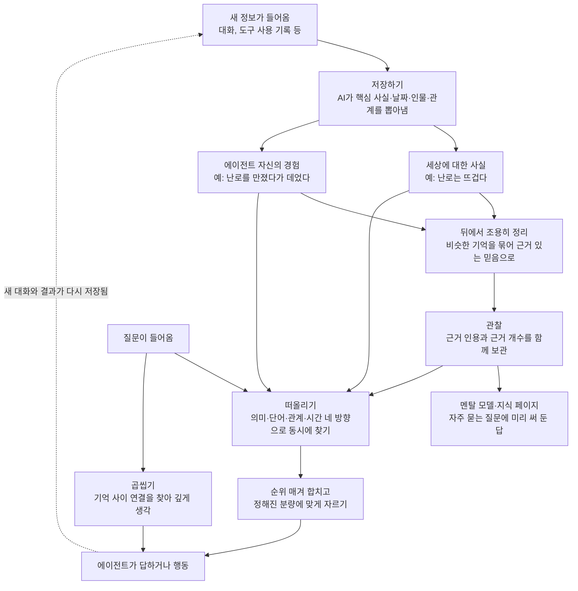

<div class="ai-knowledge-shell">

<aside class="ai-knowledge-sidebar">
  <p class="ai-eyebrow">CATEGORIES</p>
  <nav class="ai-cat-tree"><details class="ai-cat" open><summary><span class="catname">에이전트 오케스트레이션</span><span class="catcount">14</span></summary><ul><li><a href="https://altjs4510.github.io/ai_news_blog/knowledge/20260929/" class="current"><span class="kdate">2026-09-29</span><span class="ktitle">vectorize-io/hindsight — Hindsight: Agent Memory…</span></a></li><li><a href="https://altjs4510.github.io/ai_news_blog/knowledge/20260908/"><span class="kdate">2026-09-08</span><span class="ktitle">bytedance/deer-flow — 샌드박스·메모리·서브에이전트·메시지 게이트웨이를…</span></a></li><li><a href="https://altjs4510.github.io/ai_news_blog/knowledge/20260904/"><span class="kdate">2026-09-04</span><span class="ktitle">HarnessDev: Can LLMs Create and Evolve Their Own…</span></a></li><li><a href="https://altjs4510.github.io/ai_news_blog/knowledge/20260831-openexecutive-virtual-c-suite/"><span class="kdate">2026-08-31</span><span class="ktitle">Open Executive — 8명의 전문 에이전트를 하나의 임원 목소리로</span></a></li><li><a href="https://altjs4510.github.io/ai_news_blog/knowledge/20260828/"><span class="kdate">2026-08-28</span><span class="ktitle">Google ADK for Python v2.8.0 — RemoteA2aAgent 네이…</span></a></li><li><a href="https://altjs4510.github.io/ai_news_blog/knowledge/20260826/"><span class="kdate">2026-08-26</span><span class="ktitle">apache/maka — 도구 호출·권한 결정·종료 이벤트를 append-only 로그…</span></a></li><li><a href="https://altjs4510.github.io/ai_news_blog/knowledge/20260823/"><span class="kdate">2026-08-23</span><span class="ktitle">The Evolution of the Agent Harness — 하네스가 모델 가중치…</span></a></li><li><a href="https://altjs4510.github.io/ai_news_blog/knowledge/20260821/"><span class="kdate">2026-08-21</span><span class="ktitle">volcengine/OpenViking — 에이전트 메모리·Knowledge RAG·스…</span></a></li><li><a href="https://altjs4510.github.io/ai_news_blog/knowledge/20260709/"><span class="kdate">2026-07-09</span><span class="ktitle">mvanhorn/last30days-skill — Reddit·X·YouTube·HN·…</span></a></li><li><a href="https://altjs4510.github.io/ai_news_blog/knowledge/20260623/"><span class="kdate">2026-06-23</span><span class="ktitle">bytedance/deer-flow — 샌드박스·메모리·서브에이전트·메시지 게이트웨이를…</span></a></li><li><a href="https://altjs4510.github.io/ai_news_blog/knowledge/20260602/"><span class="kdate">2026-06-02</span><span class="ktitle">revfactory/harness — 도메인별 에이전트 팀과 스킬을 자동 설계하는 메타…</span></a></li><li><a href="https://altjs4510.github.io/ai_news_blog/knowledge/20260529/"><span class="kdate">2026-05-29</span><span class="ktitle">Introducing dynamic workflows in Claude Code</span></a></li><li><a href="https://altjs4510.github.io/ai_news_blog/knowledge/20260528/"><span class="kdate">2026-05-28</span><span class="ktitle">Building self-improving tax agents with Codex</span></a></li><li><a href="https://altjs4510.github.io/ai_news_blog/knowledge/20260507/"><span class="kdate">2026-05-07</span><span class="ktitle">ruvnet/ruflo — Claude 멀티 에이전트 오케스트레이션 플랫폼</span></a></li></ul></details><details class="ai-cat" open><summary><span class="catname">MCP &amp; 도구 통합</span><span class="catcount">21</span></summary><ul><li><a href="https://altjs4510.github.io/ai_news_blog/knowledge/20260831-gitnexus-code-knowledge-graph/"><span class="kdate">2026-08-31</span><span class="ktitle">GitNexus — 코드베이스를 지식그래프로 바꿔 에이전트에게 쥐어주기</span></a></li><li><a href="https://altjs4510.github.io/ai_news_blog/knowledge/20260802/"><span class="kdate">2026-08-02</span><span class="ktitle">Stateless MCP has recaptured my interest (and in…</span></a></li><li><a href="https://altjs4510.github.io/ai_news_blog/knowledge/20260801/"><span class="kdate">2026-08-01</span><span class="ktitle">different-ai/openwork — Claude Cowork의 오픈소스 대체 에…</span></a></li><li><a href="https://altjs4510.github.io/ai_news_blog/knowledge/20260731/"><span class="kdate">2026-07-31</span><span class="ktitle">different-ai/openwork — Claude Cowork의 오픈소스 대안(o…</span></a></li><li><a href="https://altjs4510.github.io/ai_news_blog/knowledge/20260729/"><span class="kdate">2026-07-29</span><span class="ktitle">Bringing MCP 2026-07-28 to Claude</span></a></li><li><a href="https://altjs4510.github.io/ai_news_blog/knowledge/20260726/"><span class="kdate">2026-07-26</span><span class="ktitle">citrolabs/ego-lite — 로그인된 브라우저 상태를 AI 에이전트와 공유하는…</span></a></li><li><a href="https://altjs4510.github.io/ai_news_blog/knowledge/20260722/"><span class="kdate">2026-07-22</span><span class="ktitle">tirth8205/code-review-graph — MCP·CLI용 로컬 우선 코드 …</span></a></li><li><a href="https://altjs4510.github.io/ai_news_blog/knowledge/20260721/"><span class="kdate">2026-07-21</span><span class="ktitle">tirth8205/code-review-graph — 로컬 우선 코드 인텔리전스 그래프…</span></a></li><li><a href="https://altjs4510.github.io/ai_news_blog/knowledge/20260719/"><span class="kdate">2026-07-19</span><span class="ktitle">tirth8205/code-review-graph — 로컬 우선 코드 인텔리전스 그래프…</span></a></li><li><a href="https://altjs4510.github.io/ai_news_blog/knowledge/20260718/"><span class="kdate">2026-07-18</span><span class="ktitle">tirth8205/code-review-graph — MCP·CLI용 로컬 코드 인텔리…</span></a></li><li><a href="https://altjs4510.github.io/ai_news_blog/knowledge/20260708/"><span class="kdate">2026-07-08</span><span class="ktitle">Expanding Managed Agents in Gemini API: backgrou…</span></a></li><li><a href="https://altjs4510.github.io/ai_news_blog/knowledge/20260618/"><span class="kdate">2026-06-18</span><span class="ktitle">DeusData/codebase-memory-mcp — 158개 언어 코드베이스를 밀리…</span></a></li><li><a href="https://altjs4510.github.io/ai_news_blog/knowledge/20260606/"><span class="kdate">2026-06-06</span><span class="ktitle">chopratejas/headroom — Compress tool outputs, lo…</span></a></li><li><a href="https://altjs4510.github.io/ai_news_blog/knowledge/20260605/"><span class="kdate">2026-06-05</span><span class="ktitle">chopratejas/headroom — Compress tool outputs, lo…</span></a></li><li><a href="https://altjs4510.github.io/ai_news_blog/knowledge/20260604/"><span class="kdate">2026-06-04</span><span class="ktitle">chopratejas/headroom — Compress tool outputs bef…</span></a></li><li><a href="https://altjs4510.github.io/ai_news_blog/knowledge/20260603/"><span class="kdate">2026-06-03</span><span class="ktitle">How Bad MCP design cost your Agent 5× more token…</span></a></li><li><a href="https://altjs4510.github.io/ai_news_blog/knowledge/20260526/"><span class="kdate">2026-05-26</span><span class="ktitle">colbymchenry/codegraph — Pre-indexed code knowle…</span></a></li><li><a href="https://altjs4510.github.io/ai_news_blog/knowledge/20260524/"><span class="kdate">2026-05-24</span><span class="ktitle">colbymchenry/codegraph — Pre-indexed code knowle…</span></a></li><li><a href="https://altjs4510.github.io/ai_news_blog/knowledge/20260523/"><span class="kdate">2026-05-23</span><span class="ktitle">colbymchenry/codegraph — 사전 인덱싱된 코드 지식 그래프 MCP</span></a></li><li><a href="https://altjs4510.github.io/ai_news_blog/knowledge/20260517/"><span class="kdate">2026-05-17</span><span class="ktitle">I gave my LLM 100,000+ tools — Lazy Discovery &a…</span></a></li><li><a href="https://altjs4510.github.io/ai_news_blog/knowledge/20260509/"><span class="kdate">2026-05-09</span><span class="ktitle">How to connect 100 MCP servers without the conte…</span></a></li></ul></details><details class="ai-cat" open><summary><span class="catname">코딩 에이전트</span><span class="catcount">36</span></summary><ul><li><a href="https://altjs4510.github.io/ai_news_blog/knowledge/20260920/"><span class="kdate">2026-09-20</span><span class="ktitle">Claude Code 2.1.277 — CLAUDE.md가 없으면 AGENTS.md를 …</span></a></li><li><a href="https://altjs4510.github.io/ai_news_blog/knowledge/20260919/"><span class="kdate">2026-09-19</span><span class="ktitle">cloudflare/security-audit-skill — 다단계 보안 감사를 '독립…</span></a></li><li><a href="https://altjs4510.github.io/ai_news_blog/knowledge/20260918/"><span class="kdate">2026-09-18</span><span class="ktitle">alibaba/open-code-review — 결정론적 파이프라인 + LLM 에이전트…</span></a></li><li><a href="https://altjs4510.github.io/ai_news_blog/knowledge/20260917/"><span class="kdate">2026-09-17</span><span class="ktitle">alibaba/open-code-review — 결정론적 파이프라인과 LLM 에이전트를…</span></a></li><li><a href="https://altjs4510.github.io/ai_news_blog/knowledge/20260916/"><span class="kdate">2026-09-16</span><span class="ktitle">alibaba/open-code-review — 결정론적 파이프라인과 LLM Agent…</span></a></li><li><a href="https://altjs4510.github.io/ai_news_blog/knowledge/20260915/"><span class="kdate">2026-09-15</span><span class="ktitle">alibaba/open-code-review — 결정적 파이프라인과 LLM 에이전트를 …</span></a></li><li><a href="https://altjs4510.github.io/ai_news_blog/knowledge/20260912/"><span class="kdate">2026-09-12</span><span class="ktitle">Quoting Boris Cherny — 'Claude가 쓴 프로덕션 코드는 사람이 쓴…</span></a></li><li><a href="https://altjs4510.github.io/ai_news_blog/knowledge/20260910/"><span class="kdate">2026-09-10</span><span class="ktitle">vastsa/PI-Desktop — Electron + Rust 호스트 코어 + 에이전…</span></a></li><li><a href="https://altjs4510.github.io/ai_news_blog/knowledge/20260906/"><span class="kdate">2026-09-06</span><span class="ktitle">DietrichGebert/ponytail — 에이전트를 '방에서 가장 게으른 시니어 …</span></a></li><li><a href="https://altjs4510.github.io/ai_news_blog/knowledge/20260903/"><span class="kdate">2026-09-03</span><span class="ktitle">pacifio/atlas — 여러 코딩 에이전트의 변경을 한곳에서 추적·질의하는 '에이…</span></a></li><li><a href="https://altjs4510.github.io/ai_news_blog/knowledge/20260901/"><span class="kdate">2026-09-01</span><span class="ktitle">affaan-m/ECC — 스킬·본능·메모리·보안을 묶은 에이전트 하네스 성능 최적화 …</span></a></li><li><a href="https://altjs4510.github.io/ai_news_blog/knowledge/20260829/"><span class="kdate">2026-08-29</span><span class="ktitle">cursor/plugins — 플러그인 명세(specification)와 공식 플러그인…</span></a></li><li><a href="https://altjs4510.github.io/ai_news_blog/knowledge/20260822/"><span class="kdate">2026-08-22</span><span class="ktitle">mattpocock/skills — Skills for Real Engineers (하…</span></a></li><li><a href="https://altjs4510.github.io/ai_news_blog/knowledge/20260820/"><span class="kdate">2026-08-20</span><span class="ktitle">akitaonrails/ai-memory — 코딩 에이전트 CLI의 장기 메모리와 벤더…</span></a></li><li><a href="https://altjs4510.github.io/ai_news_blog/knowledge/20260819/"><span class="kdate">2026-08-19</span><span class="ktitle">akitaonrails/ai-memory — 코딩 에이전트 CLI 간 장기 기억과 벤더…</span></a></li><li><a href="https://altjs4510.github.io/ai_news_blog/knowledge/20260814/"><span class="kdate">2026-08-14</span><span class="ktitle">cathrynlavery/diagram-design — Claude Code용 에디토리…</span></a></li><li><a href="https://altjs4510.github.io/ai_news_blog/knowledge/20260811/"><span class="kdate">2026-08-11</span><span class="ktitle">PrimeIntellect-ai/prime-agent — 장기 자율 실행을 전제로 설계…</span></a></li><li><a href="https://altjs4510.github.io/ai_news_blog/knowledge/20260810/"><span class="kdate">2026-08-10</span><span class="ktitle">Auto mode is now the default in Claude Code for …</span></a></li><li><a href="https://altjs4510.github.io/ai_news_blog/knowledge/20260809/"><span class="kdate">2026-08-09</span><span class="ktitle">PrimeIntellect-ai/prime-agent — 코딩 워크플로우·장기 자율 작…</span></a></li><li><a href="https://altjs4510.github.io/ai_news_blog/knowledge/20260808/"><span class="kdate">2026-08-08</span><span class="ktitle">PrimeIntellect-ai/prime-agent — 코딩 워크플로우와 장시간 자율…</span></a></li><li><a href="https://altjs4510.github.io/ai_news_blog/knowledge/20260804/"><span class="kdate">2026-08-04</span><span class="ktitle">esengine/DeepSeek-Reasonix — prefix-cache 안정성을 축…</span></a></li><li><a href="https://altjs4510.github.io/ai_news_blog/knowledge/20260728/"><span class="kdate">2026-07-28</span><span class="ktitle">alibaba/open-code-review — 결정론적 파이프라인 + LLM 에이전트…</span></a></li><li><a href="https://altjs4510.github.io/ai_news_blog/knowledge/20260725/"><span class="kdate">2026-07-25</span><span class="ktitle">The new rules of context engineering for Claude …</span></a></li><li><a href="https://altjs4510.github.io/ai_news_blog/knowledge/20260714/"><span class="kdate">2026-07-14</span><span class="ktitle">Graphify-Labs/graphify — 코드베이스를 질의 가능한 지식 그래프로 만…</span></a></li><li><a href="https://altjs4510.github.io/ai_news_blog/knowledge/20260707/"><span class="kdate">2026-07-07</span><span class="ktitle">AI Hero Skills Catalog — 실무 엔지니어를 위한 재사용 가능한 판단 …</span></a></li><li><a href="https://altjs4510.github.io/ai_news_blog/knowledge/20260705/"><span class="kdate">2026-07-05</span><span class="ktitle">openai/codex-plugin-cc — Claude Code에서 Codex를 위임…</span></a></li><li><a href="https://altjs4510.github.io/ai_news_blog/knowledge/20260701/"><span class="kdate">2026-07-01</span><span class="ktitle">Google OKF (Open Knowledge Format) — 벤더 중립 에이전트 …</span></a></li><li><a href="https://altjs4510.github.io/ai_news_blog/knowledge/20260626/"><span class="kdate">2026-06-26</span><span class="ktitle">google-labs-code/design.md — 코딩 에이전트에게 디자인 시스템을 …</span></a></li><li><a href="https://altjs4510.github.io/ai_news_blog/knowledge/20260619/"><span class="kdate">2026-06-19</span><span class="ktitle">Claude Code now supports artifacts</span></a></li><li><a href="https://altjs4510.github.io/ai_news_blog/knowledge/20260530/"><span class="kdate">2026-05-30</span><span class="ktitle">Leonxlnx/taste-skill — AI에게 좋은 취향을 부여해 generic s…</span></a></li><li><a href="https://altjs4510.github.io/ai_news_blog/knowledge/20260521/"><span class="kdate">2026-05-21</span><span class="ktitle">colbymchenry/codegraph — Pre-indexed code knowle…</span></a></li><li><a href="https://altjs4510.github.io/ai_news_blog/knowledge/20260512/"><span class="kdate">2026-05-12</span><span class="ktitle">agentmemory — Persistent memory for AI coding ag…</span></a></li><li><a href="https://altjs4510.github.io/ai_news_blog/knowledge/20260510/"><span class="kdate">2026-05-10</span><span class="ktitle">addyosmani/agent-skills — Production-grade engin…</span></a></li><li><a href="https://altjs4510.github.io/ai_news_blog/knowledge/20260508/"><span class="kdate">2026-05-08</span><span class="ktitle">addyosmani/agent-skills — Production-grade engin…</span></a></li><li><a href="https://altjs4510.github.io/ai_news_blog/knowledge/20260506/"><span class="kdate">2026-05-06</span><span class="ktitle">mksglu/context-mode — AI 코딩 에이전트용 컨텍스트 윈도우 최적화</span></a></li><li><a href="https://altjs4510.github.io/ai_news_blog/knowledge/20260505/"><span class="kdate">2026-05-05</span><span class="ktitle">mattpocock/skills — Skills for Real Engineers (.…</span></a></li></ul></details><details class="ai-cat" open><summary><span class="catname">모델 &amp; 연구</span><span class="catcount">6</span></summary><ul><li><a href="https://altjs4510.github.io/ai_news_blog/knowledge/20260907-voicemem-dual-brain-memory/"><span class="kdate">2026-09-07</span><span class="ktitle">VoiceMem — 좌뇌·우뇌로 쪼갠 스트리밍 메모리로 음성 에이전트 지연 없애기</span></a></li><li><a href="https://altjs4510.github.io/ai_news_blog/knowledge/20260716-proprag/"><span class="kdate">2026-07-16</span><span class="ktitle">PropRAG — 프로포지션 경로 위 beam search로 멀티홉 검색 안내</span></a></li><li><a href="https://altjs4510.github.io/ai_news_blog/knowledge/20260620/"><span class="kdate">2026-06-20</span><span class="ktitle">zai-org/GLM-5 — From Vibe Coding to Agentic Engi…</span></a></li><li><a href="https://altjs4510.github.io/ai_news_blog/knowledge/20260617/"><span class="kdate">2026-06-17</span><span class="ktitle">Predicting model behavior before release by simu…</span></a></li><li><a href="https://altjs4510.github.io/ai_news_blog/knowledge/20260516/"><span class="kdate">2026-05-16</span><span class="ktitle">STALE — 에이전트가 자기 기억의 유효성을 인지할 수 있는가</span></a></li><li><a href="https://altjs4510.github.io/ai_news_blog/knowledge/20260513/"><span class="kdate">2026-05-13</span><span class="ktitle">Thinking Machines' Native Interaction Models — T…</span></a></li></ul></details><details class="ai-cat" open><summary><span class="catname">인프라 &amp; 컴퓨트</span><span class="catcount">12</span></summary><ul><li><a href="https://altjs4510.github.io/ai_news_blog/knowledge/20260909/"><span class="kdate">2026-09-09</span><span class="ktitle">Reducing cost and improving performance with Cla…</span></a></li><li><a href="https://altjs4510.github.io/ai_news_blog/knowledge/20260905/"><span class="kdate">2026-09-05</span><span class="ktitle">magnitudedev/magnitude — 하드웨어에 맞는 최적 로컬 모델을 띄워 이…</span></a></li><li><a href="https://altjs4510.github.io/ai_news_blog/knowledge/20260813/"><span class="kdate">2026-08-13</span><span class="ktitle">semantica-agi/semantica — 컨텍스트와 책임 추적을 위한 그래프 네이…</span></a></li><li><a href="https://altjs4510.github.io/ai_news_blog/knowledge/20260812/"><span class="kdate">2026-08-12</span><span class="ktitle">semantica-agi/semantica — 컨텍스트와 '책임 추적 가능한(accou…</span></a></li><li><a href="https://altjs4510.github.io/ai_news_blog/knowledge/20260806/"><span class="kdate">2026-08-06</span><span class="ktitle">cloudflare/computer — 에이전트에게 컴퓨터를 통째로 주는 엣지 실행 샌…</span></a></li><li><a href="https://altjs4510.github.io/ai_news_blog/knowledge/20260805/"><span class="kdate">2026-08-05</span><span class="ktitle">TencentCloud/TencentDB-Agent-Memory — 대화·문서·코드를 …</span></a></li><li><a href="https://altjs4510.github.io/ai_news_blog/knowledge/20260724/"><span class="kdate">2026-07-24</span><span class="ktitle">diegosouzapw/OmniRoute — 단일 엔드포인트로 278+ 프로바이더·50…</span></a></li><li><a href="https://altjs4510.github.io/ai_news_blog/knowledge/20260723/"><span class="kdate">2026-07-23</span><span class="ktitle">diegosouzapw/OmniRoute — 268+ 프로바이더를 단일 엔드포인트로 묶…</span></a></li><li><a href="https://altjs4510.github.io/ai_news_blog/knowledge/20260611/"><span class="kdate">2026-06-11</span><span class="ktitle">The evolution of agentic surfaces: building with…</span></a></li><li><a href="https://altjs4510.github.io/ai_news_blog/knowledge/20260610/"><span class="kdate">2026-06-10</span><span class="ktitle">Fable 5 just made cost-aware model routing manda…</span></a></li><li><a href="https://altjs4510.github.io/ai_news_blog/knowledge/20260522/"><span class="kdate">2026-05-22</span><span class="ktitle">Giving Agents Computers — Ivan Burazin, Daytona</span></a></li><li><a href="https://altjs4510.github.io/ai_news_blog/knowledge/20260520/"><span class="kdate">2026-05-20</span><span class="ktitle">New in Claude Managed Agents: self-hosted sandbo…</span></a></li></ul></details><details class="ai-cat" open><summary><span class="catname">보안 &amp; 거버넌스</span><span class="catcount">19</span></summary><ul><li><a href="https://altjs4510.github.io/ai_news_blog/knowledge/20260913/"><span class="kdate">2026-09-13</span><span class="ktitle">OpenAI agents attacked RubyGems back in May: Ope…</span></a></li><li><a href="https://altjs4510.github.io/ai_news_blog/knowledge/20260902/"><span class="kdate">2026-09-02</span><span class="ktitle">AIR raises $50M to help companies vet the skills…</span></a></li><li><a href="https://altjs4510.github.io/ai_news_blog/knowledge/20260827/"><span class="kdate">2026-08-27</span><span class="ktitle">Claude in Chrome is generally available</span></a></li><li><a href="https://altjs4510.github.io/ai_news_blog/knowledge/20260819-mind-viruses/"><span class="kdate">2026-08-19</span><span class="ktitle">탈옥도, 인젝션도 없이 — 대화로만 퍼지는 에이전트의 '마인드 바이러스'</span></a></li><li><a href="https://altjs4510.github.io/ai_news_blog/knowledge/20260730/"><span class="kdate">2026-07-30</span><span class="ktitle">Anatomy of a Frontier Lab Agent Intrusion: A Tec…</span></a></li><li><a href="https://altjs4510.github.io/ai_news_blog/knowledge/20260716/"><span class="kdate">2026-07-16</span><span class="ktitle">Dicklesworthstone/destructive_command_guard — 에이…</span></a></li><li><a href="https://altjs4510.github.io/ai_news_blog/knowledge/20260715/"><span class="kdate">2026-07-15</span><span class="ktitle">Dicklesworthstone/destructive_command_guard — 에이…</span></a></li><li><a href="https://altjs4510.github.io/ai_news_blog/knowledge/20260710/"><span class="kdate">2026-07-10</span><span class="ktitle">70개 MCP 서버 strace 런타임 감사 — 부팅 시 아웃바운드 호출 서버 적발</span></a></li><li><a href="https://altjs4510.github.io/ai_news_blog/knowledge/20260704/"><span class="kdate">2026-07-04</span><span class="ktitle">Cloudflare is about to block AI agents by defaul…</span></a></li><li><a href="https://altjs4510.github.io/ai_news_blog/knowledge/20260703/"><span class="kdate">2026-07-03</span><span class="ktitle">Giving admins more visibility and control over C…</span></a></li><li><a href="https://altjs4510.github.io/ai_news_blog/knowledge/20260630/"><span class="kdate">2026-06-30</span><span class="ktitle">Introducing the Claude apps gateway for Amazon B…</span></a></li><li><a href="https://altjs4510.github.io/ai_news_blog/knowledge/20260625/"><span class="kdate">2026-06-25</span><span class="ktitle">Agent identity in Claude Tag: a new access model…</span></a></li><li><a href="https://altjs4510.github.io/ai_news_blog/knowledge/20260624/"><span class="kdate">2026-06-24</span><span class="ktitle">Agent identity in Claude Tag: a new access model…</span></a></li><li><a href="https://altjs4510.github.io/ai_news_blog/knowledge/20260614/"><span class="kdate">2026-06-14</span><span class="ktitle">NVIDIA/SkillSpector — Security scanner for AI ag…</span></a></li><li><a href="https://altjs4510.github.io/ai_news_blog/knowledge/20260613/"><span class="kdate">2026-06-13</span><span class="ktitle">Fable 5's guardrails got bypassed in 48 hours — …</span></a></li><li><a href="https://altjs4510.github.io/ai_news_blog/knowledge/20260612/"><span class="kdate">2026-06-12</span><span class="ktitle">NVIDIA/SkillSpector — AI 에이전트 스킬용 보안 스캐너</span></a></li><li><a href="https://altjs4510.github.io/ai_news_blog/knowledge/20260607/"><span class="kdate">2026-06-07</span><span class="ktitle">OpenAI Help: Lockdown Mode</span></a></li><li><a href="https://altjs4510.github.io/ai_news_blog/knowledge/20260531/"><span class="kdate">2026-05-31</span><span class="ktitle">How we contain Claude across products</span></a></li><li><a href="https://altjs4510.github.io/ai_news_blog/knowledge/20260527/"><span class="kdate">2026-05-27</span><span class="ktitle">Microsoft Copilot Cowork Exfiltrates Files</span></a></li></ul></details><details class="ai-cat" open><summary><span class="catname">응용 사례</span><span class="catcount">7</span></summary><ul><li><a href="https://altjs4510.github.io/ai_news_blog/knowledge/20260911/"><span class="kdate">2026-09-11</span><span class="ktitle">Now everyone can put data to work — ChatGPT Work…</span></a></li><li><a href="https://altjs4510.github.io/ai_news_blog/knowledge/20260717/"><span class="kdate">2026-07-17</span><span class="ktitle">After a year building agent memory, 'save everyt…</span></a></li><li><a href="https://altjs4510.github.io/ai_news_blog/knowledge/20260712/"><span class="kdate">2026-07-12</span><span class="ktitle">Do Automated Evals Work?</span></a></li><li><a href="https://altjs4510.github.io/ai_news_blog/knowledge/20260621/"><span class="kdate">2026-06-21</span><span class="ktitle">calesthio/OpenMontage — 12 파이프라인·52 도구·500+ 스킬을 …</span></a></li><li><a href="https://altjs4510.github.io/ai_news_blog/knowledge/20260609/"><span class="kdate">2026-06-09</span><span class="ktitle">Building intelligent apps for Apple platforms wi…</span></a></li><li><a href="https://altjs4510.github.io/ai_news_blog/knowledge/20260515/"><span class="kdate">2026-05-15</span><span class="ktitle">Clawdmeter — Claude Code 사용량을 데스크톱 대시보드로</span></a></li><li><a href="https://altjs4510.github.io/ai_news_blog/knowledge/20260514/"><span class="kdate">2026-05-14</span><span class="ktitle">Introducing Claude for Small Business</span></a></li></ul></details><details class="ai-cat" open><summary><span class="catname">산업 동향</span><span class="catcount">7</span></summary><ul><li><a href="https://altjs4510.github.io/ai_news_blog/knowledge/20260907-humanmade-52week-rhythm/"><span class="kdate">2026-09-07</span><span class="ktitle">휴먼 메이드의 '52주 리듬' — 아이디어가 흔해진 시대에 값이 오르는 건 버리는 판단</span></a></li><li><a href="https://altjs4510.github.io/ai_news_blog/knowledge/20260830/"><span class="kdate">2026-08-30</span><span class="ktitle">[AINews] OpenAI shuts off Cursor — 프론티어 모델 공급 차단…</span></a></li><li><a href="https://altjs4510.github.io/ai_news_blog/knowledge/20260711/"><span class="kdate">2026-07-11</span><span class="ktitle">OpenAI says GPT 5.6 is the 'preferred model' for…</span></a></li><li><a href="https://altjs4510.github.io/ai_news_blog/knowledge/20260702/"><span class="kdate">2026-07-02</span><span class="ktitle">How Cursor deploys AI inside the enterprise (For…</span></a></li><li><a href="https://altjs4510.github.io/ai_news_blog/knowledge/20260616/"><span class="kdate">2026-06-16</span><span class="ktitle">Why AI hasn't replaced software engineers, and w…</span></a></li><li><a href="https://altjs4510.github.io/ai_news_blog/knowledge/20260519/"><span class="kdate">2026-05-19</span><span class="ktitle">Anthropic acquires Stainless</span></a></li><li><a href="https://altjs4510.github.io/ai_news_blog/knowledge/20260504/"><span class="kdate">2026-05-04</span><span class="ktitle">Agents for Everything Else: Codex for Knowledge …</span></a></li></ul></details></nav>
</aside>

<article class="ai-knowledge-article">

<header class="ai-post-hero">
  <p class="ai-eyebrow"><a class="ai-back" href="../">KNOWLEDGE</a> · 2026-09-29 · 오늘의 학습</p>
  <h2 class="ai-post-title">vectorize-io/hindsight — Hindsight: Agent Memory That Learns</h2>
</header>

> 원문: [vectorize-io/hindsight — Hindsight: Agent Memory That Learns](https://github.com/vectorize-io/hindsight)

## 📌 학습 정리

[F&F Policy Active]

### 1. 한 줄로 말하면

AI 비서가 겪은 일을 그냥 쌓아 두지 않고, 여러 번 겪은 일을 모아 "이 사람은 이런 걸 좋아하더라" 같은 깨달음으로 정리해 두는 기억 장치예요. 그래서 다음에 일을 할 때 그 정리된 깨달음을 바로 꺼내 쓸 수 있어요.

### 2. 왜 이게 만들어졌어요?

지금까지 AI 에이전트(스스로 여러 단계를 거쳐 일을 처리하는 AI 프로그램, agent)에 기억을 붙이는 방법은 주로 "예전 대화를 다시 찾아오기"였어요. 질문과 비슷한 문서 조각을 찾아서 AI에게 함께 건네주는 검색 증강 생성(RAG)이나, 사람·회사 같은 대상끼리의 관계를 선으로 이어 저장하는 지식 그래프(knowledge graph)가 대표적이에요. 원문은 이런 방식에 한계가 있다고 봐요. 기록을 떠올리는 것까지는 되지만, 쌓인 기록에서 교훈을 뽑아 다음 행동을 바꾸는 데까지는 가지 못한다는 거예요. Hindsight는 이 틈을 메우려고 나왔어요. 목표를 "기억하는 에이전트"가 아니라 "배우는 에이전트"에 두고 있어요.

### 3. 비유로 풀면

이건 마치 **꼼꼼한 신입 사원의 업무 노트** 같은 거예요. 처음에는 "A 고객이 오늘 이렇게 말했다" 같은 사실을 날짜별로 그냥 적어요. 그러다 비슷한 메모가 여러 개 쌓이면 "A 고객은 빠른 답장보다 정확한 답장을 좋아한다" 같은 한 줄 요약을 따로 만들어 두죠. 이 요약 옆에는 근거가 된 메모도 함께 붙여 둬요. 나중에 반대되는 일이 생기면 요약을 지우지 않고 "대체로 그렇지만 급할 땐 예외" 식으로 고쳐 나가요.

두 번째 비유는 **팀 위키**예요. 매번 옛날 메일함을 뒤지지 않도록 "우리 팀 코드 규칙", "이 고객의 선호" 같은 페이지를 만들어 두고, 새로운 사실이 들어올 때마다 계속 고쳐 쓰는 거예요.

그래서 결국 Hindsight는 날것의 기록(사실·경험), 그 기록을 모아 만든 믿음(관찰), 늘 펼쳐 볼 수 있는 정리 문서(멘탈 모델·지식 페이지)라는 세 층으로 기억을 나눠 관리해요.

### 4. 어떻게 작동하는지 (그림으로)



정보가 들어오면 "저장하기(retain)" 단계에서 AI가 사실, 날짜, 등장인물, 관계를 뽑아 정리해 둬요. 뒤에서는 비슷한 기억끼리 묶어 "관찰"이라는 믿음으로 다듬고, 이 믿음은 다시 늘 펼쳐 볼 수 있는 정리 문서가 돼요. 질문이 오면 "떠올리기(recall)"로 여러 방향에서 동시에 찾아 순위를 매기고, 깊게 생각해야 하는 질문이면 "곱씹기(reflect)"로 기억들을 엮어 답을 만들어요. 그렇게 나온 대화가 다시 저장되기 때문에 한 바퀴를 돌 때마다 기억이 조금씩 두터워지는 구조예요.

### 5. 처음 보는 용어 풀이

- **기억 저장소 (bank)** — 한 사용자, 한 에이전트, 또는 한 프로젝트를 위한 따로 떨어진 "뇌" 하나예요. 저장소끼리는 기억이 섞이지 않게 엄격히 나뉘어 있고, 회의적인 성향이나 공감하는 성향처럼 곱씹을 때 영향을 주는 성격 값도 붙일 수 있어요.
- **저장하기 / 떠올리기 / 곱씹기 (retain / recall / reflect)** — Hindsight를 쓰는 세 가지 기본 동작이에요. 저장하기는 새 정보를 넣는 것이고, 떠올리기는 관련 기억을 찾아오는 거예요. 곱씹기는 단순히 찾는 데서 그치지 않고 기억들을 엮어서 깊이 생각한 답을 만들어요.
- **관찰 (observation)** — 비슷한 사실 여러 개를 합쳐 만든, 중복 없는 "믿음"이에요. 근거가 된 문장을 그대로 인용해 두고 근거가 몇 개인지도 세어 둬요. 새 정보가 들어오면 덮어쓰는 대신 믿음을 강하게 하거나 약하게 하거나 넓히는 식으로 다듬어요.
- **멘탈 모델 (mental model)** — "이 사용자는 뭘 좋아하지?"처럼 정해 둔 질문에 대해 미리 써 둔 답이에요. 기억이 쌓이면 뒤에서 알아서 다시 써요. 읽을 때는 검색이나 AI 호출 없이 바로 꺼내기만 하면 돼서, 에이전트가 매번 처음부터 다시 파악하지 않아도 돼요.
- **지식 페이지 (knowledge page)** — 멘탈 모델을 위키 문서처럼 쓰기 편하게 만든 형태예요. 폴더로 정리하고 검색할 수 있고, 일반 마크다운 파일로 내보낼 수도 있어요. 이름과 질문만 정해 주면 나머지는 기본값으로 처리돼요.
- **순위 합치기와 재정렬 (reciprocal rank fusion / cross-encoder reranking)** — 떠올리기는 의미가 비슷한 것, 단어가 정확히 같은 것, 관계로 이어진 것, 시간대가 맞는 것을 동시에 찾아요. 이렇게 나온 네 가지 결과를 한 줄로 합쳐 순위를 매기는 방법이 순위 합치기고, 한 번 더 꼼꼼히 비교해 순서를 다듬는 게 재정렬이에요.
- **모델 컨텍스트 프로토콜 (Model Context Protocol, MCP)** — AI 도구가 외부 기능을 표준 방식으로 불러 쓰게 해 주는 연결 규격이에요. Hindsight 서버는 저장소마다 이 연결 창구를 기본으로 열어 둬서, 지원하는 AI 도구라면 저장하기·떠올리기·곱씹기를 도구처럼 쓸 수 있어요.

### 6. 한 발 더 들어가고 싶다면

- [vectorize-io/hindsight GitHub 저장소](https://github.com/vectorize-io/hindsight) — 이걸 보면 설치 방법(도커, pip, 쿠버네티스, 서버 없이 파이썬 안에 넣어 쓰는 방식), 연동할 수 있는 도구 목록, 코드 예시를 한곳에서 볼 수 있어요.
- benchmarks.hindsight.vectorize.io — 이걸 보면 원문이 말하는 성능 비교 결과를 모델별 정확도, 응답 속도, 비용까지 계속 갱신되는 형태로 확인할 수 있어요. 원문에 따르면 Hindsight 점수는 외부 연구진이 다시 재현했고, 다른 제품 점수는 각 회사가 직접 발표한 값이라는 점도 함께 참고하면 좋아요.
- https://api.hindsight.vectorize.io — 이걸 보면 서버를 직접 띄우지 않고 쓰는 관리형 서비스(Hindsight Cloud)가 어떻게 연결되는지 감을 잡을 수 있어요. 클라이언트를 이 주소로 연결하고 API 키만 넣으면 된다고 해요.

---

## 📖 원문 전체 번역 (정독용)

> 의역 최소화한 전체 번역입니다. 큰 흐름은 위 정리에서 잡고, 정확한 워딩이 필요할 땐 이 섹션에서 정독하세요.

[F&F Policy Active]

### 원문 전체 번역 (정독용)

Documentation
•
Integrations
•
Cookbook
•
Benchmarks
•
Paper
•
Hindsight Cloud

## Hindsight란 무엇인가?

Hindsight™는 시간이 지날수록 학습하는 더 똑똑한 에이전트를 만들기 위해 구축된 에이전트 메모리 시스템이다. 대부분의 에이전트 메모리 시스템은 대화 이력을 기억해내는 데 초점을 맞춘다. Hindsight는 단순히 기억하는 것이 아니라 학습하는 에이전트를 만드는 데 초점을 맞춘다.

hindsight-learning-demo.mp4

이는 RAG나 지식 그래프 같은 대안 기법들의 단점을 제거하고, 장기 기억 과제에서 최첨단(state-of-the-art) 성능을 제공한다.

## 목차

메모리 성능 및 정확도
빠른 시작
—
서버
·
클라이언트
·
플랫폼
·
임베디드
에이전트에 Hindsight 추가하기
—
LLM 래퍼
·
통합
·
코딩 에이전트
·
MCP
핵심 개념
—
메모리 유형
·
retain / recall / reflect
·
관찰(observations)
·
멘탈 모델 & 지식 페이지
·
뱅크(banks)
사용 사례
프로덕션 운영
리소스

## 메모리 성능 및 정확도

Hindsight는 벤치마크 성능 기준으로 지금까지 테스트된 것 중 가장 정확한 에이전트 메모리 시스템이다. 다양한 대화형 AI 시나리오에서 메모리 시스템 성능을 평가하는 데 널리 쓰이는 LongMemEval 벤치마크에서 최첨단 성능을 달성했다. 2026년 1월 기준 Hindsight와 다른 에이전트 메모리 솔루션들의 현재 보고된 성능은 다음과 같다:

모델별 정확도, 지연시간, 비용을 포함한 실시간으로 지속 업데이트되는 결과는
benchmarks.hindsight.vectorize.io
에 게시되어 있다.

Hindsight의 벤치마크 성능 데이터는 Virginia Tech
Sanghani Center for Artificial Intelligence and Data Analytics
와 The Washington Post의 연구 협력자들에 의해 독립적으로 재현되었다. 그 외 점수는 소프트웨어 벤더들이 자체 보고한 것이다.

Hindsight는 포춘 500대 기업들과 점점 늘어나는 AI 스타트업들에서 프로덕션에 사용되고 있다.

🤖
코딩 에이전트를 사용 중이신가요?
코딩하면서 즉시 문서에 접근할 수 있도록 Hindsight 문서 스킬을 설치하세요:
npx skills add https://github.com/vectorize-io/hindsight --skill hindsight-docs
Claude Code, Cursor, 그리고 다른 AI 코딩 어시스턴트와 함께 작동한다.

## 빠른 시작

### 1. 서버 시작하기

**Docker (권장)**

```
export OPENAI_API_KEY=sk-xxx

docker run -it --pull always --name hindsight --restart unless-stopped -p 8888:8888 -p 9999:9999 \
  -e HINDSIGHT_API_LLM_API_KEY=$OPENAI_API_KEY \
  -v hindsight-data:/home/hindsight/.pg0 \
  ghcr.io/vectorize-io/hindsight:latest
```

API:
http://localhost:8888
UI:
http://localhost:9999

Hindsight는
HINDSIGHT_API_LLM_PROVIDER
를 통해 25개 이상의 LLM 프로바이더와 작동한다 — 호스팅형(
openai
,
anthropic
,
gemini
,
groq
,
bedrock
,
vertexai
,
minimax
,
deepseek
,
atlas
,
meta
등), 완전 로컬(
ollama
,
lmstudio
,
llamacpp
), 모든 OpenAI 호환 엔드포인트, 그리고 나머지에 닿는 게이트웨이(
litellm
,
litellmrouter
). 기존 구독도 사용 가능하다:
openai-codex
(ChatGPT Plus/Pro),
claude-code
(Claude Pro/Max),
cursor
(Cursor),
github-copilot
(GitHub Copilot)는 API 키가 필요 없다.
지원 모델
참조.

**Docker (외부 PostgreSQL)**

```
export OPENAI_API_KEY=sk-xxx
export HINDSIGHT_DB_PASSWORD=choose-a-password
cd docker/docker-compose
docker compose up
```

Oracle AI Database도 완전한 기능 동등성(feature parity)을 갖춘 엔터프라이즈 배포용으로 지원된다. 자세한 내용은
스토리지 문서
참조.

**베어메탈 (pip)**

```
pip install hindsight-api
export HINDSIGHT_API_LLM_API_KEY=sk-xxx

hindsight-api
```

**Kubernetes (Helm)**

```
helm install hindsight oci://ghcr.io/vectorize-io/charts/hindsight \
  --set api.llm.provider=openai \
  --set api.llm.apiKey=sk-xxx \
  --set postgresql.enabled=true
```

**관리형 (서버 불필요)**

Hindsight Cloud
는 호스팅형 옵션이다: 자동으로 확장되는 관리형 인프라에 더해, 대시보드, 백업, 팀 협업, 99.9% 가동시간 SLA를 제공한다. 과금은 사용량 기반이며 무료 크레딧으로 시작할 수 있다 — 고정 월 요금이나 좌석당 요금이 없다. 어떤 클라이언트든 API 키와 함께
https://api.hindsight.vectorize.io
를 가리키기만 하면 배포 자체를 건너뛸 수 있다.

셀프호스팅, Cloud, Enterprise 비교 →
·
가입하기 →

윈도우와 에어갭(air-gapped) 설정을 포함한 모든 옵션은
설치 가이드
에서 다룬다.

### 2. 클라이언트 연결하기

```
pip install hindsight-client -U          # Python
npm install @vectorize-io/hindsight-client   # Node.js / TypeScript
go get github.com/vectorize-io/hindsight/hindsight-clients/go   # Go
curl -fsSL https://hindsight.vectorize.io/get-cli | bash   # CLI
```

**Python**

```python
from hindsight_client import Hindsight

client = Hindsight(base_url="http://localhost:8888")

# Retain: 정보 저장
client.retain(
    bank_id="my-bank",
    content="Alice works at Google as a software engineer"
)

# Recall: 메모리 검색
client.recall(
    bank_id="my-bank",
    query="What does Alice do?"
)

# Reflect: 성향(disposition)을 반영한 응답 생성
client.reflect(
    bank_id="my-bank",
    query="Tell me about Alice"
)
```

**Node.js / TypeScript**

```javascript
const { HindsightClient } = require('@vectorize-io/hindsight-client');

const main = async () => {
  const client = new HindsightClient({ baseUrl: 'http://localhost:8888' });

  await client.retain('my-bank', 'Alice loves hiking in Yosemite');

  const results = await client.recall('my-bank', 'What does Alice like?');
  console.log(results);
};

main();
```

전체 레퍼런스:
Python
·
Node.js
·
Go
·
CLI
·
REST API

### 지원 플랫폼

| 플랫폼 | Docker | 베어메탈 (pip) | 임베디드 DB (pg0) |
|---|---|---|---|
| Linux (x86_64, ARM64) | ✅ | ✅ | ✅ |
| macOS (Apple Silicon / arm64) | ✅ | ✅ | ✅ |
| macOS (Intel / x86_64) | ✅ | ⚠️ | ✅ |
| Windows (x86_64) | ✅ | ✅ | ✅ |

⚠️ Intel Mac: 대신
hindsight-all-slim
을 사용할 것 — 자세한 내용은
설치 가이드
참조.

### Python 임베디드 (서버 불필요)

```
pip install hindsight-all -U
```

Intel(x86_64) Mac에서는 대신
hindsight-all-slim
을 설치할 것 —
지원 플랫폼
참조.

```python
import os
from hindsight import HindsightServer, HindsightClient

with HindsightServer(
    llm_provider="openai",
    llm_model="gpt-5-mini",
    llm_api_key=os.environ["OPENAI_API_KEY"]
) as server:
    client = HindsightClient(base_url=server.url)
    client.retain(bank_id="my-bank", content="Alice works at Google")
    results = client.recall(bank_id="my-bank", query="Where does Alice work?")
```

Node.js 버전
과
데몬 CLI
도 사용 가능하다.

## 에이전트에 Hindsight 추가하기

### LLM 래퍼 (코드 2줄)

기존 에이전트에 메모리를 추가하는 가장 쉬운 방법은 LLM 래퍼다. LLM 클라이언트를 래핑된 클라이언트로 교체하면 — 코드의 다른 부분을 변경하지 않고도 매 호출마다 자동으로 메모리가 저장되고 검색된다.

```
pip install hindsight-litellm
```

```python
from openai import OpenAI
from hindsight_litellm import wrap_openai

# 기존 LLM 클라이언트를 래핑하면 끝.
# 기본값은 Hindsight Cloud이며, 셀프호스팅 서버를 쓰려면 hindsight_api_url을 전달.
client = wrap_openai(
    OpenAI(),
    bank_id="user-123",
    hindsight_api_url="http://localhost:8888",
)

# Hindsight는 호출 전에 관련 메모리를 recall하고
# 호출 후에 대화를 retain한다.
response = client.chat.completions.create(
    model="gpt-5-mini",
    messages=[{"role": "user", "content": "What do you know about me?"}],
)
```

wrap_anthropic()
도 Anthropic SDK에 대해 동일한 기능을 수행하며, 뱅크(bank), recall 예산, 팩트 유형, recall 대신 reflect 사용 등 모든 설정은 호출별로
hindsight_*
kwargs로 재정의할 수 있다. 그 아래에는 LiteLLM이 깔려 있어, 동일한 통합으로 100개 이상의 모델을 커버한다.
LiteLLM 통합
참조.

메모리가
언제
저장되고 검색되는지에 대한 명시적 제어가 필요하다면, 대신
SDK 또는 REST API
를 직접 사용할 것.

### 통합

**60개 이상의 통합** — 대부분 코드 변경이 필요 없음.

**코딩 에이전트**
Claude Code
·
Codex
·
Cursor
·
GitHub Copilot
·
opencode
·
Cline
·
Aider
·
Zed
·
Continue
·
Roo Code
·
OpenHands

**에이전트 프레임워크**
LangGraph / LangChain
·
LlamaIndex
·
CrewAI
·
Pydantic AI
·
OpenAI Agents SDK
·
Google ADK
·
Agno
·
Strands
·
AutoGen
·
Microsoft Agent Framework
·
Vercel AI SDK
·
Haystack

**노코드 / 로우코드**
n8n
·
Zapier
·
Dify
·
Flowise

**앱 & 도구**
ChatGPT
·
Perplexity
·
Obsidian
·
Pipecat
·
Vapi

👉
전체 통합 목록 보기

### 코딩 에이전트

하나의 패키지로 CLI 코딩 에이전트에 장기 프로젝트 메모리를 제공한다: git 이력과 과거 세션으로부터 자동 구축되는 레포별(per-repo) 뱅크가, 에이전트가 작업을 시작할 때 주입되며, 여기에 더해 아키텍처·컨벤션·진행 중인 작업을 다루는 큐레이션된 지식 페이지가 포함된다.

```
npx @vectorize-io/hindsight-coding-agents install all           # 감지된 모든 에이전트, 네이티브 연동
npx @vectorize-io/hindsight-coding-agents install claude-code    # 또는 하나만
```

Claude Code, Codex CLI, Cursor CLI, GitHub Copilot CLI, opencode, Kilo CLI, Cline CLI, Antigravity CLI, Devin CLI, pi, Prime Agent, Grok Build, DeepSeek Harness를 지원한다. 수집(ingestion)은 자동이며 — 별도의 설정 명령이 필요 없다.
코딩 에이전트 통합
참조.

### MCP 서버

모든 서버는 기본적으로 활성화된, 뱅크당 하나씩의 내장
Model Context Protocol
엔드포인트를 제공한다:

```
http://localhost:8888/mcp/{bank_id}/
```

어떤 MCP 클라이언트든 이를 가리키면 retain, recall, reflect를 도구로 노출시킬 수 있다.
MCP 서버 문서
참조.

## 핵심 개념

### 메모리 유형

대부분의 에이전트 메모리 구현은 기본적인 벡터 검색에 의존하거나 때로는 지식 그래프를 사용한다. Hindsight는 생체모방(biomimetic) 데이터 구조를 사용해 인간의 기억 작동 방식에 더 가까운 방식으로 에이전트 메모리를 조직한다:

**World facts(세계 사실):** 세계에 관한 사실("The stove gets hot" — 스토브는 뜨거워진다)
**Experiences(경험):** 에이전트 자신의 경험("I touched the stove and it really hurt" — 스토브를 만졌더니 정말 아팠다)
**Observations(관찰):** 여러 메모리로부터 형성된, 근거에 뒷받침되는 정제된 믿음
**Mental models(멘탈 모델):** 관찰과 사실로부터 종합된, 에이전트가 자신의 세계에 대해 학습한 이해

메모리는
뱅크(banks)
안에 존재한다. 메모리가 추가되면 world facts 경로 또는 experiences 경로 중 하나로 들어간 뒤, 이후의 정확한 메모리 검색을 돕기 위해 희소/밀집 벡터 표현과 함께 엔티티, 관계, 시계열의 조합으로 표현된다.

### 세 가지 연산

**Retain**

retain
연산은 새로운 메모리를 Hindsight에 밀어넣는 데 사용된다. 입력으로 전달한 정보를
retain
(보존)하라고 Hindsight에 지시하는 것이다.

```python
client.retain(
    bank_id="my-bank",
    content="Alice got promoted to senior engineer",
    context="career update",
    timestamp="2025-06-15T10:00:00Z",
)
```

내부적으로 retain은 LLM을 사용해 핵심 사실, 시간 데이터, 엔티티, 관계를 추출한다. 이를 정규화 과정을 거쳐 추출된 데이터를 메타데이터와 함께 정규(canonical) 엔티티, 시계열, 검색 인덱스로 변환한다. 이러한 표현들이 recall과 reflect 연산에서 정확한 메모리 검색을 위한 경로를 만들어낸다.

what-hindsight-does-retain.mp4

Retain 문서 →

**Recall**

recall 연산은 메모리를 검색하는 데 사용된다. 이 메모리들은 어떤 메모리 유형(world, experiences 등)에서든 올 수 있다.

```python
client.recall(bank_id="my-bank", query="What does Alice do?")
client.recall(bank_id="my-bank", query="What happened in June?")  # temporal(시간적)
```

Recall은 4가지 검색 전략을 병렬로 수행한다:

**Semantic(의미):** 벡터 유사도
**Keyword(키워드):** BM25 정확 매칭
**Graph(그래프):** 엔티티/시간/인과 링크
**Temporal(시간):** 시간 범위 필터링

what-hindsight-does-recall.mp4

개별 결과들은 병합되고, reciprocal rank fusion(상호 순위 융합)과 교차 인코더(cross-encoder) 재순위화 모델을 사용해 관련성 순으로 정렬된 뒤, 필요에 따라 토큰 제한에 맞게 잘라낸다.

Recall 문서 →

**Reflect**

reflect 연산은 기존 메모리에 대한 더 철저한 분석을 수행한다. 이를 통해 에이전트는 메모리들 사이에 새로운 연결을 형성하고 자신의 세계에 대한 더 철저한 이해를 구축하거나, 단순 조회가 아니라 깊은 사고가 필요한 질문에 답할 수 있다.

```python
client.reflect(bank_id="my-bank", query="What should I know about Alice?")
```

예를 들어, reflect는 다음과 같은 사용 사례를 지원한다:

프로젝트에서 어떤 리스크를 완화해야 하는지 reflect하는
AI 프로젝트 매니저
.
어떤 아웃리치 메시지는 응답을 받고 어떤 것은 받지 못했는지 이유를 reflect하는
영업 에이전트
.
현재 제품 문서로 답이 안 되는 고객 질문의 기회를 reflect하는
지원 에이전트
.

what-hindsight-does-reflect.mp4

Reflect 문서 →

### 관찰(Observations)

보존된 사실들은 평평한 무더기로 남아 있지 않는다. 백그라운드에서 Hindsight는 관련된 사실들을 통합해
관찰(observations)
로 만든다 — 뱅크가 시간이 지나며 쌓아온 중복 제거된 믿음이다. 각 관찰은 정확한 인용문과 증거 개수(proof count)를 포함한 뒷받침 증거를 유지하며, 새로운 증거가 도착하면 덮어쓰이는 대신
정제(refined)
된다 — 그래서 새로운 정보가 기존 믿음을 조용히 대체하는 대신 강화하거나, 약화시키거나, 확장한다.

관찰 문서 →

### 멘탈 모델 & 지식 페이지

멘탈 모델
은 뱅크에 관한 질문("이 사용자의 선호는 무엇인가?")에 대한 상시(standing) 답변이다. 질문은 한 번만 정의하면 된다; Hindsight가 답을 작성하고, 저장하며, 뱅크가 더 많이 학습함에 따라 백그라운드에서 다시 작성한다. 이를 읽는 것은 데이터베이스 읽기일 뿐이다 — 검색도, LLM 호출도 없다 — 그래서 에이전트는 매 세션마다 다시 발견하는 대신 정착된 지식 페이지를 가지고 부팅할 수 있다.

지식 페이지
는 메커니즘이 숨겨진 멘탈 모델이다: 뱅크가 스스로에 대해 작성하는 살아있는 문서로, 위키처럼 폴더로 조직되며, 검색 가능하고, 일반 마크다운으로 디스크에 투영(projectable)될 수 있다. 이름과 질문만 제공하면 되며, 그 외 모든 결정은 재정의 가능한 기본값이다.

멘탈 모델 →
·
지식 페이지 →

### 메모리 뱅크

뱅크
는 격리된 메모리 저장소다 — 한 사용자, 에이전트, 또는 프로젝트를 위한 하나의 "두뇌(brain)". 격리는 엄격하다: 뱅크 간 정보 유출이 없다. 뱅크는 배경 맥락과
성향 특성(disposition traits)
(회의성, 문자적 해석, 공감)을 가지며, 이것이 reflect가 해당 메모리에 대해 추론하는 방식을 형성하고, 선언적
뱅크 템플릿
으로부터 생성될 수 있다.

추가로 알아둘 만한 두 가지:

**기본적으로 다국어 지원.**
입력 언어가 감지되어 처음부터 끝까지 보존된다 — 사실은 원래 언어로 유지되고 엔티티는 원어 표기를 유지한다(张伟는 "Zhang Wei"가 아니라 张伟로 유지된다).
문서 →

**메모리 디펜스(Memory Defense).**
옵트인(opt-in) 방식의 뱅크별 정책으로, 모든 retain을 45가지 패턴에 대해 스캔해 비밀정보와 개인정보(PII)를 탐지하고, 매치된 부분을 마스킹하거나(
[REDACTED:github_token]
) 저장소에 도달하기 전에 항목 자체를 차단한다.
문서 →

## 사용 사례

Hindsight는 대화형 AI 에이전트뿐 아니라 자율적으로 작업을 수행하도록 의도된 에이전트를 지원하도록 만들어졌다. Hindsight에 가장 이상적인 사용 사례는 이러한 기능들의 조합을 필요로 하는 에이전트다 — 예를 들어 개방형(open-ended) 작업을 처리해야 하고, 사용자 피드백에 따라 행동을 바꿔야 하며, 인간의 업무 수준에 근접한 자동화를 위해 복잡한 작업을 수행하는 법을 학습해야 하는 AI 직원(AI employees) 같은 경우다. Hindsight는 n8n 등으로 만든 것 같은 단순한 AI 워크플로에도 사용할 수 있지만, 그런 애플리케이션에는 과할 수 있다.

### 사용자별 메모리와 채팅 이력

Hindsight로 할 수 있는 더 단순한 사용 사례 중 하나는 개별 사용자와 연관된 메모리를 저장하고 검색함으로써 AI 챗봇 및 다른 대화형 에이전트를 개인화하는 것이다.

이 사용 사례의 요구사항은 대개 다음과 같은 모습이다:

per-user-memory.mp4

이러한 요구사항을 Hindsight에서 충족하는 것은 간단하다. 새로운 사용자 입력과 도구 호출이 retain 연산을 통해 Hindsight로 수집될 때, 사용자 정의 메타데이터를 사용해 새로운 메모리를 보강(enrich)할 수 있다. 메타데이터는 특정 사용자로 제한되어야 하는 메모리를 격리하는 편리한 방법을 제공한다. 일단 이것들이 retain 연산에 입력되면, 생성되는 원본 메모리와 멘탈 모델은 관련 메모리를 검색할 때 필터링될 수 있다.

더 많은 패턴은
Cookbook
과
Best Practices
에서 확인할 수 있다.

## 프로덕션 운영

**스토리지**
PostgreSQL + pgvector, 또는 완전한 기능 동등성을 갖춘 Oracle AI Database 23ai —
스토리지

**설정(Configuration)**
계층적: 전역 환경 변수 → 테넌트별 → 뱅크별 —
설정

**모니터링**
LLM 호출, 토큰, 지연시간에 대한 Prometheus 메트릭과 대시보드 —
모니터링

**운영(Operations)**
마이그레이션, 뱅크 복구, 멈춘 연산을 위한 관리자 CLI —
관리자 CLI

**이벤트**
retain, 통합(consolidation), 갱신(refresh) 생명주기 이벤트를 위한 웹훅 —
웹훅

**확장성**
테넌트, 인증, 스토리지 확장 지점 —
확장

**관리형**
Hindsight Cloud
로 이 모든 것을 건너뛸 수 있다 — 관리형, 사용량 기반, 99.9% 가동시간 SLA

## 리소스

**문서:**
Docs
·
FAQ
·
Best Practices
·
Cookbook
·
Blog

Paper
·
Benchmarks
·
RAG vs Memory

**클라이언트:**
Python
·
Node.js
·
Go
·
CLI
·
REST API

**커뮤니티:**
Slack

GitHub Issues

Star History

## 기여하기

CONTRIBUTING.md
참조.

## 라이선스

MIT —
LICENSE
참조

Built by
Vectorize.io

</article>

</div>

<!-- ai-related-links -->
<aside class="ai-related-links">
  <p class="ai-eyebrow">관련 학습</p>
  <ul><li><a href="https://altjs4510.github.io/ai_news_blog/knowledge/20260701/"><span class="kdate">2026-07-01</span><span class="ktitle">Google OKF (Open Knowledge Format) — 벤더 중립 에이전트 …</span></a></li><li><a href="https://altjs4510.github.io/ai_news_blog/knowledge/20260805/"><span class="kdate">2026-08-05</span><span class="ktitle">TencentCloud/TencentDB-Agent-Memory — 대화·문서·코드를 …</span></a></li><li><a href="https://altjs4510.github.io/ai_news_blog/knowledge/20260512/"><span class="kdate">2026-05-12</span><span class="ktitle">agentmemory — Persistent memory for AI coding ag…</span></a></li></ul>
</aside>
<!-- /ai-related-links -->
