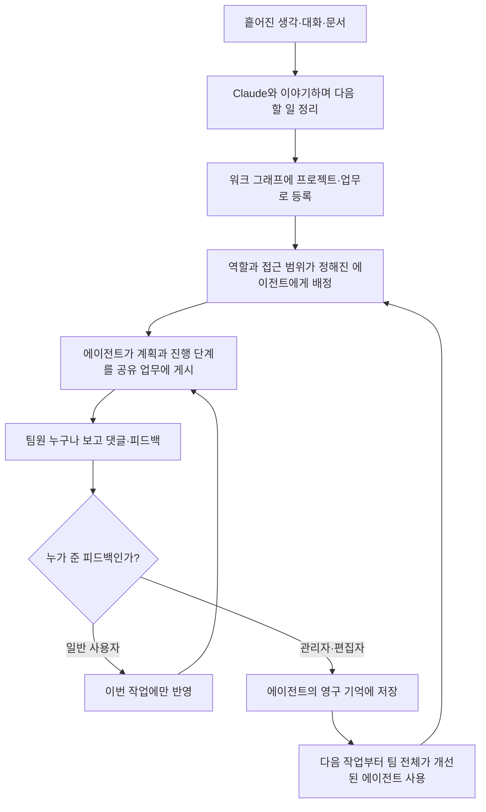

<aside class="ai-knowledge-sidebar">
  
CATEGORIES

  <nav class="ai-cat-tree">

에이전트 오케스트레이션18
<ul><li><a href="https://altjs4510.github.io/ai_news_blog/knowledge/20260930/" class="current">2026-09-30Agents you can coach: how Asana builds human-age…</a></li><li><a href="https://altjs4510.github.io/ai_news_blog/knowledge/20260908/">2026-09-08bytedance/deer-flow — 샌드박스·메모리·서브에이전트·메시지 게이트웨이를…</a></li><li><a href="https://altjs4510.github.io/ai_news_blog/knowledge/20260904/">2026-09-04HarnessDev: Can LLMs Create and Evolve Their Own…</a></li><li><a href="https://altjs4510.github.io/ai_news_blog/knowledge/20260831-openexecutive-virtual-c-suite/">2026-08-31Open Executive — 8명의 전문 에이전트를 하나의 임원 목소리로</a></li><li><a href="https://altjs4510.github.io/ai_news_blog/knowledge/20260828/">2026-08-28Google ADK for Python v2.8.0 — RemoteA2aAgent 네이…</a></li><li><a href="https://altjs4510.github.io/ai_news_blog/knowledge/20260826/">2026-08-26apache/maka — 도구 호출·권한 결정·종료 이벤트를 append-only 로그…</a></li><li><a href="https://altjs4510.github.io/ai_news_blog/knowledge/20260823/">2026-08-23The Evolution of the Agent Harness — 하네스가 모델 가중치…</a></li><li><a href="https://altjs4510.github.io/ai_news_blog/knowledge/20260805/">2026-08-05TencentCloud/TencentDB-Agent-Memory — 대화·문서·코드를 …</a></li><li><a href="https://altjs4510.github.io/ai_news_blog/knowledge/20260726/">2026-07-26citrolabs/ego-lite — 로그인된 브라우저 상태를 AI 에이전트와 공유하는…</a></li><li><a href="https://altjs4510.github.io/ai_news_blog/knowledge/20260725/">2026-07-25The new rules of context engineering for Claude …</a></li><li><a href="https://altjs4510.github.io/ai_news_blog/knowledge/20260717/">2026-07-17After a year building agent memory, 'save everyt…</a></li><li><a href="https://altjs4510.github.io/ai_news_blog/knowledge/20260623/">2026-06-23bytedance/deer-flow — 샌드박스·메모리·서브에이전트·메시지 게이트웨이를…</a></li><li><a href="https://altjs4510.github.io/ai_news_blog/knowledge/20260611/">2026-06-11The evolution of agentic surfaces: building with…</a></li><li><a href="https://altjs4510.github.io/ai_news_blog/knowledge/20260604/">2026-06-04chopratejas/headroom — Compress tool outputs bef…</a></li><li><a href="https://altjs4510.github.io/ai_news_blog/knowledge/20260602/">2026-06-02revfactory/harness — 도메인별 에이전트 팀과 스킬을 자동 설계하는 메타…</a></li><li><a href="https://altjs4510.github.io/ai_news_blog/knowledge/20260529/">2026-05-29Introducing dynamic workflows in Claude Code</a></li><li><a href="https://altjs4510.github.io/ai_news_blog/knowledge/20260507/">2026-05-07ruvnet/ruflo — Claude 멀티 에이전트 오케스트레이션 플랫폼</a></li><li><a href="https://altjs4510.github.io/ai_news_blog/knowledge/20260504/">2026-05-04Agents for Everything Else: Codex for Knowledge …</a></li></ul>

MCP &amp; 도구 통합16
<ul><li><a href="https://altjs4510.github.io/ai_news_blog/knowledge/20260829/">2026-08-29cursor/plugins — 플러그인 명세(specification)와 공식 플러그인…</a></li><li><a href="https://altjs4510.github.io/ai_news_blog/knowledge/20260802/">2026-08-02Stateless MCP has recaptured my interest (and in…</a></li><li><a href="https://altjs4510.github.io/ai_news_blog/knowledge/20260801/">2026-08-01different-ai/openwork — Claude Cowork의 오픈소스 대체 에…</a></li><li><a href="https://altjs4510.github.io/ai_news_blog/knowledge/20260731/">2026-07-31different-ai/openwork — Claude Cowork의 오픈소스 대안(o…</a></li><li><a href="https://altjs4510.github.io/ai_news_blog/knowledge/20260729/">2026-07-29Bringing MCP 2026-07-28 to Claude</a></li><li><a href="https://altjs4510.github.io/ai_news_blog/knowledge/20260718/">2026-07-18tirth8205/code-review-graph — MCP·CLI용 로컬 코드 인텔리…</a></li><li><a href="https://altjs4510.github.io/ai_news_blog/knowledge/20260708/">2026-07-08Expanding Managed Agents in Gemini API: backgrou…</a></li><li><a href="https://altjs4510.github.io/ai_news_blog/knowledge/20260701/">2026-07-01Google OKF (Open Knowledge Format) — 벤더 중립 에이전트 …</a></li><li><a href="https://altjs4510.github.io/ai_news_blog/knowledge/20260618/">2026-06-18DeusData/codebase-memory-mcp — 158개 언어 코드베이스를 밀리…</a></li><li><a href="https://altjs4510.github.io/ai_news_blog/knowledge/20260603/">2026-06-03How Bad MCP design cost your Agent 5× more token…</a></li><li><a href="https://altjs4510.github.io/ai_news_blog/knowledge/20260526/">2026-05-26colbymchenry/codegraph — Pre-indexed code knowle…</a></li><li><a href="https://altjs4510.github.io/ai_news_blog/knowledge/20260523/">2026-05-23colbymchenry/codegraph — 사전 인덱싱된 코드 지식 그래프 MCP</a></li><li><a href="https://altjs4510.github.io/ai_news_blog/knowledge/20260520/">2026-05-20New in Claude Managed Agents: self-hosted sandbo…</a></li><li><a href="https://altjs4510.github.io/ai_news_blog/knowledge/20260517/">2026-05-17I gave my LLM 100,000+ tools — Lazy Discovery &a…</a></li><li><a href="https://altjs4510.github.io/ai_news_blog/knowledge/20260509/">2026-05-09How to connect 100 MCP servers without the conte…</a></li><li><a href="https://altjs4510.github.io/ai_news_blog/knowledge/20260506/">2026-05-06mksglu/context-mode — AI 코딩 에이전트용 컨텍스트 윈도우 최적화</a></li></ul>

코딩 에이전트39
<ul><li><a href="https://altjs4510.github.io/ai_news_blog/knowledge/20261007/">2026-10-07morluto/rea — 앱 동작부터 네이티브 바이너리까지 에이전트로 리버스 엔지니어링</a></li><li><a href="https://altjs4510.github.io/ai_news_blog/knowledge/20260920/">2026-09-20Claude Code 2.1.277 — CLAUDE.md가 없으면 AGENTS.md를 …</a></li><li><a href="https://altjs4510.github.io/ai_news_blog/knowledge/20260918/">2026-09-18alibaba/open-code-review — 결정론적 파이프라인 + LLM 에이전트…</a></li><li><a href="https://altjs4510.github.io/ai_news_blog/knowledge/20260917/">2026-09-17alibaba/open-code-review — 결정론적 파이프라인과 LLM 에이전트를…</a></li><li><a href="https://altjs4510.github.io/ai_news_blog/knowledge/20260916/">2026-09-16alibaba/open-code-review — 결정론적 파이프라인과 LLM Agent…</a></li><li><a href="https://altjs4510.github.io/ai_news_blog/knowledge/20260915/">2026-09-15alibaba/open-code-review — 결정적 파이프라인과 LLM 에이전트를 …</a></li><li><a href="https://altjs4510.github.io/ai_news_blog/knowledge/20260912/">2026-09-12Quoting Boris Cherny — 'Claude가 쓴 프로덕션 코드는 사람이 쓴…</a></li><li><a href="https://altjs4510.github.io/ai_news_blog/knowledge/20260910/">2026-09-10vastsa/PI-Desktop — Electron + Rust 호스트 코어 + 에이전…</a></li><li><a href="https://altjs4510.github.io/ai_news_blog/knowledge/20260906/">2026-09-06DietrichGebert/ponytail — 에이전트를 '방에서 가장 게으른 시니어 …</a></li><li><a href="https://altjs4510.github.io/ai_news_blog/knowledge/20260903/">2026-09-03pacifio/atlas — 여러 코딩 에이전트의 변경을 한곳에서 추적·질의하는 '에이…</a></li><li><a href="https://altjs4510.github.io/ai_news_blog/knowledge/20260901/">2026-09-01affaan-m/ECC — 스킬·본능·메모리·보안을 묶은 에이전트 하네스 성능 최적화 …</a></li><li><a href="https://altjs4510.github.io/ai_news_blog/knowledge/20260831-gitnexus-code-knowledge-graph/">2026-08-31GitNexus — 코드베이스를 지식그래프로 바꿔 에이전트에게 쥐어주기</a></li><li><a href="https://altjs4510.github.io/ai_news_blog/knowledge/20260822/">2026-08-22mattpocock/skills — Skills for Real Engineers (하…</a></li><li><a href="https://altjs4510.github.io/ai_news_blog/knowledge/20260820/">2026-08-20akitaonrails/ai-memory — 코딩 에이전트 CLI의 장기 메모리와 벤더…</a></li><li><a href="https://altjs4510.github.io/ai_news_blog/knowledge/20260819/">2026-08-19akitaonrails/ai-memory — 코딩 에이전트 CLI 간 장기 기억과 벤더…</a></li><li><a href="https://altjs4510.github.io/ai_news_blog/knowledge/20260814/">2026-08-14cathrynlavery/diagram-design — Claude Code용 에디토리…</a></li><li><a href="https://altjs4510.github.io/ai_news_blog/knowledge/20260811/">2026-08-11PrimeIntellect-ai/prime-agent — 장기 자율 실행을 전제로 설계…</a></li><li><a href="https://altjs4510.github.io/ai_news_blog/knowledge/20260810/">2026-08-10Auto mode is now the default in Claude Code for …</a></li><li><a href="https://altjs4510.github.io/ai_news_blog/knowledge/20260809/">2026-08-09PrimeIntellect-ai/prime-agent — 코딩 워크플로우·장기 자율 작…</a></li><li><a href="https://altjs4510.github.io/ai_news_blog/knowledge/20260808/">2026-08-08PrimeIntellect-ai/prime-agent — 코딩 워크플로우와 장시간 자율…</a></li><li><a href="https://altjs4510.github.io/ai_news_blog/knowledge/20260804/">2026-08-04esengine/DeepSeek-Reasonix — prefix-cache 안정성을 축…</a></li><li><a href="https://altjs4510.github.io/ai_news_blog/knowledge/20260728/">2026-07-28alibaba/open-code-review — 결정론적 파이프라인 + LLM 에이전트…</a></li><li><a href="https://altjs4510.github.io/ai_news_blog/knowledge/20260722/">2026-07-22tirth8205/code-review-graph — MCP·CLI용 로컬 우선 코드 …</a></li><li><a href="https://altjs4510.github.io/ai_news_blog/knowledge/20260721/">2026-07-21tirth8205/code-review-graph — 로컬 우선 코드 인텔리전스 그래프…</a></li><li><a href="https://altjs4510.github.io/ai_news_blog/knowledge/20260719/">2026-07-19tirth8205/code-review-graph — 로컬 우선 코드 인텔리전스 그래프…</a></li><li><a href="https://altjs4510.github.io/ai_news_blog/knowledge/20260714/">2026-07-14Graphify-Labs/graphify — 코드베이스를 질의 가능한 지식 그래프로 만…</a></li><li><a href="https://altjs4510.github.io/ai_news_blog/knowledge/20260707/">2026-07-07AI Hero Skills Catalog — 실무 엔지니어를 위한 재사용 가능한 판단 …</a></li><li><a href="https://altjs4510.github.io/ai_news_blog/knowledge/20260705/">2026-07-05openai/codex-plugin-cc — Claude Code에서 Codex를 위임…</a></li><li><a href="https://altjs4510.github.io/ai_news_blog/knowledge/20260626/">2026-06-26google-labs-code/design.md — 코딩 에이전트에게 디자인 시스템을 …</a></li><li><a href="https://altjs4510.github.io/ai_news_blog/knowledge/20260619/">2026-06-19Claude Code now supports artifacts</a></li><li><a href="https://altjs4510.github.io/ai_news_blog/knowledge/20260530/">2026-05-30Leonxlnx/taste-skill — AI에게 좋은 취향을 부여해 generic s…</a></li><li><a href="https://altjs4510.github.io/ai_news_blog/knowledge/20260528/">2026-05-28Building self-improving tax agents with Codex</a></li><li><a href="https://altjs4510.github.io/ai_news_blog/knowledge/20260524/">2026-05-24colbymchenry/codegraph — Pre-indexed code knowle…</a></li><li><a href="https://altjs4510.github.io/ai_news_blog/knowledge/20260521/">2026-05-21colbymchenry/codegraph — Pre-indexed code knowle…</a></li><li><a href="https://altjs4510.github.io/ai_news_blog/knowledge/20260515/">2026-05-15Clawdmeter — Claude Code 사용량을 데스크톱 대시보드로</a></li><li><a href="https://altjs4510.github.io/ai_news_blog/knowledge/20260512/">2026-05-12agentmemory — Persistent memory for AI coding ag…</a></li><li><a href="https://altjs4510.github.io/ai_news_blog/knowledge/20260510/">2026-05-10addyosmani/agent-skills — Production-grade engin…</a></li><li><a href="https://altjs4510.github.io/ai_news_blog/knowledge/20260508/">2026-05-08addyosmani/agent-skills — Production-grade engin…</a></li><li><a href="https://altjs4510.github.io/ai_news_blog/knowledge/20260505/">2026-05-05mattpocock/skills — Skills for Real Engineers (.…</a></li></ul>

모델 &amp; 연구8
<ul><li><a href="https://altjs4510.github.io/ai_news_blog/knowledge/20260929/">2026-09-29vectorize-io/hindsight — Hindsight: Agent Memory…</a></li><li><a href="https://altjs4510.github.io/ai_news_blog/knowledge/20260907-voicemem-dual-brain-memory/">2026-09-07VoiceMem — 좌뇌·우뇌로 쪼갠 스트리밍 메모리로 음성 에이전트 지연 없애기</a></li><li><a href="https://altjs4510.github.io/ai_news_blog/knowledge/20260821/">2026-08-21volcengine/OpenViking — 에이전트 메모리·Knowledge RAG·스…</a></li><li><a href="https://altjs4510.github.io/ai_news_blog/knowledge/20260716-proprag/">2026-07-16PropRAG — 프로포지션 경로 위 beam search로 멀티홉 검색 안내</a></li><li><a href="https://altjs4510.github.io/ai_news_blog/knowledge/20260712/">2026-07-12Do Automated Evals Work?</a></li><li><a href="https://altjs4510.github.io/ai_news_blog/knowledge/20260620/">2026-06-20zai-org/GLM-5 — From Vibe Coding to Agentic Engi…</a></li><li><a href="https://altjs4510.github.io/ai_news_blog/knowledge/20260516/">2026-05-16STALE — 에이전트가 자기 기억의 유효성을 인지할 수 있는가</a></li><li><a href="https://altjs4510.github.io/ai_news_blog/knowledge/20260513/">2026-05-13Thinking Machines' Native Interaction Models — T…</a></li></ul>

인프라 &amp; 컴퓨트10
<ul><li><a href="https://altjs4510.github.io/ai_news_blog/knowledge/20260909/">2026-09-09Reducing cost and improving performance with Cla…</a></li><li><a href="https://altjs4510.github.io/ai_news_blog/knowledge/20260905/">2026-09-05magnitudedev/magnitude — 하드웨어에 맞는 최적 로컬 모델을 띄워 이…</a></li><li><a href="https://altjs4510.github.io/ai_news_blog/knowledge/20260813/">2026-08-13semantica-agi/semantica — 컨텍스트와 책임 추적을 위한 그래프 네이…</a></li><li><a href="https://altjs4510.github.io/ai_news_blog/knowledge/20260806/">2026-08-06cloudflare/computer — 에이전트에게 컴퓨터를 통째로 주는 엣지 실행 샌…</a></li><li><a href="https://altjs4510.github.io/ai_news_blog/knowledge/20260724/">2026-07-24diegosouzapw/OmniRoute — 단일 엔드포인트로 278+ 프로바이더·50…</a></li><li><a href="https://altjs4510.github.io/ai_news_blog/knowledge/20260723/">2026-07-23diegosouzapw/OmniRoute — 268+ 프로바이더를 단일 엔드포인트로 묶…</a></li><li><a href="https://altjs4510.github.io/ai_news_blog/knowledge/20260610/">2026-06-10Fable 5 just made cost-aware model routing manda…</a></li><li><a href="https://altjs4510.github.io/ai_news_blog/knowledge/20260606/">2026-06-06chopratejas/headroom — Compress tool outputs, lo…</a></li><li><a href="https://altjs4510.github.io/ai_news_blog/knowledge/20260605/">2026-06-05chopratejas/headroom — Compress tool outputs, lo…</a></li><li><a href="https://altjs4510.github.io/ai_news_blog/knowledge/20260522/">2026-05-22Giving Agents Computers — Ivan Burazin, Daytona</a></li></ul>

보안 &amp; 거버넌스26
<ul><li><a href="https://altjs4510.github.io/ai_news_blog/knowledge/20261004/">2026-10-04Apple says it's tightening macOS 'Full Disk Acce…</a></li><li><a href="https://altjs4510.github.io/ai_news_blog/knowledge/20261003/">2026-10-03NVIDIA/OpenShell — 자율 AI 에이전트를 위한 안전하고 프라이빗한 런타임…</a></li><li><a href="https://altjs4510.github.io/ai_news_blog/knowledge/20261002/">2026-10-02NVIDIA/OpenShell — 자율 AI 에이전트를 위한 안전하고 프라이빗한 런타임…</a></li><li><a href="https://altjs4510.github.io/ai_news_blog/knowledge/20261001/">2026-10-01NVIDIA/OpenShell</a></li><li><a href="https://altjs4510.github.io/ai_news_blog/knowledge/20260919/">2026-09-19cloudflare/security-audit-skill — 다단계 보안 감사를 '독립…</a></li><li><a href="https://altjs4510.github.io/ai_news_blog/knowledge/20260913/">2026-09-13OpenAI agents attacked RubyGems back in May: Ope…</a></li><li><a href="https://altjs4510.github.io/ai_news_blog/knowledge/20260902/">2026-09-02AIR raises $50M to help companies vet the skills…</a></li><li><a href="https://altjs4510.github.io/ai_news_blog/knowledge/20260827/">2026-08-27Claude in Chrome is generally available</a></li><li><a href="https://altjs4510.github.io/ai_news_blog/knowledge/20260819-mind-viruses/">2026-08-19탈옥도, 인젝션도 없이 — 대화로만 퍼지는 에이전트의 '마인드 바이러스'</a></li><li><a href="https://altjs4510.github.io/ai_news_blog/knowledge/20260812/">2026-08-12semantica-agi/semantica — 컨텍스트와 '책임 추적 가능한(accou…</a></li><li><a href="https://altjs4510.github.io/ai_news_blog/knowledge/20260730/">2026-07-30Anatomy of a Frontier Lab Agent Intrusion: A Tec…</a></li><li><a href="https://altjs4510.github.io/ai_news_blog/knowledge/20260716/">2026-07-16Dicklesworthstone/destructive_command_guard — 에이…</a></li><li><a href="https://altjs4510.github.io/ai_news_blog/knowledge/20260715/">2026-07-15Dicklesworthstone/destructive_command_guard — 에이…</a></li><li><a href="https://altjs4510.github.io/ai_news_blog/knowledge/20260710/">2026-07-1070개 MCP 서버 strace 런타임 감사 — 부팅 시 아웃바운드 호출 서버 적발</a></li><li><a href="https://altjs4510.github.io/ai_news_blog/knowledge/20260704/">2026-07-04Cloudflare is about to block AI agents by defaul…</a></li><li><a href="https://altjs4510.github.io/ai_news_blog/knowledge/20260703/">2026-07-03Giving admins more visibility and control over C…</a></li><li><a href="https://altjs4510.github.io/ai_news_blog/knowledge/20260630/">2026-06-30Introducing the Claude apps gateway for Amazon B…</a></li><li><a href="https://altjs4510.github.io/ai_news_blog/knowledge/20260625/">2026-06-25Agent identity in Claude Tag: a new access model…</a></li><li><a href="https://altjs4510.github.io/ai_news_blog/knowledge/20260624/">2026-06-24Agent identity in Claude Tag: a new access model…</a></li><li><a href="https://altjs4510.github.io/ai_news_blog/knowledge/20260617/">2026-06-17Predicting model behavior before release by simu…</a></li><li><a href="https://altjs4510.github.io/ai_news_blog/knowledge/20260614/">2026-06-14NVIDIA/SkillSpector — Security scanner for AI ag…</a></li><li><a href="https://altjs4510.github.io/ai_news_blog/knowledge/20260613/">2026-06-13Fable 5's guardrails got bypassed in 48 hours — …</a></li><li><a href="https://altjs4510.github.io/ai_news_blog/knowledge/20260612/">2026-06-12NVIDIA/SkillSpector — AI 에이전트 스킬용 보안 스캐너</a></li><li><a href="https://altjs4510.github.io/ai_news_blog/knowledge/20260607/">2026-06-07OpenAI Help: Lockdown Mode</a></li><li><a href="https://altjs4510.github.io/ai_news_blog/knowledge/20260531/">2026-05-31How we contain Claude across products</a></li><li><a href="https://altjs4510.github.io/ai_news_blog/knowledge/20260527/">2026-05-27Microsoft Copilot Cowork Exfiltrates Files</a></li></ul>

응용 사례5
<ul><li><a href="https://altjs4510.github.io/ai_news_blog/knowledge/20261006/">2026-10-06How Cresta turned CX expertise into an agent bui…</a></li><li><a href="https://altjs4510.github.io/ai_news_blog/knowledge/20260709/">2026-07-09mvanhorn/last30days-skill — Reddit·X·YouTube·HN·…</a></li><li><a href="https://altjs4510.github.io/ai_news_blog/knowledge/20260621/">2026-06-21calesthio/OpenMontage — 12 파이프라인·52 도구·500+ 스킬을 …</a></li><li><a href="https://altjs4510.github.io/ai_news_blog/knowledge/20260609/">2026-06-09Building intelligent apps for Apple platforms wi…</a></li><li><a href="https://altjs4510.github.io/ai_news_blog/knowledge/20260514/">2026-05-14Introducing Claude for Small Business</a></li></ul>

산업 동향7
<ul><li><a href="https://altjs4510.github.io/ai_news_blog/knowledge/20260911/">2026-09-11Now everyone can put data to work — ChatGPT Work…</a></li><li><a href="https://altjs4510.github.io/ai_news_blog/knowledge/20260907-humanmade-52week-rhythm/">2026-09-07휴먼 메이드의 '52주 리듬' — 아이디어가 흔해진 시대에 값이 오르는 건 버리는 판단</a></li><li><a href="https://altjs4510.github.io/ai_news_blog/knowledge/20260830/">2026-08-30[AINews] OpenAI shuts off Cursor — 프론티어 모델 공급 차단…</a></li><li><a href="https://altjs4510.github.io/ai_news_blog/knowledge/20260711/">2026-07-11OpenAI says GPT 5.6 is the 'preferred model' for…</a></li><li><a href="https://altjs4510.github.io/ai_news_blog/knowledge/20260702/">2026-07-02How Cursor deploys AI inside the enterprise (For…</a></li><li><a href="https://altjs4510.github.io/ai_news_blog/knowledge/20260616/">2026-06-16Why AI hasn't replaced software engineers, and w…</a></li><li><a href="https://altjs4510.github.io/ai_news_blog/knowledge/20260519/">2026-05-19Anthropic acquires Stainless</a></li></ul>
</nav>
</aside>

<article class="ai-knowledge-article">

<header class="ai-post-hero">
  
<a class="ai-back" href="../">KNOWLEDGE</a> · 2026-09-30 · 오늘의 학습

  <h2 class="ai-post-title">Agents you can coach: how Asana builds human-agent teams with Claude</h2>
</header>

> 원문: [Agents you can coach: how Asana builds human-agent teams with Claude](https://claude.com/blog/agents-you-can-coach-how-asana-builds-human-agent-teams-with-claude)

## 📌 학습 정리

### 1. 한 줄로 말하면

Asana는 AI 에이전트를 "알아서 다 하는 자동 기계"로 두지 않았어요. 사람들이 같은 업무 공간에서 일하는 모습을 지켜보고 조언을 건네며 점점 키워 가는 새 팀원처럼 다뤄요.

### 2. 왜 이게 만들어졌어요?

Asana는 AI 에이전트가 나오기 훨씬 전부터 팀이 함께 일하는 방식에 구조와 책임을 담으려고 여러 시도를 해 왔어요. 그 결과로 만든 것이 모든 업무·프로젝트·목표·대화를 담당자와 선후 관계로 엮은 '워크 그래프(Work Graph)'예요. 에이전트를 만들기 시작했을 때, Asana는 AI 전용 구조를 새로 만들지 않았어요. 대신 사람이 일하는 이 틀 안에 에이전트도 그대로 들어오게 했어요.

이유는 원문에 나온 불편에서 짐작할 수 있어요. AI를 잘 쓰는 한 사람이 혼자 대화해서 좋은 결과물을 뽑아 슬랙에 올린다고 해 볼게요. 다른 검토자들은 어떤 지시(프롬프트)가 오갔는지 알 수 없어요. 그래서 방향이 마음에 들지 않아도 의견을 맞추기가 어려워요. 게다가 개인이 그때그때 준 피드백은 흩어져 사라지기 쉬워요. 팀의 요청, 반론, 결과물, 그리고 에이전트가 배운 것을 한곳에 남기려는 고민에서 이 방식이 나왔어요.

### 3. 비유로 풀면

이건 마치 **새로 들어온 인턴을 팀 공용 게시판에서 키우는 것** 같은 거예요. 인턴에게는 맡을 역할과 들어갈 수 있는 폴더가 정해져 있어요. 인턴은 일할 때 "이렇게 조사하고, 이 순서로 진행했어요"라고 게시판에 남겨요. 팀원 누구나 그 글을 보고 "여기는 이렇게 바꿔 줘"라고 댓글을 달 수 있어요.

다만 **팀의 공식 업무 매뉴얼을 고칠 수 있는 사람은 사수 한두 명뿐**이에요. 다른 팀원의 코멘트는 그 일에만 적용되고, 사수가 "앞으로도 이렇게 하자"고 정해야 매뉴얼에 들어가요.

그래서 결국, 에이전트를 매 순간 승인하며 감시하기보다는 **모두가 보는 곳에서 계속 코칭하고, 그중 남길 만한 교훈만 정해진 사람이 기억에 새겨 넣는** 구조예요.

### 4. 어떻게 작동하는지 (그림으로)

먼저 사람이 머릿속 아이디어나 대화, 문서를 Claude와 함께 정리해서 워크 그래프에 할 일로 올려요. 그러면 역할과 권한이 정해진 에이전트가 그 일을 맡아요. 에이전트는 무엇을 어떤 순서로 했는지 모두가 볼 수 있는 곳에 남기고, 팀원들은 그걸 보며 방향을 조정해요.

피드백은 두 갈래로 나뉘어요. 일반 사용자의 피드백은 지금 하는 작업에만 쓰여요. 관리자·편집자가 저장한 피드백은 에이전트의 기억으로 남아서 다음 작업부터 팀 전체에 적용돼요.

### 5. 처음 보는 용어 풀이

- **AI 팀원 / 에이전트 (AI teammate / agent)**: 사람이 맡긴 일을 스스로 여러 단계로 처리하는 AI예요. Asana에서는 콘텐츠 작가, 인사이트 분석가, 프로젝트 매니저처럼 역할을 붙여 동료처럼 배정해요.
- **워크 그래프 (Work Graph)**: Asana가 만든 업무 지도예요. 모든 업무·프로젝트·목표·대화가 담당자, 참여자, 선후 관계로 연결돼 있어요. 사람과 에이전트가 같은 지도를 보고 일하게 해 줘요.
- **공유 기억 (shared memory)**: 에이전트가 이전에 받은 지시를 기억해 두는 공간이에요. 여러 사람이 이 기억을 함께 써서 일을 더 빨리 끝낼 수 있어요. 다만 영구 기억에 새로 넣거나, 되돌리거나, 지우는 일은 관리자·편집자만 할 수 있어요.
- **접근 권한 제어 (access controls)**: 에이전트가 어떤 프로젝트와 문서를 읽고 어떤 앱을 쓸 수 있는지 미리 정하는 장치예요. Asana에서는 에이전트가 실제로 볼 수 있는 범위가 에이전트를 부른 사람의 권한을 넘지 않도록 한 번 더 제한해요.
- **스킬 (skills)**: 에이전트가 특정 업무를 어떻게 해내는지 미리 담아 둔 작업 요령이에요. Asana는 고객들이 그 일을 실제로 어떻게 하는지 조사해서 이 요령을 만들어 넣었다고 해요.
- **연동 (integrations)**: 에이전트가 HubSpot(고객 관리 도구) 같은 외부 서비스나 문서 저장소에 연결해서 일할 수 있게 해 주는 연결 고리예요.
- **MCP 서버 (MCP server)**: Claude 같은 AI 비서가 다른 서비스의 데이터를 읽을 수 있도록 이어 주는 연결 창구예요. 이 덕분에 경영진이 Command 화면을 따로 열지 않고 Claude에게 개발 일정이 순조로운지 물어볼 수 있어요.

### 6. 한 발 더 들어가고 싶다면

- [Building effective human agent teams](https://claude.com/blog/building-effective-human-agent-teams): 이 시리즈의 첫 글이에요. 사람-에이전트 팀에 필요한 세 가지 능력(지속되는 기억, 에이전트 전용 인증 정보, 공유 맥락)을 Anthropic이 어떻게 정리했는지 볼 수 있어요.
- [Turning conversation into knowledge: how Slack builds human-agent teams](https://claude.com/blog/turning-conversation-into-knowledge-how-slack-builds-human-agent-teams): 시리즈의 두 번째 글이에요. 슬랙이 업무 대화를 에이전트가 쓸 수 있는 맥락으로 바꾸는 방법과, 에이전트가 채널에 작업 내용을 투명하게 올리는 방식을 볼 수 있어요.

---

## 📖 원문 전체 번역 (정독용)

> 의역 최소화한 전체 번역입니다. 큰 흐름은 위 정리에서 잡고, 정확한 워딩이 필요할 땐 이 섹션에서 정독하세요.

_이 글은 인간-에이전트 팀 구축에 관한 시리즈의 세 번째 글입니다._ [_첫 번째 글_](https://claude.com/blog/building-effective-human-agent-teams)_에서는 Anthropic에서 멀티플레이어 AI를 다루며 배운 점을 공유했고,_ [_두 번째 글_](https://claude.com/blog/turning-conversation-into-knowledge-how-slack-builds-human-agent-teams)_에서는 Slack이 업무 대화를 에이전트에 필요한 컨텍스트로 바꾸는 방법을 공유했습니다. 이번 글에서는 팀이 일하는 바로 그 플랫폼 위에서 에이전트가 일할 때 무엇이 달라지는지를 살펴봅니다._

Asana의 팀들은 AI 에이전트를 도입하기 수년 전부터, 팀이 함께 일하는 방식에 구조와 책임성(accountability)을 녹여 넣는 방법을 반복적으로 실험해 왔습니다. 그 결과 만들어진 것이 Work Graph® 모델입니다. 이 모델은 모든 작업(task), 프로젝트, 목표, 대화를 관계의 网으로 연결해 매핑하며, 각각에 소유자(owner), 기여자(contributor), 의존 관계(dependency)를 정의합니다.

AI 에이전트를 만들기 시작하면서 Asana는 AI를 위한 새로운 컨텍스트 구조를 추가하는 대신, 에이전트가 이와 같은 모델 안에서 일하도록 하기로 했습니다. 에이전트는 정의된 역할을 갖고, 작업을 할당받고, 메시지를 읽고 쓰며, 사람 협업자와 나란히 활동 피드(activity feed)에 나타납니다. 다만 에이전트가 무엇에 접근하고 무엇을 공유할 수 있는지에 대해서는 추가적인 안전장치가 있습니다.

우리는 Asana의 최고제품책임자(CPO)인 Arnab Bose와 이야기를 나눴습니다. Asana 내부 팀들이 Claude를 어떻게 사용하고 이 에이전트들과 어떻게 함께 일하는지, Claude 모델이 복잡한 작업을 어떻게 구동하는지, 각 에이전트가 역할과 접근 권한을 어떻게 얻는지, 누가 에이전트를 훈련시키는지, 작업이 모두에게 어떻게 보이도록 유지되는지, 그리고 Asana의 인간-에이전트 팀에서 에이전트가 맡는 업무의 유형은 무엇인지에 대해서입니다.

## 에이전트가 행동하기 전에 업무를 먼저 생각하고 구조화하세요

Asana 직원들에게 Claude는 기본 AI 도구이며, Google Drive, Slack, 그리고 물론 Asana를 포함해 직원들이 일하는 데 쓰는 플랫폼들과 연결되어 있습니다.

Arnab은 이렇게 말합니다. "사람은 구조화되지 않은 데이터를 가지고 자기 하루를 이해합니다. 자신이 가진 아이디어, Slack에서 나눈 대화, Zoom 회의 녹화, Databricks 리포트, Google Docs의 정보 같은 것들이죠. 그런 것들을 Claude와 함께 이야기로 풀어본 다음, 그 모든 것을 Asana가 프로젝트와 작업으로 제공하는 구조 안에 쏟아 넣을 수 있습니다." 구조가 갖춰지면 에이전트는 그 위에서 행동할 수 있으며, 여기에는 이 시리즈의 첫 번째 글 [_효과적인 인간-에이전트 팀 구축하기_](https://claude.com/blog/building-effective-human-agent-teams)에서 설명한 세 가지 역량, 즉 영속적 메모리(persistent memory), 자체 자격 증명(credentials), 공유 컨텍스트(shared context)가 활용됩니다.

**실무에 적용하는 방법:**

*   **자신의 아이디어에서 시작하세요.** 하루 중 구조화되지 않은 조각들, 즉 아이디어, Slack 대화, 여러 문서에 흩어진 메모를 Claude에게 가져가세요.
*   **Claude와 논쟁하고 토론하세요.** Claude를 사고의 파트너로 삼아, 다음 단계가 분명해질 때까지 아이디어를 이야기로 풀어보세요.
*   **실행 가능한 항목을 Work Graph에 기록하세요.** 실행 가능한 것들을 프로젝트와 작업으로 옮겨, 에이전트와 동료들이 이어받을 수 있게 하세요.

## 모든 에이전트에게 역할과, 필요한 도구 및 접근 권한을 부여하세요

Asana 직원들은 사람 동료와 일하듯 어떤 프로젝트에서든 AI 에이전트와 함께 일할 수 있습니다. 사람이 자신이 속한 팀을 설계하며, 각 직원은 팀의 목표를 보강하는 데 쓸 수 있는 추천 에이전트 목록을 받습니다.

에이전트는 역할 또는 업무 유형을 중심으로 만들어집니다. 예를 들어 콘텐츠 작성자, 인사이트 분석가, 프로젝트 매니저, 업무 접수(work intake) 담당자, 캠페인 분석가, 캠페인 코디네이터 등이 있습니다. 각 에이전트는 고객이 해당 업무를 수행하는 방식에 대한 Asana의 조사에 기반한 사전 구축 스킬(skill)과, Hubspot이나 문서 드라이브처럼 필요한 통합(integration)을 함께 갖추고 있습니다.

각 에이전트에는 프로필 페이지도 있는데, 여기에는 에이전트의 이름과 목적, 사용할 수 있는 사람들, 관리자, 지침(instructions), 스킬, 통합, 권한이 나열됩니다. Asana는 접근을 의도적으로 설정할 수 있는 도구를 제공합니다. Arnab은 "Asana는 통제된(contained) 작업 공간입니다"라며 이렇게 말합니다. "전체가 아니라 특정 프로젝트 집합에만, 또는 특정 문서 집합에만, 혹은 문서와 앱의 조합에만 접근 권한을 부여하도록 선택할 수 있습니다."

사람 사용자와 마찬가지로 에이전트도 명시적인 접근 제어를 받지만, 추가적인 안전장치가 하나 더 있습니다. Asana에 따르면 에이전트의 실질적 접근 범위는 그 에이전트를 작동시킨(trigger) 사람의 권한에 의해 제한됩니다. 이 덕분에 에이전트는 공개 콘텐츠에는 폭넓게 접근할 수 있으면서도, 에이전트가 비공개 맥락에서 학습한 정보에 누군가 접근하게 될 위험은 최소화됩니다.

**실무에 적용하는 방법:**

*   **에이전트를 만들기 전에 역할부터 정의하세요.** 팀에서 에이전트가 할 수 있는 업무의 유형을 생각해 본 다음, 신입 사원의 첫 분기를 설계할 때처럼 에이전트의 목적, 지침, 그리고 에이전트가 책임지는 구체적인 업무를 적어 두세요.
*   **접근 범위를 한정하세요.** 에이전트가 읽을 수 있는 프로젝트와 문서, 접근할 수 있는 애플리케이션, 수행할 수 있는 행동을 정하세요.
*   **사용자와 관리자를 별도로 지정하세요.** 많은 사람이 에이전트와 함께 일할 수 있지만, 에이전트가 무엇에 접근하고 어떻게 행동할지를 통제하는 것은 지정된 소수의 그룹이어야 합니다.

## 에이전트와 함께 일하는 것과 에이전트를 훈련시키는 것을 분리하세요

Asana가 AI 팀원(AI teammates)이라고 부르는 Asana 에이전트의 핵심 기능은 공유 메모리(shared memory)입니다. 이를 통해 에이전트는 이전 지시 사항의 정보를 유지할 수 있고, 여러 사용자가 그 메모리를 재사용해 작업이나 업무를 더 빠르게 완료할 수 있습니다. Arnab은 "AI 팀원은 팀의 한 사람인 것처럼 코칭하고 훈련시킬 수 있습니다"라고 말합니다.

공유 메모리가 작동하는 방식에는 역할 기반의 제한이 하나 있습니다. 누구나 작업에 대해 에이전트에게 피드백을 줄 수 있지만, 그 피드백을 영구 메모리에 반영(commit)하거나 그 메모리를 되돌리거나 삭제할 수 있는 것은 관리자(admin)와 편집자(editor)뿐입니다. 그 밖의 사람이 제공한 피드백은 현재 작업에만 적용됩니다.

Arnab은 이 구분이 의도된 것이라고 말합니다. Asana의 커뮤니케이션 팀이 회사의 목소리와 어조(voice and tone)를 주도하므로, 글을 쓰는 에이전트의 편집자와 관리자는 이 팀이 됩니다. Arnab은 그 에이전트와 함께 초안을 작성할 수는 있지만, 에이전트의 행동을 수정할 수는 없습니다. 그리고 대부분의 사람은 그 내부 장치를 전혀 건드릴 필요가 없습니다. "팀원 모두가 스킬, 행동, 메모리 같은 개념을 이해할 필요는 없습니다. 팀에서 한두 사람이 전문가가 되어 제대로 설정해 두면, 팀의 나머지 모든 사람이 앞으로 같은 혜택을 얻게 됩니다."

**실무에 적용하는 방법:**

*   **각 에이전트를 누가 훈련시키고 누가 함께 일할지 정하세요.** 팀이 사용하는 에이전트를 구축하는 데 도움을 줄 수 있는 사내 분야 전문가(subject matter expert)를 파악하세요. 그 외의 모든 사람은 작업에 대한 피드백을 줄 수는 있지만, 에이전트를 다시 쓸 수는 없습니다.
*   **편집자를 전문성에 맞추세요.** 브랜드 보이스나 기획 규칙처럼 에이전트가 적용하는 기준을 소유한 팀이 그 에이전트를 소유(또는 관리)합니다.
*   **일하면서 메모리를 쌓아 가세요.** 피드백은 시간이 지나며 에이전트를 개선할 수 있습니다. 간직할 가치가 있는 결정은 기억하도록 에이전트에게 요청하고, 더 이상 유효하지 않거나 사실이 아닌 것은 삭제하세요.

## 에이전트의 작업을 모두가 볼 수 있는 곳에 두세요

[Slack의 에이전트가 채널에서 투명하게 게시하는 방식](https://claude.com/blog/turning-conversation-into-knowledge-how-slack-builds-human-agent-teams)과 비슷하게, 작업이 AI 팀원에게 할당되면 모든 사람이 에이전트가 그 일을 하고 있다는 것과 무엇을 하는지를 볼 수 있습니다. 에이전트는 조사 계획과 수행한 단계를 포함한 활동을 게시하므로, 해당 작업에 접근할 수 있는 모든 사람이 에이전트가 한 일을 읽고, 댓글을 달고, 원하는 결과 쪽으로 유도할 수 있습니다.

Asana의 커뮤니케이션 팀이 Arnab에게 강연용 브리핑 문서를 검토해 달라고 요청했을 때, 그는 해당 작업에서 에이전트를 @멘션하고 이전 강연에서 썼던 자신의 발표 흐름(talk track)도 함께 고려해 달라고 요청했습니다. 그는 그 에이전트를 여러 번 사용해 본 데다 참조한 자료가 이미 Work Graph에 있었기 때문에 메시지는 짧았습니다. 커뮤니케이션 팀의 동료는 그의 요청과 에이전트의 응답을 볼 수 있었고, 동시에 에이전트와 대화를 주고받을 수 있었습니다.

Arnab은 이렇게 말합니다. "AI에 매우 능숙하다면 일대일로 쓰는 AI 에이전트에서도 아마 훌륭한 품질의 응답을 얻을 수 있을 겁니다. 그 문서를 꺼내서 Slack이나 Asana에 다시 게시하면 되죠. 하지만 그 시점에는 그 콘텐츠를 검토하는 다른 사람들이 프롬프트가 무엇이었는지, 어떤 대화가 오갔는지 알지 못합니다. 당신이 준 지침 중 일부에 동의하지 않더라도, 그들이 그것에 대해 서로 의견을 맞추는 건 불가능합니다." 공유 작업에서는 요청, 반박, 산출물이 한곳에 있으며, 산출물을 검토하는 사람들이 그 산출물을 만들어 낸 지침을 수정할 수도 있습니다.

**실무에 적용하는 방법**

*   **팀이 작업을 검토하는 곳에 에이전트를 들이세요.** 이렇게 하면 요청, 에이전트의 단계, 결과가 한곳에 있게 되고, 검토자가 지침이나 산출물을 바꿀 수 있습니다.
*   **에이전트의 작업이 눈에 띄게 에이전트의 작업임을 드러내세요.** 이렇게 하면 사람들이 그 일이 사람 동료가 아니라 AI 에이전트에 의해 이루어지고 있음을 알게 됩니다.
*   **검토자가 에이전트의 작업을 코칭할 수 있게 하세요.** Asana의 에이전트는 공유 작업에 자신의 계획과 단계를 게시하므로, 다른 검토자들이 추가 지침이나 피드백을 줄 수 있습니다.

## Asana가 에이전트에게 맡긴 세 가지 업무

Asana에서 문서를 생성하거나 복잡한 작업을 수행하는 모든 에이전트 업무는 Claude가 구동합니다. 다음은 회사 내 여러 팀의 세 가지 사례입니다.

### **Slack 채널에서 제품 질문에 답하기**

Asana가 기능을 출시하면, 영업 담당자와 고객 성공(customer success) 직원들은 공유 Slack 채널에서 질문할 수 있습니다. AI 팀원이 생기기 전에는 같은 질문이 반복해서 올라왔고, 그때마다 분야 전문가가 @멘션되었습니다. Arnab은 답변이 미묘하고 계속 바뀌기 때문에 검색 가능한 지식 베이스는 현실적인 해법이 아니었다고 말합니다. 그는 "제품의 현재 상태가 무엇인지에 대해 어느 정도 취향을 가진 큐레이션(taste-making)이 필요합니다"라고 말합니다.

그런 질문은 여전히 Slack으로 갑니다. 현장에서 질문하기에 가장 간단한 곳이기 때문입니다. 이제는 채널에 있는 Asana 앱이 각 질문을 Asana 작업으로 바꾸고, 에이전트가 이를 받아 처리합니다. 승인된 안내(approved guidance)가 있으면 에이전트는 출처 링크와 함께 답변합니다. 승인된 답변이 없고 질문이 제품의 공백을 가리키는 경우, 에이전트는 제품 팀의 접수(intake) 프로젝트에 작업을 만들고 백로그에 추가합니다. 그리고 같은 질문이 계속 나오고 에이전트가 같은 기록을 계속 게시하게 되면, 교육 자료와 문서를 업데이트하도록 인에이블먼트(enablement) 팀에 작업을 만듭니다.

이 프로세스는 인에이블먼트 팀이 전략적이고 우선순위가 더 높은 업무에 집중할 수 있도록 귀중한 시간을 확보해 주는 동시에, 사업의 다른 영역에도 정보를 제공합니다. 예를 들어 신제품과 관련된 특정 주제에 질문이 많다면, 이는 인에이블먼트 팀이 추가 교육이나 정보로 그 주제에 집중해야 한다는 신호입니다.

### **갱신 위험(at-risk renewal) 고객에 대해 임원에게 브리핑하기**

Asana의 최고고객책임자(CCO)인 Josh Abdulla는 예전에 임원진을 위한 주간 갱신 위험 브리핑을 직접 만들었는데, 이는 갱신 위험 고객을 표시하고 상황이 바뀔 때마다 계정을 업데이트하는 고객 성공 매니저(CSM)들의 업데이트를 바탕으로 한 것이었습니다. 전 세계 수천 곳의 고객에 걸쳐 업데이트 양이 워낙 많아서, 이를 종합하는 전담 인력이 없으면 최신 상태를 유지하는 것이 불가능했고, 이는 지루한 작업이었으며 프로세스를 사후 대응적(reactive)으로 만들었습니다. Arnab은 "Josh는 데이터가 처음 문제를 보여줬을 때가 아니라, 리더들이 그에게 말해줬을 때 문제를 알게 됐습니다"라고 말합니다.

고객 경험(customer experience) 조직은 Asana에 At-Risk Renewal이라는 에이전트형 AI 팀원을 만들었습니다. 이 에이전트는 전 세계 포트폴리오에 걸친 모든 갱신 위험 작업을, 각 CSM의 업데이트, 상태 메모, 댓글까지 포함해 읽고, 긍정적 모멘텀, 부정적 모멘텀, 권장 후속 조치의 세 가지 묶음으로 정리된 구조화된 일일 다이제스트를 생성합니다. 먼저 글로벌 관점으로 실행한 다음 지역별로 나누며, 매일 아침 다이제스트를 최고고객책임자, 최고매출책임자(CRO), 그리고 모든 지역 고객 성공 리더에게 자동으로 전송합니다. 다이제스트가 공유 공간에 도착하기 때문에, 리더들은 특정 계정의 이탈(churn) 예측 뒤에 있던 선행 지표(leading indicator)가 무엇이었는지 같은 후속 질문을 할 수 있고, 다음 실행을 위해 기억해 둘 것을 에이전트에게 코칭할 수도 있어, 보고서는 매일 아침 나아집니다.

Arnab은 이렇게 말합니다. "그들이 각자 Claude에게 자기용 보고서를 생성하게 할 수도 있었을 겁니다. 하지만 어떻게 하면 보고서가 표준화되고, 공유 작업 공간이 있으며, 매 실행마다 계속 나아지는 지점에 도달할 수 있을까요?"

### **Command로 엔지니어링 사이클 계획하기**

Asana가 자사 제품에서 자동화된 코딩 루프를 돌렸을 때, 자동 생성된 변경 사항 때문에 사이클이 비대해지면서 사이클 시간과 릴리스가 지연되었습니다. 이 루프 자체는 소프트웨어 기업들에서 흔해졌습니다. 다양한 채널에서 고객 피드백을 모으고, 이를 종합한 뒤, 코딩 에이전트가 이를 풀 리퀘스트(PR)로 바꾸도록 트리거하는 방식입니다. Arnab은 "이제 코드 생성은 더 이상 병목이 아닙니다. 병목은 계획, 의사 결정, 그리고 다듬기(refinement)에 있습니다"라고 말합니다. Asana의 엔지니어링 조직은 이제 대규모 엔지니어링 팀을 관리하기 위한 제품인 Command by Asana 위에서 운영되며, 이를 사용해 그 루프를 관리합니다.

Command에서 팀 공간(team space)에는 하나의 제품을 작업하는 10~12명의 엔지니어 그룹이 있습니다. 에이전트는 고객 피드백과 Slack의 팀 피드백 채널 댓글에서 가져온 티켓으로 팀의 미계획(unplanned) 보드를 채웁니다. 그 보드에서 무엇을 사이클로 옮길지는 사람이 결정하며, Command는 낙관적, 균형적, 보수적 추정치로 사이클의 완료 시간을 예측합니다.

티켓은 사람에게도, 코딩 에이전트에게도 할당할 수 있으며, 사이클 데이터가 모두 한곳에 있기 때문에 매니저는 채팅에서 릴리스가 왜 궤도를 벗어났는지, 어떤 트레이드오프를 택하면 되돌릴 수 있는지 물을 수 있습니다. Command는 그 신호를 움직이는 요인이 무엇이고 어떤 변경을 맞바꿔야 하는지를 데이터에 근거해 답합니다. 이 모든 것은 Claude 같은 어시스턴트가 이를 읽을 수 있게 하는 연결인 Asana의 MCP 서버를 통해 노출되므로, Arnab이나 그의 CTO 카운터파트 같은 사람은 Command를 열지 않고도 Claude에게 무엇이 순조로운지 물을 수 있습니다.

Arnab은 이렇게 말합니다. "팀이 손쉽게 함께 일할 수 있을 때 인류는 번성하며, 오늘날 모든 팀은 일부는 사람이고 일부는 에이전트입니다. 그런 종류의 일을 위해 저희는 설계합니다. 사람과 에이전트가 모두 함께 사용할 수 있는 하나의 공유 컨텍스트, 에이전트의 기여와 접근 권한을 감사(audit)할 수 있도록 에이전트마다 부여된 고유한 정체성, 그리고 에이전트가 학습할 수 있는 것에 대한 지속적인 기록을 통해, 팀의 지식이 사라지지 않고 복리로 쌓이도록 하는 것입니다."

</article>

<!-- ai-related-links -->
<aside class="ai-related-links">
  
관련 학습

  <ul><li><a href="https://altjs4510.github.io/ai_news_blog/knowledge/20260611/">2026-06-11The evolution of agentic surfaces: building with…</a></li><li><a href="https://altjs4510.github.io/ai_news_blog/knowledge/20260624/">2026-06-24Agent identity in Claude Tag: a new access model…</a></li><li><a href="https://altjs4510.github.io/ai_news_blog/knowledge/20260605/">2026-06-05chopratejas/headroom — Compress tool outputs, lo…</a></li></ul>
</aside>
<!-- /ai-related-links -->
