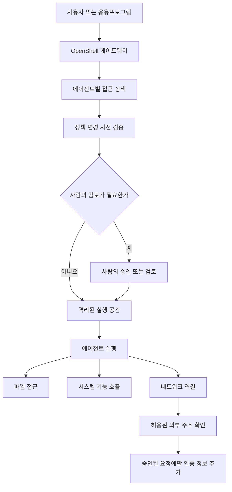

<div class="ai-knowledge-shell">

<aside class="ai-knowledge-sidebar">
  <p class="ai-eyebrow">CATEGORIES</p>
  <nav class="ai-cat-tree"><details class="ai-cat" open><summary><span class="catname">에이전트 오케스트레이션</span><span class="catcount">16</span></summary><ul><li><a href="https://altjs4510.github.io/ai_news_blog/knowledge/20260930/"><span class="kdate">2026-09-30</span><span class="ktitle">Agents you can coach: how Asana builds human-age…</span></a></li><li><a href="https://altjs4510.github.io/ai_news_blog/knowledge/20260908/"><span class="kdate">2026-09-08</span><span class="ktitle">bytedance/deer-flow — 샌드박스·메모리·서브에이전트·메시지 게이트웨이를…</span></a></li><li><a href="https://altjs4510.github.io/ai_news_blog/knowledge/20260904/"><span class="kdate">2026-09-04</span><span class="ktitle">HarnessDev: Can LLMs Create and Evolve Their Own…</span></a></li><li><a href="https://altjs4510.github.io/ai_news_blog/knowledge/20260831-openexecutive-virtual-c-suite/"><span class="kdate">2026-08-31</span><span class="ktitle">Open Executive — 8명의 전문 에이전트를 하나의 임원 목소리로</span></a></li><li><a href="https://altjs4510.github.io/ai_news_blog/knowledge/20260828/"><span class="kdate">2026-08-28</span><span class="ktitle">Google ADK for Python v2.8.0 — RemoteA2aAgent 네이…</span></a></li><li><a href="https://altjs4510.github.io/ai_news_blog/knowledge/20260823/"><span class="kdate">2026-08-23</span><span class="ktitle">The Evolution of the Agent Harness — 하네스가 모델 가중치…</span></a></li><li><a href="https://altjs4510.github.io/ai_news_blog/knowledge/20260805/"><span class="kdate">2026-08-05</span><span class="ktitle">TencentCloud/TencentDB-Agent-Memory — 대화·문서·코드를 …</span></a></li><li><a href="https://altjs4510.github.io/ai_news_blog/knowledge/20260726/"><span class="kdate">2026-07-26</span><span class="ktitle">citrolabs/ego-lite — 로그인된 브라우저 상태를 AI 에이전트와 공유하는…</span></a></li><li><a href="https://altjs4510.github.io/ai_news_blog/knowledge/20260717/"><span class="kdate">2026-07-17</span><span class="ktitle">After a year building agent memory, 'save everyt…</span></a></li><li><a href="https://altjs4510.github.io/ai_news_blog/knowledge/20260701/"><span class="kdate">2026-07-01</span><span class="ktitle">Google OKF (Open Knowledge Format) — 벤더 중립 에이전트 …</span></a></li><li><a href="https://altjs4510.github.io/ai_news_blog/knowledge/20260623/"><span class="kdate">2026-06-23</span><span class="ktitle">bytedance/deer-flow — 샌드박스·메모리·서브에이전트·메시지 게이트웨이를…</span></a></li><li><a href="https://altjs4510.github.io/ai_news_blog/knowledge/20260621/"><span class="kdate">2026-06-21</span><span class="ktitle">calesthio/OpenMontage — 12 파이프라인·52 도구·500+ 스킬을 …</span></a></li><li><a href="https://altjs4510.github.io/ai_news_blog/knowledge/20260611/"><span class="kdate">2026-06-11</span><span class="ktitle">The evolution of agentic surfaces: building with…</span></a></li><li><a href="https://altjs4510.github.io/ai_news_blog/knowledge/20260602/"><span class="kdate">2026-06-02</span><span class="ktitle">revfactory/harness — 도메인별 에이전트 팀과 스킬을 자동 설계하는 메타…</span></a></li><li><a href="https://altjs4510.github.io/ai_news_blog/knowledge/20260529/"><span class="kdate">2026-05-29</span><span class="ktitle">Introducing dynamic workflows in Claude Code</span></a></li><li><a href="https://altjs4510.github.io/ai_news_blog/knowledge/20260507/"><span class="kdate">2026-05-07</span><span class="ktitle">ruvnet/ruflo — Claude 멀티 에이전트 오케스트레이션 플랫폼</span></a></li></ul></details><details class="ai-cat" open><summary><span class="catname">MCP &amp; 도구 통합</span><span class="catcount">20</span></summary><ul><li><a href="https://altjs4510.github.io/ai_news_blog/knowledge/20260829/"><span class="kdate">2026-08-29</span><span class="ktitle">cursor/plugins — 플러그인 명세(specification)와 공식 플러그인…</span></a></li><li><a href="https://altjs4510.github.io/ai_news_blog/knowledge/20260820/"><span class="kdate">2026-08-20</span><span class="ktitle">akitaonrails/ai-memory — 코딩 에이전트 CLI의 장기 메모리와 벤더…</span></a></li><li><a href="https://altjs4510.github.io/ai_news_blog/knowledge/20260802/"><span class="kdate">2026-08-02</span><span class="ktitle">Stateless MCP has recaptured my interest (and in…</span></a></li><li><a href="https://altjs4510.github.io/ai_news_blog/knowledge/20260801/"><span class="kdate">2026-08-01</span><span class="ktitle">different-ai/openwork — Claude Cowork의 오픈소스 대체 에…</span></a></li><li><a href="https://altjs4510.github.io/ai_news_blog/knowledge/20260731/"><span class="kdate">2026-07-31</span><span class="ktitle">different-ai/openwork — Claude Cowork의 오픈소스 대안(o…</span></a></li><li><a href="https://altjs4510.github.io/ai_news_blog/knowledge/20260729/"><span class="kdate">2026-07-29</span><span class="ktitle">Bringing MCP 2026-07-28 to Claude</span></a></li><li><a href="https://altjs4510.github.io/ai_news_blog/knowledge/20260722/"><span class="kdate">2026-07-22</span><span class="ktitle">tirth8205/code-review-graph — MCP·CLI용 로컬 우선 코드 …</span></a></li><li><a href="https://altjs4510.github.io/ai_news_blog/knowledge/20260721/"><span class="kdate">2026-07-21</span><span class="ktitle">tirth8205/code-review-graph — 로컬 우선 코드 인텔리전스 그래프…</span></a></li><li><a href="https://altjs4510.github.io/ai_news_blog/knowledge/20260718/"><span class="kdate">2026-07-18</span><span class="ktitle">tirth8205/code-review-graph — MCP·CLI용 로컬 코드 인텔리…</span></a></li><li><a href="https://altjs4510.github.io/ai_news_blog/knowledge/20260708/"><span class="kdate">2026-07-08</span><span class="ktitle">Expanding Managed Agents in Gemini API: backgrou…</span></a></li><li><a href="https://altjs4510.github.io/ai_news_blog/knowledge/20260618/"><span class="kdate">2026-06-18</span><span class="ktitle">DeusData/codebase-memory-mcp — 158개 언어 코드베이스를 밀리…</span></a></li><li><a href="https://altjs4510.github.io/ai_news_blog/knowledge/20260605/"><span class="kdate">2026-06-05</span><span class="ktitle">chopratejas/headroom — Compress tool outputs, lo…</span></a></li><li><a href="https://altjs4510.github.io/ai_news_blog/knowledge/20260603/"><span class="kdate">2026-06-03</span><span class="ktitle">How Bad MCP design cost your Agent 5× more token…</span></a></li><li><a href="https://altjs4510.github.io/ai_news_blog/knowledge/20260526/"><span class="kdate">2026-05-26</span><span class="ktitle">colbymchenry/codegraph — Pre-indexed code knowle…</span></a></li><li><a href="https://altjs4510.github.io/ai_news_blog/knowledge/20260523/"><span class="kdate">2026-05-23</span><span class="ktitle">colbymchenry/codegraph — 사전 인덱싱된 코드 지식 그래프 MCP</span></a></li><li><a href="https://altjs4510.github.io/ai_news_blog/knowledge/20260520/"><span class="kdate">2026-05-20</span><span class="ktitle">New in Claude Managed Agents: self-hosted sandbo…</span></a></li><li><a href="https://altjs4510.github.io/ai_news_blog/knowledge/20260517/"><span class="kdate">2026-05-17</span><span class="ktitle">I gave my LLM 100,000+ tools — Lazy Discovery &a…</span></a></li><li><a href="https://altjs4510.github.io/ai_news_blog/knowledge/20260512/"><span class="kdate">2026-05-12</span><span class="ktitle">agentmemory — Persistent memory for AI coding ag…</span></a></li><li><a href="https://altjs4510.github.io/ai_news_blog/knowledge/20260509/"><span class="kdate">2026-05-09</span><span class="ktitle">How to connect 100 MCP servers without the conte…</span></a></li><li><a href="https://altjs4510.github.io/ai_news_blog/knowledge/20260506/"><span class="kdate">2026-05-06</span><span class="ktitle">mksglu/context-mode — AI 코딩 에이전트용 컨텍스트 윈도우 최적화</span></a></li></ul></details><details class="ai-cat" open><summary><span class="catname">코딩 에이전트</span><span class="catcount">36</span></summary><ul><li><a href="https://altjs4510.github.io/ai_news_blog/knowledge/20260920/"><span class="kdate">2026-09-20</span><span class="ktitle">Claude Code 2.1.277 — CLAUDE.md가 없으면 AGENTS.md를 …</span></a></li><li><a href="https://altjs4510.github.io/ai_news_blog/knowledge/20260918/"><span class="kdate">2026-09-18</span><span class="ktitle">alibaba/open-code-review — 결정론적 파이프라인 + LLM 에이전트…</span></a></li><li><a href="https://altjs4510.github.io/ai_news_blog/knowledge/20260917/"><span class="kdate">2026-09-17</span><span class="ktitle">alibaba/open-code-review — 결정론적 파이프라인과 LLM 에이전트를…</span></a></li><li><a href="https://altjs4510.github.io/ai_news_blog/knowledge/20260916/"><span class="kdate">2026-09-16</span><span class="ktitle">alibaba/open-code-review — 결정론적 파이프라인과 LLM Agent…</span></a></li><li><a href="https://altjs4510.github.io/ai_news_blog/knowledge/20260915/"><span class="kdate">2026-09-15</span><span class="ktitle">alibaba/open-code-review — 결정적 파이프라인과 LLM 에이전트를 …</span></a></li><li><a href="https://altjs4510.github.io/ai_news_blog/knowledge/20260912/"><span class="kdate">2026-09-12</span><span class="ktitle">Quoting Boris Cherny — 'Claude가 쓴 프로덕션 코드는 사람이 쓴…</span></a></li><li><a href="https://altjs4510.github.io/ai_news_blog/knowledge/20260910/"><span class="kdate">2026-09-10</span><span class="ktitle">vastsa/PI-Desktop — Electron + Rust 호스트 코어 + 에이전…</span></a></li><li><a href="https://altjs4510.github.io/ai_news_blog/knowledge/20260906/"><span class="kdate">2026-09-06</span><span class="ktitle">DietrichGebert/ponytail — 에이전트를 '방에서 가장 게으른 시니어 …</span></a></li><li><a href="https://altjs4510.github.io/ai_news_blog/knowledge/20260903/"><span class="kdate">2026-09-03</span><span class="ktitle">pacifio/atlas — 여러 코딩 에이전트의 변경을 한곳에서 추적·질의하는 '에이…</span></a></li><li><a href="https://altjs4510.github.io/ai_news_blog/knowledge/20260901/"><span class="kdate">2026-09-01</span><span class="ktitle">affaan-m/ECC — 스킬·본능·메모리·보안을 묶은 에이전트 하네스 성능 최적화 …</span></a></li><li><a href="https://altjs4510.github.io/ai_news_blog/knowledge/20260831-gitnexus-code-knowledge-graph/"><span class="kdate">2026-08-31</span><span class="ktitle">GitNexus — 코드베이스를 지식그래프로 바꿔 에이전트에게 쥐어주기</span></a></li><li><a href="https://altjs4510.github.io/ai_news_blog/knowledge/20260826/"><span class="kdate">2026-08-26</span><span class="ktitle">apache/maka — 도구 호출·권한 결정·종료 이벤트를 append-only 로그…</span></a></li><li><a href="https://altjs4510.github.io/ai_news_blog/knowledge/20260822/"><span class="kdate">2026-08-22</span><span class="ktitle">mattpocock/skills — Skills for Real Engineers (하…</span></a></li><li><a href="https://altjs4510.github.io/ai_news_blog/knowledge/20260819/"><span class="kdate">2026-08-19</span><span class="ktitle">akitaonrails/ai-memory — 코딩 에이전트 CLI 간 장기 기억과 벤더…</span></a></li><li><a href="https://altjs4510.github.io/ai_news_blog/knowledge/20260814/"><span class="kdate">2026-08-14</span><span class="ktitle">cathrynlavery/diagram-design — Claude Code용 에디토리…</span></a></li><li><a href="https://altjs4510.github.io/ai_news_blog/knowledge/20260811/"><span class="kdate">2026-08-11</span><span class="ktitle">PrimeIntellect-ai/prime-agent — 장기 자율 실행을 전제로 설계…</span></a></li><li><a href="https://altjs4510.github.io/ai_news_blog/knowledge/20260810/"><span class="kdate">2026-08-10</span><span class="ktitle">Auto mode is now the default in Claude Code for …</span></a></li><li><a href="https://altjs4510.github.io/ai_news_blog/knowledge/20260809/"><span class="kdate">2026-08-09</span><span class="ktitle">PrimeIntellect-ai/prime-agent — 코딩 워크플로우·장기 자율 작…</span></a></li><li><a href="https://altjs4510.github.io/ai_news_blog/knowledge/20260808/"><span class="kdate">2026-08-08</span><span class="ktitle">PrimeIntellect-ai/prime-agent — 코딩 워크플로우와 장시간 자율…</span></a></li><li><a href="https://altjs4510.github.io/ai_news_blog/knowledge/20260804/"><span class="kdate">2026-08-04</span><span class="ktitle">esengine/DeepSeek-Reasonix — prefix-cache 안정성을 축…</span></a></li><li><a href="https://altjs4510.github.io/ai_news_blog/knowledge/20260728/"><span class="kdate">2026-07-28</span><span class="ktitle">alibaba/open-code-review — 결정론적 파이프라인 + LLM 에이전트…</span></a></li><li><a href="https://altjs4510.github.io/ai_news_blog/knowledge/20260725/"><span class="kdate">2026-07-25</span><span class="ktitle">The new rules of context engineering for Claude …</span></a></li><li><a href="https://altjs4510.github.io/ai_news_blog/knowledge/20260719/"><span class="kdate">2026-07-19</span><span class="ktitle">tirth8205/code-review-graph — 로컬 우선 코드 인텔리전스 그래프…</span></a></li><li><a href="https://altjs4510.github.io/ai_news_blog/knowledge/20260714/"><span class="kdate">2026-07-14</span><span class="ktitle">Graphify-Labs/graphify — 코드베이스를 질의 가능한 지식 그래프로 만…</span></a></li><li><a href="https://altjs4510.github.io/ai_news_blog/knowledge/20260707/"><span class="kdate">2026-07-07</span><span class="ktitle">AI Hero Skills Catalog — 실무 엔지니어를 위한 재사용 가능한 판단 …</span></a></li><li><a href="https://altjs4510.github.io/ai_news_blog/knowledge/20260705/"><span class="kdate">2026-07-05</span><span class="ktitle">openai/codex-plugin-cc — Claude Code에서 Codex를 위임…</span></a></li><li><a href="https://altjs4510.github.io/ai_news_blog/knowledge/20260626/"><span class="kdate">2026-06-26</span><span class="ktitle">google-labs-code/design.md — 코딩 에이전트에게 디자인 시스템을 …</span></a></li><li><a href="https://altjs4510.github.io/ai_news_blog/knowledge/20260619/"><span class="kdate">2026-06-19</span><span class="ktitle">Claude Code now supports artifacts</span></a></li><li><a href="https://altjs4510.github.io/ai_news_blog/knowledge/20260530/"><span class="kdate">2026-05-30</span><span class="ktitle">Leonxlnx/taste-skill — AI에게 좋은 취향을 부여해 generic s…</span></a></li><li><a href="https://altjs4510.github.io/ai_news_blog/knowledge/20260528/"><span class="kdate">2026-05-28</span><span class="ktitle">Building self-improving tax agents with Codex</span></a></li><li><a href="https://altjs4510.github.io/ai_news_blog/knowledge/20260524/"><span class="kdate">2026-05-24</span><span class="ktitle">colbymchenry/codegraph — Pre-indexed code knowle…</span></a></li><li><a href="https://altjs4510.github.io/ai_news_blog/knowledge/20260521/"><span class="kdate">2026-05-21</span><span class="ktitle">colbymchenry/codegraph — Pre-indexed code knowle…</span></a></li><li><a href="https://altjs4510.github.io/ai_news_blog/knowledge/20260510/"><span class="kdate">2026-05-10</span><span class="ktitle">addyosmani/agent-skills — Production-grade engin…</span></a></li><li><a href="https://altjs4510.github.io/ai_news_blog/knowledge/20260508/"><span class="kdate">2026-05-08</span><span class="ktitle">addyosmani/agent-skills — Production-grade engin…</span></a></li><li><a href="https://altjs4510.github.io/ai_news_blog/knowledge/20260505/"><span class="kdate">2026-05-05</span><span class="ktitle">mattpocock/skills — Skills for Real Engineers (.…</span></a></li><li><a href="https://altjs4510.github.io/ai_news_blog/knowledge/20260504/"><span class="kdate">2026-05-04</span><span class="ktitle">Agents for Everything Else: Codex for Knowledge …</span></a></li></ul></details><details class="ai-cat" open><summary><span class="catname">모델 &amp; 연구</span><span class="catcount">8</span></summary><ul><li><a href="https://altjs4510.github.io/ai_news_blog/knowledge/20260929/"><span class="kdate">2026-09-29</span><span class="ktitle">vectorize-io/hindsight — Hindsight: Agent Memory…</span></a></li><li><a href="https://altjs4510.github.io/ai_news_blog/knowledge/20260907-voicemem-dual-brain-memory/"><span class="kdate">2026-09-07</span><span class="ktitle">VoiceMem — 좌뇌·우뇌로 쪼갠 스트리밍 메모리로 음성 에이전트 지연 없애기</span></a></li><li><a href="https://altjs4510.github.io/ai_news_blog/knowledge/20260716-proprag/"><span class="kdate">2026-07-16</span><span class="ktitle">PropRAG — 프로포지션 경로 위 beam search로 멀티홉 검색 안내</span></a></li><li><a href="https://altjs4510.github.io/ai_news_blog/knowledge/20260712/"><span class="kdate">2026-07-12</span><span class="ktitle">Do Automated Evals Work?</span></a></li><li><a href="https://altjs4510.github.io/ai_news_blog/knowledge/20260620/"><span class="kdate">2026-06-20</span><span class="ktitle">zai-org/GLM-5 — From Vibe Coding to Agentic Engi…</span></a></li><li><a href="https://altjs4510.github.io/ai_news_blog/knowledge/20260617/"><span class="kdate">2026-06-17</span><span class="ktitle">Predicting model behavior before release by simu…</span></a></li><li><a href="https://altjs4510.github.io/ai_news_blog/knowledge/20260516/"><span class="kdate">2026-05-16</span><span class="ktitle">STALE — 에이전트가 자기 기억의 유효성을 인지할 수 있는가</span></a></li><li><a href="https://altjs4510.github.io/ai_news_blog/knowledge/20260513/"><span class="kdate">2026-05-13</span><span class="ktitle">Thinking Machines' Native Interaction Models — T…</span></a></li></ul></details><details class="ai-cat" open><summary><span class="catname">인프라 &amp; 컴퓨트</span><span class="catcount">11</span></summary><ul><li><a href="https://altjs4510.github.io/ai_news_blog/knowledge/20260909/"><span class="kdate">2026-09-09</span><span class="ktitle">Reducing cost and improving performance with Cla…</span></a></li><li><a href="https://altjs4510.github.io/ai_news_blog/knowledge/20260905/"><span class="kdate">2026-09-05</span><span class="ktitle">magnitudedev/magnitude — 하드웨어에 맞는 최적 로컬 모델을 띄워 이…</span></a></li><li><a href="https://altjs4510.github.io/ai_news_blog/knowledge/20260821/"><span class="kdate">2026-08-21</span><span class="ktitle">volcengine/OpenViking — 에이전트 메모리·Knowledge RAG·스…</span></a></li><li><a href="https://altjs4510.github.io/ai_news_blog/knowledge/20260812/"><span class="kdate">2026-08-12</span><span class="ktitle">semantica-agi/semantica — 컨텍스트와 '책임 추적 가능한(accou…</span></a></li><li><a href="https://altjs4510.github.io/ai_news_blog/knowledge/20260806/"><span class="kdate">2026-08-06</span><span class="ktitle">cloudflare/computer — 에이전트에게 컴퓨터를 통째로 주는 엣지 실행 샌…</span></a></li><li><a href="https://altjs4510.github.io/ai_news_blog/knowledge/20260724/"><span class="kdate">2026-07-24</span><span class="ktitle">diegosouzapw/OmniRoute — 단일 엔드포인트로 278+ 프로바이더·50…</span></a></li><li><a href="https://altjs4510.github.io/ai_news_blog/knowledge/20260723/"><span class="kdate">2026-07-23</span><span class="ktitle">diegosouzapw/OmniRoute — 268+ 프로바이더를 단일 엔드포인트로 묶…</span></a></li><li><a href="https://altjs4510.github.io/ai_news_blog/knowledge/20260610/"><span class="kdate">2026-06-10</span><span class="ktitle">Fable 5 just made cost-aware model routing manda…</span></a></li><li><a href="https://altjs4510.github.io/ai_news_blog/knowledge/20260606/"><span class="kdate">2026-06-06</span><span class="ktitle">chopratejas/headroom — Compress tool outputs, lo…</span></a></li><li><a href="https://altjs4510.github.io/ai_news_blog/knowledge/20260604/"><span class="kdate">2026-06-04</span><span class="ktitle">chopratejas/headroom — Compress tool outputs bef…</span></a></li><li><a href="https://altjs4510.github.io/ai_news_blog/knowledge/20260522/"><span class="kdate">2026-05-22</span><span class="ktitle">Giving Agents Computers — Ivan Burazin, Daytona</span></a></li></ul></details><details class="ai-cat" open><summary><span class="catname">보안 &amp; 거버넌스</span><span class="catcount">24</span></summary><ul><li><a href="https://altjs4510.github.io/ai_news_blog/knowledge/20261003/"><span class="kdate">2026-10-03</span><span class="ktitle">NVIDIA/OpenShell — 자율 AI 에이전트를 위한 안전하고 프라이빗한 런타임…</span></a></li><li><a href="https://altjs4510.github.io/ai_news_blog/knowledge/20261002/"><span class="kdate">2026-10-02</span><span class="ktitle">NVIDIA/OpenShell — 자율 AI 에이전트를 위한 안전하고 프라이빗한 런타임…</span></a></li><li><a href="https://altjs4510.github.io/ai_news_blog/knowledge/20261001/" class="current"><span class="kdate">2026-10-01</span><span class="ktitle">NVIDIA/OpenShell</span></a></li><li><a href="https://altjs4510.github.io/ai_news_blog/knowledge/20260919/"><span class="kdate">2026-09-19</span><span class="ktitle">cloudflare/security-audit-skill — 다단계 보안 감사를 '독립…</span></a></li><li><a href="https://altjs4510.github.io/ai_news_blog/knowledge/20260913/"><span class="kdate">2026-09-13</span><span class="ktitle">OpenAI agents attacked RubyGems back in May: Ope…</span></a></li><li><a href="https://altjs4510.github.io/ai_news_blog/knowledge/20260902/"><span class="kdate">2026-09-02</span><span class="ktitle">AIR raises $50M to help companies vet the skills…</span></a></li><li><a href="https://altjs4510.github.io/ai_news_blog/knowledge/20260827/"><span class="kdate">2026-08-27</span><span class="ktitle">Claude in Chrome is generally available</span></a></li><li><a href="https://altjs4510.github.io/ai_news_blog/knowledge/20260819-mind-viruses/"><span class="kdate">2026-08-19</span><span class="ktitle">탈옥도, 인젝션도 없이 — 대화로만 퍼지는 에이전트의 '마인드 바이러스'</span></a></li><li><a href="https://altjs4510.github.io/ai_news_blog/knowledge/20260813/"><span class="kdate">2026-08-13</span><span class="ktitle">semantica-agi/semantica — 컨텍스트와 책임 추적을 위한 그래프 네이…</span></a></li><li><a href="https://altjs4510.github.io/ai_news_blog/knowledge/20260730/"><span class="kdate">2026-07-30</span><span class="ktitle">Anatomy of a Frontier Lab Agent Intrusion: A Tec…</span></a></li><li><a href="https://altjs4510.github.io/ai_news_blog/knowledge/20260716/"><span class="kdate">2026-07-16</span><span class="ktitle">Dicklesworthstone/destructive_command_guard — 에이…</span></a></li><li><a href="https://altjs4510.github.io/ai_news_blog/knowledge/20260715/"><span class="kdate">2026-07-15</span><span class="ktitle">Dicklesworthstone/destructive_command_guard — 에이…</span></a></li><li><a href="https://altjs4510.github.io/ai_news_blog/knowledge/20260710/"><span class="kdate">2026-07-10</span><span class="ktitle">70개 MCP 서버 strace 런타임 감사 — 부팅 시 아웃바운드 호출 서버 적발</span></a></li><li><a href="https://altjs4510.github.io/ai_news_blog/knowledge/20260704/"><span class="kdate">2026-07-04</span><span class="ktitle">Cloudflare is about to block AI agents by defaul…</span></a></li><li><a href="https://altjs4510.github.io/ai_news_blog/knowledge/20260703/"><span class="kdate">2026-07-03</span><span class="ktitle">Giving admins more visibility and control over C…</span></a></li><li><a href="https://altjs4510.github.io/ai_news_blog/knowledge/20260630/"><span class="kdate">2026-06-30</span><span class="ktitle">Introducing the Claude apps gateway for Amazon B…</span></a></li><li><a href="https://altjs4510.github.io/ai_news_blog/knowledge/20260625/"><span class="kdate">2026-06-25</span><span class="ktitle">Agent identity in Claude Tag: a new access model…</span></a></li><li><a href="https://altjs4510.github.io/ai_news_blog/knowledge/20260624/"><span class="kdate">2026-06-24</span><span class="ktitle">Agent identity in Claude Tag: a new access model…</span></a></li><li><a href="https://altjs4510.github.io/ai_news_blog/knowledge/20260614/"><span class="kdate">2026-06-14</span><span class="ktitle">NVIDIA/SkillSpector — Security scanner for AI ag…</span></a></li><li><a href="https://altjs4510.github.io/ai_news_blog/knowledge/20260613/"><span class="kdate">2026-06-13</span><span class="ktitle">Fable 5's guardrails got bypassed in 48 hours — …</span></a></li><li><a href="https://altjs4510.github.io/ai_news_blog/knowledge/20260612/"><span class="kdate">2026-06-12</span><span class="ktitle">NVIDIA/SkillSpector — AI 에이전트 스킬용 보안 스캐너</span></a></li><li><a href="https://altjs4510.github.io/ai_news_blog/knowledge/20260607/"><span class="kdate">2026-06-07</span><span class="ktitle">OpenAI Help: Lockdown Mode</span></a></li><li><a href="https://altjs4510.github.io/ai_news_blog/knowledge/20260531/"><span class="kdate">2026-05-31</span><span class="ktitle">How we contain Claude across products</span></a></li><li><a href="https://altjs4510.github.io/ai_news_blog/knowledge/20260527/"><span class="kdate">2026-05-27</span><span class="ktitle">Microsoft Copilot Cowork Exfiltrates Files</span></a></li></ul></details><details class="ai-cat" open><summary><span class="catname">응용 사례</span><span class="catcount">5</span></summary><ul><li><a href="https://altjs4510.github.io/ai_news_blog/knowledge/20260911/"><span class="kdate">2026-09-11</span><span class="ktitle">Now everyone can put data to work — ChatGPT Work…</span></a></li><li><a href="https://altjs4510.github.io/ai_news_blog/knowledge/20260709/"><span class="kdate">2026-07-09</span><span class="ktitle">mvanhorn/last30days-skill — Reddit·X·YouTube·HN·…</span></a></li><li><a href="https://altjs4510.github.io/ai_news_blog/knowledge/20260609/"><span class="kdate">2026-06-09</span><span class="ktitle">Building intelligent apps for Apple platforms wi…</span></a></li><li><a href="https://altjs4510.github.io/ai_news_blog/knowledge/20260515/"><span class="kdate">2026-05-15</span><span class="ktitle">Clawdmeter — Claude Code 사용량을 데스크톱 대시보드로</span></a></li><li><a href="https://altjs4510.github.io/ai_news_blog/knowledge/20260514/"><span class="kdate">2026-05-14</span><span class="ktitle">Introducing Claude for Small Business</span></a></li></ul></details><details class="ai-cat" open><summary><span class="catname">산업 동향</span><span class="catcount">6</span></summary><ul><li><a href="https://altjs4510.github.io/ai_news_blog/knowledge/20260907-humanmade-52week-rhythm/"><span class="kdate">2026-09-07</span><span class="ktitle">휴먼 메이드의 '52주 리듬' — 아이디어가 흔해진 시대에 값이 오르는 건 버리는 판단</span></a></li><li><a href="https://altjs4510.github.io/ai_news_blog/knowledge/20260830/"><span class="kdate">2026-08-30</span><span class="ktitle">[AINews] OpenAI shuts off Cursor — 프론티어 모델 공급 차단…</span></a></li><li><a href="https://altjs4510.github.io/ai_news_blog/knowledge/20260711/"><span class="kdate">2026-07-11</span><span class="ktitle">OpenAI says GPT 5.6 is the 'preferred model' for…</span></a></li><li><a href="https://altjs4510.github.io/ai_news_blog/knowledge/20260702/"><span class="kdate">2026-07-02</span><span class="ktitle">How Cursor deploys AI inside the enterprise (For…</span></a></li><li><a href="https://altjs4510.github.io/ai_news_blog/knowledge/20260616/"><span class="kdate">2026-06-16</span><span class="ktitle">Why AI hasn't replaced software engineers, and w…</span></a></li><li><a href="https://altjs4510.github.io/ai_news_blog/knowledge/20260519/"><span class="kdate">2026-05-19</span><span class="ktitle">Anthropic acquires Stainless</span></a></li></ul></details></nav>
</aside>

<article class="ai-knowledge-article">

<header class="ai-post-hero">
  <p class="ai-eyebrow"><a class="ai-back" href="../">KNOWLEDGE</a> · 2026-10-01 · 오늘의 학습</p>
  <h2 class="ai-post-title">NVIDIA/OpenShell</h2>
</header>

> 원문: [NVIDIA/OpenShell](https://github.com/NVIDIA/OpenShell)

## 📌 학습 정리

### 1. 한 줄로 말하면

OpenShell은 자율형 인공지능 에이전트가 파일을 읽고, 프로그램을 설치하고, 인터넷과 외부 서비스에 연결할 수 있게 하면서도 마음대로 움직이지 못하게 관리하는 실행 환경입니다. 에이전트마다 허용 범위를 정해 두고, 그 범위 안에서만 작업하도록 막아 주는 일종의 안전한 작업 공간이라고 볼 수 있어요.

### 2. 왜 이게 만들어졌어요?

원래 에이전트가 실제 일을 하려면 파일을 읽거나, 필요한 프로그램을 설치하거나, 외부 서비스의 API를 호출하고, 인증 정보까지 사용해야 합니다. 하지만 이런 권한을 한꺼번에 주면 에이전트가 중요한 파일이나 비밀 정보에 접근하거나, 허용하지 않은 네트워크로 연결할 위험이 있습니다. OpenShell은 에이전트마다 접근할 수 있는 파일·네트워크·프로세스를 정책으로 정하고, 실행 중에도 그 규칙을 확인하도록 만들어졌습니다. 정책을 바꿀 때도 새로 허용되는 접근이 위험한지 먼저 점검하고, 필요한 경우 사람이 검토하도록 하는 방식입니다.

### 3. 비유로 풀면

이건 마치 여러 작업자가 각자 다른 잠금형 작업실을 배정받는 것과 같아요. 작업실 안에서는 필요한 도구를 쓰고 정해진 자료를 다룰 수 있지만, 다른 방이나 외부 창고로 가려면 관리자의 허가를 받아야 합니다.

또한 관리자가 출입 규칙을 바꾸기 전에 “새로운 건물에 들어갈 수 있게 되는가?”, “중요한 열쇠를 사용할 수 있게 되는가?”를 미리 확인하는 것과도 비슷합니다.

그래서 결국 OpenShell은 에이전트의 실행 공간을 격리하고, 파일·시스템 기능·네트워크·인증 정보에 대한 접근을 정책으로 통제하는 도구입니다.

### 4. 어떻게 작동하는지 (그림으로)



OpenShell은 먼저 에이전트를 격리된 실행 공간에서 실행합니다. 파일을 읽거나 시스템 기능을 호출하거나 네트워크에 연결할 때마다 운영체제 핵심 기능 수준에서 정책을 확인하고, 허용된 외부 주소로 보내는 요청에만 실제 인증 정보를 붙입니다.

정책을 바꾸는 경우에는 그 변경으로 새 호스트나 API 방식에 접근할 수 있게 되는지 형식 검증(formal verification)으로 살펴봅니다. 위험한 접근이 새로 생기면 정책을 바로 적용하지 않고 사람의 검토를 기다릴 수 있습니다.

처음 설치할 때는 Linux, Apple Silicon 기반 macOS, 또는 실험 단계인 Windows의 WSL 2가 필요합니다. Docker, Podman 또는 호스트 가상화(host virtualization)도 필요하며, 설치 명령은 다음과 같습니다.

```bash
curl -LsSf https://raw.githubusercontent.com/NVIDIA/OpenShell/main/install.sh | sh
openshell sandbox create --name demo
```

설치 프로그램은 명령줄 도구와 로컬 게이트웨이를 준비합니다. 기본 실행 공간은 에이전트가 설치되지 않은 최소 Ubuntu 이미지이므로, 실제 에이전트를 실행하려면 [Run Your First Agent](https://docs.nvidia.com/openshell/latest/about/run-your-first-agent) 안내를 따라야 합니다.

### 5. 처음 보는 용어 풀이

- **격리된 실행 공간 (sandbox)** — 에이전트가 작업하는 별도의 공간입니다. 어떤 파일을 볼 수 있는지, 어떤 시스템 기능을 쓸 수 있는지, 어디로 네트워크 연결을 할 수 있는지를 제한해 다른 데이터와 분리합니다.

- **접근 규칙 (policy)** — 에이전트가 할 수 있는 일과 할 수 없는 일을 적어 둔 규칙입니다. 파일, 네트워크, 프로세스에 대한 허용 범위를 정하고 OpenShell이 실행 중에 이를 확인합니다.

- **운영체제 핵심 기능 수준의 통제 (kernel-level enforcement)** — 운영체제에서 파일 접근, 시스템 기능 호출, 네트워크 연결을 실제로 처리하는 가장 가까운 수준에서 규칙을 적용하는 방식입니다. 에이전트가 규칙을 우회해 접근하지 못하도록 실행 시점마다 확인합니다.

- **형식 검증 (formal verification)** — 정책을 바꾸기 전에 그 변경이 어떤 접근 권한을 새로 허용하는지 논리적으로 점검하는 방법입니다. 새로운 호스트에 인증 정보를 보내거나, 새로운 API 기능을 호출할 수 있게 되는 경우처럼 위험할 수 있는 변화를 찾아냅니다.

- **게이트웨이 (gateway)** — 여러 실행 공간과 정책, 접근 요청을 관리하는 제어 창구입니다. OpenShell에서는 실행 공간을 만들고 정책을 적용하며 외부 접근을 관리하는 역할을 합니다.

- **인증 정보 (credentials)** — 외부 서비스에 접근할 때 자신이 누구인지 확인하기 위한 비밀 정보입니다. OpenShell은 에이전트가 실제 인증 정보를 직접 보지 못하게 하고, 승인된 주소로 가는 요청에만 인증 정보를 추가한다고 설명합니다.

- **소프트웨어 개발 키트 (SDK, Software Development Kit)** — 다른 프로그램이 OpenShell 게이트웨이에 연결해 기능을 사용할 수 있도록 돕는 개발 도구 모음입니다. Python, TypeScript, Go, Rust용 SDK가 제공되며, SDK가 명령줄 도구까지 설치해 주는 것은 아닙니다.

### 6. 한 발 더 들어가고 싶다면

- [아키텍처](https://docs.nvidia.com/openshell/latest/about/architecture) — 게이트웨이, 관리 감독자, 격리된 실행 공간이 어떻게 연결되는지 알 수 있어요.

- [샌드박스 안내](https://docs.nvidia.com/openshell/latest/how-it-works/sandboxes/overview) — 실행 공간의 이미지, 실행 방식, GPU 사용, 생명주기 관리 방식을 알 수 있어요.

- [정책 안내](https://docs.nvidia.com/openshell/latest/how-it-works/policies/overview) — 파일·네트워크·프로세스 규칙을 어떻게 정의하는지 알 수 있어요.

- [첫 번째 에이전트 실행](https://docs.nvidia.com/openshell/latest/about/run-your-first-agent) — 실제 에이전트를 실행하고, 필요한 접근 권한을 승인하는 흐름을 따라 해 볼 수 있어요.

- [지원 환경 표](https://docs.nvidia.com/openshell/latest/about/support-matrix) — 어떤 운영체제와 실행 환경이 지원되는지 확인할 수 있어요.

---

## 📖 원문 전체 번역 (정독용)

> 의역 최소화한 전체 번역입니다. 큰 흐름은 위 정리에서 잡고, 정확한 워딩이 필요할 땐 이 섹션에서 정독하세요.

  
[](https://github.com/NVIDIA/OpenShell/blob/main/LICENSE)[](https://pypi.org/project/openshell/)[](https://github.com/NVIDIA/OpenShell/blob/main/SECURITY.md)[](https://docs.nvidia.com/openshell/latest/index.html)

중요

**OpenShell 0.1.x의 새로운 기능:** 안정적인 릴리스 주기, 새로운 격리 기본 요소, 확장된 확장 기능 표면, 새로운 API가 제공됩니다. [0.1.0 업그레이드 가이드 읽기](https://docs.nvidia.com/openshell/latest/upgrade/0-1-0)

OpenShell은 자율 AI 에이전트 플릿을 위한 안전하고 비공개적인 런타임입니다. 에이전트는 파일을 읽고, 패키지를 설치하고, API를 호출하고, 자격 증명을 사용할 수 있을 때 가장 유용합니다. OpenShell은 사용자의 데이터, 시크릿 또는 네트워크에 대한 무제한 액세스 권한을 부여하지 않고도 에이전트에 이러한 기능을 제공합니다. 각 에이전트가 접근할 수 있는 대상을 정책으로 선언하면 OpenShell이 이를 적용합니다.

## 작동 방식

[](https://github.com/NVIDIA/OpenShell#how-it-works)

OpenShell은 두 가지 방식으로 에이전트가 수행할 수 있는 작업을 관리합니다. 런타임에 모든 파일 액세스, 시스템 호출 및 네트워크 연결에 정책을 적용하도록 커널을 계측하고, 정책 변경이 적용되기 전에 해당 변경으로 허용되는 작업을 형식 검증을 사용해 검사합니다.

*   **커널 수준 적용.** 각 에이전트는 격리된 샌드박스에서 실행됩니다. 커널 제어 기능은 에이전트가 액세스할 수 있는 파일과 수행할 수 있는 시스템 호출을 제한하며, 모든 네트워크 연결은 샌드박스를 벗어나기 전에 정책 검사를 거칩니다. 에이전트는 실제 자격 증명을 절대 볼 수 없습니다. OpenShell은 승인된 엔드포인트로 향하는 요청에만 자격 증명을 추가합니다.
*   **형식 검증된 정책 변경.** 정책 변경이 승인되기 전에 OpenShell은 해당 변경으로 부여되는 위험한 새 액세스를 표시하기 위해 형식 검증을 사용합니다. 예를 들어 자격 증명을 사용해 새로운 호스트에 연결하거나 새로운 API 메서드를 호출하는 경우가 이에 해당하며, 이러한 변경은 사람의 검토가 이루어질 때까지 대기합니다.

게이트웨이, 감독자 및 샌드박스가 어떻게 함께 구성되는지는 [아키텍처](https://docs.nvidia.com/openshell/latest/about/architecture)를 참조하세요.

## 빠른 시작

[](https://github.com/NVIDIA/OpenShell#quickstart)

Linux, Apple Silicon 기반 macOS 또는 WSL 2가 설치된 Windows(실험적)가 필요하며, Docker, Podman 또는 호스트 가상화도 필요합니다. 자세한 내용은 [지원 매트릭스](https://docs.nvidia.com/openshell/latest/about/support-matrix)를 참조하세요.

```bash
curl -LsSf https://raw.githubusercontent.com/NVIDIA/OpenShell/main/install.sh | sh
openshell sandbox create --name demo
```

설치 프로그램은 CLI와 로컬 게이트웨이를 설정합니다. 기본 샌드박스 이미지는 에이전트가 설치되지 않은 최소 Ubuntu입니다. 실제 에이전트를 실행하려면 [첫 번째 에이전트 실행](https://docs.nvidia.com/openshell/latest/about/run-your-first-agent)을 따르세요. 이 문서에서는 무료 OpenRouter 모델을 대상으로 OpenCode를 실행하고 에이전트에 필요한 새로운 액세스를 승인하는 방법을 보여줍니다.

## 더 살펴보기

[](https://github.com/NVIDIA/OpenShell#explore-further)

*   [샌드박스](https://docs.nvidia.com/openshell/latest/how-it-works/sandboxes/overview): 이미지, 런타임, GPU 및 수명 주기
*   [정책](https://docs.nvidia.com/openshell/latest/how-it-works/policies/overview): 파일 시스템, 네트워크 및 프로세스 규칙과 변경 사항을 검토하기 위한 [advisor](https://docs.nvidia.com/openshell/latest/how-it-works/policies/advisor) 및 [prover](https://docs.nvidia.com/openshell/latest/how-it-works/policies/prover)
*   [Provider](https://docs.nvidia.com/openshell/latest/how-it-works/providers/overview): 승인된 엔드포인트에서만 작동하는 자격 증명. 여기에는 [추론](https://docs.nvidia.com/openshell/latest/how-it-works/inference)이 포함됩니다.
*   [게이트웨이](https://docs.nvidia.com/openshell/latest/how-it-works/gateways/overview): 샌드박스, 정책 및 액세스를 위한 컨트롤 플레인
*   [Kubernetes](https://docs.nvidia.com/openshell/latest/kubernetes/setup): Helm을 사용해 게이트웨이를 배포합니다. CNI가 `NetworkPolicy`를 적용해야 합니다.
*   [확장성](https://docs.nvidia.com/openshell/latest/extensibility/overview): 미들웨어, 인터셉터 및 컴퓨트 드라이버
*   [튜토리얼](https://docs.nvidia.com/openshell/latest/tutorials/first-network-policy): 정책 및 에이전트를 단계별로 안내하는 설명서
*   [시험판 및 개발 빌드](https://docs.nvidia.com/openshell/latest/about/installation#prerelease-and-development-builds): 예정된 릴리스 또는 `main`의 최신 커밋을 사용해 봅니다.

## 에이전트 스킬

[](https://github.com/NVIDIA/OpenShell#agent-skills)

코딩 에이전트에 공개 OpenShell 스킬을 설치합니다.

```bash
npx skills add NVIDIA/OpenShell
```

이 스킬은 에이전트가 OpenShell CLI를 구동하고, 샌드박스 정책을 작성하며, 게이트웨이와 추론 라우팅을 디버깅하는 방법을 가르칩니다. 이 스킬은 [`skills/`](https://github.com/NVIDIA/OpenShell/blob/main/skills)에 있으며 OpenShell 소스 체크아웃 없이도 작동합니다.

## SDK

[](https://github.com/NVIDIA/OpenShell#sdks)

SDK는 애플리케이션을 OpenShell 게이트웨이에 연결합니다. SDK는 CLI를 설치하지 않습니다. 가능한 경우 SDK와 게이트웨이에 동일한 OpenShell 릴리스를 사용하세요.

| 언어 | 설치 | 문서 |
| --- | --- | --- |
| Python | `uv add openshell` | [README](https://github.com/NVIDIA/OpenShell/blob/main/python/openshell) |
| TypeScript | `npm install @nvidia/openshell-sdk` (GitHub Packages) | [README](https://github.com/NVIDIA/OpenShell/blob/main/sdk/typescript/README.md) |
| Go | `go get github.com/NVIDIA/OpenShell/sdk/go@latest` | [README](https://github.com/NVIDIA/OpenShell/blob/main/sdk/go/README.md) |
| Rust | `cargo add openshell-sdk --git https://github.com/NVIDIA/OpenShell --tag <release-tag>` | [설치 및 사용법](https://github.com/NVIDIA/OpenShell/blob/main/docs/sdk/rust.mdx) |

## 커뮤니티

[](https://github.com/NVIDIA/OpenShell#community)

*   **질문 및 토론:** [GitHub Discussions](https://github.com/NVIDIA/OpenShell/discussions)
*   **버그 보고 및 기능 요청:** 이슈 템플릿을 사용하는 [GitHub Issues](https://github.com/NVIDIA/OpenShell/issues)
*   **보안 취약점:** [SECURITY.md](https://github.com/NVIDIA/OpenShell/blob/main/SECURITY.md)의 지침을 따르세요. GitHub 이슈를 열지 마세요.
*   **로드맵:** [OpenShell 로드맵](https://github.com/orgs/NVIDIA/projects/233) 및 [RFC 보드](https://github.com/orgs/NVIDIA/projects/233/views/6)
*   **클라우드에서 사용해 보기:** [Brev Launchable](https://brev.nvidia.com/launchable/deploy/now?launchableID=env-3Ap3tL55zq4a8kew1AuW0FpSLsg)

OpenShell은 에이전트 우선 방식으로 구축되었습니다. 즉, OpenShell이 가능하게 하는 것과 동일한 에이전트 기반 워크플로를 사용해 개발됩니다. 개발 환경 설정과 기여 워크플로는 [CONTRIBUTING.md](https://github.com/NVIDIA/OpenShell/blob/main/CONTRIBUTING.md)를, 기여자 에이전트 스킬과 워크플로 체인은 [AGENTS.md](https://github.com/NVIDIA/OpenShell/blob/main/AGENTS.md)를 참조하세요.

## 원격 측정

[](https://github.com/NVIDIA/OpenShell#telemetry)

OpenShell은 프로젝트 개선을 위해 운영 범주와 횟수로 제한된 익명 원격 측정 데이터를 수집합니다. 샌드박스 이름, 호스트 이름, 파일 경로, 프롬프트, 자격 증명, provider 또는 모델 이름, 사용자 콘텐츠는 수집하지 않습니다. 원격 측정을 비활성화하려면 게이트웨이에서 `OPENSHELL_TELEMETRY_ENABLED=false`를 설정하거나 Helm 설치에서 `server.telemetryEnabled=false`를 설정하세요. 원격 측정 기능을 완전히 제외한 상태로 컴파일할 수도 있습니다. 자세한 내용은 [원격 측정](https://docs.nvidia.com/openshell/latest/observability/telemetry)을, 공개된 사용 추세는 [커뮤니티 원격 측정 보고서](https://github.com/NVIDIA/OpenShell/blob/main/telemetry/README.md)를 참조하세요.

## 고지 및 면책 조항

[](https://github.com/NVIDIA/OpenShell#notice-and-disclaimer)

이 소프트웨어는 외부 자료를 자동으로 검색하고, 액세스하거나, 상호작용합니다. 검색된 자료는 이 소프트웨어와 함께 배포되지 않으며 별도의 약관, 조건 및 라이선스에 의해서만 규율됩니다. 귀하는 모든 관련 약관, 조건 및 라이선스를 찾아 검토하고 준수할 책임이 전적으로 귀하에게 있으며, 검색된 자료가 귀하의 특정 사용 사례에 적합한지와 그 보안성 및 무결성을 확인할 책임도 전적으로 귀하에게 있습니다. 이 소프트웨어는 어떠한 종류의 보증도 없이 "있는 그대로(AS IS)" 제공됩니다. 작성자는 검색된 자료에 관해 어떠한 진술이나 보증도 하지 않으며, 귀하가 이 소프트웨어 또는 검색된 자료를 사용하거나 사용할 수 없음으로 인해 발생하는 어떠한 손실, 손해, 책임 또는 법적 결과에 대해서도 책임을 지지 않습니다. 이 소프트웨어와 검색된 자료의 사용에 따른 위험은 귀하가 부담합니다.

## 라이선스

[](https://github.com/NVIDIA/OpenShell#license)

이 프로젝트는 [Apache License 2.0](https://github.com/NVIDIA/OpenShell/blob/main/LICENSE)에 따라 라이선스가 부여됩니다.

</article>

</div>

<!-- ai-related-links -->
<aside class="ai-related-links">
  <p class="ai-eyebrow">관련 학습</p>
  <ul><li><a href="https://altjs4510.github.io/ai_news_blog/knowledge/20260522/"><span class="kdate">2026-05-22</span><span class="ktitle">Giving Agents Computers — Ivan Burazin, Daytona</span></a></li><li><a href="https://altjs4510.github.io/ai_news_blog/knowledge/20260520/"><span class="kdate">2026-05-20</span><span class="ktitle">New in Claude Managed Agents: self-hosted sandbo…</span></a></li><li><a href="https://altjs4510.github.io/ai_news_blog/knowledge/20260531/"><span class="kdate">2026-05-31</span><span class="ktitle">How we contain Claude across products</span></a></li></ul>
</aside>
<!-- /ai-related-links -->
