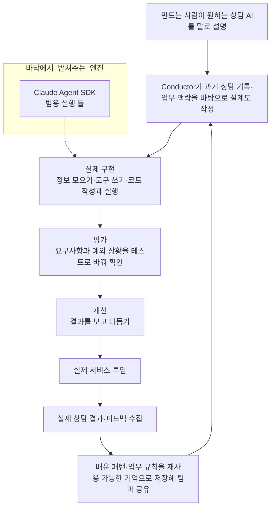

<aside class="ai-knowledge-sidebar">
  
CATEGORIES

  <nav class="ai-cat-tree">

에이전트 오케스트레이션12
<ul><li><a href="https://altjs4510.github.io/ai_news_blog/knowledge/20260930/">2026-09-30Agents you can coach: how Asana builds human-age…</a></li><li><a href="https://altjs4510.github.io/ai_news_blog/knowledge/20260908/">2026-09-08bytedance/deer-flow — 샌드박스·메모리·서브에이전트·메시지 게이트웨이를…</a></li><li><a href="https://altjs4510.github.io/ai_news_blog/knowledge/20260831-openexecutive-virtual-c-suite/">2026-08-31Open Executive — 8명의 전문 에이전트를 하나의 임원 목소리로</a></li><li><a href="https://altjs4510.github.io/ai_news_blog/knowledge/20260828/">2026-08-28Google ADK for Python v2.8.0 — RemoteA2aAgent 네이…</a></li><li><a href="https://altjs4510.github.io/ai_news_blog/knowledge/20260823/">2026-08-23The Evolution of the Agent Harness — 하네스가 모델 가중치…</a></li><li><a href="https://altjs4510.github.io/ai_news_blog/knowledge/20260805/">2026-08-05TencentCloud/TencentDB-Agent-Memory — 대화·문서·코드를 …</a></li><li><a href="https://altjs4510.github.io/ai_news_blog/knowledge/20260717/">2026-07-17After a year building agent memory, 'save everyt…</a></li><li><a href="https://altjs4510.github.io/ai_news_blog/knowledge/20260623/">2026-06-23bytedance/deer-flow — 샌드박스·메모리·서브에이전트·메시지 게이트웨이를…</a></li><li><a href="https://altjs4510.github.io/ai_news_blog/knowledge/20260611/">2026-06-11The evolution of agentic surfaces: building with…</a></li><li><a href="https://altjs4510.github.io/ai_news_blog/knowledge/20260602/">2026-06-02revfactory/harness — 도메인별 에이전트 팀과 스킬을 자동 설계하는 메타…</a></li><li><a href="https://altjs4510.github.io/ai_news_blog/knowledge/20260529/">2026-05-29Introducing dynamic workflows in Claude Code</a></li><li><a href="https://altjs4510.github.io/ai_news_blog/knowledge/20260507/">2026-05-07ruvnet/ruflo — Claude 멀티 에이전트 오케스트레이션 플랫폼</a></li></ul>

MCP &amp; 도구 통합19
<ul><li><a href="https://altjs4510.github.io/ai_news_blog/knowledge/20260829/">2026-08-29cursor/plugins — 플러그인 명세(specification)와 공식 플러그인…</a></li><li><a href="https://altjs4510.github.io/ai_news_blog/knowledge/20260802/">2026-08-02Stateless MCP has recaptured my interest (and in…</a></li><li><a href="https://altjs4510.github.io/ai_news_blog/knowledge/20260801/">2026-08-01different-ai/openwork — Claude Cowork의 오픈소스 대체 에…</a></li><li><a href="https://altjs4510.github.io/ai_news_blog/knowledge/20260731/">2026-07-31different-ai/openwork — Claude Cowork의 오픈소스 대안(o…</a></li><li><a href="https://altjs4510.github.io/ai_news_blog/knowledge/20260729/">2026-07-29Bringing MCP 2026-07-28 to Claude</a></li><li><a href="https://altjs4510.github.io/ai_news_blog/knowledge/20260726/">2026-07-26citrolabs/ego-lite — 로그인된 브라우저 상태를 AI 에이전트와 공유하는…</a></li><li><a href="https://altjs4510.github.io/ai_news_blog/knowledge/20260722/">2026-07-22tirth8205/code-review-graph — MCP·CLI용 로컬 우선 코드 …</a></li><li><a href="https://altjs4510.github.io/ai_news_blog/knowledge/20260721/">2026-07-21tirth8205/code-review-graph — 로컬 우선 코드 인텔리전스 그래프…</a></li><li><a href="https://altjs4510.github.io/ai_news_blog/knowledge/20260718/">2026-07-18tirth8205/code-review-graph — MCP·CLI용 로컬 코드 인텔리…</a></li><li><a href="https://altjs4510.github.io/ai_news_blog/knowledge/20260708/">2026-07-08Expanding Managed Agents in Gemini API: backgrou…</a></li><li><a href="https://altjs4510.github.io/ai_news_blog/knowledge/20260618/">2026-06-18DeusData/codebase-memory-mcp — 158개 언어 코드베이스를 밀리…</a></li><li><a href="https://altjs4510.github.io/ai_news_blog/knowledge/20260603/">2026-06-03How Bad MCP design cost your Agent 5× more token…</a></li><li><a href="https://altjs4510.github.io/ai_news_blog/knowledge/20260526/">2026-05-26colbymchenry/codegraph — Pre-indexed code knowle…</a></li><li><a href="https://altjs4510.github.io/ai_news_blog/knowledge/20260523/">2026-05-23colbymchenry/codegraph — 사전 인덱싱된 코드 지식 그래프 MCP</a></li><li><a href="https://altjs4510.github.io/ai_news_blog/knowledge/20260521/">2026-05-21colbymchenry/codegraph — Pre-indexed code knowle…</a></li><li><a href="https://altjs4510.github.io/ai_news_blog/knowledge/20260520/">2026-05-20New in Claude Managed Agents: self-hosted sandbo…</a></li><li><a href="https://altjs4510.github.io/ai_news_blog/knowledge/20260517/">2026-05-17I gave my LLM 100,000+ tools — Lazy Discovery &a…</a></li><li><a href="https://altjs4510.github.io/ai_news_blog/knowledge/20260509/">2026-05-09How to connect 100 MCP servers without the conte…</a></li><li><a href="https://altjs4510.github.io/ai_news_blog/knowledge/20260506/">2026-05-06mksglu/context-mode — AI 코딩 에이전트용 컨텍스트 윈도우 최적화</a></li></ul>

코딩 에이전트39
<ul><li><a href="https://altjs4510.github.io/ai_news_blog/knowledge/20260920/">2026-09-20Claude Code 2.1.277 — CLAUDE.md가 없으면 AGENTS.md를 …</a></li><li><a href="https://altjs4510.github.io/ai_news_blog/knowledge/20260918/">2026-09-18alibaba/open-code-review — 결정론적 파이프라인 + LLM 에이전트…</a></li><li><a href="https://altjs4510.github.io/ai_news_blog/knowledge/20260917/">2026-09-17alibaba/open-code-review — 결정론적 파이프라인과 LLM 에이전트를…</a></li><li><a href="https://altjs4510.github.io/ai_news_blog/knowledge/20260916/">2026-09-16alibaba/open-code-review — 결정론적 파이프라인과 LLM Agent…</a></li><li><a href="https://altjs4510.github.io/ai_news_blog/knowledge/20260915/">2026-09-15alibaba/open-code-review — 결정적 파이프라인과 LLM 에이전트를 …</a></li><li><a href="https://altjs4510.github.io/ai_news_blog/knowledge/20260912/">2026-09-12Quoting Boris Cherny — 'Claude가 쓴 프로덕션 코드는 사람이 쓴…</a></li><li><a href="https://altjs4510.github.io/ai_news_blog/knowledge/20260910/">2026-09-10vastsa/PI-Desktop — Electron + Rust 호스트 코어 + 에이전…</a></li><li><a href="https://altjs4510.github.io/ai_news_blog/knowledge/20260906/">2026-09-06DietrichGebert/ponytail — 에이전트를 '방에서 가장 게으른 시니어 …</a></li><li><a href="https://altjs4510.github.io/ai_news_blog/knowledge/20260903/">2026-09-03pacifio/atlas — 여러 코딩 에이전트의 변경을 한곳에서 추적·질의하는 '에이…</a></li><li><a href="https://altjs4510.github.io/ai_news_blog/knowledge/20260901/">2026-09-01affaan-m/ECC — 스킬·본능·메모리·보안을 묶은 에이전트 하네스 성능 최적화 …</a></li><li><a href="https://altjs4510.github.io/ai_news_blog/knowledge/20260831-gitnexus-code-knowledge-graph/">2026-08-31GitNexus — 코드베이스를 지식그래프로 바꿔 에이전트에게 쥐어주기</a></li><li><a href="https://altjs4510.github.io/ai_news_blog/knowledge/20260826/">2026-08-26apache/maka — 도구 호출·권한 결정·종료 이벤트를 append-only 로그…</a></li><li><a href="https://altjs4510.github.io/ai_news_blog/knowledge/20260822/">2026-08-22mattpocock/skills — Skills for Real Engineers (하…</a></li><li><a href="https://altjs4510.github.io/ai_news_blog/knowledge/20260820/">2026-08-20akitaonrails/ai-memory — 코딩 에이전트 CLI의 장기 메모리와 벤더…</a></li><li><a href="https://altjs4510.github.io/ai_news_blog/knowledge/20260819/">2026-08-19akitaonrails/ai-memory — 코딩 에이전트 CLI 간 장기 기억과 벤더…</a></li><li><a href="https://altjs4510.github.io/ai_news_blog/knowledge/20260814/">2026-08-14cathrynlavery/diagram-design — Claude Code용 에디토리…</a></li><li><a href="https://altjs4510.github.io/ai_news_blog/knowledge/20260811/">2026-08-11PrimeIntellect-ai/prime-agent — 장기 자율 실행을 전제로 설계…</a></li><li><a href="https://altjs4510.github.io/ai_news_blog/knowledge/20260810/">2026-08-10Auto mode is now the default in Claude Code for …</a></li><li><a href="https://altjs4510.github.io/ai_news_blog/knowledge/20260809/">2026-08-09PrimeIntellect-ai/prime-agent — 코딩 워크플로우·장기 자율 작…</a></li><li><a href="https://altjs4510.github.io/ai_news_blog/knowledge/20260808/">2026-08-08PrimeIntellect-ai/prime-agent — 코딩 워크플로우와 장시간 자율…</a></li><li><a href="https://altjs4510.github.io/ai_news_blog/knowledge/20260804/">2026-08-04esengine/DeepSeek-Reasonix — prefix-cache 안정성을 축…</a></li><li><a href="https://altjs4510.github.io/ai_news_blog/knowledge/20260728/">2026-07-28alibaba/open-code-review — 결정론적 파이프라인 + LLM 에이전트…</a></li><li><a href="https://altjs4510.github.io/ai_news_blog/knowledge/20260725/">2026-07-25The new rules of context engineering for Claude …</a></li><li><a href="https://altjs4510.github.io/ai_news_blog/knowledge/20260719/">2026-07-19tirth8205/code-review-graph — 로컬 우선 코드 인텔리전스 그래프…</a></li><li><a href="https://altjs4510.github.io/ai_news_blog/knowledge/20260714/">2026-07-14Graphify-Labs/graphify — 코드베이스를 질의 가능한 지식 그래프로 만…</a></li><li><a href="https://altjs4510.github.io/ai_news_blog/knowledge/20260707/">2026-07-07AI Hero Skills Catalog — 실무 엔지니어를 위한 재사용 가능한 판단 …</a></li><li><a href="https://altjs4510.github.io/ai_news_blog/knowledge/20260705/">2026-07-05openai/codex-plugin-cc — Claude Code에서 Codex를 위임…</a></li><li><a href="https://altjs4510.github.io/ai_news_blog/knowledge/20260701/">2026-07-01Google OKF (Open Knowledge Format) — 벤더 중립 에이전트 …</a></li><li><a href="https://altjs4510.github.io/ai_news_blog/knowledge/20260626/">2026-06-26google-labs-code/design.md — 코딩 에이전트에게 디자인 시스템을 …</a></li><li><a href="https://altjs4510.github.io/ai_news_blog/knowledge/20260619/">2026-06-19Claude Code now supports artifacts</a></li><li><a href="https://altjs4510.github.io/ai_news_blog/knowledge/20260530/">2026-05-30Leonxlnx/taste-skill — AI에게 좋은 취향을 부여해 generic s…</a></li><li><a href="https://altjs4510.github.io/ai_news_blog/knowledge/20260528/">2026-05-28Building self-improving tax agents with Codex</a></li><li><a href="https://altjs4510.github.io/ai_news_blog/knowledge/20260524/">2026-05-24colbymchenry/codegraph — Pre-indexed code knowle…</a></li><li><a href="https://altjs4510.github.io/ai_news_blog/knowledge/20260515/">2026-05-15Clawdmeter — Claude Code 사용량을 데스크톱 대시보드로</a></li><li><a href="https://altjs4510.github.io/ai_news_blog/knowledge/20260512/">2026-05-12agentmemory — Persistent memory for AI coding ag…</a></li><li><a href="https://altjs4510.github.io/ai_news_blog/knowledge/20260510/">2026-05-10addyosmani/agent-skills — Production-grade engin…</a></li><li><a href="https://altjs4510.github.io/ai_news_blog/knowledge/20260508/">2026-05-08addyosmani/agent-skills — Production-grade engin…</a></li><li><a href="https://altjs4510.github.io/ai_news_blog/knowledge/20260505/">2026-05-05mattpocock/skills — Skills for Real Engineers (.…</a></li><li><a href="https://altjs4510.github.io/ai_news_blog/knowledge/20260504/">2026-05-04Agents for Everything Else: Codex for Knowledge …</a></li></ul>

모델 &amp; 연구9
<ul><li><a href="https://altjs4510.github.io/ai_news_blog/knowledge/20260929/">2026-09-29vectorize-io/hindsight — Hindsight: Agent Memory…</a></li><li><a href="https://altjs4510.github.io/ai_news_blog/knowledge/20260907-voicemem-dual-brain-memory/">2026-09-07VoiceMem — 좌뇌·우뇌로 쪼갠 스트리밍 메모리로 음성 에이전트 지연 없애기</a></li><li><a href="https://altjs4510.github.io/ai_news_blog/knowledge/20260904/">2026-09-04HarnessDev: Can LLMs Create and Evolve Their Own…</a></li><li><a href="https://altjs4510.github.io/ai_news_blog/knowledge/20260716-proprag/">2026-07-16PropRAG — 프로포지션 경로 위 beam search로 멀티홉 검색 안내</a></li><li><a href="https://altjs4510.github.io/ai_news_blog/knowledge/20260712/">2026-07-12Do Automated Evals Work?</a></li><li><a href="https://altjs4510.github.io/ai_news_blog/knowledge/20260620/">2026-06-20zai-org/GLM-5 — From Vibe Coding to Agentic Engi…</a></li><li><a href="https://altjs4510.github.io/ai_news_blog/knowledge/20260617/">2026-06-17Predicting model behavior before release by simu…</a></li><li><a href="https://altjs4510.github.io/ai_news_blog/knowledge/20260516/">2026-05-16STALE — 에이전트가 자기 기억의 유효성을 인지할 수 있는가</a></li><li><a href="https://altjs4510.github.io/ai_news_blog/knowledge/20260513/">2026-05-13Thinking Machines' Native Interaction Models — T…</a></li></ul>

인프라 &amp; 컴퓨트12
<ul><li><a href="https://altjs4510.github.io/ai_news_blog/knowledge/20260905/">2026-09-05magnitudedev/magnitude — 하드웨어에 맞는 최적 로컬 모델을 띄워 이…</a></li><li><a href="https://altjs4510.github.io/ai_news_blog/knowledge/20260821/">2026-08-21volcengine/OpenViking — 에이전트 메모리·Knowledge RAG·스…</a></li><li><a href="https://altjs4510.github.io/ai_news_blog/knowledge/20260813/">2026-08-13semantica-agi/semantica — 컨텍스트와 책임 추적을 위한 그래프 네이…</a></li><li><a href="https://altjs4510.github.io/ai_news_blog/knowledge/20260812/">2026-08-12semantica-agi/semantica — 컨텍스트와 '책임 추적 가능한(accou…</a></li><li><a href="https://altjs4510.github.io/ai_news_blog/knowledge/20260806/">2026-08-06cloudflare/computer — 에이전트에게 컴퓨터를 통째로 주는 엣지 실행 샌…</a></li><li><a href="https://altjs4510.github.io/ai_news_blog/knowledge/20260724/">2026-07-24diegosouzapw/OmniRoute — 단일 엔드포인트로 278+ 프로바이더·50…</a></li><li><a href="https://altjs4510.github.io/ai_news_blog/knowledge/20260723/">2026-07-23diegosouzapw/OmniRoute — 268+ 프로바이더를 단일 엔드포인트로 묶…</a></li><li><a href="https://altjs4510.github.io/ai_news_blog/knowledge/20260610/">2026-06-10Fable 5 just made cost-aware model routing manda…</a></li><li><a href="https://altjs4510.github.io/ai_news_blog/knowledge/20260606/">2026-06-06chopratejas/headroom — Compress tool outputs, lo…</a></li><li><a href="https://altjs4510.github.io/ai_news_blog/knowledge/20260605/">2026-06-05chopratejas/headroom — Compress tool outputs, lo…</a></li><li><a href="https://altjs4510.github.io/ai_news_blog/knowledge/20260604/">2026-06-04chopratejas/headroom — Compress tool outputs bef…</a></li><li><a href="https://altjs4510.github.io/ai_news_blog/knowledge/20260522/">2026-05-22Giving Agents Computers — Ivan Burazin, Daytona</a></li></ul>

보안 &amp; 거버넌스24
<ul><li><a href="https://altjs4510.github.io/ai_news_blog/knowledge/20261004/">2026-10-04Apple says it's tightening macOS 'Full Disk Acce…</a></li><li><a href="https://altjs4510.github.io/ai_news_blog/knowledge/20261003/">2026-10-03NVIDIA/OpenShell — 자율 AI 에이전트를 위한 안전하고 프라이빗한 런타임…</a></li><li><a href="https://altjs4510.github.io/ai_news_blog/knowledge/20261002/">2026-10-02NVIDIA/OpenShell — 자율 AI 에이전트를 위한 안전하고 프라이빗한 런타임…</a></li><li><a href="https://altjs4510.github.io/ai_news_blog/knowledge/20261001/">2026-10-01NVIDIA/OpenShell</a></li><li><a href="https://altjs4510.github.io/ai_news_blog/knowledge/20260919/">2026-09-19cloudflare/security-audit-skill — 다단계 보안 감사를 '독립…</a></li><li><a href="https://altjs4510.github.io/ai_news_blog/knowledge/20260913/">2026-09-13OpenAI agents attacked RubyGems back in May: Ope…</a></li><li><a href="https://altjs4510.github.io/ai_news_blog/knowledge/20260902/">2026-09-02AIR raises $50M to help companies vet the skills…</a></li><li><a href="https://altjs4510.github.io/ai_news_blog/knowledge/20260827/">2026-08-27Claude in Chrome is generally available</a></li><li><a href="https://altjs4510.github.io/ai_news_blog/knowledge/20260819-mind-viruses/">2026-08-19탈옥도, 인젝션도 없이 — 대화로만 퍼지는 에이전트의 '마인드 바이러스'</a></li><li><a href="https://altjs4510.github.io/ai_news_blog/knowledge/20260730/">2026-07-30Anatomy of a Frontier Lab Agent Intrusion: A Tec…</a></li><li><a href="https://altjs4510.github.io/ai_news_blog/knowledge/20260716/">2026-07-16Dicklesworthstone/destructive_command_guard — 에이…</a></li><li><a href="https://altjs4510.github.io/ai_news_blog/knowledge/20260715/">2026-07-15Dicklesworthstone/destructive_command_guard — 에이…</a></li><li><a href="https://altjs4510.github.io/ai_news_blog/knowledge/20260710/">2026-07-1070개 MCP 서버 strace 런타임 감사 — 부팅 시 아웃바운드 호출 서버 적발</a></li><li><a href="https://altjs4510.github.io/ai_news_blog/knowledge/20260704/">2026-07-04Cloudflare is about to block AI agents by defaul…</a></li><li><a href="https://altjs4510.github.io/ai_news_blog/knowledge/20260703/">2026-07-03Giving admins more visibility and control over C…</a></li><li><a href="https://altjs4510.github.io/ai_news_blog/knowledge/20260630/">2026-06-30Introducing the Claude apps gateway for Amazon B…</a></li><li><a href="https://altjs4510.github.io/ai_news_blog/knowledge/20260625/">2026-06-25Agent identity in Claude Tag: a new access model…</a></li><li><a href="https://altjs4510.github.io/ai_news_blog/knowledge/20260624/">2026-06-24Agent identity in Claude Tag: a new access model…</a></li><li><a href="https://altjs4510.github.io/ai_news_blog/knowledge/20260614/">2026-06-14NVIDIA/SkillSpector — Security scanner for AI ag…</a></li><li><a href="https://altjs4510.github.io/ai_news_blog/knowledge/20260613/">2026-06-13Fable 5's guardrails got bypassed in 48 hours — …</a></li><li><a href="https://altjs4510.github.io/ai_news_blog/knowledge/20260612/">2026-06-12NVIDIA/SkillSpector — AI 에이전트 스킬용 보안 스캐너</a></li><li><a href="https://altjs4510.github.io/ai_news_blog/knowledge/20260607/">2026-06-07OpenAI Help: Lockdown Mode</a></li><li><a href="https://altjs4510.github.io/ai_news_blog/knowledge/20260531/">2026-05-31How we contain Claude across products</a></li><li><a href="https://altjs4510.github.io/ai_news_blog/knowledge/20260527/">2026-05-27Microsoft Copilot Cowork Exfiltrates Files</a></li></ul>

응용 사례7
<ul><li><a href="https://altjs4510.github.io/ai_news_blog/knowledge/20261006/" class="current">2026-10-06How Cresta turned CX expertise into an agent bui…</a></li><li><a href="https://altjs4510.github.io/ai_news_blog/knowledge/20260911/">2026-09-11Now everyone can put data to work — ChatGPT Work…</a></li><li><a href="https://altjs4510.github.io/ai_news_blog/knowledge/20260909/">2026-09-09Reducing cost and improving performance with Cla…</a></li><li><a href="https://altjs4510.github.io/ai_news_blog/knowledge/20260709/">2026-07-09mvanhorn/last30days-skill — Reddit·X·YouTube·HN·…</a></li><li><a href="https://altjs4510.github.io/ai_news_blog/knowledge/20260621/">2026-06-21calesthio/OpenMontage — 12 파이프라인·52 도구·500+ 스킬을 …</a></li><li><a href="https://altjs4510.github.io/ai_news_blog/knowledge/20260609/">2026-06-09Building intelligent apps for Apple platforms wi…</a></li><li><a href="https://altjs4510.github.io/ai_news_blog/knowledge/20260514/">2026-05-14Introducing Claude for Small Business</a></li></ul>

산업 동향6
<ul><li><a href="https://altjs4510.github.io/ai_news_blog/knowledge/20260907-humanmade-52week-rhythm/">2026-09-07휴먼 메이드의 '52주 리듬' — 아이디어가 흔해진 시대에 값이 오르는 건 버리는 판단</a></li><li><a href="https://altjs4510.github.io/ai_news_blog/knowledge/20260830/">2026-08-30[AINews] OpenAI shuts off Cursor — 프론티어 모델 공급 차단…</a></li><li><a href="https://altjs4510.github.io/ai_news_blog/knowledge/20260711/">2026-07-11OpenAI says GPT 5.6 is the 'preferred model' for…</a></li><li><a href="https://altjs4510.github.io/ai_news_blog/knowledge/20260702/">2026-07-02How Cursor deploys AI inside the enterprise (For…</a></li><li><a href="https://altjs4510.github.io/ai_news_blog/knowledge/20260616/">2026-06-16Why AI hasn't replaced software engineers, and w…</a></li><li><a href="https://altjs4510.github.io/ai_news_blog/knowledge/20260519/">2026-05-19Anthropic acquires Stainless</a></li></ul>
</nav>
</aside>

<article class="ai-knowledge-article">

<header class="ai-post-hero">
  
<a class="ai-back" href="../">KNOWLEDGE</a> · 2026-10-06 · 오늘의 학습

  <h2 class="ai-post-title">How Cresta turned CX expertise into an agent builder on the Claude Agent SDK</h2>
</header>

> 원문: [How Cresta turned CX expertise into an agent builder on the Claude Agent SDK](https://claude.com/blog/how-cresta-turned-cx-expertise-into-an-agent-builder-on-the-claude-agent-sdk)

## 📌 학습 정리

### 1. 한 줄로 말하면

고객 상담 분야에서 오래 일해 온 회사가 "상담 AI를 어떻게 잘 만드는지"에 대한 노하우를 통째로 담아서, 말로 설명하기만 하면 상담 AI를 대신 만들고 고쳐 주는 'AI를 만드는 AI'를 내놓은 이야기예요.

### 2. 왜 이게 만들어졌어요?

[Cresta](https://cresta.com/)는 고객 경험(customer experience, CX) 분야의 AI를 만드는 회사예요. 고객 경험이란 콜센터나 채팅 상담처럼 고객과 기업이 만나는 모든 순간을 말해요. 상담 AI를 만들어 보면 고객 질문이 생각보다 훨씬 복잡하다는 걸 금방 알게 돼요. 어떤 구매 건인지 말하지 않고 환불을 요청하거나, 결제 문제와 로그인 문제를 한 메시지에 같이 적거나, 반품 기한이 지난 뒤에 환불을 요청하기도 하거든요. 이럴 때 AI가 제대로 답하려면 구매 내역, 환불 정책, 계정 이력, 결제 상태 같은 걸 직접 찾아봐야 해요.

그래서 상담 AI를 만드는 팀은 몇 가지를 매번 정해야 해요. AI가 무엇을 알아야 하는지, 어떤 사내 시스템에 접근해야 하는지, 어디까지는 상황에 맞게 유연하게 답하고 어디부터는 정해진 규칙대로만 움직여야 하는지요. 원래는 팀마다 이 판단을 처음부터 혼자 했는데, Cresta는 자기들이 쌓아 온 판단력을 더 많은 팀이 처음부터 다시 시작하지 않고 쓸 수 있게 하고 싶었어요. 그렇게 나온 게 Conductor예요. 처음엔 사내 팀이 고객사 도입을 돕는 내부 도구였는데, 이걸 고객이 직접 쓰는 제품으로 바꿀 수 있을지가 고민이었다고 해요.

### 3. 비유로 풀면

Conductor는 마치 **경력 많은 매장 매니저가 신입 직원 교육 매뉴얼을 함께 써 주는 것** 같아요. "우리 매장에 이런 직원이 필요해요"라고 말하면 매니저가 어떤 상황에서는 융통성 있게 응대하고, 어떤 상황(환불 규정, 개인정보 확인 등)에서는 절대 매뉴얼을 벗어나면 안 되는지를 같이 정리해 줘요. 그리고 직원이 실제로 잘하는지 테스트도 해 보고, 일하면서 생긴 노하우를 다음 신입 교육 자료에 다시 반영하죠.

또 하나는 **자동차 회사와 엔진의 관계**예요. 엔진(Claude Agent SDK)은 이미 잘 만들어진 걸 가져다 쓰고, 회사는 차체 설계, 승차감, 그 회사만의 주행 노하우(상담 데이터와 CX 전문성)에 힘을 쏟는 거예요.

그래서 결국 Conductor는 "AI가 일하는 기본 동력"은 Anthropic 도구에 맡기고, 그 위에 "상담 AI를 잘 만드는 법"이라는 Cresta만의 지식을 얹은 구조예요.

### 4. 어떻게 작동하는지 (그림으로)

사용자가 만들고 싶은 상담 AI를 설명하면 Conductor가 설계, 구현, 평가, 개선 순서로 작업을 이끌어 가요. 실제 손을 움직이는 일, 그러니까 정보를 모으고 도구를 부르고 코드를 짜서 돌리는 일은 바닥에 깔린 Claude Agent SDK가 맡아요. 서비스에 나간 뒤에 생기는 상담 결과와 피드백은 다시 다음 개선의 재료가 되고, 그렇게 배운 노하우가 팀 전체가 쓰는 자산으로 쌓이면서 바퀴처럼 계속 돌아가는 구조예요.

### 5. 처음 보는 용어 풀이

- **AI를 만드는 AI (meta-agent, 메타 에이전트)**: 스스로 일을 처리하는 AI 프로그램을 '에이전트(agent)'라고 하는데, 메타 에이전트는 다른 에이전트를 만들고 고쳐 주는 에이전트예요. Conductor가 여기에 해당해요.
- **Claude Agent SDK**: Anthropic이 제공하는 개발 도구 모음이에요. Claude가 정보를 모으고, 도구를 쓰고, 코드를 짜서 실행하고, 결과를 보고 다시 판단하는 작업 흐름을 프로그램 안에서 그대로 쓸 수 있게 해 줘요. Cresta는 내부에서 Claude Code를 개발 도구로 잘 쓰다가 같은 방식을 자기 제품에 넣으려고 이 SDK를 택했어요.
- **정해진 규칙대로만 동작하는 부분 (deterministic, 결정적 동작)**: 같은 상황이면 언제나 똑같이 처리되도록 고정해 둔 부분이에요. 규제가 엄격한 업계의 핵심 업무는 절대 틀리면 안 되니까 이렇게 단단히 묶어 두고, 나머지는 유연하게 남겨 둬요. 전부 고정하면 모든 경우의 수를 그린 거대한 갈림길 지도가 되어 버린다는 게 원문의 설명이에요.
- **사람이 중간에 확인하는 구조 (human in the loop)**: AI가 혼자 결정하지 않고 특정 단계에서 사람이 개입해 확인하거나 판단하게 하는 방식이에요. Conductor는 과거 상담 기록을 보고 어디에 사람이 남아 있어야 하는지 찾는 걸 도와줘요.
- **평가 (evaluation)**: AI가 제대로 일했는지 점검하는 일이에요. Cresta는 결과물이 쓸 만한지, 적절한 도구와 맥락을 썼는지, 모범 답안과 비교해 품질이 어떤지, 시간과 사용량이 얼마나 들었는지를 함께 봐요. 새 Claude 모델이 나오면 같은 과제로 다시 평가해서 변경 전에 확인하는 안전망으로도 써요.
- **재사용 가능한 기억 자료 (memory artifact) / 스킬 (skill)**: 에이전트를 하나 만들면서 배운 패턴, 업무 규칙, 평가 방법을 정리해 저장한 거예요. 이걸 '스킬'로 팀과 공유하면 다른 사람도 검증된 방식에서 출발할 수 있어요.
- **지식 선순환 구조 (knowledge flywheel, 플라이휠)**: 플라이휠은 한번 돌기 시작하면 관성으로 점점 잘 도는 바퀴를 말해요. 에이전트를 만들수록 노하우가 쌓이고, 쌓인 노하우 덕분에 다음 에이전트를 더 빠르고 일관되게 만들게 되는 흐름을 가리켜요.

### 6. 한 발 더 들어가고 싶다면

- [Cresta](https://cresta.com/): Cresta가 어떤 회사이고 고객 상담 분야에서 어떤 AI 제품을 만드는지 알 수 있어요.
- [Cresta Conductor 소개 글](https://cresta.com/blog/cresta-conductor-the-agent-for-ai-agent-development): Conductor가 업무 맥락을 어떻게 에이전트 설계, 구현, 지속 개선으로 이어 가는지 Cresta 쪽 설명으로 더 자세히 볼 수 있어요.

---

## 📖 원문 전체 번역 (정독용)

> 의역 최소화한 전체 번역입니다. 큰 흐름은 위 정리에서 잡고, 정확한 워딩이 필요할 땐 이 섹션에서 정독하세요.

_**How startups build with Claude** 시리즈에서는 AI 제품 뒤에 있는 의사결정을 살펴봅니다. 이번에는 [Cresta](https://cresta.com/)가 AI 네이티브 고객 경험(customer experience)을 구축해 온 전문성을 [Conductor](https://cresta.com/blog/cresta-conductor-the-agent-for-ai-agent-development)에 어떻게 담아냈는지 알아봅니다. Conductor는 개발자가 다른 에이전트를 만들고 개선하도록 돕는 에이전트입니다._

| 핵심 요약 |
| --- |
| 이름 | Cresta |
| 설립 | 2017 |
| CEO | Ping Wu |
| 성장 | 2억 7천만 달러 이상 투자 유치. ARR 1억 달러 이상. United Airlines, CVS Health, Marriott 같은 조직이 뛰어난 고객 경험을 제공하도록 지원 |

고객 경험(CX) 사용 사례를 위한 엔터프라이즈 AI 에이전트를 만들려면 매우 다양한 고객 상호작용에 담긴 맥락을 이해해야 합니다. 예를 들어 고객은 다음과 같이 말할 수 있습니다.

*   어떤 구매 건인지 밝히지 않은 채 환불을 요청한다.
*   같은 메시지에서 결제 문제와 로그인 문제를 함께 신고한다.
*   반품 기간이 끝난 뒤에 환불을 요청한다.

올바르게 응답하려면 에이전트는 고객이 무엇을 구매했는지, 환불 정책은 무엇인지, 계정 이력은 어떠한지, 결제 상태는 어떠한지를 확인해야 할 수 있습니다.

Cresta는 이러한 상호작용을 대규모로 접합니다. Cresta의 플랫폼은 고객 경험을 뒷받침하며, 대화를 자율적으로 처리하는 AI 에이전트, 함께 일하는 사람 상담원을 위한 실시간 가이드, 그리고 비즈니스가 어디를 개선해야 하는지 보여주는 대화 인텔리전스(conversation intelligence)를 제공합니다.

고객 경험 에이전트를 구축하고 유지하려면 조직은 운영 요건에 관한 핵심적인 결정을 내려야 합니다. 에이전트가 무엇을 알아야 하는지, 어떤 시스템에 접근해야 하는지, 어디에서는 동작이 유연해야 하고 어디에서는 결정적(deterministic)이어야 하는지가 그것입니다. Cresta는 각 팀이 매번 처음부터 시작하지 않고도 이러한 판단을 더 많은 팀이 활용할 수 있도록 하고자 했습니다.

그 결과물이 Conductor입니다. Conductor는 자연어 기반 에이전트 빌더로, 팀이 복잡한 비즈니스 맥락을 프로덕션 수준의 에이전트로 전환하도록 돕습니다. 사용자가 만들고 싶은 것을 설명하면, Conductor는 근거가 있는(grounded) 청사진에서 시작해 구현, 평가, 최적화까지 작업을 안내합니다.

Cresta는 원래 Claude Sonnet과 Claude Opus를 사용해 내부 팀이 고객 배포를 지원하도록 돕는 Conductor의 초기 버전을 만들었습니다. 남은 질문은 이 시스템을 고객이 플랫폼 _안에서_ 직접 에이전트를 만들 수 있는 제품으로 바꿀 수 있느냐는 것이었습니다.

Conductor는 개방형(open-ended) 개발 작업을 수행하기 위해 Claude Agent SDK를 범용 하네스(harness)로 사용합니다. 이를 통해 맥락을 수집하고, 도구를 사용하고, 코드를 작성하고 실행하며, 결과에 따라 적응합니다.

"저희는 에이전트를 만드는 소프트웨어 개발 측면에서 매우 효과적이었기 때문에 Claude Code를 내부 개발 도구로 사용했습니다."라고 Cresta Conductor의 엔지니어링 리드 Renjie Li는 말했습니다. "Claude Agent SDK 덕분에 바로 그 에이전트 개발 하네스를 프로그래밍 방식으로 사용할 수 있게 됐습니다. Conductor에서는 이것을 Cresta의 깊이 있는 대화 인텔리전스, CX 전문성, 평가, 런타임과 연결해, 저희가 처음부터 갖고 싶었던 에이전트 구축 경험을 사용자에게 제공하고 있습니다."

Cresta는 Cresta와 파트너사의 초기 사용 사례에서 Conductor가 초기 배포 시간을 대략 절반으로 줄였다고 밝혔습니다.

## **다음 에이전트를 만드는 데 도움을 주는 메타 에이전트**

Conductor는 CX 에이전트 개발의 확립된 모범 사례 위에 구축된 자기 개선형(self-improving) 메타 에이전트입니다. 팀이 Conductor로 더 많은 에이전트를 만들고 다듬을수록, 팀은 자신들만의 검증된 패턴, 워크플로우, 전문가적 판단을 축적하게 됩니다. 이는 이후의 개발을 더 빠르고 일관되게 만드는 지식 플라이휠(knowledge flywheel)을 만들어 냅니다.

출시 이후에는 프로덕션 상호작용, 워크플로우 결과, 피드백이 다음 개선을 위한 새로운 신호가 됩니다.

Conductor는 빌더가 에이전트를 구축하며 배운 것을 재사용 가능한 메모리 아티팩트(memory artifact)로 만들도록 돕습니다. 여기에는 패턴, 비즈니스 규칙, 평가 방식이 담깁니다. 그런 다음 이를 스킬(skill)로 팀 전체와 공유할 수 있어, 다른 사람들도 같은 검증된 방식으로 만들 수 있습니다.

### **중요한 결정을 더 쉽게**

첫 번째 프롬프트를 쓰는 것은 쓸모 있는 에이전트를 만드는 일의 한 부분일 뿐입니다. 더 어려운 판단 중 하나는 대화의 어느 부분은 유연하게 두고, 어느 부분에는 명시적인 비즈니스 규칙과 통제된 도구 동작이 필요한지입니다.

"너무 결정적으로 가면 안 됩니다. 그러면 가능한 모든 분기를 그려 내려는 거대한 의사결정 트리를 만들게 되니까요. 하지만 항상 제대로 동작해야 하는 엔터프라이즈 핵심 워크플로우가 있습니다. 특히 위험 허용도가 낮은 규제 산업에서는 더 그렇습니다."라고 Renjie는 말했습니다. "Conductor는 그런 결정적 요구사항과 그 구현을 찾아내고 단단하게 만들면서, 전반적인 경험을 개선할 수 있는 유연성도 함께 유지하도록 돕습니다."

Conductor는 과거 대화를 활용해, 팀이 어디에서 사람이 계속 개입(human in the loop)해야 하고 어디에서 모델에 적응할 여지를 줄 수 있는지 파악하도록 돕습니다. 이러한 경계가 정해진 뒤에도 개발자는 결정적인 부분이 강제하려는 요구사항에 비추어 그 부분을 테스트해야 하며, 기반이 되는 비즈니스 규칙이 바뀌면 그 테스트도 수정해야 합니다.

## **Cresta는 Conductor를 어떻게 평가하는가**

Conductor는 에이전트를 얼마나 잘 만드는지로 측정됩니다. 이를 위해 Cresta는 Conductor에게 다음과 같은 일련의 구축 과제를 수행하게 합니다.

*   새 에이전트 구축
*   에이전트에 대한 테스트 케이스 작성
*   이미 존재하는 에이전트 변경
*   근본 원인 분석(root cause analysis) 수행

과제를 끝내는 것만이 기준은 아닙니다. 팀은 결과물, Conductor가 거기에 도달한 방식, 그 과정에서 무엇을 사용했는지도 함께 살펴봅니다.

| 평가 | 답하는 질문 |
| --- | --- |
| 결과(Outcome) | Conductor가 요청받은, 사용 가능한 아티팩트를 만들어 냈는가? |
| 실행 경로(Execution path) | 적절한 도구와 필요한 맥락을 사용했는가? |
| 품질(Quality) | 결과가 엄선된 기준 자료(curated reference)와 비교해 어떠한가? |
| 자원 사용(Resource use) | 과제에 시간과 모델 사용량이 얼마나 들었는가? |

이 같은 과제들은 안전망 역할도 합니다. 새로운 Claude 모델이 출시되거나 Conductor 프레임워크가 업데이트되면 Cresta는 평가를 다시 실행합니다. 같은 과제와 같은 채점 방식을 사용해, 누군가 변경을 확정하기 전에 무엇이 개선되었고 무엇이 아직 보완이 필요한지 파악합니다.

이와 같은 평가 원칙은 Conductor 자체에도 내장되어 있어, 사용자가 자신의 에이전트가 의도대로 동작하는지 확인할 수 있습니다. Conductor는 구축 단계에서 파악된 요구사항과 엣지 케이스를 평가 모듈 안의 테스트로 전환합니다.

그러면 팀은 정책, 연결된 시스템, 대화 패턴이 바뀌는 와중에도 매번 제대로 동작해야 하는 워크플로우를 모니터링할 수 있습니다. 이는 이미 단단하게 만들어 둔 워크플로우의 신뢰성을 잃지 않으면서, 비즈니스 변화에 맞춰 에이전트를 업데이트할 수 있는 현실적인 방법을 제공합니다.

## **Claude Agent SDK 위에 Conductor 구축하기**

Cresta는 Conductor를 에이전트 개발을 위한 CX 특화 컨트롤 플레인(control plane)으로 설계했습니다. Conductor는 대화 데이터, 도메인 전문성, 개발 관행을 하나로 모은 다음, 정책, 관측 가능성(observability), 검증, 피드백 기반 개선을 통해 각 에이전트 실행을 통제합니다.

Claude Agent SDK는 Conductor 아래에서 범용 실행 하네스로 자리합니다. 맥락을 수집하고, 도구를 호출하고, 코드를 작성하고 실행하는 작업을 관리하며, Conductor는 그 위에 Cresta의 CX 워크플로우, 도구, 도메인 맥락을 얹습니다.

팀은 Conductor가 수행해야 하는 작업, 즉 여러 단계로 이루어지고 맥락이 방대하며 도구를 반복적으로 사용하는 과제에 비추어 SDK를 평가했습니다. 검토 범위는 데이터 프라이버시, 테넌트 아키텍처, 조직 수준의 키 배포, 통제, 그리고 구현 전반의 관측 가능성을 포함했습니다.

"Anthropic은 에이전트 기반 소프트웨어 개발을 위한 강력한 범용 기반을 제공합니다. 덕분에 Cresta가 가장 지속적인 고객 가치를 만들어 내는 곳에 엔지니어링 투자를 집중할 수 있습니다."라고 Cresta의 엔지니어링 부사장(VP of Engineering) Xiangru Chen은 말했습니다.

## **Cresta의 엔지니어링 전문성을 고객의 손에 직접 쥐여 주기**

Conductor는 Cresta 내부에서 시작되었습니다. 자체 전진 배치(forward-deployed) 팀이 어떤 개발 작업을 반복 가능하게 만들 수 있는지, 맥락이 어디에서 가장 중요한지, 빌더가 그 과정에서 무엇을 살펴봐야 하는지 배우도록 돕는 도구였습니다. 이 내부 작업에서 거둔 성공이 팀에게 같은 기능을 고객과 파트너에게 제공해도 되겠다는 확신을 주었습니다.

엔지니어가 손으로 만들 수 있는 속도보다 더 빨리 맞춤형 에이전트를 배포해야 하는 제품을 가진 팀이라면, Cresta의 접근 방식이 유용한 참고 사례가 될 것입니다. 에이전트든 메타 에이전트든, 초기 구축 이후의 작업이 대개 가장 어려운 부분이기 때문입니다.

[Conductor](https://cresta.com/blog/cresta-conductor-the-agent-for-ai-agent-development)가 비즈니스 맥락을 어떻게 더 나은 에이전트 설계, 구현, 지속적 개선으로 바꾸는지 확인해 보세요.

| Cresta 팀의 모범 사례 |
| --- |
| 자사 제품을 직접 써 보라(Dogfood) | Conductor는 먼저 내부 도구로 운영되었고, 그 결과물이 깊은 AI 전문성을 가진 엔지니어가 만들 법한 수준과 같아진 뒤에야 제품이 되었습니다. |
| 고유한 강점에 집중하라 | Cresta는 자신들만 제공할 수 있는 전문성(대화 데이터와 고객 경험에 대한 이해)과 Agent SDK에서 기성품으로 가져올 수 있는 것 사이에 분명한 선을 그었고, 그 선의 잘못된 쪽에 있는 것은 아무것도 만들지 않았습니다. |
| 에이전트의 어떤 부분이 결정적이어야 하는가 | 절대 잘못되어서는 안 되는 엔터프라이즈 핵심 워크플로우는 단단하게 만들고 나머지는 유연하게 두십시오. 그렇지 않으면 원하는 인터랙티브한 에이전트 경험을 얻지 못합니다. |
| 프로덕션에 도달하는 것은 쉬운 부분이다 | 초기 구축은 전체 노력의 약 20%에 불과하며, 나머지 80%는 그 이후의 테스트, 최적화, 지속적 개선입니다. 따라서 출시가 아니라 반복 루프를 중심으로 도구를 설계하십시오. |

</article>

<!-- ai-related-links -->
<aside class="ai-related-links">
  
관련 학습

  <ul><li><a href="https://altjs4510.github.io/ai_news_blog/knowledge/20260611/">2026-06-11The evolution of agentic surfaces: building with…</a></li><li><a href="https://altjs4510.github.io/ai_news_blog/knowledge/20260528/">2026-05-28Building self-improving tax agents with Codex</a></li><li><a href="https://altjs4510.github.io/ai_news_blog/knowledge/20260624/">2026-06-24Agent identity in Claude Tag: a new access model…</a></li></ul>
</aside>
<!-- /ai-related-links -->
