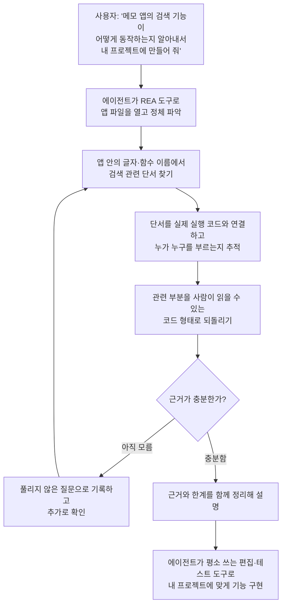

<div class="ai-knowledge-shell">

<aside class="ai-knowledge-sidebar">
  <p class="ai-eyebrow">CATEGORIES</p>
  <nav class="ai-cat-tree"><details class="ai-cat" open><summary><span class="catname">에이전트 오케스트레이션</span><span class="catcount">19</span></summary><ul><li><a href="https://altjs4510.github.io/ai_news_blog/knowledge/20260930/"><span class="kdate">2026-09-30</span><span class="ktitle">Agents you can coach: how Asana builds human-age…</span></a></li><li><a href="https://altjs4510.github.io/ai_news_blog/knowledge/20260929/"><span class="kdate">2026-09-29</span><span class="ktitle">vectorize-io/hindsight — Hindsight: Agent Memory…</span></a></li><li><a href="https://altjs4510.github.io/ai_news_blog/knowledge/20260908/"><span class="kdate">2026-09-08</span><span class="ktitle">bytedance/deer-flow — 샌드박스·메모리·서브에이전트·메시지 게이트웨이를…</span></a></li><li><a href="https://altjs4510.github.io/ai_news_blog/knowledge/20260904/"><span class="kdate">2026-09-04</span><span class="ktitle">HarnessDev: Can LLMs Create and Evolve Their Own…</span></a></li><li><a href="https://altjs4510.github.io/ai_news_blog/knowledge/20260831-openexecutive-virtual-c-suite/"><span class="kdate">2026-08-31</span><span class="ktitle">Open Executive — 8명의 전문 에이전트를 하나의 임원 목소리로</span></a></li><li><a href="https://altjs4510.github.io/ai_news_blog/knowledge/20260828/"><span class="kdate">2026-08-28</span><span class="ktitle">Google ADK for Python v2.8.0 — RemoteA2aAgent 네이…</span></a></li><li><a href="https://altjs4510.github.io/ai_news_blog/knowledge/20260826/"><span class="kdate">2026-08-26</span><span class="ktitle">apache/maka — 도구 호출·권한 결정·종료 이벤트를 append-only 로그…</span></a></li><li><a href="https://altjs4510.github.io/ai_news_blog/knowledge/20260823/"><span class="kdate">2026-08-23</span><span class="ktitle">The Evolution of the Agent Harness — 하네스가 모델 가중치…</span></a></li><li><a href="https://altjs4510.github.io/ai_news_blog/knowledge/20260805/"><span class="kdate">2026-08-05</span><span class="ktitle">TencentCloud/TencentDB-Agent-Memory — 대화·문서·코드를 …</span></a></li><li><a href="https://altjs4510.github.io/ai_news_blog/knowledge/20260726/"><span class="kdate">2026-07-26</span><span class="ktitle">citrolabs/ego-lite — 로그인된 브라우저 상태를 AI 에이전트와 공유하는…</span></a></li><li><a href="https://altjs4510.github.io/ai_news_blog/knowledge/20260717/"><span class="kdate">2026-07-17</span><span class="ktitle">After a year building agent memory, 'save everyt…</span></a></li><li><a href="https://altjs4510.github.io/ai_news_blog/knowledge/20260709/"><span class="kdate">2026-07-09</span><span class="ktitle">mvanhorn/last30days-skill — Reddit·X·YouTube·HN·…</span></a></li><li><a href="https://altjs4510.github.io/ai_news_blog/knowledge/20260623/"><span class="kdate">2026-06-23</span><span class="ktitle">bytedance/deer-flow — 샌드박스·메모리·서브에이전트·메시지 게이트웨이를…</span></a></li><li><a href="https://altjs4510.github.io/ai_news_blog/knowledge/20260621/"><span class="kdate">2026-06-21</span><span class="ktitle">calesthio/OpenMontage — 12 파이프라인·52 도구·500+ 스킬을 …</span></a></li><li><a href="https://altjs4510.github.io/ai_news_blog/knowledge/20260611/"><span class="kdate">2026-06-11</span><span class="ktitle">The evolution of agentic surfaces: building with…</span></a></li><li><a href="https://altjs4510.github.io/ai_news_blog/knowledge/20260604/"><span class="kdate">2026-06-04</span><span class="ktitle">chopratejas/headroom — Compress tool outputs bef…</span></a></li><li><a href="https://altjs4510.github.io/ai_news_blog/knowledge/20260602/"><span class="kdate">2026-06-02</span><span class="ktitle">revfactory/harness — 도메인별 에이전트 팀과 스킬을 자동 설계하는 메타…</span></a></li><li><a href="https://altjs4510.github.io/ai_news_blog/knowledge/20260529/"><span class="kdate">2026-05-29</span><span class="ktitle">Introducing dynamic workflows in Claude Code</span></a></li><li><a href="https://altjs4510.github.io/ai_news_blog/knowledge/20260507/"><span class="kdate">2026-05-07</span><span class="ktitle">ruvnet/ruflo — Claude 멀티 에이전트 오케스트레이션 플랫폼</span></a></li></ul></details><details class="ai-cat" open><summary><span class="catname">MCP &amp; 도구 통합</span><span class="catcount">19</span></summary><ul><li><a href="https://altjs4510.github.io/ai_news_blog/knowledge/20261008/"><span class="kdate">2026-10-08</span><span class="ktitle">morluto/rea — 앱 동작부터 네이티브 바이너리까지 에이전트로 역공학하는 도구</span></a></li><li><a href="https://altjs4510.github.io/ai_news_blog/knowledge/20260829/"><span class="kdate">2026-08-29</span><span class="ktitle">cursor/plugins — 플러그인 명세(specification)와 공식 플러그인…</span></a></li><li><a href="https://altjs4510.github.io/ai_news_blog/knowledge/20260802/"><span class="kdate">2026-08-02</span><span class="ktitle">Stateless MCP has recaptured my interest (and in…</span></a></li><li><a href="https://altjs4510.github.io/ai_news_blog/knowledge/20260801/"><span class="kdate">2026-08-01</span><span class="ktitle">different-ai/openwork — Claude Cowork의 오픈소스 대체 에…</span></a></li><li><a href="https://altjs4510.github.io/ai_news_blog/knowledge/20260731/"><span class="kdate">2026-07-31</span><span class="ktitle">different-ai/openwork — Claude Cowork의 오픈소스 대안(o…</span></a></li><li><a href="https://altjs4510.github.io/ai_news_blog/knowledge/20260729/"><span class="kdate">2026-07-29</span><span class="ktitle">Bringing MCP 2026-07-28 to Claude</span></a></li><li><a href="https://altjs4510.github.io/ai_news_blog/knowledge/20260718/"><span class="kdate">2026-07-18</span><span class="ktitle">tirth8205/code-review-graph — MCP·CLI용 로컬 코드 인텔리…</span></a></li><li><a href="https://altjs4510.github.io/ai_news_blog/knowledge/20260708/"><span class="kdate">2026-07-08</span><span class="ktitle">Expanding Managed Agents in Gemini API: backgrou…</span></a></li><li><a href="https://altjs4510.github.io/ai_news_blog/knowledge/20260701/"><span class="kdate">2026-07-01</span><span class="ktitle">Google OKF (Open Knowledge Format) — 벤더 중립 에이전트 …</span></a></li><li><a href="https://altjs4510.github.io/ai_news_blog/knowledge/20260618/"><span class="kdate">2026-06-18</span><span class="ktitle">DeusData/codebase-memory-mcp — 158개 언어 코드베이스를 밀리…</span></a></li><li><a href="https://altjs4510.github.io/ai_news_blog/knowledge/20260603/"><span class="kdate">2026-06-03</span><span class="ktitle">How Bad MCP design cost your Agent 5× more token…</span></a></li><li><a href="https://altjs4510.github.io/ai_news_blog/knowledge/20260526/"><span class="kdate">2026-05-26</span><span class="ktitle">colbymchenry/codegraph — Pre-indexed code knowle…</span></a></li><li><a href="https://altjs4510.github.io/ai_news_blog/knowledge/20260524/"><span class="kdate">2026-05-24</span><span class="ktitle">colbymchenry/codegraph — Pre-indexed code knowle…</span></a></li><li><a href="https://altjs4510.github.io/ai_news_blog/knowledge/20260523/"><span class="kdate">2026-05-23</span><span class="ktitle">colbymchenry/codegraph — 사전 인덱싱된 코드 지식 그래프 MCP</span></a></li><li><a href="https://altjs4510.github.io/ai_news_blog/knowledge/20260521/"><span class="kdate">2026-05-21</span><span class="ktitle">colbymchenry/codegraph — Pre-indexed code knowle…</span></a></li><li><a href="https://altjs4510.github.io/ai_news_blog/knowledge/20260520/"><span class="kdate">2026-05-20</span><span class="ktitle">New in Claude Managed Agents: self-hosted sandbo…</span></a></li><li><a href="https://altjs4510.github.io/ai_news_blog/knowledge/20260517/"><span class="kdate">2026-05-17</span><span class="ktitle">I gave my LLM 100,000+ tools — Lazy Discovery &a…</span></a></li><li><a href="https://altjs4510.github.io/ai_news_blog/knowledge/20260509/"><span class="kdate">2026-05-09</span><span class="ktitle">How to connect 100 MCP servers without the conte…</span></a></li><li><a href="https://altjs4510.github.io/ai_news_blog/knowledge/20260506/"><span class="kdate">2026-05-06</span><span class="ktitle">mksglu/context-mode — AI 코딩 에이전트용 컨텍스트 윈도우 최적화</span></a></li></ul></details><details class="ai-cat" open><summary><span class="catname">코딩 에이전트</span><span class="catcount">37</span></summary><ul><li><a href="https://altjs4510.github.io/ai_news_blog/knowledge/20261007/" class="current"><span class="kdate">2026-10-07</span><span class="ktitle">morluto/rea — 앱 동작부터 네이티브 바이너리까지 에이전트로 리버스 엔지니어링</span></a></li><li><a href="https://altjs4510.github.io/ai_news_blog/knowledge/20260920/"><span class="kdate">2026-09-20</span><span class="ktitle">Claude Code 2.1.277 — CLAUDE.md가 없으면 AGENTS.md를 …</span></a></li><li><a href="https://altjs4510.github.io/ai_news_blog/knowledge/20260918/"><span class="kdate">2026-09-18</span><span class="ktitle">alibaba/open-code-review — 결정론적 파이프라인 + LLM 에이전트…</span></a></li><li><a href="https://altjs4510.github.io/ai_news_blog/knowledge/20260917/"><span class="kdate">2026-09-17</span><span class="ktitle">alibaba/open-code-review — 결정론적 파이프라인과 LLM 에이전트를…</span></a></li><li><a href="https://altjs4510.github.io/ai_news_blog/knowledge/20260916/"><span class="kdate">2026-09-16</span><span class="ktitle">alibaba/open-code-review — 결정론적 파이프라인과 LLM Agent…</span></a></li><li><a href="https://altjs4510.github.io/ai_news_blog/knowledge/20260915/"><span class="kdate">2026-09-15</span><span class="ktitle">alibaba/open-code-review — 결정적 파이프라인과 LLM 에이전트를 …</span></a></li><li><a href="https://altjs4510.github.io/ai_news_blog/knowledge/20260912/"><span class="kdate">2026-09-12</span><span class="ktitle">Quoting Boris Cherny — 'Claude가 쓴 프로덕션 코드는 사람이 쓴…</span></a></li><li><a href="https://altjs4510.github.io/ai_news_blog/knowledge/20260910/"><span class="kdate">2026-09-10</span><span class="ktitle">vastsa/PI-Desktop — Electron + Rust 호스트 코어 + 에이전…</span></a></li><li><a href="https://altjs4510.github.io/ai_news_blog/knowledge/20260906/"><span class="kdate">2026-09-06</span><span class="ktitle">DietrichGebert/ponytail — 에이전트를 '방에서 가장 게으른 시니어 …</span></a></li><li><a href="https://altjs4510.github.io/ai_news_blog/knowledge/20260903/"><span class="kdate">2026-09-03</span><span class="ktitle">pacifio/atlas — 여러 코딩 에이전트의 변경을 한곳에서 추적·질의하는 '에이…</span></a></li><li><a href="https://altjs4510.github.io/ai_news_blog/knowledge/20260901/"><span class="kdate">2026-09-01</span><span class="ktitle">affaan-m/ECC — 스킬·본능·메모리·보안을 묶은 에이전트 하네스 성능 최적화 …</span></a></li><li><a href="https://altjs4510.github.io/ai_news_blog/knowledge/20260831-gitnexus-code-knowledge-graph/"><span class="kdate">2026-08-31</span><span class="ktitle">GitNexus — 코드베이스를 지식그래프로 바꿔 에이전트에게 쥐어주기</span></a></li><li><a href="https://altjs4510.github.io/ai_news_blog/knowledge/20260822/"><span class="kdate">2026-08-22</span><span class="ktitle">mattpocock/skills — Skills for Real Engineers (하…</span></a></li><li><a href="https://altjs4510.github.io/ai_news_blog/knowledge/20260820/"><span class="kdate">2026-08-20</span><span class="ktitle">akitaonrails/ai-memory — 코딩 에이전트 CLI의 장기 메모리와 벤더…</span></a></li><li><a href="https://altjs4510.github.io/ai_news_blog/knowledge/20260819/"><span class="kdate">2026-08-19</span><span class="ktitle">akitaonrails/ai-memory — 코딩 에이전트 CLI 간 장기 기억과 벤더…</span></a></li><li><a href="https://altjs4510.github.io/ai_news_blog/knowledge/20260814/"><span class="kdate">2026-08-14</span><span class="ktitle">cathrynlavery/diagram-design — Claude Code용 에디토리…</span></a></li><li><a href="https://altjs4510.github.io/ai_news_blog/knowledge/20260811/"><span class="kdate">2026-08-11</span><span class="ktitle">PrimeIntellect-ai/prime-agent — 장기 자율 실행을 전제로 설계…</span></a></li><li><a href="https://altjs4510.github.io/ai_news_blog/knowledge/20260810/"><span class="kdate">2026-08-10</span><span class="ktitle">Auto mode is now the default in Claude Code for …</span></a></li><li><a href="https://altjs4510.github.io/ai_news_blog/knowledge/20260809/"><span class="kdate">2026-08-09</span><span class="ktitle">PrimeIntellect-ai/prime-agent — 코딩 워크플로우·장기 자율 작…</span></a></li><li><a href="https://altjs4510.github.io/ai_news_blog/knowledge/20260808/"><span class="kdate">2026-08-08</span><span class="ktitle">PrimeIntellect-ai/prime-agent — 코딩 워크플로우와 장시간 자율…</span></a></li><li><a href="https://altjs4510.github.io/ai_news_blog/knowledge/20260804/"><span class="kdate">2026-08-04</span><span class="ktitle">esengine/DeepSeek-Reasonix — prefix-cache 안정성을 축…</span></a></li><li><a href="https://altjs4510.github.io/ai_news_blog/knowledge/20260728/"><span class="kdate">2026-07-28</span><span class="ktitle">alibaba/open-code-review — 결정론적 파이프라인 + LLM 에이전트…</span></a></li><li><a href="https://altjs4510.github.io/ai_news_blog/knowledge/20260725/"><span class="kdate">2026-07-25</span><span class="ktitle">The new rules of context engineering for Claude …</span></a></li><li><a href="https://altjs4510.github.io/ai_news_blog/knowledge/20260722/"><span class="kdate">2026-07-22</span><span class="ktitle">tirth8205/code-review-graph — MCP·CLI용 로컬 우선 코드 …</span></a></li><li><a href="https://altjs4510.github.io/ai_news_blog/knowledge/20260721/"><span class="kdate">2026-07-21</span><span class="ktitle">tirth8205/code-review-graph — 로컬 우선 코드 인텔리전스 그래프…</span></a></li><li><a href="https://altjs4510.github.io/ai_news_blog/knowledge/20260719/"><span class="kdate">2026-07-19</span><span class="ktitle">tirth8205/code-review-graph — 로컬 우선 코드 인텔리전스 그래프…</span></a></li><li><a href="https://altjs4510.github.io/ai_news_blog/knowledge/20260714/"><span class="kdate">2026-07-14</span><span class="ktitle">Graphify-Labs/graphify — 코드베이스를 질의 가능한 지식 그래프로 만…</span></a></li><li><a href="https://altjs4510.github.io/ai_news_blog/knowledge/20260707/"><span class="kdate">2026-07-07</span><span class="ktitle">AI Hero Skills Catalog — 실무 엔지니어를 위한 재사용 가능한 판단 …</span></a></li><li><a href="https://altjs4510.github.io/ai_news_blog/knowledge/20260705/"><span class="kdate">2026-07-05</span><span class="ktitle">openai/codex-plugin-cc — Claude Code에서 Codex를 위임…</span></a></li><li><a href="https://altjs4510.github.io/ai_news_blog/knowledge/20260626/"><span class="kdate">2026-06-26</span><span class="ktitle">google-labs-code/design.md — 코딩 에이전트에게 디자인 시스템을 …</span></a></li><li><a href="https://altjs4510.github.io/ai_news_blog/knowledge/20260619/"><span class="kdate">2026-06-19</span><span class="ktitle">Claude Code now supports artifacts</span></a></li><li><a href="https://altjs4510.github.io/ai_news_blog/knowledge/20260530/"><span class="kdate">2026-05-30</span><span class="ktitle">Leonxlnx/taste-skill — AI에게 좋은 취향을 부여해 generic s…</span></a></li><li><a href="https://altjs4510.github.io/ai_news_blog/knowledge/20260528/"><span class="kdate">2026-05-28</span><span class="ktitle">Building self-improving tax agents with Codex</span></a></li><li><a href="https://altjs4510.github.io/ai_news_blog/knowledge/20260512/"><span class="kdate">2026-05-12</span><span class="ktitle">agentmemory — Persistent memory for AI coding ag…</span></a></li><li><a href="https://altjs4510.github.io/ai_news_blog/knowledge/20260510/"><span class="kdate">2026-05-10</span><span class="ktitle">addyosmani/agent-skills — Production-grade engin…</span></a></li><li><a href="https://altjs4510.github.io/ai_news_blog/knowledge/20260508/"><span class="kdate">2026-05-08</span><span class="ktitle">addyosmani/agent-skills — Production-grade engin…</span></a></li><li><a href="https://altjs4510.github.io/ai_news_blog/knowledge/20260505/"><span class="kdate">2026-05-05</span><span class="ktitle">mattpocock/skills — Skills for Real Engineers (.…</span></a></li></ul></details><details class="ai-cat" open><summary><span class="catname">모델 &amp; 연구</span><span class="catcount">8</span></summary><ul><li><a href="https://altjs4510.github.io/ai_news_blog/knowledge/20261009/"><span class="kdate">2026-10-09</span><span class="ktitle">Claude Haiku 5.5 (Simon Willison의 출시 노트와 가격 분석)</span></a></li><li><a href="https://altjs4510.github.io/ai_news_blog/knowledge/20260907-voicemem-dual-brain-memory/"><span class="kdate">2026-09-07</span><span class="ktitle">VoiceMem — 좌뇌·우뇌로 쪼갠 스트리밍 메모리로 음성 에이전트 지연 없애기</span></a></li><li><a href="https://altjs4510.github.io/ai_news_blog/knowledge/20260716-proprag/"><span class="kdate">2026-07-16</span><span class="ktitle">PropRAG — 프로포지션 경로 위 beam search로 멀티홉 검색 안내</span></a></li><li><a href="https://altjs4510.github.io/ai_news_blog/knowledge/20260712/"><span class="kdate">2026-07-12</span><span class="ktitle">Do Automated Evals Work?</span></a></li><li><a href="https://altjs4510.github.io/ai_news_blog/knowledge/20260620/"><span class="kdate">2026-06-20</span><span class="ktitle">zai-org/GLM-5 — From Vibe Coding to Agentic Engi…</span></a></li><li><a href="https://altjs4510.github.io/ai_news_blog/knowledge/20260617/"><span class="kdate">2026-06-17</span><span class="ktitle">Predicting model behavior before release by simu…</span></a></li><li><a href="https://altjs4510.github.io/ai_news_blog/knowledge/20260516/"><span class="kdate">2026-05-16</span><span class="ktitle">STALE — 에이전트가 자기 기억의 유효성을 인지할 수 있는가</span></a></li><li><a href="https://altjs4510.github.io/ai_news_blog/knowledge/20260513/"><span class="kdate">2026-05-13</span><span class="ktitle">Thinking Machines' Native Interaction Models — T…</span></a></li></ul></details><details class="ai-cat" open><summary><span class="catname">인프라 &amp; 컴퓨트</span><span class="catcount">9</span></summary><ul><li><a href="https://altjs4510.github.io/ai_news_blog/knowledge/20260905/"><span class="kdate">2026-09-05</span><span class="ktitle">magnitudedev/magnitude — 하드웨어에 맞는 최적 로컬 모델을 띄워 이…</span></a></li><li><a href="https://altjs4510.github.io/ai_news_blog/knowledge/20260821/"><span class="kdate">2026-08-21</span><span class="ktitle">volcengine/OpenViking — 에이전트 메모리·Knowledge RAG·스…</span></a></li><li><a href="https://altjs4510.github.io/ai_news_blog/knowledge/20260806/"><span class="kdate">2026-08-06</span><span class="ktitle">cloudflare/computer — 에이전트에게 컴퓨터를 통째로 주는 엣지 실행 샌…</span></a></li><li><a href="https://altjs4510.github.io/ai_news_blog/knowledge/20260724/"><span class="kdate">2026-07-24</span><span class="ktitle">diegosouzapw/OmniRoute — 단일 엔드포인트로 278+ 프로바이더·50…</span></a></li><li><a href="https://altjs4510.github.io/ai_news_blog/knowledge/20260723/"><span class="kdate">2026-07-23</span><span class="ktitle">diegosouzapw/OmniRoute — 268+ 프로바이더를 단일 엔드포인트로 묶…</span></a></li><li><a href="https://altjs4510.github.io/ai_news_blog/knowledge/20260610/"><span class="kdate">2026-06-10</span><span class="ktitle">Fable 5 just made cost-aware model routing manda…</span></a></li><li><a href="https://altjs4510.github.io/ai_news_blog/knowledge/20260606/"><span class="kdate">2026-06-06</span><span class="ktitle">chopratejas/headroom — Compress tool outputs, lo…</span></a></li><li><a href="https://altjs4510.github.io/ai_news_blog/knowledge/20260605/"><span class="kdate">2026-06-05</span><span class="ktitle">chopratejas/headroom — Compress tool outputs, lo…</span></a></li><li><a href="https://altjs4510.github.io/ai_news_blog/knowledge/20260522/"><span class="kdate">2026-05-22</span><span class="ktitle">Giving Agents Computers — Ivan Burazin, Daytona</span></a></li></ul></details><details class="ai-cat" open><summary><span class="catname">보안 &amp; 거버넌스</span><span class="catcount">26</span></summary><ul><li><a href="https://altjs4510.github.io/ai_news_blog/knowledge/20261004/"><span class="kdate">2026-10-04</span><span class="ktitle">Apple says it's tightening macOS 'Full Disk Acce…</span></a></li><li><a href="https://altjs4510.github.io/ai_news_blog/knowledge/20261003/"><span class="kdate">2026-10-03</span><span class="ktitle">NVIDIA/OpenShell — 자율 AI 에이전트를 위한 안전하고 프라이빗한 런타임…</span></a></li><li><a href="https://altjs4510.github.io/ai_news_blog/knowledge/20261002/"><span class="kdate">2026-10-02</span><span class="ktitle">NVIDIA/OpenShell — 자율 AI 에이전트를 위한 안전하고 프라이빗한 런타임…</span></a></li><li><a href="https://altjs4510.github.io/ai_news_blog/knowledge/20261001/"><span class="kdate">2026-10-01</span><span class="ktitle">NVIDIA/OpenShell</span></a></li><li><a href="https://altjs4510.github.io/ai_news_blog/knowledge/20260919/"><span class="kdate">2026-09-19</span><span class="ktitle">cloudflare/security-audit-skill — 다단계 보안 감사를 '독립…</span></a></li><li><a href="https://altjs4510.github.io/ai_news_blog/knowledge/20260913/"><span class="kdate">2026-09-13</span><span class="ktitle">OpenAI agents attacked RubyGems back in May: Ope…</span></a></li><li><a href="https://altjs4510.github.io/ai_news_blog/knowledge/20260902/"><span class="kdate">2026-09-02</span><span class="ktitle">AIR raises $50M to help companies vet the skills…</span></a></li><li><a href="https://altjs4510.github.io/ai_news_blog/knowledge/20260827/"><span class="kdate">2026-08-27</span><span class="ktitle">Claude in Chrome is generally available</span></a></li><li><a href="https://altjs4510.github.io/ai_news_blog/knowledge/20260819-mind-viruses/"><span class="kdate">2026-08-19</span><span class="ktitle">탈옥도, 인젝션도 없이 — 대화로만 퍼지는 에이전트의 '마인드 바이러스'</span></a></li><li><a href="https://altjs4510.github.io/ai_news_blog/knowledge/20260813/"><span class="kdate">2026-08-13</span><span class="ktitle">semantica-agi/semantica — 컨텍스트와 책임 추적을 위한 그래프 네이…</span></a></li><li><a href="https://altjs4510.github.io/ai_news_blog/knowledge/20260812/"><span class="kdate">2026-08-12</span><span class="ktitle">semantica-agi/semantica — 컨텍스트와 '책임 추적 가능한(accou…</span></a></li><li><a href="https://altjs4510.github.io/ai_news_blog/knowledge/20260730/"><span class="kdate">2026-07-30</span><span class="ktitle">Anatomy of a Frontier Lab Agent Intrusion: A Tec…</span></a></li><li><a href="https://altjs4510.github.io/ai_news_blog/knowledge/20260716/"><span class="kdate">2026-07-16</span><span class="ktitle">Dicklesworthstone/destructive_command_guard — 에이…</span></a></li><li><a href="https://altjs4510.github.io/ai_news_blog/knowledge/20260715/"><span class="kdate">2026-07-15</span><span class="ktitle">Dicklesworthstone/destructive_command_guard — 에이…</span></a></li><li><a href="https://altjs4510.github.io/ai_news_blog/knowledge/20260710/"><span class="kdate">2026-07-10</span><span class="ktitle">70개 MCP 서버 strace 런타임 감사 — 부팅 시 아웃바운드 호출 서버 적발</span></a></li><li><a href="https://altjs4510.github.io/ai_news_blog/knowledge/20260704/"><span class="kdate">2026-07-04</span><span class="ktitle">Cloudflare is about to block AI agents by defaul…</span></a></li><li><a href="https://altjs4510.github.io/ai_news_blog/knowledge/20260703/"><span class="kdate">2026-07-03</span><span class="ktitle">Giving admins more visibility and control over C…</span></a></li><li><a href="https://altjs4510.github.io/ai_news_blog/knowledge/20260630/"><span class="kdate">2026-06-30</span><span class="ktitle">Introducing the Claude apps gateway for Amazon B…</span></a></li><li><a href="https://altjs4510.github.io/ai_news_blog/knowledge/20260625/"><span class="kdate">2026-06-25</span><span class="ktitle">Agent identity in Claude Tag: a new access model…</span></a></li><li><a href="https://altjs4510.github.io/ai_news_blog/knowledge/20260624/"><span class="kdate">2026-06-24</span><span class="ktitle">Agent identity in Claude Tag: a new access model…</span></a></li><li><a href="https://altjs4510.github.io/ai_news_blog/knowledge/20260614/"><span class="kdate">2026-06-14</span><span class="ktitle">NVIDIA/SkillSpector — Security scanner for AI ag…</span></a></li><li><a href="https://altjs4510.github.io/ai_news_blog/knowledge/20260613/"><span class="kdate">2026-06-13</span><span class="ktitle">Fable 5's guardrails got bypassed in 48 hours — …</span></a></li><li><a href="https://altjs4510.github.io/ai_news_blog/knowledge/20260612/"><span class="kdate">2026-06-12</span><span class="ktitle">NVIDIA/SkillSpector — AI 에이전트 스킬용 보안 스캐너</span></a></li><li><a href="https://altjs4510.github.io/ai_news_blog/knowledge/20260607/"><span class="kdate">2026-06-07</span><span class="ktitle">OpenAI Help: Lockdown Mode</span></a></li><li><a href="https://altjs4510.github.io/ai_news_blog/knowledge/20260531/"><span class="kdate">2026-05-31</span><span class="ktitle">How we contain Claude across products</span></a></li><li><a href="https://altjs4510.github.io/ai_news_blog/knowledge/20260527/"><span class="kdate">2026-05-27</span><span class="ktitle">Microsoft Copilot Cowork Exfiltrates Files</span></a></li></ul></details><details class="ai-cat" open><summary><span class="catname">응용 사례</span><span class="catcount">7</span></summary><ul><li><a href="https://altjs4510.github.io/ai_news_blog/knowledge/20261006/"><span class="kdate">2026-10-06</span><span class="ktitle">How Cresta turned CX expertise into an agent bui…</span></a></li><li><a href="https://altjs4510.github.io/ai_news_blog/knowledge/20260911/"><span class="kdate">2026-09-11</span><span class="ktitle">Now everyone can put data to work — ChatGPT Work…</span></a></li><li><a href="https://altjs4510.github.io/ai_news_blog/knowledge/20260909/"><span class="kdate">2026-09-09</span><span class="ktitle">Reducing cost and improving performance with Cla…</span></a></li><li><a href="https://altjs4510.github.io/ai_news_blog/knowledge/20260609/"><span class="kdate">2026-06-09</span><span class="ktitle">Building intelligent apps for Apple platforms wi…</span></a></li><li><a href="https://altjs4510.github.io/ai_news_blog/knowledge/20260515/"><span class="kdate">2026-05-15</span><span class="ktitle">Clawdmeter — Claude Code 사용량을 데스크톱 대시보드로</span></a></li><li><a href="https://altjs4510.github.io/ai_news_blog/knowledge/20260514/"><span class="kdate">2026-05-14</span><span class="ktitle">Introducing Claude for Small Business</span></a></li><li><a href="https://altjs4510.github.io/ai_news_blog/knowledge/20260504/"><span class="kdate">2026-05-04</span><span class="ktitle">Agents for Everything Else: Codex for Knowledge …</span></a></li></ul></details><details class="ai-cat" open><summary><span class="catname">산업 동향</span><span class="catcount">6</span></summary><ul><li><a href="https://altjs4510.github.io/ai_news_blog/knowledge/20260907-humanmade-52week-rhythm/"><span class="kdate">2026-09-07</span><span class="ktitle">휴먼 메이드의 '52주 리듬' — 아이디어가 흔해진 시대에 값이 오르는 건 버리는 판단</span></a></li><li><a href="https://altjs4510.github.io/ai_news_blog/knowledge/20260830/"><span class="kdate">2026-08-30</span><span class="ktitle">[AINews] OpenAI shuts off Cursor — 프론티어 모델 공급 차단…</span></a></li><li><a href="https://altjs4510.github.io/ai_news_blog/knowledge/20260711/"><span class="kdate">2026-07-11</span><span class="ktitle">OpenAI says GPT 5.6 is the 'preferred model' for…</span></a></li><li><a href="https://altjs4510.github.io/ai_news_blog/knowledge/20260702/"><span class="kdate">2026-07-02</span><span class="ktitle">How Cursor deploys AI inside the enterprise (For…</span></a></li><li><a href="https://altjs4510.github.io/ai_news_blog/knowledge/20260616/"><span class="kdate">2026-06-16</span><span class="ktitle">Why AI hasn't replaced software engineers, and w…</span></a></li><li><a href="https://altjs4510.github.io/ai_news_blog/knowledge/20260519/"><span class="kdate">2026-05-19</span><span class="ktitle">Anthropic acquires Stainless</span></a></li></ul></details></nav>
</aside>

<article class="ai-knowledge-article">

<header class="ai-post-hero">
  <p class="ai-eyebrow"><a class="ai-back" href="../">KNOWLEDGE</a> · 2026-10-07 · 오늘의 학습</p>
  <h2 class="ai-post-title">morluto/rea — 앱 동작부터 네이티브 바이너리까지 에이전트로 리버스 엔지니어링</h2>
</header>

> 원문: [morluto/rea — 앱 동작부터 네이티브 바이너리까지 에이전트로 리버스 엔지니어링](https://github.com/morluto/rea)

## 📌 학습 정리

### 1. 한 줄로 말하면

다른 앱에서 마음에 드는 기능을 봤을 때, 그 앱의 설계도(소스 코드) 없이도 AI 비서가 앱을 직접 뜯어보고 "이 기능은 이렇게 돌아가요"라고 근거와 함께 설명해 주는 도구예요. 원하면 내 프로젝트에 비슷한 기능을 만들어 주는 데까지 이어집니다.

### 2. 왜 이게 만들어졌어요?

AI 코딩 에이전트는 보통 소스 코드를 읽고 고치는 데 익숙해요. 그런데 다른 회사 앱처럼 문서도 소스 코드도 없고 겉으로 동작만 보이는 프로그램 앞에서는 할 수 있는 게 마땅치 않았어요. 그럴 때 에이전트는 "아마 이렇게 만들었을 거예요" 하고 추측으로 답하기 쉽습니다. 실제로 열어 보려면 컴퓨터용 기계어 파일을 사람이 읽을 수 있게 바꿔 주는 전문 분석 도구(Hopper, Ghidra, IDA Pro 등)가 필요한데, 이 도구들을 에이전트와 이어 주는 길이 따로 없었어요. REA는 이런 분석 도구들을 에이전트가 직접 쓸 수 있게 연결해 줍니다. 덕분에 에이전트가 추측하는 대신 앱을 직접 들여다보고 증거를 바탕으로 설명할 수 있게 됐어요.

### 3. 비유로 풀면

이건 마치 맛있게 먹은 요리의 레시피를 알아내려는 요리사 같은 거예요. 주방에 들어가 레시피 노트를 훔쳐보는 게 아니라, 완성된 요리를 맛보고 재료를 하나씩 골라내 보면서 "이 향은 아마 이 재료에서 나왔겠다" 하고 따라가는 식이에요. 그런 다음 내 가게 메뉴와 손님 입맛에 맞게 다시 만들어 보는 거죠. 이때 좋은 요리사라면 "이건 확실히 확인했고, 이건 아직 모르겠어요"를 구분해서 말할 거예요.

그래서 결국 REA도 원래 소스 코드를 그대로 되살려 준다거나 앱을 통째로 복제해 준다고 하지 않아요. 앱에서 찾아낸 단서와 근거, 그리고 분석의 한계를 함께 보여 주고, 그걸 바탕으로 내 제품에 맞는 버전을 새로 만들도록 돕는 도구예요.

### 4. 어떻게 작동하는지 (그림으로)



앱 분석은 대부분 REA가 맡아요. 파일을 열고, 단서를 찾고, 코드끼리 어떻게 이어지는지 따라간 다음, 필요한 부분을 읽을 수 있는 형태로 되돌리는 단계까지예요. 확인되지 않은 부분은 "통과"로 넘기지 않고 '아직 모름'이나 '열린 질문'으로 남겨 두기 때문에, 에이전트는 관찰하고 가설을 세운 뒤 다시 확인하는 과정을 반복하게 됩니다. 마지막에 실제로 기능을 만드는 건 에이전트가 원래 쓰던 파일 편집·테스트 도구의 몫이에요.

### 5. 처음 보는 용어 풀이

- **역공학, 리버스 엔지니어링 (reverse engineering)**: 완성된 제품을 거꾸로 뜯어보면서 어떻게 만들었는지 알아내는 작업이에요. 여기서는 소스 코드 없이 앱 파일만 보고 기능의 동작 방식을 이해하는 걸 말해요.
- **실행 파일, 바이너리 (binary)**: 사람이 쓴 코드를 컴퓨터가 바로 실행할 수 있게 바꿔 놓은 파일이에요. 사람이 그대로 읽기는 거의 불가능해서 따로 분석 도구가 필요해요.
- **디컴파일, 역컴파일 (decompile)**: 실행 파일을 사람이 읽을 수 있는 코드 비슷한 형태로 되돌리는 작업이에요. 원래 코드가 그대로 나오지는 않고 '의사 코드(pseudocode)'라고 부르는 근사치가 나와요.
- **MCP (Model Context Protocol)**: AI 에이전트가 바깥 도구를 꺼내 쓸 수 있게 이어 주는 연결 규격이에요. REA는 이 방식으로 Claude Code, Cursor, Codex 같은 여러 에이전트에 분석 도구를 붙여 줍니다.
- **분석 엔진 (provider)**: Hopper, Ghidra, IDA Pro처럼 실제로 실행 파일을 깊이 들여다보는 전문 프로그램이에요. REA는 질문을 받아서 알맞은 엔진에게 답을 구해 오는 창구 역할을 해요. 자바스크립트 앱의 정적 분석에는 엔진이 필요 없어요.
- **정적 분석 (static analysis)**: 앱을 실행하지 않고 파일만 들여다보며 구조를 파악하는 방식이에요. 앱을 직접 돌리면서 동작을 기록하는 방식과 구분되고, 앱을 실행하지 않으니 비교적 안전해요.
- **증거 묶음 (Evidence bundle)**: 분석 결과를 어떤 파일에서, 어떤 엔진으로, 어디서, 얼마나 확신하며 찾았는지와 한계까지 함께 저장해 둔 기록이에요. 나중에 다시 확인하거나 다른 결과와 비교할 때 써요.

### 6. 한 발 더 들어가고 싶다면

- [Installation and setup](https://github.com/morluto/rea/blob/main/docs/installation.md): 설치 요구 사항과 설정 옵션을 볼 수 있어요. 공개 배포판과 저장소 최신 코드가 어떻게 다른지도 설명돼 있어요.
- [native investigation](https://github.com/morluto/rea/blob/main/docs/native-investigation.md): 실행 파일을 깊이 파고드는 분석 기능들이 어떤 것들인지 알 수 있어요.
- [JavaScript application workflows](https://github.com/morluto/rea/blob/main/docs/javascript-application-workflows.md): 앱을 실행하지 않고 자바스크립트·Electron 앱의 구조를 그려 보는 방법을 볼 수 있어요.
- [browser observation](https://github.com/morluto/rea/blob/main/docs/browser-observation.md): 이미 열려 있는 웹페이지를 건드리지 않고 관찰하는 방식과 그 한계를 알 수 있어요.
- [MCP investigation workflows](https://github.com/morluto/rea/blob/main/docs/mcp-prompts.md): 에이전트가 바로 시작할 수 있는 여섯 가지 안내형 조사 흐름이 어떻게 짜여 있는지 볼 수 있어요.

---

## 📖 원문 전체 번역 (정독용)

> 의역 최소화한 전체 번역입니다. 큰 흐름은 위 정리에서 잡고, 정확한 워딩이 필요할 땐 이 섹션에서 정독하세요.

**English** · [简体中文](https://github.com/morluto/rea/blob/main/README_zh.md) · [日本語](https://github.com/morluto/rea/blob/main/README_ja.md) · [한국어](https://github.com/morluto/rea/blob/main/README_ko.md) · [العربية](https://github.com/morluto/rea/blob/main/README_ar.md)

### 바이너리, 애플리케이션, 런타임 동작 전반의 리버스 엔지니어링을 위한 하나의 MCP

[](https://github.com/morluto/rea#one-mcp-for-reverse-engineering-across-binaries-applications-and-runtime-behavior)
**마음에 드는 기능을 발견했다면, 바이너리 수준까지 그것이 어떻게 동작하는지 이해하세요.**

[](https://www.npmjs.com/package/rea-agents)[](https://github.com/morluto/rea/actions/workflows/ci.yml)[](https://github.com/morluto/rea#tool-catalog-for-investigation)[](https://nodejs.org/)[](https://github.com/morluto/rea/blob/main/LICENSE)[](https://discord.gg/GkcryMnJDM)

[](https://trendshift.io/repositories/82054?utm_source=repository-badge&utm_medium=badge&utm_campaign=badge-repository-82054)

[빠른 시작](https://github.com/morluto/rea#quick-start) · [현재 상태](https://github.com/morluto/rea#current-status) · [조사 모델](https://github.com/morluto/rea#the-investigation-model) · [도구 카탈로그](https://github.com/morluto/rea#tool-catalog-for-investigation) · [로드맵](https://github.com/morluto/rea#roadmap) · [동작 방식](https://github.com/morluto/rea#how-it-works)

`npx rea-agents setup`

[](https://github.com/morluto/rea/blob/main/docs/assets/rea-hopper-analysis.png)

  

* * *

어떤 앱에서 본 기능을 내 제품에도 넣고 싶으신가요? 에이전트에게 REA로 조사하도록 요청하세요. 에이전트는 소스 코드 없이도 앱을 검사하고, 그 기능이 어떻게 동작하는지 설명하고, 근거를 보여 주며, 여러분의 프로젝트를 위한 버전을 만들어 줄 수 있습니다.

REA는 에이전트를 네이티브 바이너리, JavaScript 및 Electron 앱, .NET 어셈블리, 웹사이트를 검사하는 도구들과 연결합니다. 같은 도구를 터미널에서도 사용할 수 있습니다. 분석은 로컬에서 실행되며, 결과에는 각 결론의 근거와 한계가 함께 포함됩니다.

설정(setup)은 REA를 에이전트에 등록하고 그에 맞는 워크플로 지침을 설치합니다. 네이티브 분석은 이미 설치된 Hopper 또는 Ghidra를 사용할 수 있으며, 설정 과정에서 승인을 받아 Hopper를 설치하는 것도 선택할 수 있습니다. 정적 JavaScript 분석에는 두 엔진 모두 필요하지 않습니다.

## 에이전트에게 그냥 물어보세요

[](https://github.com/morluto/rea#just-ask-your-agent)
[설정](https://github.com/morluto/rea#quick-start) 후 에이전트를 재시작하고 다음과 같이 요청하세요.

```
Understand how search works in the Notes app, show me the evidence, and build a
similar feature for my project.
```

Notes를 이해하고 싶은 앱으로 바꾸어 요청하거나, 먼저 개요를 요청해도 됩니다.

## 조사 모델

[](https://github.com/morluto/rea#the-investigation-model)
**디컴파일 (Decompile)**
앱을 열고 읽을 수 있는 코드, 문자열, 이름, 그리고 앱이 어떻게 동작하는지에 대한 그 밖의 단서를 복원합니다.**이해 (Understand)**
에이전트가 기능이 실제로 어떻게 동작하는지 설명할 수 있을 때까지 앱의 한 부분에서 다른 부분으로 코드를 따라갑니다.**재현 (Recreate)**
에이전트가 알게 된 내용을, 여러분의 스택·인터페이스·요구사항에 맞게 조정하여 자체 제품의 기능으로 만듭니다.

REA는 결론에 도달한 과정을 보여 줍니다. 원본 소스 코드를 복원한다거나 애플리케이션을 자동으로 복제한다고 주장하지 않습니다.

## REA를 쓰는 이유

[](https://github.com/morluto/rea#why-rea)
|  |  |
| --- | --- |
| **에이전트를 위해 설계** | 앱이 무엇을 하는지 물어보고, 추측하는 대신 에이전트가 직접 검사하게 하세요. |
| **CLI와 MCP** | 동일한 리버스 엔지니어링 기능을 터미널 또는 에이전트에서 실행할 수 있습니다. |
| **안내형 설정** | 에이전트를 구성하고, 기존 분석 도구를 연결하거나, 승인하에 Hopper를 설치합니다. |
| **통찰에서 코드까지** | 기능을 이해한 다음, 같은 코딩 세션에서 자신만의 버전을 만듭니다. |
| **설계상 로컬** | 분석은 지원되는 로컬 호스트에서 실행됩니다. REA는 앱을 호스팅 분석 서비스에 업로드하지 않습니다. |
| **맥락 유지** | 질문마다 처음부터 다시 시작하지 않고 여러 앱을 조사할 수 있습니다. |

## 빠른 시작

[](https://github.com/morluto/rea#quick-start)
### 설정 실행 (권장)

[](https://github.com/morluto/rea#run-setup-recommended)
REA를 에이전트와 함께 설정합니다.

npx rea-agents setup

REA를 사용할 지원 에이전트를 선택한 다음, 승인하기 전에 정확한 경로와 변경 사항을 검토하세요. 기존 REA 등록은 기본으로 선택되어 있고, 새로 감지된 에이전트는 선택 가능하지만 감지만으로는 선택되지 않습니다. 설정은 선택한 에이전트에 MCP 접근과 REA의 안내형 워크플로를 추가합니다. Hopper는 별도의 동의가 필요한 독립적인 선택 사항입니다. 설정은 기존 Ghidra 설치를 기록할 수도 있습니다.

설정은 변경 사항을 적용하기 전에 보여 주며 기존 구성을 백업합니다. 요구사항과 설정 옵션은 [설치 및 설정](https://github.com/morluto/rea/blob/main/docs/installation.md)을 참고하세요.

### 에이전트와 함께 (권장)

[](https://github.com/morluto/rea#with-an-agent-recommended)
설정 후 에이전트를 재시작하고, 이해하고 싶은 [앱이나 기능을 설명](https://github.com/morluto/rea#just-ask-your-agent)하세요. Hopper는 데모 모드로 실행할 수 있으며, 최초 실행 프롬프트가 나타나면 데모를 선택하거나 기존 라이선스를 입력하세요.

REA는 Claude Code, Claude Desktop, Codex, Cursor, Gemini CLI, Windsurf, Devin, OpenCode, Antigravity, GitHub Copilot CLI, Command Code, VS Code를 지원합니다. 설정 중 기존 REA 등록은 기본으로 선택되며, 감지된 다른 에이전트는 직접 선택하기 전까지 선택되지 않은 상태로 유지됩니다. 그 밖의 에이전트는 [수동 MCP 구성](https://github.com/morluto/rea#manual-mcp-configuration)을 사용할 수 있습니다.

### 스킬 별도 설치

[](https://github.com/morluto/rea#install-the-skill-separately)

npx skills add morluto/rea --skill reverse-engineer-anything

이 명령은 에이전트 지침을 설치할 뿐이며, MCP 등록이나 분석 엔진은 설치하지 않습니다. 스킬의 [조건부 연결 가이드](https://github.com/morluto/rea/blob/main/skills/reverse-engineer-anything/SKILL.md#connect-only-when-needed)를 따르세요. 등록이 없다면 범위가 한정된 `npx rea-agents setup` 계획을 준비하고, 실제 변경 사항을 검토·승인한 뒤, 재시작/재연결하고 도구를 확인합니다. 위의 안내형 설정은 기본적으로 버전이 일치하는 스킬을 설치합니다. skills.sh 경로는 저장소의 지침을 사용하는데, 이는 릴리스된 서버보다 앞서 있을 수 있습니다. [릴리스된 패키지와 main](https://github.com/morluto/rea/blob/main/docs/installation.md#released-package-and-main)을 참고하세요.

### 터미널에서 첫 결과 얻기

[](https://github.com/morluto/rea#first-result-from-the-terminal)
압축을 푼 JavaScript/Electron 애플리케이션 트리 또는 ASAR에 대해 다음을 실행하세요.

npx -y rea-agents@latest analyze-javascript-application /absolute/path/to/app --json

경로를 대상에 맞게 바꾸세요(예: Windows에서는 `"D:/apps/example"`). 이 명령은 MCP 설정, Hopper, Ghidra 없이, 그리고 애플리케이션을 실행하지 않고도 인라인 Evidence(근거), 복원된 그래프, 한계(limitations), 미확인 사항(unknowns)을 반환합니다. 네이티브 앱의 경우 먼저 해당 엔진을 구성한 다음, 앱 경로와 함께 `analyze`를 사용하세요. 진단이 필요할 때는 `doctor`를 실행하세요. 모든 분석의 선행 조건은 아닙니다.

### rea 명령 설치

[](https://github.com/morluto/rea#install-the-rea-command)
명령줄 인터페이스를 설치합니다.

curl -fsSL https://raw.githubusercontent.com/morluto/rea/main/install.sh | bash

설치 프로그램은 시스템에 `rea`를 추가하고, 터미널에서 실행한 경우 설정을 시작합니다. Node.js와 npm이 이미 설치되어 있어야 합니다.

또는 npm으로 설치한 다음 설정을 실행하세요.

npm install --global rea-agents
rea setup

어느 방식으로 설치했든 `rea update`로 업데이트합니다.

### 요구사항

[](https://github.com/morluto/rea#requirements)
정적 JavaScript 검사에는 Node/npm 런타임만 필요합니다. 호스트 및 외부 도구 요구사항은 선택한 워크플로에 따라 다르며, 네이티브 프로바이더 가이드에 지원 플랫폼이 설명되어 있습니다.

*   macOS 12 이상
*   Ubuntu 24.04+, Fedora 41+ 또는 64비트 Arch Linux
*   Node.js 22.x (>=22.19), 24.x (>=24.11) 또는 26+
*   npm; REA는 특정 npm 버전을 요구하거나 설치하지 않습니다

심층 네이티브 바이너리 분석에는 [Hopper](https://www.hopperapp.com/), [Ghidra](https://github.com/morluto/rea#ghidra-analysis-provider) 또는 [IDA Pro](https://github.com/morluto/rea#ida-pro-analysis-provider)가 필요합니다. Hopper는 자체 라이선스를 가진 별도 소프트웨어이며, 데모는 벤더가 정한 제한 내에서 분석을 지원합니다. Ghidra와 IDA는 사용자가 직접 준비하는(bring-your-own) 프로바이더입니다.

펌웨어 영역 검사와 명시적 추출은 Linux에서 호출자가 제공한 Binwalk와 Unblob을 사용합니다. 설정, 출처(provenance), 리소스 제한, 네이티브 핸드오프는 [펌웨어 분석](https://github.com/morluto/rea/blob/main/docs/firmware-analysis.md)을 참고하세요.

정적 APK 분석은 별도로 제공되는 헤드리스 JADX JAR와 Java를 사용하며, 에뮬레이터나 APK 실행은 필요 없습니다. 설정, CLI/MCP 작업, 커버리지, 공개 테스트 픽스처는 [Android 분석](https://github.com/morluto/rea/blob/main/docs/android-analysis.md)을 참고하세요.

저장소 main에는 로컬 NTFS 상의 네이티브 x86-64 PE 애플리케이션을 위한 실험적 Windows x64 Ghidra 지원이 포함되어 있으며, Job Object, private-DACL, 경로 허용(path-admission) 제어가 번들로 제공됩니다. npm 패키지에서 이를 기대하기 전에 [릴리스 경계](https://github.com/morluto/rea/blob/main/docs/installation.md#released-package-and-main)를 확인하세요. 선행 조건과 검증된 범위는 [Windows Ghidra P0](https://github.com/morluto/rea/blob/main/docs/windows-ghidra-p0.md)를 참고하세요.

동작하지 않는 부분이 있으면 다음을 실행하세요.

npx -y rea-agents@latest doctor

`doctor`는 호스트, 의존성, 분석 도구, 에이전트 구성을 변경 없이 점검합니다. 구조화된 진단이 필요하면 `--json`을 사용하세요.

### Linux 설치 및 문제 해결

[](https://github.com/morluto/rea#linux-installation-and-troubleshooting)
macOS에서는 설정이 승인 후 `~/Applications`에 Hopper를 설치할 수 있습니다. 공식 다운로드를 검증하며, Homebrew나 관리자 권한은 필요하지 않습니다.

지원되는 Linux 배포판에서는 설정이 시스템 패키지 관리자를 통해 Hopper와 그 데모 세션 의존성을 설치할 수 있습니다. 시스템 인증 프롬프트가 나타날 수 있습니다. 데모 세션은 전용 가상 디스플레이를 사용하므로 데스크톱에는 영향을 주지 않습니다. 다운로드 검증과 플랫폼별 세부 사항은 [Hopper 설치](https://github.com/morluto/rea/blob/main/docs/installation.md#hopper)를 참고하세요.

일반적인 Linux 런처는 `/opt/hopper/bin/Hopper`입니다. Hopper를 다른 곳에 설치했다면 다음과 같이 지정하세요.

export HOPPER_LAUNCHER_PATH=/absolute/path/to/Hopper
rea doctor --json

파일이 존재하는데도 doctor가 분석 엔진이 없다고 보고하면, 다음으로 공유 라이브러리 해석을 확인하세요.

ldd /opt/hopper/bin/Hopper | grep 'not found'

누락된 패키지를 설치하고 `rea setup`을 다시 실행하세요. Linux 데모에는 Xvfb, Python 3, X11, XTEST가 필요하며, 승인된 설정이 이 의존성들을 설치합니다. curl 설치 프로그램을 사용했다면 필요에 따라 `~/.local/bin`을 셸 `PATH`에 추가하세요.

REA는 `HOPPER_LAUNCHER_PATH`의 기본값을 macOS에서는 `/Applications/Hopper Disassembler.app/Contents/MacOS/hopper`, Linux에서는 `/opt/hopper/bin/Hopper`로 둡니다. 명시적 구성이 항상 우선합니다.

### Ghidra 분석 프로바이더

[](https://github.com/morluto/rea#ghidra-analysis-provider)
이미 Ghidra를 사용하고 있나요? REA는 Linux x64 또는 macOS x64/arm64에서 이를 에이전트에 연결할 수 있습니다. **Ghidra 12.1.4**와 **64비트 JDK 21**이 필요합니다. macOS에서는 Ghidra 설치에 해당 아키텍처용 네이티브 디컴파일러도 포함되어 있어야 합니다.

설치 경로를 지정한 다음 설정을 실행하세요.

export GHIDRA_INSTALL_DIR=/absolute/path/to/ghidra_12.1.4_PUBLIC
export JAVA_HOME=/absolute/path/to/jdk-21 # optional when java and javac resolve from PATH
rea doctor --json
rea setup
rea providers --json

설정은 설치를 확인하고, 승인 후 그 경로를 선택한 에이전트의 구성에 저장합니다. Ghidra와 Java는 이미 설치되어 있어야 하며, REA는 이를 다운로드하거나 변경하지 않습니다.

이 어댑터는 인벤토리, 함수, 메모리 및 로드 이미지 검사와 함께, Linux와 macOS에서 원자적(atomic) 함수 주석 편집을 제공합니다. `annotate_native_function`은 세션 데이터베이스의 이름과 진입점(entry) 주석을 편집하고 갱신된 함수 dossier를 반환하며, 실행 바이트는 변경되지 않습니다. Ghidra는 REA를 통한 GUI 제어를 제공하지 않습니다.

Ghidra 대상을 열면 해당 프로바이더가 선택되고, 첫 분석 쿼리가 import와 자동 분석을 시작합니다. 이 쿼리는 클라이언트의 기본 요청 마감 시간보다 오래 걸릴 수 있습니다. SDK 예제와 취소 후 복구 방법은 [첫 쿼리 마감 시간과 복구](https://github.com/morluto/rea/blob/main/docs/mcp-contracts.md#ghidra-first-query-deadlines-and-recovery)를 참고하세요.

REA는 대상의 임시 복사본을 분석하고, 세션이 닫힐 때 임시 프로젝트를 제거합니다. 결과에는 Ghidra가 관찰한 것과 해결하지 못한 것이 구분되어 표시됩니다. 디컴파일은 원본 소스가 아니라 의사 코드(pseudocode)를 생성합니다.

Ghidra는 DOS MZ 실행 파일도 명시적인 16비트 x86 리얼 모드 프로필로 import합니다. 함수 결과에는 관찰된 전체 본문 범위가 포함되어, 해당 함수가 소유한 바이트와 이를 둘러싼 범위(span)를 구분합니다. 주소, 패킹, 검증 경계는 [DOS 분석 가이드](https://github.com/morluto/rea/blob/main/docs/ghidra-dos.md)를 참고하세요. 고정(pinned)된 헤드리스 어댑터, 지원되는 레이아웃, 기존 네이티브 도구 워크플로는 [선택적 NativeAOT 메타데이터 복구](https://github.com/morluto/rea/blob/main/docs/ghidra-nativeaot.md)를 참고하세요.

Windows Ghidra P0는 로컬 NTFS 상의 읽기 전용 네이티브 x86-64 PE 경계를 위해 번들된 네이티브 제어를 사용합니다. [Windows Ghidra P0 가이드](https://github.com/morluto/rea/blob/main/docs/windows-ghidra-p0.md)를 참고하세요. 구성 세부 사항, 커버리지, 실제 프로바이더 검증은 [Ghidra 설치](https://github.com/morluto/rea/blob/main/docs/installation.md#ghidra), [프로바이더 평가](https://github.com/morluto/rea/blob/main/docs/provider-evaluation.md), [테스트](https://github.com/morluto/rea/blob/main/docs/testing.md)를 참고하세요.

REA가 소유한 MCP 등록과 관리되는 스킬만 제거하려면:

rea uninstall
rea uninstall --purge-data # also removes only ~/.rea/cache and ~/.rea/state

제거(uninstall)는 Hopper, Node.js, Evidence 파일, 캡처, 관련 없는 스킬, 다른 MCP 서버를 보존합니다. 형식이 잘못된 클라이언트 구성은 거부하며, purge-data 시 심볼릭 링크를 따라가지 않습니다.

### IDA Pro 분석 프로바이더

[](https://github.com/morluto/rea#ida-pro-analysis-provider)
이미 [mrexodia/ida-pro-mcp](https://github.com/mrexodia/ida-pro-mcp)가 동작하고 있나요? REA는 그 MCP 등록을 재사용하여 현재 GUI 대상을 읽기 전용으로 분석하거나, 그 데이터베이스 supervisor를 사용해 제공된 바이너리를 헤드리스로 열어 분석할 수 있습니다.

export REA_IDA_MCP_CONFIG=/absolute/path/to/ida-mcp.json
rea function /absolute/path/to/program main --provider ida --json

등록 정보는 `attached`(기본값, 레거시 1.4 도구) 또는 `headless`(최신 데이터베이스 supervisor)를 선택합니다. 설정은 이 파일 참조를 선택한 에이전트의 REA 등록에 보존할 수 있습니다. REA는 기존 분석 계약(contract)에 맞게 어댑트하고 자체 헤드리스 데이터베이스를 관리하며, 연결된(attached) GUI 데이터베이스는 열어 둔 채로 두고 절대 저장하지 않습니다. 외부 IDA 데이터베이스 변경은 불변 스냅샷이 아니므로 결과는 라이브 상태로 유지됩니다.

업스트림 설치 링크, 정확한 구성 예제, Windows 네이티브 헤드리스 동작, 수명 주기 정리, 커버리지는 [IDA 프로바이더 가이드](https://github.com/morluto/rea/blob/main/docs/ida-provider.md)를 참고하세요. 초기 실제 워크플로는 Windows GUI와 Windows x64 헤드리스 IDA 9.3을 다루며, 다른 엔진/플랫폼 조합은 검증되지 않았습니다. 이 어댑터가 포함된 패키지 버전을 사용하세요. 저장소 main이 npm 릴리스보다 앞설 수 있습니다.

### CLI와 에이전트 중 무엇을 쓸까?

[](https://github.com/morluto/rea#cli-or-agent)
| 하고 싶은 일 | 사용 |
| --- | --- |
| 에이전트에게 앱을 조사하고 기능을 만들게 하기 | 설정을 실행하고, 에이전트를 재시작한 뒤 작업을 설명 |
| 터미널에서 앱의 한 부분을 검사하거나 디컴파일 | `rea analyze` 또는 `rea decompile` |
| Evidence 번들을 검증, 정규화(canonicalize), 비교 | `rea evidence-import`, `rea evidence-export`, 또는 `rea compare` |
| 로컬 JavaScript/Electron 애플리케이션을 실행하지 않고 매핑 | `rea analyze PATH` 또는 `rea analyze-javascript-application` |
| 프로바이더를 다시 실행하지 않고 불변 분석 결과를 재사용 | 심층 분석 명령에 `--snapshot /path/to/analysis.json` 전달 |
| 소스를 과거 참조(historical reference)로 import | `rea import-reference-source` |
| 통제된 프로세스 동작을 캡처하거나 비교 | `rea capture-process` 또는 `rea compare-process-captures` |

rea evidence-import /absolute/path/to/evidence/bundle.json
rea evidence-export /absolute/path/to/evidence/bundle.json /absolute/path/to/evidence/canonical.json
rea compare /absolute/path/to/evidence/left.json /absolute/path/to/evidence/right.json

JavaScript 애플리케이션 디렉터리 또는 ASAR를 실행하지 않고 분석합니다.

rea analyze /absolute/path/to/releases/app.asar --json
rea analyze-javascript-application /absolute/path/to/releases/app.asar --json

디렉터리 또는 `.asar`의 경우, `--provider`와 `--snapshot`이 모두 지정되지 않으면 일반 `rea analyze`가 정적 JavaScript 애플리케이션 프로바이더를 자동으로 선택합니다. 두 경로 모두 분석 결과와 그 Evidence 컨텍스트를 인라인으로 반환합니다.

이전 소스 트리를 참조로 import합니다. REA는 이를 현재 앱에 대한 관찰 결과와 분리해서 보관합니다.

rea import-reference-source /absolute/path/to/source

import는 명령에 제공된 경로를 읽습니다. 파일 이름 때문에 자동으로 제외되는 일은 없으며, 파일은 해시와 메타데이터로 표현됩니다. 선택한 경로를 제외하려면 `REA_REFERENCE_SECRET_PATTERNS_JSON`을 무시 패턴의 JSON 문자열 배열로 설정하세요. export는 `--overwrite`를 명시하지 않는 한 기존 파일을 덮어쓰지 않습니다.

스냅샷을 사용하면 성공한 분석 결과를 저장하고 이후 실행에서 재사용할 수 있습니다. REA는 대상 바이트, 작업(operation), 파라미터, 분석 도구, 설정이 모두 일치할 때만 결과를 재사용합니다. 변경을 일으키는 호출이나 커서에 의존하는 호출은 캐시하지 않습니다. 스냅샷 파일은 로컬에 보관되며 소유자 전용 권한을 사용합니다.

rea analyze /absolute/path/to/app --snapshot /absolute/path/to/analysis/app.json
# The same exact query can be answered from that snapshot.
rea analyze /absolute/path/to/app --snapshot /absolute/path/to/analysis/app.json

정확히 일치하는 CLI 캐시된 evidence 읽기는 어떤 프로바이더 프로세스가 시작되기 전에 수행됩니다. MCP 세션에서는 `open_binary`에 `snapshot_path`를 전달하여, 일치하는 대상을 열면서 스냅샷을 원자적으로 import할 수 있습니다. 다만 캐시된 호출 결과가 반환되기 전에 MCP 프로바이더가 시작될 수도 있습니다. Hopper 리소스가 해제되기 전에 원자적으로 저장하려면 `close_binary`에 `snapshot_path`를 전달하고, 필요하면 `overwrite: true`도 전달하세요. 저장에 실패하면 REA는 의도적으로 세션을 열린 상태로 둡니다.

## 하나의 프롬프트, 하나의 전체 조사

[](https://github.com/morluto/rea#one-prompt-a-full-investigation)

```
Reverse engineer the Notes app. Find how offline search works, explain it,
and build a version for my project using TypeScript and SQLite.
```

REA는 에이전트에게 그 요청에서 동작하는 코드까지 이어지는 명확한 경로를 제공합니다.

| 단계 | 에이전트가 하는 일 | REA 도구 |
| --- | --- | --- |
| 1 | 바이너리를 열고 식별 | `open_binary`, `binary_overview` |
| 2 | 오프라인 검색일 가능성이 높은 단서 탐색 | `search_strings`, `search_procedures`, `list_names` |
| 3 | 그 단서를 실행 코드와 연결 | `find_xrefs_to_name`, `xrefs`, `procedure_callers` |
| 4 | 관련 제어 흐름 재구성 | `get_call_graph`, `procedure_callees`, `procedure_info` |
| 5 | 관련 루틴 디컴파일 | `procedure_pseudo_code`, `procedure_assembly`, `batch_decompile` |
| 6 | 여러분의 프로젝트에 기능 구현 | 여러분의 스택, 제품, 요구사항에 맞게 조정된 코드 |

REA는 1~5단계의 앱 분석을 처리합니다. 6단계는 에이전트가 앱에 대해 알게 된 내용을 바탕으로, 일반적인 파일 편집 및 테스트 도구를 사용하여 수행합니다.

## 에이전트가 할 수 있는 일

[](https://github.com/morluto/rea#what-agents-can-do)
*   마음에 드는 기능을 조사하고, 여러분의 제품에 맞게 조정된 버전을 만듭니다.
*   소스 코드를 구할 수 없을 때 기능이 어떻게 동작하는지 설명합니다.
*   앱의 인증, 저장소, 업데이트, 네트워킹 흐름을 재구성합니다.
*   문서화되지 않은 포맷이나 인터페이스를 문서화할 수 있을 만큼 구조를 복원합니다.
*   의심스러운 동작을 문자열이나 심볼에서부터 이를 구현한 코드까지 추적합니다.
*   복원된 동작을 제품 기능, 테스트, 마이그레이션 노트, 포팅, 상호운용 가능한 대체물로 전환합니다.
*   모든 맹글링(mangled)된 심볼을 일일이 풀지 않고도 Swift 및 Objective-C 메타데이터를 분석합니다.
*   Hopper에 이름, 주석, 북마크를 남겨 사람과 에이전트의 분석이 서로를 보강하게 합니다.

keyed archive, 명령어/호출/타입 프리미티브, 타입이 지정된 디스패치 메타데이터, 값 추적(value trace), 네이티브 데스크톱 관찰은 [네이티브 조사](https://github.com/morluto/rea/blob/main/docs/native-investigation.md)를 참고하세요.

## 조사를 위한 도구 카탈로그

[](https://github.com/morluto/rea#tool-catalog-for-investigation)
| 도구 계열 | 개수 | 예시 |
| --- | --- | --- |
| 네이티브 검사 | 41 | 함수, 의사 코드, 어셈블리, 문자열, 심볼, 호출, 참조, 주석, 바이트 읽기, 파일 오프셋 |
| 조사 워크플로 | 14 | 앱 개요, 함수 dossier, 네이티브 API와 디스패치, 일괄 디컴파일, 기능 추적, 호출 경로, 호출 그래프, Swift 및 Objective-C 탐색 |
| 네이티브 macOS 유틸리티 | 7 | Hopper를 실행하지 않고 처리하는 Mach-O 메타데이터, 코드 서명, plist, 아키텍처, Swift 디맹글링 |
| 아티팩트 그래프 | 5 | 디렉터리 및 패키지 인벤토리, 컴파일된 Interface Builder 파일, Apple 에셋 카탈로그, 추출 |
| 관리형 PE/CLI | 7 | .NET 식별 정보, 메타데이터, CIL 명령어, 네이티브 의존성, 재구성 import, 빌드 비교 |
| 펌웨어 | 2 | Linux 펌웨어 영역 검사 및 명시적 추출 |
| Android APK | 5 | 패키지 및 매니페스트 선언, 클래스 검색, 멤버 인벤토리, 메서드 디컴파일, 들어오는 정적 참조 |
| 브라우저 관찰 | 9 | 페이지 구조, 네트워크 메타데이터, 스크립트, 소스 맵, WebMCP 탐색, 스크린샷, 캡처 비교 |
| Electron 분석 | 5 | 렌더러 관찰, 정적 앱 매핑, 정적/런타임 조정(reconciliation) |
| JavaScript 런타임 | 2 | Node/Electron Inspector 대상 탐색, 스크립트 위치, 실행 컨텍스트 이벤트 |
| 애플리케이션 워크플로 | 7 | 계층 간(cross-layer) 기능 추적, 빌드 비교, 과거 소스 매핑, 정적 반환 형태(return-shape) 비교, 재구성 검사 |
| 워크스페이스 및 관찰 | 21 | 세션, evidence 번들, 탐색 컨텍스트, 프로세스/아티팩트/함수 비교, 미해결 질문 추적 |

공개 인터페이스는 에이전트가 무엇을 알아내려 하는지를 기술합니다. 어떻게 답할지는 프로바이더가 결정합니다. macOS 유틸리티는 Hopper를 실행하지 않고 일반적인 의미 수준의 검사를 처리하고, Hopper는 더 깊은 네이티브 분석을 처리하며, 프로세스 하니스(process harness)는 직접적인 동작 캡처를 기록합니다.

## 현재 상태

[](https://github.com/morluto/rea#current-status)
REA는 macOS와 Linux에서 네이티브 애플리케이션, JavaScript, Electron, .NET, 브라우저 조사를 지원합니다. 개별 도구마다 플랫폼 및 런타임 선행 조건이 있습니다. `rea capabilities`와 `rea providers`는 바이너리 세션 프로바이더와 보조 작업을 설명하며, 모든 브라우저, Android, 애플리케이션 워크플로의 목록은 아닙니다. 전체 MCP 표면은 연결된 MCP 도구 목록과 `binary_session` 도구 가용성을, 각 도구의 선행 조건은 해당 가이드를 참고하세요. 저장소 main은 [npm 릴리스](https://github.com/morluto/rea/blob/main/docs/installation.md#released-package-and-main)보다 앞서 있을 수 있습니다.

정적 Android APK 검사는 헤드리스 JADX를 사용하는 Linux에서 검증되었습니다. 별도의 선행 조건과 커버리지는 [Android 분석](https://github.com/morluto/rea/blob/main/docs/android-analysis.md)을 참고하세요.

*   **네이티브 바이너리:** 선택한 심층 프로바이더를 통해 Mach-O, ELF, PE, Mac `.app` 대상을 엽니다. Hopper와 Ghidra는 폭넓은 인벤토리 및 함수 분석을 다루고, IDA 어댑터는 문서화된 읽기 전용 함수/문자열 작업을 제공합니다. Hopper는 `.hop` 데이터베이스도 받아들이며 주석을 지원합니다.
*   **패키지와 리소스:** 디렉터리, ZIP, APK, IPA, ASAR, plist, 컴파일된 Interface Builder 파일, Apple 에셋 카탈로그를 검사합니다. 아티팩트 요청은 입력과 요청한 추출 또는 순회를 직접 명시하며, macOS DMG 순회에는 호스트의 네이티브 마운트 지원도 필요합니다.
*   **JavaScript와 Electron:** 앱을 실행하지 않고 모듈, import, 소스 맵, 라우트, IPC 채널, 저장소, 네이티브 애드온을 매핑합니다. 빌드를 비교하고 복원된 그래프 전반에 걸쳐 기능을 추적합니다. 동적이거나 모호한 관계는 해결되지 않은 채로 남습니다. [JavaScript 애플리케이션 워크플로](https://github.com/morluto/rea/blob/main/docs/javascript-application-workflows.md)를 참고하세요.
*   **웹사이트:** 기존 Chrome 계열 브라우저에서 선택한 페이지를 검사합니다. 호출이 요청한 페이지 구조, 네트워크 메타데이터, 스크립트 증거, 스크린샷을 캡처합니다. 수동(passive) 관찰은 페이지를 이동(navigate)하거나 페이지 JavaScript를 실행하지 않습니다. [브라우저 관찰](https://github.com/morluto/rea/blob/main/docs/browser-observation.md)을 참고하세요.
*   **Electron 및 Node 런타임 관찰:** 선택한 Electron 페이지를 검사하거나 Node/Electron V8 Inspector 대상에 연결합니다. Inspector 관찰은 스크립트 위치와 실행 컨텍스트 이벤트를 기록하며, import, IPC 활동, 어떤 모듈이 실행되었는지는 추론하지 않습니다. [런타임 관찰](https://github.com/morluto/rea/blob/main/docs/javascript-runtime-observation.md)을 참고하세요.
*   **.NET 어셈블리:** 어셈블리를 로드하거나 실행하지 않고 메타데이터와 CIL 명령어를 검사하고, 빌드를 비교하며, 선언된 네이티브 의존성을 확인합니다. import된 디컴파일러 출력에는 분석가의 추론(analyst inference)이라는 라벨이 붙습니다. [관리형 코드 분석](https://github.com/morluto/rea/blob/main/docs/managed-code-analysis.md)을 참고하세요.
*   **통제된 동작 캡처:** 각 요청에 대상, 동작(action), 수명 주기를 선언하여 프로세스, 브라우저, Electron 시나리오를 실행한 뒤, 그 결과 evidence를 비교합니다. 관찰되지 않은 내용으로는 두 실행이 같은 방식으로 동작했다고 입증할 수 없습니다.
*   **Evidence와 비교:** 아티팩트 식별 정보, 프로바이더, 위치, 신뢰도(confidence), 한계와 함께 결과를 저장합니다. 번들을 export 또는 import하고, 아티팩트와 함수를 비교하며, 상관관계로부터 인과를 주장하지 않으면서 정적 발견을 런타임 관찰과 연결합니다.
*   **미해결 질문:** 해결되지 않은 발견, 모순, 후속 탐침(probe)을 추적합니다. 재구성 검사는 evidence 부족을 통과로 취급하지 않고 통과(pass), 실패(fail), 알 수 없음(unknown)으로 보고합니다.
*   **안내형 워크플로:** 현재 세션을 기반으로 한 제안과 함께 여섯 가지 [MCP 조사 워크플로](https://github.com/morluto/rea/blob/main/docs/mcp-prompts.md)를 시작합니다.

Windows x64 Ghidra P0는 고정 로컬 NTFS 상의 네이티브, 비관리형, 비 DLL x86-64 PE 애플리케이션을 25개의 읽기 전용 작업으로 지원합니다. Linux/macOS Ghidra는 추가로 원자적인 세션 범위 함수 이름 및 진입점 주석을 지원합니다. Ghidra에는 GUI 제어가 없으며, Windows P0에는 변경(mutation) 권한이 없습니다.

### CDP를 이용한 웹사이트 관찰

[](https://github.com/morluto/rea#website-observation-with-cdp)
REA는 리터럴 루프백 CDP 엔드포인트를 통해 이미 실행 중인 Chrome 계열 브라우저를 검사할 수 있습니다. 각 요청은 엔드포인트와 대상을 명시하며, 선택적 origin 필터로 탐색 범위를 좁힐 수 있습니다.

rea list-browser-targets http://127.0.0.1:9222 --json
rea inspect-web-page http://127.0.0.1:9222 TARGET_ID --json

여덟 개의 수동 브라우저 도구는 CLI와 MCP 모두에서 동작합니다. 이 도구들은 선택한 페이지를 이동하거나, 클릭하거나, 그 JavaScript를 평가(evaluate)하지 않고 검사합니다. 자격 증명, 쿠키, 인증 헤더, 원시 페이로드 값은 보존되지 않습니다. 스크립트 소스, 접근성 텍스트, 스크린샷, 콘솔 및 페이로드 요약을 포함할지는 요청에서 선택합니다. REA는 연결되기 전에 발생한 활동은 관찰할 수 없습니다. 브라우저 시작, 캡처 옵션, 제한 사항은 [브라우저 관찰](https://github.com/morluto/rea/blob/main/docs/browser-observation.md)을 참고하세요.

### 통제된 브라우저 시나리오

[](https://github.com/morluto/rea#contr

</article>

</div>

<!-- ai-related-links -->
<aside class="ai-related-links">
  <p class="ai-eyebrow">관련 학습</p>
  <ul><li><a href="https://altjs4510.github.io/ai_news_blog/knowledge/20260726/"><span class="kdate">2026-07-26</span><span class="ktitle">citrolabs/ego-lite — 로그인된 브라우저 상태를 AI 에이전트와 공유하는…</span></a></li><li><a href="https://altjs4510.github.io/ai_news_blog/knowledge/20260709/"><span class="kdate">2026-07-09</span><span class="ktitle">mvanhorn/last30days-skill — Reddit·X·YouTube·HN·…</span></a></li><li><a href="https://altjs4510.github.io/ai_news_blog/knowledge/20260715/"><span class="kdate">2026-07-15</span><span class="ktitle">Dicklesworthstone/destructive_command_guard — 에이…</span></a></li></ul>
</aside>
<!-- /ai-related-links -->
